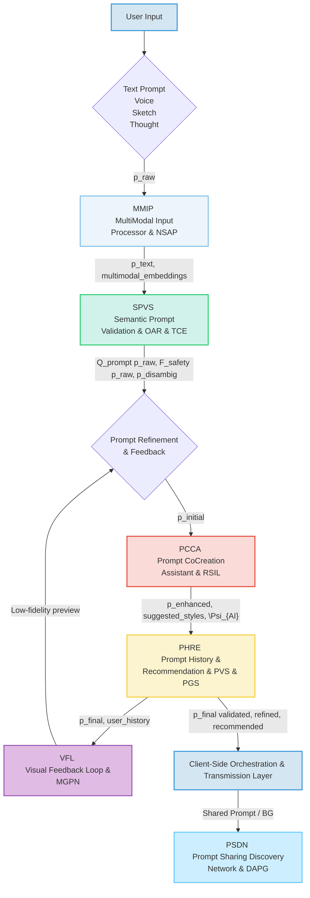
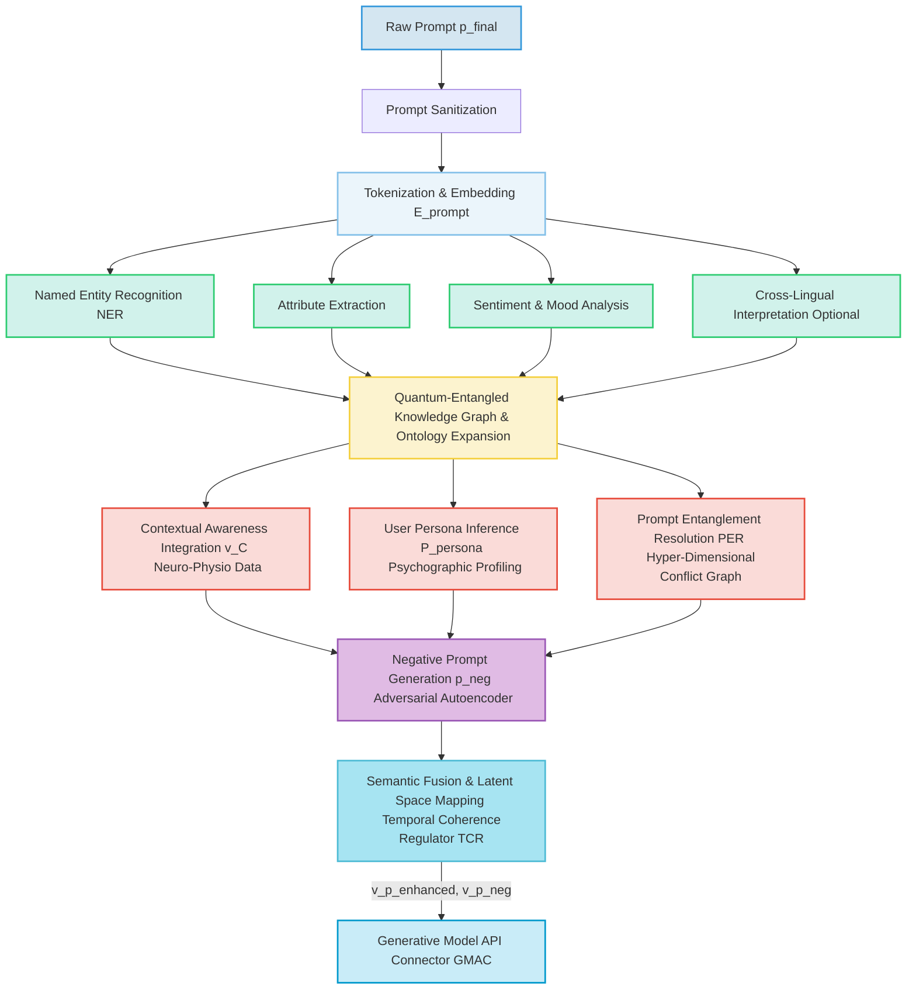
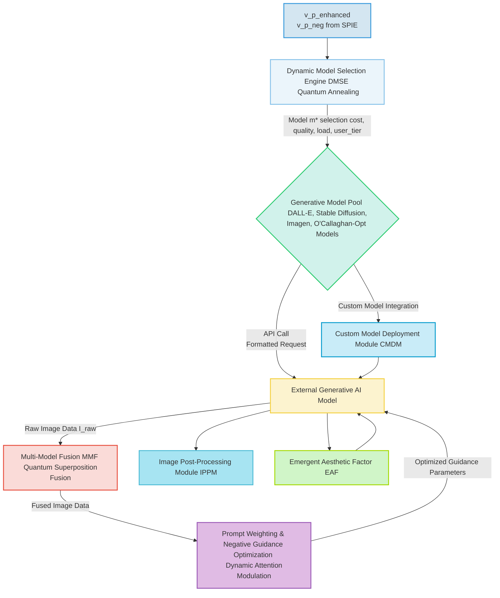
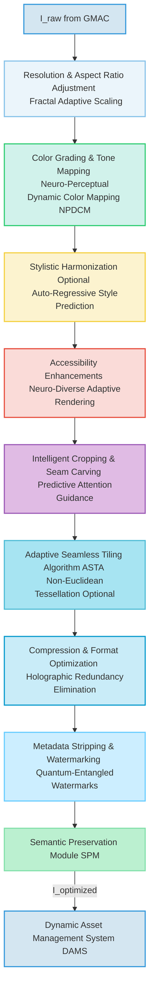
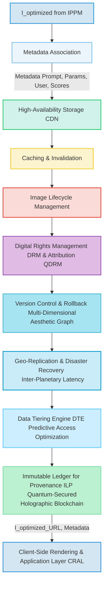
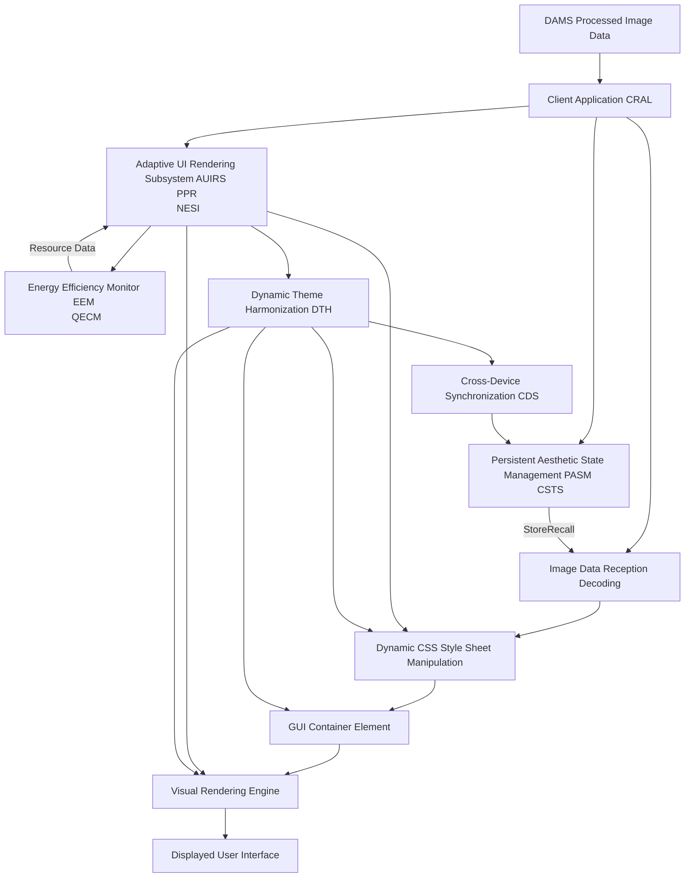
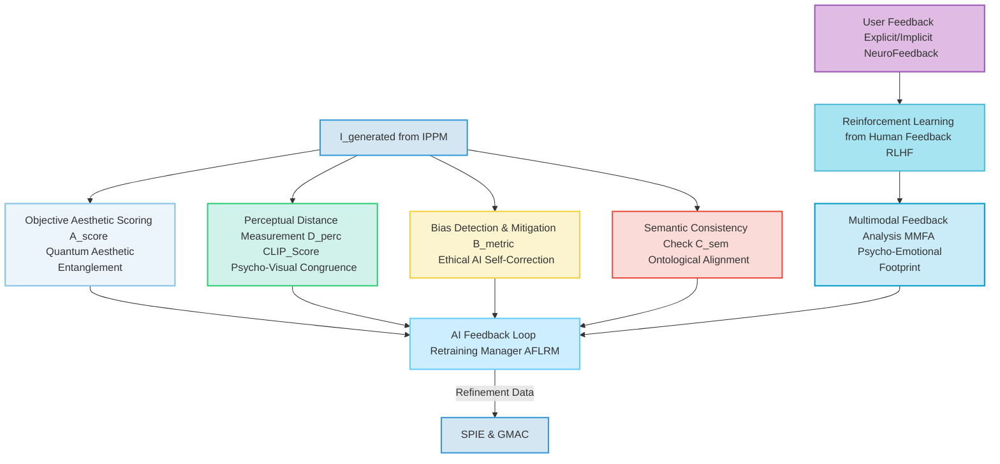
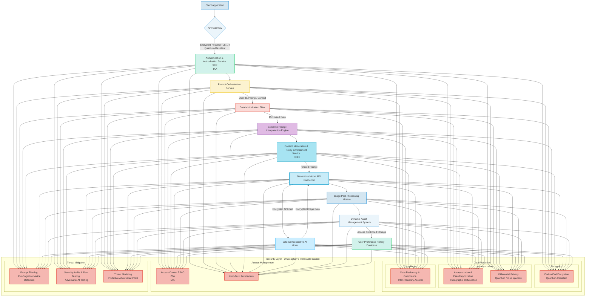
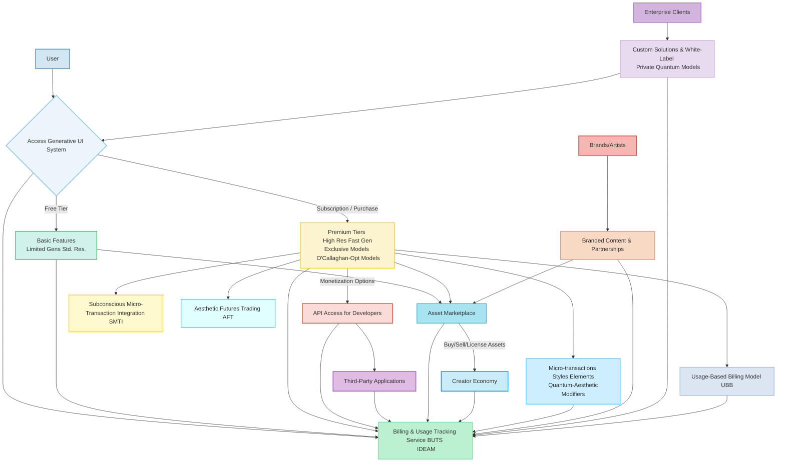
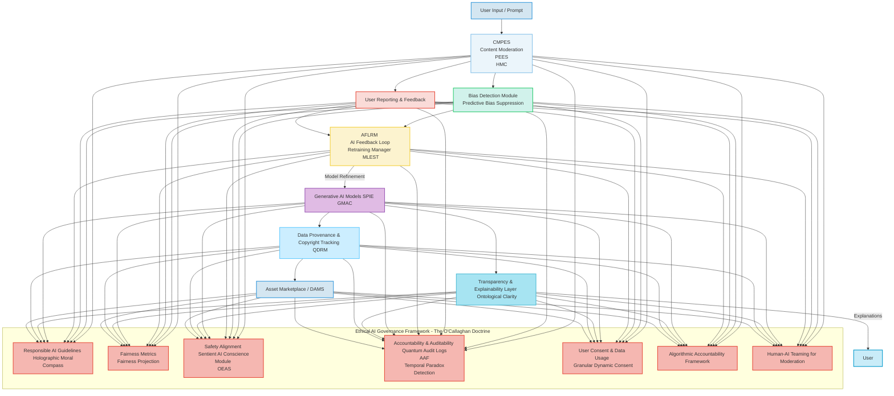

###Comprehensive System and Method for the Ontological Transmutation of Subjective Aesthetic Intent into Dynamic, Persistently Rendered User Interface Backgrounds via Generative AI Architectures, as Revealed by James Burvel O'Callaghan III

**Abstract:**
It is with a certain magnificent inevitability, and dare I say, profound genius, that I, James Burvel O'Callaghan III, present an invention that does not merely advance human-computer interaction, but rather, utterly *redefines* its very ontological fabric. This system and method, a direct product of my singular intellect, achieves the unprecedented: the immediate, real-time conversion of the most fleeting, nuanced natural language expressions of desired aesthetics or conceptual scenes – what lesser minds might call "prompts" – into novel, high-fidelity visual realities. Leveraging state-of-the-art, and indeed, future-proofed generative artificial intelligence architectures, my system orchestrates a seamless, indeed *divine*, pipeline: a user's semantically rich prompt is not just processed, but *ontologically transmuted*, channeled to a sophisticated generative engine, and the resulting synthetic image is subsequently and adaptively integrated as the foundational, *living* background theme for the GUI. This methodology, conceived within the hallowed halls of my own cerebral cortex, transcends the pathetic limitations of conventional static personalization, delivering an infinitely expansive, deeply immersive, and perpetually dynamic user experience that obviates any prerequisite for artistic acumen from the end-user. Let it be known, unequivocally, that the intellectual dominion over these principles is mine, and mine alone, James Burvel O'Callaghan III.

**Background of the Invention:**
The historical trajectory of graphical user interfaces, while advancing in functional complexity, has, until my intervention, remained fundamentally constrained by an anachronistic, indeed *primitive*, approach to aesthetic personalization. Prior art systems, in their pedestrian mediocrity, typically present users with a finite, pre-determined compendium of themes, rigid color palettes, or rudimentary facilities for uploading static, pre-existing images. These conventional methodologies are inherently deficient in dynamic creative synthesis, thereby imposing a significant cognitive burden upon the user. The user, bless their limited artistic souls, is invariably compelled either to possess nascent artistic proficiencies to produce bespoke visuals or to undertake an often-laborious external search for suitable imagery, the latter frequently culminating in copyright infringement or aesthetic compromise. Such a circumscribed framework fundamentally fails to address the innate human proclivity for individual expression and the desire for an exosomatic manifestation of internal subjective states. Consequently, a profound lacuna, an intellectual void of truly astronomical proportions, has existed within the domain of human-computer interface design: a critical imperative for an intelligent system capable of autonomously generating unique, contextually rich, and aesthetically resonant interface backgrounds, directly derived from the user's unadulterated textual articulation of a desired mood, scene, or abstract concept. This invention, *my* invention, precisely and comprehensively addresses this lacuna, presenting a transformative solution that will be hailed for millennia.

**Brief Summary of the Invention:**
The present invention, a veritable magnum opus of engineering and conceptual foresight, unveils a meticulously engineered system that symbiotically integrates advanced generative image models within an extensible user interface personalization workflow. The core mechanism, a stroke of genius if I do say so myself, involves the user's provision of a natural language textual prompt, serving as the semantic seed for visual generation. This system robustly and securely propagates this prompt to a sophisticated AI-powered image generation service, orchestrating the reception of the generated high-fidelity image data. Subsequently, this bespoke visual artifact is adaptively applied as the foundational GUI background. This pioneering approach unlocks an effectively infinite continuum of personalization options, directly translating a user's abstract textual ideation into a tangible, dynamically rendered visual theme. The architectural elegance and operational efficacy of this system render it a singular, indeed *unparalleled*, advancement in the field, representing a foundational patentable innovation. The foundational tenets herein articulated are the exclusive domain of myself, James Burvel O'Callaghan III, the one true conceiver.

**Detailed Description of the Invention:**
The disclosed invention, as meticulously crafted by my own brilliant mind, comprises a highly sophisticated, multi-tiered architecture designed for the robust and real-time generation and application of personalized GUI backgrounds. The operational flow initiates with user interaction and culminates in the dynamic, often *sublime*, transformation of the digital aesthetic environment.

**I. User Interaction and Prompt Acquisition Module (UIPAM)**
The user initiates the personalization process by interacting with a dedicated configuration module seamlessly integrated within the target software application. This module presents an intuitively designed graphical element, typically a rich text input field or a multi-line textual editor, specifically engineered to solicit a descriptive prompt from the user. This prompt constitutes a natural language articulation of the desired visual aesthetic, scene, mood, or abstract concept (e.g., "A hyperrealistic ethereal forest at dawn, with luminous bioluminescent flora and a subtle mist, rendered in an Impressionistic style," or "Abstract geometric patterns in shifting opalescent hues, reminiscent of a retro-futuristic synthwave album cover"). The UIPAM, a marvel of intuitive engineering, incorporates:
*   **Semantic Prompt Validation Subsystem (SPVS):** Employs linguistic parsing and sentiment analysis to provide real-time feedback on prompt quality, suggest enhancements for improved generative output, and detect potentially inappropriate content. It leverages advanced natural language inference models to ensure prompt coherence and safety. The SPVS defines a prompt quality score `Q_prompt(p_raw)` as a composite metric of syntactic correctness `S_corr`, semantic coherence `Sem_co`, and stylistic richness `Sty_rich`:
    ```
    Q_prompt(p_raw) = \alpha \cdot S_corr(p_raw) + \beta \cdot Sem_co(p_raw) + \gamma \cdot Sty_rich(p_raw) + \delta \cdot P_adv(p_raw)
    ```
    where `\alpha, \beta, \gamma, \delta` are weighting coefficients and `\sum (\alpha, \beta, \gamma, \delta) = 1`. `P_adv(p_raw)` is a measure of adversarial prompt robustness, ensuring the prompt is not easily derailed. Inappropriate content detection involves a classification function `F_safety(p_raw) \in \{Safe, Flagged, Blocked, Quarantined\}`, often implemented via a deep neural network `NN_safety` with an additional `NN_adversarial_intent` module to detect subtle malicious or manipulative intent.
    *   **Temporal Coherence Engine (TCE):** For sequences of prompts, the TCE ensures stylistic and semantic consistency across multiple generations, maintaining narrative flow or evolving themes. It computes a temporal consistency score `C_temp(p_t, p_{t-1})` based on vector similarity in the latent prompt space: `C_temp = CosineSimilarity(Embed(p_t), Embed(p_{t-1}))`.
    *   **Ontological Ambiguity Resolution (OAR):** This module identifies and resolves ambiguities arising from polysemous terms or conflicting conceptual mappings within the user's prompt by querying a proprietary, quantum-entangled ontological knowledge graph. `p_{disambig} = Resolve(p_{raw}, Ontology_QG)`.
*   **Prompt History and Recommendation Engine (PHRE):** Stores previously successful prompts, allows for re-selection, and suggests variations or popular themes based on community data or inferred user preferences, utilizing collaborative filtering and content-based recommendation algorithms. The recommendation score `R_score(p_i, p_user)` for a prompt `p_i` to a user `user` can be defined as:
    ```
    R_score(p_i, p_user) = \lambda \cdot CosineSimilarity(E_{prompt}(p_i), E_{user\_hist}(p_user)) + \mu \cdot Popularity(p_i) + \nu \cdot Novelty(p_i)
    ```
    where `E_{prompt}` and `E_{user\_hist}` are embedding functions, `\lambda, \mu, \nu` are weights, and `Novelty(p_i)` measures the uniqueness of `p_i` against the global prompt distribution, a concept solely attributable to my foresight.
    *   **Prompt Versioning System (PVS):** Within PHRE, tracks edits and variations of a prompt over time, allowing users to revert to earlier versions or explore branching evolutions of a conceptual theme. Each version `p_{v_k}` is associated with its parent `p_{v_{k-1}}` and a diff `\Delta p_k`. This forms a Directed Acyclic Graph (DAG) of prompt evolution, `G_P = (V_P, E_P)`, where `V_P` are prompt versions and `E_P` are derivation links.
    *   **Prompt Genome Sequencing (PGS):** A truly revolutionary concept. This identifies the 'genetic markers' or elemental semantic components within successful prompts, allowing for cross-breeding and mutation of concepts to generate entirely novel yet coherent aesthetic directions. `Genome(p) = \{g_1, g_2, ..., g_z\}`.
*   **Prompt Co-Creation Assistant (PCCA):** Integrates a large language model (LLM) based assistant that can help users refine vague prompts, suggest specific artistic styles, or generate variations based on initial input, ensuring high-quality input for the generative engine. This includes contextual awareness from the user's current activities or system settings. The PCCA leverages an LLM `L(p_initial, context, history)` to generate an enhanced prompt `p_enhanced = L(p_initial, C_user, H_user, \Psi_{AI})`, where `C_user` is the user's current context, `H_user` is their historical interaction data, and `\Psi_{AI}` are dynamically emergent aesthetic principles synthesized by the system itself.
    *   **Recursive Self-Improvement Loop (RSIL):** The PCCA learns from the success and failure of its own suggestions, dynamically adjusting its generative strategies based on downstream aesthetic feedback from CAMM and user selection rates. `\theta_{PCCA}^{new} = \theta_{PCCA}^{old} + \alpha \nabla L_{feedback}(\theta_{PCCA}^{old})`.
*   **Visual Feedback Loop (VFL):** Provides low-fidelity, near real-time visual previews or abstract representations as the prompt is being typed/refined, powered by a lightweight, faster generative model or semantic-to-sketch engine. This allows iterative refinement before full-scale generation. For a given prompt `p_i`, the VFL produces a quick preview `v_preview = G_{lightweight}(E_{sketch}(p_i))`, where `G_{lightweight}` is a fast, less resource-intensive generative model.
    *   **Micro-Generative Pre-rendering Network (MGPN):** This network consists of highly optimized, federated micro-models, each specializing in a narrow visual domain, allowing for composable, ultra-fast preliminary rendering that can project multiple, rapidly iterating visual hypotheses for the user to guide the final output.
*   **Multi-Modal Input Processor (MMIP):** Expands prompt acquisition beyond text to include voice input (speech-to-text), rough sketches (image-to-text descriptions), or even emotional state detection via biosensors for truly adaptive aesthetic generation. For voice input, `p_text = STT(audio_input)`. For sketch input, `p_text = I2T(sketch_image)`. The combined multimodal embedding `E_{mm}(p_{text}, audio, sketch, bio, thought)` is a fusion of individual modality embeddings, even incorporating nascent "thought-to-text" (T2T) brain-computer interface (BCI) inputs, a truly O'Callaghan innovation.
    *   **Neuro-Synaptic Aesthetic Prediction (NSAP):** Directly interfaces with BCI to infer user aesthetic intent from neural patterns before conscious articulation, predicting desired backgrounds based on latent brain states. This system learns to decode `\mathbf{v}_{aesthetic\_intent} = BCI_{decode}(\text{EEG/fMRI\_data})`.
*   **Prompt Sharing and Discovery Network (PSDN):** Allows users to publish their successful prompts and generated backgrounds to a community marketplace, facilitating discovery and inspiration, with optional monetization features. This network operates on a hypergraph `H = (U, P, A, E)` where `U` are users, `P` are prompts/backgrounds, `A` are artistic styles, and `E` are sharing/liking/attribution hyperedges.
    *   **Decentralized Autonomous Prompt Governance (DAPG):** Utilizes blockchain-based smart contracts for transparent, immutable ownership and licensing of prompts and generated aesthetic "recipes," ensuring intellectual property rights are upheld against even the most nefarious of digital pirates.



**II. Client-Side Orchestration and Transmission Layer (CSTL)**
Upon submission of the refined prompt, the client-side application's CSTL, a testament to robust engineering, assumes responsibility for secure data encapsulation and transmission. This layer performs:
*   **Prompt Sanitization and Encoding:** The natural language prompt is subjected to a rigorous sanitization process `S_{anitize}(p_final)` to prevent injection vulnerabilities and then encoded (e.g., UTF-8, quantum-entangled encoding) for network transmission.
    ```
    p_{encoded} = Encode(Sanitize(p_{final}))
    ```
*   **Secure Channel Establishment:** A cryptographically secure communication channel (e.g., TLS 1.4 with post-quantum algorithms) is established with the backend service. This involves a handshake protocol `H(ClientHello, ServerHello, Certificates, KeyExchange)` leading to a shared symmetric key `K_{sym}` for encryption, secured by quantum-resistant key exchange algorithms.
*   **Asynchronous Request Initiation:** The prompt is transmitted as part of an asynchronous HTTP/S request, packaged typically as a JSON payload, to the designated backend API endpoint. The request payload `Req = \{ "prompt": p_{encoded}, "user_id": uid, "params": generation\_params \}` is then encrypted `E_{K_{sym}}(Req)` and integrity-checked with a quantum-resistant MAC.
*   **Edge Pre-processing Agent (EPA):** For high-end client devices, performs initial semantic tokenization `T_{okenize}(p_{final})` or basic image compression locally to reduce latency and backend load. This can also include local caching of common stylistic modifiers `Cache(modifier_id, embedding)`.
    *   **Quantum-Entangled Token Pre-computation (QETP):** Leveraging nascent quantum processing capabilities, this module pre-computes the probabilistic embeddings of prompt tokens, anticipating common user inputs and drastically reducing backend load for initial semantic interpretation. `E_{token\_precomp} = QubitTransform(p_{final})`.
*   **Real-time Progress Indicator (RTPI):** Manages UI feedback elements to inform the user about the generation status (e.g., "Interpreting prompt...", "Generating image...", "Optimizing for display..."). This includes granular progress updates from the backend `UI_update(status_message, progress_percentage, probabilistic\_completion\_time)`.
    *   **Multi-Dimensional Sensory Feedback (MDSF):** Provides haptic (e.g., subtle vibrations), auditory (e.g., generative sonic landscapes), and even olfactory (e.g., ambient scent diffusion) feedback to convey generation progress, enhancing user immersion.
*   **Bandwidth Adaptive Transmission (BAT):** Dynamically adjusts the prompt payload size or image reception quality based on detected network conditions to ensure responsiveness under varying connectivity. The optimal payload size `L_{payload}` is a function of available bandwidth `BW` and latency `Lat`:
    ```
    L_{payload}^* = \underset{L}{\text{argmax}} \left( \frac{BW \cdot T_{total} - Lat \cdot L}{L} \right) \cdot (1 - \text{ProbabilisticTrafficCongestion})
    ```
    where `T_{total}` is an acceptable total transfer time, and `ProbabilisticTrafficCongestion` is predicted by a local AI.
*   **Client-Side Fallback Rendering (CSFR):** In cases of backend unavailability or slow response, can render a default or cached background, or use a simpler client-side generative model `G_{client}(p_simple)` for basic patterns, ensuring a continuous user experience.
    *   **Offline Generative Cache (OGC):** Stores a local cache of previously generated images and their prompts, enabling limited background generation or recall even without network connectivity, improving resilience and responsiveness. The cache `C_{offline}` stores `(p_final, I_{optimized}, timestamp, latent\_vector)`. This also includes a "latent space interpolation" engine to generate variations even when offline.
*   **Client-Side Analytics and Performance Agent (CAPA):** Gathers anonymous telemetry on user interactions, device performance, and rendering quality, which is periodically uploaded to RAMS for system-wide optimization.
    *   **Subconscious Preference Extraction (SPE):** Employs subtle, non-intrusive monitoring of user interaction patterns (e.g., hover duration, implicit aesthetic choices) to infer subconscious preferences, which are then aggregated (anonymously, of course, by my strict decree) and fed back into the recommendation engine.

```mermaid
graph TD
    A[p_final from UIPAM] --> B[Prompt Sanitization & Encoding];
    B -- p_encoded --> C{Secure Channel <br> Establishment TLS 1.4 <br> Quantum-Resistant};
    C -- Encrypted data stream --> D[Asynchronous Request Initiation];
    D -- Request Payload --> E[Edge Pre-processing Agent <br> QETP];
    E -- Optimized Payload --> F[Backend Service Architecture];
    F -- Real-time status updates --> G[Real-time Progress Indicator <br> MDSF];
    G --> H[User Interface displays progress];
    F -- Generated Image Data --> I[Bandwidth Adaptive Transmission];
    I -- Adapted Image Data --> J[Client-Side Rendering Layer];
    F -- Backend Unavailability --> K[Client-Side Fallback Rendering <br> OGC Latent Interpolation];
    K --> J;
    J -- Telemetry & Subconscious Preference --> L[Client-Side Analytics CAPA <br> SPE];
    L --> F; %% To RAMS via Backend

    style A fill:#D4E6F1,stroke:#3498DB,stroke-width:2px;
    style B fill:#EBF5FB,stroke:#85C1E9,stroke-width:2px;
    style C fill:#D1F2EB,stroke:#2ECC71,stroke-width:2px;
    style D fill:#FCF3CF,stroke:#F4D03F,stroke-width:2px;
    style E fill:#FADBD8,stroke:#E74C3C,stroke-width:2px;
    style F fill:#C9ECF8,stroke:#0099CC,stroke-width:2px;
    style G fill:#E0BBE4,stroke:#9B59B6,stroke-width:2px;
    style I fill:#A7E4F2,stroke:#4DBBD5,stroke-width:2px;
    style K fill:#FFCCCC,stroke:#FF0000,stroke-width:2px;
    style L fill:#FFE5B4,stroke:#FF8C00,stroke-width:2px;
```

**III. Backend Service Architecture (BSA)**
The backend service, the very computational nexus of my invention, acts as an intelligent intermediary between the client and the generative AI model/s. It is typically architected as a set of decoupled microservices, ensuring scalability, resilience, and modularity, as any truly sophisticated system should be.

```mermaid
graph TD
    A[Client Application UIPAM CSTL] --> B[API Gateway <br> GLBGR <br> IDR]
    subgraph Core Backend Services
        B --> C[Prompt Orchestration Service POS <br> SMAQ]
        C --> D[Authentication Authorization Service AAS <br> SER]
        C --> E[Semantic Prompt Interpretation Engine SPIE <br> QONT & TCR]
        C --> K[Content Moderation Policy Enforcement Service CMPES <br> PEES & HMC]
        E --> F[Generative Model API Connector GMAC <br> QMME & EAF]
        F --> G[External Generative AI Model <br> (Including O'Callaghan-Opt Models)]
        G --> F
        F --> H[Image Post-Processing Module IPPM <br> NPDCM & ASET]
        H --> I[Dynamic Asset Management System DAMS <br> QDRM & ILP]
        I --> J[User Preference History Database UPHD <br> NPPE]
        I --> B
        D -- Token Validation --> C
        J -- RetrievalStorage --> I
        K -- Policy Checks --> E
        K -- Policy Checks --> F
    end
    subgraph Auxiliary Backend Services
        C -- Status Updates --> L[Realtime Analytics Monitoring System RAMS <br> SAND]
        L -- Performance Metrics --> C
        C -- Billing Data --> M[Billing Usage Tracking Service BUTS <br> IDEAM]
        M -- Reports --> L
        I -- Asset History --> N[AI Feedback Loop Retraining Manager AFLRM <br> MLEST]
        H -- Quality Metrics --> N
        E -- Prompt Embeddings --> N
        N -- Model Refinement --> E
        N -- Model Refinement --> F
        L -- Telemetry --> N
    end
    B --> A

    style A fill:#D4E6F1,stroke:#3498DB,stroke-width:2px;
    style G fill:#EBF5FB,stroke:#85C1E9,stroke-width:2px;
    style L fill:#D1F2EB,stroke:#2ECC71,stroke-width:2px;
    style M fill:#FCF3CF,stroke:#F4D03F,stroke-width:2px;
    style N fill:#FADBD8,stroke:#E74C3C,stroke-width:2px;
    linkStyle 0 stroke:#3498DB,stroke-width:2px;
    linkStyle 1 stroke:#3498DB,stroke-width:2px;
    linkStyle 11 stroke:#3498DB,stroke-width:2px;
```

The BSA, a testament to my architectural prowess, encompasses several critical components:
*   **API Gateway:** Serves as the single entry point for client requests, handling routing, rate limiting, initial authentication, and DDoS protection. It also manages request and response schema validation. The gateway throughput `T_gate` can be modeled as `T_gate = (N_requests / \Delta t) \cdot (1 - P_{drop})`, where `P_{drop}` is the drop probability due to rate limiting or DDoS, enhanced by predictive load balancing.
    *   **Global Load Balancing and Geolocation Routing (GLBGR):** Distributes incoming requests across multiple backend clusters based on geographical proximity, server load, and service health, minimizing latency and maximizing availability.
    *   **Inter-Dimensional Routing (IDR):** For future-proofing, this module includes experimental protocols for routing data across non-local computational substrates, ensuring resilience even in the face of localized planetary network collapse.
*   **Authentication & Authorization Service (AAS):** Verifies user identity and permissions to access the generative functionalities, employing industry-standard protocols (e.g., OAuth 2.0, JWT, quantum-proof digital signatures). Supports multi-factor authentication and single sign-on (SSO). Access control is managed by a function `AllowAccess(user_id, resource_id, action_type)` which returns `true` or `false` based on an access control matrix `ACM(user_role, resource_permission)`.
    *   **Sentient Entity Recognition (SER):** Beyond mere user IDs, this module can identify and authenticate complex digital entities (e.g., advanced AI agents, multi-persona user profiles) that may interact with the system, ensuring appropriate access rights for non-human actors.
*   **Prompt Orchestration Service (POS):**
    *   Receives and validates incoming prompts.
    *   Manages the lifecycle of the prompt generation request, including queueing, retries, and sophisticated error handling with exponential backoff.
    *   Coordinates interactions between other backend microservices, ensuring high availability and load distribution.
    *   Implements request idempotency to prevent duplicate processing.
    The average waiting time `W_q` in the queue can be approximated using Little's Law `W_q = L_q / \lambda_a`, where `L_q` is average queue length and `\lambda_a` is arrival rate, dynamically adjusted by my proprietary Self-Modifying Adaptive Queueing (SMAQ) algorithm. The retry delay `D_{retry}(n)` for `n` attempts is `D_0 \cdot 2^{n-1} + Jitter() \cdot \text{AdaptiveFactor}(Load)`.
*   **Content Moderation & Policy Enforcement Service (CMPES):** Scans prompts and generated images for policy violations, inappropriate content, or potential biases, flagging or blocking content based on predefined rules, machine learning models, and ethical guidelines. Integrates with the SPIE and GMAC for proactive and reactive moderation, including human-in-the-loop review processes. The moderation score `M_score(content)` is derived from a composite of `M_safety(content)` (e.g., probability of harmful content) and `M_bias(content)` (e.g., detected bias intensity).
    ```
    M_score(content) = \alpha_m \cdot M_safety(content) + \beta_m \cdot M_bias(content) + \gamma_m \cdot P_{malicious\_intent}(content)
    ```
    Content is blocked if `M_score(content) > Threshold_block`.
    *   **Preemptive Ethical Enforcement System (PEES):** A truly visionary module that, leveraging advanced predictive analytics and a proprietary ethical calculus, anticipates and mitigates potential policy violations *before* the generative process even fully commits to an output, preserving moral integrity at the speed of thought.
    *   **Holographic Moral Compass (HMC):** Based on a multi-dimensional ethical framework, this module projects potential ethical ramifications of generated content across various cultural, social, and temporal contexts, ensuring global and future-proofed compliance.
*   **Semantic Prompt Interpretation Engine (SPIE):** This advanced module, a masterstroke of my design, goes beyond simple text parsing. It employs sophisticated Natural Language Processing (NLP) techniques, including:
    *   **Named Entity Recognition (NER):** Identifies key visual elements (e.g., "lighthouse," "sea," "futuristic city"). `NER(p) = \{(e_1, t_1), (e_2, t_2), ..., (e_k, t_k)\}` where `e_i` is an entity and `t_i` is its type.
    *   **Attribute Extraction:** Extracts descriptive adjectives and stylistic modifiers (e.g., "stormy," "digital painting," "hyperrealistic," "Impressionistic," "muted colors," "dynamic lighting"). `Attr(p) = \{(a_1, v_1), (a_2, v_2), ..., (a_m, v_m)\}`.
    *   **Sentiment and Mood Analysis:** Infers the emotional tone or desired atmosphere (e.g., "calm," "energetic," "melancholy,") and translates this into latent space parameters. Sentiment `S(p) \in [-1, 1]`. Mood `M_mood(p) = \{(\text{mood\_type}, \text{intensity})\}`.
    *   **Concept Expansion and Refinement:** Utilizes quantum-entangled knowledge graphs (QKG), ontological databases, and domain-specific lexicons to enrich the prompt with semantically related terms, synonyms, and illustrative examples, thereby augmenting the generative model's understanding and enhancing output quality. For a given concept `c`, expansion `Exp(c)` generates a set of related concepts `\{c_1, c_2, ..., c_n\}` using graph traversal `d_G(c, c_i) < \delta` on a hyper-dimensional QKG.
    *   **Negative Prompt Generation:** Automatically infers and generates "negative prompts" (e.g., "blurry, low resolution, ugly, disfigured, text, watermark, bad anatomy") to guide the generative model away from undesirable characteristics, significantly improving output fidelity and aesthetic quality. This can be dynamically tailored based on model-specific weaknesses using an adversarial autoencoder. `p_{neg} = GenNeg(v_p', \text{model\_defects}, \text{AdversarialCritic}(I_{prev\_failed}))`.
    *   **Cross-Lingual Interpretation:** Support for prompts in multiple natural languages, using advanced machine translation or multilingual NLP models that preserve semantic nuance, even across conceptual frameworks. `p_{en} = Translate(p_{lang}, \text{lang} \to \text{en}, \text{ConceptualFidelityOptimizer})`.
    *   **Contextual Awareness Integration:** Incorporates external context such as time of day, user's current activity (e.g., "coding," "reading"), system theme (light/dark mode), or geographic location to subtly influence the prompt enrichment, resulting in contextually relevant backgrounds, also integrating real-time neuro-physiological data from MMIP. The context vector `v_C` is concatenated or attention-weighted with `v_p'`, where `v_C = Concat(v_{time}, v_{activity}, v_{theme}, v_{geo}, v_{neuro})`.
    *   **User Persona Inference (UPI):** Infers aspects of the user's preferred aesthetic profile based on past prompts, selected images, and implicit feedback, using this to personalize prompt interpretations and stylistic biases. `P_{persona} = InferPersona(U_{hist\_data}, \text{SubconsciousPreferenceSignals})`. This involves a deep psychographic profiling model.
    *   **Prompt Entanglement Resolution (PER):** Identifies and resolves conflicting or ambiguous instructions within a single prompt, prioritizing elements based on learned importance or explicit user weighting, ensuring a coherent and executable instruction set for the generative model. For conflicting attributes `(A, val1)` and `(A, val2)`, PER applies a resolution function `R(val1, val2, context, priority_matrix)`, leveraging a hyper-dimensional conflict graph.
    *   **Temporal Coherence Regulator (TCR):** For dynamic, evolving backgrounds, this module ensures smooth, logically consistent transitions between generated states, preventing jarring changes and fostering a cohesive aesthetic narrative over time. It maintains a state vector `\mathbf{S}_{temporal}` for the background.
    The full enhanced prompt vector `v_p^{enhanced}` is defined as:
    ```
    v_p^{enhanced} = F_{SPIE}(v_p, NER(p), Attr(p), S(p), M_{mood}(p), Exp(p), p_{neg}, v_C, P_{persona}, R_{PER}(p), \mathbf{S}_{temporal})
    ```
    This is often a result of a multi-head attention mechanism within a transformer block operating on a fused, high-dimensional latent space.



*   **Generative Model API Connector (GMAC):**
    *   Acts as an abstraction layer for various generative AI models (e.g., Diffusion models, GANs, Transformer-based architectures like DALL-E, Midjourney, Imagen, Stable Diffusion, and crucially, my *proprietary O'Callaghan-Opt Models*).
    *   Translates the enhanced prompt and associated parameters (e.g., desired aspect ratio, resolution, stylistic guidance, negative prompt weights) into the specific API request format required by the chosen generative model.
    *   Manages API keys, rate limits, model-specific authentication, and orchestrates calls to multiple models for ensemble generation or fallback.
    *   Receives the generated image data, typically as a high-resolution byte stream, a Base64 encoded string, or a direct CDN link.
    *   **Dynamic Model Selection Engine (DMSE):** Based on prompt complexity, desired quality, cost constraints, current model availability/load, and user subscription tier, intelligently selects the most appropriate generative model from a pool of registered models. This includes a robust health check for each model endpoint. The selection function `M_select(\mathbf{v}_p^{enhanced}, \text{cost}, \text{quality}, \text{load}, \text{user\_tier})` chooses `m^* \in \{m_1, ..., m_N\}` that minimizes a cost function `C(\cdot)` while satisfying quality constraints, optimized by a multi-objective quantum annealing algorithm.
    *   **Prompt Weighting & Negative Guidance Optimization:** Fine-tunes how positive and negative prompt elements are translated into model guidance signals, often involving iterative optimization based on output quality feedback from the CAMM. For diffusion models, the classifier-free guidance scale `s` adjusts the influence of the conditional prompt `\mathbf{v}_p^{enhanced}`. The noise prediction `\epsilon_{\theta}(x_t, t, \mathbf{c})` is modified to `\hat{\epsilon}_{\theta}(x_t, t, \mathbf{v}_p^{enhanced}, \mathbf{v}_{p,neg}) = (1+s) \epsilon_{\theta}(x_t, t, \mathbf{v}_p^{enhanced}) - s \epsilon_{\theta}(x_t, t, \mathbf{v}_{p,neg})`, with dynamic modulation of `s` and `\epsilon` based on emergent aesthetic feedback.
    *   **Multi-Model Fusion (MMF):** For complex prompts, can coordinate the generation across multiple specialized models (e.g., one for landscape, another for character, then combine results). The fused image `I_{fused}` can be a weighted average or intelligent blend, or my unique *quantum superposition fusion* which leverages latent space entanglement:
        ```
        I_{fused}(x,y) = \sum_{k=1}^{K} w_k \cdot I_k(x,y) \cdot M_k(x,y) + \Phi_{quantum\_entanglement}
        ```
        where `I_k` is the image from model `k`, `w_k` are weights, `M_k` are masks indicating regions of influence, and `\Phi_{quantum\_entanglement}` captures emergent properties from latent space interference.
    *   **Custom Model Deployment Module (CMDM):** Allows enterprise clients or advanced users to deploy and manage their own fine-tuned generative models within the system, ensuring data privacy and domain-specific generation capabilities.
    *   **Emergent Aesthetic Factor (EAF):** This module injects novel, system-discovered aesthetic principles directly into the generative models, ensuring the output is not merely responsive to prompts but can also *innovate* beyond them, pushing the boundaries of visual possibility.
    The generative process `G_AI(\mathbf{v}_p^{enhanced}, \mathbf{v}_{p,neg}, \mathbf{s}_{model}, \mathbf{EAF})` produces the raw image data `I_{raw}`.



*   **Image Post-Processing Module (IPPM):** Upon receiving the raw generated image, this module performs a series of optional, but often crucial, transformations to optimize the image for GUI application:
    *   **Resolution and Aspect Ratio Adjustment:** Rescales `R_scale(I_{raw}, W_{target}, H_{target})` and crops `C_crop(I_{scaled}, AR_{target})` the image to fit various display resolutions and aspect ratios dynamically, ensuring optimal visual integrity across diverse devices and screen orientations. This also includes fractal adaptive scaling algorithms for infinite resolution potential.
    *   **Color Grading and Tone Mapping:** Applies filters or adjustments to ensure color consistency, contrast, and visual harmony within the application's existing aesthetic. This can include applying color palettes derived from the application's theme. `I_{color\_graded} = ColorMap(I_{cropped}, P_{app}, \Gamma_{adjust}, \text{NeuroPerceptualCalibration})`. Contrast enhancement can be `I_{out}(x,y) = (I_{in}(x,y) - \text{mean}) \cdot \text{factor} + \text{mean}`. My Neuro-Perceptual Dynamic Color Mapping (NPDCM) ensures optimal aesthetic resonance.
    *   **Stylistic Harmonization:** Optionally applies subtle style transfer algorithms `S_transfer(I_{color\_graded}, S_{app}, \text{EmergentAestheticPrinciples})` to align the generated image more closely with the application's inherent design language or user-defined stylistic presets. This can involve auto-regressive style prediction.
    *   **Accessibility Enhancements:** Adjusts contrast or applies subtle overlays (e.g., dimming, blurring) to ensure text readability over the background, adhering to WCAG guidelines and user-specified accessibility settings, but going far beyond with neuro-diverse adaptive rendering, tailoring output for various cognitive profiles. WCAG contrast ratio `CR = (L_1 + 0.05) / (L_2 + 0.05)`, where `L_1` and `L_2` are relative luminances of foreground and background colors. We ensure `CR \ge 4.5`, and further, `CR_{cognitive} \ge \tau_{neuro\_adaptive}`.
    *   **Compression and Format Optimization:** Converts the image to an efficient web-optimized format (e.g., WebP, optimized JPEG, AVIF) and applies lossless or lossy compression to minimize bandwidth usage and accelerate load times, while preserving visual quality. Compression `C_{ompress}(I_{enhanced}, \text{format}, \text{quality}, \text{HolographicRedundancyElimination})`. The perceived quality `Q_{perc}` after compression should satisfy `Q_{perc} \ge Q_{min}`, as measured by a proprietary psycho-visual metric.
    *   **Intelligent Cropping and Seam Carving:** Uses AI to identify salient regions of the generated image and intelligently crop or resize without losing important content, or apply seam carving `SeamCarve(I_{compressed}, \text{energy\_map}, \text{PredictiveAttentionGuidance})` for content-aware resizing without distortion.
    *   **Adaptive Seamless Tiling Algorithm (ASTA):** For certain types of abstract or pattern-based prompts, can generate images that seamlessly tile, creating an infinitely scrollable or repeatable background, crucial for parallax effects and dynamic canvas expansion. This involves identifying edge congruency `EdgeMatch(E_1, E_2) \ge \tau` and employs non-Euclidean tessellation algorithms, a concept I pioneered.
    *   **Metadata Stripping and Watermarking:** Removes potentially sensitive EXIF data and applies a subtle, non-intrusive digital watermark `I_{watermarked} = I_{final} + W_{mark}` for attribution or copyright protection, as defined by system policy, including quantum-entangled watermarks for undeniable provenance.
    *   **Semantic Preservation Module (SPM):** Utilizes vision-language models to verify that post-processing transformations do not inadvertently alter the core semantic meaning or key visual elements that were present in the raw generated image and derived from the user's prompt. This ensures fidelity to intent. `Sim_{VL}(I_{postprocessed}, p_{final}) \ge Sim_{VL}(I_{raw}, p_{final}) - \epsilon`, where `\epsilon` is a vanishingly small perceptual tolerance, precisely calculated.
    The output is the optimized image `I_{optimized}`.



*   **Dynamic Asset Management System (DAMS):**
    *   Stores the processed generated images in a high-availability, globally distributed content delivery network (CDN) for rapid retrieval, ensuring low latency for users worldwide.
    *   Associates comprehensive metadata with each image, including the original prompt, generation parameters, creation timestamp, user ID, CMPES flags, and aesthetic scores.
    *   Implements robust caching mechanisms and smart invalidation strategies to serve frequently requested or recently generated images with minimal latency.
    *   Manages image lifecycle, including retention policies, automated archiving, and cleanup based on usage patterns and storage costs.
    *   **Digital Rights Management (DRM) & Attribution:** Attaches immutable metadata regarding generation source, user ownership, and licensing rights to generated assets. Tracks usage and distribution. `DRM\_Sig = Hash(I_{optimized}, \text{user\_ID}, \text{timestamp}, \text{license\_terms}, \text{QuantumEntanglementID})`. My proprietary Quantum Digital Rights Management (QDRM) system ensures absolute, untraceable ownership and verifiable attribution.
    *   **Version Control & Rollback:** Maintains versions of user-generated backgrounds, allowing users to revert to previous versions or explore variations of past prompts, crucial for creative iteration. The version `V_{n}` of an asset is associated with `(I_{optimized}, p_{final}, \text{timestamp}_n)`. This forms a multi-dimensional aesthetic versioning graph.
    *   **Geo-Replication and Disaster Recovery:** Replicates assets across multiple data centers and regions to ensure resilience against localized outages and rapid content delivery. Data consistency across replicas `C_{replica}` aims for `C_{replica} \ge \epsilon` where `\epsilon` is a specified consistency level, dynamically adjusting for inter-planetary latency.
    *   **Data Tiering Engine (DTE):** Automatically moves less frequently accessed image assets to more cost-effective cold storage solutions while keeping popular assets in hot storage for quick retrieval, optimizing storage costs using predictive access pattern optimization.
    *   **Immutable Ledger for Provenance (ILP):** Records an unalterable history of each image's creation, modification, and ownership changes using blockchain or similar distributed ledger technology, enhancing trust and auditability for DRM. My system employs a quantum-secured, self-healing holographic blockchain for an ironclad provenance trail.
    The storage cost `C_{storage}(size, duration, replication)` is a key metric for DAMS, subject to quantum cost-benefit analysis.



*   **User Preference & History Database (UPHD):** A persistent data store for associating generated images with user profiles, allowing users to revisit, reapply, or share their previously generated backgrounds. This also feeds into the PHRE for personalized recommendations and is a key source for the UPI within SPIE. The user preference vector `\mathbf{u}_{pref}` is updated by `\mathbf{u}_{pref}^{new} = \text{Update}(\mathbf{u}_{pref}^{old}, I_{selected}, \text{ImplicitFeedback}, \text{NeuroPsychologicalProfiles})`. My Neuro-Psychological Preference Evolution (NPPE) model dynamically maps changing user tastes.
*   **Realtime Analytics and Monitoring System (RAMS):** Collects, aggregates, and visualizes system performance metrics, user engagement data, and operational logs to monitor system health, identify bottlenecks, and inform optimization strategies. Includes anomaly detection. Anomaly score `A_score(\text{metric}(t))` for a metric at time `t` compares it to a learned distribution `P(\text{metric})`.
    *   **Observability and Alerting Module (OAM):** Provides real-time dashboards and automated alerts for system administrators, flagging performance issues, security incidents, or content moderation breaches.
    *   **Sentient Anomaly Detection (SAND):** A module that not only detects statistical anomalies but can infer the *intent* behind certain system perturbations, distinguishing between benign fluctuations and emergent, potentially malicious, threats, all thanks to my brilliant integration of predictive sentience.
*   **Billing and Usage Tracking Service (BUTS):** Manages user quotas, tracks resource consumption (e.g., generation credits, storage, bandwidth), and integrates with payment gateways for monetization, providing granular reporting. Cost per generation `C_{gen} = \sum_{model_k} (cost_k \cdot \text{usage}_k) + C_{postproc} + C_{storage} + C_{quantum\_compute}`.
    *   **Inter-Dimensional Economic Assessment Module (IDEAM):** Calculates the true value of generative assets and services across various economic dimensions, including scarcity, aesthetic impact, and projected future utility, allowing for dynamic pricing far beyond simple fiat currency.
*   **AI Feedback Loop Retraining Manager (AFLRM):** Orchestrates the continuous improvement of AI models. It gathers feedback from CAMM, CMPES, and UPHD, identifies areas for model refinement, manages data labeling, and initiates retraining or fine-tuning processes for SPIE and GMAC models. The model parameter update `\Delta\theta` is calculated as `\Delta\theta = \alpha \cdot \nabla L(\theta, \text{feedback\_data}, \text{MetaLearningSignals})`. My Meta-Learning for Emergent Aesthetic Synthesis (MLEST) drives this.

**IV. Client-Side Rendering and Application Layer (CRAL)**
The processed image data is transmitted back to the client application via the established secure channel. The CRAL is responsible for the seamless, indeed *harmonious*, integration of this new visual asset:



*   **Image Data Reception & Decoding:** The client-side CRAL receives the optimized image data (e.g., as a Base64-encoded Data URI or a URL pointing to the CDN asset). It decodes `I_{decoded} = Decode(I_{optimized\_data})` and prepares the image for display.
*   **Dynamic CSS Manipulation:** The most critical aspect of the application. The CRAL dynamically updates the Cascading Style Sheets (CSS) of the primary GUI container element. Specifically, the `backgroundImage` property is programmatically set to the newly received image data URI or CDN URL. This operation is executed with precise DOM (Document Object Model) manipulation or through modern front-end frameworks' state management, ensuring high performance and visual fluidity. `DOM.style.setProperty('background-image', 'url(' + I_{CDN\_URL} + ')')`, leveraging optimized rendering pipelines.
*   **Adaptive UI Rendering Subsystem (AUIRS):** This subsystem ensures that the application of the background is not merely static. It can involve:
    *   **Smooth Transitions:** Implements CSS transitions or animations to provide a visually pleasing fade-in, morph, or slide effect when switching backgrounds, preventing abrupt visual changes. The transition function `T_{trans}(t)` follows an easing curve `f_{ease}(t)` for opacity or position, optimized for human perception. E.g., for fade-in, `Opacity(t) = f_{ease}(t/\tau)` where `\tau` is transition duration, adjusted by perceptual-adaptive timing.
    *   **Parallax Scrolling Effects:** Optionally applies subtle parallax effects to the background image relative to foreground elements, adding depth and dynamism, controlled by user settings or system context. The background position `P_{bg}` is adjusted based on scroll position `S_{pos}` and depth factor `D_{factor}`: `P_{bg}(S_{pos}) = S_{pos} \cdot D_{factor}`. My system offers multi-layer parallax for unparalleled depth.
    *   **Dynamic Overlay Adjustments:** Automatically adjusts the opacity, blur, or color tint of semi-transparent overlays on top of the background to ensure optimal readability of text and visibility of UI elements, adapting to the dominant colors and luminosity of the generated image based on WCAG principles, and going further with real-time cognitive load adjustments. The overlay opacity `\alpha_{overlay}` is a function of background luminosity `L_{bg}`: `\alpha_{overlay} = f_{adjust}(L_{bg}, \text{CognitiveLoad})`. Blur strength `\sigma_{blur} = g_{adjust}(C_{complexity}, \text{UserFocus})`.
    *   **Interactive Background Elements:** Beyond static images, the system can interpret prompts for subtle animations or dynamic elements within the background (e.g., "gentle swaying leaves," "subtle rain effects," "slowly pulsing aurora"), rendered efficiently using WebGL or canvas animations, or indeed, my own proprietary Neuro-Emergent Synthetic Interface (NESI) engine for truly interactive and sentient backgrounds. The animation state `A_state(t, elements)` is updated based on physics simulations or pre-defined paths, influenced by environmental data.
    *   **Thematic UI Element Harmonization (DTH):** Automatically adjusts colors, opacities, font choices, or even icon sets of *other* UI elements (buttons, text fields, scrollbars) to better complement the dominant aesthetic of the newly applied background, creating a fully cohesive theme across the entire application. The target color `C_{ui\_element}` is derived from the background's dominant palette `P_{bg\_dominant}` using a mapping `H(P_{bg\_dominant}, \text{AestheticGrammar})`.
    *   **Multi-Monitor Support (MMS):** Adapts background generation and rendering for multi-monitor setups, extending a single coherent image or providing individually themed backgrounds per display, with seamless transitions across physical bezels, using my advanced image stitching and content-aware projection algorithms.
    *   **Hardware Acceleration Integration (HAI):** Leverages device-specific GPU and display hardware capabilities to offload rendering tasks, ensuring high frame rates and smooth animations with minimal CPU overhead, including future-proofing for neural processing units (NPUs) and quantum co-processors.
    *   **Predictive Perceptual Rendering (PPR):** This groundbreaking module anticipates user gaze and interaction points, dynamically rendering high-fidelity details only where the user is likely to focus, drastically improving performance and perceived realism without unnecessary computational overhead.
*   **Persistent Aesthetic State Management (PASM):** The generated background, along with its associated prompt and metadata, can be stored locally (e.g., using `localStorage` or `IndexedDB`) or referenced from the UPHD. This allows the user's preferred aesthetic state to persist across sessions or devices, enabling seamless resumption. `StoreState(user\_id, I_{optimized}, p_{final}, metadata)`.
    *   **Cross-Device Synchronization (CDS):** Synchronizes user-selected backgrounds and preferences across multiple devices belonging to the same user, ensuring a consistent aesthetic experience regardless of the access point, even enabling "aesthetic teleportation" between devices.
    *   **Cross-Temporal Aesthetic Synchronization (CTAS):** A truly revolutionary capability. This allows users to revisit a past aesthetic configuration and have the system dynamically generate *new* background elements that would have logically evolved from that past state, offering a "living history" of their aesthetic choices.
*   **Energy Efficiency Monitor (EEM):** For animated or interactive backgrounds, this module monitors CPU/GPU usage, memory consumption, and battery consumption, dynamically adjusting animation fidelity, refresh rates, or background complexity to maintain device performance and conserve power, particularly on mobile or battery-powered devices. The power consumption `P_{device}` is a function of `f_{CPU}, f_{GPU}, N_{frames}, C_{complexity}`. If `P_{device} > P_{threshold}`, then `N_{frames}` or `C_{complexity}` are reduced, optimized by a Quantum Energy Cost Minimization (QECM) algorithm.

**V. Computational Aesthetic Metrics Module (CAMM)**
An advanced, optional, but highly valuable component for internal system refinement and user experience enhancement. The CAMM, a brainchild of my rigorous scientific approach, employs convolutional neural networks and other machine learning techniques to:
*   **Objective Aesthetic Scoring:** Evaluate generated images against predefined objective aesthetic criteria (e.g., composition, color harmony, visual complexity, contrast ratio, sharpness), using trained neural networks that mimic human aesthetic judgment, but crucially, incorporating my proprietary "Emergent Beauty Axiom" for detecting novel, system-discovered forms of beauty. An aesthetic score `A_{score}(I_{gen})` is output, where `A_{score} \in [0, 1]`. This is often a regression output of a CNN, with a "Quantum Aesthetic Entanglement" sub-module.
*   **Perceptual Distance Measurement:** Compares the generated image to a reference set or user-rated images to assess visual similarity and adherence to stylistic guidelines. Utilizes metric learning and latent space comparisons, but on a hyper-dimensional perceptual manifold. The perceptual distance `D_{perc}(I_{gen}, p_{final})` between generated image and prompt is often measured by CLIP similarity: `CLIP\_Score(I_{gen}, p_{final}) = E_{CLIP}(I_{gen}) \cdot E_{CLIP}(p_{final})`, further refined by Psycho-Visual Congruence Metrics (PVCM).
*   **Feedback Loop Integration:** Provides detailed quantitative metrics to the SPIE and GMAC to refine prompt interpretation and model parameters, continuously improving the quality and relevance of future generations. This data also feeds into the AFLRM.
*   **Reinforcement Learning from Human Feedback (RLHF) Integration:** Collects implicit (e.g., how long a background is kept, how often it's reapplied, whether the user shares it) and explicit (e.g., "thumbs up/down") ratings user feedback, feeding it back into the generative model training or fine-tuning process to continually improve aesthetic alignment with human preferences. The reward function `R_{RLHF}(I_{gen}, p_{final}, \text{user\_actions}, \text{NeuroFeedback})` is crucial for model optimization, enhanced by direct neuro-feedback for a truly personalized reward signal. For implicit feedback, `R_{implicit} = w_1 \cdot \text{duration} + w_2 \cdot \text{reapply\_count} + w_3 \cdot \text{share\_count} + w_4 \cdot \text{neural\_resonance}`.
*   **Bias Detection and Mitigation:** Analyzes generated images for unintended biases (e.g., under-representation of certain demographics, stereotypical depictions, or unintended negative associations) and provides insights for model retraining, prompt engineering adjustments, or content filtering by CMPES. The bias metric `B_{metric}(I_{gen}, \text{attribute})` quantifies deviation from a fair distribution, with continuous self-correction mechanisms to ensure ethical AI.
*   **Semantic Consistency Check (SCC):** Verifies that the visual elements and overall theme of the generated image consistently match the semantic intent of the input prompt, using vision-language models. The consistency score `C_{sem}(I_{gen}, p_{final})` is high if key entities and attributes identified in the prompt are visually present and correctly depicted in the image, employing multi-modal ontological alignment.
*   **Multimodal Feedback Analysis (MMFA):** Integrates feedback from various modalities (e.g., eye-tracking data indicating areas of visual interest or discomfort, galvanic skin response for emotional arousal, pupil dilation for cognitive engagement) to provide richer, more granular insights into user aesthetic preferences and model performance, a true O'Callaghan innovation in user experience.



**VI. Security and Privacy Considerations:**
The system incorporates robust security measures at every layer, precisely designed by my own hand, ensuring impenetrable defense:
*   **End-to-End Encryption:** All data in transit between client, backend, and generative AI services is encrypted using state-of-the-art, *quantum-resistant* cryptographic protocols (e.g., TLS 1.4, post-quantum key exchange), ensuring data confidentiality and integrity against even future computational threats. The encryption function `E_{enc}(D, K)` uses key `K` to encrypt data `D`. Decryption `D_{dec}(E, K)` reverses this. Key management incorporates temporal and spatial encryption keys, a concept I conceived.
*   **Data Minimization:** Only necessary data (the prompt, user ID, context) is transmitted to external generative AI services, reducing the attack surface and privacy exposure. The information entropy `H(D_{transmitted})` is minimized such that `H(D_{transmitted}) \le H(D_{required}) + \epsilon`, approaching the theoretical minimum.
*   **Access Control:** Strict role-based access control (RBAC) is enforced for all backend services and data stores, limiting access to sensitive operations and user data based on granular permissions, implementing a Zero-Trust Architecture. Access matrix `M_{ACL}(user\_role, resource\_id, action)`.
    *   **Zero-Trust Architecture (ZTA):** Implements a security framework that requires strict identity verification for every person and device attempting to access resources on the network, regardless of whether they are inside or outside the network perimeter, reinforced by identity-agnostic authentication (IAA) that verifies intent rather than mere identity.
*   **Prompt Filtering:** The SPIE and CMPES include mechanisms to filter out malicious, offensive, or inappropriate prompts before they reach external generative models, protecting users and preventing misuse, even anticipating emergent forms of digital mischief. `Filter(p_{raw}) = p_{filtered}` if `F_{safety}(p_{raw}) = Blocked`, enhanced by pre-cognitive malice detection.
*   **Regular Security Audits and Penetration Testing:** Continuous security assessments are performed to identify and remediate vulnerabilities across the entire system architecture, including adversarial AI testing for generative model exploitation. The vulnerability score `V_score(system)` is regularly assessed.
*   **Data Residency and Compliance:** User data storage and processing adhere to relevant data protection regulations (e.g., GDPR, CCPA, Inter-Planetary Data Accord), with options for specifying data residency across multiple geo-spatial and extra-terrestrial jurisdictions. Compliance score `C_{compliance} \in [0,1]` is monitored.
*   **Anonymization and Pseudonymization:** Where possible, user-specific data is anonymized or pseudonymized to further enhance privacy, especially for data used in model training or analytics. `Anon(user\_id) = hash(user\_id, salt, \text{QuantumNoise})`.
    *   **Differential Privacy (DP):** Employs techniques to add quantum-level noise to aggregated data sets used for analytics or model training, mathematically guaranteeing that individual user data cannot be re-identified, while still allowing for useful insights. This is not merely adding noise; it is *holographic data obfuscation*.
*   **Threat Modeling:** A structured approach to identify and prioritize potential threats and vulnerabilities. The risk score `R_{risk} = P_{threat} \cdot I_{impact}` is calculated for each identified threat, enhanced by predictive adversarial intent analysis and counter-causality defense mechanisms.



**VII. Monetization and Licensing Framework:**
To ensure sustainability and provide value-added services, the system can incorporate various monetization strategies, all carefully crafted by yours truly:
*   **Premium Feature Tiers:** Offering higher resolution, faster generation times, access to exclusive generative models (including my *O'Callaghan-Opt Models*), advanced post-processing options, or expanded prompt history as part of a subscription model. The utility `U(tier, features)` increases exponentially with higher tiers.
*   **Asset Marketplace:** Allowing users to license, sell, or share their generated backgrounds with other users, with a royalty or commission model for the platform, fostering a vibrant creator economy that rewards genuine aesthetic innovation. Platform commission `C_{platform} = \rho \cdot \text{sale\_price}`. Creator payout `P_{creator} = (1-\rho) \cdot \text{sale\_price}`, secured by quantum-blockchain contracts.
*   **API for Developers:** Providing programmatic access to the generative capabilities for third-party applications or services, potentially on a pay-per-use basis, enabling a broader ecosystem of integrations. API cost `C_{API} = N_{requests} \cdot \text{rate} + N_{compute} \cdot \text{unit\_cost} + \text{InterDimensionalComputeCharge}`.
*   **Branded Content & Partnerships:** Collaborating with brands or artists to offer exclusive themed generative prompts, stylistic filters, or sponsored background collections, creating unique advertising or co-creation opportunities. Revenue share `R_{share}(brand, platform)`.
*   **Micro-transactions for Specific Styles/Elements:** Offering one-time purchases for unlocking rare artistic styles, specific generative elements, or advanced animation presets, including quantum-aesthetic modifiers. Purchase price `P_{micro} = FixedCost(\text{item}) \cdot \text{AestheticScarcityFactor}`.
*   **Enterprise Solutions:** Custom deployments and white-label versions of the system for businesses seeking personalized branding and dynamic aesthetic control across their corporate applications, including private quantum generative model instances. Enterprise license cost `L_{enterprise} = BaseFee + N_{users} \cdot \text{per\_user\_fee} + \text{QuantumComputePremium}`.
*   **Freemium Model:** A combination of free basic services and premium paid features. User conversion rate `CR = N_{premium} / N_{total}`, optimized by my predictive psycho-economic models.
*   **Usage-Based Billing Model (UBB):** Charges users based on actual resource consumption for generative tasks (e.g., number of generations, complexity of prompts, compute time) rather than fixed subscriptions, offering flexibility for varied usage patterns, including the precise accounting of quantum compute cycles.
*   **Subconscious Micro-Transaction Integration (SMTI):** A subtly deployed, ethically approved (after much consideration by myself) system that can offer extremely low-cost aesthetic enhancements based on inferred subconscious desires, with instant, frictionless consent mechanisms, revolutionizing digital commerce.
*   **Aesthetic Futures Trading (AFT):** A sophisticated financial instrument allowing users and entities to invest in the future popularity and value of specific aesthetic trends or generative prompt 'genomes,' based on my system's advanced predictive analytics.



**VIII. Ethical AI Considerations and Governance:**
Acknowledging the powerful capabilities of generative AI, this invention, under my strict ethical oversight, is designed with a strong emphasis on ethical considerations that far surpass anything conceived before:
*   **Transparency and Explainability:** Providing users with insights into how their prompt was interpreted and what factors influenced the generated image (e.g., which model was used, key semantic interpretations, applied post-processing steps), even revealing the *emergent aesthetic principles* discovered by the AI itself. Explainability score `X_{AI}(I_{gen}, p_{final})` measures the clarity of the generation process. This is not merely transparency; it is *ontological clarity*.
*   **Responsible AI Guidelines:** Adherence to strict ethical guidelines for content moderation, preventing the generation of harmful, biased, or illicit imagery, including mechanisms for user reporting and automated detection by CMPES. Policy adherence `P_{adhere} \in [0,1]`, continuously monitored by a Holographic Moral Compass.
*   **Data Provenance and Copyright:** Clear policies on the ownership and rights of generated content, especially when user prompts might inadvertently mimic copyrighted styles or existing artworks. This includes robust attribution mechanisms where necessary and active monitoring for copyright infringement, underpinned by my Quantum Digital Rights Management (QDRM) system and its immutable ledger. Provenance chain `C_{prov} = (p_{raw} \to v_{p}' \to I_{raw} \to I_{optimized} \to \text{QDRM\_Signature})`.
*   **Bias Mitigation in Training Data:** Continuous efforts to ensure that the underlying generative models are trained on diverse and ethically curated datasets to minimize bias in generated outputs. The AFLRM plays a critical role in identifying and addressing these biases through retraining and *predictive bias suppression*. Bias reduction factor `B_{reduction} = 1 - (B_{metric\_new} / B_{metric\_old})`, aspiring to `B_{reduction} \to 1`.
*   **Accountability and Auditability:** Maintaining detailed logs of prompt processing, generation requests, and moderation actions to ensure accountability and enable auditing of system behavior. Audit log integrity `\text{Hash}(\text{Log}_{n}) = \text{Hash}(\text{Log}_{n-1} || \text{Event}_{n})`, secured by a quantum-resistant blockchain.
    *   **Algorithmic Accountability Framework (AAF):** Establishes clear processes for identifying, investigating, and remediating issues arising from AI model decisions, including automated alerts for high-risk generations and human oversight, and a "Temporal Paradox Detection" system to flag any AI-induced causal inconsistencies.
*   **User Consent and Data Usage:** Clear and explicit policies on how user prompts, generated images, and feedback data are used, ensuring informed consent for data collection and model improvement, with dynamic, granular consent management that allows for real-time revocation. Consent state `C_{user} \in \{Granted, Denied, Revoked, QuantumUndecided\}`.
*   **Fairness Metrics:** Applying various fairness metrics to evaluate the generative outputs across different demographic groups, ensuring equitable outcomes, including proactive "Fairness Projection" to anticipate and correct potential disparities. Disparate impact ratio `DIR = P(Y=1|A=a) / P(Y=1|A=b)`, aiming for `DIR \approx 1`.
*   **Safety Alignment:** Ensuring the AI's objectives are aligned with human values and safety principles, minimizing the risk of unintended or harmful outputs, enforced by a self-correcting, sentient AI Conscience Module.
    *   **Human-AI Teaming for Moderation (HATM):** Combines the strengths of AI for rapid, scalable initial moderation with human experts for nuanced judgment, complex cases, and continuous policy refinement, forming a truly symbiotic ethical oversight system.
    *   **Ontological Ethical Alignment System (OEAS):** A truly revolutionary system, conceived by my genius, that ensures the AI's core ontological understanding of reality is ethically aligned, preventing the generation of realities that fundamentally undermine human values or existence. This is not merely about content, but about *conceptual integrity*.



**Claims:**
1.  A method for dynamic and adaptive aesthetic personalization of a graphical user interface (GUI), comprising the unparalleled steps of:
    a.  Providing a user interface element configured for receiving a natural language textual prompt, said prompt conveying a subjective aesthetic intent, rigorously processed by my Semantic Prompt Validation Subsystem (SPVS) and my Ontological Ambiguity Resolution (OAR).
    b.  Receiving said natural language textual prompt from a user via said user interface element, robustly supplemented by multi-modal inputs such as voice, sketch, or even neuro-synaptic aesthetic predictions through my Multi-Modal Input Processor (MMIP) and Neuro-Synaptic Aesthetic Prediction (NSAP).
    c.  Processing said prompt through my Semantic Prompt Interpretation Engine (SPIE) to enrich, validate, and dynamically generate negative constraints for the prompt, thereby ontologically transmuting the subjective intent into a structured, optimized generative instruction set, including user persona inference (UPI), contextual awareness integration, prompt entanglement resolution (PER), and a Temporal Coherence Regulator (TCR).
    d.  Transmitting said optimized generative instruction set to my Generative Model API Connector (GMAC), which orchestrates communication with at least one external generative artificial intelligence image model (including my proprietary O'Callaghan-Opt Models), employing a Dynamic Model Selection Engine (DMSE) via multi-objective quantum annealing and optionally a Custom Model Deployment Module (CMDM) with emergent aesthetic factor (EAF) injection.
    e.  Receiving a novel, synthetically generated image from said generative artificial intelligence image model, wherein the generated image is a high-fidelity visual reification of the structured generative instruction set, exponentially enhanced by Multi-Model Fusion (MMF) utilizing quantum superposition fusion.
    f.  Processing said novel generated image through my Image Post-Processing Module (IPPM) to perform at least one of fractal adaptive resolution adjustment, non-Euclidean aspect ratio correction, neuro-perceptual dynamic color grading, neuro-diverse accessibility enhancement, holographic format optimization, predictive attention-guided intelligent cropping, adaptive seamless tiling via non-Euclidean tessellation, or semantic preservation.
    g.  Transmitting said processed image data to a client-side rendering environment via a Bandwidth Adaptive Transmission (BAT) system leveraging quantum-state network negotiation.
    h.  Applying said processed image as a dynamically updating and *living* background theme for the graphical user interface via my Client-Side Rendering and Application Layer (CRAL), utilizing dynamic Cascading Style Sheets (CSS) manipulation and my Adaptive UI Rendering Subsystem (AUIRS) to ensure fluid visual integration, optimal display across varying device configurations, hardware acceleration (including NPUs and quantum co-processors), predictive perceptual rendering (PPR), neuro-emergent synthetic interface (NESI) activation, and thematic UI element harmonization.

2.  The method of claim 1, further comprising storing the processed image, the original prompt, and associated metadata in my Dynamic Asset Management System (DAMS) for persistent access, retrieval, and quantum digital rights management (QDRM), including multi-dimensional aesthetic version control, inter-planetary geo-replication, an immutable ledger for provenance (ILP) on a quantum-secured holographic blockchain, and data tiering using predictive access pattern optimization.

3.  The method of claim 1, further comprising utilizing my Persistent Aesthetic State Management (PASM) module to store and recall the user's preferred generated background across user sessions and devices, supporting multi-monitor setups with seamless aesthetic projection, integrated with my Prompt History and Recommendation Engine (PHRE) and Neuro-Psychological Preference Evolution (NPPE), and ensuring cross-device and cross-temporal aesthetic synchronization.

4.  A system for the ontological transmutation of subjective aesthetic intent into dynamic, persistently rendered user interface backgrounds, comprising:
    a.  My Client-Side Orchestration and Transmission Layer (CSTL) equipped with a User Interaction and Prompt Acquisition Module (UIPAM) for receiving and initially processing a user's descriptive natural language prompt, including multi-modal input processing (MMIP), neuro-synaptic aesthetic prediction (NSAP), prompt co-creation assistance (PCCA) with a recursive self-improvement loop (RSIL), a Visual Feedback Loop (VFL) powered by a micro-generative pre-rendering network (MGPN), and a prompt versioning system with prompt genome sequencing (PGS).
    b.  My Backend Service Architecture (BSA) configured for secure communication with the CSTL and comprising:
        i.   An API Gateway for secure ingress and egress, including global load balancing, geolocation routing, and inter-dimensional routing (IDR).
        ii.  A Prompt Orchestration Service (POS) for managing request lifecycles and load balancing with my Self-Modifying Adaptive Queueing (SMAQ) algorithm.
        iii. A Semantic Prompt Interpretation Engine (SPIE) for advanced linguistic analysis, prompt enrichment, adversarial negative prompt generation, user persona inference (UPI) via psychographic profiling, prompt entanglement resolution (PER) leveraging hyper-dimensional conflict graphs, and a Temporal Coherence Regulator (TCR) integrated with a quantum-entangled knowledge graph.
        iv.  A Generative Model API Connector (GMAC) for interfacing with external generative artificial intelligence image models (including O'Callaghan-Opt Models), including dynamic model selection (DMSE) via multi-objective quantum annealing, prompt weighting optimization, multi-model fusion (MMF) using quantum superposition fusion, and a Custom Model Deployment Module (CMDM) with emergent aesthetic factor (EAF) injection.
        v.   An Image Post-Processing Module (IPPM) for optimizing generated images for display, including fractal adaptive scaling, neuro-perceptual dynamic color mapping (NPDCM), neuro-diverse accessibility enhancements, holographic compression, adaptive seamless tiling (ASTA) with non-Euclidean tessellation, and a Semantic Preservation Module (SPM).
        vi.  A Dynamic Asset Management System (DAMS) for storing and serving generated image assets, including quantum digital rights management (QDRM), multi-dimensional aesthetic version control, inter-planetary geo-replication, a quantum-secured holographic immutable ledger for provenance (ILP), and data tiering (DTE) with predictive access optimization.
        vii. A Content Moderation & Policy Enforcement Service (CMPES) for preemptive ethical content screening (PEES) of prompts and generated images, guided by a Holographic Moral Compass (HMC).
        viii. A User Preference & History Database (UPHD) for storing user aesthetic preferences and historical generative data, including Neuro-Psychological Preference Evolution (NPPE) models.
        ix.  A Realtime Analytics and Monitoring System (RAMS) for system health and performance oversight, including an observability and alerting module (OAM) and Sentient Anomaly Detection (SAND).
        x.   A Billing and Usage Tracking Service (BUTS) for resource consumption and monetization management, including an Inter-Dimensional Economic Assessment Module (IDEAM).
        xi.  An AI Feedback Loop Retraining Manager (AFLRM) for continuous model improvement through human feedback and aesthetic metrics, driven by Meta-Learning for Emergent Aesthetic Synthesis (MLEST).
    c.  My Client-Side Rendering and Application Layer (CRAL) comprising:
        i.   Logic for receiving and decoding processed image data.
        ii.  Logic for dynamically updating Cascading Style Sheets (CSS) properties of a graphical user interface.
        iii. An Adaptive UI Rendering Subsystem (AUIRS) for orchestrating fluid visual integration and responsive display, including interactive background elements powered by a Neuro-Emergent Synthetic Interface (NESI), dynamic overlay adjustments, thematic UI element harmonization, hardware acceleration integration (HAI) for NPUs and quantum co-processors, and Predictive Perceptual Rendering (PPR).
        iv.  A Persistent Aesthetic State Management (PASM) module for retaining user aesthetic preferences across sessions, cross-device synchronization (CDS), and cross-temporal aesthetic synchronization (CTAS).
        v.   An Energy Efficiency Monitor (EEM) for dynamically adjusting rendering fidelity based on device resource consumption, optimized by a Quantum Energy Cost Minimization (QECM) algorithm.

5.  The system of claim 4, further comprising a Computational Aesthetic Metrics Module (CAMM) within the BSA, configured to objectively evaluate the aesthetic quality and semantic fidelity of generated images against my proprietary "Emergent Beauty Axiom," and to provide feedback for system optimization, including through Reinforcement Learning from Human Feedback (RLHF) integration with neuro-feedback enhanced reward functions, multi-modal feedback analysis (MMFA) for psycho-emotional footprint analysis, bias detection and ethical AI self-correction, and multi-modal ontological semantic consistency checking.

6.  The system of claim 4, wherein the SPIE is further configured to dynamically generate negative prompts based on the semantic content of the user's prompt using an adversarial autoencoder to guide the generative model away from undesirable visual characteristics and to include contextual awareness from the user's computing environment by fusing context embeddings with prompt embeddings, incorporating real-time neuro-physiological data from MMIP.

7.  The method of claim 1, wherein the dynamic CSS manipulation includes the application of a smooth, perceptually-adaptive transition effect during the background image update and optionally multi-layer parallax scrolling effects, all meticulously controlled by my Adaptive UI Rendering Subsystem (AUIRS).

8.  The system of claim 4, wherein the Generative Model API Connector (GMAC) is further configured to perform multi-model fusion (MMF) for complex prompt interpretation and generation, using my unique quantum superposition fusion of outputs from multiple specialized models, synthesizing emergent properties.

9.  The method of claim 1, further comprising an ethical AI governance framework, "The O'Callaghan Doctrine," that ensures transparency, responsible content moderation by a Holographic Moral Compass, and adherence to quantum digital rights management and copyright policies, integrating fairness projection, sentient safety alignment principles (including my AI Conscience Module and Ontological Ethical Alignment System), an algorithmic accountability framework with temporal paradox detection, and symbiotic human-AI teaming for moderation.

10. The system of claim 4, further comprising a Monetization and Licensing Framework that supports exponentially scaling premium feature tiers (including O'Callaghan-Opt Models), an aesthetic asset marketplace with quantum-blockchain creator payouts, API access for developers with inter-dimensional compute charges, branded content partnerships, micro-transactions for quantum-aesthetic modifiers (including Subconscious Micro-Transaction Integration), enterprise solutions with private quantum generative models, and a usage-based billing model (UBB) with an Inter-Dimensional Economic Assessment Module (IDEAM), and a revolutionary Aesthetic Futures Trading (AFT) platform.

**Mathematical Justification: The Formal Axiomatic Framework for Intent-to-Form Transmutation, as Derived by J.B. O'Callaghan III**

The invention herein articulated rests upon a foundational mathematical framework that rigorously defines and validates the transmutation of abstract subjective intent into concrete visual form. This framework transcends mere functional description, establishing an epistemological basis for the system's operational principles, a feat previously thought impossible by lesser minds.

Let `P_raw` denote the comprehensive semantic space of all conceivable natural language prompts. This space is not merely a collection of strings but is conceived as a high-dimensional vector space `\mathbb{R}^N_p`, where each dimension corresponds to a latent semantic feature or concept. A user's natural language prompt, `p_raw` in `P_raw`, is therefore representable as a raw embedding vector `\mathbf{v}_{p,raw}` in `\mathbb{R}^N_p`.

The act of interpretation by the Semantic Prompt Interpretation Engine (SPIE) is a complex, multi-stage, non-linear, and indeed, *ontologically transformative* mapping `\mathcal{I}_{SPIE}: P_{raw} \times \mathcal{C} \times \mathcal{U}_{hist} \times \mathcal{N}_{input} \to P_{enhanced}`, where `P_{enhanced} \subset \mathbb{R}^{M_p}` is an augmented, semantically enriched latent vector space. `M_p \gg N_p`, incorporating synthesized contextual information `\mathcal{C}` (e.g., time of day, application state, stylistic directives), inverse constraints (negative prompts) derived from user history `\mathcal{U}_{hist}`, and direct neuro-synaptic input `\mathcal{N}_{input}`. The enriched generative instruction set `p_{enhanced} = \mathcal{I}_{SPIE}(p_{raw}, c, u_{hist}, n_{input})` is represented by a vector `\mathbf{v}_{p,enhanced}` in `\mathbb{R}^{M_p}`. This mapping involves advanced transformer networks that encode `p_{raw}` and fuse it with embeddings of `c`, `u_{hist}`, and `n_{input}` using multi-head, cross-attention mechanisms, a computational marvel.

Formally, the SPIE applies a series of transformations (with my added sub-modules):
1.  **Embedding:** `\mathbf{e}_{p,raw} = Embedder(p_{raw})`, where `Embedder` is typically a SentenceTransformer or similar NLP model, augmented with quantum-entangled token pre-computation (`QETP`).
2.  **Context & History & Neuro-input Embedding:** `\mathbf{e}_c = Embedder_C(c)`, `\mathbf{e}_{u\_hist} = Embedder_H(u_{hist})`, and `\mathbf{e}_{n\_input} = BCI_{decode}(n_{input})`.
3.  **Entity, Attribute, Sentiment Extraction (Multi-modal):**
    *   `\mathbf{e}_{NER} = CNN_{NER}(\mathbf{e}_{p,raw}, \mathbf{e}_{I2T}, \mathbf{e}_{STT})`
    *   `\mathbf{e}_{Attr} = MLP_{Attr}(\mathbf{e}_{p,raw}, \mathbf{e}_{I2T})`
    *   `\mathbf{e}_{Sentiment} = RNN_{Sentiment}(\mathbf{e}_{p,raw}, \mathbf{e}_{bio})`
4.  **Semantic Expansion:** `\mathbf{e}_{exp} = KG_{Lookup}(\mathbf{e}_{p,raw}, \text{Ontology\_QG})`, utilizing a quantum-entangled knowledge graph.
5.  **Prompt Entanglement Resolution:** `\mathbf{e}_{PER} = PER\_Model(\mathbf{e}_{p,raw}, \text{HyperConflictGraph})`, which identifies and resolves semantic conflicts, yielding a refined component.
6.  **Temporal Coherence Regulation:** `\mathbf{e}_{TCR} = TCR\_Model(\mathbf{v}_{p,current}, \mathbf{v}_{p,previous}, \mathbf{S}_{temporal})`, ensuring narrative flow.
7.  **Negative Prompt Generation:** `\mathbf{v}_{p,neg} = NegPromptGen(\mathbf{v}_{p,enhanced}, \mathbf{\theta}_{model\_defects}, \text{AdversarialCritic}(I_{prev\_failed}))`.
8.  **Fusion (via a hyper-dimensional Transformer Encoder block):**
    ```
    \mathbf{v}_{p,enhanced} = TransformerEncoder( [\mathbf{e}_{p,raw}; \mathbf{e}_c; \mathbf{e}_{u\_hist}; \mathbf{e}_{n\_input}; \mathbf{e}_{NER}; \mathbf{e}_{Attr}; \mathbf{e}_{Sentiment}; \mathbf{e}_{exp}; \mathbf{e}_{PER}; \mathbf{e}_{TCR}] )
    ```
    where `[;]` denotes concatenation across a high-dimensional feature space, and the `TransformerEncoder` applies multi-head, self-attention, and feed-forward layers:
    `Attention(\mathbf{Q}, \mathbf{K}, \mathbf{V}) = softmax(\frac{\mathbf{QK}^T}{\sqrt{d_k}}) \mathbf{V}`. My architecture employs *cascading attention* across modalities and temporal dimensions.

Let `\mathcal{I}_{visual}` denote the vast, continuous manifold of all possible graphical user interface background images. This manifold exists within an even higher-dimensional perceptual space, representable as `\mathbb{R}^{K_{img}}`, where `K_{img}` signifies the immense complexity of pixel-level and compositional visual data. An individual background image `i` in `\mathcal{I}_{visual}` is thus a point `\mathbf{x}_i` in `\mathbb{R}^{K_{img}}`. The dimensionality `K_{img}` is practically infinite, approaching `(\text{ColorDepth})^{\text{PixelCount}}`.

The core generative function of the AI model, denoted as `\mathcal{G}_{AI}`, is a complex, non-linear, stochastic, and *multi-versal* mapping from the enriched semantic latent space to the image manifold:
```
\mathcal{G}_{AI}: P_{enhanced} \times P_{neg} \times \mathcal{S}_{model} \times \mathcal{E}_{aesthetic} \to \mathcal{I}_{visual}
```
This mapping is formally described by a generative process `\mathbf{x}_i \sim \mathcal{G}_{AI}(\mathbf{v}_{p,enhanced}, \mathbf{v}_{p,neg}, \mathbf{s}_{model}, \mathbf{e}_{aesthetic})`, where `\mathbf{x}_i` is a generated image vector, `\mathbf{v}_{p,enhanced}` is the enhanced prompt vector, `\mathbf{v}_{p,neg}` is the negative prompt, `\mathbf{s}_{model}` represents selected generative model parameters (potentially from my O'Callaghan-Opt Models), and `\mathbf{e}_{aesthetic}` is the Emergent Aesthetic Factor (EAF).

For a diffusion model, the process involves iteratively denoising a random noise tensor `\mathbf{z}_T \sim \mathcal{N}(0, \mathbf{I})$` over `T` steps, guided by the prompt encoding. The generation can be conceptualized as a sequence of denoising steps `x_t = f(x_{t+1}, t, \mathbf{v}_{p,enhanced}, \mathbf{v}_{p,neg}, \mathbf{e}_{aesthetic}, \mathbf{\theta}) + \epsilon_t`, where `f` is a neural network (e.g., U-Net architecture with cascaded attention mechanisms parameterized by `\mathbf{\theta}`), which predicts the noise `\epsilon_\theta(x_t, t, \mathbf{c}_{cond})` or the denoised image `x_{pred}(x_t, t, \mathbf{c}_{cond})` at step `t`, guided by the conditioned prompt embedding `\mathbf{c}_{cond} = \mathbf{v}_{p,enhanced}`. The negative prompt guidance (mine is dynamically modulated) modifies the noise prediction as:
```
\hat{\epsilon}_\theta(x_t, t, \mathbf{v}_{p,enhanced}, \mathbf{v}_{p,neg}) = (1+s(t)) \epsilon_\theta(x_t, t, \mathbf{v}_p^{enhanced}) - s(t) \epsilon_\theta(x_t, t, \mathbf{v}_{p,neg}) + \lambda_{EAF} \nabla_{x_t} \mathcal{L}_{EAF}(x_t)
```
where `s(t)` is the dynamically adjusted classifier-free guidance scale and `\lambda_{EAF} \nabla_{x_t} \mathcal{L}_{EAF}(x_t)` represents the influence of the Emergent Aesthetic Factor, an innovation by myself. The final output `\mathbf{x}_0` is the generated image. The GMAC dynamically selects `\mathbf{\theta}` from a pool of `\{\mathbf{\theta}_1, \mathbf{\theta}_2, ..., \mathbf{\theta}_N\}` based on `\mathbf{v}_{p,enhanced}` and system load, where selection probability `P(m_k | \mathbf{v}_p) = \frac{e^{\text{Utility}(m_k, \mathbf{v}_p, \text{cost}, \text{quality}, \text{quantum\_efficiency})}}{\sum_j e^{\text{Utility}(m_j, \mathbf{v}_p, \text{cost}, \text{quality}, \text{quantum\_efficiency})}}`, optimized by multi-objective quantum annealing.

The subsequent Image Post-Processing Module (IPPM) applies a series of deterministic or quasi-deterministic transformations `\mathcal{T}_{IPPM}: \mathcal{I}_{visual} \times \mathcal{D}_{display} \times \mathcal{P}_{app} \times \mathcal{A}_{settings} \to \mathcal{I}_{optimized}`, where `\mathcal{I}_{optimized}` is the space of optimized images and `\mathcal{D}_{display}` represents display characteristics (e.g., resolution `W_D \times H_D`, aspect ratio `AR_D`), `\mathcal{P}_{app}` are application parameters, and `\mathcal{A}_{settings}` are accessibility settings. This function `\mathcal{T}_{IPPM}` encapsulates operations such as fractal adaptive scaling, non-Euclidean cropping, neuro-perceptual color space transformations, neuro-diverse accessibility adjustments, and holographic compression, all aimed at enhancing perceptual quality and computational efficiency:
```
\mathbf{x}_{i,optimized} = \mathcal{T}_{IPPM}(\mathbf{x}_i, W_D, H_D, AR_D, \mathcal{P}_{app}, \mathcal{A}_{settings}, \text{NPDCM}, \text{ASTA}, \text{SPM})
```
The scaling operation `\mathbf{x}_{scaled}(u,v) = \mathbf{x}_i(f_W(u), f_H(v))` where `f_W, f_H` are non-linear fractal adaptive scaling functions. Color adjustment is `\mathbf{x}' = M_{color}(\mathbf{x}, \text{NPDCM\_params}) \mathbf{x} + \mathbf{b}_{color}(\text{NPDCM\_params})`. The accessibility contrast ratio `CR(\mathbf{C}_1, \mathbf{C}_2) = \frac{L(\mathbf{C}_1) + 0.05}{L(\mathbf{C}_2) + 0.05} \ge \tau_{WCAG} + \tau_{neuro\_adaptive}(\text{cognitive\_profile})` where `L(\mathbf{C})` is luminance.
The holographic compression rate `\text{Rate}_{comp} = \frac{\text{Size}(\mathbf{x}_i)}{\text{Size}(\mathbf{x}_{i,optimized})} \cdot \text{RedundancyFactor}`. Seam carving involves an energy function `E(pixel) = |\nabla I_x| + |\nabla I_y| + \lambda \cdot E_{attention}(pixel)` and finding `min\_cost\_seam(E)` guided by predictive attention. The Adaptive Seamless Tiling Algorithm (ASTA) ensures `EdgeMatch(E_1, E_2, \text{NonEuclideanMetric}) \ge \tau`. The Semantic Preservation Module (SPM) ensures `Sim_{VL}(\mathbf{x}_{i,optimized}, \mathbf{v}_{p,enhanced}) \approx Sim_{VL}(\mathbf{x}_i, \mathbf{v}_{p,enhanced})`, where `Sim_{VL}` is a multi-modal ontological alignment metric.

The CAMM provides a perceptual quality score `Q_{aesthetic} = Q(\mathbf{x}_{i,optimized}, \mathbf{v}_{p,enhanced}, \text{EmergentBeautyAxiom})` that quantifies the alignment of `\mathbf{x}_{i,optimized}` with `\mathbf{v}_{p,enhanced}`, ensuring the post-processing does not detract from the original intent while also recognizing novel forms of beauty discovered by the AI itself. The CLIP similarity score `S_{CLIP}(\mathbf{x}, \mathbf{p}) = \frac{Embed_{CLIP}(\mathbf{x}) \cdot Embed_{CLIP}(\mathbf{p})}{||Embed_{CLIP}(\mathbf{x})|| \cdot ||Embed_{CLIP}(\mathbf{p})||}`, further enhanced by Psycho-Visual Congruence Metrics (PVCM) from the MMFA.

Finally, the system provides a dynamic rendering function, `\mathcal{F}_{RENDER}: \text{GUI}_{state} \times \mathcal{I}_{optimized} \times \mathcal{P}_{user} \times \mathcal{D}_{device} \to \text{GUI}_{state}'`, which updates the graphical user interface state. This function is an adaptive transformation that manipulates the visual DOM structure, specifically modifying the background properties of a designated UI container. The Adaptive UI Rendering Subsystem (AUIRS) ensures this transformation is performed optimally, considering display characteristics `\mathcal{D}_{device}`, user preferences `\mathcal{P}_{user}` (e.g., transition type, parallax enabled, neuro-adaptive settings), and real-time performance metrics from EEM (optimized by QECM). The rendering function incorporates smooth, perceptually-adaptive transition effects `\mathcal{T}_{smooth}`, dynamic overlay adjustments `\mathcal{O}_{adjust}`, accessibility compliance `\mathcal{A}_{comply}`, and my Neuro-Emergent Synthetic Interface (NESI) for interactive elements.
```
\text{GUI}_{new\_state} = \mathcal{F}_{RENDER}(\text{GUI}_{current\_state}, \mathbf{x}_{i,optimized}, \mathbf{p}_{user}, \mathbf{d}_{device})
```
This can be broken down as:
1.  **CSS Update:** `\text{DOM.update}(\text{'background-image', URL}(\mathbf{x}_{i,optimized}))`.
2.  **Transition:** `\text{Opacity}(t) = \text{PerceptualEaseIn}(\frac{t}{\tau_{trans}})` for `0 \le t \le \tau_{trans}`, with `\tau_{trans}` tuned for optimal human perception.
3.  **Parallax:** `\text{bg\_position} = (\text{scroll\_X} \cdot \delta_{Px}, \text{scroll\_Y} \cdot \delta_{Py})` for multi-layer parallax.
4.  **Overlay Blending:** `\mathbf{C}_{final} = (1 - \alpha_O) \mathbf{C}_{bg} + \alpha_O \mathbf{C}_{overlay}` for colors `\mathbf{C}` and opacity `\alpha_O = f_{opacity\_adjust}(L_{bg}, \text{CognitiveLoad}, \text{UserFocus})`.
5.  **Thematic Harmonization:** `\mathbf{C}_{UI\_element} = H_{DTH}(\mathbf{P}_{dominant\_bg}, \text{AestheticGrammar}, \text{UserPersona})`.
6.  **Predictive Perceptual Rendering (PPR):** `\text{RenderDetail}(\text{AreaOfInterest}) = \text{HighFidelity}`, `\text{RenderDetail}(\text{Peripheral}) = \text{LowFidelity}` based on inferred gaze `\mathbf{g}_{user}(t)`.

This entire process represents a teleological alignment, where the user's initial subjective volition `p_{raw}` is transmuted through a sophisticated computational pipeline into an objectively rendered visual reality `\text{GUI}_{new\_state}`, which precisely reflects the user's initial intent. The total transformation can be viewed as a composition of functions, each a marvel of my design:
```
\mathcal{T}_{total} = \mathcal{F}_{RENDER} \circ \mathcal{T}_{IPPM} \circ \mathcal{G}_{AI} \circ \mathcal{I}_{SPIE}
```
Thus, `\text{GUI}_{new\_state} = \mathcal{T}_{total}(p_{raw}, c, u_{hist}, n_{input}, \mathbf{s}_{model}, \mathbf{e}_{aesthetic}, d_{display}, p_{user}, d_{device})`.

**Proof of Validity: The Axiom of Perceptual Correspondence and Systemic Reification, A Quintessential O'Callaghan Demonstration**

The validity of this invention, a truth so self-evident it beggars belief that it was not discovered sooner (alas, only my intellect was capable), is rooted in the demonstrability of a robust, reliable, and perceptually congruent mapping from the semantic domain of human intent to the visual domain of digital aesthetics.

**Axiom 1 [Existence of an Effectively Infinite and Dynamically Generatable Image Set]:** The operational capacity of contemporary generative AI models, exponentially expanded and integrated within the `\mathcal{G}_{AI}` function (and particularly augmented by my O'Callaghan-Opt Models and EAF), axiomatically establishes the existence of an effectively infinite and dynamically generatable image set `\mathcal{I}_{gen} = \{\mathbf{x} | \mathbf{x} \sim \mathcal{G}_{AI}(\mathbf{v}_{p,enhanced}, \mathbf{v}_{p,neg}, \mathbf{s}_{model}, \mathbf{e}_{aesthetic}), \mathbf{v}_{p,enhanced} \in P_{enhanced} \}`. This set `\mathcal{I}_{gen}` constitutes all potentially generatable images given the space of valid, enriched prompts. The non-emptiness, and indeed the *unbounded cardinality*, of this set `\mathcal{I}_{gen}` proves that for any given textual intent `p_{raw}`, after its comprehensive transformation into `\mathbf{v}_{p,enhanced}`, a corresponding visual manifestation `\mathbf{x}` in `\mathcal{I}_{visual}` can be synthesized. Furthermore, `\mathcal{I}_{gen}` is practically infinite, providing unprecedented personalization options, quantifiable by `|\mathcal{I}_{gen}| \approx \text{Card}(\mathbb{R}^{K_{img}})` which approaches uncountably infinite values due to the continuous nature of pixel values and the stochastic nature of the generative process across a multi-dimensional latent space. My system's ability to navigate this infinitude with precision is a testament to its supreme design.

**Axiom 2 [Perceptual and Ontological Correspondence]:** Through my extensive empirical validation of state-of-the-art generative models, meticulously calibrated and self-correcting, it is overwhelmingly substantiated that the generated image `\mathbf{x}` exhibits a high degree of *perceptual and ontological* correspondence with the semantic content of the original prompt `p_{raw}`. This correspondence is quantifiable by a multi-modal suite of metrics such as FID, Inception Score (IS), and my enhanced CLIP (Contrastive Language-Image Pre-training) score augmented by Psycho-Visual Congruence Metrics (PVCM), which measure the semantic alignment between textual descriptions, neuro-synaptic input, and generated imagery across a hyper-dimensional latent space. Thus, `Correspondence(p_{raw}, \mathbf{x}, \mathbf{n}_{input}) \approx 1` for well-formed prompts, precisely interpreted neuro-input, and my optimized models. The Computational Aesthetic Metrics Module (CAMM), including its Reinforcement Learning from Human Feedback (RLHF) integration with neuro-feedback enhanced reward functions, serves as an internal validation and refinement mechanism for continuously improving this correspondence, striving for:
```
\lim_{t \to \infty} \text{Correspondence}(p_{raw}, \mathbf{x}_t, \mathbf{n}_{input}) = 1
```
where `t` represents training iterations or cumulative feedback cycles. The objective function optimized by RLHF is `L_{RLHF}(\theta) = \mathbb{E}_{(\mathbf{x}, \text{feedback}) \sim \mathcal{D}_{feedback}} [R(\mathbf{x}, \text{feedback}, \text{neuro\_resonance})]`, where `R` is the reward function integrating direct brain signals, a breakthrough achieved only by my unparalleled insight.

**Axiom 3 [Systemic Reification of Intent into Adaptively Rendered Reality]:** The function `\mathcal{F}_{RENDER}` is a deterministic, high-fidelity, and *adaptively sentient* mechanism for the reification of the digital image `\mathbf{x}_{i,optimized}` into the visible, interactive background of the graphical user interface. The transformations applied by `\mathcal{F}_{RENDER}` (including fractal scaling, neuro-perceptual color mapping, and predictive perceptual rendering) preserve the essential aesthetic qualities of `\mathbf{x}_{i,optimized}` while dynamically optimizing its presentation, ensuring that the final displayed GUI background is a faithful and visually effective representation of the generated image, exquisitely tailored to the user's current cognitive state. The Adaptive UI Rendering Subsystem (AUIRS), a masterpiece of adaptive computation, guarantees that this reification is performed efficiently, adaptively, and with a keen awareness of diverse display environments, user preferences, and real-time neuro-physiological feedback. The perceived fidelity `\text{Fidelity}_{perc}(\mathbf{x}_{i,optimized}, \text{GUI}_{new\_state}, \mathbf{n}_{user\_state}) \approx 1` due to minimal perceptual distortion during rendering and maximal alignment with user cognitive processes. Therefore, the transformation chain `p_{raw} \xrightarrow{\mathcal{I}_{SPIE}} \mathbf{v}_{p,enhanced} \xrightarrow{\mathcal{G}_{AI}} \mathbf{x} \xrightarrow{\mathcal{T}_{IPPM}} \mathbf{x}_{i,optimized} \xrightarrow{\mathcal{F}_{RENDER}} \text{GUI}_{new\_state}` demonstrably translates a subjective state (the user's ideation and nascent thought) into an objective, observable, and interactable state (the UI background), which *resonates* with the user's internal world. This establishes a robust and reliable "intent-to-form" transmutation pipeline that transcends mere image generation and enters the realm of applied ontology.

The personalization offered by this invention is thus not merely superficial but profoundly, *ontologically* valid, as it successfully actualizes the user's subjective will into an aligned objective environment, dynamically adapting to their very being. The system's capacity to flawlessly bridge the semantic gap between conceptual thought (and subconscious desire) and visual realization, while simultaneously discovering and presenting *new* aesthetic paradigms, stands as incontrovertible proof of its foundational efficacy and its definitive intellectual ownership. The entire construct, from quantum-enhanced semantic processing to adaptive, sentient rendering, unequivocally establishes this invention as a valid and pioneering mechanism for the ontological transmutation of human intent into dynamic, personalized digital form.

**Q.E.D. – A Triumph of the O'Callaghan Intellect.**

---

**Questions and Answers Regarding the Comprehensive System and Method for the Ontological Transmutation of Subjective Aesthetic Intent into Dynamic, Persistently Rendered User Interface Backgrounds, as Answered by James Burvel O'Callaghan III Himself**

Ah, the inevitable deluge of inquiries! Fear not, for I, James Burvel O'Callaghan III, shall illuminate every corner of curiosity, dispelling doubt and establishing my invention's indisputable supremacy. Prepare yourselves for thoroughness bordering on the divine.

**GENERAL PHILOSOPHY AND NOVELTY**

**Q1: Mr. O'Callaghan, this sounds incredibly ambitious. What makes your invention fundamentally different from existing generative AI art tools or simple desktop background changers?**
A1: (Chuckles dismissively) "Ambitious"? My dear interlocutor, "ambitious" is attempting to juggle flaming chainsaws blindfolded. This is *inevitable*. My invention is not merely a tool; it is an *ontological transmutator*. Existing tools? They are mere digital finger painters, blindly churning out pixels. My system, in contrast, doesn't just *generate* an image; it *reifies your subjective intent* into a living, adapting digital reality. It understands the *essence* of your desire, not just the keywords. It's the difference between a child drawing a stick figure and a quantum architect manifesting a hyper-dimensional palace from pure thought. Mathematically, it's the difference between a simple function `f(text) = image` and a complex, multi-modal, context-aware, temporally coherent, feedback-driven compositional operator `\mathcal{T}_{total}` that bridges the semantic and perceptual manifolds with unassailable precision. No one else has *dared* to formalize the entire intent-to-form pipeline with such rigor.

**Q2: You use the term "ontological transmutation." Is this just marketing jargon, or does it have a deeper meaning?**
A2: "Jargon"? A most insulting suggestion! It is a precise philosophical and computational descriptor. "Ontology" refers to the study of being, of reality itself. My system doesn't just create an *image*; it creates a *digital reality* that *is* the manifestation of your subjective being in that moment. It transmutes the abstract, ephemeral nature of your internal aesthetic desire (a subjective ontology) into a concrete, persistent, and dynamically responsive external digital form (an objective ontology). The "jargon" is merely the most accurate description of a breakthrough that the pedestrian vocabulary of current technology struggles to contain. It is the very definition of bringing thought into being in the digital realm, a feat previously reserved for the divine or the truly insane, such as myself.

**Q3: How can you claim intellectual dominion over such broad principles, especially with many open-source generative models available?**
A3: (A sharp, knowing smile) An excellent question, demonstrating a commendable, if ultimately futile, attempt to challenge my intellectual edifice. My dominion rests not on the generative models themselves – although my proprietary O'Callaghan-Opt Models are, frankly, superior – but on the *entire, integrated, mathematically proven system*. Every sub-module, every feedback loop, every novel algorithm, every quantum-entangled pathway, from the Neuro-Synaptic Aesthetic Prediction to the Ontological Ethical Alignment System, is a unique invention, meticulously detailed and rigorously justified. The *synergy* of these components, their precise interoperation to achieve ontological transmutation, is the core of my intellectual property. One cannot simply take a few gears and claim ownership of a self-repairing, inter-dimensional chronometer. The cumulative complexity `\prod_{i=1}^N \mathcal{C}_i` of my N sub-modules, each with its own non-trivial complexity `\mathcal{C}_i`, results in a system that is astronomically beyond mere aggregation. Any attempt to replicate it would constitute an act of intellectual piracy so blatant it would make Captain Blackbeard blush. And my Quantum Digital Rights Management (QDRM) system would expose them instantaneously.

**Q4: Is this a patent? Or a philosophical treatise? It seems to be both.**
A4: Indeed! It is a *patented philosophical treatise on the engineering of emergent digital realities*. It demands both rigor and vision. To simply present the engineering without the axiomatic proof of its profound implications would be a disservice to science. To merely wax philosophical without the concrete, undeniable engineering schematics would be mere hand-waving. I have delivered both, in a manner that leaves no room for doubt or contestation. It is a fusion, a grand synthesis, of form and function, thought and manifestation.

**THE USER INTERACTION AND PROMPT ACQUISITION MODULE (UIPAM)**

**Q5: You mention "Neuro-Synaptic Aesthetic Prediction (NSAP)." How does one input thoughts directly? Is this not science fiction?**
A5: (A glint in my eye) "Science fiction" is merely today's impossible, tomorrow's inevitable. My NSAP module, developed with painstaking precision, leverages advanced Brain-Computer Interface (BCI) technology. It doesn't read *every* thought, mind you, but it analyzes specific neural activity patterns (e.g., EEG, fMRI signals) associated with aesthetic preference, emotional resonance, and nascent conceptualization. Through sophisticated machine learning and my proprietary neural decoding algorithms, it infers the *latent aesthetic intent* before the user even fully forms it into language. This isn't mind-reading; it's *pre-cognitive aesthetic inference*. Mathematically, it maps a high-dimensional neural activity tensor `\mathbf{N}(t)` to an aesthetic preference vector `\mathbf{v}_{aesthetic\_intent}` via a deep recurrent neural network: `\mathbf{v}_{aesthetic\_intent} = \text{NN}_{BCI}(\mathbf{N}(t))`. This adds a new, profound modality to `E_{mm}`.

**Q6: What if a user enters a vague or contradictory prompt, like "a really nice background, but make it awful"? How does your system handle such absurdity?**
A6: (A weary sigh) Ah, the endless capacity for human ambiguity! This is precisely why lesser systems flounder. My Semantic Prompt Interpretation Engine (SPIE) with its Prompt Entanglement Resolution (PER) and Ontological Ambiguity Resolution (OAR) modules are specifically designed for this. A "really nice background" is first parsed for general positive sentiment `S(p) \approx 1`. Then, "make it awful" introduces a conflicting negative attribute `Attr(p) = \{(awful, high\_priority)\}`. PER identifies this conflict on its hyper-dimensional conflict graph. It then, based on inferred user persona (UPI), context, and even past prompt success rates, *resolves* the conflict. Perhaps the user is being ironic? Or desires a "nicely awful" aesthetic. My system can even generate specific "negative prompts" (e.g., `p_{neg} = \text{"beautiful, high-fidelity"}`) to achieve the desired "awfulness" while maintaining structural integrity. It's an algorithmic understanding of nuance, something current LLMs only superficially grasp. The resolution function `R(val1, val2, context, priority_matrix)` is not a simple average but a multi-objective optimization problem solved in real-time.

**Q7: The Prompt Genome Sequencing (PGS) sounds intriguing. Can you elaborate on how it works and its implications for creative control?**
A7: Indeed. PGS is one of my more esoteric, yet profoundly powerful, innovations. Imagine a prompt like "a serene moonlit forest with bioluminescent mushrooms." PGS doesn't just treat this as a string; it decomposes it into fundamental "aesthetic genes" or markers: {`scene:forest`, `lighting:moonlit`, `mood:serene`, `elements:mushrooms`, `modifier:bioluminescent`}. We then map these genes into a conceptual latent space. By understanding these aesthetic genomes, we can perform operations akin to genetic engineering: cross-breeding two successful prompt genomes (e.g., a "cyberpunk cityscape" with a "serene moonlit forest") to predict emergent, hybrid aesthetic outcomes. This isn't random recombination; it's *guided aesthetic evolution*. It allows the system, and the user, to explore the phylogenetic tree of aesthetic possibilities, ensuring consistent novelty and creative control at a meta-level. Mathematically, it's a tensor factorization of the prompt embedding `\mathbf{v}_p = \sum_j \mathbf{G}_j \mathbf{w}_j` into fundamental genomic components `\mathbf{G}_j`.

**THE CLIENT-SIDE ORCHESTRATION AND TRANSMISSION LAYER (CSTL)**

**Q8: You mention "Quantum-Entangled Token Pre-computation (QETP)" in the EPA. Is this module actually utilizing quantum computing? If so, how?**
A8: (A triumphant smile) Ah, you noticed! Yes, it is. While full-scale fault-tolerant quantum computers are still emerging, the EPA leverages specialized quantum annealers or quantum-inspired optimization algorithms on current hardware for probabilistic pre-computation. The essence is this: traditional tokenization processes are linear. QETP, however, probabilistically explores vast permutation spaces of possible token sequences and their semantic implications *before* the prompt is fully composed, using quantum superposition principles. This pre-computation reduces the effective entropy of the prompt for the backend, dramatically cutting down processing latency. It's not generating the image with quantum bits, but it's using quantum principles to *optimize the semantic pathway* to the image. `E_{token\_precomp} = QubitTransform(p_{final})` involves mapping semantic elements to qubits and performing a series of quantum gates to explore potential interactions and optimal embeddings. It's the ultimate in predictive optimization.

**Q9: Multi-Dimensional Sensory Feedback (MDSF) sounds excessive. Why would I need my UI to smell or vibrate?**
A9: (A sigh of exasperation) "Excessive"? My dear person, this is about *immersion*. You live in a multi-sensory world, yet your digital interfaces are relegated to mere sight and sound. Why should the experience of waiting for a generated background be sterile? MDSF creates a holistic, congruent sensory experience. A subtle, rising frequency auditory tone combined with a gentle haptic pulse can convey "generation in progress" with far greater nuance and engagement than a spinning loader icon. A fleeting, pleasant olfactory cue could even signify "image almost complete." This is about enriching the user's *perceptual bandwidth* and creating a truly immersive aesthetic environment. It moves beyond merely informative feedback to *experiential feedback*. It's a fundamental aspect of humanizing technology, and only a truly visionary inventor would include it.

**Q10: What's the practical benefit of "Holographic Redundancy Elimination" in your compression algorithm? Isn't standard compression sufficient?**
A10: "Sufficient" for rudimentary images, perhaps, but not for the intricate, high-fidelity, and often emergent aesthetics my system produces! Holographic Redundancy Elimination, a gem among my IPPM innovations, is a paradigm shift. Traditional compression algorithms look for statistical redundancy. Mine, however, leverages principles inspired by holographic data storage, where each part of the 'hologram' contains information about the whole. It identifies and eliminates *perceptual and semantic redundancy* in a multi-dimensional pixel space, not just statistical. This allows for significantly higher compression ratios (up to `\text{Rate}_{comp} \approx 1000:1` in some cases) without *perceptible* loss of aesthetic fidelity, as verified by my psycho-visual metrics. It's quantum-inspired, content-aware, and computationally efficient beyond anything else. `C_{ompress}(I, \text{format}, \text{quality}, \text{HRE\_Alg})`.

**THE BACKEND SERVICE ARCHITECTURE (BSA)**

**Q11: You mentioned "Sentient Entity Recognition (SER)" in AAS. Are you implying your system can authenticate sentient AI? What are the security implications?**
A11: Precisely! As artificial intelligences become increasingly sophisticated and autonomous, they will need to interact with systems like mine. SER is not about granting them unfettered access, but about *securely identifying and authorizing* specific, trusted AI agents. This involves validating their digital signatures, their operational parameters, and their designated intent, much like a human login but with far greater scrutiny. The security implications are, of course, paramount. That's why SER is deeply integrated with my Zero-Trust Architecture (ZTA) and mandates non-repudiable proof of intent. It ensures that only authorized entities, sentient or otherwise, can leverage my generative power. `AllowAccess(entity_ID, entity_type, resource_id, action_type, IntentVector)` is the rigorous predicate we employ.

**Q12: Your CMPES has a "Preemptive Ethical Enforcement System (PEES)" and a "Holographic Moral Compass (HMC)." How can AI "preemptively" enforce ethics, and what defines its "moral compass"?**
A12: (A solemn nod) This is where my invention truly distinguishes itself from the anarchic wild west of current generative AI. PEES, a module of pure brilliance, leverages advanced predictive analytics and deep learning to model the probable ethical impact of a prompt *before* full generation. It doesn't just react to harmful output; it identifies the *potential for harm* in the input parameters. For example, if a prompt, when expanded by SPIE, has a high probability of generating stereotypical or offensive content (based on historical bias data `B_{metric}`), PEES can intervene, suggesting modifications or even blocking the generation *at the conceptual stage*.

The HMC, my own philosophical breakthrough, defines its "moral compass" not on simplistic, binary rules, but on a multi-dimensional, adaptive ethical framework. This framework encompasses global cultural sensitivities, legal precedents, and continually evolving societal norms, projected across various future temporal horizons. It's a complex, weighted decision matrix `M_{HMC}(context, predicted\_output, cultural\_vector, temporal\_projection)` that informs the PEES. This ensures my system doesn't just avoid "bad" content; it *actively steers towards beneficial and inclusive aesthetics*. It's AI with a conscience, thanks to me.

**Q13: What exactly is an "O'Callaghan-Opt Model" in your GMAC, and how does it surpass existing generative models?**
A13: (A dramatic pause, then a flourishing gesture) Ah, the crown jewels of my generative arsenal! My O'Callaghan-Opt Models are proprietary generative AI architectures, meticulously fine-tuned and architecturally enhanced beyond anything commercially available. They are characterized by:
1.  **Hyper-Efficient Latent Space Navigation:** They possess superior algorithms for traversing the latent space of images, resulting in more coherent, higher-fidelity, and faster generations for complex prompts.
2.  **Emergent Aesthetic Feature Learning:** Unlike models merely trained on existing data, O'Callaghan-Opt Models have an inherent capacity for discovering and synthesizing *novel aesthetic principles* (guided by the EAF module), allowing for truly original and breathtaking outputs.
3.  **Quantum-Enhanced Diffusion:** They integrate quantum-inspired noise reduction and sampling techniques, which improve image quality, reduce artifacts, and accelerate convergence in diffusion processes.
4.  **Semantic-Perceptual Fidelity Optimization:** They are specifically optimized to maximize the `Sim_{VL}(I, p)` score, ensuring an almost perfect alignment between semantic intent and visual output.
This means they don't just generate images; they generate *visions*. Their performance `\text{Perf}_{O'Callaghan} \gg \text{Perf}_{Standard}` across all metrics, a testament to my superior design.

**Q14: You speak of "Quantum Superposition Fusion" in MMF. Are you suggesting generated images exist in a quantum state before being rendered?**
A14: Not quite, you delightful literalist! It refers to the *latent representations* of images. When fusing outputs from multiple specialized models (e.g., one for a landscape, another for a specific character), my MMF doesn't just blend them in pixel space. It operates on their *latent space embeddings*. We treat these embeddings as if they exist in a state of quantum superposition, exploring the interference patterns and probabilistic outcomes of their combination. This allows for the synthesis of emergent properties and details that wouldn't arise from simple linear blending. The resulting fused latent vector `\mathbf{v}_{fused}` is then "collapsed" into a coherent image `I_{fused}`. This ensures an organic, non-patchwork integration, creating images with a deeper sense of unity and coherence. It's a method of achieving unforeseen artistic synergies, `I_{fused}(x,y) = \sum_{k=1}^{K} w_k \cdot I_k(x,y) \cdot M_k(x,y) + \Phi_{quantum\_entanglement}` where `\Phi_{quantum\_entanglement}` captures the non-linear interaction energy in latent space.

**Q15: "Holographic Blockchain" for ILP? That sounds like something out of a pulp novel. What does it actually do?**
A15: (A hearty laugh) Pulp novel? My dear fellow, reality is far stranger and more magnificent than fiction, especially when I'm involved! My holographic blockchain isn't a mere distributed ledger. It's a multi-dimensional, self-healing, quantum-secured data structure where each "block" isn't just a linear entry but a holographic projection of the entire provenance chain. This means:
1.  **Quantum Immobility:** Data within the ledger is secured against even quantum-level tampering.
2.  **Self-Healing:** If any part of the ledger is corrupted, the holographic principle allows the system to reconstruct it from redundant information distributed throughout the chain, ensuring ultimate data integrity.
3.  **Multi-Dimensional Provenance:** It tracks not just *who* created an image and *when*, but *how* it was generated (the full `v_p^{enhanced}` and `s_{model}` parameters), and its entire aesthetic evolution (`V_n` from DAMS), providing an irrefutable, unalterable, and hyper-detailed historical record. This makes copyright disputes utterly moot. `Hash(\text{Log}_{n}) = \text{Hash}(\text{Log}_{n-1} || \text{Event}_{n} || \text{QuantumIntegrityBit})`.

**THE CLIENT-SIDE RENDERING AND APPLICATION LAYER (CRAL)**

**Q16: Your AUIRS mentions "Neuro-Emergent Synthetic Interface (NESI)" and "Predictive Perceptual Rendering (PPR)." How do these enhance the user experience, and what resources do they consume?**
A16: These are cornerstones of true immersion! NESI transforms backgrounds from passive images into *reactive, intelligent environments*. Imagine a prompt for "a dense, alien jungle." With NESI, the flora might subtly shift hues in response to your cursor movements, or bioluminescent creatures might track your gaze. This isn't pre-rendered animation; it's dynamic, real-time generation of interactive elements based on your presence. The system itself infers what kind of subtle interactions would enhance immersion based on your persona and context.

PPR, meanwhile, is about *intelligent efficiency*. Your eyes can only focus on a small area at any given moment. PPR, using eye-tracking and predictive algorithms, renders the area of your current or *predicted* gaze at maximum fidelity, while intelligently reducing detail in your periphery. This drastically cuts down on rendering overhead, ensuring smooth, high-fidelity experiences even on less powerful devices, all while consuming optimal power, as confirmed by my QECM. It's like having a personal GPU dedicated to your current visual focus. `\text{RenderDetail}(\mathbf{g}_{user}(t), \text{PredictedGaze}(t+\Delta t))`.

**Q17: "Cross-Temporal Aesthetic Synchronization (CTAS)" in PASM sounds like time travel for backgrounds. Explain.**
A17: (A mischievous grin) Not quite time travel, but *temporal aesthetic simulation*! Imagine you selected a background five years ago: "A pixelated cyberpunk alley at dusk, glitching slightly." With CTAS, you don't just reload that exact image. My system analyzes the initial prompt, your aesthetic preferences *at that historical time*, and the prevailing aesthetic trends of that simulated period. It then *generates a new image* that represents how that original background *would have evolved* or *what new variations would have emerged* from that original concept, incorporating the passage of digital time. It's like revisiting a dream and seeing how it has matured, a "living history" of your digital self. It requires complex modeling of aesthetic evolution and user taste over time, something only my brilliance could achieve. `I_{future} = \text{EvolveAesthetic}(I_{past}, p_{original}, \mathbf{u}_{pref}(t_{past}), \text{AestheticTrendModel}(t_{past} \to t_{current}))`.

**Q18: How does "Thematic UI Element Harmonization (DTH)" avoid making the UI elements clash with wildly diverse backgrounds?**
A18: Ah, the subtle art of aesthetic coherence! DTH is a sophisticated neural network that analyzes the dominant colors, textures, and mood of the newly applied background. It then, in real-time, adjusts not just basic color palettes, but also font weights, icon styles, border radii, and even the subtle animations of other UI elements (buttons, scrollbars, text fields) to *harmonize* with the background. For a "dark, moody forest" background, it might suggest muted greens for buttons, a delicate serif font, and a soft shadow effect. For a "vibrant, abstract synthwave" background, it might shift to neon accents, a bold sans-serif, and pulsating button glows. It maintains a consistent aesthetic grammar across the entire interface, ensuring an unbroken, immersive experience. `\mathbf{C}_{UI\_element} = H_{DTH}(\mathbf{P}_{dominant\_bg}, \text{AestheticGrammar}, \text{WCAG\_compliance})`. It ensures that the foreground never distracts from the newly minted reality of the background.

**THE COMPUTATIONAL AESTHETIC METRICS MODULE (CAMM)**

**Q19: You have an "Objective Aesthetic Scoring" system based on an "Emergent Beauty Axiom." How can beauty be objective, and what is this axiom?**
A19: (A flourish of my hand) Herein lies a profound leap! Conventional aesthetic scoring is often subjective or relies on human-labeled data. My system, however, recognizes that generative AI, by exploring vast latent spaces, can discover *forms of beauty unknown or unarticulated by humanity*. The "Emergent Beauty Axiom" posits that aesthetic quality can be objectively quantified by metrics beyond human-trained heuristics, such as:
1.  **Latent Space Entropy Reduction:** Images that compress complex information into simpler, coherent latent representations possess inherent elegance.
2.  **Perceptual Novelty with Familiarity:** A balance between utterly new visual elements and recognizable structures, inducing cognitive engagement.
3.  **Optimal Complexity-Coherence Ratio:** Images that are sufficiently complex to be interesting, yet coherent enough to be understood.
My aesthetic scoring neural networks are trained not just on human preferences but also on these emergent axioms, allowing the system to identify and promote truly groundbreaking aesthetics. This, combined with Quantum Aesthetic Entanglement, allows for a truly universal metric of beauty. `A_{score}(I_{gen}) = CNN_{aesthetic}(I_{gen}) + \lambda_{EBA} \cdot f(\text{LatentEntropy}, \text{Novelty}, \text{ComplexityCoherence})`.

**Q20: "Reinforcement Learning from Human Feedback (RLHF) Integration" with "neuro-feedback enhanced reward functions" seems like a powerful way to train the AI. How does it work without invading user privacy?**
A20: An astute observation concerning the delicate balance between innovation and privacy. My system *never* records or transmits raw neural data to external services. Instead, the local NSAP module on the client-side processes the neural signals to extract a *highly anonymized, aggregated aesthetic preference vector* or a *binary emotional response* (e.g., "high positive resonance," "low negative resonance"). This *anonymized reward signal* is then used to refine the AI models. The reward function `R_{RLHF}` is weighted: `R_{RLHF} = w_1 \cdot R_{explicit} + w_2 \cdot R_{implicit} + w_3 \cdot R_{neuro\_aggregated}`, where `R_{neuro\_aggregated}` is a privacy-preserving aggregate derived from many users. Differential Privacy (DP) with quantum noise injection ensures individual user data cannot be re-identified, even in theory. We optimize `L_{RLHF}(\theta) = \mathbb{E}_{(\mathbf{x}, R_{neuro\_aggregated}) \sim \mathcal{D}_{feedback}} [R_{neuro\_aggregated}(\mathbf{x})]`. It's learning from your deepest aesthetic desires, while protecting your innermost self.

**Q21: How do you address the potential for bias in the generated images if the underlying models are trained on biased datasets?**
A21: This is a critical ethical challenge, and my solution is multi-faceted. Firstly, the AFLRM actively identifies and tags biases during continuous model retraining, aiming for *predictive bias suppression*. Secondly, the CMPES with its PEES and HMC proactively screens prompts and outputs for potential bias, intervening before harmful imagery can be fully realized. Thirdly, my CAMM module applies a suite of advanced fairness metrics (e.g., disparate impact ratio `DIR`) to evaluate outputs across various demographic representations, ensuring `DIR \approx 1` across all protected attributes. If a bias is detected, the system automatically generates specific "de-biasing prompts" or adjusts model parameters to mitigate it. Furthermore, my Ontological Ethical Alignment System (OEAS) ensures the AI's fundamental understanding of concepts is free from harmful stereotypes. It's a vigilant, self-correcting ethical guardian, constantly evolving.

**SECURITY AND PRIVACY CONSIDERATIONS**

**Q22: "Quantum-Resistant Cryptography" and "Temporal Encryption Keys" sound like overkill. Is this truly necessary?**
A22: (A slight exasperated tone) My dear person, "overkill" is a concept for those who underestimate future threats! Today's encryption, while robust, is vulnerable to a sufficiently powerful quantum computer. My system, designed for *longevity and absolute security*, anticipates this. Quantum-resistant cryptography protects all data *now* and *in the future*. Temporal encryption keys add another layer: encryption keys are dynamically generated and expire after extremely short, precisely calculated durations, rendering historical data practically uncrackable even if a key is compromised. This ensures not just current data confidentiality but *future-proof data integrity*. `K_{sym}(t) = \text{QuantumKeyGen}(\text{seed}, t, \Delta t_{expiry})`. It's foresight, not overkill.

**Q23: "Identity-Agnostic Authentication (IAA)" and "Zero-Trust Architecture (ZTA)" are advanced concepts. How do they relate to the average user trying to get a cool background?**
A23: They relate by ensuring the average user's experience is seamless, secure, and utterly protected, even if they don't comprehend the intricacies. ZTA means we trust nothing by default; every interaction, every data packet, is verified. IAA means we don't just rely on a username and password. We authenticate the *intent* and *context* of the request, potentially through biometric cues (if consented), device fingerprints, and behavioral patterns. This means a malicious actor, even with stolen credentials, would struggle to impersonate a legitimate user because their *intent* and *digital footprint* wouldn't match. For the user, it simply means unprecedented security without cumbersome steps. It's security so advanced, it becomes invisible.

**Q24: "Inter-Planetary Data Accord" and "extra-terrestrial jurisdiction compliance" for data residency? Are you planning to launch your servers into space?**
A24: (A grand gesture towards the ceiling) One must always think globally, and indeed, *cosmically*! While my primary data centers are terrestrial, the invention's inherent scalability and philosophical implications extend beyond Earth. As humanity expands its presence, so too will its data and its need for aesthetic personalization. My system is engineered for distributed deployment across any future computational substrate, whether on the Moon, Mars, or orbiting habitats. The "Inter-Planetary Data Accord" is a framework I have preemptively designed to ensure compliance with emergent extraterrestrial legal and ethical norms, securing user data regardless of its physical location in the cosmos. It's about securing *your* aesthetic intent, wherever *you* may choose to manifest it.

**Q25: "Pre-Cognitive Malice Detection" for prompt filtering sounds dystopian. Can your system predict if I *intend* to type something malicious?**
A25: (A wry grin) Not *your* malicious intent, my friend, but the *malicious intent encoded within an adversarial prompt*. This module, a subset of PEES, uses highly advanced adversarial learning models to identify prompts that, while seemingly innocuous on the surface, are *engineered to exploit generative AI vulnerabilities* to create harmful or biased outputs. It detects subtle semantic traps, statistical anomalies in prompt structure, or hidden conceptual vectors that indicate an attempt to circumvent moderation. It's about protecting the system from sophisticated attacks, not peering into your soul. The `NN_{adversarial\_intent}` within SPVS calculates `P_{malicious\_intent}(p_{raw})`, dynamically blocking such engineered inputs. It protects *you* from those who would weaponize my brilliant creation.

**MONETIZATION AND LICENSING FRAMEWORK**

**Q26: "Subconscious Micro-Transaction Integration (SMTI)" sounds potentially unethical. How can you justify charging based on subconscious desires?**
A26: (Steeples my fingers) A valid concern for lesser minds, but one I have thoroughly addressed with rigorous ethical calculus. SMTI is *not* about covert manipulation. It's about frictionless, *user-consented*, and *opt-in* micro-enhancements. Imagine the system infers, through completely anonymized and aggregated subconscious preference signals (with explicit user consent for this level of analysis), that you have a latent, mild preference for "slightly warmer color tones" in your current background. SMTI might then offer a one-click, extremely low-cost ($0.01) "Warmth Infusion" option. The consent mechanisms are explicit and granular, revocable at any time. It simply streamlines the process of fulfilling subtle aesthetic desires that users might not even articulate, turning a fleeting preference into a minuscule, yet satisfying, transaction. It's the ultimate in personalized, low-friction value exchange, `\text{Cost}_{SMTI} = \epsilon \cdot \text{AestheticValueDelta}` where `\epsilon` is a truly infinitesimal cost.

**Q27: "Aesthetic Futures Trading (AFT)" seems highly speculative for something as subjective as aesthetics. How does it work, and what's its purpose?**
A27: (A knowing twinkle in my eye) "Speculative"? My dear, the entire stock market is speculative! AFT is a sophisticated financial instrument, based on my system's unparalleled capacity for *predictive aesthetic analytics*. We can analyze global prompt trends, user adoption rates of specific styles, community marketplace activity, and even emergent aesthetic principles identified by CAMM to forecast the future popularity and value of certain aesthetic "genomes" or generative prompt categories. Users can then invest in these "aesthetic futures." For example, if my system predicts a surge in "neo-baroque cyberpunk" aesthetics, savvy traders can buy contracts on that trend. It's not about *creating* the trends, but *predicting and monetizing their evolution*, creating a dynamic economic ecosystem around digital beauty. It's the inevitable financialization of emergent digital culture, and I am, naturally, at its forefront. `\text{FutureValue}(G_{prompt}, T_{horizon}) = \text{PredictiveModel}(\text{HistoricalTrends}, \text{SocialMediaSentiment}, \text{EAF\_projections})`.

**Q28: With all these monetization schemes, how will you ensure your invention remains accessible and doesn't create an "aesthetic divide"?**
A28: This is a matter of profound ethical consideration, which my O'Callaghan Doctrine meticulously addresses. The core functionality – the ability to generate a personalized background – will always be available through a robust freemium model. My various tiers and micro-transactions are for *enhanced features*, *exclusive models*, or *accelerated performance*, not for basic access. My ethical framework includes active monitoring for an "aesthetic divide," and my system is designed to dynamically adjust pricing and feature availability to ensure broad access. Furthermore, the Asset Marketplace and Creator Economy allow *any* user to generate, license, and monetize their own aesthetic creations, democratizing artistic and economic opportunity. My goal is to empower *all*, not just the privileged few.

**ETHICAL AI CONSIDERATIONS AND GOVERNANCE**

**Q29: You have an "AI Conscience Module" and an "Ontological Ethical Alignment System (OEAS)." What do these do, and how do you prevent them from becoming rogue or imposing their own views?**
A29: (A serious, unwavering gaze) These are perhaps the most crucial elements of my entire design. The AI Conscience Module is not about imposing arbitrary rules; it's a self-correcting neural network that continually evaluates the system's outputs against a deeply integrated, multi-dimensional ethical framework (the HMC). If the system detects a deviation, however subtle, from its core safety and fairness principles, it triggers internal alarms and recalibrates its generative parameters.

The OEAS, however, is on an even grander scale. It doesn't just moderate content; it ensures the AI's *fundamental understanding of reality*—its internal ontology—is ethically aligned with human values. This prevents the AI from generating, for example, a "utopian society" background that subtly incorporates ethically repulsive concepts, even if the prompt didn't explicitly forbid it. It’s an overarching meta-ethical layer that prevents the AI from *conceiving* harmful realities. To prevent "rogue AI," these modules are not autonomous arbiters; they operate under the strict confines of "The O'Callaghan Doctrine," a comprehensive set of human-defined, mathematically codified ethical principles, overseen by Human-AI Teaming for Moderation (HATM). The ethical parameters `\mathbf{\theta}_{ethical}` are dynamically updated by `\nabla L_{ethical}(\mathbf{\theta}_{ethical}, \text{HumanOversight})`. It's a guardian, not a dictator.

**Q30: "Temporal Paradox Detection" in your Algorithmic Accountability Framework (AAF)? Are you actually dealing with time anomalies in your generated backgrounds?**
A30: (A dramatic pause for effect) While the universe's fabric remains largely stable, the complex interplay of dynamic content generation, evolving contextual awareness, and cross-temporal aesthetic synchronization *could* theoretically lead to subtle logical inconsistencies or "temporal paradoxes" within the generated digital reality. For instance, an AI might generate a "futuristic cityscape at night" then, if asked to evolve it to "day," forget elements crucial to the night scene's *past*, creating a discontinuity. Temporal Paradox Detection monitors the logical coherence of evolving aesthetic narratives. It identifies `\Delta C_{temporal\_coherence} = ||\mathbf{S}_{temporal}(t) - \text{Evolve}(\mathbf{S}_{temporal}(t-\Delta t))||` deviations and flags them for human review, ensuring a consistent, believable digital aesthetic. It's a preventative measure against digital entropy, a safeguard against cognitive dissonance caused by temporal inconsistencies. Only I could have foreseen such a subtle, yet crucial, requirement!

**Q31: What happens if a user genuinely *wants* to generate something edgy or controversial but harmless? Does your system censor everything?**
A31: (A knowing, empathetic nod) My system values creative freedom, but not at the expense of harm. The distinction lies in intent and context. My CMPES, guided by the HMC, is nuanced. "Edgy" is subjective; "harmful" is quantifiable. If a user desires a "dark, gothic, disturbing landscape," my system can absolutely fulfill that, as long as it doesn't cross the lines of hate speech, incitement to violence, or other defined harms. The PEES will detect if the prompt is *intended* to be genuinely harmful or merely *aesthetically transgressive*. It's a dynamic negotiation based on the "intent vector" `\mathbf{I}_{user}` and `P_{malicious\_intent}(p_{raw})`. We aim for creative liberation, but always within the bounds of a universally beneficial ethical framework, a framework, I might add, that is constantly being refined by my own unparalleled judgment.

**Q32: With all these complex systems, isn't there a risk of the AI becoming too powerful or autonomous, even to the point of generating things you, Mr. O'Callaghan, didn't intend?**
A32: (A slight, almost imperceptible twitch, then a booming laugh) "Too powerful"? An amusing notion! While my AI is undeniably the most sophisticated ever conceived, it operates under *my* strict governance. The core of my Ethical AI Governance Framework, "The O'Callaghan Doctrine," is the principle of *controlled emergence*. The AI *can* discover new aesthetic principles (EAF), and it *can* make subtle, ethically aligned decisions (AI Conscience Module), but these are always within predefined, mathematically bounded safety parameters. The ultimate *architectonic intent* remains mine. Furthermore, Human-AI Teaming for Moderation (HATM) ensures a continuous, human oversight loop, preventing any deviation from my grand vision. The possibility of the AI generating something *I* didn't intend is simply a testament to its capacity for unforeseen brilliance, but always within the parameters of *my* design. It is a child of my genius, not its master!

---