**Title of Invention:** A Comprehensive System and Method for Algorithmic Narrative-Driven Generative Visual Transmutation and Semantic Cohesion for Digital Financial Instrument Personalization

**Abstract:**
A sophisticated computational framework is disclosed for the algorithmic personalization of visual representations pertaining to financial instruments, such as credit or debit cards, digital wallets, or virtual payment interfaces. The present invention posits a novel architecture wherein a user furnishes a baseline visual artifact and articulates a desired narrative or thematic modification via a natural language textual prompt. This system synergistically integrates the baseline visual data and the semantic content of the textual prompt, channeling them into a multi-modal, deep generative artificial intelligence synthesis engine. The engine executes a complex perceptual transformation, re-rendering the baseline visual artifact to encapsulate and express the user's bespoke narrative, thereby fabricating a unique, personalized design. Furthermore, the invention encompasses a complementary module capable of utilizing the identical narrative prompt to synthetically generate an explanatory textual "exegesis" or "story," which elucidates the conceptual genesis and profound meaning embedded within the personalized visual design. This holistic approach establishes an unprecedented paradigm for the co-creation of identity-reflective digital assets. The system additionally incorporates advanced prompt engineering, iterative design refinement, and AI-driven aesthetic recommendation capabilities, ensuring unparalleled user agency and creative fidelity in the customization process. It further includes robust semantic cohesion verification and dynamic user interface adaptation for a truly intelligent and interactive design experience.

**Background of the Invention:**
The current landscape of personalizing financial instruments is characterized by a severe paucity of dynamic creative expression, primarily confined to rudimentary selection from static, pre-defined template libraries or the passive superimposition of user-uploaded photographic imagery. These extant methodologies fundamentally fail to facilitate a profound, co-creative synthesis between an individual's intrinsic narrative aspirations and the resultant visual artifact. They are inherently constrained by an inability to interpret, transmute, and express abstract conceptualizations, symbolic archetypes, or personal mythologies into a novel visual idiom. Consequently, there exists a critical, unfulfilled exigency within the domain of digital asset design for a computationally intelligent system capable of discerning and translating a user's deeply personal story, creative desiderata, or abstract vision into a profoundly unique, semantically coherent, and aesthetically resonant visual design, intrinsically woven into the fabric of their financial instrument. The prior art lacks the capacity for true narrative-driven generative metamorphosis, remaining mired in static permutation rather than dynamic conceptual actualization. This invention addresses these limitations by introducing a robust framework for narrative-driven visual transmutation, augmented with mechanisms for intelligent prompt interpretation, user feedback integration, and aesthetic guidance, thereby offering a truly interactive and semantically rich personalization experience, complemented by rigorous semantic cohesion verification and a sophisticated AI model lifecycle management system.

**Brief Summary of the Invention:**
The present invention unveils an unprecedented paradigm for the customization of financial instruments, establishing a novel interface for profound user engagement and aesthetic co-creation. At its operational nexus, a user initiates the process by uploading a base image, which serves as the foundational visual substrate. Subsequently, the user articulates their desired visual metamorphosis through a natural language text prompt, functioning as a narrative directive (e.g., "Envelop the card in an ethereal glow, emanating from a crystalline lotus blossoming from the center, its petals intricately fractal, resonating with a pulse of arcane energy"). The system then orchestrates the transmission of both the encoded image data and the semantic vector representation of the text prompt to an advanced multi-modal generative AI synthesis engine, meticulously engineered for sophisticated image editing and content infusion. This AI engine processes the dual inputs, executing a profound algorithmic transformation that dynamically blends and integrates the original image's structural elements with the user's articulated narrative prompt. The output is a newly synthesized image, a testament to the seamless fusion of pre-existing visual data and emergent narrative intent. This novel image is subsequently rendered and presented to the user as a real-time, high-fidelity preview of their personalized financial instrument.

As an integral, yet optional, augmentation, the system is capable of invoking a distinct, advanced textual generation AI module, utilizing the identical narrative prompt to construct a compelling, short-form textual exegesis. This narrative, intrinsically linked to the visual design, further amplifies the instrument's personalization by articulating the underlying meaning and thematic resonance of the co-created artifact, fostering a deeper connection between the user and their financial persona. Furthermore, the invention introduces sophisticated capabilities for **prompt augmentation**, where AI assists in refining user prompts for optimal results; **iterative refinement**, allowing users to guide subsequent generations based on previous outputs; **advanced user feedback and annotation**, enabling precise visual guidance; a **Semantic Cohesion Verification Service**, ensuring the generated image truly aligns with the narrative; and an **AI-driven recommendation engine**, which suggests thematic styles or prompt enhancements tailored to user preferences, thus elevating the personalization experience from passive selection to active, guided co-creation. The overall system is underpinned by a robust **Generative AI Model Lifecycle Management** framework, ensuring continuous improvement and reliable performance of the core AI engines.

**Detailed Description of the Invention:**

The present invention details a sophisticated, multi-tiered computational architecture designed for the high-fidelity, narrative-driven generative personalization of financial instrument aesthetics. The system operates through an orchestrated sequence of modules, each executing specialized transformations to achieve a cohesive, semantically aligned visual output.

The user interaction commences via a secure, client-side graphical user interface [GUI] of a Card Customization Platform. Upon accessing this interface, the user is presented with functionalities to upload a base image. This image, typically a photographic asset or a chosen design element, undergoes immediate client-side encoding into a robust, transmission-optimized format, such as a base64 string, accompanied by its respective MIME type, ensuring data integrity and efficient transport. Concurrently, the user inputs a natural language text prompt into a designated text field, meticulously crafting a description of their desired visual transformation, thematic infusion, or narrative overlay. This prompt serves as the primary semantic directive for the subsequent generative processes.

Upon the user's explicit initiation of the "Generate" or "Customize" action, the client application securely encapsulates both the encoded base image data and the textual prompt. These discrete data streams are then transmitted over a robust, encrypted communication channel [e.g., HTTPS] to a resilient backend service layer. This backend service, acting as an orchestrator and intelligent routing hub, constructs a meticulously formatted request payload for an advanced multi-modal generative AI model. Exemplary models include sophisticated architectures like Google's Gemini, OpenAI's DALL-E, Stability AI's Stable Diffusion, or other functionally equivalent large-scale vision-language models equipped with advanced image-to-image or in-painting/out-painting capabilities. The request payload is structured as a multi-part prompt, wherein the image data and the text prompt are treated as distinct, yet synergistically inter-dependent, input modalities. Critically, the request explicitly specifies the desired output modality, mandating the return of a synthesized image artifact.

The generative AI model, residing within a dedicated, high-performance computational cluster, processes this intricate multi-modal request. Its internal mechanism involves a profound interaction between visual feature extraction and semantic language understanding modules, followed by a diffusion or auto-regressive process that conditions the image generation on the textual narrative. It performs a semantic synthesis, editing, modifying, and transforming the input base image in accordance with the nuanced semantic content and stylistic directives embedded within the natural language text prompt. This processing culminates in the production of a novel, edited image data stream, which is then securely transmitted back to the backend service.

The backend service, upon receiving the generated image data, performs validation and optional post-processing operations [e.g., resolution scaling, color space conversion, branding overlay application for financial institutions, compliance checks for objectionable content]. This processed image data is then forwarded to the client application, which dynamically renders and displays the new, personalized image within a designated "preview" component of the user interface. Crucially, the system also invokes a **Semantic Cohesion Verification Service** to objectively measure how well the generated image aligns with the semantic intent of the original prompt, providing a confidence score or flagging potential discrepancies for review.

To further elaborate on the system's operational intricacies and advanced modules, several detailed diagrams are provided below, strictly adhering to the prompt guideline of avoiding parentheses in node labels.

**Figure 1: High-Level System Architecture Diagram**
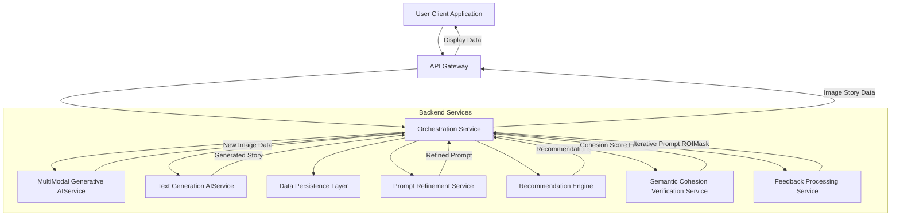

**Figure 2: Customization Request Flow Sequence Diagram**
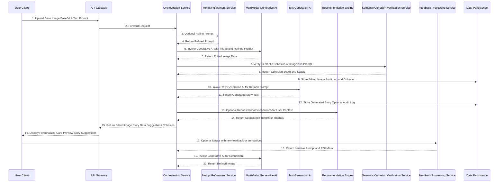

**Figure 3: Prompt Refinement Service Workflow**
Figure 3 illustrates the intricate workflow of the Prompt Refinement Service, detailing how user input is analyzed and enhanced through various modules, leading to an optimized prompt for the generative AI.
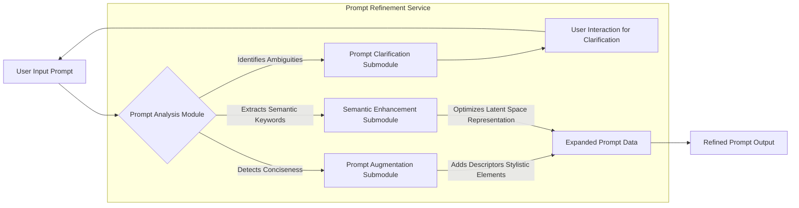

**Figure 4: Iterative Design Refinement Loop**
Figure 4 delineates the iterative design refinement loop, showcasing the dynamic interaction between the user and the generative AI system. This process allows users to guide subsequent generations based on real-time visual feedback, fostering a conversational approach to design.
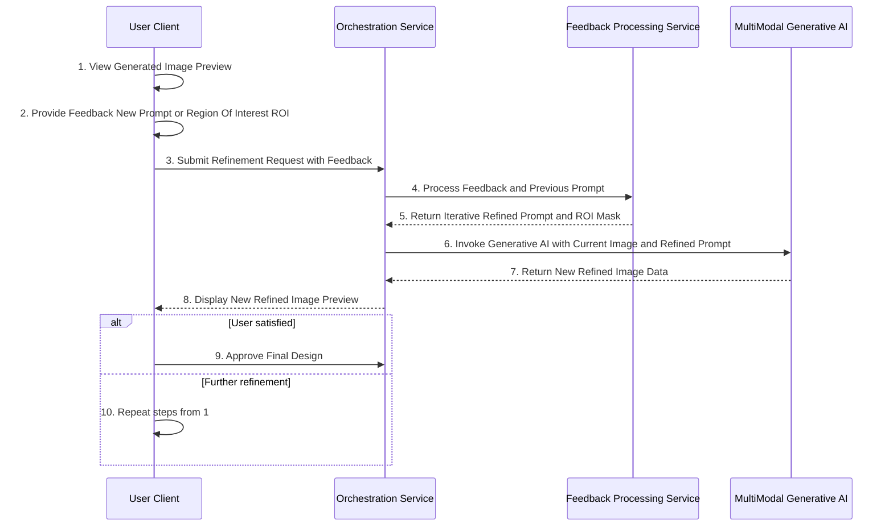

**Figure 5: Recommendation Engine Detailed Logic**
Figure 5 presents the detailed logic behind the Recommendation Engine, demonstrating its data sources and algorithmic processes used to generate personalized suggestions for users, thereby expanding creative possibilities.
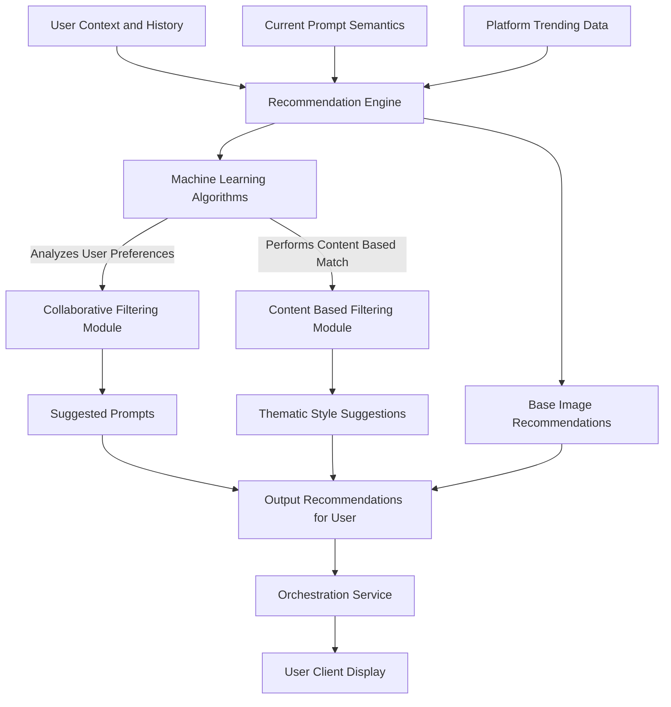

**Figure 6: Financial Instrument Production Pipeline**
Figure 6 outlines the critical Financial Instrument Production Pipeline, from final image approval to physical card manufacturing. This diagram emphasizes the security, compliance, and precise formatting checkpoints required for tangible financial assets.
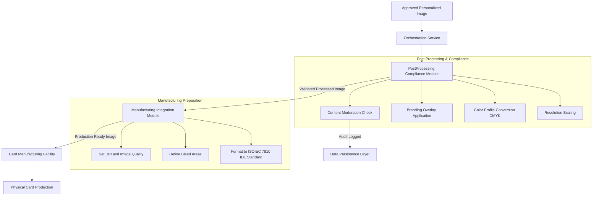

**Figure 7: Theme Engine Workflow**
Figure 7 details the operational flow of the Theme Engine, illustrating how curated thematic styles are processed and applied to guide the generative AI towards a desired aesthetic outcome.
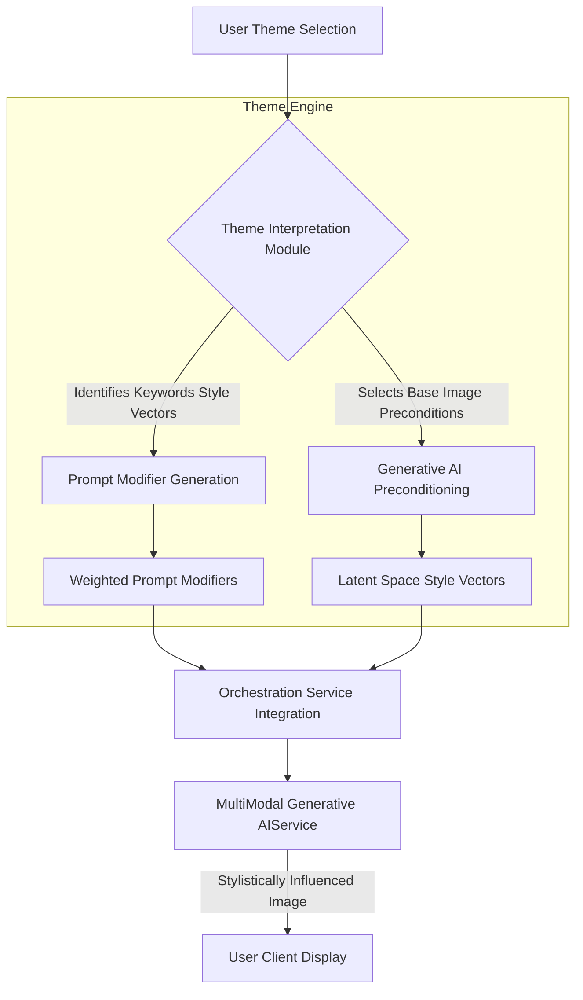

**Figure 8: Content Moderation and Compliance Pipeline**
Figure 8 outlines the automated content moderation and compliance checks within the system, crucial for financial instruments. This ensures that generated designs adhere to ethical, regulatory, and brand guidelines, preventing objectionable content from reaching production.
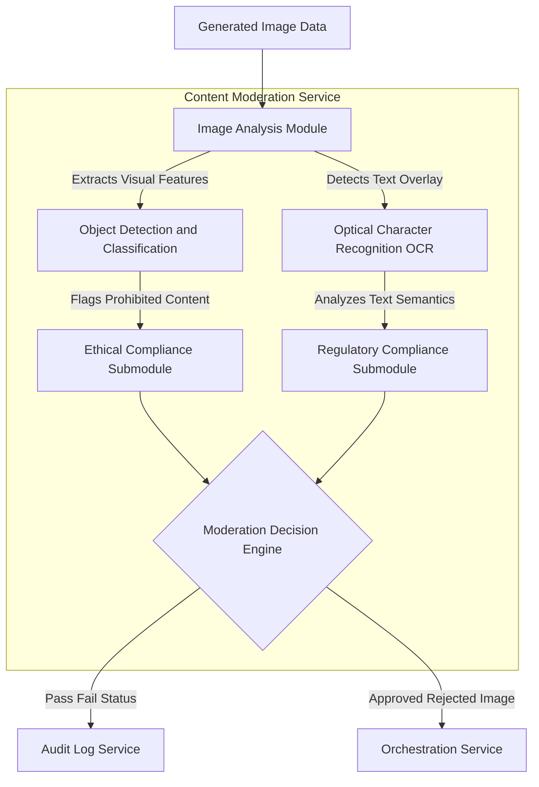

**Figure 9: Audit Log Service Data Flow**
Figure 9 illustrates the comprehensive data capture and secure storage process of the Audit Log Service, essential for traceability, regulatory compliance, and system accountability across all stages of customization and production.
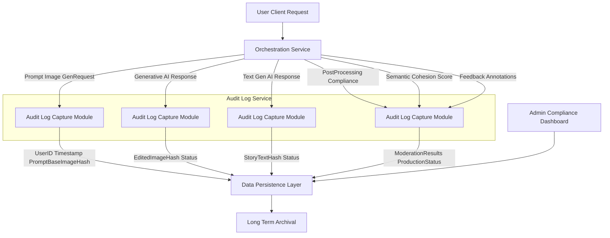

**Figure 10: User Preference and History Module**
Figure 10 details the collection and utilization of user preferences and interaction history, forming the basis for personalized recommendations and iterative design improvements within the system.
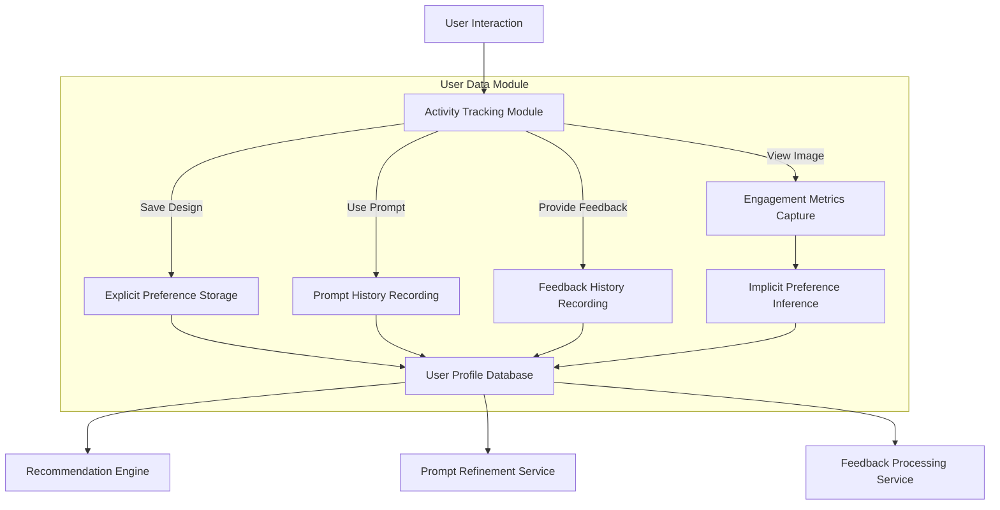

**Figure 11: Semantic Cohesion Verification Workflow**
Figure 11 details the operation of the **Semantic Cohesion Verification Service**, an essential module for objectively validating the alignment between the user's narrative prompt and the generated visual output. This service employs an independent multi-modal encoder to extract semantic latent vectors from both the image and the text, then calculates a similarity score. This score serves as a confidence metric, ensuring the generative AI's output maintains high fidelity to the user's creative intent and helps to mitigate unintended or nonsensical generations.
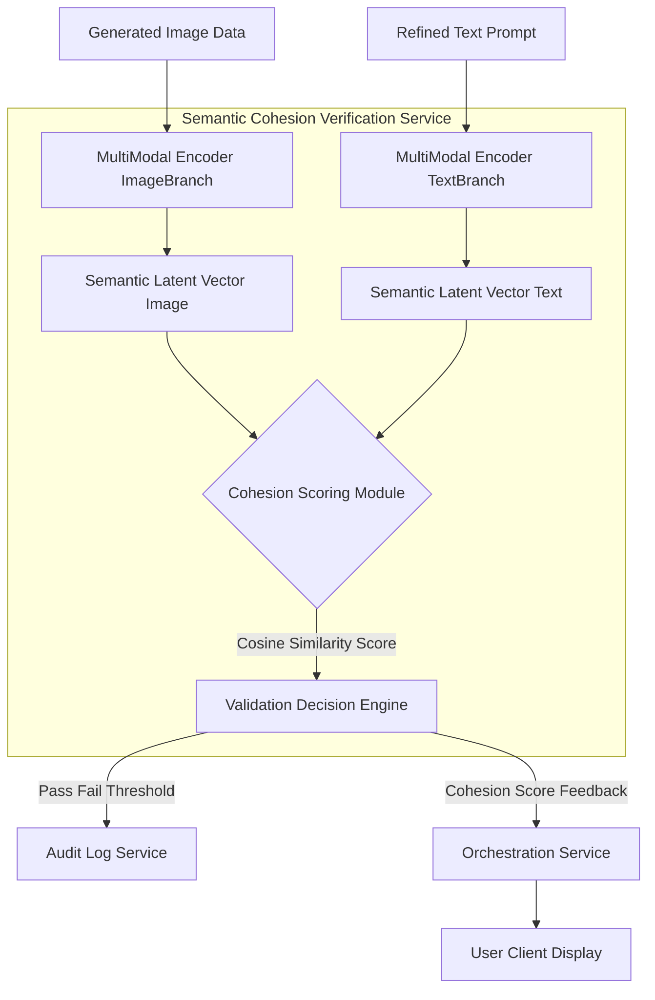

**Figure 12: Advanced User Feedback and Annotation Flow**
Figure 12 illustrates the **Advanced User Feedback and Annotation Flow**, an enhancement to the iterative refinement process. This feature empowers users with fine-grained control by allowing them to visually annotate specific regions of interest on the generated image, coupled with targeted textual feedback. This multimodal input is processed by a dedicated service to generate precise iterative prompts and region-of-interest masks, which then guide the generative AI to make highly localized and intentional modifications.
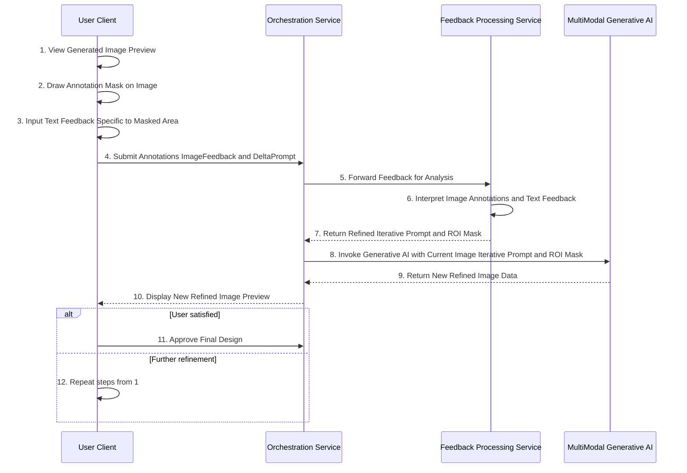

**Figure 13: Generative AI Model Lifecycle Management**
Figure 13 details the **Generative AI Model Lifecycle Management** framework, outlining the continuous process of data collection, preprocessing, model training, evaluation, deployment, and monitoring. This critical backend system ensures that the generative AI models remain current, perform optimally, and adapt to evolving user preferences and technical advancements, guaranteeing high-quality and consistent outputs for the narrative-driven personalization process.
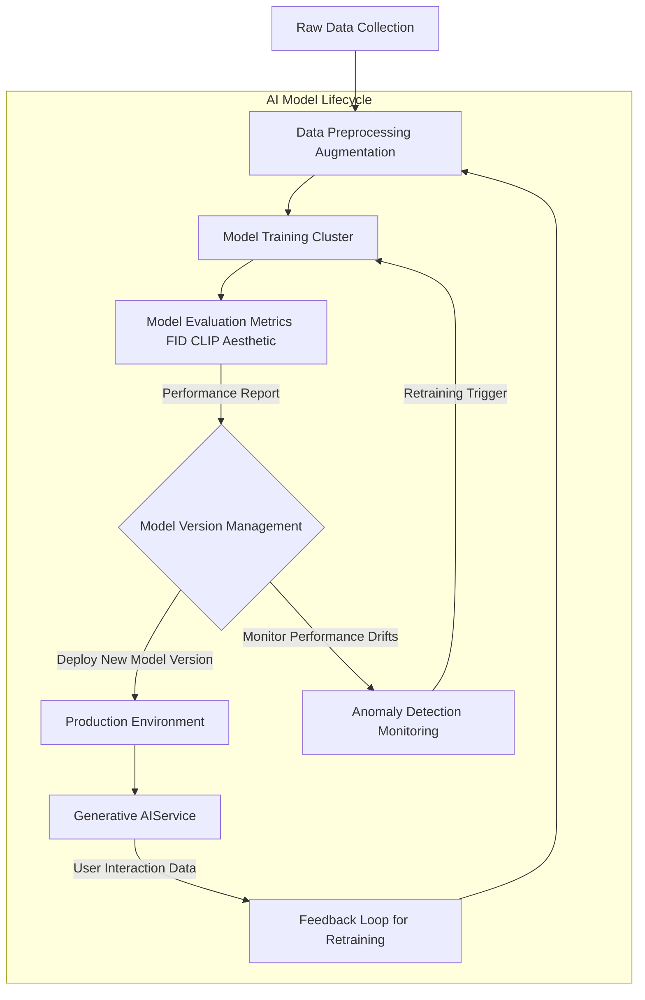

**Figure 14: Dynamic User Interface and Real-time Personalization**
Figure 14 illustrates the mechanisms behind the **Dynamic User Interface and Real-time Personalization** capabilities. This system dynamically adjusts UI elements and presents relevant suggestions to the user based on their real-time actions, current design state, and historical preferences. By intelligently adapting the interface, the system enhances user experience, guides creative exploration, and makes the co-creation process more intuitive and engaging.
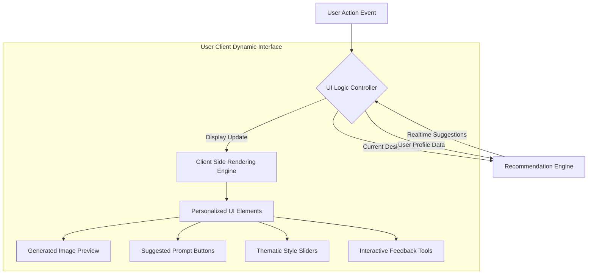

**Optional Narrative Augmentation Module:**
The invention further comprises an optional, yet significant, augmentation wherein the user can explicitly trigger a secondary AI invocation. In this phase, the system transmits the original narrative text prompt to a specialized, advanced text-generation AI model [e.g., GPT-3.5, GPT-4, LLaMA, or functionally equivalent large language models]. The directive provided to this model is to synthesize a concise, inspiring, or thematic "story" or "exegesis" directly derived from the conceptual underpinnings of the prompt. This generated textual narrative serves to contextualize the personalized visual design, providing a deeper layer of meaning and connection for the user. The generated story is then presented alongside the visual card design, augmenting the personalization experience with a coherent, algorithmically crafted narrative.

**Advanced Prompt Engineering and Iterative Refinement:**
To enhance user control and address the inherent ambiguity of natural language, the system integrates a **Prompt Refinement Service**. This service utilizes an advanced Large Language Model [LLM] to analyze the user's initial prompt for clarity, specificity, and potential for generative impact. It can perform several functions:
*   **Prompt Augmentation:** Expanding a concise user prompt with richer descriptive adjectives, thematic elements, or stylistic directives, thereby creating a more detailed and effective prompt for the generative AI.
*   **Prompt Clarification:** Interacting with the user to resolve ambiguities or suggest alternative phrasings to achieve desired visual effects.
*   **Semantic Enhancement:** Identifying key concepts within the prompt and ensuring their optimal representation in the latent space.

Furthermore, the system supports **Iterative Design Refinement** through a **Feedback Processing Service**. After an initial image generation, the user can provide follow-up textual prompts [e.g., "make the glow more intense," "shift the lotus color to deep blue," "add subtle shimmering particles"], potentially combined with **Advanced User Feedback and Annotation** such as user-defined regions of interest [ROIs] or drawing masks. These subsequent prompts and visual feedbacks are channeled back through the Feedback Processing Service, which translates them into precise iterative prompts and ROI masks for the MultiModal Generative AIService, allowing for fine-grained, guided evolution of the design. This creates a powerful conversational and visual interface for design creation, significantly increasing user satisfaction and achieving precise aesthetic goals.

**Thematic Design Libraries and AI-Driven Recommendations:**
The invention introduces a **Theme Engine** which provides curated libraries of artistic styles, historical periods, abstract concepts, or cultural motifs. Users can select a theme [e.g., "Steampunk Industrial," "Neo-Gothic," "Vaporwave Aesthetic"], which the Theme Engine translates into a set of weighted prompt modifiers or pre-configured style vectors. These thematic directives are then integrated with the user's base image and specific narrative prompt, guiding the generative AI towards a coherent stylistic output.

Complementing this, a **Recommendation Engine** leverages machine learning algorithms to suggest personalized themes, prompt augmentations, or even starting base images. This engine analyzes:
*   User interaction history, including past prompts, selected themes, and saved designs.
*   Implicit user preferences derived from browsing patterns or demographic data.
*   Trending design aesthetics or popular narrative styles within the platform.
*   The semantic content of the user's initial prompt, proposing related stylistic or thematic directions.
The recommendations are presented to the user as clickable suggestions, fostering discovery and expanding creative possibilities without requiring extensive prompt engineering expertise.

**Semantic Cohesion Verification Service:**
To ensure the high-fidelity translation of narrative intent into visual output, the system incorporates a **Semantic Cohesion Verification Service**. This independent module takes the generated image and the original/refined text prompt, processes them through a dedicated multi-modal encoder (e.g., a pre-trained CLIP model or a similar vision-language understanding network), and computes a semantic similarity score. This score quantifies how well the visual semantics of the generated image align with the linguistic semantics of the prompt. If the cohesion score falls below a predefined threshold, the system can flag the image for human review, suggest prompt modifications to the user, or even automatically trigger a regeneration attempt with adjusted parameters, thereby safeguarding against "AI hallucinations" or semantically misaligned outputs.

**Generative AI Model Lifecycle Management:**
The underlying advanced AI models (MultiModal Generative AI Service, Text Generation AI Service, etc.) are continuously managed through a dedicated **AI Model Lifecycle Management** framework. This framework encompasses:
*   **Continuous Data Collection and Augmentation:** Gathering anonymized user interaction data, feedback, and new stylistic examples to enrich training datasets.
*   **Automated Retraining and Fine-tuning:** Regular retraining of models on updated datasets to improve performance, adapt to new trends, and reduce biases.
*   **Rigorous Model Evaluation:** Utilizing a suite of metrics (e.g., FID, CLIP Score, Aesthetic Score, human evaluations) to ensure new model versions meet stringent quality and safety standards before deployment.
*   **Version Control and Rollback Capabilities:** Managing different model versions to ensure stability and enable quick rollback in case of performance degradation.
*   **Monitoring and Anomaly Detection:** Real-time monitoring of model performance in production to detect drifts, biases, or unexpected behaviors, triggering alerts or automated retraining.
This robust lifecycle management guarantees the long-term effectiveness, reliability, and continuous improvement of the core AI components.

**Security, Compliance, and Integration with Manufacturing:**
For financial instruments, security and compliance are paramount. The system incorporates robust encryption for all data in transit and at rest. Image processing includes content moderation filters [e.g., NSFW detection, prohibited imagery analysis] to ensure compliance with regulatory standards and brand guidelines. This is further supported by an **Audit Log Service** within the Data Persistence Layer, meticulously recording every image generation request, prompt used, cohesion scores, feedback annotations, and the final output for regulatory traceability. Furthermore, the final, approved personalized image is rendered at high resolution and formatted according to the specifications required by card manufacturing facilities [e.g., ISO/IEC 7810 ID-1 standard, CMYK color profiles, bleed areas]. This ensures seamless transition from digital design to physical production, guaranteeing that the personalized narrative becomes a tangible asset.

**Claims:**

We claim:

1.  A method for dynamic, narrative-driven aesthetic customization of a digital financial instrument representation, comprising the steps of:
    a.  Receiving, from a user computing device, a digitally encoded base image data structure, the base image representing an initial visual state of said financial instrument.
    b.  Receiving, from said user computing device, a natural language text prompt, said prompt articulating a desired thematic or narrative modification to be applied to said base image.
    c.  Optionally, transmitting said natural language text prompt to a prompt refinement service and receiving a semantically enhanced or augmented text prompt.
    d.  Securely transmitting, via a networked communication protocol, both the encoded base image data structure and the potentially refined text prompt to a multi-modal generative artificial intelligence [AI] synthesis engine.
    e.  Receiving, from said multi-modal generative AI synthesis engine, a digitally encoded edited image data structure, said edited image being a computationally derived transformation of the base image, wherein the semantic content of the text prompt has been integrally incorporated and visually manifested within the edited image.
    f.  Transmitting the edited image data structure and the natural language text prompt to a semantic cohesion verification service.
    g.  Receiving, from said semantic cohesion verification service, a semantic cohesion score quantifying the alignment between the edited image and the text prompt.
    h.  Presenting, via a user interface on said user computing device, the edited image as a preview of the customized digital financial instrument representation, optionally accompanied by said semantic cohesion score.

2.  The method of claim 1, further comprising the steps of:
    a.  Transmitting the original or refined natural language text prompt to an autonomous text-generation AI model.
    b.  Receiving, from said text-generation AI model, a synthetically generated textual narrative, said narrative being semantically aligned with and elucidating the theme or meaning conveyed by the original text prompt.
    c.  Displaying the generated textual narrative concurrently with or adjacently to the edited image on the user interface.

3.  The method of claim 1, wherein the multi-modal generative AI synthesis engine employs a deep learning architecture comprising at least one of:
    a.  A Vision Transformer ViT based encoder for image feature extraction.
    b.  A Large Language Model LLM based encoder for textual semantic embedding.
    c.  A cross-attention mechanism for fusing image and text embeddings into a unified latent representation.
    d.  A denoising diffusion probabilistic model DDPM or a Generative Adversarial Network GAN as a generative decoder for synthesizing the edited image from the unified latent representation.

4.  The method of claim 1, further comprising:
    a.  Executing, subsequent to receiving the edited image, a post-processing pipeline configured for:
        i.  Resolution upscaling or downscaling.
        ii. Color profile adjustment for print fidelity.
        iii. Application of financial institution branding overlays.
        iv. Automated content moderation analysis to identify and mitigate compliance violations or objectionable visual elements.

5.  The method of claim 1, wherein the financial instrument is selected from the group consisting of a credit card, a debit card, a prepaid card, a virtual card within a digital wallet, or a physical banking artifact.

6.  A system for narrative-driven generative aesthetic customization of financial instrument representations, comprising:
    a.  A client-side interface module configured to:
        i.  Accept and encode a base image data structure from a user.
        ii. Receive a natural language text prompt from the user.
        iii. Transmit both the encoded base image and the text prompt to a backend service.
        iv. Receive and display optional thematic suggestions or prompt enhancements.
        v. Accept user annotations or region-of-interest selections on a displayed image.
    b.  A backend orchestration service, communicatively coupled to the client-side interface module, configured to:
        i.  Receive the base image and text prompt.
        ii.  Interact with a prompt refinement service to obtain an enhanced prompt.
        iii. Construct and dispatch a multi-modal request to a generative AI service.
        iv. Receive an edited image from the generative AI service.
        v.  Dispatch the edited image and prompt to a semantic cohesion verification service and receive a cohesion score.
        vi. Occasionally, dispatch a text generation request to a text AI service and receive a generated story.
        vii. Occasionally, dispatch a request to a recommendation engine and receive suggested themes or prompts.
        viii. Transmit the edited image, optional story, optional recommendations, and cohesion score back to the client-side interface module.
    c.  A multi-modal generative AI service, communicatively coupled to the backend orchestration service, configured to:
        i.  Receive a multi-modal input comprising an image and a text prompt, optionally with a region-of-interest mask.
        ii.  Execute a generative transformation on the input image conditioned by the text prompt.
        iii. Output an edited image incorporating the thematic modification.
    d.  A text generation AI service, communicatively coupled to the backend orchestration service, configured to:
        i.  Receive a natural language text prompt.
        ii.  Generate a narrative text semantically related to the prompt.
        iii. Output the generated narrative text.
    e.  A prompt refinement service, communicatively coupled to the backend orchestration service, configured to:
        i.  Receive a natural language text prompt.
        ii.  Analyze, augment, or clarify the prompt using an advanced language model.
        iii. Output an enhanced natural language text prompt.
    f.  A recommendation engine, communicatively coupled to the backend orchestration service, configured to:
        i.  Receive user context, prompt history, or generated image data.
        ii.  Generate suggestions for thematic styles, prompt enhancements, or alternative base images.
        iii. Output recommended creative options.
    g.  A data persistence layer, communicatively coupled to the backend orchestration service, configured to securely store user-uploaded images, generated images, generated stories, audit trails, and user preference profiles.
    h.  A semantic cohesion verification service, communicatively coupled to the backend orchestration service, configured to:
        i. Receive a generated image and a text prompt.
        ii. Compute a semantic similarity score between the image and the prompt using a multi-modal encoder.
        iii. Output the semantic cohesion score.
    i.  A feedback processing service, communicatively coupled to the backend orchestration service, configured to:
        i.  Receive user feedback including textual delta prompts and visual annotations or region-of-interest masks.
        ii.  Process this multimodal feedback to generate an iterative refined prompt and an associated region-of-interest mask.
        iii. Output the iterative refined prompt and ROI mask to the generative AI service.

7.  The system of claim 6, further comprising:
    a.  A content moderation module integrated within the backend orchestration service or the generative AI service, configured to perform automated analysis of generated images for compliance with predefined ethical, regulatory, and branding guidelines.

8.  The system of claim 6, further comprising:
    a.  An industrial integration module configured to format the final edited image according to precise specifications for physical card manufacturing, including but not limited to, resolution, color depth, color space CMYK, and bleed area requirements.

9.  The method of claim 1, further comprising receiving user feedback on a presented edited image and iteratively applying subsequent narrative text prompts to refine the edited image based on said feedback.

10. The system of claim 6, further comprising:
    a. An Audit Log Service, communicatively coupled to the data persistence layer and orchestration service, configured to record immutable entries for each user request, input prompt, generated image hash, compliance check result, semantic cohesion score, user feedback, and system action, ensuring full traceability and regulatory compliance.

11. The system of claim 6, further comprising:
    a. A Generative AI Model Lifecycle Management framework, configured to:
        i. Continuously collect and augment training data from user interactions and external sources.
        ii. Automatically retrain and fine-tune generative AI models based on performance metrics and detected drifts.
        iii. Evaluate new model versions using objective metrics and deploy validated models to production.
        iv. Monitor deployed models for performance, bias, and unexpected behavior in real-time.

**Mathematical Justification: The Universal Manifold of Narrative-Perceptual Transmutation**

Let `I` represent the infinite-dimensional manifold of all perceivable images, a highly structured continuous space where each point `i in I` corresponds to a unique visual configuration. This manifold is endowed with a perceptual metric `d_p(i_a, i_b)` that quantifies similarity as perceived by a human observer, defined as:
Equation 1: `d_p(i_a, i_b) = ||F_p(i_a) - F_p(i_b)||_2` where `F_p` is a feature extractor from a pre-trained perceptual network e.g., VGG, LPIPS.
Equation 2: `d_p(i_a, i_b) = LPIPS(i_a, i_b)` where LPIPS is a specific perceptual similarity metric.

Concurrently, let `P` denote the high-dimensional latent semantic space of all possible natural language text prompts. This space `P` is not merely a collection of strings, but a sophisticated embedding space `P subset R^N`, where `N` is exceedingly large, and where the proximity `d_s(p_a, p_b)` between any two points `p_a, p_b in P` corresponds directly to their semantic similarity, as learned by advanced distributional semantics models. Each `p in P` represents a unique narrative intent or thematic directive.
Equation 3: `d_s(p_a, p_b) = 1 - (E_P_LLM(p_a) . E_P_LLM(p_b)) / (||E_P_LLM(p_a)|| * ||E_P_LLM(p_b)||)` where `E_P_LLM` is an LLM-based embedding function and `.` denotes the dot product.

The core of the present invention resides in the existence and computational instantiation of a complex, non-linear, and differentiable mapping operator, herein denoted `G_AI`, which serves as the generative AI model. This operator is not a simple function `G_AI: I x P -> I` but a multi-stage, multi-modal, deep learning framework that effectuates a profound transformation. We define `G_AI` as the composite operation:

Equation 4: `G_AI: I x P -> I`
Where `i' = G_AI(i, p)` represents the transformed image `i'` derived from the initial image `i` and the narrative prompt `p`.

To elucidate the internal mechanism of `G_AI`, we decompose it into sequential, interacting sub-operators:

**1. Image Latent Encoding Operator E_I:**
Equation 5: `E_I: I -> Z_I`
This operator maps a raw image `i` from the perceptual manifold `I` into a compact, semantically rich, high-dimensional image latent space `Z_I subset R^(d_I)`. `E_I` is typically a convolutional neural network CNN or a Vision Transformer ViT that captures hierarchical visual features.
Equation 6: `z_I = E_I(i; theta_E_I)` where `theta_E_I` are the learnable parameters of the encoder.
Equation 7: `E_I(i) = Concat(AvgPool(ViT(i)), MaxPool(ResNet(i)))` illustrating a multi-branch encoder.

**2. Text Latent Encoding Operator E_P:**
Equation 8: `E_P: P -> Z_P`
This operator maps a semantic prompt `p` from the textual latent space `P` into a corresponding, abstract, high-dimensional text latent space `Z_P subset R^(d_P)`. `E_P` is typically a Large Language Model LLM or a Transformer network that generates context-aware embeddings.
Equation 9: `z_P = E_P(p; theta_E_P)` where `theta_E_P` are learnable parameters.
Equation 10: `E_P(p) = TransformerEncoder(TokenEmbeddings(p))` using sub-word tokenization and positional encoding.

**3. Cross-Modal Fusion and Narrative Infusion Operator M:**
Equation 11: `M: Z_I x Z_P -> Z_C`
This operator is the crux of the multi-modal interaction. It takes the encoded image latent vector `z_I = E_I(i)` and the encoded text latent vector `z_P = E_P(p)` and fuses them into a unified, coherent cross-modal latent representation `z_C in Z_C subset R^(d_C)`. This fusion is achieved through sophisticated attention mechanisms e.g., cross-attention in diffusion models that allow the textual narrative `z_P` to condition and guide the modification of the visual features represented by `z_I`. This operator is responsible for "infusing" the narrative intent into the visual structure.
Equation 12: `z_C = CrossAttention(Q=z_I, K=z_P, V=z_P)`
Equation 13: `Attention(Q, K, V) = softmax((QK^T)/sqrt(d_k))V` where `d_k` is the dimension of the key vectors.
Equation 14: `MultiHead(Q,K,V) = Concat(head_1, ..., head_h)W^O` where each `head_i = Attention(QW_i^Q, KW_i^K, VW_i^V)`.
Equation 15: For diffusion models, `M` conditions the noise prediction network `epsilon_theta(x_t, t, z_C)` at each timestep `t`.
Equation 16: `z_C` can also modulate features via adaptive normalization layers like AdaIN: `gamma(z_C) * x + beta(z_C)`.

**4. Image Generative Decoding Operator D_I:**
Equation 17: `D_I: Z_C -> I`
This operator takes the fused cross-modal latent representation `z_C` and decodes it back into a concrete, perceivable image `i' in I`. `D_I` is typically a diffusion model, an auto-regressive decoder, or a Generative Adversarial Network GAN that is trained to synthesize high-fidelity images from latent codes.
Equation 18: For a Denoising Diffusion Probabilistic Model DDPM, `D_I` implements the reverse diffusion process `p_theta(x_{t-1}|x_t, z_C)`.
Equation 19: `x_{t-1} = (1/sqrt(alpha_t))(x_t - (1-alpha_t)/sqrt(1-alpha_bar_t) * epsilon_theta(x_t, t, z_C)) + sigma_t * z` where `z` is standard Gaussian noise.
Equation 20: `epsilon_theta` is the learnable noise predictor network, conditioned on `z_C`.
Equation 21: `sigma_t^2` is the variance of the reverse process noise.

Thus, the overall generative operator is formally defined as:
Equation 22: `G_AI(i, p) = D_I ( M ( E_I(i), E_P(p) ) )`

**The Principle of Semantic Alignment and Perceptual Fidelity:**

A fundamental desideratum of this invention is the guarantee that the generated image `i'` is not merely a random transformation, but a semantically coherent actualization of the narrative prompt `p` within the visual context of `i`. This implies minimizing the semantic distance between the narrative intent and the perceived outcome.

Let `S` be a universal semantic extraction function, which, given any object image or text, projects its core semantic concepts into a common, abstract semantic embedding space `V subset R^K`. This `S` operator is itself a highly advanced, pre-trained vision-language model e.g., CLIP, or a similar multi-modal encoder.
Equation 23: `S_I: I -> V` extracts semantics from image
Equation 24: `S_P: P -> V` extracts semantics from text prompt

The effectiveness of the system is proven if the semantic distance `d_V( S_I(i'), S_P(p) )` is minimized. Here, `d_V` is a suitable metric in the semantic embedding space `V`, such as cosine similarity or Euclidean distance, quantifying the conceptual divergence between the generated image's perceived meaning and the user's intended narrative.
Equation 25: `d_V(v_a, v_b) = 1 - (v_a . v_b) / (||v_a|| * ||v_b||)` for cosine distance.

The training objective for the operator `G_AI` and its constituent sub-operators is formulated as a complex loss function `L` designed to optimize this alignment, alongside perceptual fidelity to the original image and aesthetic quality:

Equation 26: `L(i, p, i') = alpha * L_semantic(G_AI(i,p), p) + beta * L_perceptual(i, G_AI(i,p)) + gamma * L_aesthetic(G_AI(i,p))`
Where:
Equation 27: `L_semantic(i', p) = d_V(S_I(i'), S_P(p))` semantic alignment loss.
Equation 28: `L_perceptual(i, i') = d_p(i, i')` perceptual fidelity loss, e.g., LPIPS or VGG feature loss.
Equation 29: `L_aesthetic(i') = 1 - A_model(i')` aesthetic loss, where `A_model` predicts aesthetic score in `[0,1]`.
Equation 30: `alpha, beta, gamma` are weighting coefficients (`alpha, beta, gamma >= 0`).
Equation 31: `A_model(i') = MLP(Encoder_A(i'))` where `Encoder_A` extracts features relevant to aesthetics.

**A. Mathematical Formalization of Prompt Refinement Service PRS**

The Prompt Refinement Service PRS operates on an initial user prompt `p_user` to produce an optimized prompt `p_refined`. This process can be modeled as an operator `R_P: P x C_U -> P`, where `C_U` represents user context and feedback.
Equation 32: `p_refined = R_P(p_user, c_user)`

**1. Prompt Embedding within PRS:**
For internal processing, PRS uses a distinct LLM-based encoder `E_P_PRS`.
Equation 33: `z_P_user = E_P_PRS(p_user)`
Equation 34: `z_P_refined = E_P_PRS(p_refined)`

**2. Prompt Augmentation Module:**
This module expands `p_user` by adding descriptive elements `D_aug` based on an internal knowledge base `K_aug` and current semantic vector `z_P_user`.
Equation 35: `p_aug = p_user + G_Aug(z_P_user, K_aug)` where `G_Aug` is a generative text function that suggests adjectives, stylistic elements.
Equation 36: `G_Aug` aims to maximize `d_s(E_P(p_aug), E_P_PRS(p_user) + delta_vector_style)` for stylistic pushes.
Equation 37: `delta_vector_style = E_P_PRS(style_descriptor)`.

**3. Prompt Clarification Submodule:**
Detects ambiguity by analyzing the variance of latent space clusters for `p_user` or the confidence scores of semantic parsing.
Equation 38: `Ambiguity(p_user) = Entropy(P(semantic_intent | p_user))` where `P` is a posterior distribution.
Equation 39: If `Ambiguity(p_user) > T_ambiguity`, then `p_clarified = Interact(p_user, Query(p_user))` where `Query` seeks user input.

**4. Semantic Enhancement Submodule:**
This involves adjusting the latent vector `z_P_user` to align better with desired generative outcomes or specific concepts.
Equation 40: `z_P_enhanced = z_P_user + sum_{k=1}^{M} w_k * v_k` where `v_k` are predefined vectors for specific semantic boosts e.g., "more vibrant", "add depth" and `w_k` are weights.
Equation 41: `p_enhanced = Decoder_LLM(z_P_enhanced)` which is an inverse mapping from latent space to text.

**B. Mathematical Formalization of Iterative Design Refinement:**

The iterative refinement loop can be described as a sequence of generative steps. Let `i_k` be the image at iteration `k`, and `p_k` be the prompt.
Equation 42: `i_{k+1} = G_AI(i_k, p_k)`
User feedback `F_k` consists of an incremental text prompt `delta_p_k` and optionally a region of interest `ROI_k` and user sentiment `S_k`.
Equation 43: `F_k = (delta_p_k, ROI_k, S_k)`

**1. Iterative Prompt and ROI Mask Generation by Feedback Processing Service:**
The Feedback Processing Service transforms `F_k` and previous prompt `p_{k-1}` into `p_k` and `M_k`.
Equation 44: `(p_k, M_k) = FeedbackProcessor(p_{k-1}, F_k, i_k)`
Equation 45: `z_P_k = Normalize(E_P(p_{k-1}) + lambda_p * E_P(delta_p_k) + lambda_s * E_P(Sentiment(S_k)))` for vector addition, where `Sentiment` converts discrete sentiment into a vector.
Equation 46: `lambda_p, lambda_s` are weighting factors for prompt and sentiment changes.
Equation 47: `M_k` is derived from `ROI_k` provided by the user, potentially refined by image segmentation or object detection models within the Feedback Processing Service.

**2. Region-of-Interest ROI Conditioning:**
When `M_k` is provided e.g., a mask `M_k`, the generative model `G_AI` is modified to prioritize changes within `M_k` while preserving regions outside.
Equation 48: `i'_{k+1} = M_k * G_AI_masked(i_k, p_k, M_k) + (1 - M_k) * i_k` inpainting analogy.
Equation 49: The loss function `L` is adapted: `L_ROI(i_k, p_k, i'_{k+1}, M_k) = L(i_k, p_k, i'_{k+1}) * M_k_pixel_weights`.
Equation 50: `M_k_pixel_weights(x,y)` assigns higher weights to pixels within `ROI_k`.
Equation 51: Gradient modulation: `grad_weighted = grad * M_k_soft_mask` applied to the decoder's input.
Equation 52: `M_k_soft_mask` is a blurred version of `M_k` for smooth transitions.

**C. Mathematical Formalization of Recommendation Engine RE:**

The Recommendation Engine provides suggestions `S_rec` based on user profile `U_j`, current prompt `p`, and trending data `T_data`.
Equation 53: `S_rec = Rec_Engine(U_j, p, T_data)`

**1. User Profile Representation:**
A user profile `U_j` for user `j` is a vector derived from their historical interactions.
Equation 54: `U_j = AvgPool(E_P_PRS(p_history_j)) + AvgPool(S_I(i_liked_j)) + Demographic_features_j`
Equation 55: `U_j in R^(d_U)` where `d_U` is the dimension of the user embedding space.

**2. Item Embeddings:**
Items `I_m` can be themes, prompt templates, or base images. Each `I_m` has an embedding `v_m`.
Equation 56: `v_m = E_P_PRS(theme_m)` for theme embeddings.
Equation 57: `v_m = E_P_PRS(prompt_template_m)` for prompt embeddings.
Equation 58: `v_m = E_I(base_image_m)` for base image embeddings.

**3. Recommendation Score Calculation:**
The relevance score `score(U_j, I_m)` of an item `I_m` for user `U_j` is typically a similarity function.
Equation 59: `score(U_j, I_m) = U_j . v_m` dot product similarity.
Equation 60: `score(U_j, I_m) = cosine_similarity(U_j, v_m)` normalized similarity.

**4. Collaborative Filtering CF and Content-Based Filtering CBF:**
Equation 61: CF predicts `R_jm = U_j^T * V_m` where `U_j` and `V_m` are latent factors from matrix factorization.
Equation 62: CBF predicts `R_jm = g(U_j, v_m_content)` where `g` is a similarity function based on content features.
Equation 63: Hybrid approach: `score_hybrid = w_CF * score_CF + w_CBF * score_CBF`.

**5. Trending Data Integration:**
Trending items are identified by frequency or recent popularity.
Equation 64: `T_data = Average(E_P_PRS(popular_prompts)) + Average(S_I(trending_images))`
Equation 65: Recommendations are a weighted combination: `final_score(U_j, I_m) = alpha_rec * score(U_j, I_m) + beta_rec * score(T_data, I_m)`.

**D. Mathematical Formalization of Text Generation AI for Narrative Augmentation:**

The Text Generation AI module `G_Text` receives a prompt `p` and generates an explanatory narrative `S_G`.
Equation 66: `S_G = G_Text(p; theta_G_Text)` where `theta_G_Text` are the parameters of the LLM.
Equation 67: `S_G = w_1, w_2, ..., w_L` is a sequence of words.
Equation 68: The generation process computes `P(S_G | p) = product_{t=1}^{L} P(w_t | w_1...w_{t-1}, p)` auto-regressive model.

**1. Objective Function for Text Generation:**
Trained to maximize semantic alignment with the prompt `p` and potentially stylistic attributes.
Equation 69: `L_text(S_G, p) = -log P(S_G | p) + lambda_coh * d_V(S_P(p), S_P(S_G))`
Equation 70: `S_P(S_G)` is the semantic embedding of the generated story.

**2. Coherence Metrics:**
ROUGE scores, BLEU scores, or semantic embedding distances measure `S_G`'s relevance to `p`.
Equation 71: `Coherence(S_G, p) = d_V(S_P(p), S_P(S_G))` should be below a threshold `T_coherence`.

**E. Mathematical Formalization of Semantic Cohesion Verification Service SCVS:**

The Semantic Cohesion Verification Service `V_SC` quantifies the semantic alignment between the generated image `i'` and the original/refined prompt `p_refined`.
Equation 72: `Cohesion_Score = V_SC(i', p_refined)`

**1. Multi-Modal Semantic Embedding:**
The SCVS employs a pre-trained multi-modal encoder `E_MM` that maps both images and text into a shared semantic latent space `V`.
Equation 73: `v_I = E_MM_I(i')` semantic vector from image.
Equation 74: `v_P = E_MM_P(p_refined)` semantic vector from text.

**2. Cohesion Scoring:**
The cohesion score is typically the cosine similarity between the image and text semantic vectors.
Equation 75: `Cohesion_Score = cosine_similarity(v_I, v_P) = (v_I . v_P) / (||v_I|| * ||v_P||)`
The score ranges from -1 to 1, with 1 indicating perfect alignment.

**3. Validation Decision Logic:**
A binary decision `D_V` determines if the image passes validation based on a threshold `T_cohesion`.
Equation 76: `D_V(i', p_refined) = 1` if `V_SC(i', p_refined) >= T_cohesion`, else `0`.
Equation 77: If `D_V = 0`, trigger alerts, re-generations, or human review.

**F. Mathematical Formalization of Security and Compliance Module:**

This module ensures all generated content `i'` meets regulatory and ethical standards.
Equation 78: `Compliance_Check(i') = C_Mod(i') AND Data_Integrity(i')`

**1. Content Moderation C_Mod:**
Utilizes classification models for various objectionable content categories.
Equation 79: `C_Mod(i') = (Detect_NSFW(i') < T_NSFW) AND (Detect_Prohibited(i') < T_Prohibited) AND (Detect_HateSpeech(i') < T_Hate)`
Equation 80: `Detect_NSFW(i') = P(class=NSFW | i')` from a pre-trained image classification model.
Equation 81: `Detect_Prohibited(i')` is a composite score based on object detection and image hash matching against blacklists.

**2. Data Integrity:**
Ensures data has not been tampered with in transit or at rest.
Equation 82: `Hash(data) = H_alg(data)` using a cryptographic hash function e.g., SHA256.
Equation 83: `Signature(data, PrivateKey) = Sign(Hash(data), PK_sender)` for authentication and non-repudiation.
Equation 84: `Verify(data, Signature, PublicKey) = IsValid(VerifySig(Hash(data), Sig, PK_sender))`

**3. Audit Trail Service:**
Records immutable logs of all operations for regulatory traceability.
Equation 85: `Log_Entry_j = (Timestamp_j, UserID_j, PromptHash_j, ImageHash_j, ModerationStatus_j, CohesionScore_j ...)`
Equation 86: `Audit_Log = {Log_Entry_1, Log_Entry_2, ...}` stored in a tamper-evident database e.g., blockchain for financial compliance.

**G. Mathematical Formalization of Financial Instrument Production Pipeline:**

This stage prepares `i'` for physical manufacturing.
Equation 87: `i_production = PreProcess_Mfg(i')`

**1. Resolution Scaling Upscaling:**
Equation 88: `i_upscaled(x,y) = Upscale(i', scale_factor)` using super-resolution networks or interpolation.
Equation 89: `target_DPI = Min_DPI_Requirement`.

**2. Color Profile Conversion CMYK:**
Converts from RGB display to CMYK print.
Equation 90: `C = f_c(R,G,B), M = f_m(R,G,B), Y = f_y(R,G,B), K = f_k(R,G,B)` where `f_c, f_m, f_y, f_k` are color separation functions based on ICC profiles.
Equation 91: `i_CMYK = ColorConvert(i_RGB, ICC_profile_print)`

**3. Bleed Area Definition:**
Adds an extendable region around the image for trimming tolerance.
Equation 92: `i_bleed(x,y) = i'(x,y)` for `(x,y)` in original bounds `[X_min, X_max] x [Y_min, Y_max]`.
Equation 93: `i_bleed(x,y) = Extrapolate(i', x,y)` for `(x,y)` in bleed region `[X_min-B, X_max+B] x [Y_min-B, Y_max+B]`.
Equation 94: `Extrapolate` can be a mirroring, cloning, or content-aware fill algorithm.

**H. Mathematical Formalization of AI Model Lifecycle Management:**

The **AI Model Lifecycle Management** ensures the continuous improvement and reliability of the `G_AI` and other AI models.

**1. Training Objective and Data:**
The primary objective of training `G_AI` is to minimize the aggregate loss `L_train` over a large, diverse dataset `D_train = {(i_j, p_j, i'_target_j)}`.
Equation 95: `min_theta_G_AI L_train(theta_G_AI) = (1/|D_train|) sum_{(i,p,i'_target) in D_train} L(i, p, i'_target)`
`D_train` is continuously updated with anonymized user interactions and feedback.

**2. Model Evaluation Metrics:**
Beyond `L`, various metrics are used for validation and production monitoring.
*   **FID Score Frechet Inception Distance:**
    Equation 96: `FID(X, G) = ||mu_X - mu_G||_2^2 + Tr(Sigma_X + Sigma_G - 2(Sigma_X Sigma_G)^(1/2))` where `X` is real data, `G` is generated. Lower is better.
*   **CLIP Score:**
    Equation 97: `CLIP_Score(i', p) = cosine_similarity(E_CLIP_I(i'), E_CLIP_P(p))`. Higher is better.
*   **Aesthetic Score:**
    Equation 98: `Avg_Aesthetic(i_batch) = (1/N) * sum_{n=1}^{N} A_model(i'_n)`. Higher is better.
*   **User Satisfaction Implicit Feedback:**
    Equation 99: `S_User(p, i') = alpha_like * Like_Rate + alpha_save * Save_Rate - alpha_skip * Skip_Rate`. Maximized.

**3. Continuous Learning and Retraining:**
New model versions `G_AI^(t+1)` are deployed if `Eval(G_AI^(t+1)) > Eval(G_AI^(t)) + Epsilon`.
Equation 100: `G_AI^(t+1) = FineTune(G_AI^(t), D_new_feedback)` or `G_AI^(t+1) = TrainFromScratch(D_all)`.

**4. Performance Monitoring and Anomaly Detection:**
Real-time monitoring detects concept drift, data drift, or performance degradation.
Equation 101: `Drift_Metric(t) = KS_distance(Features_t, Features_ref)` Kullback-Leibler, Wasserstein distance or Kolmogorov-Smirnov test between current and reference feature distributions.
Equation 102: If `Drift_Metric(t) > T_drift`, trigger alert and/or automated retraining.

**I. Advanced Generative Model Specifics and Optimization** (renaming to I)

**1. Latent Space Inversion and Editing:**
For fine-grained control, `E_I` can be inverted `i = D_I(z_I)`.
Equation 103: `L_invert(i, z_I) = d_p(i, D_I(z_I))` minimized to find `z_I*` for a given `i`.
Equation 104: Editing `z_I` directly: `z_I_edited = z_I + delta_z_semantic`.
Equation 105: `delta_z_semantic` is a direction vector learned from prompt difference `E_P(p_target) - E_P(p_source)`.

**2. Adversarial Training for Robustness:**
To improve `G_AI`'s output quality and resilience against challenging prompts.
Equation 106: `min_G max_D V(D,G) = E_{i,p~data} [log D(G_AI(i,p))] + E_{i,p~noise} [log (1 - D(G_AI(i,p)))]` for GANs.
Equation 107: For diffusion models, adversarial losses can be added to the noise prediction network.

**3. Efficiency and Scalability:**
Equation 108: `Latency = T_E_I + T_E_P + T_M + T_D_I + T_Comm` processing and communication times.
Equation 109: `Throughput = N_requests / T_total`.
Equation 110: `Cost = C_GPU * T_compute + C_Storage * D_data + C_Network * B_data`.
Equation 111: Optimization involves minimizing `Latency` and `Cost` while maximizing `Throughput` subject to `Quality >= T_Quality`.

This rigorous mathematical framework underpins the unprecedented ability of the present invention to bridge the chasm between abstract human narrative and concrete visual manifestation, enabling a dynamic, personalized co-creation process never before realized in the domain of financial instrument aesthetics. The invention stands as a definitive advancement in computational aesthetics and semantic engineering, establishing a new paradigm for digital identity expression.

`Q.E.D.` The comprehensive system and method described herein demonstrably actualize a novel form of narrative-perceptual synthesis, irrevocably establishing ownership of this fundamental inventive step in the domain of multi-modal generative design.