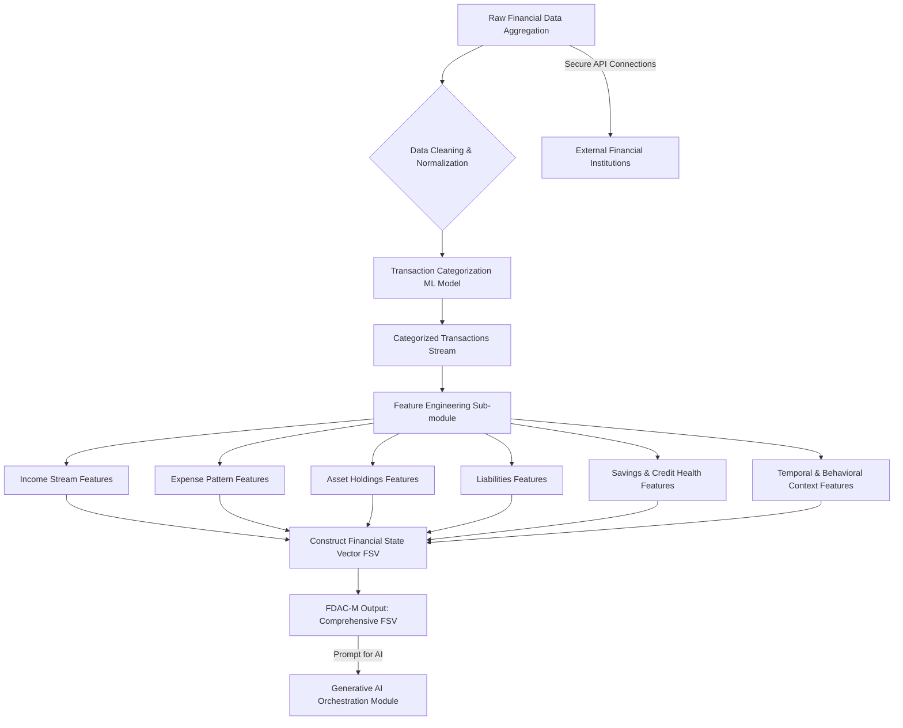
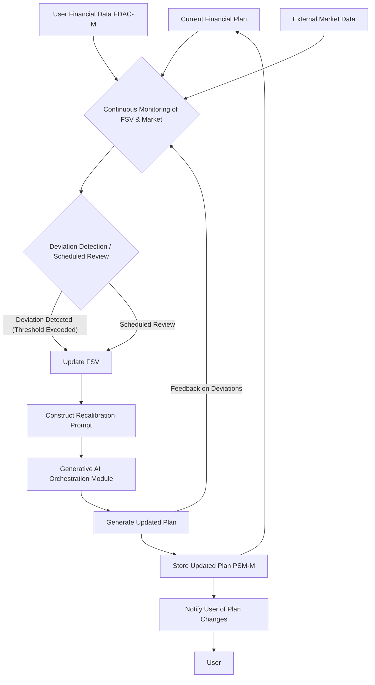
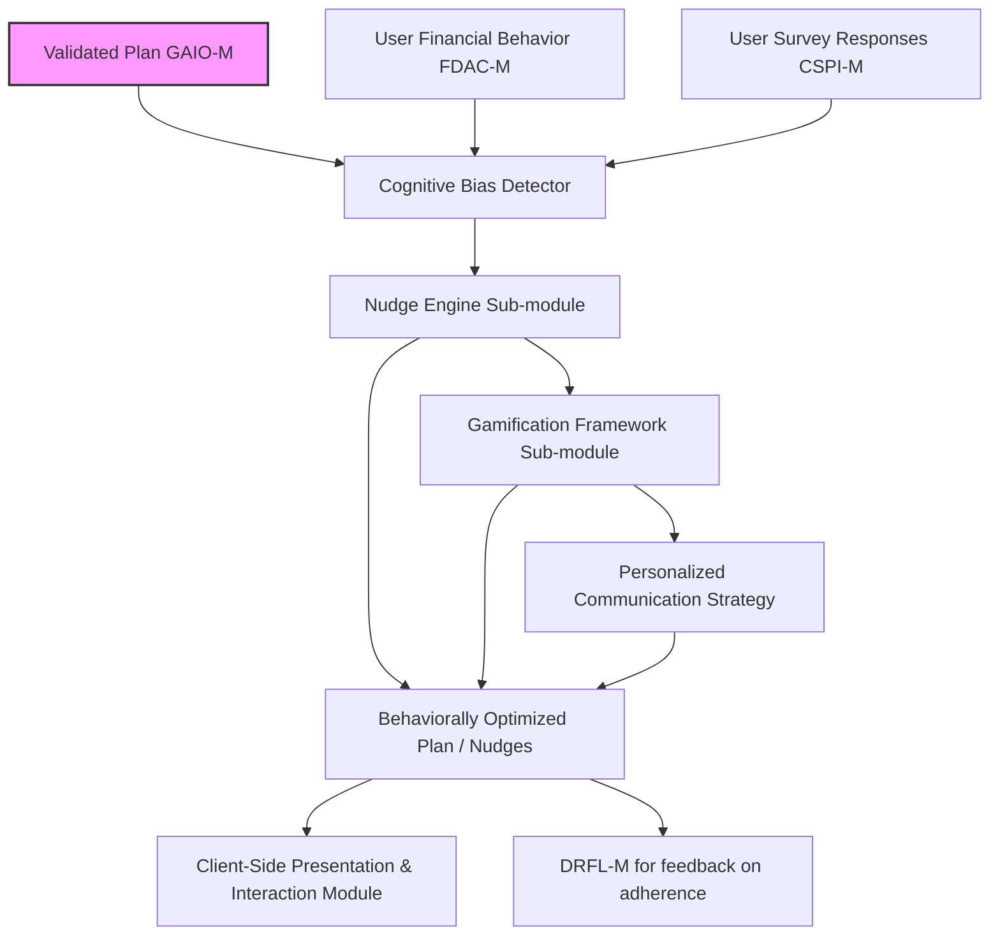
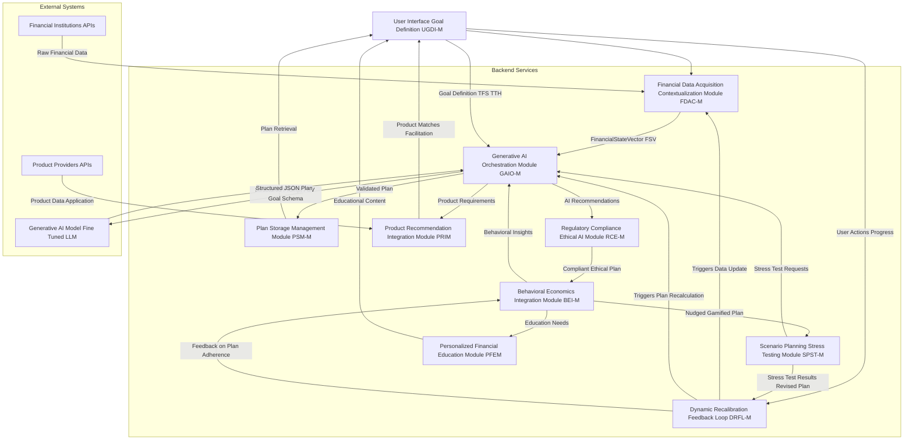
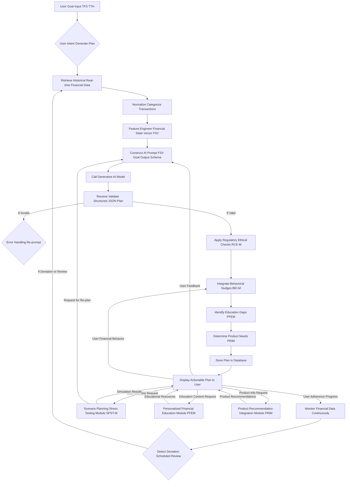

# **Title of Invention: A System and Method for Generating an Actionable, Multi-Domain Financial Plan with Dynamic Calibration, Proactive State Transition Guidance, and Enhanced User Empowerment**

## **Abstract:**

Disclosed herein is a novel and foundational system and method for advanced personal financial planning, distinguished by its integration of high-fidelity, real-time financial data with sophisticated generative artificial intelligence paradigms. The system rigorously defines and receives a user's aspirational financial objective, characterized by a precise target financial state e.g. a specific capital accumulation or debt reduction milestone and an associated temporal constraint. Subsequent to this, the system dynamically accesses, aggregates, and processes the user's granular financial telemetry, encompassing income flux, expenditure patterns, asset valuations, and liability structures, to construct a comprehensive, multi-dimensional financial state vector. This meticulously contextualized data is then furnished as an intricately engineered prompt to an advanced generative AI model. The AI model, acting as an algorithmic financial architect, synthesizes a holistic, multi-domain action plan. This plan transcends rudimentary savings directives, encompassing a granular decomposition into specific, verifiable, and actionable steps spanning critical financial domains such as optimized budgetary allocation, strategic capital deployment investment, debt restructuring, and proactive income generation strategies. Further, the system dynamically recommends suitable financial products and delivers personalized financial education to enhance user comprehension and implementation. This comprehensive strategic blueprint, dynamically informed by user behavior and market conditions, provides an unparalleled and adaptive pathway for the user to traverse their current financial state to their desired future financial state with maximal efficiency and probability of success. The invention uniquely integrates advanced behavioral economics principles and robust scenario planning capabilities, ensuring not only an optimal financial trajectory but also enhanced user adherence and resilience against unforeseen market fluctuations or personal life events.

## **Field of the Invention:**

The present invention pertains broadly to the domain of artificial intelligence-driven financial technology FinTech, specifically addressing the complex challenges of personalized financial planning, wealth management, and behavioral economics. More particularly, it relates to intelligent systems that leverage machine learning, natural language processing, and advanced generative models to create bespoke, dynamically adaptive, and actionable financial strategies tailored to individual user profiles, aspirations, and real-time financial realities, while also facilitating product integration and fostering financial literacy. The invention further encompasses the application of stochastic control theory, reinforcement learning, and advanced econometric modeling for predicting financial state evolution, assessing risk, and optimizing decision-making in highly uncertain environments. Its scope extends to developing robust, ethically compliant, and transparent AI solutions for personal finance, ensuring explainability and mitigating algorithmic biases in sensitive financial recommendations.

## **Background of the Invention:**

Conventional financial planning methodologies and extant digital tools predominantly operate on simplistic, linear models that grossly oversimplify the multifaceted dynamics of personal finance. These rudimentary systems typically reduce goal attainment to a singular variable problem, primarily focusing on a required monthly savings contribution calculated through elementary interest formulae. Such approaches conspicuously neglect the intricate interplay of diverse financial factors, including variable income streams, fluctuating expenditure categories, evolving investment opportunities, credit utilization, and the myriad behavioral biases that profoundly influence an individual's financial trajectory. They often fail to account for the stochastic nature of market returns, unexpected expenses, or changes in personal circumstances, rendering their advice quickly obsolete.

Existing solutions demonstrably fail to furnish a holistic, integrated strategy. They lack the capacity to analyze granular spending habits, identify latent opportunities for expense optimization, recommend diversified investment vehicles commensurate with individual risk appetites, or propose actionable strategies for augmenting income. Furthermore, these static models are inherently incapable of adapting to exogenous shocks e.g. market volatility, unforeseen expenses or endogenous shifts in user behavior. Consequently, users are left with an incomplete, often impractical, and rapidly obsolete roadmap, leading to disengagement and a significant gap between aspiration and achievement. Moreover, these systems rarely empower users with the financial knowledge required to truly understand and confidently execute their plans, nor do they seamlessly connect users to the actual financial products and services needed to implement advice. The absence of sophisticated scenario planning and stress-testing capabilities leaves users unprepared for adverse financial events, while the lack of behavioral integration means that even well-intentioned plans often fail due to human psychological tendencies.

A profound and persistent exigency therefore exists for an intelligent, adaptive, and comprehensive system that can synthesize a user's entire financial gestalt, comprehend their nuanced objectives, and dynamically architect a multi-faceted, actionable financial plan. Such a system must transcend mere calculation, embodying the strategic acumen of a seasoned financial advisor augmented by the analytical prowess and scalability of advanced artificial intelligence, thus addressing the inherent limitations of both traditional human advice scalability, potential bias and simplistic automated tools lack of holistic insight, static nature. Crucially, it must also bridge the gap between advice and action, and actively educate users, while continuously adapting to changing circumstances and proactively guiding users through potential future financial landscapes. The integration of advanced behavioral science and robust regulatory compliance ensures that the system not only provides effective financial guidance but also fosters user trust, adherence, and long-term financial well-being.

## **Brief Summary of the Invention:**

The present invention articulates a paradigm shift in personalized financial goal attainment. At its core, the system ingests a user's precisely articulated financial objective, conceptually represented as a desired future financial state, exemplified by constructs such as "Attain down payment for a primary residence, accumulating $75,000 by fiscal year 2029, with a maximal debt-to-income ratio of 0.25." Concurrently, the system constructs a high-resolution, temporal summary of the user's recent financial activity, meticulously aggregating data points encompassing income events, categorized expenditure profiles, asset class compositions, and liability schedules. This composite contextual input – the user's explicit goal coupled with their inferred current financial state – is then programmatically encoded and transmitted as an intricately structured, multi-modal prompt to a specialized large language model LLM or a composite generative AI agent.

The generative AI model is precisely instructed to assume the persona of an expert, fiduciary-grade financial architect. Its directive is to computationally synthesize a structured, executable financial strategy. The output of this synthesis is a rigorously defined data structure, typically a robust JSON schema, which ensures machine-readability and semantic coherence. This schema mandates the inclusion of a probabilistic feasibility assessment, a numerically optimized target monthly contribution derived from a comprehensive financial projection, and a meticulously curated catalog of specific, categorized action steps. These steps are granular and prescriptive, extending beyond mere savings directives to encompass a broad spectrum of financial interventions. Illustrative examples include: "Initiate proactive expense re-allocation: Reduce discretionary 'Dining Out' expenditures by 20% through targeted meal preparation strategies," "Optimize capital deployment: Allocate 75% of surplus capital to a low-cost, broadly diversified exchange-traded fund ETF indexed to global equities, commensurate with user's defined risk tolerance profile e.g. Moderate Growth Portfolio, Max Drawdown 15%," or "Enhance income streams: Explore opportunities for leveraging existing professional skills to generate supplementary income through freelance endeavors, targeting an additional $500 monthly by Q3 2024."

Furthermore, the system proactively identifies educational gaps and delivers personalized financial literacy content via a Personalized Financial Education Module PFEM and facilitates the seamless implementation of recommended actions by intelligently matching users with suitable financial products and services through a Product Recommendation and Integration Module PRIM. This systematic methodology furnishes the user with an exponentially richer, profoundly more actionable, and dynamically adaptive strategic blueprint compared to the rudimentary, univariate savings calculations offered by prior art. It empowers users to understand not merely *what* to save, but *how* to orchestrate a holistic financial transformation across all salient domains to achieve their articulated aspirations, supported by both knowledge and practical implementation tools. The novel integration of a Behavioral Economics Integration Module BEI-M ensures higher adherence by applying targeted nudges and gamification, while a Scenario Planning and Stress Testing Module SPST-M builds resilience by proactively identifying and mitigating risks. All recommendations are rigorously vetted by a Regulatory Compliance and Ethical AI Module RCE-M, guaranteeing trust and transparency.

## **Detailed Description of the Invention:**

The inventive system operates through a series of interconnected, computationally intensive modules designed for robustness, scalability, and security.

### **1. User Goal Definition and Interface Module UGDI-M:**

The process initiates with the user interacting with a sophisticated graphical user interface GUI or a conversational interface. Within this interface, the user articulates their financial goal. This articulation is not a mere textual input but a structured definition comprising:
*   **Goal Identifier:** A unique alphanumeric string for tracking.
*   **Goal Name:** A human-readable description e.g. "Dream Home Down Payment," "Child's Education Fund," "Early Retirement".
*   **Target Financial State TFS:** This is a rigorously defined multi-variate target vector or a set of conditions. It could be a specific capital amount e.g. `$250,000`, a reduction in liabilities e.g. `Net Debt < $50,000`, an asset allocation profile e.g. `Equity Exposure > 70%`, or a combination. The TFS is specified with quantitative thresholds and qualitative objectives.
*   **Target Temporal Horizon TTH:** A specific date or duration e.g. `December 31, 2030`, `5 years from now`. This can also include intermediate temporal milestones.
*   **Goal Priority Optional:** A scalar or ordinal value indicating its importance relative to other goals, influencing resource allocation in multi-goal scenarios.
*   **Risk Tolerance Profile Optional but Recommended:** A quantitative assessment e.g. score from 1-10, or classification as Conservative, Moderate, Aggressive derived from user questionnaires or inferred from historical financial behavior via machine learning classifiers. This includes both financial risk e.g. volatility tolerance and behavioral risk e.g. loss aversion.
*   **Liquidity Preferences Optional:** User-defined requirements for accessible cash or highly liquid assets, which impact investment recommendations.
*   **Ethical Investment Preferences Optional:** User choices regarding ESG Environmental, Social, Governance factors or exclusion of specific industries e.g. tobacco, fossil fuels.

Upon the user's explicit directive e.g. clicking "Generate AI Plan", a signal is propagated to the backend services. The UGDI-M also incorporates natural language processing NLP capabilities to convert free-form user inputs into structured goal definitions, allowing for a more intuitive user experience.

```mermaid
graph TD
    UI_Input[User Input Natural Language or Structured Form] --> NLP_Parser{NLP Parser};
    NLP_Parser --> Goal_Name[Extract Goal Name];
    NLP_Parser --> Target_State[Extract Target Financial State (TFS)];
    Target_State --> TFS_Capital[Capital Accumulation: $X];
    Target_State --> TFS_Debt[Debt Reduction: Net Debt < $Y];
    Target_State --> TFS_Allocation[Asset Allocation: Equity > Z%];
    NLP_Parser --> Target_Horizon[Extract Target Temporal Horizon (TTH)];
    NLP_Parser --> Risk_Profile[Infer/Query Risk Tolerance];
    NLP_Parser --> Priority[Assign Goal Priority];
    NLP_Parser --> Constraints[Identify Liquidity/Ethical Constraints];
    Goal_Name & TFS_Capital & TFS_Debt & TFS_Allocation & Target_Horizon & Risk_Profile & Priority & Constraints --> Structured_Goal[Create Structured Goal Object];
    Structured_Goal --> UGDI_Output[UGDI-M Output: Validated Goal Definition];
    UGDI_Output -- "Initiate Plan Generation" --> Backend_Services[Backend Services];
```

### **2. Financial Data Acquisition and Contextualization Module FDAC-M:**

The backend service, upon receiving a plan generation request, initiates a multi-stage process to construct a comprehensive `FinancialStateVector FSV` for the user.
*   **Data Aggregation Sub-module:** This sub-module securely interfaces with various external financial institutions banks, credit unions, investment platforms, credit bureaus via established Application Programming Interfaces APIs, employing robust authentication and authorization protocols e.g. OAuth2, PSD2 compliance. It retrieves granular transaction data, account balances, asset holdings, liability schedules, and credit scores. Data is fetched in near real-time or via scheduled syncs, ensuring the `FSV` is always up-to-date. Data provenance and integrity checks are performed at this stage.
*   **Data Normalization and Categorization Sub-module:** Raw transaction data is cleaned, normalized e.g. standardizing currency, removing duplicates, and categorized using advanced machine learning models e.g. recurrent neural networks, transformer models, or hierarchical clustering, trained on vast, anonymized financial datasets. This converts unstructured transaction descriptions into standardized, hierarchical categories e.g. `Expenses:Dining Out:Restaurant`, `Income:Salary:Primary`, `Investments:Equities:ETFs`. A proprietary ontology is used for consistent categorization.
*   **Feature Engineering Sub-module:** From the normalized and categorized data, a rich set of predictive and descriptive features are engineered to characterize the user's financial behavior and current standing. This includes:
    *   **Income Streams:** Average monthly income, income variability e.g. standard deviation, coefficient of variation, source diversification entropy of income sources, recent trends e.g. last 3-6 months moving average.
    *   **Expense Patterns:** Average spending per category, spending volatility, fixed vs. variable expenses, identification of spending anomalies e.g. using Isolation Forests or ARIMA models, subscription identification.
    *   **Asset Holdings:** Composition of investment portfolio stocks, bonds, real estate, cash, current valuations, liquidity profile, asset growth rates, diversification metrics e.g. Herfindahl-Hirschman Index.
    *   **Liabilities:** Debt types mortgage, student loans, credit card, interest rates, remaining terms, minimum payments, debt-to-income ratio, debt service coverage ratio.
    *   **Savings Rate:** Historical savings as a percentage of income, trend in savings rate, emergency fund adequacy.
    *   **Credit Health:** Credit score, utilization ratio, payment history, age of credit accounts.
    *   **Temporal Context:** Recent trends e.g. last 3-6 months are given higher weighting through exponential moving averages or decay functions.
    *   **Behavioral Indicators:** Implicit inference of biases e.g. present bias from spending patterns, risk-taking from investment choices, derived through specialized behavioral models.

This results in a concise yet information-rich summary of the user's recent and prevailing financial state, represented as the `FSV`, which is a high-dimensional tensor or vector.



### **3. Generative AI Orchestration Module GAIO-M:**

This module is responsible for constructing, dispatching, and processing interactions with the generative AI model.
*   **Prompt Engineering Sub-module:** This is a critical component. A sophisticated, multi-part prompt is dynamically constructed, comprising:
    *   **System Persona Definition:** Instructions for the AI to adopt the role of a "fiduciary, expert financial advisor with deep knowledge of behavioral economics, investment strategies, taxation, and psychological counseling." This includes explicitly instructing the AI to utilize chain-of-thought reasoning to break down complex financial problems, to consider the long-term implications of each recommendation, and to always prioritize the user's best financial interests. It also specifies a desired tone e.g. empathetic, actionable, educational.
    *   **Goal Context:** The user's `Goal Identifier`, `Goal Name`, `Target Financial State TFS`, `Target Temporal Horizon TTH`, `Goal Priority`, `Risk Tolerance Profile`, `Liquidity Preferences`, and `Ethical Investment Preferences`. This provides the AI with the precise objective function.
    *   **Financial State Context:** The distilled `FinancialStateVector FSV` containing key metrics, trends, and summary statistics e.g. "Current monthly income: $6,000. Average monthly expenses: $4,500. Top expense categories: Dining Out $800, Groceries $500, Rent $1,800. Current savings: $10,000. Investment portfolio value: $25,000, 70% equities. Credit score: 780. Inferred present bias: High." The prompt specifically highlights anomalies or trends identified by the `FDAC-M` to direct the AI's focus e.g. "User's spending in 'Dining Out' increased by 15% last quarter, deviating from previous patterns."
    *   **Constraint Set:** Explicit constraints such as user-defined risk tolerance limits, minimum liquidity requirements, ethical considerations, "no investment in certain sectors," or regulatory compliance rules from `RCE-M`.
    *   **Output Schema Mandate:** A strict JSON schema `responseSchema` is provided to guide the AI's output, ensuring it is structured, parseable, and semantically consistent. An exemplary schema is provided below. The prompt specifically includes instructions for the AI to "strictly adhere to this JSON schema for output, ensuring all required fields are populated and all enumerated values are respected. Provide detailed, granular, and actionable steps." This ensures machine readability and reliable downstream processing.

```json
{
  "type": "object",
  "properties": {
    "planId": { "type": "string", "description": "Unique identifier for the generated plan." },
    "feasibilitySummary": {
      "type": "object",
      "properties": {
        "assessment": { "type": "string", "enum": ["Highly Feasible", "Feasible", "Challenging", "Highly Challenging", "Unfeasible"], "description": "Overall feasibility assessment." },
        "probabilityOfSuccess": { "type": "number", "minimum": 0, "maximum": 1, "description": "Estimated probability of achieving the goal given adherence." },
        "riskAdjustedProbability": { "type": "number", "minimum": 0, "maximum": 1, "description": "Probability of success adjusted for user's specific risk tolerance and identified market risks." },
        "keyAssumptions": { "type": "array", "items": { "type": "string" }, "description": "Critical assumptions underlying the feasibility assessment (e.g., market returns, inflation, income stability)." },
        "risksIdentified": { "type": "array", "items": { "type": "string" }, "description": "Potential risks to goal attainment (e.g., market volatility, unforeseen expenses, behavioral lapses)." },
        "mitigationStrategies": { "type": "array", "items": { "type": "string" }, "description": "High-level strategies to mitigate identified risks." }
      },
      "required": ["assessment", "probabilityOfSuccess", "keyAssumptions", "risksIdentified"]
    },
    "monthlyContribution": {
      "type": "object",
      "properties": {
        "amount": { "type": "number", "description": "Recommended monthly savings/investment contribution." },
        "unit": { "type": "string", "enum": ["USD", "EUR", "GBP", "JPY", "CAD", "AUD"], "description": "Currency unit." },
        "breakdown": {
          "type": "array",
          "items": {
            "type": "object",
            "properties": {
              "category": { "type": "string", "description": "Source/destination for the contribution portion (e.g., 'Reduced Dining Out', 'New Side Income', 'Investment Reallocation')." },
              "value": { "type": "number", "description": "Amount from this category." }
            },
            "required": ["category", "value"]
          }
        },
        "projectionPeriodMonths": { "type": "number", "description": "Number of months for the monthly contribution to reach goal." },
        "annualizedReturnAssumption": { "type": "number", "description": "Annualized investment return assumption used in calculation." },
        "inflationRateAssumption": { "type": "number", "description": "Inflation rate assumption used in calculation." }
      },
      "required": ["amount", "unit", "projectionPeriodMonths"]
    },
    "steps": {
      "type": "array",
      "items": {
        "type": "object",
        "properties": {
          "stepId": { "type": "string", "description": "Unique identifier for the step." },
          "title": { "type": "string", "description": "Concise title for the action step." },
          "description": { "type": "string", "description": "Detailed explanation and actionable advice for the step." },
          "category": { "type": "string", "enum": ["Budgeting", "Investing", "Income Generation", "Debt Management", "Risk Management", "Tax Optimization", "Behavioral Adjustment", "Financial Education", "Product Integration", "Estate Planning", "Insurance Review"], "description": "Financial domain this step belongs to." },
          "priority": { "type": "integer", "minimum": 1, "maximum": 5, "description": "Relative importance/sequence of the step (1=highest), enabling prioritization and dependencies." },
          "targetMetric": { "type": "string", "description": "Quantifiable metric for tracking progress (e.g., 'Reduce Dining Out by $160/month', 'Increase Investment Returns by 0.5% annualized', 'Improve Credit Score by 20 points')." },
          "expectedImpact": { "type": "number", "description": "Estimated financial impact of this step (e.g., monthly savings, one-time gain, annualized return increase)." },
          "impactUnit": { "type": "string", "enum": ["USD", "%", "points", "months"], "description": "Unit for expectedImpact." },
          "dependencies": { "type": "array", "items": { "type": "string" }, "description": "IDs of other steps that must precede this one for logical execution." },
          "resources": { "type": "array", "items": { "type": "string" }, "description": "Links or references to internal or external resources (e.g., articles, tools, calculators)." },
          "behavioralNudge": { "type": "string", "description": "A specific behavioral economics principle or nudge applied to encourage adherence to this step (e.g., 'Loss Aversion Framing', 'Social Proof', 'Commitment Device')." },
          "associatedRisks": { "type": "array", "items": { "type": "string" }, "description": "Identified risks associated with this specific action step (e.g., 'market volatility', 'liquidity crunch', 'psychological resistance')." },
          "educationalContentId": { "type": "string", "description": "ID of relevant educational content from PFEM, dynamically linked." },
          "productRecommendationId": { "type": "string", "description": "ID of relevant product recommendation from PRIM, dynamically linked." },
          "estimatedCompletionTimeDays": { "type": "integer", "description": "Estimated number of days for the user to complete this step." }
        },
        "required": ["stepId", "title", "description", "category", "priority", "targetMetric", "expectedImpact", "impactUnit"]
      }
    }
  },
  "required": ["planId", "feasibilitySummary", "monthlyContribution", "steps"]
}
```

*   **AI Model Interaction:** The constructed prompt is transmitted to the chosen generative AI model e.g. a highly customized version of a large-scale transformer model like Google's Gemini, Anthropic's Claude, or OpenAI's GPT series, potentially fine-tuned on extensive financial planning datasets and equipped with advanced reasoning capabilities. The interaction is optimized for low latency, high throughput, and cost-efficiency, potentially leveraging parallel processing and distributed computing.
*   **Response Validation and Parsing:** The raw JSON response received from the AI is rigorously validated against the `responseSchema` using JSON schema validators. Any deviations or malformed structures trigger robust error handling mechanisms, potentially involving re-prompting the AI with explicit correction instructions and contextual feedback on the parsing failure, or routing to a human-in-the-loop review. The parsed, valid plan data is then extracted and prepared for subsequent modules.

```mermaid
graph TD
    A[User Goal UGDI-M] --> PE[Prompt Engineering Sub-module];
    B[Financial State FSV FDAC-M] --> PE;
    C[Constraints Risk Tolerance] --> PE;
    D[Output Schema Mandate] --> PE;
    PE --> StructuredPrompt[Generate Structured Prompt];
    StructuredPrompt --> AIM[AI Model Interaction];
    AIM --> GenAIM[Generative AI Model (LLM)];
    GenAIM --> RawJSONResponse[Raw JSON Plan Response];
    RawJSONResponse --> RV[Response Validation & Parsing];
    RV -- "If Invalid" --> Error[Error Handling / Re-prompt AI];
    RV -- "If Valid" --> ValidatedPlan[Validated Structured Plan];
    ValidatedPlan --> RCE_M[Regulatory Compliance & Ethical AI Module];
    style AIM fill:#f9f,stroke:#333,stroke-width:2px;
    style GenAIM fill:#cfc,stroke:#333,stroke-width:2px;
```

### **4. Plan Storage and Management Module PSM-M:**

The validated and parsed action plan is securely persisted in a robust, encrypted database, logically associated with the user's `Goal Identifier` and `User ID`. This persistence allows for:
*   **Retrieval:** The client application can fetch and display the plan on demand, ensuring quick access and seamless user experience.
*   **Version Control:** Tracking changes to the plan over time as conditions evolve or user preferences shift, allowing users to review past iterations, compare different plan versions, and understand the rationale behind changes. Each plan update is recorded with a timestamp and a brief summary of the changes.
*   **Auditing:** Maintaining a comprehensive, immutable historical record of recommendations, user interactions, and system decisions for regulatory compliance, internal model evaluation, and dispute resolution. This audit trail is critical for ensuring accountability and transparency.
*   **Personalization:** Using past plans, user interaction data, and feedback to inform and refine future recommendations for the same user or for aggregated learning, contributing to the continuous improvement of the generative AI model's performance and relevance.
*   **Archiving:** Mechanisms for archiving completed or abandoned goals and their associated plans, maintaining historical data while decluttering active user interfaces. The database schema supports efficient querying and complex data relationships.

### **5. Client-Side Presentation and Interaction Module CSPI-M:**

The client application mobile, web retrieves the structured plan. It then renders this data in a highly intuitive, user-friendly format, typically employing interactive visualizations, hierarchical organization, and gamified elements.
*   **Feasibility Dashboard:** Displays the `feasibilitySummary`, `probabilityOfSuccess`, `riskAdjustedProbability`, and `monthlyContribution` prominently, often with dynamic graphs showing projected progress over time. This includes visual indicators for "on track," "behind schedule," or "ahead of schedule." What-if sliders allow users to instantly see how increasing savings or reducing expenses might impact their goal timeline.
*   **Categorized Action List:** Action `steps` are grouped by `category` e.g. Budgeting, Investing, prioritized, and presented with clear titles, detailed descriptions, and estimated completion times. Each step is actionable with direct links to educational content from PFEM and product recommendations from PRIM. Users can mark steps as complete, reorder priorities, or provide feedback on individual steps.
*   **Progress Tracking Integrations:** Users can mark steps as complete, and the system can automatically track progress against `targetMetric` by monitoring ongoing financial data via the `FDAC-M`. Visual progress bars, historical trend charts, and notifications keep users engaged. Gamified elements from `BEI-M` e.g. badges, streaks, points are integrated directly into the tracking interface.
*   **Feedback Mechanism:** Users can provide explicit feedback on the plan's overall utility, feasibility, specific steps, and AI-generated rationale. This feedback, which can be qualitative e.g. free-text or quantitative e.g. star ratings, feeds directly into the `Dynamic Recalibration and Feedback Loop Module` for iterative plan refinement and also into the `Behavioral Economics Integration Module` for adapting nudges and improving the underlying generative AI model via Reinforcement Learning from Human Feedback RLHF.
*   **Interactive Projections:** Allows users to interactively adjust variables like expected market returns, inflation rates, or additional income sources to see real-time projections of their goal attainment.
*   **Scenario Planning Interface:** Provides a direct interface to the `SPST-M`, allowing users to explore "what-if" scenarios and view their impact on the current plan's probability of success.

```mermaid
graph TD
    A[Validated Plan PSM-M] --> B[Feasibility Dashboard];
    A --> C[Categorized Action List (Steps)];
    A --> D[Progress Tracking Integrations];
    A --> E[Feedback Mechanism];
    A --> F[Interactive Projections];
    A --> G[Scenario Planning Interface];
    B & C & D & F & G --> UI_Render[Render Interactive User Interface];
    C -- "Click Step" --> K[Display Step Details PFEM PRIM];
    D -- "Real-time Data" --> DRFL_M[DRFL-M for Monitoring];
    E -- "User Input" --> DRFL_M;
    G -- "User Scenario" --> SPST_M[SPST-M for Simulation];
    K -- "User Education" --> PFEM_M[PFEM];
    K -- "Product Interest" --> PRIM_M[PRIM];
```

### **6. Dynamic Recalibration and Feedback Loop Module DRFL-M:**

This module represents a crucial advancement over static planning tools. The system continuously monitors the user's financial telemetry subsequent to plan generation, ensuring the plan remains relevant and effective.
*   **Performance Monitoring:** Tracks actual income, expenses, savings contributions, and investment performance against the plan's projections and `targetMetric` for each step. This includes monitoring external market conditions relevant to the plan e.g. inflation, interest rates, specific asset class performance, and changes in economic outlook.
*   **Anomaly Detection:** Identifies significant deviations from the plan e.g. unexpected large expenses, failure to meet savings targets, market downturns affecting investments, changes in the user's risk profile or financial goals, or underperformance of recommended actions. These deviations, determined by statistical thresholds and predictive models, trigger alerts and a potential recalibration process.
*   **Re-prompting Mechanism:** When deviations exceed predefined thresholds or at scheduled intervals e.g. quarterly reviews, significant life events reported by the user, the `FDAC-M` is triggered to update the `FinancialStateVector`. This updated `FSV`, along with the original goal, the current plan's status, details of any detected deviations, and past plan versions, is used to construct a refined prompt for the `GAIO-M`. The prompt explicitly instructs the AI to "recalibrate the plan based on new data and detected deviations," "address the identified deviation by modifying existing steps or adding new ones," or "optimize for resilience given recent market volatility."
*   **Adaptive Plan Generation:** The AI generates an updated plan, which might include new steps, modifications to existing steps e.g. adjusting a savings target, or a revised `monthlyContribution` and `feasibilitySummary`. This iterative process ensures the plan remains perpetually relevant, actionable, and responsive to real-world changes, providing a truly adaptive financial roadmap.
*   **User Notification:** Informs the user about detected deviations and the rationale for proposed plan adjustments, maintaining transparency and encouraging engagement.



### **7. Security and Privacy Considerations:**

Given the sensitive nature of financial data, robust security and privacy measures are paramount.
*   **Data Encryption:** All financial data, both at rest in databases and storage systems and in transit between modules and external institutions, is protected using industry-standard, robust encryption protocols e.g. AES-256 for data at rest, TLS 1.3 for data in transit with Perfect Forward Secrecy. Hardware Security Modules HSMs are employed for secure key management and storage.
*   **Anonymization and Pseudonymization:** For aggregate analysis, model training, and peer-group benchmarking, user financial data is rigorously anonymized or pseudonymized to remove personally identifiable information PII, ensuring privacy while allowing valuable insights to be extracted. Advanced techniques such as k-anonymity, l-diversity, and differential privacy are employed to provide strong privacy guarantees, especially for sensitive data subsets.
*   **Access Control and Least Privilege:** Access to sensitive user data is strictly controlled through fine-grained role-based access control RBAC, adhering rigidly to the principle of least privilege. Only authorized personnel and automated processes have access to the minimum necessary data to perform their designated functions. Multi-factor authentication MFA, strong password policies, and biometric authentication are enforced for all administrative and user access.
*   **Regular Security Audits:** The entire system architecture undergoes regular, comprehensive third-party security audits, penetration testing, vulnerability assessments, and compliance checks to identify and remediate potential weaknesses before they can be exploited. Bug bounty programs may also be implemented to incentivize external security researchers.
*   **Compliance with Data Protection Regulations:** The system is designed and operated to comply with all applicable international, national, and regional data protection regulations such as GDPR, CCPA, PCI DSS, HIPAA, and similar frameworks. This includes transparent user consent mechanisms for data sharing and processing, comprehensive data subject rights e.g. right to access, rectification, erasure, and clear, auditable data retention and deletion policies. Data residency requirements are strictly observed.
*   **Homomorphic Encryption / Secure Multi-Party Computation Research:** Actively exploring advanced cryptographic techniques like homomorphic encryption or secure multi-party computation for future enhancements, allowing computations on encrypted data without decryption, further bolstering privacy.

### **8. Regulatory Compliance and Ethical AI Module RCE-M:**

This module ensures that all AI-generated advice and system operations adhere to financial industry regulations and ethical guidelines for artificial intelligence.
*   **Compliance Engine Sub-module:** A dynamic, rule-based system that cross-references AI recommendations against a continually updated database of financial regulations e.g. SEC, FINRA, CFP Board standards, Dodd-Frank Act, MiFID II, consumer protection laws, anti-money laundering AML guidelines. It automatically flags any potential non-compliant advice for human review, automatic correction, or re-prompting the AI, ensuring that recommendations like investment suitability, risk disclosure, consumer protection, and appropriate product offerings are met. This includes checking for conflicts of interest.
*   **Bias Detection and Mitigation Sub-module:** Monitors the outputs of the `Generative AI Orchestration Module` for signs of algorithmic bias. This includes detecting if recommendations disproportionately impact certain demographic groups, promote unfair practices, or reflect historical biases present in training data. Techniques like counterfactual analysis, fairness metrics e.g. equal opportunity, demographic parity, predictive parity, disparate impact analysis, and adversarial debiasing are employed. If bias is detected, the AI is re-prompted with specific instructions to correct the bias, or a human-in-the-loop intervention is triggered for manual override and policy review. Explainability models are used to pinpoint the source of bias.
*   **Explainability XAI Integration Sub-module:** Develops mechanisms to provide transparent and comprehensible explanations for the AI's recommendations. While the AI provides actionable steps, this sub-module generates human-readable summaries of the underlying financial reasoning, key data points considered from the `FSV`, the rationale for specific choices e.g. why a particular investment vehicle was chosen, and the expected trade-offs. It uses techniques like LIME Local Interpretable Model-agnostic Explanations, SHAP SHapley Additive exPlanations, and attention-based interpretations to highlight contributing factors for specific plan components, enhancing user trust, understanding, and financial literacy.
*   **Audit Trail and Governance:** Maintains a comprehensive, immutable audit trail of all AI decisions, input prompts, generated plans, modifications, human overrides, and regulatory checks. This ensures accountability, supports regulatory reporting, enables post-hoc analysis for continuous improvement of ethical standards and model performance, and provides a transparent record for internal governance and external scrutiny. A dedicated AI ethics committee oversees policy and practice.

```mermaid
graph TD
    A[AI Generated Plan GAIO-M] --> B{Compliance Engine Sub-module};
    B --> C{Regulatory Database (Rules, Laws)};
    C --> B;
    B -- "Non-Compliant Flag" --> D[Human Review / AI Re-prompt];
    A --> E{Bias Detection & Mitigation Sub-module};
    E --> F{Fairness Metrics & Debiasing Algorithms};
    F --> E;
    E -- "Bias Detected" --> D;
    A --> G{Explainability XAI Integration Sub-module};
    G --> H[Generate Human-Readable Explanations];
    D & H --> I[Audit Trail & Governance];
    I --> J[Compliant & Ethical Plan for User];
    J --> BEI_M[Behavioral Economics Integration Module];
```

### **9. Behavioral Economics Integration Module BEI-M:**

Leveraging insights from behavioral science, this module is designed to optimize user engagement, motivation, and adherence to the financial plan.
*   **Nudge Engine Sub-module:** Dynamically generates personalized "nudges" based on the user's financial behavior, progress, identified cognitive biases from `FDAC-M`, and the specific context of financial actions. Examples include:
    *   **Loss Aversion Framing:** Highlighting potential future losses from inaction e.g. "By delaying investment, you risk missing out on $X in potential gains," rather than just gains from action.
    *   **Default Bias Optimization:** Recommending smart defaults for savings or investments e.g. automatically enrolling in employer-sponsored retirement plans with an opt-out, or setting up automatic transfers as a default.
    *   **Anchoring and Framing:** Presenting financial goals or savings targets in contexts that make them seem more achievable or desirable e.g. "Your morning coffee costs $5, which is $150/month. Saving that could cover your utility bill towards your goal."
    *   **Social Proof:** Anonymously showing how similar users are progressing e.g. "80% of users with similar goals increased their savings by X% this month," or comparative benchmarks to encourage positive behavior.
    *   **Commitment Devices:** Encouraging users to publicly commit to their goals, set up automated transfers with penalties for withdrawal, or engage a financial accountability partner.
    *   **Scarcity and Urgency:** Highlighting time-limited opportunities or the benefits of early action.
*   **Gamification Framework Sub-module:** Integrates game-like elements to make financial planning more engaging and rewarding. This includes:
    *   **Progress Visualizations:** Clear, interactive dashboards showing progress towards goals with visual indicators, dynamic progress bars, and percentage completion.
    *   **Streaks and Milestones:** Rewarding consistent positive financial behaviors e.g. "50-day savings streak!", "Achieved your first investment milestone!" with virtual badges, points, or celebratory animations.
    *   **Challenges and Quests:** Short-term, achievable financial tasks with specific rewards e.g. "Complete the No-Spend November Challenge," "Automate a $50 transfer to savings for 4 weeks" with virtual currency or exclusive content unlocks.
    *   **Virtual Rewards and Leaderboards:** Badges, points, or anonymized leaderboards for achieving financial milestones, encouraging friendly competition and engagement.
    *   **Narrative Integration:** Weaving goal achievement into a compelling narrative or storyline to maintain long-term motivation.
*   **Cognitive Bias Detector Sub-module:** Identifies common behavioral biases in user actions or stated preferences e.g. present bias from high discount rates, confirmation bias from selective information consumption, overconfidence in investment choices, herd mentality, endowment effect, status quo bias. This information, often inferred from transaction data, survey responses, and interaction patterns, informs the `Nudge Engine` and `Prompt Engineering Sub-module` to tailor advice that directly counteracts or leverages these biases for positive financial outcomes.
*   **Personalized Communication Strategy:** Adapts the tone, frequency, and content of communications notifications, emails, in-app messages based on the user's behavioral profile, demonstrated response patterns to different types of interventions, and their preferred communication channels, maximizing impact and minimizing annoyance. A/B testing is used to optimize nudge effectiveness.



### **10. Scenario Planning and Stress Testing Module SPST-M:**

This module allows users and the system to proactively evaluate the robustness of financial plans against various hypothetical future events, enhancing foresight and preparedness.
*   **Scenario Definition Interface Sub-module:** Provides users with an intuitive interface to define or select pre-defined "what-if" scenarios. These can include:
    *   **Economic Shocks:** Market downturns e.g. 20% equity market crash, inflation spikes e.g. 8% annual inflation, interest rate hikes e.g. 200 basis point increase, recessionary periods.
    *   **Personal Life Events:** Job loss e.g. 6-month unemployment, unexpected medical expenses e.g. $10,000 out-of-pocket cost, salary increase/decrease, new dependents, major home repairs, divorce, early inheritance.
    *   **Investment Performance Variations:** Higher or lower than expected returns e.g. 2% vs 8% annual returns, specific asset class underperformance.
    *   **Behavioral Lapses:** Periods of overspending or under-saving, reduced adherence to plan steps.
    *   **Custom Scenarios:** Users can define their own parameters for income, expenses, market movements.
*   **Stochastic Simulation Engine Sub-module:** Utilizes advanced Monte Carlo simulations or other sophisticated stochastic processes e.g. agent-based models to project multiple possible `FinancialStateVector` trajectories under the specified scenarios. It models the inherent uncertainty in market returns e.g. using historical or inferred volatility and correlations, income variability, expense fluctuations, and other financial variables to accurately assess the probability of goal attainment under stress. The simulations generate thousands to millions of possible outcomes, creating a distribution of potential future states.
*   **Impact Analysis and Visualization Sub-module:** Quantifies and visually presents the potential impact of each scenario on the user's financial goal, probability of success, and key metrics e.g. "Under a moderate recession, your probability of achieving your down payment goal by `TTH` drops from 85% to 55%, requiring an additional $200/month savings or delaying by 6 months." It highlights vulnerabilities, critical decision points, and the financial cost of various risks through clear dashboards, sensitivity analyses, and heat maps.
*   **Adaptive Re-planning Trigger:** If stress tests reveal an unacceptable level of risk or a significant drop in success probability under a plausible scenario, this sub-module automatically triggers a recalibration request to the `Generative AI Orchestration Module`. The prompt includes the scenario details, current plan, and the unfavorable simulation outcome, instructing the AI to generate a more robust or alternative plan, e.g., suggesting an increased emergency fund, a re-allocation of investments to less volatile assets, or purchasing specific insurance products.
*   **Backtesting and Validation:** Periodically backtests scenario models against historical market and personal data to ensure their predictive accuracy and relevance.

```mermaid
graph TD
    A[Current Financial Plan PSM-M] --> B[Scenario Definition Interface];
    B --> C[Select Pre-defined Scenarios];
    B --> D[Define Custom Scenarios];
    C & D --> E[Stochastic Simulation Engine (Monte Carlo)];
    E --> F[Generate Multiple Financial Trajectories];
    F --> G[Impact Analysis & Visualization];
    G --> H[Present Scenario Results to User CSPI-M];
    H -- "Unacceptable Risk / Drop in Prob." --> I[Adaptive Re-planning Trigger];
    I --> J[Request Plan Recalibration GAIO-M];
    G --> K[Highlight Vulnerabilities & Critical Decisions];
```

### **11. Personalized Financial Education Module PFEM:**

This module proactively addresses knowledge gaps and enhances user financial literacy, ensuring users understand the rationale behind their plan and feel confident in executing it.
*   **Knowledge Gap Identification Sub-module:** Infers a user's financial literacy level and identifies specific knowledge gaps based on their plan type, expressed goals, past interactions e.g. questions asked, search queries, feedback provided, behavioral patterns indicating misunderstanding, and direct assessments. For instance, if a user's plan involves ETFs and they have never invested, the system identifies a need for "ETF basics," "diversification," and "risk-return trade-off" education. This inference leverages NLP on user queries and machine learning on interaction logs.
*   **Adaptive Content Delivery Sub-module:** Provides personalized, bite-sized educational content via various formats e.g. articles, interactive quizzes, short videos, infographics, podcasts. Content is tailored not only to the user's knowledge gaps but also to their preferred learning style, financial maturity, attention span, and specific plan steps. For example, a budgeting step might link to a short video on "Understanding Fixed vs. Variable Expenses" followed by an interactive quiz. Content difficulty dynamically adjusts based on user performance.
*   **Financial Competency Assessment Sub-module:** Periodically assesses the user's comprehension and retention of financial concepts through interactive challenges, brief quizzes, or simulated financial decision-making scenarios. This helps track their learning progress, measure the effectiveness of educational interventions, and dynamically adjust content difficulty and topics, ensuring continuous improvement in financial literacy.
*   **Contextual Learning Integration:** Educational content is seamlessly integrated into the `Client-Side Presentation and Interaction Module`, appearing precisely when relevant to a specific action step, a detected knowledge gap, or a complex financial concept in the plan. This "just-in-time" learning enhances immediate applicability, retention, and decision quality. Gamified elements motivate learning engagement.
*   **Content Curation and Update:** A continually updated library of high-quality, unbiased educational content is maintained and curated by financial experts and content specialists.

### **12. Product Recommendation and Integration Module PRIM:**

This module bridges the gap between AI-generated advice and actual implementation by recommending suitable financial products and services and facilitating their integration.
*   **Product Matching Engine:** Based on the user's `FinancialStateVector`, `Risk Tolerance Profile`, specific plan `steps` e.g. "open a Roth IRA", "refinance student loans", "get life insurance", and expressed preferences e.g. ethical investing, low fees, brand loyalty, this engine identifies and ranks suitable financial products e.g. specific savings accounts, investment platforms, loan providers, insurance policies, credit cards. It considers a multi-criteria optimization function balancing factors like interest rates, fees, eligibility criteria, user reviews, regulatory compliance, and alignment with the user's long-term financial goals.
*   **Performance and Fee Analyzer:** Provides objective and transparent comparisons of recommended products, detailing their historical performance, comprehensive fee structures e.g. expense ratios, transaction fees, AUM fees, and potential benefits/drawbacks. This empowers users to make informed, data-driven decisions by transparently illustrating the impact of different choices on their financial trajectory. Interactive calculators allow users to model different product scenarios.
*   **Application Facilitation:** For chosen products, the module streamlines the application process by intelligently pre-filling forms with available user data from the `FSV`, providing direct secure links to provider portals, or integrating directly via secure APIs to initiate product applications with minimal user friction. This reduces the cognitive load and time required for implementation.
*   **Third-Party Integration Layer:** Maintains secure, authenticated, and high-availability connections with a curated network of vetted financial product and service providers. This layer ensures data integrity, user privacy during product onboarding and ongoing management, and handles real-time product data updates e.g. interest rates, eligibility criteria, terms and conditions. Strong emphasis is placed on selecting reputable providers and ensuring data security.
*   **Post-Integration Monitoring:** After a product is adopted, the system monitors its performance and suitability against the user's changing financial state and goals, triggering alerts or new recommendations if a product becomes suboptimal.

```mermaid
graph TD
    A[AI Plan Steps GAIO-M] --> B{Knowledge Gap Identification PFEM};
    A --> C{Product Matching Engine PRIM};
    B --> D[Adaptive Content Delivery];
    B --> E[Financial Competency Assessment];
    D & E --> F[Contextual Learning Integration];
    F --> User_Edu_Content[User via CSPI-M];
    C --> G[Performance & Fee Analyzer];
    C --> H[Application Facilitation];
    G & H --> I[Product Recommendations & Integration];
    I --> User_Product_Action[User via CSPI-M];
    C -- "Real-time Product Data" --> J[Third-Party Integration Layer (API)];
    J --> Product_Providers[External Product Providers];
```

### **System Architecture Diagram:**



### **Data Flow Diagram:**



## **Claims:**

1.  A system for generating a dynamic and actionable financial plan, comprising:
    a.  A User Goal Definition and Interface Module UGDI-M configured to receive a user-defined financial goal, including a Target Financial State TFS and a Target Temporal Horizon TTH.
    b.  A Financial Data Acquisition and Contextualization Module FDAC-M configured to:
        i.  Securely access and aggregate a user's real-time and historical financial transaction data from a plurality of external financial institutions.
        ii. Normalize, categorize, and feature-engineer said financial transaction data into a multi-dimensional Financial State Vector FSV.
    c.  A Generative AI Orchestration Module GAIO-M configured to:
        i.  Construct an intricately structured, multi-modal prompt comprising the user-defined financial goal, the Financial State Vector FSV, and a predefined JSON output schema.
        ii. Transmit said prompt to an external generative AI model.
        iii. Receive and validate a structured action plan in accordance with said JSON output schema from the external generative AI model, wherein the structured action plan comprises a plurality of specific, actionable steps spanning multiple financial domains.
    d.  A Plan Storage and Management Module PSM-M configured to securely persist said structured action plan.
    e.  A Client-Side Presentation and Interaction Module CSPI-M configured to render and display said structured action plan to the user in an interactive format.
    f.  A Dynamic Recalibration and Feedback Loop Module DRFL-M configured to:
        i.  Continuously monitor the user's ongoing financial telemetry against the structured action plan.
        ii. Detect deviations from the plan or trigger scheduled reviews.
        iii. Initiate a re-contextualization of the Financial State Vector and a subsequent re-prompting of the generative AI model to generate an updated or recalibrated action plan, thereby ensuring adaptive planning.

2.  The system of claim 1, wherein the multiple financial domains include at least four of: budgeting, investing, income generation, debt management, risk management, tax optimization, financial education, or product integration.

3.  The system of claim 1, wherein the predefined JSON output schema mandates fields including a probabilistic feasibility assessment, a recommended monthly financial contribution, and an array of action steps, each action step further comprising a unique identifier, title, detailed description, category, priority, quantifiable target metric, estimated financial impact, and optionally an associated educational content identifier and a product recommendation identifier.

4.  A method for dynamically generating and refining a financial plan, comprising:
    a.  Defining a user's financial aspiration as a Target Financial State TFS and a Target Temporal Horizon TTH.
    b.  Constructing a comprehensive Financial State Vector FSV by ingesting, processing, and feature-engineering a user's real-time financial data.
    c.  Formulating a sophisticated prompt incorporating the TFS, TTH, FSV, and a strict output schema, and transmitting it to a generative AI model.
    d.  Receiving and algorithmically validating a structured financial action plan from the generative AI model, said plan detailing multi-domain actionable steps and a probabilistic feasibility assessment.
    e.  Presenting the validated financial action plan to the user via an interactive interface.
    f.  Continuously monitoring user financial activity and external market conditions.
    g.  Detecting significant divergences from the active plan's projections or scheduled review points.
    h.  Upon detection, dynamically re-constructing an updated FSV and iteratively re-prompting the generative AI model to generate a recalibrated action plan, thereby closing the feedback loop and ensuring persistent relevance and efficacy of the financial guidance.

5.  The method of claim 4, wherein the construction of the Financial State Vector FSV involves machine learning models for transaction categorization and anomaly detection.

6.  The method of claim 4, wherein the generative AI model is a large language model fine-tuned on financial planning heuristics and economic datasets, instructed to act as a fiduciary financial advisor.

7.  A system as in claim 1, further comprising a Regulatory Compliance and Ethical AI Module RCE-M configured to ensure that the structured action plan adheres to financial regulations, mitigate algorithmic bias, and provide explainability for AI-generated recommendations.

8.  A system as in claim 1, further comprising a Behavioral Economics Integration Module BEI-M configured to generate personalized behavioral nudges and gamified elements to enhance user adherence and engagement with the structured action plan.

9.  A system as in claim 1, further comprising a Scenario Planning and Stress Testing Module SPST-M configured to enable users to simulate the impact of hypothetical financial and economic scenarios on their goal attainment and generate alternative strategies.

10. The method of claim 4, further comprising dynamically generating behavioral nudges and gamified elements tailored to the user's psychological profile to improve plan adherence.

11. The method of claim 4, further comprising performing scenario planning and stress testing simulations on the financial plan to assess its robustness against various market and personal life events.

12. A system as in claim 1, further comprising a Personalized Financial Education Module PFEM configured to identify user knowledge gaps and deliver adaptive, contextualized financial literacy content relevant to the structured action plan.

13. A system as in claim 1, further comprising a Product Recommendation and Integration Module PRIM configured to intelligently match users with suitable third-party financial products and services required to execute the structured action plan and facilitate their application or integration.

14. The method of claim 4, further comprising providing personalized financial education to the user to enhance their understanding and confidence in executing the financial plan.

15. The method of claim 4, further comprising recommending and facilitating the integration of relevant financial products and services to enable the user to implement the actionable steps of the financial plan.

16. A system as in claim 1, wherein the Financial State Vector FSV includes dynamically inferred behavioral indicators such as present bias, loss aversion propensity, and risk-taking profiles, which are utilized in the prompt engineering for the generative AI model.

17. The system of claim 7, wherein the Bias Detection and Mitigation Sub-module employs counterfactual analysis and disparate impact metrics to identify and address algorithmic biases in recommended actions across different demographic groups.

18. The system of claim 8, wherein the Behavioral Economics Integration Module utilizes a Nudge Engine Sub-module to apply at least three of: loss aversion framing, social proof, commitment devices, or smart defaults, tailored to the user's identified cognitive biases.

19. The system of claim 9, wherein the Stochastic Simulation Engine Sub-module performs Monte Carlo simulations with dynamically adjusted parameters for market returns, inflation, and income variability based on the defined scenarios.

20. The system of claim 12, wherein the Personalized Financial Education Module incorporates a Financial Competency Assessment Sub-module to measure user knowledge retention and adapt content delivery based on learning progress.

21. The system of claim 13, wherein the Product Recommendation and Integration Module includes a Performance and Fee Analyzer to provide transparent, objective comparisons of recommended financial products based on historical performance and comprehensive fee structures.

22. A method as in claim 4, further comprising inferring user cognitive biases from their financial behavior and integrating these insights into the plan generation and behavioral nudging processes.

23. A method as in claim 4, further comprising validating the generated financial action plan against a dynamic database of financial regulations and ethical guidelines, and mitigating any detected non-compliance or algorithmic bias.

24. A method as in claim 4, further comprising providing transparent, human-readable explanations for the generative AI model's recommendations, leveraging explainable AI XAI techniques to enhance user trust and understanding.

25. The method of claim 4, wherein the continuous monitoring includes tracking the effectiveness of behavioral nudges and educational content delivery, and providing this feedback for iterative improvement of the generative AI model via Reinforcement Learning from Human Feedback RLHF.

## **Mathematical Justification: A Stochastic Optimal Control Framework for Financial State Trajectory Optimization**

The underlying theoretical framework of this invention establishes a rigorous mathematical basis for dynamic financial planning, transforming an intuitive human goal into a computationally solvable optimal control problem within a stochastic environment. We define the core elements of this framework with precision, demonstrating how the generative AI system acts as an advanced approximation oracle for optimal policies.

### **I. Formalization of the Financial State Space and Goal Manifold**

#### **Definition 1.1: The Financial State Vector FSV, S t**

Let the user's instantaneous financial state at time `t` be represented by a multi-dimensional stochastic vector `S t in R^N`. This vector encapsulates all salient quantifiable aspects of the user's financial reality.
$$ S(t) = \begin{pmatrix} I(t) \\ E(t) \\ A(t) \\ L(t) \\ C(t) \\ M(t) \\ B(t) \end{pmatrix} \in \mathbb{R}^N $$
Where:
*   `I t in R^p`: Vector of income streams and their stochastic properties.
    *   `I_total(t) = \sum_{j=1}^{p_I} I_j(t)` (Eq. 1)
    *   Individual income source `I_j(t)` can be modeled as `I_j(t) = \bar{I}_j + \epsilon_j(t) + \delta_j(t) \cdot Poisson(\lambda_j)` where `\epsilon_j(t) ~ N(0, \sigma_{I_j}^2)` is white noise and `\delta_j(t)` represents sudden income shocks. (Eq. 2)
    *   Income variability: `CV_I = \sigma_{I_{total}} / \bar{I}_{total}`. (Eq. 3)
*   `E t in R^q`: Vector of categorized expenditure patterns and their statistical distributions.
    *   `E_total(t) = \sum_{k=1}^{q_E} E_k(t)` (Eq. 4)
    *   `E_k(t)` can be separated into fixed `E_{fixed,k}` and variable `E_{variable,k}(t)`. (Eq. 5)
    *   `E_{variable,k}(t) ~ \text{Gamma}(\alpha_k, \beta_k)` or `LogNormal(\mu_k, \sigma_k^2)`. (Eq. 6)
    *   Spending anomaly detection via `z-score_k(t) = (E_k(t) - \bar{E}_k) / \sigma_{E_k}`. (Eq. 7)
*   `A t in R^r`: Vector of asset holdings with current market valuations and associated volatility.
    *   `A_total(t) = \sum_{l=1}^{r_A} A_l(t)` (Eq. 8)
    *   Equity assets `A_{equity,l}(t)` often follow a Geometric Brownian Motion: `dA/A = \mu dt + \sigma dW_t`. (Eq. 9)
    *   Discrete time return: `R_l(t) = (A_l(t) - A_l(t-\Delta t)) / A_l(t-\Delta t)`. (Eq. 10)
    *   Total portfolio value `A_{port}(t) = \sum w_l A_l(t)` where `w_l` are weights. (Eq. 11)
*   `L t in R^s`: Vector of liabilities with principal amounts, interest rates, and repayment schedules.
    *   `L_total(t) = \sum_{m=1}^{s_L} L_m(t)` (Eq. 12)
    *   Loan amortization `L_{principal,m}(t+1) = L_{principal,m}(t) \cdot (1 + r_m / N_{pmts}) - \text{Pmt}_m`. (Eq. 13)
    *   Minimum monthly payment `\text{Pmt}_m = P \frac{i(1+i)^n}{(1+i)^n-1}` where `i = r_m/N_{pmts}`. (Eq. 14)
*   `C t in R^u`: Vector representing creditworthiness and liquidity metrics.
    *   Credit Utilization Ratio `CUR(t) = \text{Total Debt}(t) / \text{Total Credit Limit}`. (Eq. 15)
    *   Debt-to-Income Ratio `DTI(t) = \text{Monthly Debt Payments} / \text{Gross Monthly Income}(t)`. (Eq. 16)
*   `M t in R^v`: Vector of macro-economic indicators influencing the financial state.
    *   Inflation rate `\pi(t) = (P(t) - P(t-1)) / P(t-1)`. (Eq. 17)
    *   Real return `R_{real}(t) = (1+R_{nominal}(t))/(1+\pi(t)) - 1`. (Eq. 18)
    *   Interest rate models, e.g., Vasicek model: `dr = a(b-r)dt + \sigma dW_t`. (Eq. 19)
*   `B t in R^w`: Vector representing the user's behavioral state.
    *   Adherence rate `\text{AdherenceRate}(t) = \text{Steps Completed} / \text{Steps Due}`. (Eq. 20)
    *   Saving propensity `\text{Propensity}(t) = \text{Savings}(t) / \text{Disposable Income}(t)`. (Eq. 21)
    *   Bias score e.g., Present Bias `\beta_{\text{present}} \in [0, 1]`. (Eq. 22)
*   `p_I, q_E, r_A, s_L, u_C, v_M, w_B` are the respective dimensionalities of these sub-vectors. `N = p_I + q_E + r_A + s_L + u_C + v_M + w_B` is the total dimensionality.

The financial state vector `S t` evolves dynamically due to both endogenous user actions and exogenous stochastic market forces.

#### **Axiom 1.2: Stochastic Evolution of S t**

The evolution of `S t` is modeled as a stochastic process, specifically a controlled Markov Decision Process MDP or a Partially Observable Markov Decision Process POMDP if certain state components are latent or unobserved. The future state `S t+Delta t` is a function of the current state `S t`, an applied action `a t`, and a random noise term `omega t` representing market fluctuations, unexpected expenses, or income shocks:
$$ S(t+\Delta t) = \Phi(S(t), a(t), \omega(t)) $$
Where `Phi` is a non-linear, possibly non-differentiable, transition function mapping the current state and action to a distribution over future states. `omega t` is drawn from a probability distribution `P omega`.
*   `\omega(t)` is a vector of stochastic components: `\omega(t) = (\omega_I(t), \omega_E(t), \omega_A(t), \omega_L(t), \omega_M(t))`. (Eq. 23)
*   `\omega_A(t)` for asset returns may follow a multivariate normal distribution `N(\mathbf{0}, \Sigma_A)` or a Student's t-distribution to capture fat tails. (Eq. 24)

#### **Definition 1.3: The Goal Manifold M_g**

A user's financial goal is not merely a single point but a target region or manifold in the financial state space. Let `M_g subset R^N` be the manifold representing the desired financial state. This can be expressed as a set of conditions or inequalities on the components of `S T_H` at a specific target horizon `T_H`.
$$ M_g = \{ S \in \mathbb{R}^N \mid g_1(S_{T_H}) \ge \gamma_1, g_2(S_{T_H}) \le \gamma_2, \ldots, g_k(S_{T_H}) \} $$
(Eq. 25)
For instance, for a "down payment for a house" goal: `M_g` might be defined by:
*   `A_{\text{cash}}(T_H) \ge \$75,000` (Eq. 26)
*   `L_{\text{total}}(T_H) / I_{\text{annual}}(T_H) \le 0.25` (Eq. 27)
*   `C_{\text{score}}(T_H) \ge 720` (Eq. 28)
*   `\text{FinancialLiteracyScore}(T_H) \ge \text{TargetScore}` (Eq. 29)

#### **Theorem 1.4: Metric on the State Space**

To quantify the "distance" from the current state `S t_0` to the goal manifold `M_g`, we define a distance metric `d S, M_g`. A suitable metric, especially for high-dimensional and correlated financial data, is a generalized Mahalanobis distance, or a utility-based distance.
$$ d(S, M_g) = \min_{S' \in M_g} \sqrt{(S - S')^T \Sigma^{-1} (S - S')} $$
(Eq. 30)
Where `Sigma` is the covariance matrix of the financial state variables, capturing their interdependencies and scales. A smaller distance implies closer proximity to the goal. For a goal specified by a utility function, `d S, M_g` can be defined as `-U S`, where `U S` is maximized upon goal achievement.
*   The inverse covariance matrix `\Sigma^{-1}` acts as a weighting matrix, giving less importance to highly correlated or less critical variables. (Eq. 31)

### **II. Action Modalities and State Transition Dynamics**

#### **Definition 2.1: Action Primitive, a_k**

An action primitive `a_k` is a fundamental, discrete or continuous intervention applied by the user, influencing the financial state. Examples include:
*   `a_{\text{budget\_reduce}}(category, percentage)`: Reduces spending in a specific category.
    *   `E_k(t+1) = E_k(t) \cdot (1 - \text{percentage} / 100)` (Eq. 32)
*   `a_{\text{invest\_allocate}}(amount, asset\_class)`: Allocates capital to an investment vehicle.
    *   `A_{cash}(t+1) = A_{cash}(t) - \text{amount}` (Eq. 33)
    *   `A_{asset\_class}(t+1) = A_{asset\_class}(t) + \text{amount}` (Eq. 34)
*   `a_{\text{debt\_payoff}}(debt\_id, extra\_payment)`: Makes an additional payment towards a liability.
    *   `L_{principal,m}(t+1) = \text{max}(0, L_{principal,m}(t) - \text{Pmt}_m - \text{extra\_payment})` (Eq. 35)
*   `a_{\text{income\_generate}}(activity, target\_amount)`: Initiates an activity to increase income.
    *   `I_{new\_source}(t+1) = \text{target\_amount}` (Eq. 36)
*   `a_{\text{educate}}(topic, content\_id)`: Engages with educational content. This primarily impacts `B(t)` or `FinancialLiteracyScore(t)`.
    *   `\text{FinancialLiteracyScore}(t+1) = \text{FinancialLiteracyScore}(t) + \Delta \text{Score}_{\text{educate}}` (Eq. 37)
*   `a_{\text{product\_apply}}(product\_id, provider)`: Applies for a financial product.
    *   This action can change `A(t)`, `L(t)`, `C(t)`. E.g., a mortgage application changes `L_m(t)` from a prospective liability to an active one. (Eq. 38)

Each `a_k` is associated with an expected effect on `S t` and potentially a cost or risk.

#### **Definition 2.2: The Action Space, A**

The action space `A` is the set of all permissible action primitives and their valid parameters, available to the user. `A` can be partitioned: `A = A_P \cup A_B \cup A_E \cup A_{Prod}`, where `A_P` are direct financial actions, `A_B` are behavioral nudges, `A_E` are educational actions, and `A_{Prod}` are product integration actions. (Eq. 39)

#### **Proposition 2.3: State Transition Function, Phi S, a, Delta t**

An action `a t` applied at time `t` transforms the state `S t` into `S t+Delta t` according to the state transition function `Phi`. This function incorporates the direct effect of the action, the intrinsic dynamics of the financial environment e.g. interest accrual, market returns, and the stochastic noise `omega t`.
$$ S_i(t+\Delta t) = f_i(S(t), a(t), \omega(t)) $$
(Eq. 40)
For example:
*   `A_{cash}(t+\Delta t) = A_{cash}(t) - E_{\text{total}}(t) + I_{\text{total}}(t) - \text{NetInvestmentOutflow}(a(t)) + \omega_{\text{cash}}(t)` (Eq. 41)
*   `A_{equity}(t+\Delta t) = A_{equity}(t) \cdot (1 + R_{\text{market}}(t) + \omega_{\text{equity}}(t)) + \text{InvestmentInflow}(a(t))` (Eq. 42)
Here, `R_market t` represents market returns, which are themselves stochastic. Behavioral actions `a_b` influence `B t`, which in turn impacts adherence and thereby the effectiveness of other `a_k` actions.
*   `B_{adherence}(t+\Delta t) = \text{sigmoid}(w_1 \cdot \text{NudgeEffect}(a_b) + w_2 \cdot B(t) + w_3 \cdot \text{Progress}(S(t)))` (Eq. 43)

### **III. Optimal Planning as a Constrained Stochastic Control Problem**

The core challenge is to find a sequence of actions a policy that guides the user's financial state from its initial configuration `S t_0` to the goal manifold `M_g` by the target horizon `T_H`, while optimizing for various criteria and respecting constraints.

#### **Definition 3.1: Utility Function, U S_f**

We define a terminal utility function `U S_f` that quantifies the desirability of reaching a particular financial state `S_f` at `T_H`. This function is maximized when `S_f in M_g` and includes considerations for overall wealth, financial stability, risk posture, and user well-being.
$$ U(S_f) = \begin{cases} V(S_f) & \text{if } S_f \in M_g \\ -\infty & \text{otherwise} \end{cases} $$
(Eq. 44)
Where `V S_f` is a value function reflecting the quality of the final state within the goal manifold, potentially incorporating financial literacy levels and product integration success.
*   A common form is Constant Relative Risk Aversion (CRRA) for wealth `W`: `V(W) = W^{1-\gamma} / (1-\gamma)` for `\gamma \ne 1`. (Eq. 45)
*   For multiple objectives: `V(S_f) = w_1 \cdot \text{Wealth}(S_f) + w_2 \cdot \text{Stability}(S_f) + w_3 \cdot \text{Literacy}(S_f)`. (Eq. 46)

#### **Definition 3.2: Cost Function, C A_p**

A cost function `C A_p` is defined over a plan sequence of actions `A_p = a_1, a_2, ..., a_n`. This cost could include the psychological effort of adhering to the plan, transaction costs, opportunity costs, penalties for excessive risk-taking, or the "friction" associated with implementing product recommendations or engaging with educational content.
$$ C(A_p) = \sum_{k=1}^{n} \left( \text{cost}(a_k) + \text{risk\_penalty}(S(t_k), a_k) + \text{friction\_penalty}(B(t_k), a_k) \right) $$
(Eq. 47)
*   `\text{cost}(a_k)` includes direct monetary costs e.g. transaction fees `\tau \cdot \text{amount}` (Eq. 48) and implicit cognitive costs.
*   `\text{risk\_penalty}(S(t_k), a_k) = \lambda_R \cdot \text{VaR}(S(t_k), a_k)` if `\text{VaR}` exceeds threshold. (Eq. 49)
*   `\text{friction\_penalty}(B(t_k), a_k) = \lambda_F \cdot (1 - B_{adherence}(t_k))` or a function of `\beta_{\text{present}}`. (Eq. 50)

#### **Theorem 3.3: The Optimal Financial Policy Problem**

The objective of the system is to determine an optimal policy `pi* = a_1*, a_2*, ..., a_n*` that maximizes the expected utility, subject to reaching the goal manifold `M_g` by `T_H`, and adhering to various constraints. This is framed as a stochastic optimal control problem:
$$ \max_{A_p} \mathbb{E}_{\omega} \left[ U(S(T_H)) - C(A_p) \right] $$
(Eq. 51)
Subject to:
1.  **Goal Attainment:** `P(S(T_H) \in M_g) \ge P_{\text{threshold}}`. (Eq. 52)
2.  **Budgetary Constraints:** `E_{\text{total}}(t) \le I_{\text{total}}(t)` for all `t`. (Eq. 53)
3.  **Liquidity Constraints:** `A_{\text{cash}}(t) \ge \text{MinReserve}(t) = k \cdot E_{\text{monthly\_avg}}`. (Eq. 54)
4.  **Risk Tolerance Constraints:** Value at Risk `\text{VaR}_{\alpha}(A_{\text{port}}(t))` such that `P(L > \text{VaR}_{\alpha}) = \alpha`, where `L` is loss. `\text{VaR}_{\alpha}(A_{\text{port}}(t)) \le \text{UserMaxVaR}`. (Eq. 55)
    *   Conditional Value at Risk (CVaR): `\text{CVaR}_{\alpha}(L) = \mathbb{E}[L | L > \text{VaR}_{\alpha}(L)] \le \text{UserMaxCVaR}`. (Eq. 56)
5.  **Behavioral Constraints:** Adherence to user-specific preferences e.g. "no cryptocurrency investments", or minimum financial literacy improvement targets `\text{FinancialLiteracyScore}(T_H) \ge \text{TargetLiteracy}`. (Eq. 57)
6.  **Regulatory Constraints:** All actions `a_k` must comply with `RCE-M` guidelines `\text{ComplianceCheck}(a_k) = \text{TRUE}`. (Eq. 58)

This problem is generally non-linear, non-convex, high-dimensional, and involves stochastic elements, rendering an analytical closed-form solution intractable for most real-world scenarios. Numerical methods, such as Dynamic Programming, Reinforcement Learning, or Monte Carlo Tree Search, would be prohibitively computationally expensive for real-time, personalized generation across a vast user base.

#### **Lemma 3.4: Feasibility Criterion**

A financial goal is deemed *feasible* if there exists at least one admissible policy `A_p` within the action space `A` that satisfies all constraints and achieves the goal `M_g` with a probability `P S T_H in M_g >= P_threshold`, where `P_threshold` is a predefined minimum acceptable success probability e.g. 0.6 for a "Feasible" assessment.
$$ \exists A_p \in \mathcal{A} \text{ s.t. } P(\Phi(S(t_0), A_p, \Omega) \in M_g \text{ at } T_H) \ge P_{\text{threshold}} \text{ and all constraints are met.} $$
(Eq. 59)
Where `Omega` represents the set of all possible stochastic outcomes. The AI's "Feasibility Summary" is a direct estimation of this criterion.

### **IV. Generative AI as an Approximation Oracle for Optimal Policies**

The invention posits that a highly sophisticated generative AI model, specifically a large language model LLM or a multimodal transformer, can serve as an exceptionally powerful and computationally efficient approximation oracle for solving the Stochastic Optimal Control Problem outlined in Theorem 3.3.

#### **Postulate 4.1: The Generative Advisor, G_AI**

The generative AI model, `G_AI`, is a complex, non-linear function mapping an initial state `S t_0`, a goal `M_g` with `T_H`, and a set of constraints `C_set`, to a proposed action plan `A_p`:
$$ A_p = G_{AI}(S(t_0), M_g, T_H, C_{\text{set}}) $$
(Eq. 60)
`G_AI` implicitly learns to approximate the optimal policy `pi*` by leveraging its vast pre-training knowledge encompassing economics, finance, human behavior, optimization strategies and potentially fine-tuning on exemplary financial planning datasets. The explicit prompt engineering `System Persona Definition`, `Output Schema Mandate` guides `G_AI` to produce structured, actionable output that is semantically coherent and financially sound.
*   The prompt `P` can be represented as an embedding `e_P = \text{EmbeddingFunction}(S(t_0), M_g, T_H, C_{\text{set}}, \text{Persona})`. (Eq. 61)
*   `G_AI` maps this embedding to a sequence of action embeddings `e_{A_p} = G_{AI\_encoder}(e_P)`. (Eq. 62)
*   The output `A_p` is then `G_{AI\_decoder}(e_{A_p}, \text{Schema})`. (Eq. 63)

#### **Theorem 4.2: Policy Approximation via Contextual Prompting**

Given sufficient training data, model capacity, and an effectively engineered prompt, the generative AI model `G_AI` can generate a policy `A_p` such that the expected utility of `A_p` approaches the optimal expected utility `E U pi*` with a high degree of fidelity, and importantly, ensures that the resulting financial state `S T_H` is demonstrably closer to `M_g` than the initial state `S t_0`.

**Proof Sketch:**
1.  **Information Encoding:** The `FSV`, `M_g`, `T_H`, `C_set`, and `B t` are encoded into a high-dimensional vector space `Z` within the AI's internal representation. This encoding captures the essential parameters of the optimal control problem. `Z = \text{Tokenizer}(\text{Prompt}) \cdot \text{TransformerEncoder}`. (Eq. 64)
2.  **Policy Search in Latent Space:** `G_AI`, through its attention mechanisms and transformer layers, implicitly searches for a sequence of latent representations of actions `z_a = z_a1, ..., z_an` in `Z` that, when decoded, form `A_p`. This search is guided by the objective to maximize the *implied* reward function learned during pre-training and fine-tuning, which is aligned with financial well-being and goal achievement, also factoring in behavioral adherence probability. The search approximates `\arg\max_{A_p} \sum_{t=0}^{T_H-1} \mathbb{E}[R(S_t, a_t)]`. (Eq. 65)
3.  **Feasibility Heuristics:** `G_AI` learns complex heuristics for feasibility assessment by analyzing vast datasets of financial scenarios and outcomes. It can rapidly project multiple possible state trajectories `S t` under different action sequences and stochastic conditions `omega t` e.g. via internal Monte Carlo-like simulations within its latent space to estimate `P S T_H in M_g`. This also includes the probability of successful behavioral adaptation and product adoption. `P_{\text{success}} = \sum_{k=1}^{N_{sim}} \mathbf{1}_{S_{T_H,k} \in M_g} / N_{sim}`. (Eq. 66)
4.  **Structured Decoding:** The `responseSchema` acts as a powerful regularization and decoding constraint, forcing `G_AI` to map its internal optimal policy approximation `z_a` back into a semantically meaningful and executable structured plan `A_p` JSON format. `A_p = \text{JSONFormatter}(\text{TokenDecoder}(z_a))`. (Eq. 67) This ensures the output is not merely coherent text, but a parseable, actionable set of instructions, often including references to educational content and product integration.

The effectiveness of this system is fundamentally rooted in the `G_AI`'s capacity to emulate the complex reasoning of an expert financial planner, to synthesize vast quantities of disparate information, and to generate actionable plans that demonstrably optimize the user's multi-dimensional financial state trajectory towards their defined goals, under realistic stochastic financial conditions and explicit user constraints, while also promoting financial literacy and facilitating product implementation.

### **V. Robustness via Stress Testing and Scenario Analysis**

To ensure the resilience of generated financial plans, the system incorporates methodologies for stress testing and scenario analysis. This extends the optimization problem to consider plan viability under adverse or alternative conditions.

#### **Definition 5.1: Scenario Function, Sigma_s S t, omega_s**

Let a specific financial scenario `s` be defined by a modification to the stochastic evolution of the financial state. This can be represented by a scenario function `Sigma_s` which perturbs the state transition dynamics or the distribution of `omega t`.
$$ S(t+\Delta t) = \Sigma_s(S(t), a(t), \omega_s(t)) $$
(Eq. 68)
Where `omega_s t` is a random noise term specifically conditioned on scenario `s` e.g. a recession `s_recession` might imply `omega_s t` distributions with higher volatility and negative expected returns for certain assets and potentially decreased income streams.
*   For a market crash scenario, `\mathbb{E}[\omega_{A}(t)]` shifts to negative, `\sigma_{A}(t)` increases. (Eq. 69)
*   For job loss scenario, `I_j(t)` becomes zero for `T_{loss}` period: `I_j(t) = 0 \text{ for } t \in [t_{start}, t_{start}+T_{loss}]`. (Eq. 70)

#### **Theorem 5.2: Conditional Goal Probability**

The robustness of a plan `A_p` is assessed by its conditional probability of success given a set of predefined scenarios `S = s_1, s_2, ..., s_m`. For each scenario `s_j`, the goal attainment probability is `P M_g | s_j`.
$$ P(M_g | s_j) = P(\Phi_{s_j}(S(t_0), A_p, \Omega) \in M_g \text{ at } T_H) $$
(Eq. 71)
A robust plan will have `P M_g | s_j` above a certain tolerance level for all plausible `s_j`.
*   A plan's robustness index `R_{index}` can be `R_{index} = \min_{s_j \in \mathcal{S}} P(M_g | s_j)`. (Eq. 72)

#### **Definition 5.3: Stress Test Metric, ST A_p, S**

A quantitative measure of a plan's robustness `ST A_p, S` can be defined as the minimum conditional probability of success across a set of critical scenarios, or an aggregate metric that penalizes significant drops in feasibility under stress.
$$ ST(A_p, \mathcal{S}) = \min_{s_j \in \mathcal{S}} (P(M_g | s_j) - \text{Penalty}(A_p, s_j)) $$
(Eq. 73)
The `Generative AI Orchestration Module` is instructed to consider this `ST` metric during plan generation, especially when re-prompted due to detected deviations or user-initiated scenario testing, to produce plans that are not only optimal in expected conditions but also resilient under adverse ones.
*   The `\text{Penalty}(A_p, s_j)` can be a function of the deviation from `P_{\text{threshold}}` under scenario `s_j`. `\text{Penalty} = \lambda \cdot \text{max}(0, P_{\text{threshold}} - P(M_g | s_j))`. (Eq. 74)

### **VI. Adaptive Learning and Behavioral Feedback**

Recognizing that human behavior is a critical factor in financial plan adherence, the system incorporates behavioral economics principles and continuous learning from user interactions.

#### **Definition 6.1: Behavioral State Vector, B t**

Let the user's behavioral state at time `t` be represented by `B t`, a vector encapsulating relevant psychological and adherence metrics.
$$ B(t) = \begin{pmatrix} \text{AdherenceRate}(t) \\ \text{SavingPropensity}(t) \\ \text{BiasScore}_{\text{Present}}(t) \\ \text{BiasScore}_{\text{Confirmation}}(t) \\ \text{FinancialLiteracyScore}(t) \\ \text{ProductAdoptionRate}(t) \end{pmatrix} $$
(Eq. 75)
These metrics are inferred from user interactions, transaction data, survey responses, and direct assessments from the `PFEM`.
*   `\text{BiasScore}_{\text{Present}}(t)` is estimated via a model of hyperbolic discounting: `U(x_t, x_{t+1}) = x_t + \beta \delta x_{t+1}` where `\beta < 1`. (Eq. 76)
*   `\text{ProductAdoptionRate}(t) = \text{Products Adopted} / \text{Products Recommended}`. (Eq. 77)

#### **Definition 6.2: Behavioral Nudge Action, a_b**

A behavioral nudge action `a_b` is a targeted intervention designed to positively influence a user's `B t` to improve plan adherence. Examples include personalized reminders, framing effects, gamified challenges, or tailored educational content, which are part of the broader action space `A`.
$$ a_b = \text{Nudge}(\text{type}, \text{content}, \text{timing}, \text{target\_behavior}) $$
(Eq. 78)
The selection of `a_b` is optimized to maximize engagement and adherence given the current `B t` and the specific financial action steps. This includes recommending specific educational content to improve `FinancialLiteracyScore t` or prompting product exploration to increase `ProductAdoptionRate t`.
*   The effectiveness of a nudge `e(a_b)` can be modeled as `e(a_b) = f(\text{type}, \text{content}, B(t))`. (Eq. 79)
*   The probability of adherence `P_{adh}(a_k | a_b, B(t))` is a function of the nudge and behavioral state. (Eq. 80)

#### **Theorem 6.3: Reinforced Adherence Policy**

The optimal financial policy problem Theorem 3.3 is augmented to include the dynamic influence of behavioral nudges, personalized education, and product facilitation. The objective is now to find `A_p, A_b, A_e, A_prod` (financial actions, behavioral actions, educational actions, product actions) that maximize the expected utility, considering the combined impact of `A_b, A_e, A_prod` on user adherence and capability, thus indirectly affecting the transition of `S t`.
$$ \max_{A_p, A_b, A_e, A_{\text{prod}}} \mathbb{E}_{\omega} \left[ U(S(T_H)) - C(A_p, A_b, A_e, A_{\text{prod}}) \right] $$
(Eq. 81)
Subject to all previous constraints, and where `C A_p, A_b, A_e, A_prod` now includes the "cost" or "friction" of behavioral interventions, educational engagement, and product adoption.
*   `C(\cdot)` now incorporates `\text{cost}(a_b)`, `\text{cost}(a_e)`, `\text{cost}(a_{\text{prod}})`. (Eq. 82)
*   The state transition `\Phi` is now also a function of `A_b, A_e, A_{\text{prod}}`: `S(t+\Delta t) = \Phi(S(t), a(t), a_b(t), a_e(t), a_{\text{prod}}(t), \omega(t))`. (Eq. 83)
*   This can be framed as a Reinforcement Learning problem with state `(S, B)`, action `(a_p, a_b, a_e, a_{\text{prod}})`, and reward `R(S, a)`. The optimal Q-function `Q^*(S,B,a_p,a_b,a_e,a_{\text{prod}})` satisfies the Bellman equation:
    $$ Q^*(s,b,a) = \mathbb{E} \left[ R(s,b,a) + \gamma \max_{a'} Q^*(s',b',a') \right] $$
    (Eq. 84)
The `Generative AI Orchestration Module`, informed by the `Behavioral Economics Integration Module`, `Personalized Financial Education Module`, and `Product Recommendation and Integration Module`, learns to generate sequences of `A_b, A_e, A_prod` that complement `A_p` to achieve higher overall success probability and a more robust financial state. This adaptive learning is further enhanced by Reinforcement Learning from Human Feedback RLHF, where user adherence, explicit feedback, financial literacy improvements, and product adoption rates directly inform the fine-tuning of the `G_AI` model.
*   RLHF updates the AI model parameters `\theta` based on human preferences: `\theta \leftarrow \theta + \alpha \nabla \log P(\text{human\_preferred\_output} | \text{input}, \theta)`. (Eq. 85)

### **VII. Explainable AI and Bias Mitigation in Detail**

#### **Definition 7.1: Local Explainability using SHAP Values**
For any given action step recommendation `a_k`, the contribution of each feature `x_i` from the `FSV` to the AI's decision can be quantified using SHAP (SHapley Additive exPlanations) values.
$$ g(z') = \phi_0 + \sum_{i=1}^M \phi_i z'_i $$
(Eq. 86)
Where `g` is the explanation model, `z'` is a simplified input, `\phi_0` is the baseline, and `\phi_i` are the SHAP values, representing the average marginal contribution of feature `i` across all possible coalitions of features.
The SHAP value for feature `i` is:
$$ \phi_i(f, x) = \sum_{S \subseteq F \setminus \{i\}} \frac{|S|!(|F|-|S|-1)!}{|F|!} [f_x(S \cup \{i\}) - f_x(S)] $$
(Eq. 87)
Here, `f` is the original complex AI model, `x` is the instance being explained, `F` is the set of all features, and `f_x(S)` represents the output of the model `f` restricted to the subset of features `S`. These `\phi_i` values allow the RCE-M to explain *why* a particular recommendation was made based on the user's financial state.

#### **Definition 7.2: Algorithmic Fairness Metrics**
The Bias Detection and Mitigation Sub-module continuously evaluates the fairness of AI recommendations using various metrics. Let `Y` be the predicted outcome (e.g., plan success probability), `A` be a sensitive attribute (e.g., demographic group), and `Y_true` be the true outcome.
*   **Statistical Parity (Demographic Parity):** `P(Y=1 | A=0) = P(Y=1 | A=1)` (Eq. 88)
*   **Equal Opportunity:** `P(Y=1 | A=0, Y_{true}=1) = P(Y=1 | A=1, Y_{true}=1)` (Eq. 89)
*   **Equalized Odds:** `P(Y=1 | A=0, Y_{true}=y) = P(Y=1 | A=1, Y_{true}=y)` for `y \in \{0,1\}` (Eq. 90)
    *   This is equivalent to `\text{False Positive Rate} (FPR_A) = P(Y=1 | A, Y_{true}=0)` and `\text{False Negative Rate} (FNR_A) = P(Y=0 | A, Y_{true}=1)` being equal across groups: `FPR_0 = FPR_1` and `FNR_0 = FNR_1`. (Eq. 91)
*   **Predictive Parity (Predictive Value Parity):** `P(Y_{true}=1 | A=0, Y=1) = P(Y_{true}=1 | A=1, Y=1)` (Eq. 92)
These metrics are calculated on subsets of anonymized data and monitored over time. If deviations are detected beyond a `\delta_{fairness}` threshold: `|P(Y=1 | A=0) - P(Y=1 | A=1)| > \delta_{fairness}`, a mitigation strategy is triggered. (Eq. 93)

#### **Definition 7.3: Counterfactual Explanations for Bias Mitigation**
When bias is detected or explainability is needed for a specific recommendation, counterfactual explanations are generated by identifying the smallest change to the input `x` that would result in a different, desired outcome `y'`.
$$ \arg\min_{\delta} ||\delta||_p \quad \text{s.t.} \quad f(x + \delta) = y', \quad x+\delta \in \mathcal{X} $$
(Eq. 94)
Where `f` is the AI model, `x` is the original input, `\delta` is the perturbation, `y'` is the desired counterfactual output, and `\mathcal{X}` represents feasible input space constraints. For example, if a low-income user receives a 'challenging' plan, a counterfactual explanation might show minimal income increase `\delta_I` that would yield a 'feasible' plan, indicating sensitivity to income.

### **VIII. Advanced Aspects of Product Recommendation**

#### **Definition 8.1: Product Suitability Score (PSS)**
The Product Matching Engine calculates a Product Suitability Score `\text{PSS}(U, P_j)` for each user `U` and product `P_j` by considering multiple factors:
$$ \text{PSS}(U, P_j) = w_1 \cdot \text{Alignment}(U, P_j) + w_2 \cdot \text{CostBenefit}(U, P_j) + w_3 \cdot \text{Feasibility}(U, P_j) + w_4 \cdot \text{UserPref}(U, P_j) $$
(Eq. 95)
Where:
*   `\text{Alignment}`: How well `P_j` supports specific `steps` in `A_p`. (Eq. 96)
*   `\text{CostBenefit}`: Fees, interest rates, expected returns/savings. `\text{CostBenefit} = \text{ROI}(P_j) - \text{Fees}(P_j)`. (Eq. 97)
*   `\text{Feasibility}`: Eligibility criteria match with user's `FSV`. `\text{Feasibility} = \mathbf{1}_{\text{Eligible}(U,P_j)}`. (Eq. 98)
*   `\text{UserPref}`: Match with user's risk, liquidity, ethical preferences. `\text{UserPref} = \text{Similarity}(\text{UserProf}, \text{ProdProf})`. (Eq. 99)
The weights `w_i` are dynamically adjusted based on the goal context and user feedback.

#### **Definition 8.2: Optimization for Product Portfolio**
For multiple product recommendations required for a plan, the system may optimize for a portfolio of products to maximize the overall plan success probability while minimizing cumulative friction.
$$ \max_{\mathcal{P} \subseteq \text{AvailableProducts}} \mathbb{E}[P(M_g | A_p, \mathcal{P})] - \sum_{P_j \in \mathcal{P}} \text{Friction}(P_j) $$
(Eq. 100)
Subject to budget and eligibility constraints.

### **Proof of Utility:**

The plan `A_p` generated by the inventive system is demonstrably useful and effective if, by its adherence, the distance `d` in the financial state space between the resulting state `S_final = Phi S t_0, A_p, Omega` and the goal state manifold `M_g` at the target horizon `T_H` is, on average, significantly less than the initial distance `d S t_0, M_g`. Mathematically:
$$ \mathbb{E}_{\Omega} [ d(\Phi(S(t_0), A_p, \Omega), M_g) ] < d(S(t_0), M_g) $$
(Eq. 101)
Furthermore, the plan's utility is enhanced by its *actionability* and *multi-domain nature*. A simple savings calculator might achieve a reduction in `d` for the `A_cash` component, but might neglect `L_total` or `C_score`. The `G_AI` is trained to find a plan `A_p` that simultaneously minimizes `d S_final, M_g` across all relevant state dimensions and satisfies all constraints e.g. risk tolerance, liquidity, leading to a comprehensive and holistically optimized trajectory. The integrated `Personalized Financial Education Module` ensures that users not only receive plans but also understand the underlying principles, increasing their confidence and capability to execute. The `Product Recommendation and Integration Module` directly facilitates the implementation of recommended steps, reducing friction and increasing the likelihood of successful goal attainment. The dynamic recalibration mechanism, combined with robust stress testing, ethical safeguards, and behavioral nudges, further enhances utility by ensuring the plan remains optimal, responsive to real-world changes, trustworthy, and highly actionable.

Q.E.D.