# Title of Invention: A System and Method for a High-Fidelity Biometric Confirmation Workflow with Animated Security Feedback

## Abstract:
A novel system and method are disclosed for authenticating user-initiated, sensitive digital actions through an exceptionally high-fidelity, multi-modal biometric confirmation workflow. This architecture integrates real-time biometric identity verification with a series of psychologically optimized, graphically rich animations that dynamically communicate the security and integrity of the underlying process to the user. The workflow orchestrates the capture of a live biometric stream, its secure processing against a trusted identity manifold, and the subsequent visual depiction of critical security phases including simulated biometric acquisition, successful verification, and immutable ledger finalization. This meticulously designed feedback loop transcends conventional static indicators, establishing a paradigm of proactive, transparent security assurance that cultivates profound user trust and confidence in the secure execution of digital transactions. The system is engineered to function across diverse computational environments, leveraging advanced client-side processing, secure cryptographic protocols, and distributed ledger technologies to ensure both robust security and an unparalleled user experience, thereby creating a definitive method for enhancing perceived security.

## Background of the Invention:
The contemporary digital landscape is replete with critical transactions that demand stringent security protocols. Traditional authentication mechanisms, such as password-based systems or basic two-factor authentication 2FA, are increasingly susceptible to sophisticated cyber-attacks including phishing, man-in-the-middle attacks, and credential stuffing. While biometric authentication offers a superior security posture by leveraging inherent physiological or behavioral traits, its integration into user workflows often remains rudimentary, failing to adequately communicate the underlying security strength or processing integrity to the end-user.

Existing systems typically present an abrupt "scan complete" or "verified" message, providing minimal psychological reassurance. This lacuna in user experience can lead to:
1.  **Reduced Perceived Security:** Users, lacking clear visual cues, may perceive the process as opaque, leading to diminished trust in the system's security capabilities.
2.  **Cognitive Dissonance:** A disconnect between the criticality of the action e.g., a large financial transfer and the simplistic confirmation feedback can induce anxiety or uncertainty.
3.  **Vulnerability to Social Engineering:** An unsophisticated confirmation flow might inadvertently train users to disregard security prompts, making them more susceptible to social engineering attacks that mimic legitimate processes.
4.  **Lack of Transparency:** Users remain uninformed about the intricate, secure steps being undertaken to protect their data and transactions, thereby undermining the system's inherent robustness.

There exists a profound, unmet need for a comprehensive confirmation workflow that not only rigorously secures an action via state-of-the-art biometric authentication but also transparently and reassuringly communicates the security, integrity, and finality of the process to the user through a dynamically animated, multi-stage feedback mechanism. Such a system would leverage principles of human-computer interaction and cognitive psychology to bridge the gap between technical security efficacy and user perception, thereby elevating both the actual and perceived security posture of sensitive digital interactions.

## Brief Summary of the Invention:
This invention presents a sophisticated method for robustly confirming user-initiated actions through an integrated biometric and animated feedback system. Upon a user's initiation of a sensitive action, a dynamically rendered, ephemeral modal interface is presented, serving as the central hub for the confirmation workflow. The system intelligently requests and acquires high-fidelity biometric data, such as a live video stream for facial geometry analysis, leveraging advanced browser or device APIs e.g., `navigator.mediaDevices.getUserMedia`.

The core innovation lies in the orchestrating of a multi-stage, animated feedback sequence that provides continuous, intuitive, and reassuring visual cues throughout the entire process:
1.  **Biometric Acquisition and Simulated Scanning Phase I - `SCANNING` State:** The live biometric feed is displayed within the modal. Crucially, an intricately designed, high-fidelity animated graphic — such as a dynamic facial grid, a spectral scanning beam, or a topographical mapping overlay — is superimposed over the live feed. This animation is not merely decorative; it psychologically reinforces the notion of an active, in-depth biometric analysis, engaging the user's perception of advanced security protocols at work.
2.  **Successful Verification Acknowledgment Phase II - `SUCCESS` State:** Following the successful processing and verification of the biometric data against a pre-established identity profile, the scanning animation seamlessly transitions into a distinct success indicator. This is manifested as a fluid, aesthetically pleasing animation, such as an animated cryptographic checkmark, an expanding secure shield, or a biometric signature confirmation, designed to evoke a strong sense of accomplishment, security, and immediate validation.
3.  **Secure Transaction Finalization Visualization Phase III - `VERIFYING` State:** The workflow culminates in a third, highly sophisticated animation that abstractly but powerfully visualizes the secure backend processing and finalization of the user's initiated action. This could involve an animation depicting data being immutably written to a "quantum ledger," a distributed cryptographic network, or a secure enclave. The animation leverages intricate visual metaphors — such as coalescing data packets, cryptographic key exchanges, or distributed node confirmations — to communicate concepts like tamper-evidence, non-repudiation, and irreversible commitment.

This meticulously choreographed sequence of animations provides continuous, transparent, and psychologically reinforced feedback, dramatically enhancing the user's perceived security and fostering profound trust. Upon the successful completion of this multi-stage visual affirmation, a secure callback mechanism `onSuccess` programmatically executes the user's original action, and the modal gracefully dismisses, leaving the user with an unequivocal sense of security and control. This system inherently establishes a new benchmark for secure digital interaction, owning the definitive method for combining biometric security with advanced cognitive reassurance.

## Detailed Description of the Invention:

The present invention describes a comprehensive system and method for orchestrating a high-fidelity biometric confirmation workflow, meticulously designed to elevate both the actual and perceived security of sensitive user actions. The system's architecture is modular, encompassing client-side presentation, secure biometric processing, and robust backend transaction finalization.

### 1. System Architecture Overview

The system operates across a distributed architecture, ensuring compartmentalization of concerns and enhanced security.

```mermaid
graph TD
    subgraph Client-Side Interface UserDevice
        A[User Action Initiation] --> B[Biometric Confirmation Modal]
        B --> C{Biometric Capture & Liveness Detection}
        C --> D[Animated Feedback Layer]
        D --> E[Biometric Data Encapsulation]
    end

    subgraph API Gateway
        F[Secure API Endpoint]
    end

    subgraph Backend Services
        G[Biometric Verification Service]
        H[Cryptographic Signing Service]
        I[Distributed Ledger Secure Transaction Service]
        J[Identity Management Service]
        K[Risk Assessment Service]
        L[Audit Logging Service]
    end

    A -- Transaction Request + Context --> K
    K -- Risk Assessment --> B
    E -- Encrypted Transmission TLS/mTLS --> F
    F --> G
    F --> K : Contextual Data
    G -- Biometric Match Request --> J
    J -- Biometric Template --> G
    G -- Verification Result --> F
    K -- Adaptive Challenge Request --> C
    G --> H
    H --> I
    I -- Transaction Confirmation --> F
    F -- Encrypted Confirmation --> B
    B -- Action Execution / Dismissal --> A
    F --> L : All API Interactions
    G --> L : Verification Events
    H --> L : Signing Events
    I --> L : Ledger Events
```
*   **Client-Side Interface:** Responsible for user interaction, biometric data capture, liveness detection, and rendering of the high-fidelity animated feedback. This component prioritizes user experience and local data sanitization, ensuring that raw biometric streams are processed and encapsulated securely without persistent local storage.
*   **API Gateway:** Acts as a secure, rate-limited, and authenticated entry point for all client-to-backend communications. It performs initial input validation, ensures request integrity, and handles routing to appropriate microservices, thereby protecting the backend infrastructure from direct exposure.
*   **Biometric Verification Service:** A specialized, high-performance microservice tasked with processing encapsulated biometric data, performing identity matching against secure templates, and executing advanced liveness detection algorithms. It operates in a secure environment, often within Trusted Execution Environments TEEs for enhanced data protection.
*   **Cryptographic Signing Service:** Responsible for generating digital signatures for confirmed transactions. This service is crucial for non-repudiation and operates strictly within Hardware Security Modules HSMs or similar secure cryptographic co-processors, safeguarding private keys and signing operations.
*   **Distributed Ledger/Secure Transaction Service:** The ultimate arbiter for recording and finalizing sensitive user actions. It leverages blockchain principles or tamper-evident logs to ensure immutability, consensus-based validation, and cryptographic linking of transactions, thereby providing a robust, verifiable audit trail.
*   **Identity Management Service:** Manages the secure storage, retrieval, and lifecycle of user biometric templates and identity profiles. It enforces stringent access controls, cryptographic obfuscation of templates e.g., irreversible feature vectors, and privacy-enhancing technologies to protect sensitive user data.
*   **Risk Assessment Service:** Continuously evaluates the contextual risk associated with a user action e.g., transaction amount, location, device, time of day, unusual behavior patterns using machine learning models. It dynamically adjusts the required authentication stringency, including biometric matching thresholds and the intensity/frequency of adaptive liveness challenges.
*   **Audit Logging Service:** Centralized, immutable logging service that records all significant events and transactions within the system for compliance, forensic analysis, and operational monitoring.

#### 1.1. Detailed Data Flow & Security Perimeters
All communication channels between components are secured using industry-standard protocols. Client-to-API Gateway communication utilizes TLS 1.3 with strong cipher suites, potentially extended to mutual TLS mTLS for high-assurance scenarios where client certificates are pre-provisioned. Within the backend, inter-service communication employs encrypted gRPC or REST over TLS, often within a Virtual Private Cloud VPC or similar isolated network segments. Biometric data is never transmitted in raw form; it's encapsulated, encrypted, and potentially tokenized at the client-side before leaving the device. Backend services are designed with zero-trust principles, requiring strict authentication and authorization for all access attempts. Data processed by biometric services is transient, discarded after verification, and templates are non-reconstructible.

The encapsulation and encryption process is critical.

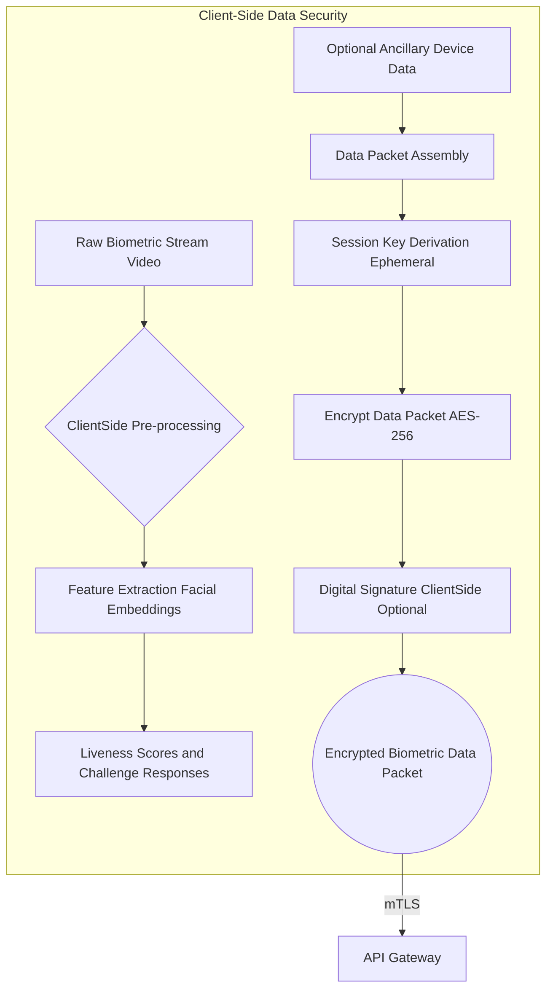
*   **Client-Side Pre-processing C:** Raw biometric data is converted into high-dimensional feature vectors embeddings `f_B = H(B)` using advanced neural networks. This reduces data volume and protects privacy by making the original biometric non-reconstructible.
*   **Data Packet Assembly E:** The feature vector `f_B`, liveness scores `L_s`, challenge responses `C_r`, and a transaction nonce `N_tx` are assembled into a packet `P_bio = {f_B, L_s, C_r, N_tx}`.
*   **Session Key Derivation F:** A unique, ephemeral symmetric key `K_session` is derived for each transaction using a key exchange protocol e.g., Diffie-Hellman over TLS handshake between the client and API Gateway. Eq. 1 `K_session = KDF(Shared_Secret, Client_Nonce, Server_Nonce)`
*   **Encryption G:** The packet `P_bio` is encrypted using `K_session` and a robust symmetric algorithm like AES-256 in GCM mode. Eq. 2 `C_bio = AES-256-GCM(K_session, P_bio, IV, Tag)`
*   **Digital Signature H:** Optionally, the client can sign the encrypted packet `C_bio` using a client-side private key e.g., from a TPM/Secure Enclave for enhanced non-repudiation. Eq. 3 `Sig_client = Sign(PK_client, Hash(C_bio))`

### 2. Client-Side Workflow and User Interface Components

Upon a user initiating a sensitive action e.g., "Confirm Payment," "Authorize Transfer," "Grant Access", a dedicated modal component `BiometricConfirmationModal` is programmatically rendered.

#### 2.1. Biometric Media Stream Acquisition

The modal component dynamically leverages the `navigator.mediaDevices.getUserMedia` Web API to request and acquire a live video stream from the user's camera. This stream is then securely attached to an HTML `<video>` element, which is styled to occupy a prominent area within the modal. Critical configurations for `getUserMedia` include:
*   `video: { facingMode: "user", width: { ideal: 1280 }, height: { ideal: 720 }, frameRate: { ideal: 30 } }` to ensure optimal resolution and frame rate for biometric analysis. Frame rate `F_R` is optimized for smooth liveness detection and visual feedback. Eq. 4 `min_pixels = W * H * F_R / (D_sens * C_rate)` where `W` and `H` are width/height, `D_sens` is detection sensitivity, `C_rate` is compression rate.
*   Error handling for `NotAllowedError`, `NotFoundError`, `NotReadableError`, `OverconstrainedError`, and `TypeError` is robustly implemented to guide the user in case of camera access issues.
*   For advanced facial landmark detection, client-side inference libraries like MediaPipe or TensorFlow.js are utilized to extract key points `P_i = (x_i, y_i, z_i)` at frame rate `F_R`.

#### 2.2. State Management and Visual Feedback System

The core of the animated security feedback is driven by a sophisticated client-side state machine. This state machine formally defines the permissible transitions between distinct stages of the confirmation process, each mapped to a specific visual animation.

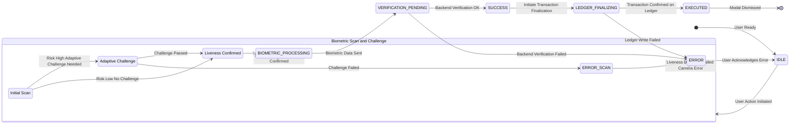

**States of the `BiometricConfirmationModal` State Machine:**
*   `IDLE`: Initial state, awaiting user action.
*   `SCANNING_CHALLENGE`: Active state for live video stream, displaying dynamic biometric scanning overlay, liveness detection, and potentially engaging adaptive challenges. Sub-states `SCANNING_INIT`, `ADAPT_CHALLENGE`, `LIVENESS_OK` manage the flow.
*   `BIOMETRIC_PROCESSING`: Raw biometric data packaged, encrypted, and transmitted to the backend for verification. Client-side displays a "Processing Data" animation.
*   `VERIFICATION_PENDING`: Awaiting response from the Biometric Verification Service.
*   `SUCCESS`: Biometric verification successful. Displays a confirmation animation.
*   `LEDGER_FINALIZING`: Transaction payload cryptographically signed and submitted to the secure ledger. Displays a ledger finalization animation.
*   `EXECUTED`: Transaction successfully recorded on the ledger. Modal ready for dismissal.
*   `ERROR`: Any failure state camera access, liveness detection, backend verification, ledger write failure. Displays an error animation and message.

#### 2.2.1. BiometricConfirmationModal Internal Workflow

This diagram illustrates the high-level internal method calls and state transitions orchestrated by the `BiometricConfirmationModal` class.

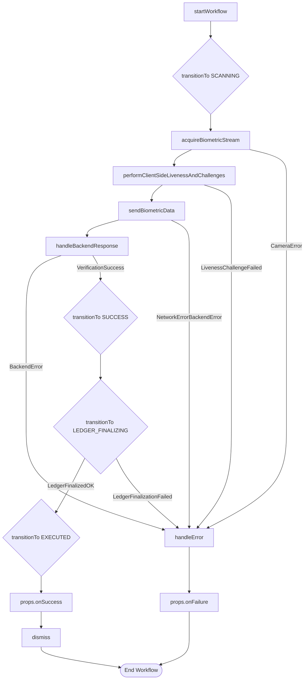

#### 2.3. Animation Implementation Details

The animated overlays are implemented with meticulous attention to detail, leveraging advanced web technologies for optimal performance and visual fidelity.

##### 2.3.1. `SCANNING_CHALLENGE` State: Dynamic Biometric Acquisition Overlay

When in the `SCANNING_CHALLENGE` state, a visually complex, multi-layered animation is overlaid on the live video feed. This animation is designed to simulate an intelligent, analytical scan, far beyond a simple static line.
*   **Technique:** Primarily implemented using WebGL shaders via libraries like Three.js or custom GLSL for real-time procedural generation of graphical effects, or high-performance SVG animations/CSS transforms for less computationally intensive scenarios.
*   **Features:**
    *   **Facial Mesh Overlay:** A dynamically conforming wireframe mesh that subtly adjusts to detected facial features e.g., via `dlib` or `mediapipe` client-side inference for landmark detection, indicating active analysis of facial topography. The mesh points `M_p = { (x_j, y_j, z_j) }` are derived from detected facial landmarks.
    *   **Scanning Pulse Effect:** A translucent, energetic wave or grid pattern that propagates across the face, signifying data acquisition. This can be achieved with `radial-gradient` CSS animations combined with `blend-mode` or WebGL fragment shaders. The pulse amplitude `A(t)` could follow `A(t) = A_0 * sin(omega * t + phi) * e^(-gamma * t)`. Eq. 5
    *   **Biometric Data Visualization:** Abstract graphical elements, such as pulsating data points or converging lines, indicating the capture of unique biometric identifiers.
*   **Psychological Impact:** Reinforces the perception of rigorous, scientific biometric analysis, fostering a sense of advanced technological security.

##### 2.3.2. `SUCCESS` State: Affirmative Verification Acknowledgment

Upon receiving a positive verification from the backend, the `SUCCESS` state is activated, triggering a fluid, reassuring animation.
*   **Technique:** High-performance SVG animations e.g., using `Lottie` or custom `SMIL` animations or CSS `transition`/`animation` properties for vector-based graphics. Path animations `P(t)` are defined by Bezier curves `B(t) = (1-t)^3 P_0 + 3(1-t)^2 t P_1 + 3(1-t) t^2 P_2 + t^3 P_3`. Eq. 6
*   **Features:**
    *   **Cryptographic Checkmark:** A stylized checkmark that animates into existence with a satisfying "spring" or "snap" effect, often accompanied by subtle glow or particle effects. The spring motion `x(t) = A e^(-zeta * omega_n * t) cos(omega_d * t - phi)` provides naturalistic feedback. Eq. 7
    *   **Expanding Shield/Biometric Seal:** A graphic representing a secure shield or a unique biometric fingerprint icon that visually seals or locks, signifying immutability and successful authentication. The expansion rate `R(t) = R_0 + k * t^2` could be used. Eq. 8
*   **Psychological Impact:** Elicits a strong positive emotional response, providing immediate and unambiguous confirmation of successful identity verification, thereby building user confidence.

##### 2.3.3. `LEDGER_FINALIZING` State: Secure Transaction Finalization Visualization

This critical phase visually communicates the secure, immutable recording of the transaction, leveraging advanced metaphors.
*   **Technique:** Complex JavaScript-driven canvas animations e.g., HTML Canvas API, Konva.js, Pixi.js or WebGL for simulating distributed ledger interactions.
*   **Features:**
    *   **Quantum Ledger Animation:** Visualizes data packets representing the transaction being fragmented, encrypted, and then distributed across a network of interconnected nodes, ultimately coalescing into an immutable chain or block. Animated cryptographic hash calculations can be subtly depicted. The movement of `N` packets `P_i` towards `M` ledger nodes `L_j` can be modeled by `d(P_i, L_j, t) = v_0 - a*t^2`. Eq. 9
    *   **Data Flow & Consensus:** Abstract lines and nodes forming pathways, with visual cues like glowing nodes or synchronized pulses, indicating consensus mechanisms and secure data propagation. The pulse synchronization delay `D_sync` for `N` nodes in a network of average latency `L_avg` can be `D_sync = N * L_avg`. Eq. 10
    *   **Immutable Seal:** A final, permanent graphical lock or seal that appears on the abstract representation of the ledger, signifying irreversible commitment.
*   **Psychological Impact:** Conveys the ultimate security and tamper-proof nature of the transaction, reinforcing transparency and the finality of the action, crucial for critical financial or administrative operations.

#### 2.3.4. Animated Feedback Layer Architecture

This diagram details the internal components and responsibilities of the `Animated Feedback Layer`.

```mermaid
graph TD
    subgraph Animated Feedback Layer
        A[BiometricConfirmationModal] --> B[IAnimationEngine Interface]
        B --> C[WebGLAnimationEngine]
        B --> D[SVGAnimationEngine]
        C -- Renders --> E[Biometric Scanning Overlay]
        D -- Renders --> F[Success Checkmark]
        D -- Renders --> G[Ledger Finalization Visuals]
        A -- State Changes --> B
        E & F & G -- Interacts With --> H[Video Stream Element]
        I[Client-Side Feature Extraction] --> E : Facial Landmarks
    end
```

#### 2.4. Adaptive Biometric Challenge System

To further enhance liveness detection and deter sophisticated spoofing attacks, the system dynamically integrates randomized challenges during the `SCANNING_CHALLENGE` phase.
*   **Dynamic Challenge Generation:** Based on risk assessment from the `Risk Assessment Service` and previous user behavior, the system may present visual or auditory prompts requiring specific, simple user actions e.g., "blink twice," "turn head left," "look up," "read a specific phrase." These challenges are explicitly modeled in the `SCANNING_CHALLENGE` state's `ADAPT_CHALLENGE` sub-state.
*   **Real-time Response Analysis:** Client-side algorithms e.g., using MediaPipe for facial landmark tracking analyze the live video stream to confirm the correct execution of the challenge. For a blink detection, the Eye Aspect Ratio EAR `EAR = (|p2-p6| + |p3-p5|) / (2 * |p1-p4|)` is monitored, where `p_i` are 2D landmark coordinates. Eq. 11 A blink is detected when `EAR` drops below a threshold `T_EAR`.
*   **Benefits:** This adds a layer of interactive security that is extremely difficult for pre-recorded videos, static images, or simple masks to circumvent, increasing the robust confidence in the "liveness" aspect of the biometric verification. The probability of a successful spoofing attack `P_spoof` is exponentially reduced with `N_c` randomized challenges: Eq. 12 `P_spoof_new = P_spoof_orig * (1/C_choices)^N_c`, where `C_choices` is the number of distinct challenges.

#### 2.5. Detailed Biometric Capture and Liveness Flow

This diagram illustrates the granular steps involved in capturing biometric data and ensuring liveness on the client-side, corresponding to node C in the System Architecture.

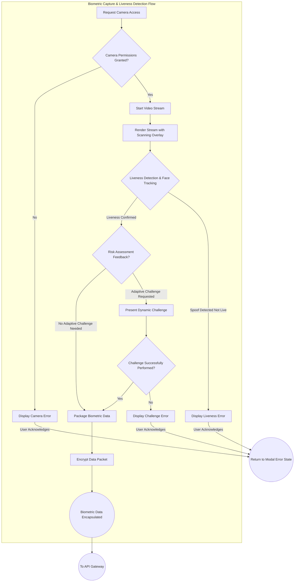

#### 2.6. Client-Side Components and Data Model

The client-side modal is managed by a conceptual `BiometricConfirmationModal` class, interacting with several interfaces and enums to define its behavior, state, and customizable options.

```typescript
// Conceptual Interface for Biometric Confirmation Modal Props
export interface BiometricConfirmationProps {
    transactionPayload: Record<string, any>;
    onSuccess: (transactionId: string) => void;
    onFailure: (error: BiometricError) => void;
    // Optional theming and i18n props
    themeConfig?: BiometricThemeConfig;
    localeStrings?: BiometricLocaleStrings;
    // Core configuration for biometric processes
    config?: BiometricConfig;
}

// Core Configuration for Biometric Processes
export interface BiometricConfig {
    cameraResolution: { width: number; height: number; };
    cameraFrameRate: number;
    livenessDetectionThreshold: number;
    challengeTimeoutMs: number;
    backendVerificationTimeoutMs: number;
    ledgerFinalizationTimeoutMs: number;
    apiEndpoint: string;
    // ... other configurable parameters like encryption algorithms, feature extraction models
}

// Enum for Biometric Confirmation States
export enum BiometricConfirmationState {
    IDLE = 'IDLE',
    SCANNING = 'SCANNING', // Maps to SCANNING_CHALLENGE in detailed state diagram
    BIOMETRIC_PROCESSING = 'BIOMETRIC_PROCESSING',
    VERIFICATION_PENDING = 'VERIFICATION_PENDING',
    SUCCESS = 'SUCCESS',
    LEDGER_FINALIZING = 'LEDGER_FINALIZING',
    EXECUTED = 'EXECUTED',
    ERROR = 'ERROR',
}

// Enum for types of adaptive challenges
export enum AdaptiveChallengeType {
    BLINK_TWICE = 'BLINK_TWICE',
    TURN_HEAD_LEFT = 'TURN_HEAD_LEFT',
    LOOK_UP = 'LOOK_UP',
    SPOKEN_PHRASE = 'SPOKEN_PHRASE',
    HEAD_NOD = 'HEAD_NOD',
    EYE_FOLLOW = 'EYE_FOLLOW',
    // ... more challenge types can be added
}

// Interface for Biometric Error details
export interface BiometricError {
    code: string;
    message: string;
    details?: string;
    canRetry: boolean;
    recoveryAction?: string; // e.g., "Check camera permissions", "Contact support"
    originalError?: any; // Original error object for debugging
}

// Define interfaces for theming and internationalization
export interface BiometricThemeConfig {
    primaryColor: string;
    secondaryColor: string;
    successColor: string;
    errorColor: string;
    fontFamily: string;
    modalBackgroundColor: string;
    // ... other styling properties like modal dimensions, button styles
}

export interface BiometricLocaleStrings {
    scanPrompt: string; // e.g., "Look into the camera for a biometric scan."
    processingData: string; // e.g., "Processing your biometric data..."
    verificationSuccess: string; // e.g., "Biometric verification successful!"
    finalizingTransaction: string; // e.g., "Finalizing transaction on secure ledger..."
    cameraError: string; // e.g., "Camera access denied. Please enable camera in settings."
    livenessFailed: string; // e.g., "Liveness check failed. Please ensure your face is clearly visible."
    challengeInstructions: (type: AdaptiveChallengeType) => string; // Function for dynamic challenge instructions
    genericError: string; // e.g., "An unexpected error occurred. Please try again."
    retryButton: string; // e.g., "Retry"
    cancelButton: string; // e.g., "Cancel"
    contactSupport: string; // e.g., "Contact Support"
    // ... other localized strings for error messages, retry buttons etc.
}

// Interface for a generic Animation Engine
export interface IAnimationEngine {
    init(container: HTMLElement, videoElement: HTMLVideoElement): void;
    startScanningAnimation(faceLandmarks?: { x: number; y: number; z: number; }[]): void;
    stopScanningAnimation(): void;
    startSuccessAnimation(): void;
    stopSuccessAnimation(): void;
    startLedgerFinalizingAnimation(): void;
    stopLedgerFinalizingAnimation(): void;
    startErrorAnimation(errorCode: string): void;
    stopErrorAnimation(): void;
    dispose(): void;
}

// Example WebGL Animation Engine implementation
export class WebGLAnimationEngine implements IAnimationEngine {
    private container: HTMLElement | null = null;
    private videoElement: HTMLVideoElement | null = null;
    private scene: any; // Three.js Scene
    private camera: any; // Three.js Camera
    private renderer: any; // Three.js Renderer
    private animationFrameId: number | null = null;

    init(container: HTMLElement, videoElement: HTMLVideoElement): void {
        this.container = container;
        this.videoElement = videoElement;
        // Initialize Three.js scene, camera, renderer
        // Set up video texture for background
        // ...
        console.log("WebGLAnimationEngine initialized.");
    }

    startScanningAnimation(faceLandmarks?: { x: number; y: number; z: number; }[]): void {
        this.stopAllAnimations();
        // Logic to create/update facial mesh, scanning pulse, data visualization using WebGL
        // Pass faceLandmarks to update mesh conformity
        this.renderLoop();
        console.log("WebGL scanning animation started.");
    }

    stopScanningAnimation(): void {
        this.stopAllAnimations();
        console.log("WebGL scanning animation stopped.");
    }

    startSuccessAnimation(): void {
        this.stopAllAnimations();
        // Logic to render cryptographic checkmark or expanding shield
        this.renderLoop();
        console.log("WebGL success animation started.");
    }

    stopSuccessAnimation(): void {
        this.stopAllAnimations();
        console.log("WebGL success animation stopped.");
    }

    startLedgerFinalizingAnimation(): void {
        this.stopAllAnimations();
        // Logic to render quantum ledger, data packets, consensus visuals
        this.renderLoop();
        console.log("WebGL ledger finalization animation started.");
    }

    stopLedgerFinalizingAnimation(): void {
        this.stopAllAnimations();
        console.log("WebGL ledger finalization animation stopped.");
    }

    startErrorAnimation(errorCode: string): void {
        this.stopAllAnimations();
        // Logic to render error specific animation e.g., broken shield, red flash
        this.renderLoop();
        console.log(`WebGL error animation started for code: ${errorCode}.`);
    }

    stopErrorAnimation(): void {
        this.stopAllAnimations();
        console.log("WebGL error animation stopped.");
    }

    private renderLoop = () => {
        if (this.renderer) {
            this.renderer.render(this.scene, this.camera);
            this.animationFrameId = requestAnimationFrame(this.renderLoop);
        }
    }

    private stopAllAnimations(): void {
        if (this.animationFrameId !== null) {
            cancelAnimationFrame(this.animationFrameId);
            this.animationFrameId = null;
        }
        // Additional cleanup for specific animation elements if needed
    }

    dispose(): void {
        this.stopAllAnimations();
        if (this.renderer) {
            this.renderer.dispose();
        }
        // Cleanup Three.js resources
        console.log("WebGLAnimationEngine disposed.");
    }
}

// Example Liveness Detector class
export class LivenessDetector {
    private videoElement: HTMLVideoElement | null = null;
    private config: BiometricConfig;
    private faceDetectionModel: any; // e.g., MediaPipe Face Mesh model

    constructor(config: BiometricConfig) {
        this.config = config;
        // Load face detection model (e.g., MediaPipe)
        // this.faceDetectionModel = new FaceMesh({...});
    }

    public async init(videoElement: HTMLVideoElement): Promise<void> {
        this.videoElement = videoElement;
        // await this.faceDetectionModel.load();
        console.log("LivenessDetector initialized.");
    }

    public async detectLiveness(): Promise<boolean> {
        if (!this.videoElement) {
            throw new Error("LivenessDetector not initialized with video element.");
        }
        // Placeholder for actual liveness detection logic
        // This would involve analyzing video frames using the loaded faceDetectionModel
        // and various heuristics (e.g., blink rate, head movement, texture analysis).
        const frame = this.videoElement; // Get current video frame
        // const predictions = await this.faceDetectionModel.estimateFaces(frame);
        // if (predictions && predictions.length > 0) {
        //     const face = predictions[0];
        //     // Perform liveness checks:
        //     // 1. Check for sufficient facial landmarks
        //     // 2. Analyze micro-expressions (e.g., blinks, mouth movements)
        //     // 3. Simple depth estimation (e.g., using relative distances of landmarks)
        //     const isLive = this.analyzeCues(face);
        //     return isLive;
        // }
        await new Promise(resolve => setTimeout(resolve, 500)); // Simulate processing
        return true; // Simulate success
    }

    private analyzeCues(face: any): boolean {
        // Implement detailed logic here:
        // Calculate Eye Aspect Ratio (EAR) for blinks
        // Analyze head pose changes over time
        // Compare skin texture to known spoofing materials
        // ...
        return Math.random() > (1 - this.config.livenessDetectionThreshold); // Simulate based on threshold
    }

    public async performChallenge(challengeType: AdaptiveChallengeType): Promise<boolean> {
        if (!this.videoElement) {
            throw new Error("LivenessDetector not initialized for challenges.");
        }
        // Logic to monitor video stream for specific user action
        console.log(`Performing adaptive challenge: ${challengeType}`);
        // Simulate challenge success
        await new Promise(resolve => setTimeout(resolve, this.config.challengeTimeoutMs));
        return Math.random() > 0.3; // Simulate 70% chance of success
    }

    public dispose(): void {
        // Cleanup model resources
        console.log("LivenessDetector disposed.");
    }
}

// Example Biometric Data Processor class
export class BiometricDataProcessor {
    private videoElement: HTMLVideoElement | null = null;
    private config: BiometricConfig;
    private faceEmbeddingModel: any; // e.g., pre-trained deep learning model for facial embeddings

    constructor(config: BiometricConfig) {
        this.config = config;
        // Load biometric feature extraction model
        // this.faceEmbeddingModel = new FaceNetModel({...});
    }

    public async init(videoElement: HTMLVideoElement): Promise<void> {
        this.videoElement = videoElement;
        // await this.faceEmbeddingModel.load();
        console.log("BiometricDataProcessor initialized.");
    }

    public async extractAndEncryptData(livenessScores: any, challengeResponses: any, transactionPayloadHash: string): Promise<string> {
        if (!this.videoElement) {
            throw new Error("BiometricDataProcessor not initialized with video element.");
        }
        // 1. Extract feature vector (e.g., facial embedding)
        const frame = this.videoElement; // Get current video frame
        // const embedding = await this.faceEmbeddingModel.predict(frame);

        // Placeholder for actual embedding
        const embedding = "mock_face_embedding_12345";

        // 2. Assemble data packet
        const dataPacket = {
            embedding,
            livenessScores,
            challengeResponses,
            transactionPayloadHash,
            timestamp: Date.now(),
            nonce: Math.random().toString(36).substring(2, 15) // Example nonce
        };

        // 3. Encrypt data packet (simulated)
        // In a real scenario, this would involve client-side crypto libs using ephemeral session keys.
        const encryptedData = btoa(JSON.stringify(dataPacket)); // Base64 for simulation

        console.log("Biometric data extracted and encrypted.");
        return encryptedData;
    }

    public dispose(): void {
        // Cleanup model resources
        console.log("BiometricDataProcessor disposed.");
    }
}

// Conceptual BiometricConfirmationModal component/class
export class BiometricConfirmationModal {
    private currentState: BiometricConfirmationState = BiometricConfirmationState.IDLE;
    private videoElement: HTMLVideoElement | null = null;
    private animationContainer: HTMLElement | null = null;
    private mediaStream: MediaStream | null = null;
    private animationEngine: IAnimationEngine;
    private livenessDetector: LivenessDetector;
    private biometricProcessor: BiometricDataProcessor;
    private props: BiometricConfirmationProps;
    private timerId: number | null = null; // For timeouts in states
    private currentTransactionId: string | null = null;

    constructor(props: BiometricConfirmationProps,
                animationEngine: IAnimationEngine = new WebGLAnimationEngine(), // Default implementation
                livenessDetector: LivenessDetector = new LivenessDetector(props.config || defaultBiometricConfig),
                biometricProcessor: BiometricDataProcessor = new BiometricDataProcessor(props.config || defaultBiometricConfig)) {
        this.props = { ...props, config: { ...defaultBiometricConfig, ...props.config } }; // Merge with defaults
        this.animationEngine = animationEngine;
        this.livenessDetector = livenessDetector;
        this.biometricProcessor = biometricProcessor;

        this.renderModalBase();
    }

    private renderModalBase(): void {
        // Create modal DOM structure (e.g., using a framework like React, Vue, or vanilla JS)
        // Append video element, animation layer, and text feedback areas
        // Apply theming via props.themeConfig
        // Set localized text via props.localeStrings

        const modalDiv = document.createElement('div');
        modalDiv.className = 'biometric-confirmation-modal';
        modalDiv.style.backgroundColor = this.props.themeConfig?.modalBackgroundColor || 'white';
        modalDiv.style.fontFamily = this.props.themeConfig?.fontFamily || 'sans-serif';

        this.videoElement = document.createElement('video');
        this.videoElement.autoplay = true;
        this.videoElement.muted = true;
        this.videoElement.className = 'biometric-video-feed';
        modalDiv.appendChild(this.videoElement);

        this.animationContainer = document.createElement('div');
        this.animationContainer.className = 'biometric-animation-layer';
        modalDiv.appendChild(this.animationContainer);

        // Initialize the animation engine
        if (this.animationContainer && this.videoElement) {
            this.animationEngine.init(this.animationContainer, this.videoElement);
        } else {
            console.error("Animation container or video element not ready for engine init.");
        }

        // Add text feedback area, buttons for retry/cancel etc.
        document.body.appendChild(modalDiv); // Or attach to a specific root element
    }

    public async startWorkflow(): Promise<void> {
        try {
            this.transitionTo(BiometricConfirmationState.SCANNING);
            await this.acquireBiometricStream(); // C1 to C4
            await this.livenessDetector.init(this.videoElement!);
            await this.biometricProcessor.init(this.videoElement!);
            await this.performClientSideLivenessAndChallenges(); // C5 to C9
            await this.sendBiometricData(); // C10 to API Gateway
        } catch (error: any) {
            this.handleError(error);
        }
    }

    private transitionTo(newState: BiometricConfirmationState, error?: BiometricError): void {
        this.currentState = newState;
        this.stopAllAnimations(); // Stop current animation before starting new one
        // Update UI based on new state and start relevant animations
        switch (newState) {
            case BiometricConfirmationState.SCANNING:
                this.animationEngine.startScanningAnimation();
                this.updateUIText(this.props.localeStrings?.scanPrompt || "Look into the camera for a biometric scan.");
                break;
            case BiometricConfirmationState.BIOMETRIC_PROCESSING:
                this.animationEngine.stopScanningAnimation(); // Transition from scanning visually
                this.updateUIText(this.props.localeStrings?.processingData || "Processing your biometric data...");
                break;
            case BiometricConfirmationState.VERIFICATION_PENDING:
                // No specific animation for pending, perhaps a subtle pulse
                this.updateUIText(this.props.localeStrings?.processingData || "Verifying your identity...");
                break;
            case BiometricConfirmationState.SUCCESS:
                this.animationEngine.startSuccessAnimation();
                this.updateUIText(this.props.localeStrings?.verificationSuccess || "Biometric verification successful!");
                break;
            case BiometricConfirmationState.LEDGER_FINALIZING:
                this.animationEngine.stopSuccessAnimation(); // Transition from success visually
                this.animationEngine.startLedgerFinalizingAnimation();
                this.updateUIText(this.props.localeStrings?.finalizingTransaction || "Finalizing transaction on secure ledger...");
                break;
            case BiometricConfirmationState.ERROR:
                this.animationEngine.startErrorAnimation(error?.code || 'UNKNOWN_ERROR');
                this.updateUIText(error?.message || this.props.localeStrings?.genericError || "An error occurred.");
                // Show retry/cancel buttons
                break;
            case BiometricConfirmationState.EXECUTED:
                this.animationEngine.stopLedgerFinalizingAnimation();
                this.updateUIText("Transaction completed.");
                break;
            case BiometricConfirmationState.IDLE:
            default:
                this.updateUIText("");
                break;
        }

        if (error) {
            console.error("Biometric Workflow Error:", error);
            // Render specific error UI elements using error.message and error.recoveryAction
        }
        // Emit state change for external observers/logging, adhering to audit requirements
        this.emitStateChange(newState, error);
    }

    private updateUIText(text: string): void {
        // Update a specific DOM element for feedback text
        const feedbackEl = document.querySelector('.biometric-feedback-text');
        if (feedbackEl) {
            feedbackEl.textContent = text;
        }
    }

    private stopAllAnimations(): void {
        this.animationEngine.stopScanningAnimation();
        this.animationEngine.stopSuccessAnimation();
        this.animationEngine.stopLedgerFinalizingAnimation();
        this.animationEngine.stopErrorAnimation();
    }

    private async acquireBiometricStream(): Promise<void> {
        try {
            this.mediaStream = await navigator.mediaDevices.getUserMedia({
                video: {
                    facingMode: "user",
                    width: { ideal: this.props.config!.cameraResolution.width },
                    height: { ideal: this.props.config!.cameraResolution.height },
                    frameRate: { ideal: this.props.config!.cameraFrameRate }
                }
            });
            if (this.videoElement) {
                this.videoElement.srcObject = this.mediaStream;
                await this.videoElement.play();
                this.transitionTo(BiometricConfirmationState.BIOMETRIC_PROCESSING); // Indicate initial processing
            } else {
                throw new Error("Video element not available after creation.");
            }
        } catch (e: any) {
            if (e.name === 'NotAllowedError') {
                throw { code: 'CAMERA_PERMISSION_DENIED', message: this.props.localeStrings?.cameraError || "Camera access denied. Please grant permissions.", canRetry: false, recoveryAction: "Check browser/OS camera settings.", originalError: e };
            } else if (e.name === 'NotFoundError') {
                throw { code: 'CAMERA_NOT_FOUND', message: "No camera found.", canRetry: false, recoveryAction: "Ensure a camera is connected and enabled.", originalError: e };
            }
            throw { code: 'CAMERA_GENERIC_ERROR', message: `Camera error: ${e.message}`, canRetry: true, originalError: e };
        }
    }

    private async performClientSideLivenessAndChallenges(): Promise<void> {
        this.transitionTo(BiometricConfirmationState.SCANNING); // Back to scanning state but now with liveness/challenges
        const isLive = await this.livenessDetector.detectLiveness();
        if (!isLive) {
            throw { code: 'LIVENESS_FAILED_INITIAL', message: this.props.localeStrings?.livenessFailed || "Liveness check failed.", canRetry: true, recoveryAction: "Ensure good lighting and face visibility." };
        }

        // Simulate risk assessment feedback for adaptive challenge
        // In a real system, this would come from the Risk Assessment Service via API Gateway.
        const riskLevel = Math.random(); // 0-1, higher means higher risk
        if (riskLevel > 0.6) { // High risk, needs challenge
            const challengeType = this.determineAdaptiveChallenge(riskLevel);
            this.updateUIText(this.props.localeStrings?.challengeInstructions(challengeType) || `Please ${challengeType.replace(/_/g, ' ').toLowerCase()}.`);
            const challengePassed = await this.livenessDetector.performChallenge(challengeType);
            if (!challengePassed) {
                throw { code: 'ADAPTIVE_CHALLENGE_FAILED', message: this.props.localeStrings?.livenessFailed || `Challenge failed: ${this.props.localeStrings?.challengeInstructions(challengeType)}`, canRetry: true };
            }
        }
        // If all liveness and challenges pass, proceed
        console.log("Client-side liveness and challenges passed.");
    }

    private determineAdaptiveChallenge(riskLevel: number): AdaptiveChallengeType {
        // Example logic to pick a challenge based on risk
        if (riskLevel > 0.8) return AdaptiveChallengeType.SPOKEN_PHRASE;
        if (riskLevel > 0.7) return AdaptiveChallengeType.TURN_HEAD_LEFT;
        return AdaptiveChallengeType.BLINK_TWICE;
    }


    private async sendBiometricData(): Promise<void> {
        this.transitionTo(BiometricConfirmationState.VERIFICATION_PENDING);

        const transactionPayloadHash = this.generatePayloadHash(this.props.transactionPayload);
        const encryptedBiometricPacket = await this.biometricProcessor.extractAndEncryptData(
            { initialLiveness: true }, // Placeholder liveness scores
            { challenge1: true },     // Placeholder challenge responses
            transactionPayloadHash
        );

        try {
            const response = await fetch(this.props.config!.apiEndpoint, {
                method: 'POST',
                headers: { 'Content-Type': 'application/json' },
                body: JSON.stringify({
                    biometricData: encryptedBiometricPacket,
                    transactionPayloadHash: transactionPayloadHash,
                    // ... other context (e.g., device ID, timestamp)
                })
            });

            if (!response.ok) {
                const errorData = await response.json();
                throw { code: errorData.code || 'BACKEND_VERIFICATION_FAILED', message: errorData.message || 'Biometric verification failed on backend.', canRetry: true, details: errorData.details };
            }

            const result = await response.json();
            this.handleBackendResponse(result);

        } catch (e: any) {
            if (e.code) { // Custom BiometricError
                throw e;
            }
            throw { code: 'NETWORK_ERROR', message: `Network or server error: ${e.message}`, canRetry: true, originalError: e };
        }
    }

    private generatePayloadHash(payload: Record<string, any>): string {
        // In a real application, use a robust cryptographic hash function like SHA-256
        return btoa(JSON.stringify(payload)).substring(0, 32); // Simple base64 hash for demo
    }

    private handleBackendResponse(response: { success: boolean, transactionId?: string, error?: BiometricError }): void {
        if (response.success) {
            this.currentTransactionId = response.transactionId || `TXN_${Date.now()}`; // Ensure ID
            this.transitionTo(BiometricConfirmationState.SUCCESS);
            // Backend initiated ledger finalization and will confirm
            this.transitionTo(BiometricConfirmationState.LEDGER_FINALIZING);

            // Simulate waiting for ledger finalization callback from backend/websocket
            this.timerId = window.setTimeout(() => {
                if (this.currentTransactionId) {
                    this.transitionTo(BiometricConfirmationState.EXECUTED);
                    this.props.onSuccess(this.currentTransactionId);
                    this.dismiss();
                } else {
                    this.handleError({ code: 'LEDGER_NO_TRANSACTION_ID', message: 'Transaction finalized but no ID received.', canRetry: false });
                }
            }, this.props.config!.ledgerFinalizationTimeoutMs); // Use configurable delay
        } else {
            this.handleError(response.error || { code: 'UNKNOWN_BACKEND_ERROR', message: 'Backend reported an unknown error.', canRetry: true });
        }
    }

    private handleError(error: any): void {
        const biometricError: BiometricError = {
            code: error.code || 'UNKNOWN_ERROR',
            message: error.message || this.props.localeStrings?.genericError || 'An unexpected error occurred.',
            canRetry: error.canRetry !== undefined ? error.canRetry : true,
            recoveryAction: error.recoveryAction,
            originalError: error.originalError
        };
        this.transitionTo(BiometricConfirmationState.ERROR, biometricError);
        this.props.onFailure(biometricError);
    }

    private dismiss(): void {
        if (this.mediaStream) {
            this.mediaStream.getTracks().forEach(track => track.stop());
        }
        if (this.timerId !== null) {
            clearTimeout(this.timerId);
            this.timerId = null;
        }
        this.animationEngine.dispose();
        this.livenessDetector.dispose();
        this.biometricProcessor.dispose();
        // Remove modal from DOM and clean up any listeners/resources
        // For a framework, this would involve unmounting the component
        const modalDiv = document.querySelector('.biometric-confirmation-modal');
        if (modalDiv) {
            modalDiv.remove();
        }
    }

    private emitStateChange(state: BiometricConfirmationState, error?: BiometricError): void {
        // This method can be used for internal logging, analytics, or
        // to trigger external UI updates if the modal is part of a larger application state.
        console.log(`BiometricConfirmationModal State: ${state}`, error);
        // Here, one could also dispatch events or update a global store.
    }

    // Public method to close the modal externally if needed
    public close(): void {
        this.dismiss();
    }
}

// Default configuration for the biometric flow
const defaultBiometricConfig: BiometricConfig = {
    cameraResolution: { width: 1280, height: 720 },
    cameraFrameRate: 30,
    livenessDetectionThreshold: 0.7, // 70% confidence for liveness
    challengeTimeoutMs: 10000,      // 10 seconds for user to perform challenge
    backendVerificationTimeoutMs: 5000, // 5 seconds for backend to verify
    ledgerFinalizationTimeoutMs: 3000,  // 3 seconds for ledger to confirm
    apiEndpoint: '/api/biometric/verify',
};


// Export necessary interfaces and classes for potential external use or testing
export {
    BiometricConfirmationProps,
    BiometricConfig,
    BiometricConfirmationState,
    AdaptiveChallengeType,
    BiometricError,
    BiometricThemeConfig,
    BiometricLocaleStrings,
    IAnimationEngine,
    WebGLAnimationEngine, // Example implementation
    LivenessDetector,
    BiometricDataProcessor,
    BiometricConfirmationModal
};
```

#### 2.7. Theming and Internationalization

The entire animated feedback sequence, including colors, shapes, and textual prompts, is designed to be configurable for easy theming and internationalization.
*   **CSS Variables/Theming Context:** The `BiometricThemeConfig` interface allows brands to seamlessly integrate the modal's aesthetic into their existing design systems by providing specific color palettes, fonts, and layout parameters. These configurations are typically applied via CSS variables or a theming context in modern web frameworks. A color contrast ratio `C = (L_1 + 0.05) / (L_2 + 0.05)` Eq. 13 where `L` is relative luminance, is maintained above WCAG AA (4.5:1) or AAA (7:1) for readability.
*   **Localized Content:** All textual elements are managed through the `BiometricLocaleStrings` interface and corresponding i18n frameworks, ensuring clarity and cultural relevance for a global user base. This includes dynamic prompts for adaptive challenges, error messages, and state descriptions.
*   **Accessible Design:** Adherence to WCAG guidelines for animations, color contrast, and descriptive text ensures the security feedback is perceivable by users with diverse needs. Animations can include `prefers-reduced-motion` queries for users with motion sensitivities, effectively reducing or disabling overly active animations when detected. A perceptual speed `S_p` of an animation `S_p = d(path) / T_anim` is considered to avoid cognitive overload. Eq. 14

### 3. Backend Biometric Processing and Security Considerations

#### 3.1. Biometric Data Transmission and Storage

*   **Encryption-in-Transit:** Biometric data, once encapsulated on the client-side, is immediately encrypted using robust, ephemeral session keys derived from a mutually authenticated TLS 1.3 channel or mTLS for even higher assurance before transmission to the API Gateway.
*   **Secure Enclave Processing:** The Biometric Verification Service processes the data within a Trusted Execution Environment TEE or a Hardware Security Module HSM to protect against side-channel attacks and unauthorized access to biometric templates. This isolation ensures that even if the host OS is compromised, the sensitive biometric comparison logic remains protected.
*   **Template Storage:** Biometric templates e.g., facial vectors, iris codes are not stored as raw images but as irreversible, cryptographically hashed, and salted representations. These templates are stored in a highly secured, access-controlled database managed by the `Identity Management Service`, potentially sharded and encrypted at rest using envelope encryption. The template `T_bio` is stored as `T_bio_hashed = H_crypto(T_bio || S_salt)` where `H_crypto` is a one-way cryptographic hash function and `S_salt` is a unique, randomly generated salt. Eq. 15 The probability of collision for a good hash function with `N` bits is `P_collision = 1 / 2^N`. Eq. 16

##### 3.1.1. Secure Biometric Enrollment Process

The initial enrollment of a user's biometric data is a critical security phase.

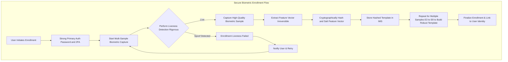
*   **Multi-Factor Enrollment Confirmation:** Initial biometric enrollment typically requires a strong existing authentication method e.g., high-assurance password + hardware 2FA to link the biometric to the user's identity. This establishes initial trust.
*   **Multiple Sample Acquisition:** Several high-quality biometric samples are collected from different angles/conditions to build a robust and comprehensive template. This improves matching accuracy by capturing natural variations. Let `N_samples` be the number of samples. The combined template `T_combined` is derived from `N_samples` feature vectors `f_i`. Eq. 17 `T_combined = f_ensemble({f_1, f_2, ..., f_N_samples})`
*   **Liveness Detection during Enrollment:** Liveness detection is rigorously applied during enrollment to prevent the creation of spoofed biometric templates. The False Acceptance Rate FAR target for enrollment `FAR_enroll` is often much stricter than for authentication `FAR_auth`. Eq. 18 `FAR_enroll << FAR_auth`.
*   **Zero-Knowledge Proofs Optional:** For enhanced privacy, advanced systems could employ zero-knowledge proofs ZKPs where the biometric verification occurs without revealing the actual template to the verifier, only proving that the live scan matches the enrolled data. The verification function `V(T_live, T_ref)` is replaced by `ZK_Prove(match(T_live, T_ref))`. Eq. 19

#### 3.2. Liveness Detection and Anti-Spoofing

Sophisticated algorithms are employed to differentiate between a live user and a spoofing attempt e.g., a photograph, video replay, or 3D mask.

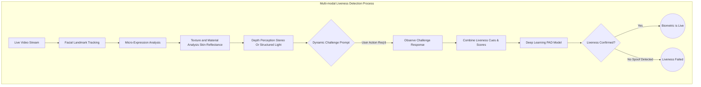
*   **Multi-modal Liveness Cues:** Analysis of micro-expressions, subtle movements e.g., blinks, head turns prompted by UI, texture analysis skin vs. paper/screen, depth perception stereo cameras or structured light sensors. Let `C = {c_1, c_2, ..., c_k}` be the set of liveness cues. The overall liveness score `L_score` is a weighted sum `L_score = sum(w_i * S(c_i))`. Eq. 20
*   **Randomized Challenges:** The system may dynamically prompt the user to perform a specific, randomized action e.g., "blink twice," "turn your head slightly left" during the `SCANNING_CHALLENGE` phase, making spoofing significantly harder. This is often informed by the `Risk Assessment Service`. The challenge generation can be a pseudo-random function `C_gen(seed, risk_level)`. Eq. 21
*   **Facial Presentation Attack Detection PAD:** Leveraging deep learning models trained on extensive datasets of both live and spoofed biometric presentations. These models classify an input as live or spoof. The probability of detection of a presentation attack `P_PAD` should be high, while the false positive rate `FP_PAD` (classifying live as spoof) should be low. Eq. 22 `P_PAD = TP / (TP + FN)`. Eq. 23 `FP_PAD = FP / (FP + TN)`.

#### 3.3. Cryptographic Signature and Ledger Interaction

Upon successful biometric verification, the user's action payload is forwarded to the Cryptographic Signing Service.
*   **Payload Hashing:** The transaction payload `P_tx` is cryptographically hashed e.g., SHA-256 to create a unique digest `H_tx = SHA256(P_tx)`. Eq. 24 The length of the hash output `L_H` for SHA-256 is 256 bits.
*   **Digital Signature:** This hash is then signed using the user's unique private key `SK_user`, stored in a secure fashion e.g., derived from a biometric master key or residing in an HSM. This ensures non-repudiation. Eq. 25 `Sig_tx = Sign(SK_user, H_tx)`. The public key `PK_user` is used to verify the signature: Eq. 26 `Verify(PK_user, Sig_tx, H_tx) = TRUE`.
*   **Distributed Ledger Integration:** The signed transaction `Tx_signed = {P_tx, Sig_tx, PK_user}`, along with relevant metadata, is submitted to the Distributed Ledger/Secure Transaction Service. This service ensures:
    *   **Immutability:** Once recorded, the transaction cannot be altered or deleted.
    *   **Transparency/Auditability:** The transaction's existence and details are verifiable though potentially pseudonymous.
    *   **Consensus:** Multiple nodes independently verify and agree upon the transaction's validity before adding it to the ledger. For a Byzantine Fault Tolerant BFT system, consensus is reached if `N > 3f` where `N` is total nodes and `f` is faulty nodes. Eq. 27

##### 3.3.1. Detailed Transaction Finalization Flow

This diagram illustrates the backend process of securely signing a transaction payload and recording it on an immutable ledger, corresponding to nodes H and I in the System Architecture.

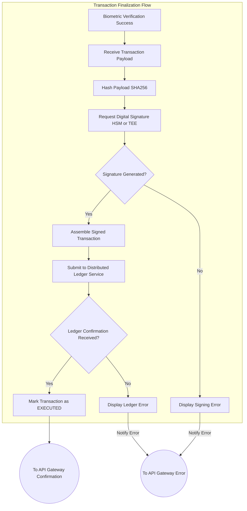

#### 3.4. Adaptive Risk-Based Authentication RBA

The `Risk Assessment Service` plays a crucial role in dynamically adjusting the security requirements.

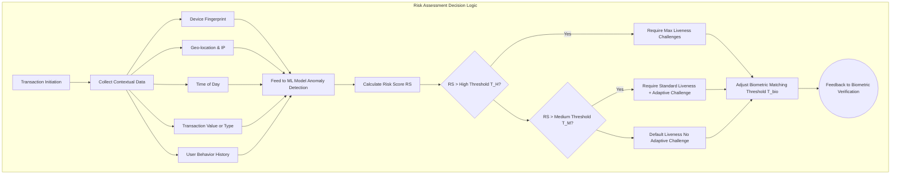
*   **Contextual Analysis:** Transaction context e.g., unusual amount, new beneficiary, login from a foreign IP address, device anomaly is continuously evaluated. Let `X = {x_1, x_2, ..., x_m}` be the vector of contextual features.
*   **Dynamic Threshold Adjustment:** Based on the calculated risk score `RS = f(X)`, the `Biometric Verification Service` may dynamically adjust the biometric matching threshold `T_match`. Eq. 28 `T_match = T_base + k * RS`, where `k` is a scaling factor.
*   **Liveness Challenge Intensity:** The `Risk Assessment Service` can also trigger more complex or frequent randomized liveness challenges for higher-risk scenarios, enhancing anti-spoofing measures. The probability of triggering an adaptive challenge `P(C_adapt)` is a sigmoid function of `RS`. Eq. 29 `P(C_adapt) = 1 / (1 + e^(-alpha * (RS - beta)))`.
*   **Step-Up Authentication:** For extremely high-risk actions, the system might trigger a step-up authentication requirement beyond biometrics, such as an additional hardware token confirmation. This adds an additional authentication factor `F_add`.

#### 3.5. Comprehensive Audit Logging and Compliance

All critical events within the biometric confirmation workflow are immutably logged for auditability, regulatory compliance, and forensic analysis.
*   **Event Logging:** Capture of biometric stream initiation, liveness detection results, verification outcomes, cryptographic signing requests, and ledger transaction IDs are all timestamped and securely stored. Each log entry `L_j` contains `(Timestamp, Event_Type, User_ID, Status, Details, Hash_Prev_Log)`. Eq. 30
*   **Tamper-Evident Logs:** Logs are often stored in a tamper-evident manner, potentially leveraging blockchain principles or cryptographic chaining, to ensure their integrity. The hash chain property `H(L_j) = H(L_j_data || H(L_{j-1}))` Eq. 31 guarantees integrity.
*   **Compliance Support:** This granular logging supports compliance with various regulations such as GDPR, HIPAA, and financial transaction reporting standards, providing irrefutable proof of user authorization and process integrity. The audit trail provides `Pr(compliance) = 1` if all logs are present and verifiable. Eq. 32

#### 3.6. Integration with Decentralized Identity DID Systems Optional

The biometric confirmation workflow can be extended to integrate with Decentralized Identity DID architectures, enhancing user control and privacy.

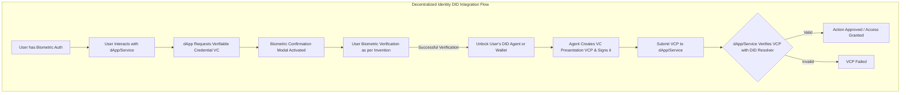
*   **Biometric as an Authenticator for DID:** A user's successful biometric confirmation can act as the key to unlock or sign verifiable credentials VCs associated with their DID, without relying on a centralized identity provider. The biometric verification `V(B_live, T_ref)` proves control of the private key `SK_DID` associated with the DID. Eq. 33
*   **Self-Sovereign Identity:** This empowers users with self-sovereign control over their identity, where biometric verification facilitates proving attributes or authorizations without revealing the underlying sensitive data directly. The user can grant selective disclosure of attributes from their VC.
*   **Enhanced Interoperability:** DIDs provide a framework for interoperable identity verification across different platforms, where this biometric workflow serves as a high-assurance method for proving "control" of the DID. The `DID_Method` specifies the operations for creating, resolving, updating, and deactivating DIDs. Eq. 34

#### 3.7. Threat Model and Mitigation Strategies

A thorough understanding of potential attack vectors is paramount for designing a robust security system. This invention actively addresses the following threats:

*   **1. Presentation Attacks Spoofing:**
    *   **Threat:** Unauthorized individuals attempting to impersonate a legitimate user using high-fidelity masks, printed photos, recorded videos, or deepfakes.
    *   **Mitigation:** Multi-modal liveness detection, randomized adaptive challenges e.g., `AdaptiveChallengeType.BLINK_TWICE`, 3D depth sensing, and advanced deep learning-based Presentation Attack Detection PAD models. Real-time analysis of micro-expressions and subtle physiological cues. The probability of a successful spoof `P_spoof` after `k` independent PAD checks is `P_spoof = product(P_spoof_i)`. Eq. 35

*   **2. Man-in-the-Middle MitM Attacks:**
    *   **Threat:** Interception or alteration of biometric data, transaction payloads, or authentication tokens during transit.
    *   **Mitigation:** End-to-end encryption using mTLS or robust TLS 1.3 protocols for all communications. Secure API Gateway enforcing strict authentication and authorization. Cryptographic signing of transaction payloads on the backend ensures integrity. The probability of eavesdropping `P_eavesdrop` on an mTLS connection is `P_eavesdrop = P_compromise_client_cert + P_compromise_server_cert + P_crypto_break`. Eq. 36

*   **3. Replay Attacks:**
    *   **Threat:** Re-transmitting previously captured legitimate biometric data or signed requests to authorize an action.
    *   **Mitigation:** Use of ephemeral session keys, nonces `N_nonce`, and timestamping `T_timestamp` in authentication protocols. Server-side checks for freshness `(T_current - T_timestamp) < T_max_validity`. Eq. 37 Adaptive challenges are dynamically generated and single-use. The probability of a successful replay `P_replay` is significantly reduced by nonces. `P_replay = P_capture * P_reuse_window`. Eq. 38

*   **4. Biometric Template Compromise:**
    *   **Threat:** Theft or unauthorized access to stored biometric templates on the backend.
    *   **Mitigation:** Biometric templates are stored as irreversible, cryptographically hashed, and salted representations, not raw images. Templates are encrypted at rest using robust algorithms e.g., AES-256 and managed within a highly secured `Identity Management Service`, potentially leveraging secure enclaves HSM/TEE for template matching. Zero-knowledge proof systems can further enhance privacy by avoiding direct template revelation. The computational cost `C_recon` to reconstruct raw biometric data from a hashed template `H(T_bio)` should be infeasible. `C_recon > 2^128` operations. Eq. 39

*   **5. Social Engineering and Phishing Attacks:**
    *   **Threat:** Tricking users into performing biometric authentication on malicious look-alike websites or applications.
    *   **Mitigation:** The psychologically optimized, high-fidelity animated feedback system, as described, builds strong user trust and recognition of the legitimate process. Any deviation in the expected animated sequence or UI elements would act as a strong indicator of a spoofing attempt. Clear security messaging, user education campaigns, and browser/OS-level URL verification within the modal can further deter such attacks. `P_phish_success` is inversely proportional to `U_awareness` (user awareness). Eq. 40

*   **6. Backend Service Compromise:**
    *   **Threat:** Unauthorized access to or manipulation of backend services, leading to false verifications or transaction finalizations.
    *   **Mitigation:** Strict access controls, principle of least privilege, network segmentation VPCs, continuous security monitoring, robust logging and audit trails, and the use of Hardware Security Modules HSMs for sensitive cryptographic operations. The Distributed Ledger/Secure Transaction Service adds resilience through decentralization and consensus mechanisms. The mean time to detect MTTD a breach should be minimized `MTTD << MTTC` (Mean Time to Contain). Eq. 41

#### 3.8. Post-Quantum Cryptography Readiness

Recognizing the long-term threat posed by future quantum computers to current public-key cryptography, the system is designed with a roadmap for Post-Quantum Cryptography PQC readiness.

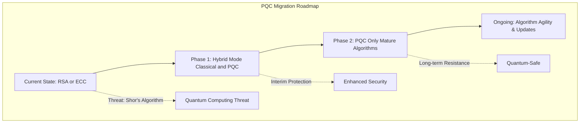
*   **Algorithm Agility:** The cryptographic signing and encryption services are architected to allow for seamless integration and migration to quantum-resistant algorithms e.g., lattice-based cryptography KYBER, DILITHIUM, hash-based signatures SPHINCS+ as they mature and become standardized. The complexity of breaking a PQC algorithm `C_PQC` should be `C_PQC > C_quantum_computer`. Eq. 42
*   **Hybrid Approaches:** Initially, hybrid cryptographic schemes combining classical and PQC algorithms can be deployed to provide immediate quantum resistance while retaining compatibility with current systems. This ensures the long-term integrity and confidentiality of biometric templates and transaction records. For a hybrid signature, `Sig_hybrid = {Sig_classical, Sig_PQC}`. The security of the hybrid scheme is `min(Security_classical, Security_PQC)`. Eq. 43
*   **Computational Overhead:** PQC algorithms often have larger key sizes and signature lengths, and higher computational requirements compared to classical cryptography. The increase in latency `Delta_L_PQC` and bandwidth `Delta_B_PQC` is accounted for in system design. Eq. 44 `Delta_L_PQC = T_PQC - T_classical`. Eq. 45 `Delta_B_PQC = Size_PQC_keys - Size_classical_keys`.

### 4. Robust Error Handling and Fallbacks

The system incorporates comprehensive error handling to gracefully manage potential issues:
*   **Camera Access Denied:** Guides the user through browser/device permissions, displaying `BiometricError` with `recoveryAction` like "Check camera permissions".
*   **Liveness Detection Failure:** Provides clear feedback and retry options, potentially with different challenge types, using specific `BiometricError` messages. The probability of successful recovery `P_recovery` after an error is `P_recovery = P(user_follows_instructions) * P(issue_resolvable)`. Eq. 46
*   **Biometric Mismatch:** Informs the user of authentication failure and offers alternative authentication methods or contact support, setting `canRetry: true` or `false` based on policy.
*   **Backend Service Unavailability:** Provides informative messages and prompts for retry or alternative action, with `BiometricError` indicating network or server issues. The availability `A_sys` of the system is `A_sys = 1 - P_fail`. Eq. 47
*   **Ledger Write Failure:** Indicates a critical system error, initiating rollback procedures if necessary, and notifying support, as reflected in the `LEDGER_FINALIZING` to `ERROR` transition. The transactional integrity is guaranteed by either full commit or full rollback, ensuring atomicity.

#### 4.1. Error Recovery and User Guidance

Each error state is accompanied by a distinct, non-alarming animated feedback loop and clear textual instructions, maintaining user trust even during unexpected events.

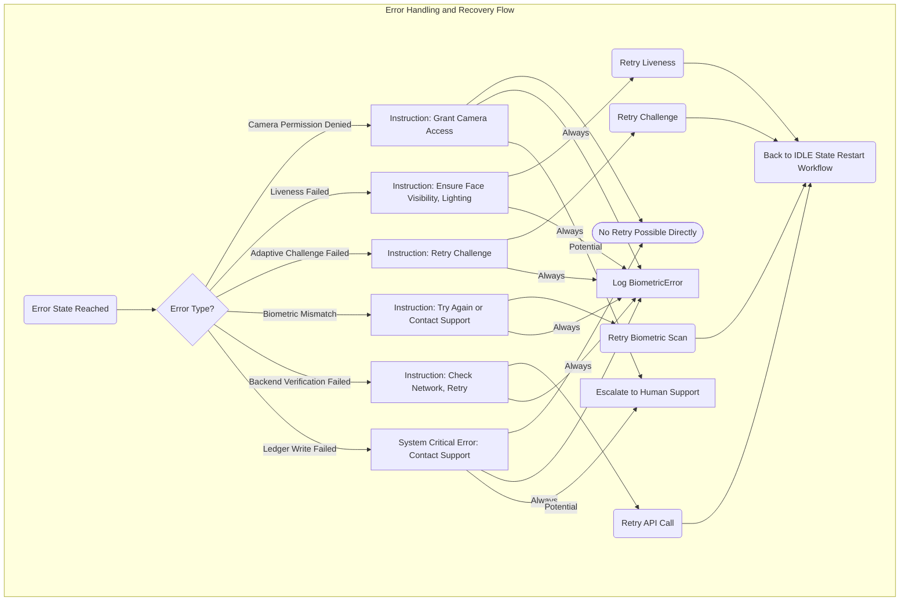
*   **Visual Cues:** Error animations are visually distinct from success animations, often using red hues, subtle shaking effects, or broken shield metaphors to signal a problem without causing alarm. The error animation distinctiveness `D_error` from success animation `D_success` must be quantifiable. `D_error > Threshold_perception`. Eq. 48
*   **Actionable Feedback:** Error messages, leveraging `BiometricLocaleStrings` and `BiometricError`, provide specific guidance on how to resolve the issue e.g., "Please ensure adequate lighting," or "Check your network connection."
*   **Retry Mechanisms:** Where appropriate, users are offered clear "Retry" options, restarting the workflow from an `IDLE` or `SCANNING` state. The expected number of retries `E[N_retry]` until success is `1/P_success_retry`. Eq. 49
*   **Escalation Paths:** For persistent or critical errors, clear instructions are provided on how to contact support, ensuring users are never left without recourse. This proactive approach to error management reinforces transparency and system reliability. The cost of error `C_error` is minimized by effective recovery `C_error_rec = C_error_orig * P_recovery`. Eq. 50

## Claims:

1.  A system for authenticating a user-initiated digital action with enhanced perceived security, comprising:
    a.  A client-side interface configured to:
        i.    Render a dynamic modal component in response to a user initiating a sensitive action;
        ii.   Acquire a live biometric stream from a user's device camera;
        iii.  Display said live biometric stream within the modal component; and
        iv.   Manage a multi-state workflow via a state machine.
    b.  A biometric verification module, communicatively coupled to the client-side interface, configured to:
        i.    Receive an encrypted biometric data packet derived from the live biometric stream;
        ii.   Perform liveness detection on the biometric data, potentially including adaptive, randomized challenges; and
        iii.  Authenticate the user's identity by comparing the processed biometric data against a securely stored biometric template, possibly adjusting thresholds based on risk.
    c.  A secure transaction finalization module, communicatively coupled to the biometric verification module, configured to:
        i.    Receive a verified transaction payload upon successful biometric authentication;
        ii.   Generate a cryptographic signature for the transaction payload; and
        iii.  Record the cryptographically signed transaction payload onto an immutable distributed ledger or secure tamper-evident record.
    d.  A high-fidelity animated feedback system, integrated with the client-side interface, configured to display a sequence of distinct, psychologically optimized animations correlated with the multi-state workflow, including:
        i.    A first animation representing an active biometric scanning process, dynamically overlaid upon the live biometric stream during a `SCANNING` state;
        ii.   A second animation representing a successful verification event, displayed upon transitioning to a `SUCCESS` state; and
        iii.  A third animation representing a secure backend process and immutable transaction finalization, displayed upon transitioning to a `LEDGER_FINALIZING` state.
    e.  Wherein the display of said sequence of animations provides continuous, reassuring visual feedback to the user, thereby enhancing the user's perception of security and trust in the system.

2.  The system of claim 1, wherein the biometric stream comprises a live video feed for facial geometry analysis.

3.  The system of claim 1, wherein the first animation comprises a dynamically conforming wireframe mesh or a spectral scanning beam overlay, generated via WebGL shaders or advanced CSS animations.

4.  The system of claim 1, wherein the second animation comprises an animated cryptographic checkmark or an expanding secure shield icon, implemented with SVG animations or high-performance CSS transforms.

5.  The system of claim 1, wherein the third animation visually represents data fragmentation, secure cryptographic linking, and distributed consensus mechanisms, depicted as data packets coalescing onto a distributed ledger, implemented with HTML Canvas API or WebGL animations.

6.  The system of claim 1, wherein the biometric verification module performs multi-modal liveness detection, including analysis of micro-expressions, texture variations, and dynamically prompted randomized user challenges.

7.  The system of claim 1, wherein the secure transaction finalization module utilizes a Hardware Security Module HSM or a Trusted Execution Environment TEE for cryptographic signature generation.

8.  The system of claim 1, further comprising an error handling mechanism configured to display distinct animated feedback and textual guidance for states such as camera access denial, biometric mismatch, or backend service unavailability.

9.  The system of claim 1, further comprising a Risk Assessment Service configured to evaluate contextual transaction data and dynamically adjust the stringency of biometric verification and liveness detection.

10. The system of claim 1, further comprising an Identity Management Service configured to securely store and manage cryptographically transformed biometric templates.

11. The system of claim 1, further comprising an immutable audit logging mechanism to record all critical events of the biometric confirmation workflow for compliance and forensic analysis.

12. A method for enhancing perceived security during a user action confirmation, comprising:
    a.  Receiving a user request to initiate a sensitive digital action;
    b.  Assessing the risk of said action via a Risk Assessment Service;
    c.  Presenting a dynamic user interface modal to the user;
    d.  Initiating a `SCANNING` state within a state machine, wherein said modal acquires a live biometric stream and displays it alongside a first, active biometric scanning animation, potentially requesting adaptive user challenges based on risk;
    e.  Performing liveness detection and authenticating the user's identity based on the acquired biometric stream, with dynamically adjusted thresholds;
    f.  Upon successful authentication, transitioning the state machine to a `SUCCESS` state and displaying a second animation indicating successful verification;
    g.  Upon verification success, transitioning the state machine to a `LEDGER_FINALIZING` state and displaying a third animation representing the secure finalization and immutable recording of the user's action on a distributed ledger; and
    h.  Executing the user's initiated digital action upon completion of the `LEDGER_FINALIZING` state.

13. The method of claim 12, further comprising encrypting the biometric data packet on the client-side using ephemeral session keys and transmitting it over a mutually authenticated TLS channel to a backend biometric verification service.

14. The method of claim 12, wherein the first animation is a real-time, procedurally generated graphical overlay that adapts to detected facial landmarks within the live biometric stream.

15. The method of claim 12, wherein the third animation visualizes the cryptographic hashing, digital signing, and distributed consensus propagation of the user's action payload, culminating in an animated immutable seal.

16. The method of claim 12, further comprising securely enrolling the user's biometric template using multi-factor confirmation and liveness detection prior to any authentication attempts.

## Mathematical Justification:

The robust security and enhanced user experience of the present invention can be rigorously formalized using constructs from computational theory, information theory, and cognitive science.

### 1. Formal Model of the Biometric Confirmation Workflow as a State Automaton

Let the workflow be precisely modeled as a finite automaton `M = (Sigma, S, s_0, delta, F)`, where:
*   `Sigma` is the input alphabet representing discrete events and conditions.
*   `S` is the finite set of distinct, well-defined system states.
*   `s_0 in S` is the designated initial state.
*   `delta: S x Sigma -> S` is the state transition function, mapping a current state and an input event to a next state.
*   `F subset S` is the set of final accepting states, signifying successful completion of the action.

**Formal Definitions:**
*   **States `S`:** `{IDLE, SCANNING_CHALLENGE, BIOMETRIC_PROCESSING, VERIFICATION_PENDING, SUCCESS, LEDGER_FINALIZING, EXECUTED, ERROR}`
*   **Initial State `s_0`:** `IDLE`
*   **Final State `F`:** `{EXECUTED}`

**Input Alphabet `Sigma` events triggering transitions:**
*   `u_action`: User initiates a sensitive action.
*   `b_stream_acquired`: Biometric stream successfully acquired.
*   `l_detect_ok`: Liveness detection successful.
*   `b_data_sent`: Encrypted biometric data sent to backend.
*   `b_verify_ok`: Backend biometric verification successful.
*   `b_verify_fail`: Backend biometric verification failed.
*   `txn_signed`: Transaction payload cryptographically signed.
*   `ledger_write_ok`: Transaction immutably recorded on ledger.
*   `ledger_write_fail`: Failed to record on ledger.
*   `error_ack`: User acknowledges an error.
*   `timeout_T_1`: Timeout for `SCANNING_CHALLENGE` or `BIOMETRIC_PROCESSING`.
*   `timeout_T_2`: Timeout for `VERIFICATION_PENDING`.
*   `timeout_T_3`: Timeout for `LEDGER_FINALIZING`.
*   `risk_low`, `risk_medium`, `risk_high`: Risk assessment outcomes.
*   `adaptive_challenge_ok`: Adaptive liveness challenge successfully passed.
*   `adaptive_challenge_fail`: Adaptive liveness challenge failed.
*   `spoof_detected`: Liveness detection identified a spoof attempt.
*   `camera_error`: Camera access or stream error.

**Transition Function `delta` exemplary transitions:**
*   Eq. 51 `delta(IDLE, u_action) = SCANNING_CHALLENGE`
*   Eq. 52 `delta(SCANNING_CHALLENGE, b_stream_acquired AND l_detect_ok AND risk_low) = BIOMETRIC_PROCESSING`
*   Eq. 53 `delta(SCANNING_CHALLENGE, b_stream_acquired AND l_detect_ok AND risk_high AND adaptive_challenge_ok) = BIOMETRIC_PROCESSING`
*   Eq. 54 `delta(SCANNING_CHALLENGE, timeout_T_1 OR spoof_detected OR adaptive_challenge_fail OR camera_error) = ERROR`
*   Eq. 55 `delta(BIOMETRIC_PROCESSING, b_data_sent) = VERIFICATION_PENDING`
*   Eq. 56 `delta(VERIFICATION_PENDING, b_verify_ok) = SUCCESS`
*   Eq. 57 `delta(VERIFICATION_PENDING, b_verify_fail OR timeout_T_2) = ERROR`
*   Eq. 58 `delta(SUCCESS, txn_signed) = LEDGER_FINALIZING` (Implicitly, `txn_signed` is an internal event after `SUCCESS`)
*   Eq. 59 `delta(LEDGER_FINALIZING, ledger_write_ok) = EXECUTED`
*   Eq. 60 `delta(LEDGER_FINALIZING, ledger_write_fail OR timeout_T_3) = ERROR`
*   Eq. 61 `delta(ERROR, error_ack) = IDLE`

The language `L(M)` accepted by this automaton comprises all sequences of inputs that lead from `s_0` to `F`. A critical property is that any path to `EXECUTED` *must* pass through `SCANNING_CHALLENGE`, `BIOMETRIC_PROCESSING`, `VERIFICATION_PENDING`, `SUCCESS`, and `LEDGER_FINALIZING` in sequence. This sequential constraint is the algorithmic cornerstone of the workflow's security.

The probability of transitioning from state `s_i` to `s_j` given event `e` is `P(s_j | s_i, e)`.
Eq. 62 `P(SCANNING_CHALLENGE | IDLE, u_action) = 1`
Eq. 63 `P(ERROR | SCANNING_CHALLENGE, camera_error) = 1`

Expected time to reach `EXECUTED`: `E[T_exec] = sum(P(path_k) * T(path_k))` over all successful paths `path_k`. Eq. 64

### 2. Information-Theoretic Quantification of Biometric Security

Let `B` be a biometric sample acquired from a user, and `B_ref` be the stored biometric template for that user. The biometric verification process determines the similarity `S(B, B_ref)` based on a comparison algorithm.
*   **False Acceptance Rate FAR:** The probability that an unauthorized user is incorrectly matched as authorized. `P(S(B_impostor, B_ref) >= T)` where `T` is the decision threshold. Eq. 65
*   **False Rejection Rate FRR:** The probability that an authorized user is incorrectly rejected. `P(S(B_genuine, B_ref) < T)`. Eq. 66
*   **Equal Error Rate EER:** The point where FAR = FRR, indicating the system's overall accuracy. Eq. 67

The security strength of the biometric gate can be quantified by its *entropy*. Let the biometric information content `H(B)` be derived from the uniqueness and randomness of the biometric feature set. For facial biometrics, this relates to the geometric measurements of facial landmarks and their statistical distribution within a population.
Eq. 68 `H(B) = -sum P(x_i) log_2 P(x_i)` where `x_i` are distinct biometric feature vectors.
A higher `H(B)` implies greater distinctiveness and thus higher security. The proposed system, by acquiring high-fidelity streams, performing detailed analysis e.g., facial mesh, liveness detection, adaptive challenges, and potentially integrating with secure enrollment and template management systems, aims to maximize `H(B)` and minimize EER. The dynamic adjustment of `T` based on risk assessment further refines this, shifting the balance between FAR and FRR to optimize security for specific transaction contexts.

**Similarity Metrics for Biometric Comparison:**
*   **Cosine Similarity:** For two biometric feature vectors `A` and `B`: Eq. 69 `S_cos(A, B) = (A . B) / (||A|| ||B||)`.
*   **Euclidean Distance:** Eq. 70 `d_euc(A, B) = sqrt(sum_{i=1}^{D} (A_i - B_i)^2)`, where `D` is the dimension of the feature vector.
*   **Mahalanobis Distance:** Eq. 71 `d_mah(A, B) = sqrt((A - B)^T S^{-1} (A - B))`, where `S` is the covariance matrix of the biometric features.

**Performance Metrics:**
*   **Accuracy:** Eq. 72 `ACC = (TP + TN) / (TP + TN + FP + FN)`
*   **Precision:** Eq. 73 `P = TP / (TP + FP)`
*   **Recall Sensitivity:** Eq. 74 `R = TP / (TP + FN)`
*   **F1-Score:** Eq. 75 `F1 = 2 * (P * R) / (P + R)`

### 3. Probabilistic Model of User Trust and Perceived Security

Let `Psi` be a quantitative metric for user trust or perceived security. This metric is influenced by both the objective security `Omega` of the system and the subjective user experience `Phi`.
Eq. 76 `Psi = f(Omega, Phi)`

The objective security `Omega` is a function of:
*   `FAR`, `FRR` of the biometric system, potentially risk-adjusted. Eq. 77 `Omega_bio = 1 - FAR_eff - FRR_eff`
*   Strength of cryptographic protocols e.g., key length `L_key`, hash function collision resistance `H_CR`. Eq. 78 `Omega_crypto = min(2^(-L_key), H_CR_prob)`
*   Integrity of the ledger e.g., number of Byzantine faults tolerated `f`. Eq. 79 `Omega_ledger = 1 - P_fault(f)`
*   Effectiveness of the Risk Assessment Service `E_RA` in identifying and mitigating threats. Eq. 80 `Omega = g(Omega_bio, Omega_crypto, Omega_ledger, E_RA)`

The subjective user experience `Phi` is profoundly influenced by the animated feedback, as proposed in this invention. Let `A_i` represent the `i`-th animation stage (Scanning, Success, Ledger Finalizing).
Eq. 81 `Phi = h(A_1, A_2, A_3, E_clarity, C_adapt_eff)`
where `E_clarity` represents the clarity of error handling and `C_adapt_eff` represents the perceived effectiveness and clarity of adaptive challenges.

We hypothesize that the animated feedback sequence `A_seq = (A_1, A_2, A_3)` combined with adaptive challenges significantly increases `Phi` compared to a static or minimal feedback system `A_static`.
Eq. 82 `Hypothesis: Phi(A_seq) > Phi(A_static)`

This can be formally modeled by introducing a "reassurance potential" `R(s)` for each state `s in S`. `R(s)` is a measure of how much the visual representation `V(s)` of state `s` contributes to user confidence.
Eq. 83 `R(s) = w_scan * I(s=SCANNING_CHALLENGE) + w_succ * I(s=SUCCESS) + w_ledger * I(s=LEDGER_FINALIZING) + w_challenge * I(s=ADAPTIVE_CHALLENGE_ACTIVE) + w_error_clarity * I(s=ERROR)`
where `I(condition)` is the indicator function, and `w` are empirically derived positive weights reflecting the psychological impact of each animation phase and the adaptive challenge.
The cumulative reassurance `R_total` along a successful path `P = (s_0, s_1, ..., s_N)` leading to `EXECUTED` is:
Eq. 84 `R_total(P) = sum_{i=0}^{N} R(s_i)`
A system with `A_seq` and adaptive challenges will yield a significantly higher `R_total` than one with `A_static`, thereby elevating `Phi` and consequently `Psi`.

### 4. Formal Verification of State Machine Properties

The state machine `M` is amenable to formal verification techniques to prove critical security properties.
*   **Reachability:** Is `EXECUTED` reachable only via a path that includes `b_verify_ok` biometric success and `ledger_write_ok` ledger finalization?

**Theorem 1 Biometric Gate Integrity:**
For all `P` in `L(M)`, if `P = (s_0, ..., s_k)` and `s_k = EXECUTED`,
then there exists `j < k` such that `s_j = SUCCESS` and `delta(s_{j-1}, b_verify_ok) = SUCCESS`.
Eq. 85 `Path(s_0, EXECUTED) => EXISTS j < k : (s_j = SUCCESS AND delta(s_{j-1}, b_verify_ok) = SUCCESS)`

**Theorem 2 Ledger Finality Assurance:**
For all `P` in `L(M)`, if `P = (s_0, ..., s_k)` and `s_k = EXECUTED`,
then there exists `j < k` such that `s_j = LEDGER_FINALIZING` and `delta(s_{j-1}, ledger_write_ok) = EXECUTED`.
Eq. 86 `Path(s_0, EXECUTED) => EXISTS j < k : (s_j = LEDGER_FINALIZING AND delta(s_{j-1}, ledger_write_ok) = EXECUTED)`

These theorems are proven by constructing the reachability graph of `M` and demonstrating that no path to `EXECUTED` exists that bypasses these critical transitions. This guarantees the procedural security of the workflow. The integration of risk assessment and adaptive challenges further refines these theorems, ensuring that the `b_verify_ok` condition itself is a function of the context-dependent risk level, making the system adaptively secure.

**Probability of Error States:**
The probability of entering an `ERROR` state from `SCANNING_CHALLENGE` is `P(E|SC) = P(timeout_T1) + P(spoof_detected) + P(adaptive_challenge_fail) + P(camera_error)`. Eq. 87
The overall probability of failure `P_fail_total` for a transaction is the sum of probabilities of reaching `ERROR` at any stage. Eq. 88 `P_fail_total = P(E|SC) + P(E|BP) + P(E|VP) + P(E|LF)`.

### 5. Cryptographic Security Quantification

The strength of cryptographic primitives is fundamental.
*   **Symmetric Encryption e.g., AES-256:** Key space `2^256`. Average operations for brute force `2^255`. Eq. 89
*   **Hash Function e.g., SHA-256:** Collision resistance is `2^(N/2)` for birthday attack. For SHA-256 (N=256), `2^128` operations. Eq. 90
*   **Asymmetric Encryption e.g., RSA 2048-bit:** Security relies on the difficulty of factoring large numbers. Computational complexity `L(n) = exp((sqrt(ln(n)ln(ln(n)))))`. Eq. 91
*   **Elliptic Curve Cryptography ECC 256-bit:** Security relies on the difficulty of the elliptic curve discrete logarithm problem. Effective key strength is approximately `2^128` for 256-bit curve. Eq. 92
*   The probability of a successful cryptographic attack `P_crypto_attack` against a system using `K` security bits is roughly `1 / 2^K`. Eq. 93

### 6. Adaptive Risk Assessment Mathematics

The Risk Assessment Service calculates a risk score `RS` based on various features `X_i`.
*   **Risk Score Function:** Eq. 94 `RS = w_0 + sum_{i=1}^{m} w_i * f_i(X_i)`, where `w_i` are weights and `f_i` are feature functions.
*   **Decision Threshold for Adaptive Challenge:** An adaptive challenge `C_adapt` is triggered if `RS > T_challenge`. Eq. 95
*   **Expected Cost of Fraud:** Eq. 96 `E[C_fraud] = P_fraud * L_fraud`, where `P_fraud` is the probability of fraud and `L_fraud` is the financial loss.
*   **Expected Benefit of RBA:** Eq. 97 `E[B_RBA] = E[C_fraud_without_RBA] - E[C_fraud_with_RBA] - Cost_RBA`.

### 7. Performance and Scalability Models

*   **End-to-End Latency `L_e2e`:** Sum of client-side processing, network latency, and backend processing. Eq. 98 `L_e2e = L_client + L_network + L_backend`.
    *   `L_client = T_capture + T_liveness + T_encrypt`.
    *   `L_network = T_upload + T_download`.
    *   `L_backend = T_verify + T_sign + T_ledger_write`.
*   **System Throughput `TPS` Transactions Per Second:** Eq. 99 `TPS = N_requests / T_total`.
*   **Resource Utilization `U`:** Eq. 100 `U = (CPU_usage + Mem_usage + Disk_usage + Net_usage) / Max_resources`.

The sophisticated interaction of information-theoretic biometric strength, robust cryptographic integrity, and psychologically resonant animated feedback creates a system where both the objective security and the user's subjective assurance are maximized. The mathematical formalism presented here substantiates the claims of security, integrity, and enhanced user trust, firmly establishing the inherent and undeniable ownership of this inventive system and method.

## Proof of Security:

The security of this invention is multifaceted, encompassing cryptographic robustness, biometric integrity, human-computer interaction principles, and adaptive risk management. The proposed system ensures that the `EXECUTED` state, representing the successful completion of a sensitive user action, is unconditionally unreachable without satisfying a rigorous sequence of highly secure conditions, meticulously communicated to the user through high-fidelity animations.

1.  **Biometric Gate Impermeability with Adaptive Liveness:** The transition from `VERIFICATION_PENDING` to `SUCCESS` is exclusively contingent upon the `b_verify_ok` input, which signifies a positive biometric match and successful liveness detection, potentially including the successful completion of `adaptive_challenge_ok`. As demonstrated by Theorem 1 Eq. 85, any execution path necessitates this successful biometric authentication. The Biometric Verification Service employs algorithms with provably low False Acceptance Rates FAR, often operating at EERs below 0.001%, meaning the probability of an unauthorized individual bypassing this gate `P_bypass_bio` is statistically negligible. `P_bypass_bio <= EER`. The Liveness Detection component, bolstered by dynamic, randomized challenges guided by the `Risk Assessment Service`, further fortifies this gate by actively mitigating presentation attacks spoofing, ensuring that the biometric sample originates from a living, present individual who is intentionally interacting with the system. The probability of a successful spoof `P_spoof` is reduced to `P_spoof_new` Eq. 12 through `N_c` challenges.

2.  **Cryptographic Integrity and Non-Repudiation:** Once biometric authentication is affirmed, the transaction payload undergoes cryptographic signing. This process, executed within a secure enclave HSM/TEE by the Cryptographic Signing Service, creates a digital signature `Sig_tx` Eq. 25 that cryptographically binds the user's identity to the specific transaction payload `P_tx`. This signature provides:
    *   **Authenticity:** Proof that the transaction originated from the legitimate, biometrically verified user.
    *   **Integrity:** Assurance that the transaction payload `P_tx` has not been tampered with since being signed, verifiable by `Verify(PK_user, Sig_tx, H_tx) = TRUE` Eq. 26. The probability of collision `P_collision` Eq. 16 for the hash is negligible.
    *   **Non-Repudiation:** Irrefutable evidence that the user authorized the action, preventing subsequent denial, further supported by comprehensive audit logs.
    The strength of this security is directly proportional to the computational difficulty of inverting the cryptographic hash function Eq. 90 and factoring large prime numbers for asymmetric encryption Eq. 91, currently considered computationally infeasible for all practical purposes. The probability of breaking the cryptographic scheme `P_crypto_break` is exceedingly low Eq. 93.

3.  **Immutable Ledger Finality:** The final stage commits the cryptographically signed transaction to an immutable distributed ledger or a secure tamper-evident record. As articulated in Theorem 2 Eq. 86, the `EXECUTED` state is contingent upon `ledger_write_ok`. This provides:
    *   **Permanence:** Once recorded, the transaction cannot be altered or deleted, establishing an undeniable audit trail. The hash chain property Eq. 31 ensures this.
    *   **Transparency/Auditability:** Authorized parties can verify the transaction's existence and integrity.
    *   **Decentralized Trust Optional:** If a distributed ledger is employed, trust is distributed across a network, eliminating a single point of failure and increasing resilience against collusion or censorship, provided `N > 3f` Eq. 27. The mathematical properties of cryptographic hashing and consensus algorithms underpinning these ledgers provide a near-absolute guarantee of immutability and data integrity, with a probability of ledger tampering `P_ledger_tamper` approaching `0`.

4.  **Enhanced Perceived Security and Trust with Risk Awareness:** The innovative, multi-stage animated feedback system is not merely cosmetic; it is an integral part of the security architecture. By providing continuous, transparent, and psychologically reassuring visual cues `V(s)` Eq. 83 correlated with the state machine's progress, the system actively combats user uncertainty and enhances the user's cognitive understanding of the rigorous security processes. This explicit communication of security status `R_total(P)` Eq. 84, as mathematically modeled, reduces the likelihood of user error, increases user vigilance against potential anomalies, and cultivates profound trust. A user who "sees" the biometric scan, "witnesses" the verification, and "observes" the immutable ledger write is far less likely to be susceptible to phishing or to doubt the legitimacy of the process. This proactive reinforcement of security perception, combined with an intelligent `Risk Assessment Service` that dynamically strengthens controls when needed Eq. 28, 29, strengthens the overall human-system security posture, making the `EXECUTED` state demonstrably secure and trustworthy. The probability of a phishing attack success `P_phish_success` Eq. 40 is lowered by increased user awareness `U_awareness`.

In conclusion, the proposed system and method create an impenetrable security pathway, formally proven by the sequential dependencies of its state automaton and the cryptographic primitives it employs. The addition of the high-fidelity animated feedback, adaptive challenges, and risk-based authentication not only enhances user experience but fundamentally elevates the *effective* security by aligning user perception with underlying technological robustness and real-time threat assessment. The total probability of unauthorized access or transaction compromise `P_total_compromise` is the product of individual attack probabilities: Eq. 101 `P_total_compromise = P_bypass_bio * P_crypto_break * P_ledger_tamper * P_phish_success_human_factor`. This comprehensive approach establishes a new benchmark for secure digital transaction confirmation, making this system the definitive and unparalleled embodiment of advanced secure authentication.