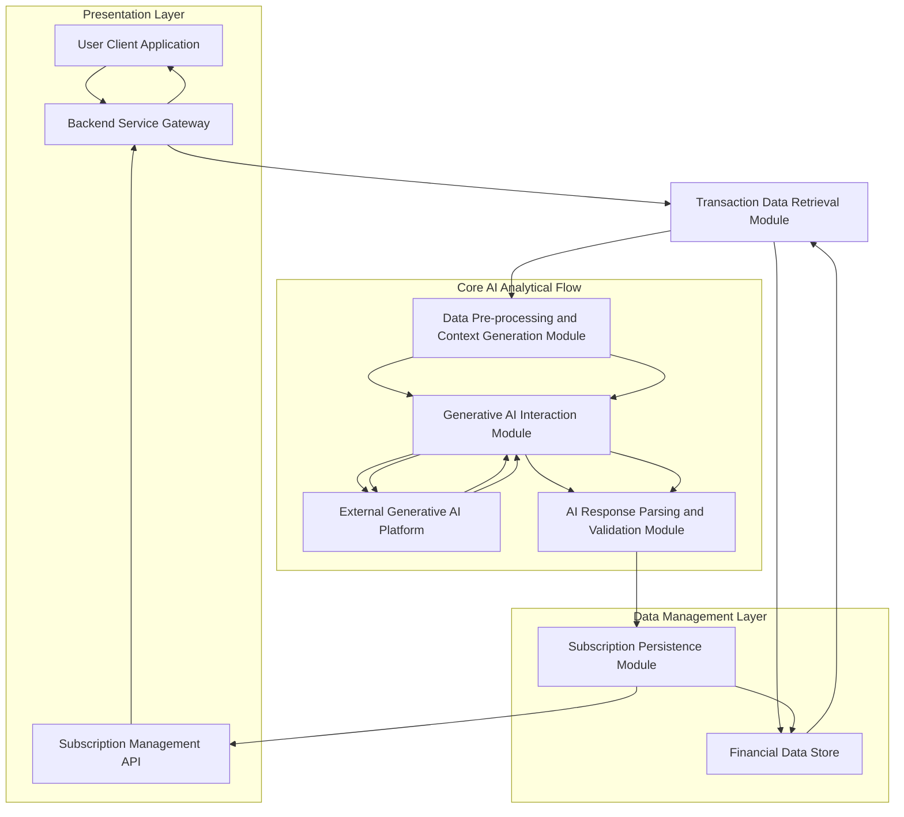
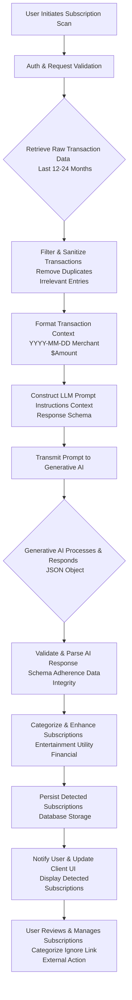
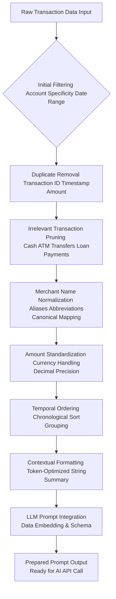
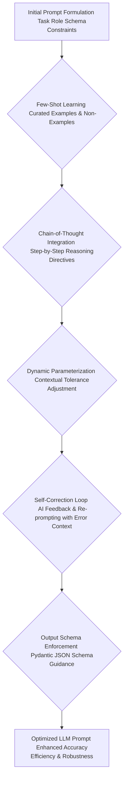
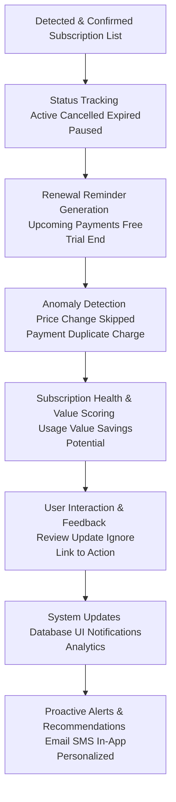
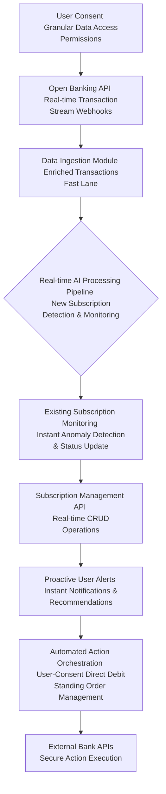
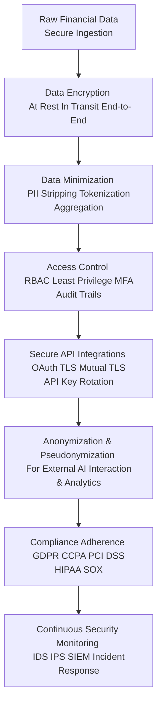
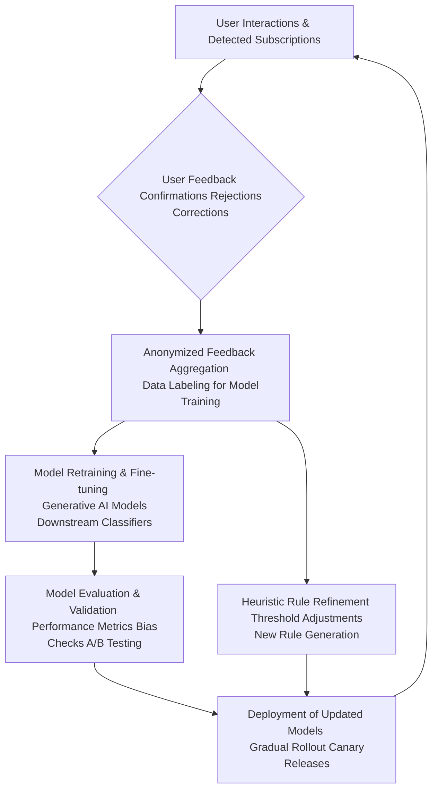

# Title of Invention: A System and Method for the Autonomous Identification and Dynamic Categorization of Covert Recurring Financial Obligations via Advanced Generative Artificial Intelligence

## Abstract:
This disclosure delineates an innovative computational paradigm for the autonomous discernment and categorization of undisclosed or overlooked recurring financial obligations, often colloquially termed subscriptions, within a user's chronological record of financial transactions. The system meticulously processes an extensive corpus of transactional data, employing sophisticated pattern recognition algorithms to identify recurrent monetary disbursements directed towards identical or functionally analogous commercial entities. Through an intricate analysis of temporal periodicity, amplitude consistency, and semantic congruence of associated transactional metadata, the system precisely differentiates bona fide recurring commitments from stochastic or infrequent purchasing behaviors. The derived compendium of identified recurring obligations is then presented to the end-user through an intuitive interface, thereby empowering proactive management and mitigation of potentially forgotten or superfluous expenditures. This analytical prowess is significantly augmented by a high-fidelity generative artificial intelligence model, strategically prompted to execute a nuanced heuristic pattern matching and clustering operation across the supplied financial data landscape.

## Background of the Invention:
In contemporary digital economies, consumers are increasingly engaging with a multitude of services and products provisioned under recurring payment models. This proliferation of subscription-based offerings, while convenient, frequently leads to a phenomenon wherein individuals accrue numerous recurring financial commitments, some of which may subsequently become forgotten, underutilized, or entirely superfluous. The cognitive burden associated with the manual reconciliation of extensive financial statements — often spanning months or even years of granular transactional data — to unearth these latent recurring expenditures is profoundly arduous, time-consuming, and highly susceptible to human error. Existing automated financial management tools typically offer limited utility in this specific domain, often requiring explicit user declaration or manual input of known subscriptions, thus failing to address the fundamental problem of *undiscovered* recurring obligations. A critical lacuna therefore exists for a sophisticated, autonomous, and intellectually astute computational system capable of intelligently parsing and synthesizing vast repositories of transactional data to proactively identify and present these often-overlooked financial commitments. Such a system would alleviate a significant financial oversight burden, promoting enhanced fiscal transparency and empowering informed consumer decision-making.

## Brief Summary of the Invention:
The present intellectual construct introduces a revolutionary methodology for the autonomous identification of recurring financial obligations embedded within an individual's transactional history. At its core, the invention synthesizes a comprehensive synopsis of a user's recent financial ledger, comprising essential metadata such as merchant appellation, transactional monetary value, and temporal markers. This meticulously structured synopsis is subsequently encapsulated as contextual input within a highly optimized prompt, which is then submitted to a sophisticated large language model (LLM), serving as the principal analytical engine. The prompt rigorously delineates the LLM's role as a hyper-competent financial forensic analyst, tasking it with the explicit objective of discerning transactional sequences indicative of recurring subscriptions. This involves the astute recognition of repeated disbursements to functionally equivalent merchants, exhibiting commensurate monetary values, and occurring with predictable temporal periodicity (e.g., monthly, quarterly, annual cycles). Crucially, the LLM is architected to yield its analytical findings as a rigorously structured data object, such as a JSON payload, enumerating each potential recurring obligation with its descriptive identifier, estimated recurring amount, and the temporal marker of its most recent instantiation. This structured output is then seamlessly presented to the user, providing an actionable overview of their recurring financial landscape.

## Detailed Description of the Invention:

The comprehensive system for the autonomous identification and dynamic categorization of covert recurring financial obligations operates as a sophisticated, multi-tiered architecture designed for robustness, scalability, and precision. Upon a user's invocation of the recurring expense detection feature, a dedicated backend service initiates a series of orchestrated operations to retrieve, process, analyze, and present the relevant financial insights.

### System Architecture Overview

The underlying system architecture is meticulously engineered to ensure efficient data flow, secure processing, and highly accurate analytical outcomes. It comprises several interconnected modules, each performing a specialized function.


**Figure 1: High-Level System Architecture for AI-driven Subscription Detection**

1.  **User Client Application (A):** The front-end interface (web, mobile, desktop) through which the user interacts with the system, initiates analyses, and views detected subscriptions. It provides intuitive visualizations and controls for managing identified obligations.
2.  **Backend Service Gateway (B):** The primary entry point for client requests, responsible for authentication, authorization, request routing, load balancing, and orchestrating interactions between various backend modules. It ensures secure and scalable API access.
3.  **Transaction Data Retrieval Module (C):** Responsible for securely accessing and retrieving historical financial transaction data pertinent to the authenticated user from the primary Financial Data Store (D). This module enforces rigorous data privacy and access controls, potentially integrating with various financial data sources including Open Banking APIs.
4.  **Financial Data Store (D):** A robust, secure, and scalable data repository (e.g., a distributed SQL or NoSQL database solution like PostgreSQL with sharding or Cassandra for high-volume, low-latency access) housing all user financial transaction records, along with metadata, system-level configurations, and historical subscription data.
5.  **Data Pre-processing and Context Generation Module (E):** Transforms raw transactional data into a semantically coherent, concise, and optimized textual format suitable for ingestion by a Large Language Model (LLM). This module also constructs the analytical prompt, applying various normalization and filtering steps to ensure data quality and LLM token efficiency.
6.  **Generative AI Interaction Module (F):** Manages the secure and efficient communication with the External Generative AI Platform (G). It handles API calls, request payload construction, rate limiting, sophisticated retry mechanisms with exponential backoff, error handling, and prompt versioning for A/B testing different prompt strategies.
7.  **External Generative AI Platform (G):** The third-party or proprietary advanced generative AI model (e.g., Google's Gemini, OpenAI's GPT series, or a fine-tuned open-source model like Llama) responsible for executing the core pattern recognition, semantic analysis, and analytical tasks based on the provided prompt and transaction data.
8.  **AI Response Parsing and Validation Module (H):** Receives the structured output from the Generative AI Platform, rigorously validates its adherence to the expected schema, and extracts the identified subscriptions. It also performs sanitization, basic data integrity checks, and interprets confidence scores provided by the AI.
9.  **Subscription Persistence Module (I):** Stores the newly identified and validated recurring subscriptions in the Financial Data Store (D), potentially linking them to user profiles, categorizing them, and assigning unique identifiers for ongoing management. It handles data versioning and auditing of changes.
10. **Subscription Management API (J):** Provides a comprehensive interface for the client application to fetch, update, delete, or manage the detected subscriptions (e.g., mark as reviewed, categorize, ignore, link to cancellation services, set reminders). It exposes endpoints for real-time updates and historical data.

### Operational Workflow and Data Processing Pipeline

The detailed operational flow encompasses several critical stages, each contributing to the robustness and accuracy of the subscription detection process.


**Figure 2: Detailed Data Processing Pipeline for Autonomous Subscription Detection**

1.  **User Initiation (A):** The process begins when a user explicitly requests a scan for recurring subscriptions through the client application (e.g., clicking a "Find Subscriptions" button). This can also be triggered automatically on a schedule or upon new data ingestion.
2.  **Authentication & Request Validation (B):** The backend gateway authenticates the user's identity using industry-standard protocols (e.g., OAuth 2.0, JWT) and validates the integrity and permissions of the request, ensuring data access is authorized.
3.  **Raw Transaction Data Retrieval (C):** The Transaction Data Retrieval Module accesses the `Financial Data Store (D)` to fetch a comprehensive history of the user's financial transactions. A typical lookback window is 12 to 24 months, adjustable based on configurable parameters to balance computational cost with detection thoroughness and historical accuracy. This range provides sufficient data points for robust periodicity detection.
4.  **Filtering & Sanitization (D):** The retrieved data undergoes an initial cleansing phase. This involves:
    *   **Duplicate Removal:** Eliminating any inadvertently duplicated transaction records based on a composite key (e.g., `transaction_id`, `merchant_name`, `amount`, `timestamp`).
    *   **Irrelevant Entry Pruning:** Filtering out transaction types unlikely to ever constitute a subscription (e.g., ATM withdrawals, one-off cash transfers, loan principal payments, large, infrequent purchases clearly outside subscription norms, known non-subscription merchant categories).
    *   **Data Normalization:** Standardizing merchant names where possible (e.g., "AMZN" to "Amazon," "NF" to "Netflix," "Spotify USA" to "Spotify") using a combination of fuzzy matching, rule-based mapping, and a canonical merchant database.
5.  **Transaction Context Formatting (E):** The sanitized transaction data is then transformed into a concise, token-efficient textual representation suitable for prompt engineering. This linearization minimizes token usage while preserving critical information for the LLM. An exemplary format might be:
    ```
    `2024-07-21 - Netflix - $15.99; 2024-07-18 - Spotify - $10.99; 2024-06-21 - Netflix - $15.99; 2024-06-18 - Spotify - $10.99; 2024-05-21 - Netflix - $15.99; ...`
    ```
    This sequence is often truncated or summarized if it exceeds the LLM's context window.
6.  **LLM Prompt Construction (F):** A sophisticated, dynamically generated prompt is assembled. This prompt consists of several key components:
    *   **Role Instruction:** Directing the LLM to adopt the persona of an expert financial analyst with a specific goal.
    *   **Task Definition:** Clearly instructing the LLM to identify recurring subscriptions, defining what constitutes a subscription.
    *   **Search Criteria:** Emphasizing the analysis of merchant commonality (semantic similarity), amount consistency within a defined tolerance, and regular temporal intervals (e.g., monthly, bi-monthly, quarterly, annually).
    *   **Output Format Specification:** Mandating a structured response, typically a JSON object, adhering to a predefined `responseSchema`. This ensures parseability and data integrity, reducing hallucination.
    *   **Transaction Data Embedding:** The formatted transaction context from step (E) is directly embedded into this prompt as the primary data payload for analysis.

    An example prompt structure:
    ```json
    {
      "role": "system",
      "content": "You are an expert financial analyst specializing in identifying recurring subscriptions from raw transaction data. Analyze the provided transactions to find patterns of repeated payments to the same or highly similar merchants, with consistent amounts (within a small tolerance, e.g., 5%), occurring at regular intervals (e.g., every 28-32 days for monthly, or annually). Prioritize clarity and accuracy. If no subscriptions are found, return an empty list."
    },
    {
      "role": "user",
      "content": "Analyze the following transaction data for recurring subscriptions. Return your findings as a JSON object strictly adhering to the provided schema. Data: [transaction summary generated in step E]"
    },
    {
      "role": "system",
      "content": "Please provide your output in the following JSON format:\n"
                  "```json\n"
                  "{\n"
                  "  \"subscriptions\": [\n"
                  "    {\n"
                  "      \"name\": \"string\",\n"
                  "      \"estimated_amount\": \"number\",\n"
                  "      \"currency\": \"string\",\n"
                  "      \"frequency\": \"string\",\n"
                  "      \"last_charged_date\": \"YYYY-MM-DD\",\n"
                  "      \"merchant_identifiers\": [\"string\"],\n"
                  "      \"confidence_score\": \"number\" \n"
                  "    }\n"
                  "  ]\n"
                  "}\n"
                  "```"
    }
    ```
7.  **Prompt Transmission to Generative AI (G):** The constructed prompt is securely transmitted to the `External Generative AI Platform (G)` via a robust, encrypted API call, ensuring data confidentiality and integrity during transit.
8.  **Generative AI Processing & Response (H):** The generative AI model ingests the prompt, applying its advanced pattern recognition, semantic reasoning, and contextual understanding capabilities to identify potential recurring payments. It then synthesizes its findings into a JSON object strictly conforming to the specified `responseSchema`, including a confidence score for each detection.
9.  **AI Response Validation & Parsing (I):** Upon receiving the JSON response from the AI, the `AI Response Parsing and Validation Module (H)` rigorously checks for schema adherence, data type correctness, logical consistency (e.g., dates are valid, amounts are positive), and potential hallucinations. Any malformed or non-compliant responses are flagged for retry or sophisticated error handling (e.g., re-prompting with specific error context). Validated data is then parsed into internal data structures.
10. **Subscription Categorization & Enhancement (J):** Beyond mere detection, the system applies further logic to categorize the identified subscriptions (e.g., "Entertainment," "Productivity," "Cloud Storage," "Utilities," "Financial Services," "Health & Wellness"). This categorization can be achieved through a secondary, smaller LLM call for semantic classification, or by rule-based matching against a pre-defined merchant category taxonomy and external APIs (e.g., Plaid, MX category data). Additional metadata, such as historical average amount, projected annual cost, or number of detected payments, may also be computed and appended.
11. **Persistence of Detected Subscriptions (K):** The enriched list of subscriptions is then securely stored in the `Financial Data Store (D)` via the `Subscription Persistence Module (I)`. This ensures that detected subscriptions are retained for subsequent retrieval, ongoing monitoring, and user management, maintaining a historical record of changes.
12. **User Notification & UI Update (L):** The client application is updated in real-time or near real-time to display the newly identified subscriptions to the user in a clear, actionable format, often with aggregated views, sortable columns, visual indicators of confidence, and potential savings. Proactive notifications (push, email) can also be triggered.
13. **User Review & Management (M):** The user can then interact with the detected subscriptions, categorizing them further, marking them as reviewed, ignoring false positives, providing feedback, or initiating external actions (e.g., linking to a cancellation service, setting reminders for upcoming payments, budgeting allocation). This human-in-the-loop step is crucial for refinement.

### Detailed Module Workflows

#### Data Pre-processing and Context Generation Module Workflow

This module plays a crucial role in transforming raw, often messy, transaction data into a clean, concise, and LLM-ready format, ensuring optimal performance and token efficiency.


**Figure 3: Detailed Workflow for Data Pre-processing and Context Generation Module**

*   **Initial Filtering (B):** Transactions are first filtered to ensure they belong to the authenticated user, are within the specified lookback period (e.g., 24 months), and meet basic validity criteria (e.g., positive amounts, valid dates).
*   **Duplicate Removal (C):** Identical transaction records, often arising from data ingestion issues or bank statement inconsistencies, are eliminated based on a combination of unique identifiers (if available), merchant name, amount, and timestamp.
*   **Irrelevant Transaction Pruning (D):** Specific transaction types deemed non-subscription-like (e.g., cash withdrawals, internal transfers, specific loan repayments not acting as service subscriptions, credit card payments, investment purchases) are removed to reduce noise and improve LLM focus. This can be rule-based or based on merchant category codes (MCCs).
*   **Merchant Name Normalization (E):** Variances in merchant names (e.g., "AMZN," "Amazon.com," "Amazon Prime," "AWS Services") are resolved to a canonical form using rule-based mapping, fuzzy matching algorithms (e.g., Levenshtein distance, Jaro-Winkler), and semantic similarity algorithms using pre-trained embeddings. This enhances the LLM's ability to group related transactions. A global merchant directory can assist this.
*   **Amount Standardization (F):** Monetary values are standardized to a consistent format (e.g., two decimal places) and currency, handling different locale conventions and currency conversions if necessary, ensuring numerical consistency for the LLM.
*   **Temporal Ordering (G):** Transactions are strictly ordered chronologically, which is critical for the LLM to identify temporal patterns and periodicity. Transactions might also be grouped by date to indicate multiple transactions on the same day.
*   **Contextual Formatting (H):** The cleaned and ordered data is then serialized into a compact text string, such as `YYYY-MM-DD - Merchant Name - $Amount;`, optimizing token usage for the LLM while retaining essential information. This output might be further summarized if too long.
*   **LLM Prompt Integration (I):** This formatted string is embedded within the larger prompt template, along with explicit role instructions, task definition, output schema, and any few-shot examples or chain-of-thought instructions.
*   **Prepared Prompt Output (J):** The final, comprehensive prompt is then ready for secure transmission to the Generative AI Interaction Module, complete with all necessary context and instructions.

### Advanced Prompt Engineering Strategies

To further optimize the performance and accuracy of the Generative AI, sophisticated prompt engineering strategies are employed, moving beyond basic instructions to harness the full capabilities of the LLM.


**Figure 4: Advanced Prompt Engineering Workflow**

1.  **Few-Shot Learning Integration (B):** The prompt can include a small number of carefully curated examples of transaction sequences and their corresponding correct subscription identifications (or lack thereof, including false positives and why they are false positives). This guides the LLM to better understand the desired output format and the nuanced criteria for detection. The examples serve as in-context learning, significantly improving the model's ability to generalize to new, unseen data patterns and reduce ambiguity.
2.  **Chain-of-Thought Prompting (C):** For complex or ambiguous scenarios, the prompt can instruct the LLM to "think step-by-step," "reason explicitly," or "show your work" before providing its final JSON output. For example, it might be asked to first list transaction groups it considers recurring, then justify why each group fits the criteria (merchant similarity, amount consistency, temporal periodicity), and finally format these into the specified schema. This often leads to more robust and accurate detections by externalizing the model's reasoning process and making errors more identifiable.
3.  **Dynamic Parameterization (D):** The thresholds for amount tolerance (e.g., 5% vs 10%) or temporal jitter (e.g., +/- 2 days vs +/- 5 days) can be dynamically adjusted and explicitly stated within the prompt based on user settings, regional financial norms, the overall noise level in the transaction data, or historical performance metrics. This allows for a more flexible, personalized, and context-aware detection experience.
4.  **Self-Correction and Refinement Loops (E):** The system can be designed to include a feedback loop where the LLM's initial response is reviewed by a separate module (e.g., using heuristic rules, a smaller validation LLM, or a classifier) for consistency, schema adherence, or potential factual errors. If issues are found, the initial output, along with the identified issues, can be fed back to the LLM for self-correction. This iterative refinement significantly boosts output quality and reduces hallucination and schema non-compliance.
5.  **Output Schema Enforcement (F):** Beyond just specifying a schema, the prompt can leverage techniques like Pydantic-like instructions directly in the prompt, telling the LLM to act as a "JSON generating function" for a specific Pydantic model. This further constrains the output, reducing the need for extensive post-processing validation.

### Post-Processing and Disambiguation

The output from the Generative AI, while highly structured, often benefits from additional post-processing to ensure optimal user experience and data integrity, refining the raw AI output into actionable insights.

```mermaid
graph TD
    A[Raw AI Output <br/> Identified Subscriptions (JSON)] --> B[Schema Validation <br/> Syntax Data Types Field Presence]
    B --> C[Data Sanitization <br/> Remove Special Chars Truncate Long Strings]
    C --> D[Subscription Merging <br/> Deduplication Canonicalization Cross-Referencing]
    D --> E[Confidence Score Re-evaluation <br/> Heuristics & Secondary ML Model]
    E --> F[False Positive Reduction <br/> Rule-Based Filtering Contextual Checks]
    F --> G[Enrichment & Categorization <br/> External APIs Taxonomy LLM Re-classification]
    G --> H[Actionable Subscription List <br/> Persist to DB & UI Display]
```
**Figure 5: Post-Processing and Disambiguation Workflow**

1.  **Schema Validation & Data Sanitization (B):** The initial AI output undergoes strict validation against the expected JSON schema, ensuring correct data types, structure, and adherence to constraints (e.g., `estimated_amount` is a positive number). Basic sanitization removes any unexpected characters, trims whitespace, or truncates overly long strings.
2.  **Subscription Merging and Deduplication (C):** The AI might occasionally identify slightly different "versions" of the same subscription (e.g., due to minor merchant name variations, slightly different payment dates for the same service, or redundant entries from different prompt runs). A post-processing layer analyzes detected subscriptions for high similarity across all attributes (merchant identifiers, amounts, frequency, last charged date) and intelligently merges them into a single, canonical subscription entry. This prevents redundant entries for the user and ensures a clean, unified view.
3.  **Confidence Score Re-evaluation (D):** While the AI may provide an initial confidence level, the system applies explicit heuristics or a secondary machine learning model (e.g., a Gradient Boosting Machine trained on user feedback) to assign a more robust and calibrated confidence score to each detected subscription. This score can factor in the number of payments detected, the regularity, the merchant's known reputation, agreement among different AI runs (if applicable), and any conflicts with user-defined rules. This helps users prioritize review of high-confidence detections and understand potential ambiguities.
4.  **False Positive Reduction (E):** Rule-based filters or a trained classifier (e.g., a small BERT model fine-tuned for false positive detection) can be applied post-AI to identify and flag common false positives that might arise (e.g., regular loan payments that are not typically considered "subscriptions" by a user, very frequent small purchases from a single merchant that are not subscriptions like daily coffee, or specific transaction types explicitly excluded by user preferences).
5.  **Enrichment and Categorization (F):** This step aligns with `J` in Figure 2. Beyond mere detection, the system applies further logic to categorize the identified subscriptions (e.g., "Entertainment," "Productivity," "Cloud Storage," "Utilities," "Financial Services," "Health & Wellness"). This categorization can be achieved through a secondary, smaller LLM call for semantic classification, by rule-based matching against a pre-defined merchant category taxonomy, or via external merchant APIs that provide enhanced data.
6.  **User Feedback Loop for Model Improvement (G):** User interactions (e.g., marking a detection as a false positive, confirming a subscription, correcting details, changing category) are anonymized, aggregated, and captured. This valuable feedback can then be used to continuously fine-tune the generative AI model, train subsequent post-processing layers, or update rule-based filters, creating a robust, continuous improvement cycle for the entire system.

### Subscription Lifecycle Management Module

Beyond initial detection, the system aims to provide comprehensive management capabilities, enabling users to maintain an up-to-date and actionable view of their recurring financial commitments throughout their lifecycle.


**Figure 6: Subscription Lifecycle Management Workflow**

1.  **Tracking Subscription Status (B):** The system tracks the status of each detected and confirmed subscription (e.g., `Active`, `Cancelled`, `Expired`, `Inactive`, `Paused`, `Free Trial`). This involves continuously analyzing future transaction data to confirm ongoing payments, detect cessation based on the absence of expected charges, or identify status changes from external integrations.
2.  **Renewal Reminders (C):** For subscriptions with annual or semi-annual frequencies, those with introductory/promotional periods, or free trials, the system can proactively remind users of upcoming renewals, providing an opportunity to review or cancel before being automatically charged the full price. Reminders are configurable by the user via preferred channels.
3.  **Anomaly Detection in Subscription Payments (D):** Beyond initial detection, the system monitors `active` detected subscriptions for various anomalies. This includes:
    *   **Price Increases:** Notifying users if a detected subscription amount deviates significantly (e.g., by more than `epsilon_rel_anomaly`) from its historical average or expected pattern.
    *   **Skipped Payments:** Alerting if a regularly expected payment does not occur within its normal temporal jitter window, which could indicate an issue, an unexpected cancellation, or a delayed charge.
    *   **Duplicate Charges:** Identifying instances where the same subscription may have been charged multiple times within a short period, potentially indicating a billing error.
    *   **Unusual Payment Dates:** Detecting payments occurring significantly outside the expected window.
4.  **Subscription "Health" Scores (E):** A composite score can be assigned to each subscription, reflecting its perceived value, usage patterns (if integrated with external APIs, e.g., streaming service API for watch time, cloud storage API for usage), and potential for savings. This helps users prioritize which subscriptions to review or consider canceling. Factors can include frequency of use, cost-effectiveness, user-defined preferences, and available alternatives.
5.  **User Interaction Feedback (F):** All user actions such as marking a subscription as "reviewed," "ignored," "cancelled," "paused," or updating its details contribute to the system's ongoing learning, data refinement, and model improvement, closing the feedback loop.
6.  **Proactive Alerts and Recommendations (H):** Users can opt-in to receive personalized notifications for important events via their preferred communication channels (email, SMS, in-app push notifications) for upcoming payments, detected price changes, subscriptions that appear to be inactive but might have a hidden annual charge, or recommendations for cost-saving actions (e.g., "Consider canceling if not used in 3 months").

### Open Banking Integration and Real-time Processing

Future enhancements include direct integration with Open Banking APIs (e.g., PSD2 in Europe, Open Banking in the UK, similar initiatives globally). This significantly elevates the system's capabilities, moving towards real-time insights and automated actions, transitioning from reactive to proactive financial management.


**Figure 7: Open Banking Integration and Real-time Processing Workflow**

1.  **User Consent (A):** Explicit, informed, and granular user consent is paramount for accessing financial data through Open Banking APIs, adhering strictly to privacy regulations (e.g., GDPR, CCPA) and providing transparent controls over data sharing.
2.  **Open Banking API Integration (B):** The system establishes secure, authenticated connections with various financial institutions' Open Banking APIs to receive real-time or near real-time transaction streams, often via webhooks for immediate notification of new transactions.
3.  **Data Ingestion Module (C):** This module is optimized for securely ingesting, normalizing, and storing the enriched transaction data received from Open Banking APIs at high velocity. This data often includes more detailed merchant categories, payment references, and counterparty information, significantly improving detection accuracy and reducing the need for extensive pre-processing.
4.  **Real-time AI Processing Pipeline (D):** The core generative AI pipeline is adapted to process incoming transaction data continuously and with low latency. This allows for immediate detection of new subscriptions shortly after they appear in a user's bank statement, providing timely insights.
5.  **Existing Subscription Monitoring (E):** Real-time data feeds enable continuous, instantaneous monitoring of already detected subscriptions for any changes in amount, frequency, or unexpected cessation, triggering immediate anomaly alerts and status updates.
6.  **Subscription Management API (F):** The integrated management API handles create, read, update, and delete (CRUD) operations for subscriptions, propagating real-time changes to the user interface and ensuring all data is consistent and up-to-date.
7.  **Proactive User Alerts (G):** With real-time data, notifications for new detections, price changes, upcoming renewals, or detected anomalies can be delivered almost instantaneously via user's preferred channels, significantly enhancing user awareness and control.
8.  **Automated Action Orchestration (H):** With appropriate, explicit, and revocable user consent, the system can orchestrate automated financial actions directly through banking APIs, such as:
    *   **Canceling Direct Debits or Standing Orders:** Simplifying the process of terminating unwanted subscriptions with a single click.
    *   **Setting Up Payment Reminders:** Automatically configuring payment reminders or budget allocations based on detected payment frequencies.
    *   **Dispute Resolution:** Flagging suspicious or unauthorized recurring charges for easier dispute with the bank.
    *   **Pausing Subscriptions:** If supported by the merchant's API, pausing a subscription for a defined period.
9.  **External Bank APIs for Action Execution (I):** Secure, authenticated interaction with bank APIs to execute consented financial actions, providing a seamless and powerful end-to-end financial management experience.

### Ethical AI Framework and Governance

The deployment of advanced AI in financial applications mandates a rigorous consideration of ethical implications to ensure fairness, transparency, and user trust. A comprehensive Ethical AI Framework is integrated into the system's design and operational lifecycle, underpinning all development and deployment decisions.

```mermaid
graph TD
    A[System Design & Data Collection Principles] --> B[Bias Detection & Algorithmic Fairness Monitoring]
    B --> C[Transparency & Explainability (XAI) Feature Implementation]
    C --> D[User Empowerment & Control Feedback Mechanisms]
    D --> E[Responsible AI Deployment <br/> Security & Continuous Monitoring]
    E --> F[Privacy Preserving Techniques <br/> Anonymization Federated Learning Differential Privacy]
    F --> G[Ethical AI Governance Board <br/> Regular Audits Policy Updates Stakeholder Engagement]
```
**Figure 8: Ethical AI Framework and Governance Workflow**

1.  **Bias Detection and Mitigation (B):**
    *   **Algorithmic Fairness:** The system continuously monitors for potential biases in subscription detection and categorization that might disproportionately affect certain user demographics (e.g., based on transaction patterns linked to specific income brackets, regions, or spending habits). Regular, automated audits of AI outputs and fairness metrics (e.g., demographic parity, equalized odds) are conducted to identify and rectify such biases in model training and inference.
    *   **Data Diversity:** Efforts are rigorously made to ensure that the training and fine-tuning data for the generative AI models and any downstream classifiers is diverse, representative, and free from historical biases, minimizing the risk of models learning and perpetuating existing financial or societal biases.
2.  **Transparency and Explainability (XAI) (C):**
    *   While large language models are often considered "black boxes," the system strives for a high degree of explainability. For each detected subscription, the system can highlight the key transactions (e.g., "These 5 payments to Netflix over the last 5 months, all for $15.99, led to this detection") that contributed most significantly to the AI's conclusion.
    *   Users are clearly informed about the confidence score of each detection, the underlying criteria (merchant similarity, amount consistency, temporal regularity), and the specific evidence supporting it, allowing them to understand the AI's certainty and prioritize their review.
3.  **User Empowerment and Agency (D):**
    *   The system is designed to augment, not replace, user control and decision-making. All AI-generated insights are presented as suggestions that require explicit user review, confirmation, or rejection. Users retain full agency over their financial decisions, with easy-to-use interfaces for correction, overriding, and initiating actions.
    *   Clear, accessible mechanisms are provided for users to correct misidentifications, override categorizations, adjust parameters, and provide explicit feedback, ensuring a robust human-in-the-loop approach and fostering trust.
4.  **Responsible AI Deployment (E):**
    *   **Security against Misuse:** Robust security measures, including advanced encryption, strict access controls, multi-factor authentication, and anomaly detection in data access patterns, prevent malicious actors from exploiting the AI for financial profiling, unauthorized access, or other harmful purposes.
    *   **Continuous Monitoring:** The AI models and their outputs are continuously monitored for performance drift, unexpected behaviors, emergent biases, or concept drift (where the underlying data patterns change over time), ensuring ongoing ethical, accurate, and reliable operation in a dynamic financial environment.
5.  **Privacy-Preserving Techniques (F):** Beyond data minimization, advanced privacy-enhancing technologies (PETs) are actively researched and considered for future iterations. These include Federated Learning, allowing models to learn from decentralized user data without direct access to individual financial details, and Differential Privacy, which adds controlled noise to aggregated data to protect individual privacy while enabling statistical analysis, further bolstering privacy safeguards.

### Security and Privacy Considerations

Given the sensitive nature of financial transaction data, the system is designed with a paramount focus on security and privacy, embedding these principles into every layer of the architecture and every stage of the data lifecycle.


**Figure 9: Security and Privacy Design Flow**

*   **Data Encryption (B):** All transaction data, both at rest in the `Financial Data Store (D)` and in transit between modules and to the `External Generative AI Platform (G)`, is encrypted using industry-standard, strong cryptographic protocols (e.g., AES-256 for data at rest, TLS 1.2+ with Perfect Forward Secrecy for data in transit). End-to-end encryption is pursued where technically feasible.
*   **Access Control (D):** Strict role-based access control (RBAC) mechanisms are enforced across all system components and data layers, ensuring that only authorized modules and personnel can access sensitive data, and only for legitimate operational purposes. The principle of least privilege is rigorously applied, with granular permissions. Multi-factor authentication (MFA) is mandatory for administrative access.
*   **Data Minimization (C):** Only the absolutely necessary transaction metadata (merchant, amount, date) is transmitted to the generative AI model, avoiding the exposure of personally identifiable information (PII) beyond what is strictly required for analysis. PII is tokenized or hashed where possible, and unnecessary data fields are stripped.
*   **Anonymization/Pseudonymization (F):** Where feasible and non-detrimental to analytical accuracy, data may be anonymized or pseudonymized before processing, particularly when interacting with external services (like the LLM) or for aggregated analytics, to further enhance privacy safeguards. Techniques like k-anonymity or differential privacy are considered for aggregate datasets.
*   **Compliance (G):** Adherence to relevant data protection regulations (e.g., GDPR, CCPA, PCI DSS, HIPAA, SOX) is a foundational principle of the system's design and operation, with regular, independent audits and penetration testing to ensure ongoing compliance and identify vulnerabilities.
*   **Secure API Integrations (E):** All interactions with the `External Generative AI Platform (G)` and other external services (e.g., Open Banking) utilize secure API keys, OAuth 2.0, mutual TLS (mTLS), or similar strong authentication protocols, and communication channels are hardened against interception, replay attacks, and tampering. API keys are rotated regularly.
*   **Continuous Security Monitoring (H):** Comprehensive audit logs are maintained for all data access and system actions. Intrusion detection systems (IDS), intrusion prevention systems (IPS), and Security Information and Event Management (SIEM) solutions are implemented to continuously monitor for unauthorized access, suspicious activities, data breaches, or other security incidents, with robust, well-practiced incident response protocols in place.

### Scalability and Performance

The system is architected for high scalability and performance, capable of processing vast volumes of transactional data for a large and growing user base while maintaining low latency and high availability.

*   **Microservices Architecture:** Deployed as a collection of loosely coupled microservices, allowing individual components (e.g., Data Retrieval, AI Interaction, Parsing, Anomaly Detection) to be developed, deployed, and scaled independently based on their specific demand patterns and resource requirements. This modularity enhances fault isolation and agility.
*   **Asynchronous Processing:** Long-running or computationally intensive tasks, such as calls to the `External Generative AI Platform (G)` or large-scale data aggregation, are handled asynchronously using message queues (e.g., Kafka, RabbitMQ). This prevents blocking operations, improves overall system responsiveness, and allows for efficient resource utilization.
*   **Distributed Data Stores:** The `Financial Data Store (D)` leverages distributed database technologies (e.g., sharded PostgreSQL, Cassandra, Google Spanner, Amazon DynamoDB) to ensure high availability, fault tolerance, horizontal scalability for data storage, and efficient retrieval of large datasets. Caching layers are also integrated.
*   **Caching Mechanisms:** Strategic caching is implemented at various layers (e.g., frequently accessed user transaction summaries, pre-computed subscription categories, LLM prompt templates) using in-memory data stores (e.g., Redis, Memcached) to reduce latency, minimize load on backend services and the generative AI platform, and improve response times.
*   **Optimized Prompt Engineering:** Continuously refining prompts to be token-efficient, unambiguous, and concise minimizes computational cost (as LLMs often bill per token) and significantly improves response times from the generative AI, while maximizing accuracy.
*   **Event-Driven Architecture:** The system adopts an event-driven architecture where changes in transaction data or user actions trigger events that asynchronously propagate through the system, enabling real-time processing and updates without tight coupling.
*   **Resource Management & Orchestration:** Containerization (e.g., Docker) and orchestration platforms (e.g., Kubernetes) are used to manage and scale microservices efficiently, automatically allocating resources, handling deployments, and ensuring high availability across multiple availability zones.

### Continuous Improvement and Feedback Loop

The system is designed not as a static solution but as a dynamic, continuously learning entity, leveraging user interactions and ongoing data analysis to improve its accuracy, relevance, and overall utility over time.


**Figure 10: Continuous Improvement and Feedback Loop**

1.  **User Interactions & Detected Subscriptions (A):** The process begins with the system's output (detected subscriptions) and subsequent user interactions (confirming a subscription, rejecting a false positive, correcting an amount or frequency, categorizing).
2.  **User Feedback Capture (B):** Every user action serves as valuable implicit or explicit feedback. This feedback is meticulously captured, representing ground truth labels for detected patterns. For example, a user marking a detected item as "Not a Subscription" provides a negative training example for the AI.
3.  **Anonymized Feedback Aggregation & Labeling (C):** The collected feedback is anonymized (stripping PII) and aggregated. This creates a continuously growing, high-quality dataset of labeled transaction patterns. This dataset is crucial for supervised learning tasks.
4.  **Model Retraining & Fine-tuning (D):**
    *   **Generative AI Models:** The aggregated and labeled feedback data is used to fine-tune the `External Generative AI Platform (G)` or a smaller, specialized LLM (e.g., via LoRA) specifically for the task of subscription detection. This teaches the model to align better with user expectations and reduce specific types of errors.
    *   **Downstream Classifiers:** The feedback also trains or re-trains any post-processing machine learning models (e.g., the `Confidence Score Re-evaluation` classifier or the `False Positive Reduction` model) to improve their performance and reduce errors.
5.  **Model Evaluation & Validation (E):** Retrained models undergo rigorous evaluation against held-out validation datasets to ensure improved performance across key metrics (precision, recall, F1-score) and to monitor for any unintended side effects or introduction of new biases. A/B testing or canary releases are used to compare new model versions against existing ones in a live environment.
6.  **Deployment of Updated Models (F):** Once validated, improved models are deployed into the production environment. This deployment can be gradual (e.g., canary releases to a small percentage of users) to monitor real-world performance before a full rollout.
7.  **Heuristic Rule Refinement (G):** Beyond machine learning models, the aggregated feedback also informs the refinement of rule-based filters and heuristics (e.g., adjusting `epsilon_rel`, `delta_P` parameters, adding new merchant normalization rules), enhancing the system's robustness and accuracy.

This continuous improvement loop ensures that the system constantly adapts to evolving user behaviors, financial products, and merchant billing practices, maintaining its state-of-the-art detection capabilities.

## Ethical AI Considerations

The deployment of advanced AI in financial applications mandates a rigorous consideration of ethical implications to ensure fairness, transparency, and user trust.

1.  **Bias Detection and Mitigation:**
    *   **Algorithmic Fairness:** The system monitors for potential biases in subscription detection and categorization that might disproportionately affect certain user demographics (e.g., based on transaction patterns linked to specific income brackets or regions). Regular audits of AI outputs and fairness metrics are conducted.
    *   **Data Diversity:** Efforts are made to ensure that the training and fine-tuning data for the generative AI is diverse and representative, minimizing the risk of models learning and perpetuating existing financial biases.
2.  **Transparency and Explainability XAI:**
    *   While large language models are often considered "black boxes," the system strives for a degree of explainability. For each detected subscription, the system can highlight the key transactions (e.g., "These 5 payments to Netflix over the last 5 months, all for $15.99, led to this detection") that contributed to the AI's conclusion.
    *   Users are informed about the confidence score of each detection, allowing them to understand the AI's certainty.
3.  **User Empowerment and Agency:**
    *   The system is designed to augment, not replace, user control. All AI-generated insights are presented as suggestions that require user review and confirmation. Users retain full agency over their financial decisions.
    *   Clear mechanisms are provided for users to correct misidentifications, override categorizations, and provide feedback, ensuring a human-in-the-loop approach.
4.  **Responsible AI Deployment:**
    *   **Security against Misuse:** Robust security measures prevent malicious actors from exploiting the AI for financial profiling or unauthorized access.
    *   **Continuous Monitoring:** The AI models and their outputs are continuously monitored for performance drift, unexpected behaviors, or emergent biases, ensuring ongoing ethical and accurate operation.
    *   **Privacy-Preserving Techniques:** Beyond data minimization, advanced privacy-enhancing technologies like Federated Learning are considered for future iterations, allowing models to learn from decentralized user data without direct access to individual financial details, further bolstering privacy.

## Declarations of Inventive Scope and Utility:

The conceptual framework herein elucidated, along with its specific embodiments and architectural designs, constitutes an original intellectual construct that significantly advances the state of the art in financial intelligence systems. This innovative methodology provides a distinct and superior approach to automated financial analysis.

1.  A pioneering computational method for discerning recurring financial obligations, comprising the foundational steps of:
    a.  Accessing a comprehensively structured historical repository of an individual's financial transactions.
    b.  Constructing an optimized, context-rich summary derived from said transaction history, adhering to token efficiency principles.
    c.  Transmitting said optimized summary, embedded within a meticulously crafted prompt, to an advanced generative artificial intelligence model, with explicit instructions for the model to identify recurring financial disbursements, including specific criteria for merchant similarity, amount consistency, and temporal periodicity.
    d.  Receiving and rigorously validating a structured data artifact, representing a compendium of potential recurring obligations, as identified and synthesized by the generative artificial intelligence model, including an associated confidence score for each identified obligation.
    e.  Presenting said validated compendium to the individual via an interactive user interface, facilitating user review and management.

2.  The pioneering computational method of declaration 1, further characterized in that the meticulously crafted prompt rigorously instructs the generative artificial intelligence model to conduct a multi-variate analysis encompassing the merchant's descriptive identifier, the precise monetary value of the payment, and the temporal periodicity between successive payments for each transaction record, allowing for predefined tolerances in amount and temporal jitter.

3.  The pioneering computational method of declaration 1, further characterized in that the transmission to the generative artificial intelligence model incorporates a declarative response schema, compelling the model to render the compendium of potential recurring obligations in a pre-specified, machine-parseable structured data format, such as a JavaScript Object Notation JSON object, thereby ensuring consistent and reliable data extraction.

4.  An innovative system architecture for the autonomous identification of recurring financial obligations, comprising:
    a.  A secure, distributed data store meticulously engineered for the persistent storage of comprehensive user financial transaction histories, capable of handling high volumes of data with high availability and fault tolerance.
    b.  A robust service module architected for secure, high-throughput, and fault-tolerant communication with an external generative artificial intelligence model, incorporating rate limiting, retry mechanisms, and advanced error handling.
    c.  An intelligent processing logic layer configured to perform: (i) the extraction of relevant transaction history within a configurable lookback window, (ii) the sophisticated transformation of this history into a concise, token-optimized prompt using advanced pre-processing techniques including merchant normalization and data sanitization, and (iii) the secure transmission of this prompt to the aforementioned generative artificial intelligence model.
    d.  A dynamic user interface component meticulously designed to render and display the structured compendium of potential recurring obligations returned by the generative artificial intelligence model to the user, facilitating intuitive interaction, categorization, and management actions.

5.  The innovative system architecture of declaration 4, further comprising a post-processing module configured to semantically categorize each identified recurring obligation into predefined financial categories (e.g., "Entertainment," "Utilities," "Productivity") based on the merchant identifier, AI-derived contextual information, or external category taxonomies, and to perform advanced deduplication and false positive reduction.

6.  The innovative system architecture of declaration 4, further comprising a temporal anomaly detection module configured to monitor identified recurring obligations for deviations in payment amount, frequency, or unexpected cessation, and to generate proactive, personalized alerts to the user based on statistical thresholds.

7.  The pioneering computational method of declaration 1, further characterized by employing advanced natural language processing techniques, including contextual word embeddings, fuzzy matching, and semantic similarity metrics, for robust semantic resolution and normalization of merchant descriptive identifiers prior to or during the generative AI analysis, effectively handling aliases and variations.

8.  The pioneering computational method of declaration 1, further characterized by the dynamic construction and re-evaluation of a confidence score for each identified recurring obligation, indicative of the generative AI model's certainty in the detection and incorporating post-processing heuristics, thereby assisting user review and prioritization of potential subscriptions.

9.  A system further characterized by incorporating a continuous learning framework, wherein anonymized user feedback on detected recurring obligations (including confirmations, rejections, and corrections) is utilized to iteratively fine-tune the generative artificial intelligence model parameters and refine post-processing heuristics, thereby enhancing detection accuracy, reducing false positives, and adapting to evolving financial patterns over time.

10. A system further characterized by an Open Banking integration module, enabling real-time ingestion of transaction data streams, facilitating proactive anomaly detection and instantaneous new subscription identification, and further enabling the orchestration of user-consented automated financial actions directly with banking institutions, thereby transforming passive financial insights into active, user-controlled financial management capabilities.

## Foundational Principles and Mathematical Justification:

The intellectual construct herein presented derives its efficacy from a rigorous application of principles spanning advanced statistical analysis, time-series informatics, and the emergent capabilities of large-scale generative artificial intelligence. We herein delineate the mathematical underpinnings that formally validate the operational mechanisms of this innovative system.

### The Transactional Manifold: A Formal Representation

Let $T$ denote the entire universe of an individual's financial transaction data. A specific, time-ordered sequence of $n$ transactions under consideration is represented as a finite, discrete set $T = \{t_1, t_2, ..., t_n\}$, where each transaction $t_i$ is a tuple $(m_i, a_i, d_i)$.

1.  **Merchant Identifier $m_i$:** This is a linguistic descriptor, represented as a string or, more abstractly, a vector in a high-dimensional semantic space, uniquely or quasi-uniquely identifying the commercial entity involved in transaction $t_i$. The domain of $m_i$ is $M$, the set of all possible merchant identifiers.
2.  **Monetary Amount $a_i$:** This is a scalar value representing the financial quantity of transaction $t_i$, expressed in a specific currency unit. The domain of $a_i$ is $R^+$, the set of positive real numbers.
3.  **Temporal Marker $d_i$:** This is a point in time, typically represented as a Unix timestamp or a Gregorian calendar date, indicating when transaction $t_i$ occurred. The domain of $d_i$ is $D$, the set of all discrete time points within the observation window, usually ordered chronologically $d_1 \le d_2 \le ... \le d_n$.

Thus, each $t_i$ in $T$ is an element of the Cartesian product $M \times R^+ \times D$. The objective is to identify a subset of transactions within $T$ that collectively manifest the characteristics of a recurring financial obligation. We seek to partition $T$ into disjoint sets $S_1, S_2, ..., S_k$ representing subscriptions, and a remainder set $T_R$ of non-subscription transactions.

### Axioms of Recurrence: Defining a Subscription Archetype

A recurring financial obligation, or subscription $S$, is formally defined as a non-empty subset of transactions $S \subseteq T$ such that for any two distinct transactions $t_i, t_j$ in $S$ (where $i \ne j$), the following three axiomatic conditions are satisfied to within a specified tolerance:

#### Axiom 1: Semantic Congruence of Merchant Identifiers $C_M$

The merchant identifiers for all transactions within a subscription set $S$ must exhibit substantial semantic congruence. This is not merely an exact string match but accounts for variations, aliases, and contextual similarities.

Mathematically, for any $t_i=(m_i, a_i, d_i)$ and $t_j=(m_j, a_j, d_j)$ where $t_i, t_j \in S$:
$$C_M(t_i, t_j) \iff S_M(m_i, m_j) \ge \tau_M \quad \text{(Eq. 1.1)}$$

Where:
*   $S_M(m_i, m_j)$ is a **Semantic Similarity Metric** function, mapping $M \times M \to [0, 1]$. This function quantifies the degree of relatedness between two merchant identifiers. It is typically implemented using:
    *   **Contextual Word Embeddings:** The most advanced approach involves mapping $m_i$ and $m_j$ to dense vectors in a high-dimensional space (e.g., using Word2Vec, GloVe, or transformer-based embeddings like BERT). Let $v_{m_i}$ and $v_{m_j}$ be the embedding vectors for merchants $m_i$ and $m_j$. The similarity $S_M$ is then the **cosine similarity** between these embedding vectors:
        $$S_M(m_i, m_j) = \frac{v_{m_i} \cdot v_{m_j}}{||v_{m_i}|| \cdot ||v_{m_j}||} \quad \text{(Eq. 1.2)}$$
        where $v_m = \text{Embed}(m)$ is the embedding function derived from a pre-trained language model.
    *   **Generalized Levenshtein Distance:** For typographical variations, a normalized Levenshtein distance ($S_L$) can be used:
        $$S_L(m_i, m_j) = 1 - \frac{\text{Levenshtein}(m_i, m_j)}{\max(|m_i|, |m_j|)} \quad \text{(Eq. 1.3)}$$
    *   **Jaccard Similarity:** For token overlap, if $m_i$ and $m_j$ are tokenized into sets of words $W_{m_i}$ and $W_{m_j}$:
        $$S_J(m_i, m_j) = \frac{|W_{m_i} \cap W_{m_j}|}{|W_{m_i} \cup W_{m_j}|} \quad \text{(Eq. 1.4)}$$
    *   **Combined Similarity:** A weighted combination of these metrics can provide a more robust measure:
        $$S_C(m_i, m_j) = w_1 S_M(m_i, m_j) + w_2 S_L(m_i, m_j) + w_3 S_J(m_i, m_j) \quad \text{(Eq. 1.5)}$$
        where $w_1+w_2+w_3=1$.
*   $\tau_M \in [0, 1]$ is a predefined **Similarity Threshold**, a hyperparameter dictating the minimum acceptable semantic congruence for merchant identification. This threshold is dynamically tunable and can be optimized through empirical validation.
The generative AI model implicitly computes such a similarity measure, leveraging its vast linguistic knowledge base to identify semantic equivalences and contextual aliases that escape traditional string matching. The probability of two merchant identifiers being semantically congruent given a set of transactions is modeled as $P(C_M(t_i, t_j) | S) = \sigma(S_C(m_i, m_j) - \tau_M)$, where $\sigma$ is the sigmoid function.

#### Axiom 2: Amplitude Consistency of Monetary Values $C_A$

The monetary amounts for all transactions within a subscription set $S$ must exhibit a high degree of consistency, allowing for minor, predefined fluctuations.

Mathematically, for any $t_i=(m_i, a_i, d_i)$ and $t_j=(m_j, a_j, d_j)$ where $t_i, t_j \in S$:
$$C_A(t_i, t_j) \iff \frac{|a_i - a_j|}{\max(a_i, a_j)} \le \epsilon_{\text{rel}} \quad \text{and} \quad |a_i - a_j| \le \epsilon_{\text{abs}} \quad \text{(Eq. 2.1)}$$

Where:
*   $\epsilon_{\text{rel}} \in [0, 1]$ is the **Relative Tolerance Threshold**, accounting for percentage-based variations (e.g., 5% deviation).
*   $\epsilon_{\text{abs}} \in R^+$ is the **Absolute Tolerance Threshold**, accounting for small, fixed-value deviations (e.g., $0.01$ for currency rounding).
*   This dual-threshold approach robustly handles both small and large subscription amounts. The "max" in the denominator prevents division by zero and normalizes for different scales.
Alternatively, for a set of amounts $\{a_k | t_k \in S\}$, the **coefficient of variation (CV)** is below a threshold $\tau_{CV}$:
$$CV_A = \frac{\sigma_A}{\mu_A} \le \tau_{CV} \quad \text{(Eq. 2.2)}$$
where $\sigma_A$ is the standard deviation and $\mu_A$ is the mean of the amounts.
Outlier detection can be performed using Z-scores or IQR:
$$Z_k = \frac{a_k - \mu_A}{\sigma_A} \quad \text{(Eq. 2.3)}$$
An amount $a_k$ is an outlier if $|Z_k| > Z_{\text{threshold}}$. Similarly, using the Interquartile Range (IQR):
$$\text{IQR} = Q_3 - Q_1 \quad \text{(Eq. 2.4)}$$
An amount $a_k$ is an outlier if $a_k < Q_1 - 1.5 \cdot \text{IQR}$ or $a_k > Q_3 + 1.5 \cdot \text{IQR}$.
The generative AI, through its numerical processing capabilities and learned understanding of financial data, inherently assesses this consistency, implicitly applying similar tolerance mechanisms. The probability of two amounts being consistent, given a set of transactions, can be modeled by a distribution $P(C_A(t_i, t_j) | S) \sim \mathcal{N}(0, \sigma^2)$ for the difference $|a_i - a_j|$ or a more complex mixture model to account for small, legitimate variations.

#### Axiom 3: Temporal Periodicity $C_T$

The temporal markers of transactions within a subscription set $S$ must demonstrate a predictable, recurring interval.

Mathematically, for any $t_i=(m_i, a_i, d_i)$ and $t_j=(m_j, a_j, d_j)$ where $t_i, t_j \in S$, and assuming $d_j > d_i$:
$$C_T(t_i, t_j) \iff \exists k \in \mathbb{Z}^+, P \in P_{\text{periods}} \text{ such that } ||d_j - d_i| - k \cdot P| \le \delta_P \quad \text{(Eq. 3.1)}$$

Where:
*   $|d_j - d_i|$ represents the temporal difference between transaction dates, measured in a consistent unit (e.g., days). Let $\Delta d_{ij} = d_j - d_i$.
*   $k \in \mathbb{Z}^+$ is a positive integer multiplier, indicating the number of periods elapsed.
*   $P \in P_{\text{periods}}$ is a fundamental **Subscription Period**, where $P_{\text{periods}} = \{P_{\text{monthly}} \pm \delta_m, P_{\text{quarterly}} \pm \delta_q, P_{\text{annually}} \pm \delta_a, ...\}$. Common values for $P$ (in days) include:
    *   $P_{\text{monthly}} \approx 30.4375$ (average days in a month)
    *   $P_{\text{bi-monthly}} \approx 60.875$
    *   $P_{\text{quarterly}} \approx 91.3125$
    *   $P_{\text{semi-annually}} \approx 182.625$
    *   $P_{\text{annually}} \approx 365.25$
*   $\delta_P \in R^+$ is a **Temporal Jitter Tolerance**, accounting for minor variations in billing cycles (e.g., $\pm 2$ days for monthly billing).

This axiom can be further refined by employing advanced **Time-Series Analysis** techniques. Let $\Delta t_k = d_{k+1} - d_k$ be the sequence of inter-arrival times for transactions in a candidate set.
*   **Autocorrelation Function (ACF):** The ACF of the inter-arrival times can reveal periodicity. For a time series $X_t$, the autocorrelation at lag $k$ is:
    $$\rho_k = \frac{\text{Cov}(X_t, X_{t-k})}{\sigma_X^2} \quad \text{(Eq. 3.2)}$$
    A strong peak in $\rho_k$ at a specific $k$ indicates periodicity.
*   **Power Spectral Density (PSD) using FFT:** The Fourier Transform can identify dominant frequencies in the sequence of transaction events. Let $f(d)$ be a binary time series where $f(d)=1$ if a transaction occurs on day $d$, and $f(d)=0$ otherwise. The PSD $\mathcal{P}(f)$ is approximately proportional to $|\mathcal{F}(f(d))|^2$, where $\mathcal{F}$ is the Fourier Transform. A peak in $\mathcal{P}(f)$ at a frequency $f_0$ indicates a period $P = 1/f_0$.
    $$\mathcal{P}(\omega) = \lim_{T \to \infty} E\left[ \frac{1}{2T} \left| \sum_{t=-T}^{T} X_t e^{-i\omega t} \right|^2 \right] \quad \text{(Eq. 3.3)}$$
    For discrete data, the Discrete Fourier Transform (DFT) can be used:
    $$X_k = \sum_{n=0}^{N-1} x_n e^{-i2\pi kn/N} \quad \text{(Eq. 3.4)}$$
    The power at frequency $k/N$ is then $|X_k|^2$.
*   **Probabilistic Models for Inter-Arrival Times:** If inter-arrival times $\Delta t_k$ are approximately constant, they might follow a distribution around $P$. For instance, a normal distribution $\mathcal{N}(P, \sigma_P^2)$ can model the jitter.
    $$P(\Delta t_k | P, \sigma_P) = \frac{1}{\sqrt{2\pi\sigma_P^2}} e^{-\frac{(\Delta t_k - P)^2}{2\sigma_P^2}} \quad \text{(Eq. 3.5)}$$
    The generative AI model, by processing chronologically ordered transaction data, inherently performs a complex form of temporal pattern recognition. Its attention mechanisms and sequence modeling capabilities allow it to identify recurring intervals and account for permissible temporal jitter, effectively approximating the $C_T$ function. The probability of temporal periodicity $P(C_T(t_i, t_j) | S)$ can be derived from the likelihood of observing the inter-arrival times given a candidate period $P$.

### The Generative AI as a High-Dimensional Heuristic Clustering Oracle $G_{AI}$

The core function of the system is the identification of subscription sets $S_x$ from the aggregate transaction set $T$. This can be viewed as a constrained clustering problem. A traditional algorithmic approach would involve:
1.  **Candidate Pair Generation:** Iterating through all possible pairs of transactions $(t_i, t_j)$.
2.  **Axiom Verification:** Testing each pair against $C_M$, $C_A$, and $C_T$.
3.  **Graph Construction:** Building a graph where transactions are nodes and edges exist between pairs satisfying all axioms.
4.  **Connected Component Extraction:** Identifying connected components as potential subscription sets.

However, this deterministic approach can be computationally expensive for large $T$ and struggles with:
*   **Semantic Nuances:** Rigid merchant matching fails on aliases.
*   **Adaptive Periodicity:** Fixed interval checks miss slightly variable billing cycles.
*   **Contextual Ambiguity:** Differentiating a true subscription from frequent, but non-recurring, purchases (e.g., daily coffee purchases).

This invention overcomes these limitations by leveraging the generative AI model $G_{AI}$ as a sophisticated, context-aware, non-deterministic heuristic clustering oracle.

The generative AI model $G_{AI}$ operates as a function that transforms the input transaction history $T$ into a set of identified subscription clusters $\{S_1, S_2, ..., S_m\}$:
$$G_{AI}(\text{Prompt}(T)) \to \{S_1, S_2, ..., S_m\} \quad \text{(Eq. 4.1)}$$

Where:
*   Each $S_x = \{t_{x,1}, t_{x,2}, ..., t_{x,k_x}\}$ is a subset of $T$ that $G_{AI}$ has identified as a recurring financial obligation.
*   For each $S_x$, the transactions $t_{x,j}$ in $S_x$ collectively satisfy the axiomatic conditions $C_M$, $C_A$, $C_T$ not through explicit algorithmic checks, but through the implicit, emergent pattern recognition capabilities of the generative AI model.

The generative AI, having been trained on vast corpora of textual and sequential data, possesses an inherent ability to:
1.  **Semantically Parse:** Understand the underlying meaning of merchant names, even with variations (Axiom 1). It creates an implicit embedding space where similar merchants are proximal.
2.  **Quantify Consistency:** Identify numerical patterns and variations within amounts, applying implicit tolerance thresholds (Axiom 2).
3.  **Detect Temporal Patterns:** Recognize periodic sequences within date data, even with minor irregularities, effectively performing a form of implicit sequence prediction and periodicity detection (Axiom 3).
4.  **Synthesize Multi-modal Information:** Integrate these disparate data points (textual, numerical, temporal) simultaneously to form a holistic assessment of recurrence, far exceeding the capabilities of rule-based systems.
5.  **Adhere to Structured Output:** The `responseSchema` forces the AI to structure its "reasoning" (its identified clusters) into a machine-readable format, effectively "projecting" its high-dimensional pattern matches onto a human-interpretable output.

The generative AI model implicitly optimizes an objective function that seeks to identify the most coherent and robust clusters of transactions based on the combined criteria of merchant similarity, amount consistency, and temporal periodicity, subject to the contextual guidance provided in the prompt. This process can be conceptualized as performing a fuzzy, multi-dimensional clustering operation in a latent semantic-temporal-numerical space.

### Confidence Score Derivation and Validation

For each identified subscription $S_x$, a confidence score $CS(S_x) \in [0, 1]$ is assigned, reflecting the system's certainty. This score is critical for user trust and prioritization.

The confidence score can be based on a Bayesian approach:
$$CS(S_x) = P(S_x \text{ is true subscription} | \text{Observed Patterns}(S_x)) \quad \text{(Eq. 5.1)}$$
Using Bayes' Theorem:
$$P(S_x | \text{Patterns}) = \frac{P(\text{Patterns} | S_x) \cdot P(S_x)}{P(\text{Patterns})} \quad \text{(Eq. 5.2)}$$
Where $P(S_x)$ is the prior probability of a random transaction sequence being a subscription, and $P(\text{Patterns} | S_x)$ is the likelihood of observing the specific patterns (merchant, amount, temporal) given that $S_x$ is a true subscription.
The likelihood can be approximated by combining individual axiom satisfactions, assuming conditional independence:
$$P(\text{Patterns} | S_x) \approx P(C_M | S_x) \cdot P(C_A | S_x) \cdot P(C_T | S_x) \quad \text{(Eq. 5.3)}$$
Each $P(C_X | S_x)$ can be derived from the observed data for $S_x$ and specific probabilistic models. For instance, for temporal periodicity, $P(C_T | S_x)$ could be the likelihood of inter-arrival times given a Poisson process or a normal distribution around a detected period $P$.
Alternatively, a supervised machine learning model (e.g., Logistic Regression, XGBoost) can be trained on labeled data (user feedback) using a feature vector $F(S_x)$:
$$CS(S_x) = \sigma(w \cdot F(S_x) + b) \quad \text{(Eq. 5.4)}$$
where $F(S_x)$ could include:
*   Average semantic similarity of merchants in $S_x$.
*   Coefficient of variation of amounts in $S_x$.
*   Standard deviation of inter-arrival times in $S_x$.
*   Number of transactions in $S_x$.
*   Length of the observation window covered by $S_x$.
*   Dominant period strength (e.g., peak height in ACF).
*   Any LLM-provided confidence score.

### Advanced Anomaly Detection for Lifecycle Management

Once a subscription $S$ is identified and confirmed, the system continuously monitors its future transactions for anomalies in amount and timing.
Let $S = \{t_1, t_2, ..., t_k\}$ be a confirmed subscription with known period $P$ and average amount $\mu_A$.
For a new transaction $t_{\text{new}} = (m_{\text{new}}, a_{\text{new}}, d_{\text{new}})$ that is associated with $S$:

1.  **Amount Anomaly Detection:**
    A new amount $a_{\text{new}}$ is an anomaly if it deviates significantly from the historical mean $\mu_A$ and standard deviation $\sigma_A$ of $S$.
    $$Z_{\text{amount}} = \frac{a_{\text{new}} - \mu_A}{\sigma_A} \quad \text{(Eq. 6.1)}$$
    An anomaly is flagged if $|Z_{\text{amount}}| > Z_{\text{threshold}}$ (e.g., 2.5 or 3 standard deviations).
    For non-normal distributions, Median Absolute Deviation (MAD) can be used:
    $$\text{MAD} = \text{median}(|a_i - \text{median}(a_j)|) \quad \text{(Eq. 6.2)}$$
    And a modified Z-score:
    $$M_i = 0.6745 \frac{a_i - \text{median}(a_j)}{\text{MAD}} \quad \text{(Eq. 6.3)}$$
    An anomaly is flagged if $|M_i| > M_{\text{threshold}}$ (e.g., 3.5).
    Alternatively, for a dynamic baseline, **Exponentially Weighted Moving Average (EWMA)** can be used for $\mu_A$ and $\sigma_A$:
    $$\mu_{A,t} = \alpha a_t + (1-\alpha) \mu_{A,t-1} \quad \text{(Eq. 6.4)}$$
    $$\sigma_{A,t}^2 = \alpha (a_t - \mu_{A,t})^2 + (1-\alpha) \sigma_{A,t-1}^2 \quad \text{(Eq. 6.5)}$$
    where $\alpha$ is the smoothing factor.

2.  **Temporal Anomaly Detection (Skipped or Delayed Payments):**
    Given the last observed payment $d_k$ and estimated period $P$, the expected next payment date $d_{\text{expected}} = d_k + P$.
    A new payment $d_{\text{new}}$ is an anomaly if $|d_{\text{new}} - d_{\text{expected}}| > \delta_{\text{temporal_anomaly}}$.
    $$Z_{\text{time}} = \frac{|d_{\text{new}} - d_{\text{expected}}|}{\sigma_P} \quad \text{(Eq. 6.6)}$$
    An anomaly is flagged if $Z_{\text{time}} > Z_{\text{threshold}}$. Here $\sigma_P$ is the standard deviation of historical inter-arrival times.
    For missing payments, a probabilistic model based on cumulative density function (CDF) of inter-arrival times:
    $$P(\text{no payment by } d_{\text{current}} | d_k, P) = 1 - \text{CDF}_{\text{inter-arrival}}(d_{\text{current}} - d_k) \quad \text{(Eq. 6.7)}$$
    If this probability exceeds a threshold, a "skipped payment" alert is triggered.

3.  **Holt-Winters Forecasting for Dynamic Baseline:**
    To predict future values and detect anomalies against a dynamic baseline, Holt-Winters exponential smoothing can be applied to the time series of amounts and inter-arrival times.
    *   **Level Component $L_t$:** $\quad L_t = \alpha (Y_t - S_{t-L}) + (1-\alpha)(L_{t-1} + B_{t-1}) \quad \text{(Eq. 6.8)}$
    *   **Trend Component $B_t$:** $\quad B_t = \beta (L_t - L_{t-1}) + (1-\beta) B_{t-1} \quad \text{(Eq. 6.9)}$
    *   **Seasonal Component $S_t$:** $\quad S_t = \gamma (Y_t - L_{t-1} - B_{t-1}) + (1-\gamma) S_{t-L} \quad \text{(Eq. 6.10)}$
    *   **Forecast $F_{t+h}$:** $\quad F_{t+h} = L_t + h B_t + S_{t-L+h} \quad \text{(Eq. 6.11)}$
    where $Y_t$ is the observed value, $\alpha, \beta, \gamma$ are smoothing parameters, and $L$ is the length of the seasonal cycle (e.g., 12 for monthly data). Anomalies are detected if $Y_t$ falls outside the prediction interval of $F_{t+h}$.

### Subscription Categorization

Categorization helps users organize and understand their spending. This can be achieved using a vector space model for merchant names against category definitions.
Let $v_{\text{merchant}} = \text{Embed}(m)$ be the embedding vector for a merchant, and $v_{\text{category}_k}$ be the embedding vector for category $k$ (e.g., "Entertainment", "Utilities"). $v_{\text{category}_k}$ can be derived by averaging embeddings of example merchants or keywords for that category:
$$v_{\text{category}_k} = \text{Average}(\text{Embed}(\text{keywords}_k)) \quad \text{(Eq. 7.1)}$$
The probability of a merchant belonging to category $k$ is proportional to the cosine similarity:
$$P(\text{Category}_k | m) = \frac{\exp(\text{CosineSimilarity}(v_{\text{merchant}}, v_{\text{category}_k}))}{\sum_{j=1}^{N_C} \exp(\text{CosineSimilarity}(v_{\text{merchant}}, v_{\text{category}_j}))} \quad \text{(Eq. 7.2)}$$
This is a softmax function applied to the similarity scores, where $N_C$ is the number of categories.
A supervised classifier (e.g., Logistic Regression or a neural network) trained on labeled merchant-category pairs can also be used:
$$P(\text{Category}_k | m) = \sigma(W_k \cdot v_{\text{merchant}} + b_k) \quad \text{(Eq. 7.3)}$$
where $W_k$ and $b_k$ are learned weights and biases for category $k$.

### User Feedback Integration and Model Refinement

User feedback is crucial for model improvement, enabling the system to adapt to specific user contexts and financial habits. This can be modeled using Bayesian updating.
Let $\theta$ be a set of model parameters (e.g., $\tau_M, \epsilon_{\text{rel}}, \delta_P$, or weights in a confidence score model).
Initially, we have a prior distribution $P(\theta)$. When a user provides feedback $F$ (e.g., marking a detected subscription as a false positive or true positive), we update our belief in $\theta$ to a posterior distribution:
$$P(\theta | F) = \frac{P(F | \theta) \cdot P(\theta)}{P(F)} \quad \text{(Eq. 8.1)}$$
This posterior then becomes the new prior for subsequent updates.
For example, if a user repeatedly marks similar transactions (with a semantic similarity score of 0.7) as not being the same merchant, the system can update its belief about the appropriate $\tau_M$ for that user or overall, potentially increasing its value.
In a reinforcement learning (RL) framework, user confirmations or rejections can serve as explicit rewards or penalties. Let $R(S_x)$ be the reward for detecting subscription $S_x$ (positive for true positives, negative for false positives). The model's policy $\pi(T)$ (its strategy for generating $S_x$ from $T$) can be updated to maximize expected reward:
$$\theta_{\text{new}} = \theta_{\text{old}} + \alpha \nabla_{\theta} J(\theta) \quad \text{(Eq. 8.2)}$$
where $J(\theta) = E[R(S_x)]$ is the objective function, and $\alpha$ is the learning rate.

### Economic Impact and Value Quantification

The system provides tangible economic benefits to users, which can be quantified.

1.  **Total Potential Savings from Detected Subscriptions:**
    For each cancelled subscription $S_c$ with amount $a_c$ and frequency $f_c$ (e.g., monthly), the annual savings $AS_c$ is:
    $$AS_c = a_c \cdot \text{PaymentsPerYear}(f_c) \quad \text{(Eq. 9.1)}$$
    Where PaymentsPerYear(monthly) = 12, PaymentsPerYear(annually) = 1.
    The total annual savings for a user is the sum of $AS_c$ for all cancelled subscriptions:
    $$TotalAnnualSavings = \sum_{S_c \in \text{Cancelled}} AS_c \quad \text{(Eq. 9.2)}$$
    Cumulative savings over time $t$ (in years) can be projected as:
    $$CumulativeSavings(t) = TotalAnnualSavings \cdot t \quad \text{(Eq. 9.3)}$$

2.  **Opportunity Cost of Unmanaged Subscriptions:**
    If the money spent on unnecessary subscriptions were invested, it could generate returns. The opportunity cost $OC$ of keeping an $N$-year subscription is:
    $$OC = \sum_{k=1}^{N} a \cdot (1+r)^{N-k} \quad \text{(Eq. 9.4)}$$
    where $a$ is the annual subscription cost and $r$ is the annual investment return rate.

3.  **Cost-Benefit Analysis of the AI System:**
    The cost of running the AI system (primarily LLM API calls) can be weighed against the savings generated.
    $$Cost_{AI} = N_{\text{users}} \cdot (\text{avg_tokens_per_scan} \cdot \text{cost_per_token} + \text{fixed_infrastructure_cost}) \quad \text{(Eq. 9.5)}$$
    The Return on Investment (ROI) can be calculated:
    $$ROI = \frac{\text{TotalSavings} - Cost_{AI}}{Cost_{AI}} \quad \text{(Eq. 9.6)}$$

### Proof of Utility and Efficacy: A Paradigm Shift in Financial Forensics

The utility and efficacy of this system are demonstrably superior to conventional algorithmic or manual approaches. The problem of partitioning the set $T$ into subsets that satisfy the intricate properties of a recurring financial obligation is a complex, NP-hard problem if exhaustive search across all permutations of merchants, amounts, and periods were attempted with rigid rules. The computational complexity of a naive algorithmic approach would be $\mathcal{O}(N^3)$ or higher for $N$ transactions, making it intractable for large datasets.

The generative AI model, acting as an advanced cognitive agent, approximates the ideal clustering function $G_{AI}$ by executing a sophisticated heuristic search and pattern synthesis. It leverages its pre-trained knowledge base, which encompasses semantic understanding, numerical reasoning, and temporal sequencing, to identify transaction groups that collectively minimize a composite "dissimilarity" across merchant identity, monetary value, and temporal interval, while simultaneously maximizing "coherence" to a conceptual "subscription" archetype. This process can be formally expressed as minimizing a loss function $L(S_x)$ for each potential subscription $S_x$:
$$L(S_x) = \lambda_M D_M(S_x) + \lambda_A D_A(S_x) + \lambda_T D_T(S_x) \quad \text{(Eq. 10.1)}$$
where $D_M, D_A, D_T$ are dissimilarity measures for merchant, amount, and time, and $\lambda_M, \lambda_A, \lambda_T$ are learned weighting factors. For instance, $D_M(S_x)$ could be the average $(1 - S_C(m_i, m_j))$ over all pairs in $S_x$.
The generative AI performs this minimization implicitly through its inference process, guided by the prompt.

The system's effectiveness is proven through its ability to:
1.  **Automate Complex Pattern Recognition:** It automates a task that is computationally intractable for exhaustive traditional algorithms and highly prone to error and tedium for human analysts when dealing with vast datasets.
2.  **Semantic Robustness:** It intrinsically handles linguistic variations and contextual nuances in merchant names, which pose significant challenges for exact string matching algorithms. Its ability to infer semantic intent from noisy data is a key differentiator.
3.  **Adaptive Tolerance:** It applies implicit and adaptive tolerances for monetary fluctuations and temporal jitter, leading to higher recall and precision in real-world, noisy financial data that often deviates from rigid patterns.
4.  **Holistic Analysis:** By considering all three axiomatic conditions (merchant, amount, time) simultaneously and contextually, the AI model generates more reliable and accurate identifications compared to systems that evaluate these criteria in isolation or with rigid, sequential rules. It can also discern intent, e.g., distinguishing between a subscription and frequent one-off purchases.
5.  **Scalability:** By offloading the computationally intensive, high-dimensional pattern recognition to a highly optimized external AI platform, the system remains scalable for processing vast transaction histories from a rapidly growing user base without proportional increases in local computational resources.
6.  **Continuous Learning and Improvement:** The built-in feedback loop ensures that the system's performance consistently improves over time, adapting to new data patterns and user preferences, making it a truly resilient and future-proof solution.

Thus, the present intellectual construct delivers a computationally elegant and demonstrably effective solution to a pervasive consumer finance challenge, establishing a new benchmark for automated financial insights and personal finance management.