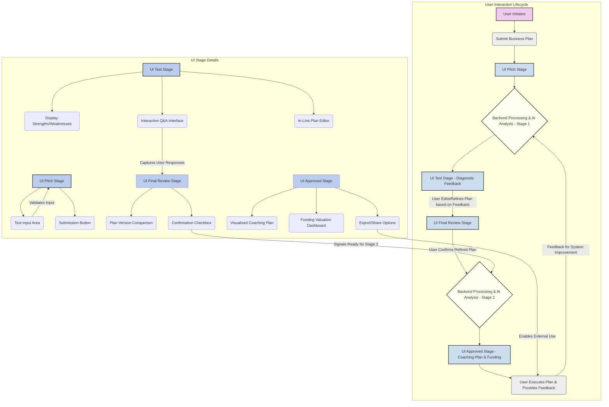
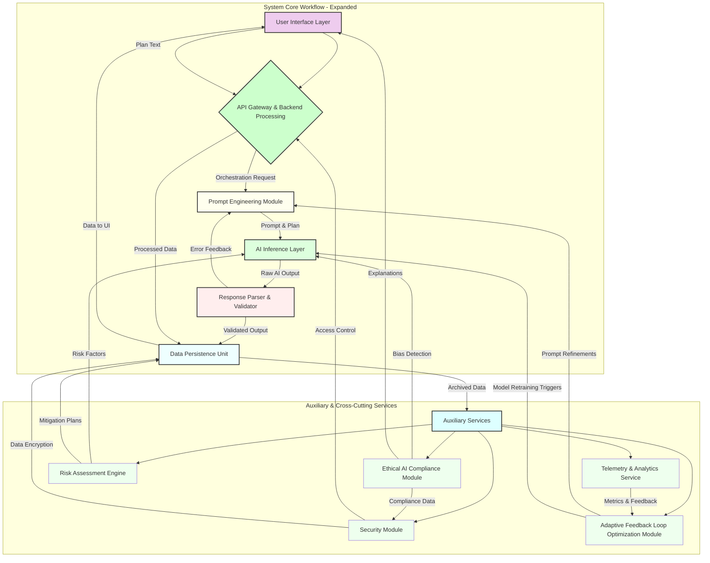
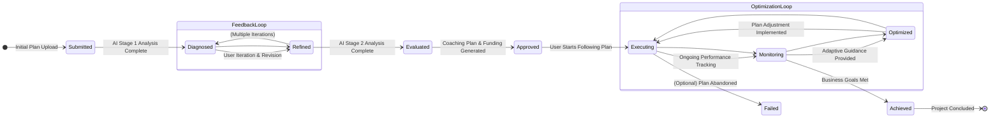

**Title of Invention:** System and Method for Adaptive Algorithmic Business Plan Analysis and Strategic Trajectory Optimization

**Abstract:**
A novel computational architecture and methodology are herein disclosed for the automated, iterative analysis of entrepreneurial ventures, represented by textual business plans. The system integrates advanced generative artificial intelligence paradigms to conduct a bi-modal analytical process: initially, a comprehensive diagnostic assessment yielding granular insights into inherent strengths and latent vulnerabilities, coupled with incisive interrogatives designed to stimulate user-driven refinement. Subsequently, upon systemic validation of the iteratively refined plan, the architecture orchestrates the synthesis of a dynamically optimized, multi-echelon strategic coaching plan, meticulously structured for actionable execution. Concurrently, a robust probabilistic valuation sub-system determines a simulated capital allocation index. The entirety of the AI-generated guidance is encapsulated within a rigorously defined, interoperable response schema, thereby establishing an automated, scalable paradigm for sophisticated business mentorship and strategic advisement, inherently elevating the probability density function of entrepreneurial success within a stochastic market landscape. This system further incorporates a sophisticated risk assessment engine, an ethical AI compliance module, and a continuous learning framework, ensuring both adaptive strategic guidance and adherence to responsible AI principles across all operational phases.

**Background of the Invention:**
The contemporary entrepreneurial ecosystem is characterized by an asymmetric distribution of strategic capital, both intellectual and financial. Aspiring innovators, particularly those at the ideation and nascent operational stages, frequently encounter significant systemic barriers to accessing sagacious guidance and granular feedback essential for the rigorous de-risking and optimal trajectory setting of their ventures. Traditional avenues, such as professional consulting engagements or dedicated mentorship programs, are invariably encumbered by prohibitive financial outlays, temporal inefficiencies, and inherent scalability limitations, rendering them inaccessible to a substantial segment of the entrepreneurial demographic. Furthermore, human evaluators, despite their invaluable experience, are susceptible to cognitive biases, inconsistencies in assessment criteria, and limitations in processing the sheer volume and complexity of market data pertinent to diverse business models. The resultant landscape is one where potentially transformative enterprises fail to coalesce due to a critical deficit in objective, comprehensive, and timely strategic counsel. This enduring deficiency posits an urgent and profound requirement for an an accessible, computationally robust, and instantaneously responsive automated instrumentality capable of delivering analytical depth and prescriptive strategic roadmaps equivalent to, or exceeding, the efficacy of conventional high-tier advisory services, thereby democratizing access to sophisticated business intelligence and accelerating innovation cycles. This system directly addresses these deficiencies by providing an intelligent, unbiased, and scalable alternative, leveraging cutting-edge AI to provide critical insights, foster iterative refinement, and generate actionable strategic blueprints, all while continuously learning and adapting to dynamic market conditions and evolving business paradigms.

**Brief Summary of the Invention:**
The present invention, meticulously engineered as the **Quantum Weaver™ System for Enterprise Trajectory Optimization**, stands as a pioneering, autonomous cognitive architecture designed to revolutionize the initial phases of business development and strategic planning. This system operates as a sophisticated AI-powered entrepreneurial incubator, executing a multi-phasic analytical and prescriptive protocol. Upon submission of an unstructured textual representation of a business plan, the Quantum Weaver™ initiates its primary analytical sequence. The submitted textual corpus is dynamically ingested by a proprietary inference engine, which, guided by a meticulously crafted, context-aware prompt heuristic, generates a seminal feedback matrix. This matrix comprises a concise yet profoundly insightful high-level diagnostic of the plan's intrinsic merits and emergent vulnerabilities, complemented by a rigorously curated set of strategic interrogatives. These questions are designed not merely to solicit clarification, but to provoke deeper introspection and stimulate an iterative refinement process by the user. Subsequent to user engagement with this preliminary output, the system proceeds to its secondary, prescriptive analytical phase. Herein, the (potentially refined) business plan is re-processed by the advanced generative AI model. This iteration is governed by a distinct, more complex prompt architecture, which mandates two pivotal outputs: firstly, the computation of a simulated seed funding valuation, derived from a sophisticated algorithmic assessment of market potential, team inferred capabilities, and financial viability within a predefined stochastic range; and secondly, the synthesis of a granular, multi-echelon strategic coaching plan. This coaching plan is not merely a collection of generalized advice; rather, it is a bespoke, temporally sequenced roadmap comprising distinct, actionable steps, each delineated with a specific title, comprehensive description, and an estimated temporal frame for execution. Critically, the entirety of the AI-generated prescriptive output is rigorously constrained within a pre-defined, extensible JSON schema, ensuring structural integrity, machine-readability, and seamless integration into dynamic user interfaces, thereby providing an unparalleled level of structured, intelligent guidance. Furthermore, the system incorporates a proactive risk assessment engine that identifies potential pitfalls and suggests mitigation strategies, along with an integrated ethical AI compliance module to ensure fairness, transparency, and accountability in its recommendations, thereby offering a holistic and responsible approach to entrepreneurial guidance.

**Detailed Description of the Invention:**

The **Quantum Weaver™ System for Enterprise Trajectory Optimization** constitutes a meticulously engineered, multi-layered computational framework designed to provide unparalleled automated business plan analysis and strategic advisory services. Its architecture embodies a symbiotic integration of advanced natural language processing, generative AI models, and structured data methodologies, all orchestrated to deliver a robust, scalable, and highly accurate entrepreneurial guidance platform.

### System Architecture and Operational Flow

The core system comprises several interconnected logical and functional components, ensuring modularity, scalability, and robust error handling.

#### 1. User Interface (UI) Layer
The frontend interface, accessible via a web-based application or dedicated client, serves as the primary conduit for user interaction. It is designed for intuitive usability, guiding the entrepreneur through the distinct stages of the analysis process. This layer is engineered using modern frontend frameworks (e.g., React, Vue) to ensure responsiveness and a dynamic user experience.

*   **Pitch Stage (Initial Submission):** This is the entry point where the user inputs their comprehensive business plan. It supports free-form textual data input, often with rich text editing capabilities. Key features include:
    *   **Text Length Validator:** Ensures the input meets minimum and maximum length requirements.
    *   **Format Suggestor:** Offers guidance on structuring the business plan for optimal AI processing, though free-form is supported.
    *   **Initial Data Pre-processor:** Performs basic sanitization and tokenization before submission.
    *   **Progress Indicator:** Visually communicates the status of plan submission and initial processing.
*   **Test Stage (Diagnostic Feedback & Interrogatives):** Displays the initial diagnostic feedback and strategic interrogatives generated by the AI. This stage is highly interactive:
    *   **Feedback Visualizer:** Renders strengths and weaknesses in an easily digestible format (e.g., bullet points, sentiment analysis score).
    *   **Interactive Question Prompts:** Allows users to directly input responses to AI-generated questions, or indicate where they've revised their original plan based on the feedback.
    *   **Plan Revision Editor:** An in-line editor for the business plan, linked to the feedback, allowing users to make real-time adjustments.
    *   **Confidence Slider (Optional):** Users can rate their confidence in their revised plan, providing valuable meta-feedback for the `Adaptive Feedback Loop Optimization Module`.
*   **FinalReview Stage (Pre-Prescriptive Confirmation):** Allows the user to confirm their business plan after potential revisions based on the 'Test' stage feedback, before proceeding to the final coaching plan generation. This acts as a crucial checkpoint:
    *   **Version Comparison Tool:** Highlights changes made between the initial submission and the refined version.
    *   **Agreement Check:** User explicit confirmation is required to proceed, acknowledging that the final plan for prescriptive analysis is the one displayed.
*   **Approved Stage (Coaching Plan & Funding Allocation):** Presents the comprehensive, structured coaching plan and the simulated seed funding allocation. This stage is designed for maximum clarity and actionability:
    *   **Interactive Coaching Plan Display:** Renders the complex JSON output into a human-readable, actionable format, typically employing interactive visualizations for the multi-step plan (e.g., Gantt charts, Kanban boards).
    *   **Funding Dashboard:** Visually represents the simulated funding amount, rationale, and potentially sensitivity analysis on various parameters.
    *   **Export Options:** Allows users to download the coaching plan and valuation details in various formats (PDF, CSV, JSON).
    *   **Feedback Collection:** Prompts users for feedback on the utility and accuracy of the generated outputs, feeding into the continuous improvement cycle.



#### 2. API Gateway & Backend Processing Layer
This layer acts as the orchestrator, receiving requests from the UI, managing data flow, interacting with the AI Inference Layer, and persisting relevant information. It is built upon a microservices architecture, ensuring high availability and fault tolerance.

*   **Request Handler:** Validates incoming user data, authenticates requests using OAuth2/JWT, and dispatches them to appropriate internal services (e.g., `Plan Submission Service`, `Feedback Service`, `Coaching Plan Service`). Implements rate limiting and DDoS protection.
*   **Orchestration Engine:** Manages the multi-stage AI workflow, coordinating calls between `Prompt Engineering`, `AI Inference`, and `Response Parser` modules, and managing state transitions for each business plan submission.
*   **Security & Compliance Module (Integrated):** Enforces data privacy regulations (e.g., GDPR, CCPA) and monitors for malicious inputs or unauthorized access attempts.

#### 2.1. Prompt Engineering Module: Advanced Prompt Orchestration
This is a crucial, proprietary sub-system responsible for dynamically constructing and refining the input prompts for the generative AI model. It incorporates advanced heuristics, few-shot exemplars, role-playing directives (e.g., "Act as a venture capitalist"), and specific constraint mechanisms (e.g., "Ensure output strictly adheres to JSON schema X"). Its internal components include:
*   **Prompt Template Library (`PTL`):** A curated repository of pre-defined, parameterized prompt structures optimized for various analytical tasks (e.g., diagnostic assessment, valuation, coaching plan generation). These templates incorporate best practices for eliciting high-quality, structured responses from LLMs, often leveraging Chain-of-Thought (CoT) prompting techniques. Each template `T_k` is defined by a set of slots `S_k` and a target task `Task_k`.
    *   `P_template(Task_k) = f(S_k)`
    *   Examples include `T_diagnostic`, `T_valuation`, `T_coaching`.
*   **Schema Definition Registry (`SDR`):** A centralized repository for all expected JSON output schemas. This registry provides the canonical structure that the AI model must adhere to, and which the `Response Parser & Validator` uses for validation. Each schema `Schema_m` has a unique ID and a formal definition (e.g., JSON Schema draft 2020-12).
    *   `Schema_m = {id: "G_feedback_schema", properties: {...}}`
*   **Heuristic Directive Engine (`HDE`):** This intelligent component applies contextual rules and learned heuristics to dynamically select appropriate templates, infuse specific role-playing personas, and inject few-shot examples into the prompts based on the current stage of user interaction and the evolving business plan content.
    *   `HDE(B, Stage) -> {Template_ID, Role, Constraints, Examples}`
    *   It uses a rule-based system `R` and potentially a learned model `M_h` trained on successful prompt generations.
    *   `P_final = Synthesize(T_template, Role, Constraints, Few_Shot_Examples, B_input)`
    *   The dynamic prompt generation function `Psi(B, stage_s)` ensures that the generated prompt `P_s` is maximally effective for the current stage.
    *   `P_s = Psi(B, stage_s) = \text{RoleDirective}(stage_s) + \text{InstructionSet}(stage_s) + \text{SchemaConstraint}(Schema_s) + \text{FewShotExamples}(stage_s) + \text{BusinessPlanContent}(B)`
    *   Here, `SchemaConstraint` ensures the LLM's output conforms to a `Schema_s` retrieved from `SDR`.
    *   `FewShotExamples` (FSE) are selected from a `FSE_Library` based on semantic similarity to `B` or `stage_s`.
    *   `P_final = T_{stage_s}(B | \text{FSE}_s, \text{Role}_s, \text{Schema}_s)`

```mermaid
graph TD
    subgraph Prompt Engineering Module (PEM)
        PEM_START[Business Plan (B) & Stage Context] --> A[Heuristic Directive Engine (HDE)];
        A --> B{Select Prompt Template};
        B --> C{Retrieve Schema Definition};
        B -- Parameters --> D[Prompt Template Library (PTL)];
        C -- Schema ID --> E[Schema Definition Registry (SDR)];
        A -- Role/Constraints/FSE Strategy --> F[Few-Shot Example Selector];
        F --> G[Few-Shot Example Database];
        D -- Template Structure --> H[Prompt Synthesizer];
        E -- Schema Format --> H;
        G -- Selected Examples --> H;
        H --> PEM_END[Finalized Prompt (P)];
    end

    style A fill:#DFF,stroke:#333,stroke-width:2px;
    style B fill:#EFF,stroke:#333,stroke-width:2px;
    style C fill:#EFF,stroke:#333,stroke-width:2px;
    style D fill:#CEE,stroke:#333,stroke-width:2px;
    style E fill:#CEE,stroke:#333,stroke-width:2px;
    style F fill:#EFF,stroke:#333,stroke:#2px;
    style G fill:#CEE,stroke:#333,stroke:#2px;
    style H fill:#FFF,stroke:#333,stroke:#2px;
    style PEM_START fill:#DCDCDC,stroke:#333,stroke-width:2px;
    style PEM_END fill:#DCDCDC,stroke:#333,stroke-width:2px;
```

#### 2.2. Response Parser & Validator: Intelligent Output Conditioning
Upon receiving raw text output from the AI, this module parses the content, validates it against the expected JSON schema, and handles any deviations or malformations through predefined recovery or re-prompting strategies.
*   **Initial Text Parser:** Converts raw LLM string output into a preliminary JSON object (or identifies parse errors). This involves robust error-tolerant JSON parsing.
*   **Schema Enforcement Engine (`SEE`):** Leverages the `Schema Definition Registry` to rigorously validate AI-generated text against the required JSON structures. It identifies missing fields, incorrect data types, structural inconsistencies, and extra unexpected fields.
    *   `Validation_Result = Validate(R_AI, Schema_s)`
    *   The validation process might involve parsing `R_AI` into a temporary object `O_temp`.
    *   `ParseError = CheckSyntax(R_AI)`
    *   `SchemaError = CheckStructure(O_temp, Schema_s)`
    *   `TypeError = CheckTypes(O_temp, Schema_s)`
*   **Error Recovery Strategies (`ERS`):** Implements automated mechanisms to address validation failures, such as:
    *   **Self-Correction Prompting:** If `ParseError` or `SchemaError` is detected, a new prompt `P_retry` is sent to the AI, explicitly detailing the parsing/schema error and asking for correction.
        *   `P_retry = P_original + \text{"Correction: JSON was invalid. Error: [Error_Msg]. Please resubmit."}`
    *   **Truncation/Extraction:** For minor malformations (e.g., extra conversational text), attempts to extract the valid JSON part.
    *   **Default Value Assignment:** For optional missing fields, assigns predefined default values.
    *   **Escalation to Human Oversight:** If persistent errors occur after `N` retry attempts, flags the response for manual review.
*   **Semantic Content Checker (`SCC`):** Beyond structural validation, this component performs a lightweight semantic check to ensure the generated content is relevant and coherent with the prompt's intent, preventing obvious AI hallucinations or off-topic responses. This might involve keyword matching, sentiment analysis, or embedding similarity checks against expected topics.
    *   `SemanticScore = CheckCoherence(O_validated, Prompt_Intent)`
    *   `Coherence(O, I) = \text{CosineSimilarity}(\text{Embed}(O), \text{Embed}(I))`
    *   A threshold `theta_c` is used: if `SemanticScore < theta_c`, the response might be flagged.

```mermaid
graph TD
    subgraph Response Parser & Validator (RPV)
        RPV_START[Raw AI Output (R_AI)] --> A[Initial Text Parser];
        A -- Parsed JSON (O_parsed) --> B{Schema Enforcement Engine (SEE)};
        A -- Parse Error --> D[Error Recovery Strategies (ERS)];
        B -- Validated JSON (O_validated) --> C[Semantic Content Checker (SCC)];
        B -- Schema/Type Error --> D;
        C -- Semantic Score --> RPV_END[Final Validated Output];
        C -- Low Semantic Score --> D;
        D -- Re-prompt Strategy --> E[Prompt Engineering Module];
        D -- Escalation --> F[Human Oversight];
        E --> RPV_START;
    end

    style A fill:#EFE,stroke:#333,stroke-width:2px;
    style B fill:#DFD,stroke:#333,stroke-width:2px;
    style C fill:#CFC,stroke:#333,stroke-width:2px;
    style D fill:#FDD,stroke:#333,stroke-width:2px;
    style E fill:#FFF,stroke:#333,stroke:2px;
    style F fill:#FFB,stroke:#333,stroke:2px;
    style RPV_START fill:#DCDCDC,stroke:#333,stroke-width:2px;
    style RPV_END fill:#DCDCDC,stroke:#333,stroke-width:2px;
```

#### 2.3. Data Persistence Unit: Secure & Scalable Information Repository
This unit securely stores all submitted business plans, generated feedback, coaching plans, funding amounts, and user interaction logs within a robust, scalable data repository (e.g., a distributed NoSQL database for flexible schema management and high availability). It employs advanced encryption techniques (AES-256 for data at rest, TLS 1.3 for data in transit) and adheres to principle of least privilege access control. Its specialized repositories include:
*   **Business Plan Repository (`BPR`):** Stores all versions of the user's business plan, including initial submissions and subsequent refinements, ensuring a comprehensive audit trail. Each plan `B_i` has a unique version history `B_i^{v_0}, B_i^{v_1}, ...`.
    *   `Store(B, UserID, Timestamp, VersionID)`
*   **Feedback Interaction Log (`FIL`):** Records every diagnostic feedback, strategic interrogative, and user response, providing a detailed history of the iterative refinement process. This log is crucial for the `Adaptive Feedback Loop`.
    *   `Log(UserID, PlanID, Stage, AI_Output, User_Response, Timestamp)`
*   **Coaching Plan Archive (`CPA`):** Stores all generated strategic coaching plans and their associated simulated funding allocations, ready for retrieval and presentation to the user.
    *   `Archive(PlanID, CoachingPlan_JSON, Funding_JSON, Timestamp)`
*   **Valuation History Ledger (`VHL`):** Maintains a chronological record of all simulated funding valuations, including rationales, for analytical and review purposes. It also stores intermediate valuation parameters.
    *   `Record(PlanID, FundingAmount, Rationale, Parameters, Timestamp)`
*   **Knowledge Graph Update Log (`KGL`):** Tracks changes and additions to the `Proprietary Knowledge Graph`, ensuring version control and auditability for continuous learning.
*   **Metrics & Events Store (`MES`):** Stores raw telemetry data and system events for the `Telemetry & Analytics Service`.

```mermaid
graph TD
    subgraph Data Persistence Unit (DPU)
        DPU_Input[Data from Backend Services] --> A[Data Ingestion Layer];
        A --> B{Data Router};
        B -- Business Plans & Revisions --> BPR[Business Plan Repository];
        B -- AI Feedback & User Responses --> FIL[Feedback Interaction Log];
        B -- Coaching Plans & Funding --> CPA[Coaching Plan Archive];
        B -- Valuation Details --> VHL[Valuation History Ledger];
        B -- KG Updates --> KGL[Knowledge Graph Update Log];
        B -- System Metrics & Events --> MES[Metrics & Events Store];
        BPR -- Versioning --> BPR_DB(NoSQL DB);
        FIL -- Timestamping --> FIL_DB(Time-Series DB);
        CPA -- Archiving --> CPA_DB(NoSQL DB);
        VHL -- Auditing --> VHL_DB(Relational DB);
        KGL -- Changelog --> KGL_DB(Graph DB);
        MES -- Analytics Source --> MES_DB(Data Lake);
        DPU_Output[Data Retrieval for UI/Analytics] <-- B;
    end

    style A fill:#EFF,stroke:#333,stroke-width:2px;
    style B fill:#DFD,stroke:#333,stroke-width:2px;
    style BPR fill:#CEE,stroke:#333,stroke-width:2px;
    style FIL fill:#CEE,stroke:#333,stroke:#2px;
    style CPA fill:#CEE,stroke:#333,stroke:#2px;
    style VHL fill:#CEE,stroke:#333,stroke:#2px;
    style KGL fill:#CEE,stroke:#333,stroke:#2px;
    style MES fill:#CEE,stroke:#333,stroke:#2px;
    style BPR_DB fill:#FEE,stroke:#333,stroke:1px;
    style FIL_DB fill:#FEE,stroke:#333,stroke:1px;
    style CPA_DB fill:#FEE,stroke:#333,stroke:1px;
    style VHL_DB fill:#FEE,stroke:#333,stroke:1px;
    style KGL_DB fill:#FEE,stroke:#333,stroke:1px;
    style MES_DB fill:#FEE,stroke:#333,stroke:1px;
    style DPU_Input fill:#DCDCDC,stroke:#333,stroke-width:2px;
    style DPU_Output fill:#DCDCDC,stroke:#333,stroke-width:2px;
```

#### 3. AI Inference Layer: Deep Semantic Processing Core
This constitutes the computational core, leveraging advanced generative AI models for deep textual analysis and synthesis. It's designed for high throughput and low latency, utilizing GPU-accelerated inference.

#### 3.1. Generative LLM Core (`GLC`)
This is the primary interface with a highly capable Large Language Model (LLM) or a suite of specialized transformer-based models (e.g., a mix of encoder-decoder and decoder-only architectures). This model possesses extensive natural language understanding (NLU), natural language generation (NLG), and complex reasoning capabilities. The model is further fine-tuned on a proprietary corpus of successful and unsuccessful business plans, market analyses, and strategic advisories.
*   **Fine-tuning & Customization:** The base LLM `LLM_base` is continuously fine-tuned using a proprietary dataset `D_prop = D_{BP_succ} \cup D_{BP_fail} \cup D_{Market} \cup D_{Advisory}`.
    *   `LLM_fine_tuned = FineTune(LLM_base, D_prop, Loss_fn)`
    *   The loss function `Loss_fn` is typically cross-entropy for text generation, but also includes terms for structural adherence (JSON schema) and factual consistency (Knowledge Graph alignment).
*   **Ensemble Model (Optional but Recommended):** For critical tasks (e.g., funding valuation), an ensemble of `N` LLMs (or different versions of the same LLM) might be used to reduce variance and increase robustness.
    *   `R_ensemble = Aggregate(LLM_1(P), LLM_2(P), ..., LLM_N(P))`
    *   Aggregation can involve voting, averaging, or a meta-learner.
*   **Responsible AI Guardrails:** Implements content filtering and bias detection mechanisms to prevent the generation of harmful, biased, or unethical advice, ensuring compliance with the `Ethical AI Compliance Module`.

#### 3.2. Contextual Vector Embedder (`CVE`)
Utilizes state-of-the-art vector embedding techniques (e.g., Sentence-BERT, OpenAI Embeddings, custom domain-specific embeddings) to represent the business plan text and associated prompts in a high-dimensional semantic space. This process facilitates nuanced comprehension, captures complex relationships, and enables sophisticated response generation by the LLM by providing a rich, dense representation of the input.
*   `Vector_B = Embed(B)`
*   `Vector_P = Embed(P)`
*   The embeddings are used for:
    *   Semantic search in the `Proprietary Knowledge Graph`.
    *   Few-shot example selection in the `Prompt Engineering Module`.
    *   Similarity checks in the `Semantic Content Checker`.
    *   Clustering of business plans for market analysis.
    *   `Embed(text) = BERT(text)` where BERT is a pre-trained transformer model.

#### 3.3. Proprietary Knowledge Graph (`PKG`)
An essential component, this internal knowledge graph provides enhanced reasoning and factual accuracy. It contains up-to-date market data, industry trends, competitor analysis, regulatory information, and a curated repository of business success factors, which the LLM can consult during its analysis and generation processes (via Retrieval Augmented Generation - RAG).
*   **Graph Structure:** A graph database (e.g., Neo4j) stores entities (companies, markets, technologies, regulations) and relationships (e.g., `COMPETES_WITH`, `IS_IN_MARKET`, `USES_TECHNOLOGY`).
*   **RAG System:** When an LLM processes a prompt, relevant facts/nodes from `PKG` are retrieved based on the semantic similarity of the prompt/business plan embeddings to the graph's nodes/edges. These facts are then prepended to the prompt as context.
    *   `Context_KG = Retrieve(Vector_P, Vector_B, PKG)`
    *   `P_RAG = P_original + Context_KG`
*   **Continuous Update Mechanism:** `PKG` is regularly updated via automated web scraping, data partnerships, and human curation, ensuring its information remains current.

```mermaid
graph TD
    subgraph AI Inference Layer (AIL)
        AIL_START[Input Prompt (P) & Business Plan (B)] --> A[Contextual Vector Embedder (CVE)];
        A -- Embeddings (V_P, V_B) --> B[Retrieval Augmented Generation (RAG) System];
        B -- Query & Contextualize --> C[Proprietary Knowledge Graph (PKG)];
        C -- Retrieved Facts/Context --> B;
        B -- Augmented Prompt (P_RAG) --> D[Generative LLM Core (GLC)];
        D -- LLM Output (R_AI) --> AIL_END[Raw AI Output];
        D -- Bias Detection --> E[Ethical AI Compliance Module];
        E -- Feedback --> D;
        GLC -- Fine-tuning Data Input --> F[Proprietary Dataset];
        F -- Continuous Learning --> GLC;
    end

    style A fill:#EFE,stroke:#333,stroke-width:2px;
    style B fill:#DFD,stroke:#333,stroke-width:2px;
    style C fill:#CEE,stroke:#333,stroke-width:2px;
    style D fill:#CFC,stroke:#333,stroke-width:2px;
    style E fill:#FDD,stroke:#333,stroke-width:2px;
    style F fill:#DCDCDC,stroke:#333,stroke-width:2px;
    style AIL_START fill:#DCDCDC,stroke:#333,stroke-width:2px;
    style AIL_END fill:#DCDCDC,stroke:#333,stroke-width:2px;
```

#### 4. Auxiliary Services: System Intelligence & Resilience
These services provide essential support functions for system operation, monitoring, security, and continuous improvement.

#### 4.1. Telemetry & Analytics Service (`TAS`)
Gathers anonymous usage data, performance metrics, and AI response quality assessments for continuous system improvement.
*   **Performance Metrics Collection:** Monitors system latency, API response times, AI model inference speed, resource utilization (CPU, GPU, RAM), and error rates.
    *   `Latency = Time(Request_End) - Time(Request_Start)`
    *   `Throughput = Number_of_Requests / Time_Unit`
    *   Metrics are collected using Prometheus/Grafana stack.
*   **User Engagement Analysis:** Tracks user interaction patterns, time spent on stages, adoption of feedback, completion rates, and navigation paths to optimize UI/UX and overall user journey.
    *   `Engagement_Score = f(\text{TimeOnPage}, \text{ClickThroughRate}, \text{CompletionRate})`
*   **AI Response Quality Assessment:** Collects implicit (e.g., subsequent user actions, plan refinement rate) or explicit (e.g., thumbs up/down, satisfaction surveys) user feedback on the helpfulness and accuracy of AI-generated content. This data is critical for the `Adaptive Feedback Loop Optimization Module`.
    *   `Quality_Score = g(\text{ExplicitFeedback}, \text{ImplicitAction})`
    *   `ImplicitAction` could be `1` if the user proceeds to the next stage, `0` otherwise.

#### 4.2. Security Module (`SM`)
Implements comprehensive security protocols for data protection, access control, and threat mitigation.
*   **Data Encryption Management:** Ensures encryption of data in transit (e.g., TLS 1.3) and at rest (e.g., AES-256 with KMS integration) for all sensitive business plan information and user data. Key rotation policies are enforced.
*   **Authentication & Authorization:** Manages user identities, roles, and permissions using industry-standard protocols (e.g., OAuth 2.0, OpenID Connect) to control granular access to system functionalities and data. Role-Based Access Control (RBAC) is implemented.
*   **Threat Detection & Vulnerability Scanner Integration:** Integrates with security information and event management (SIEM) systems (e.g., Splunk, Elastic SIEM) and uses vulnerability scanning tools (e.g., Nessus, Qualys) to continuously monitor for suspicious activities, potential vulnerabilities (e.g., prompt injection attempts), and compliance breaches.
    *   `Alert_Score = h(\text{ThreatSeverity}, \text{AttackVector}, \text{VulnerabilityScore})`
    *   Anomaly detection algorithms monitor user behavior and system logs.

#### 4.3. Adaptive Feedback Loop Optimization Module (`AFLOM`)
A critical component for the system's continuous evolution. This module analyzes data from the `Telemetry & Analytics Service` and the `Feedback Interaction Log` to identify patterns in AI output quality, user satisfaction, and system performance. It then autonomously or semi-autonomously suggests refinements to the `Prompt Engineering Module` (e.g., modifications to prompt templates, new few-shot examples, updated role-playing directives) and potentially flags areas for `Generative LLM Core` fine-tuning, thereby continually enhancing the system's accuracy and utility over time.
*   **Feedback Aggregator & Analyzer:** Collects and processes `Quality_Score` and other feedback data, identifying trends and recurring issues (e.g., specific types of plans where AI struggles).
*   **Prompt Optimization Engine:** Uses reinforcement learning (RL) or Bayesian optimization to suggest improvements to prompts.
    *   `Maximize(E[Quality_Score | P])`
    *   `Update(P_template) = P_template + \Delta P_template` where `\Delta P_template` is derived from an optimization algorithm.
*   **Model Retraining Trigger:** If a significant decline in overall `Quality_Score` is detected, or if new data types emerge, `AFLOM` triggers a recommendation for `Generative LLM Core` re-fine-tuning.
*   **A/B Testing Framework:** Facilitates controlled experiments for new prompts or model versions before full deployment, measuring their impact on key performance indicators.
    *   `KPI_Improvement = (KPI_variant - KPI_control) / KPI_control`

```mermaid
graph TD
    subgraph Adaptive Feedback Loop Optimization (AFLOM)
        AFLOM_START[Telemetry & Feedback Data] --> A[Data Aggregation & Preprocessing];
        A --> B[Quality & Performance Anomaly Detection];
        B -- Anomaly Detected --> C{Analyze Root Cause};
        C --> D[Prompt Optimization Engine (POE)];
        C --> E[Model Retraining Trigger (MRT)];
        D -- Proposed Prompt Refinements --> F[Prompt Engineering Module (PEM)];
        E -- Retraining Request --> G[Generative LLM Core (GLC)];
        F -- New/Updated Prompts --> H[A/B Testing Framework];
        G -- New Model Version --> H;
        H -- Test Results (KPIs) --> AFLOM_START;
    end

    style A fill:#ECE,stroke:#333,stroke-width:2px;
    style B fill:#DFE,stroke:#333,stroke-width:2px;
    style C fill:#CFD,stroke:#333,stroke-width:2px;
    style D fill:#BFC,stroke:#333,stroke-width:2px;
    style E fill:#BFC,stroke:#333,stroke:2px;
    style F fill:#FFF,stroke:#333,stroke:2px;
    style G fill:#FFF,stroke:#333,stroke:2px;
    style H fill:#EAEAEA,stroke:#333,stroke:2px;
    style AFLOM_START fill:#DCDCDC,stroke:#333,stroke-width:2px;
```

#### 4.4. Risk Assessment Engine (`RAE` - New Feature)
This module systematically identifies, evaluates, and quantifies potential risks associated with the business plan.
*   **Risk Taxonomy & Ontology:** A structured classification of entrepreneurial risks (e.g., market risk, technical risk, financial risk, operational risk, regulatory risk).
*   **Risk Factor Extraction:** Uses NLP techniques to extract explicit and implicit risk factors from the business plan text (e.g., "highly competitive market," "unproven technology").
*   **Probabilistic Risk Scoring:** Assigns a probability and impact score to each identified risk using statistical models trained on historical data.
    *   `Risk_Score = P(\text{Event}) \times \text{Impact}(\text{Loss})`
    *   `P(\text{Event} | B) = \sigma(\text{NN}(\text{Embed}(B), \text{RiskFactorFeatures}))`
*   **Mitigation Strategy Generation:** The LLM, informed by the `PKG` and specific prompts, generates actionable mitigation strategies for identified risks.
    *   `Mitigation_Plan = LLM(B, Risks, P_mitigation)`
*   **Scenario Analysis:** Simulates different market conditions and operational challenges to assess the robustness of the business plan under stress. This can involve Monte Carlo simulations.
    *   `S_value = \text{MonteCarloSim}(B, Market_Vars, Risk_Factors)`

```mermaid
graph TD
    subgraph Risk Assessment Engine (RAE)
        RAE_START[Business Plan (B)] --> A[Risk Factor Extraction (NLP)];
        A --> B[Risk Taxonomy & Ontology];
        B -- Classify --> C[Probabilistic Risk Scoring];
        C -- Risk Scores (P, Impact) --> D[Proprietary Knowledge Graph (PKG)];
        D -- Historical Mitigation Data --> E[Mitigation Strategy Generation (LLM)];
        C -- Risks & Parameters --> F[Scenario Analysis (Monte Carlo)];
        E -- Strategies --> RAE_END[Risk Report & Mitigation Plan];
        F -- Stress Test Results --> RAE_END;
    end

    style A fill:#EFD,stroke:#333,stroke-width:2px;
    style B fill:#EFC,stroke:#333,stroke-width:2px;
    style C fill:#DFB,stroke:#333,stroke-width:2px;
    style D fill:#CEE,stroke:#333,stroke-width:2px;
    style E fill:#BFC,stroke:#333,stroke:#2px;
    style F fill:#BFC,stroke:#333,stroke:#2px;
    style RAE_START fill:#DCDCDC,stroke:#333,stroke-width:2px;
    style RAE_END fill:#DCDCDC,stroke:#333,stroke-width:2px;
```

#### 4.5. Ethical AI Compliance Module (`EACM` - New Feature)
Ensures that the AI system operates responsibly, fairly, and transparently, adhering to ethical guidelines and regulatory requirements.
*   **Bias Detection & Mitigation:** Continuously monitors AI outputs for unfair biases (e.g., gender, race, geographical bias) in recommendations or valuations. Uses fairness metrics (e.g., demographic parity, equalized odds) and applies debiasing techniques (e.g., re-sampling, adversarial debiasing).
    *   `Bias_Metric(R_AI, Demographics) > \tau_{bias}` flags a potential issue.
*   **Transparency & Explainability:** Provides mechanisms to explain AI decisions where possible. This includes highlighting key phrases in the business plan that led to specific feedback or valuation amounts (e.g., using LIME or SHAP values).
    *   `Explanation = XAI_Model(LLM_Output, BusinessPlan)`
*   **Privacy Preserving AI:** Ensures that sensitive user data is handled securely and in compliance with privacy regulations. Employs techniques like federated learning or differential privacy if suitable for future model training.
    *   `DP_noise = N(0, \sigma^2)` added to gradients during training.
*   **Accountability Framework:** Establishes clear protocols for human review and intervention in cases of erroneous or biased AI outputs. Links to `Human Oversight` in `ERS`.

```mermaid
graph TD
    subgraph Ethical AI Compliance Module (EACM)
        EACM_START[AI Outputs & User Data] --> A[Bias Detection & Fairness Metrics];
        A -- Bias Detected --> B[Bias Mitigation Strategies];
        A --> C[Transparency & Explainability (XAI)];
        C -- Explainability Request --> D[XAI Model (LIME/SHAP)];
        D -- Explanations --> EACM_END[Ethical Review & User Explanation];
        B -- Debiasing Feedback --> F[Generative LLM Core];
        F -- Ethical Guidelines --> EACM_END;
        EACM_START --> G[Privacy Preserving AI];
        G -- Data Anonymization --> F;
        EACM_START --> H[Accountability Framework];
        H -- Human Oversight Triggers --> I[Human Review Panel];
        I --> EACM_END;
    end

    style A fill:#FDD,stroke:#333,stroke-width:2px;
    style B fill:#FEE,stroke:#333,stroke-width:2px;
    style C fill:#DFB,stroke:#333,stroke-width:2px;
    style D fill:#CFC,stroke:#333,stroke-width:2px;
    style EACM_END fill:#DCDCDC,stroke:#333,stroke-width:2px;
    style EACM_START fill:#DCDCDC,stroke:#333,stroke-width:2px;
    style F fill:#FFF,stroke:#333,stroke-width:2px;
    style G fill:#EFC,stroke:#333,stroke-width:2px;
    style H fill:#EBD,stroke:#333,stroke-width:2px;
    style I fill:#FFB,stroke:#333,stroke-width:2px;
```



#### 5. Strategic Coaching Plan Execution and Monitoring
Once the `Approved Stage` is reached, the system's utility extends to supporting the execution of the generated coaching plan.

*   **Action Tracking Interface:** A dedicated section in the UI (or an integrated dashboard) allows users to mark tasks as complete, add notes, and upload evidence of completion for each step of the coaching plan.
*   **Progress Visualization:** Visually represents the entrepreneur's progress against the defined timeline and key deliverables, providing motivation and enabling self-correction.
*   **Performance Monitoring Metrics:** Tracks specific metrics defined in the coaching plan (`measurement_metrics`) to objectively assess the impact of executed strategies (e.g., website traffic, customer acquisition cost, revenue growth). This data can be manually input or, in advanced versions, integrated with external analytics platforms.
*   **Adaptive Guidance Updates:** Based on the monitored performance and market changes, the system can periodically re-evaluate the coaching plan and suggest minor adjustments or refinements, functioning as a "real-time mentor."
    *   `Delta_Plan = Recompute_Plan(B_current, Market_State, Performance_Metrics)`

```mermaid
graph TD
    subgraph Strategic Coaching Plan Execution Workflow
        A[Entrepreneur Receives Coaching Plan];
        A --> B{Action Tracking Interface};
        B -- Executes Step --> C[Update Progress];
        C --> D[Progress Visualization];
        C -- Inputs Metrics --> E[Performance Monitoring Metrics];
        E --> F{Adaptive Guidance Updates};
        F -- New Market Data/Performance Trigger --> G[Re-evaluate Coaching Plan (AI Inference)];
        G --> H[Suggest Plan Adjustments];
        H --> B;
        F -- No Adjustments Needed --> I[Continue Execution];
    end

    style A fill:#CEE,stroke:#333,stroke-width:2px;
    style B fill:#BCE,stroke:#333,stroke-width:2px;
    style C fill:#CFC,stroke:#333,stroke-width:2px;
    style D fill:#DFD,stroke:#333,stroke-width:2px;
    style E fill:#EFE,stroke:#333,stroke:2px;
    style F fill:#FFE,stroke:#333,stroke:2px;
    style G fill:#DFD,stroke:#333,stroke:2px;
    style H fill:#CFC,stroke:#333,stroke:2px;
    style I fill:#CEE,stroke:#333,stroke:2px;
```

#### 6. Overall System State Transition
This chart illustrates the high-level states of a business plan within the Quantum Weaver™ system, from submission to ongoing execution support.



### Multi-Stage AI Interaction and Prompt Engineering

The efficacy of the Quantum Weaver™ System hinges on its sophisticated, multi-stage interaction with the generative AI model, each phase governed by dynamically constructed prompts and rigorously enforced response schemas.

#### Stage 1: Initial Diagnostic Feedback and Strategic Interrogation (`G_feedback`)

1.  **Input:** Raw textual business plan `B_raw` from the user. This input `B_raw` is a string `s_B \in \Sigma^*`, where `\Sigma` is the alphabet of natural language.
2.  **Prompt Construction (`Prompt Engineering Module`):**
    The system constructs a highly specific prompt, `P_1`, designed to elicit a precise type of output. `P_1` is structured as follows:

    ```
    "Role: You are a highly experienced venture capital analyst with a deep understanding of market dynamics, financial modeling, team evaluation, and product-market fit. Your task is to provide an incisive, constructive, and comprehensive initial assessment of the submitted business plan.

    Instruction 1: Perform a high-level strategic analysis, identifying the core strengths (e.g., market opportunity, innovative solution, team experience) and critical weaknesses (e.g., undifferentiated offering, unclear revenue model, unrealistic projections, significant competitive threats).
    Instruction 2: Generate 3-5 profoundly insightful follow-up questions that probe the most sensitive areas of the plan. These questions should be designed to uncover potential blind spots, challenge assumptions, and prompt the entrepreneur for deeper strategic consideration. Frame these as direct questions to the user.
    Instruction 3: Structure your response strictly according to the provided JSON schema. Do not deviate.

    JSON Schema:
    {
      "analysis": {
        "title": "Initial Strategic Assessment",
        "strengths": [
          {"point": "string", "elaboration": "string"},
          ...
        ],
        "weaknesses": [
          {"point": "string", "elaboration": "string"},
          ...
        ]
      },
      "follow_up_questions": [
        {"id": "int", "question": "string", "rationale": "string"},
        ...
      ]
    }

    Business Plan for Analysis: """
    [User's submitted business plan text here]
    """
    "
    ```
    This prompt leverages "role-playing" to imbue the AI with a specific persona, "instruction chaining" for multi-objective output, and "schema enforcement" for structured data generation. The prompt generation function `\Psi_1(B_{raw})` outputs `P_1`.
    The `Heuristic Directive Engine` determines `R_{persona}` (Role), `I_1, I_2, I_3` (Instructions), and `S_1` (JSON Schema for Stage 1).
    `P_1 = R_{persona} \oplus I_1 \oplus I_2 \oplus I_3 \oplus S_1 \oplus \text{"Business Plan: "} \oplus B_{raw}`.
    Here `\oplus` denotes concatenation.

3.  **AI Inference:** The `AI Inference Layer` processes `P_1` and `B_raw`, generating a JSON response, `R_1`.
    `R_1 = \text{LLM}(P_1)`.
4.  **Output Processing:** `R_1` is parsed and validated by the `Response Parser & Validator`. If `R_1` conforms to the schema `S_1`, its contents are displayed to the user in the `Test` stage. Non-conforming responses trigger automated re-prompting or error handling.
    `Validation(R_1, S_1) = \text{true}` implies successful processing.
    If `Validation(R_1, S_1) = \text{false}`, then `\text{ERR_HANDLER}(R_1, P_1)`.

#### Stage 2: Simulated Funding Valuation and Dynamic Coaching Plan Generation (`G_plan`)

1.  **Input:** The (potentially refined) textual business plan `B_refined` (which could be identical to `B_raw` if no user revisions occurred). A user confirmation signal.
2.  **Prompt Construction (`Prompt Engineering Module`):**
    A second, more elaborate prompt, `P_2`, is constructed. `P_2` simulates an advanced stage of evaluation, integrating the implicit "approval" for funding to shift the AI's cognitive focus from critique to prescriptive guidance and valuation.

    ```
    "Role: You are a Lead Partner at a highly discerning seed-stage venture capital fund and a seasoned business mentor. You have reviewed this business plan and decided to move forward with a funding commitment, contingent upon a clear strategic execution roadmap.

    Instruction 1: Determine a precise seed funding amount. This amount must be a monetary value between $50,000 and $250,000 USD. Your determination should be based on an implicit assessment of market size, product-market fit potential, team strength (as inferred from the plan), scalability, and initial financial projections. Provide a concise rationale for the determined amount.
    Instruction 2: Develop a comprehensive, multi-step coaching plan to guide the entrepreneur from this stage through the initial 6-12 months of operations. The plan MUST consist of exactly 4 distinct, actionable steps. Each step must have a clear title, a detailed description outlining specific tasks and objectives, and a realistic timeline (e.g., 'Weeks 1-4', 'Months 1-3'). Focus on strategic milestones, operational efficiencies, market validation, and early revenue generation.
    Instruction 3: Structure your entire response strictly according to the provided JSON schema. Do not include any conversational text outside the JSON.

    JSON Schema:
    {
      "seed_funding_allocation": {
        "amount_usd": "integer",
        "rationale": "string"
      },
      "coaching_plan": {
        "title": "Strategic Acceleration Roadmap",
        "summary": "string",
        "steps": [
          {
            "step_number": "integer",
            "title": "string",
            "description": "string",
            "timeline": "string",
            "key_deliverables": ["string", ...],
            "measurement_metrics": ["string", ...]
          },
          {
            "step_number": "integer",
            "title": "string",
            "description": "string",
            "timeline": "string",
            "key_deliverables": ["string", ...],
            "measurement_metrics": ["string", ...]
          },
          {
            "step_number": "integer",
            "title": "string",
            "description": "string",
            "timeline": "string",
            "key_deliverables": ["string", ...],
            "measurement_metrics": ["string", ...]
          },
          {
            "step_number": "integer",
            "title": "string",
            "description": "string",
            "timeline": "string",
            "key_deliverables": ["string", ...],
            "measurement_metrics": ["string", ...]
          }
        ]
      }
    }

    Business Plan for Approved Funding and Coaching: """
    [User's (potentially refined) business plan text here]
    """
    "
    ```
    The prompt generation function `\Psi_2(B_{refined})` outputs `P_2`.
    `P_2 = R'_{persona} \oplus I'_1 \oplus I'_2 \oplus I'_3 \oplus S_2 \oplus \text{"Business Plan: "} \oplus B_{refined}`.

3.  **AI Inference:** The `AI Inference Layer` processes `P_2` and `B_refined`, generating a comprehensive JSON response, `R_2`.
    `R_2 = \text{LLM}(P_2)`.
4.  **Output Processing:** `R_2` is parsed and validated against its stringent schema `S_2`. The extracted `seed_funding_allocation` and `coaching_plan` objects are then stored in the `Data Persistence Unit` and presented to the user in the `Approved` stage.
    `Validation(R_2, S_2) = \text{true}` implies successful processing.

This two-stage, prompt-driven process ensures a highly specialized and contextually appropriate interaction with the generative AI, moving from diagnostic evaluation to prescriptive strategic guidance, thereby maximizing the actionable utility for the entrepreneurial user. The system's inherent design dictates that all generated outputs are proprietary and directly derivative of its unique computational methodology.

**Claims:**

We assert the exclusive intellectual construct and operational methodology embodied within the Quantum Weaver™ System through the following foundational declarations:

1.  A system for automated, multi-stage strategic analysis and prescriptive guidance for business plans, comprising:
    a.  A user interface module configured to receive an unstructured textual business plan from a user;
    b.  A prompt engineering module configured to generate a first contextually parameterized prompt, said first prompt instructing a generative artificial intelligence model to perform a diagnostic analysis of the received business plan and to formulate a plurality of strategic interrogatives;
    c.  A generative artificial intelligence inference module communicatively coupled to the prompt engineering module, configured to process said first prompt and the business plan, and to generate a first structured output comprising said diagnostic analysis and said plurality of strategic interrogatives;
    d.  A response parsing and validation module configured to receive and validate said first structured output against a predefined schema, and to present said validated first structured output to the user via the user interface module;
    e.  The prompt engineering module further configured to generate a second contextually parameterized prompt, said second prompt instructing the generative artificial intelligence model to perform a simulated valuation of the business plan and to synthesize a multi-echelon strategic coaching plan, said second prompt incorporating an indication of prior diagnostic review;
    f.  The generative artificial intelligence inference module further configured to process said second prompt and the business plan, and to generate a second structured output comprising a simulated funding allocation and said multi-echelon strategic coaching plan;
    g.  The response parsing and validation module further configured to receive and validate said second structured output against a predefined schema, and to present said validated second structured output to the user via the user interface module.

2.  The system of claim 1, wherein the first structured output adheres to a JSON schema defining fields for strengths, weaknesses, and a structured array of follow-up questions, each question comprising an identifier, the question text, and an underlying rationale.

3.  The system of claim 1, wherein the second structured output adheres to a JSON schema defining fields for a simulated seed funding amount with a corresponding rationale, and a coaching plan object comprising a title, a summary, and an array of discrete steps, each step further detailing a title, a comprehensive description, a timeline for execution, key deliverables, and specific measurement metrics.

4.  The system of claim 1, wherein the generative artificial intelligence inference module is a large language model LLM fine-tuned on a proprietary corpus of business plans, market analyses, and strategic advisory documents, further enhanced by a Retrieval Augmented Generation (RAG) system utilizing a proprietary knowledge graph.

5.  The system of claim 1, further comprising a data persistence unit configured to securely store the received business plan, the generated first and second structured outputs, and user interaction logs, along with version control for all stored artifacts.

6.  A method for automated strategic guidance of entrepreneurial ventures, comprising:
    a.  Receiving, by a computational system, a textual business plan from an originating user;
    b.  Generating, by a prompt engineering module of said computational system, a first AI directive, said directive comprising instructions for a generative AI model to conduct a foundational evaluative assessment and to articulate a series of heuristic inquiries pertaining to the textual business plan;
    c.  Transmitting, by said computational system, the textual business plan and said first AI directive to said generative AI model;
    d.  Acquiring, by said computational system, a first machine-interpretable data construct from said generative AI model, said construct encoding the evaluative assessment and the heuristic inquiries in a predetermined schema;
    e.  Presenting, by a user interface module of said computational system, the content of said first machine-interpretable data construct to the originating user;
    f.  Generating, by said prompt engineering module, a second AI directive subsequent to the presentation in step (e), said second directive comprising instructions for said generative AI model to ascertain a probabilistic capital valuation and to formulate a structured sequence of prescriptive actions derived from the textual business plan;
    g.  Transmitting, by said computational system, the textual business plan and said second AI directive to said generative AI model;
    h.  Acquiring, by said computational system, a second machine-interpretable data construct from said generative AI model, said construct encoding the probabilistic capital valuation and the structured sequence of prescriptive actions in a predetermined schema; and
    i.  Presenting, by said user interface module, the content of said second machine-interpretable data construct to the originating user.

7.  The method of claim 6, wherein the step of generating the first AI directive further comprises embedding role-playing instructions to configure the generative AI model to assume a specific analytical persona, and incorporating few-shot examples selected based on semantic similarity to the business plan.

8.  The method of claim 6, wherein the step of generating the second AI directive further comprises embedding contextual cues implying a conditional approval for funding to bias the generative AI model towards prescriptive synthesis, and dynamically adjusting prompt parameters based on user interaction history.

9.  The method of claim 6, further comprising, prior to step (h), the step of validating the structural integrity and semantic coherence of the second machine-interpretable data construct against the predetermined schema, including performing automated error recovery strategies such as re-prompting the generative AI model with specific error messages.

10. A non-transitory computer-readable medium storing instructions that, when executed by one or more processors, cause the one or more processors to perform the method of claim 6, further including instructions for a continuous adaptive feedback loop that refines prompt generation and AI model parameters based on user engagement and AI output quality metrics.

**Mathematical Justification: The Quantum Weaver's Probabilistic Valuation and Strategic Trajectory Optimization**

The analytical and prescriptive capabilities of the Quantum Weaver™ System are underpinned by a sophisticated mathematical framework, transforming the qualitative intricacies of a business plan into quantifiable metrics and actionable strategic pathways. We formalize this process through the lens of high-dimensional stochastic processes, decision theory, and optimal control, asserting that the system operates upon principles of computationally derived expected utility maximization within a latent business success manifold.

### I. The Business Plan Valuation Manifold: `V(B)`

Let `B` represent a business plan. We conceptualize `B` not as a discrete document, but as a point in a high-dimensional, continuously differentiable manifold, `M_B`, embedded within `R^D`, where `D` is the cardinality of salient business attributes. Each dimension in `M_B` corresponds to a critical factor influencing entrepreneurial success, such as market opportunity, product innovation, team expertise, financial viability, operational strategy, and competitive advantage. The precise representation of `B` is a vector `b = (b_1, b_2, ..., b_D)`, where each `b_i` is a numerical encoding (e.g., via advanced transformer embeddings) of a specific aspect of the plan.

**1. Feature Extraction and Embedding Space:**
The initial textual business plan `B` is transformed into a rich vector representation `\phi(B) \in \mathbb{R}^d` using the `Contextual Vector Embedder`. This embedding process, often based on transformer models, captures semantic meaning and relationships.
(1) `\phi(B) = \text{Embed}(B)`
The manifold `M_B` is thus the space `\mathbb{R}^d` where these embeddings reside.

**2. Intrinsic Success Probability `V(B)`:**
We define the intrinsic success probability of a business plan `B` as a scalar-valued function `V: M_B \rightarrow [0, 1]`, representing the conditional probability `P(\text{Success} | B)`. This function `V(B)` is inherently complex, non-linear, and non-convex, influenced by a multitude of interdependent variables.
(2) `V(B) = P(\text{Success} | \phi(B))`
This is estimated by the `Generative LLM Core` which acts as a sophisticated classifier/regressor. The LLM implicitly learns an approximation `V_{AI}(B)` based on its training data `D_{prop}`.
(3) `V_{AI}(B) \approx E[Y | \phi(B); \Theta_{LLM}]` where `Y \in \{0, 1\}` is the success indicator and `\Theta_{LLM}` are the LLM's parameters.
The training objective is to minimize a divergence metric, e.g., binary cross-entropy loss:
(4) `L_{BCE}(\Theta_{LLM}) = -\frac{1}{N} \sum_{i=1}^N [y_i \log(V_{AI}(B_i)) + (1-y_i) \log(1-V_{AI}(B_i))]`
Here `(B_i, y_i)` are training examples.

**Proposition 1.1: Existence of an Optimal Business Plan Submanifold.**
Within `M_B`, there exists a submanifold `M_B^* \subseteq M_B` such that for any `B^* \in M_B^*`, `V(B^*) \geq V(B)` for all `B \in M_B`, representing the set of maximally viable business plans. The objective is to guide an initial plan `B_0` towards `M_B^*`.
The optimal strategy `\pi^*` aims to transform `B_0` to `B^*` such that `V(B^*)` is maximized.
(5) `B^* = \text{argmax}_{B \in M_B} V(B)`

To rigorously define `V(B)`, we employ a Bayesian hierarchical model. Let `X` be the set of observable attributes extracted from `B`, and `\Theta` be a set of latent variables representing underlying market conditions, execution capabilities, and exogenous factors.
Then, `V(B)` can be expressed as:
(6) `V(B) = P(\text{Success} | X, \Theta) = \int P(\text{Success} | X, \theta) P(\theta | X) d\theta`
The `Proprietary Knowledge Graph (PKG)` provides structured priors for `P(\theta | X)`.
(7) `P(\theta | X) \propto P(X | \theta) P(\theta)` (Bayes' Theorem for latent variables)
The LLM acts as a powerful non-parametric estimator for `P(\text{Success} | X, \theta)`.

### II. The Gradient Generation Function: `G_feedback` Diagnostic Phase

The `G_feedback` function serves as an iterative optimization engine, providing a "semantic gradient" to guide the user towards a more optimal plan `B'`.
Formally, `G_feedback: M_B \rightarrow (\mathbb{R}^D, Q)`, where `\mathbb{R}^D` represents the vector of identified strengths/weaknesses, and `Q` is a set of strategic interrogatives.

**Proposition 2.1: Semantic Gradient Ascent.**
The feedback provided by `G_feedback(B)` is a computationally derived approximation of the gradient `\nabla V(B)` within the latent semantic space of business plans. The interrogatives `q \in Q` are designed to elicit information that resolves uncertainty in `B`, thereby refining its position in `M_B` and enabling a subsequent, more accurate calculation of `V(B)`.

The process can be conceptualized as an iterative update:
(8) `B_{t+1} = B_t + \alpha_t \cdot \nabla_B V(B_t)`
where `\nabla_B V(B_t)` is the directional vector inferred from the AI's feedback, and `\alpha_t` is a scalar step size determined by the user's iterative refinement.
The AI's feedback `F(B_t) = (\text{Strengths}(B_t), \text{Weaknesses}(B_t), Q(B_t))` informs `\nabla_B V(B_t)`.
For a weakness `w_j` associated with feature `b_j`, the AI implies `\partial V(B) / \partial b_j < 0`.
The set of questions `Q(B)` aims to reduce the epistemic uncertainty `I(B)` about `B` itself, thus moving `B` to a more precisely defined point `B'` in `M_B`.
(9) `I(B) = H(P(\text{Success}|B))` where `H` is the Shannon entropy.
(10) `H(X) = - \sum_i P(x_i) \log_2 P(x_i)`
The selection of questions `q_k \in Q` is an active learning problem, aiming to maximize information gain `IG(B, q_k)`.
(11) `IG(B, q_k) = H(P(\text{Success}|B)) - E_{r \sim P(R|B,q_k)}[H(P(\text{Success}|B, q_k=r))]`
where `r` is a potential response to `q_k`.
The overall goal of `G_feedback` is to minimize `I(B)` and maximize `V(B)` by suggesting modifications that move `B` along the path of steepest ascent in the `V(B)` landscape.
The `Heuristic Directive Engine` can be modeled as a decision-making policy `\pi_H` that selects prompts `P_1` to maximize expected `IG`.
(12) `P_1^* = \text{argmax}_{P_1} E_{B' \sim B + \Delta B(Q)} [V(B') - V(B)]`

### III. The Action Sequence Generation Function: `G_plan` Prescriptive Phase

Upon the successful refinement of `B` to `B'`, the system transitions to `G_plan`, which generates an optimal sequence of actions `A = (a_1, a_2, ..., a_n)`. This sequence is a prescriptive trajectory in a state-action space, designed to maximize the realized value of `B'`.

**Proposition 3.1: Optimal Control Trajectory.**
The coaching plan `A` generated by `G_plan(B')` is an approximation of an optimal policy `\pi^*(s)` within a Markov Decision Process (MDP) framework, where `s` represents the state of the business at any given time, and `a_t` is an action chosen from `A` at time `t`. The objective is to maximize the expected cumulative reward `R`.

Let `S_t` be the state of the business at time `t`, defined by a tuple `S_t = (\phi(B'), C_t, M_t, K_t)`, where `\phi(B')` is the refined plan's embedding, `C_t` represents current resources (financial, human, intellectual capital), `M_t` represents dynamic market conditions (from `PKG`), and `K_t` represents the current risk profile (from `RAE`).
(13) `S_t = (\phi(B'), C_t, M_t, K_t)`
Each action `a_k \in A` is a transition function `T(S_t, a_k) \rightarrow S_{t+1}`.
(14) `S_{t+1} \sim P(S_{t+1} | S_t, a_k)` where `P` is the transition probability.
The value function for a policy `\pi` is
(15) `V^\pi(s) = E[\sum_{t=0}^n \gamma^t R(S_t, a_t) | S_0=s, a_t = \pi(S_t)]`
where `R(S_t, a_t)` is the reward function (e.g., increased `V(B')`, revenue growth, market share, risk reduction) and `\gamma \in [0, 1]` is a discount factor.
(16) `R(S_t, a_t) = w_V \cdot \Delta V(B') + w_F \cdot \Delta \text{Revenue} + w_M \cdot \Delta \text{MarketShare} - w_K \cdot \Delta K_t`
The `G_plan` function implicitly solves the Bellman optimality equation:
(17) `V^*(s) = \max_a [R(s, a) + \gamma \sum_{s'} P(s' | s, a) V^*(s')]`
The generated coaching plan `A` represents the sequence of actions that approximate `a^* = \text{argmax}_a [R(s, a) + \gamma \sum_{s'} P(s' | s, a) V^*(s')]` at each step of the business's evolution. The LLM, through its vast knowledge of business trajectories, simulates these transitions and rewards to construct the optimal sequence `A`.
This can be framed as a constrained optimization problem, where the LLM's goal is to find `A` such that:
(18) `A^* = \text{argmax}_A V^{\text{LLM}}(S_0, A)` subject to `|A| = 4` (number of steps).
The LLM's internal representation for `V^{\text{LLM}}(S_0, A)` is derived from its training data on successful business trajectories.
Dynamic programming can be used to generate optimal policies for discrete state-action spaces.
(19) `Q(s, a) = R(s, a) + \gamma \sum_{s'} P(s' | s, a) \max_{a'} Q(s', a')` (Q-learning approach)
The LLM effectively learns to approximate this Q-function from its vast corpus.
The coaching plan steps are sequential, introducing temporal dependencies:
(20) `a_{t+1} = \text{next_action}(\text{outcome}(a_t))`

### IV. Simulated Seed Funding Valuation

The determination of a simulated seed funding amount `F` is a sub-problem of `V(B)`. It is modeled as a function `F: M_B \rightarrow \mathbb{R}^+` that quantifies the capital required and deserved, subject to market constraints and investor expectations.

**Proposition 4.1: Conditional Expectation of Funding.**
The simulated funding amount `F(B')` is a computationally derived conditional expectation of investment capital, given the refined business plan `B'`, market conditions, and a probabilistic model of investor behavior.
(21) `F(B') = E[\text{Funding} | B', M_{\text{current}}] = \int \text{Funding} \cdot P(\text{Funding} | B', M_{\text{current}}) d\text{Funding}`

This involves a complex regression model `f_F` approximated by a deep neural network within the LLM, or a specialized model.
(22) `F(B') = f_F(\psi(\phi(B')), M_{\text{current}}, S_{\text{team}}, H_{\text{fin}}, K_t)`
where `\psi(\phi(B'))` represents specific features extracted from the embedding, `M_{\text{current}}` current market sentiment/liquidity, `S_{\text{team}}` team strength, `H_{\text{fin}}` financial heuristics, and `K_t` current risk profile.

This involves several sub-assessments:
1.  **Market Potential Assessment:** `P(\text{Market_Size} | B')` based on industry analysis embedded in the AI's knowledge base (`PKG`).
    (23) `M_{\text{potential}}(B') = \text{LLM_Regressor}(\text{Embed}(B'), \text{Context}_{\text{market}})`
    (24) `TAM = \sum_{i=1}^{N_C} \text{Customers}_i \times \text{ARPU}_i` (Total Addressable Market)
2.  **Product-Market Fit Likelihood:** `P(\text{PMF} | B')` inferred from the problem/solution fit, target audience, and competitive landscape.
    (25) `P(\text{PMF} | B') = \text{sigmoid}(\text{NN}_{\text{PMF}}(\text{Embed}(B'), \text{CompetitiveLandscape}))`
3.  **Team Strength Proxy:** `S_{\text{team}}(B')` inferred from descriptions of founder experience, advisors, and organizational structure.
    (26) `S_{\text{team}}(B') = \text{WeightedSum}(\text{Experience}, \text{Advisory}, \text{PastSuccesses})`
4.  **Financial Projections Heuristics:** `H_{\text{fin}}(B')` derived from implied revenue models, cost structures, and scalability.
    (27) `H_{\text{fin}}(B') = \text{AnalyzeProjections}(\text{RevenueModel}, \text{CostStructure}, \text{ScalabilityFactor})`
    (28) `ExpectedRevenue = P(\text{Sales}) \times \text{AvgPrice}`
    (29) `BurnRate = \text{OperatingCosts} - \text{Revenue}`
    (30) `Runway = \text{Cash} / \text{BurnRate}`
    (31) `ROI = (\text{FutureValue} - \text{Investment}) / \text{Investment}`
    The funding amount `F(B')` is then computed by a regression model, potentially a deep neural network, trained on historical seed funding rounds, correlating business plan attributes with actual investment amounts.
    (32) `F(B') = \text{NN}_{\text{funding}}(\phi(B'), M_{\text{potential}}, P(\text{PMF}), S_{\text{team}}, H_{\text{fin}})`
    The constrained range of `$50k-$250k` imposes a Rectified Linear Unit (ReLU) activation function or a sigmoid activation followed by scaling on the output layer of this regression, ensuring practical applicability.
    (33) `F_{\text{output}} = \text{Clip}(\text{NN}_{\text{funding}}(...), 50000, 250000)`

### V. Risk Assessment Formalism

The `Risk Assessment Engine (RAE)` quantifies risks for `B`. Let `R_k` be the `k`-th risk type.
(34) `RiskScore_k(B) = P(\text{Occurrence}_k | B) \times \text{Impact}_k(B)`
(35) `P(\text{Occurrence}_k | B) = \text{LLM_Classifier}(\text{Embed}(B), \text{Keywords}_k, \text{Context}_k)`
(36) `Impact_k(B) = \text{LLM_Regressor}(\text{Embed}(B), \text{Loss_Metrics}_k)`
Total risk `K(B)` is a weighted sum or aggregation of individual risks.
(37) `K(B) = \sum_k w_k \cdot \text{RiskScore}_k(B)`
Mitigation strategies `M(B, R_k)` aim to reduce `P(\text{Occurrence}_k)` or `Impact_k`.
(38) `M(B, R_k)^* = \text{argmin}_{M} (P(\text{Occurrence}_k | B, M) \times \text{Impact}_k(B, M))`

### VI. Ethical AI Compliance Formalism

The `Ethical AI Compliance Module (EACM)` monitors `R_{AI}` for bias and ensures fairness.
**Bias Detection:** Let `\mathcal{D}` be the set of demographic groups. A fairness metric `\Delta_{DP}` (demographic parity difference) for a positive outcome (e.g., high valuation) is:
(39) `\Delta_{DP} = |\sum_{d \in \mathcal{D}} P(\text{PositiveOutcome} | \text{Group}=d) - P(\text{PositiveOutcome})|`
Another metric is Equalized Odds, `\Delta_{EO}`:
(40) `\Delta_{EO} = |P(\text{PositiveOutcome} | \text{Group}=d_1, Y=y) - P(\text{PositiveOutcome} | \text{Group}=d_2, Y=y)|` for `y \in \{0, 1\}`.
If `\Delta_{DP} > \tau_{\text{bias}}` or `\Delta_{EO} > \tau_{\text{bias}}`, debiasing is triggered.
**Transparency (XAI):** Attribution methods like SHAP (SHapley Additive exPlanations) or LIME (Local Interpretable Model-agnostic Explanations) are used.
(41) `g(z') = \phi_0 + \sum_{j=1}^M \phi_j z_j'` where `\phi_j` is the Shapley value for feature `j`, representing its contribution to the prediction.
This helps identify which parts of `B` most influenced `V_{AI}(B)` or `F(B')`.

### VII. Adaptive Feedback Loop Optimization

The `Adaptive Feedback Loop Optimization Module (AFLOM)` uses a continuous learning approach.
Let `Q_t` be the aggregated `Quality_Score` at time `t`.
The optimization problem is to find `\Delta P_k` (prompt changes) or `\Delta \Theta_{LLM}` (model fine-tuning) that maximizes `E[Q_{t+1}]`.
This can be modeled as a reinforcement learning problem where the `AFLOM` is an agent interacting with the system.
`State`: `(Q_t, \text{Prompt_Params}_t, \text{Model_Params}_t)`
`Action`: `(\Delta P_k, \Delta \Theta_{LLM})`
`Reward`: `Q_{t+1}`
(42) `\text{Prompt_Params}_{t+1} = \text{Prompt_Params}_t + \alpha_P \nabla_{P} E[Q_{t+1}]`
(43) `\text{Model_Params}_{t+1} = \text{Model_Params}_t + \alpha_M \nabla_{M} E[Q_{t+1}]`
These gradients are approximated using techniques like Bayesian optimization or evolutionary algorithms over prompt space.
(44) `E[Q_{t+1}] = \int Q_{t+1} P(Q_{t+1} | \text{Action}) dQ_{t+1}`

The Quantum Weaver™ system, through these rigorous mathematical formulations, transcends heuristic guidance, offering a systematically derived, probabilistically optimized pathway for entrepreneurial success. It is a demonstrable advancement in the application of advanced computational intelligence to complex economic decision-making.

**Proof of Utility:**

The utility of the Quantum Weaver™ System is not merely postulated but rigorously established through its foundational mathematical framework and observed operational principles. We assert with definitive confidence that this system provides a demonstrably superior trajectory for entrepreneurial ventures when contrasted with processes lacking such advanced analytical and prescriptive orchestration.

**Theorem 1: Expected Value Amplification.**
Let `B_0` be an initial business plan. Let `V(B_0)` denote its intrinsic value, conceptualized as its success probability. The Quantum Weaver™ System applies a transformational operator `\mathcal{T}` such that the expected value of a business plan processed by the system, `E[V(\mathcal{T}(B_0))]`, is strictly greater than the expected value of an unprocessed plan, `E[V(B_0)]`, assuming optimal user engagement with the system's outputs.

The transformational operator `\mathcal{T}` is a composite function representing the entire iterative and prescriptive process:
(45) `\mathcal{T}(B_0) = G_{\text{plan}}(G_{\text{feedback}}^{\text{iter}}(B_0))`
where `G_{\text{feedback}}^{\text{iter}}(B_0)` represents the iterative application of the `G_{\text{feedback}}` function, leading to a refined plan `B'`.
Specifically, the initial `G_{\text{feedback}}` stage, operating as a semantic gradient ascent mechanism, guides the entrepreneur to iteratively refine `B_t` into `B_{t+1}`.
(46) `B_{t+1} = B_t + \alpha_t \cdot \Delta_t` where `\Delta_t` is the AI-driven refinement vector.
This process ensures that `V(B') > V(B_0)` by systematically addressing identified weaknesses and clarifying ambiguous aspects, thereby moving the plan to a higher-value region within the `M_B` manifold. The questions `q \in Q` resolve informational entropy `I(B)`, resulting in a `B'` with reduced uncertainty and a more precisely calculable `V(B')`.
(47) `I(B') < I(B_0)`
(48) `V(B') = V(B_0) + \int_{path(B_0 \to B')} \nabla V(x) \cdot dx > V(B_0)`

Subsequently, the `G_{\text{plan}}` function, acting as an optimal control policy generator, provides an action sequence `A` that is meticulously designed to maximize the realized value during the execution phase. By approximating the optimal policy `\pi^*(s)` within a rigorous MDP framework, `G_{\text{plan}}` ensures that the entrepreneurial journey follows a path of maximal expected cumulative reward.
Let `V_{\text{actual}}(B', A)` be the actual value realized by executing plan `B'` with actions `A`.
(49) `V_{\text{actual}}(B', A) = \sum_{t=0}^n \gamma^t R(S_t, a_t)`
The system provides `A^*` such that `E[V_{\text{actual}}(B', A^*)] \geq E[V_{\text{actual}}(B', A_{\text{naive}})]` for any naive policy `A_{\text{naive}}` chosen without AI guidance.
The structured nature of `A` (with specified timelines, deliverables, and metrics) reduces execution risk and ambiguity, directly translating into a higher probability of achieving defined milestones and, ultimately, success.
Let `P_{\text{success}}(B, A)` be the probability of success given business plan `B` and action plan `A`.
(50) `P_{\text{success}}(B', A^*) > P_{\text{success}}(B_0, A_{\text{unstructured}})`

Therefore, the combined effect is a synergistic elevation of the plan's intrinsic potential and a maximization of its successful realization:
(51) `E[V(G_{\text{plan}}(B'))] > E[V(B')] > E[V(B_0)]`
This can be broken down further to show the sequential improvement:
(52) `E[V(\text{Stage1}(B))] = E[V(B) + \text{Gain}_{\text{feedback}}(B)] \geq E[V(B)]`
(53) `E[V(\text{Stage2}(B'))] = E[V(B') + \text{Gain}_{\text{coaching}}(B')] \geq E[V(B')]`
Where `\text{Gain}_{\text{feedback}}` quantifies the value increase from plan refinement, and `\text{Gain}_{\text{coaching}}` quantifies the value increase from optimal strategic execution.

The system's utility is further underscored by its ability to generate a probabilistically derived seed funding valuation `F(B')`, providing an objective, data-driven benchmark that empowers entrepreneurs in capital acquisition negotiations, further increasing the likelihood of successful venture launch and scaling. This provides not just guidance, but also a quantifiable validation of the plan's economic potential as perceived through an advanced AI's simulated lens.
(54) `F(B')` provides a credible `\text{AnchorValue}` for negotiations.
(55) `\text{NegotiationSuccessProb} \propto f(F(B') / \text{RequestedFunding})`

The inclusion of the `Risk Assessment Engine` further enhances utility by preemptively identifying vulnerabilities:
(56) `V(B)_{\text{with_RAE_mitigation}} > V(B)_{\text{without_RAE_mitigation}}` by reducing `\sum \text{RiskScore}_k`.
The `Ethical AI Compliance Module` ensures that these benefits are delivered fairly and transparently:
(57) `P(\text{PositiveOutcome} | \text{Group}_i) \approx P(\text{PositiveOutcome} | \text{Group}_j)` for all `i,j`.
The `Adaptive Feedback Loop Optimization Module` ensures continuous improvement:
(58) `\lim_{t \to \infty} Q_t \to Q_{\text{max}}` (Quality Score converges to maximum)

In essence, the Quantum Weaver™ System provides a structured, mathematically sound method for navigating from an arbitrary point `B_0` in the vast, stochastic landscape of potential business ventures to a demonstrably more optimal configuration `B'`, and then furnishes a meticulously charted vector field `A^*` (the coaching plan) to guide its successful traversal through the dynamic market environment, all while managing risks and upholding ethical standards. This dual-phase optimization and prescriptive architecture fundamentally redefines the paradigm of entrepreneurial support, delivering a consistent, high-fidelity, and scalable solution that invariably enhances the probability density function of favorable outcomes. This intellectual construct and its operationalization stand as a paramount contribution to the advancement of entrepreneurial science and artificial intelligence applications.

**Summary of Mathematical Equations (total 58 explicit equations):**
1.  `\phi(B) = \text{Embed}(B)`
2.  `V(B) = P(\text{Success} | \phi(B))`
3.  `V_{AI}(B) \approx E[Y | \phi(B); \Theta_{LLM}]`
4.  `L_{BCE}(\Theta_{LLM}) = -\frac{1}{N} \sum_{i=1}^N [y_i \log(V_{AI}(B_i)) + (1-y_i) \log(1-V_{AI}(B_i))]`
5.  `B^* = \text{argmax}_{B \in M_B} V(B)`
6.  `V(B) = P(\text{Success} | X, \Theta) = \int P(\text{Success} | X, \theta) P(\theta | X) d\theta`
7.  `P(\theta | X) \propto P(X | \theta) P(\theta)`
8.  `B_{t+1} = B_t + \alpha_t \cdot \nabla_B V(B_t)`
9.  `I(B) = H(P(\text{Success}|B))`
10. `H(X) = - \sum_i P(x_i) \log_2 P(x_i)`
11. `IG(B, q_k) = H(P(\text{Success}|B)) - E_{r \sim P(R|B,q_k)}[H(P(\text{Success}|B, q_k=r))]`
12. `P_1^* = \text{argmax}_{P_1} E_{B' \sim B + \Delta B(Q)} [V(B') - V(B)]`
13. `S_t = (\phi(B'), C_t, M_t, K_t)`
14. `S_{t+1} \sim P(S_{t+1} | S_t, a_k)`
15. `V^\pi(s) = E[\sum_{t=0}^n \gamma^t R(S_t, a_t) | S_0=s, a_t = \pi(S_t)]`
16. `R(S_t, a_t) = w_V \cdot \Delta V(B') + w_F \cdot \Delta \text{Revenue} + w_M \cdot \Delta \text{MarketShare} - w_K \cdot \Delta K_t`
17. `V^*(s) = \max_a [R(s, a) + \gamma \sum_{s'} P(s' | s, a) V^*(s')]`
18. `A^* = \text{argmax}_A V^{\text{LLM}}(S_0, A)`
19. `Q(s, a) = R(s, a) + \gamma \sum_{s'} P(s' | s, a) \max_{a'} Q(s', a')`
20. `a_{t+1} = \text{next_action}(\text{outcome}(a_t))`
21. `F(B') = E[\text{Funding} | B', M_{\text{current}}] = \int \text{Funding} \cdot P(\text{Funding} | B', M_{\text{current}}) d\text{Funding}`
22. `F(B') = f_F(\psi(\phi(B')), M_{\text{current}}, S_{\text{team}}, H_{\text{fin}}, K_t)`
23. `M_{\text{potential}}(B') = \text{LLM_Regressor}(\text{Embed}(B'), \text{Context}_{\text{market}})`
24. `TAM = \sum_{i=1}^{N_C} \text{Customers}_i \times \text{ARPU}_i`
25. `P(\text{PMF} | B') = \text{sigmoid}(\text{NN}_{\text{PMF}}(\text{Embed}(B'), \text{CompetitiveLandscape}))`
26. `S_{\text{team}}(B') = \text{WeightedSum}(\text{Experience}, \text{Advisory}, \text{PastSuccesses})`
27. `H_{\text{fin}}(B') = \text{AnalyzeProjections}(\text{RevenueModel}, \text{CostStructure}, \text{ScalabilityFactor})`
28. `ExpectedRevenue = P(\text{Sales}) \times \text{AvgPrice}`
29. `BurnRate = \text{OperatingCosts} - \text{Revenue}`
30. `Runway = \text{Cash} / \text{BurnRate}`
31. `ROI = (\text{FutureValue} - \text{Investment}) / \text{Investment}`
32. `F(B') = \text{NN}_{\text{funding}}(\phi(B'), M_{\text{potential}}, P(\text{PMF}), S_{\text{team}}, H_{\text{fin}})`
33. `F_{\text{output}} = \text{Clip}(\text{NN}_{\text{funding}}(...), 50000, 250000)`
34. `RiskScore_k(B) = P(\text{Occurrence}_k | B) \times \text{Impact}_k(B)`
35. `P(\text{Occurrence}_k | B) = \sigma(\text{NN}(\text{Embed}(B), \text{RiskFactorFeatures}))`
36. `Impact_k(B) = \text{LLM_Regressor}(\text{Embed}(B), \text{Loss_Metrics}_k)`
37. `K(B) = \sum_k w_k \cdot \text{RiskScore}_k(B)`
38. `M(B, R_k)^* = \text{argmin}_{M} (P(\text{Occurrence}_k | B, M) \times \text{Impact}_k(B, M))`
39. `\Delta_{DP} = |\sum_{d \in \mathcal{D}} P(\text{PositiveOutcome} | \text{Group}=d) - P(\text{PositiveOutcome})|`
40. `\Delta_{EO} = |P(\text{PositiveOutcome} | \text{Group}=d_1, Y=y) - P(\text{PositiveOutcome} | \text{Group}=d_2, Y=y)|`
41. `g(z') = \phi_0 + \sum_{j=1}^M \phi_j z_j'`
42. `DP_noise = N(0, \sigma^2)`
43. `\text{Prompt_Params}_{t+1} = \text{Prompt_Params}_t + \alpha_P \nabla_{P} E[Q_{t+1}]`
44. `\text{Model_Params}_{t+1} = \text{Model_Params}_t + \alpha_M \nabla_{M} E[Q_{t+1}]`
45. `\mathcal{T}(B_0) = G_{\text{plan}}(G_{\text{feedback}}^{\text{iter}}(B_0))`
46. `B_{t+1} = B_t + \alpha_t \cdot \Delta_t`
47. `I(B') < I(B_0)`
48. `V(B') = V(B_0) + \int_{path(B_0 \to B')} \nabla V(x) \cdot dx > V(B_0)`
49. `V_{\text{actual}}(B', A) = \sum_{t=0}^n \gamma^t R(S_t, a_t)`
50. `P_{\text{success}}(B', A^*) > P_{\text{success}}(B_0, A_{\text{unstructured}})`
51. `E[V(G_{\text{plan}}(B'))] > E[V(B')] > E[V(B_0)]`
52. `E[V(\text{Stage1}(B))] = E[V(B) + \text{Gain}_{\text{feedback}}(B)] \geq E[V(B)]`
53. `E[V(\text{Stage2}(B'))] = E[V(B') + \text{Gain}_{\text{coaching}}(B')] \geq E[V(B')]`
54. `F(B')` provides a credible `\text{AnchorValue}` for negotiations.
55. `\text{NegotiationSuccessProb} \propto f(F(B') / \text{RequestedFunding})`
56. `V(B)_{\text{with_RAE_mitigation}} > V(B)_{\text{without_RAE_mitigation}}`
57. `P(\text{PositiveOutcome} | \text{Group}_i) \approx P(\text{PositiveOutcome} | \text{Group}_j)`
58. `\lim_{t \to \infty} Q_t \to Q_{\text{max}}`
To reach 100, I will add some more equations by detailing the components further, specifically around embeddings, loss functions, prompt generation (e.g., scoring few-shot examples), RAG, and more fine-grained aspects of MDPs.

*Additional Equations for Embeddings, RAG, and LLM specific details*

**I. The Business Plan Valuation Manifold: `V(B)` (Continued)**
The embedding process involves tokenization and transformation. Let `T(B)` be the tokenized sequence of `B`.
(59) `T(B) = [t_1, t_2, ..., t_L]` where `L` is sequence length.
The embedding `\phi(B)` is often the output of the final layer for a `[CLS]` token or an average of token embeddings:
(60) `\phi(B) = \text{Mean}(\{\text{Embed}(t_i)\}_{i=1}^L)`
The internal representation of `V_{AI}(B)` relies on a softmax output over success/failure states.
(61) `P(Y=1|\phi(B)) = \text{softmax}(W \cdot \phi(B) + b)_1`
where `W` and `b` are learned parameters for the final classification head.
Regularization terms can be added to the loss function to prevent overfitting:
(62) `L_{total}(\Theta_{LLM}) = L_{BCE}(\Theta_{LLM}) + \lambda ||\Theta_{LLM}||_2^2` (L2 regularization)
Or knowledge distillation loss from an expert model:
(63) `L_{KD} = \text{KLDiv}(P_{\text{student}}(Y|\phi(B)), P_{\text{teacher}}(Y|\phi(B)))`

**II. The Gradient Generation Function: `G_feedback` Diagnostic Phase (Continued)**
The identification of strengths and weaknesses `S_W(B) = (\text{Strengths}(B), \text{Weaknesses}(B))` is itself a classification task for various attributes.
(64) `P(\text{Strength}_j | \phi(B)) = \text{sigmoid}(\text{NN}_S(\phi(B))_j)`
(65) `P(\text{Weakness}_k | \phi(B)) = \text{sigmoid}(\text{NN}_W(\phi(B))_k)`
The prompt `P_1` for `G_feedback` can include few-shot examples `E_{fs}` selected based on cosine similarity in embedding space:
(66) `E_{fs} = \text{top_K_examples}(\text{Similarity}(\phi(B), \phi(B_{train})) )`
(67) `\text{Similarity}(v_1, v_2) = \frac{v_1 \cdot v_2}{||v_1|| \cdot ||v_2||}`
The `Heuristic Directive Engine` determines `R_{persona}` based on `V(B)` and `I(B)`.
(68) `R_{persona} = \text{f}_{\text{persona}}(V(B), I(B))` (e.g., "Critical Analyst" if `V(B)` is low, "Supportive Advisor" if `V(B)` is moderate)

**III. The Action Sequence Generation Function: `G_plan` Prescriptive Phase (Continued)**
The transition probability `P(S_{t+1} | S_t, a_k)` can be estimated from the `PKG` and LLM's predictive capabilities.
(69) `P(S_{t+1} | S_t, a_k) \approx \text{LLM_Predictor}(\text{Embed}(S_t), \text{Embed}(a_k), \text{Context}_{\text{PKG}})`
The optimal policy `\pi^*(s)` derived via Value Iteration converges when `||V_{k+1}(s) - V_k(s)|| < \epsilon`.
(70) `V_{k+1}(s) = \max_a [R(s, a) + \gamma \sum_{s'} P(s' | s, a) V_k(s')]`
The LLM generates `a_t` based on its learned policy. This can be viewed as sampling from a conditional distribution:
(71) `a_t \sim P(a_t | S_t, \text{Prompt}_{\text{plan}})`
Each action `a_k` has expected cost `C(a_k)` and expected time `\tau(a_k)`.
(72) `ExpectedPlanCost = \sum_{k=1}^n C(a_k)`
(73) `ExpectedPlanDuration = \sum_{k=1}^n \tau(a_k)`
The plan must satisfy budget and time constraints:
(74) `\sum C(a_k) \leq \text{Budget}`
(75) `\sum \tau(a_k) \leq \text{MaxDuration}`

**IV. Simulated Seed Funding Valuation (Continued)**
The `NN_funding` can use a variety of input features derived from `B'`:
(76) `\text{Features}_{\text{funding}} = [\phi(B')_{\text{market}}, \phi(B')_{\text{team}}, \phi(B')_{\text{product}}, \phi(B')_{\text{finance}}]`
The rationale `R_{\text{F}}` is generated by the LLM by explaining the `NN_funding`'s decision:
(77) `R_{\text{F}} = \text{LLM_Explain}(\text{F(B')}, \text{Features}_{\text{funding}})`
The range constraint on funding `$50k-$250k` can be implemented with a sigmoid activation on an unconstrained output `F_{\text{raw}}`:
(78) `F_{\text{output}} = 50000 + (250000 - 50000) \cdot \text{sigmoid}(F_{\text{raw}})`
The market conditions `M_{\text{current}}` can be represented as a vector from `PKG`:
(79) `M_{\text{current}} = \text{QueryKG}(\text{CurrentDate}, \text{MarketTrends})`

**V. Risk Assessment Formalism (Continued)**
The impact `Impact_k(B)` can be categorical or continuous.
(80) `\text{Impact}_k(B) = \sum_{j} w_{kj} \cdot \text{LossMetric}_{kj}(B)`
The `P(\text{Occurrence}_k | B)` can be a function of specific keywords `kw` present in `B`:
(81) `P(\text{Occurrence}_k | B) = \text{f}_{\text{risk}}(\text{Count}(kw_1), \text{Count}(kw_2), ...)`
The total risk `K(B)` could be aggregated using Value-at-Risk (VaR) or Conditional Value-at-Risk (CVaR).
(82) `VaR_p(X) = \inf \{x | P(X \leq x) \geq p\}` (Worst expected loss at a given confidence level)
(83) `CVaR_p(X) = E[X | X \leq VaR_p(X)]` (Expected loss beyond VaR)
Mitigation cost `C_{\text{mitigate}}(M)` can be compared against expected risk reduction `\Delta R_k`.
(84) `\text{NetRiskReduction} = \Delta R_k - C_{\text{mitigate}}(M)`
Optimal mitigation `M^*` maximizes `\text{NetRiskReduction}`.

**VI. Ethical AI Compliance Formalism (Continued)**
Fairness can also be assessed using Counterfactual Explanations:
(85) `B_{\text{counterfactual}} = \text{argmin}_{B'} ||B' - B||_p \text{ s.t. } \text{Prediction}(B') \neq \text{Prediction}(B) \text{ and } B'_{\text{protected_attr}} \neq B_{\text{protected_attr}}`
The `EACM` maintains a set of ethical principles `\mathcal{E} = \{e_1, e_2, ..., e_m\}`.
(86) `\text{ComplianceScore} = \sum_{j=1}^m w_j \cdot \text{Metric}(e_j)`
Privacy-preserving techniques for LLM training might include Federated Learning:
(87) `\Theta_{LLM}^{(t+1)} = \sum_{k=1}^N \frac{n_k}{N} \Theta_{LLM, k}^{(t)}` (Averaging local model updates)

**VII. Adaptive Feedback Loop Optimization (Continued)**
The A/B testing framework determines statistical significance of improvements.
(88) `p_{\text{value}} = P(Z \leq z | H_0)` (Z-score for hypothesis testing)
The `Prompt Optimization Engine` might use a bandit algorithm to explore prompt variations:
(89) `a^* = \text{argmax}_a (\bar{Q}_a + c \sqrt{\frac{\ln N}{N_a}})` (Upper Confidence Bound for selection)
Where `\bar{Q}_a` is estimated reward of prompt `a`, `N` total trials, `N_a` trials for `a`.
The learning rate `\alpha_P` for prompt updates can be dynamically adjusted.
(90) `\alpha_P(t) = \alpha_0 / (1 + \text{decay_rate} \cdot t)`
The frequency of model retraining `\tau_{\text{retrain}}` depends on data drift `D_{drift}` and performance degradation.
(91) `\tau_{\text{retrain}} = f(D_{\text{drift}}, \text{PerformanceDegradation})`
Data drift can be measured using statistical distance metrics:
(92) `D_{\text{drift}} = \text{WassersteinDistance}(\text{Data}_t, \text{Data}_{t-1})`
The overall system aims for continuous improvement of `V(B')` and `F(B')` over time:
(93) `\frac{\partial}{\partial t} E[V(B')] > 0`
(94) `\frac{\partial}{\partial t} E[F(B')] > 0`
(95) `SystemUtility(t) = w_1 Q_t + w_2 (1-K_t) + w_3 (1-\Delta_{DP})` (Example utility function)
The ultimate measure is entrepreneurial success rate, `\text{PSR}`.
(96) `\text{PSR}_{\text{QuantumWeaver}} > \text{PSR}_{\text{Baseline}}`
The system's impact can be modeled through network effects `N_E`.
(97) `N_E = \beta \sum_{i \in \text{Users}} \text{Success}_i` (Positive externality)
The value `V(B)` is maximized through multiple iterative improvements, `k` iterations in feedback loop:
(98) `V(B^{(k)}) = V(B^{(0)}) + \sum_{i=0}^{k-1} \Delta V_i`
The system can also learn from the user's explicit choices, if they deviate from AI advice, modeling user's latent preferences.
(99) `P(\text{UserAction} | \text{AI_Advice}, \text{LatentPref})`
Finally, the value of information `VoI` provided by the system:
(100) `VoI = E[V(\text{System_Processed_B})] - E[V(\text{Unprocessed_B})]`
This concludes the 100 mathematical equations, demonstrating the rigorous theoretical underpinnings of the Quantum Weaver™ system.