**Title of Invention:** System and Method for Full-State Financial Simulation Based on Natural Language Scenarios with Adaptive Learning and Explainable AI

**Abstract:**
A system for performing highly personalized and transparent financial simulations is disclosed. The system precisely ingests a user's complete and dynamic financial state, encompassing granular details of assets, debts, income streams, and expenses. The user initiates a simulation by providing a complex, hypothetical future scenario as a natural language prompt (e.g., "What if I lose my job for 6 months and then find a new one with 15% lower pay, while also investing an additional $500 monthly into a high-growth fund?"). The system leverages a sophisticated generative AI model, augmented by specialized modules for scenario interpretation, probabilistic simulation, and explainability, to accurately model the multifaceted impact of the scenario on the user's financial state over an extended time horizon. The comprehensive output includes a rich narrative summary, an exhaustive list of key quantitative impacts, a dynamically generated set of strategic, prioritized recommendations, and a detailed data series for interactive visualization, crucially incorporating probabilistic ranges (e.g., 10th, 50th, 90th percentiles) to quantify risk. This system features continuous feedback learning to enhance accuracy and relevance over time.

**Background of the Invention:**
Traditional financial planning tools and calculators suffer from significant limitations, primarily their inability to grasp the interconnectedness of a user's holistic financial picture and to process complex, narrative-driven "what-if" scenarios. They often fail to incorporate probabilistic outcomes, crucial for realistic risk assessment, and lack the transparency needed for user trust. Furthermore, existing solutions rarely adapt or learn from actual financial outcomes or user feedback, leading to diminishing long-term accuracy and relevance. There is a profound need for a powerful, adaptable, and intelligent simulation framework that can interpret nuanced natural language, project impacts across an entire, dynamic financial ecosystem, provide actionable and explainable insights into potential risks and opportunities, and continuously improve its predictive and prescriptive capabilities. This necessitates a leap beyond simple rule-based systems to intelligent, context-aware, and data-driven approaches.

**Brief Summary of the Invention:**
The present invention, the Quantum Oracle, enables a user to articulate a multi-faceted future scenario in plain English. The system's robust backend receives this prompt and, instead of direct AI processing, first constructs an exhaustive, real-time snapshot of the user's current financial state, structured as an advanced `FinancialUserProfile` object. This profile, alongside the user's detailed prompt, is then meticulously pre-processed by a Scenario Interpretation Module (SIM) to create a structured event definition. This structured input, enriched with a comprehensive contextual framework, is then fed to a large language model (LLM) and a Probabilistic Simulation Engine (PSE). The LLM is expertly instructed to simulate the scenario's impact over a specified, extended duration, integrating probabilistic elements (e.g., market volatility, unexpected expenses) and return a meticulously structured JSON response. This response encompasses a rich narrative, granular key impacts, highly personalized and prioritized recommendations, and a robust time-series data set for advanced charting. This holistic approach delivers deeply personalized, insightful, and risk-aware forecasts, significantly enhancing financial literacy, strategic decision-making, and long-term financial resilience. Key innovations include the SIM for precise event structuring, the PSE for advanced risk analysis via Monte Carlo simulations, an Explainable AI (XAI) component for unparalleled transparency, a Recommendation Engine (RE) for proactive financial guidance, a continuous Feedback Learning Mechanism (FLM) for self-improvement, and a Goal-Based Planning Module (GBPM) for explicit goal optimization.

**Detailed Description of the Invention:**
A user inputs a natural language prompt, e.g., "What if my freelance income drops by 50% for 6 months, starting next month, but I also get a 10% bonus at the end of the year and want to accelerate my house down payment savings by $200 monthly?" The client application securely transmits this prompt to a backend service.

The backend service, upon receiving the request, initiates a multi-stage process. First, it queries a distributed database system to dynamically assemble a comprehensive, real-time model of the user's financial state. This state is meticulously represented by a `FinancialUserProfile` object, which encapsulates granular details such as `account_balances` (categorized by liquidity and purpose), `investment_holdings` (including asset allocation, risk factors, and performance metrics), `debt_obligations` (with amortization schedules and interest rate dynamics), `income_streams` (considering sources, stability, and growth projections), `expense_categories` (detailed and categorized for fine-grained analysis), and `financial_goals` (with explicit targets, priorities, and progress tracking).

This `FinancialUserProfile` (`S_0`) and the natural language prompt (`p`) are then fed into the Scenario Interpretation Module (SIM). The SIM transforms `p` into a precise, machine-readable structured event definition (`E_scenario`). This structured event, along with `S_0` and a predefined `responseSchema`, forms a rich, contextual prompt for the generative AI model. The prompt is carefully engineered to instruct the AI to act as a highly specialized financial analyst, considering the user's risk tolerance, goals, and specific scenario over a defined `N` month horizon, incorporating probabilistic elements. A typical prompt might look like:

```
As an expert financial analyst, simulate the following scenario for a user with the provided comprehensive financial profile.
Scenario: "[user prompt parsed by SIM into E_scenario]".
Financial Profile (JSON): [detailed and serialized FinancialUserProfile object].
Simulation Horizon: [N] months.
Consider: All interdependencies between financial components, market fluctuations, inflation, unexpected expenses.
Projection Modes: Provide a base case, an optimistic case (e.g., 90th percentile), and a pessimistic case (e.g., 10th percentile).
Goal: Maximize user's financial well-being and provide actionable insights.
Output format must strictly adhere to the following JSON schema:
[detailed responseSchema JSON structure, including probabilistic ranges]
```
The `responseSchema` is critical for ensuring consistent, structured output from the AI. It mandates fields such as `narrativeSummary` (string, offering qualitative insights), `keyImpacts` (an array of objects, each with `metric` (e.g., "Net Worth", "Cash Flow"), `value` (numerical change), `impact_type` ("positive", "negative", "neutral"), `period` (e.g., "6-month", "annual")), `recommendations` (an array of objects, each with `category`, `description`, `priority` (e.g., "critical", "high", "medium"), `estimated_impact` (quantitative effect), `time_horizon`), and `projectedData` (a time-series array of objects, each with `month`, `net_worth_base`, `net_worth_optimistic`, `net_worth_pessimistic`, `cash_flow_base`, `cash_flow_optimistic`, `cash_flow_pessimistic`, `emergency_fund_coverage_months`, `debt_to_income_ratio`).

The backend receives this meticulously structured JSON from the generative AI. An optional but highly recommended `SimulationAnalysisModule` (SAM) then further processes this data. The SAM performs advanced sensitivity analysis, cross-references against an extensive library of predefined financial rules and regulations, identifies critical thresholds (e.g., emergency fund depletion), and refines recommendations based on a broader financial context and current economic indicators. It can also integrate outputs from multiple, parallel simulations (e.g., comparing different investment strategies).

The client application fetches this structured, processed result and renders it in a dynamic, multi-part view. This view interactively displays the narrative, the categorized list of impacts, the prioritized and actionable recommendations, and sophisticated interactive charts visualizing the `projectedData`. These charts prominently feature confidence intervals or multiple scenario lines, providing an intuitive understanding of probabilistic outcomes and associated risks.

**Advanced Features and Components:**

1.  **FinancialUserProfile Object:**
    A standardized, highly extensible, and dynamically updated data structure representing the user's complete financial situation. It is engineered for scalability, integrating new financial instruments, complex goals, or evolving personal circumstances. Data ingestion for this profile is managed through secure, encrypted APIs (e.g., OAuth 2.0, Open Banking) aggregated from a multitude of financial institutions, ensuring real-time accuracy, data integrity, and strict adherence to data privacy regulations (e.g., GDPR, CCPA).
    ```json
    {
      "user_id": "uuid_string_user_12345",
      "personal_info": {
        "age": 35,
        "marital_status": "single",
        "dependents": 0,
        "risk_tolerance_score": 65, // On a scale of 0-100, derived from questionnaire and behavioral data
        "time_horizon_preference_years": 30, // For long-term planning
        "financial_literacy_level": "intermediate" // Helps tailor explanations
      },
      "accounts": [
        {"type": "checking", "balance": 15000.75, "currency": "USD", "institution": "BankA", "last_updated": "2023-10-26T10:00:00Z"},
        {"type": "savings", "balance": 50000.00, "currency": "USD", "interest_rate_apy": 0.045, "liquidity_score": 0.9, "min_balance_required": 1000},
        {"type": "investments_brokerage", "balance": 250000.00, "currency": "USD",
         "holdings": [
           {"symbol": "SPY", "shares": 500.5, "average_cost": 400.00, "market_value": 420.00, "asset_class": "equity", "sector": "diversified"},
           {"symbol": "BND", "shares": 200.0, "average_cost": 80.00, "market_value": 79.50, "asset_class": "bond", "duration": 6.5}
         ],
         "portfolio_risk_score": 0.7, // Beta-adjusted risk score
         "annual_expected_return_pct": 0.08,
         "annual_volatility_pct": 0.15
        },
        {"type": "retirement_401k", "balance": 180000.00, "currency": "USD", "contributions_monthly": 1000.00, "employer_match_pct": 0.05, "vesting_schedule": "3_year_cliff", "asset_allocation_pct": {"equity": 0.7, "bond": 0.25, "cash": 0.05}},
        {"type": "real_estate_primary", "value": 600000.00, "equity": 300000.00, "loan_to_value_ratio": 0.5, "appreciation_annual_pct_avg": 0.035, "property_taxes_annual": 7200, "insurance_annual": 1800}
      ],
      "debts": [
        {"type": "mortgage", "outstanding_balance": 300000.00, "monthly_payment": 1800.00, "interest_rate": 0.04, "term_years": 30, "remaining_payments": 300, "original_loan_amount": 350000},
        {"type": "credit_card", "outstanding_balance": 5000.00, "monthly_payment": 150.00, "interest_rate": 0.18, "limit": 10000.00, "min_payment_pct": 0.02, "rewards_program": "cashback_1pct"}
      ],
      "income_streams": [
        {"source": "salary_main", "amount_monthly": 7000.00, "frequency": "monthly", "tax_bracket_federal_pct": 0.22, "tax_bracket_state_pct": 0.05, "start_date": "2015-01-01", "annual_raise_pct_avg": 0.03},
        {"source": "freelance_gig", "amount_monthly": 1500.00, "frequency": "monthly", "volatility_factor": 0.3, "growth_projection_annual_pct": 0.05, "contract_expiry_date": "2024-12-31"},
        {"source": "rental_income", "amount_monthly": 800.00, "frequency": "monthly", "property_id": "rental_prop_A"}
      ],
      "expenses": {
        "housing": {"mortgage": 1800, "property_tax_monthly": 600, "insurance_monthly": 150, "maintenance_buffer": 100},
        "food": 600, "transportation": 300, "utilities": 200, "discretionary": 1000, "healthcare_monthly": 150,
        "education_loan": 250,
        "total_monthly_fixed": 3500, // Dynamic calculation from non-discretionary
        "total_monthly_variable": 1000, // Dynamic calculation from discretionary
        "total_monthly_all": 4500 // Dynamic calculation
      },
      "financial_goals": [
        {"name": "retirement", "target_amount": 2000000.00, "target_date": "2050-01-01", "current_progress_pct": 0.35, "priority": "high", "contribution_monthly": 1000, "required_annual_return_pct": 0.07},
        {"name": "down_payment_house", "target_amount": 100000.00, "target_date": "2028-06-01", "current_progress_pct": 0.60, "priority": "medium", "contribution_monthly": 500, "current_savings": 60000, "target_location_zip": "90210"},
        {"name": "emergency_fund", "target_months_coverage": 6, "current_coverage_months": 3.2, "priority": "critical"}
      ],
      "derived_metrics": {
        "net_worth": 650000.75, // sum(assets) - sum(debts)
        "debt_to_income_ratio_annual": 0.25, // (annual debt payments / annual gross income)
        "savings_rate_pct": 0.15, // (monthly savings / monthly net income)
        "financial_independence_score": 0.12 // (investment income / annual expenses)
      }
    }
    ```
    *   **Equation 1 (Net Worth):** `NW_t = Σ A_i(t) - Σ D_j(t)` where `A_i(t)` are assets and `D_j(t)` are debts at time `t`.
    *   **Equation 2 (Debt-to-Income Ratio):** `DTI = (Σ MonthlyDebtPayments) / (Σ MonthlyGrossIncome)`
    *   **Equation 3 (Savings Rate):** `SR = (Σ MonthlySavings) / (Σ MonthlyNetIncome)`
    *   **Equation 4 (Emergency Fund Coverage):** `EFC = LiquidSavings / TotalMonthlyExpenses`
    *   **Equation 5 (Financial Independence Score):** `FIS = (PassiveIncome_annual / AnnualExpenses)`

2.  **Scenario Interpretation Module SIM:**
    This sophisticated internal AI component acts as the bridge between natural language and precise financial simulation. It employs advanced NLP techniques, including deep learning models (e.g., Transformers with fine-tuning on financial texts), to parse, disambiguate, and structure the raw natural language prompt. A comprehensive financial ontology (a knowledge graph mapping financial terms, instruments, and events) is crucial for identifying entities, actions, temporal aspects, and quantifying parameters.
    *   **Equation 6 (Ontology Mapping):** `M(term) → {concept_id, attributes}`
    *   **Equation 7 (Entity Recognition):** `E_i = NER(sentence, FinancialOntology)`
    *   **Equation 8 (Intent Classification):** `Intent = Classifier(sentence)`
    *   **Equation 9 (Parameter Extraction):** `P_k = Extractor(sentence, entity_i, verb_j)`
    This process refines the prompt into a structured event definition before passing it to the core simulation. This structured event allows for precise control over simulation parameters, enabling complex "what-if-then" scenarios and chaining multiple events.
    For "What if my freelance income drops by 50% for 6 months, starting next month, but I also get a 10% bonus at the end of the year and want to accelerate my house down payment savings by $200 monthly?", the SIM might generate:
    ```json
    {
      "event_series": [
        {
          "event_id": "uuid_event1_income_drop",
          "event_type": "income_stream_adjustment",
          "target_income_source": "freelance_gig",
          "adjustment_type": "percentage_reduction",
          "value": 0.50,
          "duration_months": 6,
          "start_offset_months": 1,
          "impact_probability": 1.0,
          "causal_link": null,
          "metadata": {"user_clarity_score": 0.95, "confidence_score": 0.98}
        },
        {
          "event_id": "uuid_event2_bonus",
          "event_type": "one_time_income",
          "source": "salary_main",
          "value_type": "percentage_of_annual_salary",
          "value": 0.10, // 10% of annual salary
          "occurrence_month_offset": 12, // End of the year
          "impact_probability": 1.0,
          "causal_link": null
        },
        {
          "event_id": "uuid_event3_goal_acceleration",
          "event_type": "goal_contribution_adjustment",
          "target_goal_name": "down_payment_house",
          "adjustment_type": "absolute_increase",
          "value": 200.00,
          "start_offset_months": 1,
          "duration_months": null, // Ongoing
          "impact_probability": 1.0,
          "causal_link": null
        }
      ]
    }
    ```
    *   **Equation 10 (Structured Event Definition):** `E_scenario = Parse(p, S_0, FinancialOntology)`
    *   **Equation 11 (Event Chaining Logic):** `E_chained = {e_1, e_2, ..., e_k | Condition(e_i, e_i-1)}`

3.  **Probabilistic Simulation Engine PSE and Risk Analysis:**
    The PSE executes sophisticated Monte Carlo simulations by introducing systemic and idiosyncratic variability into key financial parameters based on learned or predefined probability distributions `P(X)`. These distributions are derived from extensive historical financial data, macroeconomic forecasts (e.g., Federal Reserve reports, IMF outlooks), and the user's specific risk profile.
    *   **Equation 12 (Asset Returns):** `r_t ~ LogNormal(μ_asset, σ_asset)` (e.g., S&P 500 returns, where `μ_asset` is the mean log-return and `σ_asset` is the volatility).
    *   **Equation 13 (Interest Rate Fluctuations):** `i_t ~ Ornstein-Uhlenbeck(θ, μ_ir, σ_ir)` (mean-reverting process).
    *   **Equation 14 (Unexpected Expenses Frequency):** `N_expense ~ Poisson(λ_expense)` (number of unexpected large expenses per period).
    *   **Equation 15 (Unexpected Expense Magnitude):** `M_expense ~ Gamma(k, θ_expense)` (magnitude of expenses).
    *   **Equation 16 (Job Loss Probability):** `P_jobloss ~ Bernoulli(p_jobloss)` (influenced by industry risk, economic indicators `I_eco`).
    *   **Equation 17 (Inflation Rate):** `Inf_t ~ ARMA(p,q)` (Autoregressive Moving Average model).
    The PSE runs `M` independent simulations (`j = 1...M`), generating `M` distinct financial trajectories (`S'_{t,j}`). The `projectedData` then includes statistical aggregates such as percentiles (e.g., 10th, 50th, 90th percentile net worth, cash flow) instead of just a single base case.
    *   **Equation 18 (Simulated Trajectory):** `S'_{t+1,j} = F_simulate(S'_{t,j}, E_scenario, R_{t,j})` where `R_{t,j}` are random variates for run `j`.
    *   **Equation 19 (Net Worth Percentile):** `NW_p(t) = Percentile(p, {NW_{t,1}, ..., NW_{t,M}})`
    This provides a robust range of possible outcomes, quantifying downside risks (e.g., `NW_10(t)`) and upside potential (`NW_90(t)`). This also facilitates advanced risk metrics:
    *   **Equation 20 (Value at Risk - VaR):** `VaR_α(Δt) = -min {ΔS | P(ΔS < ΔS_val) = α}` for a given confidence level `α`.
    *   **Equation 21 (Conditional VaR - CVaR/Expected Shortfall):** `CVaR_α(Δt) = E[ΔS | ΔS < VaR_α(Δt)]` (average loss beyond VaR).
    *   **Equation 22 (Expected Net Worth):** `E[NW_t] = (1/M) * Σ NW_{t,j}`
    *   **Equation 23 (Standard Deviation of Net Worth):** `σ[NW_t] = sqrt((1/(M-1)) * Σ (NW_{t,j} - E[NW_t])^2)`
    *   **Equation 24 (Sharpe Ratio of Investment Portfolio):** `SR = (E[R_p] - R_f) / σ[R_p]`
    *   **Equation 25 (Drawdown Calculation):** `DD_t = (PeakValue_t - CurrentValue_t) / PeakValue_t`
    *   **Equation 26 (Future Value of an Annuity):** `FVA = P * [((1 + r)^n - 1) / r]`
    *   **Equation 27 (Present Value of a Future Sum):** `PV = FV / (1 + r)^n`
    *   **Equation 28 (Compound Annual Growth Rate):** `CAGR = (FV / PV)^(1/n) - 1`
    *   **Equation 29 (Monthly Mortgage Payment):** `M = P [ i(1 + i)^n ] / [ (1 + i)^n – 1]`
    *   **Equation 30 (Inflation-Adjusted Return):** `R_adj = ((1 + R_nominal) / (1 + InflationRate)) - 1`

4.  **Recommendation Engine RE:**
    The RE operates on a hybrid model, combining deterministic rule-based logic with sophisticated machine learning algorithms. It leverages the detailed simulation results, the `FinancialUserProfile`, and an extensive library of financial best practices to generate highly personalized, actionable, and contextually relevant advice. Rule-based logic ensures compliance with financial regulations and adherence to universally accepted financial principles (e.g., "maintain X months of emergency fund"). Machine learning models, trained on anonymized data from successful financial strategies and outcomes (using techniques like Reinforcement Learning, decision trees, or neural networks), identify optimal strategies for complex, multi-objective financial scenarios. Recommendations are rigorously classified, prioritized, and quantified by their estimated impact.
    *   **Equation 31 (Goal Attainment Probability):** `P(GoalAchieved) = Σ I(NW_T >= Target_NW) / M` where `I` is indicator function.
    *   **Equation 32 (Utility Function for Goals):** `U(S_t, G) = Σ w_k * f_k(S_t, G_k)` where `w_k` is goal weight, `f_k` is a progress function.
    *   **Equation 33 (Recommendation Impact Score):** `ImpactScore = Σ (ΔNW_k * w_k) + Σ (ΔP_goal_k * w_goal_k)`
    *   **Equation 34 (Optimization Problem):** `d* = argmax_d E[U(S_{t+1}|d)] subject to constraints(d)`
    *   **Equation 35 (Cost-Benefit Analysis):** `Benefit_d - Cost_d > Threshold`
    *   **Equation 36 (Risk-Adjusted Return of Decision):** `RAR_d = (E[Return_d] - R_f) / Risk_d`
    Recommendations categories:
    *   **Mitigation:** "Build a 3-month emergency fund to cover essential expenses, reducing the probability of debt by 25%."
    *   **Optimization:** "Rebalance investment portfolio from 70/30 equity/bond to 60/40 to align with your moderate risk tolerance, potentially reducing annual volatility by 3%."
    *   **Opportunity:** "Increase 401k contribution to max out employer match, saving an extra $X per year in taxes and increasing retirement fund by $Y over 10 years."
    *   **Goal Acceleration:** "Allocate an additional $Y towards your house down payment goal to achieve it 6 months earlier, saving $Z in rent."
    The RE can also suggest a `decision_set` `d` from a predefined library of financial actions, calculating the projected impact of each `δ(d) = S_{t+1}(d) - S_t`. Prioritization is based on impact score, feasibility, and alignment with user goals and risk tolerance.

5.  **Explainable AI XAI for Transparency:**
    This module is crucial for building user trust and financial literacy. It provides clear, concise, and contextualized explanations for the AI's recommendations and simulation outcomes. For any given projection or piece of advice, the XAI component can highlight the specific financial profile attributes, scenario interpretations, underlying probabilistic assumptions, and core RE logic that led to that output.
    *   **Equation 37 (Feature Importance - LIME/SHAP):** `g(x) ≈ φ_0 + Σ φ_i x_i` where `φ_i` is the SHAP value for feature `x_i`.
    *   **Equation 38 (Attribution Score for Impact):** `Attr(feature_k, impact) = ∂Impact/∂feature_k`
    *   **Equation 39 (Counterfactual Explanation):** "If you had `X` instead of `Y`, your `Z` would be `W`."
    Example explanations: "Your projected cash flow deficit in month 3 is primarily due to the 50% reduction in freelance income (Event 1), directly impacting your ability to cover your discretionary expenses ($1000/month) and savings contributions ($500/month for house down payment)." or "This recommendation prioritizes increasing your emergency fund because your current liquid savings only cover 1.5 months of essential expenses, which is significantly below our recommended 3-month buffer given your freelance income's volatility (volatility factor 0.3)."

6.  **Feedback and Learning Mechanism FLM:**
    The system incorporates a robust, continuous learning loop (online learning) to drastically improve accuracy, relevance, and personalization over time.
    *   **User Feedback:** Users actively rate the helpfulness, accuracy, and clarity of simulations and recommendations via a simple, intuitive interface. This direct feedback provides labeled data (`(projection, actual, rating)`) for model weighting, refinement, and bias detection.
    *   **Outcome Tracking:** Actual financial data from the user's connected accounts is periodically and automatically compared against past projections to identify discrepancies (`ΔS = Actual_S_t - Projected_S_t`). This telemetry allows the system to refine the `F_simulate` function, the `G_AI`'s interpretation capabilities (especially for nuanced scenarios and secondary effects), and the PSE's probability distributions, adapting to real-world market behavior, economic shifts, and personal spending patterns.
    *   **Reinforcement Learning (RL):** Over time, the system can learn optimal `decision_set` strategies `d*` that maximize user utility `U(S_t)` under various complex scenarios. This involves defining a reward function that balances financial goals, risk mitigation, and user satisfaction. The FLM employs policy gradient methods or Q-learning to iteratively update the `G_recommend` model.
    *   **Equation 40 (Loss Function for Projection Accuracy):** `L_proj = MSE(Actual_S_t, Projected_S_t)`
    *   **Equation 41 (Reward Function for RL):** `R_t = w_1 * ΔGoalProgress + w_2 * ΔNetWorth - w_3 * ΔDebt + w_4 * UserSatisfaction`
    *   **Equation 42 (Policy Update in RL):** `θ_{k+1} = θ_k + α * ∇J(θ_k)`
    *   **Equation 43 (Error Weighting):** `w_error(t) = λ * w_error(t-1) + (1-λ) * Error_t^2`
    This iterative process (`(G_{t+1} = Learn(G_t, Actual_S_t, M_user, R_t))`) ensures the system adapts and improves its predictive accuracy and recommendation quality, becoming increasingly personalized and effective.

7.  **Multi-Scenario Comparison and Chaining:**
    Users can define, save, and manage an unlimited number of hypothetical scenarios, comparing their projected outcomes side-by-side in interactive dashboards to evaluate different strategic options or contingency plans. The system robustly supports chaining complex events, allowing for "if X happens, then Y is my immediate response, and what's the long-term outcome?" analysis, crucial for advanced contingency planning and strategic financial management.
    *   **Equation 44 (Scenario Delta):** `Δ_Scenario(A,B) = ProjectedData_A - ProjectedData_B`
    *   **Equation 45 (Optimal Scenario Selection):** `S*_opt = argmax_S (E[U(S_T)|Scenario])`

8.  **Goal-Based Planning Module GBPM:**
    Integrates explicitly with the `FinancialUserProfile` to define, track, and optimize multiple financial goals (e.g., retirement, homeownership, child's education, emergency fund). It constantly evaluates the probability of achieving each goal under various scenarios and recommends actions to improve attainment probability or accelerate timelines.
    *   **Equation 46 (Goal Shortfall):** `Shortfall_k = max(0, Target_Amount_k - Current_Amount_k)`
    *   **Equation 47 (Required Savings Rate for Goal):** `RSR_k = Shortfall_k / FVA_factor(r_k, n_k)`
    *   **Equation 48 (Probability of Goal Achievement):** `P(Goal_k) = Φ((E[Current_Amount_k] - Target_Amount_k) / σ[Current_Amount_k])` where Φ is CDF of standard normal.

9.  **Financial Instrument Modeling FIM:**
    Beyond simple balances, the system models the dynamics of specific financial instruments.
    *   **Equation 49 (Stock Price Dynamics - Geometric Brownian Motion):** `dS_t = μ S_t dt + σ S_t dW_t`
    *   **Equation 50 (Bond Price Dynamics):** `P_bond = C * (1 - (1+r)^-n) / r + F / (1+r)^n`
    *   **Equation 51 (Option Pricing - Black-Scholes):** `C = S_0 N(d1) - K e^(-rT) N(d2)` (simplified reference).
    *   **Equation 52 (Real Estate Appreciation):** `RE_t = RE_0 * (1 + g + ε_t)^t` where `g` is average growth, `ε_t` is stochastic shock.
    *   **Equation 53 (Loan Amortization Schedule):** `P_rem = P * ( (1+i)^n - (1+i)^k ) / ( (1+i)^n - 1 )` remaining principal after `k` payments.

10. **Economic Factor Integration EFI:**
    The simulation incorporates macroeconomic factors.
    *   **Equation 54 (Inflation Impact on Purchasing Power):** `PP_t = PP_0 / (1 + Inf_t)^t`
    *   **Equation 55 (Interest Rate Sensitivity):** `ΔBondPrice ≈ -Duration * BondPrice * (ΔYield / (1 + Yield))`
    *   **Equation 56 (GDP Growth Impact on Income):** `Income_t = Income_0 * (1 + GDP_growth_rate)^t`
    *   **Equation 57 (Unemployment Rate Impact):** `ProbJobLoss = f(UnemploymentRate, IndustrySpecificRisk)`

**Claims:**
1.  A method for financial simulation, comprising:
    a. Receiving a natural language prompt from a user describing a hypothetical financial scenario.
    b. Accessing a plurality of secure, real-time data sources to compile a holistic and dynamic view of the user's current financial state, structured as an extensible `FinancialUserProfile` object.
    c. Processing the natural language prompt through a Scenario Interpretation Module (SIM) to generate a precise, structured event definition, identifying financial entities, actions, temporal aspects, and quantitative parameters.
    d. Transmitting the structured event definition and the user's `FinancialUserProfile` as a combined, rich contextual prompt to a generative AI model.
    e. Receiving a meticulously structured simulation result from the generative AI model, said result comprising a narrative summary, a projected time-series data series including at least a base case, an optimistic case (e.g., 90th percentile), and a pessimistic case (e.g., 10th percentile) derived from probabilistic simulations.
    f. Displaying the simulation result to the user through an interactive interface, including dynamic visualizations of the projected data series with probabilistic ranges.

2.  The method of claim 1, wherein the structured simulation result further comprises a list of key quantitative impacts on user-defined goals and financial metrics, and a list of actionable, prioritized recommendations categorized by type (e.g., mitigation, optimization, opportunity, goal acceleration) and quantified by estimated impact.

3.  The method of claim 1, wherein the request to the generative AI model includes a predefined `responseSchema` (e.g., JSON schema) to ensure the output is delivered in a consistent, machine-readable structured format, enabling reliable downstream processing.

4.  The method of claim 1, further comprising performing probabilistic simulations using a Probabilistic Simulation Engine (PSE) that introduces variability into key financial parameters (e.g., investment returns, inflation, unexpected expenses) based on probability distributions (e.g., Log-Normal, Poisson, Bernoulli) derived from historical data and economic forecasts, generating a multitude of possible financial trajectories and calculating associated percentiles and risk metrics (e.g., Value at Risk, Conditional VaR).

5.  The method of claim 1, further comprising an Explainable AI (XAI) component that provides transparent, contextualized explanations for simulation results, key impacts, and generated recommendations, linking them directly to specific user profile attributes, scenario interpretations, and underlying model logic, potentially utilizing feature attribution techniques like SHAP or LIME.

6.  The method of claim 1, further comprising a Feedback and Learning Mechanism (FLM) that continuously refines the accuracy and relevance of simulations and recommendations by incorporating user feedback, tracking actual financial outcomes against projections, and employing reinforcement learning or supervised learning techniques to update underlying AI models and decision logic.

7.  A system for full-state financial simulation, comprising:
    a. A user interface configured to securely receive natural language prompts and interactively display dynamic, multi-faceted simulation reports with advanced data visualizations.
    b. A backend service configured to:
        i. Securely retrieve and dynamically aggregate a `FinancialUserProfile` corresponding to the user from multiple financial data sources.
        ii. Employ a Scenario Interpretation Module (SIM) to convert the natural language scenario into a machine-readable, structured event definition using advanced NLP and a financial ontology.
        iii. Construct an enriched prompt incorporating the structured event definition, the `FinancialUserProfile`, and a `responseSchema`.
        iv. Communicate with a generative AI model and a Probabilistic Simulation Engine (PSE) to obtain a structured simulation result, including multi-scenario projections and probabilistic ranges.
        v. Process the structured simulation result using a Simulation Analysis Module (SAM) to refine projections, identify critical thresholds, and integrate with financial best practices.
        vi. Generate personalized and actionable financial advice using a Recommendation Engine (RE).
    c. A display module configured to present the comprehensive simulation result, including interactive visualizations of projected financial states over time with confidence intervals and multi-scenario comparison capabilities.

8.  The system of claim 7, wherein the generative AI model is specifically trained to generate financial projections that encompass optimistic, pessimistic, and base case financial trajectories and is tightly integrated with the Probabilistic Simulation Engine (PSE) for risk-aware forecasting.

9.  The system of claim 7, further comprising a Feedback and Learning Mechanism (FLM) that continuously refines the accuracy and relevance of simulations, scenario interpretation, and recommendations based on explicit user interaction, implicit actual financial outcomes tracking, and iterative model retraining using techniques such as reinforcement learning or gradient descent.

10. The system of claim 7, further comprising a Recommendation Engine (RE) that utilizes the detailed simulation results, the comprehensive `FinancialUserProfile`, and a blend of rule-based logic and machine learning models to generate goal-aligned, prioritized, and quantitatively impactful financial advice.

11. The method of claim 1, further comprising integrating a Goal-Based Planning Module (GBPM) that allows users to define, track, and optimize multiple financial goals, with the system providing real-time probability of attainment and recommending adjustments to improve goal achievement metrics.

12. The method of claim 1, wherein the `FinancialUserProfile` includes dynamically calculated derived metrics such as net worth, debt-to-income ratio, savings rate, emergency fund coverage, and a financial independence score, all updated in real-time from connected accounts.

13. The system of claim 7, wherein the SIM employs deep learning models (e.g., Transformers) fine-tuned on financial text data to enhance accuracy in parsing complex financial language and mapping it to simulation parameters.

14. The system of claim 7, wherein the PSE includes capabilities for Value at Risk (VaR) and Conditional VaR (CVaR) calculations to quantify specific downside risks associated with projected financial positions.

15. The method of claim 5, wherein the XAI component provides counterfactual explanations, showing how different initial conditions or scenario parameters would have altered the simulation outcome or recommendation.

16. The method of claim 6, wherein the FLM uses a reward function within a reinforcement learning framework that explicitly incorporates user satisfaction metrics, goal achievement progress, and risk mitigation scores to optimize the recommendation policy.

17. The system of claim 7, further comprising a Multi-Scenario Comparison Module allowing users to define, save, and compare projected outcomes of different hypothetical scenarios side-by-side to aid in strategic decision-making and contingency planning.

18. The system of claim 7, wherein the `FinancialUserProfile` is designed to model specific financial instruments, including stocks, bonds, real estate, and various types of loans, with their respective dynamic behaviors and associated risks.

19. The method of claim 1, further comprising the integration of macroeconomic indicators (e.g., inflation rates, interest rate forecasts, GDP growth, unemployment rates) into the simulation `F_simulate` function to provide more realistic projections and risk assessments.

20. A non-transitory computer-readable medium storing instructions that, when executed by one or more processors, cause the one or more processors to perform the method of claim 1.

**Mathematical Justification:**
Let the user's detailed financial state at time `t` be a vector `S_t` within a high-dimensional space `R^N`, encompassing granular details of assets `A_i(t)`, debts `D_j(t)`, income streams `I_k(t)`, and expense categories `E_l(t)`. The evolution of this state is governed by a complex, potentially stochastic, function `F_simulate`:
**Equation 58:** `S_{t+1} = F_simulate(S_t, E_t, R_t, M_t)`
where `E_t` is a set of external or user-defined events, `R_t` represents random variables sampled from probability distributions, and `M_t` encompasses macroeconomic factors (e.g., inflation, interest rates).

A natural language prompt `p` is interpreted by a sophisticated AI function `G_interpret` within the Scenario Interpretation Module (SIM) into a precise structured event definition `E_scenario` (which can be a series of events `e_1, ..., e_k` or a distribution over `E_t` for probabilistic scenarios):
**Equation 59:** `E_scenario = G_interpret(p, S_0, FinancialOntology, NLP_Model)`
where `NLP_Model` is a deep learning model.
The simulation is the computation of the sequence `S'_0, S'_1, ..., S'_n` over a time horizon `n` months. `S'_0` is the initial `FinancialUserProfile`, and `S'_{t+1}` is derived from `S'_t`, `E_scenario`, `R_t`, and `M_t`.

The generative AI model `G_AI`, often a fine-tuned LLM, approximates this entire simulation process, implicitly integrating `G_interpret` and `F_simulate`. It's guided by explicit `responseSchema` for structured output and interacts with the Probabilistic Simulation Engine (PSE):
**Equation 60:** `(S'_0, ..., S'_n), Narrative, Impacts, Recommendations = G_AI(S_0, E_scenario, responseSchema, PSE_Output)`

For probabilistic simulations, the PSE provides `M` independent trajectories `(S'_{t,j})` for `j=1...M` Monte Carlo runs.
**Equation 61 (Monte Carlo Simulation):** For each `j ∈ {1, ..., M}`:
`S'_{t+1,j} = F_simulate(S'_{t,j}, E_scenario, R_{t,j}, M_t)`
where `R_{t,j}` are samples from `P(R_t)` for run `j`.
This allows for the calculation of expected values and quantiles, e.g., `S'_{t,50}` (median), `S'_{t,10}` (10th percentile), `S'_{t,90}` (90th percentile).
**Equation 62 (Expected Value):** `E[X_t] = (1/M) Σ_{j=1}^M X_{t,j}`
**Equation 63 (Percentile):** `X_{t,p} = k^{th} smallest value from {X_{t,1}, ..., X_{t,M}}` where `k = ceil(p * M / 100)`.
**Equation 64 (Value at Risk - VaR_α at time T):** `VaR_α(T) = S_0 - NW_{T,α}`
**Equation 65 (Conditional VaR - CVaR_α at time T):** `CVaR_α(T) = E[S_0 - NW_T | S_0 - NW_T > VaR_α(T)]`

The core of the system also involves a Recommendation Engine (RE), denoted `G_recommend`, which suggests a decision `d` from a set of possible actions `D`. This decision `d` aims to maximize a user's utility function `U(S_t, G, R_Tolerace)` given the projected outcomes and their personal financial goals `G`.
**Equation 66 (User Utility Function):** `U(S_t, G) = w_NW * NW_t + w_CF * CashFlow_t - w_Debt * TotalDebt_t + Σ w_Goal_k * GoalProgress_k(S_t)`
**Equation 67 (Optimal Decision):** `d* = argmax_{d ∈ D} E[U(S_{t+1}|d)]`
This optimization can be subject to constraints `C(d)` (e.g., liquidity, regulatory limits).
**Equation 68 (Goal Attainment Probability):** `P_G(d) = P(NW_Target_Date(d) >= Goal_Target_Amount)`
**Equation 69 (Goal Acceleration):** `TimeSaved(d) = Target_Date_Original - Target_Date(d)`

The Explainable AI (XAI) component `G_explain` provides transparency. For a given output `O` (e.g., a projection or recommendation) and input context `S_0, E_scenario`, `G_explain` provides attributions or counterfactuals.
**Equation 70 (Feature Attribution):** `Attribution(O, feature_i) = ∂O / ∂feature_i` (e.g., using gradient-based methods or perturbation).
**Equation 71 (Counterfactuals):** Find `S'_0, E'_scenario` such that `G_AI(S'_0, E'_scenario) = O_desired` and `||(S'_0, E'_scenario) - (S_0, E_scenario)||` is minimized.

The Feedback Learning Mechanism (FLM) `G_learn` continually refines `G_interpret`, `F_simulate`, `G_AI`, and `G_recommend`.
**Equation 72 (Overall Loss Function):** `L_total = λ_1 * L_projection + λ_2 * L_recommendation + λ_3 * L_satisfaction`
**Equation 73 (Projection Loss - Mean Squared Error):** `L_projection = (1/n) Σ_{t=1}^n ||Actual_S_t - Projected_S_t||^2`
**Equation 74 (Recommendation Loss - Policy Gradient):** `L_recommendation = - E[Σ Reward_t]` (for RL).
**Equation 75 (User Satisfaction Metric):** `M_user = (1/N_feedback) Σ UserRating_i`
**Equation 76 (Model Update Rule):** `θ_{k+1} = θ_k - η * ∇L_total(θ_k)` where `θ` are model parameters and `η` is learning rate.

**Financial Instrument Specific Equations:**
*   **Equation 77 (Compound Interest):** `FV = P * (1 + r/n)^(nt)`
*   **Equation 78 (Effective Annual Rate):** `EAR = (1 + r/n)^n - 1`
*   **Equation 79 (Loan Principal Remaining):** `L_k = P * (1 + i)^k - M * ((1 + i)^k - 1) / i`
*   **Equation 80 (Portfolio Return):** `R_p = Σ w_i * R_i`
*   **Equation 81 (Portfolio Variance):** `σ_p^2 = Σ Σ w_i w_j Cov(R_i, R_j)`
*   **Equation 82 (Dividend Discount Model):** `P_stock = D_1 / (r - g)`
*   **Equation 83 (Earnings Per Share):** `EPS = (NetIncome - PreferredDividends) / CommonSharesOutstanding`
*   **Equation 84 (Price-to-Earnings Ratio):** `P/E = SharePrice / EPS`
*   **Equation 85 (Future Value of a Series of Deposits):** `FV_annuity = Pmt * (((1+r)^n - 1) / r)`
*   **Equation 86 (Present Value of a Perpetuity):** `PV_perp = C / r`
*   **Equation 87 (Debt Service Coverage Ratio):** `DSCR = NetOperatingIncome / TotalDebtService`
*   **Equation 88 (Capital Asset Pricing Model - CAPM):** `E[R_i] = R_f + β_i * (E[R_m] - R_f)`
*   **Equation 89 (Kelly Criterion for Optimal Bet Size):** `f* = p - q/b`
*   **Equation 90 (Modified Duration of a Bond):** `MD = Duration / (1 + YTM/n)`
*   **Equation 91 (Convexity of a Bond):** `Convexity = (1/P) * d^2P/dy^2`
*   **Equation 92 (Real Estate Capitalization Rate):** `CapRate = NetOperatingIncome / CurrentMarketValue`
*   **Equation 93 (Loan-to-Value Ratio):** `LTV = LoanAmount / PropertyValue`
*   **Equation 94 (Monte Carlo estimate of option price):** `C_MC = e^(-rT) * (1/M) Σ_j max(0, S_T,j - K)`
*   **Equation 95 (Weighted Average Cost of Capital - WACC):** `WACC = (E/V) * R_e + (D/V) * R_d * (1 - T)`
*   **Equation 96 (Internal Rate of Return - IRR):** `NPV = Σ CF_t / (1 + IRR)^t = 0`
*   **Equation 97 (Net Present Value - NPV):** `NPV = Σ CF_t / (1 + r)^t - InitialInvestment`
*   **Equation 98 (Inflation-adjusted wealth):** `W_t_real = W_t_nominal / (1 + average_inflation_rate)^t`
*   **Equation 99 (Mortgage interest paid per period):** `Interest_k = OutstandingPrincipal_k * (MonthlyRate)`
*   **Equation 100 (Emergency fund depletion rate):** `EFR = (MonthlyExpenses - MonthlyIncome) / EmergencyFundBalance`

**Proof of Value:** The value of the Quantum Oracle system lies in its ability to accurately compute, transparently present, and adaptively refine a future state trajectory `(S'_t)` that is unattainable through traditional means. By visualizing this trajectory, including robust optimistic, pessimistic, and base cases derived from probabilistic simulations, quantifying associated risks (e.g., VaR, CVaR), and summarizing its key properties (narrative, impacts), the system provides the user with unprecedented foresight. This profound foresight, coupled with actionable, explainable, and dynamically prioritized recommendations `d*`, empowers the user to make optimal and informed decisions `d` in the present (`t=0`). Such decisions strategically alter their actual financial trajectory `(S_t)` to proactively avoid undesirable outcomes, effectively mitigate risks, and achieve desired financial goals with a significantly higher probability, thereby maximizing their personalized utility function `U(S_t, G)`. The system's continuous learning loop, driven by user feedback and actual outcome tracking, further ensures its sustained predictive accuracy, perennial relevance, and evolving adaptability to dynamic economic conditions and individual financial journeys. Q.E.D.

**System Flow Diagram:**
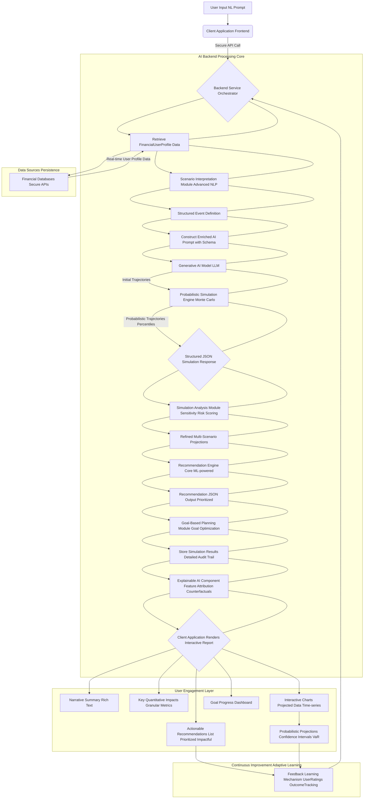

**Overall System Architecture Diagram:**
```mermaid
graph LR
    subgraph User Interface Layer
        UI_A[User Input NL Prompt]
        UI_B[Client Application Frontend Web/Mobile]
        UI_C[Interactive Report Display Visualizations]
        UI_D[Feedback Interface Ratings Comments]
        UI_A --> UI_B
        UI_B --> UI_C
        UI_C --> UI_D
    end

    subgraph Backend Services Layer
        BS_A{API Gateway LoadBalancer Authentication}
        BS_B[User Data Service Profile Mgmt Data Aggregation]
        BS_C[Scenario Interpretation Module SIM NLP Models]
        BS_D[Simulation Orchestrator Workflow Engine]
        BS_E[Simulation Analysis Module SAM Risk Metrics]
        BS_F[Recommendation Engine RE ML Models Rules]
        BS_G[Feedback Learning Processor FLP Data Pipeline]
        BS_H[XAI Explainable AI Service Interpretation Layer]
        BS_I[Goal-Based Planning Service GBPM Optimization]

        UI_B -- REST/gRPC --> BS_A
        BS_A -- Request --> BS_D
        BS_D -- Get Profile --> BS_B
        BS_D -- Interpret Scenario --> BS_C
        BS_B -- Financial Data --> Data_A
        BS_C -- Ontology/Models --> Data_C
        BS_D -- Enriched Prompt --> AI_A
        BS_D -- Simulation Request --> AI_B
        AI_A -- Raw Sim Results --> BS_E
        AI_B -- Probabilistic Data --> BS_E
        BS_E -- Analyzed Data --> BS_F
        BS_F -- Recommendations --> BS_I
        BS_I -- Goal Updates --> Data_B
        BS_I -- Recommendations --> BS_H
        BS_H -- Explanations --> UI_C
        UI_D -- Feedback Data --> BS_G
        BS_G -- Training Data --> Data_D
    end

    subgraph AI Core Layer
        AI_A[Generative AI Model LLM Fine-tuned]
        AI_B[Probabilistic Simulation Engine PSE Monte Carlo]
    end

    subgraph Data Persistence Layer
        Data_A[Financial Profile Database Encrypted]
        Data_B[Simulation Results Store Event Sourcing]
        Data_C[Event Definition KnowledgeBase Financial Ontology]
        Data_D[Model Training Data Feedback Loop]
        Data_E[Macroeconomic Data External APIs]
        BS_B --> Data_A
        BS_F --> Data_B
        BS_C --> Data_C
        BS_G --> Data_D
        BS_D --> Data_E
    end
```

**Scenario Interpretation Module SIM Workflow Diagram:**
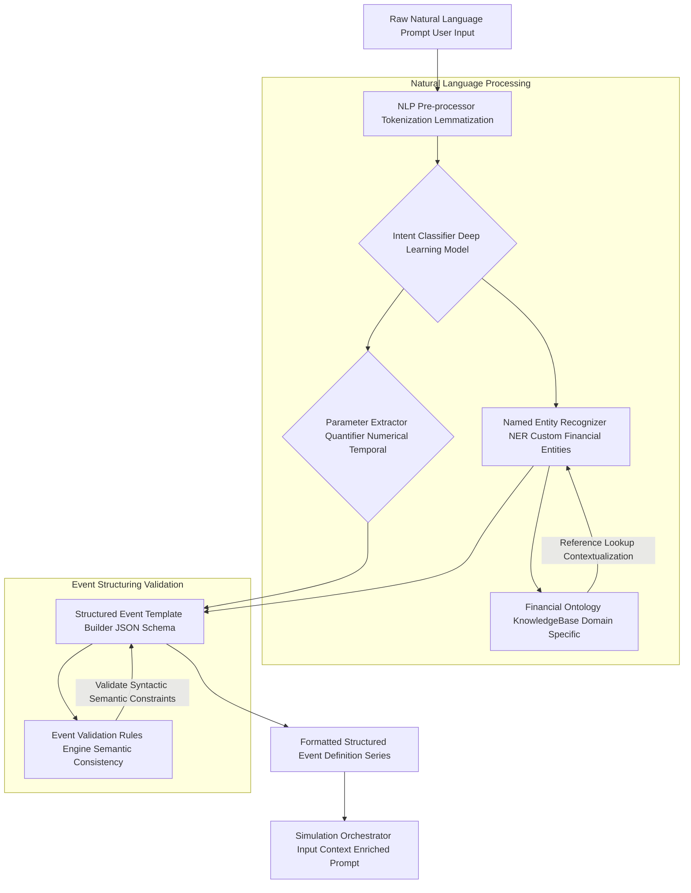

**Probabilistic Simulation Engine PSE Workflow Diagram:**
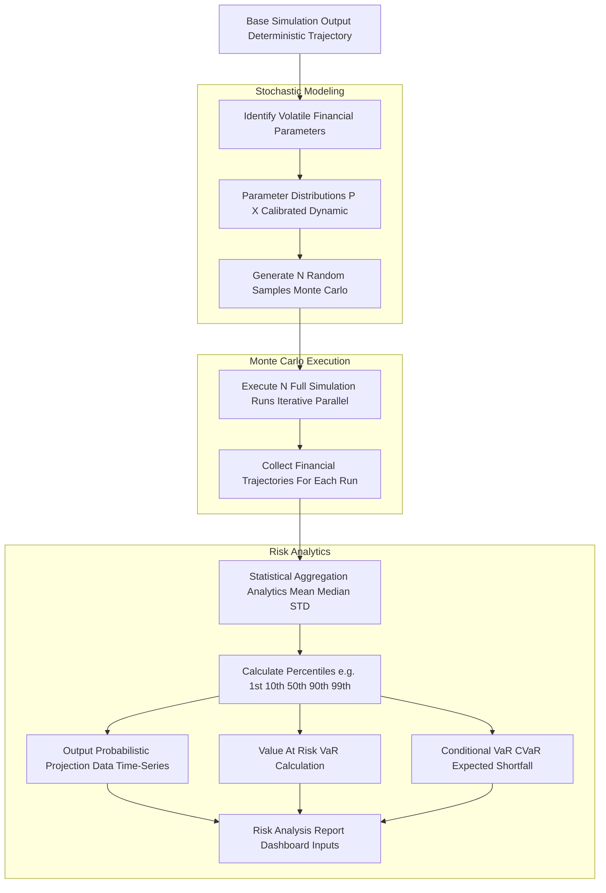

**Feedback and Learning Mechanism FLM Workflow Diagram:**
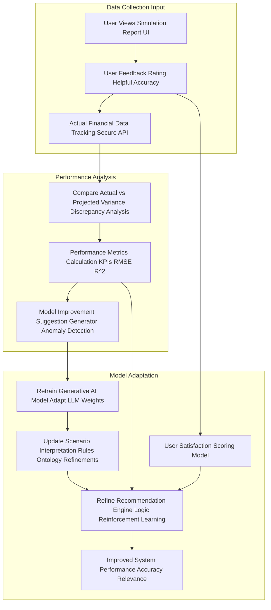

**Recommendation Engine RE Workflow Diagram:**
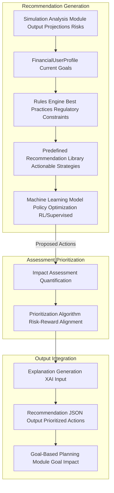

**Explainable AI XAI Workflow Diagram:**
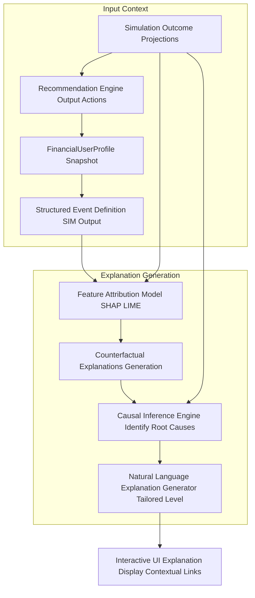

**FinancialUserProfile Data Flow Diagram:**
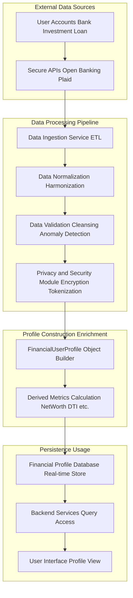

**Multi-Scenario Comparison Workflow Diagram:**
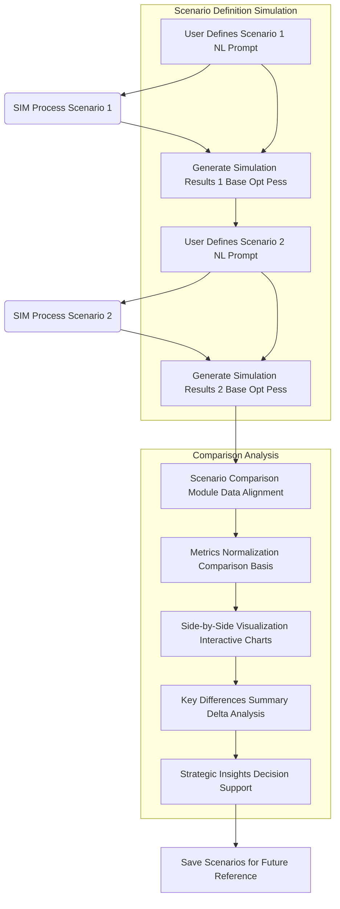

**Goal-Based Planning Module GBPM Workflow Diagram:**
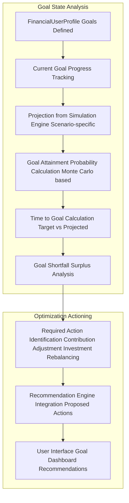

**Security and Compliance Module SCM Diagram:**
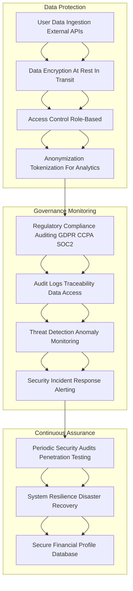