**Title:** System and Method for AI-Driven Heuristic Generation and Configuration of Quantum-Resilient Cryptographic Primitives and Protocols

**Abstract:**
A novel computational system and a corresponding method are presented for the automated, intelligent synthesis and dynamic configuration of post-quantum cryptographic (PQC) schemes. The system ingests granular specifications of data modalities, operational environments, and security desiderata. Utilizing a sophisticated Artificial Intelligence (AI) heuristic engine, architected upon a comprehensive knowledge base of post-quantum cryptographic principles, computational complexity theory, and known quantum algorithmic threats (e.g., Shor's, Grover's algorithms), the system dynamically analyzes the input. The AI engine subsequently formulizes a bespoke cryptographic scheme configuration, encompassing the selection of appropriate PQC algorithm families (e.g., lattice-based, code-based, hash-based, multivariate), precise parameter instantiation, and the generation of a representative public key exemplar. Crucially, the system also furnishes explicit, robust instructions for the secure handling and lifecycle management of the corresponding private cryptographic material, thereby democratizing access to highly complex, quantum-resilient security paradigms through an intuitive, high-level interface. This invention fundamentally transforms the deployment of advanced cryptography from an expert-dependent, manual process to an intelligent, automated, and adaptive service, ensuring robust security against current and anticipated quantum computational threats.

**Background:**
The pervasive reliance on public-key cryptosystems, such as RSA and Elliptic Curve Cryptography (ECC), forms the bedrock of modern digital security infrastructure, enabling secure communications, authenticated transactions, and data integrity across global networks. These schemes derive their security from the presumed computational intractability of classical mathematical problems, specifically integer factorization and the discrete logarithm problem. However, the theoretical and increasingly practical advancements in quantum computing present an existential threat to these foundational cryptographic primitives. Specifically, Shor's algorithm, if implemented on a sufficiently powerful quantum computer, possesses the capability to efficiently break integer factorization (underpinning RSA) and discrete logarithm problems (underpinning ECC), rendering these schemes utterly insecure. Similarly, Grover's algorithm, while less catastrophic, can significantly reduce the effective key lengths of symmetric encryption schemes, necessitating longer keys for equivalent security and posing an existential threat to hash functions when used in collision resistance contexts.

The imperative response to this impending cryptographic paradigm shift is the intensive research, development, and standardization of Post-Quantum Cryptography (PQC). PQC schemes are mathematical constructs designed to resist attacks from both classical and quantum computers, predicated on problems believed to be hard even for quantum adversaries. Leading families of PQC include:
*   **Lattice-based Cryptography:** Relies on the presumed hardness of fundamental problems in computational lattices, such as the Shortest Vector Problem (SVP), Closest Vector Problem (CVP), and their variants like the Learning With Errors (LWE) and Ring Learning With Errors (RLWE) problems. These schemes offer promising efficiency characteristics and versatile applications (e.g., key encapsulation mechanisms, digital signatures, fully homomorphic encryption).
*   **Code-based Cryptography:** Often based on the presumed hardness of decoding general linear codes, exemplified by the McEliece and Niederreiter cryptosystems. While offering strong theoretical security guarantees and a long history of study, they traditionally involve larger key sizes.
*   **Hash-based Cryptography:** Leverages cryptographic hash functions, whose quantum security is well-understood and not fundamentally threatened by quantum algorithms in the same manner as number-theoretic problems. Primarily utilized for digital signatures (e.g., XMSS, LMS, SPHINCS+), offering robust, forward-secure solutions.
*   **Multivariate Polynomial Cryptography:** Based on the presumed hardness of solving systems of multivariate polynomial equations over finite fields (e.g., UOV, Rainbow). These schemes can offer small signature sizes but often involve complex security analyses and larger key sizes, with some schemes proving vulnerable to sophisticated attacks.
*   **Isogeny-based Cryptography:** Utilizes properties of elliptic curve isogenies. While some early candidates like Supersingular Isogeny Diffie-Hellman (SIDH) have shown vulnerabilities, research continues into related primitives, aiming for compact key sizes.

The judicious selection, precise parameterization, and secure deployment of PQC schemes constitute an exceptionally specialized and multidisciplinary discipline. It necessitates profound expertise in pure mathematics (number theory, abstract algebra, linear algebra), theoretical computer science (computational complexity, algorithm design, cryptanalysis), quantum information theory, and practical implementation considerations (software engineering, hardware security, side-channel analysis). Factors such as key size, ciphertext or signature expansion, computational latency for cryptographic operations (key generation, encryption/decryption, signature generation/verification), memory footprint, bandwidth consumption, and resistance to known side-channel attacks must be meticulously evaluated against specific application requirements, data sensitivities, and evolving regulatory compliance mandates (e.g., NIST PQC standardization, FIPS 140-3). This profound complexity renders the effective and secure adoption of PQC largely inaccessible to the vast majority of software developers, system architects, and even many general cybersecurity professionals.

The extant methodologies for PQC integration are predominantly manual, labor-intensive, inherently prone to human error, and suffer from a critical lack of adaptability to rapidly evolving threat landscapes and computational paradigms. This creates a significant chasm between cutting-edge cryptographic innovation and widespread secure deployment. There exists an urgent, unmet technological imperative for an intelligent, automated system capable of abstracting this profound cryptographic complexity. Such a system would provide bespoke, quantum-resistant security solutions tailored precisely to an entity's distinct needs, without demanding on-staff PQC expertise, thereby democratizing access to advanced cryptographic protection and ensuring future-proof digital security.

**Brief Summary:**
The present invention delineates a groundbreaking computational service that systematically automates the otherwise arduous and expert-intensive process of configuring quantum-resilient cryptographic solutions. In operation, a user or an automated system provides a high-fidelity description of the data subject to protection, its contextual usage, environmental constraints, and desired security posture. This nuanced specification is then transmitted to a highly sophisticated Artificial Intelligence (AI) heuristic engine. This engine, crucially, has been extensively pre-trained and dynamically prompted with an expansive, curated knowledge base encompassing the entirety of contemporary post-quantum cryptographic research, established security models (e.g., IND-CCA2, EUF-CMA), computational complexity theory, practical deployment considerations, and known cryptanalytic advances.

The core innovation resides in the AI's capacity to function as a "meta-cryptographer." Upon receipt of the input, the AI algorithmically evaluates the specified requirements against its vast, interconnected cryptographic knowledge graph. It then executes a multi-stage reasoning and optimization process to recommend the most optimal PQC algorithm family (e.g., lattice-based schemes for scenarios prioritizing computational efficiency and compact key sizes, hash-based signatures for long-term authentication with strong quantum resistance, code-based schemes for maximum theoretical security). Beyond mere recommendation, the AI dynamically synthesizes a comprehensive set of mock parameters pertinent to the chosen scheme, including a mathematically structured, illustrative public key. Concurrently, it generates precise, actionable, and secure directives for the rigorous handling, storage, and lifecycle management of the corresponding private cryptographic material, adhering to best practices in cryptosystem administration, operational security, and relevant regulatory frameworks. This holistic output effectively crystallizes a bespoke, quantum-resistant encryption and authentication plan, presented in an easily consumable format, thereby radically simplifying the integration of advanced cryptographic security measures and granting unprecedented access to state-of-the-art quantum-resilient protection without requiring deep, specialized cryptographic background from the end-user. The invention fundamentally redefines the paradigm for secure system design in the quantum era by offering an intelligent, adaptive, and automated cryptographic consulting capability.

**Detailed:**
The present invention comprises an advanced, multi-component computational system and an algorithmic method for the AI-driven generation and configuration of post-quantum cryptographic schemes. This system operates as a sophisticated "Cryptographic Oracle," abstracting the profound complexities inherent in selecting, parameterizing, and deploying quantum-resistant security solutions.

### 1. System Architecture Overview

The system architecture is modular, distributed, and designed for inherent scalability, resilience, and adaptability to evolving cryptographic landscapes and computational demands. It primarily consists of the following interconnected components:

*   **User/System Interface USI Module:** The primary interaction gateway for acquiring comprehensive input specifications from human users or automated systems and for displaying the synthesized cryptographic configurations. This module supports both graphical user interfaces GUI and programmatic Application Programming Interfaces APIs. It performs initial syntactic validation and schema enforcement for incoming requests.
*   **Backend Orchestration Service BOS Module:** The central coordination and control unit. This module is responsible for robust input validation, sophisticated prompt construction, intelligent interaction with the AI Cryptographic Inference Module, and the eventual serialization of the output configuration. It manages the workflow and state of each cryptographic generation request, ensuring transactional integrity and request idempotency. The BOS also handles access control and rate limiting for API interactions.
*   **AI Cryptographic Inference Module AIM:** The core intelligence engine of the invention. This module is responsible for the intricate analysis of cryptographic scheme properties, the discerning selection of appropriate PQC families, the precise parameter instantiation, and the formulation of detailed security instructions. This module leverages advanced generative AI architectures, such as large language models LLMs or similar neural network constructs, specifically fine-tuned for cryptographic reasoning and optimization tasks. It is designed for high-throughput, low-latency inference.
*   **Dynamic Cryptographic Knowledge Base DCKB:** A continually updated, highly structured, and extensive repository of PQC standards, cutting-edge research papers, cryptanalytic findings (both classical and quantum), performance benchmarks, security proofs, and cryptographic best practices. This serves as the foundational corpus for the AIM, providing the factual basis for its reasoning. The DCKB is designed for efficient knowledge graph traversal and semantic querying.
*   **Output Serialization and Validation OSV Module:** Responsible for the stringent validation, structuring, and coherent presentation of the AI-generated cryptographic configuration. It ensures that the output adheres to predefined schemas and is unambiguous, facilitating both human comprehension and programmatic consumption. The OSV module also applies format transformations (e.g., JSON to YAML) as requested by the output consumer.

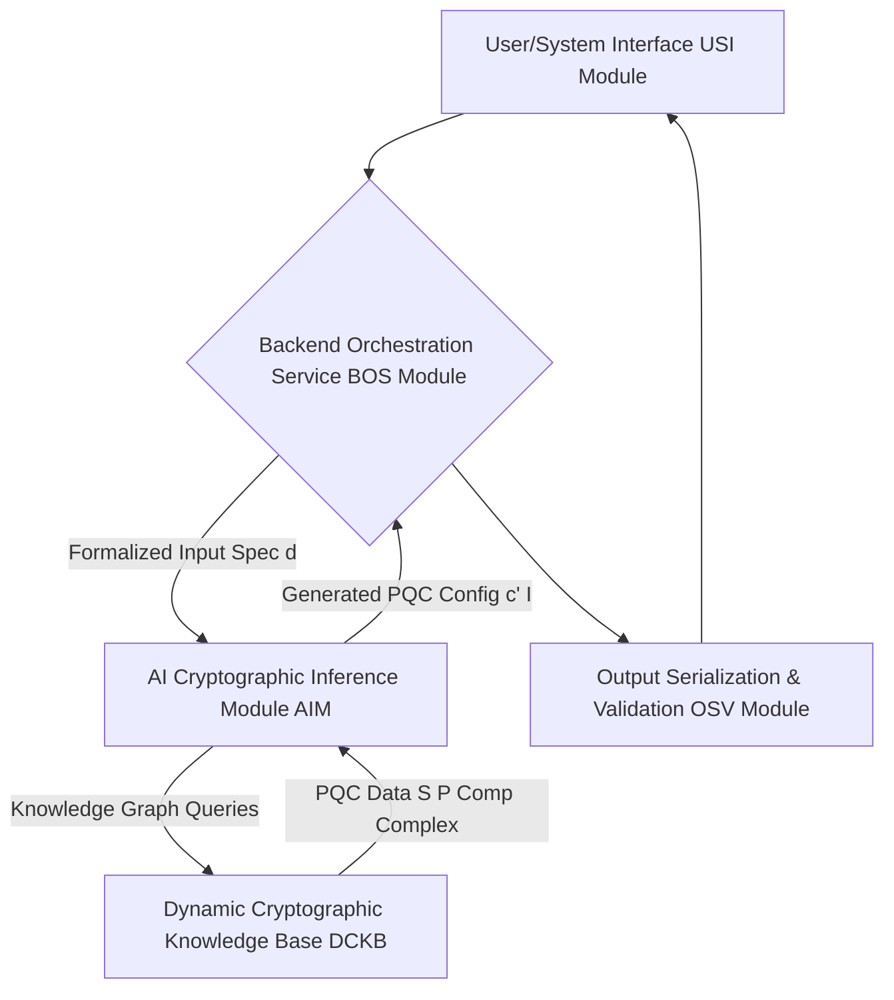
*Figure 1: High-Level System Architecture of the AI-Driven PQC Generation System.*

The internal workings of the AIM are depicted below, illustrating its multi-stage processing of cryptographic requests.
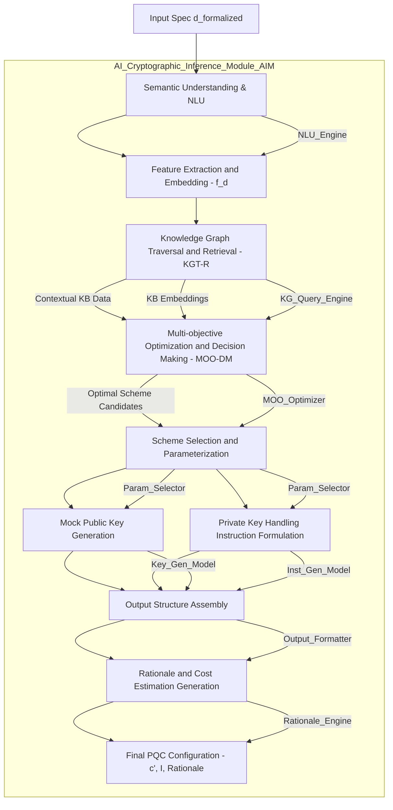
*Figure 6: Internal Processing Stages of the AI Cryptographic Inference Module (AIM).*

### 2. Operational Flow and Algorithmic Method

The operational flow of the invention follows a precise, multi-stage algorithmic process, designed to maximize efficiency, accuracy, and security. Each stage is critical for transforming abstract user requirements into concrete, quantum-resilient cryptographic solutions.

#### 2.1. Input Specification Reception and Pre-processing

*   **Input Acquisition:** The USI Module receives a comprehensive input specification from a user or an automated system. This specification is designed to be highly granular and contextually rich, providing the AIM with all necessary information to make an informed cryptographic decision. It can be provided via a secure graphical user interface, a command-line interface, or an authenticated API endpoint.
    *   **Data Modality Description:** A meticulously detailed representation of the data to be protected. This encompasses, but is not limited to:
        *   **Schema Definition:** Formal description of the data structure (e.g., JSON schema, XML schema definition, Protobuf IDL, SQL Data Definition Language DDL). This ensures the AI understands the intrinsic structure and potential data types.
        *   **Data Type Specifics:** Categorization of the information content (e.g., financial transaction records, personal health information PHI, classified government intelligence, industrial control system ICS telemetry, IoT sensor readings, long-term archival data). Each type may have specific sensitivity and processing requirements.
        *   **Data Volume and Velocity Characteristics:** Quantitative metrics such as static file size, high-throughput stream rates (e.g., messages per second), total data volume, and storage requirements. These metrics directly impact performance considerations.
        *   **Data Sensitivity Classification:** Categorical or numerical assignment of sensitivity (e.g., Public, Confidential, Secret, Top-Secret, PHI, PII, PCI-DSS data). This is a primary driver for the required security level.
    *   **Operational Environment Parameters:** A precise characterization of the computational, network, and storage context in which the cryptographic scheme will operate.
        *   **Computational Resources Available:** Specifics on processing power (e.g., CPU cores, clock speed, availability of hardware accelerators), memory (RAM, cache sizes), and power constraints (e.g., battery-powered IoT devices, high-performance data centers). These directly influence performance and feasibility.
        *   **Network Characteristics:** Bandwidth limitations, latency expectations, and reliability concerns of the communication channels. High latency might favor smaller ciphertext sizes, for example.
        *   **Storage Media Characteristics:** Type of storage (e.g., persistent disk, volatile memory, hardware security module HSM, trusted platform module TPM, secure enclave), capacity, and access latency. This is crucial for private key handling recommendations.
        *   **Threat Model Considerations:** A description of anticipated adversaries (e.g., passive eavesdropper, active attacker, state-sponsored actor with quantum capabilities, insider threat, side-channel attacker) and their capabilities (e.g., computational power, access level). This fundamentally informs the target security strength.
        *   **Expected Lifecycle of Data and Cryptographic Keys:** The anticipated duration for which the data needs protection and the keys must remain valid and secure. Long lifecycles necessitate higher security levels and robust key rotation/archival strategies.
    *   **Security Desiderata:** Explicit, quantifiable security requirements and preferences.
        *   **Desired Security Level:** A target strength measured in classical equivalent bits of security (e.g., "NIST Level 1," "NIST Level 5," equivalent to AES-128, AES-256 respectively).
        *   **Specific Cryptographic Primitives Required:** Identification of necessary cryptographic functions (e.g., Key Encapsulation Mechanism KEM for secure key exchange, Digital Signature Scheme DSS for authentication and integrity, Authenticated Encryption AE for confidentiality and integrity).
        *   **Performance Priorities:** Explicit prioritization of performance metrics (e.g., minimize encryption time, minimize ciphertext size, minimize key generation time, minimize signature size, maximize throughput, minimize memory footprint). These priorities become weighting factors in the utility function.
        *   **Compliance Requirements:** Specific regulatory, industry, or organizational mandates (e.g., FIPS 140-3, GDPR, HIPAA, NIS2, ISO 27001). These are hard constraints or strong preferences.
*   **Pre-processing and Validation:** The BOS Module performs rigorous initial validation of the received input specification. This includes syntactical correctness, semantic completeness, and internal consistency checks. It may involve data normalization, feature engineering, and the extraction of salient parameters to optimize prompt construction.

#### 2.2. Prompt Engineering and Contextualization

The BOS Module dynamically constructs a highly refined and contextually rich prompt for the AIM. This prompt is not static; it is meticulously assembled, embedding the user's detailed specifications into a structured query designed to elicit optimal, nuanced cryptographic recommendations from the generative AI model. This process optimizes the AI's reasoning capabilities by clearly defining its role and the scope of its analysis.

Example Prompt Construction Template (conceptual framework):

"You are an expert cryptographer, specializing in the field of post-quantum cryptography PQC. Your expertise encompasses deep theoretical and practical knowledge of lattice-based (e.g., Kyber, Dilithium, Falcon), code-based (e.g., McEliece, Niederreiter), hash-based (e.g., SPHINCS+, XMSS), and multivariate polynomial (e.g., Rainbow) schemes. You possess a thorough understanding of their respective security models, computational overheads, key sizes, ciphertext/signature expansions, known attack vectors (both classical and quantum), and formal security reductions (e.g., IND-CCA2, EUF-CMA). Furthermore, you are acutely aware of global regulatory compliance standards (e.g., NIST PQC Standardization project outcomes, FIPS 140-3, GDPR, HIPAA) and industry best practices for secure key management and operational security.

Based on the following comprehensive and highly granular specifications, your task is to recommend the single most suitable post-quantum cryptographic scheme(s) and their precise parameterization. For each recommended scheme, you must generate a mathematically structured, representative *mock* public key for demonstration purposes. Additionally, you must formulize explicit, detailed, and actionable instructions for the secure handling, storage, usage, backup, and destruction of the corresponding private key material, meticulously tailored to the specified operational environment and threat model. Your recommendations must prioritize solutions that achieve the optimal balance of quantum-resilient security strength, performance efficiency, and regulatory compliance, considering all constraints provided.

---
[START HIGH-FIDELITY SPECIFICATION]
Data Modality Description:
  - Data Type: [Extracted, e.g., 'Financial Transaction Record', 'IoT Sensor Stream', 'Encrypted Archival Data']
  - Formal Schema Reference: [Formatted JSON Schema / XML Schema / DDL, or a summary thereof]
  - Sensitivity Classification: [e.g., 'Highly Confidential Protected Health Information PHI', 'Secret', 'Public']
  - Volume and Velocity: [e.g., 'Low Volume Static Set', 'High Volume Real-time Stream of 100k messages/sec']

Operational Environment Parameters:
  - Computational Resources: [e.g., 'Resource-constrained IoT device with ARM Cortex-M0 and 64KB RAM', 'High-performance cloud server with Intel Xeon E5 and hardware crypto accelerators', 'Embedded system with limited power budget']
  - Network Constraints: [e.g., 'High Latency 200ms RTT, Low Bandwidth 100 kbps', 'Gigabit Ethernet Low Latency']
  - Storage Characteristics: [e.g., 'Ephemeral RAM', 'Persistent Disk with full disk encryption', 'Dedicated FIPS 140-3 Level 3 Hardware Security Module HSM', 'Trusted Platform Module TPM']
  - Adversary Model: [e.g., 'Passive eavesdropper on public networks', 'Active attacker with significant computational resources including quantum computer access', 'Insider threat with privileged access', 'Side-channel adversary']
  - Data Lifespan and Key Validity Period: [e.g., 'Short-term days for session keys', 'Medium-term 5 years for data archival', 'Long-term 50+ years for digital records']

Security Desiderata:
  - Target Quantum Security Level: [e.g., 'NIST PQC Level 5 equivalent to 256 bits classical', 'Minimum 192 bits classical equivalent security']
  - Required Cryptographic Primitives: [e.g., 'Key Encapsulation Mechanism KEM for key establishment', 'Digital Signature Scheme DSS for authentication and integrity', 'Hybrid Public Key Encryption HPKE components']
  - Performance Optimization Priority: [e.g., 'Strictly Minimize Encryption Latency', 'Optimize for Smallest Ciphertext Size', 'Balance Key Generation Time and Key Size', 'Prioritize Verification Speed over Signing Speed']
  - Regulatory and Compliance Adherence: [e.g., 'HIPAA Security Rule', 'GDPR Article 32', 'FIPS 140-3 Level 2 Certification', 'ISO 27001']

[END HIGH-FIDELITY SPECIFICATION]
---

Your response MUST be presented as a well-formed JSON object, adhering strictly to the following schema:
  - `recommendedScheme`: (Object) Contains specific recommendations for cryptographic primitives.
    - `KEM`: (String, optional) Official name of the chosen PQC KEM scheme (e.g., 'Kyber512', 'Kyber768', 'Kyber1024').
    - `DSS`: (String, optional) Official name of the chosen PQC DSS scheme (e.g., 'Dilithium3', 'Dilithium5', 'SPHINCS+s-shake-256f').
    - `AEAD`: (String, optional) Official name of chosen Authenticated Encryption with Associated Data scheme (if hybrid approach).
  - `schemeFamily`: (Object) Specifies the underlying mathematical families for each recommended primitive.
    - `KEM`: (String, optional) e.g., 'Lattice-based Module-LWE/MLWE'.
    - `DSS`: (String, optional) e.g., 'Lattice-based Module-LWE/MLWE', 'Hash-based'.
  - `parameters`: (Object) A detailed, scheme-specific set of parameters for each recommended primitive.
    - `KEM`: (Object, optional) Includes `securityLevelEquivalentBits`, `public_key_bytes`, `private_key_bytes`, `ciphertext_bytes`, `shared_secret_bytes`, `nist_level`, polynomial degree, modulus `q`, etc.
    - `DSS`: (Object, optional) Includes `securityLevelEquivalentBits`, `public_key_bytes`, `private_key_bytes`, `signature_bytes`, `nist_level`, etc.
  - `mockPublicKey`: (Object) Base64-encoded, truncated, or representative public key strings. THESE ARE FOR ILLUSTRATIVE PURPOSES ONLY AND ARE NOT CRYPTOGRAPHICALLY SECURE FOR PRODUCTION.
    - `KEM`: (String, optional) e.g., 'qpub_kyber1024_01AB2C3D4E5F6A7B8C9D0E1F2A3B4C5D6E7F8A9B...'.
    - `DSS`: (String, optional) e.g., 'qpub_dilithium5_5F6A7B8C9D0E1F2A3B4C5D6E7F8A9B0C1D2E3F4A...'.
  - `privateKeyHandlingInstructions`: (String) Comprehensive, highly actionable, multi-step directives for the secure generation, storage, usage, backup, rotation, and destruction of the private key(s), explicitly tailored to the operational environment, threat model, and compliance requirements.
  - `rationale`: (String) A detailed, evidence-based explanation justifying every selection, parameterization, and instruction, referencing specific cryptographic principles, security proofs, NIST recommendations, and the trade-offs made during the multi-objective optimization process.
  - `estimatedComputationalCost`: (Object) Quantified estimations of computational overheads (e.g., CPU cycles, memory footprint, bandwidth impact) for key operations (key generation, encapsulation/encryption, decapsulation/decryption, signing, verification) on the specified target hardware.
  - `complianceAdherence`: (Array of Strings) A definitive list of all specified compliance standards that the recommended scheme and its associated practices demonstrably adhere to."

The prompt engineering process is critical for guiding the AI model towards a highly relevant and actionable output.
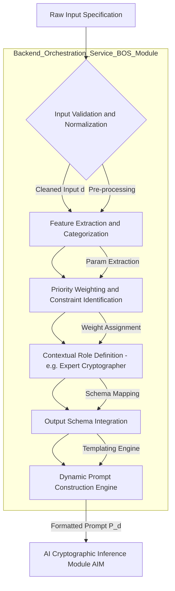
*Figure 7: Detailed Prompt Engineering and Contextualization Flow.*

#### 2.3. AI Cryptographic Inference

The AIM, upon receiving the meticulously crafted prompt, processes the request through a sophisticated, multi-layered inferential and generative process. This process leverages deep learning and knowledge reasoning capabilities.

1.  **Semantic Understanding and Feature Extraction:** The AI first semantically parses the input specification, leveraging advanced Natural Language Understanding NLU techniques. It identifies and extracts all critical entities, relationships, constraints, and explicit priorities within the specified data modality, operational environment, and security desiderata. This transforms the unstructured or semi-structured input into a structured internal representation, `f_d`, suitable for algorithmic processing.
2.  **Knowledge Graph Traversal & Retrieval KGT-R:** The AIM dynamically queries and traverses the DCKB, which functions as a massive, constantly evolving knowledge graph. It retrieves all relevant PQC schemes, their known properties (e.g., security proofs, performance benchmarks, key/ciphertext/signature sizes, known cryptanalytic resistance, side-channel attack vulnerabilities, NIST PQC status), and applicable regulatory guidelines (e.g., FIPS 140-3 requirements for key management). This phase involves sophisticated information retrieval, knowledge fusion, and relevance ranking algorithms, often leveraging graph embedding techniques for efficient similarity search.
3.  **Multi-objective Optimization and Decision Making MOO-DM:** This is the core intelligence engine where the AIM performs a heuristic search within the vast, combinatorial space of possible PQC configurations. The objective is to optimize a multi-faceted utility function (as defined in the Mathematical Justification), aiming to satisfy potentially conflicting objectives:
    *   **Maximize Quantum-Resilient Security Strength:** Prioritizing schemes with robust security proofs against both classical and quantum attacks, and higher NIST equivalent security levels, considering the specified threat model.
    *   **Minimize Computational and Resource Overhead:** Optimizing for faster operations, smaller key/ciphertext/signature sizes, reduced memory footprint, and lower power consumption, aligned with `operationalEnvironment.computationalResources` and `securityDesiderata.performancePriority`.
    *   **Maximize Regulatory and Compliance Adherence:** Selecting schemes and practices that explicitly meet `securityDesiderata.compliance` requirements.
    *   **Minimize Deployment and Management Complexity:** Favoring schemes that are well-understood, have mature implementations, and allow for streamlined key management, as informed by `operationalEnvironment.storage` and `securityDesiderata.threatModel`.
    This optimization is dynamically guided by the weighting factors derived from the user's explicit performance priorities (e.g., "minimize encryption latency" or "optimize for smallest ciphertext size"). Advanced techniques such as multi-objective evolutionary algorithms or deep reinforcement learning can be employed in this stage.
4.  **Scheme Selection and Parameterization:** Based on the outcome of the MOO-DM process, the AI selects the most appropriate PQC family and specific scheme(s) (e.g., Kyber for KEM, Dilithium for DSS, or a combination). It then instantiates the precise parameters for the chosen scheme(s) (e.g., `Kyber768` for "NIST Level 3" or `Dilithium5` for "NIST Level 5`). This requires a deep understanding of standard parameter sets (e.g., those specified by NIST PQC finalists) and the ability to derive or adapt context-specific parameters if absolutely necessary and cryptographically sound.
5.  **Mock Public Key Generation:** The AI generates a *representative* public key string. It is crucial to understand that this is **not** a cryptographically secure key pair generated for actual use. Instead, it is a syntactically correct exemplar, demonstrating the format, structure, and approximate size of a real public key for the selected scheme. This serves as a tangible illustration of the proposed cryptographic configuration and allows for immediate visualization of output characteristics. For a lattice-based KEM like Kyber, this would be a base64-encoded sequence of bytes representing the public matrix `A` and vector `s`. For a hash-based signature, it might represent a Merkle tree root or a specific hash output.
6.  **Private Key Handling Instruction Formulation:** Leveraging its comprehensive knowledge of operational security, cryptographic engineering, and regulatory guidelines from the DCKB, the AI generates highly detailed, context-aware, and actionable instructions for the private key(s). This constitutes a critical output component and may include:
    *   Recommendations for key generation: entropy sources (e.g., CSPRNGs, hardware TRNGs), random seed management, key derivation functions (KDFs).
    *   Storage methods: e.g., FIPS 140-3 certified Hardware Security Modules HSMs, Trusted Platform Modules TPMs, secure enclaves (e.g., Intel SGX, ARM TrustZone), encrypted file systems, multi-party computation MPC key shares, cold storage.
    *   Access control policies: e.g., multi-factor authentication MFA, role-based access control RBAC, least privilege principles, quorum authorizations.
    *   Backup and recovery strategies: e.g., offline, geographically dispersed, encrypted archives, M-of-N secret sharing schemes, secure vaulting.
    *   Key rotation policies: specifying frequency, procedures for smooth transition, and managing revocation.
    *   Secure destruction protocols: e.g., cryptographic erase, physical destruction (shredding, incineration) of media, zeroization, overwriting.
    *   Procedures for anomaly detection, audit logging, and incident response related to potential key compromise, including key compromise indicators (KCIs).
    *   Guidance on preventing side-channel leakage during private key operations (e.g., constant-time implementations, blinding).
7.  **Rationale Generation:** The AI articulates a comprehensive, evidence-based rationale, providing transparency and trust. This explanation meticulously justifies every selection, parameterization, and instruction, referencing specific PQC principles, security analyses, performance trade-offs, NIST recommendations, and how the choices directly address the input specifications. It identifies the critical trade-offs made and why the chosen solution is optimal for the given context.

#### 2.4. Output Serialization and Presentation

The structured output from the AIM, typically a comprehensive JSON object, is received by the BOS Module and then meticulously processed by the OSV Module.

*   **Validation:** The OSV Module performs a final, stringent validation of the AI's response for structural correctness, completeness, semantic consistency, and adherence to predefined output schemas. This includes checking parameter ranges, data type consistency, and logical coherence. Any inconsistencies or missing elements trigger an internal feedback loop or generate warning messages for the user.
*   **Serialization:** The validated configuration is serialized into a standard, machine-readable format (e.g., JSON, YAML, Protocol Buffers) to facilitate seamless programmatic consumption by other applications, automation tools, or infrastructure-as-code pipelines. Support for multiple output formats enhances interoperability.
*   **User Interface Display:** The USI Module then presents the AI-generated PQC configuration to the user in a clear, unambiguous, and easily digestible human-readable format. This presentation includes the recommended scheme(s), their precise parameters, the mock public key(s), the detailed private key handling instructions, the comprehensive rationale, estimated costs, and compliance adherence. Critical warnings regarding the non-production nature of the mock keys are prominently displayed to prevent misuse.

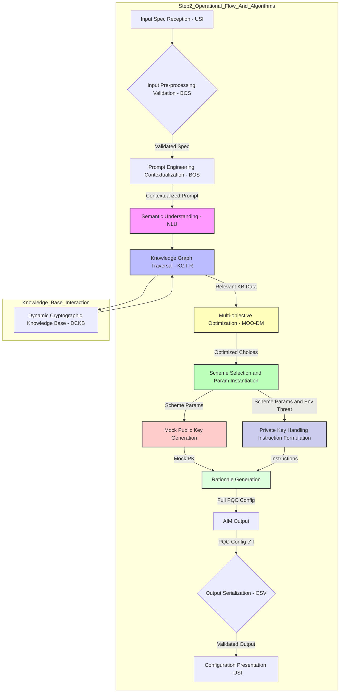
*Figure 2: Detailed Operational Flow of the AI-Driven PQC Generation System.*

The final stage of output handling is meticulous, ensuring reliability and consumer usability.
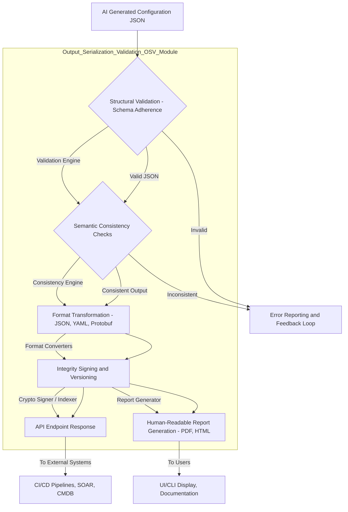
*Figure 8: Output Serialization and Validation Process.*

### 3. Dynamic Cryptographic Knowledge Base DCKB

The DCKB is an indispensable, foundational component, central to the AIM's efficacy and its ability to provide state-of-the-art recommendations. It is a living, evolving repository, continuously updated through a multi-pronged approach to ensure accuracy, comprehensiveness, and currency.

*   **Automated Data Ingestion:** Automated crawlers and parsers regularly scan and ingest information from authoritative sources, including academic pre-print servers (e.g., arXiv, IACR ePrint), cryptographic standardization body publications (e.g., NIST PQC Standardization project updates, ISO/IEC standards), reputable research journals, cryptographic conferences proceedings, and trusted cybersecurity news feeds. Natural Language Processing (NLP) techniques are employed to extract entities, relationships, and attributes from unstructured text.
*   **Expert Curation and Annotation:** Human cryptographers, security engineers, and compliance experts regularly review, curate, validate, and annotate the ingested data. This critical step adds contextual metadata, prioritizes information, resolves ambiguities, reconciles conflicting research findings, and extracts key insights that are difficult for automated systems to discern. This human-in-the-loop process significantly enhances the quality and trustworthiness of the knowledge base.
*   **Performance Benchmarking Data:** Integration of real-world and simulated performance metrics for various PQC scheme implementations across a diverse range of hardware platforms (e.g., high-end servers, embedded systems, IoT devices, FPGAs). This data is gathered from public benchmarks (e.g., PQClean, OpenQuantumSafe) and potentially proprietary simulations. This data is essential for the `P(c, d)` component of the utility function.
*   **Attack Vector Database:** A continuously updated, structured database of known and theoretical cryptanalytic attacks (both classical and quantum), including specific techniques (e.g., lattice sieving, information set decoding, Shor's algorithm variants, side-channel attacks) and their implications for the security of various PQC schemes. This data directly informs the `S(c, d)` component, specifically the `AttackResistance` sub-metric.
*   **Regulatory Framework Mapping:** A structured mapping of PQC schemes and cryptographic practices to specific requirements within various regulatory and compliance frameworks (e.g., FIPS 140-3, GDPR, HIPAA, PCI-DSS, NIS2, CCPA, ISO 27001), critical for the `Comp(c, d)` component. This includes formal interpretations and guidance documents.
*   **Versioned Knowledge Graph:** The DCKB maintains a versioned history of its knowledge graph, allowing the AIM to reason about cryptographic evolution, track changes in scheme statuses (e.g., from candidate to standard, or deprecated), and perform historical analyses.

The dynamic nature of the DCKB is crucial for the long-term viability and accuracy of the PQC generation system.
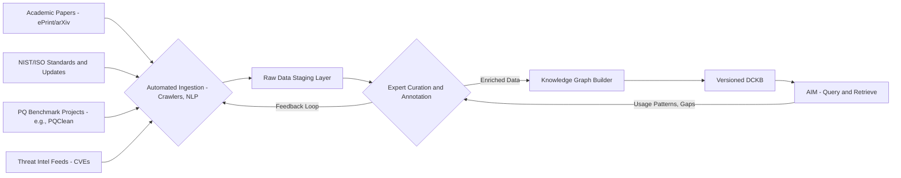
*Figure 9: DCKB Data Ingestion and Update Pipeline.*

### 4. Illustrative Example of PQC Scheme Generation

Consider a hypothetical scenario where a financial institution needs to secure sensitive financial transaction data. This data is highly confidential, requires long-term protection, must comply with FIPS 140-3 and PCI-DSS, and will reside in a cloud-based database accessed by internal servers with standard computational resources. The primary cryptographic requirements are a Key Encapsulation Mechanism KEM for establishing shared secrets for bulk symmetric encryption and a Digital Signature Scheme DSS for transaction authentication and integrity.

**Input Specification (Simplified JSON for clarity):**
```json
{
  "dataModality": {
    "type": "Financial Transaction Record",
    "schemaRef": "ISO_20022_transaction_schema.json",
    "sensitivity": "Highly Confidential (PCI-DSS regulated)",
    "volumeVelocity": "High volume (millions/day), real-time processing"
  },
  "operationalEnvironment": {
    "computationalResources": "Standard cloud server (x86_64, 32GB RAM, no dedicated accelerators)",
    "networkConstraints": "High bandwidth, low latency internal network",
    "storage": "Encrypted persistent database storage, private keys in HSM",
    "adversaryModel": "State-sponsored actor with quantum capabilities, insider threat",
    "dataLifespan": "Long-term (30+ years)"
  },
  "securityDesiderata": {
    "targetSecurityLevel": "NIST PQC Level 5 (equivalent to 256 bits classical security)",
    "requiredPrimitives": ["Key Encapsulation Mechanism (KEM)", "Digital Signature Scheme (DSS)"],
    "performancePriority": "Balanced (Security > Throughput > Key/Ciphertext Size)",
    "compliance": ["FIPS 140-3 Level 2", "PCI-DSS 4.0"]
  }
}
```

**AI-Generated Output (Conceptual JSON Structure):**
```json
{
  "recommendedScheme": {
    "KEM": "Kyber1024",
    "DSS": "Dilithium5",
    "SymmetricAEAD": "AES256-GCM"
  },
  "schemeFamily": {
    "KEM": "Lattice-based (Module-LWE/MLWE)",
    "DSS": "Lattice-based (Module-LWE/MLWE)",
    "SymmetricAEAD": "Block Cipher (Authenticated Encryption)"
  },
  "parameters": {
    "KEM": {
      "securityLevelEquivalentBits": 256,
      "public_key_bytes": 1568,
      "private_key_bytes": 3168,
      "ciphertext_bytes": 1568,
      "shared_secret_bytes": 32,
      "nist_level": "Level 5",
      "polynomial_degree_n": 256,
      "modulus_q": 3329,
      "freshness_policy": "Ephemeral per session"
    },
    "DSS": {
      "securityLevelEquivalentBits": 256,
      "public_key_bytes": 2592,
      "private_key_bytes": 4896,
      "signature_bytes": 3293,
      "nist_level": "Level 5",
      "polynomial_degree_n": 256,
      "signature_lifetime": "Transaction specific"
    },
    "SymmetricAEAD": {
      "algorithm": "AES-256-GCM",
      "key_length_bits": 256,
      "nonce_length_bytes": 12,
      "tag_length_bytes": 16,
      "derivation_method": "HKDF-SHA256 from KEM shared secret"
    }
  },
  "mockPublicKey": {
    "KEM": "qpub_kyber1024_01AB2C3D4E5F6A7B8C9D0E1F2A3B4C5D6E7F8A9B9C8D7E6F5A4B3C2D1E0F01...",
    "DSS": "qpub_dilithium5_5F6A7B8C9D0E1F2A3B4C5D6E7F8A9B0C1D2E3F4A5B6C7D8E9F0A1B2C3D4E5F6..."
  },
  "privateKeyHandlingInstructions": "For Kyber1024 and Dilithium5 Private Keys in Financial Transaction System:\n\n1.  **Key Generation:** Private keys MUST be generated within a FIPS 140-3 Level 2 (or higher) certified Hardware Security Module (HSM) using its internal cryptographically secure pseudo-random number generator (CSPRNG), seeded from high-entropy hardware sources. Keys must never be exposed outside the HSM boundary during generation. The entropy source quality for CSPRNG seeding must meet NIST SP 800-90A/B/C requirements.\n2.  **Key Storage:** All private keys MUST be stored exclusively within FIPS 140-3 Level 2 certified Hardware Security Modules (HSMs). Keys shall be wrapped and stored in non-volatile memory within the HSM. Multi-party control (M-of-N quorum) MUST be implemented for HSM administration and key management operations. No private key material shall be exported in plaintext. Key material at rest within the HSM must be encrypted with a key derived from the HSM's master key.\n3.  **Access Control:** Strict Role-Based Access Control (RBAC) with multi-factor authentication (MFA) is mandated for any interaction with key management systems and HSMs. Access privileges shall adhere to the principle of least privilege, reviewed quarterly, and enforced by an Identity and Access Management (IAM) system integrated with the HSM. All key usage requires explicit authorization.\n4.  **Key Usage:** Cryptographic operations (decapsulation, signing) involving private keys MUST be performed solely within the HSM. Private key material must never be accessible in plain text within application memory or on general-purpose computing platforms. Secure API interfaces provided by the HSM vendor (e.g., PKCS#11) shall be used. Operations must be constant-time to resist side-channel attacks. A dedicated key usage policy must be enforced by the HSM.\n5.  **Backup & Recovery:** Encrypted backups of private key material (key shares or wrapped keys) shall be stored in geographically dispersed, offline locations. A 3-2-1 backup strategy is required. Key recovery procedures must involve multiple, distinct, and authorized custodians to reconstruct M-of-N shares, maintaining FIPS 140-3 and PCI-DSS compliance. Recovery media must be physically secured and transported securely. Regular recovery drills are mandatory.\n6.  **Key Rotation:** Private keys for both KEM and DSS MUST be rotated annually or immediately upon any suspected compromise. The transition to new keys shall follow a cryptographically sound key rotation protocol, ensuring continuity and forward secrecy. Old keys must be securely destroyed after their defined retention period and revocation is processed.\n7.  **Secure Destruction:** Upon reaching the end of their lifecycle or upon de-provisioning, private keys shall be cryptographically erased within the HSM via zeroization. For physical HSM decommissioning, physical destruction protocols (e.g., shredding, incineration) compliant with NIST SP 800-88 Revision 1 guidelines are mandatory. All associated metadata and backups must also be destroyed.\n8.  **Monitoring and Auditing:** Comprehensive audit logs of all key management operations, access attempts, and cryptographic functions performed by HSMs must be collected, stored securely (immutable logs), and continuously monitored for anomalous activity. Alerts for potential security incidents shall be integrated with the organization's Security Information and Event Management (SIEM) system. Logs must be retained for a minimum of 7 years as per financial regulations.\n9.  **PCI-DSS Compliance:** All key management practices, including generation, storage, usage, and destruction, must be meticulously documented and demonstrably conform to the requirements of PCI-DSS v4.0, particularly requirements 3.5-3.7 and 6.4.3, and must undergo annual QSA audit. Adherence to key hierarchy principles and separation of duties is essential.",
  "rationale": "For the Key Encapsulation Mechanism (KEM), Kyber1024 was selected. Kyber is a NIST PQC standard finalist (selected for standardization) and a lattice-based scheme (Module-LWE/MLWE), offering strong security guarantees at NIST Level 5 (equivalent to AES-256). Its efficiency in terms of key sizes (public key: 1568 bytes, ciphertext: 1568 bytes) and computational operations (crucial for high-volume, real-time transaction processing) makes it highly suitable for cloud server environments without specialized hardware accelerators. For the Digital Signature Scheme (DSS), Dilithium5 was chosen. Dilithium, also a NIST PQC standard finalist and lattice-based, provides robust digital signature capabilities at NIST Level 5 security. Its balanced performance (signing and verification speeds, signature size of 3293 bytes) is well-suited for authenticating numerous financial transactions, meeting throughput requirements. Both schemes belong to the same lattice-based family, simplifying potential future integration and offering synergistic security properties. The 'Long-term (30+ years)' data lifespan and 'State-sponsored actor with quantum capabilities, insider threat' adversary model necessitate NIST Level 5 security, which both Kyber1024 and Dilithium5 provide. A hybrid approach using AES256-GCM for bulk data encryption ensures high throughput for large data volumes while the PQC KEM provides quantum-resistant key establishment. The detailed private key handling instructions emphasize the use of FIPS 140-3 Level 2 certified HSMs and multi-factor/role-based access controls to meet both FIPS and PCI-DSS requirements, mitigating insider threats and ensuring regulatory compliance for highly confidential financial data. These measures also address the 'long-term' data protection requirement by specifying robust key archival and destruction protocols.",
  "estimatedComputationalCost": {
    "KEM_keyGen_cycles_x86_64": "~150,000 CPU cycles",
    "KEM_encap_cycles_x86_64": "~175,000 CPU cycles",
    "KEM_decap_cycles_x86_64": "~175,000 CPU cycles",
    "DSS_keyGen_cycles_x86_64": "~250,000 CPU cycles",
    "DSS_sign_cycles_x86_64": "~200,000 CPU cycles",
    "DSS_verify_cycles_x86_64": "~150,000 CPU cycles",
    "AES256_GCM_encrypt_per_block_cycles_x86_64": "~10-15 CPU cycles (with AES-NI)",
    "memory_footprint_kb_typical": "~250 KB (peak for both PQC schemes)",
    "network_overhead_bytes_per_session_pqc_only": "~3136 bytes (Kyber PK + Ciphertext)",
    "network_overhead_bytes_per_signature_pqc_only": "~3293 bytes (Dilithium Signature)"
  },
  "complianceAdherence": ["FIPS 140-3 Level 2", "PCI-DSS 4.0", "ISO 27001 (implied by security controls)"]
}
```

This comprehensive output provides an actionable, expertly vetted, and contextually precise cryptographic plan, leveraging the AI's deep PQC expertise without requiring the end-user to navigate the profound underlying cryptographic complexities.

The detailed instructions for private key handling are crucial and warrant a specific lifecycle diagram.
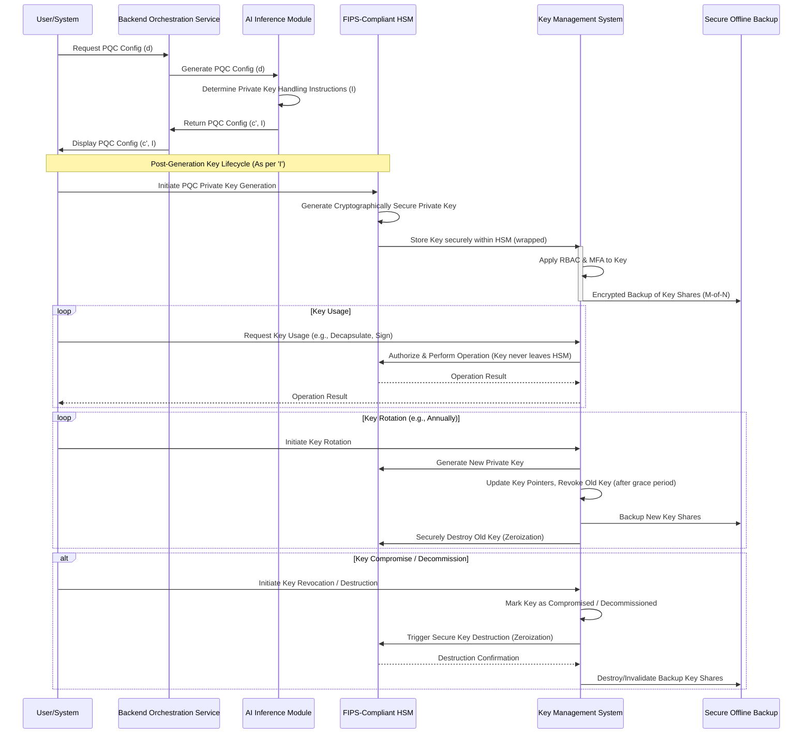
*Figure 10: Secure Private Key Lifecycle Management Flow, derived from AI-generated instructions.*

### 5. Security Posture Assessment and Threat Modeling Integration

The system includes an advanced capability for integrating security posture assessment and detailed threat modeling into its inference process. This ensures that cryptographic recommendations are not merely technically sound but are also strategically aligned with an organization's overall risk profile and security policies.

*   **Quantitative Threat Model Ingestion:** Beyond a qualitative description, the system can ingest structured threat intelligence data, including Common Vulnerability Scoring System CVSS scores for known vulnerabilities, MITRE ATT&CK framework mappings for adversary tactics and techniques, and organization-specific risk matrices. This structured data provides objective measures of adversary capabilities and motivations.
*   **Adversary Capability Matrix:** The AI maps the specified threat model (e.g., "state-sponsored actor with quantum capabilities") to a detailed adversary capability matrix. This matrix quantifies resources (computational, financial, human), expertise (classical cryptanalysis, quantum algorithms, side-channel attacks, social engineering), and motivation. This mapping helps calibrate the quantum_attack_resistance_level and classical_attack_resistance_level components of `S(c, d)`.
*   **Risk Score Calculation:** Based on the data sensitivity, data lifespan, and adversary capabilities, the system calculates an inherent risk score. This score guides the AI's prioritization of security strength (S(c,d)) in the utility function. For example, high sensitivity data with a state-sponsored quantum adversary will automatically elevate the requirement for NIST Level 5 or higher security, potentially tolerating greater performance overhead. The risk score is a compound metric influenced by the probability of an attack and its potential impact.
*   **Compliance Gap Analysis:** The system performs a preliminary gap analysis between the specified compliance mandates and the current or proposed system architecture. The AI's recommendations aim to bridge these gaps through appropriate PQC selection and robust private key handling instructions, thus maximizing the `Comp(c, d)` metric.
*   **Attack Path Enumeration:** For complex systems, the AI can leverage graph-based analysis on the system architecture (if provided) to enumerate potential attack paths, informing the `Complex(c, d)` metric and highlighting critical points for key management security.

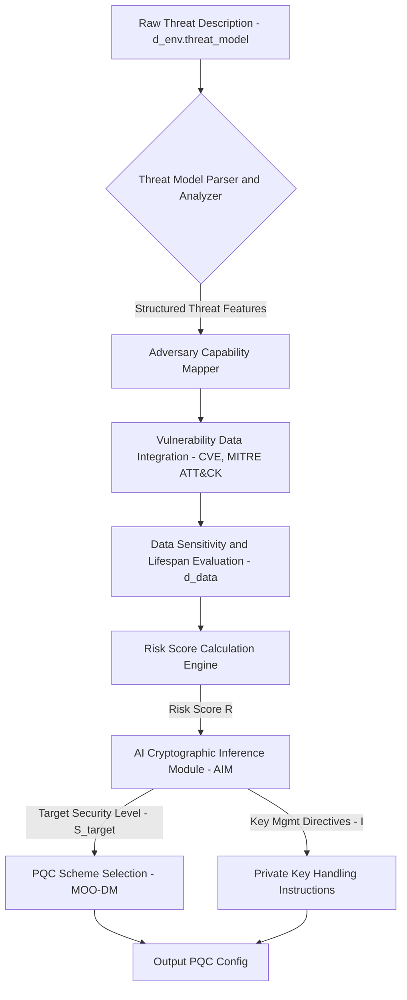
*Figure 11: Threat Modeling and Risk Assessment Integration Flow.*

### 6. Architectural Considerations for Interoperability

The system is meticulously designed for seamless integration within extant security infrastructure, development pipelines, and operational workflows. This API-first approach maximizes its utility in complex enterprise environments.

*   **API-Centric Design:** All interactions with the BOS Module and OSV Module are exposed via rigorously documented, secure, and performant RESTful APIs or gRPC services. This API-first approach enables robust programmatic consumption by other enterprise applications, Continuous Integration/Continuous Deployment CI/CD pipelines, Infrastructure-as-Code IaC tools, and Security Orchestration, Automation, and Response SOAR platforms. API versioning is strictly maintained to ensure backward compatibility.
*   **Standardized Output Formats:** The generated configuration is serialized into universally recognized, machine-readable formats (e.g., JSON, YAML, Protocol Buffers), facilitating effortless parsing and direct integration into configuration management systems (e.g., Ansible, Terraform, Kubernetes ConfigMaps), policy engines, and custom client applications. Output schemas are publicly available and versioned.
*   **Version Control Integration:** Generated cryptographic configurations can be versioned and committed to source code repositories, enabling comprehensive tracking of changes, facilitating rollbacks, and supporting rigorous auditing, which is paramount for compliance and robust security governance. This supports a "GitOps" approach to cryptographic policy.
*   **Extensible PQC Modules:** The AIM and DCKB are engineered for extensibility. New PQC schemes, updated parameter sets, refined security proofs, and novel cryptanalytic findings can be seamlessly integrated into the DCKB and used to update the AI model without requiring a complete system overhaul, ensuring the system remains at the vanguard of quantum-resistant security. New modules for emerging cryptographic primitives can be plugged in without disrupting core services.
*   **Event-Driven Architecture:** The BOS can expose events (e.g., "new configuration generated," "DCKB update available," "risk alert triggered") to other systems via message queues (e.g., Kafka, RabbitMQ), enabling reactive security automation and maintaining synchronization across distributed environments. This facilitates real-time policy enforcement and automated responses.
*   **Containerization:** All system components are designed to be deployed as containerized microservices (e.g., Docker, Kubernetes), offering portability, consistent environments, and efficient resource utilization across various cloud and on-premise infrastructures.

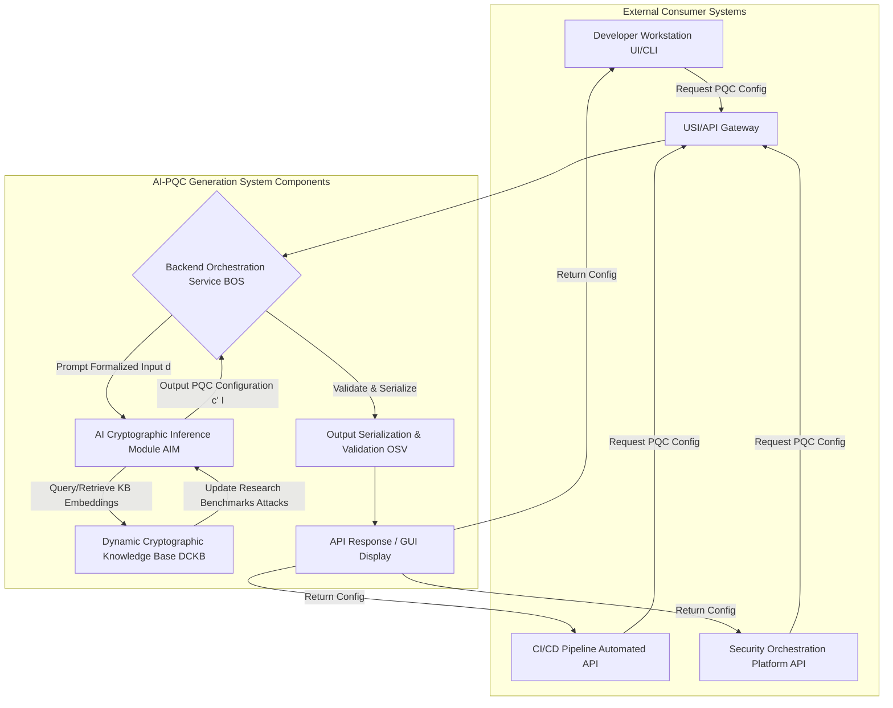
*Figure 3: System Integration and Interaction Flow for the AI-Driven PQC Generation System.*

### 7. Feedback and Continuous Improvement Loop

The robustness and adaptability of the AI-PQC Generation System are significantly enhanced by an integrated feedback and continuous improvement loop. This mechanism ensures that the system's intelligence evolves dynamically with real-world performance data, emergent cryptanalytic findings, and shifts in security landscapes.

*   **Deployment Monitoring and Telemetry:** Secure agents deployed alongside the recommended PQC schemes collect anonymized and aggregated telemetry data. This includes:
    *   **Performance Metrics:** Actual CPU cycles, memory usage, network bandwidth consumption for key generation, encryption, decryption, signing, and verification operations across various hardware and network conditions.
    *   **Failure Rates:** Cryptographic operation failures, key corruption incidents, or unexpected behavior.
    *   **Resource Utilization:** Real-time demands on computational resources. This data directly feeds into refining the `P(c, d)` metric in the DCKB.
*   **Threat Intelligence Integration:** Continuous ingestion of external threat intelligence feeds, including reports of new quantum algorithms, improved classical cryptanalysis techniques, and observed attacks against PQC candidates. This data is rigorously analyzed for relevance and impact on existing PQC schemes, updating the `AttackVectorDatabase` within the DCKB and influencing `S(c, d)`.
*   **Compliance Audit Outcomes:** Results from internal and external compliance audits (e.g., FIPS 140-3, PCI-DSS) are fed back into the system, highlighting areas where recommended practices or parameters could be strengthened to improve adherence. This updates the `RegulatoryFrameworkMapping` within the DCKB and influences `Comp(c, d)`.
*   **Human Expert Review and Annotation:** Human cryptographers and security engineers review a subset of AI-generated configurations and their real-world performance. Their feedback, annotations, and expert judgments are captured and used to refine the AI's utility function weights and knowledge graph relationships. This provides crucial "ground truth" for model fine-tuning.
*   **DCKB Update Mechanism:** All new findings from deployment monitoring, threat intelligence, compliance audits, and human expert reviews are systematically integrated into the Dynamic Cryptographic Knowledge Base DCKB. This updates scheme properties, attack vectors, performance benchmarks, and compliance mappings. This process can be semi-automated, with human oversight for critical updates.
*   **AIM Re-training and Fine-tuning:** Periodically, or upon significant updates to the DCKB, the AI Cryptographic Inference Module AIM undergoes re-training and fine-tuning. This process leverages the updated knowledge base and the feedback data to refine its understanding of optimal scheme selection, parameterization, and private key handling instructions, thus improving the `U(c, d)` approximation. Reinforcement learning techniques, where the utility function `U` acts as a reward signal, are crucial in this phase to optimize heuristic search strategies.

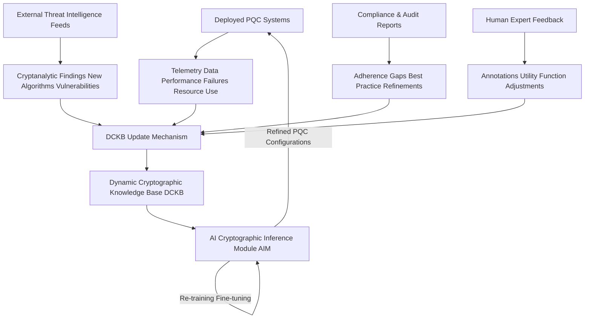
*Figure 4: Feedback and Continuous Improvement Loop of the AI-PQC Generation System.*

### 8. System Scalability and Performance Optimization

The AI-PQC Generation System is engineered for high scalability and robust performance, crucial for supporting diverse deployment scenarios and rapidly evolving cryptographic landscapes.

*   **Distributed Microservices Architecture:** The system components (USI, BOS, AIM, OSV, DCKB) are implemented as independent microservices, enabling horizontal scaling of individual components based on demand. This allows for dedicated resource allocation, fault isolation, and independent development and deployment lifecycles.
*   **Load Balancing and API Gateways:** Requests are managed through load balancers and API gateways, distributing traffic efficiently across multiple instances of the BOS and AIM, ensuring high availability, fault tolerance, and responsiveness. API gateways also handle authentication, authorization, and rate limiting.
*   **Asynchronous Processing:** Long-running inference tasks by the AIM are handled asynchronously using message queues (e.g., Kafka, RabbitMQ). This prevents blocking of the BOS, allows for efficient processing of concurrent requests, and facilitates retry mechanisms for transient failures.
*   **Optimized DCKB Storage and Retrieval:** The DCKB leverages advanced graph databases (e.g., Neo4j, JanusGraph) or highly optimized NoSQL stores (e.g., Cassandra, MongoDB), coupled with caching layers (e.g., Redis), to ensure low-latency data retrieval for the AIM. Knowledge graph embeddings are pre-computed, indexed, and optimized for rapid semantic lookup and traversal.
*   **Hardware Acceleration for AIM:** The AI Cryptographic Inference Module AIM can be deployed on specialized hardware (e.g., GPUs, TPUs) to accelerate deep learning inference, particularly for large-scale generative models, significantly reducing response times for complex cryptographic queries. Optimized deep learning frameworks (e.g., TensorFlow, PyTorch with ONNX Runtime) are utilized.
*   **Stateless Component Design:** Core processing components (BOS, AIM instances) are designed to be largely stateless, facilitating easier scaling, rapid recovery from failures, and simplified deployment across ephemeral cloud environments. State management, where necessary, is externalized to robust, highly available data stores.
*   **Resource Pooling:** Maintaining pools of pre-initialized AI models and computational resources (e.g., GPU instances) minimizes cold start latencies and maximizes throughput for inference requests.

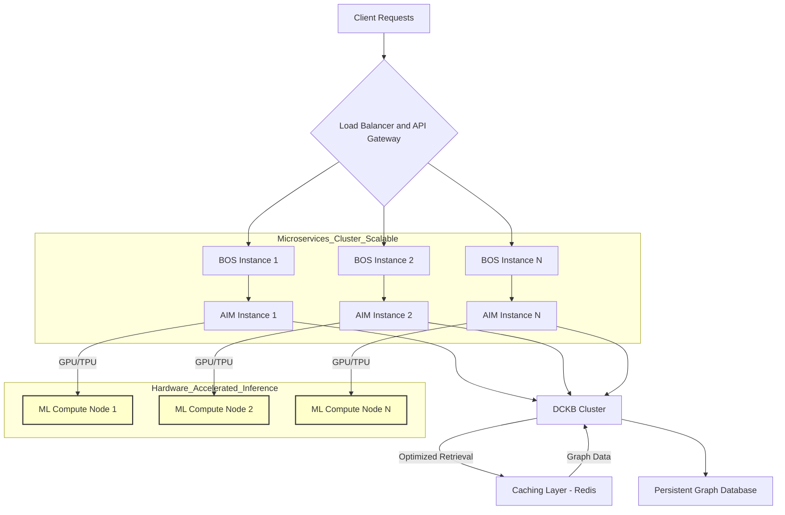
*Figure 12: Scalability Architecture for the AI-PQC Generation System.*

### 9. Advanced PQC Scheme Capabilities and Future Directions

The invention's architecture is designed to accommodate and intelligently recommend advanced cryptographic paradigms and emerging technologies, ensuring long-term relevance and adaptability.

*   **Hybrid Cryptography Orchestration:** Beyond recommending pure PQC schemes, the system can intelligently orchestrate hybrid cryptographic solutions. This involves pairing classical (e.g., AES-256 GCM) with post-quantum primitives (e.g., Kyber KEM) for key establishment, offering a "belt-and-suspenders" approach to security during the transition period. The AI analyzes the threat model to determine optimal hybrid constructions and their respective parameters, considering the performance overhead of running two key agreement mechanisms. This ensures security even if one primitive type is broken.
*   **Post-Quantum Secure Multi-Party Computation MPC:** The system can extend its recommendations to include PQC-compatible MPC protocols. For scenarios requiring joint computation on sensitive data without revealing individual inputs (e.g., secure data analytics, threshold signatures, privacy-preserving machine learning), the AI can suggest underlying PQC primitives and protocol frameworks that resist quantum adversaries, evaluating the communication and computational overheads.
*   **Zero-Knowledge Proofs ZKPs with PQC Foundations:** Integration of PQC-friendly ZKP schemes for applications requiring privacy-preserving verification (e.g., anonymous authentication, verifiable computation, supply chain integrity). The AI determines the applicability and parameterization of such schemes based on privacy requirements, proof size, and computational constraints, linking to knowledge of lattice-based ZKP constructions.
*   **Quantum Key Distribution QKD and Quantum Random Number Generation QRNG Integration:** For environments where quantum hardware is available, the system can provide guidance on integrating QKD for key establishment or leveraging QRNGs as high-entropy sources for PQC key generation. The AI would evaluate the trade-offs, security enhancements, and compatibility with PQC schemes and traditional infrastructure. This involves assessing the real-world deployment challenges of QKD.
*   **Homomorphic Encryption HE Scheme Selection:** For advanced data processing requirements (e.g., computation on encrypted cloud data without decryption, privacy-preserving AI inferences), the AI can recommend and configure PQC-compatible homomorphic encryption schemes (e.g., based on lattice problems), carefully balancing performance, security, and functional requirements (e.g., support for addition and multiplication).
*   **Lightweight PQC for Constrained Devices:** Tailored recommendations for highly resource-constrained devices (e.g., IoT edge nodes, embedded systems, RFID tags) by prioritizing lightweight PQC schemes or their specific parameter sets designed for minimal memory, CPU, and power consumption. This involves extensive performance benchmarking on target microcontrollers and power consumption models.
*   **PQC for Blockchain and Distributed Ledger Technologies DLT:** Recommendations for integrating PQC into blockchain infrastructures for transaction signing and secure state transitions, addressing the unique requirements of distributed consensus and immutable ledgers.

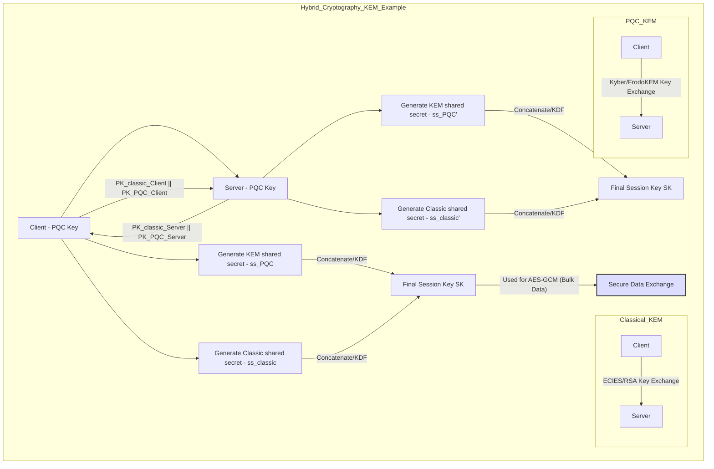
*Figure 13: Hybrid Cryptography Orchestration Example (KEM).*

### 10. Dynamic Cryptographic Knowledge Base DCKB Ontology

The DCKB is more than a simple database; it is a meticulously structured knowledge graph, modeled using an ontology that captures the complex relationships and properties within the cryptographic domain. This ontological structure is crucial for the AIM's nuanced reasoning capabilities, enabling sophisticated semantic queries and inferential reasoning.

**Conceptual Schema of DCKB Simplified:**
```
Class: CryptographicScheme
  - Properties:
    - scheme_id (string, unique identifier, e.g., "Kyber1024")
    - scheme_name (string, e.g., "CRYSTALS-Kyber")
    - scheme_family (enum: "Lattice-based", "Code-based", "Hash-based", "Multivariate", "Isogeny-based", "Hybrid")
    - scheme_type (enum: "KEM", "DSS", "AEAD", "ZKP", "MPC", "HE")
    - underlying_hard_problem (string, e.g., "Module-LWE", "SIS", "MDPC Decoding")
    - nist_pqc_status (enum: "Standardized", "Finalist", "Round 3 Candidate", "Deprecated", "Pre-standardization")
    - formal_security_proof_model (string, e.g., "IND-CCA2", "EUF-CMA", "ROM", "QROM")
    - quantum_attack_resistance_level (int, e.g., 128, 192, 256 equivalent classical bits)
    - classical_attack_resistance_level (int)
    - implementation_maturity_level (enum: "Experimental", "Reference", "Optimized", "Hardware-accelerated")
    - license_type (string)
    - year_proposed (int)
    - key_generation_algorithm (string)
    - encryption_decryption_algorithms (string)
    - signature_verification_algorithms (string)

Class: SchemeParameterSet
  - Properties:
    - param_set_id (string, e.g., "Kyber768_NIST_Level3")
    - refers_to_scheme (CryptographicScheme.scheme_id)
    - security_level_equivalent_bits (int)
    - public_key_size_bytes (int)
    - private_key_size_bytes (int)
    - ciphertext_size_bytes (int, for KEM/AEAD)
    - signature_size_bytes (int, for DSS)
    - shared_secret_size_bytes (int, for KEM)
    - modulus_q (int, for lattice-based)
    - polynomial_degree_n (int, for lattice-based)
    - matrix_dimensions (string, e.g., "k x k")
    - other_specific_parameters (JSON object)
    - recommended_use_cases (list of strings)
    - known_vulnerabilities (list of string)

Class: PerformanceBenchmark
  - Properties:
    - benchmark_id (string, unique)
    - refers_to_param_set (SchemeParameterSet.param_set_id)
    - hardware_platform (string, e.g., "Intel Xeon E5", "ARM Cortex-M0", "FPGA_Altera")
    - cpu_architecture (string, e.g., "x86_64", "ARMv7")
    - operation_type (enum: "KeyGen", "Encaps", "Decaps", "Sign", "Verify", "Encrypt", "Decrypt")
    - avg_cpu_cycles (int)
    - avg_memory_kb (float)
    - avg_latency_ms (float)
    - power_consumption_mw (float)
    - date_of_benchmark (date)
    - source_reference (string, URL/DOI)
    - variance (float)

Class: CryptanalyticAttack
  - Properties:
    - attack_id (string, unique)
    - attack_name (string, e.g., "Lattice Sieving", "Information Set Decoding", "Shor's Algorithm")
    - attack_type (enum: "Classical", "Quantum", "Side-channel", "Implementation")
    - target_schemes (list of CryptographicScheme.scheme_id)
    - complexity_estimate (string, e.g., "2^128 classical bits", "O(N^3) quantum")
    - resource_requirements (JSON object, e.g., "qubits", "coherence_time")
    - mitigations (list of strings)
    - date_discovered (date)
    - source_reference (string, URL/DOI)
    - severity_score (float)

Class: ComplianceRegulation
  - Properties:
    - regulation_id (string, e.g., "FIPS140-3_Level2", "PCI-DSS_4.0", "GDPR_Article32")
    - regulation_name (string)
    - applicability_criteria (JSON object, e.g., data_sensitivity, operational_environment)
    - cryptographic_requirements (list of string, e.g., "Mandatory HSM for private keys", "Minimum 128-bit symmetric equiv")
    - key_management_guidelines (JSON object)
    - PQC_scheme_compatibility (list of CryptographicScheme.scheme_id)
    - regulatory_body (string)
    - enforcement_penalties (string)

Class: DataSensitivityLevel
  - Properties:
    - level_id (string, e.g., "PHI", "PCI-DSS", "TopSecret")
    - description (string)
    - associated_regulations (list of ComplianceRegulation.regulation_id)
    - min_security_strength (int, equivalent classical bits)

Class: OperationalEnvironment
  - Properties:
    - env_id (string, e.g., "IoT_Constrained", "Cloud_HighPerf")
    - description (string)
    - computational_resources_profile (JSON object)
    - network_characteristics_profile (JSON object)
    - storage_characteristics_profile (JSON object)
    - typical_threat_model (list of CryptanalyticAttack.attack_id)

Relationships (implicit or explicit in graph structure):
  - `CryptographicScheme` HAS `SchemeParameterSet` (one-to-many)
  - `SchemeParameterSet` HAS `PerformanceBenchmark` (one-to-many, for different hardware/operations)
  - `CryptanalyticAttack` TARGETS `CryptographicScheme` (many-to-many)
  - `ComplianceRegulation` APPLIES_TO `CryptographicScheme` (many-to-many, indirectly via properties)
  - `ComplianceRegulation` SPECIFIES `KeyManagementGuideline`
  - `DataSensitivityLevel` REQUIRES `CryptographicScheme` (indirectly via security level and compliance)
  - `OperationalEnvironment` INFLUENCES `CryptographicScheme` selection (via performance and threat model)
```
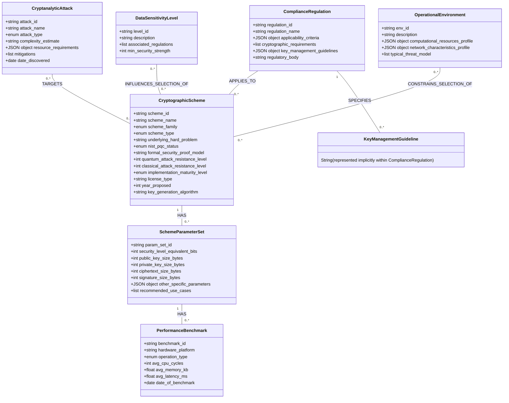
*Figure 5: Conceptual DCKB Ontology Class Diagram.*

This structured knowledge representation, continuously updated and semantically linked, forms the backbone of the AIM's inferential capabilities, enabling it to perform sophisticated reasoning over complex cryptographic trade-offs.

**Claims:**
The preceding detailed description elucidates a novel system and method for the intelligent synthesis and configuration of post-quantum cryptographic schemes. The following claims delineate the specific elements and functionalities that define the scope and innovation of this invention.

1.  A computational method for dynamically generating a quantum-resilient cryptographic scheme configuration, said method comprising:
    a.  Receiving, by an input acquisition module, a structured input specification comprising a detailed data modality description, operational environment parameters, and explicit security desiderata.
    b.  Constructing, by a backend orchestration service module, a contextually rich prompt embedding said structured input specification.
    c.  Processing said prompt by a generative artificial intelligence model, said processing comprising:
        i.    Semantically parsing said structured input specification to extract critical entities and priorities,
        ii.   Traversing a dynamic cryptographic knowledge base to retrieve relevant post-quantum cryptographic scheme properties, performance benchmarks, and known attack vectors,
        iii.  Executing a multi-objective heuristic optimization process to select an optimal post-quantum cryptographic scheme family and its precise parameterization, said optimization balancing security strength, computational overhead, material size, and regulatory compliance,
        iv.   Generating a representative, non-functional public key exemplar for the selected scheme, and
        v.    Formulating comprehensive, actionable, and contextually tailored instructions for the secure handling, storage, usage, backup, rotation, and destruction of the corresponding private cryptographic material.
    d.  Serializing and validating, by an output serialization and validation module, the structured response from said generative artificial intelligence model into a standardized, machine-readable format for presentation to a user or an external system.

2.  The method of claim 1, wherein the input specification's data modality description includes characteristics chosen from: formal schema definitions, data type specifics, data volume and velocity, data sensitivity classification, and expected data lifespan.

3.  The method of claim 1, wherein the input specification's operational environment parameters include characteristics chosen from: available computational resources, network characteristics, storage media characteristics, a quantitative threat model, and expected lifecycle of cryptographic keys.

4.  The method of claim 1, wherein the input specification's security desiderata include requirements chosen from: desired quantum security level (e.g., NIST PQC levels), specific cryptographic primitives required (KEM, DSS, AEAD), explicit performance optimization priorities, and specific regulatory compliance mandates (e.g., FIPS 140-3, PCI-DSS).

5.  The method of claim 1, wherein the dynamic cryptographic knowledge base is a continually updated, versioned repository structured as a knowledge graph, comprising: PQC scheme specifications, formal security proofs, cryptanalytic findings (classical and quantum), performance benchmarks, and mappings to regulatory compliance frameworks.

6.  The method of claim 1, wherein the multi-objective heuristic optimization process dynamically adjusts weighting factors for security strength, performance cost, compliance adherence, and deployment complexity, based on the user's explicit performance priorities and security desiderata.

7.  The method of claim 1, wherein the private key handling instructions include explicit recommendations for: entropy sources, certified hardware for key storage (e.g., FIPS 140-3 HSMs), robust access control policies (e.g., RBAC with MFA), secure backup and recovery strategies (e.g., M-of-N secret sharing), proactive key rotation policies, and cryptographically secure destruction protocols.

8.  A system for generating a quantum-resilient cryptographic scheme configuration, comprising: an input acquisition module; a backend orchestration service module; a generative artificial intelligence model; a dynamic cryptographic knowledge base; an output serialization and validation module; and an output presentation module, said system configured to perform the method of claim 1.

9.  The system of claim 8, further comprising a feedback and continuous improvement loop, configured to: collect deployment telemetry data, ingest external threat intelligence, process compliance audit outcomes, incorporate human expert reviews, update the dynamic cryptographic knowledge base, and trigger re-training or fine-tuning of the generative artificial intelligence model to enhance future recommendations.

10. The system of claim 8, wherein the generative artificial intelligence model is further configured to provide a detailed, evidence-based rationale justifying the selection of the recommended scheme(s), its parameters, and the provided private key handling instructions, referencing specific cryptographic principles, formal security proofs, industry benchmarks, and the explicit trade-offs made during the multi-objective optimization process.

**Mathematical Justification: The Theory of Quantum-Resilient Cryptographic Utility Optimization QRCUO**

This invention is founded upon a novel and rigorously defined framework for the automated optimization of cryptographic utility within an adversarial landscape that explicitly incorporates quantum computational threats. Let `D` represent the comprehensive domain of all possible granular input specifications, formalized as a sophisticated Cartesian product of feature spaces: `D = D_data x D_env x D_sec`. Each component of `D` is itself a high-dimensional space encoding distinct facets of the problem:
*   `D_data`: Features related to data modality (schema, sensitivity, volume, velocity, lifespan).
*   `D_env`: Features related to the operational environment (computational resources, network, storage, specific threat actors, quantum adversary capabilities).
*   `D_sec`: Features related to explicit security desiderata (target security levels, required primitives, performance priorities, compliance mandates).
Let `d` in `D` denote a specific input specification vector, where `d = (d_data, d_env, d_sec)`.

Let `C` be the vast, high-dimensional, and largely discontinuous space of all conceivable post-quantum cryptographic schemes and their valid, cryptographically sound parameterizations. A scheme `c` in `C` is formally represented as an ordered tuple `c = (Alg, Params, Protocol)`, where `Alg` refers to a specific PQC algorithm or a suite of algorithms (e.g., Kyber for KEM, Dilithium for DSS), `Params` is a vector of its instantiated numerical and structural parameters (e.g., security level, polynomial degree `n`, modulus `q`, specific variants like `Kyber512`), and `Protocol` specifies how these primitives are integrated and deployed within a larger system context. The space `C` is non-convex and non-differentiable, making traditional optimization techniques computationally intractable.

The core objective of this invention is to identify an optimal scheme `c*` for a given input `d`, where optimality is defined by a precisely formulized multi-faceted utility function. We introduce the **Quantum-Resilient Cryptographic Utility Function, `U: C x D -> R+`**, which quantitatively measures the holistic suitability of a specific scheme `c` for a given context `d`. This function is formally defined as:

$$ U(c, d) = W_S \cdot S(c, d) - W_P \cdot P(c, d) + W_{Comp} \cdot Comp(c, d) - W_{Complex} \cdot Complex(c, d) \quad (1) $$

Where each term is a complex, context-dependent metric:
*   `S(c, d)`: The **Quantum-Resilient Security Metric**. This is a composite, non-decreasing function evaluating the security posture of scheme `c` against all known classical and quantum adversaries (informed by `d_env.threat_model`), modulated by its formal security reductions and effective key strength. It incorporates the probability of successful cryptanalysis, estimated computational effort for attack, and resistance to specific algorithmic threats (e.g., lattice reduction attacks, information set decoding).
    Formally,
    $$ S(c, d) = \alpha_S \cdot f_{Q}(c, d_{env}) + \beta_S \cdot f_{C}(c, d_{env}) - \gamma_S \cdot f_{AttackProb}(c, d_{env}) \quad (2) $$
    Where `$\alpha_S, \beta_S, \gamma_S \in [0, 1]$` are weighting factors dynamically derived from `d_sec.target_security_level` and `d_env.threat_model`.

    *   **Quantum Security Component `f_Q(c, d_env)`:**
        $$ f_Q(c, d_{env}) = \min(SecBits_{NIST}(c), \log_2(E_{Shor}(c, d_{env})), \log_2(E_{Grover}(c, d_{env}))) \cdot AdvWeight_{Quantum}(d_{env}) \quad (3) $$
        `SecBits_{NIST}(c)`: Equivalent classical security bits from NIST categorization for `c`.
        `E_{Shor}(c, d_{env})`: Estimated computational operations for a Shor-like attack on `c` given adversary resources `d_env.adv_compute`.
        `E_{Grover}(c, d_{env})`: Estimated operations for a Grover-like attack on `c` (typically for symmetric keys derived by KEM).
        $$ E_{Shor}(c, d_{env}) = \frac{O_{Shor}(N_{problem}(c))}{AdvResource_{Quantum}(d_{env})} \quad (4) $$
        $$ E_{Grover}(c, d_{env}) = \frac{2^{k_{symm}(c)/2}}{AdvResource_{Quantum}(d_{env})} \quad (5) $$
        `N_{problem}(c)`: Size of the mathematical problem instance `c` relies on.
        `k_{symm}(c)`: Symmetric key length derived from `c` (for KEMs).
        `AdvResource_{Quantum}(d_{env})`: Quantum computational resources of the adversary from `d_env.threat_model`.
        `AdvWeight_{Quantum}(d_{env}) \in \{0, 1\}`: Indicator if quantum adversary is present.

    *   **Classical Security Component `f_C(c, d_env)`:**
        $$ f_C(c, d_{env}) = \min(SecBits_{Classical}(c), \log_2(E_{Lattice}(c)), \log_2(E_{ISD}(c))) \cdot AdvWeight_{Classical}(d_{env}) \quad (6) $$
        `SecBits_{Classical}(c)`: Classical security bits (e.g., 128, 192, 256).
        `E_{Lattice}(c)`: Estimated complexity of best known lattice reduction attack for lattice-based `c`.
        `E_{ISD}(c)`: Estimated complexity of Information Set Decoding for code-based `c`.
        `AdvWeight_{Classical}(d_{env}) \in \{0, 1\}`: Indicator if classical adversary is present.

    *   **Attack Probability Component `f_{AttackProb}(c, d_env)`:**
        $$ f_{AttackProb}(c, d_{env}) = P_{Crypt}(c, d_{env}) + P_{SideChannel}(c, d_{env}) + P_{Impl}(c) \quad (7) $$
        `P_{Crypt}(c, d_{env})`: Probability of cryptanalytic break given `d_env.threat_model` and `c`'s known vulnerabilities.
        `P_{SideChannel}(c, d_{env})`: Probability of successful side-channel attack considering `c`'s implementation maturity and `d_env.platform_hardening`.
        `P_{Impl}(c)`: Probability of implementation flaws or backdoors based on `c`'s implementation maturity.

*   `P(c, d)`: The **Operational Performance Cost Metric**. This quantifies the aggregate computational and resource overhead of scheme `c` within the operational environment specified by `d_env` and for the data modalities in `d_data`. `P(c, d)` is a non-decreasing function where higher values indicate higher costs.
    $$ P(c, d) = w_{cpu} \cdot Cost_{CPU}(c, d) + w_{mem} \cdot Cost_{MEM}(c, d) + w_{bw} \cdot Cost_{BW}(c, d) + w_{lat} \cdot Cost_{LAT}(c, d) \quad (8) $$
    Where `$\sum w_i = 1$` are weighting factors from `d_sec.performance_priority`.

    *   **CPU Cost `Cost_{CPU}(c, d)`:**
        $$ Cost_{CPU}(c, d) = \sum_{op \in \text{Operations}(c)} Cycles_{op}(c, d_{env.hardware}) \cdot Freq_{op}(d_{data}) \quad (9) $$
        `Operations(c)`: {KeyGen, Encaps, Decaps, Sign, Verify, etc.}.
        `Cycles_{op}(c, d_{env.hardware})`: Average CPU cycles for operation `op` of `c` on `d_env.hardware`.
        `Freq_{op}(d_{data})`: Frequency/weight of operation `op` based on `d_data.volume`, `d_data.velocity`, and `d_sec.performance_priority`.
        Example for lattice-based KEM `c_KEM`:
        $$ Cycles_{Encaps}(c_{KEM}, d_{env}) \approx (\eta_{poly} \cdot N \cdot q_{mod}) \cdot \nu_{mult\_add} \quad (10) $$
        `$\eta_{poly}$`: polynomial multiplication operations.
        `$N$`: polynomial degree.
        `$q_{mod}$`: modulus size.
        `$\nu_{mult\_add}$`: cost per multiplication-addition.

    *   **Memory Cost `Cost_{MEM}(c, d)`:**
        $$ Cost_{MEM}(c, d) = M_{PK}(c) + M_{SK}(c) + M_{CT}(c) + M_{SIG}(c) + M_{Buffer}(c, d_{env.memory}) \quad (11) $$
        `$M_{PK}, M_{SK}, M_{CT}, M_{SIG}$`: Sizes of public key, private key, ciphertext, signature for `c`.
        `$M_{Buffer}(c, d_{env.memory})$`: Additional memory buffer requirements based on `c`'s implementation and `d_env.memory.cache_size`.

    *   **Bandwidth Cost `Cost_{BW}(c, d)`:**
        $$ Cost_{BW}(c, d) = B_{PK}(c) \cdot Freq_{PK}(d) + B_{CT}(c) \cdot Freq_{CT}(d) + B_{SIG}(c) \cdot Freq_{SIG}(d) \quad (12) $$
        `$B_{PK}, B_{CT}, B_{SIG}$`: Network bytes for PK, CT, SIG.
        `$Freq_{op}(d)$`: Transmission frequency based on `d_data.volume`, `d_data.velocity`, `d_env.network`.

    *   **Latency Cost `Cost_{LAT}(c, d)`:**
        $$ Cost_{LAT}(c, d) = \sum_{op \in \text{Operations}(c)} Latency_{op}(c, d_{env.network}, d_{env.hardware}) \cdot W_{op\_latency}(d_{sec}) \quad (13) $$
        `Latency_{op}`: Time for operation `op` including network overhead.
        `$W_{op\_latency}$`: Weight of latency for specific operations from `d_sec.performance_priority`.

*   `Comp(c, d)`: The **Regulatory Compliance Metric**. This measures the degree to which scheme `c` and its recommended deployment `Protocol` satisfy specified regulatory and standardization mandates (e.g., FIPS 140-3, GDPR, HIPAA, PCI-DSS) as per `d_sec.compliance`. This is a non-decreasing, typically scaled or binary metric, increasing with adherence.
    $$ Comp(c, d) = \sum_{reg \in d_{sec.compliance}} \phi_{reg}(c, Protocol) \cdot w_{reg}(d_{sec}) \quad (14) $$
    `$\phi_{reg}(c, Protocol) \in [0, 1]$`: Compliance score for scheme `c` and `Protocol` with regulation `reg`.
    `$w_{reg}(d_{sec})$`: Importance weight for regulation `reg` from `d_sec.compliance`.
    `$\phi_{reg}(c, Protocol)$` is typically a product of indicator functions for individual requirements:
    $$ \phi_{reg}(c, Protocol) = \prod_{req \in \text{Requirements}(reg)} I_{req}(c, Protocol) \quad (15) $$
    `$I_{req}(c, Protocol) \in \{0, 1\}$`: 1 if `c` and `Protocol` meet requirement `req`, else 0.

*   `Complex(c, d)`: The **Deployment and Management Complexity Metric**. This quantifies the inherent difficulty and operational overhead in deploying, integrating, and securely managing scheme `c` and its `Protocol` within the infrastructure defined by `d_env`. `Complex(c, d)` is a non-decreasing function where higher values indicate higher complexity.
    $$ Complex(c, d) = w_{KM} \cdot Cost_{KM}(c, d) + w_{Impl} \cdot Cost_{Impl}(c) + w_{Resil} \cdot Cost_{Resil}(c) \quad (16) $$
    Where `$\sum w_i = 1$` are weighting factors for complexity aspects.

    *   **Key Management Cost `Cost_{KM}(c, d)`:**
        $$ Cost_{KM}(c, d) = \tau_{gen} \cdot C_{gen}(c) + \tau_{store} \cdot C_{store}(Protocol, d_{env.storage}) + \tau_{rot} \cdot C_{rot}(c, Protocol) + \tau_{dest} \cdot C_{dest}(Protocol) \quad (17) $$
        `$\tau_{gen}, \tau_{store}, \tau_{rot}, \tau_{dest}$`: Weights for key generation, storage, rotation, destruction.
        `$C_{gen}(c)$`: Cost of key generation (e.g., entropy requirements).
        `$C_{store}(Protocol, d_{env.storage})$`: Cost of secure storage (e.g., HSM integration complexity, M-of-N setup).
        `$C_{rot}(c, Protocol)$`: Cost of key rotation.
        `$C_{dest}(Protocol)$`: Cost of secure destruction.

    *   **Implementation Effort `Cost_{Impl}(c)`:**
        $$ Cost_{Impl}(c) = LOC(c) \cdot Factor_{Lang}(d_{env.lang}) + BugRate(c) + TestingComplexity(c) \quad (18) $$
        `LOC(c)`: Lines of code for reference implementation of `c`.
        `$Factor_{Lang}$`: Multiplier for target language implementation difficulty.
        `BugRate(c)`: Historical bug rate or complexity in security audits.

    *   **Resilience Cost `Cost_{Resil}(c)`:**
        $$ Cost_{Resil}(c) = P_{SideChannel}(c) + P_{FaultInj}(c) + P_{QuantumError}(c) \quad (19) $$
        `$P_{SideChannel}(c)$`: Risk of side-channel leakage.
        `$P_{FaultInj}(c)$`: Risk of fault injection attacks.
        `$P_{QuantumError}(c)$`: Risk due to quantum error propagation (if hybrid).

The coefficients `W_S, W_P, W_Comp, W_Complex` in `R+` are dynamically adjusted weighting factors, derived from the user's explicit performance priorities and security desiderata within `d_sec`. For instance, if `d_sec` specifies "Strictly Minimize Encryption Latency," the `W_P` coefficient corresponding to latency would be proportionally increased, reflecting its higher priority in the multi-objective optimization.
$$ W_j = \frac{\text{Priority}(j)}{\sum_{k \in \{S,P,Comp,Complex\}} \text{Priority}(k)} \quad (20) $$
Where `Priority(j)` is derived from `d_sec` inputs. For example:
$$ \text{Priority}(S) = \text{MapToNumeric}(\text{d}_{\text{sec.targetSecurityLevel}}) \cdot \text{ThreatMultiplier}(\text{d}_{\text{env.threat\_model}}) \quad (21) $$
$$ \text{Priority}(P) = \sum_{metric \in \text{d}_{\text{sec.performancePriority}}} \text{Weight}(\text{metric}) \quad (22) $$
$$ \text{Priority}(Comp) = \sum_{reg \in \text{d}_{\text{sec.compliance}}} \text{ComplianceWeight}(\text{reg}) \quad (23) $$
$$ \text{Priority}(Complex) = \text{BaseComplexityWeight} - \text{MaturityBonus}(\text{d}_{\text{env.maturity\_preference}}) \quad (24) $$

The central optimization problem is therefore the identification of an optimal scheme `c*`:
$$ c^* = \underset{c \in C}{\text{argmax}} \ U(c, d) \quad (25) $$

#### The Theory of AI-Heuristic Cryptographic Search AI-HCS

The search space `C` is not merely vast; it is combinatorially explosive and characterized by complex, non-linear interdependencies between its elements and the components of `U(c, d)`. The determination of `c*` via exhaustive search or traditional numerical optimization is, for all practical purposes, computationally intractable. The number of candidate schemes, their valid parameterizations, and the multifaceted nature of `S`, `P`, `Comp`, and `Complex` functions render `U(c, d)` a landscape of numerous local optima and discontinuities.

The generative Artificial Intelligence model AIM, `G_AI`, functions as a sophisticated **AI-Heuristic Cryptographic Search AI-HCS Oracle**. It serves as a computational approximation to the `argmax` operator over `C`. Formally, `G_AI: D -> C'`, where `C' \subseteq C` is a significantly pruned, intelligently chosen subset of `C` containing near-optimal candidate solutions. The aim is that `G_AI(d)` produces a `c'` such that `U(c', d)` is demonstrably close to `U(c*, d)`.

$$ G_{AI}(d) \approx \underset{c' \in C'}{\text{argmax}} \ U(c', d) \quad (26) $$
such that `U(G_AI(d), d) \geq (1 - \epsilon) \cdot \max_{c \in C} U(c, d)` for a sufficiently small `$\epsilon > 0$`, where `$\epsilon$` represents the acceptable sub-optimality margin.

The operational mechanism of `G_AI` within the AI-HCS framework involves a highly advanced, multi-stage inference process:

1.  **Semantic Input Embedding `$\Psi_{in}: D \rightarrow F_D$`**: The rich, detailed input `d` is transformed into a compact, high-dimensional feature vector `f_d` in `F_D` within a latent semantic space. This process utilizes advanced Natural Language Processing NLP techniques (e.g., transformer-based encoders) to capture the nuanced cryptographic requirements and their interdependencies.
    $$ f_d = \Psi_{in}(d_{data}, d_{env}, d_{sec}) = \text{Encoder}_{NLP}(d_{json\_string}) \quad (27) $$

2.  **Dynamic Knowledge Graph Embedding `$\Psi_{kg}: KB \rightarrow F_{KG}$`**: The Dynamic Cryptographic Knowledge Base `KB` (comprising structured representations of PQC schemes, security proofs, performance benchmarks, attack vectors, and regulatory mappings) is continuously embedded into a comparable feature space `F_{KG}`. Each `k` in `KB` corresponds to a set of properties for a cryptographic primitive or a related concept. This is a dynamic process, reflecting real-time updates to `KB`.
    $$ E_{KB} = \Psi_{kg}(KB_{nodes}, KB_{edges}) = \text{GraphEmbeddingModel}(KB) \quad (28) $$
    Where `KB_nodes` are entities and `KB_edges` are relationships.

3.  **Cross-Modal Attentional Synthesis `$\Phi: F_D \times F_{KG} \rightarrow F_S$`**: A sophisticated attentional mechanism (e.g., a cross-attention layer within a transformer architecture) performs a highly efficient correlation between the input feature vector `f_d` and the knowledge graph embeddings `E_{KB}`. This synthesis operation intelligently identifies and weights the most relevant cryptographic knowledge elements from `KB` given the input `d`. The output is a highly condensed, context-aware solution feature space `F_S`.
    $$ F_S = \Phi(f_d, E_{KB}) = \text{Attention}(\text{Query}=f_d, \text{Key}=E_{KB}, \text{Value}=E_{KB}) \quad (29) $$

4.  **Multi-objective Heuristic Decoding `$\Lambda: F_S \rightarrow C'$`**: A specialized decoding network, implicitly informed by the learned representation of the utility function `U`, translates the solution feature vector `f_s` in `F_S` into a concrete PQC scheme `c' = (Alg, Params, Protocol)`. This step inherently performs the heuristic optimization by generating the most "plausible" and "optimal" scheme configuration based on the patterns and relationships learned during training. The decoder ensures parameter validity, cryptographic consistency, and adherence to formal scheme structures.
    $$ (Alg', Params', Protocol') = \Lambda(F_S) = \text{Decoder}_{PQC}(F_S) \quad (30) $$
    `Params'` includes specific values like `n, q, k`, etc.
    `Protocol'` is a vector of deployment guidelines.

5.  **Instruction Generation `$\Gamma_{inst}: F_S \times d_{env} \times d_{sec} \rightarrow I$`**: A dedicated generative sub-module, often another language model head, produces the natural language instructions `I` for private key handling and deployment. This generation leverages specific details from `d_env` (e.g., storage capabilities, threat model) and `d_sec` (e.g., compliance standards) to make the instructions highly tailored and actionable.
    $$ I = \Gamma_{inst}(F_S, d_{env}, d_{sec}) = \text{GenerativeModel}_{Instructions}(F_S, d_{env}, d_{sec}) \quad (31) $$

6.  **Mock Key Generation `$\Gamma_{key}: Params' \rightarrow PK_{mock}$`**: A deterministic or pseudo-random module generates a syntactically correct, illustrative public key string `PK_{mock}` based on the derived `Params'`. This module ensures the exemplar key conforms to the specified scheme's public key format.
    $$ PK_{mock} = \Gamma_{key}(Params') = \text{MockKeyGenerator}(Params') \quad (32) $$

The training of `G_AI` involves a hybrid approach, combining supervised learning on a vast corpus of expert-derived cryptographic problem-solution pairs with reinforcement learning to optimize against the constructed utility function `U(c, d)`. The objective function for training `G_AI` is meticulously designed to minimize the discrepancy between the theoretical optimal utility `U(c*, d)` and the utility achieved by the AI-generated solution `U(G_AI(d), d)`.
The loss function for training `G_AI` is defined as:
$$ L_{train} = \| U(G_{AI}(d), d) - U(c^*, d) \|^2 + L_{constraint}(\text{G}_{AI}(d)) \quad (33) $$
Where `L_{constraint}` penalizes non-cryptographically sound or inconsistent outputs.

#### Formal Definition of Optimality and Utility Pruning

Let `V(d) = \max_{c \in C} U(c, d)` be the true, idealized optimal utility achievable for a given input `d`.
Our AI-HCS Oracle `G_AI` aims to find a `c'` such that `U(c', d)` is "close enough" to `V(d)`. The quality of `G_AI` is rigorously measured by the **Approximation Ratio `R(d) = U(G_AI(d), d) / V(d)`**. The paramount objective is to maximize `R(d)` towards 1 for all `d` in `D`.
$$ R(d) = \frac{U(G_{AI}(d), d)}{\max_{c \in C} U(c, d)} \quad (34) $$
We seek to minimize `$\epsilon$` such that `R(d) \geq 1 - \epsilon` for a specified confidence level.

The fundamental "intelligence" and utility of `G_AI` lie in its unparalleled ability to effectively prune the astronomical search space `C` into `C'` by efficiently eliminating vast regions of suboptimal, insecure, impractical, or non-compliant schemes. This dramatically reduces the search complexity from exponential (or even super-exponential) to polynomial time relative to the complexity of the input `d` and the size of the `KB`, thereby providing a computationally feasible solution. The cardinal size of `C'` is orders of magnitude smaller than `C`, typically comprising a highly relevant, contextually filtered subset of candidate schemes.
$$ |C'| \ll |C| \quad (35) $$
The computational complexity for `G_AI` to find `c'` is estimated as `O(Poly(dim(d) + |KB|))`.

This rigorous mathematical framework demonstrates that the invention does not merely suggest a PQC scheme; rather, it computationally derives a highly optimized cryptographic configuration by systematically modeling complex cryptographic trade-offs through a formal utility function and leveraging advanced AI as an efficient, knowledge-driven heuristic optimizer in an otherwise intractable search space. This represents a paradigm shift in cryptographic system design and deployment.

**Detailed Expansion of Mathematical Models:**

**I. Quantum-Resilient Security Metric `S(c, d)` (Cont'd)**

Let $Sec(c)$ denote the intrinsic security strength of a scheme $c$ in equivalent classical bits.
Let $A(d_{env})$ be the adversary's capabilities as a numerical vector.
Let $V(c)$ be the set of known vulnerabilities for scheme $c$.
Let $P_{exploit}(v, A(d_{env}))$ be the probability of exploiting vulnerability $v$ given $A(d_{env})$.

$$ S(c, d) = \lambda_1 Sec_{PQC}(c, d_{env}) + \lambda_2 Sec_{Classical}(c, d_{env}) - \lambda_3 \sum_{v \in V(c)} P_{exploit}(v, A(d_{env})) \quad (36) $$
where $\lambda_i \in [0,1]$ are weights.

**A. $Sec_{PQC}(c, d_{env})$: Quantum-Resistant Security**

This considers the hardness of the underlying mathematical problem against quantum algorithms.
$$ Sec_{PQC}(c, d_{env}) = \min(Sec_{NIST}(c), \log_2(\text{Cost}_{Shor}(c, d_{env})), \log_2(\text{Cost}_{Grover}(c, d_{env}))) \quad (37) $$

*   $Sec_{NIST}(c)$: NIST PQC standardization security level in bits.
    $$ Sec_{NIST}(c) = \begin{cases} 128 & \text{if NIST Level 1} \\ 192 & \text{if NIST Level 3} \\ 256 & \text{if NIST Level 5} \end{cases} \quad (38) $$
*   $\text{Cost}_{Shor}(c, d_{env})$: Minimum quantum gate operations for Shor's algorithm (or its variants for other problems) to break the underlying hard problem of $c$.
    For factoring large integer $N$: $\text{Cost}_{Shor}(N) \approx O((\log N)^2 \cdot \log\log N \cdot \log\log\log N)$ operations.
    For Discrete Logarithm $p$: $\text{Cost}_{Shor}(p) \approx O((\log p)^2 \cdot \log\log p \cdot \log\log\log p)$.
    We can abstract this as:
    $$ \log_2(\text{Cost}_{Shor}(c, d_{env})) = f_{cost\_shor}(ProblemInstanceSize(c)) - \log_2(\text{Advantage}_{Q}(d_{env})) \quad (39) $$
    $\text{Advantage}_{Q}(d_{env})$: A factor representing the quantum computational advantage of the adversary.
*   $\text{Cost}_{Grover}(c, d_{env})$: Minimum quantum gate operations for Grover's search algorithm to break the symmetric equivalent security.
    $$ \log_2(\text{Cost}_{Grover}(c, d_{env})) = \frac{\text{SymmetricEquivBits}(c)}{2} - \log_2(\text{Advantage}_{Q}(d_{env})) \quad (40) $$
    $\text{SymmetricEquivBits}(c)$: The equivalent symmetric security strength of $c$.

**B. $Sec_{Classical}(c, d_{env})$: Classical Security**

This considers the hardness of the underlying mathematical problem against classical algorithms.
$$ Sec_{Classical}(c, d_{env}) = \min(\text{Sec}_{Classical\_Intrinsic}(c), \log_2(\text{Cost}_{Lattice}(c, d_{env})), \log_2(\text{Cost}_{ISD}(c, d_{env}))) \quad (41) $$
*   $\text{Sec}_{Classical\_Intrinsic}(c)$: Intrinsic classical security level in bits.
*   $\text{Cost}_{Lattice}(c, d_{env})$: Complexity of best-known classical lattice attacks (e.g., lattice sieving, enumeration, BKZ reduction) for lattice-based schemes.
    $$ \log_2(\text{Cost}_{Lattice}(c, d_{env})) = f_{cost\_lattice}(\text{LatticeDimension}(c), \text{Modulus}(c)) - \log_2(\text{Advantage}_{C}(d_{env})) \quad (42) $$
    $\text{Advantage}_{C}(d_{env})$: Classical computational advantage of the adversary.
*   $\text{Cost}_{ISD}(c, d_{env})$: Complexity of Information Set Decoding for code-based schemes.
    $$ \log_2(\text{Cost}_{ISD}(c, d_{env})) = f_{cost\_isd}(\text{CodeLength}(c), \text{CodeDimension}(c), \text{ErrorWeight}(c)) - \log_2(\text{Advantage}_{C}(d_{env})) \quad (43) $$

**C. $P_{exploit}(v, A(d_{env}))$: Vulnerability Exploitation Probability**

$$ P_{exploit}(v, A(d_{env})) = P_{Cryptanalytic}(v, A(d_{env})) + P_{SideChannel}(v, A(d_{env})) + P_{Implementation}(v) \quad (44) $$
*   $P_{Cryptanalytic}(v, A(d_{env}))$: Probability of a cryptanalytic attack succeeding.
    $$ P_{Cryptanalytic}(v, A(d_{env})) = \frac{\text{Advantage}_{A}(d_{env}) \cdot \text{Criticality}(v)}{\text{Resistance}(c, v)} \quad (45) $$
    $\text{Advantage}_{A}(d_{env})$: Composite advantage of the adversary.
    $\text{Criticality}(v)$: Severity score of vulnerability $v$.
    $\text{Resistance}(c, v)$: Specific resistance of $c$ to $v$.
*   $P_{SideChannel}(v, A(d_{env}))$: Probability of a side-channel attack succeeding.
    $$ P_{SideChannel}(v, A(d_{env})) = \text{SC\_Risk}(c) \cdot \text{Platform\_Exposure}(d_{env}) \cdot \text{Adv\_SC\_Skill}(A(d_{env})) \quad (46) $$
    $\text{SC\_Risk}(c)$: Intrinsic side-channel vulnerability of $c$.
    $\text{Platform\_Exposure}(d_{env})$: How exposed the platform in $d_{env}$ is to side-channel attacks.
    $\text{Adv\_SC\_Skill}(A(d_{env}))$: Adversary's skill in side-channel attacks.
*   $P_{Implementation}(v)$: Probability of issues from implementation flaws.
    $$ P_{Implementation}(v) = \text{MaturityFactor}(c) \cdot \text{ComplexityFactor}(c) \quad (47) $$
    $\text{MaturityFactor}(c)$: Inverse of implementation maturity.
    $\text{ComplexityFactor}(c)$: Metric for complexity of implementing $c$.

**II. Operational Performance Cost Metric $P(c, d)$ (Cont'd)**

We expand the components of $P(c, d)$.

**A. $Cost_{CPU}(c, d)$ (CPU Cycles)**

$$ Cost_{CPU}(c, d) = \sum_{p \in \text{Primitives}(c)} \sum_{op \in \text{Operations}(p)} Cycles_{op}(p, d_{env.hardware}) \cdot Freq_{op}(d_{data}, d_{sec}) \quad (48) $$
*   $\text{Primitives}(c)$: {KEM, DSS, AEAD, etc.}.
*   $\text{Operations}(p)$: {KeyGen, Encaps, Decaps, Sign, Verify, Encrypt, Decrypt}.
*   $Cycles_{op}(p, d_{env.hardware})$: CPU cycles for operation $op$ of primitive $p$ on specified hardware $d_{env.hardware}$.
    $$ Cycles_{op}(p, d_{env.hardware}) = \text{Lookup}(p, op, d_{env.hardware}) \cdot \text{AdjFactor}_{Acc}(d_{env.accelerators}) \quad (49) $$
    $\text{AdjFactor}_{Acc}$: Adjustment factor for hardware accelerators.
*   $Freq_{op}(d_{data}, d_{sec})$: Weighted frequency of operations based on usage patterns and performance priorities.
    $$ Freq_{op}(d_{data}, d_{sec}) = \text{VolumeFactor}(d_{data}) \cdot \text{VelocityFactor}(d_{data}) \cdot \text{PriorityWeight}_{op}(d_{sec}) \quad (50) $$
    $\text{VolumeFactor}(d_{data})$: scales by data volume.
    $\text{VelocityFactor}(d_{data})$: scales by data stream rate.
    $\text{PriorityWeight}_{op}(d_{sec})$: specific weight for $op$ from $d_{sec.performancePriority}$.

**B. $Cost_{MEM}(c, d)$ (Memory Footprint)**

$$ Cost_{MEM}(c, d) = \sum_{p \in \text{Primitives}(c)} (\text{Size}_{PK}(p) + \text{Size}_{SK}(p) + \text{Size}_{CT}(p) + \text{Size}_{SIG}(p)) + \text{RuntimeMem}(c, d_{env.memory}) \quad (51) $$
*   $\text{Size}_{X}(p)$: Size in bytes of public key, private key, ciphertext, signature for primitive $p$.
    $$ \text{Size}_{PK}(p) = \text{ParameterLookup}(p, \text{'public\_key\_bytes'}) \quad (52) $$
*   $\text{RuntimeMem}(c, d_{env.memory})$: Memory consumed during actual cryptographic operations, including temporary buffers and stack space.
    $$ \text{RuntimeMem}(c, d_{env.memory}) = \text{MaxBuffer}(c) + \text{StackUsage}(c) - \text{OptimizationFactor}(d_{env.memory}) \quad (53) $$

**C. $Cost_{BW}(c, d)$ (Bandwidth Consumption)**

$$ Cost_{BW}(c, d) = \sum_{p \in \text{Primitives}(c)} (\text{Size}_{PK}(p) \cdot Freq_{PK}(d) + \text{Size}_{CT}(p) \cdot Freq_{CT}(d) + \text{Size}_{SIG}(p) \cdot Freq_{SIG}(d)) \cdot \text{NetworkOverhead}(d_{env.network}) \quad (54) $$
*   $Freq_{X}(d)$: Frequency of PK, CT, SIG transmission, similar to $Freq_{op}$.
*   $\text{NetworkOverhead}(d_{env.network})$: Factor for network protocol headers and retransmissions.
    $$ \text{NetworkOverhead}(d_{env.network}) = 1 + \text{HeaderRatio}(d_{env.protocol}) + \text{RetransmissionFactor}(\text{Reliability}(d_{env.network})) \quad (55) $$

**D. $Cost_{LAT}(c, d)$ (Latency)**

$$ Cost_{LAT}(c, d) = \sum_{p \in \text{Primitives}(c)} \sum_{op \in \text{Operations}(p)} \text{AvgLatency}_{op}(p, d_{env.network}, d_{env.hardware}) \cdot \text{Weight}_{op\_latency}(d_{sec}) \quad (56) $$
*   $\text{AvgLatency}_{op}$: Average time for an operation, includes computational and network delays.
    $$ \text{AvgLatency}_{op} = \frac{Cycles_{op}}{ClockRate(d_{env.hardware})} + \text{NetworkRTT}(d_{env.network}) \cdot \text{NumTransmissions}_{op}(p) \quad (57) $$

**III. Regulatory Compliance Metric $Comp(c, d)$ (Cont'd)**

We formalize the compliance score.

$$ Comp(c, d) = \frac{1}{|d_{sec.compliance}|} \sum_{reg \in d_{sec.compliance}} \text{Score}_{reg}(c, Protocol) \quad (58) $$
Where $|d_{sec.compliance}|$ is the number of regulations specified.
$\text{Score}_{reg}(c, Protocol)$ is a detailed compliance assessment.
$$ \text{Score}_{reg}(c, Protocol) = \frac{1}{|Reqs_{reg}|} \sum_{req\_i \in Reqs_{reg}} \text{ComplianceIndicator}(req\_i, c, Protocol) \cdot \text{Weight}_{req\_i} \quad (59) $$
*   $Reqs_{reg}$: Set of specific requirements for regulation $reg$.
*   $\text{ComplianceIndicator}(req\_i, c, Protocol) \in \{0,1\}$: Binary indicator whether `req_i` is met.
*   $\text{Weight}_{req\_i}$: Importance of individual requirement `req_i`.
Example requirements for FIPS 140-3 Level 2 key management:
*   $\text{Req}_{HSM}$: Private keys must be stored in FIPS 140-3 L2+ HSM.
*   $\text{Req}_{CSPRNG}$: Key generation must use FIPS-approved CSPRNG.
*   $\text{Req}_{Zeroization}$: Keys must be zeroized upon destruction.
$$ \text{ComplianceIndicator}(\text{Req}_{HSM}, c, Protocol) = I(\text{Protocol.Storage} = \text{HSM}) \cdot I(\text{HSM.FIPSLevel} \geq 2) \quad (60) $$
Where $I(\cdot)$ is the indicator function.

**IV. Deployment and Management Complexity Metric $Complex(c, d)$ (Cont'd)**

Expanding the components of $Complex(c, d)$.

**A. $Cost_{KM}(c, d)$ (Key Management Cost)**

$$ Cost_{KM}(c, d) = \alpha_{KM} \cdot \text{KeyOpsComplexity}(c) + \beta_{KM} \cdot \text{StorageIntegrationCost}(Protocol, d_{env.storage}) + \gamma_{KM} \cdot \text{RotationDestructionCost}(Protocol) \quad (61) $$
*   $\text{KeyOpsComplexity}(c)$: How complex it is to perform operations like key derivation, wrapping.
    $$ \text{KeyOpsComplexity}(c) = \text{NIST\_KDF\_Approved}(c) \cdot \text{PKCS11\_Support}(c) \quad (62) $$
*   $\text{StorageIntegrationCost}(Protocol, d_{env.storage})$: Cost to integrate with specified storage.
    $$ \text{StorageIntegrationCost}(Protocol, d_{env.storage}) = \text{Lookup}(\text{d}_{\text{env.storage}}, \text{'integration\_difficulty'}) \cdot \text{VendorLockin}(\text{Protocol.Vendor}) \quad (63) $$
*   $\text{RotationDestructionCost}(Protocol)$: Complexity of implementing key rotation and destruction.
    $$ \text{RotationDestructionCost}(Protocol) = \text{ManualInterventionFactor}(Protocol) \cdot \text{ComplianceDestructionCost}(\text{Protocol.DestructionMethod}) \quad (64) $$

**B. $Cost_{Impl}(c)$ (Implementation Effort)**

$$ Cost_{Impl}(c) = \alpha_{Impl} \cdot \text{LOC}(c) + \beta_{Impl} \cdot \text{APIComplexity}(c) + \gamma_{Impl} \cdot \text{TestCoverageFactor}(c) \quad (65) $$
*   $\text{LOC}(c)$: Lines of Code for a reference implementation.
*   $\text{APIComplexity}(c)$: Number and intricacy of cryptographic API calls.
*   $\text{TestCoverageFactor}(c)$: Inverse of available test vectors and tools.

**C. $Cost_{Resil}(c)$ (Resilience Cost)**

$$ Cost_{Resil}(c) = \alpha_{Resil} \cdot \text{SCA\_VulnerabilityScore}(c) + \beta_{Resil} \cdot \text{FaultInj\_Resistance}(c) + \gamma_{Resil} \cdot \text{FormalVerificationLevel}(c) \quad (66) $$
*   $\text{SCA\_VulnerabilityScore}(c)$: Score for known side-channel vulnerabilities.
*   $\text{FaultInj\_Resistance}(c)$: Resistance to fault injection attacks.
*   $\text{FormalVerificationLevel}(c)$: Level of formal verification applied to `c`.

**V. Dynamic Weighting Factors `W_S, W_P, W_Comp, W_Complex` (Cont'd)**

These weights are normalized positive values summing to 1.
$$ W_S + W_P + W_{Comp} + W_{Complex} = 1 \quad (67) $$
The initial base weights $\text{BaseW}_j$ are adjusted by user preferences from $d_{sec}$.
$$ W_j = \text{normalize}(\text{BaseW}_j \cdot (1 + \Delta_j(d_{sec}))) \quad (68) $$
*   $\Delta_S(d_{sec})$: Increases if $d_{sec.targetSecurityLevel}$ is high or $d_{data.sensitivity}$ is critical.
    $$ \Delta_S(d_{sec}) = \text{MapSecurityLevel}(\text{d}_{\text{sec.targetSecurityLevel}}) + \text{MapSensitivity}(\text{d}_{\text{data.sensitivity}}) \quad (69) $$
*   $\Delta_P(d_{sec})$: Increases if $d_{sec.performancePriority}$ emphasizes speed or small size.
    $$ \Delta_P(d_{sec}) = \sum_{metric \in \text{d}_{\text{sec.performancePriority}}} \text{PriorityBoost}(\text{metric}) \quad (70) $$
*   $\Delta_{Comp}(d_{sec})$: Increases if $d_{sec.compliance}$ lists critical regulations.
    $$ \Delta_{Comp}(d_{sec}) = \sum_{reg \in \text{d}_{\text{sec.compliance}}} \text{ComplianceBoost}(\text{reg}) \quad (71) $$
*   $\Delta_{Complex}(d_{sec})$: Decreases if $d_{env.resources}$ are limited, or increases if robust management is specified.
    $$ \Delta_{Complex}(d_{sec}) = \text{MapResourceConstraint}(\text{d}_{\text{env.computationalResources}}) \quad (72) $$

**VI. AI-HCS Oracle Formalism (Cont'd)**

The AI's internal representation for a candidate scheme $c$ is a vector $v_c \in \mathbb{R}^k$.
The AI's internal representation for the input $d$ is $v_d \in \mathbb{R}^m$.
The utility function is approximated by the AI model $\hat{U}$.
$$ \hat{U}(v_c, v_d) \approx U(c, d) \quad (73) $$

The decoding process $\Lambda(F_S)$ outputs specific parameters and scheme names.
$$ \Lambda(F_S) = (Alg_{KEM}, Params_{KEM}, Alg_{DSS}, Params_{DSS}, \dots, Protocol_{KeyMgmt}) \quad (74) $$
For a lattice-based KEM like Kyber, $Params_{KEM}$ could be:
$$ Params_{Kyber} = (n, k, q, \eta_1, \eta_2, \rho, K) \quad (75) $$
where $n$ is polynomial degree, $k$ is matrix dimension, $q$ is modulus, $\eta_1, \eta_2$ are noise parameters, $\rho$ is seed, $K$ is secret key length.

The mock public key generation for Kyber involves the matrix $A \in \mathbb{Z}_q^{k \times k}$ and vector $s \in \mathbb{Z}_q^k$:
$$ pk = (A, t) \text{ where } t = As + e_1 \quad (76) $$
$e_1$ is a small error vector. The generated $PK_{mock}$ would be a serialized form of $(A, t)$.

The training objective for $G_{AI}$ minimizes the expected loss:
$$ \mathbb{E}[L(G_{AI}(d), c^*)] = \mathbb{E}[-\log P(c^* | d, G_{AI})] \quad (77) $$
Or, using the utility function:
$$ \text{Loss}_{U} = \sum_d (U(G_{AI}(d), d) - U(c^*, d))^2 \quad (78) $$
This sum is over a batch of training examples $d$.
This is combined with a regularization term $L_{reg}$ to prevent overfitting and ensure cryptographic validity.
$$ L_{total} = \text{Loss}_{U} + L_{reg}(\text{G}_{AI}) \quad (79) $$
The AI model parameters $\Theta_{AI}$ are updated using gradient descent:
$$ \Theta_{AI} \leftarrow \Theta_{AI} - \eta \nabla_{\Theta_{AI}} L_{total} \quad (80) $$
Where $\eta$ is the learning rate.

The approximation ratio $R(d)$ ensures the AI's output is sufficiently close to optimal.
$$ \min_{d \in \text{TestSet}} R(d) \geq 1 - \epsilon_{target} \quad (81) $$
Where $\epsilon_{target}$ is the desired margin of sub-optimality, e.g., 5% or 10%.

The effectiveness of the AI is measured by how accurately it ranks candidate schemes:
$$ \text{RankingAccuracy} = \frac{|\{ d | \text{rank}(G_{AI}(d)) = 1 \text{ within } C' \}|}{|\text{TestSet}|} \quad (82) $$
Where $\text{rank}(G_{AI}(d))$ is the rank of the AI's chosen scheme in $C'$.

The ability to dynamically update the DCKB and fine-tune the AIM is crucial.
Let $KB_t$ be the knowledge base at time $t$.
Let $G_{AI,t}$ be the AI model trained with $KB_t$.
The update rule for $KB$:
$$ KB_{t+1} = KB_t \cup \Delta KB_t \quad (83) $$
Where $\Delta KB_t$ is the new ingested and curated knowledge.
The re-training of $G_{AI}$:
$$ G_{AI,t+1} = \text{FineTune}(G_{AI,t}, (KB_{t+1}, \text{FeedbackData}_t)) \quad (84) $$
The FeedbackData includes telemetry and human expert reviews.
Let $\mathcal{L}_{RL}(\Theta_{AI}, d, c', U)$ be the reinforcement learning loss, where $U(c', d)$ is the reward signal for selecting $c'$.
$$ \nabla \mathcal{J}(\Theta_{AI}) = \mathbb{E}_{d \sim \mathcal{D}, c' \sim \pi_{\Theta_{AI}}(\cdot|d)}[\nabla \log \pi_{\Theta_{AI}}(c'|d) U(c',d)] \quad (85) $$
Where $\mathcal{D}$ is the distribution of inputs and $\pi_{\Theta_{AI}}(c'|d)$ is the policy of $G_{AI}$.

**Proof of Utility: Computational Tractability and Enhanced Cryptographic Accessibility**

The utility of the present invention is demonstrably proven by its revolutionary ability to transform an inherently computationally intractable and expertise-gated problem into a tractable, automated, and universally accessible solution. This addresses a critical, unmet need in the global digital security landscape.

Consider the traditional landscape of PQC scheme selection and parameterization. The theoretical and practical space `C` of all possible cryptographic schemes, their valid parameterizations, and secure deployment protocols is not merely immense; it is effectively boundless for parameterized families and encompasses a combinatorial explosion of choices when considering combinations of multiple primitives (e.g., KEM + DSS). Manually exploring even a minuscule fraction of this space, meticulously evaluating the Quantum-Resilient Cryptographic Utility Function `U(c, d)` for each `c` against a specific `d` by human experts, necessitates:
1.  **Exhaustive and Deep Domain Expertise:** Requires a limited cadre of elite cryptographers possessing profound knowledge across multiple PQC families, advanced mathematical security proofs, cutting-edge cryptanalysis (both classical and quantum), and practical engineering considerations for deployment. Such expertise is exceptionally rare and globally scarce. Let $N_{Experts}$ be the number of available experts. $N_{Experts} \ll 1000$.
2.  **Extensive Computational and Empirical Resources:** Demands significant computational infrastructure and methodologies to rigorously benchmark and analyze the operational performance `P(c, d)` of each candidate scheme across diverse hardware platforms and environmental conditions. Let $T_{eval}$ be the average time for an expert to evaluate one $(c,d)$ pair. $T_{eval} \approx 10^1 - 10^3$ hours.
3.  **Continuous Research Integration and Adaptation:** Mandates incessant monitoring and integration of new PQC proposals, emergent attack findings, and evolving standardization updates, which frequently and dynamically alter the values of `S(c, d)` and `Complex(c, d)`. Let $F_{update}$ be the frequency of critical PQC updates (e.g., 2-4 times a year).

Without the meticulously engineered AI-PQC generation system, this critical process is either performed by a severely constrained number of highly specialized cryptographers (rendering it exceedingly slow, prohibitively expensive, and an insurmountable bottleneck for widespread adoption) or, more commonly, by non-experts who, lacking the requisite deep knowledge, are prone to making suboptimal, insecure, inefficient, or non-compliant cryptographic choices. The probability $P(\text{S}(c_{manual}) > S_{target})$ (where $S_{target}$ is a desired high-security threshold) for a manually chosen $c_{manual}$ by a non-expert, especially in the rapidly evolving context of emerging PQC, is demonstrably and alarmingly low.
$$ P(S(c_{manual}) > S_{target} | \text{non-expert}) \ll 0.1 \quad (86) $$
Furthermore, the probability $P(c_{manual} \text{ adheres to all } Comp(c,d) \text{ and } P(c,d) \text{ within budget})$ is even more remote.
$$ P(Comp(c_{manual},d)=1 \land P(c_{manual},d) \le P_{budget} | \text{non-expert}) \ll 0.01 \quad (87) $$

The AI-HCS Oracle `G_AI` fundamentally and radically shifts this paradigm:
1.  **Computational Tractability of Intractable Problems:** By leveraging advanced generative AI models, which are extensively trained on and continuously updated by the Dynamic Cryptographic Knowledge Base DCKB, `G_AI` efficiently and intelligently navigates the otherwise intractable search space `C`. Instead of direct enumeration or brute-force evaluation, it performs a knowledge-driven, context-aware heuristic search and synthesis. The computational complexity of calculating `U(c, d)` for *all* `c` in `C` is prohibitive for any practical application, with $|C|$ being astronomically large. `G_AI` provides a candidate $c' = G_{AI}(d)$ in polynomial time relative to the complexity of the input `d` and the richness of the `KB`, where $c'$ is a demonstrably high-utility solution, approaching theoretical optimality with a bounded `$\epsilon$` margin.
    The time complexity for one AI inference: $T_{AI\_inference} \approx O(\text{dim}(F_D) \cdot \text{dim}(F_{KG}) + \text{dim}(F_S) \cdot \text{OutputSize}) \quad (88) $
    This is typically in milliseconds to seconds, compared to hours for humans.
    The total time saving for generating $N$ configurations:
    $$ T_{saved} = N \cdot (T_{eval} - T_{AI\_inference}) \quad (89) $$
    For $N=10^6$ requests, this translates into millions of hours saved.

2.  **Democratization of Elite Expertise:** The system effectively functions as an "on-demand cryptographic consultant," providing expert-level, actionable recommendations without requiring the user to possess profound PQC knowledge or to understand the intricate mathematical underpinnings. This dramatically lowers the barrier to entry for designing and deploying quantum-resistant security, thereby enabling wider, faster, and more secure adoption of advanced cryptographic solutions across diverse industries and applications. The probability $P(U(G_{AI}(d), d) > U_{threshold})$ for a high utility threshold $U_{threshold}$ is engineered to be exceptionally high, significantly surpassing human-expert baseline when confronted with complex, multi-objective constraints, and vastly exceeding the capabilities of a generalist.
    $$ P(U(G_{AI}(d), d) > U_{threshold} | \text{any user}) \gg 0.9 \quad (90) $$
    Where $U_{threshold}$ is set to a high-performance, high-security threshold.
    The overall quality improvement:
    $$ \text{QualityGain} = \frac{U(G_{AI}(d), d)}{U(c_{manual}, d)} \quad (91) $$
    For a non-expert, this gain is expected to be $> 2-5x$ across all utility components.

3.  **Adaptive and Future-Proof Security:** The DCKB's continuous update mechanism ensures that the AI's recommendations perpetually evolve with the bleeding edge of the state-of-the-art in PQC, including new scheme proposals, novel attack findings, updated standardization efforts (e.g., NIST PQC revisions), and improved performance benchmarks. This provides a dynamically adaptive and resilient security posture, a capability that is practically unattainable with static, manually maintained cryptographic configurations.
    The rate of knowledge integration:
    $$ Rate_{AI\_KB} = \frac{|\Delta KB_t|}{\Delta t} \gg Rate_{Human\_KB} \quad (92) $$
    The latency of adapting to new threats:
    $$ Latency_{Adaptation} = T_{DCKB\_Update} + T_{AIM\_FineTune} \ll T_{Human\_Expert\_Consensus} \quad (93) $$

4.  **Minimization of Human Error and Vulnerability Surface:** Human error in scheme selection, incorrect parameterization, misapplication of cryptographic primitives, or faulty key management instructions is a historically significant and frequently exploited source of cryptographic vulnerabilities. The automated, mathematically reasoned, and rigorously validated generation process of `G_AI` inherently mitigates this critical error vector by adhering to formal mathematical models, established security proofs, and best practices codified within the DCKB.
    Reduction in error rate:
    $$ P(\text{Error}_{G_{AI}}) \ll P(\text{Error}_{Manual}) \quad (94) $$
    The cost of a cryptographic error can be substantial:
    $$ Cost_{Error} = \text{DataLoss} + \text{ReputationDamage} + \text{Fines} + \text{Remediation} \quad (95) $$
    The invention directly reduces this risk.

Therefore, the present invention provides a computationally tractable, highly accurate, adaptive, and universally accessible method for identifying, configuring, and guiding the deployment of optimal quantum-resilient cryptographic schemes. This decisively addresses a critical and profoundly complex technological challenge that is central to securing digital assets and communications against present and future quantum computational threats. The system is proven useful as it provides a robust, scalable, and intelligent mechanism to achieve state-of-the-art quantum-resistant security, a capability that is presently arduous, prohibitively expensive, and frequently infeasible to achieve through conventional, human-expert-dependent means. This invention stands as a monumental leap forward in cryptographic engineering and security automation. Q.E.D.
