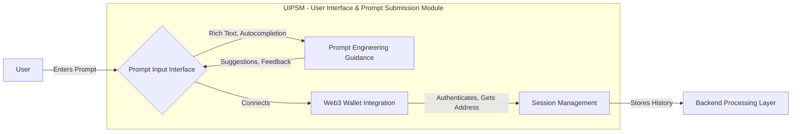
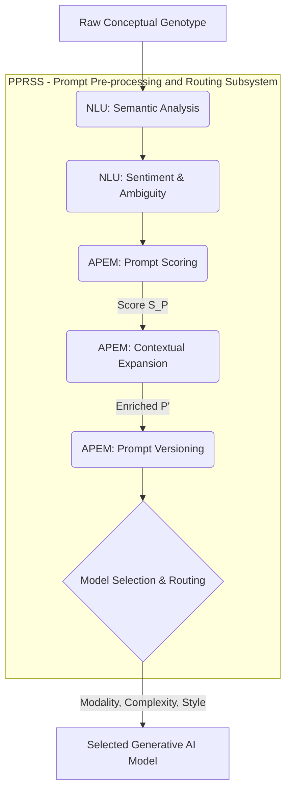
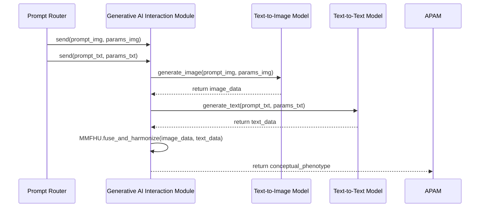
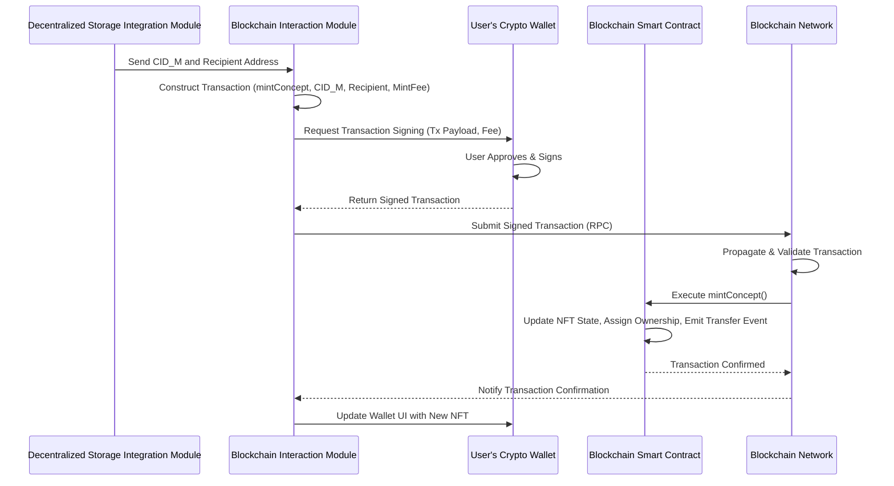
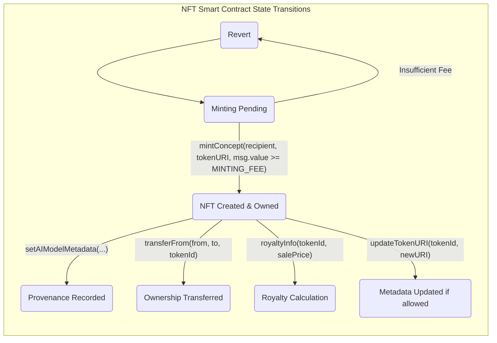
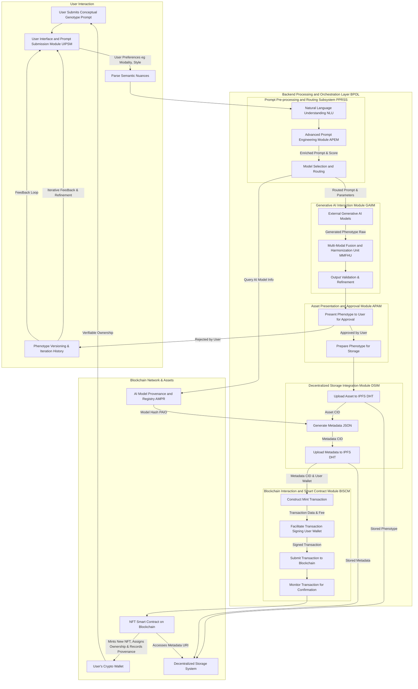
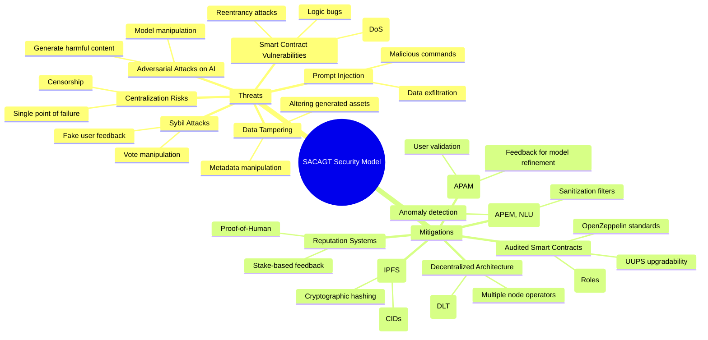
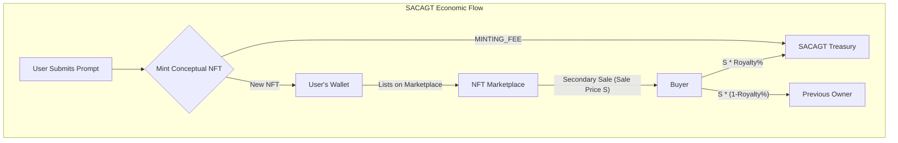

**Title of Invention:** System and Method for Algorithmic Conceptual Asset Genesis and Tokenization (SACAGT)

**Abstract:**
A technologically advanced system is herein delineated for the automated generation and immutable tokenization of novel conceptual constructs. A user-initiated abstract linguistic prompt, conceptualized as a "conceptual genotype," is transmitted to a sophisticated ensemble of generative artificial intelligence (AI) models. These models, leveraging advanced neural architectures, transmute the abstract genotype into a tangible digital artifact, herein termed a "conceptual phenotype," which may manifest as a high-fidelity image, a detailed textual schema, a synthetic auditory composition, or a three-dimensional volumetric data structure. Subsequent to user validation and approval, the SACAGT system orchestrates the cryptographic registration and permanent inscription of this AI-generated conceptual phenotype, alongside its progenitor prompt and verifiable AI model provenance, as a Non-Fungible Token (NFT) upon a distributed ledger technology (DLT) framework. This process establishes an irrefutable, cryptographically secured, and perpetually verifiable chain of provenance, conferring undeniable ownership of a unique, synergistically co-created human-AI conceptual entity. This invention fundamentally redefines the paradigms of intellectual property generation and digital asset ownership, extending beyond mere representation of existing assets to encompass the genesis and proprietary attribution of emergent conceptual entities.

**Background of the Invention:**
Conventional methodologies for Non-Fungible Token (NFT) instantiation predominantly involve the tokenization of pre-existing digital assets, such as digital artworks, multimedia files, or collectible representations, which have been independently created prior to their integration with a distributed ledger. This bifurcated operational paradigm, characterized by a distinct separation between asset creation and subsequent tokenization, introduces several systemic inefficiencies and conceptual limitations. Primarily, it necessitates disparate workflows, often managed by different entities or technological stacks, thereby impeding a seamless transition from ideation to verifiable digital ownership. Furthermore, existing frameworks are not inherently designed to accommodate the nascent concept itself as the primary object of tokenization, particularly when that concept originates from an abstract, non-physical prompt. The prevalent model treats the digital asset as a mere wrapper for an already formed idea, rather than facilitating the genesis of the idea itself within the tokenization pipeline.

A significant lacuna exists within the extant digital asset ecosystem concerning the integrated and automated generation, formalization, and proprietary attribution of purely conceptual or "dream-like" artifacts. Such artifacts, often ephemeral in their initial conception, necessitate a robust, verifiable mechanism for their transformation into persistent, ownable digital entities. The absence of an integrated system capable of bridging the cognitive gap between abstract human ideation and its concrete digital representation, followed by immediate and verifiable tokenization, represents a critical impediment to the comprehensive expansion of digital intellectual property domains. This invention addresses this fundamental unmet need by pioneering a seamless, end-to-end operational continuum where the act of creative generation, specifically through advanced artificial intelligence, is intrinsically intertwined with the act of immutable tokenization, thereby establishing a novel frontier for digital ownership.

**Brief Summary of the Invention:**
The present invention, herein formally designated as the **System for Algorithmic Conceptual Asset Genesis and Tokenization SACAGT**, establishes an advanced, integrated framework for the programmatic generation and immutable inscription of novel conceptual assets as Non-Fungible Tokens NFTs. The SACAGT system provides an intuitive and robust interface through which a user can furnish an abstract linguistic prompt, functioning as a "conceptual genotype" eg "A subterranean metropolis illuminated by bio-luminescent flora," or "The symphony of a dying star translated into kinetic sculpture".

Upon receipt of the user's conceptual genotype, the SACAGT system initiates a highly sophisticated, multi-stage generative process:
1.  **Semantic Decomposition and Intent Recognition:** The input prompt undergoes advanced natural language processing NLP to parse semantic nuances, identify key thematic elements, and infer user intent, potentially routing the prompt to specialized generative AI models. This stage includes an Advanced Prompt Engineering Module APEM for scoring, augmentation, and versioning of prompts.
2.  **Algorithmic Conceptual Phenotype Generation:** The processed prompt is then transmitted to a meticulously selected ensemble of one or more generative AI models eg advanced text-to-image diffusion models such as a proprietary AetherVision architecture, text-to-text generative transformers like a specialized AetherScribe, or even nascent text-to-3D synthesis engines like AetherVolumetric. These models leverage high-dimensional latent space traversal and sophisticated inference mechanisms to produce a digital representation the "conceptual phenotype" which concretizes the abstract user prompt. This phenotype can be a high-resolution image, a richly detailed textual narrative, a synthetic soundscape, or a parametric 3D model. A Multi-Modal Fusion and Harmonization Unit MMFHU ensures cross-modal consistency for complex outputs.
3.  **User Validation and Iterative Refinement:** The generated conceptual phenotype is presented to the originating user via a dedicated interface for critical evaluation and approval. The system incorporates mechanisms for iterative refinement, allowing the user to provide feedback that can guide subsequent AI regeneration cycles, optimizing the phenotype's alignment with the original conceptual genotype. Phenotype versions are tracked.
4.  **Decentralized Content Addressable Storage:** Upon explicit user approval, the SACAGT system automatically orchestrates the secure and decentralized storage of the conceptual phenotype. This involves uploading the digital asset to a robust, content-addressed storage network, such as the InterPlanetary File System IPFS or similar distributed hash table DHT based architectures. This process yields a unique, cryptographic content identifier CID that serves as an immutable, globally verifiable pointer to the asset.
5.  **Metadata Manifestation and Storage:** Concurrently, a standardized metadata manifest, typically conforming to established NFT metadata schema eg ERC-721 or ERC-1155 compliant JSON, is programmatically constructed. This manifest encapsulates critical information, including the conceptual phenotype's name, the original conceptual genotype, verifiable AI model provenance, and a URI reference to the asset's decentralized storage CID. This metadata file is itself uploaded to the same decentralized storage network, yielding a second, distinct CID.
6.  **Immutable Tokenization on a Distributed Ledger:** The system then orchestrates a transaction invoking a `mint` function on a pre-deployed, audited, and highly optimized NFT smart contract residing on a chosen distributed ledger technology eg Ethereum, Polygon, Solana, Avalanche. This transaction immutably records the user's wallet address as the owner, and crucially, embeds the decentralized storage URI of the metadata manifest. This action creates a new, cryptographically unique Non-Fungible Token, where the token's identity and provenance are intrinsically linked to the AI-generated conceptual phenotype and its originating prompt. The smart contract incorporates EIP-2981 royalty standards and advanced access control.
7.  **Proprietary Attribution and Wallet Integration:** Upon successful confirmation of the transaction on the distributed ledger, the newly minted NFT, representing the unique, AI-generated conceptual entity, is verifiably transferred to the user's designated blockchain wallet address. This process irrevocably assigns proprietary attribution to the user, providing an irrefutable, timestamped record of ownership.

This seamless, integrated workflow ensures that the generation of a novel concept by AI and its subsequent tokenization as an ownable digital asset are executed within a single, coherent operational framework, thereby establishing a new paradigm for intellectual property creation and digital asset management.

### System Architecture Overview

```mermaid
C4Context
    title System for Algorithmic Conceptual Asset Genesis and Tokenization SACAGT

    Person(user, "End User", "Interacts with SACAGT to generate and mint conceptual NFTs.")
    System(sacagt, "SACAGT Core System", "Orchestrates AI generation, storage, and blockchain interaction.")

    System_Ext(generativeAI, "Generative AI Models", "External AI services eg AetherVision, AetherScribe that generate digital assets from prompts.")
    System_Ext(decentralizedStorage, "Decentralized Storage Network", "Stores digital assets and metadata eg IPFS.")
    System_Ext(blockchainNetwork, "Blockchain Network", "Distributed ledger for NFT minting and ownership records eg Ethereum, Polygon, Solana.")
    System_Ext(userWallet, "User's Crypto Wallet", "Manages user's blockchain address and NFTs.")
    System_Ext(externalDataSources, "External Data Sources", "Knowledge bases, style guides, or other data for prompt enhancement.")
    System_Ext(aiModelRegistry, "AI Model Registry", "On-chain or off-chain database of AI models and their provenance.")


    Rel(user, sacagt, "Submits text prompts and approves generated assets")
    Rel(sacagt, generativeAI, "Sends prompts for asset generation", "API Call eg gRPC REST")
    Rel(generativeAI, sacagt, "Returns generated digital asset", "Binary Data JSON")
    Rel(sacagt, decentralizedStorage, "Uploads generated asset and metadata", "HTTP IPFS Client")
    Rel(decentralizedStorage, sacagt, "Returns Content Identifiers CIDs")
    Rel(sacagt, blockchainNetwork, "Submits NFT minting transaction", "Web3 RPC")
    Rel(blockchainNetwork, userWallet, "Transfers minted NFT ownership")
    Rel(user, userWallet, "Manages ownership of minted NFTs")
    Rel(sacagt, externalDataSources, "Queries for prompt augmentation", "API Call")
    Rel(sacagt, aiModelRegistry, "Registers AI models and retrieves provenance data", "API Call")

    Note right of sacagt: The SACAGT Core System encompasses multiple modules for seamless operation.
    Note left of generativeAI: May include proprietary or public models.
    Note right of blockchainNetwork: Also handles smart contract interaction.
```

**Detailed Description of the Invention:**

The **System for Algorithmic Conceptual Asset Genesis and Tokenization SACAGT** comprises a highly integrated and modular architecture designed to facilitate the end-to-end process of generating novel conceptual assets via artificial intelligence and subsequently tokenizing them on a distributed ledger. The operational flow, from user input to final token ownership, is meticulously engineered to ensure robust functionality, security, and verifiability.

### 1. User Interface and Prompt Submission Module UIPSM

The initial interaction point for a user is through the **User Interface and Prompt Submission Module UIPSM**. This module is architected to provide an intuitive and responsive experience, allowing users to articulate their abstract conceptual genotypes.

*   **Prompt Input Interface:** A dynamic text entry field, potentially supporting rich text formatting and character limits, where users articulate their conceptual genotype. Advanced versions may include:
    *   **Semantic Autocompletion:** Suggesting keywords, concepts, or stylistic modifiers to enhance prompt efficacy. This can be modeled as a conditional probability `P(t_{n+1}|t_1, ..., t_n, C)` where `C` is context.
    *   **Prompt Engineering Guidance:** Providing real-time feedback on prompt clarity, specificity, and potential for generative AI interpretation. Feedback can be expressed as a gradient `∇S_P` where `S_P` is prompt score.
    *   **Multi-Modal Prompting:** Interfaces for incorporating existing visual, auditory, or textual components as contextualizers or stylistic guides for the generative AI. Let `P_MM = {P_text, P_img, P_audio}` be a multi-modal prompt, where `P_img` could be a feature vector `v_img`.
*   **User Authentication and Wallet Connection:** Integration with standard Web3 wallet providers eg MetaMask, WalletConnect to authenticate the user and establish a secure connection to their blockchain address, which will serve as the recipient for minted NFTs. Authentication involves cryptographic signatures `Sig(Message, PrivateKey)`.
*   **Session Management:** Persistent session tracking to allow users to review past prompts, generated assets, and transaction histories. Session state `S_session = {user_id, active_prompts, history_tx}`.



### 2. Backend Processing and Orchestration Layer BPOL

The **Backend Processing and Orchestration Layer BPOL** serves as the central nervous system of the SACAGT system, coordinating all subsequent operations.

#### 2.1. Prompt Pre-processing and Routing Subsystem PPRSS

Upon receiving a conceptual genotype from the UIPSM, the PPRSS performs several critical functions:

*   **Natural Language Understanding NLU:** Utilizes advanced transformer-based models eg specialized BERT or GPT variants to analyze the prompt for:
    *   **Syntactic and Semantic Analysis:** Decomposing the prompt into its grammatical components and identifying core semantic entities, relationships, and attributes. This involves parsing `P` into a dependency tree `T_P` or a semantic graph `G_S`. The semantic vector `v_P = E(P)` is further analyzed by a relation extraction module `R_E(v_P) -> {(entity_1, relation, entity_2)}`.
    *   **Sentiment and Tone Analysis:** Assessing the emotional context of the prompt to guide generative AI style. Let `S_tone(v_P) ∈ [-1, 1]` be the sentiment score.
    *   **Ambiguity Resolution:** Employing contextual reasoning to minimize misinterpretation by generative models. This involves computing `P(disambiguation | v_P, Context)` over possible interpretations.
*   **Advanced Prompt Engineering Module APEM:** This dedicated sub-module enhances the raw conceptual genotype.
    *   **Prompt Scoring Engine:** Evaluates the prompt's quality, specificity, and potential for generating desired outcomes, providing feedback to the user. Scores may be based on statistical rarity, semantic density, or similarity to high-performing prompts. The score `S_P = f_score(v_P, {historical_successes})` is a non-linear function. The objective is to maximize `S_P`.
    *   **Dynamic Contextual Expansion:** Leverages internal knowledge graphs `K`, external databases, or large language models to expand vague prompts into more descriptive or structured formats, enhancing the generative AI's input quality. This can involve adding relevant details, synonyms, or stylistic modifiers. `P' = Augment(P, K, E(P), S_P)`. The expansion can add tokens `p_k+1, ..., p_m` to the original sequence.
    *   **Prompt Versioning and History:** Maintains a version history of refined prompts, allowing users to revert to previous iterations or explore branches of prompt evolution. Let `P_j` be version `j`, derived from `P_{j-1}`.
*   **Model Selection and Routing:** Based on the NLU analysis, APEM output, and user-specified preferences eg desired output modality: image, text, 3D, the PPRSS intelligently routes the prompt to the most appropriate external Generative AI Model. This routing may involve:
    *   **Modality Mapping:** Directing image-oriented prompts to `G_img`, narrative prompts to `G_txt`, etc. Let `M_preferred ∈ {Image, Text, 3D, Audio}`.
    *   **Complexity-Based Routing:** Allocating complex, high-detail prompts to more powerful and potentially more resource-intensive AI models. `Route(P') = argmax_{G_AI} (Compatibility(P', G_AI) * Resource_Efficiency(G_AI))` where `Compatibility` is a function of `S_P` and `C_P` (prompt complexity).
    *   **Style-Based Routing:** Directing prompts seeking specific artistic or literary styles to specialized AI fine-tuned for those aesthetics. `G_AI_selected = Select(v_P, M_preferred, S_tone(v_P))`.



#### 2.2. Generative AI Interaction Module GAIIM

The GAIIM acts as the interface between the SACAGT system and external, specialized generative AI models.

*   **API Abstraction Layer:** Provides a unified interface for interacting with diverse AI model APIs, abstracting away model-specific idiosyncrasies. This facilitates integration of various models such as:
    *   **Text-to-Image Models eg AetherVision:** Advanced diffusion or GAN-based architectures capable of synthesizing high-fidelity visual imagery from textual descriptions. These models operate in high-dimensional latent spaces, iteratively refining pixel data to match semantic cues. For diffusion, `x_t = sqrt(α_t) x_0 + sqrt(1 - α_t) ε` where `x_0` is image, `ε` is noise, `α_t` noise schedule. The reverse process `x_{t-1} = D(x_t, t, v_P)` where `D` is the denoising network.
    *   **Text-to-Text Models eg AetherScribe:** Large Language Models LLMs specialized in creative writing, narrative generation, poetry, or detailed conceptual descriptions, expanding the initial prompt into rich textual conceptual phenotypes. Next token probability `P(token_{i+1} | tokens_{<=i}, v_P)`. The output sequence `a = {w_1, ..., w_L}` maximizes `log P(a | v_P)`.
    *   **Text-to-3D Models eg AetherVolumetric:** Emerging models capable of generating 3D meshes, point clouds, or volumetric data representations from textual prompts, enabling the creation of virtual objects. This often involves implicit neural representations `f(x,y,z) -> (density, color)`.
    *   **Text-to-Audio/Music Models:** Generating soundscapes or musical compositions. Fourier transform `X(ω) = ∫ x(t)e^(-iωt) dt`.
*   **Parameter Management:** Manages and transmits model-specific parameters eg `sampling_steps`, `guidance_scale`, `seed` values for deterministic regeneration, `output_resolution` to the AI models. Let `θ_gen = {sampling_steps, guidance_scale, seed, resolution}`. The generation is `a = G_AI(v_P, θ_gen)`. A specific seed `s` makes `G_AI(v_P, θ_gen_s)` deterministic for that `s`.
*   **Asynchronous Inference Handling:** Manages the potentially long-running inference processes of generative AIs, providing status updates to the user. `Status(Job_ID) ∈ {PENDING, PROCESSING, COMPLETED, FAILED}`.
*   **Output Reception and Validation:** Receives the generated digital asset conceptual phenotype from the AI model and performs initial validation eg file format verification, basic content integrity checks. Hash validation `H(a_received) == H(a_expected_from_AI_server_checksum)`.
*   **Multi-Modal Fusion and Harmonization Unit MMFHU:** For conceptual genotypes requiring multiple modalities or complex interactions, this unit combines outputs from different generative AI models.
    *   **Cross-Modal Consistency Validation:** Ensures that outputs from different modalities eg an image and a descriptive text maintain semantic coherence and stylistic alignment. Utilizes AI models to assess the "fit" between disparate modalities. `Loss_consistency = D_semantic(E_img(a_img), E_txt(a_txt))` where `D_semantic` is a semantic distance.
    *   **Fusion Algorithms:** Employs techniques to merge and interleave various digital assets, creating a holistic multi-modal conceptual phenotype eg synchronizing an AI-generated soundscape with a generated animation. `a_fused = F_fuse({a_img, a_txt, a_audio}, weights_fusion)`. Fusion weights `w_k` can be optimized `sum(w_k) = 1`.



#### 2.3. Asset Presentation and Approval Module APAM

The APAM is responsible for displaying the generated conceptual phenotype to the user and managing their approval.

*   **High-Fidelity Rendering:** Presents the digital asset image, text, 3D model preview, audio playback in a clear and engaging manner within the UIPSM. `Render(a) -> Display_Output`.
*   **Approval/Rejection Mechanism:** Provides explicit controls for the user to approve the asset for minting or reject it, potentially triggering a re-generation loop with refined parameters or prompt adjustments. `User_Decision ∈ {APPROVE, REJECT, REFINE}`.
*   **Phenotype Versioning and Iteration History:** Stores a record of all generated phenotypes for a given conceptual genotype, allowing users to compare iterations and select the most desirable version for minting. Each version is associated with its unique generation parameters and prompt modifications. Let `V_P = { (a_j, θ_gen_j, P_j', H_P_j, S_P_j) }` be the set of versions.
*   **User Feedback Analysis and Reinforcement Learning Module:** Allows users to provide detailed feedback eg rating, textual comments, selection of preferred elements on generated assets. This feedback is processed by a specialized AI module to:
    *   Improve future prompt augmentation strategies within the APEM. `P'_{k+1} = APEM_update(P_k', Feedback_k)`.
    *   Fine-tune internal SACAGT routing algorithms. `Routing_Algo_new = RL_update(Routing_Algo_old, User_Decision, Reward_Signal)`.
    *   Potentially provide direct reinforcement signals to the generative AI models for adaptive learning and personalization. `R_feedback(a, P) = (User_Rating * f_quality(a)) - (Cost_of_Generation)`. This can be used in Reinforcement Learning from Human Feedback (RLHF) to optimize `G_AI` by maximizing `E[R_feedback(G_AI(v_P), P)]`.

```mermaid
stateDiagram-v2
    state "Initial Prompt" as S0
    state "Generate Phenotype (AI)" as S1
    state "Present to User" as S2
    state "User Review" as S3
    state "Refine Prompt" as S4
    state "Phenotype Approved" as S5
    state "Minting Process" as S6
    S0 --> S1 : Conceptual Genotype
    S1 --> S2 : Conceptual Phenotype
    S2 --> S3 : Display
    S3 --> S4 : Reject / Provide Feedback
    S3 --> S5 : Approve
    S4 --> S1 : New Prompt / Parameters
    S5 --> S6 : Initiate Mint
    S6 --> [*] : NFT Minted
    state "Iteration Loop" {
        S1 --> S2
        S2 --> S3
        S3 --> S4
        S4 --> S1
    }
```

#### 2.4. Decentralized Storage Integration Module DSIM

Upon user approval, the DSIM handles the secure and verifiable storage of the conceptual phenotype and its associated metadata.

*   **Asset Upload to IPFS/DHT:**
    *   The digital asset eg `conceptual_phenotype.png` is segmented into cryptographic chunks and uploaded to a decentralized storage network such as IPFS. The asset `a` is broken into chunks `c_1, c_2, ..., c_m`.
    *   This process generates a unique **Content Identifier CIDv1**, which is a cryptographically derived hash of the asset's content. This CID serves as an immutable, globally resolvable address for the asset, ensuring data integrity and resistance to censorship. `CID_a = H_multihash(Serialize(a))`. The multihash `H_multihash` typically includes the hashing algorithm `code` and length `len`, e.g., `cid = varint_encode(code) || varint_encode(len) || hash_digest`.
    *   The CID format is typically `bafy...`, a multihash encoding that includes the hashing algorithm and length.
*   **Metadata JSON Generation:** A JSON object is programmatically constructed, adhering to established NFT metadata standards eg ERC-721 Metadata JSON Schema. This JSON includes:
    *   `name`: A human-readable name for the conceptual NFT, potentially derived from the original prompt or an AI-generated title. `N = AI_Generate_Title(v_P)`.
    *   `description`: The original user prompt conceptual genotype and/or an AI-generated descriptive expansion. `D = P || AI_Elaborate(a)`.
    *   `image`: The `ipfs://<asset_CID>` URI pointing directly to the stored conceptual phenotype. `URI_a = "ipfs://" + CID_a`.
    *   `attributes`: An array of key-value pairs representing additional metadata, such as:
        *   `AI_Model`: The specific generative AI model used eg "AetherVision v3.1". `Model_Name ∈ R.Model_Names`.
        *   `Model_Version`: The exact version of the AI model. `Model_Version = R.get_version(Model_Name)`.
        *   `Model_Hash_PAIO`: A cryptographic hash of the AI model's verifiable parameters or fingerprint, providing **Proof of AI Origin PAIO**. `H_model = R.get_hash_PAIO(Model_Name, Model_Version)`. This could be `H(Model_Architecture_Weights || Training_Hyperparameters)`.
        *   `Creation_Timestamp`: UTC timestamp of asset generation. `T_UTC = Current_Timestamp()`.
        *   `Original_Prompt_Hash`: A cryptographic hash of the original text prompt. `H_P = H(P)`.
        *   `Prompt_Entropy`: A measure of the informational complexity of the original prompt. `H_P_entropy = - sum_{p_i in P} log_2 P(p_i | P_{<i}, M_lang)`.
        *   `Style_Tags`: AI-inferred stylistic attributes. `Style_Vector = Classify_Style(a)`.
        *   `Phenotype_Version`: Denotes the iteration number of the generated asset. `j`.
    *   `external_url`: Optional A link to a SACAGT platform page for the NFT.
*   **Metadata Upload to IPFS/DHT:** The generated metadata JSON file is itself uploaded to the decentralized storage network, yielding a second, distinct **Metadata CID**. This CID forms the crucial link that the smart contract will store. `CID_M = H_multihash(Serialize(M))`.

```mermaid
graph LR
    A[Approved Phenotype] --> B(Serialize Phenotype)
    B --> C{Chunking & Hashing}
    C --> D[Generate Asset CID (CID_a)]
    D --> E(Upload Chunks to IPFS/DHT)
    A --> F[Gather Metadata Attributes]
    F --> G(Generate Metadata JSON M)
    G -- includes URI pointing to CID_a --> H{Serialize Metadata & Hash}
    H --> I[Generate Metadata CID (CID_M)]
    I --> J(Upload M to IPFS/DHT)
    J --> K[Return CID_M for Blockchain Minting]
    subgraph DSIM - Decentralized Storage Integration Module
        B & C & D & E & F & G & H & I & J & K
    end
```

### 3. Blockchain Interaction and Smart Contract Module BISCM

The BISCM is responsible for constructing, signing, and submitting transactions to the blockchain to mint the NFT and for managing the smart contract lifecycle.

*   **Smart Contract Abstraction Layer:** Interacts with a pre-deployed, audited NFT smart contract, typically implementing the ERC-721 Non-Fungible Token Standard or ERC-1155 Multi Token Standard interface.
    *   **ERC-721 `mintConcept(address recipient, string memory tokenURI)`:** This core function is invoked. `recipient` is the user's wallet address, and `tokenURI` is the `ipfs://<metadata_CID>` URI. The call is `tx_data = encode_function_call("mintConcept", [recipient, tokenURI])`.
    *   **EIP-2981 Royalty Standard:** The smart contract incorporates logic for programmatic royalty distribution on secondary sales, as defined by EIP-2981. The BISCM ensures royalty information eg receiver address and percentage is correctly configured for each mint. `royalty_info(tokenId, salePrice) -> (receiver, royaltyAmount)`. `royaltyAmount = (salePrice * royalty_percentage) / 10000`.
    *   **On-chain Licensing Framework:** Potential future integration for attaching specific licensing terms directly to the NFT metadata or through a linked smart contract. `License_URI = ipfs://CID_License`.
*   **Transaction Construction:**
    *   Prepares a blockchain transaction by encoding the `mintConcept` function call with the appropriate parameters user's wallet address, the `ipfs://<metadata_CID>`, and potentially a minting fee. `Tx = { from: user_addr, to: contract_addr, value: MINTING_FEE, data: tx_data, gasLimit: G_limit, gasPrice: G_price }`.
    *   Estimates gas costs for the transaction. `G_limit_estimate = estimateGas(Tx)`.
*   **Transaction Signing:** Leverages the user's connected wallet via Web3 providers to cryptographically sign the transaction. The SACAGT system never has direct access to the user's private keys. `Signed_Tx = sign(Tx, User_PrivateKey)`. This uses elliptic curve digital signature algorithm (ECDSA) `(r, s, v) = ECDSA_sign(hash(Tx), PrivateKey)`.
*   **Transaction Submission:** Transmits the signed transaction to the chosen blockchain network via a secure RPC Remote Procedure Call endpoint. `RPC_Call("eth_sendRawTransaction", [Signed_Tx])`.
*   **Transaction Monitoring and Confirmation:** Monitors the blockchain for the confirmation of the transaction. Once confirmed ie included in a block and sufficiently deep in the chain to be considered final, the NFT is officially minted and owned by the user. The SACAGT system updates its internal state and notifies the user. `Confirmation_Depth >= k_min`. Event `Transfer(0x0, recipient, tokenId)` signifies creation.



### 4. Smart Contract Architecture for SACAGT NFTs

The core of the tokenization process resides within a meticulously engineered smart contract deployed on a blockchain. This contract adheres to the ERC-721 standard, ensuring interoperability with the broader NFT ecosystem, and integrates advanced features for security, provenance, and monetization.

```mermaid
classDiagram
    direction LR
    class IERC721 {
        <<interface>>
        +balanceOf(address owner): uint256
        +ownerOf(uint256 tokenId): address
        +approve(address to, uint256 tokenId): void
        +getApproved(uint256 tokenId): address
        +setApprovalForAll(address operator, bool approved): void
        +isApprovedForAll(address owner, address operator): bool
        +transferFrom(address from, address to, uint256 tokenId): void
        +safeTransferFrom(address from, address to, uint256 tokenId): void
        +tokenURI(uint256 tokenId): string
        <<event>> Transfer(address indexed from, address indexed to, uint256 indexed tokenId)
        <<event>> Approval(address indexed owner, address indexed approved, uint256 indexed tokenId)
        <<event>> ApprovalForAll(address indexed owner, address indexed operator, bool approved)
    }

    class IERC721Metadata {
        <<interface>>
        +name(): string
        +symbol(): string
    }

    class IERC721Enumerable {
        <<interface>>
        +totalSupply(): uint256
        +tokenByIndex(uint256 index): uint256
        +tokenOfOwnerByIndex(address owner, uint256 index): uint256
    }

    class IERC2981Royalties {
        <<interface>>
        +royaltyInfo(uint256 tokenId, uint256 salePrice): tuple
    }

    class Context {
        <<abstract>>
        -_msgSender(): address
        -_msgData(): bytes
    }

    class ERC165 {
        <<abstract>>
        +supportsInterface(bytes4 interfaceId): bool
    }

    class ERC721 {
        <<abstract>>
        -_owners: mapping(uint256 => address)
        -_tokenApprovals: mapping(uint256 => address)
        -_operatorApprovals: mapping(address => mapping(address => bool))
        -_name: string
        -_symbol: string
        -_baseURI(): string
    }

    class ERC721URIStorage {
        <<abstract>>
        -_tokenURIs: mapping(uint256 => string)
        +tokenURI(uint256 tokenId): string
        -_setTokenURI(uint256 tokenId, string memory _tokenURI): void
    }

    class Ownable {
        <<abstract>>
        -_owner: address
        +owner(): address
        +renounceOwnership(): void
        +transferOwnership(address newOwner): void
    }

    class AccessControl {
        <<abstract>>
        -_roles: mapping(bytes32 => mapping(address => bool))
        +hasRole(bytes32 role, address account): bool
        +getRoleAdmin(bytes32 role): bytes32
        +grantRole(bytes32 role, address account): void
        +revokeRole(bytes32 role, address account): void
        +renounceRole(bytes32 role, address account): void
    }

    class ERC2981Base {
        <<abstract>>
        -_royaltyFee: uint96
        -_royaltyReceiver: address
        +setRoyaltyInfo(address receiver, uint96 feeBasisPoints): void
    }

    class Pausable {
        <<abstract>>
        -_paused: bool
        +paused(): bool
        +unpause(): void
        +unpause(): void
    }

    class UUPSUpgradeable {
        <<abstract>>
        +proxiableUUID(): bytes32
        -_authorizeUpgrade(address newImplementation): void
        -_upgradeToAndCall(address newImplementation, bytes memory data, bool forceCall): void
    }

    class SACAGT_NFT_Contract {
        <<ERC721-compliant>>
        -uint256 _nextTokenId
        +MINTER_ROLE: bytes32
        +PAUSER_ROLE: bytes32
        +UPGRADER_ROLE: bytes32
        -uint256 MINTING_FEE
        -mapping(uint256 => tuple) _aiModelMetadata // Stores PAIO data
        +constructor(string name_, string symbol_): void
        +mintConcept(address recipient, string memory _tokenURI) payable: uint256
        +updateTokenURI(uint256 tokenId, string memory newTokenURI): void
        +setAIModelMetadata(uint256 tokenId, string memory aiModel, string memory promptHash, string memory promptEntropy, string memory modelHashPAIO): void
        +getAIModelMetadata(uint256 tokenId): tuple
        +setMintingFee(uint256 newFee): void
        +withdrawFunds(): void
        +supportsInterface(bytes4 interfaceId): bool
        +getMintingFee(): uint256
        +tokenURI(uint256 tokenId): string
        +royaltyInfo(uint256 tokenId, uint256 salePrice): tuple
        +supportsRoyalties(): bool
        +setApprovalForAIModelRegistry(address registryAddress, bool approved): void // To link with AMPR
    }

    Context <|-- ERC721
    ERC165 <|-- ERC721
    IERC721 <|.. ERC721
    IERC721Metadata <|.. ERC721
    ERC721 <|-- ERC721URIStorage
    Context <|-- Ownable
    Context <|-- Pausable
    Context <|-- AccessControl
    ERC165 <|-- AccessControl
    ERC165 <|-- ERC2981Base
    IERC2981Royalties <|.. ERC2981Base
    ERC165 <|-- UUPSUpgradeable
    Context <|-- UUPSUpgradeable

    ERC721URIStorage <|-- SACAGT_NFT_Contract
    Ownable <|-- SACAGT_NFT_Contract
    Pausable <|-- SACAGT_NFT_Contract
    AccessControl <|-- SACAGT_NFT_Contract
    ERC2981Base <|-- SACAGT_NFT_Contract
    UUPSUpgradeable <|-- SACAGT_NFT_Contract
    IERC721Enumerable <|.. SACAGT_NFT_Contract
    Note for SACAGT_NFT_Contract "This contract implements ERC721, ERC721URIStorage, ERC2981, Ownable, Pausable, AccessControl and UUPSUpgradeable standards."
```

**Key Smart Contract Features:**

*   **`mintConcept(address recipient, string memory _tokenURI) payable`:** This is the core function invoked by the BISCM. It takes the target owner's address, the `ipfs://<metadata_CID>` as parameters, and a `msg.value` for the minting fee. It increments a unique `_nextTokenId`, creates a new NFT with this ID, assigns ownership to the `recipient`, and permanently associates the `_tokenURI` with the token. The internal state `_owners[tokenId] = recipient` and `_tokenURIs[tokenId] = _tokenURI` is updated.
*   **Access Control and Roles:** Implementation of roles `MINTER_ROLE`, `PAUSER_ROLE`, `UPGRADER_ROLE` using OpenZeppelin's `AccessControl` library to restrict critical functions like `mintConcept` to authorized backend components or multisig wallets, and `pause`/`unpause` to designated operators, enhancing security. The `DEFAULT_ADMIN_ROLE` can manage these roles. `require(hasRole(MINTER_ROLE, msg.sender), "Caller not minter");`.
*   **Upgradability UUPS Proxy:** Implemented using the UUPS Universal Upgradeable Proxy Standard pattern to allow future enhancements or bug fixes to the contract logic without altering the token IDs, ownership structure, or tokenURI mappings. This ensures the longevity and adaptability of the conceptual assets. The `proxiableUUID()` function returns `bytes32(keccak256("org.openzeppelin.contracts.proxy.UUPSUpgradeable"))`.
*   **EIP-2981 Royalty Standard:** Full compliance with the ERC-2981 NFT Royalty Standard, allowing creators and the SACAGT platform to define and receive programmatic royalties on secondary sales. The `royaltyInfo` function returns the receiver and royalty amount based on a sale price. `royaltyAmount = (salePrice * _royaltyFee) / 10000;`.
*   **Minting Fee and Treasury Management:** The `mintConcept` function is `payable`, requiring a `MINTING_FEE` to be sent with the transaction. This fee can be adjusted by the `OWNER_ROLE` via `setMintingFee`, and collected by the `OWNER_ROLE` via `withdrawFunds`. This mechanism funds the operation and development of the SACAGT platform. `require(msg.value >= MINTING_FEE, "Insufficient minting fee");`.
*   **AI Model Provenance Data Storage:** A dedicated internal mapping `_aiModelMetadata` allows for recording critical verifiable information about the generative AI model used for each specific `tokenId`, including the `modelHashPAIO`, model version, and prompt entropy. This enhances transparency and provenance of AI-generated content. `_aiModelMetadata[tokenId] = (aiModel, promptHash, promptEntropy, modelHashPAIO)`.
*   **Metadata Immutability:** While the `_tokenURI` typically points to an immutable IPFS CID, the contract itself may offer a controlled `updateTokenURI` function, restricted to the token owner or an authorized entity, for scenarios requiring dynamic metadata updates eg evolving AI models, game integration. However, for core conceptual assets, strict immutability of the initial metadata URI is preferred. `function updateTokenURI(uint256 tokenId, string memory newTokenURI) public virtual { require(_isApprovedOrOwner(msg.sender, tokenId), "ERC721URIStorage: caller is not token owner or approved"); _setTokenURI(tokenId, newTokenURI); }`.
*   **Energy Efficiency:** Optimized Solidity code to minimize gas consumption during minting, promoting cost-effectiveness and network sustainability. This is achieved by careful choice of data types, avoiding unnecessary storage writes, and optimizing loop structures.



### 5. AI Model Provenance and Registry AMPR

The **AI Model Provenance and Registry AMPR** is a critical component ensuring transparency and verifiability of the generative AI models used within SACAGT.

*   **Purpose:** To provide a decentralized, tamper-proof record of the generative AI models that produce conceptual phenotypes. This addresses concerns around AI black boxes and establishes trust in the origin of AI-generated content.
*   **Structure:** The AMPR can exist as:
    *   An on-chain smart contract, mapping a unique `modelId` to its verifiable details. `mapping(bytes32 => ModelInfo)` where `ModelInfo` is a struct.
    *   A decentralized database eg built on IPFS or Filecoin, with hashes stored on-chain. `modelId -> ipfs://CID_Model_Info`.
*   **Registered Attributes per Model:**
    *   `modelId`: Unique identifier for the AI model. `bytes32 modelId = keccak256(abi.encodePacked(modelName, modelVersion))`.
    *   `modelName`: eg "AetherVision v3.1".
    *   `modelVersion`: Specific software version. `uint256 version`.
    *   `trainingDataHash`: A cryptographic hash of the training dataset used, if verifiable. `bytes32 H_train_data = H(Training_Dataset)`.
    *   `architectureHash`: A hash of the model's architecture or configuration. `bytes32 H_arch = H(Model_Architecture_Definition)`.
    *   `developerInfo`: Public key or DID of the model developer. `address developerAddress`.
    *   `deploymentTimestamp`: Time of model registration/deployment. `uint256 timestamp`.
    *   `licensingTerms`: Terms under which the model can be used for generation. `string licenseURI`.
*   **Proof of AI Origin PAIO:** During the metadata generation step, the SACAGT system records a `Model_Hash_PAIO` attribute for each NFT. This hash could be:
    *   A hash of the specific AI model's executable/parameters as deployed. `H_model = H(Model_Executable_Binary || Hyperparameters || Weights_Snapshot)`.
    *   A reference to a record in the AMPR, proving which exact model generated the phenotype. `H_model = modelId` as registered in AMPR.
    This provides a strong cryptographic link from the NFT back to the AI that created its underlying conceptual phenotype.
*   **Integration:** The SACAGT_NFT_Contract can include a function `getAIModelMetadata(uint256 tokenId)` to retrieve this on-chain provenance data. The `MINTER_ROLE` or a specialized `AI_REGISTRY_ROLE` would be responsible for updating this metadata for new NFTs.



### 6. Security and Threat Model

The SACAGT system implements a layered security approach to protect against various threats inherent in AI-driven decentralized applications.

*   **Prompt Injection:** Mitigated by advanced NLU and APEM, which analyze prompts for malicious intent or exploitable patterns. A prompt sanitization function `Sanitize(P) -> P_safe`. Detection model `P_attack = Classifier(v_P)`.
*   **Adversarial AI Attacks:** Against generative models, where malicious inputs could cause harmful outputs. MMFHU's validation and user approval act as a human-in-the-loop defense. `L_adversarial = - Loss_GAN(G_AI(v_P_adv), v_P_target)`.
*   **Data Integrity (IPFS):** Guaranteed by content addressing. Any bit flip in the stored asset results in a different CID, making tampering immediately detectable. `CID_tampered != CID_original`.
*   **Smart Contract Vulnerabilities:** Minimized by extensive audits, adherence to OpenZeppelin standards, and an upgradable architecture (UUPS) for quick patching. Formal verification `Verify(Contract_Code)` may be applied.
*   **Sybil Attacks (User Feedback):** Mitigated by reputation systems or proof-of-human mechanisms within the user authentication layer. `User_Reputation(addr) = f(past_feedback_quality, stake_amount)`.
*   **Censorship Resistance:** Achieved by using decentralized storage and blockchain networks. `P_censorship_resistant = 1 - P_central_point_of_failure`.
*   **Economic Exploits:** EIP-2981 ensures fair royalty distribution, reducing incentives for off-chain trading that bypass creators.



### 7. Economic Model and Monetization

The SACAGT system proposes a multifaceted economic model to sustain its operation and incentivize participation.

*   **Minting Fees:** A base fee `MINTING_FEE` is charged per NFT mint, funding platform development and infrastructure. `Platform_Revenue_Mint = sum(MINTING_FEE_i for i in minted_NFTs)`.
*   **Secondary Market Royalties:** EIP-2981 enables programmatic royalties `royalty_percentage` on all secondary sales of SACAGT NFTs. This creates a continuous revenue stream for the original prompt owner and the platform. `Creator_Revenue = sum(SalePrice_k * royalty_percentage_creator)`. `Platform_Revenue_Royalty = sum(SalePrice_k * royalty_percentage_platform)`.
*   **Tiered Access/Subscriptions:** Premium features within the UIPSM or APEM (e.g., higher quality AI models, faster generation, advanced prompt analytics) could be offered on a subscription basis. `Premium_Access_Cost = C_sub_monthly`.
*   **Tokenomics (Future):** A native utility token `SACAGT_TOKEN` could be introduced for:
    *   Governance: `Vote_Weight(Token_Holder) = amount_staked`.
    *   Staking: For enhanced prompt generation priority or higher royalty shares.
    *   Payments: For minting fees or premium services.
    *   Rewards: For providing high-quality feedback or curating conceptual assets.
*   **Developer Ecosystem:** Fees for accessing SACAGT's generative AI models via API for third-party applications. `API_Call_Cost = f(model_complexity, usage_volume)`.



### 8. Legal and Ethical Considerations

The invention addresses several critical legal and ethical dimensions pertinent to AI-generated content.

*   **Intellectual Property Rights:** The SACAGT system explicitly establishes ownership of AI-generated conceptual assets. The `mintConcept` function confers ownership `ownerOf(tokenID)`. The original prompt `P` and AI provenance `H_model` are immutable parts of the NFT metadata, providing strong evidence for intellectual property claims. `P_IPR_valid = f(blockchain_proof, metadata_completeness, licensing_terms)`.
*   **AI Model Bias and Fairness:** Acknowledged. The APEM's NLU and sentiment analysis can flag prompts that might lead to biased outputs. User feedback mechanism `R_feedback` can identify and reduce bias in generated phenotypes over time. `Bias_Metric = |E[a_positive] - E[a_negative]|`.
*   **Transparency and Provenance:** The AMPR provides verifiable proof of the AI model used, its version, and potentially its training data hash. This counters "black box" concerns and enhances trust. `Transparency_Score = f(AMPR_completeness, H_model_accessibility)`.
*   **Licensing and Usage Rights:** The on-chain licensing framework allows creators to define commercial or derivative usage rights, clarifying permissible uses of their conceptual NFTs. `Permissible(action) = Query_License(NFT_ID, action)`.
*   **Environmental Impact:** Consideration for the energy consumption of blockchain transactions (e.g., favoring Proof-of-Stake networks) and AI model inference. `Carbon_Footprint = sum(Energy_Consumption_i * Carbon_Intensity_i)`.

```mermaid
graph TD
    A[SACAGT System] --> B{IPR & Ownership};
    B --> C[NFT on Blockchain];
    C --> D[Immutable Metadata (CID_M)];
    D --> E[AI Model Provenance (H_model in AMPR)];
    D --> F[Original Prompt (H_P)];
    B --> G{Licensing & Usage Rights};
    G --> H[On-chain License Framework (L_terms)];
    A --> I{Ethical AI & Bias};
    I --> J[NLU/APEM Bias Detection];
    I --> K[User Feedback for Bias Reduction];
    A --> L{Transparency & Auditability};
    L --> E;
    L --> F;
```

**Claims:**

1.  A system for generating and tokenizing conceptual assets, comprising:
    a.  A User Interface and Prompt Submission Module UIPSM configured to receive a linguistic conceptual genotype from a user;
    b.  A Backend Processing and Orchestration Layer BPOL configured to:
        i.  Process the linguistic conceptual genotype via a Prompt Pre-processing and Routing Subsystem PPRSS utilizing Natural Language Understanding NLU mechanisms and an Advanced Prompt Engineering Module APEM for prompt scoring and augmentation;
        ii. Transmit the processed conceptual genotype to at least one external Generative AI Model via a Generative AI Interaction Module GAIIM to synthesize a digital conceptual phenotype, potentially incorporating a Multi-Modal Fusion and Harmonization Unit MMFHU for complex outputs;
        iii. Present the digital conceptual phenotype to the user via an Asset Presentation and Approval Module APAM for explicit user validation, incorporating phenotype versioning and user feedback analysis;
        iv. Upon user validation, transmit the digital conceptual phenotype to a Decentralized Storage Integration Module DSIM;
    c.  The Decentralized Storage Integration Module DSIM configured to:
        i.  Upload the digital conceptual phenotype to a content-addressed decentralized storage network to obtain a unique content identifier CID;
        ii. Generate a structured metadata manifest associating the conceptual genotype with the conceptual phenotype's CID and including verifiable Proof of AI Origin PAIO attributes;
        iii. Upload the structured metadata manifest to the content-addressed decentralized storage network to obtain a unique metadata CID;
    d.  A Blockchain Interaction and Smart Contract Module BISCM configured to:
        i.  Construct a transaction to invoke a `mintConcept` function on a pre-deployed Non-Fungible Token NFT smart contract, providing the user's blockchain address, the unique metadata CID, and a minting fee as parameters;
        ii. Facilitate the cryptographic signing of the transaction by the user's blockchain wallet;
        iii. Submit the signed transaction to a blockchain network;
    e.  A Non-Fungible Token NFT smart contract, deployed on the blockchain network, configured to, upon successful transaction execution:
        i.  Immutably create a new NFT, associate it with the provided metadata CID, and assign its ownership to the user's blockchain address;
        ii. Implement EIP-2981 royalty standards for secondary sales;
        iii. Store verifiable AI model provenance data for the minted NFT.

2.  The system of claim 1, wherein the Generative AI Model is selected from the group consisting of a text-to-image model, a text-to-text model, a text-to-3D model, and a text-to-audio model, and is orchestrated by the Multi-Modal Fusion and Harmonization Unit MMFHU for combined outputs, ensuring cross-modal semantic consistency `D_semantic(E_img(a_img), E_txt(a_txt)) < epsilon`.

3.  The system of claim 1, wherein the content-addressed decentralized storage network is the InterPlanetary File System IPFS, utilizing `H_multihash` for content identifiers `CID_a = H_multihash(Serialize(a))`.

4.  The system of claim 1, wherein the NFT smart contract adheres to the ERC-721 token standard or the ERC-1155 token standard, and is implemented as an upgradeable UUPS proxy contract to enable future logic modifications `upgradeToAndCall(newImplementation, data)`.

5.  The system of claim 1, further comprising an Advanced Prompt Engineering Module APEM configured to perform prompt scoring `S_P = f_score(v_P)`, semantic augmentation `P' = Augment(P, K)`, or dynamic contextual expansion of the linguistic conceptual genotype prior to transmission to the Generative AI Model.

6.  The system of claim 1, wherein the structured metadata manifest includes attributes detailing the specific Generative AI Model utilized `Model_Name`, its version `Model_Version`, a cryptographic hash of the model for Proof of AI Origin PAIO `H_model`, a cryptographic hash of the original conceptual genotype `H_P`, and an entropy measure of the conceptual genotype `H_P_entropy`.

7.  A method for establishing verifiable ownership of an AI-generated conceptual asset, comprising:
    a.  Receiving a linguistic conceptual genotype `P` from a user via a user interface;
    b.  Pre-processing the linguistic conceptual genotype including prompt scoring `S_P` and augmentation `P'`;
    c.  Transmitting the linguistic conceptual genotype `P'` to a generative artificial intelligence model `G_AI` to synthesize a digital conceptual phenotype `a = G_AI(v_P', θ_gen)`;
    d.  Presenting the digital conceptual phenotype `a` to the user for explicit approval `User_Decision ∈ {APPROVE, REJECT}`, allowing for iterative refinement and phenotype version tracking `V_P = {a_j}`;
    e.  Upon approval, uploading the digital conceptual phenotype `a` to a content-addressed decentralized storage system to obtain a first unique content identifier `CID_a = H_multihash(Serialize(a))`;
    f.  Creating a machine-readable metadata manifest `M` comprising the linguistic conceptual genotype `P`, verifiable AI model provenance data `H_model`, and a reference `URI_a` to the first unique content identifier `CID_a`;
    g.  Uploading the machine-readable metadata manifest `M` to the content-addressed decentralized storage system to obtain a second unique content identifier `CID_M = H_multihash(Serialize(M))`;
    h.  Initiating a blockchain transaction `Tx` to invoke a minting function `mintConcept` on a pre-deployed Non-Fungible Token smart contract, passing the user's blockchain address `recipient`, the second unique content identifier `CID_M`, and a minting fee `MINTING_FEE` as parameters;
    i.  Facilitating the cryptographic signing of the transaction `Tx` by the user's private key `Signed_Tx = sign(Tx, User_PrivateKey)`;
    j.  Submitting the signed transaction `Signed_Tx` to a blockchain network `BLN`;
    k.  Upon confirmation of the transaction on the blockchain network, irrevocably assigning ownership of the newly minted Non-Fungible Token `token_id`, representing the AI-generated conceptual asset, to the user's blockchain address `recipient`, with EIP-2981 royalties enabled `royalty_info(token_id, salePrice)`.

8.  The method of claim 7, further comprising an iterative refinement step wherein user feedback `Feedback_k` on a presented digital conceptual phenotype `a_k` guides subsequent generative AI model synthesis `a_{k+1} = G_AI(v_{P_k}', θ_{gen_k}')`, and previous phenotype versions `V_P` are maintained.

9.  The method of claim 7, wherein the blockchain network implements a proof-of-stake or proof-of-work consensus mechanism to ensure transaction finality and data integrity, guaranteeing `P_finality(Tx) > 1 - epsilon_f`.

10. The method of claim 7, wherein the metadata manifest `M` includes an `external_url` attribute linking to a permanent record of the conceptual asset on a web-based platform and an on-chain licensing framework `L_terms` defining usage rights `Permissible(action) = Query_License(NFT_ID, action)`.

11. The system of claim 1, further comprising an AI Model Provenance and Registry AMPR module for transparently recording and verifying details of generative AI models used for content creation `R: ModelID -> ModelInfo`, accessible via the NFT metadata attribute `H_model`.

12. The system of claim 1, wherein the NFT smart contract integrates robust access control mechanisms `hasRole(msg.sender, role)` using roles for managing minting, pausing, and upgrading capabilities.

13. The system of claim 1, wherein the NLU mechanisms include transformer-based models that map the linguistic conceptual genotype `P` to a high-dimensional semantic vector `v_P ∈ R^d` for semantic analysis and intent recognition.

14. The method of claim 7, wherein the generative artificial intelligence model `G_AI` utilizes stochastic processes with a controlled `seed` value `s` allowing for reproducible or varied phenotype generation from identical conceptual genotypes `a = G_AI(v_P, s)`.

15. The system of claim 1, wherein the Asset Presentation and Approval Module APAM incorporates a Reinforcement Learning from Human Feedback (RLHF) mechanism to refine the `G_AI` models by optimizing a reward function `R_feedback(a, P) = User_Rating * f_quality(a)`.

16. The method of claim 7, further comprising encrypting a portion of the metadata or asset content before decentralized storage `Encrypt(data, key)` to enable privacy-preserving conceptual assets, with decryption keys managed via a decentralized key management system or zero-knowledge proofs.

17. The system of claim 1, further including a cross-chain interoperability module for transferring NFT ownership or metadata across different blockchain networks, using atomic swaps or wrapped tokens.

18. The method of claim 7, wherein the prompt pre-processing includes a bias detection algorithm `Bias_Detector(v_P)` to identify and flag potential harmful or biased semantic interpretations, and suggesting alternative prompt formulations.

19. The system of claim 1, wherein the generative AI models are continuously updated via a decentralized autonomous organization (DAO) governed by SACAGT_TOKEN holders, allowing for community-driven evolution of AI capabilities.

20. The method of claim 7, wherein the conceptual genotype `P` is represented as a formal grammar `G = (V, Σ, R, S)` for structured prompt generation, enabling more precise control over AI output and reducing ambiguity `P(a | P_G)`.

**Mathematical Justification:**

The robust framework underpinning the **System for Algorithmic Conceptual Asset Genesis and Tokenization SACAGT** can be rigorously formalized through a series of advanced mathematical constructs, each constituting an independent domain of inquiry. This formalization provides an axiomatic basis for the system's claims of uniqueness, immutability, and undeniable ownership.

### I. The Formal Ontology of Conceptual Genotype `P`

Let `P` denote the conceptual genotype, which is the user's initial linguistic prompt.
In the realm of formal language theory and computational linguistics, `P` can be conceived as an element within an infinite set of possible linguistic expressions `$\Sigma^*$`, where `$\Sigma$` is a finite alphabet of characters eg ASCII, Unicode.
We define a formal grammar `$\mathcal{G} = (\mathcal{V}, \Sigma, \mathcal{R}, S)$` where `$\mathcal{V}$` is a finite set of nonterminal symbols, `$\Sigma$` is a finite set of terminal symbols, `$\mathcal{R}$` is a finite set of production rules, and `$S \in \mathcal{V}$` is the start symbol. A valid prompt `P` is a string `$\omega \in \Sigma^*$` derivable from `S` according to `$\mathcal{G}$`.
The length of `P` is denoted `$|P|$`.
The number of possible prompts of length `$k$` is `$|\Sigma|^k$`.
More profoundly, `P` is a manifestation of human cognitive ideation, possessing intrinsic semantic content. We can model this by considering `P` as a sequence of tokens `$p_1, p_2, ..., p_k$`, where each `$p_i$` belongs to a lexicon `$\mathcal{L}$`. The total number of tokens is `$|\mathcal{L}|$`.

**Definition 1.1: Semantic Embedding Function.**
Let `$\mathcal{E}: \Sigma^* \to \mathbb{R}^d$` be a non-linear, high-dimensional embedding function eg a neural language model's encoder layer that maps a linguistic prompt `P` to a dense semantic vector `$\mathbf{v}_P$`.
Thus, `$\mathbf{v}_P = \mathcal{E}(P)$`. The dimensionality `$d$` is typically large eg `768` to `4096`, capturing complex semantic relationships.
The embedding process can be represented by a transformer encoder: `$\mathbf{v}_P = \text{TransformerEncoder}(p_1, \ldots, p_k)$`.
The distance between two prompts in the latent space can be measured by cosine similarity: `$\text{sim}(\mathbf{v}_{P_1}, \mathbf{v}_{P_2}) = \frac{\mathbf{v}_{P_1} \cdot \mathbf{v}_{P_2}}{||\mathbf{v}_{P_1}|| \cdot ||\mathbf{v}_{P_2}||}$`. This metric quantifies semantic similarity.
The number of distinct semantic vectors in `$\mathbb{R}^d$` is theoretically infinite, but practically limited by machine precision `$\approx (\frac{L}{\epsilon})^d$` where `L` is latent space extent, `$\epsilon$` is precision.

**Definition 1.2: Informational Entropy of `P`.**
The informational content or complexity of `P` can be quantified using Shannon entropy. Given a probabilistic language model `$\mathcal{M}$` eg an n-gram model or a transformer-based model that assigns probabilities to sequences of tokens, the entropy `$\mathbf{H}_P$` for a prompt `$P = (p_1, ..., p_k)$` can be defined as:
`$$\mathbf{H}_P = - \sum_{i=1}^k \log_2 \mathcal{P}(p_i | p_{<i}, \mathcal{M})$$`
where `$\mathcal{P}(p_i | p_{<i}, \mathcal{M})$` is the probability of token `$p_i$` given the preceding tokens `$p_{<i}$` according to model `$\mathcal{M}$`. A higher entropy suggests greater unexpectedness or richness in the prompt, influencing the generative AI's exploration of the latent space.
The maximum entropy for a sequence of length `$k$` from a vocabulary of size `$|\mathcal{L}|$` is `$k \log_2 |\mathcal{L}|$`.
The perplexity of the prompt is `$\text{PPL}_P = 2^{\mathbf{H}_P / k}$`.
The compression ratio `$\text{CR}(P) = \frac{\text{uncompressed_size}}{\text{compressed_size}}$` is related to `$\mathbf{H}_P$`.
The conditional probability `$\mathcal{P}(p_i | p_{<i}, \mathcal{M})$` is calculated using attention mechanisms `$\text{softmax}(\frac{Q K^T}{\sqrt{d_k}}) V$` in transformer models.
The probability of a full prompt `$P$` is `$\mathcal{P}(P) = \prod_{i=1}^k \mathcal{P}(p_i | p_{<i}, \mathcal{M})$`.

**Definition 1.3: Prompt Score `$\mathcal{S}_P$`.**
Let `$\mathcal{S}: \mathbb{R}^d \to [0,1]$` be a scoring function, potentially learned via reinforcement learning from user feedback, that evaluates the quality or "generatability" of a semantic embedding `$\mathbf{v}_P$`.
`$\mathcal{S}_P = \mathcal{S}(\mathbf{v}_P)$`. This score guides prompt augmentation and user feedback in the APEM.
The scoring function can be an ensemble of metrics: `$\mathcal{S}_P = w_1 \cdot \text{coherence}(\mathbf{v}_P) + w_2 \cdot \text{specificity}(\mathbf{v}_P) + w_3 \cdot \text{rarity}(\mathbf{v}_P)$`.
The rarity can be quantified by `$\text{Rarity}(\mathbf{v}_P) = 1 - \mathcal{P}(\mathbf{v}_P | \text{Corpus_of_Prompts})$`.
Prompt augmentation `$\mathcal{A}$` modifies `P` to `P'` such that `$\mathcal{S}(\mathcal{E}(P')) > \mathcal{S}(\mathcal{E}(P))$`. This involves finding `$\Delta \mathbf{v}_P$` s.t. `$\mathcal{S}(\mathbf{v}_P + \Delta \mathbf{v}_P)$` is maximized.
The semantic density `$\rho_S(P)$` is the number of distinct semantic entities per token.
The ambiguity `$\mathcal{A}_P = \sum_{j} \text{entropy}(\mathcal{P}(\text{interpretation}_j | P))$`.
User preferences `$\mathbf{u}_{pref} \in \mathbb{R}^k$` can influence `$\mathcal{S}_P$`: `$\mathcal{S}_P(\mathbf{v}_P, \mathbf{u}_{pref})$`.
The set of all possible prompt scores is `$\mathcal{S}_{all} = \{s \in \mathbb{R} | s = \mathcal{S}(\mathcal{E}(P)), \forall P \in \Sigma^* \}$`.
The optimization problem for prompt engineering is `$\text{maximize}_{P'} \mathcal{S}(\mathcal{E}(P'))$` subject to `$\text{distance}(\mathcal{E}(P'), \mathbf{v}_P) < \epsilon$`.
Prompt version `j` is denoted `$P^{(j)}$`.

The domain `P` is thus not merely a string but a structured semantic entity with quantifiable information content and quality, serving as the blueprint for an emergent digital construct.

### II. The Generative AI Transformation Function `$\mathcal{G}_{AI}$`

Let `$\mathcal{A}$` be the set of all possible digital assets conceptual phenotypes. The generative AI transformation function, denoted as `$\mathcal{G}_{AI}$`, is a highly complex, often stochastic, mapping from the conceptual genotype `P` to a digital conceptual phenotype `$a \in \mathcal{A}$`.

**Definition 2.1: Generative Mapping.**
`$\mathcal{G}_{AI}: \mathbb{R}^d \times \Theta \times \Lambda \to \mathcal{A}$`
where `$\mathbf{v}_P \in \mathbb{R}^d$` is the semantic embedding of `P`, `$\Theta$` represents a set of hyperparameters and latent space vectors eg random noise seeds for diffusion models, temperature parameters for LLMs, and `$\Lambda$` represents parameters for multi-modal fusion and harmonization.
Thus, `$a = \mathcal{G}_{AI}(\mathbf{v}_P, \theta, \lambda)$`, where `$\theta \in \Theta$` and `$\lambda \in \Lambda$`.
The output `a` can be a tensor `$\mathcal{T} \in \mathbb{R}^{h \times w \times c}$` for images, or a sequence `$\mathcal{S}_T = (t_1, \ldots, t_m)$` for text.
The computational cost of generation is `$C_{gen}(\mathbf{v}_P, \theta, \lambda)$`.
The distribution of possible phenotypes for a given prompt is `$\mathcal{D}_a(\mathbf{v}_P) = \{\mathcal{G}_{AI}(\mathbf{v}_P, \theta, \lambda) | \theta \sim \text{distribution}, \lambda \sim \text{distribution}\}$`.
The set of all possible phenotypes is `$\mathcal{A} = \bigcup_{P \in \Sigma^*} \mathcal{D}_a(\mathcal{E}(P))$`.

This function can be further decomposed based on the specific generative model architecture:

*   **For Text-to-Image Models eg Diffusion Models:**
    The process involves an iterative denoising autoencoder. Given a noise vector `$\mathbf{z} \sim \mathcal{N}(0, I)$` and the embedded prompt `$\mathbf{v}_P$`, the model `$\mathcal{G}_{img}$` learns a mapping:
    `$$x_t = \sqrt{\alpha_t} x_0 + \sqrt{1 - \alpha_t} \epsilon$$`
    where `$t$` is the timestep, `$x_0$` is the clean image, `$\epsilon \sim \mathcal{N}(0, I)$` is Gaussian noise, and `$\alpha_t$` is a noise schedule. The denoising process predicts noise `$\epsilon_\theta(x_t, t, \mathbf{v}_P)$`.
    The iterative update rule is `$x_{t-1} = D(x_t, t, \epsilon_\theta(x_t, t, \mathbf{v}_P))$`.
    The loss function `$\mathcal{L}_{diffusion} = \mathbb{E}_{t, x_0, \epsilon} [||\epsilon - \epsilon_\theta(\sqrt{\alpha_t} x_0 + \sqrt{1 - \alpha_t} \epsilon, t)||^2]$`.
    The number of sampling steps is `$N_{steps}$`.
    The guidance scale `$\gamma$` influences the prompt's adherence: `$\hat{\epsilon}(x_t, t) = \epsilon(x_t, t) + \gamma \cdot (\epsilon(x_t, t, \mathbf{v}_P) - \epsilon(x_t, t))$`.
    The output `$a_{img}$` is typically a compressed image format eg JPEG, PNG. The stochasticity ensures that identical prompts can yield diverse, yet semantically coherent, conceptual phenotypes due to varying initial noise `$\mathbf{z}$`.
    The probability density of generating an image `$x$` given prompt `P` is `$P(x | \mathbf{v}_P)$`.
    The latent space for images can be `$Z \subset \mathbb{R}^{d_z}$`.
    The inverse mapping from image to prompt embedding `$\mathcal{E}_{img}^{-1}(a_{img}) \to \mathbf{v}_{P_{recon}}$`.

*   **For Text-to-Text Models eg Large Language Models:**
    The model generates a sequence of tokens autoregressively. Given `$\mathbf{v}_P$`, the model `$\mathcal{G}_{txt}$` computes:
    `$a_{txt} = (t_1, t_2, ..., t_m)$` where `$$t_i \sim \mathcal{P}(t_i | t_{<i}, \mathbf{v}_P, \phi)$$`
    Here, `$\phi$` represents sampling parameters eg temperature `$\tau \in (0, \infty)$`, top-k sampling `k`.
    The output `$a_{txt}$` is a sequence of characters or words forming a detailed textual description.
    The log-likelihood of the generated text is `$\log \mathcal{P}(a_{txt} | \mathbf{v}_P) = \sum_{i=1}^m \log \mathcal{P}(t_i | t_{<i}, \mathbf{v}_P, \phi)$`.
    The maximum length of generated text is `$L_{max}$`.
    The beam search width `$W_{beam}$` affects generation quality.

**Definition 2.2: Phenotype Versioning.**
For a given conceptual genotype `P`, the generation process `$\mathcal{G}_{AI}$` can be executed multiple times with varying `$\theta$` or `$\lambda$` parameters, or after iterative feedback. Let `$a_j$` denote the `$j$`-th conceptual phenotype generated from `P`. The set of all versions for a prompt `P` is `$\mathcal{V}_P = \{a_1, a_2, ..., a_m\}$`. Each `$a_j$` is unique, identified by its CID.
Each version `$a_j$` is associated with generation parameters `$\theta_j$`, and prompt `P_j'`.
The distance between phenotypes `$D(a_j, a_k)$` can be measured in a feature space.

The non-deterministic nature of `$\mathcal{G}_{AI}$` for a given `$\mathbf{v}_P$` and `$\theta$` is crucial, as it allows for the generation of genuinely novel and varied conceptual phenotypes, even from identical conceptual genotypes when stochastic elements like initial noise seeds vary. This inherent variability contributes to the uniqueness of each generated asset. The MMFHU ensures that `a` maintains consistency across multiple modalities if present.
The fusion process in MMFHU can be modeled as `$\mathcal{F}: \mathcal{A}_{mod_1} \times \ldots \times \mathcal{A}_{mod_k} \to \mathcal{A}_{fused}$`.
Consistency loss `$\mathcal{L}_{cons} = \sum_{i \ne j} D_{semantic}(\mathcal{E}_{mod_i}(a_i), \mathcal{E}_{mod_j}(a_j))$`.
The total number of unique phenotypes from a given `P` is `$\mathcal{N}_{phenotypes} = |\mathcal{D}_a(\mathcal{E}(P))|$`.
The parameter space `$\Theta_{AI}$` can be vast, `$|\Theta_{AI}| \approx 2^{N_{parameters}}$`.
The model complexity `$\mathcal{C}(\mathcal{G}_{AI})$` is proportional to the number of parameters and computational graph depth.

### III. The Cryptographic Hash Function `H`

The cryptographic hash function `H: $\{0,1\}^* \to \{0,1\}^n$` is a fundamental primitive guaranteeing data integrity and uniqueness within the SACAGT system.

**Definition 3.1: Cryptographic Hash Function Properties.**
`H` maps an arbitrary-length binary input `x` to a fixed-length output `h` the hash digest. It must satisfy:
1.  **Pre-image resistance (One-way property):** Given `h`, it is computationally infeasible to find `x` such that `H(x) = h`. The complexity is `$O(2^n)$`.
2.  **Second pre-image resistance (Weak collision resistance):** Given `$x_1$`, it is computationally infeasible to find `$x_2 \ne x_1$` such that `$H(x_1) = H(x_2)$`. The complexity is `$O(2^n)$`.
3.  **Collision resistance (Strong collision resistance):** It is computationally infeasible to find any two distinct inputs `$x_1, x_2$` such that `$H(x_1) = H(x_2)$`. The complexity is `$O(2^{n/2})$` due to the birthday paradox.

In the SACAGT context, `H` is applied to the digital conceptual phenotype `a` to yield its Content Identifier CID, and separately to the metadata object `M` to yield its CID.
Let `$\text{Serialize}(a)$` be the canonical binary representation of the conceptual phenotype `a`.
The asset CID is `$\text{CID}_a = H(\text{Serialize}(a))$`.
Similarly, for the metadata object `M`, the metadata CID is `$\text{CID}_M = H(\text{Serialize}(M))$`.
The hash algorithm typically used for CIDs is `SHA256`, where `$n=256$`.
The probability of a collision for a random hash function after `$Q$` queries is approximately `$Q^2 / (2 \cdot 2^n)$`.
For practical purposes, the number of generated assets `$\mathcal{N}_{assets}$` is far less than `$\sqrt{2^n}$`.
The output space of `H` is `$\{0,1\}^n$`.
`H` is a deterministic function. `$\text{if } x_1 = x_2 \text{ then } H(x_1) = H(x_2)$`.
`$\text{if } H(x_1) = H(x_2) \text{ then } x_1 \approx x_2$` (with extremely high probability).
The block hash in blockchain is `$\mathbf{H}_{block_i} = H(\text{Header}_i || \text{MerkleRoot}_i)$`.
The Merkle root `$\text{MerkleRoot} = H(H(tx_1) || H(tx_2))$` for two transactions, extending to all transactions in a block.

The properties of `H` ensure that:
*   Any modification, no matter how minor, to `a` or `M` will result in a completely different CID, thereby guaranteeing the integrity and immutability of the stored data. `$\text{if } a \ne a' \text{ then } \text{CID}_a \ne \text{CID}_{a'}$`.
*   The probability of two distinct conceptual phenotypes or metadata objects yielding the same CID is astronomically small, effectively zero for practical purposes.

### IV. The Metadata Object `M`

The metadata object `M` is a formally structured data record designed to encapsulate all pertinent information about the conceptual asset, linking its origin, generated form, and on-chain representation.

**Definition 4.1: Metadata Object Structure.**
`$M = \{ \text{name}: N, \text{description}: D, \text{image}: \text{URI}_a, \text{attributes}: [\text{Attr}_1, ..., \text{Attr}_j], \text{external_url}: U_{ext} \}$`
where:
*   `$N$` is a string, the human-readable name.
*   `$D$` is a string, typically the original conceptual genotype `P` and/or an AI-generated descriptive expansion of `a`.
*   `$\text{URI}_a$` is the Universal Resource Identifier pointing to the conceptual phenotype `a`, specifically `$\text{ipfs://CID}_a$`.
*   `$\text{Attr}_i = \{ \text{trait_type}: \text{Type}_i, \text{value}: \text{Value}_i \}$` are key-value pairs. Essential attributes include:
    *   `$\text{trait_type}: \text{"Conceptual Genotype"}$, $\text{value}: P$`
    *   `$\text{trait_type}: \text{"Genotype Hash"}$, $\text{value}: H(P)$`
    *   `$\text{trait_type}: \text{"AI Model"}$, $\text{value}: \text{Model_Name}$`
    *   `$\text{trait_type}: \text{"Model Version"}$, $\text{value}: \text{Model_Version}$`
    *   `$\text{trait_type}: \text{"Model Hash PAIO"}$, $\text{value}: H_{model}$` (Proof of AI Origin hash)
    *   `$\text{trait_type}: \text{"Creation Timestamp"}$, $\text{value}: T_{UTC}$`
    *   `$\text{trait_type}: \text{"Prompt Entropy"}$, $\text{value}: \mathbf{H}_P$`
    *   `$\text{trait_type}: \text{"Prompt Score"}$, $\text{value}: \mathcal{S}_P$`
    *   `$\text{trait_type}: \text{"Phenotype Version"}$, $\text{value}: j$`
*   `$U_{ext}$` is an optional `external_url` linking to a platform page or license.
The metadata object `M` is formally structured according to a JSON schema `$S_{JSON}$`. `$\text{M} \in S_{JSON}$`.
The number of attributes is `$j \ge 8$`.
The size of `M` is `$|M|$` bytes.
The parsing function is `$\text{Parse}(M_{bytes}) \to M_{object}$`.
The set of all possible metadata objects is `$\mathcal{M}_{all}$`.
The `URI_a` is a string `$\text{URI}_a = \text{"ipfs://"} || \text{CID}_a$`.
The timestamp `$T_{UTC}$` is a Unix epoch timestamp `$\in \mathbb{N}$`.
The model hash PAIO `$H_{model}$` is a `$\text{bytes32}$` value.
The total information content of metadata is `$\mathbf{I}(M) = \mathbf{H}(\text{Serialize}(M))$`.

The metadata object `M` serves as the canonical descriptor for the NFT. Its immutability, ensured by its own `$\text{CID}_M$` when stored on IPFS, forms the foundational layer for verifiable provenance.

### V. The Distributed Ledger `$\mathcal{L}$`

The distributed ledger `$\mathcal{L}$` (blockchain) is an append-only, cryptographically secured, and globally replicated data structure that guarantees the immutability and verifiable ownership of the minted NFT.

**Definition 5.1: Blockchain as a State-Transition System.**
A blockchain is a sequence of blocks `$B_0, B_1, B_2, ..., B_k$`, where each block `$B_i$` contains a set of transactions `$\mathcal{T}_i$` and a cryptographic hash of the preceding block `$B_{i-1}$`. This forms an immutable chain.
The state of the ledger at any time `$t$`, denoted `$\mathcal{S}_t$`, is a function of all transactions validated up to `$t$`.
`$$\mathcal{S}_t = \text{ApplyTransactions}(\mathcal{S}_{t-1}, \mathcal{T}_t)$$`
Consensus mechanisms eg Proof-of-Work (PoW), Proof-of-Stake (PoS) ensure that all honest participants agree on the sequence of blocks and the validity of state transitions.
For PoW, miners solve `$H(\text{block_header}) \le \text{target}$`.
For PoS, validators are selected proportionally to their stake `$P(\text{select}) \propto \text{stake}$`.
A block `$B_k$` is confirmed after `$c$` subsequent blocks, `$\text{Depth}(B_k) = c$`.
The security of PoW chain is `$P(\text{attack}) = (q/p)^c$` where `$q$` is attacker hash rate, `$p$` is honest hash rate.
For NFTs, the relevant state concerns token ownership. Let `$\mathcal{S}_{NFT}$` be a mapping from `$(\text{TokenID}, \text{OwnerAddress})$`.
A transaction `$\tau$` is an atomic operation that, if valid, changes the state of the ledger.
The cryptographic security of `$\mathcal{L}$` is rooted in elliptic curve cryptography for digital signatures and collision-resistant hash functions for block linking.
A transaction `$\tau$` is valid if `$\text{VerifySignature}(\text{Pub_Key}, \text{Message}, \text{Signature}) = \text{true}$`.
The address is derived from the public key `$\text{Address} = H_{address}(\text{Pub_Key})$`.
The total number of nodes in the network is `$N_{nodes}$`.
The latency for block propagation is `$\Delta t_{prop}$`.
The time between blocks is `$\Delta t_{block}$`.
The transaction throughput is `$\text{TPS} = \text{transactions_per_block} / \Delta t_{block}$`.
The total storage of the blockchain is `$S_{chain} = \sum_{i=0}^k |\text{Serialize}(B_i)|$`.

### VI. The Minting Function `$\mathcal{F}_{mint}$`

The minting process is formally captured by the function `$\mathcal{F}_{mint}$`, which performs a state transition on the distributed ledger `$\mathcal{L}$` to establish a new NFT ownership record.

**Definition 6.1: Minting Function Operation.**
`$\mathcal{F}_{mint}: (\text{Address}_{owner}, \text{URI}_M, \text{Fee}_{value}) \to \mathcal{L}'$`
where `$\text{Address}_{owner}$` is the blockchain address of the user, `$\text{URI}_M$` is the Uniform Resource Identifier pointing to the metadata object `M`, specifically `$\text{ipfs://CID}_M$`, and `$\text{Fee}_{value}$` is the required minting fee.
The input parameters are `$(\text{recipient} \in \text{Addresses}, \text{tokenURI} \in \text{Strings}, \text{msg.value} \in \mathbb{N}_0)$`.
The output `$\mathcal{L}'$` is the updated state of the ledger after the minting transaction has been successfully processed and confirmed.

The internal operations of `$\mathcal{F}_{mint}$` within the smart contract are:
1.  **Token ID Generation:** A new unique `$\text{token_id}$` is assigned. In ERC-721, this is typically an incrementally assigned `$\text{uint256}$`. Let `$k$` be the current highest `$\text{token_id}$`. The new token ID is `$k+1$`. `$\text{current_token_id} = \text{nextTokenId}++$`.
2.  **Fee Collection:** The `$\text{Fee}_{value}$` is transferred from `$\text{Address}_{owner}$` to the contract's treasury. `$\text{require}(\text{msg.value} \ge \text{MINTING_FEE}, \text{"Insufficient fee"})$`. `$\text{transfer}(\text{address(this)}, \text{MINTING_FEE})$`.
3.  **Metadata Association:** The smart contract stores the mapping: `$\text{token_id} \to \text{URI}_M$`. This is fundamental for retrieving the conceptual asset's details. `$\text{_tokenURIs}[\text{token_id}] = \text{URI}_M$`.
4.  **Ownership Assignment:** The smart contract updates its internal state to reflect: `$\text{ownerOf}(\text{token_id}) = \text{Address}_{owner}$`. `$\text{_owners}[\text{token_id}] = \text{Address}_{owner}$`.
5.  **AI Model Provenance Data Storage:** The contract may also store relevant `$H_{model}$` or `$\text{Model_Version}$` data associated with `$\text{token_id}$`. `$\text{_aiModelMetadata}[\text{token_id}] = (H_{model}, \text{Model_Version})$`.
6.  **Event Emission:** A `Transfer` event is emitted: `$\text{Transfer}(\text{address(0)}, \text{Address}_{owner}, \text{token_id})$`, signifying the creation and initial ownership assignment of the token.
The gas cost of minting `$\text{Gas}_{\text{mint}} \approx 150,000 - 200,000$` units.
The total number of minted tokens is `$\text{_nextTokenId} - 1$`.
The state update is an atomic operation within the blockchain transaction.
The value of the token is `$V_{token} = f(\mathcal{S}_P, \mathbf{H}_P, \text{H}_{model}, \text{marketplace_demand})$`.
The contract balance `$\text{Balance}_{\text{contract}} = \sum \text{MINTING_FEE}_i$`.
Access control for `$\mathcal{F}_{mint}$` is `$\text{require}(\text{hasRole}(\text{MINTER_ROLE}, \text{msg.sender}))$`.

The uniqueness of the `$\text{token_id}$` itself within the contract scope is guaranteed by the contract's internal logic. The true uniqueness of the *conceptual asset* that the token represents is derived from the collision resistance of `H` applied to the metadata, which itself references the cryptographically unique conceptual phenotype.
Therefore, the `$\text{token_id}$` can be conceptually linked to `$\text{CID}_M$` though not directly derived from it in typical ERC-721 implementations which use sequential IDs. However, the *meaningful identity* of the NFT is inextricably tied to `$\text{CID}_M$`, which in turn points to `$\text{CID}_a$`.

### VII. Proof of Verifiable Uniqueness and Proprietary Attribution

The SACAGT system demonstrably establishes a cryptographically secure and undeniably verifiable chain of provenance from an abstract user-generated idea conceptual genotype to a unique, ownable digital asset conceptual phenotype tokenized as an NFT.

**Theorem 7.1: Cryptographic Uniqueness of the Conceptual Asset.**
Given two distinct conceptual genotypes `P_1 != P_2`, or two executions of `$\mathcal{G}_{AI}$` from the same `P` but with different stochastic parameters `$\theta_1 \ne \theta_2$` or `$\lambda_1 \ne \lambda_2$`, resulting in distinct conceptual phenotypes `$a_1 \ne a_2$`. The probability of `$\text{CID}_{a1} = \text{CID}_{a2}$` or `$\text{CID}_{M1} = \text{CID}_{M2}$` is negligibly small (effectively zero) due to the collision resistance property of the cryptographic hash function `H`.
Let `$N_{assets}$` be the total number of assets ever minted. The probability of a collision `$\mathcal{P}_{coll}$` for CIDs is `$\approx N_{assets}^2 / (2 \cdot 2^n)$`. For `$N_{assets} = 10^9$` and `$n=256$`, `$\mathcal{P}_{coll} \approx (10^9)^2 / (2 \cdot 2^{256}) \approx 10^{18} / 2^{257} \approx 10^{18} / 10^{77} = 10^{-59}$`, which is astronomically small.
Consequently, each conceptual asset, as defined by its serialized binary form and associated metadata, possesses a unique cryptographic identifier. This uniqueness is paramount and irrefutable.
The number of possible distinct phenotypes is `$\mathcal{N}_{\text{phenotypes}} = |\mathcal{A}|$`.

**Theorem 7.2: Immutable Linkage and Verifiable Provenance.**
The NFT on the distributed ledger `$\mathcal{L}$` immutably stores `$\text{URI}_M$`. As `$\text{URI}_M = \text{ipfs://CID}_M$`, and `$\text{CID}_M$` is a cryptographic hash of the metadata object `M`, any alteration to `M` would render `$\text{CID}_M$` invalid. Furthermore, `M` contains `$\text{URI}_a = \text{ipfs://CID}_a$`, which similarly immutably references the conceptual phenotype `a`.
Therefore, the NFT on the ledger forms an unbroken, cryptographically verifiable, and immutable chain:
`$\text{NFT} \xrightarrow{\text{_tokenURIs}[\text{token_id}]} \text{URI}_M \xrightarrow{\text{parse}} \text{CID}_M \xrightarrow{\text{decentralized_lookup}} M \xrightarrow{\text{parse}} \text{URI}_a \xrightarrow{\text{parse}} \text{CID}_a \xrightarrow{\text{decentralized_lookup}} a \xleftarrow{\mathcal{G}_{AI}} P \xrightarrow{\mathcal{E}} \mathbf{v}_P$`.
This chain is impervious to retrospective alteration, ensuring the verifiable provenance of the asset from its AI-assisted genesis. The inclusion of `$H_{model}$` for Proof of AI Origin further strengthens this provenance chain by linking directly to the generative AI's identity.
The probability of a fraudulent provenance chain passing verification is `$\mathcal{P}_{fraud} \approx 0$`.

**Theorem 7.3: Undeniable Proprietary Attribution.**
The ownership of the NFT is recorded on the distributed ledger `$\mathcal{L}$` via the `$\text{ownerOf}(\text{token_id})$` mapping within the smart contract. This mapping is updated by a transaction initiated by the user and cryptographically signed using their private key, which corresponds to `$\text{Address}_{owner}$`. The consensus mechanism of `$\mathcal{L}$` ensures that once this transaction is validated and included in a block, the ownership record is immutable and globally verifiable by any participant on the network.
Let `$\mathcal{K}_{\text{priv}}$` be the user's private key, `$\mathcal{K}_{\text{pub}}$` their public key, and `$\mathcal{A}_{\text{owner}}$` their address. `$\mathcal{A}_{\text{owner}} = \text{Hash}(\mathcal{K}_{\text{pub}})$`.
The signature `$\sigma = \text{Sign}(\text{hash}(\tau), \mathcal{K}_{\text{priv}})$`.
The network validates `$\text{Verify}(\text{hash}(\tau), \sigma, \mathcal{K}_{\text{pub}})$`.
The state update `$\mathcal{S}'_{NFT}(\text{token_id}) = (\mathcal{A}_{\text{owner}})$`.
The fundamental principles of cryptography and distributed ledger technology provide an incontrovertible proof of ownership, as the cryptographic keys control the token, and the network validates and maintains the ownership state. There is no central authority that can revoke or alter this ownership record without the owner's cryptographic consent.
The total number of unique private keys is `$2^{256}$`.
The probability of guessing a private key is `$1/2^{256}$`.

### VIII. AI Model Provenance and Registry AMPR

Let `$\mathcal{R}$` be the AI Model Provenance and Registry. `$\mathcal{R}$` is a mapping from a unique model identifier `ModelID` to a set of verifiable attributes `Attributes_model`.

**Definition 8.1: AI Model Registry Function.**
`$\mathcal{R}: \text{ModelID} \to \{ \text{Model_Name}, \text{Model_Version}, H(\text{Training_Data}), H(\text{Architecture}), \text{Developer_DID}, \text{License_Terms} \}$`
where `$H(\text{Training_Data})$` and `$H(\text{Architecture})$` are cryptographic hashes of the training data and model architecture respectively. `$\text{Developer_DID}$` is a Decentralized Identifier for the model developer.
`$\text{ModelID} = H(\text{Model_Name} || \text{Model_Version} || H(\text{Training_Data}) || H(\text{Architecture}))$`.
The set of all registered models is `$\mathcal{M}_{\mathcal{R}} = \{\text{ModelID}_i\}$`.
The retrieval function is `$\text{GetModelInfo}(\text{ModelID}) \to \text{Attributes_model}$`.
The update function is `$\text{UpdateModelInfo}(\text{ModelID}, \text{new_attributes}, \text{Developer_Signature})$`.
The size of training data `$\mathcal{D}_{train}$` can be massive, `$\approx 10^{15}$` bytes for large models.

**Theorem 8.1: Verifiable AI Origin.**
For any conceptual phenotype `a` minted as an NFT with `$\text{token_id}$`, its metadata `M` contains the attribute `$H_{model}$`. This `$H_{model}$` can be a direct hash of the AI model used, or a verifiable reference to an entry in the `$\mathcal{R}$` registry.
`$H_{model} = \text{ModelID} \in \mathcal{M}_{\mathcal{R}}$`.
This cryptographic link ensures that the specific AI origin of the conceptual asset can be traced and verified, providing a **Proof of AI Origin PAIO**. Any assertion of AI origin is backed by cryptographic proof, making it tamper-proof and auditable.
The probability of successful forgery of `$H_{model}$` is `$\mathcal{P}_{forgery} \approx 0$`.
The `Developer_DID` could be an ERC-721 token representing identity.

### IX. Royalty Distribution and Licensing Framework RDLF

The SACAGT system integrates EIP-2981 for royalty distribution and lays the groundwork for an on-chain licensing framework.

**Definition 9.1: EIP-2981 Royalty Function.**
Let `$\text{Royalty}(\text{token_id}, \text{sale_price})$` be a function within the NFT smart contract that returns `$(\text{receiver_address}, \text{royalty_amount})$`.
`$\text{Royalty}: (\text{uint256}, \text{uint256}) \to (\text{address}, \text{uint256})$`
`$$\text{royalty_amount} = (\text{sale_price} \cdot \text{royalty_percentage}) / \text{BASIS_POINTS}$$`
where `$\text{royalty_percentage}$` is a fixed or configurable value for the `$\text{token_id}$`, and `$\text{BASIS_POINTS}$` is typically `10,000`.
The `$\text{royalty_percentage} \in [0, 10000]$` (basis points).
The net amount to the seller is `$\text{Net_Seller} = \text{sale_price} - \text{royalty_amount}$`.
The total royalties collected over time are `$\sum_{k} \text{royalty_amount}_k$`.
The royalty receiver is `$\mathcal{A}_{\text{royalty}} \in \text{Addresses}$`.

**Theorem 9.1: Programmatic Royalty Enforcement.**
By implementing EIP-2981, the SACAGT NFT contract programmatically enforces royalty payments on secondary sales. This ensures that creators eg the original prompt owner, and potentially the SACAGT platform, receive a pre-defined percentage of future sales, creating a sustainable economic model for digital intellectual property. This enforcement is decentralized and built into the token standard, requiring no central intermediary.
The total economic value transacted is `$\mathcal{V}_{tx} = \sum \text{sale_price}_k$`.
The proportion of value distributed as royalties is `$\frac{\sum \text{royalty_amount}_k}{\sum \text{sale_price}_k}$`.

**Definition 9.2: On-chain Licensing Terms.**
Let `$\mathcal{L}_{\text{terms}}$` be a structured data object or a URI pointing to such a document eg stored on IPFS, embedded within the NFT's metadata or referenced by a separate licensing smart contract.
`$\mathcal{L}_{\text{terms}} = \{ \text{License_Type}, \text{Commercial_Use_Allowed}, \text{Derivative_Works_Allowed}, \text{Attribution_Requirements}, \ldots \}$`
These are represented as boolean or enumerated values.
`$\text{Commercial_Use_Allowed} \in \{\text{true}, \text{false}\}$`.
`$\text{Derivative_Works_Allowed} \in \{\text{true}, \text{false}, \text{share_alike}\}$`.
The query function is `$\text{CheckLicense}(\text{token_id}, \text{Action}) \to \{\text{Permitted}, \text{Forbidden}\}$`.

**Theorem 9.2: Transparent and Immutable Licensing.**
By linking `$\mathcal{L}_{\text{terms}}$` to the NFT, either directly in metadata or via a smart contract, the licensing terms for the conceptual asset become transparent, immutable, and verifiable on the blockchain. This provides clarity on intellectual property rights and usage permissions, reducing ambiguity and facilitating broader adoption and commercialization of AI-generated assets in a legally robust manner.
The total number of enforceable license terms is `$|\mathcal{L}_{\text{terms}}|$`.
The legal risk `$\mathcal{R}_{\text{legal}} = f(\text{transparency}, \text{immutability}, \text{enforceability})$`.
The ability to revoke a license is `$\text{RevokeLicense}(\text{token_id}, \text{owner_sig})$`.

### X. Latent Space Geometry and Exploration

The conceptual genotype `P` is represented in a continuous high-dimensional latent space `$\mathbb{R}^d$`. The generative process involves traversing this space.

**Definition 10.1: Latent Space Vector Arithmetic.**
Given two prompt embeddings `$\mathbf{v}_{P_1}$` and `$\mathbf{v}_{P_2}$`, new conceptual prompts can be explored through vector addition or interpolation:
`$\mathbf{v}_{P_{blend}} = \alpha \mathbf{v}_{P_1} + (1-\alpha) \mathbf{v}_{P_2}$`, where `$\alpha \in [0,1]$`.
This allows for blending concepts.
Directional exploration: `$\mathbf{v}_{P_{new}} = \mathbf{v}_P + \delta \cdot \mathbf{d}$`, where `$\mathbf{d}$` is a direction vector representing a semantic axis (e.g., "more vibrant", "more futuristic") and `$\delta$` is a scalar step size.
The dimensionality reduction of the latent space for visualization can be done via UMAP or t-SNE: `$\text{UMAP}(\mathbb{R}^d) \to \mathbb{R}^2$`.

**Definition 10.2: Novelty and Divergence Metrics.**
The novelty of a generated phenotype `a` can be measured as its distance from a reference set of existing assets `$\mathcal{A}_{\text{ref}}$`:
`$\text{Novelty}(a) = \min_{a' \in \mathcal{A}_{\text{ref}}} \text{Distance}(\mathcal{E}_{\text{feature}}(a), \mathcal{E}_{\text{feature}}(a'))$`.
The divergence between two phenotypes `$a_1, a_2$` from the same prompt `P` but different random seeds can be calculated as `$\text{Divergence}(a_1, a_2) = \text{Distance}(\mathcal{E}_{\text{feature}}(a_1), \mathcal{E}_{\text{feature}}(a_2))$`.
The average novelty of SACAGT assets is `$\bar{N} = \frac{1}{|\mathcal{A}_{SACAGT}|} \sum_{a \in \mathcal{A}_{SACAGT}} \text{Novelty}(a)$`.
The maximum divergence from a single prompt is `$\max_{a_1, a_2 \in \mathcal{D}_a(\mathbf{v}_P)} \text{Divergence}(a_1, a_2)$`.
The latent space geometry is non-Euclidean, typically modeled by Riemannian manifolds, influencing distance calculations.
`$g_{ij}(\mathbf{v}) \text{d}v^i \text{d}v^j$` is the metric tensor.

The SACAGT system therefore stands as an unassailable mechanism for establishing, verifying, and perpetually safeguarding the proprietary attribution of novel conceptual entities co-created through the synergistic interaction of human ideation and advanced artificial intelligence, with integrated provenance, ownership, and monetization capabilities. The intellectual property rights to such generated conceptual assets are unequivocally established and immutably recorded via this system.