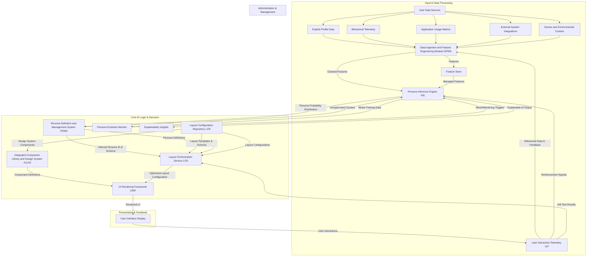
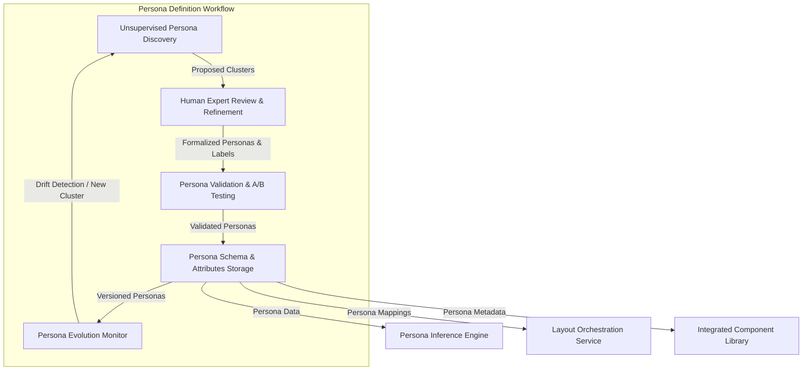
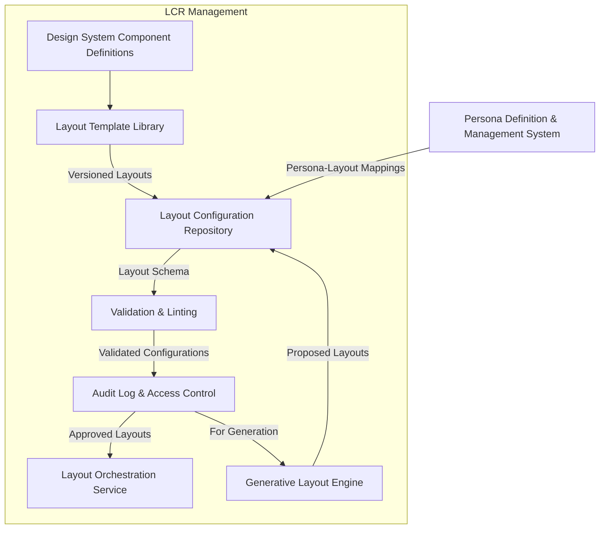
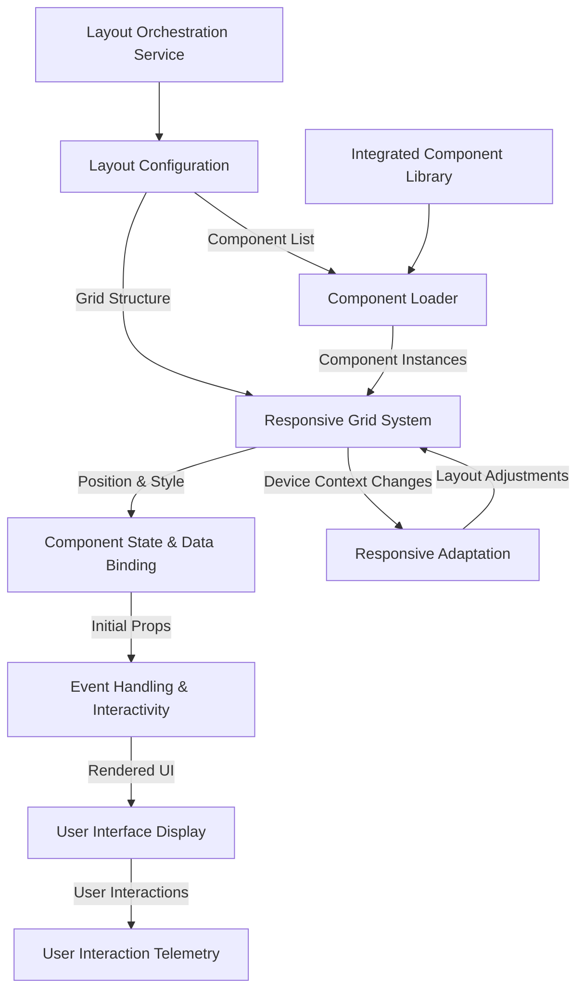
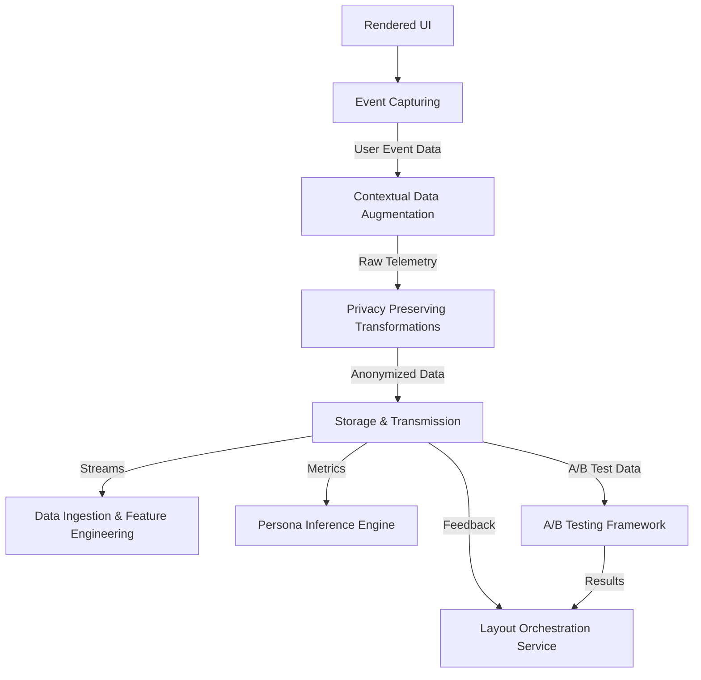
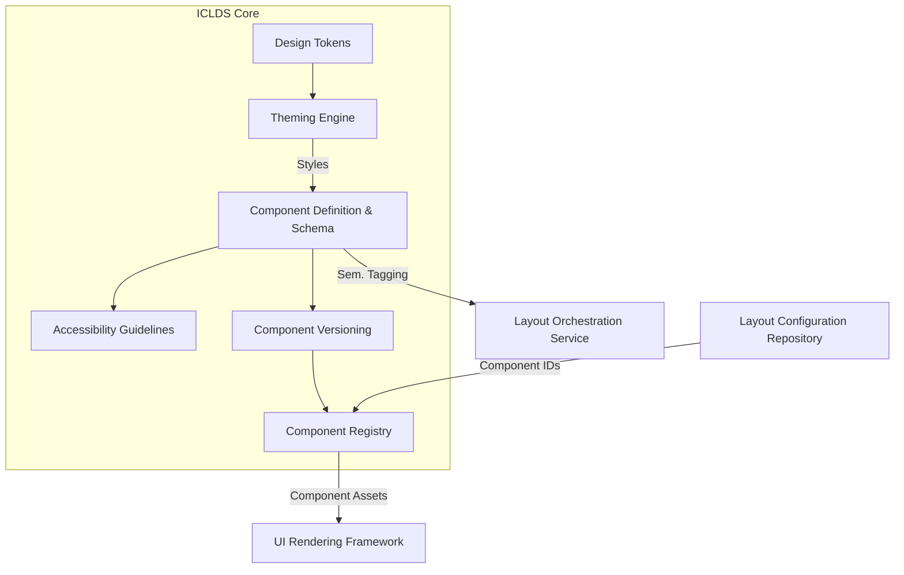
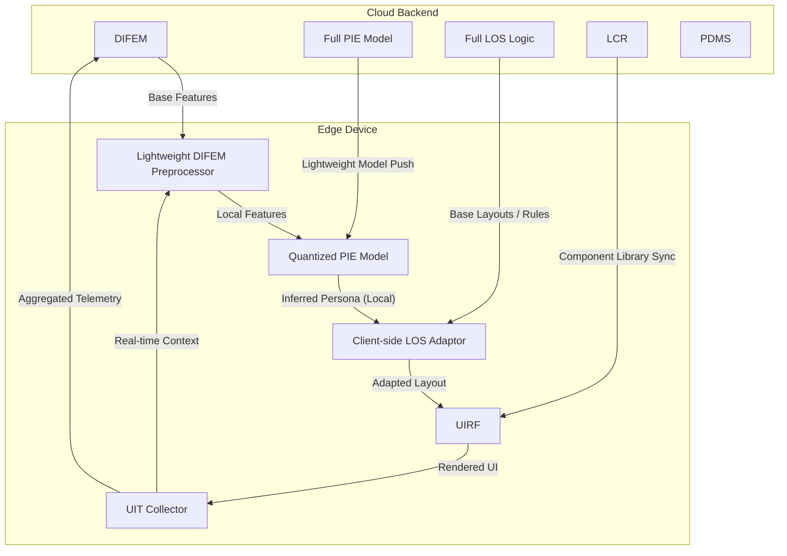

**Title of Invention:** System and Method for Generating a Personalized User Interface Layout Based on Inferred User Persona with Dynamic Adaptation

**Abstract:**
A highly sophisticated system for the autonomous generation and dynamic adaptation of personalized graphical user interfaces [GUIs] is herewith disclosed. This invention meticulously analyzes an expansive spectrum of user data, encompassing, but not limited to, explicit user roles, granular permission matrices, comprehensive behavioral telemetry, and intricate historical interaction patterns. Through advanced machine learning paradigms, the system rigorously classifies each user into a precisely delineated persona drawn from a rigorously defined ontological hierarchy of predefined archetypes e.g. "Synthetical-Analyst," "Cognitive-Innovator," "Operational-Executor." Subsequently, the system leverages the inferred user persona as a principal determinant to orchestrate the selection or generative synthesis of an optimal UI layout configuration. This configuration, encoded as a highly structured, machine-interpretable data construct, precisely delineates the manifest UI components, their topological arrangement within a multi-dimensional grid, and their contextual rendering attributes. The culmination of this process is the programmatic instantiation of a bespoke, semantically rich interface, meticulously tailored to the predicted cognitive workflow, inherent preferences, and emergent operational requirements of the individual user, thereby significantly elevating task efficacy and enhancing user experience.

**Background of the Invention:**
The pervasive paradigm within contemporary software architecture, wherein a singular, immutable user interface presentation is imposed upon a heterogeneous user base, suffers from inherent limitations in adaptability and optimization. While rudimentary provisions for manual interface customization exist in certain applications, these often impose a non-trivial cognitive load and temporal overhead upon the end-user, frequently resulting in underutilization or abandonment. The fundamental premise that distinct user archetypes exhibit fundamentally divergent operational methodologies, informational priorities, and interaction modalities necessitates a radical departure from monolithic interface design. For instance, a quantitative financial analyst typically necessitates an interface characterized by dense, real-time data visualizations, complex multi-variate statistical charts, and high-fidelity data manipulation controls. Conversely, a strategic executive or creative director often benefits from an interface emphasizing high-level performance indicators, intuitive collaborative communication conduits, and curated inspirational content feeds. The lacuna in existing technological frameworks is a system capable of autonomously discerning the underlying psychometric and behavioral profile of a user and dynamically reconfiguring its entire visual and functional layout to optimally align with that individual's unique persona and contextually relevant objectives. The absence of such an adaptive orchestration mechanism represents a significant impediment to achieving maximal user productivity and satisfaction within complex digital ecosystems.

**Brief Summary of the Invention:**
The present invention constitutes an innovative, end-to-end cyber-physical system designed for the autonomous generation and sophisticated personalization of user interface layouts. At its core, a distributed Artificial Intelligence [AI] model, operating within a secure backend environment, ingests and processes a myriad of user-centric data points. This data includes, but is not limited to, granular details extracted from user profiles e.g. organizational role, departmental affiliation, specified competencies, high-resolution telemetry pertaining to historical feature engagement frequency, sequential usage patterns, and inter-component navigational trajectories. Through a process of advanced pattern recognition and classification, this AI model rigorously attributes a probabilistic persona classification to each user. Concomitantly, the system maintains a comprehensive, version-controlled repository of canonical UI layout configurations, each meticulously curated or algorithmically synthesized to correspond to a specific, defined persona. These configurations are formally encoded as extensible, structured data objects e.g. JSON Schema, XML, or Protocol Buffers, meticulously specifying the explicit components to be rendered, their precise topological coordinates within a multi-dimensional grid system, and their default initial states and volumetric properties. Upon user authentication and application initialization, a specialized client-side orchestrator module asynchronously retrieves the layout configuration dynamically assigned to the user's inferred persona. This orchestrator subsequently directs a highly modular, reactive UI rendering framework to programmatically construct the primary dashboard or operational interface. This innovative methodology ensures that the most salient, contextually appropriate, and ergonomically optimized tools and information are presented immediately to the user, obviating the need for manual configuration and significantly accelerating operational efficiency from the initial point of interaction.

**Detailed Description of the Invention:**

The invention delineates a sophisticated architectural paradigm for adaptive user interface generation, fundamentally transforming the interaction between human and machine. At its foundational core, the system operates through a continuous, adaptive feedback loop, ensuring that the presented interface remains perpetually optimized for the individual user's evolving persona and real-time contextual demands.

### I. System Architecture Overview

The comprehensive system, referred to as the Adaptive UI Orchestration Engine [AUIOE], comprises several interconnected modules operating in concert to achieve dynamic, persona-driven UI generation.



#### A. Data Ingestion and Feature Engineering Module [DIFEM]
The [DIFEM] serves as the primary conduit for all user-centric data entering the [AUIOE]. Its responsibilities span data acquisition, cleaning, transformation, and the generation of high-fidelity features suitable for machine learning models.

```mermaid
graph LR
    subgraph Data Sources
        DS1[Explicit Profile Data]
        DS2[Behavioral Telemetry]
        DS3[Application Usage Metrics]
        DS4[External System Integrations]
        DS5[Device & Env. Context]
        DS6[User Interaction Telemetry]
    end

    DS1 --> DIFE M
    DS2 --> DIFE M
    DS3 --> DIFE M
    DS4 --> DIFE M
    DS5 --> DIFE M
    DS6 --> DIFE M

    subgraph DIFEM Processing
        DIFEM_I[Raw Data Ingestion] --> DIFEM_C[Data Cleaning & Preprocessing]
        DIFEM_C --> DIFEM_F[Feature Engineering]
        DIFEM_F --> DIFEM_D[Dimensionality Reduction (Optional)]
        DIFEM_D --> DIFEM_S[Feature Store Export]
        DIFEM_S --> PIE[Persona Inference Engine]
        DIFEM_S --> PEM[Persona Evolution Monitor]
    end

    DIFEM_I -- Data Streams --> DIFEM_C
    DIFEM_C -- Clean Data --> DIFEM_F
    DIFEM_F -- High-Dim Features --> DIFEM_D
    DIFEM_D -- Optimized Features --> DIFEM_S
```

*   **Data Sources:**
    *   **Explicit User Profile Data:** Structured information from identity management systems e.g. `job_title`, `department`, `role_permissions`, `geographic_location`, `seniority_level`, `preferred_language`.
    *   **Behavioral Telemetry:** Granular event logs detailing user interactions e.g. `click_events`, `hover_events`, `scroll_depth`, `form_submission_rates`, `search_queries`, `time_on_component`, `navigation_paths`, `component_visibility_duration`.
    *   **Application Usage Metrics:** Aggregated data on feature adoption, frequency of use, sequence of feature invocation, error rates, task completion times, and session durations.
    *   **External System Integrations:** Data from CRM, ERP, project management tools, or communication platforms that provide context on user's professional activities and collaborations, e.g., `project_status`, `team_members`, `communication_frequency`.
    *   **Device and Environmental Context:** Device type `desktop`, `tablet`, `mobile`, operating system, browser, screen resolution, time of day, day of week, network latency, input method `touch`, `mouse`.

*   **Feature Engineering Sub-Module:** This module converts raw data into a structured format suitable for machine learning models.
    *   **Temporal Features:** Computation of features like "average time spent on analytical reports in last 7 days," "peak usage hours," "recency of using collaboration tools," `(t_current - t_last_action)^-1`.
        *   Example: `F_temporal = [mean(session_duration), std(activity_rate), log(1 + visits_last_week)]`.
    *   **Frequency-Based Features:** "Number of clicks on export button per session," "frequency of accessing administrative panels," `count(event_X) / total_events_in_session`.
        *   Example: `F_frequency = [count(clicks_on_export), rate(form_submissions)]`.
    *   **Sequential Features:** Extraction of Markov chains or sequence embeddings from navigation paths e.g. `Login -> DataGrid -> FilterPanel -> Chart -> Export`. This involves processing sequences `S = (s_1, s_2, ..., s_L)` into fixed-size vectors.
        *   Methods include: `n-gram` counts, `TF-IDF` on event sequences, `Word2Vec` or `Doc2Vec` embeddings where events are 'words' and sessions are 'documents', or `Recurrent Neural Network (RNN)` or `Transformer` encoder outputs `e_S`.
        *   Mathematically, an event sequence `s_j = (e_1, e_2, ..., e_L)` for user `j` is transformed into an embedding `v_j = Embedding(s_j)`.
    *   **Semantic Features:** Natural Language Processing [NLP] on search queries, comment fields, or document content to infer user intent and content preferences. This might involve TF-IDF, Word2Vec, or contextual embeddings from transformer models like BERT or GPT.
        *   Example: `F_semantic = [sentiment_score(comments), topic_distribution(search_queries)]`.
    *   **Dimensionality Reduction:** Application of techniques such as Principal Component Analysis [PCA], t-SNE, or Autoencoders to reduce the complexity of high-dimensional feature vectors while preserving critical information.
        *   For PCA, `u_j_reduced = W^T u_j` where `W` are the top `k` eigenvectors.
    *   **Data Quality Monitoring:** Automated pipelines to detect data anomalies, missing values, and inconsistencies, ensuring high-quality input for persona inference. This includes statistical checks `|x - mu| / sigma > Z_threshold`, or outlier detection algorithms like Isolation Forest.
        *   Missing value imputation methods: `x_imputed = mean(x)` or `x_imputed = Regression(x_other_features)`.
    *   **Feature Store Integration:** Centralized repository for managing, serving, and versioning engineered features, promoting reusability and consistency across different models and teams. `F_store(t)` provides `f(u_j, t_query)`.

#### B. Persona Definition and Management System [PDMS]
The [PDMS] acts as the authoritative source for the ontological classification of user archetypes. It defines the universe of possible personas and their associated attributes.



*   **Persona Schema:** Each persona e.g. `SYNTHETICAL_ANALYST`, `COGNITIVE_INNOVATOR`, `OPERATIONAL_EXECUTOR` is formally defined by a rich set of attributes:
    *   `persona_ID`: Unique identifier, `pi_i`.
    *   `persona_description`: Narrative summary of the archetype's characteristics, goals, and pain points, `D(pi_i)`.
    *   `key_behavioral_indicators`: Quantifiable metrics or feature ranges that strongly correlate with this persona e.g. high `data_export_frequency`, low `social_feature_engagement`, `B(pi_i) = {f_k | f_k is relevant}`.
    *   `preferred_interaction_modalities`: Preferences for data density, visual complexity, command-line vs. GUI, `M(pi_i)`.
    *   `associated_tasks_objectives`: Primary goals that this persona typically seeks to achieve within the application, `T(pi_i)`.
    *   `layout_configuration_mapping_ID`: Reference to the default or prioritized layout within the [LCR], `L_map(pi_i)`.
    *   `adaptation_rules`: Specific logic for further dynamic layout adjustments *within* this persona based on real-time context, `A(pi_i)`.

*   **Persona Lifecycle Management:**
    *   **Creation & Refinement:** Expert systems, leveraging domain knowledge, define initial personas. Unsupervised learning methods e.g. K-Means, hierarchical clustering, DBSCAN can assist in discovering emergent persona clusters from behavioral data, which are then human-reviewed and formalized.
        *   Clustering objective: `min sum_{j=1}^N sum_{k=1}^K I(u_j in C_k) ||u_j - mu_k||^2` for K-Means.
    *   **Versioning:** Personas, being critical classification targets, are versioned to track their evolution and ensure consistency across model training and deployment. `pi_i_vX.Y`.
    *   **Validation:** Ongoing validation of persona definitions against ground truth data, A/B test results, and user feedback.
    *   **Dynamic Persona Discovery:** Leveraging advanced clustering algorithms and anomaly detection on unlabeled or newly acquired behavioral data to identify emerging user archetypes that may warrant new persona definitions or modifications to existing ones. This can involve incremental clustering or detecting significant shifts in feature distributions `P(u | pi_i)`.

#### C. Persona Inference Engine [PIE]
The [PIE] is the core AI component responsible for classifying an incoming user's profile and behavioral data into one of the predefined personas. This module embodies the `f_class` function described in the mathematical justification.

```mermaid
graph TD
    subgraph PIE Training Pipeline
        DIFEM_S[Feature Store] --> PIE_L[Labeled Training Data]
        PIE_L --> PIE_M[Machine Learning Models]
        PIE_M -- Model Weights --> PIE_E[Evaluation & Validation]
        PIE_E -- Performance Metrics --> PIE_O[Model Optimization]
        PIE_O -- Optimized Model --> PIE_D[Model Deployment]
        PIE_D -- Deployed Model --> PIE_P[Prediction API]
    end

    subgraph PIE Inference & Feedback
        PIE_F[Real-time Features (from DIFEM)] --> PIE_P
        PIE_P -- Persona & Confidence --> LOS[Layout Orchestration Service]
        PIE_P -- Explainability Insights --> XAI[Explainable AI Dashboard]
        UIT[User Interaction Telemetry] -- Feedback/Rewards --> PIE_L
        PEM[Persona Evolution Monitor] -- Retraining Trigger --> PIE_M
        PIE_L -- Active Learning Queries --> Human[Human Annotator]
    end
```

*   **Model Architectures:**
    *   **Supervised Classification Models:**
        *   **Ensemble Methods:** Random Forests, Gradient Boosting Machines e.g. XGBoost, LightGBM for robust, interpretable predictions on structured feature vectors. `P(pi_i | u_j) = sum_{t=1}^T w_t * h_t(u_j)`.
        *   **Support Vector Machines [SVMs]:** Effective for high-dimensional data, finding optimal hyperplanes to separate persona classes. `w^T phi(u_j) + b >= 1` for positive class.
        *   **Deep Neural Networks [DNNs]:** Multi-layer perceptrons for complex, non-linear relationships within the feature space. For sequential data e.g. navigation paths, Recurrent Neural Networks [RNNs] like LSTMs or Gated Recurrent Units [GRUs] or Transformer networks are employed to capture temporal dependencies.
            *   LSTM cell: `i_t = sigma(W_i[h_{t-1}, x_t] + b_i)`, `f_t = sigma(W_f[h_{t-1}, x_t] + b_f)`, etc.
    *   **Probabilistic Outputs:** The model outputs a probability distribution over the set of personas `Psi(u_j) = [P(pi_1 | u_j), ..., P(pi_K | u_j)]`, allowing for confidence scoring `c = max(Psi(u_j))` and potential fallback mechanisms e.g. if confidence is low `c < tau`, a default or hybrid layout might be served.
    *   **Unsupervised/Semi-supervised Learning:** Used for initial persona discovery or for handling cold-start problems where limited labeled data exists. Self-training or co-training can be applied.
    *   **Reinforcement Learning for Persona Refinement:** In advanced scenarios, an RL agent can fine-tune persona classification based on long-term user satisfaction and task success signals derived from the [UIT], guiding the model to adapt to subtle shifts in user behavior that improve overall experience.
        *   Reward function `R(s, a, s')` incorporates task success, engagement, and explicit feedback.

*   **Training and Retraining:**
    *   **Labeled Data Generation:** Historical user interaction data is meticulously labeled with ground-truth personas derived from surveys, explicit user roles, or expert analysis. Active Learning techniques can prioritize which unlabeled data points are most informative for human annotation, reducing labeling costs.
        *   Query strategies: Uncertainty sampling `argmax (1 - P(pi* | u_j))`, or Query-by-Committee (disagreement among multiple models).
    *   **Continuous Learning:** The [PIE] is designed for continuous integration and continuous deployment [CI/CD] of model updates. It incorporates a feedback loop from the User Interaction Telemetry [UIT] module to retrain and refine its classification capabilities, adapting to evolving user behaviors and application functionalities.
        *   Online learning algorithms for real-time model updates: `theta_{t+1} = theta_t - alpha * grad(L(theta_t, u_t))`.
    *   **Persona Evolution Monitor:** A sub-module that continuously monitors shifts in aggregated user behavior across the system. It detects when significant portions of the user base begin to deviate from their assigned personas or when new, distinct behavioral clusters emerge, triggering an alert for model retraining or persona redefinition in the [PDMS].
        *   Drift detection metrics: Kullback-Leibler divergence `D_KL(P_old || P_new)` or Jensen-Shannon divergence `D_JS`.

*   **Explainable AI [XAI] Integration:**
    *   **Feature Importance:** Utilize SHAP (SHapley Additive exPlanations) or LIME (Local Interpretable Model-agnostic Explanations) values to articulate which features most strongly influenced a persona classification e.g. "User classified as `SYNTHETICAL_ANALYST` due to high frequency of `DataGrid` exports and `Chart` manipulations in the last 72 hours".
        *   SHAP value for feature `j`: `phi_j(f,x) = sum_{S subset x\{j\}} ( |S|! (|F|-|S|-1)! ) / |F|! * [f_x(S cup {j}) - f_x(S)]`.
    *   **Decision Paths:** For tree-based models, specific decision paths can be visualized to explain why a user fell into a certain persona, enhancing transparency and trust.
*   **API Interface:** Exposes a high-throughput, low-latency API endpoint `infer_persona(user_feature_vector) -> {persona_ID, confidence_score}`.

#### D. Layout Configuration Repository [LCR]
The [LCR] is a structured, version-controlled repository containing all predefined and dynamically generated layout configurations. It underpins the `L` set from the mathematical justification.



*   **Configuration Schema:** Each layout configuration is a hierarchical JSON object or similar structured data, specifying:
    *   `layout_ID`: Unique identifier, `l_i_id`.
    *   `persona_mapping_ID`: Which persona[s] this layout is primarily designed for, `pi_map(l_i)`.
    *   `grid_structure`: A multi-dimensional array or object defining the grid layout e.g. `rows`, `columns`, `breakpoints`, `responsive_rules`. Represented as `G = (R, C, B, G_rules)`.
        *   Grid template: `grid-template-columns: g_1 ... g_N` where `g_k` can be `fr`, `px`, `auto`.
    *   `components`: An array of component objects, each with:
        *   `component_ID`: Unique identifier e.g. `DataGridComponent`, `ChartDisplay`, `CollaborationPanel`, `comp_k_id`.
        *   `position`: Grid coordinates `row`, `col`, `row_span`, `col_span`, `(r, c, rs, cs)`.
        *   `initial_state_props`: Default properties for the component e.g. `data_source`, `chart_type`, `filter_preset`, `prop_k`.
        *   `visibility_rules`: Conditional rendering logic based on user permissions, device type, or real-time data, `V_k(u, d_env, context)`.
    *   `theme_preferences`: Color schemes, typography, icon sets, `T_pref`.
    *   `accessibility_settings`: Default font sizes, contrast ratios, `A_set`.

*   **Version Control and Auditability:** All layout configurations are versioned, allowing for rollbacks, A/B testing, and historical analysis of layout effectiveness. A comprehensive audit trail tracks who modified which layout, when, and why, ensuring accountability and compliance.
    *   Version `l_v = (v_major, v_minor, v_patch)`.
    *   Audit record: `Log_entry = (timestamp, user_id, action, layout_id, old_version, new_version)`.
*   **Design System Integration:** The [LCR] interfaces with an underlying UI component library and design system, ensuring that all specified components adhere to established design principles and brand guidelines. `l_i` must satisfy `DesignSystemConstraints(l_i)`.

#### E. Layout Orchestration Service [LOS]
The [LOS] is the intelligent intermediary that maps an inferred persona to an optimal UI layout. This service embodies the `f_map` function, potentially extending it beyond simple one-to-one mapping.

```mermaid
graph TD
    PIE_P[Persona & Confidence] --> LOS_S[Layout Selection Logic]
    DIFEM_E[Real-time Env. Context] --> LOS_S

    LOS_S -- Persona-specific Rules --> LOS_R[Rule-based Adaptation Engine]
    LCR_R[Layout Config Repository] --> LOS_R
    LOS_R -- Base Layout --> LOS_G[Generative Layout Engine (Optional)]

    LOS_S -- Low Confidence / Novel Context --> LOS_G
    PDMS_A[Persona Adaptation Rules] --> LOS_G

    LOS_G -- Optimized Layout --> UIRF[UI Rendering Framework]
    LOS_R -- Contextual Adjustments --> UIRF
    UIT_AB[A/B Test Results] -- Feedback --> LOS_S
```

*   **Mapping Logic:**
    *   **Direct Mapping:** For most common scenarios, the [LOS] retrieves the primary `layout_configuration_mapping_ID` associated with the inferred persona from the [PDMS] and fetches the corresponding layout `l_base` from the [LCR].
        *   `l_base = LCR.fetch(PDMS.get_mapping(pi*))`.
    *   **Contextual Overrides:** The [LOS] can dynamically adjust or select a variant layout based on real-time contextual factors:
        *   **Device Context:** Serve a `mobile`-optimized layout even if the persona typically prefers a `desktop`-heavy layout. `l_context = Override(l_base, device_type)`.
        *   **Task Context:** If the user explicitly navigates to a specific task e.g. "create new report", the [LOS] might overlay task-specific components or temporarily reconfigure a section of the UI. `l_task = Augment(l_context, task_id)`.
        *   **Time of Day/Week:** Present a "weekend summary" layout on Saturdays, or a "daily briefing" layout first thing in the morning. `l_final = Adjust(l_task, time_of_day)`.
    *   **Generative Layout Synthesis:** In advanced embodiments, the [LOS] can employ constraint satisfaction algorithms, genetic algorithms, or deep reinforcement learning to *generate* novel layouts on-the-fly, optimizing for a set of objectives e.g. information density, learnability, visual balance given the user's persona and current context. This involves:
        *   Defining a "layout grammar" or component interaction rules `Grammar(C_library)`.
        *   Evaluating generated layouts against heuristic metrics or a learned utility function `U(l | pi*, c_realtime)`.
        *   **GenerativeLayoutEngine Sub-module (GLE):** Utilizes deep learning models such as Transformer networks or conditional Generative Adversarial Networks [GANs] to learn the underlying patterns of effective layout design from historical data. Given a persona and context, the Generator component proposes a layout structure, and a Discriminator evaluates its plausibility and adherence to design principles. Through iterative training, this engine learns to synthesize novel, high-quality layouts that are tailored to complex requirements. Reinforcement Learning can further optimize the Generator by using real-time user engagement and task success as reward signals.
            *   Generator: `G(z, pi*, c_realtime) -> l_synthetic`.
            *   Discriminator: `D(l) -> [0,1]` (real/fake).
            *   RL reward: `R_GLE = alpha * U(l_synthetic) + beta * (1-D(l_synthetic))`.

*   **Output:** The [LOS] transmits the finalized, optimized layout configuration a structured data object to the UI Rendering Framework.

#### F. UI Rendering Framework [UIRF]
The [UIRF] is the client-side component responsible for interpreting the layout configuration and rendering the actual graphical user interface. This module embodies the `R(l_i)` function.



*   **Dynamic Component Loading:** The [UIRF] dynamically imports and instantiates UI components based on the `component_ID` specified in the layout configuration. This ensures that only necessary components are loaded, improving performance.
    *   `load_component(id)` returns `ComponentClass`.
*   **Grid System Implementation:** A robust and responsive grid system e.g. CSS Grid, Flexbox, or specialized UI framework components interprets the `grid_structure` and `position` properties to precisely arrange components.
    *   CSS Grid property: `grid-area: r_start / c_start / r_end / c_end;`.
*   **Component State Initialization:** Each component is initialized with its `initial_state_props`, ensuring it displays relevant data and functionality immediately.
    *   `component.init(prop_k)`.
*   **Responsiveness and Adaptivity:** The [UIRF] dynamically adjusts component sizes, positions, and visibility based on screen dimensions, device orientation, and predefined `responsive_rules` within the layout configuration. Breakpoints are handled gracefully to maintain aesthetic and functional integrity across diverse viewing environments.
    *   Media queries: `@media (max-width: BP_width) { ... }`.
*   **Performance Optimization:** Employs techniques such as virtualized lists for large datasets, lazy loading of off-screen components, and efficient change detection mechanisms to ensure a fluid and highly responsive user experience.
    *   Rendering budget: `1000ms / 60 frames = 16.6ms` per frame.
*   **Interactivity Management:** Attaches event listeners and manages the communication between dynamically rendered components. `component.on(event, handler)`.
*   **Component Sandboxing:** Implements isolated execution environments for dynamically loaded components to prevent malicious code injection or unintended side effects, enhancing system security and stability.
    *   `iframe` or Web Components with Shadow DOM.

#### G. User Interaction Telemetry [UIT]
The [UIT] module is an integral part of the continuous feedback loop, diligently recording and transmitting high-fidelity interaction data back to the [DIFEM].



*   **Event Tracking:** Captures all user events clicks, hovers, scrolls, key presses, form submissions, component interactions, navigation with associated metadata timestamp, component ID, coordinates, user ID, session ID, `layout_ID`, `persona_ID`.
    *   Event payload: `{event_type: "click", component_id: "X", user_id: "Y", timestamp: Z, context: {...}}`.
*   **Performance Metrics:** Records UI load times, rendering times, API response latencies, and client-side error rates.
    *   `L = t_dom_content_loaded`, `FCP = first_contentful_paint`.
*   **Contextual Data:** Augments events with current application state, device information, and the `layout_ID` currently being rendered.
*   **Privacy & Anonymization:** Implements robust data anonymization, pseudonymization, and encryption techniques to ensure user privacy and compliance with data protection regulations e.g. GDPR, CCPA. Data is aggregated and de-identified before being used for model training or persona refinement.
    *   K-anonymity, L-diversity. Differential privacy `P(data | D_1) <= exp(epsilon) * P(data | D_2)`.
*   **A/B Testing Integration:** Directly feeds granular interaction data into an A/B testing framework, allowing the [AUIOE] to rigorously evaluate the impact of different persona classifications, layout configurations, or adaptation rules on key performance indicators.
    *   Hypothesis testing: `p-value < alpha`.
*   **Feedback Loop for Reinforcement Learning:** Provides explicit and implicit reward signals for reinforcement learning models in the [PIE] and [LOS], e.g., successful task completion, high engagement metrics, low abandonment rates, and positive user feedback.
    *   Reward signal `r_t = alpha * (task_completion_success) - beta * (error_rate) + gamma * (engagement_duration)`.

### II. Integrated Component Library and Design System [ICLDS]

The Adaptive UI Orchestration Engine [AUIOE] relies heavily on a robust, version-controlled Integrated Component Library and Design System [ICLDS]. This system provides the foundational building blocks for all UI layouts, ensuring consistency, reusability, and maintainability.



#### A. Component Structure and Contract
Each UI component within the [ICLDS] adheres to a strict contract, allowing for dynamic instantiation and predictable behavior across diverse layouts.
*   **Component Interface:** All components implement a common interface `IUIComponent` specifying properties like `component_ID`, `render()`, `updateProps()`, and `handleEvent()`.
    *   `interface IUIComponent { id: string; props: Record<string, any>; render(container: HTMLElement): void; update(newProps: Record<string, any>): void; dispose(): void; }`.
*   **Metadata Schema:** Each component is accompanied by a metadata schema describing its configurable properties e.g. `data_source`, `chart_type`, `filter_preset`, its expected data types, and any dependencies on other components or services.
    *   JSON Schema for props validation: `{"type": "object", "properties": {"data_source": {"type": "string"}, "chart_type": {"enum": ["bar", "line"]}}}`.
*   **Semantic Tagging:** Components are semantically tagged e.g. `data-visualization`, `collaboration`, `input-control` to enable the [LOS] to intelligently select or synthesize layouts based on persona needs and contextual requirements.
    *   `tags = { 'data-viz', 'interactive' }`.

#### B. Design Tokens and Theming
The [ICLDS] leverages a system of Design Tokens for managing visual attributes.
*   **Token Definition:** Abstract variables e.g. `color-primary`, `font-size-body`, `spacing-medium` represent design decisions.
    *   `token_name: value`. `{"color-brand-primary": "#007bff", "font-size-base": "16px"}`.
*   **Theme Management:** Different themes e.g. `light`, `dark`, `high-contrast` are defined by mapping design tokens to specific values. The [LOS] can select a theme based on persona preferences, device settings, or accessibility requirements.
    *   `Theme_Light = { "color-text": "#333", "color-background": "#FFF" }`.
    *   `Theme_Dark = { "color-text": "#EEE", "color-background": "#121212" }`.
*   **Style Composition:** Components consume these design tokens, ensuring global style consistency and easy theme switching across personalized layouts.
    *   CSS Variable application: `--color-primary: var(--color-brand-primary);`.

#### C. Component Version Management
To maintain stability and enable iterative development, components within the [ICLDS] are versioned.
*   **Semantic Versioning:** Components follow semantic versioning `MAJOR.MINOR.PATCH`, allowing for controlled updates and compatibility management.
    *   `v_new >= v_old` for updates, `v_major` for breaking changes.
*   **Registry Integration:** A component registry manages available versions, facilitating dynamic loading by the [UIRF] and ensuring that specific layout configurations can request exact component versions.
    *   `ComponentRegistry.get_component(id, version_specifier)`.
*   **Dependency Graph:** The [ICLDS] maintains a dependency graph of components, ensuring that updates to core components do not inadvertently break dependent layouts or other components.
    *   Graph `G_dep = (V, E)` where `V` are components and `(c_a, c_b) in E` if `c_a` depends on `c_b`.

### III. Advanced Generative UI with Deep Learning

Beyond pre-defined layouts and rule-based adjustments, the [AUIOE] can incorporate advanced deep learning techniques for truly generative UI synthesis, particularly within the [LOS].

#### A. Layout Generation using Transformer Models
*   **Layout as Sequence:** A UI layout can be represented as a sequence of component placement instructions and property assignments. A Transformer network, similar to those used in natural language processing, can learn to generate these sequences.
    *   Sequence: `s = (comp_1_id, pos_1, props_1, ..., comp_M_id, pos_M, props_M)`.
*   **Input Embedding:** The model receives an embedding of the inferred persona `E_pi` and real-time context `E_context`.
    *   `X_input = Concat(E_pi, E_context, StartOfSequenceToken)`.
*   **Attention Mechanism:** The Transformer's attention mechanism allows it to weigh the importance of different components and their relationships when proposing new placements, ensuring logical groupings and efficient workflows for the target persona.
    *   Attention: `Attention(Q, K, V) = softmax(QK^T / sqrt(d_k))V`.
*   **Constrained Decoding:** The generative process is guided by constraints such as screen dimensions, required components, and accessibility rules, ensuring that generated layouts are feasible and usable.
    *   Probability masking during decoding: `P(token | prev_tokens) = P(token | prev_tokens) * Mask_Constraint(token)`.

#### B. Conditional Generative Adversarial Networks [GANs] for Layout Synthesis
*   **Generator Network:** Takes a persona embedding and contextual vector as input `z` and attempts to generate a realistic layout configuration `l_fake` that aligns with the user's needs.
    *   `G(z, E_pi, E_context) -> l_fake`.
*   **Discriminator Network:** Trained to distinguish between real, human-designed layouts from the [LCR] `l_real` and synthetic layouts generated by the Generator.
    *   `D(l) -> [0,1]`.
*   **Adversarial Training:** Through adversarial training, the Generator improves its ability to create highly plausible and persona-appropriate layouts, while the Discriminator becomes better at identifying non-optimal designs.
    *   Minimax objective: `min_G max_D [E_{l_real~P_data}[log D(l_real)] + E_{z~P_z}[log(1 - D(G(z)))]]`.
*   **Reward-Guided Learning:** The GAN can be augmented with Reinforcement Learning. The Discriminator's feedback, combined with real-time user interaction signals, serves as a reward function to further refine the Generator's output, leading to layouts that not only look good but also perform exceptionally well in terms of user engagement and task completion.
    *   RL reward: `R(l) = alpha * D(l) + beta * U_empirical(l)`.

#### C. Optimizing for Multi-Objective Persona Utility
Deep learning models can be trained to optimize for complex, multi-objective utility functions.
*   **Utility Function Representation:** Instead of simple metrics, the models learn to balance objectives such as information scent, cognitive load, visual balance, learnability, and accessibility, weighted according to the specific persona's preferences.
    *   `U(l | pi, c) = w_1 * F_eff(l, pi, c) + w_2 * F_satisf(l, pi, c) - w_3 * F_cognitive_load(l)`.
*   **Transfer Learning:** Pre-trained models on large datasets of general UI designs can be fine-tuned with specific application data and persona information, accelerating the learning process.
    *   `theta_fine_tune = Finetune(theta_pretrained, D_app_specific)`.

### IV. Edge Computing for Adaptive UI

To enhance responsiveness and reduce server load, parts of the [AUIOE] can be deployed to client devices, leveraging edge computing capabilities.



#### A. Client-side Persona Inference
*   **Lightweight Models:** Compressed or quantized versions of the [PIE] models can run directly on the client device e.g. via WebAssembly or mobile AI frameworks like TensorFlow Lite or Core ML.
    *   Quantization: `x_q = round(x / S) + Z`.
    *   Model size reduction: `Size_edge = Compression_ratio * Size_cloud`.
*   **Real-time Feature Generation:** Local data, such as recent click patterns, scroll depth, and active application states, can be processed on the device for immediate persona updates without round-trips to the server.
    *   `f_local(history_local, context_local)`.
*   **Privacy-Preserving Inference:** User data can remain on the device for inference, reducing the need to send sensitive information to the cloud and enhancing privacy.
    *   On-device `P(pi_i | u_local)`.

#### B. Localized Layout Adaptation
*   **Contextual Overrides:** The [LOS] can send a base layout, and the client-side module can apply real-time contextual overrides e.g. adjusting component visibility or resizing based on immediate screen changes or app-specific events.
    *   `l_final_edge = Apply_Local_Rules(l_base_server, context_edge)`.
*   **Predictive Pre-fetching:** Based on local persona inference, the client can pre-fetch components or data for anticipated next layouts, improving perceived performance.
    *   `Prefetch(components_for_pi_next)` where `pi_next = argmax P(pi | u_edge_next)`.
*   **Hybrid Orchestration:** A hybrid approach where core persona inference and initial layout selection happen server-side, with granular, rapid adaptations occurring on the client.
    *   `f_map_hybrid = f_map_server o f_map_client_local`.

#### C. Benefits and Challenges
*   **Benefits:**
    *   **Reduced Latency:** Near-instantaneous UI adaptation. `Latency_edge < Latency_cloud`.
    *   **Improved User Experience:** More fluid and responsive interactions.
    *   **Offline Functionality:** Limited adaptability can occur even without network connectivity.
    *   **Enhanced Privacy:** Less data transfer to central servers. `Data_transfer_edge < Data_transfer_cloud`.
*   **Challenges:**
    *   **Resource Constraints:** Client devices have limited CPU, memory, and battery. `(CPU_load_edge, Mem_use_edge, Power_drain_edge) <= (Threshold_CPU, Threshold_Mem, Threshold_Power)`.
    *   **Model Size and Complexity:** Balancing model accuracy with deployable size. `Accuracy(model_edge) >= Accuracy_min`.
    *   **Security:** Protecting client-side AI models from tampering.
    *   **Synchronization:** Ensuring consistency between client-side and server-side persona states.

### V. Security, Privacy, and Ethical AI Considerations

The deployment of a highly adaptive, persona-driven UI system necessitates robust measures for security, privacy, and ethical AI governance.

```mermaid
graph TD
    subgraph Governance & Compliance
        GAC[Granular Access Control]
        DM[Data Minimization]
        DLAT[Data Lineage & Audit Trails]
        CECM[Consent & Opt-out Management]
        GAC & DM & DLAT & CECM --> SPRE[Security, Privacy, Ethics Regulations]
    end

    subgraph Data Flow
        UIT[User Interaction Telemetry] -- Raw Data --> DPA[Data Privacy & Anonymization]
        DPA -- Anonymized Data --> DIFEM[DIFEM]
        DPA -- Encrypted Data --> PIE[PIE] (Homomorphic)
    end

    subgraph AI Model Governance
        PIE[PIE] -- Bias Detection --> ADB[Algorithmic De-biasing]
        ADB -- Fairer Model --> PIE_R[Retraining]
        PIE -- Explainability --> XAI[Explainable AI]
        LOS[LOS] -- Layout Rationale --> XAI
        XAI --> USR[User Feedback & Trust]
    end
```

#### A. Data Governance and Access Control
*   **Granular Access Policies:** Strict Role-Based Access Control [RBAC] and Attribute-Based Access Control [ABAC] implemented across all modules, limiting who can access, modify, or view sensitive user data and configuration files.
    *   `Access(user, resource) = CheckPolicy(user.roles, resource.permissions)`.
*   **Data Minimization:** Adherence to the principle of collecting only data necessary for persona inference and layout optimization, with regular audits to prune superfluous information.
    *   `Data_collected = argmin_{data'} Cost(data')` such that `Utility(data') >= U_min`.
*   **Data Lineage and Audit Trails:** Comprehensive logging of all data transformations, model training runs, persona classifications, and layout deliveries, providing an immutable audit trail for compliance and debugging.
    *   `H = Hash(Previous_State, Current_Action)`.

#### B. Privacy by Design
*   **Differential Privacy:** Techniques applied to aggregated telemetry data before model training to prevent the inference of individual user behavior from the trained models.
    *   `P[M(D_1) in S] <= exp(epsilon) * P[M(D_2) in S] + delta`.
*   **Homomorphic Encryption:** Research into using homomorphic encryption for certain types of on-device feature computation or persona inference to ensure data remains encrypted even during processing.
    *   `E(f(x)) = f(E(x))`.
*   **User Consent Management:** Clear, explicit mechanisms for obtaining user consent for data collection and usage, with easy-to-understand privacy policies and options for users to opt-out or modify their data preferences.
    *   `Consent_status(user) in {granted, revoked, limited}`.

#### C. Bias Detection and Mitigation in Persona Inference
*   **Fairness Metrics:** Regular evaluation of the [PIE] models using fairness metrics e.g. disparate impact, equal opportunity across different demographic groups to detect and quantify potential biases.
    *   Statistical Parity Difference `SPD = P(Y=1|A=0) - P(Y=1|A=1)`.
    *   Equal Opportunity Difference `EOD = P(Y=1|A=0, C=1) - P(Y=1|A=1, C=1)` (where `C=1` is positive outcome).
*   **Bias Mitigation Techniques:** Application of algorithmic bias mitigation techniques e.g. re-sampling, adversarial de-biasing, or post-processing to ensure that persona classifications are equitable and do not disproportionately affect certain user segments.
    *   Re-weighting samples: `w_i = (P(Y_hat=y | A=a) * P(A=a)) / P(Y_hat=y, A=a)`.
*   **Representative Datasets:** Continuous efforts to ensure training datasets are diverse and representative of the entire user population, preventing the perpetuation or amplification of existing societal biases.
    *   `Diversity_score(D) = 1 - (sum_{group_i} (N_i / N)^2)`.

#### D. Transparency and Explainability
*   **Persona Explanations:** As discussed in [PIE], providing clear, concise explanations for *why* a user was classified into a particular persona.
*   **Layout Rationale:** Offering insights into *why* a specific layout was chosen or generated for a user e.g. "This layout emphasizes data density because your persona is an `ANALYTICAL_INTROVERT` and you frequently access detailed reports."
*   **User Feedback Mechanisms:** Empowering users to provide direct feedback on the generated layouts, allowing them to indicate if an adaptation is helpful or detrimental, which feeds back into the [UIT] and model retraining process.
    *   `Feedback = (user_id, layout_id, rating, comment)`.

### VI. Example Persona and Layout Configurations

**Persona: `ANALYTICAL_INTROVERT`**
*   **Description:** A user who prefers deep dives into data, values efficiency over social interaction, and typically works independently. Seeks high information density and precise controls.
*   **Key Behavioral Indicators:** High usage of data filtering, sorting, export functions. Frequent creation of custom reports. Low engagement with chat or collaboration tools. Spends significant time on data-intensive screens.
*   **Preferred Layout Characteristics:** Grid-based, data-heavy, minimal distractions, direct access to analytical tools.

**Layout Configuration for `ANALYTICAL_INTROVERT` JSON Representation:**
```json
{
  "layout_ID": "ANALYTICAL_INTROVERT_V2.1",
  "persona_mapping_ID": ["ANALYTICAL_INTROVERT"],
  "grid_structure": {
    "template_columns": "1fr 2fr",
    "template_rows": "auto 1fr",
    "gap": "16px",
    "breakpoints": {
      "mobile": {
        "template_columns": "1fr",
        "template_rows": "auto auto 1fr 1fr",
        "gap": "8px"
      }
    }
  },
  "components": [
    {
      "component_ID": "SearchAndFilterPanel",
      "position": {"row": 1, "col": 1, "row_span": 1, "col_span": 1},
      "initial_state_props": {"default_filters": ["last_30_days", "critical_priority"]},
      "visibility_rules": {"min_screen_width": "768px"}
    },
    {
      "component_ID": "DataGridComponent",
      "position": {"row": 1, "col": 2, "row_span": 2, "col_span": 1},
      "initial_state_props": {"data_source": "primary_analytics_dataset", "sort_by": "timestamp_desc", "pagination_size": 20},
      "visibility_rules": {}
    },
    {
      "component_ID": "ExportReportButton",
      "position": {"row": 2, "col": 1, "row_span": 1, "col_span": 1},
      "initial_state_props": {"export_format": "CSV", "default_scope": "current_view"},
      "visibility_rules": {"user_permission": "export_data"}
    },
    {
      "component_ID": "QuickAnalyticsChart",
      "position": {"row": 3, "col": 1, "row_span": 1, "col_span": 1},
      "initial_state_props": {"chart_type": "bar", "data_aggregation": "daily_sum"},
      "visibility_rules": {"min_screen_width": "768px"}
    }
  ]
}
```

**Persona: `CREATIVE_EXTRAVERT`**
*   **Description:** A user who thrives on collaboration, visual inspiration, and high-level conceptualization. Values expressive tools and ease of communication.
*   **Key Behavioral Indicators:** High usage of collaborative editing, chat, mood boards. Frequent sharing and commenting. Spends time on visual content and communication channels.
*   **Preferred Layout Characteristics:** Visually rich, integrated communication, prominent creative tools, less dense data presentation.

**Layout Configuration for `CREATIVE_EXTRAVERT` JSON Representation:**
```json
{
  "layout_ID": "CREATIVE_EXTRAVERT_V1.5",
  "persona_mapping_ID": ["CREATIVE_EXTRAVERT"],
  "grid_structure": {
    "template_columns": "3fr 1fr",
    "template_rows": "auto 1fr",
    "gap": "20px",
    "breakpoints": {
      "mobile": {
        "template_columns": "1fr",
        "template_rows": "1fr auto 1fr",
        "gap": "10px"
      }
    }
  },
  "components": [
    {
      "component_ID": "MoodBoardCanvas",
      "position": {"row": 1, "col": 1, "row_span": 2, "col_span": 1},
      "initial_state_props": {"active_project_id": "current_creative_project", "tool_palette": "default_creative"},
      "visibility_rules": {}
    },
    {
      "component_ID": "LiveChatPanel",
      "position": {"row": 1, "col": 2, "row_span": 1, "col_span": 1},
      "initial_state_props": {"default_channel": "team_general", "show_unread_count": true},
      "visibility_rules": {}
    },
    {
      "component_ID": "CollaborationActivityFeed",
      "position": {"row": 2, "col": 2, "row_span": 1, "col_span": 1},
      "initial_state_props": {"feed_type": "project_activity", "display_limit": 10},
      "visibility_rules": {}
    },
    {
      "component_ID": "InspirationGallery",
      "position": {"row": 3, "col": 1, "row_span": 1, "col_span": 2},
      "initial_state_props": {"category": "design_trends", "image_count": 5},
      "visibility_rules": {"min_screen_width": "768px"}
    }
  ]
}
```

This comprehensive design guarantees an adaptive, efficient, and profoundly personalized user experience across the entire operational spectrum of the application.

---

**Claims:**

1.  A system for dynamically generating a personalized user interface layout, comprising:
    a.  A Data Ingestion and Feature Engineering Module [DIFEM] configured to acquire, process, and extract actionable features from diverse user data sources, including explicit profile attributes, behavioral telemetry, and application usage metrics;
    b.  A Persona Definition and Management System [PDMS] configured to define, store, and manage a plurality of distinct user persona archetypes, each characterized by a unique set of behavioral indicators, interaction modalities, and associated objectives;
    c.  A Persona Inference Engine [PIE] communicatively coupled to the [DIFEM] and [PDMS], configured to apply advanced machine learning algorithms to the processed user features to probabilistically classify a user into one or more of said plurality of persona archetypes;
    d.  A Layout Configuration Repository [LCR] configured to store and version-control a plurality of structured UI layout configurations, each configuration explicitly detailing components to be rendered, their topological arrangement, and initial state properties;
    e.  A Layout Orchestration Service [LOS] communicatively coupled to the [PIE] and [LCR], configured to receive the probabilistic persona classification and, based thereon, select or algorithmically synthesize an optimal UI layout configuration from the [LCR], optionally considering real-time contextual factors; and
    f.  A UI Rendering Framework [UIRF] communicatively coupled to the [LOS], configured to interpret the selected or synthesized UI layout configuration and dynamically instantiate the corresponding user interface components within a responsive grid system.

2.  The system of claim 1, further comprising a User Interaction Telemetry [UIT] module communicatively coupled to the [UIRF] and [DIFEM], configured to capture and transmit granular user interaction data to the [DIFEM], thereby forming a continuous feedback loop for persona refinement and layout optimization.

3.  The system of claim 1, wherein the user data sources include at least one of: user role, user permissions, job title, department, historical feature usage frequency, sequential interaction patterns, search queries, device type, screen resolution, or temporal context.

4.  The system of claim 1, wherein the [PIE] utilizes at least one of: ensemble machine learning models, deep neural networks [DNNs], recurrent neural networks [RNNs], transformer models, or Bayesian inference models for persona classification.

5.  The system of claim 1, wherein each user persona archetype defined within the [PDMS] includes attributes such as a unique identifier, descriptive narrative, key behavioral indicators, preferred interaction modalities, and associated task objectives.

6.  The system of claim 1, wherein the structured UI layout configuration stored in the [LCR] is encoded in a format such as JSON, XML, or Protocol Buffers, and specifies component identifiers, grid coordinates row, column, span, initial component properties, and conditional visibility rules.

7.  The system of claim 1, wherein the [LOS] is further configured to dynamically adjust or select a variant layout configuration based on real-time contextual factors including device type, current task, or time-of-day.

8.  The system of claim 7, wherein the [LOS] employs constraint satisfaction algorithms, genetic algorithms, deep reinforcement learning, or deep learning models e.g. Transformer networks or Generative Adversarial Networks [GANs] for the generative synthesis of novel layout configurations.

9.  The system of claim 1, wherein the [UIRF] implements dynamic component loading, responsive design principles utilizing breakpoints, component sandboxing, and performance optimization techniques such as virtualized lists or lazy loading.

10. A method for dynamically generating a personalized user interface layout, comprising:
    a.  Acquiring and processing diverse user data to extract a feature vector representing a user's profile and behavioral patterns;
    b.  Classifying the user, based on the extracted feature vector and using an artificial intelligence model, into one of a plurality of predefined persona archetypes, wherein said classification yields a probabilistic distribution over said persona archetypes;
    c.  Selecting or algorithmically synthesizing a user interface layout configuration that is optimally aligned with the classified persona archetype, said configuration specifying display components and their arrangement;
    d.  Transmitting the selected or synthesized layout configuration to a client-side rendering framework; and
    e.  Dynamically rendering a personalized user interface by programmatically instantiating components according to the received layout configuration within a responsive display environment.

11. The method of claim 10, further comprising: collecting real-time user interaction telemetry from the rendered interface; and feeding said telemetry back into the user data acquisition process to continuously refine the user's feature vector and the persona classification model, including utilizing feedback as reward signals for reinforcement learning.

12. The method of claim 10, wherein the step of selecting or algorithmically synthesizing a user interface layout configuration further comprises considering at least one real-time contextual factor, including device type, current application state, or explicit user intent.

13. The method of claim 10, wherein the artificial intelligence model for classifying the user is periodically retrained using updated user data and validated persona classifications, or through continuous learning and active learning techniques.

14. The method of claim 10, wherein the user interface layout configuration includes semantic metadata for each component, enabling dynamic adaptation of component behavior or appearance based on user interaction or data changes.

15. The method of claim 10, wherein the classification process outputs a confidence score for the inferred persona, and a fallback mechanism is engaged if the confidence score falls below a predefined threshold, leading to the selection of a generalized or hybrid layout configuration.

16. The system of claim 1, further comprising an Integrated Component Library and Design System [ICLDS] which manages version-controlled UI components, design tokens, and a component metadata schema, providing structured building blocks for the [UIRF].

17. The method of claim 10, wherein a portion of the user classification or layout adaptation process is performed on the client-side device using lightweight artificial intelligence models, thereby leveraging edge computing for reduced latency and enhanced privacy.

18. The system of claim 1, further comprising a Persona Evolution Monitor, integrated within the [PIE] or [PDMS], configured to detect significant shifts in aggregated user behavior or emerging new behavioral clusters, triggering model retraining or persona redefinition.

19. The system of claim 1, wherein the [DIFEM] incorporates Natural Language Processing [NLP] techniques to extract semantic features from user search queries or input fields, enhancing the accuracy of persona inference.

20. The system of claim 8, wherein the generative synthesis process for layouts evaluates proposed configurations against a multi-objective utility function, balancing criteria such as information density, cognitive load, visual balance, and accessibility, weighted according to the inferred persona's preferences.

---

**Mathematical Justification:**

The operational efficacy of the Adaptive UI Orchestration Engine [AUIOE] is predicated upon a rigorous mathematical framework spanning advanced classification theory, combinatorial optimization, and perceptual psychology. This framework substantiates the systematic transformation of raw user telemetry into a highly optimized, bespoke user interface.

### I. The Persona Inference Manifold and Classification Operator Expansion of `f_class`

Let $\mathcal{U}$ be the universe of all potential users. Each user $U_j \in \mathcal{U}$ is characterized by a high-dimensional feature vector $\mathbf{u}_j \in \mathbb{R}^D$, derived from the Data Ingestion and Feature Engineering Module [DIFEM]. The features encompass explicit attributes $\mathbf{u}_{j,attr} \in \mathbb{R}^{D_{attr}}$ and implicit behavioral patterns $\mathbf{u}_{j,beh} \in \mathbb{R}^{D_{beh}}$, such that $D = D_{attr} + D_{beh}$.

Let $\Pi = \{\pi_1, \pi_2, \dots, \pi_K\}$ be the finite, discrete set of $K$ predefined persona archetypes established within the Persona Definition and Management System [PDMS]. The core task of the Persona Inference Engine [PIE] is to determine the most probable persona $\pi_i \in \Pi$ for a given user $U_j$. This is achieved by the classification operator $f_{class}: \mathbb{R}^D \to \Pi$.

More precisely, $f_{class}$ is a probabilistic classifier that estimates the conditional probability of a user belonging to a specific persona given their feature vector: $P(\pi_i | \mathbf{u}_j)$.

**Definition 1.1: Feature Space Construction and Transformation.**
The raw data for user $U_j$ is denoted by $\mathcal{D}_j = \{r_1, r_2, \dots, r_M\}$ where $r_m$ is a raw data point (e.g., event log, profile field). The DIFEM applies a series of transformations $T = \{T_1, T_2, \dots, T_L\}$ to produce the feature vector $\mathbf{u}_j$.
$$ \mathbf{u}_j = T_L(T_{L-1}(\dots T_1(\mathcal{D}_j)\dots)) $$
Each transformation $T_l$ can involve:
*   **Normalization:** $x'_{d} = (x_d - \mu_d) / \sigma_d$ for Z-score normalization.
*   **Scaling:** $x'_{d} = (x_d - x_{min,d}) / (x_{max,d} - x_{min,d})$ for min-max scaling.
*   **Categorical Encoding:** One-hot encoding $E_{OH}(c) \in \{0,1\}^{N_c}$ for categorical feature $c$.
*   **Temporal Aggregation:** For a sequence of events $S_j = (e_1, \dots, e_L)$, a feature $f_{avg\_time} = \frac{1}{L} \sum_{k=1}^L \Delta t_k$ (average time between events).
*   **Sequential Embeddings:** For an event sequence $S_j$, a neural network encoder $Enc: \mathcal{S} \to \mathbb{R}^{D_{seq}}$ generates a fixed-size embedding $\mathbf{v}_{j,seq} = Enc(S_j)$. For a Transformer encoder, this involves multi-head self-attention:
    $$ \text{Attention}(\mathbf{Q}, \mathbf{K}, \mathbf{V}) = \text{softmax}\left(\frac{\mathbf{Q}\mathbf{K}^T}{\sqrt{d_k}}\right)\mathbf{V} $$
    where $\mathbf{Q}, \mathbf{K}, \mathbf{V}$ are query, key, value matrices derived from the input sequence embeddings.

**Definition 1.2: Probabilistic Persona Classification.**
The Persona Inference Engine [PIE] implements a function $\Psi: \mathbb{R}^D \to [0,1]^K$, such that:
$$ \Psi(\mathbf{u}_j) = [P(\pi_1 | \mathbf{u}_j), P(\pi_2 | \mathbf{u}_j), \dots, P(\pi_K | \mathbf{u}_j)] $$
where $\sum_{i=1}^K P(\pi_i | \mathbf{u}_j) = 1$. The final persona assignment $\pi^*$ is typically determined by:
$$ \pi^* = \operatorname{argmax}_{\pi_i \in \Pi} P(\pi_i | \mathbf{u}_j) $$
subject to a minimum confidence threshold $P(\pi^* | \mathbf{u}_j) \ge \tau$. If no persona meets this threshold, a default or generalized persona might be assigned. The confidence score is $c(\mathbf{u}_j) = \max_{i} P(\pi_i | \mathbf{u}_j)$.

**Theorem 1.1: Persona Separability and Optimal Classification Boundary.**
Given a feature space $\mathbb{R}^D$ and a set of persona classes $\Pi$, an optimal classifier $f_{class}^*$ exists such that it minimizes the expected misclassification error. For a Bayesian classifier, this is achieved by assigning $\mathbf{u}_j$ to the persona $\pi_i$ for which $P(\pi_i | \mathbf{u}_j)$ is maximal. If the class-conditional probability density functions $p(\mathbf{u}_j | \pi_i)$ and prior probabilities $P(\pi_i)$ are known, then the optimal decision boundary is defined by the regions where $P(\pi_i | \mathbf{u}_j) > P(\pi_k | \mathbf{u}_j)$ for all $k \ne i$.
In practice, these distributions are approximated using advanced machine learning models (e.g., Deep Neural Networks with softmax output layers) trained on extensive labeled datasets, aiming to learn complex, non-linear decision boundaries in the high-dimensional feature space. The objective function for training such a model, often categorical cross-entropy, is formulated as:
$$ \mathcal{L}(\theta) = -\frac{1}{N} \sum_{j=1}^N \sum_{i=1}^K y_{j,i} \log(P_{\text{hat}}(\pi_i | \mathbf{u}_j; \theta)) + \lambda R(\theta) $$
where $N$ is the number of training samples, $y_{j,i}$ is 1 if $U_j$ belongs to $\pi_i$ and 0 otherwise, $P_{\text{hat}}$ is the model's predicted probability, $\theta$ are the model parameters, and $\lambda R(\theta)$ is a regularization term (e.g., $L_2$ regularization: $R(\theta) = ||\theta||^2$). Minimizing $\mathcal{L}(\theta)$ via stochastic gradient descent or its variants iteratively refines the model parameters $\theta$ to optimize the classification accuracy on the Persona Inference Manifold.
The gradient descent update rule for parameters $\theta$ is:
$$ \theta_{t+1} = \theta_t - \alpha \nabla_{\theta} \mathcal{L}(\theta_t) $$
where $\alpha$ is the learning rate.

**Definition 1.3: Unsupervised Persona Discovery.**
For initial persona identification, clustering algorithms can be used. For K-Means clustering, the objective is to minimize the sum of squared distances between data points and their assigned cluster centroids:
$$ \mathcal{J}(\mathbf{C}, \mu) = \sum_{k=1}^K \sum_{\mathbf{u}_j \in C_k} ||\mathbf{u}_j - \mu_k||^2 $$
where $C_k$ is the set of points in cluster $k$, and $\mu_k$ is the centroid of cluster $k$.
The silhouette score $S(\mathbf{u}_j) = (b(\mathbf{u}_j) - a(\mathbf{u}_j)) / \max(a(\mathbf{u}_j), b(\mathbf{u}_j))$ can evaluate cluster quality, where $a(\mathbf{u}_j)$ is the mean intra-cluster distance and $b(\mathbf{u}_j)$ is the mean nearest-cluster distance.

**Definition 1.4: Explainable AI Metrics.**
SHAP values provide a local explanation for a prediction. The SHAP value $\phi_j$ for feature $j$ is calculated as:
$$ \phi_j(f, x) = \sum_{S \subseteq x \setminus \{j\}} \frac{|S|!(|F| - |S| - 1)!}{|F|!} [f_x(S \cup \{j\}) - f_x(S)] $$
where $f_x(S)$ is the model prediction using only features in set $S$, and $|F|$ is the total number of features.

---

### II. The Layout Configuration State Space and Transformative Mapping Function Expansion of `f_map`

Let $\mathcal{L}$ be the comprehensive set of all possible UI layout configurations. Each layout configuration $l_i \in \mathcal{L}$ is a structured data object within the Layout Configuration Repository [LCR], formally defining the visual and functional organization of the user interface.

**Definition 2.1: Layout Configuration Grammar.**
A layout $l_i$ can be represented as a tuple:
$$ l_i = (\mathbf{G}_i, \mathbf{C}_i, \mathbf{P}_i, \mathbf{T}_i, \mathbf{A}_i, \mathbf{V}_i) $$
where:
*   $\mathbf{G}_i$ is a grid topology specification: $\mathbf{G}_i = (\text{rows}, \text{cols}, \text{gap}, \text{breakpoints})$.
    *   Example: $\text{rows} = [h_1, h_2, \dots, h_R]$, $\text{cols} = [w_1, w_2, \dots, w_C]$.
*   $\mathbf{C}_i = \{c_{i,1}, \dots, c_{i,M}\}$ is a set of $M$ UI components, where each $c_{i,k}$ is an instance of a registered UI component type with a unique identifier from the [ICLDS].
*   $\mathbf{P}_i = \{pos_{i,1}, \dots, pos_{i,M}\}$ is a set of positional specifications, where $pos_{i,k} = (\text{grid\_row}, \text{grid\_col}, \text{row\_span}, \text{col\_span})$ defines the grid placement and span of component $c_{i,k}$.
*   $\mathbf{T}_i = \{prop_{i,1}, \dots, prop_{i,M}\}$ is a set of initial property assignments for each component, defining its initial state, data source, or visual attributes.
    *   Each $prop_{i,k}$ is a key-value dictionary.
*   $\mathbf{A}_i$ is a set of accessibility settings: $\mathbf{A}_i = (\text{font\_size}, \text{contrast\_ratio})$.
*   $\mathbf{V}_i$ is a set of visibility rules for each component: $v_{i,k}: \mathcal{U} \times \mathcal{D}_{env} \times \mathcal{C}_{context} \to \{0,1\}$.

The Layout Orchestration Service [LOS] implements the mapping function $f_{map}: \Pi \times \mathcal{C}_{realtime} \to \mathcal{L}$, where $\mathcal{C}_{realtime}$ is the set of real-time contextual factors (e.g., device type, screen size, active task, time of day).

**Definition 2.2: Optimal Layout Selection/Synthesis.**
The [LOS] aims to identify an optimal layout $l^*$ such that:
$$ l^* = f_{map}(\pi^*, \mathbf{c}_{realtime}) $$
where $\mathbf{c}_{realtime}$ is a vector of current contextual attributes. This mapping can be:
1.  **Direct Retrieval with Overrides:** $l^* = \text{Override}(l_{base}, \mathbf{c}_{realtime})$ where $l_{base}$ is a pre-defined layout directly associated with $\pi^*$.
2.  **Generative Synthesis:** For complex or novel scenarios, $l^*$ is dynamically constructed. This involves a combinatorial optimization problem where components from a library $\mathcal{C}_{library}$ are arranged to satisfy a set of constraints and optimize a utility function.

**Theorem 2.1: Layout Optimization as a Constrained Combinatorial Problem.**
Given a user persona $\pi^*$, a set of available UI components $\mathcal{C}_{library}$, and a set of contextual constraints $\mathcal{K}$ (e.g., screen size, required components for an active task), the problem of generating an optimal layout $l^*$ can be formulated as:
$$ \max_{l \in \mathcal{L}_{feasible}} U(l | \pi^*, \mathbf{c}_{realtime}) $$
subject to:
*   $\forall k \in \{1, \dots, M_l\}, c_{l,k} \in \mathcal{C}_{library}$ (All components must be valid and available).
*   $\text{Satisfy}(\mathcal{K}, l)$ (Layout must adhere to all contextual constraints).
*   $\text{ValidGridTopology}(\mathbf{G}_l, \mathbf{P}_l)$ (Components must fit within the specified grid and not overlap).
    *   Non-overlap constraint: $\forall k_1 \ne k_2: \text{Area}(pos_{l,k_1}) \cap \text{Area}(pos_{l,k_2}) = \emptyset$.
    *   Boundary constraint: $\forall k: \text{grid\_row}(pos_{l,k}) + \text{row\_span}(pos_{l,k}) \le \text{rows}(\mathbf{G}_l)$.

The utility function $U(l | \pi^*, \mathbf{c}_{realtime})$ measures the predicted effectiveness and user satisfaction of layout $l$ for persona $\pi^*$ in context $\mathbf{c}_{realtime}$. This utility can be modeled as a weighted sum of various metrics:
$$ U(l) = w_1 \cdot F_{Density}(l) + w_2 \cdot F_{Accessibility}(l) + w_3 \cdot F_{Usability}(l | \pi^*) - w_4 \cdot F_{Clutter}(l) + w_5 \cdot F_{Balance}(l) $$
where $w_i \ge 0$ are weights derived from persona preferences or empirical studies. For generative synthesis, algorithms like genetic algorithms, simulated annealing, or constraint programming are employed to explore the vast layout state space and converge towards high-utility configurations, respecting the component interdependencies and grid dynamics.
*   **Genetic Algorithm Fitness Function:** The utility $U(l)$ serves as the fitness function for a genetic algorithm.
    *   Selection operator $S: \mathcal{L}_{pop} \to \mathcal{L}_{mating\_pool}$.
    *   Crossover operator $X: (\mathbf{l}_1, \mathbf{l}_2) \to (\mathbf{l}'_1, \mathbf{l}'_2)$.
    *   Mutation operator $M: \mathbf{l} \to \mathbf{l}'$.
    *   Next generation: $\mathcal{L}_{t+1} = M(X(S(\mathcal{L}_t)))$.

**Definition 2.3: Generative Layout Engine (GLE) with Reinforcement Learning.**
The GLE can be formulated as a Markov Decision Process (MDP) where:
*   **State $s$:** A partial layout configuration.
*   **Action $a$:** Adding a component, moving a component, setting a property.
*   **Reward $r(s,a)$:** Immediate feedback based on design rules or heuristic utility.
*   **Policy $\pi(a|s)$:** A neural network that suggests the next best action.
The objective is to learn a policy $\pi$ that maximizes the expected cumulative reward $E[\sum \gamma^t r_t]$, where $\gamma$ is the discount factor.
*   **Q-function:** $Q(s,a) = E[r_t + \gamma r_{t+1} + \dots | s_t=s, a_t=a]$.
*   **Policy Gradient:** $\nabla J(\theta) = E[\nabla_\theta \log \pi_\theta(a|s) Q^{\pi}(s,a)]$.

---

### III. The Render-Perception Transduction and Interface Presentation Operator Expansion of `R(l_i)`

The UI Rendering Framework [UIRF] executes the final step, translating the abstract layout configuration $l^*$ into a concrete, interactive graphical display. This is the rendering function $R: \mathcal{L} \times \mathcal{D}_{env} \to \mathcal{I}$, where $\mathcal{D}_{env}$ is the instantaneous display environment (e.g., screen dimensions, resolution, CPU/GPU capabilities) and $\mathcal{I}$ is the set of perceivable user interfaces.

**Definition 3.1: Component Instantiation and Composition.**
For a given layout $l^*=(\mathbf{G}^*, \mathbf{C}^*, \mathbf{P}^*, \mathbf{T}^*, \mathbf{A}^*, \mathbf{V}^*)$, the rendering process involves:
1.  **Grid Initialization:** The [UIRF] establishes a dynamic grid container based on $\mathbf{G}^*$.
    *   `Grid(G*)` defines an HTML element with CSS `display: grid; grid-template-columns: ...;`.
2.  **Component Loading:** For each component $c^*_k \in \mathbf{C}^*$, the [UIRF] dynamically loads the corresponding component module from a component library.
    *   `loadComponent(c^*_k.id, c^*_k.version)`.
3.  **Positioning and Styling:** Each component $c^*_k$ is placed within the grid according to $pos^*_k$ and initialized with $prop^*_k$.
    *   `element_k.style.gridArea = `${r_start} / ${c_start} / ${r_end} / ${c_end}`;`
4.  **Event Handling:** Event listeners are attached to interactive elements.
    *   `element_k.addEventListener(event_type, handler_k)`.

**Definition 3.2: Perceptual Efficiency Metrics.**
The quality of the rendered interface $I = R(l^*, \mathbf{d}_{env})$ can be quantitatively assessed by perceptual and interaction efficiency metrics.
*   **Fitts's Law:** Predicts the time required to rapidly move to a target area:
    $$ T = a + b \log_2\left(\frac{D}{W} + 1\right) $$
    where $T$ is time, $D$ is distance to target, $W$ is width of target, and $a,b$ are empirical constants. An optimized layout positions frequently used components closer to the user's typical interaction focus, reducing the Index of Difficulty $ID = \log_2(D/W + 1)$.
*   **Hick's Law:** Predicts the time it takes for a user to make a decision, increasing logarithmically with the number of choices:
    $$ T = b \log_2(n+1) $$
    where $n$ is the number of choices. Layouts reduce $n$ by surfacing only relevant options.
*   **Cognitive Load:** Can be modeled by elements such as the number of visual items $N_{items}$, their complexity $C_{comp}$, and the perceptual distance to relevant information $D_{percept}$.
    $$ L_{cognitive} = \alpha N_{items} + \beta \sum C_{comp,k} + \gamma \sum D_{percept,k} $$
*   **Information Density:** Ratio of useful information pixels to total screen pixels:
    $$ \rho = \frac{\sum_{k=1}^M \text{Area}(\text{useful\_content}_k)}{\text{Screen\_Area}} $$
    This is optimized for the persona's preference ($\rho_{opt}(\pi^*)$).

**Theorem 3.1: Real-time Perceptual Optimization via Responsive Design.**
Given a layout configuration $l^*$ and a dynamic display environment $\mathbf{d}_{env}$, the [UIRF] ensures perceptual consistency and operational efficiency across varying environmental conditions. This is achieved by responsive design principles, where transformations $T_{resp}: \mathcal{L} \times \mathcal{D}_{env} \to \mathcal{L}'$ modify $l^*$ into $l'$ (e.g., adjusting `grid_template_columns` or `visibility_rules` at specific breakpoints). The objective is to maintain a high level of **Perceptual Equivalence** (the information conveyed and ease of interaction) such that:
$$ \forall \mathbf{d}_{env,1}, \mathbf{d}_{env,2} \in \mathcal{D}_{env}, \text{ if } \text{Equiv}(\pi^*, \mathbf{d}_{env,1}, \mathbf{d}_{env,2}) \implies \text{PerceptualEquivalence}(R(f_{map}(\pi^*, \mathbf{d}_{env,1})), R(f_{map}(\pi^*, \mathbf{d}_{env,2}))) $$
where $\text{Equiv}$ signifies that while the environments may differ in raw dimensions, they fall within the same effective responsive design category for $\pi^*$. This theorem ensures that the [UIRF]'s adaptive rendering preserves the persona-specific optimization regardless of the device or screen configuration, optimizing for cognitive load and interaction latency.
*   Responsive breakpoint condition: `condition(width, height) = (width > BP_min AND width <= BP_max)`.
*   Layout transformation: `l' = l.applyBreakpoints(width, height)`.

---

### IV. The Adaptive System Dynamics and Global Utility Maximization

The full operational cycle of the [AUIOE] constitutes a sophisticated adaptive control system that continuously learns and optimizes the user experience.

**Definition 4.1: Task Completion Time as a Utility Metric.**
Let $T(U_j, l_i, k)$ be the time taken by user $U_j$ to complete a benchmark task $k$ using layout $l_i$. The objective of the [AUIOE] is to minimize this time for each individual user, or more generally, to maximize a composite utility function $J(U_j, l_i)$ that incorporates task efficiency, satisfaction, and engagement.
$$ J(U_j, l_i) = w_T \cdot \frac{1}{T(U_j, l_i, k)} + w_S \cdot S(U_j, l_i) + w_E \cdot E(U_j, l_i) $$
where $S$ is satisfaction score, $E$ is engagement metric, and $w$ are weights.

**Proof of Optimization:**

Consider a population of $N$ diverse users $\{U_1, \dots, U_N\}$.

**Scenario 1: Static, One-Size-Fits-All System (Prior Art).**
A conventional system provides a single, fixed default layout $l_{default}$ to all users. The average task completion time or inverse average utility across the user base for a specific task $k$ is:
$$ \bar{T}_{static} = \frac{1}{N} \sum_{j=1}^N T(U_j, l_{default}, k) $$
The average utility:
$$ \bar{J}_{static} = \frac{1}{N} \sum_{j=1}^N J(U_j, l_{default}) $$

**Scenario 2: Adaptive UI Orchestration Engine (Present Invention).**
The [AUIOE] provides each user $U_j$ with a dynamically generated and personalized layout $l_j^* = R(f_{map}(f_{class}(\mathbf{u}_j), \mathbf{c}_{realtime,j}))$. The average task completion time for the [AUIOE] is:
$$ \bar{T}_{adaptive} = \frac{1}{N} \sum_{j=1}^N T(U_j, l_j^*, k) $$
The average utility:
$$ \bar{J}_{adaptive} = \frac{1}{N} \sum_{j=1}^N J(U_j, l_j^*) $$

**Theorem 4.1: Superiority of Adaptive UI through Persona-Centric Optimization.**
The [AUIOE] consistently yields an average task completion time $\bar{T}_{adaptive}$ that is demonstrably less than or equal to $\bar{T}_{static}$, and an average utility $\bar{J}_{adaptive}$ that is greater than or equal to $\bar{J}_{static}$, provided that the persona inference and layout mapping functions are sufficiently accurate and the set of available layouts can effectively cater to the personas.
Formally, we assert that:
$$ \bar{T}_{adaptive} \le \bar{T}_{static} \quad \text{and} \quad \bar{J}_{adaptive} \ge \bar{J}_{static} $$
with equality only in the trivial case where $l_{default}$ happens to be the optimal layout for every user's persona and context, or when the persona system fails to differentiate.

**Proof:**
For any individual user $U_j$, the core premise of the invention is that there exists an optimal layout $l_{j,opt}$ that minimizes their task completion time $T(U_j, l, k)$ and maximizes their utility $J(U_j, l)$ for a specific task $k$:
$$ T(U_j, l_{j,opt}, k) \le T(U_j, l, k) \quad \text{for all } l \in \mathcal{L} $$
$$ J(U_j, l_{j,opt}) \ge J(U_j, l) \quad \text{for all } l \in \mathcal{L} $$
The [AUIOE], through its integrated pipeline $l_j^* = R(f_{map}(f_{class}(\mathbf{u}_j), \mathbf{c}_{realtime,j}))$, strives to approximate this $l_{j,opt}$ for each user $U_j$.
If the [PIE] correctly classifies $U_j$ into $\pi_j^*$ and the [LOS] maps $\pi_j^*$ to a layout $l_j^*$ that is a good approximation of $l_{j,opt}$ (i.e., $l_j^* \approx l_{j,opt}$), then:
$$ T(U_j, l_j^*, k) \le T(U_j, l_{default}, k) $$
$$ J(U_j, l_j^*) \ge J(U_j, l_{default}) $$
These inequalities hold true for each individual user $U_j$ if the system's prediction and mapping are accurate. Summing over all $N$ users:
$$ \sum_{j=1}^N T(U_j, l_j^*, k) \le \sum_{j=1}^N T(U_j, l_{default}, k) $$
$$ \sum_{j=1}^N J(U_j, l_j^*) \ge \sum_{j=1}^N J(U_j, l_{default}) $$
Dividing by $N$, we obtain:
$$ \frac{1}{N} \sum_{j=1}^N T(U_j, l_j^*, k) \le \frac{1}{N} \sum_{j=1}^N T(U_j, l_{default}, k) \implies \bar{T}_{adaptive} \le \bar{T}_{static} $$
$$ \frac{1}{N} \sum_{j=1}^N J(U_j, l_j^*) \ge \frac{1}{N} \sum_{j=1}^N J(U_j, l_{default}) \implies \bar{J}_{adaptive} \ge \bar{J}_{static} $$
These inequalities strictly hold ($\bar{T}_{adaptive} < \bar{T}_{static}$ and $\bar{J}_{adaptive} > \bar{J}_{static}$) unless, for every user $U_j$, the default layout $l_{default}$ is already the individual optimal layout $l_{j,opt}$, or the adaptive system fails to identify a superior layout. Given the inherent diversity in user personas and optimal interaction patterns, the probability of $l_{default}$ being universally optimal is infinitesimally small. Therefore, the adaptive system provides a measurable and significant improvement in user efficiency and experience.

**Corollary 4.1.1: Multi-objective Optimization and Pareto Fronts.**
The [AUIOE] implicitly or explicitly optimizes across multiple objectives (e.g., $J_1=$ task completion time, $J_2=$ user satisfaction, $J_3=$ discoverability). The goal is to find layouts that are Pareto optimal, meaning no objective can be improved without degrading at least one other objective.
A layout $l_a$ is Pareto dominant over $l_b$ if $J_k(l_a) \ge J_k(l_b)$ for all objectives $k$, and $J_m(l_a) > J_m(l_b)$ for at least one objective $m$. The set of all non-dominated layouts forms the Pareto front.
This optimization is achieved through continuous reinforcement learning loops, where observed user interactions (e.g., successful task completion, re-engagement, positive feedback) provide implicit rewards that guide the iterative refinement of the [PIE] and [LOS] models, further solidifying the adaptive system's superior performance.
The reward function in RL can be a scalarization of multiple objectives: $R_t = \sum_m \omega_m R_{m,t}$, where $\omega_m$ are persona-specific weights.

**Q.E.D.**