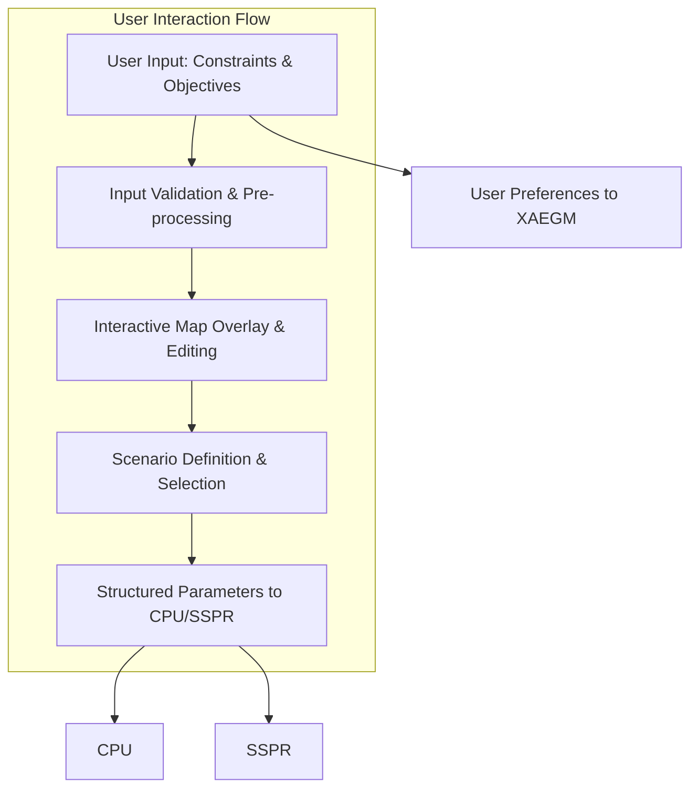
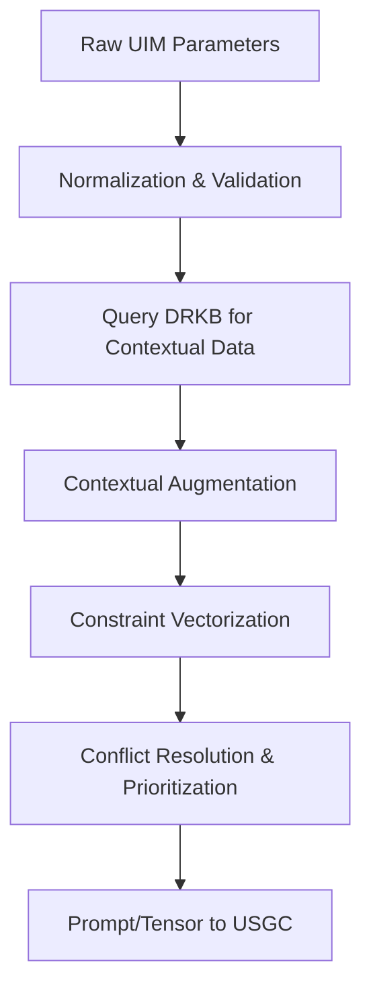
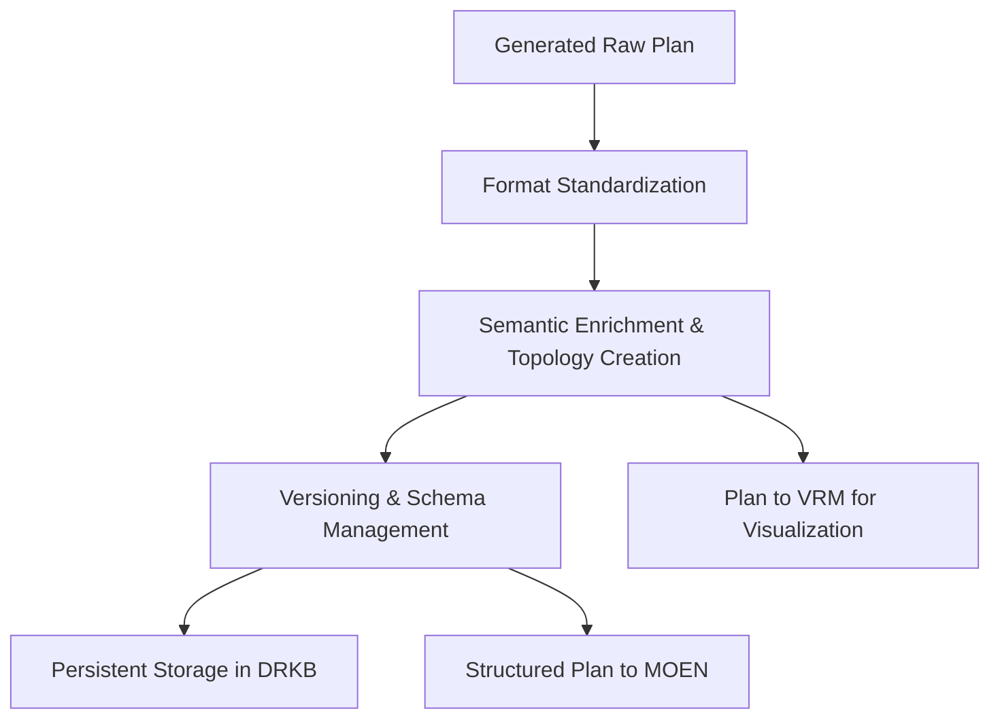
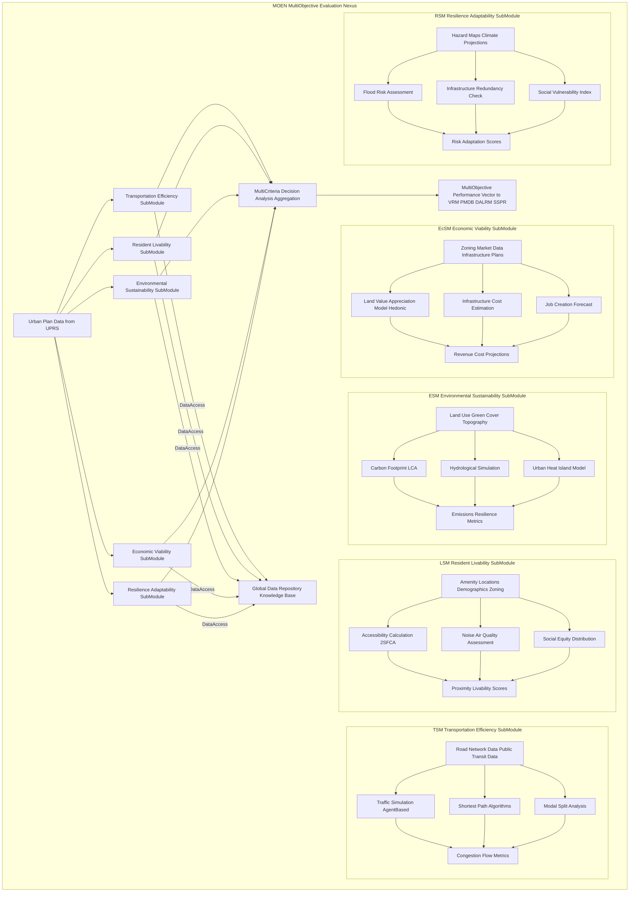
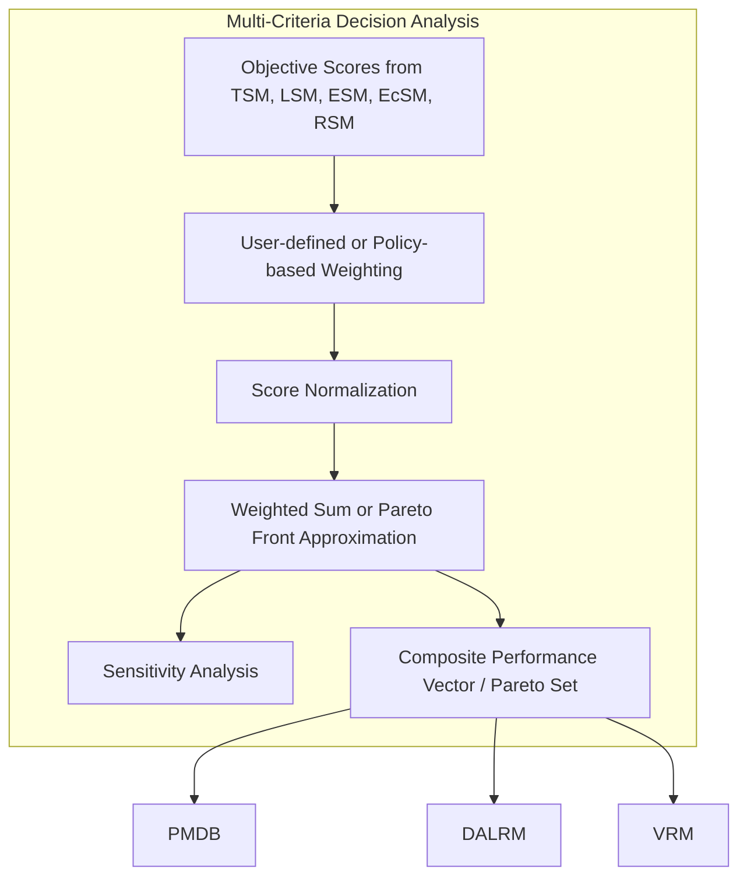
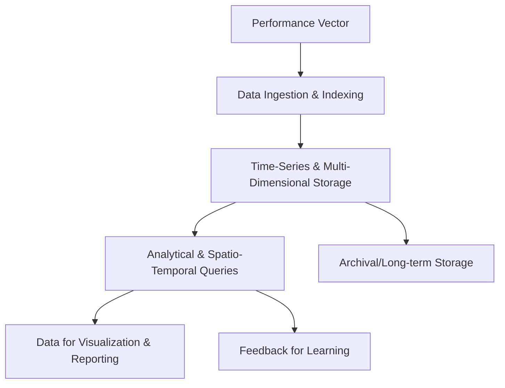
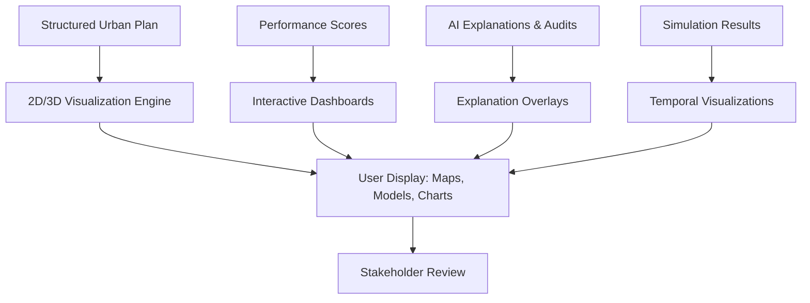
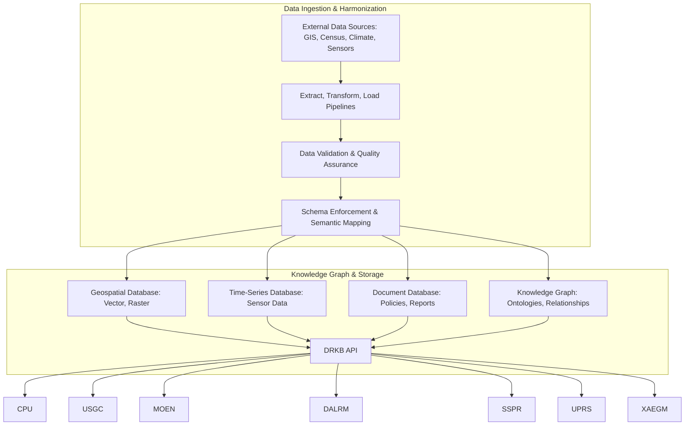
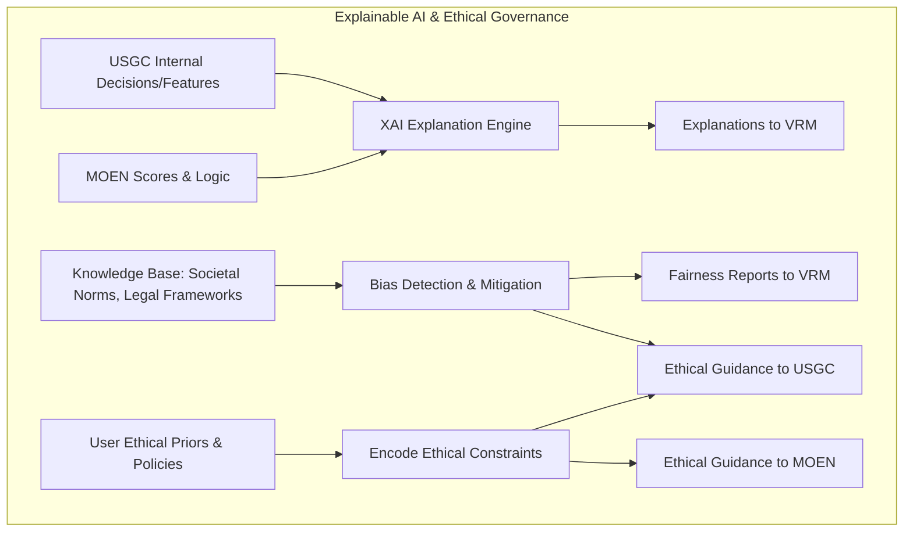
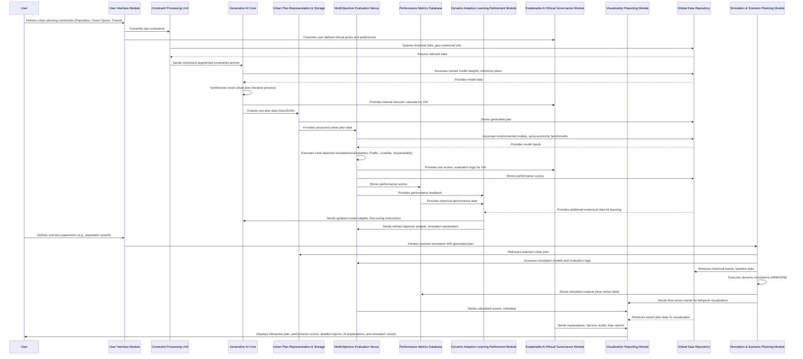

**Title of Invention:** A System and Method for Proactive Multi-Objective Generative Synthesis and Evaluative Assessment in Urban-Socio-Economic Planning Paradigms

**Abstract:**
A profoundly innovative system for the generative synthesis and rigorous multi-objective evaluation of urban planning schemata is herewith disclosed. This advanced computational framework is predicated upon the reception of a meticulously articulated lexicon of high-level constraints and aspirational objectives pertinent to a prospective urban development, encompassing parameters such as projected demographic density, stipulated ecological permeability quotients e.g., minimum green space percentage, and primary intermodal transit infrastructure prioritization. At its operational core resides a sophisticated Artificial Intelligence AI architectonic, meticulously pre-trained on an expansive, heterogeneous corpus comprising extant urban blueprints, validated urban design principles, geospatial topological datasets, and socio-economic demographic patterns. This generative AI paradigm is engineered to autonomously synthesize novel, highly granular urban layouts, rigorously endeavoring to achieve optimal reconciliation and satisfaction of the specified multi-faceted constraints and objectives. Subsequent to generation, each emergent plan undergoes a stringent, quantitative evaluation against a plurality of orthogonal objective functions, encompassing but not limited to, systemic efficiency metrics, holistic livability indices, and comprehensive ecological sustainability indicators. This culminates in the provision of a quantitatively assessed, multi-dimensional quality vector, furnishing an unimpeachable assessment of the proposed design's inherent efficacy and viability.

**Background of the Invention:**
The orchestration of urban planning and territorial design represents an intrinsically intricate, profoundly multidisciplinary endeavor, situated at the nexus of socio-economic dynamics, ecological imperatives, infrastructural engineering, and aesthetic considerations. The formidable challenge of conceiving and implementing new metropolitan areas or district reconfigurations that simultaneously achieve operational efficiency, environmental resilience, and an elevated quality of life for its inhabitants is fraught with an expansive array of complex trade-offs and interdependencies. Conventional methodologies for urban design are characterized by protracted developmental cycles, intensive manual labor inputs, a pronounced reliance on iterative, heuristic-driven adjustments, and an often-suboptimal exploration of the vast combinatorial design space. Such traditional processes are inherently limited by cognitive biases, computational bottlenecks, and the sheer scale of interconnected variables, frequently leading to suboptimal solutions that fail to holistically address contemporary urban challenges such as climate change resilience, equitable resource distribution, or burgeoning population pressures. Consequently, there exists an acute and demonstrable need for a transformative computational instrument capable of substantively augmenting the human planning paradigm by rapidly synthesizing a diverse repertoire of viable, data-driven design alternatives, rigorously informed by high-level strategic directives and predicated upon a comprehensive understanding of urban system dynamics. The present innovation directly addresses these critical deficiencies, providing an unparalleled capability for proactive, intelligent urban foresight.

**Brief Summary of the Invention:**
The present innovation delineates a sophisticated computational system providing an intuitive interface through which a user can input a comprehensive set of foundational constraints and aspirational objectives for an urban development schema. Upon receipt, these parameters are securely transmitted to a proprietary generative Artificial Intelligence AI model, herein designated as the Urban Synthesis Generative Core USGC. The USGC, functioning as an advanced algorithmic urban architect, autonomously synthesizes a novel, detailed urban layout. This synthesized plan can be rendered as a high-fidelity geospatial representation e.g., a 2D raster image, a 3D volumetric model, or a structured data format such as GeoJSON or CityGML, capable of encapsulating intricate topological and semantic urban elements. Following the generative phase, the resultant layout is systematically processed by a suite of analytical models, collectively forming the Multi-Objective Evaluative Nexus MOEN. The MOEN rigorously assesses the generated plan against a pre-defined battery of key performance indicators, encompassing, but not limited to, network fluidity indices e.g., simulated traffic flow efficiency, pedestrian permeability, proximity and accessibility metrics to essential amenities e.g., green space access, public service reachability, constituting a holistic livability index, and comprehensive environmental impact assessments e.g., estimated carbon sequestration potential, energy consumption footprints, material flow analysis, defining sustainability. The ultimate deliverable presented to the user comprises the visually rendered urban plan juxtaposed with its meticulously computed multi-objective performance vector, thereby enabling rapid iteration, comparative analysis, and enlightened exploration of diverse urban design philosophies and their quantifiable ramifications.

**Detailed Description of the Invention:**

The architecture of this invention is a highly integrated, modular system designed for maximum extensibility and computational robustness. It comprises several interconnected functional units, ensuring a seamless workflow from initial constraint definition to final plan presentation and analysis.

### System Architecture Overview

The system operates through a structured pipeline, as illustrated in the following Mermaid diagram, detailing the primary components and their interactions:

```mermaid
graph TD
    A[User Interface Module UIM] --> B{Constraint Processing Unit CPU}
    B --> C[Generative AI Core USGC]
    C --> D[Urban Plan Representation & Storage UPRS]
    D --> E{Multi-Objective Evaluation Nexus MOEN}
    E --> F[Performance Metrics Database PMDB]
    E --> G[Visualization & Reporting Module VRM]
    UPRS --> G
    F --> G
    CPU --> DataRepository
    USGC --> DataRepository
    MOEN --> DataRepository
    DataRepository[Global Data Repository & Knowledge Base]

    MOEN --> H[Dynamic Adaptive Learning & Refinement Module DALRM]
    PMDB --> H
    DataRepository --> H
    H --> C
    H --> E

    UIM --> I[Explainable AI & Ethical Governance Module XAEGM]
    C --> I
E --> I
I --> G

    %% New Module SSPR
    E --> J[Simulation & Scenario Planning Module SSPR]
    J --> G
    J --> D
    J --> DataRepository
    UIM --> J %% User can initiate simulations or define scenarios via UIM
```

**A. User Interface Module UIM:**
This module provides an intuitive, interactive environment for stakeholders urban planners, policymakers, developers to define the initial parameters of the urban design challenge. Input is facilitated via dynamically configurable forms, sliders, and interactive map overlays. The UIM is engineered for accessibility, allowing users to interact with complex planning parameters through a simplified, yet powerful, abstraction layer.


*   **Input Parameters:**
    *   `Demographic Density Target`: E.g., `Population: 1,000,000` or `Density: 5,000 residents/km^2`. Fine-grained control over population distribution patterns e.g., uniform, clustered around transit hubs, age demographics.
    *   `Ecological Permeability Quotient`: E.g., `Green Space: 30% minimum`, specifying distribution patterns e.g., contiguous large parks vs. distributed pocket parks, biodiversity targets, tree canopy coverage, stormwater retention capacity.
    *   `Primary Transit Modality`: E.g., `Primary Transit: Light Rail`, `Walkability Index: 0.8 high`, `Autonomous Vehicle Integration: Level 5 ready`. Includes public transit frequency, last-mile solutions, cycling infrastructure.
    *   `Socio-Economic Stratification Targets`: E.g., `Affordable Housing: 20%`, `Commercial-to-Residential Mix: 1:3`. Also includes income diversity, social equity metrics, access to education and healthcare facilities, cultural amenities.
    *   `Geographic Site Specifications`: Boundary polygons, topographical data, existing infrastructure overlays, environmental hazard zones, historical designations, soil composition.
    *   `Aesthetic/Stylistic Directives`: E.g., `Historical Preservation Areas`, `Modernist Architectural Preference`. Includes building material preferences, urban form characteristics e.g., courtyard vs. tower, street canyon ratios.
    *   `Resource Consumption Targets`: E.g., `Energy Consumption: -25% vs. baseline`, `Water Usage: -30% vs. baseline`, `Waste Generation: -50% vs. baseline`.
    *   `Resilience Parameters`: E.g., `Flood Protection: 100-year event`, `Seismic Resistance: Zone 4`, `Emergency Service Proximity: <10 min response`.

**B. Constraint Processing Unit CPU:**
Upon submission from the UIM, the CPU performs several critical functions. This unit acts as an intelligent interpreter, translating human intent into machine-actionable directives.


1.  **Parameter Normalization and Validation:** Ensures all input constraints conform to predefined ranges and data types, resolving potential ambiguities or conflicts. This involves unit conversion, data type checks, and range enforcement. For instance, a percentage value must be between 0 and 100.
2.  **Constraint Vectorization:** Transforms the diverse user inputs into a structured, machine-readable constraint vector `C_vec`, suitable for interpretation by the Generative AI Core. This involves encoding categorical variables e.g., one-hot encoding for land-use types, scaling numerical values to a common range e.g., [0, 1], and potentially performing dimensionality reduction using techniques like Principal Component Analysis PCA if the input space is too large.
3.  **Contextual Augmentation:** Augments the user-defined constraints with relevant contextual data retrieved from the Global Data Repository & Knowledge Base, such as regional climate data, geological surveys, existing zoning laws, historical growth patterns, and demographic trends of adjacent areas. This enriches the input with real-world complexities.
4.  **Prompt Generation for USGC:** Dynamically constructs a highly specific, context-rich prompt or input tensor for the Generative AI Core, tailored to guide the synthesis process effectively. For text-based generative models, this could be a detailed descriptive prompt; for tensor-based models, it involves constructing a multi-channel input tensor representing the initial conditions and constraints.
5.  **Constraint Conflict Resolution and Prioritization:** Identifies and suggests resolutions for conflicting constraints e.g., extremely high density requirements combined with very large green space mandates. This might involve rule-based systems or optimization solvers to find the best compromise or alert the user.

**C. Generative AI Core USGC:**
This is the intellectual heart of the invention, responsible for synthesizing novel urban plans. It operates as a complex, multi-layered generator capable of producing coherent and functional urban topologies.

```mermaid
graph TD
    CPU_Input[Vectorized Constraints C_vec] --> USGC_Latent_Space[Latent Space Sampling/Encoding]
    USGC_Latent_Space --> USGC_Macro[Macro-Layout Generation (Zoning, Major Arteries)]
    USGC_Macro --> USGC_Meso[Meso-Scale Infilling (Blocks, Local Streets, Amenities)]
    USGC_Meso --> USGC_Micro[Micro-Detailing (Building Footprints, Parcels, Pathways)]
    USGC_Micro --> USGC_Refine[Iterative Refinement & Constraint Adherence]
    USGC_Refine --> UPRS[Generated Urban Plan]
    DRKB[Knowledge Base: Training Data, Design Principles] --> USGC_Latent_Space
    DALRM[Feedback from DALRM] --> USGC_Refine
```
*   **Model Architecture:** The USGC employs a sophisticated multi-modal generative model, potentially combining aspects of:
    *   **Generative Adversarial Networks GANs:** A Generator network synthesizes candidate plans from noise and `C_vec`, while a Discriminator network evaluates their plausibility and adherence to design principles against real-world plans and design guidelines. The adversarial process drives the Generator towards highly realistic and functional outputs.
    *   **Variational Autoencoders VAEs:** Encode existing city plans into a compact, continuous latent spatial representation, allowing for interpolation between designs and generation of new, diverse plans by sampling from this latent space, while maintaining a degree of structural coherence and realism.
    *   **Transformer Networks (Spatial Transformers):** Adapted to process spatial graph representations of urban elements e.g., nodes for buildings/parks, edges for roads/utilities, utilizing self-attention mechanisms to understand long-range dependencies and intricate relationships across the urban fabric. This enables the generation of complex, interconnected urban topologies.
    *   **Graph Neural Networks GNNs:** For modeling relationships between urban elements e.g., proximity of services to residential zones, connectivity of transportation networks. GNNs can directly operate on the graph representation of a city, inferring optimal connections and placements.
*   **Training Data:** The USGC is trained on a monumental dataset encompassing:
    *   Geospatial vector data of global cities parcels, buildings, road networks, land use, utility lines, elevation models.
    *   High-resolution satellite imagery and aerial photographs, processed to extract semantic features.
    *   Urban planning guidelines, zoning codes, historical master plans, and regulatory documents.
    *   Socio-economic census data correlated with spatial layouts and demographic shifts.
    *   Environmental impact assessments and performance metrics of existing urban areas, including energy consumption, air quality, green space usage.
    *   Synthetic data generated from rule-based systems or prior simulations to augment scarce real-world data.
*   **Generative Process:** The USGC iteratively refines a nascent urban schema, starting from initial noise or a constrained seed, progressively adding layers of detail:
    1.  **Macro-Layout Generation:** Defines high-level zoning e.g., residential, commercial, industrial, major transportation arteries, and large green spaces. This stage establishes the fundamental spatial organization.
    2.  **Meso-Scale Infilling:** Delineates blocks, local streets, and distribution of public amenities e.g., schools, hospitals, parks within the macro-zones. This stage adds structure and connectivity.
    3.  **Micro-Detailing:** Specifies building footprints, parcel subdivisions, pedestrian pathways, public squares, and street furniture. This stage imbues the plan with fine-grained detail.
*   **Latent Space Exploration:** The USGC can leverage its latent space to:
    *   **Interpolate:** Generate hybrid plans by navigating between two existing or previously generated plans' latent representations, allowing for smooth transitions between design philosophies.
    *   **Extrapolate:** Explore novel design paradigms by moving beyond current known examples in the latent space, potentially discovering innovative solutions.
    *   **Constrained Sampling:** Focus generation within regions of the latent space that are known to satisfy specific, hard constraints, ensuring feasibility from the outset.
    *   **Diversity Control:** Adjust a "temperature" parameter in latent space sampling to control the diversity versus typicality of generated plans.

**D. Urban Plan Representation & Storage UPRS:**
This module is responsible for standardizing the generated urban plan into a universally accessible and computationally tractable format. It ensures semantic richness and structural integrity.


*   **Data Structures:** The plan is typically represented as a multi-layered geospatial data structure, such as:
    *   **GeoJSON:** For geometric features polygons for parcels, lines for roads, points for amenities. This offers lightweight, web-friendly data exchange.
    *   **CityGML/Open Geospatial Consortium OGC Standards:** For rich semantic information and 3D modeling, allowing for detailed attribute data for urban objects e.g., building height, material, function, and hierarchical relationships.
    *   **Topological Graphs:** Representing connectivity of networks roads, utilities, pedestrian paths and adjacencies of land use types. This is crucial for network-based analyses.
    *   **Raster Data:** For environmental overlays like elevation, slope, solar radiation, or vegetation density.
*   **Persistent Storage:** Generated plans are archived in the Global Data Repository & Knowledge Base for future reference, comparative analysis, and potential re-training of the USGC. Each plan receives a unique identifier and is associated with its generative parameters and performance metrics.
*   **Versioning and Schema Management:** The UPRS incorporates robust mechanisms for versioning urban plans, enabling tracking of iterative refinements, user modifications, and changes over time. It also manages data schemas to ensure consistency and interoperability across different planning paradigms, historical data, and external data sources, maintaining data integrity.
*   **Semantic Interoperability:** Employs ontologies and semantic web technologies to link urban elements to broader knowledge bases, enabling richer querying and understanding of functional relationships.

**E. Multi-Objective Evaluation Nexus MOEN:**
This sophisticated module performs a comprehensive, quantitative assessment of the generated urban plan against a predefined suite of objective functions.

*   **Modular Architecture:** The MOEN is composed of multiple specialized analytical sub-modules, each focusing on a specific dimension of urban performance. Each sub-module leverages advanced simulation techniques and computational models.
    1.  **Transportation Efficiency Sub-Module:**
        *   **Metrics:** Average commute time, traffic congestion indices e.g., Volume/Capacity ratio, public transit accessibility scores e.g., 2SFCA, pedestrian network connectivity, last-mile efficiency, modal split percentages, carbon emissions from transport.
        *   **Methodology:** Utilizes agent-based microscopic traffic simulation models e.g., SUMO, AIMSUN, shortest path algorithms on weighted graph representations of road and transit networks e.g., Dijkstra, A*, and network flow optimization techniques. Demand-supply equilibrium models for transport networks.
    2.  **Resident Livability Sub-Module:**
        *   **Metrics:** Proximity to green spaces, access to essential services hospitals, schools, retail, cultural amenities, noise pollution levels e.g., L_den, air quality indices e.g., PM2.5, NOx, public safety metrics, walkability/bikeability scores, social equity distribution, availability of public spaces.
        *   **Methodology:** Employs spatial impedance models, kernel density estimations, accessibility analysis via network distance calculations e.g., 15-minute city concept, and socio-economic data overlay analysis. Integrates indicators like social cohesion through community interaction potential and cultural amenity access.
    3.  **Environmental Sustainability Sub-Module:**
        *   **Metrics:** Estimated carbon footprint embodied energy of materials, operational energy for buildings/transport, renewable energy generation potential, biodiversity indices habitat connectivity, green cover, ecosystem service provision, waste generation forecasts, water resource management efficiency stormwater runoff, potable water demand, urban heat island effect mitigation, material flow analysis for circular economy.
        *   **Methodology:** Integrates hydrological models e.g., SWMM, urban climate simulations e.g., ENVI-met, life cycle assessment LCA for built environment components, ecological network analysis, and energy demand forecasting models. Utilizes remote sensing data for current environmental conditions.
    4.  **Economic Viability Sub-Module (Optional but recommended):**
        *   **Metrics:** Land value appreciation potential, infrastructure cost estimates, job creation forecasts by sector, property tax revenue projections, return on investment ROI for public and private ventures, affordability indices, economic diversity.
        *   **Methodology:** Incorporates econometric models, real estate market simulations, cost-benefit analysis frameworks, and fiscal impact assessments. Utilizes spatial hedonic pricing models and input-output models for regional economic impact.
    5.  **Resilience and Adaptability Sub-Module (New):**
        *   **Metrics:** Flood risk assessment, earthquake resistance, infrastructure redundancy and robustness, social vulnerability to shocks, climate change adaptation capacity, energy grid reliability, food security capacity.
        *   **Methodology:** Uses climate projection models, hazard mapping, network robustness analysis e.g., k-connectivity, betweenness centrality, and social vulnerability indices to quantify a plan's ability to withstand and recover from various stressors and disruptions. Models cascading failures.
*   **Multi-Criteria Decision Analysis MCDA:** The individual scores from each sub-module are aggregated and weighted according to user-defined priorities or pre-configured policy frameworks into a composite multi-objective performance vector. Techniques such as AHP Analytic Hierarchy Process, TOPSIS Technique for Order Preference by Similarity to Ideal Solution, PROMETHEE, or weighted sum models are employed to generate an overall `harmonyScore` or to identify non-dominated solutions. This allows for transparent trade-off analysis.

### Multi-Objective Evaluation Nexus MOEN Internal Structure

The internal workings of the Multi-Objective Evaluation Nexus are further detailed below, illustrating the flow from urban plan data through various specialized analytical sub-modules to derive a comprehensive performance vector.



### Multi-Criteria Decision Analysis (MCDA) in MOEN

The MCDA component within MOEN is critical for synthesizing the diverse performance metrics into actionable insights. It provides a framework for transparently weighing competing objectives.



**F. Performance Metrics Database PMDB:**
A specialized, high-performance database optimized for storing and querying the multi-dimensional performance vectors generated by the MOEN. This allows for:


*   Historical tracking of generated plans and their performance evolution over design iterations.
*   Benchmarking against various objectives and comparing performance against internal baselines or external best practices.
*   Facilitating comparative analysis between different design iterations or alternative scenarios.
*   Identifying Pareto-optimal or near-Pareto-optimal solutions from a set of generated plans, offering a palette of trade-offs.
*   Supporting spatio-temporal queries for performance trends, allowing analysis of how metrics change across different parts of the city or over simulated time.
*   Integrating with data warehousing solutions for advanced business intelligence and predictive analytics on urban performance.

**G. Visualization & Reporting Module VRM:**
This module renders the generated urban plans and their associated performance scores in an accessible and insightful manner, providing intuitive interfaces for exploration and communication.


*   **Visual Output:**
    *   Interactive 2D maps with configurable layers land use, zoning, transportation networks, green spaces, utility lines, population density, real-time sensor data overlays.
    *   3D city models, allowing for virtual walkthroughs, immersive exploration, and shadow/solar radiation analysis.
    *   Heatmaps illustrating various performance metrics e.g., traffic congestion hotspots, areas of low green space access, noise pollution, urban heat island effect, land value distribution.
    *   Dynamic dashboards providing real-time data visualization during simulation scenarios, allowing users to track key performance indicators over time.
    *   Augmented Reality (AR) and Virtual Reality (VR) integration for immersive stakeholder engagement and public consultations.
*   **Reporting:**
    *   Tabular summaries of all objective scores, allowing for quick quantitative review.
    *   Radar charts or spider plots to visually compare multi-objective performance across different design iterations or against benchmarks.
    *   Detailed analytical reports explaining the methodologies behind the scoring, highlighting key strengths and weaknesses of a plan, and suggesting potential areas for improvement.
    *   **Explainable AI XAI Integration:** Provides insights into *why* the USGC generated a particular feature or *why* the MOEN assigned specific scores, enhancing transparency and trust. E.g., "The high livability score in Sector A is primarily due to the 15-minute walking distance to 80% of essential services and its direct adjacency to a major linear park, as determined by the spatial accessibility model."
    *   **Customizable Report Generation:** Users can define specific report templates, focusing on particular metrics or stakeholders e.g., environmental impact report for regulatory bodies, economic feasibility study for developers, public consultation brief. Supports export in various formats (PDF, CSV, image).

**Global Data Repository & Knowledge Base DRKB:**
This central repository serves as the foundational data infrastructure for the entire system, providing a harmonized and continuously updated source of information. Its role is paramount in ensuring data consistency, integrity, and contextual relevance across all modules.


*   **Structure and Content:** The DRKB is a federated data system, integrating diverse datasets, including:
    *   **Geospatial Basemaps:** High-resolution satellite imagery, cadastral maps, topographical elevations, hydrological networks, geological fault lines, land cover classifications.
    *   **Urban Fabric Data:** Existing building footprints, land-use zoning, infrastructure networks roads, utilities, public transit routes, green spaces, historical sites, building permits.
    *   **Socio-Economic Data:** Census data population density, income levels, age distribution, employment patterns, educational attainment, health statistics, social equity indicators, crime rates.
    *   **Environmental Data:** Historical climate data, air quality indices, noise pollution maps, biodiversity hotspots, geological surveys, soil types, solar potential maps.
    *   **Policy and Regulatory Data:** National, regional, and local planning regulations, zoning ordinances, environmental protection acts, building codes, urban design guidelines, master plans (past and present).
    *   **Benchmarks and Best Practices:** Datasets of exemplary urban developments, validated design principles, and performance benchmarks from successful projects globally.
    *   **Real-time Sensor Data (Optional):** Integration with urban sensor networks for dynamic updates on traffic, air quality, energy consumption, water usage, waste levels, and public space utilization, enabling real-world calibration and validation of models.
*   **Data Harmonization and Interoperability:** The DRKB employs robust ETL Extract, Transform, Load processes and adheres to international geospatial data standards e.g., ISO 191xx series, CityGML, GeoJSON, INSPIRE to ensure seamless data exchange and compatibility across modules. It includes semantic web technologies e.g., RDF, OWL for knowledge graph representation, enabling complex queries, inferencing, and contextual understanding.
*   **Data Security and Privacy:** Implements advanced data encryption, access control mechanisms, anonymization and pseudonymization techniques, particularly for sensitive socio-economic and demographic data, to ensure compliance with privacy regulations e.g., GDPR, CCPA and safeguard stakeholder information. Regular security audits and compliance checks are performed.
*   **Role in System:**
    *   **CPU:** Provides contextual data for constraint augmentation and validation.
    *   **USGC:** Supplies training data, reference designs, environmental parameters, and historical patterns for plan synthesis.
    *   **MOEN:** Delivers simulation models, benchmarks, and baseline data for objective function calculations and performance simulations.
    *   **DALRM:** Feeds historical performance, real-world data, and policy updates for continuous system improvement and model retraining.
    *   **SSPR:** Offers dynamic parameters, baseline scenarios, and historical trends for "what-if" analyses and future projections.
    *   **XAEGM:** Provides data for bias detection and ethical impact assessment.

**H. Dynamic Adaptive Learning & Refinement Module DALRM:**
This module is designed to enable the continuous evolution and improvement of the entire system by leveraging feedback loops from the evaluation process and real-world data.

```mermaid
graph TD
    subgraph Reinforcement Learning Loop
        USGC[Generative AI Core] -->|Action: Generate Plan P| MOEN[MOEN Evaluation]
        MOEN -->|Reward: Performance Vector R(P)| DALRM_RL[Reinforcement Learning Agent]
        PMDB[Performance Metrics Database] -->|State: Historical Performance| DALRM_RL
        DRKB[Global Data Repository] -->|Context: Real-world Data| DALRM_RL
        DALRM_RL -->|Policy Update: Model Weights| USGC
        DALRM_RL -->|Parameter Adjustment: Objective Weights| MOEN
    end
    DALRM_RL --> MetaLearning[Meta-Learning & Transfer Learning]
    DALRM_RL --> ActiveLearning[Active Learning Module]
    ActiveLearning --> UIM[Request for Expert Feedback]
```
*   **Purpose:** To refine the Generative AI Core USGC's synthesis capabilities and the Multi-Objective Evaluation Nexus MOEN's accuracy and weighting schemes over time, ensuring the system remains relevant and performs optimally under evolving conditions.
*   **Methodology:**
    *   **Reinforcement Learning RL Framework:** Treats the generation of urban plans by the USGC as an agent's actions within an environment, with the MOEN's performance vectors serving as dynamic, multi-dimensional reward signals. The state of the environment includes historical performance, constraints, and real-world data from DRKB. This allows the USGC to learn optimal generative policies through iterative trial and error, guided by quantifiable outcomes and exploring the design space more efficiently. Algorithms like Proximal Policy Optimization (PPO) or Actor-Critic methods can be employed.
    *   **Meta-Learning and Transfer Learning:** Develops capabilities to adapt pre-trained USGC models to new geographic, climatic, or cultural contexts with minimal additional training data. It learns to learn effective planning strategies across a diverse range of urban challenges by identifying common underlying patterns in optimal planning.
    *   **Self-Correction for MOEN:** Analyzes discrepancies between predicted MOEN performance and actual real-world performance (if post-deployment sensor or survey data is available). This feedback loop is used to fine-tune MOEN's simulation parameters, refine underlying models e.g., traffic flow constants, and dynamically adjust objective function weights, ensuring the evaluation remains highly relevant and accurate.
    *   **Active Learning:** Identifies areas where the USGC or MOEN exhibit high uncertainty in generation or evaluation, or where performance is sub-optimal. It then selectively requests additional data or human expert feedback to target specific learning deficiencies, optimizing the human-in-the-loop interaction.
*   **Inputs:** Performance metrics from PMDB, archived plans from UPRS, real-world urban sensor data e.g., traffic counts, environmental quality, public transit usage where available, contextual data from Global Data Repository & Knowledge Base.
*   **Outputs:** Updated model weights and architectures for USGC, dynamically adjusted weighting schemas for MOEN's multi-criteria decision analysis, refined simulation parameters for MOEN's sub-modules, and actionable insights for system improvement.

**I. Explainable AI & Ethical Governance Module XAEGM:**
This critical module ensures transparency, accountability, and fairness in the AI-driven urban planning process, addressing potential biases and enhancing trust among stakeholders.


*   **Purpose:** To elucidate the rationale behind AI-generated plans and their evaluations, detect and mitigate biases inherent in data or models, and integrate ethical considerations into the planning paradigm. It fosters trust by making the "black box" more transparent.
*   **Methodology:**
    *   **Post-hoc Explainability Techniques:** Employs methods like LIME Local Interpretable Model-agnostic Explanations and SHAP SHapley Additive exPlanations to provide local explanations for specific design choices or evaluation outcomes. It can highlight which input constraints or learned features most influenced a particular section of the generated plan or a specific performance score. For example, indicating why a certain area was designated for green space based on micro-climate benefits and historical land use.
    *   **Counterfactual Explanations:** Generates alternative scenarios showing how a slight change in input constraints would lead to a different outcome, helping users understand the sensitivities and trade-offs. E.g., "If green space percentage was increased by 5%, residential density would decrease by 10% in this sector due to zoning regulations, resulting in a higher environmental score but lower economic viability."
    *   **Bias Detection and Mitigation:** Systematically analyzes the training data corpus and generated plans for historical, geographical, or socio-economic biases e.g., unequal access to amenities for specific demographic groups. Implements fairness metrics e.g., disparate impact, equalized odds to ensure equitable distribution of resources, services, and environmental benefits across demographic groups. Provides mechanisms for re-weighting objectives or adding constraints to counteract detected biases and promote inclusive urban development.
    *   **Ethical Policy Integration:** Translates user-defined ethical priors and societal values e.g., privacy, cultural heritage preservation, environmental justice, equitable access to opportunities from the UIM into quantifiable constraints or soft objectives that guide the USGC and MOEN. This ensures that the AI's objectives are aligned with human values.
    *   **Audit Trail and Accountability:** Maintains a comprehensive audit trail of all generative decisions, evaluation scores, user interventions, and XAI insights, ensuring traceability and accountability for all outputs. This is crucial for regulatory compliance and dispute resolution.
*   **Inputs:** User-defined ethical priors and policy guidelines from UIM, internal representations and decision paths from USGC, raw objective scores and evaluation logic from MOEN, historical and socio-economic data from DRKB.
*   **Outputs:** Detailed explanatory narratives for VRM, interactive XAI dashboards, fairness audit reports, bias detection alerts, policy compliance checks, and feedback for model adjustments in USGC and MOEN.

**J. Simulation & Scenario Planning Module SSPR:**
This module empowers users to conduct dynamic "what-if" analyses and explore the long-term ramifications of different urban planning decisions or external factors. It extends the evaluative capabilities of the MOEN by enabling temporal projections and interaction modeling.

```mermaid
graph TD
    subgraph Simulation & Scenario Planning
        UIM_Scenario[User-defined Scenario Parameters] --> SSPR_Setup[Scenario Configuration]
        UPRS_Plan[Selected Urban Plan] --> SSPR_Setup
        MOEN_Models[MOEN Simulation Models] --> SSPR_Engine[Simulation Engine (ABM/SDM)]
        DRKB[Knowledge Base: Historical Trends, Baselines] --> SSPR_Engine
        SSPR_Setup --> SSPR_Engine
        SSPR_Engine --> SSPR_Results[Time-series Performance Metrics]
        SSPR_Results --> VRM[Temporal Visualizations & Reports]
        SSPR_Results --> PMDB[Store Simulation Outputs]
        SSPR_Engine --> DALRM[Feedback for Model Refinement]
    end
```
*   **Purpose:** To simulate the evolution of generated urban plans under varying conditions e.g., population growth, climate change, policy changes, economic shifts, and to assess the impact of specific interventions or external shocks. This allows for proactive planning, risk assessment, and long-term strategic foresight.
*   **Methodology:**
    *   **Agent-Based Modeling ABM:** Simulates the behavior of individual urban entities e.g., residents, households, vehicles, businesses, environmental agents, and their interactions within the generated urban environment. This provides a granular understanding of emergent patterns and system-level dynamics, particularly useful for traffic flow, social segregation, amenity usage, disease spread, or real estate market dynamics.
    *   **System Dynamics Modeling SDM:** Utilizes feedback loops and stock-and-flow diagrams to model complex interdependencies between urban sub-systems over time e.g., population-housing supply, economic growth-infrastructure demand, environmental quality-public health, energy demand-supply. SDM is effective for understanding macroscopic trends and policy impacts.
    *   **Policy Intervention Simulation:** Allows users to define hypothetical policy changes e.g., new public transit lines, increased green space mandates, carbon taxes, zoning modifications, and observe their projected impact on the multi-objective performance vector over specified time horizons. This enables evidence-based policy formulation.
    *   **Stochastic Event Modeling:** Incorporates probabilistic models for external events e.g., natural disasters, economic downturns, technological disruptions, pandemics to assess a plan's resilience and identify vulnerabilities. Monte Carlo simulations can be used to quantify risk.
    *   **Scenario Comparison:** Enables direct comparison of performance metrics and visual evolution between multiple simulated scenarios, helping decision-makers choose the most robust or desirable path.
*   **Inputs:** Generated urban plans from UPRS, performance metrics and simulation models from MOEN, historical and contextual data from DRKB, user-defined scenario parameters e.g., population growth rate, economic forecasts, climate change projections, policy levers from UIM.
*   **Outputs:** Time-series projections of performance metrics, visualization of simulated urban evolution e.g., traffic patterns, land value changes, demographic shifts, environmental quality changes in VRM, comparative reports highlighting differences between scenarios, risk assessments, and recommendations for adaptive strategies.



This integrated ecosystem allows for unparalleled rapid prototyping and rigorous evaluation of urban planning scenarios, accelerating the design process, optimizing resource allocation, and fostering the creation of more resilient, equitable, and sustainable urban environments.

**Claims:**
1.  A system for the autonomous generation and multi-objective assessment of urban planning schemata, comprising:
    a.  A User Interface Module UIM configured to receive a set of explicitly articulated, high-level user-defined constraints and aspirational objectives pertaining to an urban development.
    b.  A Constraint Processing Unit CPU operably coupled to said User Interface Module, configured to normalize, validate, and vectorize said received constraints into a structured computational representation, and to dynamically construct a contextually enriched input for a generative model.
    c.  A Generative AI Core USGC, operably coupled to said Constraint Processing Unit, comprising a multi-modal neural network architecture meticulously trained on a comprehensive corpus of urban design data, wherein said Generative AI Core is configured to autonomously synthesize a novel, detailed urban plan layout in response to said contextually enriched input.
    d.  An Urban Plan Representation & Storage module UPRS, operably coupled to said Generative AI Core, configured to formalize and persist said generated urban plan layout into a standardized, machine-readable geospatial data structure, and further configured for versioning and schema management of said urban plans.
    e.  A Multi-Objective Evaluation Nexus MOEN, operably coupled to said Urban Plan Representation & Storage module, comprising a plurality of specialized analytical sub-modules, each configured to quantitatively assess distinct facets of the generated urban plan against a predetermined set of objective functions to calculate a multi-dimensional performance vector.
    f.  A Visualization & Reporting Module VRM, operably coupled to said Urban Plan Representation & Storage module and said Multi-Objective Evaluation Nexus, configured to render an interactive visual representation of the generated urban plan and to display its associated multi-dimensional performance vector and detailed analytical reports to a user.

2.  The system of Claim 1, wherein the user-defined constraints and aspirational objectives include, but are not limited to, at least two parameters selected from the group consisting of: targeted demographic density, minimum ecological permeability quotient, designated primary intermodal transit infrastructure, socio-economic stratification targets, or specific geographic site specifications.

3.  The system of Claim 1, wherein the plurality of objective functions within the Multi-Objective Evaluation Nexus includes, but is not limited to, at least two metrics selected from the group consisting of: transportation network fluidity, holistic resident livability, environmental sustainability indices, economic viability projections, or urban resilience and adaptability.

4.  The system of Claim 1, wherein the Generative AI Core utilizes an architectural configuration selected from the group consisting of: a Generative Adversarial Network GAN, a Variational Autoencoder VAE, a Spatial Transformer Network, or a Graph Neural Network GNN, or any hybrid combination thereof.

5.  The system of Claim 1, wherein the Multi-Objective Evaluation Nexus further comprises a Multi-Criteria Decision Analysis MCDA framework configured to aggregate individual objective function scores into a composite harmony score, based on user-defined weightings or predefined policy frameworks.

6.  A method for intelligently synthesizing and rigorously evaluating urban plans, comprising:
    a.  Receiving, via a User Interface Module, a lexicon of high-level design constraints and aspirational objectives for an urban development.
    b.  Processing said lexicon of constraints through a Constraint Processing Unit to generate a vectorized and contextually augmented input.
    c.  Transmitting said augmented input to a Generative AI Core, which autonomously synthesizes a novel urban plan layout.
    d.  Storing said synthesized urban plan layout in a standardized geospatial format within an Urban Plan Representation & Storage module, including versioning of said layout.
    e.  Analyzing said stored urban plan layout against a plurality of orthogonal objective functions via a Multi-Objective Evaluation Nexus to compute a comprehensive multi-dimensional performance vector.
    f.  Displaying, via a Visualization & Reporting Module, the generated urban plan layout in an interactive visual format, juxtaposed with its associated multi-dimensional performance vector and explanatory analytical reports.

7.  The method of Claim 6, wherein the processing step b includes querying a Global Data Repository for historical and geo-contextual data to enrich the input for the Generative AI Core.

8.  The method of Claim 6, wherein the synthesizing step c involves iterative refinement of the urban plan across macro, meso, and micro scales of urban detail.

9.  The method of Claim 6, wherein the analyzing step e incorporates agent-based simulations for transportation efficiency and spatial impedance models for resident livability.

10. The method of Claim 6, further comprising providing explainable AI XAI insights alongside the displayed performance scores to elucidate the rationale behind generative decisions and evaluative outcomes.

11. The system of Claim 1, further comprising a Dynamic Adaptive Learning & Refinement Module DALRM operably coupled to said Multi-Objective Evaluation Nexus, said Performance Metrics Database, and said Generative AI Core, configured to continuously refine the generative model and evaluation parameters based on historical performance data and feedback.

12. The system of Claim 1, further comprising an Explainable AI & Ethical Governance Module XAEGM operably coupled to said User Interface Module, said Generative AI Core, said Multi-Objective Evaluation Nexus, and said Visualization & Reporting Module, configured to provide transparent insights into AI decisions, detect and mitigate biases, and ensure adherence to ethical policy frameworks.

13. A method for dynamically improving urban planning synthesis and evaluation, comprising:
    a. Utilizing performance data from the Multi-Objective Evaluation Nexus and historical records from the Performance Metrics Database to inform a Dynamic Adaptive Learning & Refinement Module.
    b. Employing said Dynamic Adaptive Learning & Refinement Module to iteratively fine-tune the Generative AI Core's model parameters and to adapt the Multi-Objective Evaluation Nexus's objective weightings and simulation parameters, optionally leveraging active learning strategies.

14. A method for enhancing transparency and ethicality in urban planning, comprising:
    a. Receiving user-defined ethical priors and policy guidelines via the User Interface Module.
    b. Intercepting internal decision processes from the Generative AI Core and raw evaluation scores from the Multi-Objective Evaluation Nexus by an Explainable AI & Ethical Governance Module.
    c. Generating post-hoc and counterfactual explanations, conducting fairness audits, and detecting biases using said Explainable AI & Ethical Governance Module.
    d. Presenting these explanations, audits, and bias reports to the user via the Visualization & Reporting Module alongside the generated plan and its performance.

15. The system of Claim 1, further comprising a Global Data Repository & Knowledge Base DRKB operably coupled to the Constraint Processing Unit, Generative AI Core, Multi-Objective Evaluation Nexus, Dynamic Adaptive Learning & Refinement Module, and Simulation & Scenario Planning Module, configured to provide harmonized geospatial, socio-economic, environmental, and policy data, and to ensure data security and privacy.

16. The system of Claim 1, further comprising a Simulation & Scenario Planning Module SSPR operably coupled to said User Interface Module, Urban Plan Representation & Storage module, Multi-Objective Evaluation Nexus, Global Data Repository & Knowledge Base, and Visualization & Reporting Module, configured to:
    a. Simulate the temporal evolution of generated urban plans under varying conditions and user-defined parameters.
    b. Assess the impact of specific policy interventions or external factors on multi-objective performance.
    c. Utilize agent-based modeling or system dynamics modeling to project future urban states.
    d. Provide scenario comparison reports and risk assessments to the user via the Visualization & Reporting Module.

17. A method for proactive urban planning and risk assessment, comprising:
    a. Selecting a generated urban plan from an Urban Plan Representation & Storage module.
    b. Defining a set of scenario parameters or hypothetical policy interventions via a User Interface Module.
    c. Transmitting said plan and scenario parameters to a Simulation & Scenario Planning Module.
    d. Executing dynamic simulations of the urban plan's evolution and performance using the Simulation & Scenario Planning Module, leveraging models from the Multi-Objective Evaluation Nexus and data from the Global Data Repository & Knowledge Base.
    e. Generating time-series projections of multi-objective performance metrics and comparative reports between scenarios.
    f. Displaying said projections, simulated visualizations, and reports to a user via a Visualization & Reporting Module.

18. The system of Claim 1, wherein the Constraint Processing Unit CPU further comprises a conflict resolution component configured to identify and suggest resolutions for conflicting user-defined constraints and objectives.

19. The system of Claim 1, wherein the Generative AI Core USGC is configured to generate urban plans by iteratively refining a nascent urban schema across macro-layout, meso-scale infilling, and micro-detailing stages.

20. The system of Claim 1, wherein the Urban Plan Representation & Storage module UPRS utilizes CityGML or OGC standards for encapsulating rich semantic and 3D geometric urban information.

21. The system of Claim 1, wherein the Multi-Objective Evaluation Nexus MOEN includes a Resilience and Adaptability Sub-Module configured to quantify a plan's ability to withstand and recover from external stressors using hazard mapping and network robustness analysis.

22. The system of Claim 1, wherein the Performance Metrics Database PMDB is optimized for spatio-temporal queries to identify performance trends across different urban zones or over time.

23. The system of Claim 1, wherein the Visualization & Reporting Module VRM integrates with Augmented Reality (AR) or Virtual Reality (VR) platforms for immersive urban plan exploration and stakeholder engagement.

24. The system of Claim 1, wherein the Global Data Repository & Knowledge Base DRKB employs semantic web technologies and ontologies to establish a knowledge graph for complex urban data relationships and inferencing.

25. The method of Claim 13, wherein the Dynamic Adaptive Learning & Refinement Module DALRM utilizes a Reinforcement Learning (RL) framework where the Multi-Objective Evaluation Nexus provides dynamic reward signals to the Generative AI Core.

26. The method of Claim 14, wherein the Explainable AI & Ethical Governance Module XAEGM actively monitors for and mitigates socio-economic or geographical biases in the generated plans and evaluation outcomes.

27. The system of Claim 16, wherein the Simulation & Scenario Planning Module SSPR is capable of incorporating stochastic event modeling to assess a plan's robustness against probabilistic disruptions such as natural disasters or economic shocks.

**Mathematical Justification: A Formal Epistemology of Multi-Objective Urban Synthesis and Optimization**

The problem addressed by this invention is formally embedded within the superordinate domain of high-dimensional, multi-objective combinatorial optimization under uncertainty. We herein delineate the foundational mathematical constructs that rigorously underpin the system's operational efficacy and intellectual provenance.

### I. The Space of All Possible City Plans P

Let `$\mathcal{P}$` denote the complete topological space encompassing all conceivable urban plans. This space is inherently an exceedingly high-dimensional, non-Euclidean manifold. An individual city plan `$\mathbf{p} \in \mathcal{P}$` can be conceptualized as a complex, heterogeneous graph-based or cellular automaton representation:

$$ \mathbf{p} = (\mathcal{G}, \mathbf{L}, \mathbf{A}, \mathbf{E}_{env}, \mathbf{I}_{infra}) $$

Where:
*   `$\mathcal{G} = (\mathcal{V}, \mathcal{E})$` represents the underlying geospatial graph topology of the urban fabric.
    *   `$\mathcal{V} = \{v_1, \dots, v_m\}$` is a set of vertices, representing discrete urban elements e.g., buildings, parcels, public amenities, intersections. Each `v_i` possesses a vector of attributes, `$\mathbf{attr}(v_i) \in \mathbb{R}^{d_v}$`, encoding its type, size, volumetric properties, and socio-economic characteristics.
    *   `$\mathcal{E} = \{e_1, \dots, e_k\}$` is a set of edges, representing spatial or functional relationships between vertices e.g., roads, pedestrian paths, utility conduits, adjacency relations. Each `e_j` possesses a vector of attributes, `$\mathbf{attr}(e_j) \in \mathbb{R}^{d_e}$`, encoding its capacity, length, connectivity, and hierarchical importance.
    *   The adjacency matrix `$\mathbf{M}_{adj} \in \{0,1\}^{m \times m}$` defines connectivity, where `$\mathbf{M}_{adj}[i,j]=1$` if `$(v_i, v_j) \in \mathcal{E}$`.
    *   The feature matrix `$\mathbf{X}_{\mathcal{V}} \in \mathbb{R}^{m \times d_v}$` concatenates all `$\mathbf{attr}(v_i)$`.
    *   The edge feature matrix `$\mathbf{X}_{\mathcal{E}} \in \mathbb{R}^{k \times d_e}$` concatenates all `$\mathbf{attr}(e_j)$`.
*   `$\mathbf{L}: \mathcal{V} \rightarrow \text{LandUseTypes}$` is a surjective mapping assigning a specific land-use category e.g., residential, commercial, industrial, green space, infrastructure to each vertex or delineated parcel within the plan. `$\text{LandUseTypes} = \{LU_1, \dots, LU_N\}$` is a finite set.
*   `$\mathbf{A}: \mathcal{P} \rightarrow \text{ArchitecturalStyles}$` or `$\mathbf{A}: \mathcal{V} \rightarrow \text{ArchitecturalStyles}$` represents a stylistic or aesthetic attribute assignment across the plan, possibly at a granular level.
*   `$\mathbf{E}_{env}$` represents the environmental and ecological embeddedness, including topographical data `$\mathbf{T}: \mathbb{R}^2 \rightarrow \mathbb{R}$`, hydrological networks `$\mathbf{H}$`, and micro-climatic zones `$\mathbf{MC}$`, which may constrain or influence `$\mathcal{G}$` and `$\mathbf{L}$.`
*   `$\mathbf{I}_{infra}$` represents the critical infrastructure layer, including utility networks `$\mathbf{U}$`, communication grids `$\mathbf{C}$`, and emergency services deployment `$\mathbf{S}$`, detailing their spatial layout and capacities.

The cardinality of `$\mathcal{P}$` is astronomically large, rendering exhaustive enumeration or traditional combinatorial search strategies computationally intractable. The space `$\mathcal{P}$` is not merely a Cartesian product of simple attributes; it possesses intricate topological and semantic interdependencies, where local changes propagate globally. We introduce the concept of a `$\mathcal{P}$-metric $d(\mathbf{p}_1, \mathbf{p}_2)$` that quantifies the dissimilarity between two urban plans, accounting for structural, functional, and semantic differences, potentially derived from optimal transport or graph edit distances.
A common graph edit distance `GED` is defined as:
$$ GED(\mathcal{G}_1, \mathcal{G}_2) = \min_{\text{edit path } P} \sum_{(u,v) \in P} \text{cost}(u,v) $$
Where `$\text{cost}(u,v)$` is the cost of transforming an element `u` into `v` (node insertion/deletion, edge insertion/deletion, attribute change).

### II. User-Defined Constraints and the Feasible Subspace P_c

Let `$\mathbf{C} = \{c_1, c_2, \dots, c_q\}$` be a set of `q` user-defined constraints and aspirational objectives. Each constraint `c_j` imposes a specific condition on the properties of a valid urban plan. These constraints delineate a feasible subspace `$\mathcal{P}_c \subseteq \mathcal{P}$`.
A plan `$\mathbf{p} \in \mathcal{P}$` is considered feasible if and only if it satisfies all constraints in `$\mathbf{C}$`. This can be formalized as a satisfaction function `$\mathcal{S}: \mathcal{P} \times \mathbf{C} \rightarrow \{0, 1\}$`, where `$\mathcal{S}(\mathbf{p}, \mathbf{C}) = 1$` if `$\mathbf{p}$` satisfies all `c_j \in \mathbf{C}$`, and `$\mathcal{S}(\mathbf{p}, \mathbf{C}) = 0$` otherwise.

Thus, the feasible subspace is defined as:
$$ \mathcal{P}_c = \{\mathbf{p} \in \mathcal{P} \mid \forall c_j \in \mathbf{C}, \text{ConstraintSatisfied}(\mathbf{p}, c_j) = 1\} $$

Constraints can be categorized:
*   **Hard Constraints:** Must be strictly satisfied. Let `$\mathcal{C}_H = \{h_1, \dots, h_r\}$` be the set of hard constraints. For a plan `$\mathbf{p}$` to be feasible, `$\forall h_i \in \mathcal{C}_H: h_i(\mathbf{p}) = \text{True}$`. Examples:
    *   Minimum green space percentage `$\frac{\text{Area}(\text{GreenSpace})}{\text{Area}(\text{Total})} \ge C_{min\_green}$`.
    *   Max building height in zone `Z`: `$\forall v_i \in \mathcal{V}_{\text{Zone Z}}: \text{height}(v_i) \le C_{max\_height}$`.
*   **Soft Constraints/Objectives:** Preferential, aimed at optimization rather than strict satisfaction. Let `$\mathcal{C}_S = \{s_1, \dots, s_t\}$` be the set of soft constraints. These are often translated into objective functions.
    *   Fuzzy satisfaction function for soft constraints: `$\mathcal{S}_{fuzzy}(\mathbf{p}, s_j) \in [0, 1]$`.
    *   The CPU converts these into a constraint vector `$\mathbf{C}_{vec} \in \mathbb{R}^{d_c}$`, typically by encoding numerical ranges, categorical labels, and spatial predicates into a dense vector or tensor representation.

The transformation from abstract linguistic directives in the UIM to concrete mathematical predicates defining `$\mathcal{P}_c$` is a non-trivial process executed by the Constraint Processing Unit, often involving fuzzy logic or probabilistic satisfaction functions for soft constraints.

### III. The Set of Multi-Objective Functions F

Let `$\mathcal{F} = \{f_1, f_2, \dots, f_n\}$` be a set of `n` objective functions, where each `f_i: \mathcal{P} \rightarrow \mathbb{R}` maps a given urban plan `$\mathbf{p}$` to a real-valued scalar representing its performance along a specific dimension e.g., livability, efficiency, sustainability, resilience, economic viability. Without loss of generality, we assume that a higher value for `$f_i(\mathbf{p})$` signifies a more desirable outcome for that objective.

Examples of these objective functions, rigorously defined by the MOEN:

*   `$f_1(\mathbf{p})$`: **Transportation Efficiency Index.** This is a composite metric.
    *   Average Commute Time (ACT): `$\text{ACT}(\mathbf{p}) = \frac{1}{|\mathcal{V}_{\text{res}}|^2} \sum_{v_i, v_j \in \mathcal{V}_{\text{res}}} \text{shortest\_path\_time}(v_i, v_j)$`.
    *   Traffic Congestion Index (TCI): `$\text{TCI}(\mathbf{p}) = \frac{1}{|\mathcal{E}_{\text{roads}}|} \sum_{e \in \mathcal{E}_{\text{roads}}} \left( \frac{\text{flow}(e)}{\text{capacity}(e)} \right)^k$`, where `k` is an exponent capturing non-linearity.
    *   Public Transit Accessibility (PTA): `$\text{PTA}(\mathbf{p}) = \frac{1}{|\mathcal{V}_{\text{res}}|} \sum_{v_i \in \mathcal{V}_{\text{res}}} \text{AccessibilityScore}(v_i, \text{PublicTransit})$`.
    *   Modal Split `MS(p)`: `$\text{MS}(\mathbf{p}) = (\text{car\_prop}, \text{PT\_prop}, \text{walk\_prop}, \text{bike\_prop})$`.
    *   `$f_1(\mathbf{p}) = \alpha_1 \cdot \frac{1}{\text{ACT}(\mathbf{p})} - \alpha_2 \cdot \text{TCI}(\mathbf{p}) + \alpha_3 \cdot \text{PTA}(\mathbf{p}) + \alpha_4 \cdot \text{walk\_prop}(\mathbf{p})$`.

*   `$f_2(\mathbf{p})$`: **Resident Livability Score.**
    *   Access to Amenities (AA): `$\text{AA}(\mathbf{p}) = \frac{1}{|\mathcal{V}_{\text{res}}|} \sum_{v_i \in \mathcal{V}_{\text{res}}} \left( \sum_{amenity \in \text{Amenities}} w_{\text{amenity}} \cdot e^{-\lambda \cdot \text{dist}(v_i, \text{amenity})} \right)$`.
    *   Noise Pollution Index (NPI): `$\text{NPI}(\mathbf{p}) = \frac{1}{|\mathcal{V}|} \sum_{v_i \in \mathcal{V}} \text{NoiseLevel}(v_i)$`.
    *   Air Quality Index (AQI): `$\text{AQI}(\mathbf{p}) = \frac{1}{|\mathcal{V}|} \sum_{v_i \in \mathcal{V}} \text{PM}_{2.5}(v_i)$`.
    *   Green Space Proximity (GSP): `$\text{GSP}(\mathbf{p}) = \frac{1}{|\mathcal{V}_{\text{res}}|} \sum_{v_i \in \mathcal{V}_{\text{res}}} \text{DistToNearestGreenSpace}(v_i)^{-1}$`.
    *   Social Equity Index (SEI): `$\text{SEI}(\mathbf{p}) = 1 - \text{Gini}(\text{AccessToResources}(\mathbf{p}))$`.
    *   `$f_2(\mathbf{p}) = \beta_1 \cdot \text{AA}(\mathbf{p}) - \beta_2 \cdot \text{NPI}(\mathbf{p}) - \beta_3 \cdot \text{AQI}(\mathbf{p}) + \beta_4 \cdot \text{GSP}(\mathbf{p}) + \beta_5 \cdot \text{SEI}(\mathbf{p})$`.

*   `$f_3(\mathbf{p})$`: **Environmental Sustainability Index.**
    *   Carbon Footprint (CF): `$\text{CF}(\mathbf{p}) = \sum_{\text{buildings } j} \text{EmbodiedEnergy}_j + \sum_{\text{buildings } j} \text{OperationalEnergy}_j + \text{TransportEmissions}(\mathbf{p})$`.
    *   Green Infrastructure Index (GII): `$\text{GII}(\mathbf{p}) = \text{GreenSpaceArea}(\mathbf{p}) + \text{TreeCanopyCover}(\mathbf{p}) + \text{StormwaterRetention}(\mathbf{p})$`.
    *   Urban Heat Island Effect (UHII): `$\text{UHII}(\mathbf{p}) = \frac{1}{|\mathcal{V}|} \sum_{v_i \in \mathcal{V}} (\text{SurfaceTemp}(v_i) - \text{RuralTemp})$`.
    *   Biodiversity Potential (BP): `$\text{BP}(\mathbf{p}) = \text{Connectivity}(\text{GreenSpaces}) \times \text{HabitatDiversity}(\mathbf{p})$`.
    *   Waste Generation Efficiency (WGE): `$\text{WGE}(\mathbf{p}) = 1 / \text{WastePerCapita}(\mathbf{p})$`.
    *   `$f_3(\mathbf{p}) = -\gamma_1 \cdot \text{CF}(\mathbf{p}) + \gamma_2 \cdot \text{GII}(\mathbf{p}) - \gamma_3 \cdot \text{UHII}(\mathbf{p}) + \gamma_4 \cdot \text{BP}(\mathbf{p}) + \gamma_5 \cdot \text{WGE}(\mathbf{p})$`.

*   `$f_4(\mathbf{p})$`: **Urban Resilience Index.**
    *   Flood Risk (FR): `$\text{FR}(\mathbf{p}) = \sum_{\text{areas } j} \text{ProbFlood}_j \times \text{DamageCost}_j$`.
    *   Infrastructure Redundancy (IR): `$\text{IR}(\mathbf{p}) = \frac{\text{NumPaths}(s,t)}{\text{ShortestPath}(s,t)}$` for critical nodes `$(s,t)$`.
    *   Social Vulnerability Index (SVI): `$\text{SVI}(\mathbf{p}) = \sum_{\text{demographic groups } k} w_k \cdot \text{Exposure}_k \cdot \text{Sensitivity}_k / \text{AdaptiveCapacity}_k$`.
    *   Energy Grid Reliability (EGR): `$\text{EGR}(\mathbf{p}) = 1 - \text{SAIDI}(\mathbf{p})$` (System Average Interruption Duration Index).
    *   `$f_4(\mathbf{p}) = -\delta_1 \cdot \text{FR}(\mathbf{p}) + \delta_2 \cdot \text{IR}(\mathbf{p}) - \delta_3 \cdot \text{SVI}(\mathbf{p}) + \delta_4 \cdot \text{EGR}(\mathbf{p})$`.

*   `$f_5(\mathbf{p})$`: **Economic Viability Index.**
    *   Land Value Appreciation (LVA): `$\text{LVA}(\mathbf{p}) = \sum_{j \in \text{parcels}} \text{predicted\_value\_increase}_j$`.
    *   Infrastructure Cost (IC): `$\text{IC}(\mathbf{p}) = \sum_{e \in \mathcal{E}_{\text{infra}}} \text{cost}(e) + \sum_{v \in \mathcal{V}_{\text{infra}}} \text{cost}(v)$`.
    *   Job Creation (JC): `$\text{JC}(\mathbf{p}) = \sum_{\text{land uses } LU_k} \text{JobsPerArea}(LU_k) \times \text{Area}(LU_k)$`.
    *   Property Tax Revenue (PTR): `$\text{PTR}(\mathbf{p}) = \sum_{j \in \text{parcels}} \text{TaxRate}_j \times \text{PropertyValue}_j$`.
    *   `$f_5(\mathbf{p}) = \epsilon_1 \cdot \text{LVA}(\mathbf{p}) - \epsilon_2 \cdot \text{IC}(\mathbf{p}) + \epsilon_3 \cdot \text{JC}(\mathbf{p}) + \epsilon_4 \cdot \text{PTR}(\mathbf{p})$`.

These functions are often highly complex, non-linear, non-convex, and computationally expensive to evaluate, requiring detailed simulations and spatial analysis. Furthermore, they are typically conflicting, meaning that improving performance on one objective often degrades performance on another e.g., maximizing population density vs. maximizing green space. The MOEN employs advanced simulation and analytical models to compute these values.

### IV. Multi-Objective Optimization and the Pareto Front

The objective is to find a plan `$\mathbf{p}^* \in \mathcal{P}_c$` that optimally balances the potentially conflicting objectives in `$\mathcal{F}$`. This is a canonical multi-objective optimization problem, formally stated as:

$$ \text{Maximize } \quad \mathbf{F}(\mathbf{p}) = (f_1(\mathbf{p}), f_2(\mathbf{p}), \dots, f_n(\mathbf{p})) $$
$$ \text{Subject to } \quad \mathbf{p} \in \mathcal{P}_c $$

**Dominance and Pareto Optimality:**
A plan `$\mathbf{p}' \in \mathcal{P}_c$` is said to **dominate** another plan `$\mathbf{p} \in \mathcal{P}_c$` (denoted `$\mathbf{p}' \succ \mathbf{p}$`) if and only if:
1.  `$f_i(\mathbf{p}') \ge f_i(\mathbf{p})$` for all `i \in \{1, \dots, n\}$` (no objective is worse in `$\mathbf{p}'$` than in `$\mathbf{p}$`).
2.  `$f_j(\mathbf{p}') > f_j(\mathbf{p})$` for at least one `j \in \{1, \dots, n\}$` (at least one objective is strictly better in `$\mathbf{p}'$` than in `$\mathbf{p}$`).

A plan `$\mathbf{p}^* \in \mathcal{P}_c$` is **Pareto optimal** if it is not dominated by any other plan `$\mathbf{p}' \in \mathcal{P}_c$`. The set of all Pareto optimal plans constitutes the **Pareto Set** `$\mathcal{P}^*_{\text{Pareto}}$`, and their corresponding objective function values form the **Pareto Front** `$\mathcal{PF}$` in the objective space `$\mathbb{R}^n$`.

$$ \mathcal{P}^*_{\text{Pareto}} = \{\mathbf{p}^* \in \mathcal{P}_c \mid \nexists \mathbf{p}' \in \mathcal{P}_c \text{ s.t. } \mathbf{p}' \succ \mathbf{p}^* \} $$
$$ \mathcal{PF} = \{ \mathbf{F}(\mathbf{p}^*) \mid \mathbf{p}^* \in \mathcal{P}^*_{\text{Pareto}} \} $$

The formal goal is to identify points on this Pareto Front. Finding the entire Pareto front for a problem of this complexity is generally NP-hard and practically intractable due to the immense size and intricate structure of `$\mathcal{P}_c$`.

**Multi-Criteria Decision Analysis (MCDA) Aggregation:**
When a single optimal solution is required, or to rank solutions, MCDA techniques are used.
*   **Weighted Sum Method:** `$\text{HarmonyScore}(\mathbf{p}) = \sum_{i=1}^{n} w_i \cdot \hat{f}_i(\mathbf{p})$`, where `$\hat{f}_i(\mathbf{p})$` are normalized objective scores and `$\sum w_i = 1$`.
    *   Normalization (Min-Max): `$\hat{f}_i(\mathbf{p}) = \frac{f_i(\mathbf{p}) - \min(f_i)}{\max(f_i) - \min(f_i)}$`.
    *   Analytic Hierarchy Process (AHP) for weights `w_i`: Involves constructing a pairwise comparison matrix `$\mathbf{A}$` where `$\mathbf{A}_{jk} = a_j/a_k$`, and `$\mathbf{w}$` is the principal eigenvector of `$\mathbf{A}$`, `$\mathbf{A}\mathbf{w} = \lambda_{max}\mathbf{w}$`.
*   **TOPSIS (Technique for Order Preference by Similarity to Ideal Solution):** Ranks solutions based on their distance to the ideal best solution and the worst solution in objective space.
    *   Positive Ideal Solution (PIS): `$\mathbf{F}^+ = (\max f_1, \dots, \max f_n)$`.
    *   Negative Ideal Solution (NIS): `$\mathbf{F}^- = (\min f_1, \dots, \min f_n)$`.
    *   Distance to PIS: `$\text{d}_i^+ = \sqrt{\sum_{j=1}^n w_j (\hat{f}_j(\mathbf{p}_i) - \hat{f}_j^+)^2}$`.
    *   Distance to NIS: `$\text{d}_i^- = \sqrt{\sum_{j=1}^n w_j (\hat{f}_j(\mathbf{p}_i) - \hat{f}_j^-)^2}$`.
    *   TOPSIS Score: `$\text{C}_i = \frac{\text{d}_i^-}{\text{d}_i^- + \text{d}_i^+}$`. Higher `$\text{C}_i$` is better.

### V. The Generative AI Core G_AI as a Heuristic Operator

The Generative AI Core `$\mathcal{G}_{\text{AI}}$` acts as a sophisticated, stochastic, non-linear mapping function that directly addresses the intractability of exploring `$\mathcal{P}_c$` and identifying the Pareto front.

We define `$\mathcal{G}_{\text{AI}}$` as an operator:
$$ \mathcal{G}_{\text{AI}}: \mathbf{C}_{\text{vec}} \rightarrow \mathbf{p} $$
Where `$\mathbf{C}_{\text{vec}}$` is the vectorized representation of user constraints from the CPU, and `$\mathbf{p}$` is a generated urban plan.

`$\mathcal{G}_{\text{AI}}$` is not a deterministic search algorithm. Instead, it is a highly parameterized function (e.g., deep neural network with weights `$\boldsymbol{\theta}$`) trained to learn the implicit mapping from constraints to high-quality urban plans. Its behavior is probabilistic, drawing samples from a learned conditional distribution `$\mathcal{P}(\mathbf{p} | \mathbf{C}_{\text{vec}})$.`

*   **Generative Adversarial Networks (GANs):**
    *   Generator `G`: `$\mathbf{p} = G(\mathbf{z}, \mathbf{C}_{\text{vec}})$`, where `$\mathbf{z}$` is a latent noise vector.
    *   Discriminator `D`: `$\text{D}(\mathbf{p}, \mathbf{C}_{\text{vec}}) \in [0,1]$` predicts if `$\mathbf{p}$` is real or fake given `$\mathbf{C}_{\text{vec}}$`.
    *   Value Function: `$\min_G \max_D V(D,G) = \mathbb{E}_{\mathbf{p}_{\text{real}} \sim P_{\text{data}}(\mathbf{p})} [\log D(\mathbf{p} | \mathbf{C}_{\text{vec}})] + \mathbb{E}_{\mathbf{z} \sim P_z(\mathbf{z})} [\log (1 - D(G(\mathbf{z}, \mathbf{C}_{\text{vec}}) | \mathbf{C}_{\text{vec}}))]$`.
*   **Variational Autoencoders (VAEs):**
    *   Encoder `E`: `$(\boldsymbol{\mu}, \boldsymbol{\sigma}) = E(\mathbf{p})$`. Latent representation `$\mathbf{z} \sim \mathcal{N}(\boldsymbol{\mu}, \boldsymbol{\sigma}^2)$`.
    *   Decoder `D`: `$\mathbf{p}' = D(\mathbf{z}, \mathbf{C}_{\text{vec}})$`.
    *   Loss function: `$\mathcal{L}_{\text{VAE}} = \mathbb{E}_{\mathbf{z} \sim q(\mathbf{z}|\mathbf{p})} [\log p(\mathbf{p}|\mathbf{z})] - D_{KL}(q(\mathbf{z}|\mathbf{p}) || p(\mathbf{z}))$`.
    *   Conditional VAEs incorporate `$\mathbf{C}_{\text{vec}}$` into both encoder and decoder.
*   **Transformer Networks (Spatial Transformers):**
    *   Attention mechanism `$\text{Attention}(Q,K,V) = \text{softmax}(\frac{QK^T}{\sqrt{d_k}})V$`. Applied to spatial tokens representing urban elements, allowing to learn complex interdependencies.

The core hypothesis is that through extensive training on a vast corpus of real-world and simulated urban planning data, `$\mathcal{G}_{\text{AI}}$` learns an effective heuristic for synthesizing plans that are:
1.  **Feasible:** Largely satisfying the hard constraints in `$\mathbf{C}$`.
2.  **High-Quality:** Exhibiting objective function values that lie near or on the Pareto Front, or within a predefined acceptable proximity to it.

The "learning" aspect implies that `$\mathcal{G}_{\text{AI}}$` implicitly approximates the complex relationships between design elements, constraints, and objective function outcomes. It effectively performs a highly informed, non-linear search in the latent space of urban designs, projecting samples into `$\mathcal{P}_c$`.

### VI. Dynamic Adaptive Learning & Refinement Module (DALRM) Formalism

DALRM enhances the system through a continuous learning loop, leveraging Reinforcement Learning (RL) principles. The USGC acts as an agent, the MOEN provides the reward, and the state encompasses constraints and historical performance.

*   **Markov Decision Process (MDP):**
    *   **State `s_t`**: Current set of constraints `$\mathbf{C}_{\text{vec}}$`, historical performance data from PMDB, and contextual data from DRKB.
    *   **Action `a_t`**: The parameters `$\boldsymbol{\theta}$` for the USGC to generate a plan `$\mathbf{p}_t = \mathcal{G}_{\text{AI}}(\mathbf{z}_t, \mathbf{C}_{\text{vec}}, \boldsymbol{\theta})$`.
    *   **Reward `r_t`**: The multi-objective performance vector `$\mathbf{F}(\mathbf{p}_t)$` from MOEN, potentially scalarized into a harmony score `$\text{HarmonyScore}(\mathbf{p}_t)$`.
    *   **Policy `$\pi(\mathbf{a}_t | \mathbf{s}_t)$`**: The probability distribution over actions (USGC parameters) given the state.
    *   **Value Function `V_{\pi}(\mathbf{s})`**: Expected return from state `$\mathbf{s}$` under policy `$\pi$`.
        $$ V_{\pi}(\mathbf{s}) = \mathbb{E}_{\pi} \left[ \sum_{k=0}^{\infty} \gamma^k r_{t+k+1} \mid \mathbf{s}_t = \mathbf{s} \right] $$
    *   **Q-function `Q_{\pi}(\mathbf{s},\mathbf{a})`**: Expected return from state `$\mathbf{s}$` taking action `$\mathbf{a}$` then following `$\pi$`.
        $$ Q_{\pi}(\mathbf{s},\mathbf{a}) = \mathbb{E}_{\pi} \left[ \sum_{k=0}^{\infty} \gamma^k r_{t+k+1} \mid \mathbf{s}_t = \mathbf{s}, \mathbf{a}_t = \mathbf{a} \right] $$
    *   **Bellman Equation for Optimal Value Function:**
        $$ V^*(\mathbf{s}) = \max_{\mathbf{a}} \sum_{\mathbf{s}', r} p(\mathbf{s}', r | \mathbf{s}, \mathbf{a}) [r + \gamma V^*(\mathbf{s}')] $$
*   **Policy Gradient Methods (e.g., REINFORCE, A2C, PPO):** Directly optimize the policy `$\pi(\boldsymbol{\theta})$` to maximize expected reward.
    *   Objective function for policy `$\pi_{\phi}$`: `$\mathcal{J}(\phi) = \mathbb{E}_{\mathbf{p} \sim \pi_{\phi}}[\text{HarmonyScore}(\mathbf{p})]$`.
    *   Gradient: `$\nabla_{\phi} \mathcal{J}(\phi) = \mathbb{E}_{\pi_{\phi}}[\nabla_{\phi} \log \pi_{\phi}(\mathbf{p}) \text{HarmonyScore}(\mathbf{p})]$`.
*   **Meta-Learning:** The DALRM learns to initialize or adapt the USGC model weights efficiently for new urban contexts.
    *   Model-Agnostic Meta-Learning (MAML) objective: `$\min_{\boldsymbol{\theta}} \sum_{i=1}^T \mathcal{L}_i(\boldsymbol{\theta}_i')$`, where `$\boldsymbol{\theta}_i'$` are task-specific parameters updated from `$\boldsymbol{\theta}$`.

### VII. Explainable AI (XAI) Formalism

XAEGM ensures transparency by explaining the USGC's decisions and MOEN's evaluations.

*   **LIME (Local Interpretable Model-agnostic Explanations):** Approximates the complex model `f` locally with a simpler, interpretable model `g`.
    $$ \xi(\mathbf{x}) = \arg\min_{g \in \mathcal{G}} \mathcal{L}(f,g,\pi_x) + \Omega(g) $$
    Where `$\mathcal{L}(f,g,\pi_x)$` is fidelity loss, `$\pi_x$` is a proximity measure around `$\mathbf{x}$`, and `$\Omega(g)$` is complexity of `g`.
*   **SHAP (SHapley Additive exPlanations):** Assigns an importance value to each feature for a particular prediction, based on Shapley values from cooperative game theory.
    $$ \phi_j(\mathbf{x}) = \sum_{S \subseteq F \setminus \{j\}} \frac{|S|!(|F|-|S|-1)!}{|F|!} [f_x(S \cup \{j\}) - f_x(S)] $$
    Where `$\phi_j(\mathbf{x})$` is the SHAP value for feature `j`, `F` is the set of all features, `S` is a subset of features. This helps identify which specific urban design parameters (e.g., green space allocation, road network density) most influenced a particular objective score.
*   **Fairness Metrics:** Quantifying and mitigating bias.
    *   **Disparate Impact (DI):** `$\text{DI} = \frac{P(\text{positive outcome } | \text{ privileged group})}{P(\text{positive outcome } | \text{ unprivileged group})}$`. A DI < 0.8 or > 1.25 often indicates bias.
    *   **Equalized Odds:** `$\text{P}(\text{positive outcome } | \text{ group}_1, \text{true label}) = \text{P}(\text{positive outcome } | \text{ group}_2, \text{true label})$`.
    *   Bias mitigation can involve re-weighting training data, adversarial debiasing, or adding fairness constraints to the USGC's loss function.

### Proof of Utility: A Tractable Pathway to Near-Optimal Urban Futures

The profound utility of this invention arises from its ability to render an inherently intractable multi-objective optimization problem computationally tractable, yielding actionable, high-quality urban plans.

**Theorem Operational Tractability and Pareto-Approximation:**
Given the immense, combinatorially explosive nature of the urban plan space `$\mathcal{P}$`, the non-linearity and often conflicting nature of the objective functions `$\mathcal{F}$`, and the computational impossibility of exhaustively exploring the feasible subspace `$\mathcal{P}_c$` to precisely delineate the entire Pareto Front, the Generative AI Core `$\mathcal{G}_{\text{AI}}$` functions as a highly effective **constructive heuristic operator**. This operator, conditioned on user-defined constraints `$\mathbf{C}_{\text{vec}}$`, demonstrably generates candidate urban plans `$\mathbf{p}' \in \mathcal{P}_c'$` such that their objective vector `$\mathbf{F}(\mathbf{p}') = (f_1(\mathbf{p}'), \dots, f_n(\mathbf{p}'))$` lies within an acceptable `$\epsilon$-neighborhood` of the true Pareto Front `$\mathcal{PF}$`, for a sufficiently small `$\epsilon > 0$`.
Formally, `$\forall \mathbf{p}' \in \mathcal{P}_c'$, $\exists \mathbf{p}^* \in \mathcal{P}^*_{\text{Pareto}}$` such that `$\|\mathbf{F}(\mathbf{p}') - \mathbf{F}(\mathbf{p}^*)\|_2 < \epsilon$`.

**Proof:**
1.  **Intractability of Exhaustive Search:** The cardinality of `$\mathcal{P}$` is effectively infinite for continuous attributes and astronomically large for discrete structural elements (`$N^{\text{Area}}$` for cellular automata, or `$(\text{max_nodes})^{\text{max_edges}}$` for graphs). Even defining `$\mathcal{P}_c$` explicitly is challenging. Traditional multi-objective evolutionary algorithms or mathematical programming techniques would necessitate an unfeasible number of evaluations of `$\mathbf{p} \in \mathcal{P}_c$` and `$f_i(\mathbf{p})$` functions, each requiring complex, computationally intensive simulations. Thus, finding the exact Pareto Front is computationally prohibitive for practical applications, as `$\text{card}(\mathcal{P}_c)$` far exceeds `$\text{Polynomial}(\text{instance_size})$`.

2.  **$\mathcal{G}_{\text{AI}}$ as a Learned Projection:** The `$\mathcal{G}_{\text{AI}}$` is trained on a vast corpus of *expert-designed* and *high-performing* urban layouts (`$\mathcal{D}_{train} = \{ (\mathbf{p}_k, \mathbf{C}_{\text{vec},k}, \mathbf{F}(\mathbf{p}_k)) \}_{k=1}^K$`), implicitly learning the complex, non-linear manifold of 'good' urban design within `$\mathcal{P}$`. This training process allows `$\mathcal{G}_{\text{AI}}$` to learn the conditional distribution `$\mathcal{P}(\mathbf{p} | \mathbf{C}_{\text{vec}})$`, effectively encoding a highly compressed, yet semantically rich, representation of optimal design principles. The loss functions for GANs/VAEs are designed to enforce realism and adherence to desired properties, guiding the model to generate structurally coherent and functionally viable plans.

3.  **Targeted Sampling within $\mathcal{P}_c$:** By conditioning on `$\mathbf{C}_{\text{vec}}$`, `$\mathcal{G}_{\text{AI}}$` intelligently prunes the search space, focusing its generative capacity on regions of `$\mathcal{P}$` that are most likely to satisfy the specified constraints and exhibit high performance across objectives. This is a dramatic improvement over random sampling or unguided search. The constraint vector `$\mathbf{C}_{\text{vec}}$` acts as a prior, biasing the generative process towards relevant areas of the latent space `$\mathcal{Z}$`. The generated plans `$\mathbf{p} \sim \mathcal{G}_{\text{AI}}(\mathbf{z}, \mathbf{C}_{\text{vec}})$` are thus *conditioned samples*.

4.  **Generation of Near-Pareto Solutions:** The objective of `$\mathcal{G}_{\text{AI}}$` training e.g., through adversarial loss or reconstruction loss coupled with perceptual metrics is to produce plans that are not merely "valid" but "high-quality." Given sufficient training data and computational resources, `$\mathcal{G}_{\text{AI}}$` converges towards producing plans whose objective function evaluations are demonstrably competitive with, or superior to, those achievable by human-only design processes within equivalent timeframes. While an exact Pareto optimum is elusive due to the continuous nature and vastness of `$\mathcal{P}_c$`, `$\mathcal{G}_{\text{AI}}$` provides a rapid, robust means to generate multiple diverse plans that are **near-Pareto optimal**, effectively pushing the boundary of human-achievable design quality. The subsequent MOEN analysis provides the quantitative evidence of this near-optimality by computing `$\mathbf{F}(\mathbf{p}')$` and allowing comparison to known `$\mathcal{PF}$` approximations.

5.  **Acceleration of Design Cycle:** The system transforms a protracted, iterative manual process into an accelerated, data-driven cycle of generation and evaluation. Human planners, instead of starting from a blank canvas, are presented with a rich set of rigorously evaluated, high-quality initial designs. This dramatically reduces the initial design phase, allowing human expertise to focus on refinement, nuanced adjustments, and incorporating subjective desiderata that are difficult to formalize algorithmically. This synergistic human-AI interaction is the cornerstone of its practical utility, reducing design cycle time from `$\mathcal{O}(months)$` to `$\mathcal{O}(hours/days)$`.

6.  **Dynamic Refinement and Ethical Assurance:** The integration of the Dynamic Adaptive Learning & Refinement Module DALRM allows the system to continuously improve its generative heuristics and evaluative precision by learning from past performance and real-world feedback via the RL loop. This ensures `$\epsilon \to 0$` over time or adapts `$\epsilon$` to changing priorities. Furthermore, the Explainable AI & Ethical Governance Module XAEGM ensures that these powerful AI capabilities are wielded responsibly, providing transparency into the decision-making process, actively mitigating biases quantified by fairness metrics, and ensuring generated plans align with broader ethical and societal values. This creates a trustworthy and continuously improving AI partner in urban planning.

Therefore, the present invention does not aim to compute the entirety of the intractable Pareto Front, but rather to **constructively approximate its most relevant regions** by generating a diverse set of highly performant, feasible candidate solutions. This capability provides an unparalleled advantage in modern urban planning, offering a verifiable, systematic method to explore and realize superior urban configurations.

Q.E.D.