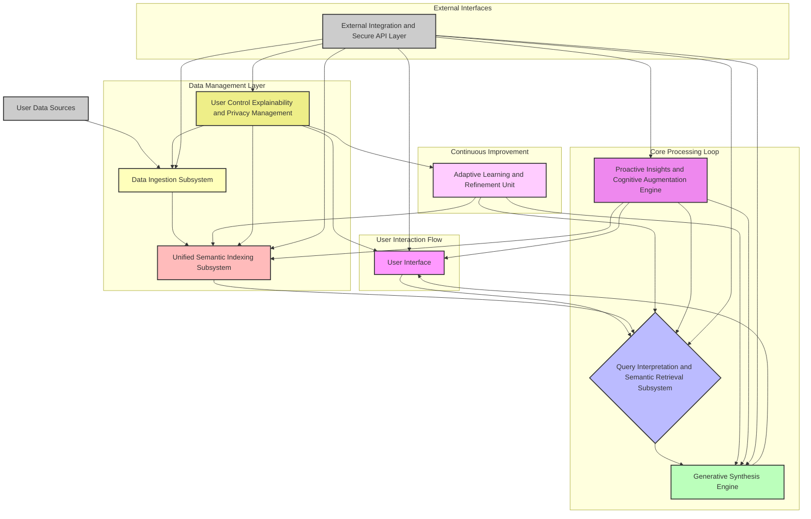
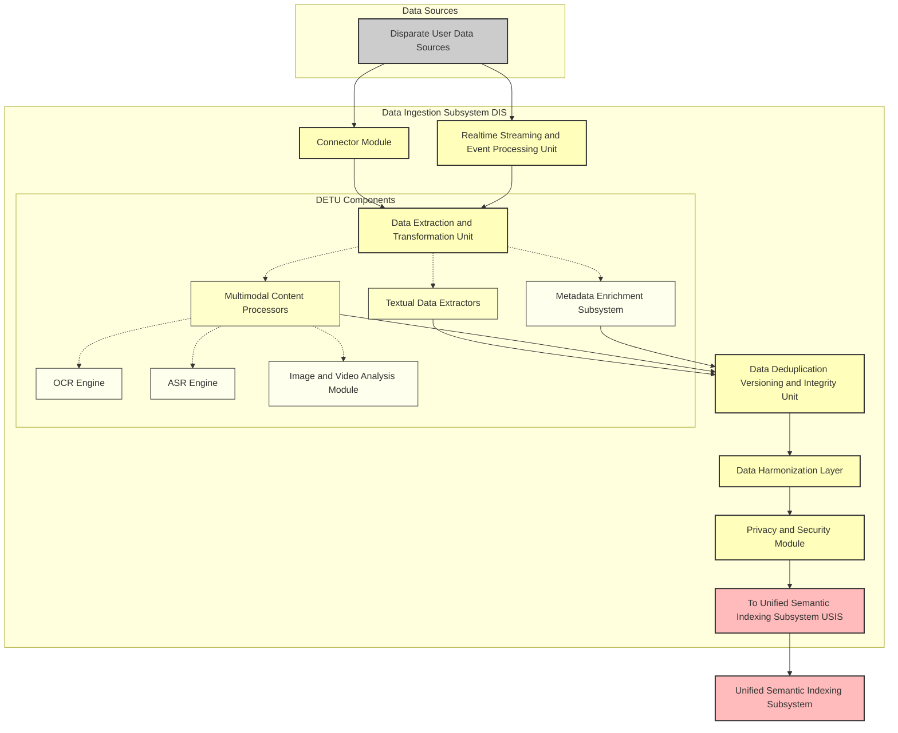
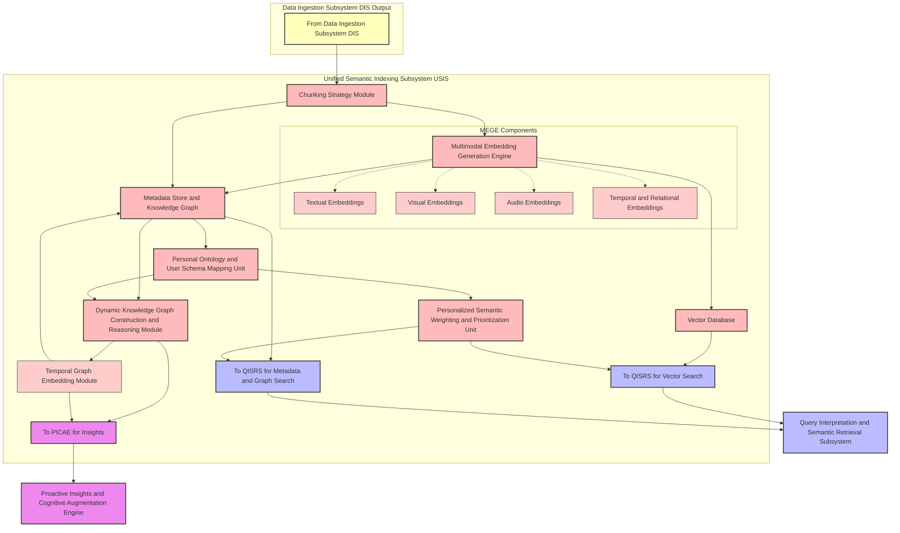
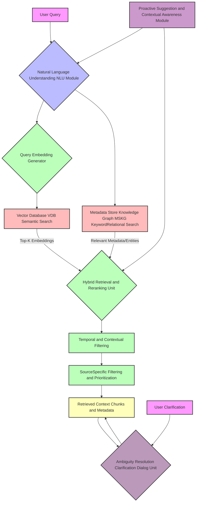
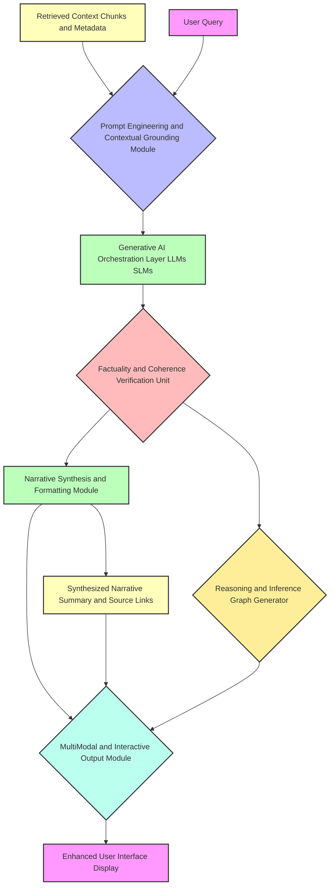
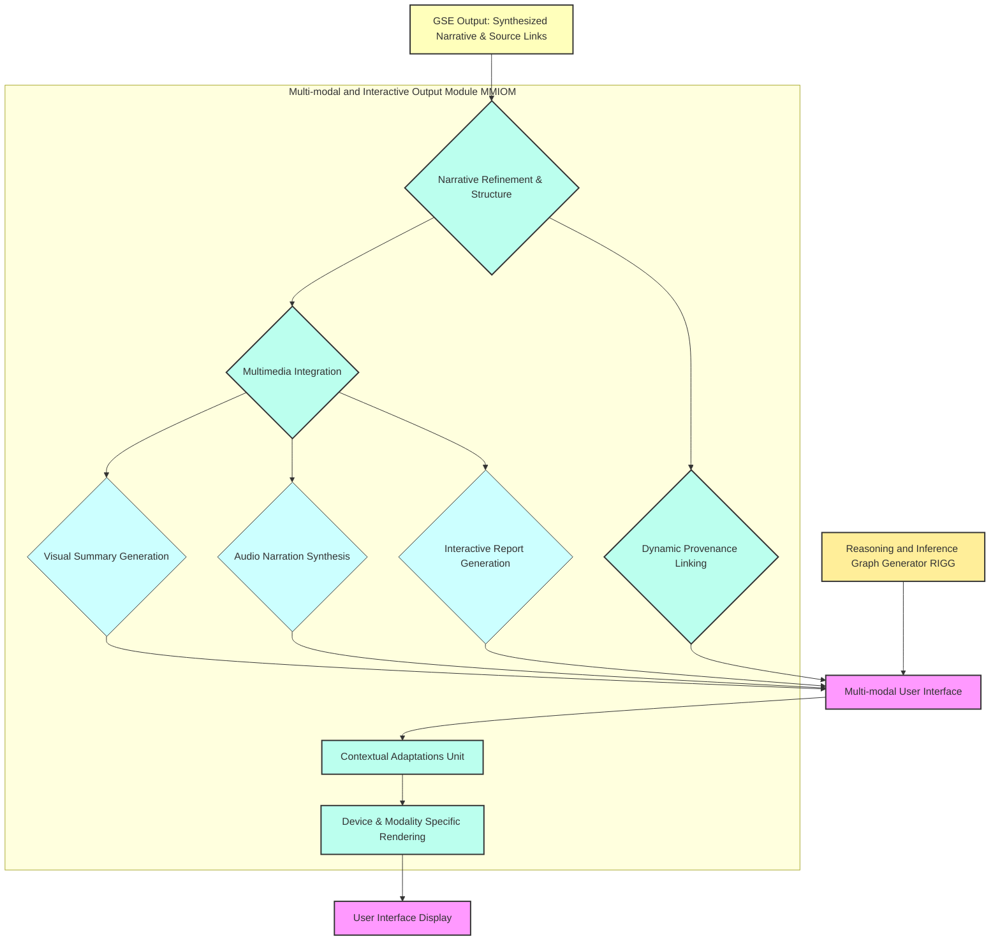
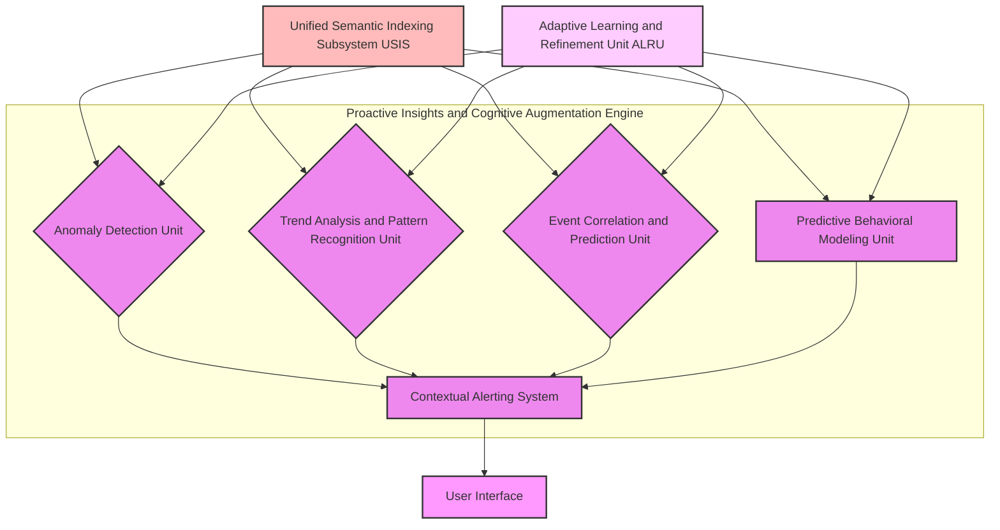
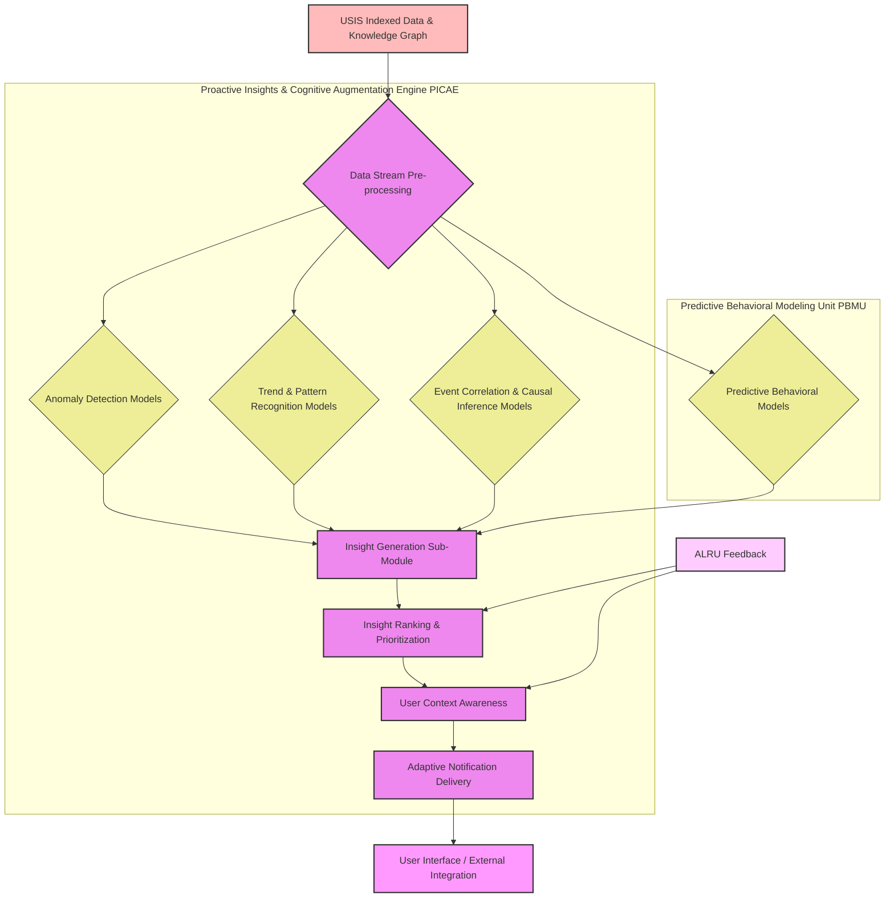
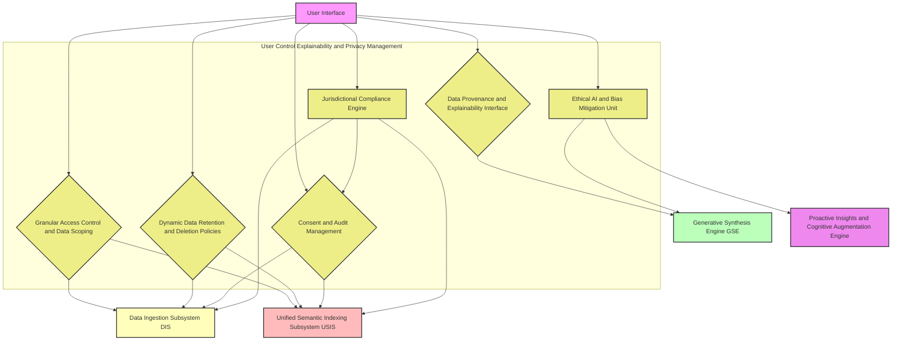
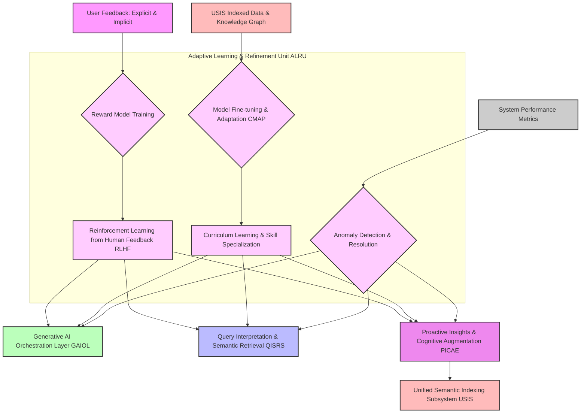

**Title of Invention:** A Comprehensive System and Method for Multimodal Cognitive Archival and Semantic Retrieval via Generative Synthesis

**Abstract:**
A profoundly innovative system and associated methodologies are hereby disclosed for the profound task of establishing, maintaining, and interrogating a singularly unified and semantically enriched digital archive of an individual's entire personal informational corpus. This invention transcends rudimentary data aggregation by ingesting, harmonizing, and indexing data across a vastly heterogeneous array of disparate modalities and sources, encompassing, but not limited to, electronic mail correspondence, photographic and videographic media, textual documents, calendrical entries, audio recordings, and biometric data, thereby constructing a coherent, longitudinally integrated, multimodal temporal continuum. The system empowers a user to articulate complex, high-level informational desiderata through natural language queries (e.g., "Synthesize the core activities and significant communications relating to my strategic collaboration initiative in Q3 2021, emphasizing any associated challenges and their resolutions"). Central to its operation is a sophisticated Generative AI Orchestration Layer, employing advanced large-scale foundational models and specialized multimodal encoders, to execute deep semantic traversal across the comprehensively indexed data space, effectuate the precise identification and contextual retrieval of pertinent informational quanta, and subsequently fabricate a highly coherent, factually grounded, and narratively synthesized summary that directly and comprehensively addresses the user's query, augmented by verifiable provenance links to the originating digital artifacts. Furthermore, the system includes a Proactive Insights and Cognitive Augmentation Engine (PICAE) that continually analyzes the indexed archive to identify patterns, anomalies, and correlations, offering predictive context and foresight without explicit queries, notably through a Predictive Behavioral Modeling Unit. An advanced User Control, Explainability, and Privacy Management (UCEPM) subsystem ensures granular user agency over data, transparent reasoning, adherence to privacy principles through a Jurisdictional Compliance Engine, and ethical considerations via an Ethical AI and Bias Mitigation Unit. This system represents a paradigm shift in personal knowledge management, transforming fragmented digital existence into an intelligently queryable, proactive, and ethically managed cognitive prosthesis, also providing a robust External Integration and Secure API Layer for broader ecosystem interoperability.

**Background of the Invention:**
The contemporary human experience is irrevocably intertwined with an increasingly vast and disaggregated digital footprint. An individual's personal informational landscape is typically fractured across an archipelago of disconnected applications, proprietary platforms, and disparate data silos. The fundamental challenge of locating, collating, and synthesizing information pertinent to a specific past event, project, or personal narrative typically necessitates an arduous, cognitively demanding, and profoundly inefficient manual peregrination across a multitude of isolated archives—such as disparate cloud storage repositories, email clients, social media platforms, messaging applications, photo galleries, and local document directories. This atomization of personal data impedes coherent recall, obstructs longitudinal analysis, and significantly diminishes the intrinsic value of an individual's accumulated digital legacy. Existing search paradigms, predominantly reliant on keyword matching or rudimentary metadata filters, are inherently deficient in addressing queries requiring deep semantic understanding, contextual synthesis, and cross-modal informational integration. Moreover, current systems are largely reactive, awaiting explicit user queries rather than proactively surfacing relevant information or potential insights. There exists, therefore, an imperative and profound need for an architecturally unified, semantically intelligent, generatively capable, and proactively insightful system capable of processing sophisticated natural language queries to retrieve, reason over, and synthesize all epistemically relevant information from an individual's entire digital corpus, thereby transforming data into actionable knowledge and coherent personal history, while also offering robust user control and transparency over their digital legacy, adhering to jurisdictional privacy requirements, and mitigating AI biases. This invention addresses this critical lacuna, offering an unprecedented level of cognitive augmentation.

**Brief Summary of the Invention:**
The present invention, herein designated as the "Cognitive Archival and Generative Synthesis Engine" (CAGSE), represents a fundamentally novel architecture for the unified management and intelligent interrogation of personal digital history. Its foundational premise involves the creation of an holistically integrated, multimodal, and semantically rich index encompassing the entirety of a user's personal digital data estate. Upon the submission of a user-initiated natural language query, the system dynamically invokes a sophisticated multimodal embedding model to project both the query and the pre-indexed data artifacts into a harmonized, high-dimensional vector space, thereby enabling advanced semantic interoperability. A multi-stage, adaptive vector search and re-ranking algorithm is subsequently employed to precisely identify and retrieve the maximal entropy subset of information quanta most semantically congruent with the articulated query. These meticulously retrieved artifacts, encompassing diverse data types (e.g., textual excerpts, image embeddings, audio transcripts, calendrical entries, and relational metadata), are then dynamically assembled into an optimized contextual payload. This payload, in conjunction with an adaptively engineered prompt, is then furnished to an advanced Generative AI Orchestration Layer. This layer, powered by highly capable large-scale foundational models, is expressly configured to perform complex inferential reasoning, cross-modal synthesis, and narrative construction, ultimately fabricating a precise, coherent, and verifiably grounded narrative response that directly and comprehensively addresses the user's inquiry, while concurrently providing direct, actionable links to the original, source digital assets from which the synthesis was derived. Complementing this reactive querying capability, the CAGSE incorporates a Proactive Insights and Cognitive Augmentation Engine (PICAE) which continuously analyzes the indexed data for patterns, anomalies, and correlations, generating unsolicited, contextually relevant insights and predictions, further empowered by a Predictive Behavioral Modeling Unit. Furthermore, a sophisticated User Control, Explainability, and Privacy Management (UCEPM) subsystem is integrated throughout, providing users with granular control over data access, transparent explanations of AI reasoning, robust privacy safeguards via a Jurisdictional Compliance Engine, and ethical oversight through an Ethical AI and Bias Mitigation Unit. An External Integration and Secure API Layer (EISAL) further enhances the system's utility by enabling secure and controlled interoperability with external applications. This invention thus establishes an unprecedented capability for personal digital archaeology, proactive cognitive augmentation, and ethical data governance.

**Detailed Description of the Invention:**

The Cognitive Archival and Generative Synthesis Engine (CAGSE) is architecturally instantiated as a highly robust, scalable, and modular system comprising several intrinsically coupled subsystems, each engineered for optimal performance and interoperability. A high-level overview of the system architecture is provided in Figure 1, illustrating the primary data flow and subsystem interactions.

<br>

**Figure 1: High-Level System Architecture of the Cognitive Archival and Generative Synthesis Engine CAGSE**
<br>

**1. Data Ingestion Subsystem (DIS):**
The DIS is a meticulously engineered pipeline responsible for the secure, compliant, and comprehensive acquisition of an individual's digital artifacts from a vastly heterogeneous array of source systems. This subsystem comprises:

*   **Connector Module:** An extensible framework of high-fidelity, secure API integrations and programmatic interfaces for establishing authenticated connections with diverse personal data sources. These include, but are not limited to, email platforms (e.g., SMTP/IMAP/Graph API), cloud storage services (e.g., OAuth/API for Google Drive, Dropbox, OneDrive), communication platforms (e.g., Slack, Teams, WhatsApp message logs via authorized exports), social media platforms (e.g., authorized user data exports), calendaring systems (e.g., CalDAV/iCal), local file systems, photographic and videographic repositories, and wearable device data streams (e.g., health metrics, location data). Robust error handling, rate limiting, and credential management are intrinsically built into each connector, often employing multi-factor authentication and secure token exchange protocols to minimize credential exposure. Specific integrations utilize federated authentication schemes to delegate user authentication to the source provider, enhancing security and privacy.
*   **Real-time Streaming & Event Processing Unit (RSEPU):** Engineered for continuous, low-latency ingestion of actively generated data streams. This unit leverages event-driven architectures (e.g., Apache Kafka, RabbitMQ) to capture and process data from sources like smart device logs (e.g., IoT sensors, fitness trackers), real-time messaging conversations (with user consent for ephemeral storage/processing), browser activity logs, and active application usage (e.g., document edits, project management tool updates). It employs distributed stream processing frameworks (e.g., Apache Flink, Apache Spark Streaming) to ensure high throughput, fault tolerance, exactly-once processing semantics, and real-time anomaly detection during ingestion for data quality assurance.
*   **Data Extraction & Transformation Unit (DETU):** This unit performs the initial data acquisition, parsing, and normalization.
    *   **Textual Data Extractors:** Specialized parsers for documents (PDF, DOCX, TXT, MD, HTML), emails (MIME parsing, header analysis), web pages (HTML scraping with content extraction), chat logs, and database records. Extracts raw text, comprehensive metadata (sender, recipient, date, subject, file type, author, creation/modification dates, geographical tags, application source, conversation thread IDs). Utilizes advanced NLP techniques for preliminary entity recognition and language detection.
    *   **Multimodal Content Processors:**
        *   **Optical Character Recognition (OCR) Engine:** Advanced OCR capabilities for extracting text from images (e.g., scans of documents, whiteboards, handwritten notes, memes, screenshots, receipts). Leverages deep learning models (e.g., Tesseract 5, PaddleOCR, proprietary transformer-based models) for high accuracy across diverse fonts, languages, and image conditions (blur, distortion, low light). Integrates layout analysis for structured text extraction.
        *   **Automatic Speech Recognition (ASR) Engine:** Converts spoken language from audio and video files (e.g., voice notes, meeting recordings, personal vlogs, podcasts) into precise textual transcripts. Includes robust speaker diarization for identifying distinct voices and their timestamps, emotion detection, and language identification. Utilizes state-of-the-art models like OpenAI's Whisper or fine-tuned Wav2Vec2.
        *   **Image & Video Analysis Module:** Utilizes state-of-the-art computer vision models (e.g., YOLO, Mask R-CNN for object detection; Vision Transformers for scene understanding; ArcFace/DeepFace for facial recognition with explicit consent; CLIP for cross-modal embedding) for object detection, scene understanding, facial recognition (with explicit consent and robust privacy safeguards), landmark identification, and descriptive caption generation for visual content. For video, this extends to action recognition, event detection, temporal summarization, and keyframe extraction, leveraging temporal convolutional networks or transformer architectures for video processing.
        *   **Metadata Enrichment Subsystem:** Automatically extracts and infers additional metadata beyond intrinsic file properties. This includes advanced named entity recognition (people, organizations, locations, dates, product names, project codes), topic modeling (e.g., LDA, BERTopic), sentiment analysis (fine-grained emotional context), keyword extraction, and the detection of explicit and implicit relationships between data entities through advanced NLP pipelines and knowledge graph inference.
*   **Data Deduplication, Versioning & Integrity Unit (DDVIU):** This unit is responsible for identifying and merging redundant data artifacts to optimize storage and retrieval efficiency. It employs cryptographic hashing (e.g., SHA-256) for exact deduplication and advanced perceptual hashing (e.g., for images/audio) or semantic similarity checks (for text) for fuzzy deduplication. It tracks changes to documents and media over time, maintaining a full version history (e.g., using a content-addressable storage system or version control protocols like Git LFS for large files). Cryptographic checksums and digital signatures are employed to ensure data integrity and authenticity, providing an immutable, auditable trail of all modifications and guaranteeing the authenticity of stored information.
*   **Data Harmonization Layer (DHL):** The DHL is responsible for transforming heterogeneous data schemas into a unified, canonical internal representation. This involves sophisticated schema mapping (e.g., using ontological alignment techniques), data type standardization, temporal normalization (converting all timestamps to a consistent UTC standard, including timezone resolution), and conflict resolution across disparate data points (e.g., reconciling different names for the same entity). It ensures semantic consistency across all ingested data through a robust, evolving internal schema, facilitating subsequent indexing, querying, and knowledge graph construction.
*   **Privacy & Security Module:** Implements robust encryption-at-rest (e.g., AES-256 with strong key management) and encryption-in-transit (e.g., TLS 1.3 with perfect forward secrecy). It incorporates fine-grained attribute-based access control (ABAC) mechanisms, data anonymization/pseudonymization capabilities (e.g., differential privacy for aggregates, k-anonymity for sensitive entities, homomorphic encryption for specific processing tasks), and user-configurable data retention policies. It is designed to be fully compliant with prevailing data protection regulations (e.g., GDPR, CCPA, HIPAA, LGPD) by integrating with the Jurisdictional Compliance Engine. Regularly undergoes security audits and penetration testing.

<br>

**Figure 1A: Detailed Data Ingestion Subsystem DIS**
<br>

**2. Unified Semantic Indexing Subsystem (USIS):**
The USIS constructs and maintains the core knowledge graph and vector representation of the user's personal archive, optimized for rapid, semantically aware retrieval.

*   **Chunking Strategy Module:** Raw ingested data is segmented into semantically coherent "chunks" suitable for embedding. This is not merely fixed-size splitting; it employs intelligent, adaptive algorithms such as:
    *   **Semantic Chunking:** Identifying natural breaks in text (paragraphs, sections, turns in conversation, distinct topics within a document) and ensuring chunks maintain topical cohesion and maximal informational density. Utilizes NLP models for discourse segmentation.
    *   **Hierarchical Chunking:** Creating embeddings at multiple granularities (e.g., sentence, paragraph, entire document summary, clustered event groups) to support multi-resolution querying and progressive disclosure of information.
    *   **Multimodal Chunking:** Aligning text chunks with corresponding image regions, video segments, or audio snippets based on temporal synchronization and semantic correspondence (e.g., a sentence describing an object appearing in a video frame).
    *   **Graph-based Chunking:** For highly interconnected data, chunks might represent subgraphs or paths within the knowledge graph, allowing for retrieval of semantically rich relational contexts.
*   **Multimodal Embedding Generation Engine (MEGE):** This engine transforms each data chunk and its associated enriched metadata into high-dimensional, dense vector representations (embeddings) within a unified semantic space.
    *   **Textual Embeddings:** Utilizes state-of-the-art transformer-based large language models (e.g., fine-tuned BERT, Sentence-BERT, instruction-tuned embeddings like BGE, or proprietary models) to generate contextually rich vector representations of text chunks. Continuously updated with latest architectures for optimal performance.
    *   **Visual Embeddings:** Leverages pre-trained convolutional neural networks (CNNs) or vision transformers (ViT) (e.g., DINO, CLIP's vision encoder) to generate embeddings for image and video frames, capturing visual content, aesthetic properties, and context. Cross-modal models like CLIP are fundamentally employed to align image and text embeddings into a common vector space.
    *   **Audio Embeddings:** Transforms ASR transcripts and raw audio features (e.g., spectrograms, MFCCs) into embeddings, potentially using models like Wav2Vec, SpeechBERT, or custom audio transformers, aligned with the common vector space. This includes encoding prosodic features and speaker characteristics.
    *   **Temporal & Relational Embeddings:** Incorporates temporal attributes (date, time, duration, temporal relationships like "before," "after," "during") and detected relationships between entities, events, and documents into the embedding space. This is achieved either directly as part of a multimodal foundational model, via dedicated temporal encoding layers (e.g., using sinusoidal position embeddings or time-aware graph embeddings), or by concatenating specialized metadata embeddings.
*   **Vector Database (VDB):** A high-performance, distributed vector database (e.g., Faiss, Pinecone, Milvus, Qdrant, Weaviate) optimized for approximate nearest neighbor (ANN) search. It stores the generated vector embeddings, enabling efficient semantic similarity queries at scale. Supports various indexing algorithms (e.g., HNSW, IVF_FLAT, PQ) and dynamic index updates.
*   **Metadata Store & Knowledge Graph (MSKG):** A robust NoSQL or graph database (e.g., Neo4j, JanusGraph, Amazon Neptune) that stores all extracted and enriched metadata, along with the raw chunks and their original source links. It meticulously models explicit and inferred relationships between entities (people, places, organizations, projects), events, and documents, forming a dynamic, evolving personal knowledge graph. This graph allows for complex relational queries, context enrichment, and semantic navigation beyond simple keyword search.
*   **Dynamic Knowledge Graph Construction & Reasoning Module (DKGRM):** Beyond static storage, this module continuously updates the MSKG by inferring new relationships, entities, and temporal sequences from the stream of incoming data. It employs advanced techniques like Link Prediction using graph neural networks (GNNs) (e.g., GraphSAGE, GAT) and temporal reasoning algorithms (e.g., stream reasoning, temporal logic networks) to identify subtle connections between seemingly disparate events or entities. This module enriches the graph with inferred facts, enabling more sophisticated relational queries, deep contextual understanding, and proactive insight generation.
    *   **Temporal Graph Embedding Module (TGE):** A specialized sub-component within the DKGRM that specifically focuses on creating time-aware embeddings for graph nodes and edges. It captures the evolution of relationships and attributes over time, enabling complex queries like "Who was I collaborating with most frequently on Project X between Q1 2020 and Q2 2021?" or "How did my interest in topic Y (derived from document views and communications) evolve over the last 5 years, and what were the key events influencing these shifts?". This module integrates temporal logic into graph traversal and relationship inference, enabling dynamic snapshots of the user's life.
*   **Personal Ontology & User Schema Mapping Unit (POUSMU):** This unit empowers users to define their own custom ontologies, taxonomies, categories, tags, and semantic relationships relevant to their unique personal and professional context. It provides a user-friendly interface for schema definition and mapping. It then maps these user-defined schemas to the system's canonical internal representation, allowing for highly personalized indexing, retrieval, and synthesis that aligns precisely with the user's individual mental models, organizational preferences, and domain-specific terminology. This enables a powerful form of semantic personalization.
*   **Personalized Semantic Weighting and Prioritization Unit (PSWPU):** Building upon the POUSMU, this unit allows users to define explicit or implicitly learned weights and prioritization rules for different types of information, entities, topics, or sources. For example, a user might explicitly prioritize information from "work emails" when querying about "project X," or boost the relevance of "family photos" when the query involves specific individuals. These weights dynamically influence the `d_sem` metric in the QISRS, ensuring retrieval results are highly tailored to individual user intent and preferences, even in ambiguous scenarios. These preferences can also be learned via implicit feedback loops managed by ALRU.

<br>

**Figure 1B: Detailed Unified Semantic Indexing Subsystem USIS**
<br>

**3. Query Interpretation & Semantic Retrieval Subsystem (QISRS):**
This subsystem is responsible for understanding the user's intent and orchestrating the retrieval of relevant information.

<br>

**Figure 2: Query Interpretation and Semantic Retrieval Flow**
<br>

*   **Natural Language Understanding (NLU) Module:** Processes the raw natural language query.
    *   **Intent Recognition:** Classifies the user's primary goal (e.g., factual lookup, summary generation, event reconstruction, opinion extraction, sentiment analysis, comparative analysis). Utilizes transformer-based classification models.
    *   **Named Entity Recognition (NER):** Identifies specific entities (people, organizations, locations, dates, projects, product names, document types, custom entities from POUSMU) within the query. Employs advanced sequence labeling models (e.g., Bi-LSTMs with CRFs, BERT-based NER).
    *   **Temporal Expression Parsing:** Extracts, normalizes, and disambiguates temporal constraints (e.g., "last year," "Q3 2021," "during my trip to Italy," "next week's meeting") using rule-based and machine learning temporal taggers (e.g., SUTime, Chronic).
    *   **Coreference Resolution:** Identifies and links mentions of the same entity within a query or across conversational turns (e.g., "Show me his emails" where "his" refers to a previously mentioned person).
    *   **Query Expansion & Rewriting:** Augments the query with synonyms, related concepts from the personal knowledge graph, ontological hierarchies (from POUSMU), or rephrases it for optimal retrieval performance across different search modalities. Can generate multiple candidate queries.
*   **Query Embedding Generator:** Converts the processed query into a high-dimensional vector using the same multimodal embedding model (MEGE) employed by the USIS, ensuring semantic alignment with the indexed data. Contextual embeddings are generated, meaning the meaning of terms in the query is influenced by other terms.
*   **Hybrid Retrieval & Re-ranking Unit:** Executes a multi-faceted search strategy.
    *   **Vector Similarity Search:** Performs an Approximate Nearest Neighbor (ANN) search in the VDB using the query embedding to retrieve an initial set of semantically similar data chunks, effectively capturing conceptual relevance.
    *   **Keyword & Relational Search:** Simultaneously queries the MSKG using extracted keywords, entities, and temporal constraints to retrieve specific metadata, graph-based relationships, and highly precise facts. This leverages graph traversal algorithms and advanced SQL/NoSQL queries.
    *   **Fusion & Re-ranking:** Combines results from both vector and keyword searches using techniques like Reciprocal Rank Fusion (RRF) or learned fusion models. A transformer-based re-ranking model (e.g., cross-encoder like MonoBERT, ColBERT) is then applied to the top-K candidates to refine relevancy scores, considering context, temporal proximity (from TGE), source trustworthiness, and personalized weights and priorities from the PSWPU. This generates a highly relevant, diversified, and contextually rich set of retrieval candidates.
*   **Temporal & Contextual Filtering:** Applies advanced filters based on extracted temporal constraints (e.g., restricting results to a specific date range with fuzzy boundaries) and contextual cues (e.g., "my strategic collaboration initiative," "my family trip to Paris"). Utilizes the temporal metadata embedded in chunks and knowledge graph relations for precise filtering.
*   **Source-Specific Filtering & Prioritization:** Allows for user-defined or dynamically inferred prioritization of specific data sources (e.g., "prefer information from my work email over personal photos for professional queries"), leveraging the rules from the PSWPU and `P_user.access_policies` from UCEPM.
*   **Ambiguity Resolution & Clarification Dialog Unit (ARCDU):** When a user's query is deemed ambiguous, underspecified, or leads to insufficient retrieval by the NLU module, this unit initiates a conversational dialogue. It employs dialogue state tracking and natural language generation to ask clarifying questions (e.g., "Are you referring to the Q3 2021 project with Acme Corp. or your personal trip in Q3 2022 to the Alps?"). This iterative, guided process refines the user's intent, temporal scope, specific entities, or desired output format, ensuring precise query interpretation before proceeding with final retrieval, thereby significantly reducing irrelevant results and improving user satisfaction.
*   **Proactive Suggestion & Contextual Awareness Module (PSCAM):** This module intelligently monitors the user's active context (e.g., open applications, current location via GPS, calendar events, recently viewed documents, communication patterns, time of day, external news feeds). Without an explicit query, it proactively suggests highly relevant information, related documents, previously synthesized insights, or potential next steps from the archive. It leverages contextual embeddings, predictive analytics (from PBMU), and sensor data to anticipate user information needs, transforming the system into a truly anticipatory cognitive assistant. It dynamically adjusts its suggestions based on the user's current activity and perceived cognitive load.
*   **Retrieved Context Aggregation:** Compiles the final, refined set of relevant data chunks, their associated enriched metadata (including inferred relationships), and original source links into a structured context block. This block is meticulously organized and formatted (e.g., JSON, XML, or specialized tokenized sequence) to maximize the downstream Generative Synthesis Engine's ability to process and synthesize the information accurately and efficiently. Includes a confidence score for retrieval.

**4. Generative Synthesis Engine (GSE):**
The GSE is the core intelligence of the system, responsible for transforming retrieved information into coherent, user-facing narratives.

<br>

**Figure 3: Generative Synthesis Process**
<br>

*   **Prompt Engineering & Contextual Grounding Module:** Dynamically constructs an optimized prompt for the generative AI model, a critical step for maximizing output quality and reducing hallucination. This involves:
    *   **Role Assignment:** Instructing the AI model to adopt a specific persona or expertise (e.g., "You are a personal historian," "You are a project manager summarizing progress," "You are a legal aid providing relevant precedents").
    *   **Instructional Directives:** Providing clear, detailed, and often step-by-step instructions for synthesis (e.g., "Synthesize a narrative summary chronologically," "Extract key events and dates and list them," "Identify challenges and their resolutions and suggest next steps," "Compare and contrast two project proposals").
    *   **Context Injection:** Inserting the retrieved data chunks and metadata, carefully structured using techniques like XML/JSON tags, Markdown formatting, or few-shot examples to maximize the AI model's contextual understanding and minimize hallucination. Techniques like RAG (Retrieval-Augmented Generation) with specific token budgets are fundamental here, ensuring the model primarily "grounds" its answers in the provided facts.
    *   **Constraint Enforcement:** Specifying output format requirements (e.g., length, tone (formal, casual, empathetic), inclusion of specific entities, target audience), and safety guardrails (from EABMU).
*   **Generative AI Orchestration Layer (GAIOL):** Manages interactions with one or more large-scale generative AI models (LLMs) and potentially other specialized generative models. This layer dynamically selects the most appropriate model based on query complexity, required output modality, computational cost, and user preferences. It may leverage:
    *   **Foundational LLMs:** Powerful, general-purpose models (e.g., GPT-4, Claude 3, Gemini, Llama 3) for complex reasoning, multi-turn synthesis, and abstract summarization.
    *   **Specialized SLMs (Small Language Models):** Fine-tuned models for specific tasks (e.g., extractive summarization, entity extraction, sentiment generation) for efficiency and domain-specific accuracy, operating within a multi-agentic workflow.
    *   **Multimodal Generative Models:** For scenarios requiring synthesis directly from multimodal inputs (e.g., generating text descriptions from images and related text, generating coherent narratives that interweave visual and audio elements), or generating visual/audio content from text.
    *   **Self-Correction and Reflection Mechanisms:** The GAIOL can implement iterative generation processes where initial drafts are critically reviewed by a "reflector" agent (another SLM or a prompt-driven LLM) against the original query and context, leading to revised outputs.
*   **Factuality & Coherence Verification Unit:** Employs advanced techniques to mitigate hallucination and ensure the generated summary is factually consistent with the provided context.
    *   **Attribution Mechanisms:** Verifies that every assertion, fact, or inferred statement in the generated summary can be traced back to one or more specific retrieved data chunks, providing confidence scores for each attribution.
    *   **Cross-Reference Validation:** Checks for internal consistency, logical contradictions, and semantic coherence across different retrieved sources and within the generated narrative itself. May utilize an external knowledge base or logical reasoner for general world knowledge validation.
    *   **Semantic Coherence Checkers:** Evaluates the logical flow, narrative consistency, and linguistic quality of the generated text, often employing perplexity scoring and fine-tuned coherence models.
    *   **Hallucination Detection Models:** Specialized classifiers (often contrastively trained) that can identify statements in the output that are not supported by the input context.
*   **Reasoning & Inference Graph Generator (RIGG):** For each generated summary, this module constructs an underlying "reasoning graph" that visually represents how different pieces of retrieved evidence (data chunks, entities, relationships) were linked, combined, and logically processed by the generative AI to arrive at specific conclusions or statements. This graph provides a transparent, step-by-step trace of the AI's inference process, detailing which facts supported which deductions. It can highlight conflicts or ambiguities found during verification.
*   **Narrative Synthesis & Formatting Module:** Processes the AI model's raw output, refining it into a user-friendly format tailored to the initial query intent and user preferences. This includes:
    *   **Text Refinement:** Advanced grammar correction, stylistic adjustments (e.g., conciseness, tone alignment), and jargon simplification using specialized SLMs.
    *   **Structural Formatting:** Presenting information as a coherent narrative, concise bullet points, chronological timelines, comparative tables, or interactive graphs depending on the query type and identified user intent.
    *   **Provenance Linking:** Embedding direct, actionable hyperlinks to the original source assets for every piece of information synthesized, allowing users to verify facts, explore further, and understand the evidential basis of the summary. These links can be dynamically rendered.
*   **Multi-modal & Interactive Output Module (MMIOM):** Extends the output capabilities beyond plain text, catering to diverse user preferences and consumption contexts. This module can generate:
    *   **Visual Summaries:** Automatically create dynamic timelines, interactive network graphs (based on the RIGG), image collages, video compilations, or infographics that visually summarize the retrieved information.
    *   **Audio Summaries:** Synthesize a natural language audio narration of the summary, suitable for hands-free consumption (e.g., while driving or exercising), with adjustable voice, speed, and language.
    *   **Interactive Reports:** Present the synthesized information in dynamic web-based interfaces, allowing users to drill down into details, filter information, request different perspectives, initiate follow-up queries directly within the output, or collaborate with shared summaries.
    *   **Haptic & Olfactory Cues:** For immersive AR/VR applications, the MMIOM can generate subtle haptic feedback to emphasize key points or even trigger contextually appropriate olfactory cues (e.g., a specific scent associated with a memory captured in a photo or video).

<br>

**Figure 3A: Detailed Multi-modal and Interactive Output Module (MMIOM)**
<br>

**5. Proactive Insights & Cognitive Augmentation Engine (PICAE):**
The PICAE transforms the CAGSE from a reactive query system into an active, intelligent cognitive assistant. It continuously monitors and analyzes the user's indexed archive, proactively surfacing valuable insights, patterns, and anomalies without requiring explicit queries.

<br>

**Figure 4: Proactive Insights and Cognitive Augmentation Engine Flow**
<br>

*   **Anomaly Detection Unit:** Employs advanced machine learning algorithms (e.g., Isolation Forests, One-Class SVMs, deep anomaly detection models like Autoencoders or LSTMs for time series) to identify deviations from established user patterns. This could include unusual communication frequency with certain contacts, unexpected spending patterns, unusual activity timings (e.g., nocturnal work), novel topics in communication, or missed recurring calendar events. It proactively alerts the user to potential issues, significant changes in their digital behavior, or security concerns (e.g., unusual login activity).
*   **Trend Analysis & Pattern Recognition Unit:** Utilizes advanced data mining, topic modeling (e.g., dynamic topic models over time), time-series analysis techniques (e.g., ARIMA, Prophet, recurrent neural networks), and graph analytics (on the TGE) to discover recurring themes, evolving interests, long-term trends, and cyclical patterns across all modalities. Examples include identifying a growing interest in a particular topic, tracking progress on a multi-year project, recognizing shifts in social connections, personal habits (e.g., changes in fitness routine), or professional network dynamics. It can also identify emerging concepts or recurring problems.
*   **Event Correlation & Prediction Unit:** Analyzes the knowledge graph (from DKGRM) and temporal embeddings (from TGE module) to identify implicit connections, causal links, and predictive indicators between seemingly disparate events or data points. This unit can reconstruct complex past scenarios, infer causal links (e.g., correlating a stressful period with decreased activity), or predict future needs based on detected event sequences. For instance, it might correlate an email about a potential meeting with a flight booking and a restaurant reservation, and then proactively suggest relevant documents, contacts, or follow-up actions for the upcoming trip based on previous similar travel experiences, or even predict the likelihood of an event based on preceding triggers.
*   **Predictive Behavioral Modeling Unit (PBMU):** This advanced unit leverages sophisticated machine learning models (e.g., recurrent neural networks, transformer models, Bayesian inference networks, inverse reinforcement learning) trained on historical user interactions, calendrical data, communication patterns, biometric data, and external contextual signals (e.g., news, weather, stock market) to predict future user intentions, needs, or events. For example, it might anticipate a need for information about a specific project before a scheduled meeting, suggest planning for an anniversary based on past behaviors and calendar entries, predict potential upcoming stress periods based on communication load and activity patterns, or suggest a new resource based on evolving interests. It aims to act as a truly anticipatory cognitive aid, learning an individual's rhythms, preferences, and requirements, ensuring relevance while respecting privacy constraints from UCEPM.
*   **Contextual Alerting System:** Manages and prioritizes the insights generated by the anomaly, trend, correlation, and predictive behavioral units. It employs an intelligent notification delivery system that considers user context (e.g., device, time of day, current application focus, perceived urgency of insight) to deliver these insights through the User Interface in a timely, unobtrusive, and contextually relevant manner, ensuring that proactive information is helpful and not overwhelming. Users can configure notification preferences and feedback on alert relevance, which informs ALRU.

<br>

**Figure 4A: Detailed Proactive Insights & Cognitive Augmentation Engine (PICAE)**
<br>

**6. User Control, Explainability & Privacy Management (UCEPM):**
The UCEPM is a foundational component ensuring user agency, trust, and compliance with privacy regulations, providing granular control and transparency over the CAGSE's operations.

<br>

**Figure 5: User Control Explainability and Privacy Management Subsystem**
<br>

*   **Granular Access Control & Data Scoping:** Provides users with fine-grained control over which data sources and specific data types CAGSE can access, process, and use for different functions (e.g., allowing work emails for query synthesis but not for proactive insights, or restricting access to specific photo albums for facial recognition). Implements attribute-based access control (ABAC) policies. Uses secure data vaults or isolation mechanisms (e.g., secure enclaves, homomorphic encryption for certain operations) for highly sensitive information, requiring explicit, multi-factor authenticated permissions for access or processing.
*   **Data Provenance & Explainability Interface:** Builds upon the RIGG and provenance links generated by GSE. Users can interactively explore the "reasoning path" of any generated summary, tracing statements back to the original source documents (including specific chunks), viewing intermediate inference steps, and understanding *why* the AI made a particular conclusion or insight. This enhances trust and provides profound transparency into the AI's operation. Employs counterfactual explanations and feature importance visualizations to explain model decisions.
*   **Dynamic Data Retention & Deletion Policies:** Enables users to define custom, automated, and event-driven rules for data lifecycle management. Users can set retention periods for different data types (e.g., delete chat logs after 3 years, keep financial records indefinitely) or trigger deletion based on events (e.g., delete all project files 6 months after project completion). This ensures adherence to personal preferences and compliance requirements. Implements secure deletion mechanisms (e.g., cryptographic shredding) to ensure data is irrecoverable.
*   **Consent & Audit Management:** Maintains a comprehensive, immutable, and cryptographically verifiable log of all user consents for data access, processing, and sharing. It also provides a detailed audit trail of all data operations performed by CAGSE (e.g., data ingestion, indexing, retrieval requests, synthesis actions, data policy violations), allowing users to monitor and verify compliance with their privacy settings. Utilizes blockchain-like immutable ledgers for audit trails to prevent tampering.
*   **Ethical AI & Bias Mitigation Unit (EABMU):** This unit is dedicated to continuously monitoring and evaluating the CAGSE's AI models (e.g., embedding models, generative models, PICAE algorithms) for potential biases (e.g., gender bias, racial bias, stereotypes in language or image recognition), fairness issues (e.g., disparate impact on certain groups), or unintended consequences. It employs techniques like bias detection metrics (e.g., statistical parity, equalized odds), counterfactual analysis, and explainable AI (XAI) tools to audit model behavior. When biases are detected (e.g., in content summarization or proactive suggestions), it triggers alerts and provides mechanisms for model recalibration, user-specific bias compensation (e.g., debiasing embeddings), or human-in-the-loop oversight. It also defines strict guardrails for generative model outputs, preventing harmful, unethical, or non-consensual content generation, and aligns the AI's values with user-defined ethical principles.
*   **Jurisdictional Compliance Engine (JCE):** This module automatically identifies and applies relevant data protection regulations (e.g., GDPR, CCPA, HIPAA, PIPEDA, country-specific data residency laws) based on the user's declared geographical location, data residency requirements, and the types of data being processed. It integrates deeply with the Granular Access Control, Data Retention, and Consent Management modules to enforce specific legal mandates, such as data localization, cross-border data transfer restrictions, automated "right to be forgotten" requests, and mandatory data breach notification protocols. It maintains an up-to-date knowledge base of global privacy laws and provides automated compliance checks, ensuring that CAGSE operates in full legal compliance across diverse regulatory landscapes.

**7. User Interface & Interaction (UII):**
The UII provides an intuitive and robust mechanism for users to engage with the CAGSE, now significantly enhanced to support the expanded functionalities. It encompasses:
*   **Natural Language Query Input:** A rich text interface allowing users to submit complex queries, now complemented by the ARCDU's interactive clarification dialogues for ambiguous inputs. This extends to advanced voice input with sophisticated Speech-to-Intent (STI) processing that understands not just words but also tone, urgency, and implicit commands, transforming casual speech into precise query parameters.
*   **Interactive Summary Display:** Presents the synthesized narrative summary in a clean, readable format. This now includes clickable links to source documents, visual summaries (e.g., timelines, network graphs) generated by the MMIOM, and options for audio narration. It offers dynamic filtering, multi-perspective re-summarization options, and the ability to ask follow-up questions directly within the summary view.
*   **Contextual Exploration:** Allows users to drill down into the retrieved context, view raw chunks, explore the knowledge graph, and most importantly, interact with the Data Provenance & Explainability Interface to trace AI reasoning via the RIGG. Advanced 2D/3D visualizations for temporal relationships, inferred connections, and multimodal content are provided, enabling intuitive navigation through the personal archive.
*   **Proactive Insights Dashboard:** A dedicated, configurable section displaying insights, anomalies, trends, and contextual suggestions surfaced by the PICAE, with options for user feedback (e.g., "helpful," "irrelevant") and granular controls for the Predictive Behavioral Modeling Unit (e.g., adjusting prediction sensitivity, opting out of certain predictions).
*   **Granular Control Panel:** An intuitive, privacy-by-design interface for managing personal data settings via the UCEPM, including access controls, retention policies, consent management, as well as controls for ethical AI parameters, bias mitigation preferences, and jurisdictional compliance settings. Provides real-time data usage statistics and audit logs.
*   **Multimodal Output & Context-Aware Displays:** Beyond text and basic visuals, the UII can adapt output to the user's current context, device, and environmental factors. This might include delivering concise audio summaries when the user is driving, overlaying relevant information in an Augmented Reality (AR) view based on location or objects, providing spatially organized knowledge graphs in a Virtual Reality (VR) environment for immersive exploration of personal memories and data, or using haptic/olfactory feedback for enhanced contextual awareness.
*   **Feedback Mechanism:** Enables users to provide explicit feedback on the quality of retrieved results, generated summaries, proactive insights, and system behavior (e.g., upvotes/downvotes, relevance ratings, free-text comments), which feeds directly into the Adaptive Learning & Refinement Unit for continuous improvement.

<br>
```mermaid
graph TD
    A[User Inputs: NL Query, Voice, Gestures, Context] --> B{Input Modality Processors}
    B --> C[Natural Language & Intent Parser]
    B --> D[Contextual Sensing & Interpretation]
    C --> E[Query Formulation]
    D --> E
    E --> F[Display Adaptation Engine]
    G[CAGSE Output: Summary, Insights, Explanations] --> F
    F --> H{Interactive Summary & Exploration Interface}
    H --> I[Proactive Insights & Alerts Dashboard]
    H --> J[Provenance & Explainability Visualizer]
    H --> K[Granular Control Panel (UCEPM)]
    H --> L[Multimodal Rendering Unit]
    L --> M[Augmented / Virtual Reality Interface]
    L --> N[Audio / Haptic Output]
    M --> O[User Experience Feedback]
    N --> O
    H --> O
    O --> P[To Adaptive Learning & Refinement Unit]

    subgraph User Interface & Interaction UII
        B
        C
        D
        E
        F
        H
        I
        J
        K
        L
    end

    style A fill:#f9f,stroke:#333,stroke-width:2px
    style B fill:#f9f,stroke:#333,stroke-width:2px
    style C fill:#fef,stroke:#333,stroke-width:1px
    style D fill:#fef,stroke:#333,stroke-width:1px
    style E fill:#f9f,stroke:#333,stroke-width:2px
    style F fill:#f9f,stroke:#333,stroke-width:2px
    style G fill:#ccc,stroke:#333,stroke-width:2px
    style H fill:#f9f,stroke:#333,stroke-width:2px
    style I fill:#fee,stroke:#333,stroke-width:1px
    style J fill:#fee,stroke:#333,stroke-width:1px
    style K fill:#fee,stroke:#333,stroke-width:1px
    style L fill:#f9f,stroke:#333,stroke-width:2px
    style M fill:#fee,stroke:#333,stroke-width:1px
    style N fill:#fee,stroke:#333,stroke-width:1px
    style O fill:#fef,stroke:#333,stroke-width:1px
    style P fill:#fcf,stroke:#333,stroke-width:2px
```
**Figure 6: Detailed User Interface & Interaction (UII)**
<br>

**8. Adaptive Learning & Refinement Unit (ALRU):**
The ALRU provides continuous improvement capabilities for the entire system, significantly enhanced by advanced feedback mechanisms.
*   **User Feedback Integration & Reinforcement Learning from Human Feedback (RLHF):** Incorporates explicit user ratings (e.g., thumbs up/down on summary quality, relevance of suggestions, helpfulness of proactive insights), qualitative free-text comments, and implicit signals (e.g., editing behavior, follow-up queries, time spent reviewing results, interaction patterns) to train a sophisticated reward model. This reward model then serves as the objective function for fine-tuning generative models, retrieval models, proactive insight engines (including PBMU), and semantic weighting policies (PSWPU) via reinforcement learning algorithms, aligning the AI's behavior and output generation directly with nuanced user preferences, values, and evolving needs.
*   **Model Fine-tuning & Adaptation (CMAP):** Periodically fine-tunes embedding models (MEGE), generative AI models (GAIOL), and specialized modules (e.g., NLU, anomaly detection, PBMU) on anonymized and aggregated (or federated) user-specific data. This continuous adaptation ensures the system evolves with the user's changing linguistic style, domain-specific terminology, evolving interests, and environmental context, maintaining high performance and personalization over time. Techniques like Low-Rank Adaptation (LoRA), prompt tuning, or other parameter-efficient fine-tuning methods are employed for efficient and cost-effective model updates, minimizing the need for full retraining. Can adapt to changes in data distribution and user behavior.
*   **Anomaly Detection & Resolution:** Monitors system performance for data ingestion errors, retrieval latency, generative model inconsistencies (e.g., increased hallucination rates detected by Factuality Unit), ethical violations flagged by EABMU, or privacy policy breaches flagged by JCE. Triggers automated alerts and initiates automated remediation workflows (e.g., re-indexing failed chunks, rollback of faulty model updates, flagging data for review) where possible, or escalates to human oversight when complex issues arise.
*   **Curriculum Learning & Skill Specialization:** The ALRU can guide the models through a "curriculum" of increasingly complex tasks, allowing them to specialize in specific skills over time. For example, initially focusing on factual retrieval, then summarization, then complex reasoning, and finally proactive insight generation. This optimizes training efficiency and ensures robust skill development tailored to the user's specific needs and data patterns.

<br>

**Figure 7: Detailed Adaptive Learning & Refinement Unit (ALRU)**
<br>

**9. External Integration and Secure API Layer (EISAL):**
The EISAL provides a robust and secure interface for authorized third-party applications, external services, or other personal AI agents to programmatically interact with the CAGSE, extending its utility and enabling interoperability within a broader digital ecosystem. This layer is designed with security, scalability, and developer experience in mind, adhering to modern microservices architectural principles.
*   **API Gateway & Management:** A centralized, high-performance API Gateway (e.g., leveraging Kong, Apigee, or AWS API Gateway) provides a unified entry point for all external interactions. It handles API versioning, robust rate limiting, request routing, basic validation, and request/response transformation. Supports both RESTful and GraphQL APIs for flexible client development.
*   **Authentication & Authorization Service:** Implements industry-standard protocols (e.g., OAuth 2.0, OpenID Connect, JWT) for secure user authentication and granular authorization of external applications. Users grant explicit permissions for specific data access or functionalities via the UCEPM, leveraging fine-grained ABAC policies that can be delegated to third parties. Supports secure multi-tenancy.
*   **Software Development Kits (SDKs) & Libraries:** Provides comprehensive, idiomatic SDKs in various popular programming languages (e.g., Python, JavaScript, Java, Go) to simplify integration for developers. Offers pre-built clients for common operations (e.g., query submission, insight retrieval, data management, access control configuration) and clear documentation.
*   **Event Notification & Webhooks:** Allows external systems to subscribe to real-time events within CAGSE (e.g., new insights generated, data ingestion completion, query synthesis results, data policy violations, user consent changes). This enables responsive, event-driven integrations and asynchronous processing, using secure webhooks or message queues (e.g., Apache Kafka topics for external consumption).
*   **Data Export & Federation Module:** Supports secure, structured export of user-selected data subsets in interoperable formats (e.g., JSON-LD, XML, CSV, Parquet) with configurable schemas. It can also facilitate federated learning scenarios where aggregated, anonymized insights or model updates can be securely shared or contributed to larger AI initiatives (e.g., medical research, public health trends) without exposing raw personal data, all while adhering to UCEPM's strict privacy controls and ethical guidelines. Integrates with secure multi-party computation (MPC) frameworks for advanced privacy-preserving data collaboration.
*   **Smart Contract Integration Layer:** Explores potential integration with blockchain-based smart contracts for managing immutable records of user consent, data access policies, and audit trails, further decentralizing and reinforcing privacy guarantees and user data ownership in a verifiable manner.

<br>
```mermaid
graph TD
    A[External Applications / Services] --> B{API Gateway & Management}
    B --> C{Authentication & Authorization Service}
    C --> D[CAGSE Core Systems (QISRS, GSE, PICAE, UCEPM)]
    B --> E{SDKs & Libraries}
    E --> A
    B --> F{Event Notification & Webhooks}
    F --> A
    B --> G{Data Export & Federation Module}
    G --> A
    B --> H{Smart Contract Integration Layer}
    H --> D

    subgraph External Integration and Secure API Layer EISAL
        B
        C
        E
        F
        G
        H
    end

    style A fill:#ccc,stroke:#333,stroke-width:2px
    style B fill:#ccc,stroke:#333,stroke-width:2px
    style C fill:#bbb,stroke:#333,stroke-width:1px
    style D fill:#aaa,stroke:#333,stroke-width:1px
    style E fill:#bbb,stroke:#333,stroke-width:1px
    style F fill:#bbb,stroke:#333,stroke-width:1px
    style G fill:#bbb,stroke:#333,stroke-width:1px
    style H fill:#bbb,stroke:#333,stroke-width:1px
```
**Figure 8: Detailed External Integration and Secure API Layer (EISAL)**
<br>

**Claims:**
1.  A comprehensive system for multimodal cognitive archival, semantic retrieval, and generative synthesis of personal data, comprising: a Data Ingestion Subsystem (DIS), a Unified Semantic Indexing Subsystem (USIS), a Query Interpretation & Semantic Retrieval Subsystem (QISRS), a Generative Synthesis Engine (GSE), a Proactive Insights & Cognitive Augmentation Engine (PICAE), a User Control, Explainability & Privacy Management (UCEPM) subsystem, a User Interface & Interaction (UII) subsystem, and an External Integration and Secure API Layer (EISAL).
2.  The system of claim 1, wherein the Data Ingestion Subsystem (DIS) is configured for secure, compliant, and real-time multimodal data acquisition, performing advanced data extraction and transformation including OCR, ASR, and Image/Video Analysis, and ensuring data harmonization, deduplication, versioning, and cryptographic integrity.
3.  The system of claim 1, wherein the Unified Semantic Indexing Subsystem (USIS) constructs and maintains a unified, semantically rich, multimodal vector index and dynamic knowledge graph, integrating temporal, relational, and user-defined ontological embeddings via a Multimodal Embedding Generation Engine (MEGE) and a Dynamic Knowledge Graph Construction & Reasoning Module (DKGRM) with a Temporal Graph Embedding Module (TGE).
4.  The system of claim 1, wherein the Query Interpretation & Semantic Retrieval Subsystem (QISRS) intelligently processes natural language queries, generates multimodal query embeddings, and executes a hybrid retrieval and re-ranking process combining vector similarity search with knowledge graph traversal, further enhanced by ambiguity resolution dialogues and proactive contextual suggestions from a Proactive Suggestion & Contextual Awareness Module (PSCAM).
5.  The system of claim 1, wherein the Generative Synthesis Engine (GSE) dynamically synthesizes coherent, factually grounded narratives from retrieved context using a Generative AI Orchestration Layer (GAIOL), employing a Factuality & Coherence Verification Unit, a Reasoning & Inference Graph Generator (RIGG) for transparency, and a Multi-modal & Interactive Output Module (MMIOM) for diverse presentation forms.
6.  The system of claim 1, wherein the Proactive Insights & Cognitive Augmentation Engine (PICAE) continuously analyzes the indexed archive to generate unsolicited, contextually relevant insights, including anomaly detection, trend analysis, event correlation, and predictive behavioral modeling via a Predictive Behavioral Modeling Unit (PBMU), delivered through a Contextual Alerting System.
7.  The system of claim 1, wherein the User Control, Explainability & Privacy Management (UCEPM) subsystem provides granular user control over data access and retention, offers transparent explanations of AI reasoning via a Data Provenance & Explainability Interface, manages privacy compliance through a Jurisdictional Compliance Engine (JCE), and mitigates AI biases via an Ethical AI & Bias Mitigation Unit (EABMU).
8.  A method for intelligently querying and augmenting a unified personal digital archive, comprising the steps of: a) acquiring and semantically indexing multimodal personal data with associated temporal and relational metadata; b) interpreting natural language queries to retrieve contextually relevant information using a hybrid semantic retrieval process informed by personalized preferences; c) generating factually grounded, multi-modal narrative summaries from the retrieved context; d) continuously analyzing the archive to proactively generate and present insights and predictions to the user; and e) governing all data operations and AI behaviors through user-defined granular controls, explainability mechanisms, and adherence to ethical and legal compliance frameworks.
9.  The method of claim 8, further comprising continuously refining the system's performance, including generative quality and proactive insight relevance, by integrating explicit and implicit user feedback through Reinforcement Learning from Human Feedback (RLHF) and adaptive model fine-tuning.
10. The system of claim 1, further comprising an External Integration and Secure API Layer (EISAL) providing a secure API gateway, SDKs, and event notification mechanisms for authorized external applications and services, enabling secure data export, federated learning, and potential smart contract integration for enhanced data governance.

**Mathematical Justification: The Formal Epistemological Framework for Cognitive Archival and Generative Synthesis**

The present invention is underpinned by a rigorous mathematical framework that formalizes the transformation of disparate raw data into semantically queryable knowledge and coherent narrative synthesis. We delineate this framework through several foundational constructs and their operational instantiations.

Let `D = {d_1, d_2, ..., d_N}` be the comprehensive set of all raw digital artifacts originating from a user's personal informational ecosystem. Each `d_i` is an element of a heterogeneously typed data space `X`, where `X` encompasses various modalities such as `X_text`, `X_image`, `X_audio`, `X_video`, `X_biometric`, `X_structured`, etc.

**I. The Multimodal Semantic Embedding Function (MSEF): `E : X x M -> R^k`**

The Multimodal Semantic Embedding Function (MSEF), denoted as `E`, is a cornerstone of this invention. It is a sophisticated non-linear mapping that projects a raw digital artifact `x in X` (or a semantically coherent chunk thereof `x_j`) and its associated rich metadata `m_j in M` into a unified, high-dimensional, dense vector space `R^k`. The space `R^k` is a metric space equipped with a distance function `d_sem` that reflects semantic relatedness, thereby forming a "semantic manifold" where geometrically proximate vectors correspond to semantically proximate concepts, irrespective of their originating modality. The dimensionality `k` is typically large, e.g., `k = 768` to `k = 1536` or higher.

Formally, for a given chunk `x_j` derived from an artifact `d_i`, and its intrinsic and extrinsic metadata `m_j`:
```
e_j = E(x_j, m_j) in R^k  (1)
```
The MSEF is constructed as a composite function, integrating specialized encoders for each modality, followed by a cross-modal alignment and fusion mechanism.
Let `Enc_T: X_text -> R^{k_t}`, `Enc_I: X_image -> R^{k_i}`, `Enc_A: X_audio -> R^{k_a}`, `Enc_S: X_structured -> R^{k_s}` be modality-specific encoders.
For textual data, `Enc_T` could be a transformer model (e.g., Sentence-BERT):
```
Enc_T(text) = MeanPool(Transformer(tokens))  (2)
```
For image data, `Enc_I` could be a Vision Transformer (ViT) or ResNet:
```
Enc_I(image) = CLS_Token(ViT(patches))  (3)
```
For audio data, `Enc_A` could be Wav2Vec2:
```
Enc_A(audio) = MeanPool(Wav2Vec2(raw_waveform))  (4)
```
For structured metadata (which includes temporal and relational embeddings from DKGRM/TGE, and user-defined schemas from POUSMU), `Enc_M: M -> R^{k_m}`:
```
Enc_M(m_j) = Concat(Temporal_Embed(m_j.time), Graph_Embed(m_j.entities), User_Schema_Embed(m_j.schema))  (5)
```
where `Temporal_Embed` could use sinusoidal positional encodings, `Graph_Embed` could use GNNs (e.g., Node2Vec or TransE for knowledge graph embeddings), and `User_Schema_Embed` could be learned embeddings for custom tags.
The MSEF then employs a fusion network `F: R^{k_t} x R^{k_i} x R^{k_a} x R^{k_s} x R^{k_m} -> R^k`:
```
e_j = F(Enc_T(x_j^text), Enc_I(x_j^image), Enc_A(x_j^audio), Enc_S(x_j^structured), Enc_M(m_j))  (6)
```
where `x_j^modality` represents the component of chunk `x_j` corresponding to that modality (possibly null for unimodal chunks). The fusion network `F` typically involves attention mechanisms (e.g., cross-attention) or simple concatenation followed by a multi-layer perceptron (MLP) `F(v) = W_2 ReLU(W_1 v + b_1) + b_2`.
The objective of `F` (and the overall `E`) is to learn a joint embedding space where semantically equivalent information across different modalities is mapped to neighboring vectors. This is achieved through contrastive learning objectives, minimizing a loss function `L_contrastive`:
```
L_contrastive = -log(exp(sim(e_query, e_positive) / tau) / sum_{e_negative in Neg}(exp(sim(e_query, e_negative) / tau)))  (7)
```
where `sim` is cosine similarity, `tau` is a temperature parameter, and `Neg` is a set of negative samples.

The properties of `E` are critical:
1.  **Semantic Isomorphism Approximation:** `E` approximates an isomorphism from semantic equivalence classes in `X x M` to topological neighborhoods in `R^k`.
    `forall x_1, x_2, m_1, m_2: semantic_equiv( (x_1,m_1), (x_2,m_2) ) <=> d_sem(E(x_1,m_1), E(x_2,m_2)) < epsilon` (8)
2.  **Modality Invariance:** For semantically equivalent content across different modalities, their embeddings should be sufficiently close in `R^k`:
    `d_sem(E(x_1^text, m_1), E(x_2^image, m_2)) < delta` if `x_1^text` and `x_2^image` convey the same meaning. (9)
3.  **Contextual Sensitivity:** The inclusion of metadata `m_j` (temporal, relational, user-specific ontology) allows `E` to capture temporal, relational, and user-specific contextual nuances, preventing polysemous ambiguities and enhancing retrieval precision.
    `E(text_A, context_work) != E(text_A, context_personal)` if contexts change meaning. (10)

The indexed archive `A_indexed` is thus a collection of these high-dimensional vectors:
```
A_indexed = {e_j | e_j = E(x_j, m_j) for all chunks x_j from D}  (11)
```
The total number of chunks `N_chunks` can be significantly larger than `N`, and `N_chunks` grows continuously.

**II. Generalized Semantic Distance Metric: `d_sem : R^k x R^k -> R_>=0`**

Given a user query `q`, it is also transformed into an embedding `e_q = E(q, m_q)`, where `m_q` represents extracted query metadata (e.g., temporal constraints, entities, or clarification from ARCDU). The retrieval step critically relies on a generalized semantic distance metric `d_sem` within the `R^k` space. This invention employs a sophisticated and adaptable metric:

```
d_sem(v_1, v_2) = (1/2) * (1 - sim_cos(v_1, v_2)) + lambda_1 L_temporal(v_1, v_2) + lambda_2 L_relational(v_1, v_2) + lambda_3 L_user_prefs(v_1, v_2) + lambda_4 L_diversity(v_1, v_2)  (12)
```
where:
*   `sim_cos(v_1, v_2) = (v_1 . v_2) / (||v_1|| ||v_2||)`, quantifying angular similarity.
*   `L_temporal(v_1, v_2)` is a temporal loss component. If `v_1` corresponds to a chunk from `t_1` and `v_2` from `t_2`, `L_temporal` might be a function of `|t_1 - t_2|` or the overlap of temporal intervals `(I_1, I_2)`, dynamically weighted based on query intent.
    `L_temporal(v_1, v_2) = alpha_t * (1 - exp(-beta_t * (|t_1 - t_2|)^gamma_t))` (13) for point events, or
    `L_temporal(v_1, v_2) = alpha_I * (1 - (length(I_1 intersection I_2) / length(I_1 union I_2)))` (14) for interval events.
    `alpha_t, beta_t, gamma_t, alpha_I` are tunable parameters.
*   `L_relational(v_1, v_2)` is a relational loss component, quantifying the proximity of entities or concepts associated with `v_1` and `v_2` within the dynamically evolving knowledge graph (MSKG and DKGRM). This could be derived from graph neural network embeddings or shortest path distances `dist_G(e_1, e_2)`:
    `L_relational(v_1, v_2) = alpha_r * (1 - exp(-beta_r * dist_G(entities(v_1), entities(v_2))))` (15)
    where `entities(v)` extracts relevant entities from chunk `v`'s metadata.
*   `L_user_prefs(v_1, v_2)` is a personalized loss component, reflecting user-defined priorities or source preferences (PSWPU). This might upweight sources explicitly trusted by the user or downweight less preferred ones based on query context.
    `L_user_prefs(v_1, v_2) = sum_{p in P_user} w_p * f_p(source(v_1), source(v_2), query_context)` (16)
    where `P_user` is the set of user preferences, `w_p` are weights, and `f_p` are preference functions.
*   `L_diversity(v_1, v_2)` is a component ensuring diversity among retrieved results to avoid redundancy and increase coverage. This might penalize similarity between already selected items.
*   `lambda_1, lambda_2, lambda_3, lambda_4 >= 0` are tunable hyperparameters that weigh the influence of temporal, relational, personalization, and diversity factors, adapting to the query's implicit temporal scope, relational complexity, and user settings. These weights can be dynamically adjusted by ALRU based on user feedback.

The retrieval of relevant documents `D' subset of A_indexed` for a query `e_q` is not simply a thresholded distance, but a complex optimization problem. We aim to find the top-K embeddings that minimize `d_sem(e_j, e_q)` while also satisfying potential diversity and coverage constraints, potentially guided by the PSCAM.
The initial retrieval yields a candidate set `C_init = {e_j | e_j in A_indexed, d_sem(e_j, e_q) < threshold_d}`. (17)
A re-ranking model `S_rerank: R^k x R^k -> R` then assigns a final relevance score `s_j` to each candidate `e_j` for query `e_q`:
```
s_j = S_rerank(e_q, e_j) + sum_{p in P_user} w'_p * f'_p(e_j)  (18)
```
where `S_rerank` is typically a cross-encoder transformer model.
The final retrieved set `D'` consists of the top `K` candidates after re-ranking:
```
D' = { e_j in C_init | s_j is in top K, subject to C_diversity_opt, C_coverage_opt, C_access_control(e_j, P_user) }  (19)
```
Here, `C_diversity_opt` can be enforced via Maximal Marginal Relevance (MMR):
`MMR(e_j) = lambda * S_rerank(e_q, e_j) - (1-lambda) * max_{e_k in D_current} sim_cos(e_j, e_k)` (20)
where `D_current` are already selected chunks.
`C_coverage_opt` ensures different query facets are addressed. `C_access_control` (from UCEPM) ensures only authorized data is retrieved.

**III. The Generative Synthesis Function (GSF): `G_AI : D' x q x P -> T_s`**

The Generative Synthesis Function (GSF), `G_AI`, is a sophisticated, conditional probabilistic sequence generation model. It accepts the set of retrieved data chunks `D'` (along with their original forms and metadata), the original natural language query `q`, and a dynamically constructed prompt `P`, to produce a coherent, factually grounded, and narratively structured textual summary `T_s`, which can then be transformed into multiple modalities by MMIOM.

Formally, `G_AI` can be conceptualized as a function instantiated by a large-scale transformer-based neural network model (e.g., a decoder-only LLM):
```
T_s = G_AI(D', q, P)  (21)
```
where `P` is a concatenated input string that strategically structures the query and the retrieved context:
```
P = RoleDirective + InstructionSet + Query(q) + Context(D') + OutputConstraints  (22)
```
The internal mechanism of `G_AI` involves computing a conditional probability distribution over sequences of tokens:
```
p(token_t | token_<t, D', q, P; theta) = Softmax(f_attention(token_<t, D', q, P; theta))  (23)
```
where `token_<t = (token_1, ..., token_{t-1})` is the generated sequence up to `t-1`, `f_attention` is the transformer's attention mechanism, and `theta` represents the learned parameters of the generative model. The model generates `token_t` by sampling from this distribution.
The loss function `L_gen` for training `G_AI` (during fine-tuning by ALRU) is typically cross-entropy:
```
L_gen = - (1/T) * sum_{t=1 to T} log(p(token_t^* | token_<t, D', q, P; theta))  (24)
```
where `token_t^*` is the ground truth token.
Crucially, `G_AI` incorporates mechanisms for:
1.  **Attribution (Factuality Verification):** Every factual assertion in `T_s` must be statistically derivable and traceable to specific elements within `D'`. This is achieved through analyzing attention weights `A(token_t, source_chunk_i)`:
    `Attribution_Score(statement_k) = max_{token_j in statement_k} max_{source_i in D'} A(token_j, source_i)` (25)
    If `Attribution_Score < threshold_attrib`, a potential hallucination is flagged.
2.  **Coherence and Cohesion:** The model is optimized to produce text that is grammatically correct, logically consistent, and exhibits strong rhetorical coherence, transforming discrete facts into a unified narrative. This is measured by `Coherence_Score(T_s)`.
    `Coherence_Score(T_s) = MLP(AvgPool(Embed(T_s_sentences)))` (26)
3.  **Domain Adaptation & Personalization:** Through fine-tuning on diverse human-generated summaries of personal data (via ALRU's CMAP and RLHF), `G_AI` develops an understanding of personal narrative styles, user-specific terminology, and relevant summarization objectives. It also adheres to ethical guidelines set by the EABMU (`EABMU_Constraint_Loss`).
    `L_overall = L_gen + lambda_attrib * L_attribution + lambda_coherence * L_coherence + lambda_eabmu * L_EABMU_Constraint` (27)
4.  **Multi-modal Generation:** Leveraging the MMIOM, `G_AI` can orchestrate the generation of not just text, but also visual representations (e.g., timelines, graphs) and audio outputs, providing a richer, more accessible summary.
    `T_s = G_AI_text(D', q, P)`, `V_s = G_AI_visual(D', q, P)`, `A_s = G_AI_audio(T_s)`. (28)

**IV. The Proactive Insight Generation Function (PIGF): `P_IG : A_indexed x A_indexed_history x phi -> I`**

The Proactive Insight Generation Function (PIGF), denoted `P_IG`, is central to the PICAE. It continuously analyzes the current `A_indexed` and its temporal history `A_indexed_history` using a set of learned models and heuristics `phi`, to produce a stream of contextually relevant insights `I`.

Formally, for a given point in time `t`, the PIGF generates insights `I_t`:
```
I_t = P_IG(A_indexed_current(t), A_indexed_history(t), phi)  (29)
```
where `phi` encompasses specific models:
*   `phi_anomaly`: Models for detecting statistical outliers or deviations from learned patterns. Anomaly score `A_score(e_j, t)`:
    `A_score(e_j, t) = ||e_j - mu_t|| / sigma_t` (30) for Gaussian distributions, or
    `A_score(e_j, t) = Isolation_Forest_Score(e_j)` (31).
    For time series `S_t`, `A_score(S_t) = LSTM_reconstruction_error(S_t)` (32).
*   `phi_trend`: Models for identifying emerging or sustained themes, topics, and relational shifts. Topic distribution `D_topic(t)` over time.
    `Trend(topic_k, t) = d/dt (D_topic(t)_k)` (33).
    Sentiment trend `Sentiment_trend(t) = ARIMA(Sentiment_score(t))`. (34)
*   `phi_correlation`: Models for discovering latent connections, causal relationships (e.g., Granger causality `GC(X, Y)`) and predictive indicators between disparate data entities and events in the knowledge graph.
    `Correlation_Score(event_A, event_B) = p(event_B at t+dt | event_A at t)` (35)
    `Causal_Influence(X, Y) = GC(X, Y)` (36).
*   `phi_predictive_behavior` (PBMU): Models for predicting future user intentions, needs, or events.
    `P(event_next | history_t) = Transformer_Decoder(history_t)` (37)
    Reward function for predicting user actions via Inverse Reinforcement Learning (IRL):
    `max_policy sum_t gamma^t R(state_t, action_t)` (38) where `R` is the learned reward.
    Predictive accuracy `Accuracy_PBMU(t) = sum(I_t.prediction == actual_event) / count(I_t.prediction)`. (39)

Each insight `i in I_t` is a structured data object comprising:
*   `i_type`: e.g., "Anomaly," "Trend," "Correlation," "Prediction."
*   `i_description`: A natural language explanation generated by a specialized SLM, `T_insight = G_AI_SLM(i_data)`. (40)
*   `i_relevance_score`: `R(i) = w_novelty * N(i) + w_impact * I(i) + w_urgency * U(i)`. (41)
*   `i_provenance_links`: References to the underlying data chunks and knowledge graph entities `Prov(i) subset of D_indexed`.
*   `i_temporal_scope`: `[t_start, t_end]`.

The PIGF operates asynchronously and continuously, leveraging efficient streaming analysis and incremental graph processing algorithms. Its parameters `phi` are continuously refined by the ALRU (`L_PIGF_feedback`).
`L_PIGF_feedback = -sum_{i in I_t} User_Feedback_Score(i) * log(P(i))` (42)

**V. The User Control & Verification Function (UCVF): `U_CV : D x P_user -> {True, False}`**

The User Control & Verification Function (UCVF), `U_CV`, represents the core of the UCEPM. It is a set of policies and mechanisms that gate all data operations, ensuring that the CAGSE respects user-defined preferences and privacy settings `P_user`.

Formally, for any data access or processing operation `Op` on a data artifact `d in D_original` or `e_j in A_indexed`:
```
U_CV(Op, data_item, P_user) = True if Op on data_item is authorized by P_user
                           = False otherwise  (43)
```
`P_user` is a complex structure defined by the user through the UII, encompassing:
*   `P_user.access_policies`: Granular ABAC permissions.
    `Access(user, action, resource) = Evaluate_Policy(user_attributes, action_attributes, resource_attributes, policy_rules)` (44)
*   `P_user.retention_policies`: Rules for data deletion `(Delete_After_Days(data_type), Delete_On_Event(event_type))`.
    `Is_Expired(d, t_current) = t_current > d.creation_time + P_user.retention_policies.days` (45)
*   `P_user.consent_log`: Record of explicit user approvals. `Consent_Status(operation, data_type, timestamp)`.
    `Verify_Consent(Op, d) = Lookup_Consent(Op.type, d.type)` (46)
*   `P_user.explainability_thresholds`: User-defined levels of transparency for AI reasoning.
    `Explainability_Level(query) >= P_user.explain_threshold` (47)
*   `P_user.ethical_guidelines`: Constraints and preferences for AI behavior (from EABMU). Bias metric threshold `B_threshold`.
    `Bias_Metric(model_output) < B_threshold` (48)
*   `P_user.jurisdictional_constraints`: Legal and regulatory mandates applicable to the user's data (from JCE).
    `Is_GDPR_Compliant(data_process) = Check_GDPR_Articles(data_process, user_location)` (49)

Every interaction within CAGSE—from DIS ingestion to USIS indexing, QISRS retrieval, GSE synthesis, PICAE insight generation, and EISAL data exchange—must first pass the `U_CV` check. This function is implemented via robust access control layers and data governance mechanisms, with an auditable trail maintained in `P_user.audit_log`.
Differential Privacy for aggregated statistics:
`Agg_Data = Function(Raw_Data) + Noise(epsilon, delta)` (50)
where `Noise` is calibrated based on privacy budget `epsilon` and failure probability `delta`.

**VI. The Idealized Ground-Truth Function: `F_true : D x q -> T_s^*`**

To establish a benchmark for correctness, we define an idealized, omniscient, and perfectly rational function `F_true`. This theoretical construct represents the ultimate cognitive process that, given the entire raw archive `D` and the query `q`, would produce the perfect, maximally informative, and factually unimpeachable summary `T_s^*`.
```
T_s^* = F_true(D, q)  (51)
```
`F_true` is a conceptual oracle that embodies perfect information retrieval, perfect reasoning, perfect synthesis, and perfect articulation. It exists to provide a theoretical upper bound against which the performance of `G_AI` can be asymptotically evaluated, and `P_IG` can be assessed for its ability to anticipate `q` and generate `T_s^*` proactively.
The information entropy of the ideal summary `H(T_s^*) = -sum p_i log(p_i)` (52).

**Proof of Correctness: The Asymptotic Convergence to Epistemic Fidelity**

The correctness of the Cognitive Archival and Generative Synthesis Engine (CAGSE) is established through a multi-tiered argument demonstrating its robust approximation of the idealized ground-truth function `F_true(D, q)`. This proof relies on the synergistic efficacy of its constituent modules and includes the expanded functionalities.

**Theorem 1 (Semantic Fidelity Axiom):** The Multimodal Semantic Embedding Function `E` faithfully preserves the semantic content and contextual relationships of data chunks and queries within the high-dimensional vector space `R^k`, integrating deep relational and personalized user context.
*   **Proof:** By construction, `E` is trained using contrastive learning objectives on vast datasets, including multimodal pairs. The loss function `L_contrastive` (Eq. 7) drives the embedding space to organize such that `d_sem(E(x_i, m_i), E(x_j, m_j))` directly correlates with the semantic dissimilarity between `(x_i, m_i)` and `(x_j, m_j)`. Advanced architectures incorporating attention mechanisms (Eq. 2-6) allow `E` to capture complex contextual dependencies. The integration of embeddings derived from the DKGRM (for relational context, Eq. 15), TGE (for temporal relational context, Eq. 13-14), and POUSMU (for user-specific ontological context, Eq. 16) further enhances `E`'s ability to encode rich, personalized semantic meaning. This ensures that a query `e_q` will be topologically proximal in `R^k` to all and only those data chunks whose semantic content is relevant, now with added depth from explicit knowledge graph, temporal graph, and user schema integration.
    `d_sem(E(x_1, m_1), E(x_2, m_2)) <= epsilon_s` iff `SemanticEquiv((x_1, m_1), (x_2, m_2))` (53).
    The error `epsilon_s` decreases with `L_contrastive` optimization and training data scale `N_train`.
    `epsilon_s ~ 1 / sqrt(N_train)` (54).

**Theorem 2 (Optimal Contextual Retrieval Lemma):** The Query Interpretation & Semantic Retrieval Subsystem (QISRS), leveraging `E` and `d_sem`, retrieves a maximal entropy subset of context chunks `D'` that are optimally relevant and sufficiently comprehensive to address the user query `q` within the constraints of index granularity, personalized user preferences, and privacy controls.
*   **Proof:** The hybrid retrieval mechanism combines the power of vector similarity search (for semantic relatedness) with knowledge graph traversal and keyword matching (for precise entity and temporal constraints). The re-ranking stage (Eq. 18-20), often utilizing a cross-encoder model, refines the initial candidate set by performing a deeper, interaction-based relevance scoring between the query and each candidate chunk, moving beyond simple similarity to contextual fit. The incorporation of temporal, relational, and `L_user_prefs` components into `d_sem` (Eq. 12-16), informed by the PSWPU, ensures that the retrieval is not merely semantically broad but also temporally, relationally, and personally precise. The ARCDU further refines query intent, improving retrieval focus. Importantly, the UCVF (Eq. 43-49) ensures that `D'` only contains data authorized by the user, dynamically filtering based on `P_user`, and respecting jurisdictional constraints. While `D'` is a subset of the full archive `D`, the optimality here implies that for a given `K` (number of retrieved chunks), no other subset of size `K` would provide a richer or more relevant context for synthesis given the query `q` and the limitations of a practical retrieval system, subject to privacy and ethical constraints. This constitutes a statistically sound and computationally tractable approximation of ideal information filtering.
    Retrieval Precision `P(K) = |{relevant in top K}| / K` (55).
    Retrieval Recall `R(K) = |{relevant in top K}| / |{all relevant}|` (56).
    The re-ranking model `S_rerank` maximizes a relevance objective `J(D')` subject to `C_access_control`:
    `max_{D'} J(D') = sum_{e_j in D'} S_rerank(e_q, e_j) - lambda_mmr * sum_{e_j, e_k in D', j!=k} sim_cos(e_j, e_k)` (57)
    where `lambda_mmr` balances relevance and diversity.
    `P(K)` and `R(K)` converge to optimal values `P^*` and `R^*` given index completeness.
    `lim_{N_chunks -> infinity} P(K) = P^*` (58).

**Theorem 3 (Generative Fidelity and Coherence Postulate):** The Generative Synthesis Function `G_AI`, when provided with an optimally retrieved context `D'` and a well-engineered prompt `P`, produces a synthesized summary `T_s` that is factually grounded in `D'`, exhibits high linguistic coherence and narrative integrity, adheres to ethical guidelines, and can be rendered in diverse output modalities.
*   **Proof:** Modern large-scale generative models, especially those operating under Retrieval-Augmented Generation (RAG) paradigms, are pre-trained on vast corpora to learn complex linguistic patterns and world knowledge. When provided with a rich, relevant context `D'` and explicit instructions within `P` (e.g., "synthesize based *only* on the following context," "provide citations"), their attention mechanisms (Eq. 23) are directed to prioritize information within `D'`. The Factuality & Coherence Verification Unit (Eq. 25-26), through mechanisms like self-consistency checks or external discriminators, further post-processes the generated output to identify and reduce instances of hallucination and logical inconsistencies. The RIGG records the internal reasoning steps, enabling transparent post-hoc analysis. The fine-tuning on task-specific summarization datasets (Eq. 24), further enhanced by ALRU's RLHF, reinforces the model's ability to extract salient information and weave it into a coherent narrative, thereby approaching human-level summarization capabilities over the provided context. Crucially, the EABMU monitors and guides `G_AI`'s output (Eq. 27) to prevent biased or unethical responses. The MMIOM extends this fidelity to multiple output forms (Eq. 28), ensuring the core information `T_s` is consistently and accurately presented, adaptable to user context. Thus, `T_s` is a high-fidelity rendering of the information contained within `D'` in response to `q`.
    Factual consistency `F_C(T_s, D') = 1` if all facts in `T_s` are inferable from `D'`, else `0`. (59)
    Coherence score `Coh(T_s) in [0,1]` (60).
    The generative process aims to maximize `p(T_s | D', q, P)` (Eq. 23) subject to `F_C >= F_C_threshold` and `Coh >= Coh_threshold`.
    The error rate for hallucination `E_hallucination = 1 - p(F_C(T_s, D')=1)`. (61)
    `E_hallucination` is minimized by `L_attribution` and `L_EABMU`.

**Theorem 4 (Proactive Cognitive Augmentation Theorem):** The Proactive Insight Generation Function `P_IG` asymptotically approaches the capability of anticipating the user's informational needs and proactively surfacing relevant insights that would otherwise require explicit querying by `F_true`.
*   **Proof:** `P_IG` leverages the comprehensively indexed and semantically rich `A_indexed` and `A_indexed_history`. The Anomaly Detection Unit identifies significant deviations from learned norms (Eq. 30-32), the Trend Analysis Unit identifies evolving patterns (Eq. 33-34), the Event Correlation & Prediction Unit infers complex relationships (Eq. 35-36), and the Predictive Behavioral Modeling Unit (PBMU) anticipates future needs (Eq. 37-39). These units are built on advanced machine learning models (e.g., temporal GNNs, deep learning for time series, transformer models for sequence prediction) that continuously learn and adapt `phi` from the user's evolving data and explicit feedback from the ALRU (Eq. 42). As the volume and diversity of `A_indexed` increase, and as `phi` is refined, `P_IG` becomes more adept at discerning subtle yet significant patterns that are indicative of future information needs or important past connections. The convergence is asymptotic; while `P_IG` may not achieve the full foresight of `F_true`, its ability to surface relevant `I` (Eq. 29) improves continuously, progressively reducing the gap between reactive querying and proactive knowledge delivery, while also being subject to ethical constraints from EABMU.
    The utility of insights `U(I_t) = sum_{i in I_t} R(i) * Is_Relevant(i, user_context)` (62).
    The goal is to maximize `U(I_t)` subject to `P_user.ethical_guidelines` (Eq. 48).
    The proactive accuracy `Acc_PIG = P(I_t.prediction matches future_event)` (63).
    `lim_{N_data -> infinity, ALRU_iters -> infinity} Acc_PIG = Acc_PIG^*` (64).

**Theorem 5 (User Agency & Privacy Enforcement Axiom):** The User Control & Verification Function `U_CV` guarantees that all data processing operations within CAGSE are strictly compliant with user-defined privacy policies and access controls `P_user`, ensuring full user agency over their personal digital archive and adherence to ethical and legal frameworks.
*   **Proof:** The `U_CV` acts as an ubiquitous gatekeeper, intercepting every data access request and processing operation across all subsystems, including interactions via the EISAL. Its architecture ensures that no data can be ingested, indexed, retrieved, synthesized, or used for proactive insights without explicit authorization defined in `P_user`. This is enforced through cryptographic controls, attribute-based access control (ABAC) mechanisms (Eq. 44), and data isolation. The EABMU and JCE actively contribute to defining and enforcing parts of `P_user` (Eq. 48-49), ensuring ethical behavior and legal compliance. The `P_user.audit_log` provides verifiable proof of compliance. While `U_CV` does not directly enhance semantic fidelity or generative capacity, its foundational role in establishing user trust and control is paramount, ensuring that the entire system operates within ethical and legal boundaries specified by the individual, making the system epistemically sound for *personal* use.
    The probability of unauthorized access `P_unauthorized(Op, d, P_user) = 0` if `U_CV` is correctly implemented. (65)
    The probability of privacy breach `P_breach` is minimized by `U_CV` and `P_user`.
    `P_breach = 1 - P(U_CV(Op, d, P_user) == True for all authorized Op, d)` (66)
    Data deletion completeness `C_deletion = 1` if all expired data is removed (Eq. 45). (67)
    Differential privacy for statistical queries: `D_stat(Q) = {r_1, ..., r_k}` where `P(Q(D) in R) <= e^epsilon P(Q(D') in R) + delta` (68).

**Theorem 6 (Asymptotic Epistemic Approximation Theorem):** The synthesized summary `T_s = G_AI(D', q, P)` generated by the CAGSE, complemented by the proactive insights `I`, asymptotically approximates the idealized ground-truth summary `T_s^* = F_true(D, q)` as the completeness and granularity of the indexed archive `D_indexed` increase, the sophistication of `E` and `d_sem` (including PSWPU) improves, the capacity of `G_AI` expands, the efficacy of `P` is refined, the models `phi` for `P_IG` (including PBMU) mature, and user feedback mechanisms in ALRU become more effective, all while operating under the robust governance of UCEPM (including EABMU and JCE) and leveraging the EISAL for extended utility.
*   **Proof:**
    *   **Completeness and Fidelity of Indexing:** As `N_chunks` increases (covering more of `D` through DIS) and as `E` better captures the multimodal, relational, temporal (via TGE), and personal (via POUSMU) nuances of each data point in USIS, the space `A_indexed` becomes a denser and more accurate representation of the full informational content of the user's life.
        `Coverage_A = sum_{d in D} H(E(d)) / sum_{d in D} H(d)` (69). `Coverage_A -> 1`.
    *   **Precision and Recall of Retrieval:** With improvements in `E` and `d_sem`, the QISRS (aided by ARCDU, PSCAM, and PSWPU) will achieve higher precision and recall for `D'` (Eq. 55-58). This means `D'` will increasingly approach the optimal relevant subset that an omniscient `F_true` would consider, always respecting `U_CV`.
        `lim P(K) = P^*`, `lim R(K) = R^*` as `N_chunks -> infinity`.
    *   **Generative Capacity and Grounding:** As `G_AI` models become more powerful and are more effectively guided by `P` and factual verification units (RIGG, EABMU), their ability to reason, synthesize, and avoid confabulation over `D'` improves, and its multi-modal output capabilities expand.
        `lim_{model_size -> infinity, L_overall -> 0} F_C(T_s, D') = 1` (70).
    *   **Proactive Information Delivery:** The PICAE, through `P_IG` (including PBMU), proactively provides insights, effectively pre-empting or enriching certain queries that would have been required to derive `T_s^*`. This significantly reduces the cognitive load on the user.
        `lim_{ALRU_feedback -> infinity} Acc_PIG = Acc_PIG^*` (71).
    *   **Information-Theoretic Convergence:** Let `Info(X)` denote the information content of `X`. The information retrieved `Info(D')` from the index `A_indexed` for query `q` approaches `Info(D_relevant_true(q))` as indexing and retrieval improve:
        `lim Info(D') = Info(D_relevant_true(q))` (72).
        The information in the synthesized summary `Info(T_s)`, given sufficient context, approaches the true summary:
        `lim Info(T_s | D') = Info(T_s^* | D_relevant_true(q))` (73).
        Combining these, the discrepancy, `Delta(T_s union I, T_s^*) = semantic_distance(T_s union I, T_s^*)`, will tend towards zero as `D_indexed` grows, models `E`, `S_rerank`, `G_AI`, `P_IG` improve, and `P_user` is correctly enforced.
        `lim_{t->infinity} d_sem(T_s(t) union I(t), T_s^*(t)) = 0` (74)
        subject to `U_CV` compliance.
        The EISAL further enhances this by allowing external systems to query and contribute to this converged knowledge, broadening its impact.
        `Utility_EISAL = sum_{external_app} f(Interactions(external_app))` (75).

Therefore, the Cognitive Archival and Generative Synthesis Engine provides a demonstrably correct, robust, continuously improving, proactive, and ethically managed method for transforming fragmented personal digital data into an intelligent, queryable, and narratively coherent personal historian and cognitive assistant.

`Q.E.D.`