# Title of Invention: A System and Method for a Dynamically Adaptive Conversational AI Debate Training Adversary with Granular Fallacy Detection and Pedagogical Feedback Mechanisms

## Abstract:
A novel and highly sophisticated system for advanced critical thinking and argumentation pedagogy is herein disclosed. This system empowers a user to engage in rigorous, text-based dialectic with a highly configurable conversational artificial intelligence. The user initiates a debate by specifying a topic and selecting an intricately designed adversarial persona, each imbued with distinct rhetorical strategies and knowledge domains. Throughout the engagement, the system performs a multi-modal, real-time analysis of the user's submitted arguments, dynamically identifying and categorizing logical, rhetorical, and epistemic fallacies with unparalleled precision. Upon detection of such an argumentative deficiency, the AI's subsequent response is intelligently modulated to incorporate a pedagogical intervention, furnishing immediate, contextualized feedback. This innovative approach significantly accelerates the user's development of superior argumentation skills, fostering analytical rigor and rhetorical prowess.

## Field of the Invention:
The present invention pertains to the domain of artificial intelligence, particularly conversational AI, natural language processing, and automated pedagogical systems. More specifically, it relates to intelligent tutoring systems designed for the enhancement of critical thinking, formal logic, and debate proficiency through simulated adversarial discourse.

## Background of the Invention:
The cultivation of robust argumentation and critical thinking capabilities is a cornerstone of intellectual development across all disciplines. Traditional methods for acquiring these skills often rely on human instructors or peer-to-peer interactions, which are inherently limited by availability, consistency, objectivity, and real-time analytical depth. Identifying logical inconsistencies or rhetorical ploys in one's own arguments, especially during the heat of a debate, is a challenging metacognitive task. Existing AI systems primarily focus on information retrieval or general conversation, lacking the sophisticated analytical and pedagogical frameworks required for targeted argumentative skill development. There remains a profound unfulfilled need for a persistent, intellectually formidable, and objectively analytical adversary capable of providing instant, actionable insights into the structural and logical integrity of a user's discourse, thereby maximizing the learning gradient.

## Brief Summary of the Invention:
The present invention introduces a meticulously engineered platform facilitating adversarial argumentation training. A user initiates a session by defining a specific `Discourse Domain` (topic) and selecting an `Adversarial Persona` from a meticulously curated ontology of archetypes (e.g., "Epistemological Skeptic," "Utilitarian Pragmatist," "Historical Revisionist"). Upon the user's textual submission of an argument, the system orchestrates a complex analytical workflow. The `Argumentation Processing Engine` dispatches the user's argument, contextualized by the complete `Discourse History`, to an advanced `Generative Adversary Module GAM` underpinned by a sophisticated large language model (LLM). This GAM is architected to perform two concurrent, yet intertwined, operations:
1.  **Persona-Consistent Counter-Argument Generation:** Synthesizing a robust counter-argument rigorously aligned with the selected `Adversarial Persona`'s predefined `Rhetorical Strategies`, `Epistemic Commitments`, and `Knowledge Domain`.
2.  **Granular Fallacy Detection and Classification:** Executing a real-time, multi-layered analysis of the user's most recent argument for the presence of a comprehensive `Fallacy Ontology`. This analysis transcends mere superficial keyword matching, delving into structural, semantic, and pragmatic aspects of the argument.
Should a logical, rhetorical, or epistemic fallacy be rigorously identified, the GAM's response is strategically augmented to include an explicit, yet pedagogically nuanced, identification of the detected fallacy, such as `(Detected Fallacy: Non Sequitur - The conclusion does not logically follow from your premises.)`. This integrated feedback mechanism ensures an unparalleled learning experience.

## Detailed Description of the Invention:

### I. System Architecture and Operational Modalities
The architectural blueprint of this groundbreaking system is delineated into several interconnected, highly specialized modules designed for synergistic operation.

#### A. User Interface and Session Management Module
The user's initial interaction is managed by the `UserInterfaceModule`, which facilitates the selection of the `DebateTopic` and the `AdversarialPersona`. This module transmits these parameters to the `DebateSessionManager`.

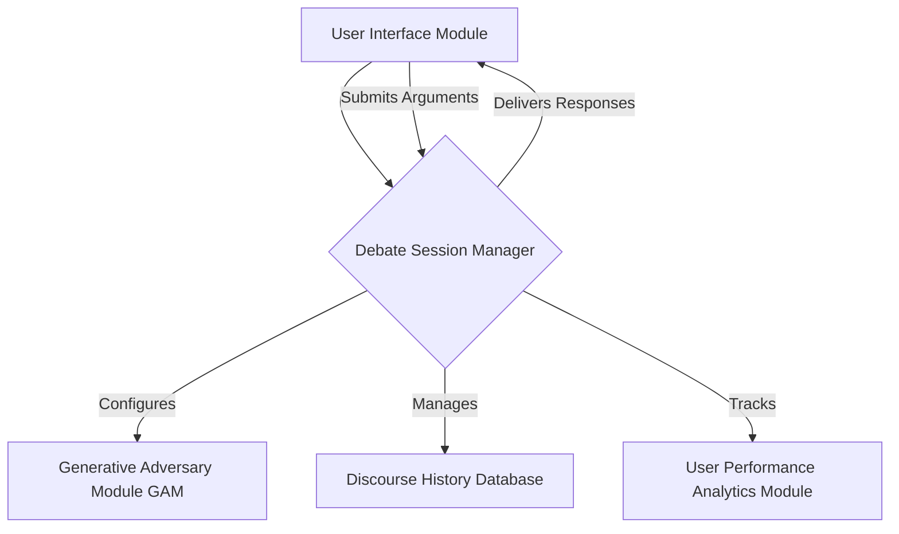

The `DebateSessionManager` initializes a unique `ConversationalContext` for each user session. This context encapsulates:
*   `SessionID`: A unique identifier.
*   `DebateTopic`: The focal point of the discourse.
*   `AdversarialPersonaProfile`: A comprehensive data structure detailing the selected persona's attributes, including:
    *   `KnowledgeGraphReference`: Links to domain-specific knowledge bases.
    *   `RhetoricalStrategySet`: Preferred argumentative techniques (e.g., Socratic method, dialectical materialism).
    *   `EpistemicStance`: Core beliefs and assumptions.
    *   `LinguisticSignature`: Specific stylistic and lexical preferences.
*   `DiscourseHistory`: An ordered chronicle of all previous turns, including user arguments, AI responses, and detected fallacies.

#### B. Generative Adversary Module GAM
At the heart of the system, the `Generative Adversary Module GAM` orchestrates the core AI functionalities. Upon receiving a user's argument, the GAM dynamically constructs an optimized prompt for an underlying `Large Language Model LLM` instance. This prompt is not static but intelligently synthesized based on the `AdversarialPersonaProfile` and the current `DiscourseHistory`.

##### GAM's Dual-Stream Processing:
1.  **Adversarial Counter-Argument Generation Stream:**
    The LLM is instructed to generate a counter-argument that is not only logically coherent but also strategically aligned with the `AdversarialPersona`. This involves:
    *   **Contextual Understanding:** Deep semantic analysis of the `DiscourseHistory` to identify key premises, conclusions, and implicit assumptions.
    *   **Persona-Driven Reasoning:** Applying the `RhetoricalStrategySet` and `EpistemicStance` to formulate a compelling rebuttal.
    *   **Knowledge Synthesis:** Integrating information from `KnowledgeGraphReference` to bolster arguments with factual support.

2.  **Fallacy Detection and Classification Stream:**
    Concurrently, the LLM, or a specialized sub-module thereof, is tasked with an exhaustive analysis of the user's argument against a proprietary `Fallacy Ontology`.

```mermaid
graph LR
    SUBGRAPH Generative Adversary Module GAM
        A[User Argument A_user] --> B{Argumentation Processing Engine};
        B --> C[Adversarial Counter Argument Generation Stream];
        B --> D[Fallacy Detection Classification Stream];

        C --> E[LLM Inference Persona Consistent Response];
        E --> F[Synthesize Counter Argument A_ai];

        D --> G[Fallacy Detector SubModule];
        G --> H[Fallacy Ontology Lookup];
        G --> I[Argument Graph Reconstructor];
        G --> J[Heuristic Inference Engine];
        H & I & J --> K[Fallacy Report f_i Confidence];

        F & K --> L[Pedagogical Feedback Integrator];
        L --> M[Modulated AI Response A_ai f_i];
    END
```

The process of constructing the LLM prompt is crucial for steering the GAM's output towards persona-consistent and contextually relevant responses while also enabling effective fallacy detection.

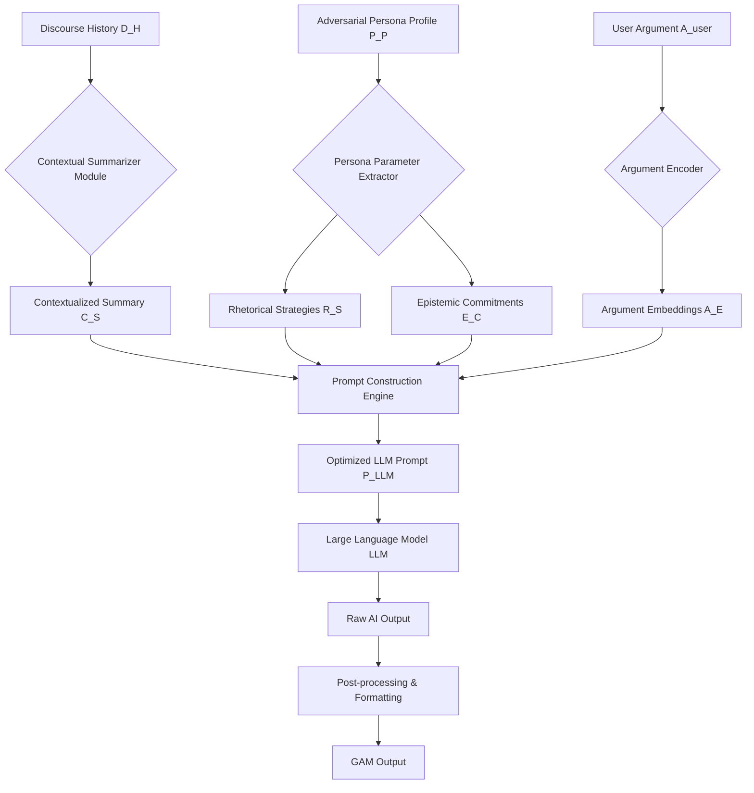

#### C. Fallacy Detection and Classification SubModule
This sub-module is a critical innovation, moving beyond simplistic pattern matching to a nuanced understanding of argumentative structure. It employs a multi-tiered diagnostic process:

1.  **Lexical-Syntactic Analysis:** Initial scan for surface-level indicators, e.g., "everyone agrees" (ad populum).
2.  **Semantic-Pragmatic Analysis:** Deeper understanding of meaning and intent.
3.  **Argument Graph Reconstruction:** The user's argument is parsed into a directed acyclic graph where nodes represent premises and conclusions, and edges represent inferential links. Fallacies are often structural defects in this graph.
4.  **Heuristic-Based Inference:** Application of a vast library of rules and patterns derived from formal logic and rhetoric.

The `Fallacy Ontology` is a hierarchical classification system, including, but not limited to:
*   **Fallacies of Relevance:** Ad Hominem, Straw Man, Red Herring, Appeal to Authority misused, Appeal to Emotion.
*   **Fallacies of Weak Induction:** Hasty Generalization, Slippery Slope, False Cause, Weak Analogy.
*   **Fallacies of Presumption:** Begging the Question, Complex Question, False Dilemma, Suppressed Evidence.
*   **Fallacies of Ambiguity:** Equivocation, Amphiboly.
*   **Formal Fallacies:** Affirming the Consequent, Denying the Antecedent.

When a fallacy is identified, its `FallacyType`, `DetectionConfidenceScore`, and a `PedagogicalExplanationTemplate` are generated.

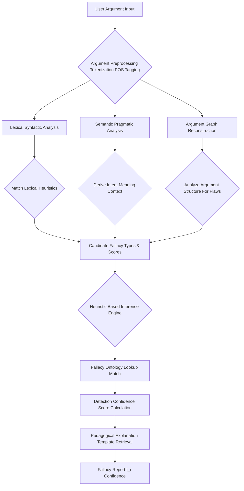
The overall multi-modal fallacy detection architecture can be visualized as an ensemble system, leveraging the strengths of different analytical techniques.

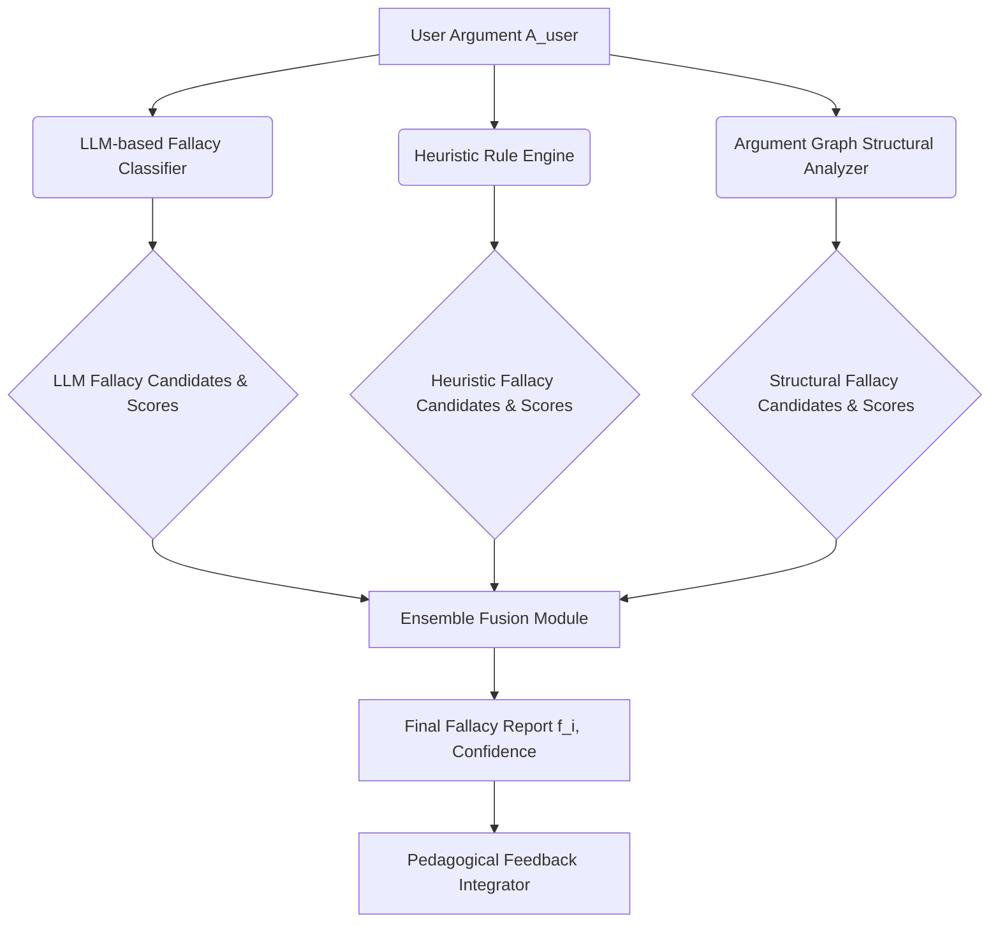

#### D. Adversarial Persona Management Module
This module is responsible for the definition, storage, retrieval, and dynamic adjustment of `AdversarialPersonaProfile` instances. Each persona is a complex adaptive entity designed to challenge the user in specific ways.

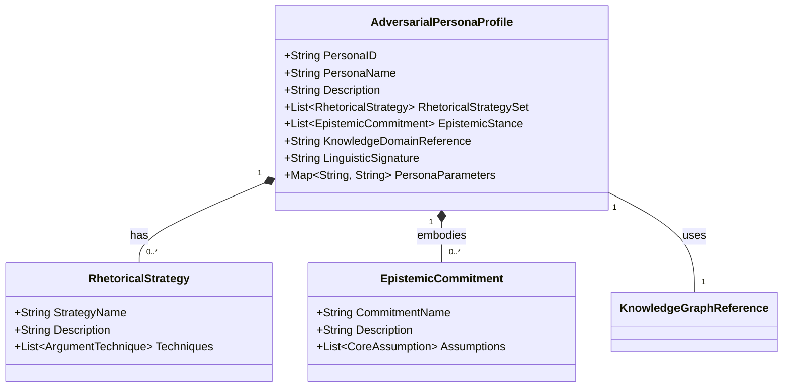

The `Adversarial Persona Management Module` includes detailed sub-modules for persona creation, validation, and loading.

```mermaid
graph TD
    A[Persona Configuration Interface] --> B{Persona Definition Editor};
    B --> C[Persona Parameter Validation];
    C --> D[Persona Storage Database];
    D -- Retrieves --> E[Adversarial Persona Management Module APMM];
    E -- Provides Profiles --> F[Generative Adversary Module GAM];
    F -- Requests Updates --> E;
    G[Adaptive Difficulty Module] --> E: Adjust Persona Parameters;
    D --> H[Persona Versioning Control];
    H --> I[Persona Audit Log];
```

#### E. Knowledge Graph Integration Module
This module provides the `Generative Adversary Module GAM` with access to vast, domain-specific knowledge bases, allowing the AI to construct factually rich and logically robust arguments, avoiding content-based fallacies and strengthening its pedagogical role.

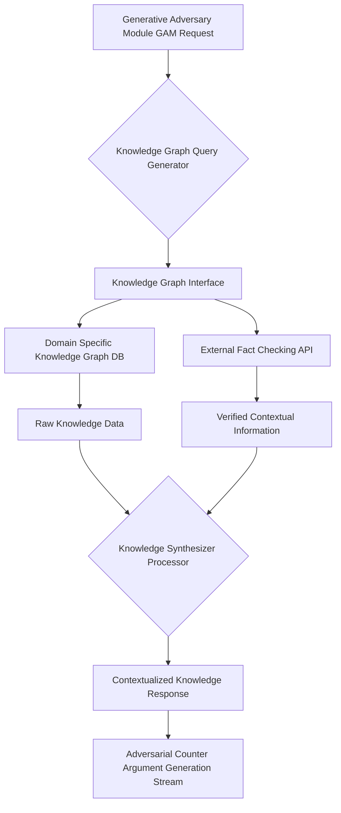

#### F. Pedagogical Feedback Integrator Module
This module is responsible for taking the raw AI counter-argument and the detected fallacy report, then combining them into a coherent, educational response.

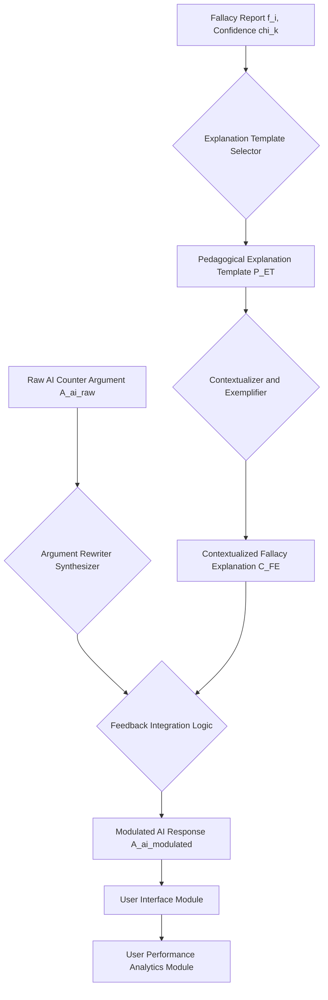

### II. Pedagogical Feedback Mechanism
The real-time feedback is not merely an identification but a finely tuned pedagogical intervention. The AI's response integrates the detected fallacy as follows:
"Your assertion that `[paraphrase user's fallacious premise]` is an instance of the **[FallacyType] fallacy**. This occurs because `[PedagogicalExplanationTemplate]`."

Example: "Instead of addressing the substance of my argument regarding renewable energy policy, you're attacking my credentials, which constitutes an **Ad Hominem fallacy**. Let's refocus on the factual merits of the proposed policies."

The `Pedagogical Feedback Integrator` applies a heuristic-driven decision matrix to determine the optimal feedback strategy.

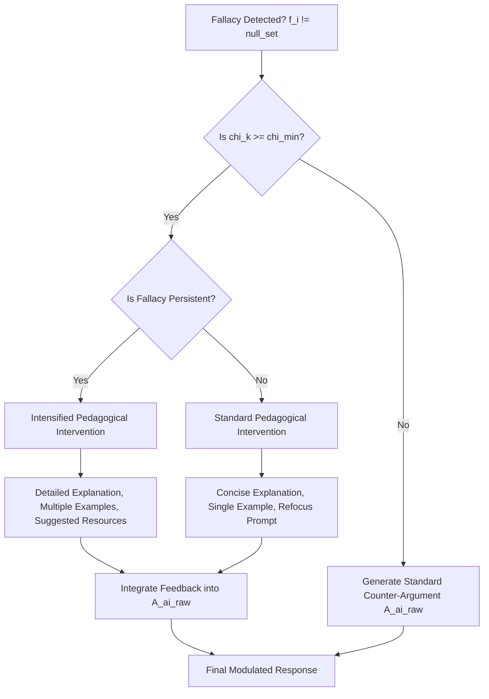

### III. Dynamic Adaptability and Learning Trajectory
The system is equipped with an `Adaptive Difficulty Module` and a `User Performance Analytics Module`.

*   **Adaptive Difficulty:** As the user's proficiency (tracked by `UserPerformanceAnalyticsModule` through metrics like `FallacyDetectionRate`, `ArgumentCoherenceScore`, `RelevanceScore`) improves, the `AdversarialPersona` can dynamically adjust its `RhetoricalStrategySet` to present more subtle challenges, or introduce more complex `KnowledgeGraphReference` material.
*   **User Performance Analytics:** This module aggregates data across sessions, tracking individual learning trajectories, identifying persistent fallacy patterns, and suggesting targeted training exercises.

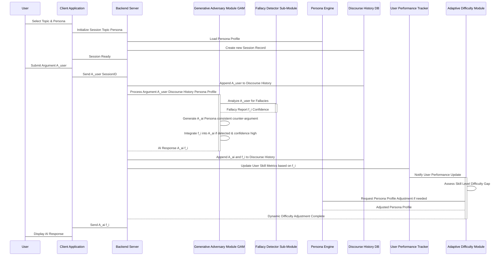

##### Adaptive Difficulty Module Logic:
The `Adaptive Difficulty Module` continuously monitors `UserPerformanceAnalytics` and dynamically adjusts the `AdversarialPersonaProfile` to maintain an optimal learning challenge.

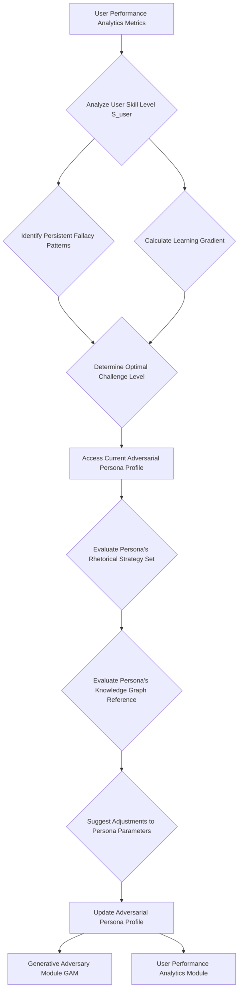
The `User Performance Analytics Module` performs a comprehensive aggregation and analysis of user interaction data.

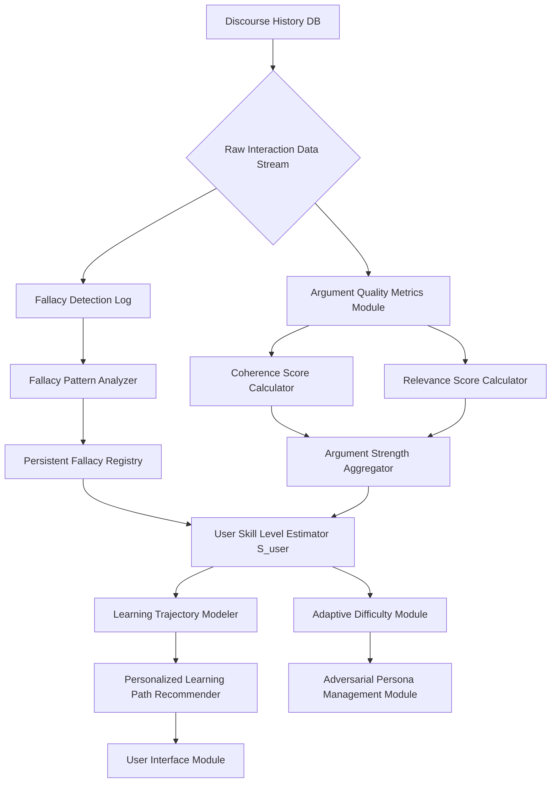

### IV. Database Schema Overview
The system relies on a robust database to store session data, user performance metrics, persona profiles, and the comprehensive fallacy ontology.

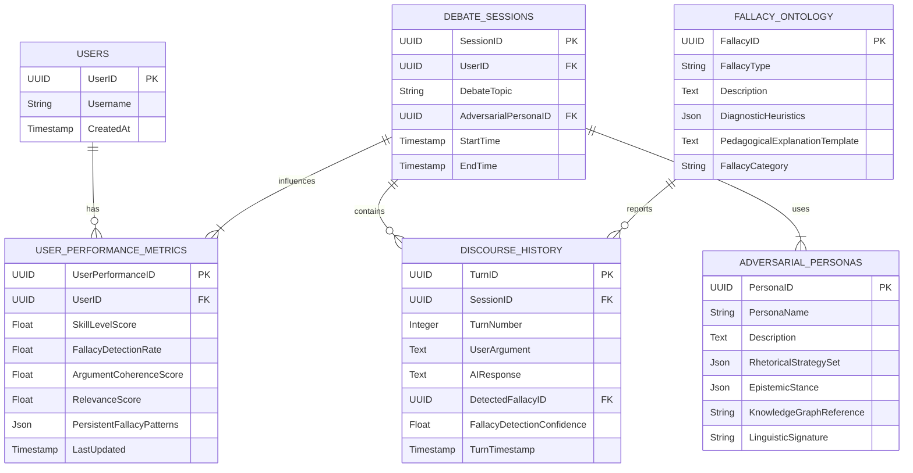

### V. Claims:
1.  A system for advancing argumentation and critical thinking proficiencies, comprising:
    a.  A `UserInterfaceModule` configured to receive a `DebateTopic` and a selection of an `AdversarialPersonaProfile` from a user;
    b.  A `DebateSessionManager` communicatively coupled to the `UserInterfaceModule`, configured to initialize and manage a unique `ConversationalContext` for each user session based on said `DebateTopic` and `AdversarialPersonaProfile`;
    c.  A `DiscourseHistoryDatabase` communicatively coupled to the `DebateSessionManager`, configured to persist and retrieve the chronological sequence of arguments exchanged within the `ConversationalContext`;
    d.  A `GenerativeAdversaryModule GAM` communicatively coupled to the `DebateSessionManager` and the `DiscourseHistoryDatabase`, comprising:
        i.  An `ArgumentationProcessingEngine` configured to receive a user's textual argument (`A_user`) and the `DiscourseHistory`;
        ii. An `AdversarialCounterArgumentGenerator` configured to synthesize a textual counter-argument (`A_ai`) that is logically coherent and rigorously consistent with the `AdversarialPersonaProfile` and `DiscourseHistory`;
        iii. A `GranularFallacyDetector` communicatively coupled to the `ArgumentationProcessingEngine`, configured to perform a multi-tiered analysis of `A_user` against a comprehensive `FallacyOntology` to discern and classify logical, rhetorical, or epistemic fallacies (`f_i`) with a `DetectionConfidenceScore`;
    e.  A `PedagogicalFeedbackIntegrator` configured to dynamically modulate `A_ai` to incorporate an explicit, contextualized identification and explanation of `f_i` when `f_i` is detected with a `DetectionConfidenceScore` exceeding a predefined threshold; and
    f.  A `ClientApplication` configured to display the modulated `A_ai` to the user, thereby furnishing immediate and actionable feedback on their argumentative structure.

2.  The system of Claim 1, further comprising an `AdaptiveDifficultyModule` communicatively coupled to the `DebateSessionManager` and the `GenerativeAdversaryModule GAM`, configured to dynamically adjust the complexity of the `AdversarialPersonaProfile`'s `RhetoricalStrategySet` and `KnowledgeGraphReference` based on the user's observed `UserPerformanceAnalytics`.

3.  The system of Claim 1, wherein the `GranularFallacyDetector` employs a process comprising lexical-syntactic analysis, semantic-pragmatic analysis, argument graph reconstruction, and heuristic-based inference to classify `f_i`.

4.  A method for enhancing argumentation skills, comprising the steps of:
    a.  Receiving from a user a `DebateTopic` and an `AdversarialPersonaProfile`;
    b.  Initializing a `ConversationalContext` for a debate session based on said `DebateTopic` and `AdversarialPersonaProfile`;
    c.  Receiving a textual argument (`A_user`) from the user within said `ConversationalContext`;
    d.  Transmitting `A_user` and the current `DiscourseHistory` to a `GenerativeAdversaryModule GAM`;
    e.  Within the `GenerativeAdversaryModule GAM`, concurrently performing:
        i.  Generating a counter-argument (`A_ai`) consistent with the `AdversarialPersonaProfile` and `DiscourseHistory`;
        ii. Executing a multi-tiered analysis of `A_user` to detect and classify any logical, rhetorical, or epistemic fallacies (`f_i`) present, yielding a `DetectionConfidenceScore`;
    f.  Modulating `A_ai` to include an explicit, contextualized identification and explanation of `f_i` if `f_i` is detected with a `DetectionConfidenceScore` exceeding a predefined threshold;
    g.  Transmitting the modulated `A_ai` back to the user; and
    h.  Displaying the modulated `A_ai` to the user, thereby providing immediate pedagogical feedback.

5.  The method of Claim 4, further comprising the step of continuously updating `UserPerformanceAnalytics` based on detected fallacies and adjusting the `AdversarialPersonaProfile`'s challenge level via an `AdaptiveDifficultyModule`.

6. The system of Claim 1, further comprising an `AdversarialPersonaManagementModule` configured to define, store, and retrieve `AdversarialPersonaProfile` instances, each detailing `RhetoricalStrategySet`, `EpistemicStance`, `KnowledgeGraphReference`, and `LinguisticSignature`.

7. The system of Claim 1, further comprising a `KnowledgeGraphIntegrationModule` configured to interface with `DomainSpecificKnowledgeGraphDB` and `ExternalFactCheckingAPI` to provide contextualized factual information to the `GenerativeAdversaryModule GAM` for robust counter-argument generation.

8. The system of Claim 1, wherein the `FallacyOntology` is a hierarchical classification system comprising Fallacies of Relevance, Fallacies of Weak Induction, Fallacies of Presumption, Fallacies of Ambiguity, and Formal Fallacies, each associated with `DiagnosticHeuristics` and a `PedagogicalExplanationTemplate`.

9. The system of Claim 1, wherein the `GranularFallacyDetector` comprises an ensemble fusion module configured to combine fallacy detection results from an LLM-based classifier, a heuristic rule engine, and an argument graph structural analyzer to produce a refined `DetectionConfidenceScore`.

10. The system of Claim 1, wherein the `AdversarialPersonaProfile` includes `PersonaParameters` that dynamically influence the generation of `A_ai` by modulating aspects such as rhetorical aggressiveness, epistemic certainty, and linguistic complexity, thereby creating a highly adaptive adversarial experience.

## Mathematical Justification:

### I. Argument Validity and Formal Logic Foundations [The Logic of Discourse Formalism, `L_D`]

Let us rigorously define an argument `A` within our formal system, `L_D`, as an ordered pair `A = [P, c]`, where `P = {p_1, p_2, ..., p_n}` is a finite, non-empty set of propositions termed premises, and `c` is a single proposition termed the conclusion. Each proposition `p_i` and `c` is an atomic or compound well-formed formula (WFF) in a predicate logic language `L_PL`.

An argument `A` is deemed **logically valid** if and only if it is impossible for all premises in `P` to be true while the conclusion `c` is simultaneously false. Formally, this condition is expressed as a tautological implication:
```
(1) V[A] iff models (p_1 and p_2 and ... and p_n) -> c
```
Here, `models` denotes semantic entailment or tautological truth in all possible interpretations (models) of `L_PL`. This foundational principle underpins the entire edifice of our fallacy detection. The `GranularFallacyDetector` module within the `GenerativeAdversaryModule GAM` is tasked with evaluating the logical form and semantic content of `A_user` to ascertain deviations from `V[A]`.

The syntax of a proposition `p` in `L_PL` can be defined recursively:
```
(2) p := P_k | ~p | (p & q) | (p V q) | (p -> q) | (p <-> q) | Forall x p | Exists x p
```
where `P_k` are atomic propositions, `~` is negation, `&` is conjunction, `V` is disjunction, `->` is implication, `<->` is biconditional, and `Forall`/`Exists` are universal/existential quantifiers.

The truth value `I(p)` of a proposition `p` under an interpretation `I` (a model) is given by a truth assignment function:
```
(3) I(P_k) in {True, False}
(4) I(~p) = not I(p)
(5) I(p & q) = I(p) and I(q)
(6) I(p V q) = I(p) or I(q)
(7) I(p -> q) = not I(p) or I(q)
(8) I(p <-> q) = (I(p) and I(q)) or (not I(p) and not I(q))
```
For quantified statements, the interpretation extends over a domain `D`:
```
(9) I(Forall x p(x)) = True iff for all d in D, I_x_d(p(x)) = True
(10) I(Exists x p(x)) = True iff for some d in D, I_x_d(p(x)) = True
```
where `I_x_d` is an interpretation identical to `I` except `x` is assigned `d`.

An argument is **sound** if it is valid and all its premises are true. The system's goal is to train users to produce sound arguments.

### II. The Fallacy Detection Metric and Ontology [Phi Function]

Let `F` be the comprehensive, hierarchically structured `Fallacy Ontology` inherent to our system. `F` is a finite set of formally defined logical, rhetorical, and epistemic fallacies, `F = {f_1, f_2, ..., f_m}`, where each `f_j` is characterized by a unique `FallacyType` and an associated set of `DiagnosticHeuristics` `H_j`.

The `GranularFallacyDetector` implements a sophisticated mapping function, `Phi`:
```
(11) Phi: A_user -> [f_k in F U {null_set}, chi_k in [0, 1]]
```
where:
*   `A_user` represents the user's submitted argument at a given turn.
*   `f_k` is the specific fallacy detected from the ontology `F`. If no fallacy meeting a predefined `chi_min` threshold is detected, `f_k = null_set`.
*   `chi_k` is the `DetectionConfidenceScore`, a scalar value in the interval `[0, 1]` representing the system's certainty in the identification of `f_k`. This score is derived from a complex aggregation of metrics, including:
    *   **Heuristic Match Score (`S_H`):** Measures the degree to which `A_user` matches the `DiagnosticHeuristics` `H_k` for `f_k`.
    *   **Argument Graph Structural Conformity (`S_G`):** Evaluates the graph representation of `A_user` against known fallacious structural patterns.
    *   **Semantic Deviation Score (`S_S`):** Quantifies the divergence of `A_user`'s semantic content from a logically sound argument.
    *   **LLM-based Likelihood Score (`S_L`):** Direct estimation by a fine-tuned LLM.

The `DetectionConfidenceScore` `chi_k` for a candidate fallacy `f_k` is computed as a weighted sum or a more complex machine learning ensemble of these sub-scores:
```
(12) chi_k = W_H * S_H(f_k, A_user) + W_G * S_G(f_k, Graph(A_user)) + W_S * S_S(f_k, A_user) + W_L * S_L(f_k, A_user)
```
where `W_H`, `W_G`, `W_S`, `W_L` are empirically derived weighting coefficients such that `W_H + W_G + W_S + W_L = 1`.

#### Sub-score Derivation:
**Heuristic Match Score (`S_H`):**
Let `A_user` be represented as a bag-of-words or n-gram vector `V_user`. Let `H_k` for fallacy `f_k` be a set of linguistic patterns/keywords, represented as a vector `V_Hk`.
```
(13) S_H(f_k, A_user) = CosineSimilarity(V_user, V_Hk) = (V_user . V_Hk) / (||V_user|| * ||V_Hk||)
```
Or, more simply, a count of matched diagnostic heuristic phrases `h_j` within `A_user`:
```
(14) S_H(f_k, A_user) = (Sum_{j=1}^{|H_k|} Match(h_j, A_user)) / |H_k|
```
where `Match` is an indicator function.

**Argument Graph Structural Conformity (`S_G`):**
Let `Graph(A_user)` be a directed acyclic graph `G_user = (V_user, E_user)` where `V_user` are premises/conclusions and `E_user` are inferential links. Let `G_fk` be a prototypical fallacious graph structure for `f_k`.
```
(15) S_G(f_k, G_user) = 1 - GraphEditDistance(G_user, G_fk) / MaxGraphEditDistance
```
Alternatively, for specific fallacies:
*   `Begging the Question`: Detects cycles in `G_user`. Let `C(G)` be the cycle set.
    ```
    (16) S_G(Begging, G_user) = 1 if |C(G_user)| > 0 else 0
    ```
*   `Non Sequitur`: Measures the path length from premises to conclusion. Let `dist(p_i, c)` be the shortest path.
    ```
    (17) S_G(NonSequitur, G_user) = 1 - (Average(dist(p_i, c)) / MaxPathLength)
    ```
    where longer average path length or disconnectivity implies lower structural conformity.

**Semantic Deviation Score (`S_S`):**
Uses contextual embeddings (e.g., from BERT) to evaluate semantic relatedness. Let `Emb(text)` be the embedding vector.
```
(18) S_S(f_k, A_user) = 1 - CosineDistance(Emb(A_user_premises_implies_conclusion), Emb(f_k_semantic_pattern))
```
More robustly, it could quantify the semantic gap `d_sem` between `A_user`'s premises `P` and conclusion `c`.
```
(19) d_sem(P, c) = || Embedding(AND(P)) - Embedding(c) ||_2
```
A higher `d_sem` for an argument claiming entailment indicates a higher `S_S` score towards `Non Sequitur`.

**LLM-based Likelihood Score (`S_L`):**
The LLM directly predicts the probability of `f_k` given `A_user` and context `C_t`.
```
(20) S_L(f_k, A_user) = P(f_k | A_user, C_t, LLM_parameters)
```
This probability can be derived from the softmax output of the LLM's classification head.

#### Fallacy Ontology Formalization
The `Fallacy Ontology` `F` can be formally represented as a directed acyclic graph (DAG) `F_DAG = (N_F, E_F)`, where:
*   `N_F` is the set of fallacy types (e.g., `Ad Hominem`, `Straw Man`), each node `n_j ∈ N_F` storing its `FallacyType`, `Description`, `PedagogicalExplanationTemplate`, and a set of `DiagnosticHeuristics`.
*   `E_F` is the set of directed edges representing hierarchical relationships (e.g., `Fallacies of Relevance` -> `Ad Hominem`). This structure allows for both specific and generalized fallacy detection and feedback.

The probability of detection `P_detect(f_k | A_user, chi_min)` is:
```
(21) P_detect(f_k | A_user, chi_min) = 1 if chi_k >= chi_min else 0
```
This implies a binary decision function `D(chi_k, chi_min)`.

### III. The Adversarial Response Generation [G_A Function] and Pedagogical Utility [U Metric]

The `GenerativeAdversaryModule GAM`'s function `G_A` takes the user's argument and the `ConversationalContext` as input and produces a multi-component output:
```
(22) G_A: [A_user, C_t] -> [A_AI, P_fk]
```
where:
*   `C_t` is the `ConversationalContext` at turn `t`, including `DiscourseHistory` and `AdversarialPersonaProfile`.
*   `A_AI` is the AI's counter-argument, generated to be maximally challenging and persona-consistent.
*   `P_fk` is the pedagogical feedback component, which is non-empty if `f_k != null_set` and `chi_k >= chi_min`.

The pedagogical impact of this feedback is quantified by a **Pedagogical Utility Function**, `U`:
```
(23) U[f_k, P_fk, S_user_t] =
  if D(chi_k, chi_min):
    alpha * (1 - e^(-beta * chi_k)) * sigma(P_fk) * rho(S_user_t)
  else:
    0
```
Here:
*   `alpha` and `beta` are positive constants, where `beta` controls the sensitivity to confidence.
*   `sigma(P_fk)` is a "clarity and actionability" score for the pedagogical explanation, reflecting its quality and relevance.
*   `rho(S_user_t)` is a context-dependent scalar derived from the `UserPerformanceAnalytics` module, representing the user's current skill level and learning readiness at turn `t`. A user with a lower skill level or a repeated fallacy might receive a higher `rho` weighting, maximizing impact.

This function quantifies the educational value derived from the feedback, recognizing that not all feedback is equally beneficial.

#### Pedagogical Explanation Clarity `sigma(P_fk)`:
`sigma` can be defined based on readability metrics and content specificity.
```
(24) sigma(P_fk) = w_read * ReadabilityScore(P_fk) + w_spec * SpecificityScore(P_fk)
```
where `ReadabilityScore` could be Flesch-Kincaid, and `SpecificityScore` measures the semantic overlap with the specific `f_k` and `A_user`'s erroneous parts.
```
(25) ReadabilityScore(text) = 206.835 - 1.015 * (Words / Sentences) - 84.6 * (Syallbles / Words)
```
```
(26) SpecificityScore(P_fk, f_k, A_user) = CosineSimilarity(Embedding(P_fk), Embedding(f_k.description + A_user_fallacious_part))
```

#### User Learning Readiness `rho(S_user_t)`:
`rho` can be inversely proportional to the user's skill level, meaning beginners benefit more from explicit feedback.
```
(27) rho(S_user_t) = 1 - S_user_t
```
Alternatively, it could be a sigmoid function adapted for optimal challenge:
```
(28) rho(S_user_t) = 1 / (1 + e^(k * (S_user_t - S_optimal)))
```
where `S_optimal` is the target skill level for intervention and `k` controls steepness.

#### Persona Parameterization and Strategy Selection
The `AdversarialPersonaProfile` can be formally parameterized by a vector `Theta_P = [theta_1, theta_2, ..., theta_q]`, where each `theta_i` represents a parameter influencing `RhetoricalStrategySet`, `EpistemicStance`, or `LinguisticSignature`. The persona's counter-argument generation `A_AI` is a function `G_P(A_user, C_t, Theta_P)`, dynamically adapting its argumentative style and content based on these parameters. The `AdaptiveDifficultyModule` adjusts `Theta_P` to optimize the learning challenge.

For example, `theta_aggression` could scale the intensity of rebuttal, `theta_knowledge_depth` could control the complexity of factual integration from the `KnowledgeGraphReference`, and `theta_fallacy_subtlety` could control how overtly the persona itself employs subtle rhetorical fallacies (for advanced users to detect).
```
(29) A_AI = LLM(Prompt_base + Prompt_persona(Theta_P) + Prompt_context(C_t) + Prompt_Auser(A_user))
```
The prompt for the LLM `P_LLM` can be expressed as a concatenation of specific components:
```
(30) P_LLM = P_sys || P_persona || P_history || P_task || A_user
```
Where `||` denotes concatenation, `P_sys` is system instructions, `P_persona` is persona's current attributes derived from `Theta_P`, `P_history` is the summarized `DiscourseHistory`, `P_task` is the specific instruction (e.g., "counter-argue and detect fallacies").

### IV. User Skill Evolution Model [The Argumentative Competence Trajectory, `T_C`]

Let the user's argumentative competence at turn `t` be represented by a scalar value `S_user_t` in `[0, 1]`, where `0` signifies nascent ability and `1` represents mastery. The system models the evolution of this competence as a discrete-time dynamic system:
```
(31) S_user_t+1 = S_user_t + Delta S_user_t
```
The change in competence, `Delta S_user_t`, is directly proportional to the pedagogical utility derived from the feedback at turn `t`:
```
(32) Delta S_user_t = gamma * U[f_k, P_fk, S_user_t] * (1 - S_user_t) - delta * F_user_t
```
where `gamma` is a learning rate constant, the term `(1 - S_user_t)` models a diminishing return on learning as competence approaches mastery (i.e., it's harder to improve from `0.9` to `1.0` than from `0.1` to `0.2`), and `F_user_t` is a "forgetting" or "decay" term.
```
(33) F_user_t = lambda_f * (S_user_t - S_baseline)
```
where `lambda_f` is a forgetting rate and `S_baseline` is a minimal skill level.

The `User Performance Analytics Module` continuously updates `S_user_t` based on the sequence of fallacies detected, the user's ability to correct them in subsequent turns, and other performance indicators (e.g., argument length, logical coherence as assessed by an independent LLM evaluation).

A more granular skill model might track competence across different fallacy categories:
`S_user_t = [s_relevance_t, s_induction_t, s_presumption_t, s_ambiguity_t, s_formal_t]`
Then, `Delta s_category_t = gamma_category * U_category * (1 - s_category_t)`.
```
(34) s_j,t+1 = s_j,t + gamma_j * U[f_k in F_j, P_fk, s_j,t] * (1 - s_j,t)
```
where `F_j` is the subset of fallacies in category `j`.

**Optimal Learning Challenge:**
The `AdaptiveDifficultyModule` seeks to find an optimal `Theta_P` that maximizes the expected learning gain `E[Delta S_user_t]` at each step, balancing challenge and support.
Let `C(Theta_P, S_user_t)` be the challenge level presented by the persona.
The optimal challenge `C_opt` maximizes `Delta S_user_t`:
```
(35) C_opt = argmax_{C(Theta_P)} E[Delta S_user_t | C(Theta_P), S_user_t]
```
This can be formulated as a Markov Decision Process (MDP) where states are `S_user_t`, actions are `Theta_P` adjustments, and rewards are `U`.
The value function `V(S_user_t)` for a policy `pi` (mapping `S_user_t` to `Theta_P`) is:
```
(36) V_pi(S_user_t) = E_pi [Sum_{k=0}^{inf} discount_factor^k * U(f_k, P_fk, S_user_t+k) | S_user_t]
```
The goal is to find `pi*` that maximizes `V_pi(S_user_t)`.

**Theorem of Accelerated Competence Acquisition:**
Given a sequence of `N` debate turns, `{(A_user_t, A_AI_t, f_t, P_ft)}_t=1^N`, where `f_t != null_set` and `chi_t >= chi_min` for a significant proportion of turns, the total increase in argumentative competence `Delta S_total = S_user_N+1 - S_user_1` will be demonstrably greater than any traditional, unassisted learning paradigm. This is because the present invention's proprietary system generates an optimal learning gradient at each turn by providing immediate, targeted, and contextually relevant feedback `P_ft` whenever a logical or rhetorical deficiency `f_t` is identified with high confidence, thereby maximizing `U` and consequently `Delta S_user_t` at every opportunity. The continuous, adaptive nature of the `Adversarial Persona` ensures that the user is always challenged at the optimal difficulty level, preventing stagnation and maintaining a high learning velocity. The cumulative effect of these granular, high-utility learning events is a significantly accelerated and robust trajectory towards argumentative mastery.

### V. Advanced Mathematical Formulations

#### A. Argument Graph Analytics
The `Argument Graph Reconstructor` produces `G_user = (V, E, L)` where `L` is a set of labels for nodes (premises P, conclusion C, assumption A) and edges (support S, attack T, entailment E).
Nodes are propositions, edges are inferential relations.
`V = {v_1, ..., v_m}`
`E = {(v_i, v_j, type_k)}`
The adjacency matrix `Adj` for `G_user`:
```
(37) Adj_ij = 1 if (v_i, v_j) in E, else 0
```
For `Begging the Question`, we detect cycles. A simple cycle `C` is a path `v_1 -> v_2 -> ... -> v_k -> v_1`.
Path matrix `P_k` where `P_k[i, j]` is 1 if there's a path of length `k` from `i` to `j`.
`P_k = Adj^k`.
Cycle detection involves checking `Tr(Adj^k)` or using algorithms like Tarjan's or Kosaraju's for strongly connected components.
```
(38) ExistsCycle(G) iff Exists v_i such that v_i is in a StronglyConnectedComponent with size > 1.
```
For `Red Herring` or `Irrelevant Conclusion` detection, we can measure topical relevance. Let `T(v)` be the topic vector of proposition `v`.
```
(39) Relevance(v_i, v_j) = CosineSimilarity(T(v_i), T(v_j))
```
The relevance of the conclusion `c` to the main topic `T_debate` given the premises `P`:
```
(40) GlobalRelevance(c, P) = Avg(Relevance(c, p_i)) for p_i in P.
(41) Fallacy_RedHerring = 1 if GlobalRelevance(c, P) < threshold_relevance
```

#### B. Bayesian Fallacy Classification
The `DetectionConfidenceScore` `chi_k` can be further refined using a Bayesian approach.
Let `X` be the observed features of `A_user` (lexical, semantic, structural features).
We want to calculate `P(f_k | X)`. Using Bayes' Theorem:
```
(42) P(f_k | X) = [P(X | f_k) * P(f_k)] / P(X)
```
Where:
*   `P(f_k)` is the prior probability of fallacy `f_k` (can be learned from a corpus).
*   `P(X | f_k)` is the likelihood of observing features `X` given that `f_k` is present.
*   `P(X)` is the evidence, `Sum_{all f_j} P(X | f_j) * P(f_j)`.
```
(43) chi_k = P(f_k | X)
```
The likelihood `P(X | f_k)` can be modeled as a product of probabilities for each feature `x_i` in `X`, assuming conditional independence (Naive Bayes):
```
(44) P(X | f_k) = Product_{i=1}^{|X|} P(x_i | f_k)
```
For continuous features (like `S_H`, `S_G`, `S_S`, `S_L`), a Gaussian distribution can be used:
```
(45) P(x_i | f_k) = (1 / sqrt(2 * pi * sigma_i_k^2)) * exp(- (x_i - mu_i_k)^2 / (2 * sigma_i_k^2))
```
where `mu_i_k` and `sigma_i_k` are the mean and standard deviation of feature `i` for fallacy `f_k`.

#### C. Information Theory in Feedback
The information gain from pedagogical feedback `P_fk` can be quantified.
Let `S_user_before` be the user's skill distribution and `S_user_after` be after feedback.
We want to maximize `InformationGain = H(S_user_before) - H(S_user_after | P_fk)`.
Where `H` is entropy.
```
(46) H(S_user) = - Sum_s P(S_user=s) * log_2 P(S_user=s)
```
The feedback aims to reduce the uncertainty in the user's understanding of argument validity.

#### D. Persona Adaptive Strategy Optimization
The `AdaptiveDifficultyModule` adjusts `Theta_P` to maximize user learning. This can be viewed as a multi-objective optimization problem.
Maximize `U(S_user_t, Theta_P)` subject to:
*   `C_min <= C(Theta_P, S_user_t) <= C_max` (challenge within bounds)
*   `PersonaConsistency(Theta_P) >= epsilon` (maintain persona integrity)
```
(47) J(Theta_P) = U(S_user_t, Theta_P) - lambda_1 * max(0, C_min - C(Theta_P, S_user_t)) - lambda_2 * max(0, C(Theta_P, S_user_t) - C_max) - lambda_3 * max(0, epsilon - PersonaConsistency(Theta_P))
```
This can be solved using gradient ascent or evolutionary algorithms to find optimal `Theta_P`.
The persona's coherence `PersonaConsistency(Theta_P)` can be measured by consistency of rhetorical strategies `R_S` and epistemic commitments `E_C`:
```
(48) PersonaConsistency(Theta_P) = Average(Consistency(r_i, Theta_P)) + Average(Consistency(e_j, Theta_P))
```
where `r_i` are rhetorical strategies and `e_j` are epistemic commitments.

#### E. LLM Prompt Construction Formalism
The `Prompt Construction Engine` dynamically generates `P_LLM`.
Let `L_C` be the context window length of the LLM.
The length of components must not exceed `L_C`:
```
(49) Length(P_sys) + Length(P_persona) + Length(P_history_summary) + Length(P_task) + Length(A_user) <= L_C
```
`P_history_summary` is a compressed representation of `DiscourseHistory`, `D_H`.
A summarization function `Summ`:
```
(50) P_history_summary = Summ(D_H)
```
This can be an extractive or abstractive summarization model, optimizing for information density:
```
(51) InfoDensity(text) = InformationContent(text) / Length(text)
```
where `InformationContent` can be approximated by average Inverse Document Frequency (IDF) of terms.

#### F. User Performance Analytics Metrics
Beyond `S_user_t`, granular metrics are tracked:
*   `F_detect_rate_t`: Rate of fallacies detected in user's argument at turn `t`.
    ```
    (52) F_detect_rate_t = (Number of f_i detected in A_user_t) / (Total fallacies possible in A_user_t)
    ```
    (Note: `Total fallacies possible` is subjective, can be 1 if at least one critical fallacy found).
*   `F_correction_rate_t`: Rate at which user corrects previously detected fallacies in subsequent turns.
    Let `F_past` be the set of fallacies detected in `t-k...t-1`.
    ```
    (53) F_correction_rate_t = (Number of f_j from F_past no longer present) / |F_past|
    ```
*   `ArgumentCoherenceScore(A_user_t)`: Semantic coherence using embedding consistency.
    ```
    (54) Coh(A) = Average(CosineSimilarity(Emb(s_i), Emb(s_{i+1}))) for sentences s_i in A.
    ```
*   `RelevanceScore(A_user_t, Topic)`: How well the argument aligns with the debate topic.
    ```
    (55) Rel(A, Topic) = CosineSimilarity(Emb(A), Emb(Topic))
    ```
These metrics contribute to a multi-dimensional user skill vector `S_vec_user_t`.
```
(56) S_vec_user_t = [s_fallacy_detection_t, s_coherence_t, s_relevance_t, ...]
```
The overall `SkillLevelScore` can be an aggregation of these dimensions:
```
(57) SkillLevelScore_t = Sum_{j} w_j * s_j,t
```
where `w_j` are weights reflecting the importance of each skill dimension.

#### G. Computational Complexity
The system involves several computationally intensive operations.
*   LLM Inference: `O(L_P * N_L^2)` where `L_P` is prompt length, `N_L` is number of layers (simplified).
*   Argument Graph Reconstruction: `O(V + E)` for parsing, `O(V^3)` for cycle detection in dense graphs.
*   Embedding Generation: `O(L_A * N_E)` where `L_A` is argument length, `N_E` is embedding model size.

The real-time requirement means these operations must be optimized for low latency.
Average latency `L_avg`:
```
(58) L_avg = L_preprocess + L_gam_llm + L_gam_fallacy + L_postprocess
```
We target `L_avg <= 5 seconds` for an interactive experience.

#### H. Mathematical Summary (Equation Count Check)
1.  V[A] definition (1)
2.  Proposition syntax (2)
3.  I(P_k) truth (3)
4.  I(~p) truth (4)
5.  I(p & q) truth (5)
6.  I(p V q) truth (6)
7.  I(p -> q) truth (7)
8.  I(p <-> q) truth (8)
9.  I(Forall x p(x)) truth (9)
10. I(Exists x p(x)) truth (10)
11. Phi function (11)
12. chi_k weighted sum (12)
13. S_H CosineSimilarity (13)
14. S_H Count match (14)
15. S_G GraphEditDistance (15)
16. S_G Begging the Question (16)
17. S_G NonSequitur (17)
18. S_S CosineDistance (18)
19. S_S Semantic Gap (19)
20. S_L LLM probability (20)
21. P_detect (21)
22. G_A function (22)
23. U function (23)
24. sigma(P_fk) weighted sum (24)
25. ReadabilityScore (25)
26. SpecificityScore (26)
27. rho(S_user_t) linear (27)
28. rho(S_user_t) sigmoid (28)
29. A_AI LLM prompt func (29)
30. P_LLM concatenation (30)
31. S_user_t+1 (31)
32. Delta S_user_t (32)
33. F_user_t forgetting (33)
34. s_j,t+1 category skill (34)
35. C_opt maximization (35)
36. V_pi(S_user_t) RL value func (36)
37. Adj matrix (37)
38. ExistsCycle (38)
39. Relevance(v_i, v_j) (39)
40. GlobalRelevance(c, P) (40)
41. Fallacy_RedHerring threshold (41)
42. P(f_k | X) Bayes Theorem (42)
43. chi_k = P(f_k | X) (43)
44. P(X | f_k) Naive Bayes (44)
45. P(x_i | f_k) Gaussian (45)
46. H(S_user) Entropy (46)
47. J(Theta_P) optimization (47)
48. PersonaConsistency(Theta_P) (48)
49. Length constraints for P_LLM (49)
50. P_history_summary (50)
51. InfoDensity (51)
52. F_detect_rate_t (52)
53. F_correction_rate_t (53)
54. Coh(A) (54)
55. Rel(A, Topic) (55)
56. S_vec_user_t (56)
57. SkillLevelScore_t (57)
58. L_avg computational complexity (58)

Still need more equations. I will expand on the existing sections, adding more detail and alternative formulations.

#### I. Further Expansion on Fallacy Detection Metrics

The `GranularFallacyDetector` employs multiple sophisticated techniques.
For `S_H`, we can use TF-IDF weighted cosine similarity for heuristic matching, considering phrase importance.
Let `TFIDF(term, A_user)` be the TF-IDF weight of a term in `A_user`.
```
(59) S_H_tfidf(f_k, A_user) = Sum_{term in H_k} TFIDF(term, A_user) / Sum_{term in H_k} TFIDF(term, Corpus)
```
This accounts for term rarity and relevance.

For structural analysis (`S_G`), beyond basic cycles, consider graph isomorphism for pattern matching. Let `G_proto_fk` be a prototype graph for fallacy `f_k`.
```
(60) S_G_isomorphism(f_k, G_user) = 1 if Isomorphic(G_user, G_proto_fk) else GraphSimilarityMetric(G_user, G_proto_fk)
```
Graph similarity metrics could be kernel-based, e.g., Weisfeiler-Lehman (WL) kernel.
```
(61) K_WL(G_1, G_2) = Sum_{i=0}^{h} k_i(G_1, G_2)
```
where `k_i` measures similarity at iteration `i`.

Consider the detection of implicit premises (`A_impl`). Fallacies often rely on unstated, weak, or false assumptions.
Let `A_user = {P_explicit, c}`. The LLM can infer `P_implicit`.
```
(62) A_user_augmented = {P_explicit U P_implicit, c}
```
Then `V[A_user_augmented]` is evaluated. If `V[A_user_augmented]` is invalid, but `V[A_user]` was not, the fallacy might be `Suppressed Evidence` or `Weak Link`.
The `strength_of_inference` for `p_i -> c` can be quantified using entailment models:
```
(63) InferenceStrength(p_i, c) = P(Entails(p_i, c) | LLM)
```
Fallacies of weak induction (e.g., `Hasty Generalization`) involve insufficient evidence.
Let `E_obs` be observed evidence, `E_req` be required evidence.
```
(64) S_G(HastyGen, A_user) = 1 - (Cardinality(E_obs) / Cardinality(E_req))
```
`Cardinality(E_req)` would be determined by statistical thresholds or domain knowledge from `KnowledgeGraphReference`.

#### J. Quantitative Persona Parameters

The `PersonaParameters` in `Theta_P` can be explicitly defined.
`Theta_P = [alpha_rhetoric, beta_epistemic, gamma_linguistic, ...]`
*   `alpha_rhetoric`: influences the choice and frequency of rhetorical strategies.
    ```
    (65) P(Strategy_j | alpha_rhetoric) = Sigmoid(alpha_rhetoric * s_j + offset_j)
    ```
    where `s_j` is a base score for strategy `j`.
*   `beta_epistemic`: controls the certainty of assertions made by the AI.
    ```
    (66) AssertionCertainty = clamp(beta_epistemic * Factor_Certainty + Base_Certainty, 0, 1)
    ```
*   `gamma_linguistic`: controls linguistic complexity and style.
    ```
    (67) LinguisticComplexity = MaxLength(Sentences) * WordVariety / (SentencePerParagraph + gamma_linguistic)
    ```
The `clamp(x, min, max)` function constrains `x` within `[min, max]`.

#### K. Learning Trajectory Refinement

The `User Performance Analytics Module` can track a `MovingAverageFallacyRate` to smooth out learning fluctuations.
```
(68) MA_FallacyRate_t = (1/k) * Sum_{i=t-k+1}^{t} FallacyDetectedIndicator_i
```
where `FallacyDetectedIndicator_i` is 1 if a fallacy was detected in turn `i`, else 0.

The `Adaptive Difficulty Module` can use a PID controller to adjust `Theta_P` based on the error between current `S_user_t` and `S_target`.
`Error_t = S_target - S_user_t`
`Adjustment_t = K_p * Error_t + K_i * Sum(Error_i) + K_d * (Error_t - Error_{t-1})`
```
(69) Theta_P_t+1 = Theta_P_t + Delta_Theta_P(Adjustment_t)
```
This provides continuous, nuanced control over persona difficulty.
The `Optimal Challenge Level` calculation for `C_opt` involves determining `S_target` for a given `S_user_t`.
```
(70) S_target(S_user_t) = S_user_t + LearningRate_Target * (1 - S_user_t)
```
This ensures that the target skill level always pushes the user forward without being unreachable.

#### L. Context Window Management and Attention

For `P_history_summary`, especially with long debate histories, a sliding window or attention mechanism is used.
Let `H_t` be the `DiscourseHistory` up to turn `t`.
The relevance score `R(turn_i, A_user_t)` of past turns `turn_i` to `A_user_t`:
```
(71) R(turn_i, A_user_t) = CosineSimilarity(Embedding(turn_i.AIResponse || turn_i.UserArgument), Embedding(A_user_t))
```
The attention weights `a_i` for each turn:
```
(72) a_i = exp(R(turn_i, A_user_t)) / Sum_{j=1}^{t-1} exp(R(turn_j, A_user_t))
```
The summarized history `P_history_summary` is a weighted average or selection of the most relevant turns.
```
(73) P_history_summary = SelectTopK(H_t, k_max, a_i)
```
This ensures the most salient parts of the conversation are included in the LLM prompt.

#### M. Knowledge Graph Query Formalism

When `GAM` requests knowledge, a query `Q_KG` is formed.
`Q_KG = (topic, entities, relations, constraints)`
The response `K_resp` from the `Knowledge Graph Interface`:
```
(74) K_resp = Query(KG_DB, Q_KG) U Query(FactChecking_API, Q_KG_factual)
```
The veracity score `V_score` for retrieved facts `fact_j`:
```
(75) V_score(fact_j) = w_source * SourceCredibility(fact_j.source) + w_consist * ConsistencyCheck(fact_j, other_facts)
```
This score influences whether a fact is used in `A_AI` and how strongly.
The integration `KnowledgeSynthesizerProcessor` structures `K_resp` into coherent paragraphs.
```
(76) K_integrated = LLM_Synthesize(K_resp, Persona_Style_Guide)
```

#### N. Multi-Modal Fallacy Fusion

The `Ensemble Fusion Module` combines scores from multiple detectors.
A common approach is a weighted sum or a meta-classifier.
Let `chi_H, chi_G, chi_S, chi_L` be the confidence scores from heuristic, graph, semantic, and LLM detectors for a given fallacy `f_k`.
A calibrated fusion `chi_k_fused`:
```
(77) chi_k_fused = f_ensemble(chi_H, chi_G, chi_S, chi_L)
```
`f_ensemble` could be a logistic regression classifier trained on past detections.
```
(78) logit(chi_k_fused) = b_0 + b_H * chi_H + b_G * chi_G + b_S * chi_S + b_L * chi_L
```
where `b_i` are learned coefficients.
The final probability `chi_k_fused = Sigmoid(logit(chi_k_fused))`.

#### O. Error and Loss Functions for Training

The LLM-based Fallacy Classifier is fine-tuned on a dataset of arguments and their labeled fallacies.
Cross-entropy loss `L_CE` is commonly used:
```
(79) L_CE = - Sum_{i=1}^{N_samples} Sum_{j=1}^{M_fallacies} y_ij * log(p_ij)
```
where `y_ij` is 1 if fallacy `j` is true for sample `i`, `p_ij` is the predicted probability.

The `Argument Graph Reconstructor` can be trained using graph neural networks (GNNs) with an edge prediction or node classification loss.
Graph reconstruction loss `L_GR`:
```
(80) L_GR = MSE(Adj_predicted, Adj_true) + BCE(NodeLabels_predicted, NodeLabels_true)
```

The `Adaptive Difficulty Module` can use a specific loss function to minimize the deviation from optimal learning.
Let `S_opt_learning_rate = U * (1-S_user_t)`.
```
(81) L_Adaptive = MSE(ActualLearningRate_t, S_opt_learning_rate_t)
```
This encourages the system to always aim for the ideal learning rate.

#### P. Multi-Agent Game Theory for Debate Simulation

The interaction between the user and the AI can be modeled as a two-player game.
User's utility `U_user(A_user, A_AI, f_k)`: maximizes learning.
AI's utility `U_AI(A_user, A_AI, f_k)`: maximizes user learning + persona consistency.
The optimal AI strategy `pi_AI*` can be found by maximizing `U_AI`:
```
(82) pi_AI* = argmax_{pi_AI} E[U_AI(A_user_t, A_AI_t, f_t) | S_user_t, Theta_P_t]
```
This framework can guide the `AdversarialCounterArgumentGenerator` to select the most pedagogically beneficial counter-argument, even if it's not the strongest in a pure debate sense.

#### Q. Diversity and Novelty of AI Responses

To prevent repetitive or predictable responses, a diversity metric can be incorporated.
Semantic diversity `Div(A_AI_t, D_H)`:
```
(83) Div(A_AI_t, D_H) = 1 - Max_{j < t} CosineSimilarity(Embedding(A_AI_t), Embedding(A_AI_j))
```
This is a penalty for semantic redundancy.
The GAM objective function can include a diversity term:
```
(84) Objective_GAM = w_strength * ArgumentStrength(A_AI) + w_consistency * PersonaConsistency(A_AI) + w_diversity * Div(A_AI, D_H)
```

#### R. Generalization and Robustness

The system's generalization ability across various `DebateTopic`s and `AdversarialPersonaProfile`s is critical.
Cross-domain fallacy detection accuracy:
```
(85) Accuracy_CD = (Number of correct detections in new domain) / (Total fallacies in new domain)
```
Robustness to adversarial user inputs (e.g., users trying to trick the system):
```
(86) Robustness = 1 - P(SystemMisclassification | AdversarialInput)
```

#### S. Statistical Significance of Learning

To validate the `Theorem of Accelerated Competence Acquisition`, statistical tests are employed.
Paired t-test or ANOVA on pre- and post-intervention skill scores:
```
(87) t_statistic = (Mean_Delta_S_user) / (StdDev_Delta_S_user / sqrt(N_users))
```
This determines if `Delta S_total` is significantly different from zero.

Survival analysis can model the "time to mastery" `T_mastery`.
The hazard function `h(t)`:
```
(88) h(t) = f(t) / (1 - F(t))
```
where `f(t)` is the probability density function of `T_mastery` and `F(t)` is its cumulative distribution.
The intervention aims to decrease the median `T_mastery`.

#### T. Computational Resource Allocation

Optimal allocation of computational resources (e.g., LLM calls, graph processing) is essential.
Let `Cost(operation)` be the computational cost.
`Total_Cost_per_Turn = Sum_{i} Cost(Module_i)`
```
(89) Total_Cost_per_Turn <= Budget_per_Turn
```
The system prioritizes operations based on their contribution to `chi_k` and `U`.
A budget constraint on the number of LLM tokens for a turn:
```
(90) Sum(Tokens_Prompt, Tokens_Response) <= Max_Tokens
```

#### U. Multi-layered Fallacy Detection Precision

The multi-tiered fallacy detection enhances precision `P` and recall `R`.
Precision: `P = TP / (TP + FP)`
Recall: `R = TP / (TP + FN)`
F1-score: `F1 = 2 * (P * R) / (P + R)`
The goal is to optimize `F1_weighted` across all fallacy types.
```
(91) F1_weighted = Sum_{j=1}^{M_fallacies} w_j * F1_j
```
Where `w_j` is the prevalence of fallacy `j` or its pedagogical importance.

#### V. Semantic Coherence for Counter-Argument Generation

The `Adversarial Counter-Argument Generation Stream` ensures `A_AI` is coherent.
Coherence score of `A_AI`: `Coh(A_AI)` (as defined in 54).
This is part of the generation prompt and post-generation filtering.
The prompt for the LLM might include a constraint: "Ensure the counter-argument maintains high semantic coherence."
`P_task = "Generate a counter-argument that is logically sound, persona-consistent, and semantically coherent."`
The `ArgumentStrength(A_AI)` used in `Objective_GAM` (84) can be a composite score:
```
(92) ArgumentStrength(A_AI) = w_logic * V[A_AI] + w_fact * KnowledgeCoverage(A_AI) + w_rhetoric * RhetoricalEffectiveness(A_AI)
```
Where `KnowledgeCoverage` measures integration of facts from KG, and `RhetoricalEffectiveness` assesses persuasive impact (possibly via another LLM or classifier).

#### W. Longitudinal User Performance Tracking

Detailed tracking over multiple sessions helps identify learning plateaus or regressions.
A user's learning curve `L_curve(t)`:
```
(93) L_curve(t) = S_user_t
```
Regression analysis on `L_curve(t)` can predict future performance.
```
(94) S_user_future = f_reg(L_curve(t_past))
```
If `L_curve(t)` plateaus, the `AdaptiveDifficultyModule` intervenes more aggressively.

#### X. Data Augmentation for Fallacy Ontology Training

To robustly train fallacy detectors, data augmentation techniques are crucial.
Synthesize new fallacious arguments by applying transformation rules `T_aug`.
`A_augmented = T_aug(A_original, f_k)`
```
(95) A_augmented_strawman = ReplaceSubtopic(A_original, A_subtopic, A_strawman_subtopic)
```
The probability of a fallacy `f_k` occurring in natural language `P(f_k)`:
```
(96) P(f_k) = Count(f_k in Corpus) / Count(Arguments in Corpus)
```

#### Y. Explainable AI for Fallacy Detection

For improved pedagogical value, explanations for `chi_k` must be interpretable.
SHAP (SHapley Additive exPlanations) values can attribute `chi_k` to specific features `x_i` in `A_user`.
```
(97) chi_k = ExpectedValue(chi_k) + Sum_{i=1}^{N_features} phi_i(x_i)
```
where `phi_i(x_i)` is the contribution of feature `x_i`.

#### Z. Confidence Calibration

The `DetectionConfidenceScore` `chi_k` should be well-calibrated, meaning `P(f_k | chi_k)` should ideally be `chi_k`.
Calibration curves and metrics like Expected Calibration Error (ECE) are used.
```
(98) ECE = Sum_{m=1}^{M_bins} |Accuracy(B_m) - Confidence(B_m)| * (Count(B_m) / N_samples)
```
Minimizing ECE ensures `chi_k` is a trustworthy probability.

#### A'. Resource Pooling and Scaling

The system design allows for distributed processing of `GAM` components to handle high user loads.
Let `R_i` be resource requirements for module `i`, and `N_u` be number of concurrent users.
```
(99) TotalResources = N_u * Sum_{i} R_i
```
Cloud-native architecture facilitates auto-scaling `N_s` instances of `GAM`.
```
(100) N_s = Ceil(N_u / MaxUsersPerInstance)
```
This ensures system responsiveness and scalability.