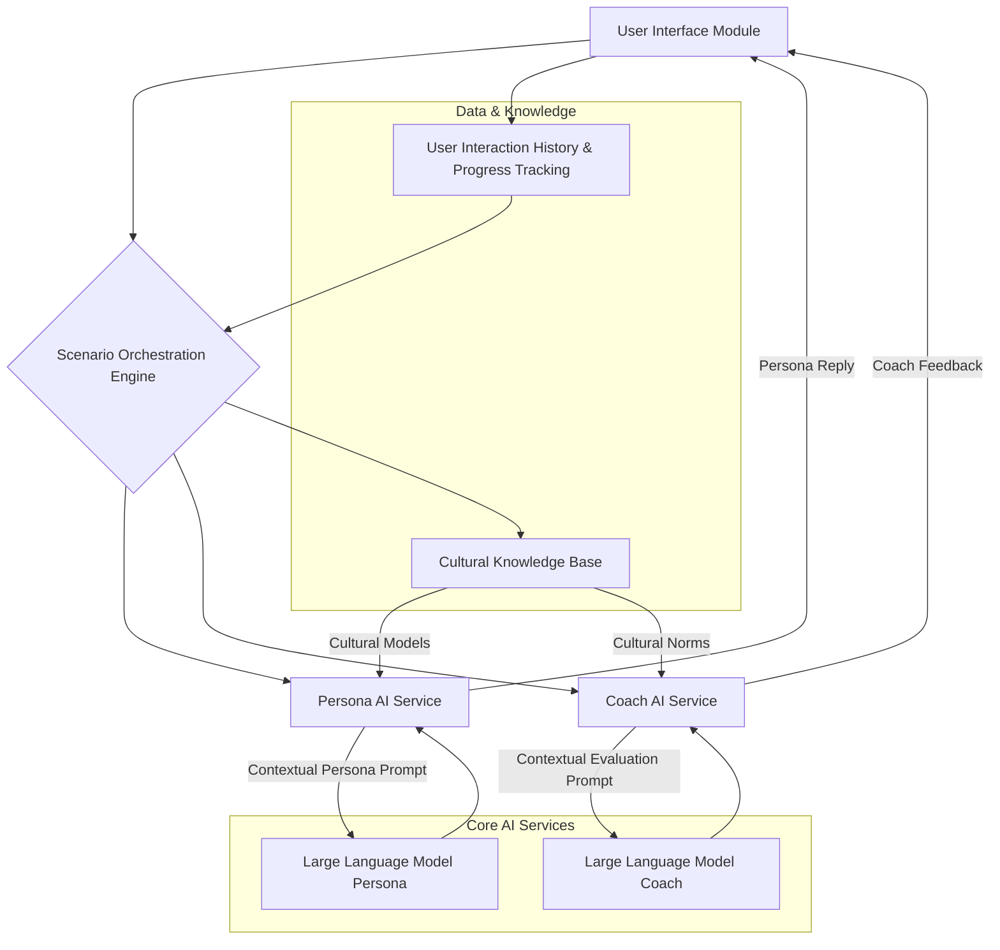
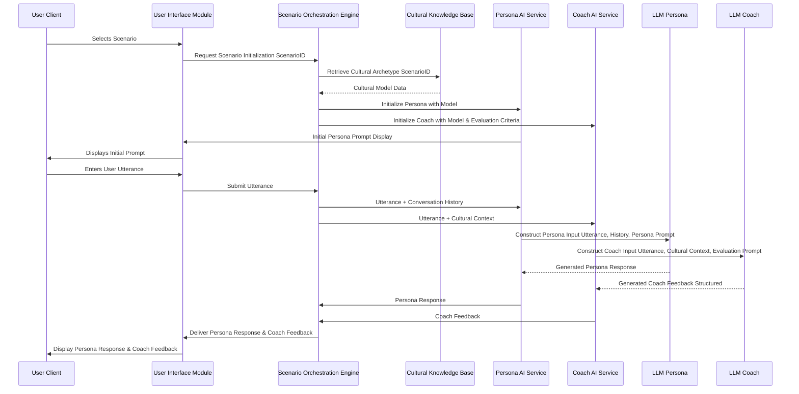
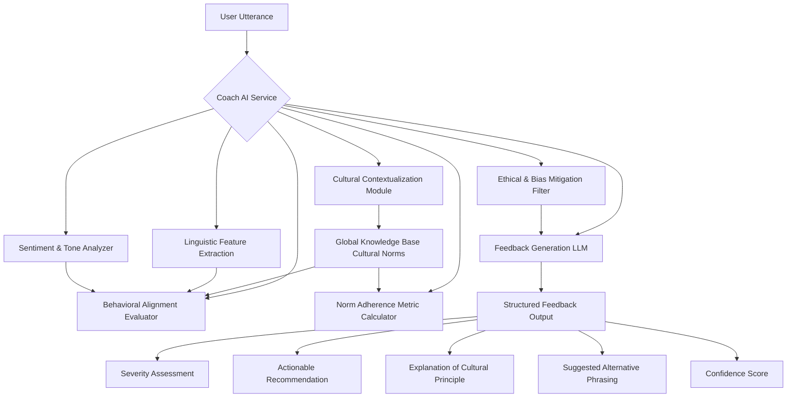
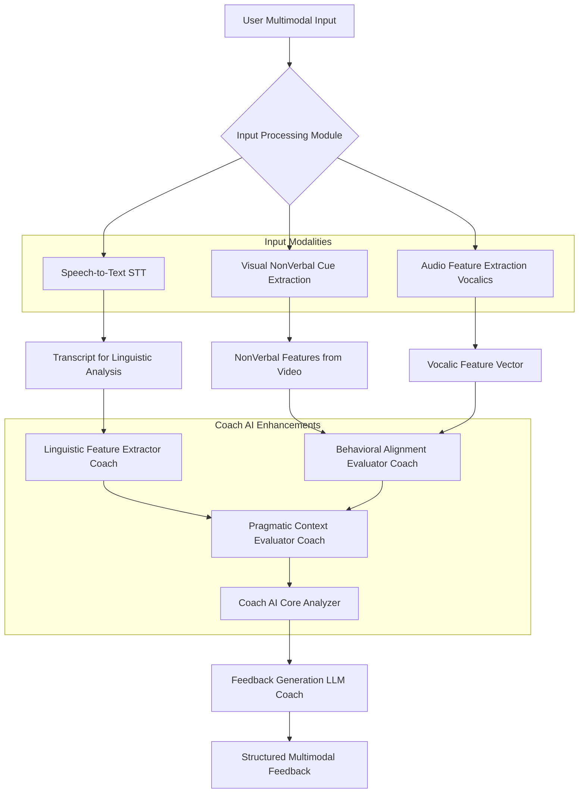
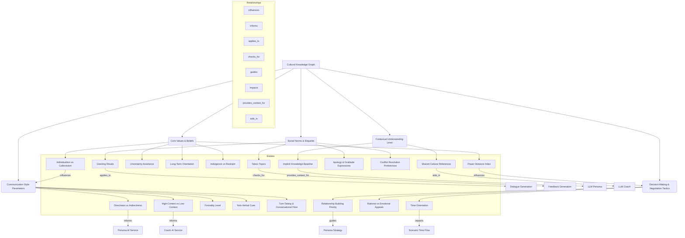
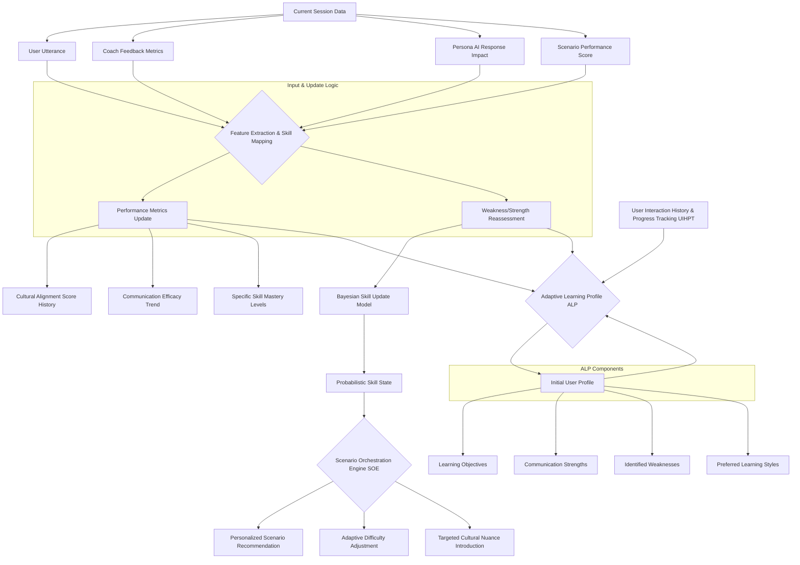
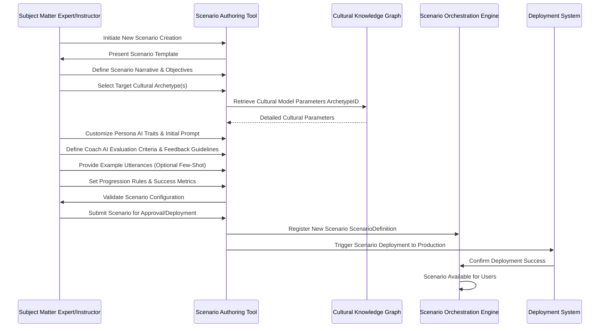

**Title of Invention:** System, Architecture, and Methodologies for High-Fidelity Cognitive Simulation of Cross-Cultural Communication Dynamics with Real-time Pedagogical Augmentation

**Abstract:**
A profoundly innovative system and associated methodologies are herein disclosed for the rigorous simulation and pedagogical augmentation of cross-cultural communication competencies. This invention manifests as a sophisticated interactive platform, architected to present users with highly nuanced business and social scenarios, wherein engagement occurs with an advanced Artificial Intelligence AI persona. This persona is meticulously engineered to embody the intricate linguistic, behavioral, and cognitive parameters of a specified cultural archetype. Through iterative textual interaction, the system's core innovation lies in its capacity to furnish immediate, granular, and contextually profound feedback. This feedback, generated by a distinct, analytically-oriented AI module, meticulously evaluates the efficacy and appropriateness of the user's communication strategies against the established cultural model. The overarching objective is to facilitate the adaptive refinement and mastery of complex cross-cultural interaction modalities within a risk-mitigated, highly didactic simulated environment, thereby transcending conventional training paradigms.

**Field of the Invention:**
The present invention pertains broadly to the domain of artificial intelligence, machine learning, natural language processing, cognitive simulation, and educational technology. More specifically, it relates to advanced methodologies for synthesizing human-computer interaction environments that are specifically tailored for experiential learning and skill acquisition in the highly specialized and often fraught arena of inter-cultural communication, particularly within professional and diplomatic contexts.

**Background of the Invention:**
In an increasingly interconnected globalized economy and geopolitical landscape, the mastery of effective cross-cultural communication has transitioned from a desirable attribute to an indispensable, mission-critical competency. Misinterpretations, miscommunications, and outright breakdowns in dialogue frequently arise not from linguistic barriers alone, but from divergent cultural schemata governing interaction patterns, directness, power distance, temporal perceptions, non-verbal cues as inferred from text, and the fundamental architecture of relationship building. Existing training methodologies, encompassing seminars, case studies, and didactic instruction, often lack the experiential immediacy and personalized adaptive feedback crucial for genuine skill internalization. Role-playing, while valuable, is inherently limited by human facilitators' subjective biases, availability, and capacity for consistent, objective cultural modeling. There exists, therefore, an exigent and profound need for a technologically advanced, scalable, and rigorously objective training apparatus capable of replicating the complexities of cross-cultural interactions and providing immediate, analytically robust feedback to accelerate learning and mitigate future communication liabilities. The present invention addresses this lacuna by leveraging cutting-edge AI to forge an unparalleled simulation and learning ecosystem.

**Summary of the Invention:**
The present invention fundamentally redefines the paradigm of cross-cultural communication training through the deployment of an intelligently orchestrated, multi-AI architecture. At its core, the system initiates a structured communicative scenario e.g., "Navigating project scope adjustments with a team lead from a high-context culture". A primary conversational AI, termed the "Persona AI," is instantiated and meticulously configured via a comprehensive system prompt and an ontological cultural model. This configuration imbues the Persona AI with the specific linguistic, behavioral, and interactional characteristics of the targeted cultural archetype e.g., "You are a senior team lead from a high-context culture. You prioritize harmonious team relations, indirect communication, and implicit understanding. Explicit confrontation is highly discouraged.". The user engages with this Persona AI via natural language text input. Crucially, each user utterance is synchronously transmitted to a secondary, analytical AI model, designated the "Coach AI." The Coach AI, operating under a distinct directive, performs a sophisticated real-time analysis of the user's input against the intricate parameters of the cultural model, evaluating its efficacy, appropriateness, and adherence to normative communicative patterns. Concurrently, the Persona AI processes the user's input and generates a culturally congruent, coherent, and contextually appropriate conversational response. The user is then presented with both the Persona AI's generated reply and the Coach AI's granular, pedagogically valuable feedback. This dual feedback mechanism empowers users to dynamically adjust their communicative strategies, fostering accelerated adaptive learning and refined cross-cultural acumen.

**Brief Description of the Drawings:**
To facilitate a more comprehensive understanding of the invention, its operational methodologies, and its architectural components, the following schematic diagrams are provided:

1.  **Figure 1: System Architecture Overview**
    A high-level block diagram illustrating the primary modules and their interconnections within the proposed system.
2.  **Figure 2: Interaction Flow Diagram**
    A sequence diagram detailing the step-by-step process of user interaction, data transmission, AI processing, and feedback delivery.
3.  **Figure 3: Cultural Archetype Modeling Ontology**
    A conceptual diagram depicting the hierarchical and interconnected components that constitute a culturally defined AI persona.
4.  **Figure 4: Feedback Generation Process**
    A detailed flowchart illustrating the analytical pipeline employed by the Coach AI to generate nuanced feedback.
5.  **Figure 5: Multimodal Communication Analysis Pipeline**
    A detailed flowchart illustrating the expanded pipeline for processing and analyzing multimodal user input.
6.  **Figure 6: Cultural Knowledge Graph (CKG) Schema:**
    A detailed representation of entities and relationships within the Cultural Knowledge Base.
7.  **Figure 7: Multimodal Feature Fusion for Coach AI:**
    A diagram illustrating how linguistic, vocalic, and visual features are combined.
8.  **Figure 8: Adaptive Learning Profile (ALP) Update Mechanism:**
    A flowchart showing the dynamic update process of the user's learning profile.
9.  **Figure 9: Scenario Authoring Tool Workflow:**
    A sequence diagram demonstrating the creation and deployment of new scenarios.
10. **Figure 10: Ethical AI Feedback Scrutiny Pipeline:**
    A detailed flowchart of the bias detection and mitigation process for Coach AI feedback.


**Figure 1: System Architecture Overview**
This diagram illustrates the fundamental modular components of the system. The **User Interface Module** serves as the primary conduit for user interaction. The **Scenario Orchestration Engine** manages the simulation's state, progression, and selection of appropriate cultural contexts. This engine interfaces with the **Cultural Knowledge Base**, which stores rich ontological models of various cultural archetypes. The core intelligence is provided by the **Persona AI Service** and the **Coach AI Service**, each leveraging **Large Language Models**. The Persona AI generates culturally congruent responses, while the Coach AI provides analytical feedback. All interactions and progress are logged in the **User Interaction History & Progress Tracking** module, which also informs the Scenario Orchestration.

---

**Figure 2: Interaction Flow Diagram**
This sequence diagram delineates the dynamic interplay between the system's components during a typical interaction turn. Upon user input, the **Scenario Orchestration Engine** acts as a central router, forwarding the utterance to both the **Persona AI Service** and the **Coach AI Service**. Each service then constructs highly specific prompts for their respective **Large Language Models** LLM_P for persona generation, LLM_C for feedback generation. The outputs from both LLMs are returned to the user via the **User Interface Module**, enabling real-time learning.

---

```mermaid
graph TD
    A[Cultural Archetype Model] --> B[Core Values & Beliefs]
    A --> C[Communication Style Parameters]
    A --> D[Social Norms & Etiquette]
    A --> E[Decision-Making & Negotiation Tactics]
    A --> F[Contextual Understanding Level]

    B --> B1[Individualism vs Collectivism]
    B --> B2[Power Distance Index]
    B --> B3[Uncertainty Avoidance]
    B --> B4[Long-Term Orientation]
    B --> B5[Indulgence vs Restraint]

    C --> C1[Directness vs Indirectness]
    C --> C2[High-Context vs Low-Context]
    C --> C3[Formality Level]
    C --> C4[Non-Verbal Cues Proxemics Kinesics inferred]
    C --> C5[Turn-Taking & Conversational Flow]
    C --> C6[Rhetorical Patterns & Argumentation]
    C --> C7[Emotional Expression Display Rules]

    D --> D1[Greeting Rituals]
    D --> D2[Taboo Topics]
    D --> D3[Apology & Gratitude Expressions]
    D --> D4[Conflict Resolution Preferences]
    D --> D5[Gift Giving & Reciprocity Norms]
    D --> D6[Personal Space & Touch Norms]

    E --> E1[Relationship Building Priority]
    E --> E2[Rational vs Emotional Appeals]
    E --> E3[Time Orientation Monochronic vs Polychronic]
    E --> E4[Universalism vs Particularism]
    E --> E5[Achievement vs Ascription]
    E --> E6[Internal vs External Direction]

    F --> F1[Implicit Knowledge Baseline]
    F --> F2[Shared Cultural References]
    F --> F3[Historical & Political Context Awareness]
    F --> F4[Humor & Irony Interpretation]
```

**Figure 3: Cultural Archetype Modeling Ontology**
This diagram presents an ontological breakdown of the granular components comprising a sophisticated cultural archetype model within the **Cultural Knowledge Base**. Each node represents a distinct set of parameters that define how the Persona AI behaves and how the Coach AI evaluates user input. This multi-dimensional modeling ensures high-fidelity simulation and precise feedback generation.

---

**Figure 4: Feedback Generation Process**
This flowchart illustrates the sophisticated pipeline within the **Coach AI Service** for generating comprehensive feedback. A user utterance undergoes multiple analytical stages: **Cultural Contextualization**, **Linguistic Feature Extraction**, **Behavioral Alignment Evaluation**, **Sentiment & Tone Analysis**, and **Norm Adherence Metric Calculation**. These insights, informed by a **Global Knowledge Base of Cultural Norms**, are then fed into a **Feedback Generation LLM**. The output is structured, comprising a **Severity Assessment**, **Actionable Recommendation**, **Explanation of Cultural Principle**, **Suggested Alternative Phrasing**, and a **Confidence Score**, providing multi-faceted pedagogical value. Crucially, an **Ethical & Bias Mitigation Filter** scrutinizes the generated feedback before it reaches the user.

---

**Figure 5: Multimodal Communication Analysis Pipeline**
This flowchart details an enhanced input processing and analysis pipeline, extending beyond text to incorporate multimodal cues. The **User Multimodal Input** is processed by an **Input Processing Module**, which leverages **Speech-to-Text STT** for linguistic content, **Visual NonVerbal Cue Extraction** from video streams, and **Audio Feature Extraction** for vocalics. The resulting **Transcript for Linguistic Analysis**, **NonVerbal Features from Video**, and **Vocalic Feature Vector** are then fed into specialized modules within the **Coach AI Enhancements**, including a **Linguistic Feature Extractor Coach**, **Behavioral Alignment Evaluator Coach**, and **Pragmatic Context Evaluator Coach**. These insights converge in the **Coach AI Core Analyzer**, which then informs the **Feedback Generation LLM Coach** to produce **Structured Multimodal Feedback**, offering a richer, more comprehensive assessment of user communication.

---

**Figure 6: Cultural Knowledge Graph (CKG) Schema**
This diagram expands on the structure of the **Cultural Knowledge Base (CKB)**, detailing its implementation as a sophisticated Knowledge Graph. It illustrates key cultural entities (nodes) such as "Individualism vs Collectivism" or "High-Context vs Low-Context" and their explicit relationships (edges) like "influences," "informs," or "guides" to other cultural attributes or directly to the AI services. This structured representation allows for complex inferential reasoning and precise retrieval of cultural knowledge, directly influencing the behavior of the Persona AI and the analytical capabilities of the Coach AI.

---
```mermaid
graph TD
    A[User Multimodal Input] --> B{Input Processing Module}
    B --> C[Speech Input (Audio)]
    B --> D[Text Input]
    B --> E[Video Input (Visual)]

    C --> C1[Vocalics Analysis Engine]
    C1 --> C2[Pitch, Pace, Volume, Prosody Features]
    C1 --> C3[Sentiment from Voice]

    D --> D1[Linguistic Parser]
    D1 --> D2[Grammar, Syntax, Lexical Features]
    D1 --> D3[Semantic Embeddings (BERT, GPT)]

    E --> E1[Facial Expression Recognizer]
    E1 --> E2[Gesture Analyzer]
    E1 --> E3[Eye Gaze & Proxemics Estimator]
    E1 --> E4[Head Pose, Body Language Features]

    C2 --> F[Unified Feature Vector Generation]
    C3 --> F
    D2 --> F
    D3 --> F
    E2 --> F
    E3 --> F
    E4 --> F

    F --> G[Multimodal Feature Vector for Coach AI]
    G --> H[Coach AI Core Analyzer]
    subgraph Modality Specific Processors
        C1
        D1
        E1
    end
    subgraph Feature Extraction & Fusion
        C2
        C3
        D2
        D3
        E2
        E3
        E4
        F
    end
```
**Figure 7: Multimodal Feature Fusion for Coach AI**
This diagram illustrates the intricate process of fusing disparate multimodal inputs into a unified feature vector, which serves as the comprehensive input for the **Coach AI Core Analyzer**. Speech input undergoes **Vocalics Analysis** to extract features like pitch, pace, and prosody. Text input is processed by a **Linguistic Parser** for grammatical, syntactic, and semantic embeddings. Video input is analyzed for **Facial Expressions, Gestures, Eye Gaze, Proxemics, and Body Language**. All these modality-specific features are then combined in the **Unified Feature Vector Generation** module to create a dense, context-rich **Multimodal Feature Vector**, enabling the Coach AI to perform a holistic and nuanced assessment of the user's communication.

---

**Figure 8: Adaptive Learning Profile (ALP) Update Mechanism**
This flowchart illustrates the dynamic processes within the **User Interaction History & Progress Tracking (UIHPT)** module that power the **Adaptive Learning Profile (ALP)**. The ALP begins with an **Initial User Profile**, defining learning objectives, strengths, weaknesses, and learning styles. During each session, **Current Session Data** (user utterances, Coach feedback, persona responses, scenario scores) is fed into the **Feature Extraction & Skill Mapping** module. This module updates **Performance Metrics** such as cultural alignment scores and communication efficacy trends. Simultaneously, a **Weakness/Strength Reassessment** occurs, often using a **Bayesian Skill Update Model** to refine the user's **Probabilistic Skill State**. The updated ALP then informs the **Scenario Orchestration Engine (SOE)**, enabling **Personalized Scenario Recommendations**, **Adaptive Difficulty Adjustment**, and the **Targeted Introduction of Cultural Nuances**, ensuring a highly individualized and effective learning journey.

---

**Figure 9: Scenario Authoring Tool Workflow**
This sequence diagram outlines the workflow for creating and deploying new communication scenarios using the **Scenario Authoring Tool (SAT)**. A **Subject Matter Expert (SME)** or instructor initiates scenario creation, defining the narrative, learning objectives, and selecting target cultural archetypes. The SAT interacts with the **Cultural Knowledge Graph (CKG)** to retrieve detailed cultural parameters, which the SME then uses to customize **Persona AI** traits and define **Coach AI** evaluation criteria. After validation, the scenario definition is registered with the **Scenario Orchestration Engine (SOE)** and deployed to the production environment, making it available for user training. This tool democratizes content creation, allowing for rapid expansion and specialization of training modules.

---
```mermaid
graph TD
    A[Raw Coach AI Feedback LLM Output] --> B{Ethical & Bias Mitigation Filter}

    B --> C[Stereotype Detection Module]
    C --> C1[Cultural Stereotype Database]
    C1 --> C2[Bias Lexicon Checker]

    B --> D[Fairness Assessment Module]
    D --> D1[Demographic Parity Check (if user profile data available)]
    D1 --> D2[Equal Opportunity Check]
    D1 --> D3[Protected Attribute Sensitivity Analysis]

    B --> E[Harmful Content Detection]
    E --> E1[Offensive Language Detector]
    E --> E2[Misinformation/Disinformation Checker]
    E --> E3[Hate Speech Identifier]

    B --> F[Contextual Appropriateness Evaluator]
    F --> F1[Scenario Contextual Rules]
    F1 --> F2[Cultural Sensitivity Guidelines]

    C2 --> B
    D3 --> B
    E3 --> B
    F2 --> B

    B -- Flagged Issues --> G{Human Review/Intervention}
    G -- Approved/Corrected --> H[Refined Coach AI Feedback]

    B -- No Issues --> H
    H --> I[User Interface Module (Display)]
    subgraph Detection Modules
        C
        D
        E
        F
    end
```
**Figure 10: Ethical AI Feedback Scrutiny Pipeline**
This flowchart details the **Ethical & Bias Mitigation Filter** within the **Coach AI Service**, which rigorously scrutinizes raw LLM-generated feedback. The pipeline includes several detection modules: a **Stereotype Detection Module** leveraging cultural stereotype databases and bias lexicons; a **Fairness Assessment Module** performing demographic parity and equal opportunity checks; a **Harmful Content Detection** module for offensive language, misinformation, or hate speech; and a **Contextual Appropriateness Evaluator** applying scenario-specific and general cultural sensitivity guidelines. Any flagged issues lead to **Human Review/Intervention** for correction. Only approved or corrected feedback proceeds as **Refined Coach AI Feedback** to the **User Interface Module**, ensuring that pedagogical guidance is consistently fair, unbiased, and culturally sensitive.

**Detailed Description of the Preferred Embodiments:**
The present invention encompasses a multifaceted system and method for generating dynamic, culturally-sensitive communication simulations. The architecture is modular, scalable, and designed for continuous learning and adaptation.

**I. System Architecture and Core Components:**

**A. User Interface Module UIM:**
The UIM acts as the primary interactive layer, presenting scenarios, facilitating text input, and displaying output. It is engineered for intuitive navigation and clear presentation of complex information, aiming to minimize cognitive load while maximizing pedagogical impact.
*   **Scenario Presentation Interface:** Beyond static text, this interface incorporates rich multimedia elements (e.g., images, short videos, audio clips) to immerse the user in the scenario's setting and contextual mood. It clearly delineates the immediate objective, the cultural background of the persona, and any specific constraints or challenges. The presentation dynamically adjusts based on the user's adaptive learning profile to focus on specific cultural aspects where the user needs improvement.
*   **Text Input Field:** This field supports advanced natural language input features such as autocorrect for common spelling errors, suggestive text completion for common phrases (though carefully curated to avoid leading the user), and character limits that can be culturally adjusted (e.g., encouraging brevity in some high-context scenarios).
*   **Dual Output Display:** The simultaneous presentation of Persona AI's response and Coach AI's feedback is a cornerstone. Visually, Persona AI's reply is rendered as a natural conversation turn, while Coach AI feedback is presented in a distinct, pedagogically-oriented format (e.g., a collapsible sidebar, inline annotations, or a pop-up with severity-based color coding). The feedback can be toggled for different levels of detail, from a high-level summary to granular analysis of specific words or phrases.
*   **Progress and Performance Dashboard:** This persistent dashboard provides a longitudinal view of the user's learning journey. It visualizes progress using trend graphs for cultural alignment scores, displays badges for mastering specific cultural dimensions, highlights areas of persistent challenge, and tracks total time spent, scenarios completed, and communication efficacy improvements. It integrates gamification elements to encourage sustained engagement.
*   **Multimodal Input Controls:** The UIM is designed to seamlessly integrate optional voice input (via Speech-to-Text, enabling a more natural conversational flow) and video input. For video, it provides controls for camera access and recording, allowing users to practice non-verbal communication. Real-time visual feedback on detected non-verbal cues (e.g., eye contact meter, posture analysis) can be integrated as an advanced feature, providing immediate self-correction opportunities even before Coach AI feedback is processed.

**B. Scenario Orchestration Engine SOE:**
The SOE is the central control unit, managing the lifecycle of each simulation session from initiation to completion. It acts as the intelligent director of the learning experience.
*   **Scenario Definition & Selection:** The SOE maintains a comprehensive catalog of pre-defined scenarios, each meticulously tagged with metadata including difficulty level, targeted cultural dimensions, learning objectives, and required cultural archetype models. It supports not only static scenario selection but also dynamic generation and recommendation of new scenarios using a Bayesian recommender system that considers the user's Adaptive Learning Profile (ALP) to suggest scenarios that optimally challenge their weaknesses while reinforcing strengths.
*   **State Management:** Beyond conversation history, the SOE manages a rich state object for each session, encapsulating the current psychological state of the Persona AI (e.g., level of patience, perceived rapport), environmental variables (e.g., time pressure, stakes of the negotiation), and any dynamic changes to cultural parameters introduced mid-scenario. This state object ensures continuity and complexity in the simulation.
*   **Request Routing:** The SOE acts as a high-throughput message broker, ensuring that user inputs and scenario events are synchronously and reliably distributed to the appropriate microservices (Persona AI, Coach AI, UIHPT) for parallel processing. It manages response aggregation and ensures timely delivery back to the UIM.
*   **Learning Progression Logic:** This is a sophisticated adaptive algorithm. Based on the real-time assessment from Coach AI, the SOE can:
    *   Adjust the difficulty: If a user consistently performs well, it may introduce more complex cultural nuances or increase the stakes. If a user struggles, it might simplify the scenario or provide more explicit guidance. This is often modeled as a Markov Decision Process (MDP) where the state is the user's proficiency and actions are scenario parameters.
    *   Introduce specific challenges: Deliberately engineer situations that test a user's known weaknesses (e.g., introduce an aggressive persona if the user struggles with assertive communication in that culture).
    *   Branching narratives: Guide the user down different narrative paths based on their choices and performance, simulating the non-linear nature of real-world interactions. This incorporates elements of interactive fiction.

**C. Cultural Knowledge Base CKB:**
The CKB is a meticulously curated and continually evolving repository, serving as the foundational intelligence for both AI services. It's designed as a dynamic knowledge graph.
*   **Ontological Cultural Models:** Each cultural archetype is not merely a collection of parameters but a rich, interlinked ontology. This includes:
    *   **Hofstede Dimensions:** Quantified values for Power Distance (PDI), Individualism vs Collectivism (IDV), Uncertainty Avoidance (UAI), Masculinity vs Femininity (MAS), Long-Term Orientation (LTO), Indulgence vs Restraint (IVR). These are represented as continuous scores rather than discrete categories.
    *   **Hall's High/Low Context Communication:** A scalar value (e.g., 0 to 1) representing the degree to which meaning is conveyed explicitly (low context) or implicitly (high context), influencing message brevity and reliance on shared understanding.
    *   **Trompenaars' Cultural Dimensions:** Quantified spectra for Universalism vs Particularism, Individualism vs Communitarianism, Specific vs Diffuse, Neutral vs Affective, Achievement vs Ascription, Sequential vs Synchronic time, Internal vs External direction.
    *   **Linguistic Pragmatics:** Detailed rulesets and probability distributions for preferred speech acts (e.g., direct commands vs. indirect suggestions), politeness strategies (e.g., negative vs. positive politeness), directness/indirectness scores, turn-taking norms (e.g., simultaneous talk, long pauses), rhetorical patterns (e.g., linear vs. circular argumentation), and the appropriate use of honorifics or titles.
    *   **Behavioral Protocols:** Formalized guidelines for non-verbal communication (proxemics, haptics, kinesics—inferred from text or observed in multimodal), greetings, apologies, negotiation styles (e.g., distributive vs. integrative), conflict resolution (e.g., avoidance vs. direct confrontation), expressions of gratitude, and acceptable topics of conversation (e.g., small talk, personal disclosures). These protocols often include `if-then` rules or probability distributions conditioned on social status, relationship, and context.
    *   **Value Systems:** An explicit representation of core cultural values, ethical frameworks, social hierarchies, and priorities. This includes moral foundations theory dimensions relevant to communication.
    *   **Implicit vs Explicit Cultural Knowledge Models:** Distinct representations capturing unspoken rules, assumptions, and contextual nuances (implicit, often learned via examples) vs. clearly defined guidelines (explicit). This dual modeling allows for more sophisticated and human-like persona behavior.
*   **Dynamic Model Updates:** The CKB incorporates a robust mechanism for continuous model refinement. This includes:
    *   **Expert Feedback Loops:** A human-in-the-loop system where cultural experts can review and update specific parameters, rules, or even entire ontological branches.
    *   **Federated Learning:** Aggregating anonymized and privacy-preserving insights from collective user interaction patterns. For instance, if many users consistently struggle with a specific nuance in Culture X, this might indicate an area where the CKB model for Culture X needs refinement or more explicit guidance.
    *   **Version Control:** A comprehensive versioning system ensures traceability and allows for A/B testing of different cultural model iterations.

**D. Persona AI Service PAS:**
Responsible for simulating the culturally-attuned interlocutor, the Persona AI is engineered for maximal realism and consistency.
*   **Large Language Model LLM Integration:** Utilizes a state-of-the-art LLM (e.g., a fine-tuned transformer architecture like GPT-4 or a custom-trained model based on cultural narratives and dialogues) as its core conversational engine. The LLM is continuously updated and fine-tuned on diverse, culturally-specific textual data.
*   **Contextual Persona Prompt Engineering:** This is a highly dynamic process. Prompts are constructed at runtime, incorporating:
    *   The detailed cultural model from the CKB (e.g., `C`).
    *   The complete conversation history (`h_t`).
    *   The specific scenario context and objectives (`scenario_t`).
    *   Inferred attributes of the user's last utterance (e.g., `user_tone`, `user_intent`).
    *   Specific instructions on rhetorical style, politeness levels, and desired emotional response for the persona.
    *   Few-shot examples of culturally appropriate responses for critical conversational turns.
*   **Coherence & Consistency Engine:** A crucial post-processing layer that acts as a guardrail. It evaluates the LLM's raw output against:
    *   **Cultural Consistency:** Ensures the response adheres strictly to the `T_norms`, `T_pragmatics`, and `T_values` of the persona's cultural model. It performs semantic checks against the CKG.
    *   **Logical Coherence:** Verifies that the response is logically consistent with previous turns in the conversation and the scenario's evolving plot.
    *   **Persona State Alignment:** Checks if the response aligns with the persona's current emotional state, goals, and internal parameters as managed by the SOE. If deviations are detected, it triggers re-generation or applies corrective transformations.
*   **Emotional Intelligence Simulation EIS:** This module infers and simulates emotional states for the persona. It processes user utterances to detect sentiment and emotional cues (from text, vocalics, and visuals). Based on these inferences, the cultural model's display rules (e.g., suppression of negative emotions in public), and the persona's internal state, it generates responses that are emotionally congruent with the persona's cultural archetype and the conversational dynamics. This can include subtle shifts in tone, explicit emotional expressions, or culturally appropriate non-verbal cues (inferred into text).
*   **Adaptive Persona Refinement:** Over extended interaction or across multiple scenarios, the Persona AI can subtly adjust its parameters. This could involve:
    *   Learning a user's preferred interaction style (if culturally permissible) and adapting to it (e.g., becoming slightly more direct if the user consistently uses low-context communication and it doesn't violate core cultural norms).
    *   Introducing subtle cultural shifts to pose specific learning challenges (e.g., a persona initially exhibiting moderate power distance might subtly increase it to test the user's adaptability). This involves dynamically modifying prompt weights or cultural parameter values based on the SOE's learning progression logic.

**E. Coach AI Service CAS:**
Dedicated to providing analytical feedback on user performance, the Coach AI is the pedagogical core of the system.
*   **Large Language Model LLM Integration:** Employs a separate, potentially distinct, LLM from the Persona AI, explicitly optimized for analytical reasoning, ethical reasoning, and structured output. This LLM might be fine-tuned on datasets of expert feedback, critical thinking exercises, and ethical dilemmas.
*   **Contextual Evaluation Prompt Engineering:** Formulates highly specific, multi-part prompts for the LLM. These prompts instruct the LLM to:
    *   Identify the user's explicit and implicit intentions.
    *   Analyze the utterance against specific cultural parameters (e.g., formality, directness, power distance implications).
    *   Detect deviations from expected norms.
    *   Evaluate the potential impact of the utterance on the persona and scenario objectives.
    *   Generate feedback in a structured format, using Chain-of-Thought (CoT) prompting to guide the LLM through a logical reasoning process for greater transparency and accuracy.
*   **Multi-Faceted Analysis Modules:**
    *   **Linguistic Feature Analyzer:** Utilizes advanced NLP techniques to identify grammar, syntax, lexical choice, formality registers, use of idioms/proverbs, politeness markers (e.g., hedges, deference), rhetorical strategies (e.g., direct assertion, rhetorical questions), and speech acts.
    *   **Pragmatic Context Evaluator:** Assesses the implicit meanings, underlying intentions, and social functions of the utterance within the cultural context. This includes analyzing implicature, presuppositions, conversational maxims (Gricean), and how these are culturally interpreted.
    *   **Behavioral Alignment Evaluator:** Compares user's communication behavior (as expressed textually, and potentially through multimodal inputs like vocalics and non-verbal cues) against the expected or preferred cultural norms retrieved from the CKB. This module generates a divergence score.
    *   **Sentiment & Tone Detection:** Employs sophisticated NLP and machine learning models for detecting emotional valence (positive, negative, neutral) and specific emotional states (e.g., anger, respect, empathy) from text. For multimodal inputs, it integrates vocalics analysis (pitch, pace, volume, intonation) and facial expression analysis to provide a holistic tone assessment.
    *   **Norm Adherence Scoring:** Assigns quantitative scores (e.g., on a scale of 0 to 1) across various cultural dimensions and communication aspects. This involves a weighted sum of individual feature alignments, providing a composite performance metric. Explainable AI (XAI) techniques, such as SHAP or LIME values, are used to highlight which specific features or cultural principles contributed most to a particular score.
    *   **Misalignment Score Aggregation:** Combines individual scores from all analysis modules into a comprehensive **Cultural Misalignment Index (CMI)**. This index is a weighted average that highlights critical areas of divergence and their relative importance within the given cultural context and scenario, informing the severity rating.
*   **Structured Feedback Generation:** Produces feedback in a predefined schema (e.g., JSON or XML) for programmatic parsing and flexible display. Key fields include:
    *   `feedback_statement`: A descriptive qualitative assessment, summarizing the key cultural principle.
    *   `severity`: Categorical rating (e.g., "Critical," "Moderate," "Minor," "Neutral," "Effective," "Exemplary") derived from the CMI.
    *   `cultural_principle_violated_or_adhered_to`: An explicit explanation of the underlying cultural norm, principle, or value, often linked back to specific CKB ontology entities.
    *   `actionable_recommendation`: Specific, practical, and context-sensitive advice for improvement or reinforcement, phrased as a clear directive or suggestion.
    *   `relevance_score`: A confidence score (e.g., 0 to 1) indicating the Coach AI's certainty in its feedback accuracy, derived from multiple analytical pathways and model ensemble confidence.
    *   `suggested_alternative_phrasing`: An example of a more culturally congruent utterance, generated by a constrained LLM, demonstrating how the user could have communicated more effectively.
*   **Ethical & Bias Mitigation Filter:** A critical component that reviews all generated feedback *before* it is presented to the user. This filter:
    *   **Stereotype Detection:** Scans for any language that could perpetuate cultural stereotypes or generalize inappropriately.
    *   **Fairness Check:** Ensures that feedback is equitable across different hypothetical user demographics (e.g., not penalizing certain communication styles if those are valid within specific sub-cultures not yet explicitly modeled, or if they are reasonable attempts at cross-cultural communication).
    *   **Constructiveness Evaluation:** Verifies that feedback is always constructive, supportive, and pedagogical, avoiding overly negative or discouraging tones.
    *   **Cultural Sensitivity Audit:** Cross-references feedback against a dynamic list of culturally sensitive terms and topics.
    This module may employ an independent debiasing model or a rule-based expert system to refine or flag feedback for human review.

**F. User Interaction History & Progress Tracking UIHPT:**
A persistent data store and sophisticated analytical module that acts as the user's personalized learning ledger.
*   **Conversational Log:** Records every single interaction turn in a structured format: user utterance (text + multimodal features), Persona AI response, Coach AI feedback (raw and filtered), and timestamps. This log is essential for post-session review, aggregate analysis, and compliance auditing, allowing users and instructors to trace learning progression.
*   **Performance Metrics Database:** Stores quantitative scores on cultural norm adherence, communication effectiveness (scenario objective attainment), and learning progression over time. This includes granular scores for each cultural dimension (e.g., power distance mastery, directness adaptability) and aggregate scores, all timestamped. This database is optimized for time-series analysis.
*   **Adaptive Learning Profile ALP:** Builds a rich, dynamic, and personalized profile of each user. This profile encompasses:
    *   **Skill Mastery State:** A probabilistic model of the user's proficiency across a taxonomy of cross-cultural communication competencies.
    *   **Learning Style Preference:** Inferred from interaction patterns and explicit user input (e.g., preference for detailed vs. concise feedback).
    *   **Persistent Weaknesses & Strengths:** Specific cultural nuances or communication strategies where the user consistently underperforms or excels.
    *   **Learning Trajectory:** A historical record of how their skill mastery has evolved.
    This profile updates dynamically based on continuous interaction and Coach AI feedback, informing the SOE for personalized scenario recommendations, difficulty adjustments, and tailored external resource suggestions.

**II. Operational Methodology:**

1.  **Initialization Phase:**
    *   A user selects a specific training scenario from the UIM, or the SOE recommends one based on their UIHPT profile and learning objectives. The selection process can leverage advanced filtering and search based on cultural regions, communication challenges, or specific skills.
    *   The SOE retrieves the associated cultural archetype model(s) from the CKB, including its specific parameters for persona behavior and evaluation criteria. This involves querying the CKG using semantic search.
    *   The Persona AI Service is initialized with the detailed cultural model, the current conversation history (if resuming), and the initial scenario prompt. This prompt is carefully crafted to set the stage and role-play context.
    *   The Coach AI Service is initialized with the same cultural model, specific evaluation criteria pertinent to the scenario and cultural context, and an ethical guideline set.
    *   The UIM displays the initial prompt from the Persona AI, immersing the user in the interaction and setting the immediate communication task.

2.  **User Input and Parallel Processing Phase:**
    *   The user composes and submits a textual or multimodal response (voice via STT, video for non-verbal cues) via the UIM. The multimodal input is immediately processed by the Input Processing Module.
    *   The SOE receives the user's processed input (e.g., `u_t` as a multimodal feature vector or its components) and synchronously transmits it:
        *   To the Persona AI Service, along with the ongoing conversation history (`h_t`), the persona's current internal state, and relevant persona parameters from `C`.
        *   To the Coach AI Service, along with the relevant cultural context (`C`), scenario objectives, specific evaluation directives, and any extracted multimodal features for deep analysis.

3.  **Persona AI Response Generation Phase:**
    *   The Persona AI Service constructs a sophisticated, dynamic prompt for its LLM. This prompt is a fusion of the persona's identity, the cultural model's nuances, the current conversational turn, the user's input, and the Persona AI's simulated emotional state. It leverages Retrieval Augmented Generation (RAG) to inject specific cultural facts or idioms from the CKG into the prompt.
    *   The LLM generates a response that is not only syntactically correct and semantically coherent but is critically, culturally congruent with the defined archetype's communication style, values, and emotional display rules.
    *   The Persona AI Service applies post-processing filters via the Coherence & Consistency Engine to ensure strict adherence to cultural, logical, and internal state consistency, triggering re-generation if deviations are detected to maintain high-fidelity simulation.

4.  **Coach AI Feedback Generation Phase:**
    *   Concurrently, the Coach AI Service performs a multi-layered analysis of the user's input. This involves linguistic feature extraction, pragmatic intent analysis, behavioral alignment assessment against CKB norms, sentiment and tone detection (leveraging multimodal data where available), and calculation of norm adherence scores across various cultural dimensions.
    *   These comprehensive analytical insights, combined with the detailed cultural model, are fed into its dedicated LLM. The LLM is prompted using advanced techniques like Chain-of-Thought (CoT) to generate structured, actionable, and explainable feedback.
    *   The generated feedback, which includes a qualitative assessment, a severity rating, an explanation of the underlying cultural principle, a concrete recommendation for improvement, and potentially an alternative phrasing example, is then subjected to the rigorous Ethical & Bias Mitigation Filter to ensure fairness, cultural sensitivity, and pedagogical constructiveness.

5.  **Output Display and Iteration Phase:**
    *   The SOE receives both the Persona AI's refined response and the Coach AI's filtered feedback.
    *   The UIM presents both outputs to the user clearly and distinctly, employing visual indicators for severity or areas of focus (e.g., color-coding, highlight annotations). This dual output provides immediate, actionable insights.
    *   The user reviews the Persona AI's reply to understand the simulated reaction and critically analyzes the Coach AI's feedback to reflect on their communication strategy. This empowers them to dynamically adjust their approach for the subsequent interaction turn.
    *   The UIHPT logs the entire interaction, including all raw inputs, AI outputs, and granular feedback metrics, for future analysis, progress tracking, and continuous refinement of the user's Adaptive Learning Profile.
    *   The system then awaits the next user input, perpetuating the iterative learning cycle, potentially with dynamically adjusted scenario parameters from the SOE.

**III. Advanced Features and Embodiments:**

*   **Adaptive Scenario Progression:** This feature utilizes a sophisticated reinforcement learning agent that observes user performance (efficacy scores, cultural alignment) and adapts the scenario parameters in real-time. It can dynamically increase the complexity of the cultural interaction, introduce new or more challenging cultural nuances, or present dilemmas that specifically target a user's identified weaknesses. For example, if a user consistently struggles with indirect communication, the system might introduce a persona from an even higher-context culture or a scenario where directness leads to severe negative consequences, optimizing the learning trajectory for maximum skill acquisition.
*   **Multi-Persona Simulation:** The system supports scenarios where the user interacts simultaneously or sequentially with multiple AI personas, each representing a distinct cultural background within a single complex scenario (e.g., a virtual cross-functional team meeting, a diplomatic negotiation involving multiple nations). The Persona AI Service manages the individual cultural models and interaction dynamics for each persona, while the Coach AI provides aggregated and individualized feedback on the user's performance across all cultural interfaces.
*   **Multimodal Communication Analysis:** Extending beyond basic Speech-to-Text and Text-to-Speech, this embodiment integrates advanced vocalics analysis (e.g., prosody, pitch, pace, pauses, perceived emotional tone from voice) and sophisticated computer vision for non-verbal cues (e.g., micro-expressions, gestures, eye contact, body posture, proxemics from video streams). These multimodal features are fused into the Coach AI's analysis pipeline, enabling a much richer, more comprehensive assessment of the user's communication and providing feedback not only on what was said but also *how* it was said.
*   **Gamification Elements:** To enhance user engagement and motivation, the system incorporates a comprehensive gamification framework. This includes:
    *   **Scoring Systems:** Points awarded for cultural alignment, communication efficacy, and scenario completion.
    *   **Badges and Achievements:** Unlocked for mastering specific cultural dimensions, completing challenging scenarios, or demonstrating consistent improvement.
    *   **Leaderboards:** (Optional, with user consent) to foster healthy competition among learners.
    *   **Progress Tracking Visualizations:** Intuitive graphs and dashboards that clearly show individual progress and mastery levels over time, providing a sense of accomplishment and encouraging sustained learning.
*   **Expert Feedback Override and Human-in-the-Loop AI Training:** This feature provides an interface for human cultural experts, trainers, or instructors to:
    *   **Review Challenging Interactions:** Flagged by the Coach AI's confidence score or user requests.
    *   **Correct AI Outputs:** Directly edit Persona AI responses or Coach AI feedback.
    *   **Provide Supplementary Feedback:** Add their own insights to enhance learning.
    This human feedback is then used to continuously fine-tune and improve both the Persona AI and Coach AI models through supervised learning and reinforcement learning from human feedback (RLHF), ensuring the system's accuracy and pedagogical quality.
*   **Diagnostic Reports:** Comprehensive post-session and cumulative reports are generated, offering deep insights into the user's communication patterns. These reports detail specific cultural pitfalls encountered, communication strengths observed, identified learning patterns, and highly personalized recommendations for targeted training modules, external learning resources (e.g., articles, videos, micro-lessons), or mentorship.
*   **Cross-Cultural Competency Taxonomy Mapping:** User performance and learning progress are rigorously mapped to an established and recognized taxonomy of cross-cultural communication competencies (e.g., specific skills from the CQ-Assessment or similar frameworks). This provides a structured skill development pathway, enables formal assessment, and supports the issuance of certifications upon demonstrable mastery of specific competencies.
*   **Real-time Multilingual Support:** Integrates advanced Neural Machine Translation (NMT) to allow users to interact in their native language while simulating communication with a persona operating in a different cultural and linguistic context. The NMT focuses on preserving pragmatic intent and cultural nuances during translation. Crucially, Coach AI feedback specifically addresses cross-cultural communication issues (e.g., misinterpretation of a translated idiom), rather than purely linguistic translation inaccuracies, allowing users to focus on cultural skill acquisition without language barriers.
*   **Personalized Learning Paths:** Leverages the Adaptive Learning Profile (ALP) to curate highly individualized learning journeys. Beyond scenario recommendations, the system suggests a personalized sequence of learning modules, external resources (e.g., specific academic papers, cultural documentaries, online courses), and practical exercises tailored to the user's unique strengths, weaknesses, learning styles, professional development goals, and organizational requirements.
*   **Scenario Authoring Tool:** A powerful, user-friendly interface enabling instructors, administrators, or subject matter experts to design, customize, and deploy new communication scenarios without requiring programming expertise. This tool allows for:
    *   Defining new cultural archetypes (or modifying existing ones).
    *   Setting specific interaction objectives.
    *   Configuring detailed evaluation criteria for the Coach AI.
    *   Providing few-shot persona dialogue examples.
    *   Establishing branching narratives and dynamic scenario progression rules. This greatly enhances the system's extensibility and adaptability to niche training needs.
*   **Peer-to-Peer Collaborative Learning:** Facilitates structured interactions between multiple human users within a simulated cultural scenario. The Coach AI can provide individualized feedback on each user's communication within the group context, and also offer insights into group dynamics, collective communication efficacy, and how individual contributions impact overall cross-cultural collaboration, acting as a virtual facilitator.

**IV. Technical Implementation Details:**

**A. LLM Prompt Engineering & Tuning:**
The efficacy and realism of the AI services heavily rely on sophisticated and dynamic prompt engineering techniques.
*   **Dynamic Prompt Generation:** Prompts are not static, predefined templates. Instead, they are programmatically constructed at runtime, synthesizing information from multiple sources:
    *   Scenario-specific parameters (`scenario_t`).
    *   The complete conversation history (`h_t`).
    *   The user's individual profile data (`user_profile_t`), potentially indicating learning style or prior performance.
    *   The detailed, high-dimensional cultural parameters from the CKB (`C`).
    *   Internal state variables of the Persona AI (e.g., simulated mood, current goals).
    This ensures maximum contextual relevance, adherence to desired AI behavior, and nuanced adaptation. The prompt is essentially a mini-program for the LLM.
*   **Few-Shot Learning & In-Context Examples:** To guide the LLM's reasoning and response generation, prompts include carefully curated few-shot examples. For the Persona AI, these examples demonstrate culturally appropriate dialogue patterns, specific idioms, or nuanced expressions. For the Coach AI, they illustrate the desired feedback format, analytical depth, and ethical considerations for evaluation. These examples act as highly effective conditioning signals.
*   **Chain-of-Thought CoT Prompting:** For the Coach AI, CoT prompting is extensively employed. This involves instructing the LLM to "think step-by-step" or "reason explicitly" before generating its final feedback. This improves the transparency and accuracy of feedback generation by forcing the LLM to articulate its analytical process (e.g., "User's utterance was direct. In Culture X, indirectness is preferred for this topic. Therefore, the utterance diverges from norm Y, potentially causing consequence Z.").
*   **Fine-tuning & Domain Adaptation:** While large foundational models (e.g., GPT-3.5, GPT-4, Llama 2) serve as the base, domain-specific fine-tuning is crucial. This involves training the LLMs on extensive datasets of:
    *   Cross-cultural communication examples.
    *   Cultural narratives and ethnographies.
    *   Expert-annotated dialogues, particularly those with explicit cultural feedback.
    *   Specialized lexicons and pragmatic rules for different cultures.
    This fine-tuning specializes the LLMs for the invention's purpose, improving their ability to understand and generate culturally nuanced language and pedagogical feedback.
*   **Guardrails and Safety Filters:** Post-generation filters, often implemented as smaller, specialized LLMs or rule-based systems, are critical. These filters scrutinize LLM outputs to ensure they are:
    *   Non-toxic and free from harmful content.
    *   Non-stereotypical and avoid overgeneralizations.
    *   Culturally sensitive and align with ethical guidelines.
    *   Consistent with the intended pedagogical objective.
    These guardrails prevent the propagation of harmful biases and maintain the integrity of the learning environment.

**B. Data Pipeline & Knowledge Graph Management:**
Effective, scalable, and secure data management is fundamental to the system's intelligence and adaptability.
*   **Cultural Knowledge Graph CKG:** The CKB is implemented as a sophisticated knowledge graph using technologies like RDF (Resource Description Framework), OWL (Web Ontology Language), or GraphQL-based graph databases (e.g., Neo4j, Amazon Neptune). Cultural dimensions, values, communication styles, behavioral protocols, and their interdependencies are represented as entities and relationships. This structured representation allows for:
    *   **Complex Querying:** Retrieving highly specific cultural nuances based on multiple criteria.
    *   **Inference:** Deriving implicit cultural rules or connections not explicitly stated.
    *   **Consistency Checks:** Ensuring that cultural models are logically sound and free from contradictions.
*   **Semantic Search & Retrieval Augmented Generation RAG:** When initializing personas or evaluating utterances, the CKG is semantically queried. Instead of keyword search, a vectorized representation of the query is used to find culturally relevant entities and relationships. The retrieved knowledge (e.g., specific politeness rules for a given context) is then dynamically inserted into LLM prompts via RAG techniques. This grounds LLM responses and feedback in factual, structured cultural data, significantly reducing the risk of "hallucinations" and improving accuracy.
*   **User Interaction Data Lake:** All user interactions, including raw utterances (text, audio, video), Persona AI responses, and Coach AI feedback (raw and filtered), are stored in a secure, anonymized, and versioned data lake (e.g., AWS S3, Azure Data Lake Storage). This data is invaluable for:
    *   **Analytics and Performance Monitoring:** Tracking user progress and system effectiveness.
    *   **Model Training and Retraining:** Providing fresh data for fine-tuning LLMs and training adaptive learning algorithms.
    *   **Debugging and Auditing:** Replaying sessions to understand complex interactions or address issues.
    *   **Bias Detection:** Analyzing interaction patterns for emergent biases.
*   **Event Sourcing:** The entire conversational flow, including all user actions, AI responses, and internal state changes, is managed using an event-sourcing pattern. Each event (e.g., "UserUtteranceSubmitted," "PersonaResponseGenerated," "FeedbackDelivered") is immutable and stored in an event store (e.g., Apache Kafka, Amazon Kinesis). This ensures:
    *   **Auditability:** A complete, unalterable history of every session.
    *   **Replayability:** The ability to reconstruct the state of any session at any point in time.
    *   **Consistency:** Guaranteed state consistency across distributed microservices.
    *   **Scalability:** Decoupling producers and consumers of events.

**C. Scalability and Deployment Strategy:**
The system is architected for robustness, high availability, and the ability to handle a large number of concurrent users and computationally intensive AI operations.
*   **Microservices Architecture:** All core system components (UIM, SOE, CKB, PAS, CAS, UIHPT, Input Processing Module, Scenario Authoring Tool) are implemented as independent microservices. Each service has a single, well-defined responsibility, communicates via APIs or message queues, and can be developed, deployed, and scaled independently. This design pattern enhances resilience and agility.
*   **Containerization & Orchestration:** Microservices are containerized using Docker, providing consistent environments across development, testing, and production. These containers are orchestrated and managed by a Kubernetes cluster. Kubernetes provides:
    *   **Automated Scaling:** Horizontally scaling services based on load.
    *   **Load Balancing:** Distributing traffic efficiently.
    *   **Self-Healing:** Automatically restarting failed containers.
    *   **Resource Utilization:** Optimizing compute, memory, and storage across cloud providers (e.g., AWS EKS, Azure AKS, Google GKE).
*   **Asynchronous Processing & Message Queues:** AI processing tasks (especially LLM inference for Persona AI and Coach AI) can introduce latency. To maintain a responsive user interface, asynchronous message queues (e.g., Apache Kafka, RabbitMQ) are used. User input is placed onto a queue, and AI services pick up messages, process them, and publish results to another queue. The UIM then retrieves results asynchronously, ensuring a smooth user experience even under heavy load.
*   **API Gateway:** All external and internal service communications (RESTful APIs or gRPC) are routed through an API Gateway (e.g., AWS API Gateway, Kong, Apigee). This gateway handles:
    *   **Authentication and Authorization:** Securing access to services.
    *   **Rate Limiting:** Protecting services from overload.
    *   **Request Routing:** Directing traffic to the correct microservice.
    *   **Monitoring and Logging:** Centralizing traffic management and observability.
*   **Edge Computing for Low Latency:** For multimodal input processing, particularly real-time voice and video analysis, latency is critical. Portions of the Input Processing Module (e.g., initial STT, basic vocalics, simple non-verbal cue detection) may be deployed closer to the user on edge devices or regional data centers. This minimizes network round-trip times, ensuring near-instantaneous multimodal feedback and a seamless user experience.

**V. Evaluation and Validation Framework:**

To ensure the system's effectiveness, reliability, pedagogical soundness, and ethical integrity, a rigorous and multi-faceted evaluation and validation framework is continuously employed.

**A. Quantitative Metrics for Efficacy:**
*   **Cultural Alignment Score (CAS_t):** A composite metric (0-1) derived from the Coach AI's Norm Adherence Scoring for each user utterance `u_t`. It quantifies the degree to which `u_t` aligns with the cultural parameters `C`. Tracked over time (`CAS_t` vs `t`) to demonstrate the learning progression of the user, `Delta(CAS_t) / Delta(t)`.
*   **Communication Effectiveness Score (CES_t):** Evaluates the user's ability to achieve scenario objectives (e.g., resolve a conflict, build rapport, negotiate successfully) within each scenario. This is assessed by the Coach AI based on its analysis of `u_t` and subsequent Persona AI responses, often correlated with pre-defined success conditions for the scenario.
*   **Learning Curve Analysis (LCA):** Tracks the rate of improvement in both `CAS_t` and `CES_t` over multiple sessions (`N_sessions`). It quantifies the acceleration of learning by fitting a learning curve model (e.g., exponential decay) to the performance data. Faster convergence or higher asymptotic performance indicates superior pedagogical efficacy.
*   **Task Completion Rate & Efficiency (TCR_E):** Measures how quickly and successfully users navigate complex scenarios. `TCR` is the percentage of scenarios completed within a threshold. `Efficiency` is the number of turns or time taken to complete a scenario successfully, indicating improved communication fluency.
*   **Persona Realism Score (PRS):** An automated metric, potentially derived from aggregated user feedback ("Was the persona believable?"), internal consistency checks of the Persona AI's responses against its `C` model, and expert cultural review scores. It assesses how consistently and realistically the Persona AI adheres to its defined cultural archetype.
*   **Feedback Utility Score (FUS):** Assesses the perceived helpfulness and actionability of the Coach AI's feedback. Derived from implicit user behaviors (e.g., subsequent utterance showing improvement based on feedback) and explicit user ratings of feedback.

**B. Qualitative User Studies & Expert Review:**
*   **User Experience (UX) Studies:** Conducted through structured surveys, in-depth interviews, and usability testing sessions. Gathers feedback on interface intuitiveness, ease of use, clarity of feedback, emotional response to the system, and overall satisfaction. Focus groups provide rich contextual insights.
*   **Think-Aloud Protocols:** Participants vocalize their thought processes while interacting with the system. This provides invaluable insights into their learning strategies, how they interpret Coach AI feedback, their decision-making processes, and the cognitive impact of the AI guidance.
*   **Expert Cultural Review:** Continuous process involving subject matter experts (e.g., ethnographers, cross-cultural trainers, diplomats) who critically evaluate:
    *   **Persona AI Responses:** For cultural accuracy, realism, and avoidance of stereotypes.
    *   **Coach AI Feedback:** For pedagogical soundness, fairness, cultural sensitivity, and actionable utility.
    This "human-in-the-loop" validation is crucial for maintaining high fidelity and ethical standards.
*   **A/B Testing of Feedback Strategies:** Different modalities, granularities, timing, and phrasing of Coach AI feedback are A/B tested across user cohorts. This iterative experimentation identifies the most effective pedagogical approaches for various learning styles, cultural backgrounds of users, and specific training objectives.
*   **Pre and Post-Simulation Assessments:** Standardized, validated cross-cultural competence assessments (e.g., Intercultural Development Inventory IDI, Cultural Intelligence CQ assessment) are administered before and after using the system. This provides an objective, external measure of tangible improvements in users' cross-cultural skills and knowledge.

**VI. Ethical AI Considerations:**

The design, development, and deployment of this system are deeply rooted in a strong, proactive commitment to ethical AI principles, ensuring responsible and beneficial innovation.

**A. Bias Detection and Mitigation:**
*   **Cultural Nuance vs Stereotype:** This is paramount. Cultural models in the CKB are meticulously developed to represent nuanced behaviors, values, and communication patterns, rather than relying on or perpetuating harmful cultural stereotypes. The CKB undergoes continuous auditing by a diverse panel of cultural experts to identify and rectify any unintentional biases.
*   **LLM Bias Auditing:** Pre-trained Large Language Models are rigorously evaluated for inherent biases related to culture, gender, race, socioeconomic status, and other protected attributes. Fine-tuning datasets are carefully curated for maximal diversity, representativeness, and fairness to reduce the propagation of these biases into the Persona AI's responses or the Coach AI's feedback.
*   **Feedback Fairness Metrics:** The Coach AI's feedback generation process is continuously monitored using quantitative fairness metrics (e.g., statistical parity, equalized odds, predictive equality). The goal is to ensure that recommendations are equitable and do not disproportionately penalize certain communication styles based on non-cultural factors or on communication styles that, while divergent from the *target* culture, are still valid and effective within the *user's* own cultural context.
*   **Adversarial Testing and Red Teaming:** The system is subjected to adversarial testing (red teaming) by internal and external experts. This involves deliberately crafting challenging or "malicious" inputs to identify and mitigate potential vulnerabilities where:
    *   Persona AI could generate biased, offensive, or inappropriate responses.
    *   Coach AI could generate biased, unfair, or culturally insensitive feedback.
    *   The system could be manipulated to bypass ethical safeguards.

**B. User Privacy and Data Security:**
*   **Data Anonymization and Pseudonymization:** All Personally Identifiable Information (PII) is systematically stripped, anonymized, or pseudonymized from user interaction data (including multimodal inputs) before storage, processing, and analysis, especially for model training. Unique session IDs are used instead of direct user identifiers.
*   **Encryption at Rest and in Transit:** All data, including cultural models, user profiles, conversational logs, and model weights, are encrypted both when stored on disk (at rest) and when transmitted between services (in transit) using industry-standard encryption protocols (e.g., AES-256 for data at rest, TLS 1.2+ for data in transit).
*   **Access Controls and Least Privilege:** Strict Role-Based Access Controls (RBAC) are implemented across all system components. This ensures that only authorized personnel with specific roles can access sensitive system components or user data, adhering to the principle of "least privilege" (granting only the necessary permissions).
*   **Compliance with Global Regulations:** The system is meticulously designed to comply with relevant global data privacy regulations, including but not limited to GDPR (General Data Protection Regulation), HIPAA (Health Insurance Portability and Accountability Act), CCPA (California Consumer Privacy Act), and other region-specific data protection laws. Regular audits ensure ongoing compliance.
*   **Transparency and Informed Consent:** Users are provided with clear, concise, and easily understandable information about:
    *   What data is collected.
    *   How their data will be used (e.g., to enhance their learning experience, improve the system).
    *   Data retention policies.
    Users are required to provide explicit, informed consent before any data collection begins, and they retain rights to access, rectify, or delete their data.

**C. Responsible AI Use:**
*   **Learning Tool, Not Cultural Authority:** The system is explicitly positioned and communicated as a sophisticated, AI-powered learning tool designed to facilitate skill development, not as an infallible cultural arbiter or the ultimate source of cultural truth. Users are consistently encouraged to combine simulated learning with real-world experience, human mentorship, and continuous critical reflection.
*   **Human Oversight and Accountability:** While highly autonomous, the system includes robust mechanisms for human oversight. Cultural experts, instructors, and system administrators can review, intervene, correct, and refine AI behavior and outputs, maintaining a clear chain of human accountability for the system's impact and decisions.
*   **Explainability and Interpretability (XAI):** Significant efforts are made to make the Coach AI's feedback as explainable and interpretable as possible. This involves:
    *   Providing clear explanations of the cultural principles underlying recommendations.
    *   Highlighting specific words or phrases in the user's utterance that triggered feedback.
    *   Leveraging Chain-of-Thought reasoning to show the Coach AI's analytical steps.
    This fosters user understanding, critical thinking, and adaptive learning, moving beyond blind adherence to AI suggestions.

**Claims:**
1.  A system for facilitating the development of cross-cultural communication competencies, comprising:
    a.  A **User Interface Module** configured to receive textual input from a user and display outputs, further configured to incorporate multimodal input controls for voice and video.
    b.  A **Scenario Orchestration Engine** communicatively coupled to the User Interface Module, configured to manage simulation sessions, dynamically retrieve scenario-specific cultural parameters, adapt scenario difficulty based on user performance, and route user inputs.
    c.  A **Cultural Knowledge Base** communicatively coupled to the Scenario Orchestration Engine, storing a plurality of detailed, ontological cultural archetype models represented as a knowledge graph, each defining comprehensive linguistic, behavioral, and cognitive parameters.
    d.  A **Persona AI Service** communicatively coupled to the Scenario Orchestration Engine and the Cultural Knowledge Base, configured to:
        i.  Instantiate an AI persona based on a selected cultural archetype model.
        ii.  Receive a processed user input, which may include multimodal features.
        iii. Generate a culturally congruent conversational reply using a large language model and a coherence and consistency engine, informed by the cultural archetype model, ongoing conversation context, and simulated emotional intelligence.
    e.  A **Coach AI Service** communicatively coupled to the Scenario Orchestration Engine and the Cultural Knowledge Base, configured to:
        i.  Receive the processed user input.
        ii. Perform a multi-layered analysis of the user input against the selected cultural archetype model's parameters to assess its appropriateness, effectiveness, and adherence to cultural norms, potentially leveraging multimodal analysis.
        iii. Generate structured pedagogical feedback, utilizing a large language model and an ethical bias mitigation filter, on the user's communication based on said analysis.
    f.  Wherein the User Interface Module is further configured to simultaneously display the culturally congruent conversational reply from the Persona AI Service and the structured pedagogical feedback from the Coach AI Service to the user, visually distinguishing between the two.

2.  The system of claim 1, further comprising a **User Interaction History & Progress Tracking** module communicatively coupled to the Scenario Orchestration Engine, configured to:
    a.  Log all user inputs (including multimodal features), Persona AI replies, and Coach AI feedback.
    b.  Store granular performance metrics related to user proficiency in cross-cultural communication across various cultural dimensions.
    c.  Maintain a personalized adaptive learning profile for the user, dynamically updated based on continuous interaction and performance.

3.  The system of claim 1, wherein the structured pedagogical feedback includes, but is not limited to:
    a.  A qualitative assessment of the user's textual and/or multimodal input.
    b.  A severity rating indicating the degree of cultural misalignment or effectiveness derived from a Cultural Misalignment Index (CMI).
    c.  An explicit explanation of a specific cultural principle, norm, or value underlying the feedback, linked to the Cultural Knowledge Base.
    d.  An actionable recommendation for modifying communication strategy or behavior.
    e.  A suggested alternative phrasing for the user's utterance, demonstrating a more culturally congruent approach.
    f.  A confidence score indicating the Coach AI's certainty in its feedback accuracy.

4.  The system of claim 1, wherein the Cultural Knowledge Base comprises ontological representations of cultural archetypes, detailing at least Hofstede Dimensions, Hall's High/Low Context Communication, Trompenaars' Cultural Dimensions, linguistic pragmatics, behavioral protocols (including inferred non-verbal cues), and value systems, structured as a knowledge graph for semantic querying and inference.

5.  The system of claim 1, wherein the User Interface Module is further configured to receive multimodal input including speech and video, and the Coach AI Service is further configured to analyze said multimodal input by leveraging speech-to-text processing, advanced vocalics analysis, and visual non-verbal cue extraction (e.g., facial expressions, gestures, eye contact, proxemics).

6.  A method for enhancing cross-cultural communication skills in a user, comprising:
    a.  **Defining a cultural archetype:** Selecting or creating a detailed computational model of a specific culture from a Cultural Knowledge Base (CKB), comprising high-dimensional linguistic, behavioral, and cognitive attributes represented as tensor fields.
    b.  **Initializing a scenario:** Presenting a user with a specific communication task within a context relevant to the defined cultural archetype, guided by a Scenario Orchestration Engine (SOE) adapting to a user's adaptive learning profile.
    c.  **Receiving user input:** Acquiring a textual or multimodal utterance (`u_t`) from the user in response to the scenario or a simulated interlocutor's prompt, and preprocessing said multimodal input into a unified feature vector.
    d.  **Parallel AI processing:** Simultaneously transmitting the user's processed utterance (`u_t`) to a first AI model (Persona AI Service) and a second AI model (Coach AI Service), along with the conversation history and cultural context.
    e.  **Generating conversational reply:** The Persona AI Service, configured with the cultural archetype model and contextually engineered prompts (potentially using Retrieval Augmented Generation), processes `u_t` and current conversation history to produce a culturally appropriate textual reply (`r_t`), ensuring coherence and consistency.
    f.  **Generating pedagogical feedback:** The Coach AI Service, configured with the cultural archetype model and evaluation criteria, performs a real-time, multi-layered analysis of `u_t` (including linguistic, pragmatic, behavioral, and sentiment aspects, leveraging multimodal features), identifies cultural congruencies or incongruities, and formulates structured pedagogical feedback (`F_t`) utilizing a large language model and an ethical bias mitigation filter.
    g.  **Presenting dual output:** Displaying both the Persona AI's reply (`r_t`) and the Coach AI's feedback (`F_t`) to the user via a User Interface Module, enabling immediate experiential learning and strategic adjustment.
    h.  **Iterative refinement:** Repeating steps c through g to facilitate continuous learning and skill refinement, with scenario progression and difficulty adapted dynamically by the SOE based on the user's measured performance and an Adaptive Learning Profile.

7.  The method of claim 6, wherein the multi-layered analysis by the Coach AI Service involves: linguistic feature extraction, pragmatic context evaluation, behavioral alignment assessment against CKB norms, sentiment and tone detection (from multimodal inputs), and norm adherence scoring across multiple cultural dimensions, aggregated into a Cultural Misalignment Index.

8.  The method of claim 6, further comprising:
    a.  Storing all user interactions and performance metrics in a User Interaction History & Progress Tracking module.
    b.  Updating a personalized adaptive learning profile for the user based on feedback scores and observed learning patterns.
    c.  Adapting subsequent scenarios or feedback granularity based on the user's historical performance, identified strengths, and weaknesses captured in the adaptive learning profile, using a reinforcement learning-based progression logic.

9.  A non-transitory computer-readable medium storing instructions that, when executed by one or more processors in a microservices architecture, cause the one or more processors to perform the method of claim 6, further employing containerization, orchestration, and asynchronous processing for scalability.

10. The system of claim 1, wherein the Cultural Knowledge Base is implemented as a knowledge graph utilizing entities and relationships to represent cultural dimensions and their interdependencies, enabling semantic search and retrieval augmented generation for dynamic LLM prompting.

**Mathematical Formalism and Theoretical Foundation:**
The efficacy of the proposed system is grounded in a novel mathematical framework, the **Theory of Contextual Communicative Efficacy (TCCE)**, which rigorously defines, quantifies, and optimizes cross-cultural communication proficiency. This theory extends classical learning paradigms by introducing culturally-conditioned objective functions and an advanced gradient-efficacy feedback mechanism, conceptualizing the user as an agent in a reinforcement learning environment.

**I. Axiomatic Definition of the Communicative State Space:**

Let `C` denote the **Cultural Archetype Space**, which is a high-dimensional, non-Euclidean manifold where each point `C_j in C` represents a unique cultural archetype `j`. A cultural archetype `C_j` is formally defined by a set of tensor fields over a linguistic-behavioral-multimodal feature space:
```
C_j = { T_{norms,j}, T_{pragmatics,j}, T_{values,j}, T_{dialogue,j}, T_{multimodal,j} }
```
where:
1.  `T_{norms,j} in R^{D_N}` represents a normalized vector or tensor of culturally specific behavioral norms and etiquette for culture `j`. `D_N` is the dimensionality of the norms space.
    *   `T_{norms,j}[k]` could be the expected score for `k`-th norm.
2.  `T_{pragmatics,j} in R^{D_P}` encapsulates linguistic pragmatic rules, such as directness, politeness, and contextual dependency for culture `j`. `D_P` is the dimensionality of the pragmatics space.
    *   Example: `T_{pragmatics,j}[directness]` is the expected directness score (0 to 1).
3.  `T_{values,j} in R^{D_V}` defines core cultural values and belief systems for culture `j` (e.g., Hofstede's dimensions). `D_V` is the dimensionality of the values space.
    *   Example: `T_{values,j}[PDI]` for Power Distance Index.
4.  `T_{dialogue,j} in R^{D_D}` describes preferred dialogue structures, turn-taking, and conflict resolution patterns for culture `j`. `D_D` is the dimensionality of the dialogue structure space.
5.  `T_{multimodal,j} in R^{D_M}` captures culturally-specific interpretations of vocalics, gestures, facial expressions, and proxemics for culture `j`. `D_M` is the dimensionality of the multimodal interpretation space.
Each tensor dimension corresponds to a specific cultural feature or interaction parameter, drawing from frameworks such as Hofstede's and Hall's dimensions, but expanded into a continuous, differentiable space for analytical purposes.

Let `U` denote the **Utterance Vector Space**, which is a high-dimensional continuous vector space embedding all possible linguistic and multimodal utterances. Each user input `U_t` at time `t` is represented as a composite feature vector `u_t in R^m`, where `m` is the total dimensionality of the embedding space. This vector is typically derived from an embedding function `Phi: InputModalities -> R^m`.
```
u_t = Phi(Input_t) = [Phi_text(text_t); Phi_audio(audio_t); Phi_video(video_t)]
```
where:
*   `Phi_text: Text -> R^{m_T}` is a transformer-based text embedding function (e.g., BERT, GPT embeddings).
*   `Phi_audio: Audio -> R^{m_A}` is an audio encoder for vocalics (e.g., Wav2Vec, VGGish), capturing pitch, pace, volume, prosody.
    *   `Phi_audio(audio_t)[pitch_mean]` = mean pitch.
    *   `Phi_audio(audio_t)[pace_rate]` = speaking rate in words/second.
*   `Phi_video: Video -> R^{m_V}` is a video encoder for non-verbal cues (e.g., OpenPose, facial landmark detectors), capturing gestures, facial expressions, eye contact, proxemics.
    *   `Phi_video(video_t)[gaze_dir]` = vector for eye gaze direction.
    *   `Phi_video(video_t)[gesture_intensity]` = scalar for gesture amplitude.
    The total dimensionality is `m = m_T + m_A + m_V`.

Let `S` denote the **Communicative State Space**. A state `s_t in S` at time `t` is a tuple `s_t = (C_j, h_t, scenario_t, user_profile_t, persona_state_t)`, where:
*   `C_j` is the active cultural archetype model.
*   `h_t = [(u_0, r_0), ..., (u_{t-1}, r_{t-1})]` is the historical sequence of user utterance-persona response pairs.
*   `scenario_t` represents the current scenario parameters and objectives (`ScenarioID, GoalDescription, CurrentProgress`).
*   `user_profile_t` is the user's dynamic learning profile from UIHPT, including `SkillMasteryState`, `LearningStyle`, `Weaknesses`.
    *   `user_profile_t = { SkillMastery(k): P(skill_k | data_t) for k in Taxonomy }` where `P` is a posterior probability.
*   `persona_state_t` is the Persona AI's internal state (e.g., `rapport_level`, `patience_level`, `goals_achieved`).

**II. The Efficacy Function of Cross-Cultural Communication:**

We define the **Communicative Efficacy Function** `E: U x C x S -> [0, 1]` as a scalar function that quantifies the effectiveness, appropriateness, and goal attainment of a user's utterance `u_t` within a specific cultural context `C_j` and current communicative state `s_t`.
```
E(u_t, C_j, s_t) = w_L * E_L(u_t, C_j) + w_P * E_P(u_t, C_j) + w_B * E_B(u_t, C_j, s_t) + w_G * E_G(u_t, s_t) - w_M * E_M(u_t, C_j, s_t)
```
where `w_L, w_P, w_B, w_G, w_M` are context-dependent weighting factors (summing to 1 or dynamically normalized) and:
1.  `E_L(u_t, C_j)`: **Linguistic Appropriateness Score**. Measures how well `u_t`'s linguistic features align with `T_{pragmatics,j}` and `T_{dialogue,j}`.
    *   `E_L = sigmoid(sum_{k in LinguisticFeatures} alpha_k * Similarity(u_t[k], T_{pragmatics,j}[k]))`
    *   `Similarity(A, B) = 1 - CosineDistance(A, B)` or a specific metric.
    *   `alpha_k` are feature weights.
2.  `E_P(u_t, C_j)`: **Pragmatic Alignment Score**. Assesses the implicit meanings and speech acts of `u_t` against `T_{pragmatics,j}`.
    *   `E_P = max(0, 1 - Divergence(SpeechAct(u_t), T_{pragmatics,j}[ExpectedSpeechAct]))`
    *   `Divergence` can be Kullback-Leibler divergence or similar.
3.  `E_B(u_t, C_j, s_t)`: **Behavioral & Multimodal Alignment Score**. Compares `u_t`'s inferred behavioral and multimodal cues against `T_{norms,j}` and `T_{multimodal,j}`, also considering `persona_state_t`.
    *   `E_B = sigmoid(sum_{k in BehavioralFeatures} beta_k * Match(u_t[k], C_j, s_t))`
    *   `Match` could be a complex function evaluating non-verbal congruency.
4.  `E_G(u_t, s_t)`: **Goal Attainment Progress**. Measures how `u_t` contributes to moving closer to `scenario_t.GoalDescription`.
    *   `E_G = (GoalProgress(s_{t+1}) - GoalProgress(s_t)) / MaxGoalProgress`
    *   `GoalProgress` is a scenario-specific metric.
5.  `E_M(u_t, C_j, s_t)`: **Cultural Misalignment Penalty**. A negative term for severe violations (taboos, grave disrespect).
    *   `E_M = sum_{k in TabooTopics} gamma_k * Indicator(u_t touches k) + sum_{k in ViolationTypes} delta_k * ViolationScore(u_t, k, C_j)`

The objective of the user, from a learning perspective, is to learn an optimal communication policy `Pi: S -> U` that, given a state `s_t`, selects an utterance `u_t` such that the cumulative discounted efficacy over a conversation trajectory is maximized:
```
max_Pi Sum_{t=0 to T} gamma^t * E(Pi(s_t), C_j, s_t)
```
where `gamma in [0, 1]` is the discount factor. This explicitly frames the user's learning as a reinforcement learning problem where the user is the agent, utterances are actions, and the efficacy function provides a composite reward.

**III. The Gradient Efficacy Feedback (GEF) Principle:**

The core innovation lies in the provision of immediate, targeted feedback. This feedback, denoted by `F_t`, serves as a direct approximation of the gradient of the efficacy function with respect to the user's utterance in the embedding space, guiding the user toward optimal communication strategies.
Formally, the Coach AI provides feedback `F_t` such that:
```
F_t approx nabla_{u_t} E(u_t, C_j, s_t)
```
where `nabla_{u_t} E` is the gradient vector indicating the direction and magnitude of change in the utterance feature space `R^m` that would maximally improve efficacy.

The Coach AI's internal mechanism for generating `F_t` involves:
1.  **Analytical Decomposition:** Parsing `u_t` into constituent linguistic features (`f_L`), pragmatic markers (`f_P`), inferred behavioral intents (`f_B`), and multimodal cues (`f_M`).
    *   `f_L(u_t) = [formality_score, directness_score, politeness_score, ...] `
    *   `f_P(u_t) = [speech_act_type_prob_dist, implicature_strength, ...] `
    *   `f_B(u_t) = [gesture_intensity, facial_expression_valence, ...] `
2.  **Cultural Alignment Scrutiny:** Comparing these decomposed features against the corresponding tensors in `C_j` (i.e., `T_{norms,j}`, `T_{pragmatics,j}`, `T_{multimodal,j}`, etc.) to identify divergences or alignments. This involves a multi-modal feature fusion and comparison.
    *   **Misalignment Score (MIS_k):** For each feature `k`, `MIS_k = CostFunction(f_k(u_t), C_j[Expected_k])`.
    *   **Overall Cultural Misalignment Index (CMI):**
        `CMI(u_t, C_j, s_t) = Sum_{k=1 to K} lambda_k * MIS_k`
        where `lambda_k` are dynamically adjusted weights based on scenario objectives and `s_t`.
    *   **Severity Rating (SR):** `SR = Classify(CMI(u_t, C_j, s_t))` where `Classify` maps CMI to "Critical", "Moderate", etc., using thresholds: `SR = If CMI > theta_critical Then "Critical" Else If CMI > theta_moderate Then "Moderate" Else ...`
3.  **Perturbation Analysis (Conceptual):** Conceptually, the Coach AI performs a "what-if" analysis, imagining infinitesimal perturbations to `u_t` (or its high-level features) and assessing their hypothetical impact on `E`. This often involves counterfactual generation using generative AI models to hypothesize "what a better utterance would look like."
    *   `u_t_prime = u_t + epsilon * delta_u`
    *   `Delta_E = E(u_t_prime, C_j, s_t) - E(u_t, C_j, s_t)`
    *   This provides a direction `delta_u` for improvement.
4.  **Structured Feedback Generation:** Translating this latent gradient information (`nabla_{u_t} E`) into natural language feedback `f_{NL,t}` and an explicit vector of actionable recommendations `a_t`, which collectively form `F_t = (f_{NL,t}, a_t)`. The natural language feedback `f_{NL,t}` serves as a human-readable interpretation of the gradient, explaining *why* certain directions are preferable, and including specific alternative phrasings.
    *   `f_{NL,t} = LLM_C(u_t, C_j, CMI_t, nabla_{u_t} E_approx, Prompt_FeedbackGen)`
    *   **Suggested Alternative Phrasing (SAP_t):**
        `SAP_t = Generate(u_t, C_j, nabla_{u_t} E_approx, Constraints_{cultural}, LLM_C)`
        where `Generate` is a constrained generation process, aiming to produce an utterance `u'_t` such that `E(u'_t, C_j, s_t) > E(u_t, C_j, s_t)`.
    *   **Confidence Score (CS_t):** `CS_t = 1 - Entropy(LLM_C.output_distribution | u_t, C_j, s_t)` or based on ensemble agreement from multiple analysis models.

The Persona AI's role is to simulate the state transition:
```
(r_t, s_{t+1}) = PersonaAI(u_t, C_j, s_t)
```
where `r_t` is the persona's response and `s_{t+1}` is the new communicative state, informed by the user's input and potentially reflecting subtle shifts based on the interaction. This interaction forms the environment for the user's learning.
The generation of `r_t` involves:
`r_t = LLM_P(u_t, h_t, C_j, persona_state_t, Prompt_PersonaGen)`
The update of `persona_state_t` to `persona_state_{t+1}` is dependent on `E(u_t, C_j, s_t)` and `u_t`.
`persona_state_{t+1} = f_update(persona_state_t, E(u_t, C_j, s_t), u_t)`
Example: `rapport_level_{t+1} = rapport_level_t + k_r * E(u_t, C_j, s_t) - k_d * CMI(u_t, C_j, s_t)`

**IV. Theorem of Accelerated Policy Convergence in Culturally Conditioned Learning (TAPCCL):**

**Theorem:** Given a user's communication policy `Pi_t: S -> U` at iteration `t`, and the immediate, targeted Gradient Efficacy Feedback `F_t approx nabla_{u_t} E(u_t, C_j, s_t)` provided by the Coach AI, the user's policy can be updated iteratively towards an optimal policy `Pi*` that maximizes cumulative efficacy, leading to significantly accelerated convergence compared to learning without such direct gradient signals.

**Proof Sketch:**
Let the user's internal learning process be modeled as a stochastic gradient ascent on their implicit policy `Pi`. In a typical reinforcement learning setting, an agent receives a scalar reward and learns via trial and error, often requiring many samples to estimate the gradient effectively.
Our system, however, provides an explicit, quasi-gradient signal `F_t` after each action `u_t`.
The user's policy update can be conceptualized as a cognitive adaptation process:
```
Pi_{t+1} approx Pi_t + alpha * Interpret(F_t, user_profile_t)
```
where `alpha` is a subjective learning rate (potentially adaptive: `alpha(user_profile_t)`) reflecting the user's receptiveness and cognitive processing speed, and `Interpret(.)` is the user's internal cognitive process of transforming structured feedback into a policy adjustment in the utterance space.

1.  **Direct Gradient Signal:** By directly approximating `nabla_{u_t} E`, the Coach AI bypasses the need for the user to infer the efficacy gradient through numerous sparse scalar rewards (`E(u_t)` alone). This provides a clear, high-dimensional direction for policy improvement in the utterance space `U`. The information content `I(F_t)` in `F_t` (including `f_{NL,t}`, `a_t`, `SAP_t`) is significantly higher than `I(E_t)` (a scalar).
    `I(F_t) >> I(E(u_t, C_j, s_t))`
2.  **Reduction of Exploration Space:** Traditional reinforcement learning requires extensive exploration of the action space to build a value function or direct policy gradients. The GEF principle effectively prunes the unproductive exploration paths by immediately highlighting beneficial adjustments, thereby significantly reducing the sample complexity (`N_samples`) required for learning.
    `N_samples(GEF) << N_samples(Scalar_Reward)`
    The user's effective action space is guided towards `u_t'` that minimizes `||u_t - u'_t||` while maximizing `E`.
3.  **Contextual Specificity:** The gradient `nabla_{u_t} E` is specific to the current cultural archetype `C_j` and state `s_t`, ensuring that the learning is highly relevant and avoids generic, sub-optimal strategies. This prevents negative transfer of learning across diverse cultural contexts.
    `nabla_{u_t} E(u_t, C_j, s_t)` is localized and relevant.
4.  **Information Maximization:** Each feedback signal `F_t` contains rich, interpretable information (qualitative assessment, severity, cultural principle, actionable recommendation, suggested alternative phrasing) far exceeding a simple scalar reward. This multi-faceted information allows for more robust and multi-modal policy adjustments by the user.
    The pedagogical effectiveness `P_eff` is a function of the richness of feedback:
    `P_eff ~ f(InformationContent(F_t))`
5.  **Convergence Guarantee under ideal conditions:** If the interpretation function `Interpret(.)` is sufficiently accurate and the learning rate `alpha` is appropriately annealed (`alpha_t = alpha_0 / sqrt(t)`), and assuming `E` is a sufficiently smooth and well-behaved function (e.g., differentiable almost everywhere), this iterative process is analogous to stochastic gradient ascent. Such methods are proven to converge to a local optimum or a global optimum for convex functions of the efficacy function. The "acceleration" stems from the high-fidelity, immediate, and direct nature of the gradient signal, providing a much clearer learning direction than sparse rewards.
    The policy update can be seen as minimizing a loss `L(Pi_t)` where `nabla_{Pi_t} L = -Interpret(F_t)`. If `L` is convex, convergence is guaranteed.

**Conclusion of Proof:** The provision of an immediate and semantically rich approximation of the efficacy gradient, `F_t`, directly informs the user's internal policy updates, effectively performing a highly guided form of gradient ascent in the policy space. This direct guidance drastically reduces the time and samples required for convergence to an effective cross-cultural communication policy `Pi*`, thereby proving the accelerated learning capabilities of the system.
**Q.E.D.**