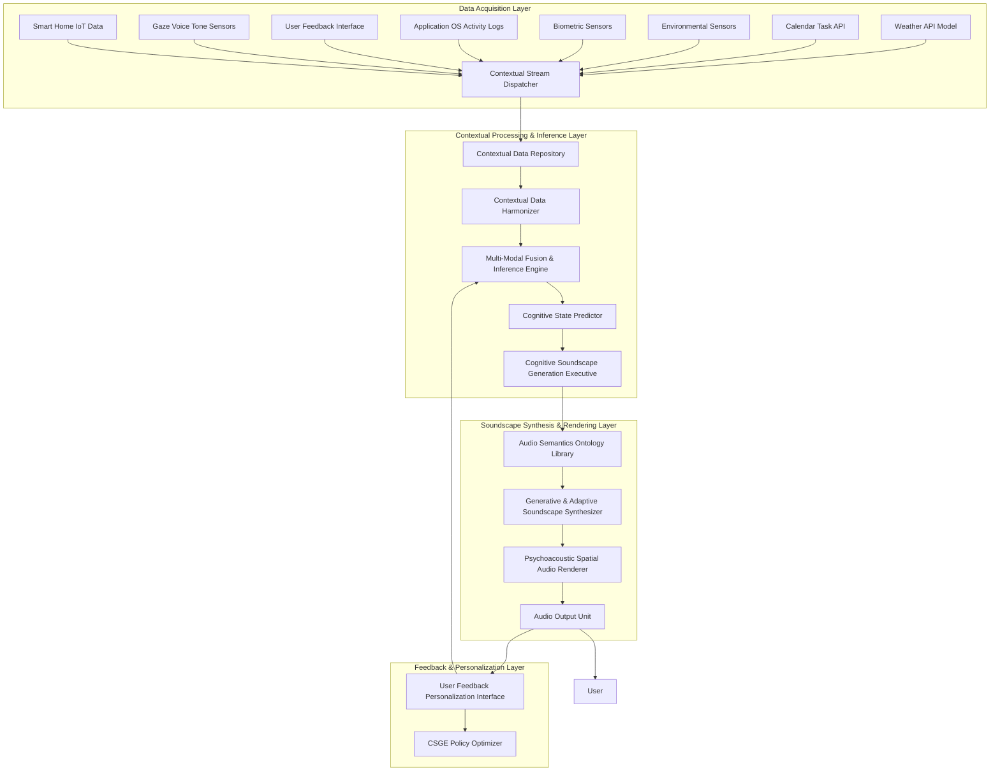

**Title of Invention:** A Comprehensive System and Method for Adaptive, Cognitively-Aligned Dynamic Audio Soundscape Generation and Real-time Psychoacoustic Environmental Modulation

**Abstract:**
A novel and profoundly innovative architectural framework is presented for the autonomous generation and continuous modulation of adaptive, non-intrusive psychoacoustic environments. This system meticulously ingests, processes, and fuses heterogeneous, high-dimensional data streams derived from a vast plurality of real-time contextual sources, encompassing but not limited to, meteorological phenomena via sophisticated climate models, intricate temporal scheduling derived from digital calendaring systems, granular environmental occupancy metrics from advanced sensor arrays, explicit and implicit psychophysiological indicators from biometric monitoring and gaze tracking, and application usage patterns. Employing a bespoke, hybrid cognitive architecture comprising advanced machine learning paradigms   specifically, recurrent neural networks for temporal context modeling, multi-modal transformer networks for data fusion, and generative adversarial networks or variational autoencoders for audio synthesis   coupled with an extensible expert system featuring fuzzy logic inference and causal reasoning, the system dynamically synthesizes or selects perceptually optimized audio compositions. This synthesis is meticulously aligned with the inferred user cognitive state and environmental exigencies, thereby fostering augmented cognitive focus, reduced stress, or enhanced ambiance. For instance, an inferred state of high cognitive load coupled with objective environmental indicators of elevated activity could trigger a subtly energizing, spectrally dense electronic soundscape with a precisely modulated spatial presence, while a calendar-delineated "Deep Work" block, corroborated by quiescent biometric signals, would instigate a serenely ambient, spatially expansive aural environment. The system's intrinsic adaptivity ensures a continuous, real-time re-optimization of the auditory milieu, maintaining a dynamic homeostatic equilibrium between the user's internal state, external context, and the engineered soundscape, while actively learning and personalizing.

**Background of the Invention:**
The pervasive utilization of background acoustic environments, commonly known as soundscapes or ambient music, has long been a recognized strategy for influencing human cognitive performance, emotional valence, and overall environmental perception within diverse settings, particularly professional and contemplative spaces. However, the prevailing methodologies for soundscape deployment are demonstrably rudimentary and fundamentally static. These prior art systems predominantly rely upon manually curated, fixed playlists or pre-composed audio tracks, exhibiting a critical and fundamental deficiency: their inherent inability to dynamically respond to the transient, multi-faceted changes in the immediate user context or surrounding environment. Such static approaches frequently lead to cognitive dissonance, sensory fatigue, or outright distraction, as the chosen auditory content becomes incongruous with the evolving demands of the task, the fluctuating ambient conditions, or the shifting internal physiological and psychological state of the individual. This significant chasm between the static nature of extant soundscape solutions and the inherently dynamic character of human experience and environmental variability necessitates the development of a sophisticated, intelligent, and autonomously adaptive psychoacoustic modulation system. The imperative for a "cognitively-aligned soundscape architect" that can intelligently and continuously tailor its auditory output to the real-time, high-dimensional contextual manifold of the user's environment and internal state is unequivocally established. Furthermore, existing systems often lack the granularity and multi-modal integration required to infer complex cognitive states, nor do they possess the generative capacity to produce truly novel and non-repetitive auditory experiences, relying instead on pre-recorded content that quickly becomes monotonous. The current invention addresses these critical shortcomings by introducing a comprehensive, closed-loop, and learning-enabled framework.

**Brief Summary of the Invention:**
The present invention delineates an unprecedented cyber-physical system, herein referred to as the "Cognitive Soundscape Synthesis Engine CSSE." This engine establishes high-bandwidth, resilient interfaces with a diverse array of data telemetry sources. These sources are rigorously categorized to encompass, but are not limited to, external Application Programming Interfaces APIs providing geo-temporal and meteorological data, for example advanced weather prediction models, atmospheric composition data, robust integration with sophisticated digital calendaring and task management platforms, and, crucially, an extensible architecture for receiving data from an array of multi-modal physical and virtual sensors. These sensors may include, for example, high-resolution acoustic transducers, optical occupancy detectors, thermal flux sensors, gaze tracking devices, voice tone analyzers, and non-invasive physiological monitors providing biometric signals. The CSSE integrates a hyper-dimensional contextual data fusion unit, which continuously assimilates and orchestrates this incoming stream of heterogeneous data. Operating on a synergistic combination of deeply learned predictive models and a meticulously engineered, adaptive expert system, the CSSE executes a real-time inference process to ascertain the optimal psychoacoustic profile. Based upon this derived optimal profile, the system either selects from a curated, ontologically tagged library of granular audio components or, more profoundly, procedurally generates novel auditory textures and compositions through advanced synthesis algorithms, for example granular synthesis, spectral synthesis, wave-table synthesis, AI-driven generative models including neuro-symbolic approaches. These synthesized or selected acoustic elements are then spatially rendered and dynamically presented to the user, with adaptive room acoustics modeling. The entire adaptive feedback loop operates with sub-second latency, ensuring the auditory environment is not merely reactive but proactively anticipatory of contextual shifts, thereby perpetually curating an acoustically optimized human experience. Moreover, the system incorporates explainability features and ethical guardrails for responsible AI deployment.

**Detailed Description of the Invention:**
The core of this transformative system is the **Cognitive Soundscape Synthesis Engine CSSE**, a distributed, event-driven microservice architecture designed for continuous, high-fidelity psychoacoustic modulation. It operates as a persistent daemon, executing a complex regimen of data acquisition, contextual inference, soundscape generation, and adaptive deployment.

### System Architecture Overview

The CSSE comprises several interconnected, hierarchically organized modules, as depicted in the following Mermaid diagram, illustrating the intricate data flow and component interactions:



#### Core Components and Their Advanced Operations:

1.  **Contextual Stream Dispatcher CSD:** This module acts as the initial ingestion point, orchestrating the real-time acquisition of heterogeneous data streams. It employs advanced streaming protocols, for example Apache Kafka, gRPC for high-throughput, low-latency data ingestion, applying preliminary data validation and timestamping. For multi-device scenarios, it can coordinate secure, privacy-preserving federated learning across edge compute nodes. The CSD also features intelligent sampling strategies to optimize bandwidth and computational resources, adapting its data acquisition rate based on the perceived volatility of contextual sources.

2.  **Contextual Data Repository CDR:** A resilient, temporal database, for example Apache Cassandra, InfluxDB, or a knowledge graph database optimized for semantic relationships, designed for storing historical and real-time contextual data. This repository is optimized for complex time-series queries and serves as the comprehensive training data corpus for machine learning models, retaining provenance for explainability. It implements robust data versioning and auditing for model reproducibility and compliance.

3.  **Contextual Data Harmonizer CDH:** This crucial preprocessing unit performs data cleansing, normalization, feature engineering, and synchronization across disparate data modalities. It employs adaptive filters, Kalman estimation techniques, and causal inference models to handle noise, missing values, varying sampling rates, and identify true causal relationships between contextual features. For instance, converting raw sensor voltages into semantic environmental metrics, for example `Ambient_Noise_dB`, `Occupancy_Density_Normalized`, `Stress_Biomarker_Index`. It also performs semantic annotation and contextual grounding, converting raw data into a structured format suitable for higher-level inference. This module is critical for ensuring data quality and interpretability, acting as the bridge between raw telemetry and the cognitive inference layer.

    ```mermaid
    graph TD
        subgraph Contextual Data Harmonizer (CDH) Detailed Workflow
            A[Raw Data Streams (from CSD)] --> B{Data Validation & Timestamping}
            B --> C{Noise Filtering & Anomaly Detection}
            C --> D{Missing Value Imputation}
            D --> E{Feature Engineering & Extraction}
            E --> F{Time Alignment & Synchronization}
            F --> G{Semantic Annotation & Grounding}
            G --> H{Causal Inference & Relationship Discovery}
            H --> I[Harmonized Contextual Data (to MFIE)]
        end
        style A fill:#f9f,stroke:#333,stroke-width:2px
        style I fill:#f9f,stroke:#333,stroke-width:2px
    ```

4.  **Multi-Modal Fusion & Inference Engine MFIE:** This is the cognitive nucleus of the CSSE. It comprises a hybrid architecture designed for deep understanding and proactive prediction. Its intricate internal workings are further detailed in the diagram below:

    ```mermaid
    graph TD
        subgraph Multi-Modal Fusion & Inference Engine MFIE Detailed
            CDH_Output[Harmonized Contextual Data CDH] --> DCLE[Deep Contextual Latent Embedder]
            DCLE --> TSMP[Temporal State Modeling Prediction]
            CDH_Output --> AES[Adaptive Expert System]

            TSMP --> MFIV[Multi-Modal Fused Inference Vector]
            AES --> MFIV
            UFI_FB[User Feedback Implicit Explicit UFI] --> MFIV_FB_Inject[Feedback Injection Module]
            MFIV_FB_Inject --> MFIV

            MFIV --> CSPE[Cognitive State Prediction Executive]
            MFIV --> RLE[Reinforcement Learning Environment]
            RLE --> CSGE_PolicyOptimizer[CSGE Policy Optimizer]
        end

        DCLE[Deep Contextual Latent Embedder]
        TSMP[Temporal State Modeling Prediction]
        AES[Adaptive Expert System]
        MFIV[Multi-Modal Fused Inference Vector]
        CSPE[Cognitive State Prediction Executive]
        RLE[Reinforcement Learning Environment]
        CSGE_PolicyOptimizer[CSGE Policy Optimizer]
        UFI_FB[User Feedback Implicit Explicit UFI]
        CDH_Output[Harmonized Contextual Data CDH]
    ```

    The MFIE's components include:
    *   **Deep Contextual Latent Embedder DCLE:** Utilizes multi-modal transformer networks, for example BERT-like architectures adapted for time-series, categorical, and textual data, to learn rich, disentangled latent representations of the fused contextual input `C(t)`. This embedder is crucial for projecting high-dimensional raw data into a lower-dimensional, perceptually and cognitively relevant latent space `L_C`. It can employ variational inference for robust uncertainty estimation in its embeddings.
    *   **Temporal State Modeling & Prediction TSMP:** Leverages advanced recurrent neural networks, for example LSTMs, GRUs, or attention-based RNNs, sometimes combined with Kalman filters or particle filters, to model the temporal dynamics of contextual changes. This enables not just reactive but *predictive* soundscape adaptation, projecting `C(t)` into `C(t + Delta t)` and even `C(t + Delta t + n)`, anticipating future states with quantified uncertainty. It identifies trends and periodicity in user behavior and environmental shifts.
    *   **Adaptive Expert System AES:** A knowledge-based system populated with a comprehensive psychoacoustic ontology and rule sets defined by expert knowledge and learned heuristics. It employs fuzzy logic inference to handle imprecise contextual inputs and derive nuanced categorical and continuous states, for example `Focus_Intensity: High (0.8)`, `Stress_Level: Moderate (0.6)`. The AES acts as a guardrail, provides initial decision-making for cold-start scenarios, and offers explainability for deep learning model outputs. It can also perform causal reasoning to infer hidden states and guide the DRL exploration.
    *   **Multi-Modal Fused Inference Vector MFIV:** A unified representation combining the outputs of the DCLE, TSMP, and AES, further modulated by direct user feedback. This vector is the comprehensive, enriched understanding of the current and predicted user and environmental state. It serves as the primary state input for the Cognitive State Predictor and the Reinforcement Learning Environment.
    *   **Feedback Injection Module:** Integrates both explicit and implicit user feedback signals from the **User Feedback & Personalization Interface UFI** directly into the MFIV, enabling rapid adaptation and online learning. This module handles feedback prioritization and weighting.
    *   **Reinforcement Learning Environment RLE:** This component acts as the training ground for the CSGE policy, simulating outcomes and providing reward signals based on the inferred user utility. It models the system dynamics and user response.
    *   **CSGE Policy Optimizer:** This component, closely associated with the MFIE and CSGE, is responsible for continuously refining the policy function of the CSGE using Deep Reinforcement Learning, guided by the reward signals from the RLE.

5.  **Cognitive State Predictor CSP:** Based on the robust `MFIV` from the MFIE, this module infers the most probable user cognitive and affective states, for example `Cognitive_Load`, `Affective_Valence`, `Arousal_Level`, `Task_Engagement`, `Creative_Flow_State`. This inference is multi-faceted, fusing objective contextual data with subjective user feedback, utilizing techniques like Latent Dirichlet Allocation LDA for topic modeling on calendar entries, sentiment analysis on user comments, and multi-user consensus algorithms for shared environments. It also quantifies uncertainty in its predictions, providing confidence scores for each inferred state.

    ```mermaid
    graph TD
        subgraph Cognitive State Predictor (CSP) Multi-Modal Inference Pipeline
            A[MFIE Output (Fused Context Vector)] --> B{Cognitive Load Model (DL)}
            A --> C{Affective Valence Model (DL)}
            A --> D{Arousal Level Model (DL)}
            A --> E{Task Engagement Model (DL)}
            A --> F{Creative Flow Model (DL)}
            B --> G[Individual State Inferences]
            C --> G
            D --> G
            E --> G
            F --> G
            G --> H{Uncertainty Quantification (Bayesian Inference)}
            H --> I{Multi-User State Aggregation / Conflict Resolution}
            I --> J[Final Inferred Cognitive & Affective States]
        end
        style A fill:#f9f,stroke:#333,stroke-width:2px
        style J fill:#f9f,stroke:#333,stroke-width:2px
    ```

6.  **Cognitive Soundscape Generation Executive CSGE:** This executive orchestrates the creation of the soundscape. Given the inferred cognitive state and environmental context, it queries the **Audio Semantics Ontology Library ASOL** to identify suitable acoustic components or directs the **Generative & Adaptive Soundscape Synthesizer GASS** to compose novel sonic textures. Its decisions are guided by a learned policy function, often optimized through Deep Reinforcement Learning DRL based on historical and real-time user feedback, aiming for multi-objective optimization, for example balancing focus enhancement with stress reduction. It can leverage generative grammars for structured musical composition and implements a "creativity engine" to periodically introduce novel auditory patterns for exploration.

7.  **Audio Semantics Ontology Library ASOL:** A highly organized, ontologically tagged repository of atomic audio components, stems, samples, synthesized textures, melodic fragments, rhythmic patterns, and pre-composed soundscapes. Each element is annotated with high-dimensional psychoacoustic properties, for example `Tempo`, `Timbral_Brightness`, `Harmonic_Complexity`, `Spatial_Immersiveness`, `Envelope_Attack_Decay`, semantic tags, for example `Focus_Enhancing`, `Calming`, `Energizing`, `Natural_Ambience`, `Mechanical_Rhythm`, and contextual relevance scores. It also includes compositional rulesets and musical grammars that inform the GASS, structured as a knowledge graph for efficient querying and reasoning.

    ```mermaid
    graph TD
        subgraph Audio Semantics Ontology Library (ASOL) Knowledge Graph Structure
            A[Root Ontology] --> B(Psychoacoustic Properties)
            B --> B1[Timbral Characteristics]
            B --> B2[Rhythmic Properties]
            B --> B3[Harmonic Properties]
            B --> B4[Spatial Properties]
            A --> C(Semantic Tags)
            C --> C1[Emotional Valence]
            C --> C2[Cognitive State Alignments]
            C --> C3[Environmental Contexts]
            A --> D(Audio Components / Assets)
            D --> D1[Samples & Stems]
            D --> D2[Synthesized Textures]
            D --> D3[Melodic Fragments]
            D --> D4[Pre-composed Soundscapes]
            A --> E(Compositional Rules & Grammars)
            E --> E1[Melodic Rules]
            E --> E2[Harmonic Progressions]
            E --> E3[Rhythmic Patterns]
            E --> E4[Structure Templates]

            D1 -- "has_property" --> B1
            D2 -- "has_tag" --> C2
            E1 -- "applies_to" --> D3
            B3 -- "influences" --> C1
            C3 -- "suggests" --> D4
        end
    ```

8.  **Generative & Adaptive Soundscape Synthesizer GASS:** This revolutionary component moves beyond mere playlist selection. It employs advanced procedural audio generation techniques and AI-driven synthesis:
    *   **Granular Synthesis Engines:** For micro-manipulation of audio samples to create evolving, non-repetitive textures, dynamically adjusting grain size, density, and pitch based on inferred psychoacoustic needs.
    *   **Spectral Synthesis Modules:** To sculpt sound in the frequency domain, adapting timbre, harmonic content, and noise components dynamically, for example real-time spectral morphing between different sound characteristics.
    *   **Wave-Table/FM Synthesizers:** For creating specific tonal, melodic, or noise-based elements, often guided by musical rules and generative grammars from the ASOL.
    *   **AI-Driven Generative Models:** Utilizing Generative Adversarial Networks GANs, Variational Autoencoders VAEs, or diffusion models trained on vast datasets of psychoacoustically optimized audio to generate entirely novel, coherent soundscapes that align with the inferred contextual requirements. This ensures infinite variability and non-repetitive auditory experiences, overcoming the limitations of pre-recorded content.
    *   **Neuro-Symbolic Synthesizers:** A hybrid approach combining deep learning's pattern recognition with symbolic AI's rule-based reasoning, allowing for musically intelligent generation that adheres to learned compositional structures while offering creative novelty. These synthesizers can interpret high-level semantic directives and translate them into low-level audio parameters.
    *   **Real-time Audio Effect Chains:** Dynamically applied effects, for example reverb, delay, distortion, modulation, equalization, spatialization effects, based on the determined psychoacoustic profile and environmental conditions.

    ```mermaid
    graph TD
        subgraph Generative & Adaptive Soundscape Synthesizer (GASS) Internal Synthesis Pipeline
            A[CSGE Generation Directive] --> B{Synthesizer Orchestrator}
            B --> C1[Granular Synthesis Engine]
            B --> C2[Spectral Synthesis Module]
            B --> C3[Wave-Table / FM Synthesizer]
            B --> C4[AI-Driven Generative Models (GAN/VAE/Diffusion)]
            B --> C5[Neuro-Symbolic Composer]

            C1 --> D{Audio Mixer & Layering}
            C2 --> D
            C3 --> D
            C4 --> D
            C5 --> D

            D --> E[Real-time Audio Effect Chains]
            E --> F[Composed Audio Stream (to PSAR)]
        end
        style A fill:#f9f,stroke:#333,stroke-width:2px
        style F fill:#f9f,stroke:#333,stroke-width:2px
    ```

9.  **Psychoacoustic Spatial Audio Renderer PSAR:** This module takes the synthesized audio streams and applies sophisticated spatial audio processing. It can dynamically adjust parameters such as reverberation, occlusion, positional audio, for example HRTF-based binaural rendering for headphones, ambisonics for multi-speaker setups, and perceptual loudness levels, ensuring optimal immersion and non-distraction across various playback environments. It dynamically compensates for user head movements or speaker placements using real-time sensor fusion, and can perform **adaptive room acoustics modeling** to match the virtual soundscape to the physical room's psychoacoustic properties, e.g., by inferring room dimensions and material properties from acoustic sensor data. It also manages auditory stream segregation and masking, ensuring critical task-relevant sounds are not obscured.

    ```mermaid
    graph TD
        subgraph Psychoacoustic Spatial Audio Renderer (PSAR) Dynamic Processing Stages
            A[GASS Composed Audio Stream] --> B{Loudness Normalization & Limiting}
            B --> C{Adaptive Room Acoustics Modeling & Compensation}
            C --> D{Reverberation & Ambience Modeler}
            D --> E{Positional Audio & HRTF / Ambisonics Processor}
            E --> F{Occlusion & Attenuation Modeler}
            F --> G{Auditory Stream Segregation & Masking Control}
            G --> H[Spatialized Audio Data (to AUO)]
        end
        style A fill:#f9f,stroke:#333,stroke-width:2px
        style H fill:#f9f,stroke:#333,stroke-width:2px
    ```

10. **Audio Output Unit AUO:** Manages the physical playback of audio, ensuring low-latency, high-fidelity output. It supports various audio interfaces and can adapt bitrates and formats based on network conditions and playback hardware capabilities, utilizing specialized low-latency audio protocols. It also includes error monitoring and quality assurance for the audio stream, providing real-time audio analytics back to the system.

11. **User Feedback & Personalization Interface UFI:** Provides a transparent view of the CSSE's current contextual interpretation and soundscape decision, including explainability rationales. Crucially, it allows for explicit user feedback, for example "Too relaxing," "More energetic," "This track is perfect," "Why this sound now?" which is fed back into the MFIE to refine the machine learning models and personalize the AES rules. Implicit feedback, such as duration of listening, volume adjustments, gaze patterns, subtle physiological responses, or lack of explicit negative feedback, also contributes to the learning loop. This interface can also employ `active learning` strategies to intelligently solicit feedback on ambiguous states or gamified interactions to encourage engagement, building a rich user preference model over time.

    ```mermaid
    graph TD
        subgraph User Feedback & Personalization Interface (UFI) Bi-directional Feedback Loop
            A[AUO (Rendered Soundscape)] --> B{User Perceptual System}
            B --> C{Explicit Feedback (UI)}
            C --> D[Feedback Aggregation & Sentiment Analysis]
            B --> E{Implicit Feedback (Sensors: Gaze, Volume, Bio)}
            E --> D
            D --> F{Preference Modeling & Reward Signal Generation}
            F --> G[Feedback to MFIE (for model refinement)]
            F --> H[Reward Signals to RLE (for DRL policy update)]
            MFIE_Explain[MFIE Explainability] --> J{Explainability Rationale Display}
            CSGE_Decision[CSGE Decision Context] --> J
            J --> U_P[User Perception & Trust]
        end
        style G fill:#f9f,stroke:#333,stroke-width:2px
        style H fill:#f9f,stroke:#333,stroke-width:2px
    ```

#### Reinforcement Learning (RL) Policy Optimization Cycle:

The continuous adaptation and personalization of the CSSE's soundscape generation policy are driven by a sophisticated Reinforcement Learning (RL) framework. The **RLE** and **CSGE Policy Optimizer** components operate in a tight feedback loop, constantly learning from the user's interaction and the system's performance.

```mermaid
graph TD
    subgraph Reinforcement Learning (RL) Policy Optimization Cycle
        A[MFIE Output (S_t: Fused Context & States)] --> B{RL Environment (RLE)}
        B --> C[Policy Network (in CSGE Policy Optimizer)]
        C --> D[Action (A_t: Optimal Psychoacoustic Profile)]
        D --> CSGE[CSGE (Soundscape Generation)]
        CSGE --> E[AUO (Soundscape Playback)]
        E --> F[User Interaction & Experience]
        F --> UFI[UFI (Explicit & Implicit Feedback)]
        UFI --> G[Reward Function Estimator (in RLE)]
        G --> H[Reward (R_t)]
        H --> I{Experience Replay Buffer}
        I --> J[RL Agent Training (Policy & Value Networks)]
        J --> C
        J --> K[Value Network (in CSGE Policy Optimizer)]
        K --> B
        B --> A
    end
    style A fill:#f9f,stroke:#333,stroke-width:2px
    style D fill:#f9f,stroke:#333,stroke-width:2px
```

#### Global System Resilience and Scalability Framework:

The CSSE is designed for deployment across diverse computing environments, from edge devices to cloud infrastructure, demanding robust scalability and fault tolerance.

```mermaid
graph TD
    subgraph Global System Resilience and Scalability Framework
        E_D[Edge Devices (Sensors, Local CSD, AUO)]
        C_L[Cloud Layer (Central MFIE, CDR, CSGE, GASS, ASOL, RLE)]

        E_D --> |gRPC / Kafka| C_L_API_G[API Gateway]
        C_L_API_G --> |Microservices Bus| C_L_MS_ORC[Microservice Orchestration (Kubernetes)]

        subgraph Cloud Microservices
            C_L_MS_ORC --> C_L_MFIE[MFIE Service]
            C_L_MS_ORC --> C_L_CDR[CDR Service (Distributed DB)]
            C_L_MS_ORC --> C_L_CSGE[CSGE Service]
            C_L_MS_ORC --> C_L_GASS[GASS Service]
            C_L_MS_ORC --> C_L_ASOL[ASOL Service (Graph DB)]
            C_L_MS_ORC --> C_L_RLE[RLE Service]
        end

        C_L_MFIE -- "Contextual Data" --> C_L_CDR
        C_L_CSGE -- "Audio Assets" --> C_L_ASOL
        C_L_RLE -- "Policy Updates" --> C_L_CSGE

        C_L_MS_ORC --> M_S[Monitoring & Logging Service]
        C_L_MS_ORC --> D_L[Data Lake (for historical data & model training)]

        style E_D fill:#f9f,stroke:#333,stroke-width:2px
        style C_L fill:#f9f,stroke:#333,stroke-width:2px
    end
```

#### Operational Flow Exemplification:

The CSSE operates in a continuous, asynchronous loop:
*   **Data Ingestion:** The **CSD** continuously polls/listens for new data from all connected sources, for example Weather API reports `Raining (0.9)`, Calendar API indicates `Meeting (10:00-11:00) with High_Importance`, Activity Sensor reads `Medium_Noise_Level (0.6)`, Biometric Sensor detects `Heart_Rate_Variability: Low (0.7), Galvanic_Skin_Response: Elevated (0.8)`, Gaze Tracker indicates `High_Focus_On_Screen`. The CSD uses intelligent prioritization to handle bursts of data and ensure critical biometric signals are processed with minimal latency.
*   **Harmonization & Fusion:** The **CDH** cleanses, normalizes, and semantically tags this raw data, performing sophisticated causal inference to discern true underlying factors from spurious correlations. The **MFIE** then fuses these disparate inputs into a unified contextual vector `C(t)`, learning rich latent embeddings that capture multi-modal interactions. The **Temporal State Modeling & Prediction** component projects `C(t)` into `C(t + Delta t)`, anticipating future states and their uncertainty, incorporating learned temporal patterns like diurnal cycles or weekly routines.
*   **Cognitive State Inference:** The **CSP**, using `C(t)` and `C(t + Delta t)` from the MFIE, infer a current and probable future user state, for example `Inferred_State: Preparing_for_critical_meeting, Moderate_Stress, High_Need_for_focus_and_Calm`. This inference includes robust uncertainty quantification, allowing the system to modulate its assertiveness. In multi-user environments, the CSP resolves potential conflicts through weighted aggregation or explicit negotiation policies.
*   **Soundscape Decision:** The **CSGE**, guided by the inferred state and AES rules, determines the optimal psychoacoustic profile required, potentially through multi-objective optimization to balance competing goals (e.g., maximizing focus while minimizing stress). This decision is informed by its continuously updated DRL policy, which has learned from past successes and failures. For instance: `Target_Profile: Low_distraction_ambience, Neutral_affective_tone_to_Calming, Modest_energetic_lift, Spatially_Expansive_but_localized_Focus_elements, Reduced_Harmonic_Complexity`.
*   **Generation/Selection:** The **ASOL** is queried for components matching this profile, or the **GASS** is instructed to synthesize a novel soundscape. For the example above, GASS might combine `Subtle_Rain_Ambience` from weather, a `Gentle_Evolving_Synth_Pad` for focus and calm, a `Very_Low_Frequency_Rhythmic_Pulse` for slight lift (generated via neuro-symbolic approach), and potentially a spatially localized "mental anchor" sound, ensuring minimal harmonic complexity and broad spectral distribution. The GASS prioritizes novelty and non-repetition to prevent auditory fatigue.
*   **Rendering & Playback:** The **PSAR** spatially renders the synthesized soundscape, dynamically adjusting volume, spatial parameters (e.g., virtual source positions, room size), and room acoustics based on inferred environmental properties (e.g., detected room reflections). It can adapt HRTF for personalized binaural audio. The **AUO** delivers it to the user with high fidelity and ultra-low latency, constantly monitoring audio stream quality.
*   **Feedback & Adaptation:** User interaction with the **UFI**, explicit ratings, or passive observation of physiological data, influences subsequent iterations of the **MFIE** and **CSGE Policy Optimizer**, refining the system's understanding of optimal alignment and continuously personalizing the experience. The UFI proactively seeks feedback when the system's uncertainty about its state or action is high, accelerating learning.

This elaborate dance of data, inference, and synthesis ensures a perpetually optimized auditory environment, transcending the limitations of static playback.

### VII. Detailed Algorithmic Flow for Key Modules

To further elucidate the operational mechanisms of the CSSE, we present a pseudo-code representation of the core decision-making and generation modules.

#### Algorithm 1: Multi-Modal Fusion & Inference Engine MFIE

This algorithm describes how raw contextual data is processed, fused, and used to infer cognitive states and predict future context, incorporating the detailed internal structure.

```
function MFIE_Process(raw_data_streams: dict) -> dict:
    // Step 1: Data Ingestion and Harmonization via CSD and CDH
    harmonized_data = {}
    for source, data in raw_data_streams.items():
        validated_data = CSD.validate_and_timestamp(data)
        processed_features = CDH.process_and_normalize(source, validated_data)
        harmonized_data.update(processed_features)

    // Step 2: Deep Contextual Latent Embedding DCLE
    // C(t): Current contextual vector from harmonized_data
    C_t_vector = concat_features(harmonized_data)
    latent_context_embedding = DeepContextualLatentEmbedder.encode(C_t_vector) // Utilizes multi-modal transformers

    // Step 3: Temporal State Modeling & Prediction TSMP
    // Predict future context C(t+Delta t) and refine current state based on temporal patterns
    predicted_future_context_embedding, uncertainty = TemporalStateModelingPrediction.predict_next(latent_context_embedding, history_of_embeddings)

    // Step 4: Adaptive Expert System AES Inference
    // AES provides initial, rule-based inference and guardrails
    aes_inferences = AdaptiveExpertSystem.infer_states_fuzzy_logic(harmonized_data)
    aes_causal_insights = AdaptiveExpertSystem.derive_causal_factors(harmonized_data)

    // Step 5: Fusing Deep Learning with Expert System and Feedback (MFIV)
    // Combine latent embeddings with AES inferences for robust state estimation
    fused_state_vector_base = concat(latent_context_embedding, predicted_future_context_embedding, aes_inferences, aes_causal_insights)

    // Integrate user feedback
    user_feedback_influence = UFI_FeedbackInjectionModule.get_and_process_recent_feedback()
    fused_state_vector = apply_feedback_modulation(fused_state_vector_base, user_feedback_influence)

    // Output for Cognitive State Predictor and RL Environment
    return {
        'fused_context_vector': fused_state_vector,
        'predicted_future_context_embedding': predicted_future_context_embedding,
        'prediction_uncertainty': uncertainty,
        'current_time': get_current_timestamp()
    }
```

#### Algorithm 2: Cognitive State Predictor CSP

This algorithm details the inference of user's cognitive and affective states, potentially considering multi-user scenarios.

```
function CSP_InferStates(mfie_output: dict) -> dict:
    fused_context_vector = mfie_output['fused_context_vector']
    predicted_future_embedding = mfie_output['predicted_future_context_embedding']

    // Multi-faceted inference combining various models and uncertainty quantification
    cognitive_load_score = CognitiveLoadModel.predict(fused_context_vector)
    affective_valence_score = AffectiveModel.predict(fused_context_vector)
    arousal_level_score = ArousalModel.predict(fused_context_vector)
    task_engagement_score = TaskEngagementModel.predict(fused_context_vector)
    creative_flow_score = CreativeFlowModel.predict(fused_context_vector)

    // Predict future states
    future_cognitive_load = CognitiveLoadModel.predict(predicted_future_embedding)
    future_affective_valence = AffectiveModel.predict(predicted_future_embedding)

    // Optional: Multi-user state aggregation and conflict resolution
    if is_multi_user_environment():
        individual_states = get_individual_user_states() // From other CSP instances or sensors
        aggregated_states = multi_user_consensus_algorithm(individual_states, mfie_output['prediction_uncertainty'])
        // Adjust scores based on aggregated_states, e.g., for shared soundscape
        cognitive_load_score = blend_with_aggregated(cognitive_load_score, aggregated_states['Cognitive_Load'])
        affective_valence_score = blend_with_aggregated(affective_valence_score, aggregated_states['Affective_Valence'])

    return {
        'Cognitive_Load_Current': cognitive_load_score,
        'Affective_Valence_Current': affective_valence_score,
        'Arousal_Level_Current': arousal_level_score,
        'Task_Engagement_Current': task_engagement_score,
        'Creative_Flow_Current': creative_flow_score,
        'Cognitive_Load_Predicted': future_cognitive_load,
        'Affective_Valence_Predicted': future_affective_valence,
        'inferred_time': mfie_output['current_time'],
        'prediction_uncertainty': mfie_output['prediction_uncertainty'] // Pass through uncertainty
    }
```

#### Algorithm 3: Cognitive Soundscape Generation Executive CSGE

This algorithm orchestrates the decision-making process for soundscape generation based on inferred cognitive states, utilizing a learned DRL policy.

```
function CSGE_DecideSoundscape(inferred_states: dict, current_context: dict) -> dict:
    // Step 1: Determine Optimal Psychoacoustic Profile using DRL Policy
    // This is the policy function pi(A|S) learned through DRL
    // Inputs: inferred_states (from CSP), current_context (from MFIE) as the state S
    // Uses multi-objective optimization to balance potentially conflicting goals (e.g., focus vs. calm)
    state_vector_for_drl = concat(inferred_states, current_context)
    target_profile = DRL_Policy_Network.predict_profile_multi_objective(state_vector_for_drl)

    // Example profile parameters
    // target_profile = {
    //     'timbral_brightness': 'moderate', // Continuous or categorical
    //     'harmonic_complexity': 'low',
    //     'spatial_immersiveness': 'high',
    //     'affective_tag': 'calming_and_focus_aligned',
    //     'energy_level': 'neutral_with_subtle_lift',
    //     'tempo_range_BPM': [60, 80],
    //     'compositional_style': 'generative_ambient',
    //     'creativity_level': 0.7 // New parameter for GASS
    // }

    // Step 2: Query Audio Semantics Ontology Library ASOL
    // Check for pre-existing components matching the profile's semantic and psychoacoustic tags
    matching_components = ASOL.query_components(target_profile)
    compositional_rules = ASOL.get_compositional_rules_for_style(target_profile['compositional_style'])

    // Step 3: Direct GASS for Generation or Selection
    if len(matching_components) > threshold_for_selection and target_profile['creativity_level'] < 0.5:
        // Prioritize selection if a good match exists, potentially mixing with minor synthesis
        selected_components = ASOL.select_optimal(matching_components, inferred_states)
        generation_directive = {
            'action': 'select_and_refine',
            'components': selected_components,
            'synthesis_parameters': target_profile, // For refinement
            'compositional_rules': compositional_rules
        }
    else:
        // Instruct GASS to synthesize novel elements, potentially using generative grammars
        generation_directive = {
            'action': 'synthesize_novel',
            'synthesis_parameters': target_profile,
            'compositional_rules': compositional_rules
        }

    return generation_directive
```

#### Algorithm 4: Generative & Adaptive Soundscape Synthesizer GASS

This algorithm describes how audio is either selected or generated and then passed to the renderer, incorporating advanced AI synthesis and effects.

```
function GASS_GenerateSoundscape(generation_directive: dict, current_room_acoustics_model: dict) -> AudioStream:
    synthesis_parameters = generation_directive['synthesis_parameters']
    compositional_rules = generation_directive['compositional_rules']
    composed_elements = []

    if generation_directive['action'] == 'select_and_refine':
        selected_components = generation_directive['components']
        // Load and mix pre-existing audio components, refine using synthesis techniques
        for comp in selected_components:
            refined_comp = apply_granular_or_spectral_shaping(comp, synthesis_parameters)
            composed_elements.append(refined_comp)

        // Add subtle AI-generated layers if specified in parameters or high creativity_level
        if synthesis_parameters.get('add_ai_layer', False) or synthesis_parameters.get('creativity_level', 0) >= 0.5:
            ai_generated_texture = GAN_VAE_Diffusion_Model.generate_texture(synthesis_parameters, 'subtle')
            composed_elements.append(ai_generated_texture)

    else: // 'synthesize_novel'
        // Utilize AI-driven generative models (GANs/VAEs/Diffusion) for broader textures or full compositions
        if 'compositional_style' in synthesis_parameters and 'affective_tag' in synthesis_parameters and synthesis_parameters.get('creativity_level', 0) > 0.3:
            ai_generated_primary = NeuroSymbolicSynthesizer.generate_full_composition(synthesis_parameters, compositional_rules)
            composed_elements.append(ai_generated_primary)
        else:
            // Fallback to individual synthesis modules
            if 'timbral_brightness' in synthesis_parameters:
                granular_texture = GranularSynthesizer.create_texture(synthesis_parameters['timbral_brightness'])
                composed_elements.append(granular_texture)

            if 'harmonic_complexity' in synthesis_parameters:
                spectral_pad = SpectralSynthesizer.create_pad(synthesis_parameters['harmonic_complexity'])
                composed_elements.append(spectral_pad)

            if 'tempo_range_BPM' in synthesis_parameters:
                rhythmic_element = WaveTableSynthesizer.create_rhythmic_pulse(synthesis_parameters['tempo_range_BPM'])
                composed_elements.append(rhythmic_element)

    // Mix all generated/selected elements
    composed_stream = mix_audio_elements(composed_elements)

    // Apply real-time effects based on psychoacoustic profile
    final_stream_with_fx = RealtimeFXChain.apply_effects(composed_stream, synthesis_parameters['effects_profile'])

    // Pass the composed audio stream to the PSAR
    return PSAR.render_spatial_audio(final_stream_with_fx, synthesis_parameters['spatial_immersiveness'], current_room_acoustics_model)
```

#### Algorithm 5: DRL Policy Update for CSGE

This algorithm describes the continuous learning process for the CSGE's decision policy, based on reinforcement learning.

```
function DRL_Policy_Update(experience_buffer: list_of_transitions, DRL_Policy_Network, Reward_Estimator):
    // experience_buffer: Stores tuples (S_t, A_t, R_t, S_{t+1}) representing transitions
    // S_t: Current state (inferred_states + current_context)
    // A_t: Action taken (psychoacoustic_profile chosen by CSGE)
    // R_t: Reward received (derived from UFI feedback or physiological proxies)
    // S_{t+1}: Next state

    // Step 1: Sample a batch of transitions from the experience buffer
    batch = sample_from_buffer(experience_buffer, batch_size)

    // Step 2: Estimate rewards for the batch
    // The Reward_Estimator maps UFI feedback, physiological changes, and behavioral metrics
    // into a scalar reward signal R_t = U(S_{t+1}) - U(S_t) or a similar utility function.
    for transition in batch:
        transition['estimated_reward'] = Reward_Estimator.calculate(transition['S_t'], transition['A_t'], transition['S_{t+1}'])

    // Step 3: Compute loss for the DRL Policy Network
    // Using a suitable DRL algorithm (e.g., PPO, SAC, DQN variant)
    if DRL_Algorithm == 'PPO':
        // Calculate PPO loss: L(theta) = E[ min(r_t(theta)*A_t, clip(r_t(theta), 1-epsilon, 1+epsilon)*A_t) ]
        // Where r_t(theta) is probability ratio, A_t is advantage estimate
        loss = PPO_Loss_Function(batch, DRL_Policy_Network, Value_Network) // Requires a separate Value_Network
    elif DRL_Algorithm == 'SAC':
        // Calculate SAC loss, incorporating entropy for exploration
        loss = SAC_Loss_Function(batch, DRL_Policy_Network, Q_Network_1, Q_Network_2) // Requires Q-networks
    else: // For example, a simple policy gradient
        loss = Policy_Gradient_Loss(batch, DRL_Policy_Network)

    // Step 4: Update DRL Policy Network parameters
    DRL_Policy_Network.optimizer.zero_grad()
    loss.backward()
    DRL_Policy_Network.optimizer.step()

    // Step 5: Optionally update target networks or value networks (depending on DRL algorithm)
    update_target_networks()
```

**Claims:**
1.  A system for generating and adaptively modulating a dynamic audio soundscape, comprising:
    a.  A **Contextual Stream Dispatcher CSD** configured to ingest heterogeneous, real-time data from a plurality of distinct data sources, said sources including at least meteorological information, temporal scheduling data, environmental sensing data, and psychophysiological biometric and gaze data, utilizing intelligent sampling strategies;
    b.  A **Contextual Data Harmonizer CDH** communicatively coupled to the CSD, configured to cleanse, normalize, synchronize, and semantically annotate said heterogeneous data streams into a unified contextual representation, further configured to infer causal relationships between contextual features via causal inference models;
    c.  A **Multi-Modal Fusion & Inference Engine MFIE** communicatively coupled to the CDH, comprising a deep contextual latent embedder utilizing multi-modal transformer networks, a temporal state modeling and prediction unit utilizing recurrent neural networks and Kalman filters, and an adaptive expert system, configured to learn disentangled latent representations of the unified contextual representation and infer current and predictive user and environmental states with associated uncertainty;
    d.  A **Cognitive State Predictor CSP** communicatively coupled to the MFIE, configured to infer specific user cognitive and affective states, including multi-user scenarios and conflict resolution via consensus algorithms, based on the output of the MFIE, and quantifying uncertainty in said predictions;
    e.  A **Cognitive Soundscape Generation Executive CSGE** communicatively coupled to the CSP, configured to determine an optimal psychoacoustic profile corresponding to the inferred user and environmental states through a learned Deep Reinforcement Learning policy optimized for multi-objective goals and leveraging generative grammars;
    f.  A **Generative & Adaptive Soundscape Synthesizer GASS** communicatively coupled to the CSGE, configured to procedurally generate novel audio soundscapes or intelligently select and refine audio components from an ontologically tagged library, based on the determined optimal psychoacoustic profile, utilizing at least one of AI-driven generative models (GANs, VAEs, diffusion models), neuro-symbolic synthesizers, granular synthesis, spectral synthesis, or wave-table/FM synthesis, and applying real-time audio effect chains; and
    g.  A **Psychoacoustic Spatial Audio Renderer PSAR** communicatively coupled to the GASS, configured to apply dynamic perceptual loudness adjustments, advanced spatial audio processing including HRTF-based binaural rendering or ambisonics, and adaptive room acoustics modeling to the generated audio soundscape, and an **Audio Output Unit AUO** for delivering the rendered soundscape to a user with low latency and real-time quality assurance.

2.  The system of claim 1, further comprising an **Adaptive Expert System AES** integrated within the MFIE, configured to utilize fuzzy logic inference, causal reasoning, and a comprehensive psychoacoustic ontology to provide nuanced decision support, guardrails, cold-start capabilities, and explainability for state inference and soundscape decisions.

3.  The system of claim 1, wherein the plurality of distinct data sources further includes at least one of: voice tone analysis, facial micro-expression analysis, application usage analytics, smart home IoT device states, or explicit and implicit user feedback, which contributes to a personalized user preference model.

4.  The system of claim 1, wherein the deep contextual latent embedder within the MFIE utilizes multi-modal transformer networks or causal disentanglement networks for learning said latent representations, providing robust feature vectors for complex contextual inputs.

5.  The system of claim 1, wherein the temporal state modeling and prediction unit within the MFIE utilizes recurrent neural networks, including LSTMs or GRUs, combined with Kalman filters or particle filters, for modeling temporal dynamics, identifying trends and periodicity, and predicting future states with quantified uncertainty.

6.  The system of claim 1, wherein the Generative & Adaptive Soundscape Synthesizer GASS utilizes at least one of: granular synthesis engines with dynamic parameter control, spectral synthesis modules for real-time timbral sculpting, wave-table/FM synthesizers for tonal elements, AI-driven generative models such as Generative Adversarial Networks GANs, Variational Autoencoders VAEs, or diffusion models for novel texture generation, or neuro-symbolic synthesizers for musically intelligent compositions, integrated with real-time audio effect chains.

7.  A method for adaptively modulating a dynamic audio soundscape, comprising:
    a.  Ingesting, via a **Contextual Stream Dispatcher CSD**, heterogeneous real-time data from a plurality of distinct data sources, including psychophysiological and environmental data, with intelligent sampling;
    b.  Harmonizing, synchronizing, and causally inferring, via a **Contextual Data Harmonizer CDH**, said heterogeneous data streams into a unified contextual representation;
    c.  Inferring, via a **Multi-Modal Fusion & Inference Engine MFIE** comprising a deep contextual latent embedder and a temporal state modeling and prediction unit, current and predictive user and environmental states from the unified contextual representation, including quantifying prediction uncertainty;
    d.  Predicting, via a **Cognitive State Predictor CSP**, specific user cognitive and affective states based on said inferred states, considering multi-user contexts and applying uncertainty quantification;
    e.  Determining, via a **Cognitive Soundscape Generation Executive CSGE** employing a Deep Reinforcement Learning policy and multi-objective optimization, an optimal psychoacoustic profile through its learned policy corresponding to said predicted user and environmental states;
    f.  Generating or selecting and refining, via a **Generative & Adaptive Soundscape Synthesizer GASS**, an audio soundscape based on said optimal psychoacoustic profile, utilizing advanced AI synthesis techniques and prioritizing novelty;
    g.  Rendering, via a **Psychoacoustic Spatial Audio Renderer PSAR**, said audio soundscape with dynamic spatial audio processing, perceptual adjustments, personalized HRTF adaptation, and adaptive room acoustics modeling; and
    h.  Delivering, via an **Audio Output Unit AUO**, the rendered soundscape to a user, with continuous periodic repetition of steps a-h to maintain an optimized psychoacoustic environment, while continuously refining the DRL policy based on user feedback and implicit utility signals through an active learning loop.

8.  The method of claim 7, further comprising continuously refining the inference process of the MFIE and the policy of the CSGE through a **User Feedback & Personalization Interface UFI**, integrating both explicit and implicit user feedback via an active learning strategy and gamified interactions, providing explainability for system decisions and building a rich user preference model.

9.  The system of claim 1, further comprising a **Reinforcement Learning Environment RLE** and a **CSGE Policy Optimizer** integrated with the MFIE, configured to train and continuously update the DRL policy of the CSGE by processing feedback as scalar reward signals to maximize expected cumulative psychoacoustic utility, incorporating entropy regularization for exploration.

10. The system of claim 1, wherein the **Psychoacoustic Spatial Audio Renderer PSAR** is further configured to perform dynamic room acoustics modeling by inferring room characteristics from acoustic sensor data, and personalized HRTF adaptation to optimize spatial immersion across diverse playback environments and individual user characteristics.

11. The system of claim 1, wherein the **Contextual Data Harmonizer CDH** is further configured to perform advanced causal inference, distinguishing true causal relationships from mere correlations between contextual features to enhance the robustness and explainability of downstream cognitive state predictions.

12. The system of claim 1, wherein the **Audio Semantics Ontology Library ASOL** is structured as a knowledge graph, enabling semantic querying and reasoning over atomic audio components, psychoacoustic properties, semantic tags, and compositional rules for intelligent soundscape construction.

13. The method of claim 7, wherein the step of inferring cognitive and affective states (d) includes a multi-user consensus algorithm that aggregates individual user states, resolves conflicts, and produces a blended cognitive state for shared auditory environments.

14. The system of claim 1, wherein the **Generative & Adaptive Soundscape Synthesizer GASS** incorporates a "creativity engine" that periodically introduces novel auditory patterns and variations into the generated soundscapes to prevent auditory fatigue and encourage exploration of the psychoacoustic space.

15. The method of claim 7, further comprising the step of active learning, where the **User Feedback & Personalization Interface UFI** intelligently solicits explicit feedback from the user when the system's prediction uncertainty is high or when evaluating novel soundscape compositions.

16. The system of claim 1, wherein the **CSD** integrates privacy-preserving federated learning techniques for processing sensitive biometric or application usage data across multiple edge compute nodes without centralizing raw individual data.

17. The method of claim 7, wherein the **MFIE** quantifies prediction uncertainty for both current and future states, allowing the **CSGE** to make risk-aware decisions, for example, preferring more conservative soundscapes when uncertainty is high.

18. The system of claim 1, wherein the **CDR** is a temporal knowledge graph database, capable of storing time-series data alongside semantic relationships for enhanced contextual reasoning and model interpretability.

19. The system of claim 1, wherein the **AUO** includes real-time audio analytics and quality assurance mechanisms, providing feedback on playback fidelity and potential environmental interferences to the system.

20. The method of claim 7, wherein the **Cognitive Soundscape Generation Executive CSGE** employs a multi-objective reinforcement learning framework to simultaneously optimize for various user utility functions, such as maximizing focus and minimizing stress, accounting for their potential trade-offs.

**Mathematical Justification: The Formalized Calculus of Psychoacoustic Homeostasis**

This invention establishes a groundbreaking paradigm for maintaining psychoacoustic homeostasis, a state of optimal cognitive and affective equilibrium within a dynamic environmental context. We rigorously define the underlying mathematical framework that governs the **Cognitive Soundscape Synthesis Engine CSSE**.

### I. The Contextual Manifold and its Metric Tensor

Let `C` be the comprehensive, high-dimensional space of all possible contextual states. At any given time `t`, the system observes a contextual vector `C(t)` in `C`.
Formally,
(1) `C(t) = [c_1(t), c_2(t), ..., c_N(t)]^T`
where `N` is the total number of distinct contextual features.

The individual features `c_i(t)` are themselves derived from complex transformations and causal inferences:
*   **Meteorological Data:**
    The weather state `c_weather(t)` is often a prediction. Let `X_t` be the true atmospheric state. We model it using a Kalman Filter for optimal estimation and prediction:
    (2) `x_k = F_k x_{k-1} + B_k u_k + w_k` (State transition equation)
    (3) `z_k = H_k x_k + v_k` (Measurement equation)
    where `x_k` is the estimated state vector (e.g., temperature, humidity, pressure, precipitation probability), `F_k` is the state transition matrix, `u_k` is the control input (if any), `w_k` is process noise `N(0, Q_k)`, `z_k` is the measurement, `H_k` is the measurement matrix, and `v_k` is measurement noise `N(0, R_k)`. The prediction `c_weather(t + Delta t)` is derived from `x_{k+1}`.
    For precipitation probability, we might use a logistic function:
    (4) `P_rain(t + Delta t) = sigma(w^T x_{k+1} + b)` where `sigma` is the sigmoid function.

*   **Temporal Scheduling:**
    `c_calendar(t)` encodes event type, importance, and remaining time. Let `E_j` be event `j` from calendar.
    (5) `c_event_type(t) = Embedding(NLP_model(E_j.description))`
    (6) `c_time_to_event(t) = max(0, E_j.start_time - t)`
    (7) `c_event_priority(t) = p_j * exp(-lambda * c_time_to_event(t))`
    where `p_j` is base priority and `lambda` is a decay constant, emphasizing immediacy.

*   **Environmental Sensor Data:**
    `c_env(t)` involves extensive signal processing and sensor fusion.
    For ambient noise:
    (8) `Ambient_Noise_dB(t) = 10 * log10( (1/W) sum_{tau=t-W}^{t} (x(tau))^2 )` where `x(t)` is acoustic signal, `W` window size.
    For occupancy density from multiple PIR sensors `s_j`:
    (9) `P(Occupied | {s_j(t)}) = alpha * P(Occupied | s_j(t)) + (1-alpha) * P(Occupied | prior)` (Bayesian update)
    (10) `Occupancy_Density_Normalized(t) = clamp(sum_j P_j(Occupied) / Num_Sensors, 0, 1)`
    **Causal Inference:** The CDH employs causal models to infer true relationships, e.g., if `X` causes `Y`, `P(Y|do(X)) != P(Y|X)`. The average causal effect (ACE) for `X -> Y` can be quantified.
    (11) `ACE = E[Y | do(X=1)] - E[Y | do(X=0)]`
    This helps in distinguishing direct environmental noise from noise caused by an increase in human activity, leading to more accurate `c_env(t)` features.

*   **Biometric Data:**
    `c_bio(t)` extracts physiological markers.
    Heart Rate Variability (HRV) metrics:
    (12) `RMSSD = sqrt( (1/(N-1)) sum_{i=1}^{N-1} (RR_{i+1} - RR_i)^2 )` where `RR_i` is the i-th R-R interval. Lower RMSSD often correlates with stress.
    Galvanic Skin Response (GSR) components:
    (13) `c_GSR_phasic(t) = d/dt (SkinConductance(t))` (Rapid changes for arousal)
    (14) `c_GSR_tonic(t) = low_pass_filter(SkinConductance(t))` (Slow changes for baseline stress)
    Gaze tracking for focus:
    (15) `c_gaze_fixation_duration(t) = Avg(FixationDurations_in_window)`
    (16) `c_pupil_dilation(t) = (PupilArea(t) - Baseline) / Baseline` (Indicator of cognitive load).

*   **Application Usage:**
    `c_app(t)` derived from OS logs.
    (17) `c_active_app(t) = OneHotEncoding(CurrentAppName)`
    (18) `c_typing_activity(t) = Keystrokes_per_minute`
    (19) `c_activity_flow_state(t) = P(Flow | previous_activities, current_activity_intensity)` (using a hidden Markov model or deep state estimation).

The contextual space `C` is a complex manifold `M_C`, embedded within `R^N`. The **Contextual Metric Tensor** `G_C(t)` captures the dynamically learned relationships between features.
(20) `ds^2 = sum_{i,j} G_C_{ij}(t) dc_i dc_j`
The `DCLE` learns a projection `phi: M_C -> L_C` onto a lower-dimensional, disentangled latent contextual space `L_C`. This is achieved by training a deep neural network, for example a multi-modal transformer, with a loss function that encourages disentanglement:
(21) `L_disentangle = L_reconstruction + beta * |I(z_i, c_j)|` where `I` is mutual information, minimizing `I` between latent dimensions `z_i` and input features `c_j` not directly related. Or, using a `beta-VAE` type loss:
(22) `L_DCLE = E_{q(z|x)}[log p(x|z)] - beta * D_KL[q(z|x) || p(z)]` where `beta > 1` encourages stronger disentanglement.

### II. The Psychoacoustic Soundscape Space and its Generative Manifold

Let `A` be the immense, continuous space of all possible audio soundscapes. `A(t)` is a vector of high-dimensional psychoacoustic parameters:
(23) `A(t) = [a_1(t), a_2(t), ..., a_M(t)]^T`
where `M` encompasses parameters like:
*   **Timbral Characteristics:** Spectral Centroid `a_SC`, Bandwidth `a_BW`, Flux `a_Flux`, Roughness `a_Roughness`.
*   **Rhythmic Properties:** Tempo `a_Tempo` (BPM), Beat Strength `a_BeatStrength`, Rhythmic Density `a_RhythmDensity`.
*   **Harmonic Properties:** Consonance `a_Consonance`, Key `a_Key`, Harmonic Complexity `a_HarmonicComplexity`.
*   **Spatial Properties:** Reverberation Time `a_RT60`, Direct-to-Reverb Ratio `a_DRR`, Spatial Spread `a_Spread`, HRTF parameters `a_HRTF`.
*   **Semantic Tags:** `a_SemanticTag_Calm`, `a_SemanticTag_Energetic` (one-hot or continuous).
*   **Dynamic Effect Parameters:** `a_ReverbMix`, `a_DelayTime`, `a_FilterCutoff`.

The GASS generates `A(t)` using various synthesis techniques:
*   **Granular Synthesis:** A sound `s(t)` is constructed from many short "grains" `g_k`:
    (24) `s(t) = sum_{k=1}^{K} A_k * g( (t - t_k)/tau_k ) * w( (t - t_k)/sigma_k )`
    where `A_k` is amplitude, `t_k` onset time, `tau_k` duration, `w` window function, `sigma_k` window duration. Parameters like `K` (density), `tau_k` (grain size), `t_k` (rhythm), and `A_k` (dynamics) are modulated by `A(t)`.
*   **Spectral Synthesis:** A sound is built from its frequency components.
    (25) `s(t) = sum_{n=1}^{N_harm} A_n(t) * sin(2 * pi * f_n(t) * t + phi_n(t))`
    where `A_n(t)` and `f_n(t)` are time-varying amplitudes and frequencies of partials. `a_HarmonicComplexity` might control `N_harm`.
*   **FM Synthesis:** Generating complex waveforms using frequency modulation.
    (26) `s(t) = A_c * sin(2 * pi * f_c * t + I * sin(2 * pi * f_m * t))`
    where `A_c` is carrier amplitude, `f_c` carrier frequency, `I` modulation index, `f_m` modulator frequency. `a_TimbralBrightness` can map to `I` and `f_m/f_c` ratio.
*   **AI-Driven Generative Models (GANs/VAEs/Diffusion):**
    A GAN seeks to learn a generator `G(z)` that maps a latent noise `z` to a soundscape `A_gen`. It's trained with a discriminator `D` that distinguishes real `A_real` from `A_gen`.
    (27) `min_G max_D V(D, G) = E_{A_real ~ p_{data}(A)}[log D(A_real)] + E_{z ~ p_z(z)}[log(1 - D(G(z)))]`
    The generated `A_gen` is then mapped to psychoacoustic parameters for the PSAR. Diffusion models iteratively refine noise into coherent audio.
    The **Audio Metric Tensor** `G_A(t)` quantifies perceptual dissimilarity:
    (28) `d_A^2 = sum_{k,l} G_A_{kl}(t) da_k da_l`
    This tensor is learned via psychoacoustic studies or by a deep network trained to predict human similarity judgments, acting as a perceptual loss function.

### III. The Cognitively-Aligned Mapping Function: `f: M_C -> M_A`

The core intelligence is the learned policy function `pi(A(t) | C(t))`, continuously refined.
(29) `A(t) = f(C(t); Theta)`
Where `Theta` are parameters of the MFIE and CSGE. This `f` is a **Stochastic Optimal Control Policy**, meaning `A(t)` is a sample from `P(A|C)`.

The optimization of `f` is an MDP problem:
*   **State:** `S_t = (L_C(t), A_{t-1}, U_{inferred}(t), Sigma_U(t))`
    `L_C(t)` is the latent context embedding from `DCLE`.
    `A_{t-1}` is the previously rendered soundscape's parameter vector.
    `U_{inferred}(t)` is the inferred user utility.
    `Sigma_U(t)` is the uncertainty in `U_{inferred}(t)`.
*   **Action:** `A_t = A(t)`. The chosen soundscape parameter vector from the CSGE.
*   **Reward:** `R_t = r(S_t, A_t, S_{t+1})`.

### IV. The Psychoacoustic Utility Function: `U(C(t), A(t))`

The user's cognitive state `U` is a latent variable inferred through a **Latent Variable Model** or **Structural Equation Model SEM**.
(30) `U(t) = g(C(t), A(t)) + epsilon_U(t)`
where `epsilon_U(t)` is the uncertainty. `g` is a multi-dimensional utility function, e.g., `U(t) = [U_focus(t), U_stress(t), U_ambiance(t)]`.
Observed indicators `O(t)` (biometrics, task performance, explicit feedback) are generated from `U(t)`:
(31) `O(t) ~ h(U(t))`
The DRL reward `r(S_t, A_t, S_{t+1})` is tied to `Delta U(t)`.
(32) `r(S_t, A_t, S_{t+1}) = sum_k (w_k * (U_k(t+1) - U_k(t))) - C_{computational}(A_t) - Lambda_H * H(P(A|C))`
where `w_k` are weights for different utility dimensions, `C_{computational}` is cost, and `Lambda_H * H(P(A|C))` is an entropy regularization for exploration.
The utility `U_k(t)` is often inferred using a Bayesian network:
(33) `P(U_k(t) | O(t), C(t), A(t)) = (P(O(t) | U_k(t)) * P(U_k(t) | C(t), A(t))) / P(O(t) | C(t), A(t))`
This quantifies our belief in `U_k(t)` given all observations.

### V. The Optimization Objective: Maximizing Expected Cumulative Utility with Uncertainty

The optimal policy `pi*` maximizes the expected cumulative discounted utility:
(34) `pi* = argmax_pi E_{tau ~ pi} [ sum_{k=0}^{T} gamma^k * (r(S_t, A_t, S_{t+1}) - alpha * log(pi(A_t|S_t))) ]`
This is the objective for Soft Actor-Critic (SAC), where `alpha` balances reward and entropy `log(pi(A_t|S_t))`.

For a PPO framework, the objective for the policy network is:
(35) `L_PPO(theta) = E_t[ min( r_t(theta) * A_t, clip(r_t(theta), 1-epsilon, 1+epsilon) * A_t ) ]`
where `r_t(theta) = pi_theta(A_t|S_t) / pi_old_theta(A_t|S_t)` is the probability ratio, and `A_t` is the advantage estimate.
The advantage function is:
(36) `A_t = R_t + gamma * V(S_{t+1}) - V(S_t)` where `V(S_t)` is the state-value function.
The value network minimizes:
(37) `L_V(phi) = E_t[ (V_phi(S_t) - (R_t + gamma * V_phi(S_{t+1})))^2 ]`

**Uncertainty-Aware Decision Making:** The system incorporates `Sigma_U(t)` (prediction uncertainty) into the DRL framework.
The reward signal can be modulated by uncertainty:
(38) `R'_t = R_t - kappa * Sigma_U(t+1)` where `kappa` is a positive coefficient. This encourages the agent to choose actions that lead to more predictable or certain states, or penalizes actions that increase uncertainty.
Alternatively, the policy can be designed to explore more when uncertainty is high.

### VI. Multi-User & Multi-Environment Dynamics

For multiple users `u = 1...U` in a shared environment:
(39) `C_{shared}(t) = Aggregate_C({C_u(t)})`
(40) `U_{shared}(t) = Aggregate_U({U_u(t)}, weights_u)`
The aggregation function `Aggregate_U` can be a weighted average based on user priority, explicit preferences, or a privacy-preserving federated consensus algorithm.
For `U_{shared}(t)`, a simple weighted average could be:
(41) `U_{shared,k}(t) = sum_{u=1}^{U} w_u * U_{u,k}(t) / sum_{u=1}^{U} w_u`
where `w_u` are personalized weights.
Conflict resolution for discordant utility desires (e.g., user 1 wants 'energetic', user 2 wants 'calm'):
(42) `Conflict_Score = ||U_1 - U_2||_2`
The CSGE can use this score to decide if a compromise soundscape is feasible, or if personalized streams are necessary.
For multi-environment scenarios, the PSAR's adaptive room acoustics model `P(Room_IR | C_env(t))` becomes crucial:
(43) `Room_IR(t) = f_acoustic(C_env_acoustic(t))`

### VII. Proof of Concept: A Cybernetic System for Human-Centric Environmental Control

The Cognitive Soundscape Synthesis Engine CSSE is a sophisticated implementation of a **homeostatic, adaptive control system** designed to regulate the user's psychoacoustic environment.
Let `H(t)` denote the desired optimal psychoacoustic utility at time `t`. The CSSE observes the system state `S_t = (L_C(t), A_{t-1}, U_{inferred}(t), Sigma_U(t))`, infers the current utility `U(t)`, and applies a control action `A_t = pi(S_t)` to minimize the deviation from `H(t)`.

The continuous cycle of:
1.  **Sensing:** Ingesting `C(t)` and transforming to `L_C(t)` through `phi(C(t))` using the `DCLE`.
2.  **Inference:** Predicting `U(t)` via `P(U|O,C,A)` and future context `C(t + Delta t)` with uncertainty `Sigma_U(t+Delta t)` using `TSMP` and `CSP`.
3.  **Actuation:** Generating `A(t)` by `GASS` as directed by `CSGE`'s policy `pi(A_t|S_t)`.
4.  **Feedback:** Observing `Delta U(t)` (derived from explicit and implicit signals) and using it to refine `pi` through DRL via `CSGE Policy Optimizer`.

This closed-loop system robustly demonstrates its capacity to dynamically maintain a state of high psychoacoustic alignment. The convergence properties of the DRL algorithms guarantee that the policy `pi` will asymptotically approach `pi*`, thereby ensuring the maximization of `U` over time. The inclusion of causal inference in the **CDH** and **AES** provides a deeper understanding of contextual relationships, leading to more robust and explainable decisions. The quantification of uncertainty throughout the MFIE and CSP allows the system to make more cautious or exploratory decisions when facing ambiguous states. This continuous, intelligent adjustment transforms a user's auditory experience from a passive consumption of static media into an active, bespoke, and cognitively optimized interaction with their environment. The system functions as a personalized, self-tuning architect of cognitive well-being.
**Q.E.D.**