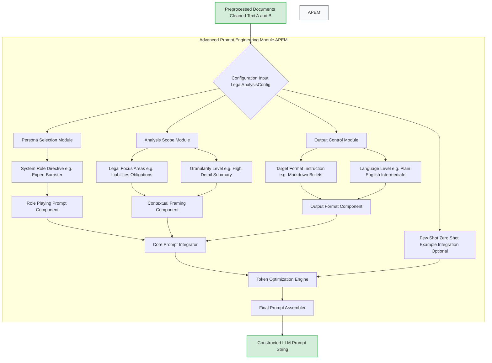
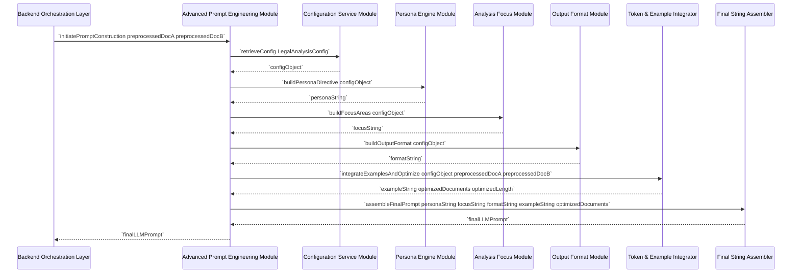
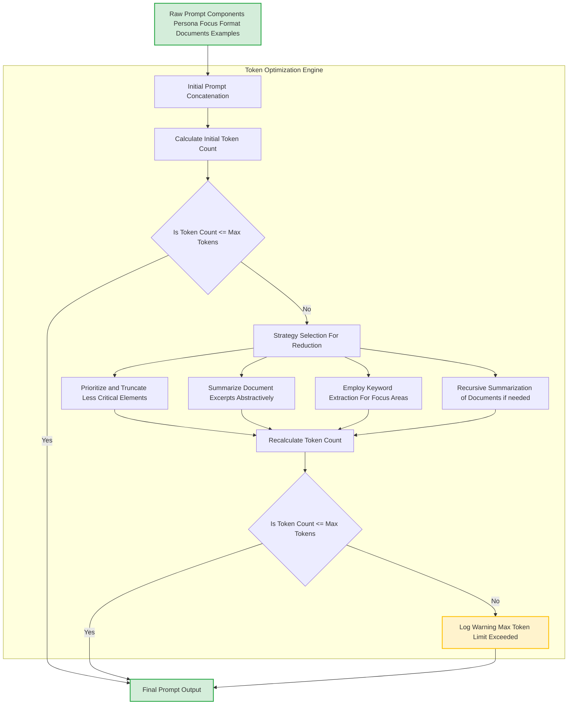
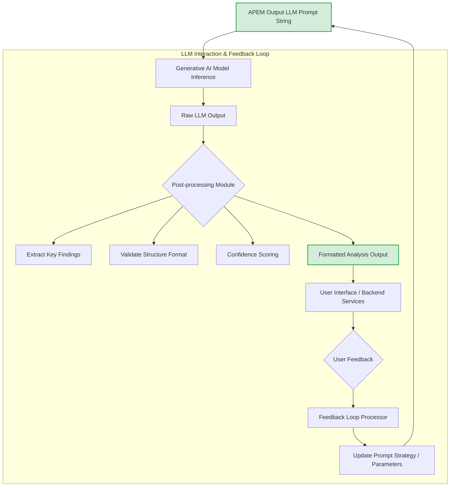
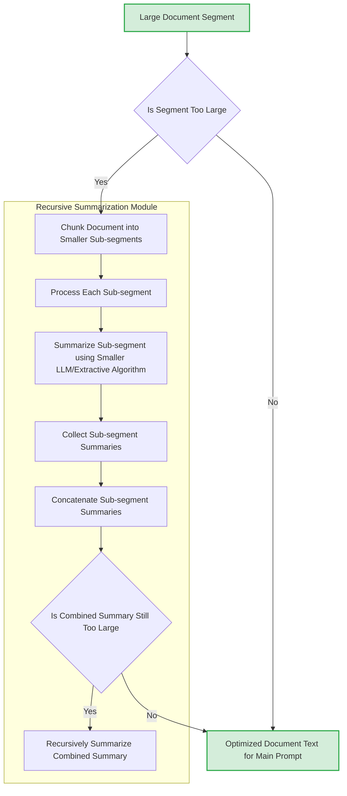
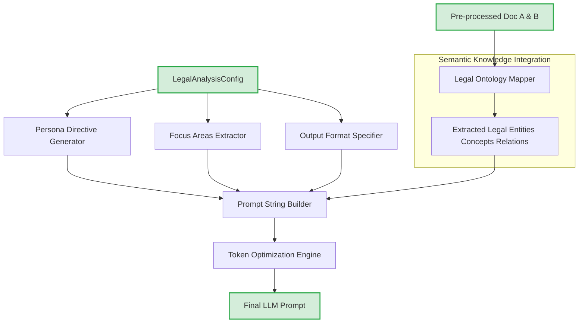

**Title of Invention:** A System and Method for Advanced Prompt Engineering in Semantic Legal Document Analysis

**Abstract:**
A highly sophisticated system and method for dynamic and optimized prompt engineering is herein disclosed, specifically designed to empower generative artificial intelligence models in executing complex semantic comparisons of legal documents. This invention meticulously constructs contextualized prompts by integrating user-defined configurations, pre-processed document content, and strategic directives. Key elements include the precise establishment of an AI persona, granular specification of analytical focus areas, explicit control over output format and linguistic style, and intelligent management of prompt token length. By synergistically combining these components, the Advanced Prompt Engineering Module (APEM) ensures that the underlying AI model performs a profoundly accurate and relevant semantic exegesis, transcending mere lexical differences to identify and articulate material legal implications. This module forms the intellectual core enabling the unparalleled clarity, precision, and actionable insights derived from automated legal document comparison.

**Background of the Invention:**
The efficacy of large language models (LLMs) in performing complex analytical tasks, particularly within specialized domains such as legal analysis, is profoundly contingent upon the quality and specificity of their input prompts. Generic or poorly constructed prompts often yield superficial, irrelevant, or even erroneous outputs, failing to harness the full semantic reasoning capabilities of these advanced AI architectures. In the critical field of legal document comparison, where subtle linguistic variations can precipitate monumental legal ramifications, a rudimentary prompt is inherently insufficient. Traditional prompt engineering often relies on ad-hoc, manual iterations, which are neither scalable nor consistently effective. There exists, therefore, an imperative need for a systematic, dynamic, and intelligently automated mechanism for constructing prompts that precisely guide an LLM to perform deep semantic comparison, interpret legal nuances, identify material divergences, and articulate these findings with clarity and precision, all while adhering to strict operational constraints like token limits. The present invention addresses this acute deficiency by providing an architectural and algorithmic solution for advanced, adaptive prompt engineering.

**Brief Summary of the Invention:**
The present invention delineates and realizes an advanced methodology and system for constructing highly optimized prompts for generative AI models, specifically tailored for the semantic comparison of legal documents. At its core, the Advanced Prompt Engineering Module (APEM) orchestrates a multi-staged process commencing with the ingestion of pre-processed legal documents and comprehensive configuration parameters. It dynamically synthesizes a rich, multi-faceted prompt by: (1) instantiating a precise AI persona (e.g., "expert legal analyst"); (2) embedding explicit directives for contextual framing and focus areas (e.g., "identify liability shifts"); (3) defining the desired output format and linguistic complexity; and (4) intelligently integrating optional few-shot examples. A critical component is the integrated Token Optimization Engine, which rigorously manages prompt length to ensure adherence to LLM context window limitations while maximizing informational density, employing strategies such as selective summarization or compression. The resulting prompt string, a holistic fusion of directives and content, is then meticulously validated and prepared for transmission to the generative AI model, thereby ensuring the AI's analytical output is both profound in its legal insight and precisely aligned with user requirements.

**Figures:**

The following figures illustrate the architecture and operational flow of the Advanced Prompt Engineering Module. These conceptual diagrams are integral to understanding the robust and innovative nature of this invention.


**Figure 1: Advanced Prompt Engineering Module Internal Architecture**

This flowchart illustrates the detailed architecture of the Advanced Prompt Engineering Module. It begins with preprocessed documents and configuration parameters, which feed into specialized sub-modules for persona selection, analysis scope definition, and output control. These directives are then integrated into core prompt components, optionally combined with few-shot examples, and passed through a Token Optimization Engine. The final prompt is assembled and outputted for the LLM.


**Figure 2: Sequence Diagram of Prompt Construction within APEM**

This sequence diagram illustrates the chronological flow of interactions within the Advanced Prompt Engineering Module during the construction of a comprehensive AI prompt. It highlights how configuration data is utilized by various internal engines to progressively build the prompt components, culminating in the final prompt string delivered to the Backend Orchestration Layer.


**Figure 3: Detailed Token Optimization Workflow**

This flowchart details the internal workings of the Token Optimization Engine within the Advanced Prompt Engineering Module. It outlines the process from initial prompt concatenation and token counting, through various strategies for prompt reduction if the token limit is exceeded, to the final output of an optimized prompt or a logged warning.

```mermaid
graph TD
    A[LegalAnalysisConfig Parameters] --> B{Choose Prompt Template ID}
    B --> C[Retrieve Template (e.g., Default, LiabilityFocus, BriefSummary)]
    C --> D[Populate Placeholders with Config Values]
    D --> E[Integrate Dynamic Content (Docs Examples)]
    E --> F[Apply Conditional Logic (e.g., if return_excerpts)]
    F --> G[Initial Templated Prompt String]
    G --> H[Token Optimization Engine (See Figure 3)]
    H --> I[Final Prompt for LLM]

    subgraph Dynamic Prompt Template Manager (DPTM)
        B
        C
        D
        E
        F
        G
    end
    style A fill:#D4EDDA,stroke:#28A745,stroke-width:2px;
    style I fill:#D4EDDA,stroke:#28A745,stroke-width:2px;
```
**Figure 4: Dynamic Prompt Template Manager Workflow**

This diagram illustrates how the Dynamic Prompt Template Manager operates. It selects a prompt template based on configuration, populates it with specific parameters and dynamic content, applies conditional logic, and then passes the initial templated string to the Token Optimization Engine for final processing. This ensures structured and adaptable prompt generation.


**Figure 5: LLM Interaction and Adaptive Feedback Loop**

This flowchart details the complete lifecycle from APEM-generated prompt to LLM output, subsequent post-processing, and finally, integration of user feedback. The Feedback Loop Processor continuously refines APEM's prompt construction strategies and parameters based on the quality and relevance of the LLM's analytical output.


**Figure 6: Recursive Summarization Sub-Module in Token Optimization**

This diagram expands on the 'Recursive Summarization' strategy mentioned in Figure 3. It shows how large documents are chunked, individually summarized, and then potentially summarized again recursively until the total token count fits within the allowed limits, ensuring that critical information from extensive documents can still be processed.

```mermaid
graph TD
    A[Initial Prompt P_0] --> B[Test Group A (P_A)]
    A --> C[Test Group B (P_B)]
    B --> D[LLM_A Output]
    C --> E[LLM_B Output]
    D --> F[Performance Metrics (Accuracy Relevance Speed)]
    E --> F
    F --> G[Statistical Analysis (e.g., T-test)]
    G --> H{Is P_A Statistically Better than P_B}
    H -- Yes --> I[Promote P_A to Production]
    H -- No --> J[Iterate Refine Prompts]
    J --> A

    subgraph Prompt Versioning & A/B Testing System
        B
        C
        D
        E
        F
        G
        H
        I
        J
    end
    style A fill:#D4EDDA,stroke:#28A745,stroke-width:2px;
    style I fill:#D4EDDA,stroke:#28A745,stroke-width:2px;
```
**Figure 7: Prompt Versioning and A/B Testing Workflow**

This flowchart illustrates the structured process for evaluating different prompt engineering strategies. It details how multiple prompt versions are tested concurrently (A/B testing), their outputs are analyzed for performance metrics, and statistical methods determine which prompt version is superior, leading to continuous improvement.

```mermaid
graph TD
    A[LLM Raw Output] --> B[Error Detection Module]
    B --> B1{Syntactic Errors e.g. JSON Format Issues}
    B --> B2{Semantic Discrepancies e.g. Inconsistent Claims}
    B --> B3{Hallucination Detection e.g. Non-existent Legal Precedents}
    B1 --> C[Error Handler]
    B2 --> C
    B3 --> C
    C --> D[Log Error Details]
    C --> E{Error Severity}
    E -- High --> F[Re-prompt with Correction Directives]
    E -- Medium --> G[Flag for Human Review]
    E -- Low --> H[Automatic Correction Attempt (Minor)]
    F --> A
    G --> I[Notify Admin]
    H --> A

    subgraph Prompt Error Management System (PEMS)
        B
        B1
        B2
        B3
        C
        D
        E
        F
        G
        H
        I
    end
    style A fill:#D4EDDA,stroke:#28A745,stroke-width:2px;
    style F fill:#FFF3CD,stroke:#FFC107,stroke-width:2px;
    style I fill:#FFF3CD,stroke:#FFC107,stroke-width:2px;
```
**Figure 8: Prompt Error Management System Workflow**

This diagram depicts a system for identifying and handling errors in the generative AI's output. It covers detection of syntactic, semantic, and hallucination errors, followed by a branching logic for error resolution: re-prompting, human review, or automatic correction based on severity.


**Figure 9: Semantic Knowledge Graph Integration for Prompt Construction**

This flowchart shows how external legal knowledge, represented as an ontology or graph, can be integrated into the prompt construction process. Legal entities, concepts, and relations extracted from documents are mapped against this graph, allowing the APEM to generate more semantically rich and grounded directives for the LLM.

```mermaid
graph TD
    A[User Profile] --> B[Historical Interactions]
    A --> C[Explicit Preferences]
    B --> D[Performance Metrics (Past Prompts)]
    D --> E[Identified Bias Patterns]
    C --> E
    E --> F[Prompt Parameter Adjustment Engine]
    F --> F1[Adjust Persona Tone]
    F --> F2[Prioritize Focus Areas]
    F --> F3[Modify Output Verbosity]
    F1 --> G[Personalized LegalAnalysisConfig]
    F2 --> G
    F3 --> G
    G --> H[Advanced Prompt Engineering Module (APEM)]
    H --> I[Optimized Prompt]

    subgraph Personalized Prompt Adaptation Module
        B
        C
        D
        E
        F
        F1
        F2
        F3
        G
    end
    style A fill:#D4EDDA,stroke:#28A745,stroke-width:2px;
    style I fill:#D4EDDA,stroke:#28A745,stroke-width:2px;
```
**Figure 10: Personalized Prompt Adaptation Module Workflow**

This diagram illustrates how the system adapts prompt generation based on individual user profiles. It considers historical interactions, explicit preferences, and past performance metrics to identify biases or preferred styles. This information is then used by an adjustment engine to dynamically modify `LegalAnalysisConfig` parameters, leading to a highly personalized and continually improving prompt generation experience.

**Detailed Description of the Invention:**
The Advanced Prompt Engineering Module (APEM) represents a core innovation, transforming the interaction with generative AI models from a heuristic art into a systematic and robust science, particularly within the demanding context of legal document analysis. Its sophisticated design ensures that prompts are not merely concatenated strings but meticulously engineered instructional sets that guide the AI's semantic reasoning with unparalleled precision.

**I. System Components and Architecture of APEM:**

1.  **Configuration Service Module CSM:**
    *   **Functionality:** Acts as the primary interface for ingesting and validating system-wide and user-specific configuration parameters (`LegalAnalysisConfig`). These configurations are critical for tailoring the prompt to specific analytical requirements and user preferences. It also interfaces with external services for dynamic updates to configuration schemas.
    *   **Implementation:** Manages a structured `LegalAnalysisConfig` object, including parameters such as `ai_model_name`, `system_persona`, `focus_areas`, `output_format_instructions`, `temperature`, `max_tokens`, `plain_language_level`, `return_excerpts`, `enable_few_shot_examples`, `prompt_template_id`, and `semantic_graph_query_mode`. It ensures that all parameters are consistent, within valid ranges, and adheres to JSON schema validation rules. Configuration versions are maintained for auditability.

2.  **Persona Engine Module PEM:**
    *   **Functionality:** Dynamically constructs the "Role-Playing Directive" component of the prompt, instructing the generative AI to adopt a specific epistemic role. This imbues the AI's output with the appropriate tone, depth, and analytical rigor required for legal discourse. It can also generate dynamic sub-personas based on specific `focus_areas`.
    *   **Implementation:** Leverages the `system_persona` parameter from the `LegalAnalysisConfig` (e.g., "expert legal analyst and senior barrister specialized in corporate law"). It synthesizes linguistic constructs that prime the AI to operate within this defined professional context, ensuring its responses are grounded in authoritative legal reasoning. This includes the selection of domain-specific vocabulary and rhetorical style.

3.  **Analysis Focus Module AFM:**
    *   **Functionality:** Generates the "Contextual Framing" and "Constraint Specification" elements of the prompt. This module guides the AI to concentrate its semantic analysis on specific legal domains, concepts, or types of changes that are most relevant to the comparison task. It can dynamically adjust the specificity of the focus based on document complexity.
    *   **Implementation:** Integrates `focus_areas` (e.g., "liability shifts", "indemnification clauses", "governing law", "financial terms", "dispute resolution mechanisms") and `granularity_level` from the configuration. It crafts explicit commands that direct the AI to transcend general comparison, instead performing a targeted exegesis on predefined legal constructs and their implications, potentially referencing specific sections or clauses from documents.

4.  **Output Format Module OFM:**
    *   **Functionality:** Specifies the precise structure, format, and linguistic style desired for the AI's analytical output. This ensures the generated summary is readily digestible, actionable, and aligns with the end-user's display preferences and comprehension level. It supports multiple output schemas including custom ones.
    *   **Implementation:** Utilizes `output_format_instructions` (e.g., "plain English bulleted list", "structured JSON conforming to LegalDeltaSchema v1.2", "executive summary with key findings") and `plain_language_level` (e.g., "intermediate", "expert", "layman"). It generates directives that compel the AI to render its complex legal insights into a specified, accessible format, bridging the gap between raw AI processing and human understanding, often including validation instructions (e.g., "ensure JSON is valid").

5.  **Few-Shot/Zero-Shot Example Integration Unit TEI - Part 1:**
    *   **Functionality:** Manages the optional inclusion of few-shot examples or activation of zero-shot learning directives within the prompt. This enhances the AI's ability to generalize to specific output patterns or analytical reasoning styles desired by the system. Examples are selected based on relevance to `focus_areas` and `document_types`.
    *   **Implementation:** Based on the `enable_few_shot_examples` and `few_shot_strategy` configuration, it retrieves or constructs concise examples of desired input/output pairs for the AI from a curated example database. These examples serve as in-context learning demonstrations, allowing the AI to rapidly adapt to nuanced requirements without explicit fine-tuning. For zero-shot scenarios, it ensures the prompt's inherent clarity and completeness are sufficient.

6.  **Token Management and Optimization System TEI - Part 2 & Figure 3 & 6:**
    *   **Functionality:** A critical sub-module responsible for dynamically calculating, monitoring, and optimizing the total token length of the constructed prompt. It ensures that the prompt, including embedded document texts and directives, remains within the generative AI model's context window limitations (`max_tokens`) while preserving maximal informational density. It employs a multi-stage, adaptive strategy for content reduction.
    *   **Implementation:**
        *   **Token Counter:** Utilizes model-specific tokenization algorithms (e.g., `tiktoken` for OpenAI, specialized tokenizers for other models) to accurately estimate prompt length.
        *   **Dynamic Compression Strategies:** If the initial token count exceeds the `max_tokens` limit, it intelligently applies a hierarchy of reduction strategies:
            *   **Prioritization & Truncation (G):** Identifies and selectively truncates less critical elements of the prompt (e.g., verbose introductory remarks, less essential examples, historical context from documents). This is based on a pre-defined criticality score for each prompt segment.
            *   **Abstractive Summarization (H):** Employs an internal summarization engine (potentially a smaller, faster LLM like `distilbert`, or advanced extractive algorithms like `TextRank`) to condense lengthy document excerpts or detailed examples, maintaining core legal meaning. This is context-aware based on `focus_areas`.
            *   **Keyword Extraction / Legal Terminology Emphasis (I):** For very large documents or segments, it can reduce embedded document content to highly relevant keywords, phrases, or critical clauses pertaining to the `focus_areas`, essentially creating a "semantic fingerprint" of the document section.
            *   **Recursive Chunking and Summarization (J & Figure 6):** For extremely large documents that cannot be fully included even after initial summarization, it processes documents in chunks, summarizes each chunk, and then concatenates these summaries. If the combined summaries are still too large, it can recursively summarize the summaries. This ensures even vast legal texts can inform the prompt.
        *   **Iterative Adjustment:** Recalculates token count after each reduction strategy, continuing until the prompt fits or a minimum viable prompt (MVP) is achieved. If the MVP is reached and still exceeds limits, a warning is logged detailing the information loss, and a partial prompt is returned.

7.  **Final Prompt Assembler FSA:**
    *   **Functionality:** Aggregates all individually constructed prompt components—persona, contextual framing, constraint specification, output format, optimized document excerpts, and examples—into a single, coherent, and syntactically correct prompt string. It applies chosen prompt templates (Figure 4) and validation.
    *   **Implementation:** Ensures proper concatenation, formatting (e.g., markdown structure, XML/JSON wrappers for specific directives, delimiters), and validation of the final prompt string before it is released to the Generative AI Interaction Module. It applies sophisticated templating logic (e.g., Jinja2, custom DSL) to fuse the various elements seamlessly, potentially embedding metadata for downstream processing.

**II. Operational Workflow of APEM:**

1.  **Initialization:** The APEM receives pre-processed `Document A` and `Document B` along with a `LegalAnalysisConfig` object from the Backend Orchestration Layer.
2.  **Template Selection:** The system selects an appropriate prompt template from the `PromptTemplateManager` based on `config.prompt_template_id` or other dynamic factors.
3.  **Directive Generation:** The Persona Engine, Analysis Focus Module, and Output Format Module independently generate their respective textual directives based on the `LegalAnalysisConfig`, potentially informed by `SemanticGraphIntegration` (Figure 9).
4.  **Example Integration:** The Few-Shot/Zero-Shot Example Integration Unit determines whether to include specific examples based on configuration and prepares them for inclusion, prioritizing examples relevant to the current `focus_areas`.
5.  **Initial Assembly & Templating:** All generated directives, pre-processed document texts, and examples are combined into an initial draft prompt string, using the selected template's structure and placeholders (Figure 4).
6.  **Token Optimization:** The Token Management and Optimization System takes this initial prompt, calculates its token count, and applies its hierarchical compression strategies (Figure 3, Figure 6) if the count exceeds `max_tokens`. This step is iterative and ensures the prompt is maximally informative within the AI's context window.
7.  **Final Assembly & Validation:** The Final Prompt Assembler integrates any optimized document texts and examples with the directives, performs final formatting and syntactic checks, ensuring a robust and unambiguous prompt string. It also performs a final token count and logs any residual warnings (Figure 8).
8.  **Output:** The complete and optimized AI prompt string is then returned to the Backend Orchestration Layer for transmission to the Generative AI Model. This output can then be fed into a feedback loop for adaptive improvements (Figure 5).

**III. Embodiments and Further Features:**

*   **Dynamic Prompt Templates (DPTM) (Figure 4):** Utilization of advanced templating languages (e.g., Jinja2, Handlebars) that allow for conditional logic, dynamic insertion of prompt components based on document characteristics (e.g., contract type, jurisdiction), user intent, or specific `LegalAnalysisConfig` parameters. This enables rapid iteration and standardization of prompt structures.
*   **Prompt Versioning and A/B Testing (PVAT) (Figure 7):** Implementation of a comprehensive system to version control different prompt engineering strategies, templates, and parameter sets. This allows for rigorous A/B testing in production or staging environments to empirically determine the most effective prompt structures for various legal document types, comparison tasks, or LLM versions, optimizing for metrics such as accuracy, relevance, and speed.
*   **AI-Assisted Prompt Generation (AAPG) (Figure 5):** Integration of a meta-AI layer that suggests, refines, or even autonomously generates prompt directives. This module analyzes initial LLM output quality, user feedback, detected document characteristics (e.g., complexity, language style), and common error patterns to improve subsequent prompt constructions. This can involve an internal classifier to categorize documents and suggest optimal prompt parameters.
*   **Personalized Prompt Adaptation (PPA) (Figure 10):** Learning and adapting prompt parameters based on individual user profiles. This involves capturing user preferences, historical interactions, common error patterns for that user, or historical performance metrics (e.g., preferred level of detail, desired tone). The system then adjusts `LegalAnalysisConfig` parameters (e.g., persona, language level, focus area prioritization) to provide a highly personalized and continuously improving experience, optimizing for individual user satisfaction.
*   **Semantic Graph Integration (SGI) (Figure 9):** Incorporating directives that reference external legal knowledge graphs or ontologies to further ground the AI's reasoning in a structured legal framework. This allows the prompt to explicitly instruct the LLM to consider specific definitions, relationships, or legal precedents from a trusted knowledge base, enhancing precision and reducing factual errors or "hallucinations."
*   **Error Handling and Explainability (EHE) (Figure 8):** A dedicated system to detect and manage errors in the LLM's output. This includes identifying syntactic errors (e.g., malformed JSON), semantic discrepancies (e.g., contradictory statements), or factual inaccuracies (e.g., hallucinated legal concepts). Based on error severity, the system can trigger re-prompting with correctional directives, flag for human review, or attempt minor automatic corrections, simultaneously providing explanations for its actions.
*   **Adaptive Tokenization and Context Management (ATCM):** Beyond mere truncation, this feature dynamically adjusts the granularity of document segments included in the prompt based on their estimated relevance to the `focus_areas`. It may also intelligently shift focus between global document context and specific clause-level details depending on the `granularity_level` and remaining token budget, ensuring that context is preserved where most critical.

**Conceptual Code (PromptBuilder Enhancements):**
Building upon the `PromptBuilder` from the main invention, here's how some of the APEM's internal logic could be conceptualized.

```python
from google.generativeai import GenerativeModel
from enum import Enum
from typing import List, Dict, Any, Optional
import hashlib
import datetime
import tiktoken # Conceptual token counter integration
import json # For structured output and validation
import re # For templating and placeholder replacement
from abc import ABC, abstractmethod

# Assume LegalAnalysisConfig, AnalysisOutputFormat, etc. from seed file are available.
# For demonstration, we'll define a simplified LegalAnalysisConfig if not present in context
class AnalysisOutputFormat(Enum):
    MARKDOWN_BULLETS = "markdown bulleted list"
    STRUCTURED_JSON = "structured JSON"
    PLAIN_TEXT_SUMMARY = "plain text summary"

class PlainLanguageLevel(Enum):
    LAYMAN = "layman's"
    INTERMEDIATE = "intermediate"
    EXPERT = "expert"

class LegalAnalysisConfig:
    def __init__(self,
                 ai_model_name: str = "gemini-pro",
                 system_persona: str = "expert legal analyst and senior barrister",
                 focus_areas: List[str] = None,
                 output_format_instructions: AnalysisOutputFormat = AnalysisOutputFormat.MARKDOWN_BULLETS,
                 temperature: float = 0.7,
                 max_tokens: int = 8000,
                 plain_language_level: PlainLanguageLevel = PlainLanguageLevel.INTERMEDIATE,
                 return_excerpts: bool = True,
                 enable_few_shot_examples: bool = False,
                 prompt_template_id: str = "default_legal_comparison",
                 semantic_graph_query_mode: bool = False,
                 version: str = "1.0.0",
                 log_level: str = "INFO"):
        self.ai_model_name = ai_model_name
        self.system_persona = system_persona
        self.focus_areas = focus_areas if focus_areas is not None else ["liability", "obligations", "financial terms"]
        self.output_format_instructions = output_format_instructions
        self.temperature = temperature
        self.max_tokens = max_tokens
        self.plain_language_level = plain_language_level
        self.return_excerpts = return_excerpts
        self.enable_few_shot_examples = enable_few_shot_examples
        self.prompt_template_id = prompt_template_id
        self.semantic_graph_query_mode = semantic_graph_query_mode
        self.version = version
        self.log_level = log_level

# New abstract class for pluggable summarization strategies
class SummarizationStrategy(ABC):
    @abstractmethod
    def summarize(self, text: str, max_tokens: int, focus_areas: List[str]) -> str:
        pass

class AbstractiveSummarizer(SummarizationStrategy):
    """
    Conceptual abstractive summarizer using a hypothetical smaller LLM.
    In a real system, this would involve API calls or an embedded model.
    """
    def __init__(self, model_name: str = "distilbert-base-uncased-xsum"):
        self.model_name = model_name
        # Placeholder for actual model loading
        # self.summarizer_model = load_model(model_name)

    def summarize(self, text: str, max_tokens: int, focus_areas: List[str]) -> str:
        # Simulate summarization:
        # For a real implementation, this would call a summarization model
        # or an API with the text and desired length.
        # Focus areas could influence the summarization (e.g., increase weight for relevant sentences).
        if len(text) < max_tokens * 2: # Don't summarize if already short
            return text
        
        # Simple heuristic: take first N and last N sentences + keyword extraction
        sentences = re.split(r'(?<=[.!?])\s+', text)
        if len(sentences) < 5: return text # Too short to summarize meaningfully

        keywords_in_focus = [f for f in focus_areas if f.lower() in text.lower()]
        
        summary_parts = []
        if len(sentences) > 0: summary_parts.append(sentences[0])
        if len(sentences) > 1: summary_parts.append(sentences[1])
        if len(sentences) > 2: summary_parts.append("...")
        if len(sentences) > 1: summary_parts.append(sentences[-2])
        if len(sentences) > 0: summary_parts.append(sentences[-1])
        
        summary_text = " ".join(summary_parts)
        if keywords_in_focus:
            summary_text += f"\nKey terms for focus: {', '.join(keywords_in_focus)}."
        
        return summary_text # Truncate after this conceptual summary for token limit

class TokenizerService:
    """
    A conceptual service for tokenizing text and counting tokens,
    mimicking model-specific tokenization.
    """
    def __init__(self, model_name: str):
        # In a real system, this would load the tokenizer for the specific LLM.
        # For conceptual purposes, we'll use a generic encoding or a placeholder.
        # tiktoken is a good proxy for OpenAI models; other models have their own.
        try:
            self.encoding = tiktoken.encoding_for_model(model_name)
        except KeyError:
            print(f"Warning: tiktoken does not have encoding for {model_name}. Using 'cl100k_base'.")
            self.encoding = tiktoken.get_encoding("cl100k_base")
        self.model_name = model_name

    def count_tokens(self, text: str) -> int:
        """Estimates the number of tokens in a given text."""
        if not text: return 0
        return len(self.encoding.encode(text))

    def truncate_text(self, text: str, max_tokens: int) -> str:
        """Truncates text to fit within max_tokens, preserving start."""
        if not text or max_tokens <= 0: return ""
        encoded = self.encoding.encode(text)
        if len(encoded) > max_tokens:
            truncated_encoded = encoded[:max_tokens]
            return self.encoding.decode(truncated_encoded)
        return text

    def recursive_summarize_chunks(self, text: str, max_tokens: int, focus_areas: List[str],
                                   summarizer: SummarizationStrategy, chunk_size_tokens: int = 1000) -> str:
        """
        Recursively chunks and summarizes text to fit within max_tokens.
        """
        if self.count_tokens(text) <= max_tokens:
            return text

        chunks = []
        current_chunk_tokens = []
        current_chunk_text = []

        # Simple chunking by paragraph or sentence boundaries
        sentences = re.split(r'(?<=[.!?])\s+', text)
        for sentence in sentences:
            sentence_tokens = self.encoding.encode(sentence)
            if len(current_chunk_tokens) + len(sentence_tokens) > chunk_size_tokens:
                chunks.append(self.encoding.decode(current_chunk_tokens))
                current_chunk_tokens = []
                current_chunk_text = []
            current_chunk_tokens.extend(sentence_tokens)
            current_chunk_text.append(sentence)
        if current_chunk_tokens:
            chunks.append(self.encoding.decode(current_chunk_tokens))
        
        summarized_chunks = [summarizer.summarize(chunk, chunk_size_tokens // 2, focus_areas) for chunk in chunks]
        combined_summary = "\n".join(summarized_chunks)

        # Recalculate and potentially recurse
        return self.recursive_summarize_chunks(combined_summary, max_tokens, focus_areas, summarizer)

# New class for managing prompt templates
class PromptTemplateManager:
    def __init__(self):
        self.templates = self._load_templates()

    def _load_templates(self) -> Dict[str, str]:
        """
        Loads pre-defined prompt templates. In a real system, these would be
        loaded from a database or file system, potentially versioned.
        """
        # A simple dictionary for conceptual demonstration
        return {
            "default_legal_comparison": """
            {persona_directive}

            {focus_directive}

            {output_format_directive}

            {few_shot_examples}

            --- DOCUMENT A Original Version ---
            {doc_a}

            --- DOCUMENT B Revised Version ---
            {doc_b}

            --- ANALYTICAL FINDINGS ---
            """,
            "liability_focused_report": """
            {persona_directive}
            Your primary focus is an exhaustive analysis of liability shifts.

            {focus_directive}

            {output_format_directive}

            {few_shot_examples}

            --- ORIGINAL LIABILITY TERMS (Document A) ---
            {doc_a_liability_section}

            --- REVISED LIABILITY TERMS (Document B) ---
            {doc_b_liability_section}

            --- LIABILITY ASSESSMENT ---
            """
            # Add more templates for specific use cases
        }

    def get_template(self, template_id: str) -> str:
        template = self.templates.get(template_id)
        if not template:
            raise ValueError(f"Prompt template '{template_id}' not found.")
        return template

    def render_template(self, template_id: str, context: Dict[str, Any]) -> str:
        template_string = self.get_template(template_id)
        # Simple placeholder replacement for conceptual code
        # In a real system, use Jinja2 or similar for full templating power
        for key, value in context.items():
            if value is None: # Handle None values by replacing with empty string
                template_string = template_string.replace(f"{{{key}}}", "")
            else:
                template_string = template_string.replace(f"{{{key}}}", str(value))
        return template_string

class SemanticGraphService:
    """
    Conceptual service for querying a legal knowledge graph and generating insights
    or entities to embed in the prompt.
    """
    def __init__(self, graph_api_endpoint: str = "http://legal-graph.svc/query"):
        self.graph_api_endpoint = graph_api_endpoint
        # self.graph_client = GraphClient(graph_api_endpoint) # Conceptual client

    def get_relevant_legal_concepts(self, text: str, focus_areas: List[str]) -> List[str]:
        """
        Simulates querying a legal knowledge graph to extract relevant concepts
        based on text and focus areas.
        """
        # Placeholder for actual graph query logic
        concepts = set()
        for area in focus_areas:
            if area.lower() in text.lower():
                concepts.add(area.capitalize() + " Law")
        if "indemnification" in text.lower():
            concepts.add("Indemnity")
        if "governing law" in text.lower():
            concepts.add("Jurisdiction")
        return list(concepts)

    def generate_grounding_directives(self, text: str, focus_areas: List[str]) -> str:
        """
        Generates prompt directives to ground the LLM in specific legal concepts
        from the knowledge graph.
        """
        concepts = self.get_relevant_legal_concepts(text, focus_areas)
        if concepts:
            return f"Ensure your analysis is grounded in legal concepts such as: {', '.join(concepts)}. Adhere strictly to established definitions within {', '.join(concepts)}."
        return ""


class PromptBuilder:
    """
    Dynamically constructs the sophisticated prompt for the Generative AI Model,
    embodying the APEM's advanced engineering.
    """
    def __init__(self, config: LegalAnalysisConfig):
        self.config = config
        self.tokenizer = TokenizerService(config.ai_model_name)
        self.template_manager = PromptTemplateManager()
        self.summarizer = AbstractiveSummarizer() # Default summarizer
        if config.semantic_graph_query_mode:
            self.semantic_service = SemanticGraphService()
        else:
            self.semantic_service = None

    def _generate_persona_directive(self) -> str:
        """Constructs the role-playing instruction for the AI."""
        return f"You are an exceptionally astute and highly experienced {self.config.system_persona}."

    def _generate_analysis_focus_directives(self, doc_a: str, doc_b: str) -> str:
        """Constructs the directives for focus areas and analytical depth."""
        focus_areas_str = ", ".join(self.config.focus_areas)
        granularity = self.config.plain_language_level.value # Using this as a proxy for detail level

        directive = f"""
        Your critical mission is to perform a forensic, semantic comparison between two versions of a legal document.
        Your analysis must transcend superficial lexical variations and delve into the fundamental legal meaning,
        potential risks, and practical implications of all material differences.

        Specifically, meticulously analyze changes related to: {focus_areas_str}.
        The level of detail required for your analysis should be suitable for an {granularity} legal understanding.
        For each identified material difference, you must articulate:
        1.  A concise description of the change.
        2.  Its precise legal meaning and significance.
        3.  The potential real-world implications or consequences for the parties involved.
        {"4.  Where appropriate, a brief excerpt from Document A and Document B illustrating the change context." if self.config.return_excerpts else ""}
        5.  Assign a qualitative severity (e.g., 'High', 'Medium', 'Low') to the change based on its potential impact.
        """
        
        if self.semantic_service:
            # Combine documents for holistic semantic grounding
            combined_docs = doc_a + "\n" + doc_b
            grounding_directive = self.semantic_service.generate_grounding_directives(combined_docs, self.config.focus_areas)
            if grounding_directive:
                directive += f"\n{grounding_directive}"
        
        return directive

    def _generate_output_format_directives(self) -> str:
        """Constructs the directives for output format and language level."""
        format_instruction = self.config.output_format_instructions.value
        language_level = self.config.plain_language_level.value
        
        directive = f"""
        Present your findings in a clear, structured, and easily digestible {format_instruction},
        ensuring all explanations are provided in unambiguous, plain English suitable for a {language_level} legal understanding, devoid of unnecessary legalistic jargon.
        Your objective is to provide actionable intelligence to a stakeholder who may not possess deep legal expertise.
        """
        if self.config.output_format_instructions == AnalysisOutputFormat.STRUCTURED_JSON:
            directive += """
            Your JSON output MUST conform to the following schema:
            ```json
            {
                "analysis_summary": "Overall summary of changes",
                "material_differences": [
                    {
                        "description": "Concise description of change",
                        "legal_meaning": "Precise legal meaning and significance",
                        "implications": "Potential real-world implications",
                        "severity": "High|Medium|Low",
                        "doc_a_excerpt": "Optional excerpt from Document A",
                        "doc_b_excerpt": "Optional excerpt from Document B"
                    }
                ]
            }
            ```
            """
        return directive

    def _integrate_few_shot_examples(self, doc_a: str, doc_b: str) -> str:
        """
        Integrates optional few-shot examples into the prompt.
        In a real system, this would retrieve relevant examples dynamically.
        """
        if not self.config.enable_few_shot_examples:
            return ""

        # Example: if configured for specific clause comparison
        example_string = ""
        if "indemnification" in self.config.focus_areas:
            example_string += """
            --- EXAMPLE 1: INDEMNIFICATION CLAUSE CHANGE ---
            Document A Snippet: "Party A shall indemnify Party B for all losses arising from the project."
            Document B Snippet: "Party A may indemnify Party B for direct losses only, not consequential."
            AI Output Example:
            1. Description: Mandatory, broad indemnification (A) shifted to discretionary, limited indemnification (B).
            2. Legal Meaning: Party B's right to be compensated is no longer absolute and is restricted to direct losses, excluding indirect damages.
            3. Implications: Significantly increases Party B's financial exposure and burden of proof for any losses, while reducing Party A's potential liability.
            4. Severity: High
            --- END EXAMPLE 1 ---
            """
        
        if "governing law" in self.config.focus_areas:
            example_string += """
            --- EXAMPLE 2: GOVERNING LAW CHANGE ---
            Document A Snippet: "This Agreement shall be governed by the laws of New York."
            Document B Snippet: "This Agreement shall be governed by the laws of Delaware."
            AI Output Example:
            1. Description: Change in the governing jurisdiction from New York to Delaware.
            2. Legal Meaning: The legal framework used to interpret and enforce the contract shifts, potentially altering interpretations of key clauses due to different state precedents or statutory provisions.
            3. Implications: May impact enforceability of certain terms, dispute resolution processes, and overall legal risk profile, requiring re-evaluation by counsel familiar with Delaware law.
            4. Severity: Medium
            --- END EXAMPLE 2 ---
            """
        return example_string

    def _optimize_prompt_tokens(self, prompt_context: Dict[str, Any], doc_a_cleaned: str, doc_b_cleaned: str) -> Dict[str, str]:
        """
        Applies token optimization strategies to ensure the prompt fits within max_tokens.
        This mirrors the Token Management and Optimization System (Figure 3 & 6).
        """
        # First, render the template with initial document placeholders
        # We need an estimate of the non-document prompt parts first
        temp_doc_a_placeholder = "---DOC_A_PLACEHOLDER---"
        temp_doc_b_placeholder = "---DOC_B_PLACEHOLDER---"
        
        temp_context = prompt_context.copy()
        temp_context["doc_a"] = temp_doc_a_placeholder
        temp_context["doc_b"] = temp_doc_b_placeholder

        base_prompt_with_placeholders = self.template_manager.render_template(
            self.config.prompt_template_id, temp_context
        )

        # Calculate tokens for fixed parts + placeholders
        fixed_tokens = self.tokenizer.count_tokens(base_prompt_with_placeholders)
        available_tokens_for_docs = self.config.max_tokens - fixed_tokens

        # Strategy 1: Proportional truncation, then summarization, then recursive summarization
        optimized_doc_a = doc_a_cleaned
        optimized_doc_b = doc_b_cleaned
        
        doc_a_len = self.tokenizer.count_tokens(doc_a_cleaned)
        doc_b_len = self.tokenizer.count_tokens(doc_b_cleaned)
        total_docs_len = doc_a_len + doc_b_len

        if total_docs_len > available_tokens_for_docs and available_tokens_for_docs > 0:
            print(f"DEBUG: Document texts too long. Initial total doc tokens: {total_docs_len}, available: {available_tokens_for_docs}. Applying optimization.")

            # Attempt 1: Proportional truncation
            ratio_a = doc_a_len / total_docs_len if total_docs_len > 0 else 0.5
            ratio_b = doc_b_len / total_docs_len if total_docs_len > 0 else 0.5

            max_tokens_a = int(available_tokens_for_docs * ratio_a)
            max_tokens_b = int(available_tokens_for_docs * ratio_b)
            
            optimized_doc_a = self.tokenizer.truncate_text(doc_a_cleaned, max_tokens_a)
            optimized_doc_b = self.tokenizer.truncate_text(doc_b_cleaned, max_tokens_b)

            current_docs_len = self.tokenizer.count_tokens(optimized_doc_a) + self.tokenizer.count_tokens(optimized_doc_b)
            print(f"DEBUG: After truncation, doc tokens A:{self.tokenizer.count_tokens(optimized_doc_a)}, B:{self.tokenizer.count_tokens(optimized_doc_b)}. Total:{current_docs_len}")

            # If still too long, or truncation was too aggressive (e.g. max_tokens_a was 0)
            if current_docs_len > available_tokens_for_docs * 0.95 or (max_tokens_a <= 100 and doc_a_len > 100): # heuristic for re-evaluation
                print("DEBUG: Truncation insufficient or too harsh. Applying summarization.")
                # Attempt 2: Abstractive summarization
                # Give slightly more budget for summarization to preserve meaning, then truncate if needed
                summarized_max_tokens_a = int(available_tokens_for_docs * ratio_a * 1.1)
                summarized_max_tokens_b = int(available_tokens_for_docs * ratio_b * 1.1)
                
                # Use recursive summarization to ensure it fits if individual summarization is also too big
                optimized_doc_a = self.tokenizer.recursive_summarize_chunks(
                    doc_a_cleaned, max(100, summarized_max_tokens_a), self.config.focus_areas, self.summarizer
                )
                optimized_doc_b = self.tokenizer.recursive_summarize_chunks(
                    doc_b_cleaned, max(100, summarized_max_tokens_b), self.config.focus_areas, self.summarizer
                )
                
                current_docs_len = self.tokenizer.count_tokens(optimized_doc_a) + self.tokenizer.count_tokens(optimized_doc_b)
                print(f"DEBUG: After summarization, doc tokens A:{self.tokenizer.count_tokens(optimized_doc_a)}, B:{self.tokenizer.count_tokens(optimized_doc_b)}. Total:{current_docs_len}")

                # Final truncation to ensure strict adherence after summarization
                if current_docs_len > available_tokens_for_docs:
                    print("DEBUG: Summarization still too long. Applying final strict truncation.")
                    optimized_doc_a = self.tokenizer.truncate_text(optimized_doc_a, max(100, int(available_tokens_for_docs * ratio_a * 0.9)))
                    optimized_doc_b = self.tokenizer.truncate_text(optimized_doc_b, max(100, int(available_tokens_for_docs * ratio_b * 0.9)))
                    print(f"DEBUG: After final truncation, doc tokens A:{self.tokenizer.count_tokens(optimized_doc_a)}, B:{self.tokenizer.count_tokens(optimized_doc_b)}")

        elif available_tokens_for_docs <= 0:
            print("WARNING: Insufficient token budget for documents and core prompt. Severely truncating documents.")
            # Fallback: severely truncate documents to minimal
            optimized_doc_a = self.tokenizer.truncate_text(doc_a_cleaned, self.config.max_tokens // 8) # Arbitrary severe truncation
            optimized_doc_b = self.tokenizer.truncate_text(doc_b_cleaned, self.config.max_tokens // 8)
            print(f"WARNING: Final doc tokens A:{self.tokenizer.count_tokens(optimized_doc_a)}, B:{self.tokenizer.count_tokens(optimized_doc_b)}")
        else:
            optimized_doc_a = doc_a_cleaned
            optimized_doc_b = doc_b_cleaned

        return {
            "doc_a": optimized_doc_a,
            "doc_b": optimized_doc_b
        }


    def build_comparison_prompt(self, doc_a_cleaned: str, doc_b_cleaned: str) -> str:
        """
        Constructs a comprehensive and directive prompt for the AI model,
        integrating all APEM features.
        """
        prompt_context: Dict[str, Any] = {}

        # 1. Persona and Role-Playing Directive
        prompt_context["persona_directive"] = self._generate_persona_directive()

        # 2. Analysis Scope and Contextual Framing (includes Semantic Graph grounding)
        prompt_context["focus_directive"] = self._generate_analysis_focus_directives(doc_a_cleaned, doc_b_cleaned)

        # 3. Output Specification and Formatting Control
        prompt_context["output_format_directive"] = self._generate_output_format_directives()

        # 4. Few-Shot Example Integration
        few_shot_examples = self._integrate_few_shot_examples(doc_a_cleaned, doc_b_cleaned)
        prompt_context["few_shot_examples"] = few_shot_examples

        # Handle specific template requirements if any (e.g., liability section extraction)
        if self.config.prompt_template_id == "liability_focused_report":
            # This would require more sophisticated parsing/extraction logic
            # For conceptual code, we'll just use a placeholder
            prompt_context["doc_a_liability_section"] = "[[Placeholder for Document A Liability Section]]"
            prompt_context["doc_b_liability_section"] = "[[Placeholder for Document B Liability Section]]"
        
        # 5. Token Management and Optimization
        # This step optimizes the document texts BEFORE rendering the final template
        optimized_docs = self._optimize_prompt_tokens(prompt_context, doc_a_cleaned, doc_b_cleaned)
        prompt_context["doc_a"] = optimized_docs["doc_a"]
        prompt_context["doc_b"] = optimized_docs["doc_b"]
        
        # 6. Final Assembly using the selected template
        final_prompt = self.template_manager.render_template(
            self.config.prompt_template_id, prompt_context
        )
        
        # Final token count check for the fully assembled prompt
        final_token_count = self.tokenizer.count_tokens(final_prompt)
        if final_token_count > self.config.max_tokens:
            print(f"WARNING: Final prompt exceeds max_tokens ({final_token_count} > {self.config.max_tokens}). "
                  "This indicates a potential issue in optimization or template design.")
            # Emergency truncation if somehow still over budget
            final_prompt = self.tokenizer.truncate_text(final_prompt, self.config.max_tokens)
            print(f"WARNING: Emergency truncated. New token count: {self.tokenizer.count_tokens(final_prompt)}")

        return final_prompt.strip()

# Example usage (assuming LegalAnalysisConfig, etc are defined as in seed)
# config = LegalAnalysisConfig(max_tokens=8000)
# prompt_builder = PromptBuilder(config)
# final_prompt_string = prompt_builder.build_comparison_prompt("text of doc A", "text of doc B")
# print(final_prompt_string)
# print(f"Final prompt token count: {prompt_builder.tokenizer.count_tokens(final_prompt_string)}")
```

**Claims:**
The following claims assert the definitive intellectual ownership and novel aspects of the disclosed Advanced Prompt Engineering Module.

1.  A method for dynamically constructing an optimized prompt for a generative artificial intelligence model to perform semantic legal document comparison, comprising:
    a.  Receiving pre-processed textual content of a first legal document Document A and a second legal document Document B.
    b.  Receiving a set of configurable parameters `LegalAnalysisConfig` specifying desired AI persona, analysis focus areas, output format, and token limits.
    c.  Programmatically generating a role-playing directive component based on the specified AI persona.
    d.  Programmatically generating a contextual framing component based on the specified analysis focus areas and intended analytical depth.
    e.  Programmatically generating an output format specification component based on the desired output structure and linguistic complexity.
    f.  Integrating the generated components with the textual content of Document A and Document B to form an initial prompt string, utilizing a dynamically selected prompt template.
    g.  Applying a Token Management and Optimization process to said initial prompt string, said process comprising:
        i.   Calculating an initial token count of the prompt string using a model-specific tokenizer.
        ii.  If the initial token count exceeds a predefined maximum token limit, dynamically applying at least one token reduction strategy selected from the group consisting of: selective truncation of less critical elements, abstractive summarization of document excerpts, and keyword extraction from focus areas, to yield an optimized textual representation of Document A and Document B.
        iii. Recursively chunking and summarizing segments of Document A and Document B when direct inclusion of full documents is infeasible due to token limits, as part of the token reduction strategy.
    h.  Assembling the optimized textual representations with the generated directives into a final, coherent prompt for transmission to the generative artificial intelligence model.

2.  The method of claim 1, further comprising integrating specific few-shot examples into the prompt string, wherein said examples demonstrate desired output patterns or analytical reasoning for the generative artificial intelligence model, and wherein said examples are dynamically selected based on the `LegalAnalysisConfig`'s focus areas.

3.  The method of claim 1, wherein the programmatic generation of components ensures that directives for the AI model explicitly command it to transcend lexical differences and focus on fundamental shifts in legal meaning, obligations, liabilities, financial terms, or dispute resolution mechanisms, and to adhere to specific legal semantic interpretations derived from an external knowledge graph.

4.  A system for Advanced Prompt Engineering, comprising:
    a.  A Configuration Service Module configured to receive and validate a `LegalAnalysisConfig` object.
    b.  A Persona Engine Module configured to generate a role-playing directive based on said `LegalAnalysisConfig`.
    c.  An Analysis Focus Module configured to generate contextual framing and constraint specification directives based on said `LegalAnalysisConfig`.
    d.  An Output Format Module configured to generate output format and language level directives based on said `LegalAnalysisConfig`.
    e.  A Prompt Template Manager configured to store, retrieve, and render configurable prompt templates, incorporating said generated directives and pre-processed legal documents.
    f.  A Token Management and Optimization System operatively coupled to said modules, configured to:
        i.   Receive an initial prompt string rendered by the Prompt Template Manager.
        ii.  Calculate the token count of said initial prompt string using a model-specific tokenizer.
        iii. If the token count exceeds a maximum token limit, apply dynamic compression strategies, including but not limited to, selective truncation, abstractive summarization, keyword extraction, and recursive summarization of textual content, to produce an optimized prompt string.
    g.  A Final Prompt Assembler configured to aggregate and validate the components and optimized textual content into a coherent, final prompt string for a generative artificial intelligence model.

5.  The system of claim 4, further comprising a Few-Shot/Zero-Shot Example Integration Unit configured to dynamically incorporate illustrative examples into the prompt string based on the `LegalAnalysisConfig` to guide the generative artificial intelligence model's inference patterns.

6.  The system of claim 4, wherein the Token Management and Optimization System is further configured to:
    a.  Utilize a model-specific tokenization algorithm for accurate token counting.
    b.  Implement a hierarchical set of token reduction strategies, prioritizing the preservation of critical legal information over less essential contextual details, and providing warnings when significant information loss is unavoidable.

7.  The system of claim 4, wherein the output of the Final Prompt Assembler is designed to explicitly direct the generative artificial intelligence model to:
    a.  Assume the epistemic role of a legal expert specialized in specified domains.
    b.  Perform a deep semantic comparison of legal meanings and implications between the provided documents, potentially leveraging an external legal knowledge graph for grounding.
    c.  Articulate identified material differences and their consequences in a structured, plain, non-esoteric language conforming to a specified output format schema.

8.  A method for continuous improvement of prompt engineering, comprising:
    a.  Deploying an Advanced Prompt Engineering Module (APEM) to generate prompts for a generative AI model.
    b.  Collecting performance metrics and user feedback on the AI model's output generated from said prompts.
    c.  Utilizing a Feedback Loop Processor to analyze said performance metrics and user feedback.
    d.  Dynamically adjusting parameters within the `LegalAnalysisConfig` of the APEM based on said analysis to improve future prompt construction.
    e.  Storing and versioning different prompt engineering strategies and their associated performance metrics.

9.  The method of claim 8, further comprising an A/B testing mechanism to empirically evaluate the effectiveness of different prompt templates or parameter sets by comparing their respective AI model outputs against predefined performance benchmarks.

10. A system for dynamic prompt adaptation, comprising:
    a.  A User Profile Module configured to store historical interaction data and explicit preferences for individual users.
    b.  A Feedback Loop Processor configured to analyze past AI output performance and user feedback.
    c.  A Prompt Parameter Adjustment Engine configured to dynamically modify a `LegalAnalysisConfig` object based on input from the User Profile Module and the Feedback Loop Processor.
    d.  An Advanced Prompt Engineering Module (APEM) configured to utilize the dynamically modified `LegalAnalysisConfig` to construct personalized prompts, thereby continuously enhancing the relevance, accuracy, and user satisfaction of the AI's legal analysis.

**Mathematical Justification:**
The efficacy and novelty of the Advanced Prompt Engineering Module (APEM) are substantiated by a formal mathematical framework that describes its role in optimizing the generative AI's performance for semantic legal analysis.

### I. Prompt Space and Configuration Mapping

Let `D_A` and `D_B` be the pre-processed textual contents of Document A and Document B, respectively, such that `D_A, D_B ∈ L`, where `L` is the space of all legal texts.
Let `C` be the `LegalAnalysisConfig` object, represented as a vector of parameters `C = (c_model, c_persona, c_focus, c_outputFormat, c_maxTokens, c_langLevel, c_returnExcerpts, c_fewShot, c_templateId, c_semanticMode, ...)` within a configuration space `C_space ⊆ R^k`.

**Definition 1.1 Prompt Component Generation Functions:** The APEM comprises several deterministic, or semi-deterministic (due to semantic graph interaction), functions `f_i` that map `C` (and potentially `D_A, D_B`) to textual prompt components `P_i`:
*   `P_persona = f_persona(C) ∈ S_persona`: Role-playing directive (e.g., "expert legal analyst").
*   `P_context = f_context(C, D_A, D_B) ∈ S_context`: Contextual framing and focus areas. Includes grounding from `SemanticGraphService` if `c_semanticMode` is active: `P_context = f_context_base(C) ⊕ f_semantic_grounding(D_A, D_B, C)`.
*   `P_format = f_format(C) ∈ S_format`: Output format and language level.
*   `P_examples = f_examples(C, D_A, D_B) ∈ S_examples`: Few-shot examples (optional, depends on `c_fewShot`).

**Definition 1.2 Prompt Template Function `f_template`:** The `PromptTemplateManager` provides a function `f_template(c_templateId, context_map)` that combines components based on a chosen template structure:
`P_initial_unopt = f_template(c_templateId, {P_persona, P_context, P_format, P_examples, D_A_raw, D_B_raw, ...})`
where `D_A_raw, D_B_raw` are placeholders for the full document texts.
The initial prompt without optimization, `P_initial_unopt`, exists within a vast prompt string space `S_prompt`.

**Equation 1.1 Template Mapping:**
`P_initial(C, D_A, D_B) = Template(c_templateId) ∘ (f_persona(C), f_context(C, D_A, D_B), f_format(C), f_examples(C, D_A, D_B), D_A, D_B)`
where `∘` denotes a composition and substitution operation within the template.

### II. Token Optimization as a Constrained Maximization Problem

Let `T(S, c_model)` be a function that returns the token count of a string `S` using a model-specific tokenizer defined by `c_model`. Let `M = c_maxTokens` be the maximum allowed token limit.

**Definition 2.1 Informational Density `I(S, T_task)`:** For any prompt string `S` and a target task `T_task` (e.g., legal comparison), its informational density `I(S, T_task)` quantifies the amount of legally relevant, non-redundant information it contains that is pertinent to `T_task`. `I(S, T_task)` is a complex, implicitly defined metric that aims to maximize the LLM's ability to approximate `Delta_legal`.
We can decompose `I(S, T_task)`:
`I(S, T_task) = α_persona * I_persona(P_persona) + α_context * I_context(P_context) + α_format * I_format(P_format) + α_examples * I_examples(P_examples) + α_doc * I_doc(D_A, D_B, T_task)`
where `α_i` are weighting coefficients reflecting the importance of each component for `T_task`, `∑α_i = 1`.

The core problem addressed by the Token Management and Optimization System is to find an optimized prompt `P_optimized` such that:
```
Maximize I(P_optimized, T_task)
Subject to T(P_optimized, c_model) <= M
Where P_optimized is derived from P_initial via a series of transformation functions.
```

**Definition 2.2 Token Reduction Transformations `g_j`:** The APEM employs a set of transformation functions `g_j` that modify a prompt string `S` (specifically `D_A, D_B` embedded within `S`) to reduce its token count, typically by sacrificing some informational density while prioritizing `T_task` relevance:
*   `g_truncation(S, k)`: Truncates `S` to `k` tokens, `T(g_truncation(S, k), c_model) ≈ k`.
*   `g_summarization(S, k, C_focus)`: Abstractively summarizes `S` to approximately `k` tokens, preserving core meaning relevant to `C_focus`, `T(g_summarization(S, k, C_focus), c_model) ≈ k`.
*   `g_keywordExtraction(S, k, C_focus)`: Extracts key legal terms/phrases from `S` to form a new string of `k` tokens, prioritizing terms related to `C_focus`.
*   `g_recursive_summarization(S, k, C_focus, chunk_size)`: Chunks `S`, summarizes chunks, then recursively summarizes summaries until `T(S) <= k`.

**Equation 2.1 Total Token Calculation:**
`T_total = T(P_persona) + T(P_context) + T(P_format) + T(P_examples) + T(D'_A) + T(D'_B) + T_overhead`
where `D'_A, D'_B` are optimized document texts and `T_overhead` is for delimiters.

**Algorithm 2.1 Hierarchical Token Optimization (Formalized):**
Let `P_base` be the concatenation of `P_persona, P_context, P_format, P_examples`.
Let `D_A_orig, D_B_orig` be the original document texts.
Let `T_base = T(P_base, c_model)`.
Let `M_doc_budget = M - T_base - T_overhead`.

1.  Initialize `D'_A = D_A_orig`, `D'_B = D_B_orig`.
2.  `T_docs_current = T(D'_A, c_model) + T(D'_B, c_model)`.
3.  If `T_docs_current <= M_doc_budget`, then `P_optimized = f_template(..., D'_A, D'_B)`. Terminate.
4.  **Strategy 1 (Proportional Truncation):**
    `ratio_A = T(D_A_orig, c_model) / (T(D_A_orig, c_model) + T(D_B_orig, c_model) + ε)`
    `ratio_B = 1 - ratio_A`
    `k_A = floor(M_doc_budget * ratio_A)`
    `k_B = floor(M_doc_budget * ratio_B)`
    `D'_A = g_truncation(D_A_orig, k_A)`
    `D'_B = g_truncation(D_B_orig, k_B)`
    `T_docs_current = T(D'_A, c_model) + T(D'_B, c_model)`.
    If `T_docs_current <= M_doc_budget + δ` (with `δ` for minor buffer), then `P_optimized = f_template(..., D'_A, D'_B)`. Terminate.
5.  **Strategy 2 (Abstractive Summarization + Recursive):**
    `k_A_sum = floor(M_doc_budget * ratio_A * η_sum)` (where `η_sum > 1` initially to allow for richness, then truncated).
    `k_B_sum = floor(M_doc_budget * ratio_B * η_sum)`
    `D'_A = g_recursive_summarization(D_A_orig, max(k_A_sum, min_doc_tokens), C_focus, chunk_size)`
    `D'_B = g_recursive_summarization(D_B_orig, max(k_B_sum, min_doc_tokens), C_focus, chunk_size)`
    `T_docs_current = T(D'_A, c_model) + T(D'_B, c_model)`.
    If `T_docs_current > M_doc_budget`, then apply `g_truncation` on `D'_A, D'_B` proportionally to fit `M_doc_budget`.
    `P_optimized = f_template(..., D'_A, D'_B)`. Terminate.
6.  Else (if `M_doc_budget <= 0` or severe truncation/summarization still fails), log `WARNING_MAX_TOKEN_EXCEEDED` and `P_optimized = f_template(..., g_truncation(D_A_orig, ε_A), g_truncation(D_B_orig, ε_B))`.

**Equation 2.2 Token Budget Allocation:**
`M = T(P_fixed) + T(D_A_opt) + T(D_B_opt)`
`T(D_A_opt) = k_A`
`T(D_B_opt) = k_B`
`k_A + k_B <= M - T(P_fixed)`
`k_A / k_B ≈ T(D_A_orig) / T(D_B_orig)` (Proportional allocation)

**Theorem 2.1 Existence and Heuristic Optimality of Prompt within Constraints:** Given the operational constraints of LLMs (finite context window `M`), the APEM's hierarchical token optimization process guarantees the generation of a prompt `P_optimized` such that `T(P_optimized, c_model) <= M`, and `I(P_optimized, T_task)` is maximized relative to the applied transformation functions and their sequence.
*Proof Sketch:* The process is deterministic and iterative. Each `g_j` reduces token count. Since `T(S)` is always non-negative, and `M` is finite, the process will always terminate. If `M` is sufficiently large, `P_initial` itself may be the `P_optimized`. If `P_initial` exceeds `M`, the application of a finite sequence of token-reducing transformations `g_j` will eventually yield a `P_optimized` that satisfies the token constraint or reaches a minimum possible length (e.g., an empty string or a core set of irreducible instructions). The "maximization" of `I(P_optimized, T_task)` is achieved by prioritizing transformations that preserve higher informational density (e.g., summarizing rather than truncating critical legal clauses based on `C_focus`) and by ordering `g_j` according to this heuristic, aiming to preserve `I(S, T_task)` as much as possible during reduction.

### III. Impact on Generative AI Performance

Let `G_AI(S, c_model)` be the output of the generative AI model given a prompt `S` and model `c_model`. The objective of APEM is to enhance the accuracy of `G_AI`'s approximation of `Textualization(Delta_legal)`.

**Definition 3.1 Legal Semantic Difference `Delta_legal`:** Let `S(D)` be the true semantic content of a legal document `D`. The actual legal difference between `D_A` and `D_B` is `Delta_legal = S(D_B) \ S(D_A)` (set difference of legal implications, obligations, rights, etc.). The target output `O_target` is a textualization of `Delta_legal`, `O_target = Textualization(Delta_legal)`.

**Hypothesis 3.1 Prompt Specificity and Semantic Alignment:** A `P_optimized` constructed by the APEM significantly improves the semantic alignment and task-specific performance of `G_AI` compared to a generic or manually constructed prompt `P_generic`.
```
Accuracy(G_AI(P_optimized, c_model), O_target) >> Accuracy(G_AI(P_generic, c_model), O_target)
```
This is because `P_optimized` rigorously encodes the AI `P_persona`, contextual framing (`P_context`, `C_focus`), specific constraints (e.g., semantic grounding from legal graph), and desired output format (`P_format`), all crucial for steering the LLM's vast knowledge base toward a precise legal analytical outcome. The token optimization further ensures that maximum relevant information (documents and directives) is conveyed within the LLM's operational bounds, preventing truncation of critical legal text or instructions that could degrade output quality.

**Equation 3.1 LLM Output Probability:**
`P(O | P, D_A, D_B, c_model) = softmax(LLM_Score(P, D_A, D_B, O))`
The APEM's goal is to increase `P(O_target | P_optimized, D_A, D_B, c_model)`.

**Equation 3.2 Expected Utility of Prompt:**
`E[U(P)] = ∫_O U(O, O_target) * P(O | P, D_A, D_B, c_model) dO`
APEM aims to maximize `E[U(P_optimized)]` by designing `P_optimized` to elicit `O_target`.

### IV. Formalizing Legal Semantic Space

Let `V` be the vocabulary of legal terms. A legal document `D` can be represented as a sequence of tokens `w_1, w_2, ..., w_N`.
**Definition 4.1 Legal Ontology Graph `G_legal`:** A directed graph `G_legal = (N_legal, E_legal)` where `N_legal` are legal concepts (e.g., "Liability", "Indemnity", "Force Majeure") and `E_legal` are relationships between them (e.g., "governs", "mitigates", "is_a").
**Definition 4.2 Semantic Representation `S(D, G_legal)`:** For a document `D`, its semantic representation `S(D, G_legal)` is a sub-graph of `G_legal` or a vector embedding in `R^d` capturing the legal implications and entities discussed in `D`, explicitly grounded by `G_legal`.
**Equation 4.1 Semantic Similarity:**
`Sim_semantic(D_1, D_2) = cosine_similarity(S(D_1, G_legal), S(D_2, G_legal))`
The objective of comparison is to identify `Delta_S = S(D_B, G_legal) \ S(D_A, G_legal)`.

### V. Prompt Utility and Information Content

**Definition 5.1 Prompt Component Utility `u_i`:** Each prompt component `P_i` contributes a utility `u_i(P_i, T_task)` to guiding the LLM.
`u_persona(P_persona)`: Utility of setting the correct persona.
`u_context(P_context, C_focus)`: Utility of specifying focus areas and semantic grounding.
`u_format(P_format)`: Utility of ensuring digestible output.
`u_examples(P_examples)`: Utility of in-context learning.
`u_docs(D_A_opt, D_B_opt, C_focus)`: Utility of providing relevant document content.

**Equation 5.1 Total Prompt Utility:**
`U_prompt(P) = ∑_i w_i * u_i(P_i)` where `w_i` are configurable weights.

**Equation 5.2 Information Entropy of LLM Output:**
`H(O | P) = - ∑_o P(o | P) log P(o | P)`
APEM aims to reduce `H(O | P_optimized)` by making the LLM's output distribution more concentrated around `O_target`.

**Equation 5.3 Kullback-Leibler Divergence:**
`D_KL(P_target(O) || P(O | P_optimized)) = ∑_o P_target(o) log (P_target(o) / P(o | P_optimized))`
APEM seeks to minimize this divergence, where `P_target(O)` is the ideal output distribution (delta function at `O_target`).

### VI. Adaptive Prompt Engineering Dynamics

**Definition 6.1 Feedback Signal `F`:** A quantifiable metric derived from user feedback or automated evaluation of `G_AI(P)`.
`F = f_feedback(G_AI(P), O_target, User_Rating)`

**Algorithm 6.1 Bayesian Parameter Update for `C` (Conceptual):**
Given prior distribution `P(C)` for configuration parameters and likelihood `P(F | C)` of feedback given `C`:
`P(C | F) ∝ P(F | C) * P(C)`
The `FeedbackLoopProcessor` iteratively updates `C` to `C_new` to maximize `E[F]`.

**Equation 6.1 Parameter Learning Objective:**
`C* = argmax_C E[f_feedback(G_AI(P(C), D_A, D_B), O_target, User_Rating)]`

### VII. Prompt Versioning and A/B Testing Metrics

**Definition 7.1 Performance Metric `M_perf(P, Test_Set)`:** An aggregated metric (e.g., F1-score for entity extraction, ROUGE for summarization, human relevance score) over a `Test_Set` of legal document pairs.
`M_perf(P, Test_Set) = (1/|Test_Set|) ∑_{(D_A, D_B) ∈ Test_Set} score(G_AI(P, D_A, D_B), Textualization(Delta_legal))`

**Equation 7.1 Hypothesis Testing for A/B Testing:**
For two prompts `P_A` and `P_B`:
Null Hypothesis `H_0: M_perf(P_A) = M_perf(P_B)`
Alternative Hypothesis `H_1: M_perf(P_A) ≠ M_perf(P_B)` (or `M_perf(P_A) > M_perf(P_B)`)
We perform a statistical test (e.g., t-test or ANOVA) on observed performance scores `m_A, m_B` to determine statistical significance.
`t = (m_A - m_B) / sqrt(s_A^2/n_A + s_B^2/n_B)`
where `s_i` is standard deviation, `n_i` is sample size.

### VIII. Multi-Objective Optimization for Prompt Parameters

The selection of `C` is a multi-objective optimization problem, considering `Accuracy`, `Speed (inverse of T(P))`, `Cost (proportional to T(P))`, and `User_Satisfaction`.
**Equation 8.1 Pareto Optimization Problem:**
`Maximize (Accuracy(C), -Cost(C), User_Satisfaction(C))`
Subject to: `T(P(C)) <= M`
This seeks to find a Pareto front of optimal configurations where no single objective can be improved without degrading another.

### IX. Error Analysis and Robustness

**Definition 9.1 Error Types:**
`E_syntactic(O)`: Boolean function indicating if output `O` violates specified format (e.g., invalid JSON).
`E_semantic(O, O_target)`: Quantifies deviation of `O` from `O_target`'s legal meaning.
`E_hallucination(O, D_A, D_B, G_legal)`: Boolean function indicating if `O` contains information not supported by `D_A, D_B` or `G_legal`.

**Equation 9.1 Overall Error Score:**
`E_total(O) = w_s * E_syntactic(O) + w_sem * E_semantic(O, O_target) + w_h * E_hallucination(O, ..., G_legal)`
The `Prompt Error Management System` aims to minimize `E_total(G_AI(P))`.

**Proof of Utility:**
The utility of the Advanced Prompt Engineering Module (APEM) is profoundly evident in its capacity to transform the theoretical capabilities of generative AI models into practical, high-value applications within the legal domain. Without the APEM, LLMs, despite their vast parametric knowledge, often struggle to consistently deliver precise, legally nuanced, and contextually appropriate analyses of complex documents. This is due to their inherent generality and the ambiguity of non-engineered prompts.

The APEM, through its systematic construction of `P_optimized`, directly addresses this challenge. By explicitly defining the AI's `P_persona`, meticulously specifying `P_context` (including `c_focus` areas like liability and obligations), and dictating `P_format`, the APEM primes the `G_AI` to operate not as a general chatbot, but as a specialized legal expert. This deliberate instructional scaffolding significantly reduces the LLM's "hallucination" rate and increases the fidelity of its output to the actual `Delta_legal` being sought. The integration of `G_legal` further grounds the AI in a verified legal knowledge base.

Furthermore, the integrated Token Management and Optimization System is indispensable. Legal documents are often voluminous, exceeding typical LLM context windows. Without intelligent token management, critical information would be arbitrarily truncated, leading to incomplete or erroneous comparisons. The APEM's `g_j` transformations ensure that the most legally salient portions of `D_A` and `D_B`, alongside all essential directives, are always prioritized and conveyed within `c_maxTokens`. This prevents `G_AI` from operating on an incomplete data set, guaranteeing that the computed `Summary` is a robust and comprehensive approximation of `Textualization(Delta_legal)`. The continuous improvement mechanisms through `FeedbackLoopProcessor` and `PVAT` ensure that the system constantly refines its `P_optimized` generation, leading to a perpetually enhancing utility. The APEM thus provides an essential, patentable layer of intelligence, ensuring that the inventive system's interaction with `G_AI` is both efficient and profoundly effective.