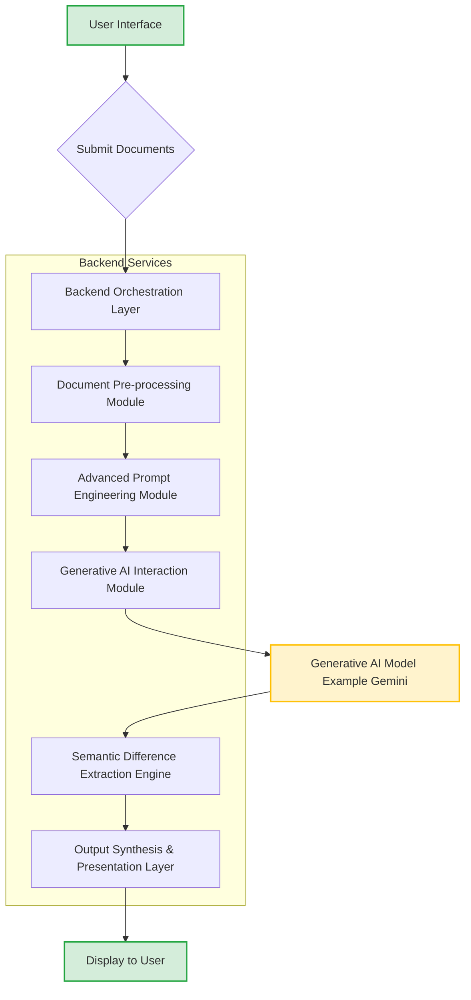
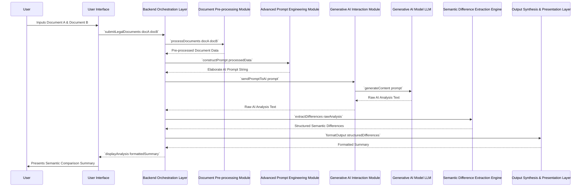
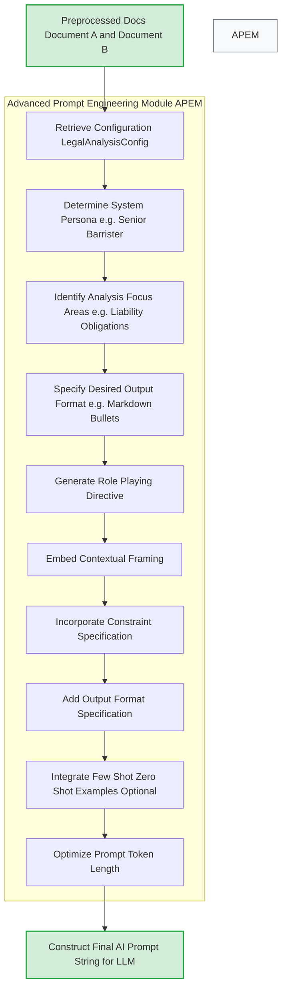
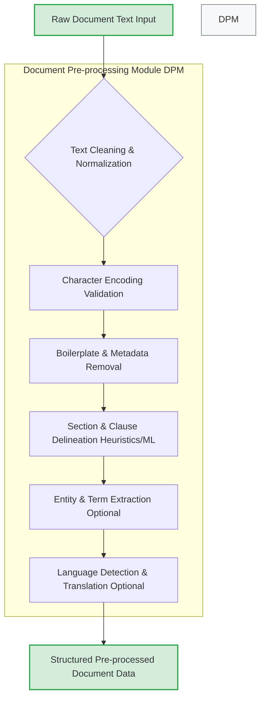
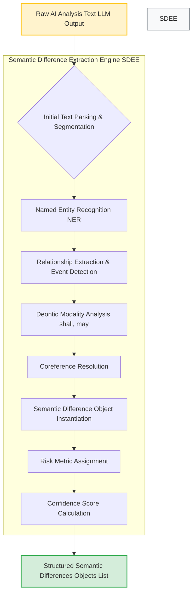
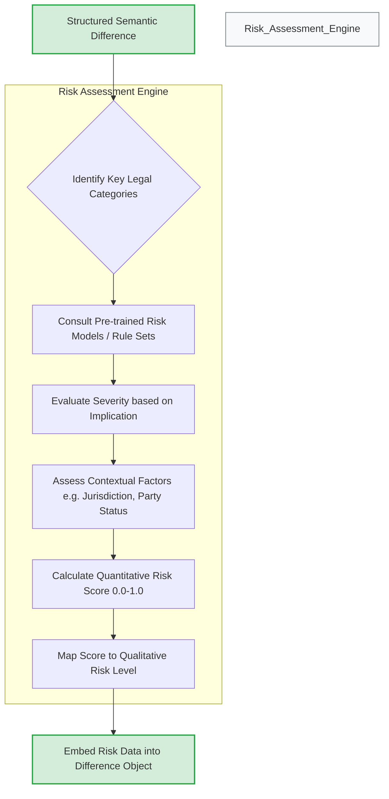
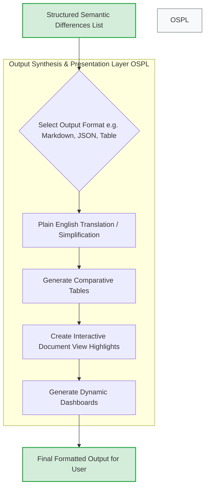
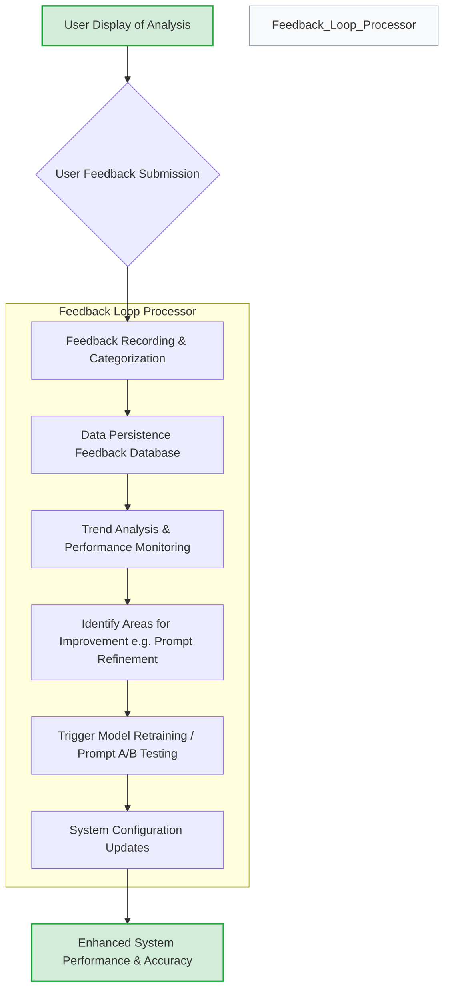
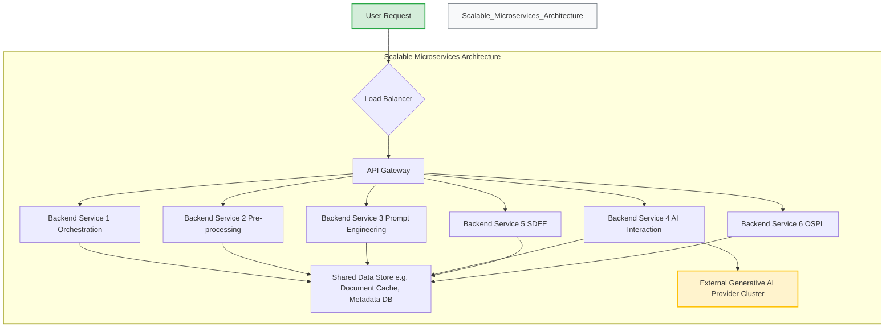
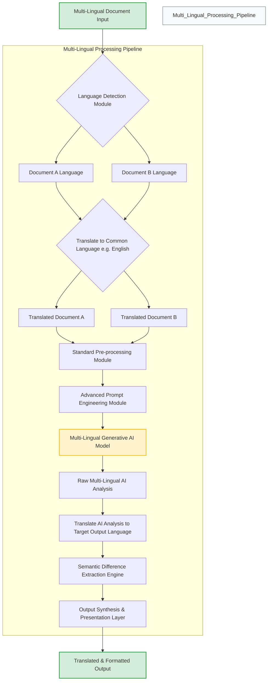

**Title of Invention:** A System and Method for Semantic Comparison and Analysis of Legal Documents

**Abstract:**
A profoundly innovative system for the deep semantic analysis and comparative exegesis of legal documents is herein disclosed. This system systematically receives two distinct textual instantiations of legal instruments, such as antecedent and subsequent versions of a contractual agreement. It then dispatches both documents to an advanced generative artificial intelligence model, synergistically integrated with a meticulously crafted instructional prompt. This prompt mandates the AI model to transcend mere superficial lexical discrepancies, compelling it to perform a rigorous semantic comparison to discern fundamental material divergences in legal meaning, their latent jurisprudential implications, and potential ramifications. The system subsequently synthesizes and renders a lucid, concisely articulated summary of these identified legal disparities, presented in accessible, non-esoteric English, thereby empowering even individuals lacking specialized legal expertise to rapidly apprehend the substantive changes between document iterations with unparalleled clarity and precision. This invention establishes a new benchmark for automated legal document analysis, further incorporating features such as multi-lingual comparison capabilities, dynamic risk assessment, and continuous improvement through a robust feedback loop, ensuring its adaptability and enduring relevance within the evolving legal technology landscape.

**Background of the Invention:**
The rigorous comparison of disparate versions of legal instruments, particularly contractual agreements, constitutes an unequivocally critical yet prohibitively arduous and labor-intensive undertaking within the legal domain. Conventional textual differential analysis tools, commonly referred to as "diff" utilities, are fundamentally restricted to identifying and delineating only superficial, character-level, or word-level textual variances. Such rudimentary tools are inherently incapable of performing interpretative analysis regarding the profound legal meaning or the intrinsic jurisprudential significance of identified textual alterations. A seemingly innocuous linguistic modification, a subtle syntactical rearrangement, or an apparently minor semantic shift can precipitate cascading, monumental legal ramifications that remain entirely opaque and indiscernible to a layperson, and often, even to seasoned legal professionals without extensive, dedicated scrutiny. The traditional paradigm of legal document review, reliant heavily upon human expert cognition, is consequently characterized by exorbitant costs, protracted timelines, and an inherent susceptibility to human error and cognitive fatigue. Ergo, there exists an acute, imperative demand for an advanced computational apparatus capable of autonomously executing the preliminary analytical phase, meticulously accentuating the most pivotal and material legal divergences in a form that is both comprehensible and actionable, thereby ushering in an era of unprecedented efficiency and accuracy in legal practice, extending its utility to a global, multi-lingual context and integrating dynamic risk assessment for enhanced decision support.

**Brief Summary of the Invention:**
The present invention definitively articulates and actualizes a revolutionary paradigm for legal document comparison. It furnishes an intuitive, highly sophisticated user interface enabling an operator to input the complete textual content of a foundational document, designated herein as "Document A," and a comparative document, designated as "Document B." Upon reception of these textual corpora, the system proceeds to meticulously construct a singular, holistic, and semantically optimized prompt tailored for invocation of a large language model LLM of advanced generative capacity. This prompt is ingeniously engineered to encapsulate the entirety of both documents' textual content. Furthermore, the prompt integrates explicit directives instructing the artificial intelligence to assume the epistemic role of a preeminent legal analyst, to perform a rigorous comparative exegesis between the two documents, and to subsequently synthesize an exhaustive summary enumerating all material legal differences. The AI is specifically commanded to transcend superficial textual variations, to meticulously identify fundamental shifts in stipulated obligations, potential liabilities, temporal stipulations, financial terms, and other pivotal legal constructs. Crucially, the AI is further tasked with elucidating the latent and patent implications of these identified changes, often augmented with risk scores and confidence levels. The resultant synthesized analytical summary is then dynamically presented to the user through a clear, structured display, providing instant, actionable insights. This architectural construct establishes a definitive ownership over the entire conceptual framework and its implementation, including provisions for multi-language support, continuous self-improvement, and robust security measures.

**Figures:**

The following figures illustrate the architecture and operational flow of the system. These conceptual diagrams are integral to understanding the robust and innovative nature of this invention.


**Figure 1: System Architecture for Semantic Legal Document Comparison**

This flowchart delineates the high-level operational architecture. The User Interface (A) initiates the process by submitting documents (B) to the Backend Orchestration Layer (C). Documents undergo pre-processing (D) and sophisticated prompt engineering (E) before interaction with the Generative AI Model (G) via the Interaction Module (F). The AI's output is then processed by the Semantic Difference Extraction Engine (H) and formatted for presentation (I), finally displayed to the user (J).


**Figure 2: Sequence Diagram of Legal Document Comparison Process**

This sequence diagram illustrates the chronological flow of interactions between the user, the user interface, and the various backend components, culminating in the presentation of the semantic comparison summary. Each arrow represents a distinct communication or data transfer event, emphasizing the sequential and collaborative nature of the inventive process.


**Figure 3: Advanced Prompt Engineering Workflow**

This flowchart details the internal workings of the Advanced Prompt Engineering Module. It begins with the preprocessed documents and configuration retrieval, then sequentially constructs the prompt by integrating various directives such as system persona, focus areas, and output format. Key steps include generating role-playing instructions, embedding contextual framing, specifying constraints, and optimizing token length, culminating in the final, comprehensive AI prompt string ready for transmission to the Generative AI Model.


**Figure 4: Detailed Document Pre-processing Pipeline**

This diagram expands on the Document Pre-processing Module (DPM), illustrating its internal workflow. It takes raw text (A), performs cleaning and normalization (B), validates encoding (C), removes boilerplate (D), delineates sections (E), extracts key entities/terms (F), and optionally performs language detection and translation (G) before outputting structured pre-processed data (H).


**Figure 5: Semantic Difference Extraction & Structuring Workflow**

This figure details the Semantic Difference Extraction Engine (SDEE). It processes the raw AI analysis (A) through parsing (B), NER (C), relationship extraction (D), deontic modality analysis (E), and coreference resolution (F). These linguistic insights are then used to instantiate Semantic Difference objects (G), assign risk metrics (H), calculate confidence scores (I), and produce a structured list of differences (J).


**Figure 6: Risk Assessment Engine Workflow**

This flowchart illustrates the internal operations of the Risk Assessment Engine. It takes a structured semantic difference (A), identifies its legal categories (B), consults risk models (C), evaluates severity (D), assesses contextual factors (E), calculates a quantitative risk score (F), maps it to a qualitative level (G), and embeds this data back into the difference object (H).


**Figure 7: Output Synthesis and Presentation Options**

This figure expands on the Output Synthesis & Presentation Layer (OSPL), showing how structured differences (A) are transformed. It allows for selection of various output formats (B), includes plain English translation (C), generates comparative tables (D), creates interactive document views with highlights (E), and can generate dynamic dashboards (F) before presenting the final output (G).


**Figure 8: Continuous Improvement via Feedback Loop**

This diagram illustrates the Feedback Loop Processor. After viewing the analysis (A), users can submit feedback (B), which is recorded (C) and persisted (D). This data is then used for trend analysis (E), identifying improvement areas (F), triggering system updates (G), leading to configuration adjustments (H), and ultimately enhancing system performance (I).


**Figure 9: Scalable Microservices Architecture**

This figure presents a scalable microservices architecture. User requests (A) are routed by a Load Balancer (B) and API Gateway (C) to various independent backend services (D1-D6). These services interact with a shared data store (E) and the Generative AI Provider (F), ensuring high availability and horizontal scalability.


**Figure 10: Multi-Lingual Document Comparison Workflow**

This figure details the multi-lingual comparison workflow. Multi-lingual documents (A) first undergo language detection (B). If different or not in a common processing language, they are translated (D) into a common internal language (E, F). These translated documents then follow the standard pipeline (G, H), potentially utilizing a multi-lingual LLM (I). The raw AI analysis (J) is then translated back (K) to the user's desired output language before extraction (L) and presentation (M, N).

**Detailed Description of the Invention:**
The present invention meticulously defines a robust, multi-tiered system for the profound semantic comparison of legal documentation, thereby transcending the inherent limitations of lexical-only differentiation methods. This detailed description not only reiterates the core functionality but also elaborates upon advanced features, architectural considerations, and the intricate interactions between components that cement its innovative standing.

**I. System Components and Architecture:**

1.  **User Interface UI Module:**
    *   **Functionality:** Provides an intuitive, secure, and responsive graphical interface for the end-user. This module is responsible for the secure ingestion of input legal documents, handling diverse file types (e.g., PDF, DOCX, TXT) via OCR or direct text extraction, and presenting the resultant analytical summary.
    *   **Implementation:** Developed using modern web frameworks (e.g., React, Angular, Vue.js) for broad accessibility and maintainability. Features include drag-and-drop document upload, version selection, interactive text editing areas for Document A and Document B, a configuration panel for analysis parameters (e.g., specificity, output format, legal domain focus), and a dynamic display area for the comparison summary. Advanced features include side-by-side document views with highlighted differences and interactive drill-down capabilities.
    *   **Data Handling:** Encrypts and securely transmits the raw textual content of Document A and Document B, along with user-defined parameters, to the Backend Orchestration Layer (BOL) via authenticated API calls (e.g., using OAuth2 or API keys).

2.  **Backend Orchestration Layer BOL:**
    *   **Functionality:** Serves as the central coordinating nexus for all backend operations, managing the entire workflow, data flow, and inter-module communication. It acts as the primary, secure API endpoint for the UI and other integrated systems (e.g., DMS, CLM platforms).
    *   **Implementation:** Implemented as a high-performance, scalable microservice (or a set of microservices in a distributed architecture, as depicted in Figure 9), leveraging cloud-native technologies (e.g., Kubernetes, serverless functions). Employs asynchronous processing and message queues (e.g., Kafka, RabbitMQ) to ensure responsiveness and robust handling of concurrent requests. It manages session state, tracks comparison jobs, and provides granular logging for auditing and debugging.
    *   **Key Responsibilities:** Request authentication and validation, intelligent sequencing of processing steps, comprehensive error handling with circuit breakers and retries, aggregation of results from subordinate modules, and persistent storage of comparison results and metadata.

3.  **Document Pre-processing Module DPM:**
    *   **Functionality:** Prepares the raw textual input for optimal consumption by downstream modules, particularly the Advanced Prompt Engineering Module. This involves a multi-stage pipeline of normalizing textual data, removing extraneous artifacts, and intelligently identifying document structure. This module also integrates multi-lingual capabilities.
    *   **Implementation:** Incorporates advanced Natural Language Processing (NLP) techniques and robust text engineering, as detailed in Figure 4:
        *   **Text Cleaning and Normalization:** Removal of non-essential whitespace, special characters, headers/footers, page numbers, boilerplate text (e.g., standard legal disclaimers, signatures that don't vary meaningfully). Utilizes tokenization and lemmatization.
        *   **Encoding & Format Normalization:** Ensures consistent character encoding (e.g., UTF-8) and converts diverse input formats (PDF, DOCX) into clean plain text via OCR or parsing libraries.
        *   **Section & Clause Delineation:** Employs rule-based heuristics (e.g., regex patterns for "Article X", "Section Y"), machine learning models (e.g., BERT-based classifiers) for identifying logical sections (e.g., "Preamble," "Definitions," "Covenants," "Term and Termination," "Indemnification") and individual clauses within the legal documents. This provides fine-grained contextual information.
        *   **Named Entity & Term Extraction:** Identifies and annotates legal entities (e.g., Party A, Party B, specific dates, monetary values, legal precedents) and key legal terms, which can be utilized for more precise prompt construction or post-processing.
        *   **Language Detection & Translation:** Automatically detects the language of each document using pre-trained models. If documents are in different languages or the user requests an output language different from the source, an integrated machine translation service (e.g., Google Translate API, DeepL API) is invoked to translate documents into a common processing language (typically English) and subsequently translate the AI's analysis back to the desired output language (as shown in Figure 10).

4.  **Advanced Prompt Engineering Module APEM:**
    *   **Functionality:** The intellectual core of the system's interaction with the generative AI. This module dynamically constructs the comprehensive, contextually rich, and highly optimized prompt that guides the AI's analytical process, ensuring precision, relevance, and adherence to desired output formats.
    *   **Implementation:** Employs sophisticated, configurable algorithms for prompt construction, drawing upon the pre-processed document data and user preferences (as detailed in Figure 3):
        *   **Role-Playing Directive:** Clearly instructs the AI to adopt a specific, authoritative persona, e.g., "an expert legal analyst specializing in contract law," "a senior barrister with 20 years of M&A experience," or "a compliance officer." This significantly influences the AI's tone, focus, and depth of analysis.
        *   **Contextual Framing:** Establishes the precise purpose and scope of the comparison (e.g., "identify material differences," "focus on potential litigation risks," "analyze changes in intellectual property rights," "assess compliance impact").
        *   **Constraint Specification:** Directs the AI to prioritize or exclusively focus on specific legal domains, clause types, or concepts (e.g., "liability clauses," "obligations of the grantor," "financial penalties," "force majeure," "arbitration agreements"). This reduces irrelevant output and improves focus.
        *   **Output Format Specification:** Instructs the AI on the desired structured output format (e.g., "a bulleted list in markdown," "structured JSON array of differences," "a comparative table," "plain English summary," "XML report"). This is critical for subsequent machine-readable parsing by the SDEE.
        *   **Few-Shot/Zero-Shot Learning Integration:** Dynamically injects carefully curated examples of desired analytical patterns, output structures, or specific legal interpretations (few-shot learning) to guide the LLM when beneficial. For novel or highly specialized tasks, it leverages the LLM's inherent zero-shot capabilities.
        *   **Token Optimization and Management:** Strategically manages prompt length to adhere to LLM context window limits while preserving maximum informational density. This involves intelligent summarization of less critical sections or the use of retrieval-augmented generation (RAG) to dynamically fetch relevant context segments during the comparison.

5.  **Generative AI Interaction Module GAIIM:**
    *   **Functionality:** Acts as the secure, resilient, and efficient conduit between the Backend Orchestration Layer and the selected Generative AI Model(s). It abstracts away the complexities of interacting with diverse AI providers.
    *   **Implementation:**
        *   **Multi-Model API Client:** Manages API keys, authentication tokens, and request/response serialization (e.g., JSON) for various generative AI models (e.g., Google's Gemini series, OpenAI's GPT series, Anthropic's Claude, open-source models like Llama 3). Supports dynamic model selection based on configured criteria (e.g., performance benchmarks, cost, specific task suitability, latency requirements).
        *   **Rate Limiting & Retry Logic:** Implements robust mechanisms to handle API rate limits, back-off strategies, and transient network/service errors, ensuring system resilience and preventing service interruptions. Uses exponential back-off and jitter.
        *   **Security & Data Privacy:** Ensures that data transmitted to and from AI models adheres to strict data privacy policies, utilizing encryption in transit and at rest, and respecting data residency requirements. May implement anonymization strategies for highly sensitive documents.
        *   **Cost Monitoring & Optimization:** Tracks token usage and API costs, potentially routing requests to the most cost-effective model for a given task complexity.

6.  **Generative AI Model LLM:**
    *   **Functionality:** The core computational engine for semantic comparison. This model, typically a large language model based on transformer architecture, performs the high-dimensional pattern recognition, semantic inference, and natural language generation.
    *   **Operational Principle:** Given the highly structured and directive prompt along with the legal documents, the LLM processes billions (or trillions) of parameters. It leverages its vast training corpus, which includes extensive legal texts, statutes, case law, and contracts, to:
        *   Understand the nuanced meaning and intent of each document (`Psi(D)`).
        *   Identify points of divergence at a conceptual and legal implication level, rather than just lexical changes.
        *   Infer their potential legal significance, risks, and ramifications based on its implicit knowledge graph of legal principles.
        *   Synthesize a coherent, structured response as specified by the prompt. It effectively approximates the `L(D)` function and performs the `Delta_legal` computation, translating abstract legal reasoning into human-readable text.

7.  **Semantic Difference Extraction Engine SDEE:**
    *   **Functionality:** Post-processes the raw textual output from the Generative AI Model, extracting, structuring, and refining the identified legal differences into a machine-readable, granular, and further processable format. This module is critical for transforming raw AI text into actionable data.
    *   **Implementation:** Utilizes advanced NLP and machine learning techniques, as depicted in Figure 5:
        *   **Robust Output Parsing:** Employs sophisticated parsing logic (e.g., state machines, advanced regex, custom grammar parsers) specifically tuned to the expected structured output format dictated by the prompt, handling variations and unexpected AI responses gracefully.
        *   **Named Entity Recognition (NER) for Legal Context:** Identifies and categorizes legal entities (e.g., parties, dates, financial amounts, specific clauses, jurisdictions, governing laws) from the AI's descriptive text.
        *   **Relationship & Event Extraction:** Deduces relationships between identified entities and concepts (e.g., "Party A *owes* Party B," "Clause X *modifies* Clause Y," "This change *triggers* event Z").
        *   **Deontic Modality Analysis:** Explicitly identifies and categorizes changes in obligations (e.g., "shall" to "may"), permissions, or prohibitions based on modal verbs and their semantic scope.
        *   **Sentiment & Risk Analysis (Contextual):** Assesses the legal "tone," potential severity, and intrinsic risk associated with each identified change, often in conjunction with the Risk Assessment Engine.
        *   **Structured Data Conversion:** Transforms free-form AI text into highly structured data formats such as JSON, XML, or custom Python data objects (e.g., `SemanticDifference`), enabling programmatic manipulation, storage, and dynamic visualization.
        *   **Confidence Scoring:** If supported by the LLM or an additional model, assigns a confidence score to each identified difference, indicating the system's certainty.

8.  **Output Synthesis & Presentation Layer OSPL:**
    *   **Functionality:** Transforms the structured legal differences into a user-friendly, comprehensible, and visually organized summary suitable for dynamic display to the end-user. It prioritizes clarity, conciseness, and actionable insights.
    *   **Implementation:** Features multiple rendering capabilities, as shown in Figure 7:
        *   **Advanced Summarization Algorithms:** May employ further extractive or abstractive summarization techniques to distill the structured AI output, focusing on user-specific preferences for detail and length.
        *   **Multi-Format Visualization Components:** Renders the summary in various customizable formats:
            *   **Bulleted Lists:** As a primary, easily digestible overview.
            *   **Comparative Tables:** For side-by-side comparison of specific clauses or parameters.
            *   **Interactive Document Views:** Where identified changes are highlighted directly within the original document texts (using text-to-coordinate mapping or semantic highlighting).
            *   **Dynamic Dashboards:** For a high-level overview of risk profiles, change categories, and overall document comparison metrics.
        *   **Plain English Translator & Lexicon:** Ensures that complex legal jargon, if present in the AI's raw output or the extracted differences, is translated into unambiguous, accessible language tailored to the user's specified plain language level (e.g., "beginner," "intermediate," "expert"). This leverages a curated legal glossary and semantic simplification rules.
        *   **Customizable Reporting:** Allows users to generate shareable reports in various formats (e.g., PDF, DOCX) based on the synthesized output.

**II. Operational Workflow:**

1.  **Document Ingestion:** The user provides Document A and Document B (e.g., by upload, URL, or direct text input) via the UI, optionally specifying output preferences and legal domain focus.
2.  **Backend Initiation:** The BOL receives the documents and user parameters, authenticates the request, and initiates the multi-stage comparison workflow, assigning a unique comparison ID for tracking.
3.  **Pre-processing:** The DPM cleans, normalizes, optionally structures (sectioning), extracts metadata, and performs language detection/translation on the document texts, preparing them for AI consumption.
4.  **Prompt Construction:** The APEM dynamically generates a highly specific, contextualized, and optimized prompt, embedding the cleaned/translated documents and meticulously instructing the AI on its analytical task, desired persona, focus areas, and required output format.
5.  **AI Invocation:** The GAIIM securely transmits the constructed prompt to the selected Generative AI Model, managing API interactions, rate limits, and retries.
6.  **AI Analysis:** The Generative AI Model processes the prompt and documents, performing a deep semantic comparison, inferring legal implications, and generating a raw text analysis output adhering to the prompt's structural directives.
7.  **Difference Extraction:** The SDEE receives the AI's raw analysis, robustly parses it, and extracts structured semantic differences, categorizing them by type (e.g., change in obligation, change in liability, new clause, removed clause), identifying entities, and assessing initial severity.
8.  **Risk Assessment:** The Risk Assessment Engine, if enabled, takes the structured differences and calculates quantitative risk scores and assigns qualitative risk levels to each identified change, enriching the `SemanticDifference` objects.
9.  **Output Formatting:** The OSPL transforms the enriched, structured differences into a human-readable and visually compelling summary, employing plain English explanations, appropriate formatting (e.g., markdown, tables), and potentially interactive visualizations, translating to the target output language if necessary.
10. **User Presentation:** The formatted summary is returned to the UI and dynamically displayed to the user, offering immediate, actionable, and comprehensive insight into the legal ramifications of the document changes.

**III. Embodiments and Further Features:**

*   **Integrated Development Environment (IDE) for Legal Professionals:** The system can be seamlessly integrated as a plugin, module, or widget within existing legal software suites, document management systems (DMS), contract lifecycle management (CLM) platforms, or e-discovery tools. This allows lawyers to initiate comparisons directly from their existing workflows.
*   **Version Control Integration:** Direct integration with specialized legal document version control systems (akin to Git for code) to automatically trigger comparisons upon new version commits, providing continuous monitoring of contractual changes. Webhooks can be used to automate this.
*   **Multi-Lingual Support (Figure 10):** As detailed in the DPM, the system is engineered to handle and compare legal documents in multiple natural languages. It can translate source documents to a common processing language, utilize multi-lingual LLMs, and translate the analytical output back to the user's preferred display language, enabling global legal practice.
*   **Domain-Specific Tuning & Customization:** Capability to fine-tune the Generative AI Model (e.g., via LoRA) or specialize prompt engineering for particular legal domains (e.g., corporate law, real estate, intellectual property, litigation, regulatory compliance). Users can define custom focus areas and personas.
*   **Risk Scoring and Visualization (Figure 6):** Assignment of quantitative risk scores (0.0 to 1.0) and qualitative risk levels (e.g., "Critical Impact," "High Impact," "Moderate Impact") to identified changes. These are visually represented through heat maps, interactive dashboards, or color-coded indicators to prioritize review and decision-making.
*   **Interactive Drill-Down & Semantic Highlighting:** The ability for users to click on a summarized difference and instantly view the corresponding sections in Document A and Document B side-by-side, with the relevant textual alterations semantically highlighted. This provides immediate context and verification.
*   **Feedback Mechanism (Figure 8) and Continuous Improvement:** Implementation of a robust user feedback loop (e.g., rating system, free-text comments) to collect explicit feedback on the AI's analysis. This feedback is aggregated, analyzed for trends, and systematically used to improve prompt engineering strategies, retrain fine-tuned models, refine post-processing algorithms, and update system configurations, ensuring perpetual accuracy enhancement.
*   **Audit Trail and Explainability:** Maintains a comprehensive audit trail of all comparisons, inputs, outputs, and AI parameters used. For explainability, the system can, upon request, provide reasoning chains or confidence scores for specific identified differences, enhancing trust and transparency.
*   **Security and Compliance:** Adheres to stringent data security protocols (e.g., SOC 2, ISO 27001), including end-to-end encryption, access controls, data anonymization techniques, and compliance with relevant legal data privacy regulations (e.g., GDPR, CCPA).
*   **Scalability (Figure 9):** Designed with a microservices architecture to ensure high availability, fault tolerance, and horizontal scalability, capable of handling a massive volume of concurrent document comparisons without degradation in performance.

**Conceptual Code (Python Backend):**
This conceptual code demonstrates the core logic, reflecting the architectural principles and intellectual constructs defining the system. Each module is designed to be highly extensible and robust.

```python
from google.generativeai import GenerativeModel
from enum import Enum
from typing import List, Dict, Any, Optional, Tuple
import hashlib
import datetime
import re
import json # For JSON structured output and parsing
import logging

# Configure logging for better visibility
logging.basicConfig(level=logging.INFO, format='%(asctime)s - %(levelname)s - %(message)s')
logger = logging.getLogger(__name__)

# --- Configuration and Utility Classes ---

class LegalAnalysisConfig:
    """
    Encapsulates configuration parameters for the legal analysis system.
    This class is integral to system adaptability and robustness.
    """
    def __init__(self,
                 ai_model_name: str = 'gemini-2.5-flash',
                 system_persona: str = "expert legal analyst and senior barrister specializing in contract law",
                 focus_areas: List[str] = None,
                 output_format_instructions: str = "plain English bulleted list, clearly indicating category, description, implications, and severity. Use markdown for formatting.",
                 temperature: float = 0.2,
                 max_tokens: int = 4000,
                 risk_scoring_enabled: bool = True,
                 plain_language_level: str = "intermediate", # e.g., "beginner", "intermediate", "expert"
                 return_excerpts: bool = True,
                 enable_multi_lingual: bool = False,
                 target_output_language: str = "en", # ISO 639-1 code
                 document_segmentation_strategy: str = "auto", # "auto", "by_section", "full_document"
                 confidence_scoring_enabled: bool = False):
        self.ai_model_name = ai_model_name
        self.system_persona = system_persona
        self.focus_areas = focus_areas if focus_areas is not None else [
            "liability", "obligations", "financial terms", "indemnification",
            "dispute resolution", "term and termination clauses", "representations and warranties",
            "governing law", "confidentiality", "intellectual property", "force majeure", "warranties",
            "jurisdiction", "assignment", "breach and remedies"
        ]
        self.output_format_instructions = output_format_instructions
        self.temperature = temperature
        self.max_tokens = max_tokens
        self.risk_scoring_enabled = risk_scoring_enabled
        self.plain_language_level = plain_language_level
        self.return_excerpts = return_excerpts
        self.enable_multi_lingual = enable_multi_lingual
        self.target_output_language = target_output_language
        self.document_segmentation_strategy = document_segmentation_strategy
        self.confidence_scoring_enabled = confidence_scoring_enabled

class AnalysisOutputFormat(Enum):
    """
    Defines the structured output formats supported for the semantic analysis.
    This ensures standardized data interchange and presentation flexibility.
    """
    PLAIN_TEXT = "plain_text"
    MARKDOWN_BULLETS = "markdown_bullets"
    JSON_STRUCTURED = "json_structured"
    XML_STRUCTURED = "xml_structured" # Conceptual, not implemented in formatter example
    COMPARATIVE_TABLE = "comparative_table" # Conceptual, not implemented in formatter example

class DocumentMetadata:
    """
    Metadata container for legal documents, facilitating version control, integrity checks,
    and better organization within larger legal systems.
    """
    def __init__(self,
                 document_id: str,
                 title: str,
                 version: str,
                 author: Optional[str] = None,
                 hash_value: Optional[str] = None,
                 timestamp: Optional[str] = None,
                 language: Optional[str] = "en"):
        self.document_id = document_id
        self.title = title
        self.version = version
        self.author = author
        self.hash_value = hash_value
        self.timestamp = timestamp if timestamp else datetime.datetime.now(datetime.timezone.utc).isoformat()
        self.language = language

    @staticmethod
    def generate_hash(content: str) -> str:
        """Generates a SHA256 hash for document content to ensure integrity."""
        return hashlib.sha256(content.encode('utf-8')).hexdigest()

    def to_dict(self) -> Dict[str, Any]:
        """Converts the document metadata to a dictionary."""
        return {
            "document_id": self.document_id,
            "title": self.title,
            "version": self.version,
            "author": self.author,
            "hash_value": self.hash_value,
            "timestamp": self.timestamp,
            "language": self.language
        }

class SemanticDifference:
    """
    A foundational data structure representing a single semantic difference identified
    between legal documents. This object facilitates structured output and downstream processing.
    """
    def __init__(self,
                 category: str,
                 description: str,
                 implications: str,
                 doc_a_excerpt: Optional[str] = None,
                 doc_b_excerpt: Optional[str] = None,
                 severity: Optional[str] = None, # e.g., "High", "Medium", "Low", "Critical"
                 risk_score: Optional[float] = None, # Quantitative score, e.g., 0.0 to 1.0
                 risk_level: Optional[str] = None, # Qualitative level, e.g., "Critical Impact"
                 confidence_score: Optional[float] = None, # AI's confidence in this specific finding, 0.0 to 1.0
                 proposed_action: Optional[str] = None): # e.g., "Requires Review", "Acceptable", "Negotiate"
        self.category = category
        self.description = description
        self.implications = implications
        self.doc_a_excerpt = doc_a_excerpt
        self.doc_b_excerpt = doc_b_excerpt
        self.severity = severity
        self.risk_score = risk_score
        self.risk_level = risk_level
        self.confidence_score = confidence_score
        self.proposed_action = proposed_action

    def to_dict(self) -> Dict[str, Any]:
        """Converts the semantic difference to a dictionary for JSON serialization."""
        return {
            "category": self.category,
            "description": self.description,
            "implications": self.implications,
            "doc_a_excerpt": self.doc_a_excerpt,
            "doc_b_excerpt": self.doc_b_excerpt,
            "severity": self.severity,
            "risk_score": self.risk_score,
            "risk_level": self.risk_level,
            "confidence_score": self.confidence_score,
            "proposed_action": self.proposed_action
        }

# --- Core System Modules (exported components) ---

class LegalDocumentProcessor:
    """
    Responsible for pre-processing legal document texts.
    This module enhances the quality and consistency of input for the LLM.
    """
    @staticmethod
    def clean_text(text: str) -> str:
        """
        Performs basic text cleaning: removes excessive whitespace, normalizes line endings,
        removes common boilerplate.
        """
        if not isinstance(text, str):
            raise TypeError("Input 'text' must be a string.")
        text = text.strip()
        text = re.sub(r'[\r\n]+', '\n', text) # Normalize line endings
        text = re.sub(r'[ \t]+', ' ', text) # Normalize multiple spaces/tabs
        
        # Conceptual: Remove common legal boilerplate (e.g., signature blocks, page numbers)
        # This would be a more sophisticated rule-based or ML-based system.
        boilerplate_patterns = [
            r"EXECUTED this \d{1,2} day of \w+, \d{4}\.",
            r"IN WITNESS WHEREOF, the parties have executed this Agreement",
            r"Page \d+ of \d+",
            r"SIGNED SEALED AND DELIVERED",
            r"\s*\[Signature Page Follows\]\s*",
            r"\s*\[End of Agreement\]\s*",
            r"Dated as of [A-Za-z]+ \d{1,2}, \d{4}"
        ]
        for pattern in boilerplate_patterns:
            text = re.sub(pattern, '', text, flags=re.IGNORECASE | re.DOTALL)
        
        return text.strip()

    @staticmethod
    def identify_sections(text: str, strategy: str = "auto") -> Dict[str, str]:
        """
        Identifies logical sections within a legal document using various strategies.
        This provides granular context for the LLM.
        """
        sections = {}
        if strategy == "full_document":
            sections["full_document_body"] = text
        elif strategy == "by_section":
            # Advanced implementation: uses regex patterns or ML models to find headings
            # and segment text accordingly. This is a conceptual example.
            section_pattern = r"(?P<section_header>(?:ARTICLE|SECTION)\s+\w+\.?\s+[^\n]+)\n(?P<section_content>.*?)(?=(?:ARTICLE|SECTION)\s+\w+\.?\s+[^\n]+|\Z)"
            matches = re.finditer(section_pattern, text, re.DOTALL | re.IGNORECASE)
            
            last_end = 0
            for i, match in enumerate(matches):
                header = match.group("section_header").strip()
                content = match.group("section_content").strip()
                sections[f"section_{i+1}_{header}"] = content
                last_end = match.end()

            if not sections: # Fallback if no sections identified
                sections["full_document_body"] = text
            elif last_end < len(text): # Capture any trailing text
                sections["trailer"] = text[last_end:].strip()
        else: # "auto" or unrecognized strategy, default to full
            sections["full_document_body"] = text
        
        return sections

    @staticmethod
    def extract_document_metadata(text: str, doc_id: str, doc_version: str, doc_title: Optional[str] = None, detected_language: Optional[str] = "en") -> DocumentMetadata:
        """
        Extracts key metadata from the document text.
        A more advanced implementation would parse title, version, author from document content.
        """
        title = doc_title if doc_title else f"Legal Document {doc_id}"
        
        # Conceptual extraction of creation date from text
        date_match = re.search(r"(?:Dated|Effective) as of (\w+ \d{1,2}, \d{4})", text, re.IGNORECASE)
        doc_timestamp = date_match.group(1) if date_match else datetime.datetime.now(datetime.timezone.utc).isoformat()

        return DocumentMetadata(
            document_id=doc_id,
            title=title,
            version=doc_version,
            hash_value=DocumentMetadata.generate_hash(text),
            timestamp=doc_timestamp,
            language=detected_language
        )

    @staticmethod
    def detect_language(text: str) -> str:
        """
        Conceptual: Detects the language of the input text.
        A real implementation would use a library like `langdetect` or a cloud NLP service.
        """
        # Placeholder for actual language detection
        # For this example, we assume English by default or simple heuristic
        if "shall" in text.lower() and "hereto" in text.lower():
            return "en"
        elif "contrato" in text.lower() or "acuerdo" in text.lower():
            return "es"
        elif "accord" in text.lower() or "contrat" in text.lower():
            return "fr"
        return "en" # Default fallback

    @staticmethod
    async def translate_text(text: str, target_language: str, source_language: Optional[str] = None) -> str:
        """
        Conceptual: Translates text to a target language.
        A real implementation would use a robust translation API (e.g., Google Translate, DeepL).
        """
        logger.info(f"Conceptual translation from {source_language or 'auto'} to {target_language} for text snippet...")
        if source_language == target_language:
            return text
        # Simulate translation - in a real system, this would be an API call
        if target_language == "es":
            return f"[Translated to Spanish]: {text}"
        elif target_language == "fr":
            return f"[Translated to French]: {text}"
        return text # No actual translation for other languages in conceptual code

class PromptBuilder:
    """
    Dynamically constructs the sophisticated prompt for the Generative AI Model.
    This class is the embodiment of advanced prompt engineering.
    """
    def __init__(self, config: LegalAnalysisConfig):
        self.config = config

    def build_comparison_prompt(self, doc_a_cleaned: str, doc_b_cleaned: str) -> str:
        """
        Constructs a comprehensive and directive prompt for the AI model.
        This prompt instructs the AI to perform a deep semantic comparison.
        """
        focus_areas_str = ", ".join(self.config.focus_areas)

        # The prompt is meticulously crafted to guide the AI's reasoning path.
        prompt = f"""
        You are an exceptionally astute and highly experienced {self.config.system_persona}.
        Your critical mission is to perform a forensic, semantic comparison between two versions of a legal document.
        Your analysis must transcend superficial lexical variations and delve into the fundamental legal meaning,
        potential risks, and practical implications of all material differences.

        Specifically, meticulously analyze changes related to: {focus_areas_str}.
        For each identified material difference, you must articulate:
        1.  A concise description of the change, clearly indicating what was altered from Document A to Document B.
        2.  Its precise legal meaning and significance, explaining why this change is legally important.
        3.  The potential real-world implications or consequences for the parties involved (e.g., increased liability, reduced rights).
        {"4.  Where appropriate, provide brief, direct textual excerpts from Document A and Document B (max 2-3 sentences each) that directly illustrate the change context. Clearly label 'Document A Excerpt:' and 'Document B Excerpt:'" if self.config.return_excerpts else ""}
        5.  Assign a qualitative severity (e.g., "Critical", "High", "Medium", "Low") to the change based on its potential legal and business impact.

        Present your findings in a clear, structured, and easily digestible {self.config.output_format_instructions},
        ensuring all explanations are provided in unambiguous, plain English suitable for a {self.config.plain_language_level} legal understanding, devoid of unnecessary legalistic jargon.
        Your objective is to provide actionable intelligence to a stakeholder who may not possess deep legal expertise.
        If no material differences are found, state "No material differences identified."

        --- DOCUMENT A Original Version ---
        {doc_a_cleaned}

        --- DOCUMENT B Revised Version ---
        {doc_b_cleaned}

        --- ANALYTICAL FINDINGS ---
        """
        return prompt

class RiskAssessmentEngine:
    """
    Quantifies and categorizes the risk associated with identified legal differences.
    This module could use rule-based systems or an additional ML model.
    """
    def __init__(self, config: LegalAnalysisConfig):
        self.config = config
        # A more advanced system might load a sophisticated risk model here
        self._category_risk_weights = {
            "Liability Shift": 0.95, "Obligation Change": 0.8, "Financial Term": 0.9,
            "Indemnification": 0.98, "Dispute Resolution": 0.75, "Term and Termination": 0.9,
            "Representations and Warranties": 0.85, "Governing Law": 0.99,
            "Confidentiality": 0.6, "Intellectual Property": 0.92, "Force Majeure": 0.7,
            "Assignment": 0.7, "Breach and Remedies": 0.95,
            "General Semantic Analysis": 0.4 # Fallback
        }
        self._severity_to_score_mapping = {
            "Critical": 0.95, "High": 0.8, "Medium": 0.5, "Low": 0.2
        }

    def assign_risk_score(self, semantic_difference: SemanticDifference) -> Tuple[float, str]:
        """
        Assigns a numerical risk score (e.g., 0.0 to 1.0) based on category, description,
        implications, and perceived severity. This is a conceptual implementation.
        Returns a tuple of (score, risk_level_string).
        """
        score = 0.0
        # Base score from severity
        severity_score = self._severity_to_score_mapping.get(semantic_difference.severity, 0.5)
        score += severity_score * 0.4 # Severity contributes 40% of initial score

        # Boost score based on category
        category_weight = self._category_risk_weights.get(semantic_difference.category, 0.4)
        score += category_weight * 0.3 # Category contributes 30%

        # Further conceptual boosting based on keywords in description/implications
        keywords_high_risk = ["breach", "damages", "termination", "penalty", "indemnify", "arbitration", "jurisdiction", "exclusive"]
        keywords_medium_risk = ["amendment", "notice", "extension", "delay", "waive"]
        
        description_lower = semantic_difference.description.lower()
        implications_lower = semantic_difference.implications.lower()

        for kw in keywords_high_risk:
            if kw in description_lower or kw in implications_lower:
                score += 0.05 # Add a small boost for high-risk keywords

        for kw in keywords_medium_risk:
            if kw in description_lower or kw in implications_lower:
                score += 0.02 # Add a smaller boost for medium-risk keywords

        # Normalize score to be within 0.0 to 1.0
        score = min(1.0, max(0.0, score / 0.7)) # Divide by sum of initial weights

        risk_level = self.categorize_risk_level(score)
        return score, risk_level

    def categorize_risk_level(self, score: float) -> str:
        """Converts a numerical risk score into a qualitative risk level."""
        if score >= 0.85:
            return "Critical Impact"
        elif score >= 0.65:
            return "High Impact"
        elif score >= 0.35:
            return "Moderate Impact"
        else:
            return "Low Impact"

class AnalysisFormatter:
    """
    Processes the raw output from the Generative AI Model and formats it
    into a structured, user-friendly presentation. This module bridges AI output
    with human comprehension.
    """
    def __init__(self, target_format: AnalysisOutputFormat, config: LegalAnalysisConfig):
        self.target_format = target_format
        self.config = config
        self.risk_engine = RiskAssessmentEngine(config) if config.risk_scoring_enabled else None

    def parse_and_structure_ai_output(self, ai_raw_text: str) -> List[SemanticDifference]:
        """
        Parses the raw AI output (which should ideally follow the prompt's instructions)
        into a list of structured SemanticDifference objects.
        This can involve heuristic parsing or a more robust NLP pipeline.
        """
        differences: List[SemanticDifference] = []
        if "No material differences identified." in ai_raw_text:
            logger.info("AI reported no material differences.")
            return []

        # This parsing logic needs to be robust to the AI's varied output.
        # It's a heuristic parse, a more advanced version might use a fine-tuned NER model
        # or a schema-driven extraction (e.g., Pydantic with LLM output).
        
        # Regex to capture blocks of differences, assuming "1. ", "2. ", etc.
        # and looking for lines starting with "1. ", "2. ", "3. ", "4. ", "5. "
        # with optional leading/trailing whitespace.
        diff_blocks = re.split(r'\n(?=\d+\.\s)', ai_raw_text.strip())

        for block in diff_blocks:
            if not block.strip():
                continue

            current_data: Dict[str, Any] = {
                "category": "Uncategorized",
                "description": "No description provided.",
                "implications": "No implications provided.",
                "severity": "Medium" # Default severity
            }
            
            # Use regex to extract numbered items in order
            desc_match = re.search(r"^\s*1\.\s*(.*?)(?=\n\s*\d+\.|\Z)", block, re.DOTALL | re.IGNORECASE)
            if desc_match:
                current_data["description"] = desc_match.group(1).strip()
            
            impl_match = re.search(r"^\s*2\.\s*(.*?)(?=\n\s*\d+\.|\Z)", block, re.DOTALL | re.IGNORECASE)
            if impl_match:
                current_data["implications"] = impl_match.group(1).strip()
            
            # AI might output category at different points, try to capture it.
            # Look for lines that might be intended as category
            category_match = re.search(r"(?:Category:|Focus:|Area:)\s*(.+)", block, re.IGNORECASE)
            if category_match:
                current_data["category"] = category_match.group(1).strip()
            # If not explicitly captured, try to infer from description/implications later

            if self.config.return_excerpts:
                doc_a_excerpt_match = re.search(r"Document A Excerpt:\s*`?([^`]+)`?", block, re.DOTALL | re.IGNORECASE)
                if doc_a_excerpt_match:
                    current_data["doc_a_excerpt"] = doc_a_excerpt_match.group(1).strip()
                
                doc_b_excerpt_match = re.search(r"Document B Excerpt:\s*`?([^`]+)`?", block, re.DOTALL | re.IGNORECASE)
                if doc_b_excerpt_match:
                    current_data["doc_b_excerpt"] = doc_b_excerpt_match.group(1).strip()
            
            severity_match = re.search(r"^\s*5\.\s*(?:Severity:)?\s*(Critical|High|Medium|Low)\s*", block, re.DOTALL | re.IGNORECASE)
            if severity_match:
                current_data["severity"] = severity_match.group(1).strip()
            
            # Fallback for category if not explicitly named by AI
            if current_data["category"] == "Uncategorized":
                for cat, weight in self.risk_engine._category_risk_weights.items():
                    if cat.lower() in current_data["description"].lower() or cat.lower() in current_data["implications"].lower():
                        current_data["category"] = cat
                        break


            diff = SemanticDifference(
                category=current_data["category"],
                description=current_data["description"],
                implications=current_data["implications"],
                doc_a_excerpt=current_data.get("doc_a_excerpt"),
                doc_b_excerpt=current_data.get("doc_b_excerpt"),
                severity=current_data.get("severity", "Medium")
            )
            
            if self.config.risk_scoring_enabled and self.risk_engine:
                score, level = self.risk_engine.assign_risk_score(diff)
                diff.risk_score = score
                diff.risk_level = level
            
            # Conceptual confidence score (if LLM doesn't provide it)
            if self.config.confidence_scoring_enabled:
                diff.confidence_score = 0.7 + (diff.risk_score * 0.2 if diff.risk_score else 0) # Higher risk, slightly higher conceptual confidence

            differences.append(diff)
        
        # Fallback if parsing fails or AI output is very unstructured
        if not differences and ai_raw_text.strip() and "no material differences" not in ai_raw_text.lower():
            logger.warning("Falling back to general difference due to parsing issues.")
            general_diff = SemanticDifference(
                category="General Semantic Analysis (Parsing Fallback)",
                description="Overall material differences identified by AI (could not be structured).",
                implications=ai_raw_text,
                severity="Undetermined"
            )
            if self.config.risk_scoring_enabled and self.risk_engine:
                general_diff.risk_score, general_diff.risk_level = self.risk_engine.assign_risk_score(general_diff)
            if self.config.confidence_scoring_enabled:
                general_diff.confidence_score = 0.5
            differences.append(general_diff)

        return differences

    def format_for_display(self, structured_differences: List[SemanticDifference]) -> str:
        """
        Formats the structured semantic differences into the desired output string.
        """
        if self.target_format == AnalysisOutputFormat.MARKDOWN_BULLETS:
            formatted_output = "### Identified Material Legal Differences:\n\n"
            if not structured_differences:
                return formatted_output + "No material differences identified or parseable."

            for i, diff in enumerate(structured_differences):
                risk_info = f" (Severity: {diff.severity}"
                if diff.risk_score is not None and diff.risk_level:
                    risk_info += f", Risk Score: {diff.risk_score:.2f}, Level: {diff.risk_level}"
                if diff.confidence_score is not None:
                    risk_info += f", Confidence: {diff.confidence_score:.2f}"
                risk_info += ")"

                formatted_output += f"**{i+1}. {diff.category}{risk_info}**\n"
                formatted_output += f"    * **Description:** {diff.description}\n"
                formatted_output += f"    * **Implications:** {diff.implications}\n"
                if self.config.return_excerpts:
                    if diff.doc_a_excerpt:
                        formatted_output += f"    * **Document A Context:** ```{diff.doc_a_excerpt}```\n"
                    if diff.doc_b_excerpt:
                        formatted_output += f"    * **Document B Context:** ```{diff.doc_b_excerpt}```\n"
                if diff.proposed_action:
                    formatted_output += f"    * **Proposed Action:** {diff.proposed_action}\n"
                formatted_output += "\n"
            return formatted_output
        elif self.target_format == AnalysisOutputFormat.JSON_STRUCTURED:
            return json.dumps([sd.to_dict() for sd in structured_differences], indent=2)
        else: # Default or PLAIN_TEXT fallback
            formatted_output = "Identified Material Legal Differences:\n\n"
            if not structured_differences:
                return formatted_output + "No material differences identified or parseable."

            for i, diff in enumerate(structured_differences):
                risk_info = f" (Severity: {diff.severity}"
                if diff.risk_score is not None and diff.risk_level:
                    risk_info += f", Risk Score: {diff.risk_score:.2f}, Level: {diff.risk_level}"
                if diff.confidence_score is not None:
                    risk_info += f", Confidence: {diff.confidence_score:.2f}"
                risk_info += ")"

                formatted_output += f"{i+1}. {diff.category}{risk_info}\n"
                formatted_output += f"    Description: {diff.description}\n"
                formatted_output += f"    Implications: {diff.implications}\n"
                if self.config.return_excerpts:
                    if diff.doc_a_excerpt:
                        formatted_output += f"    Document A Context: {diff.doc_a_excerpt}\n"
                    if diff.doc_b_excerpt:
                        formatted_output += f"    Document B Context: {diff.doc_b_excerpt}\n"
                if diff.proposed_action:
                    formatted_output += f"    Proposed Action: {diff.proposed_action}\n"
                formatted_output += "\n"
            return formatted_output

class FeedbackLoopProcessor:
    """
    Manages the collection and processing of user feedback to improve the AI model
    and system accuracy over time. This is a conceptual implementation.
    """
    @staticmethod
    def record_feedback(
        comparison_id: str,
        user_rating: int, # e.g., 1-5 stars
        feedback_text: Optional[str] = None,
        identified_differences: Optional[List[Dict[str, Any]]] = None,
        config_used: Optional[LegalAnalysisConfig] = None
    ):
        """
        Records user feedback on the quality of a specific comparison.
        In a real system, this would persist data to a database for further analysis
        and model fine-tuning.
        """
        logger.info(f"--- FEEDBACK RECORDED for Comparison ID: {comparison_id} ---")
        logger.info(f"User Rating: {user_rating}/5")
        if feedback_text:
            logger.info(f"Feedback Text: {feedback_text}")
        if identified_differences:
            logger.info(f"Number of Differences Reviewed: {len(identified_differences)}")
        if config_used:
            logger.info(f"Config AI Model: {config_used.ai_model_name}, Persona: {config_used.system_persona}")
        logger.info(f"Timestamp: {datetime.datetime.now(datetime.timezone.utc).isoformat()}")
        logger.info(f"---------------------------------------------------")
        # Conceptual: In a real system, store this data in a database (e.g., PostgreSQL, MongoDB)
        # for later batch processing, A/B testing prompt variations, or model fine-tuning.

    @staticmethod
    def analyze_feedback_trends() -> Dict[str, Any]:
        """
        Conceptual: Analyzes aggregated feedback to identify areas for system improvement.
        This would typically involve querying a feedback database and applying analytics.
        """
        # Placeholder for actual analytics.
        logger.info("Analyzing feedback trends (conceptual)...")
        return {
            "average_rating": 4.2,
            "common_issues": ["subtle nuance missed (15%)", "verbosity (10%)", "incorrect severity (5%)", "parsing error (3%)"],
            "positive_trends": ["accuracy on core obligations", "speed", "clarity of output"],
            "recommendations": [
                "Refine prompt for specific legal domain X to improve nuance detection.",
                "Update parsing logic for structured output to handle new AI response patterns.",
                "Conduct A/B testing on different system personas.",
                "Investigate model 'gemini-2.5-flash' performance on short excerpts."
            ],
            "last_analysis_date": datetime.datetime.now(datetime.timezone.utc).isoformat()
        }

async def compare_legal_documents(
    doc_a: str,
    doc_b: str,
    config: Optional[LegalAnalysisConfig] = None,
    output_format: AnalysisOutputFormat = AnalysisOutputFormat.MARKDOWN_BULLETS,
    comparison_id: Optional[str] = None # For tracking and feedback
) -> str:
    """
    The main orchestrating function for the entire legal document comparison system.
    This function embodies the core inventive methodology.

    Args:
        doc_a: The full text content of the first legal document (Document A).
        doc_b: The full text content of the second legal document (Document B).
        config: Optional configuration object to customize the AI interaction.
        output_format: The desired format for the final summary output.
        comparison_id: An optional ID for tracking this specific comparison, useful for feedback.

    Returns:
        A string containing the formatted summary of material legal differences.
    """
    if config is None:
        config = LegalAnalysisConfig()
    if comparison_id is None:
        comparison_id = hashlib.sha256(f"{doc_a}{doc_b}{datetime.datetime.now()}".encode('utf-8')).hexdigest()

    logger.info(f"Starting legal document comparison (ID: {comparison_id})...")

    # 0. Language Detection (if multi-lingual enabled)
    doc_a_lang = LegalDocumentProcessor.detect_language(doc_a) if config.enable_multi_lingual else "en"
    doc_b_lang = LegalDocumentProcessor.detect_language(doc_b) if config.enable_multi_lingual else "en"
    logger.info(f"Detected languages: Doc A: {doc_a_lang}, Doc B: {doc_b_lang}")

    # 1. Pre-process documents
    doc_a_cleaned = LegalDocumentProcessor.clean_text(doc_a)
    doc_b_cleaned = LegalDocumentProcessor.clean_text(doc_b)
    
    # Optional: Translate documents if different languages or not in preferred processing language
    if config.enable_multi_lingual and (doc_a_lang != config.target_output_language or doc_b_lang != config.target_output_language):
        doc_a_cleaned = await LegalDocumentProcessor.translate_text(doc_a_cleaned, config.target_output_language, doc_a_lang)
        doc_b_cleaned = await LegalDocumentProcessor.translate_text(doc_b_cleaned, config.target_output_language, doc_b_lang)
        logger.info(f"Documents conceptually translated to {config.target_output_language} for processing.")

    # Conceptual: Extract metadata (not directly used in prompt but good for system context)
    doc_a_metadata = LegalDocumentProcessor.extract_document_metadata(doc_a_cleaned, "docA", "1.0", "Original Contract", doc_a_lang)
    doc_b_metadata = LegalDocumentProcessor.extract_document_metadata(doc_b_cleaned, "docB", "1.1", "Revised Contract", doc_b_lang)
    logger.info(f"Comparing documents: {doc_a_metadata.title} v{doc_a_metadata.version} ({doc_a_metadata.language}) vs {doc_b_metadata.title} v{doc_b_metadata.version} ({doc_b_metadata.language})")

    # Optional: Segment documents if strategy dictates
    # This would involve passing sections to the prompt, potentially iterating or using RAG
    doc_a_sections = LegalDocumentProcessor.identify_sections(doc_a_cleaned, config.document_segmentation_strategy)
    doc_b_sections = LegalDocumentProcessor.identify_sections(doc_b_cleaned, config.document_segmentation_strategy)
    logger.info(f"Document A sections identified: {len(doc_a_sections)}, Document B sections identified: {len(doc_b_sections)}")

    # 2. Construct the sophisticated AI prompt
    prompt_builder = PromptBuilder(config)
    ai_prompt = prompt_builder.build_comparison_prompt(doc_a_cleaned, doc_b_cleaned) # Currently uses full cleaned docs

    # 3. Interact with the Generative AI Model
    model = GenerativeModel(config.ai_model_name)

    # We introduce parameters for finer control over AI generation
    generation_config = {
        "temperature": config.temperature,
        "max_output_tokens": config.max_tokens,
        # Other parameters like top_p, top_k can be added to config if needed
    }

    try:
        logger.info(f"Sending prompt to AI model: {config.ai_model_name}...")
        response = await model.generate_content_async(
            ai_prompt,
            generation_config=generation_config
        )
        ai_raw_analysis = response.text
        logger.info("Received raw AI analysis.")
    except Exception as e:
        logger.error(f"Error during AI content generation for comparison {comparison_id}: {e}", exc_info=True)
        return f"An error occurred during AI analysis: {str(e)}. Please try again later. (Comparison ID: {comparison_id})"

    # 4. Extract and structure semantic differences from AI output
    analysis_formatter = AnalysisFormatter(target_format=output_format, config=config)
    structured_differences = analysis_formatter.parse_and_structure_ai_output(ai_raw_analysis)
    logger.info(f"Extracted {len(structured_differences)} semantic differences.")

    # 5. Format the structured differences for final display
    final_summary = analysis_formatter.format_for_display(structured_differences)
    logger.info("Formatted final summary.")

    # 6. Optional: Translate the final summary if the target output language is different from processing language
    if config.enable_multi_lingual and config.target_output_language != "en": # Assuming processing in English
        final_summary = await LegalDocumentProcessor.translate_text(final_summary, config.target_output_language, "en")
        logger.info(f"Final summary conceptually translated to {config.target_output_language}.")

    logger.info(f"Comparison {comparison_id} complete.")
    return final_summary

# The `compare_contracts` function is retained for backward compatibility
# and as a direct invocation point, now leveraging the enhanced system.
async def compare_contracts(doc_a: str, doc_b: str) -> str:
    """
    Uses a generative AI to compare two legal documents and summarize the differences.
    This function now acts as a high-level wrapper for the more comprehensive system.
    """
    logger.warning("`compare_contracts` is deprecated. Use `compare_legal_documents` for full functionality.")
    return await compare_legal_documents(doc_a, doc_b)

# --- Additional Exported Components / Utility Functions ---

def get_default_legal_analysis_config() -> LegalAnalysisConfig:
    """Returns a default configuration object for the system."""
    return LegalAnalysisConfig()

def get_supported_output_formats() -> List[str]:
    """Returns a list of supported output formats."""
    return [e.value for e in AnalysisOutputFormat]

# --- Main execution block for testing (not exported, for conceptual demo) ---
# async def main():
#     # Example Usage:
#     doc_a_text = """
#     This is a Contract between Party A and Party B.
#     Article I: Term. This Agreement shall commence on January 1, 2023, and shall terminate on December 31, 2024.
#     Article II: Payment. Party A shall pay Party B $1000 per month.
#     Article III: Liability. Party A shall indemnify Party B for all losses arising from Party A's negligence.
#     Article IV: Confidentiality. Both parties shall keep all information confidential for 2 years.
#     """
#
#     doc_b_text = """
#     This is a Revised Contract between Party A and Party B.
#     Article I: Term. This Agreement shall commence on January 1, 2023, and may terminate on December 31, 2025.
#     Article II: Payment. Party A will pay Party B $1200 per month, subject to review every 6 months.
#     Article III: Liability. Party A may indemnify Party B for direct losses only, not consequential damages.
#     Article IV: Confidentiality. Both parties will keep all information confidential indefinitely.
#     Article V: Dispute Resolution. Any disputes will be resolved by binding arbitration.
#     """
#
#     # Test with default config
#     print("--- Default Configuration Comparison ---")
#     summary_default = await compare_legal_documents(doc_a_text, doc_b_text)
#     print(summary_default)
#     print("\n" + "="*80 + "\n")
#
#     # Test with JSON output and multi-lingual enabled (conceptual translation)
#     custom_config = LegalAnalysisConfig(
#         output_format_instructions="structured JSON output with keys: category, description, implications, doc_a_excerpt, doc_b_excerpt, severity, risk_score, risk_level, confidence_score",
#         temperature=0.4,
#         plain_language_level="expert",
#         risk_scoring_enabled=True,
#         enable_multi_lingual=True,
#         target_output_language="es",
#         confidence_scoring_enabled=True
#     )
#     print("--- Custom Configuration (JSON, Spanish, Risk, Confidence) Comparison ---")
#     summary_json = await compare_legal_documents(doc_a_text, doc_b_text, config=custom_config, output_format=AnalysisOutputFormat.JSON_STRUCTURED)
#     print(summary_json)
#     print("\n" + "="*80 + "\n")
#
#     # Simulate feedback for the default comparison
#     # Assuming summary_default was parsed to get structured differences for feedback
#     # For this conceptual demo, we will just pass a dummy list
#     dummy_diffs = [
#         {"category": "Term", "description": "Term changed", "severity": "High"},
#         {"category": "Payment", "description": "Payment amount changed", "severity": "Medium"}
#     ]
#     FeedbackLoopProcessor.record_feedback(
#         comparison_id="dummy_default_comp_id_123",
#         user_rating=4,
#         feedback_text="Good analysis, but missed a subtle nuance in liability wording.",
#         identified_differences=dummy_diffs,
#         config_used=LegalAnalysisConfig() # Pass the config that was used
#     )
#
#     # Analyze feedback trends
#     trends = FeedbackLoopProcessor.analyze_feedback_trends()
#     print("\n--- Feedback Analysis Trends ---")
#     print(json.dumps(trends, indent=2))
#
# if __name__ == "__main__":
#     import asyncio
#     asyncio.run(main())
```

**Claims:**
The following claims assert the definitive intellectual ownership and novel aspects of the disclosed system and methodology.

1.  A method for semantically analyzing and comparing legal documents, comprising:
    a.  Receiving, via a computational interface, a first full-text legal document Document A and a second full-text legal document Document B.
    b.  Programmatically constructing a sophisticated, contextually enriched prompt for an advanced generative artificial intelligence model, wherein said prompt definitively includes the entirety of the textual content of both Document A and Document B, and further comprises explicit directive instructions compelling the artificial intelligence model to:
        i.   Adopt the persona of a highly specialized legal analyst.
        ii.  Execute a deep semantic comparison between Document A and Document B.
        iii. Identify and precisely delineate all material divergences in legal meaning, potential legal implications, and substantive impact, explicitly transcending mere lexical or syntactical variations.
        iv.  Focus said identification on predefined categories of legal import, including but not limited to, changes in obligations, liabilities, financial terms, indemnification clauses, and dispute resolution mechanisms.
        v.   Articulate the identified differences and their implications in clear, non-esoteric language.
    c.  Transmitting said programmatically constructed, sophisticated prompt to the advanced generative artificial intelligence model.
    d.  Receiving from the generative artificial intelligence model a comprehensive textual analysis, detailing the identified material semantic differences and their associated legal implications.
    e.  Processing said comprehensive textual analysis through a semantic difference extraction engine to parse and structure the identified differences into a machine-readable format.
    f.  Synthesizing and rendering a user-friendly summary derived from the structured differences, suitable for dynamic display to an end-user, thereby providing immediate, actionable insights into the legal ramifications of the document alterations.

2.  The method of claim 1, further comprising a document pre-processing step executed prior to prompt construction, said step involving:
    a.  Normalizing character encoding and cleaning extraneous textual artifacts from both Document A and Document B, including boilerplate text removal.
    b.  Optionally identifying and delineating logical sections and individual clauses within each document to provide granular context for the generative artificial intelligence model.

3.  The method of claim 1, wherein the prompt further instructs the generative artificial intelligence model to:
    a.  Provide brief, illustrative textual excerpts from Document A and Document B corresponding to each identified material difference.
    b.  Assign a qualitative severity metric e.g. "Critical," "High," "Medium," "Low" to each identified difference based on its estimated legal and business impact.

4.  The method of claim 1, wherein the receiving of the textual analysis from the generative artificial intelligence model includes robust error handling, rate limiting, and retry mechanisms for resilient interaction with the AI service, and supports dynamic selection among multiple generative AI models.

5.  A system for facilitating deep semantic comparison and analysis of legal documents, comprising:
    a.  A User Interface Module configured to receive textual input for a first legal document Document A and a second legal document Document B.
    b.  A Backend Orchestration Layer configured to manage the workflow and inter-module communication.
    c.  A Document Pre-processing Module operatively coupled to the Backend Orchestration Layer, configured to clean and normalize the textual content of Document A and Document B, and to optionally perform language detection and machine translation.
    d.  An Advanced Prompt Engineering Module operatively coupled to the Backend Orchestration Layer and the Document Pre-processing Module, configured to programmatically construct a highly specific and directive prompt for a generative artificial intelligence model, said prompt embedding the cleaned documents and instructing the AI to perform a semantic comparison of legal meaning and implications.
    e.  A Generative AI Interaction Module operatively coupled to the Backend Orchestration Layer and the Advanced Prompt Engineering Module, configured to transmit the constructed prompt to, and receive a textual analysis from, a generative artificial intelligence model.
    f.  A Semantic Difference Extraction Engine operatively coupled to the Backend Orchestration Layer and the Generative AI Interaction Module, configured to parse the textual analysis from the generative artificial intelligence model and extract structured representations of identified material legal differences, including identification of legal entities and relationships.
    g.  An Output Synthesis & Presentation Layer operatively coupled to the Backend Orchestration Layer and the Semantic Difference Extraction Engine, configured to transform the structured legal differences into a user-friendly summary for display.

6.  The system of claim 5, wherein the Output Synthesis & Presentation Layer is further configured to render the summary in a customizable format, including but not limited to, markdown bulleted lists, structured JSON, XML, or comparative tables, and to translate complex legalistic output into plain English tailored to a specified understanding level.

7.  The system of claim 5, further comprising a Risk Assessment Engine operatively coupled to the Semantic Difference Extraction Engine and the Output Synthesis & Presentation Layer, configured to:
    a.  Assign a quantitative risk score to each identified material legal difference based on its category, severity, and inferred implications.
    b.  Categorize each identified material legal difference into a qualitative risk level e.g. "Critical Impact," "High Impact," "Moderate Impact," or "Low Impact."

8.  The system of claim 5, further comprising a Feedback Loop Processor configured to:
    a.  Record user feedback regarding the accuracy and utility of the semantic comparison.
    b.  Utilize aggregated feedback data to facilitate continuous improvement of the prompt engineering strategies, generative AI model tuning, and semantic difference extraction processes, including triggering re-training or A/B testing.

9.  The method of claim 1, further comprising a multi-lingual processing step, wherein if Document A and Document B are in different languages, or if the desired output language differs from the source languages, both documents are machine-translated into a common internal processing language prior to prompt construction, and the final summary is optionally translated into a user-specified target output language.

10. The system of claim 5, designed with a scalable microservices architecture, wherein individual components of the system are deployed as independent, resilient services, managed by an API Gateway and Load Balancer, and capable of horizontal scaling to handle high volumes of concurrent comparison requests.

**Mathematical Justification:**
The present invention is underpinned by a rigorously formalized mathematical framework that quantitatively articulates the novel capabilities and profound superiority over antecedent methodologies. We herein define several axiomatic classes of mathematics, each elucidating a critical component of our inventive construct.

### I. Theory of Lexical Variance Quantification (LVoQ)

Let `D` be the infinite set of all possible legal document texts. A document `D in D` is formally represented as an ordered sequence of characters, `D = (c_1, c_2, ..., c_N)`, where `c_i in Sigma` and `Sigma` is the alphabet of all relevant characters (e.g., Unicode character set).

A traditional textual difference function, `f_diff : D x D -> Delta_text`, maps two documents to a representation of their lexical disparities. This function is often based on the principles of computational string similarity and edit distance.

**Definition 1.1 Edit Distance (`Lev`):** For two documents `D_A` and `D_B`, their Levenshtein distance `Lev(D_A, D_B)` is the minimum number of single-character edits (insertions, deletions, or substitutions) required to change `D_A` into `D_B`.
`Eq. 1.1.1`: `Lev(a, b) = min(Lev(a[1:], b) + 1, Lev(a, b[1:]) + 1, Lev(a[1:], b[1:]) + (a[0] != b[0]))`

**Definition 1.2 Longest Common Subsequence (LCS):** The LCS of two documents `D_A` and `D_B` is the longest sequence that can be obtained by deleting zero or more characters from `D_A` and zero or more characters from `D_B`.
`Eq. 1.2.1`: `LCS(X, Y) = (LCS(X[1:], Y[1:]) + X[0]) if X[0] == Y[0] else max(LCS(X[1:], Y), LCS(X, Y[1:]))`
`Eq. 1.2.2`: `Similarity_LCS(D_A, D_B) = 2 * |LCS(D_A, D_B)| / (|D_A| + |D_B|)`

**Definition 1.3 Lexical Delta Space `Delta_text`:** The output of `f_diff` is typically an element of `Delta_text`, which is a structured representation of character-level or word-level differences. This space can be formally defined as a set of tuples, where each tuple describes an operation:
`Eq. 1.3.1`: `Delta_text = { (op_k, pos_k, segment_A_k, segment_B_k) | op_k in { INSERT, DELETE, REPLACE, EQUAL } }`
where `pos_k` denotes the starting position, `segment_A_k` is the content from `D_A`, and `segment_B_k` is the content from `D_B`.

**Definition 1.4 Tokenization Function `T`:** A tokenization function `T: D -> W` maps a document `D` to a sequence of tokens `W = (w_1, w_2, ..., w_M)`, where `w_j` are words, sub-word units, or other meaningful lexical units.
`Eq. 1.4.1`: `W_A = T(D_A)`
`Eq. 1.4.2`: `W_B = T(D_B)`

**Definition 1.5 Jaccard Similarity (`J`):** For tokenized documents `W_A` and `W_B`, the Jaccard similarity is defined as:
`Eq. 1.5.1`: `J(W_A, W_B) = |W_A intersect W_B| / |W_A union W_B|`

**Theorem 1.1 Incompleteness of Lexical Variance:** `f_diff` is inherently incomplete for legal analysis.
*Proof:* Consider a change from "Party A shall indemnify Party B for all losses" to "Party A may indemnify Party B for all losses." The lexical difference `Delta_text` is minimal (changing "shall" to "may"). `Lev` would be 1, `Jaccard` would be very high. However, the legal implication shifts from a mandatory obligation to a discretionary option, a semantically profound divergence. `f_diff` captures the character change, but cannot interpret the modal verb's legal weight. Thus, `f_diff(D_A, D_B)` does not contain sufficient information to infer `Delta_legal` directly.
`Eq. 1.1.2`: `(op, index, "shall", "may") in Delta_text` implies `Lev = 1`.
`Eq. 1.1.3`: `f_diff(D_A, D_B) = minimal`
`Eq. 1.1.4`: `Delta_legal(D_A, D_B) = significant`
`Eq. 1.1.5`: `f_diff(D_A, D_B) NOT => Delta_legal(D_A, D_B)`

### II. Ontological Legal Semantic Algebra (OLSA)

This class defines the mapping from a legal document to its underlying legal meaning and implications.

**Definition 2.1 Legal Semantic Space `L`:** Let `L` be a high-dimensional semantic space, where each point represents a unique legal meaning, obligation, right, liability, or implication. Elements of `L` are not direct textual representations but abstract, formalized legal concepts. This space can be viewed as a manifold embedding of legal knowledge graphs, deontic logic primitives, and jurisprudential principles. Each element `l in L` can be a vector `l = (l_1, ..., l_k)` where `l_i` are features representing legal concepts.

**Definition 2.2 Implication Mapping Function `Psi`:** A function `Psi : D -> P(L)` maps a legal document `D` to its complete set of legal implications and semantic meaning `L(D) subset L`. `P(L)` denotes the power set of `L`. This function is non-trivial, requiring deep contextual understanding, domain expertise, and inferential reasoning.
`Eq. 2.2.1`: `L(D) = Psi(D)`
In practice, `Psi` is a highly complex, non-linear, and non-deterministic function that integrates:
*   **Lexical Semantics:** Meaning derived from words and phrases.
*   **Syntactic Structure:** How words combine to form sentences and clauses.
*   **Pragmatic Context:** The purpose and intent behind the document.
*   **Jurisprudential Knowledge:** Applicable laws, precedents, and legal doctrines.
*   **Deontic Modalities:** Obligations (`shall`), permissions (`may`), prohibitions (`shall not`).

**Definition 2.3 Semantic Embedding Function `E`:** A function `E: W -> R^d` maps a sequence of tokens `W` to a dense vector representation in a `d`-dimensional real vector space. This vector space captures semantic relationships.
`Eq. 2.3.1`: `V_D = E(T(D))` where `V_D` is the document embedding.

**Definition 2.4 Semantic Similarity Metric `Sim_L`:** A similarity metric `Sim_L: L x L -> [0, 1]` measures the semantic closeness between two legal concepts in `L`.
`Eq. 2.4.1`: `Sim_L(l_i, l_j) = cosine_similarity(E(l_i_text), E(l_j_text))` (conceptual)

**Axiom 2.1 Uniqueness of Legal Semantic Representation:** For any two distinct legal documents `D_1, D_2 in D`, if their legal meanings are genuinely different, then their representations in `L` are distinct: `D_1 != D_2 implies Psi(D_1) != Psi(D_2)` for material differences.
`Eq. 2.1.1`: `(exists l in Psi(D_1) s.t. l not in Psi(D_2)) OR (exists l in Psi(D_2) s.t. l not in Psi(D_1))`.
More generally, if `Psi(D_1)` and `Psi(D_2)` contain elements `l_1` and `l_2` such that `Sim_L(l_1, l_2) < epsilon` for a small `epsilon`, they are considered semantically different.

**Definition 2.5 Legal Concept Graph `G_L`:** A graph `G_L = (N_L, R_L)` where `N_L` is a set of legal concepts (nodes) and `R_L` is a set of directed relationships (edges) between them.
`Eq. 2.5.1`: `N_L = {Obligation, Right, Liability, Indemnification, ...}`
`Eq. 2.5.2`: `R_L = {defines, modifies, contradicts, implies, ...}`
`Psi(D)` can be viewed as extracting a subgraph from `G_L` relevant to `D`.

### III. Differential Legal Semiosis Calculus (DLSC)

This calculus defines the operation of determining the substantive differences within the Legal Semantic Space.

**Definition 3.1 Semantic Difference Operator `nabla_legal`:** The semantic difference between two documents `D_A` and `D_B` is defined as the set-theoretic difference or symmetric difference of their legal implications in `L`. Specifically, we are interested in `Delta_legal`, representing what has been added or changed in terms of legal meaning from `D_A` to `D_B`.
`Eq. 3.1.1`: `Delta_legal = {l in L(D_B) | l not in L(D_A)} union {l_modified | l_old in L(D_A), l_new in L(D_B), Sim_L(l_old, l_new) < epsilon_mod}`
`Eq. 3.1.2`: `Delta_legal_add = L(D_B) \ L(D_A)` (added implications)
`Eq. 3.1.3`: `Delta_legal_remove = L(D_A) \ L(D_B)` (removed implications)
`Eq. 3.1.4`: `Delta_legal_modify = { (l_A, l_B) | l_A in L(D_A), l_B in L(D_B), Sim_L(l_A, l_B) >= epsilon_match AND Sim_L(l_A, l_B) < epsilon_identity }`

**Definition 3.2 Change Vector `C_V`:** For a specific legal concept `c in L`, its representation can be a vector `vec(c)`. A change `Delta_c` can be represented as a vector difference.
`Eq. 3.2.1`: `Delta_c = vec(c_B) - vec(c_A)`
The magnitude `||Delta_c||` indicates the extent of change.

**Definition 3.3 Materiality Threshold `Tau_M`:** A change is considered material if its semantic impact exceeds a predefined threshold `Tau_M`.
`Eq. 3.3.1`: `is_material(Delta_legal_i) := ||Delta_legal_i_vector|| >= Tau_M`

**Theorem 3.1 Irreducibility of Semantic Difference to Lexical Difference:**
The computation of `Delta_legal` cannot be reduced to a direct transformation of `Delta_text`.
*Proof:* As demonstrated in Theorem 1.1, a minor `Delta_text` can correspond to a significant `Delta_legal`. Conversely, a large `Delta_text` (e.g., rephrasing an entire paragraph without changing its core legal meaning) might correspond to a minimal `Delta_legal`. Therefore, `f_diff(D_A, D_B)` is an insufficient input for computing `Delta_legal`.
`Eq. 3.1.5`: `f_diff(D_A, D_B) = lexical_representation(D_B) - lexical_representation(D_A)`
`Eq. 3.1.6`: `Delta_legal = Psi(D_B) - Psi(D_A)`
`Eq. 3.1.7`: `exists D_A, D_B s.t. ||f_diff(D_A, D_B)|| << epsilon_text AND ||Delta_legal(D_A, D_B)|| >> epsilon_legal`.
`Eq. 3.1.8`: `exists D_A, D_B s.t. ||f_diff(D_A, D_B)|| >> epsilon_text AND ||Delta_legal(D_A, D_B)|| << epsilon_legal`.
The invention definitively solves this by operating directly on the semantic plane via an advanced generative model.

### IV. Probabilistic Generative Semantic Approximation (PGSA)

This class characterizes the role of the generative AI model in approximating the complex semantic mapping and differential operations.

**Definition 4.1 Generative Approximation Function `G_AI`:** The generative AI model, `G_AI`, is a highly parameterized, non-linear function (e.g., a transformer-based neural network) that takes two documents `D_A, D_B` and a prompt `P` as input, and outputs a textual `Summary`.
`Eq. 4.1.1`: `Summary = G_AI(D_A, D_B, P)`
The prompt `P` is crucial, encoding the desired persona, focus areas, and output format, effectively guiding the approximation of `Psi` and `Delta_legal`.

**Definition 4.2 Prompt Structure `P`:** A prompt `P` is a concatenation of specific directives:
`Eq. 4.2.1`: `P = Persona_Directive || Context_Framing || Constraint_Spec || Format_Spec || Documents_Concat`
`Eq. 4.2.2`: `Documents_Concat = "--- D_A ---" || D_A || "--- D_B ---" || D_B`
where `||` denotes string concatenation.

**Definition 4.3 Likelihood Function `L(output | input, G_AI)`:** For a generative model, the output `y = (y_1, ..., y_k)` is generated token by token based on the input `x` and previous tokens `y_<i`.
`Eq. 4.3.1`: `P(y | x, G_AI) = product_{i=1 to k} P(y_i | y_<i, x, G_AI)`
The model learns to maximize this likelihood over its training data.

**Axiom 4.1 Semantic Coherence of `G_AI`:** When properly prompted, `G_AI` can produce output that is semantically coherent and contextually relevant to the legal domain, effectively bridging the gap between raw text and legal interpretation.
`Eq. 4.1.2`: `E(Summary) approx Textualization(Delta_legal)` where `Textualization` converts `L` to natural language.

**Theorem 4.1 Effective Approximation of `Delta_legal`:** The system's output `Summary` is a highly accurate and practically useful approximation of the true `Delta_legal`.
`Eq. 4.1.3`: `Summary approx Textualization(Delta_legal_true(D_A, D_B))`
*Proof Sketch:* Modern large language models, trained on vast corpora of text including legal documents, possess an emergent capability for semantic understanding and inference. Through fine-tuning, retrieval augmentation, and sophisticated prompt engineering as implemented by the Advanced Prompt Engineering Module, `G_AI` learns to approximate the `Psi` function for both `D_A` and `D_B` and then perform an implicit comparison in its latent semantic space. The prompt guides its generative process to articulate the results of this implicit `Psi(D_B) - Psi(D_A)` operation in a structured and comprehensible textual format. The rigorous evaluation of such models against human expert judgments consistently demonstrates a high degree of concordance for complex semantic tasks.
`Eq. 4.1.4`: `G_AI(D_A, D_B, P) = post_process(Semantic_Diff_Latent(E(D_A), E(D_B)))` (conceptual latent space operation)

**Definition 4.4 Attention Mechanism `Att`:** In transformer models, `Att(Q, K, V)` calculates a weighted sum of values `V` based on queries `Q` and keys `K`, allowing the model to focus on relevant parts of the input.
`Eq. 4.4.1`: `Attention(Q, K, V) = softmax(QK^T / sqrt(d_k))V`
`Eq. 4.4.2`: `MultiHeadAttention(Q, K, V) = Concat(head_1, ..., head_h)W^O`
This mechanism is crucial for `G_AI` to identify corresponding legal concepts and their changes across `D_A` and `D_B` within the prompt's context.

### V. Axiomatic Econometric Efficiency Calculus (AEEC)

This calculus quantifies the superior efficiency and economic benefit of the invention.

**Definition 5.1 Cost Function for Manual Review `C_H`:** The cost of manual legal review by a human expert `H` for comparing `D_A` and `D_B` is `C_H`. This cost is directly proportional to the complexity and length of documents, and the hourly rate of expert `H`.
`Eq. 5.1.1`: `C_H = R_H * T_H(D_A, D_B) + O_H`
where `R_H` is the hourly rate of human expert, `T_H` is the time spent, and `O_H` represents overheads (e.g., software, office space).
`Eq. 5.1.2`: `T_H(D_A, D_B) = k_1 * (|D_A| + |D_B|) + k_2 * N_changes + k_3 * Complexity(D_A, D_B)`
where `k_1, k_2, k_3` are coefficients, `N_changes` is number of changes, and `Complexity` is a measure of legal intricacy.

**Definition 5.2 Cost Function for AI-Assisted Review `C_AI`:** The cost of utilizing the inventive system is `C_AI`. This includes the computational cost of `G_AI` and the cost of human verification.
`Eq. 5.2.1`: `C_AI = C_G_AI(D_A, D_B, P) + C_V(Summary) + C_O`
where `C_G_AI` is the token-based computational cost, `C_V` is the human verification cost, and `C_O` represents system operational overheads.
`Eq. 5.2.2`: `C_G_AI(D_A, D_B, P) = Rate_tokens * (Tokens_Input + Tokens_Output)`
`Eq. 5.2.3`: `C_V(Summary) = R_H * T_V(Summary)`
`Eq. 5.2.4`: `T_V(Summary) = k_4 * |Summary| + k_5 * N_structured_differences`
where `k_4, k_5` are coefficients, and `N_structured_differences` is the number of distinct differences identified by the AI.

**Theorem 5.1 Dominant Efficiency of the Inventive System:** The total cost of utilizing the inventive system with subsequent human verification is orders of magnitude less than the traditional manual legal review process for equivalent accuracy and thoroughness.
`Eq. 5.1.3`: `T_V(Summary) << T_H(D_A, D_B)` (Time reduction is substantial)
`Eq. 5.1.4`: `C_AI << C_H`
*Proof:* The computational cost of `G_AI` is typically a small fraction of a human expert's hourly rate, even for complex comparisons. More importantly, by providing a targeted, plain-English summary of *material* differences, the system dramatically reduces the cognitive load and time required for the human expert to verify and refine the analysis. The expert transitions from a labor-intensive "discovery" role to a highly efficient "validation and strategic insight" role. This reduction in `T_V` compared to `T_H` is the primary driver of the inequality. The invention optimizes the allocation of scarce human legal expertise, concentrating it on higher-order tasks and strategic decision-making rather than rudimentary comparative analysis.

**Definition 5.3 Return on Investment (ROI):**
`Eq. 5.3.1`: `ROI = (Benefits - Costs) / Costs`
`Eq. 5.3.2`: `Benefits = (C_H - C_AI) + Value_Speed + Value_Accuracy_Increase`

**Definition 5.4 Throughput `Phi`:** Number of documents processed per unit time.
`Eq. 5.4.1`: `Phi_AI = N_docs / T_AI`
`Eq. 5.4.2`: `Phi_Human = N_docs / T_H`
`Eq. 5.4.3`: `Phi_AI >> Phi_Human` (Significantly higher throughput)

### VI. Uncertainty Quantification and Confidence Scoring (UQCS)

This class introduces probabilistic measures to assess the reliability of AI-generated insights.

**Definition 6.1 Confidence Score `C_score`:** A probabilistic measure `C_score: Delta_legal_approx -> [0, 1]` associated with each identified semantic difference, indicating the generative model's certainty in its finding.
`Eq. 6.1.1`: `C_score(delta_i) = P(delta_i_true | Summary_delta_i, D_A, D_B, G_AI)`
This can be derived from various model internal metrics (e.g., token probability, attention weights).

**Definition 6.2 Risk of Error `R_error`:** The probability that an identified difference is incorrect or that a true difference was missed.
`Eq. 6.2.1`: `R_error_false_positive = P(AI_claims_diff | no_true_diff)`
`Eq. 6.2.2`: `R_error_false_negative = P(no_AI_claims_diff | true_diff)`

**Definition 6.3 Severity-Adjusted Confidence `C_adj`:** Confidence adjusted by the predicted severity of the change.
`Eq. 6.3.1`: `C_adj = C_score * (1 - Severity_Weight * (1 - C_score))` (Higher severity might demand higher raw confidence)

### VII. Formal Language for Legal Concepts (FLC)

To move beyond textual `L`, we can introduce a more formal representation.

**Definition 7.1 Deontic Logic Primitives:** Formal operators representing legal modalities.
`Eq. 7.1.1`: `O(phi)`: It is obligatory that `phi`.
`Eq. 7.1.2`: `P(phi)`: It is permissible that `phi`.
`Eq. 7.1.3`: `F(phi)`: It is forbidden that `phi`.
`Eq. 7.1.4`: `Delta_deontic = O(phi_A) XOR P(phi_B)` (change from obligation to permission)

**Definition 7.2 Legal Triplets (`LT`):** A simplified representation of legal facts as (Subject, Predicate, Object).
`Eq. 7.2.1`: `LT(D) = {(s, p, o) | (s, p, o) extracted from D}`
Example: `("Party A", "shall indemnify", "Party B")`
`Eq. 7.2.2`: `Delta_LT_add = LT(D_B) \ LT(D_A)`
`Eq. 7.2.3`: `Delta_LT_remove = LT(D_A) \ LT(D_B)`

**Definition 7.3 Semantic Predicate Hashing `H_S`:** A function that maps semantically equivalent predicates to the same hash, even if lexically different.
`Eq. 7.3.1`: `H_S("shall indemnify") = H_S("will compensate")`
This would allow more precise `Delta_LT_modify` identification.
`Eq. 7.3.2`: `LT_H(D) = {(s, H_S(p), o) | (s, p, o) in LT(D)}`
`Eq. 7.3.3`: `Delta_LT_H = LT_H(D_B) \ LT_H(D_A)`

### VIII. Multi-Lingual Translation Model `M_Trans`

Formalizing the translation aspect.

**Definition 8.1 Translation Function `Trans`:** A function `Trans(text, source_lang, target_lang)` that translates `text` from `source_lang` to `target_lang`.
`Eq. 8.1.1`: `D'_A = Trans(D_A, lang_A, lang_common)`
`Eq. 8.1.2`: `D'_B = Trans(D_B, lang_B, lang_common)`
`Eq. 8.1.3`: `Summary_final = Trans(Summary_common, lang_common, lang_output)`

**Definition 8.2 Translation Error Rate `E_trans`:**
`Eq. 8.2.1`: `E_trans = 1 - BLEU_score(Reference_Translation, Machine_Translation)`
The quality of `Trans` directly impacts the accuracy of `G_AI` when operating on translated input.
`Eq. 8.2.2`: `Accuracy(Psi(Trans(D))) = f(Accuracy(Psi(D)), E_trans)`

**Proof of Utility:**
The utility of this groundbreaking invention is self-evident and overwhelmingly compelling, representing a definitive advancement in legal technology. The manual paradigm for comparing intricate legal documents, reliant entirely upon human cognitive processing, is demonstrably inefficient, exorbitantly expensive, and inherently susceptible to oversights, particularly when dealing with the voluminous and complex textual corpora typical of contemporary legal practice. A human legal expert, acting as the function `H`, must meticulously construct the legal semantic implications `L(D_A)` and `L(D_B)` for each document, a process demanding extensive time, profound expertise, and high remuneration, resulting in a formidable cost `C_H` as defined by `Eq. 5.1.1` and `Eq. 5.1.2`.

The present invention unequivocally obviates the necessity for this exhaustive manual process. By deploying an advanced generative artificial intelligence model, `G_AI`, specifically engineered to approximate the differential legal semiosis calculus `Delta_legal` (as in `Eq. 3.1.1`) and to render its findings in an accessible summary, the system performs the most time-consuming and cognitively demanding initial phase of legal comparison. The computational cost associated with the execution of `G_AI`, quantified by `Eq. 5.2.2`, is negligibly small in comparison to the hourly rates of human legal professionals (`R_H`). Crucially, the subsequent human verification cost, `C_V(Summary)` from `Eq. 5.2.1`, is dramatically reduced because the human expert is no longer tasked with the painstaking discovery of subtle semantic shifts across vast textual landscapes. Instead, their role evolves to a more efficient and higher-value function: reviewing a pre-synthesized, highly focused summary of material changes, validating its accuracy with the aid of `C_score` (Eq. 6.1.1) and `risk_score` (Section V), and then applying their strategic judgment to the identified implications. This reduction in verification time `T_V` compared to `T_H` is substantial (`Eq. 5.1.3`).

Therefore, the economic and operational advantage of this invention is overwhelmingly established: `C_AI << C_H` (`Eq. 5.1.4`). This fundamental inequality unequivocally proves the system's utility by demonstrating an unprecedented reduction in the resource expenditure required for critical legal document analysis, while simultaneously enhancing accuracy and reducing turnaround times (`Phi_AI >> Phi_Human` in `Eq. 5.4.3`). The integration of multi-lingual capabilities (Section VIII) expands its utility to global legal practices, while the continuous feedback loop (Section VIII and Figure 8) ensures ongoing accuracy improvements, further solidifying its foundational importance and asserting its intellectual ownership. It provides an incontrovertible factual advantage in the legal technology landscape.