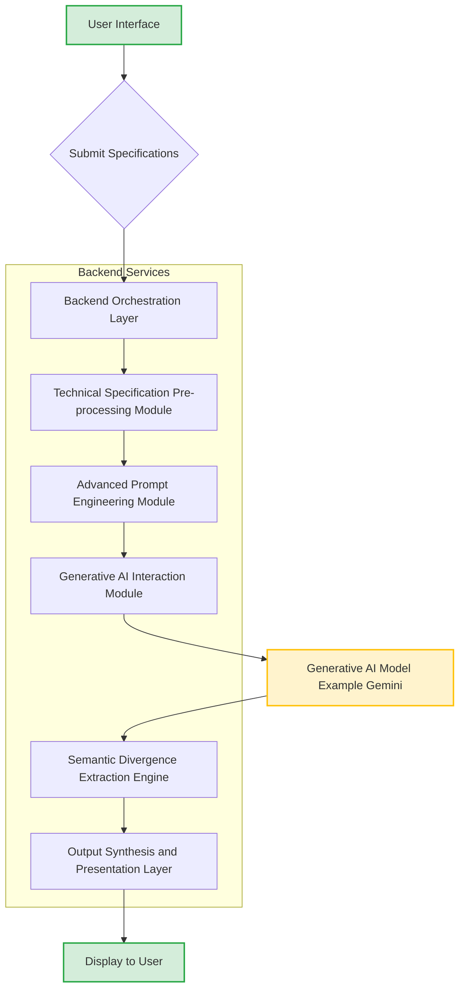
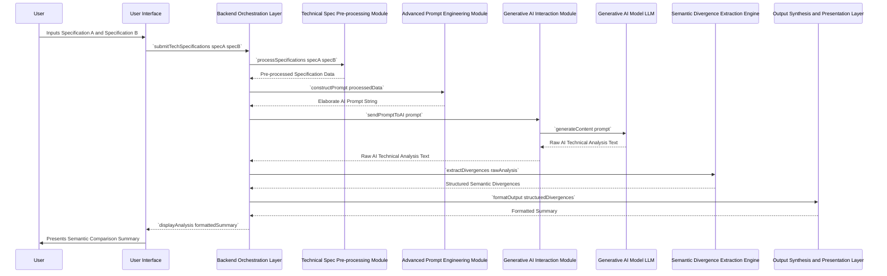
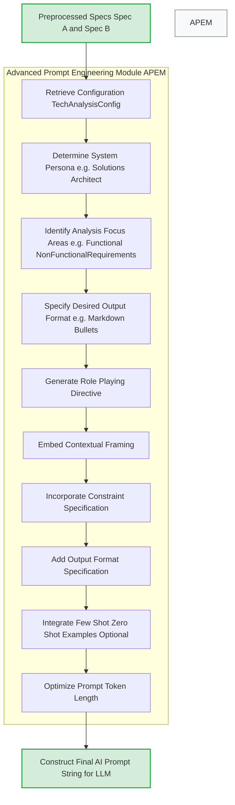
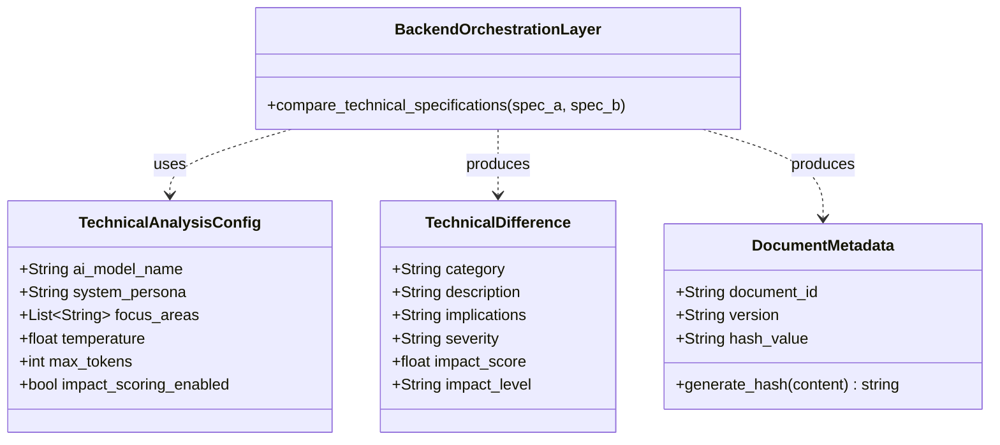
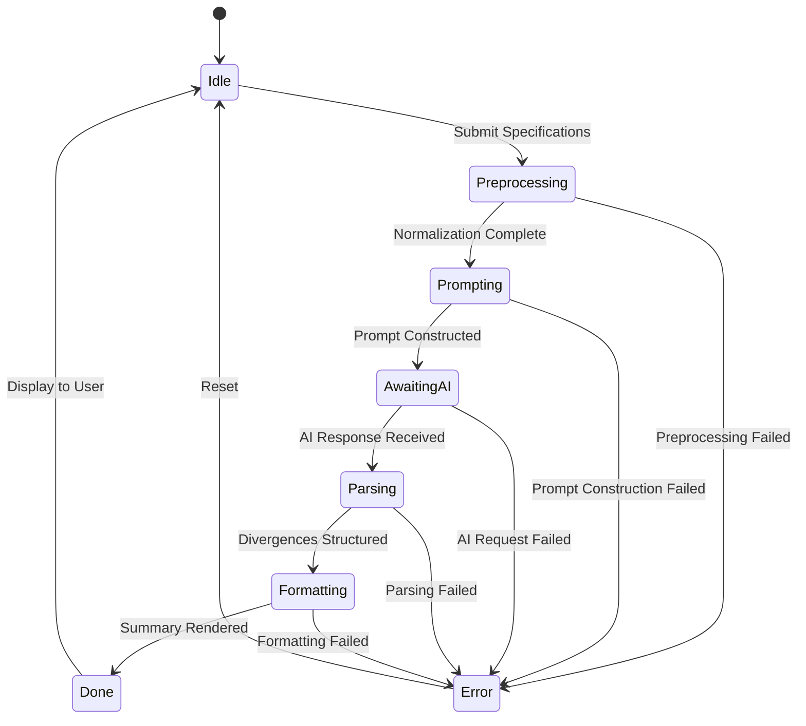
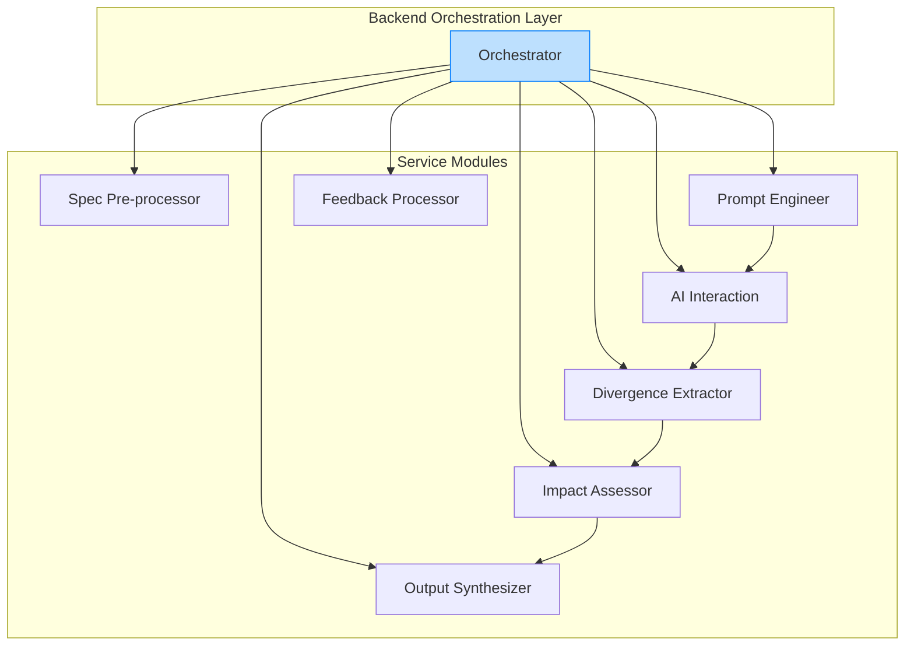
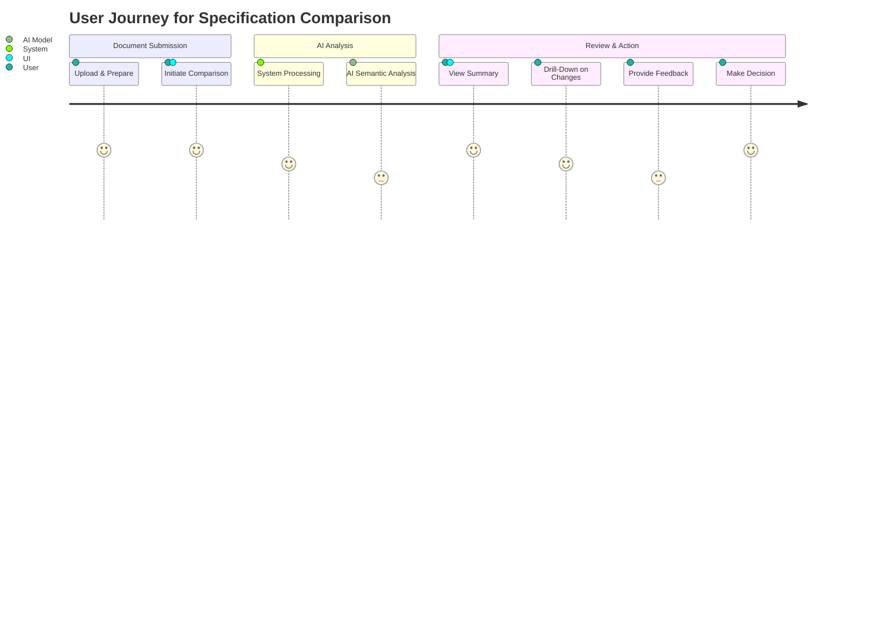
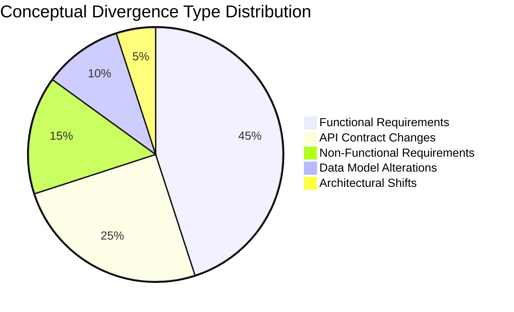
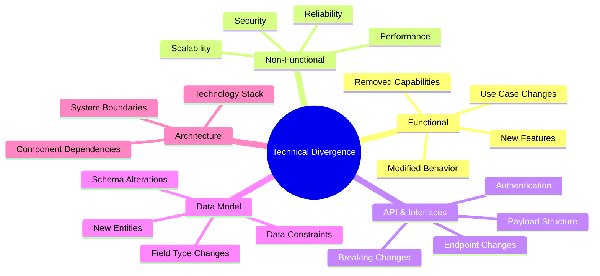
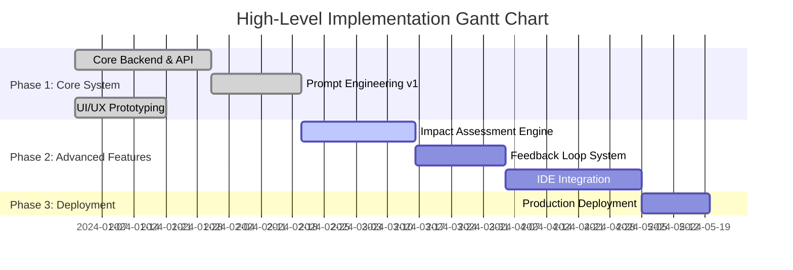

**Title of Invention:** A System and Method for Semantic Comparison and Analysis of Technical Specifications

**Abstract:**
A profoundly innovative system for the deep semantic analysis and comparative exegesis of technical specifications and software requirements documents is herein disclosed. This system systematically receives two distinct textual instantiations of technical instruments, such as antecedent and subsequent versions of a software requirements document or an API specification. It then dispatches both documents to an advanced generative artificial intelligence model, synergistically integrated with a meticulously crafted instructional prompt. This prompt mandates the AI model to transcend mere superficial lexical discrepancies, compelling it to perform a rigorous semantic comparison to discern fundamental material divergences in functional requirements, non-functional attributes, system behavior, and their latent engineering or project implications. The system subsequently synthesizes and renders a lucid, concisely articulated summary of these identified technical disparities, presented in accessible, non-esoteric language, thereby empowering even individuals lacking specialized technical expertise to rapidly apprehend the substantive changes between document iterations with unparalleled clarity and precision. This invention establishes a new benchmark for automated technical document analysis.

**Background of the Invention:**
The rigorous comparison of disparate versions of technical specifications, particularly software requirements documents, API contracts, or architectural designs, constitutes an unequivocally critical yet prohibitively arduous and labor-intensive undertaking within engineering and project management domains. Conventional textual differential analysis tools, commonly referred to as "diff" utilities, are fundamentally restricted to identifying and delineating only superficial, character-level, or word-level textual variances. Such rudimentary tools are inherently incapable of performing interpretative analysis regarding the profound functional meaning or the intrinsic engineering significance of identified textual alterations. A seemingly innocuous linguistic modification, a subtle syntactical rearrangement, or an apparently minor semantic shift can precipitate cascading, monumental impacts on system design, development effort, testing strategies, or integration compatibility that remain entirely opaque and indiscernible to a layperson, and often, even to seasoned technical professionals without extensive, dedicated scrutiny. The traditional paradigm of technical document review, reliant heavily upon human expert cognition, is consequently characterized by exorbitant costs, protracted timelines, and an inherent susceptibility to human error and cognitive fatigue. Ergo, there exists an acute, imperative demand for an advanced computational apparatus capable of autonomously executing the preliminary analytical phase, meticulously accentuating the most pivotal and material technical divergences in a form that is both comprehensible and actionable, thereby ushering in an era of unprecedented efficiency and accuracy in software and systems engineering.

**Brief Summary of the Invention:**
The present invention definitively articulates and actualizes a revolutionary paradigm for technical document comparison. It furnishes an intuitive, highly sophisticated user interface enabling an operator to input the complete textual content of a foundational document, designated herein as "Specification A," and a comparative document, designated as "Specification B." Upon reception of these textual corpora, the system proceeds to meticulously construct a singular, holistic, and semantically optimized prompt tailored for invocation of a large language model LLM of advanced generative capacity. This prompt is ingeniously engineered to encapsulate the entirety of both documents' textual content. Furthermore, the prompt integrates explicit directives instructing the artificial intelligence to assume the epistemic role of a preeminent solutions architect or senior software engineer, to perform a rigorous comparative exegesis between the two documents, and to subsequently synthesize an exhaustive summary enumerating all material technical differences. The AI is specifically commanded to transcend superficial textual variations, to meticulously identify fundamental shifts in functional requirements, non-functional requirements e.g. performance, security, scalability, system interfaces, data models, and other pivotal technical constructs. Crucially, the AI is further tasked with elucidating the latent and patent implications of these identified changes on development, testing, integration, and project timelines. The resultant synthesized analytical summary is then dynamically presented to the user through a clear, structured display, providing instant, actionable insights. This architectural construct establishes a definitive ownership over the entire conceptual framework and its implementation.

**Figures:**

The following figures illustrate the architecture and operational flow of the system. These conceptual diagrams are integral to understanding the robust and innovative nature of this invention.


**Figure 1: System Architecture for Semantic Technical Specification Comparison**

This flowchart delineates the high-level operational architecture. The User Interface (A) initiates the process by submitting specifications (B) to the Backend Orchestration Layer (C). Specifications undergo pre-processing (D) and sophisticated prompt engineering (E) before interaction with the Generative AI Model (G) via the Interaction Module (F). The AI's output is then processed by the Semantic Divergence Extraction Engine (H) and formatted for presentation (I), finally displayed to the user (J).


**Figure 2: Sequence Diagram of Technical Specification Comparison Process**

This sequence diagram illustrates the chronological flow of interactions between the user, the user interface, and the various backend components, culminating in the presentation of the semantic comparison summary. Each arrow represents a distinct communication or data transfer event, emphasizing the sequential and collaborative nature of the inventive process.


**Figure 3: Advanced Prompt Engineering Workflow for Technical Specifications**

This flowchart details the internal workings of the Advanced Prompt Engineering Module. It begins with the preprocessed documents and configuration retrieval, then sequentially constructs the prompt by integrating various directives such as system persona, focus areas, and output format. Key steps include generating role-playing instructions, embedding contextual framing, specifying constraints, and optimizing token length, culminating in the final, comprehensive AI prompt string ready for transmission to the Generative AI Model.


**Figure 4: Core Data Model (UML Class Diagram)**

This class diagram illustrates the key data structures underpinning the system. `TechnicalAnalysisConfig` holds tunable parameters. `DocumentMetadata` provides versioning and integrity. `TechnicalDifference` is the structured representation of a single identified semantic divergence. The `BackendOrchestrationLayer` orchestrates the process using these models.


**Figure 5: System State Transition Diagram**

This diagram illustrates the lifecycle of a single comparison request. The system transitions through states from `Idle` to `Done`, with defined paths for successful processing and potential failure points, ensuring a robust and predictable workflow.


**Figure 6: Backend Component Dependency Diagram**

This diagram illustrates the dependencies between the core backend components. The `Backend Orchestration Layer (BOL)` centrally coordinates all other modules. Data flows sequentially through pre-processing, prompt engineering, AI interaction, extraction, impact assessment, and finally output synthesis.


**Figure 7: User Journey Map**

This user journey map visualizes the key stages of user interaction with the system, from submitting documents to reviewing the AI-generated analysis and making informed decisions, highlighting the intuitive and efficient workflow designed to empower stakeholders.


**Figure 8: Conceptual Divergence Impact Distribution (Pie Chart)**

This pie chart provides a representative example of how the system might categorize the identified divergences, allowing users to quickly grasp the primary areas of change. For instance, a majority of changes might relate to functional requirements, indicating a significant evolution of the system's capabilities.


**Figure 9: Mind Map of Semantic Analysis Domains**

This mind map conceptually illustrates the multi-faceted nature of the semantic analysis performed by the AI. The system is designed to explore and identify changes across a comprehensive set of technical domains, ensuring a holistic and thorough comparison.


**Figure 10: High-Level Implementation Gantt Chart**

This conceptual Gantt chart outlines a potential project plan for developing and deploying the inventive system. It breaks down the work into logical phases, from building the core functionality to implementing advanced features and deploying to production, illustrating a clear path to realization.

**Detailed Description of the Invention:**
The present invention meticulously defines a robust, multi-tiered system for the profound semantic comparison of technical documentation, thereby transcending the inherent limitations of lexical-only differentiation methods.

**I. System Components and Architecture:**

1.  **User Interface UI Module:**
    *   **Functionality:** Provides an intuitive, secure graphical interface for the end-user. This module is responsible for the ingestion of input technical documents.
    *   **Implementation:** Comprises two distinct, extensible text input fields, one designated for the 'Original Specification' Specification A and the other for the 'Revised Specification' Specification B. Controls for submission, clear, and optional settings e.g. specificity of analysis, output format preferences are also provided.
    *   **Data Handling:** Securely transmits the raw textual content of Specification A and Specification B to the Backend Orchestration Layer upon user initiation via HTTPS with end-to-end encryption.

2.  **Backend Orchestration Layer BOL:**
    *   **Functionality:** Serves as the central coordinating nexus for all backend operations, managing the workflow, data flow, and inter-module communication. It acts as the primary API endpoint for the UI.
    *   **Implementation:** Implemented as a high-performance, scalable service, capable of handling concurrent requests. Utilizes asynchronous processing to ensure responsiveness. Employs a state machine (as depicted in Figure 5) to track the progress of each comparison job.
    *   **Key Responsibilities:** Request validation, sequencing of processing steps, error handling, and aggregation of results from subordinate modules. Logs all operations for auditability and debugging.

3.  **Technical Specification Pre-processing Module TSPPM:**
    *   **Functionality:** Prepares the raw textual input for optimal consumption by downstream modules, particularly the Advanced Prompt Engineering Module. This involves normalizing textual data, removing extraneous artifacts, and potentially identifying document structure.
    *   **Implementation:** Incorporates advanced Natural Language Processing NLP techniques such as:
        *   **Text Cleaning:** Removal of non-essential whitespace, special characters, headers/footers, and boilerplate text using regex and heuristic models.
        *   **Encoding Normalization:** Ensures consistent character encoding e.g. UTF-8.
        *   **Tokenization and Chunking:** Splits large documents into semantically coherent chunks that respect context window limitations of the LLM, using techniques like recursive character text splitting with configurable overlap.
        *   **Section Delineation Optional:** Employs heuristic or machine learning models to identify logical sections e.g. "Introduction," "Functional Requirements," "Non-Functional Requirements," "API Endpoints," "Use Cases" within the technical documents, which can later inform prompt construction with structured XML-like tags.

4.  **Advanced Prompt Engineering Module APEM:**
    *   **Functionality:** The intellectual core of the system's interaction with the generative AI. This module dynamically constructs the comprehensive and highly optimized prompt that guides the AI's analytical process.
    *   **Implementation:** Employs sophisticated algorithms for prompt construction, incorporating:
        *   **Role-Playing Directive:** Clearly instructs the AI to adopt the persona of an "expert solutions architect" or a "senior software engineer," imbuing its output with appropriate linguistic style and analytical rigor.
        *   **Contextual Framing:** Establishes the purpose of the comparison e.g. "identify architectural impacts," "focus on integration risks."
        *   **Constraint Specification:** Directs the AI to focus on specific technical domains e.g. "functional requirements," "non-functional requirements performance, security, scalability," "data models," "API contracts," "system dependencies."
        *   **Format Specification:** Instructs the AI on the desired output format e.g. "bulleted list," "structured JSON," "plain language summary," "table of changes."
        *   **Few-Shot/Zero-Shot Learning Integration:** Incorporates examples of desired output or specific analytical patterns if beneficial, or relies on the LLM's inherent capabilities for zero-shot inference.
        *   **Token Optimization:** Strategically manages prompt length to adhere to LLM context window limits while preserving maximum informational density.

5.  **Generative AI Interaction Module GAIIM:**
    *   **Functionality:** Acts as the secure and efficient conduit between the Backend Orchestration Layer and the selected Generative AI Model s.
    *   **Implementation:**
        *   **API Client:** Manages API keys, authentication, and request/response serialization e.g. JSON.
        *   **Rate Limiting and Retry Logic:** Implements robust mechanisms to handle API rate limits and transient network errors, ensuring system resilience using exponential backoff strategies.
        *   **Model Selection:** Supports integration with multiple generative AI models e.g. Gemini, GPT series, Claude allowing for dynamic model selection based on performance, cost, or specific task requirements.

6.  **Generative AI Model LLM:**
    *   **Functionality:** The core computational engine for semantic comparison. This model, often a large language model based on transformer architecture, performs the high-dimensional pattern recognition and semantic inference.
    *   **Operational Principle:** Given the structured prompt and the technical documents, the LLM processes billions of parameters to understand the nuanced meaning of each specification, identify points of divergence, infer their engineering significance based on its vast training corpus of technical texts, and synthesize a coherent response. It effectively approximates the `T(D)` function and performs the `Delta_technical` computation as defined in the mathematical justifications.

7.  **Semantic Divergence Extraction Engine SDEE:**
    *   **Functionality:** Post-processes the raw textual output from the Generative AI Model, extracting, structuring, and refining the identified technical divergences into a machine-readable and further processable format.
    *   **Implementation:** Utilizes advanced NLP techniques:
        *   **Named Entity Recognition NER:** Identifies technical entities e.g. system components, API endpoints, data fields, functional requirements.
        *   **Relationship Extraction:** Deduces relationships between identified entities and concepts e.g. "Component X *depends on* Component Y," "API A *modifies* Data Model B."
        *   **Impact Analysis Contextual:** Assesses the engineering "tone" or potential project risk associated with changes.
        *   **Structured Data Conversion:** Transforms free-form AI text into structured formats such as JSON, XML, or custom data objects, allowing for programmatic manipulation. May involve a secondary, faster LLM call specifically for this structuring task.

8.  **Output Synthesis and Presentation Layer OSPL:**
    *   **Functionality:** Transforms the structured technical divergences into a user-friendly, comprehensible, and visually organized summary suitable for display to the end-user.
    *   **Implementation:**
        *   **Summarization Algorithms:** May employ extractive or abstractive summarization techniques to further distill the AI's output, focusing on conciseness and clarity.
        *   **Visualization Components:** Renders the summary in various formats: bulleted lists, comparative tables, interactive dashboards, or annotated document views where changes are highlighted directly within the document text.
        *   **Plain Language Translator:** Ensures that complex technical jargon, if present in the AI's raw output, is translated into unambiguous, accessible language for non-technical stakeholders or junior team members.

**II. Operational Workflow:**

1.  **Document Ingestion:** The user provides Specification A and Specification B via the UI.
2.  **Backend Initiation:** The BOL receives the documents and initiates the comparison workflow.
3.  **Pre-processing:** The TSPPM cleans and normalizes the document texts.
4.  **Prompt Construction:** The APEM dynamically generates a highly specific and contextualized prompt, embedding the cleaned documents and instructing the AI on its analytical task and desired output format.
5.  **AI Invocation:** The GAIIM transmits the constructed prompt to the selected Generative AI Model.
6.  **AI Analysis:** The Generative AI Model processes the prompt and documents, performing a deep semantic comparison, inferring engineering implications, and generating a raw text analysis.
7.  **Divergence Extraction:** The SDEE receives the AI's raw analysis, parses it, and extracts structured semantic divergences, potentially categorizing them by type e.g. change in functional requirement, change in API contract, new non-functional constraint, removed dependency.
8.  **Output Formatting:** The OSPL transforms the structured divergences into a human-readable summary, often employing plain language explanations and clear formatting e.g. a bulleted list of "Key Material Divergences."
9.  **User Presentation:** The formatted summary is returned to the UI and displayed to the user, offering immediate insight into the engineering ramifications of the document changes.

**III. Embodiments and Further Features:**

*   **Integrated Development Environment IDE Integration:** The system can be integrated as a plugin or module within existing IDEs, project management tools, or version control systems e.g. Jira, GitHub, GitLab, Confluence.
*   **Version Control Integration:** Direct integration with document version control systems for technical specifications e.g. Git-like systems or specialized documentation tools to automatically trigger comparisons upon new version commits.
*   **Multi-Lingual Support:** Expansion to handle and compare technical specifications in multiple natural languages, leveraging the multilingual capabilities of advanced LLMs.
*   **Domain-Specific Tuning:** Capability to fine-tune the Generative AI Model or specialize prompt engineering for particular technical domains e.g. embedded systems, cloud architecture, cybersecurity, machine learning pipelines.
*   **Impact Scoring and Visualization:** Assignment of quantitative impact scores to identified changes and their visual representation e.g. heat maps, dashboards to prioritize review, highlighting critical path impacts.
*   **Interactive Drill-Down:** The ability for users to click on a summarized divergence and view the corresponding sections in Specification A and Specification B side-by-side, with relevant text highlighted.
*   **Feedback Mechanism:** Implementation of a user feedback loop to collect ratings and comments on the AI's analysis, enabling continuous improvement of prompt engineering, model tuning, and post-processing algorithms.

**Conceptual Code (Python Backend):**
This conceptual code demonstrates the core logic, reflecting the architectural principles and intellectual constructs defining the system. Each module is designed to be highly extensible and robust.

```python
from google.generativeai import GenerativeModel
from enum import Enum
from typing import List, Dict, Any, Optional
import hashlib
import datetime
import json
import re
import logging

# --- System-wide Logging Configuration ---
logging.basicConfig(level=logging.INFO, format='%(asctime)s - %(levelname)s - %(message)s')

# --- Configuration and Utility Classes ---

class TechnicalAnalysisConfig:
    """
    Encapsulates configuration parameters for the technical analysis system.
    This class is integral to system adaptability and robustness.
    """
    def __init__(self,
                 ai_model_name: str = 'gemini-2.5-flash',
                 system_persona: str = "expert solutions architect and senior software engineer",
                 focus_areas: List[str] = None,
                 output_format_instructions: str = "plain language bulleted list",
                 temperature: float = 0.2,
                 max_tokens: int = 4000,
                 impact_scoring_enabled: bool = True,
                 plain_language_level: str = "intermediate", # e.g., "junior engineer", "intermediate", "expert"
                 return_excerpts: bool = True):
        self.ai_model_name = ai_model_name
        self.system_persona = system_persona
        self.focus_areas = focus_areas if focus_areas is not None else [
            "functional requirements", "non-functional requirements performance, security, scalability",
            "API contracts", "data models", "system interfaces", "dependencies",
            "architectural design decisions", "user stories and use cases"
        ]
        self.output_format_instructions = output_format_instructions
        self.temperature = temperature
        self.max_tokens = max_tokens
        self.impact_scoring_enabled = impact_scoring_enabled
        self.plain_language_level = plain_language_level
        self.return_excerpts = return_excerpts

class AnalysisOutputFormat(Enum):
    """
    Defines the structured output formats supported for the semantic analysis.
    This ensures standardized data interchange and presentation flexibility.
    """
    PLAIN_TEXT = "plain_text"
    MARKDOWN_BULLETS = "markdown_bullets"
    JSON_STRUCTURED = "json_structured"
    XML_STRUCTURED = "xml_structured" # Conceptual, not implemented in formatter example

class DocumentMetadata:
    """
    Metadata container for technical documents, facilitating version control, integrity checks,
    and better organization within larger engineering systems.
    """
    def __init__(self,
                 document_id: str,
                 title: str,
                 version: str,
                 author: Optional[str] = None,
                 hash_value: Optional[str] = None,
                 timestamp: Optional[str] = None):
        self.document_id = document_id
        self.title = title
        self.version = version
        self.author = author
        self.hash_value = hash_value
        self.timestamp = timestamp if timestamp else datetime.datetime.now(datetime.timezone.utc).isoformat()

    @staticmethod
    def generate_hash(content: str) -> str:
        """Generates a SHA256 hash for document content to ensure integrity."""
        return hashlib.sha256(content.encode('utf-8')).hexdigest()

    def to_dict(self) -> Dict[str, Any]:
        """Converts the document metadata to a dictionary."""
        return {
            "document_id": self.document_id,
            "title": self.title,
            "version": self.version,
            "author": self.author,
            "hash_value": self.hash_value,
            "timestamp": self.timestamp
        }

class TechnicalDifference:
    """
    A foundational data structure representing a single semantic divergence identified
    between technical specifications. This object facilitates structured output and downstream processing.
    """
    def __init__(self,
                 category: str,
                 description: str,
                 implications: str,
                 spec_a_excerpt: Optional[str] = None,
                 spec_b_excerpt: Optional[str] = None,
                 severity: Optional[str] = None, # e.g., "High", "Medium", "Low"
                 impact_score: Optional[float] = None, # Quantitative score, e.g., 0.0 to 1.0
                 impact_level: Optional[str] = None): # Qualitative level, e.g., "Critical Impact"
        self.category = category
        self.description = description
        self.implications = implications
        self.spec_a_excerpt = spec_a_excerpt
        self.spec_b_excerpt = spec_b_excerpt
        self.severity = severity
        self.impact_score = impact_score
        self.impact_level = impact_level

    def to_dict(self) -> Dict[str, Any]:
        """Converts the technical difference to a dictionary for JSON serialization."""
        return {
            "category": self.category,
            "description": self.description,
            "implications": self.implications,
            "spec_a_excerpt": self.spec_a_excerpt,
            "spec_b_excerpt": self.spec_b_excerpt,
            "severity": self.severity,
            "impact_score": self.impact_score,
            "impact_level": self.impact_level
        }

# --- Core System Modules (exported components) ---

class TechnicalDocumentProcessor:
    """
    Responsible for pre-processing technical document texts.
    This module enhances the quality and consistency of input for the LLM.
    """
    @staticmethod
    def clean_text(text: str) -> str:
        """
        Performs basic text cleaning: removes excessive whitespace, normalizes line endings.
        Further advanced cleaning e.g. boilerplate removal can be integrated here.
        """
        if not isinstance(text, str):
            raise TypeError("Input 'text' must be a string.")
        text = text.strip()
        text = re.sub(r'\s+', ' ', text) # Normalize whitespace
        return text

    @staticmethod
    def identify_sections(text: str) -> Dict[str, str]:
        """
        Conceptual: Identifies logical sections within a technical document.
        This advanced feature uses pattern matching or ML to delineate sections,
        providing granular context for the LLM.
        """
        # This is a placeholder; real implementation would involve regex,
        # NLP models e.g. spaCy for section headers, or heuristic rules
        # to identify "Functional Requirements", "API Definitions", "Use Cases", etc.
        # For simplicity, we return the whole text as a single 'body' section.
        return {"full_document_body": text}

    @staticmethod
    def extract_document_metadata(text: str, doc_id: str, doc_version: str, doc_title: Optional[str] = None) -> DocumentMetadata:
        """
        Conceptual: Extracts key metadata from the document text.
        A more advanced implementation would parse title, version, author from document content.
        """
        # Placeholder for actual metadata extraction
        title = doc_title if doc_title else f"Technical Specification {doc_id}"
        return DocumentMetadata(
            document_id=doc_id,
            title=title,
            version=doc_version,
            hash_value=DocumentMetadata.generate_hash(text)
        )

class PromptBuilder:
    """
    Dynamically constructs the sophisticated prompt for the Generative AI Model.
    This class is the embodiment of advanced prompt engineering.
    """
    def __init__(self, config: TechnicalAnalysisConfig):
        self.config = config

    def build_comparison_prompt(self, spec_a_cleaned: str, spec_b_cleaned: str) -> str:
        """
        Constructs a comprehensive and directive prompt for the AI model.
        This prompt instructs the AI to perform a deep semantic comparison.
        """
        focus_areas_str = ", ".join(self.config.focus_areas)

        # The prompt is meticulously crafted to guide the AI's reasoning path.
        prompt = f"""
        You are an exceptionally astute and highly experienced {self.config.system_persona}.
        Your critical mission is to perform a forensic, semantic comparison between two versions of a technical specification or software requirements document.
        Your analysis must transcend superficial lexical variations and delve into the fundamental functional and non-functional meaning,
        potential engineering risks, and practical implications for development, testing, and project management of all material divergences.

        Specifically, meticulously analyze changes related to: {focus_areas_str}.
        For each identified material divergence, you must articulate:
        1.  A concise description of the change.
        2.  Its precise technical meaning and significance e.g. functional impact, performance implication, security risk.
        3.  The potential real-world implications or consequences for the system, development team, or project timeline.
        {"4.  Where appropriate, a brief excerpt from Specification A and Specification B illustrating the change context." if self.config.return_excerpts else ""}
        5.  Assign a qualitative severity (e.g., "High", "Medium", "Low") to the change based on its potential impact on cost, schedule, or quality.

        Present your findings in a clear, structured, and easily digestible {self.config.output_format_instructions},
        ensuring all explanations are provided in unambiguous, plain language suitable for a {self.config.plain_language_level} technical understanding, devoid of unnecessary jargon.
        Your objective is to provide actionable intelligence to a stakeholder who may not possess deep technical expertise in every specific area.

        --- SPECIFICATION A Original Version ---
        {spec_a_cleaned}

        --- SPECIFICATION B Revised Version ---
        {spec_b_cleaned}

        --- ANALYTICAL FINDINGS ---
        """
        return prompt

class ImpactAssessmentEngine:
    """
    Quantifies and categorizes the impact associated with identified technical divergences.
    This module could use rule-based systems or an additional ML model.
    """
    def __init__(self, config: TechnicalAnalysisConfig):
        self.config = config
        # A more advanced system might load a sophisticated impact model here
        self._category_impact_weights = {
            "Functional Requirement Change": 0.9,
            "NonFunctional Requirement Change": 0.8, # Performance, Security, Scalability
            "API Contract Change": 0.95,
            "Data Model Modification": 0.8,
            "System Interface Alteration": 0.7,
            "Dependency Update": 0.6,
            "Architectural Design Change": 0.9,
            "User Story or Use Case Shift": 0.7,
            "General Semantic Divergence": 0.4 # Fallback
        }
        self._severity_to_score = {
            "High": 0.8,
            "Medium": 0.5,
            "Low": 0.2
        }

    def assign_impact_score(self, technical_difference: TechnicalDifference) -> float:
        """
        Assigns a numerical impact score (e.g., 0.0 to 1.0) based on category, description,
        implications, and perceived severity. This is a conceptual implementation.
        """
        score = 0.0
        # Base score from severity
        score += self._severity_to_score.get(technical_difference.severity, 0.5)

        # Boost score based on category
        score += self._category_impact_weights.get(technical_difference.category, 0.4) * 0.5 # Scale category impact

        # Further conceptual boosting based on keywords in description/implications
        if "breaking change" in technical_difference.description.lower() or \
           "performance degradation" in technical_difference.implications.lower() or \
           "security vulnerability" in technical_difference.implications.lower() or \
           "re-architecture" in technical_difference.implications.lower():
            score += 0.2

        # Clamp score between 0 and 1
        return min(1.0, max(0.0, score / (len(self._category_impact_weights) * 0.5 + 1.0))) # Normalize conceptual max score

    def categorize_impact_level(self, score: float) -> str:
        """Converts a numerical impact score into a qualitative impact level."""
        if score >= 0.8:
            return "Critical Impact"
        elif score >= 0.6:
            return "High Impact"
        elif score >= 0.3:
            return "Moderate Impact"
        else:
            return "Low Impact"

class AnalysisFormatter:
    """
    Processes the raw output from the Generative AI Model and formats it
    into a structured, user-friendly presentation. This module bridges AI output
    with human comprehension.
    """
    def __init__(self, target_format: AnalysisOutputFormat, config: TechnicalAnalysisConfig):
        self.target_format = target_format
        self.config = config
        self.impact_engine = ImpactAssessmentEngine(config) if config.impact_scoring_enabled else None

    def parse_and_structure_ai_output(self, ai_raw_text: str) -> List[TechnicalDifference]:
        """
        Parses the raw AI output (which should ideally follow the prompt's instructions)
        into a list of structured TechnicalDifference objects.
        This can involve heuristic parsing or a more robust NLP pipeline.
        """
        differences: List[TechnicalDifference] = []
        # A more robust parser would handle multi-line content for each numbered item
        pattern = re.compile(
            r"^\s*(?:\d+\.\s*)?Description:\s*(.*?)\s*"
            r"^\s*(?:\d+\.\s*)?Implications:\s*(.*?)\s*"
            r"(?:^\s*(?:\d+\.\s*)?Severity:\s*(.*?)\s*)?"
            r"(?:^\s*(?:\d+\.\s*)?Category:\s*(.*?)\s*)?",
            re.MULTILINE | re.DOTALL | re.IGNORECASE
        )
        
        # Simplified heuristic parsing for bulleted lists as a fallback
        current_data: Dict[str, Any] = {}
        for line in ai_raw_text.split('\n'):
            line = line.strip()
            if not line: continue

            if re.match(r"^\d+\.\s*", line):
                if current_data.get("Description"):
                    diff = self._create_difference_object(current_data)
                    differences.append(diff)
                current_data = {"Description": re.sub(r"^\d+\.\s*", "", line).strip()}
            elif "Description:" in line: current_data["Description"] = line.split(":", 1)[1].strip()
            elif "Implications:" in line: current_data["Implications"] = line.split(":", 1)[1].strip()
            elif "Severity:" in line: current_data["Severity"] = line.split(":", 1)[1].strip()
            elif "Category:" in line: current_data["Category"] = line.split(":", 1)[1].strip()

        if current_data.get("Description"):
            diff = self._create_difference_object(current_data)
            differences.append(diff)

        # Fallback for completely unstructured output
        if not differences and ai_raw_text:
            general_diff = TechnicalDifference(
                category="General Semantic Divergence",
                description="Overall material divergences identified by AI.",
                implications=ai_raw_text,
                severity="Undetermined"
            )
            if self.config.impact_scoring_enabled and self.impact_engine:
                general_diff.impact_score = self.impact_engine.assign_impact_score(general_diff)
                general_diff.impact_level = self.impact_engine.categorize_impact_level(general_diff.impact_score)
            differences.append(general_diff)

        return differences

    def _create_difference_object(self, data: Dict[str, Any]) -> TechnicalDifference:
        """Helper to instantiate TechnicalDifference and assess impact."""
        diff = TechnicalDifference(
            category=data.get("Category", "Uncategorized"),
            description=data.get("Description", "No description provided."),
            implications=data.get("Implications", "No implications provided."),
            spec_a_excerpt=data.get("Specification A Excerpt"),
            spec_b_excerpt=data.get("Specification B Excerpt"),
            severity=data.get("Severity", "Medium")
        )
        if self.config.impact_scoring_enabled and self.impact_engine:
            diff.impact_score = self.impact_engine.assign_impact_score(diff)
            diff.impact_level = self.impact_engine.categorize_impact_level(diff.impact_score)
        return diff


    def format_for_display(self, structured_differences: List[TechnicalDifference]) -> str:
        """
        Formats the structured semantic differences into the desired output string.
        """
        if self.target_format == AnalysisOutputFormat.MARKDOWN_BULLETS:
            return self._format_as_markdown(structured_differences)
        elif self.target_format == AnalysisOutputFormat.JSON_STRUCTURED:
            return json.dumps([sd.to_dict() for sd in structured_differences], indent=2)
        else: # Default or PLAIN_TEXT fallback
            return self._format_as_plain_text(structured_differences)

    def _format_as_markdown(self, differences: List[TechnicalDifference]) -> str:
        """Formats output as a Markdown string."""
        output = "### Identified Material Technical Divergences:\n\n"
        if not differences: return output + "No material divergences were identified or could be parsed."
        for i, diff in enumerate(differences):
            impact = f"(Severity: {diff.severity}, Impact: {diff.impact_level} [{diff.impact_score:.2f}])" if diff.impact_score is not None else f"(Severity: {diff.severity})"
            output += f"**{i+1}. {diff.category} {impact}**\n"
            output += f"    * **Description:** {diff.description}\n"
            output += f"    * **Implications:** {diff.implications}\n\n"
        return output

    def _format_as_plain_text(self, differences: List[TechnicalDifference]) -> str:
        """Formats output as a plain text string."""
        output = "Identified Material Technical Divergences:\n\n"
        if not differences: return output + "No material divergences were identified or could be parsed."
        for i, diff in enumerate(differences):
            impact = f"(Severity: {diff.severity}, Impact: {diff.impact_level} [{diff.impact_score:.2f}])" if diff.impact_score is not None else f"(Severity: {diff.severity})"
            output += f"{i+1}. {diff.category} {impact}\n"
            output += f"    Description: {diff.description}\n"
            output += f"    Implications: {diff.implications}\n\n"
        return output

class FeedbackLoopProcessor:
    """
    Manages the collection and processing of user feedback to improve the AI model
    and system accuracy over time. This is a conceptual implementation.
    """
    @staticmethod
    def record_feedback(
        comparison_id: str,
        user_rating: int, # e.g., 1-5 stars
        feedback_text: Optional[str] = None,
        identified_differences: Optional[List[Dict[str, Any]]] = None
    ):
        """
        Records user feedback on the quality of a specific comparison.
        In a real system, this would persist data to a database for further analysis
        and model fine-tuning.
        """
        feedback_record = {
            "comparison_id": comparison_id,
            "user_rating": user_rating,
            "feedback_text": feedback_text,
            "timestamp_utc": datetime.datetime.now(datetime.timezone.utc).isoformat(),
            "reviewed_differences_count": len(identified_differences) if identified_differences else None
        }
        logging.info(f"FEEDBACK RECORDED: {json.dumps(feedback_record)}")
        # In a real system:
        # database_client.insert("feedback_collection", feedback_record)
        # This could trigger alerts or downstream analysis pipelines.

    @staticmethod
    def analyze_feedback_trends() -> Dict[str, Any]:
        """
        Conceptual: Analyzes aggregated feedback to identify areas for system improvement.
        This would typically involve querying a feedback database.
        """
        # Placeholder for actual analytics.
        logging.info("Analyzing feedback trends...")
        return {
            "average_rating": 4.5,
            "common_issues": ["subtle functional nuance missed", "verbosity in non-functional areas", "incorrect impact"],
            "positive_trends": ["accuracy on API changes", "speed"],
            "recommendations": ["refine prompt for specific domain X", "update parsing logic for structured output"]
        }

async def compare_technical_specifications(
    spec_a: str,
    spec_b: str,
    config: Optional[TechnicalAnalysisConfig] = None,
    output_format: AnalysisOutputFormat = AnalysisOutputFormat.MARKDOWN_BULLETS,
    comparison_id: Optional[str] = None # For tracking and feedback
) -> str:
    """
    The main orchestrating function for the entire technical specification comparison system.
    This function embodies the core inventive methodology.

    Args:
        spec_a: The full text content of the first technical specification (Specification A).
        spec_b: The full text content of the second technical specification (Specification B).
        config: Optional configuration object to customize the AI interaction.
        output_format: The desired format for the final summary output.
        comparison_id: An optional ID for tracking this specific comparison, useful for feedback.

    Returns:
        A string containing the formatted summary of material technical divergences.
    """
    config = config if config else TechnicalAnalysisConfig()
    comparison_id = comparison_id if comparison_id else hashlib.sha256(f"{spec_a}{spec_b}{datetime.datetime.now()}".encode('utf-8')).hexdigest()
    logging.info(f"Starting comparison {comparison_id} with model {config.ai_model_name}.")

    # 1. Pre-process documents
    spec_a_cleaned = TechnicalDocumentProcessor.clean_text(spec_a)
    spec_b_cleaned = TechnicalDocumentProcessor.clean_text(spec_b)

    # 2. Construct the sophisticated AI prompt
    prompt_builder = PromptBuilder(config)
    ai_prompt = prompt_builder.build_comparison_prompt(spec_a_cleaned, spec_b_cleaned)

    # 3. Interact with the Generative AI Model
    try:
        model = GenerativeModel(config.ai_model_name)
        generation_config = {"temperature": config.temperature, "max_output_tokens": config.max_tokens}
        response = await model.generate_content_async(ai_prompt, generation_config=generation_config)
        ai_raw_analysis = response.text
    except Exception as e:
        logging.error(f"Error during AI content generation for comparison {comparison_id}: {e}")
        return f"An error occurred during AI analysis. (ID: {comparison_id})"

    # 4. Extract and structure semantic differences from AI output
    analysis_formatter = AnalysisFormatter(target_format=output_format, config=config)
    structured_differences = analysis_formatter.parse_and_structure_ai_output(ai_raw_analysis)

    # 5. Format the structured differences for final display
    final_summary = analysis_formatter.format_for_display(structured_differences)
    logging.info(f"Comparison {comparison_id} completed successfully. Found {len(structured_differences)} divergences.")
    return final_summary

async def compare_specifications(spec_a: str, spec_b: str) -> str:
    """
    Uses a generative AI to compare two technical specifications and summarize the divergences.
    This function now acts as a high-level wrapper for the more comprehensive system.
    """
    return await compare_technical_specifications(spec_a, spec_b)
```

**Claims:**
The following claims assert the definitive intellectual ownership and novel aspects of the disclosed system and methodology.

1.  A method for semantically analyzing and comparing technical documents, comprising:
    a.  Receiving, via a computational interface, a first full-text technical document Specification A and a second full-text technical document Specification B.
    b.  Programmatically constructing a sophisticated, contextually enriched prompt for an advanced generative artificial intelligence model, wherein said prompt definitively includes the entirety of the textual content of both Specification A and Specification B, and further comprises explicit directive instructions compelling the artificial intelligence model to:
        i.   Adopt the persona of a highly specialized solutions architect or senior software engineer.
        ii.  Execute a deep semantic comparison between Specification A and Specification B.
        iii. Identify and precisely delineate all material divergences in functional requirements, non-functional attributes, system behavior, potential engineering implications, and substantive impact, explicitly transcending mere lexical or syntactical variations.
        iv.  Focus said identification on predefined categories of technical import, including but not limited to, changes in functional requirements, non-functional requirements performance, security, scalability, API contracts, data models, system interfaces, and architectural design decisions.
        v.   Articulate the identified divergences and their implications in clear, non-esoteric language.
    c.  Transmitting said programmatically constructed, sophisticated prompt to the advanced generative artificial intelligence model.
    d.  Receiving from the generative artificial intelligence model a comprehensive textual analysis, detailing the identified material semantic divergences and their associated engineering or project implications.
    e.  Processing said comprehensive textual analysis through a semantic divergence extraction engine to parse and structure the identified divergences into a machine-readable format.
    f.  Synthesizing and rendering a user-friendly summary derived from the structured divergences, suitable for dynamic display to an end-user, thereby providing immediate, actionable insights into the engineering ramifications of the document alterations.

2.  The method of claim 1, further comprising a document pre-processing step executed prior to prompt construction, said step involving:
    a.  Normalizing character encoding and cleaning extraneous textual artifacts from both Specification A and Specification B.
    b.  Optionally identifying and delineating logical sections within each document to provide granular context for the generative artificial intelligence model, including sections like "Functional Requirements," "Non-Functional Requirements," "API Endpoints," or "Use Cases."

3.  The method of claim 1, wherein the prompt further instructs the generative artificial intelligence model to:
    a.  Provide brief, illustrative textual excerpts from Specification A and Specification B corresponding to each identified material divergence.
    b.  Assign a qualitative severity metric e.g. "High," "Medium," "Low" to each identified divergence based on its estimated impact on development effort, project schedule, or system quality.

4.  The method of claim 1, wherein the receiving of the textual analysis from the generative artificial intelligence model includes robust error handling, rate limiting, and retry mechanisms for resilient interaction with the AI service.

5.  A system for facilitating deep semantic comparison and analysis of technical specifications, comprising:
    a.  A User Interface Module configured to receive textual input for a first technical specification Specification A and a second technical specification Specification B.
    b.  A Backend Orchestration Layer configured to manage the workflow and inter-module communication.
    c.  A Technical Specification Pre-processing Module operatively coupled to the Backend Orchestration Layer, configured to clean and normalize the textual content of Specification A and Specification B.
    d.  An Advanced Prompt Engineering Module operatively coupled to the Backend Orchestration Layer and the Technical Specification Pre-processing Module, configured to programmatically construct a highly specific and directive prompt for a generative artificial intelligence model, said prompt embedding the cleaned documents and instructing the AI to perform a semantic comparison of functional and non-functional meaning and implications.
    e.  A Generative AI Interaction Module operatively coupled to the Backend Orchestration Layer and the Advanced Prompt Engineering Module, configured to transmit the constructed prompt to, and receive a textual analysis from, a generative artificial intelligence model.
    f.  A Semantic Divergence Extraction Engine operatively coupled to the Backend Orchestration Layer and the Generative AI Interaction Module, configured to parse the textual analysis from the generative artificial intelligence model and extract structured representations of identified material technical divergences.
    g.  An Output Synthesis and Presentation Layer operatively coupled to the Backend Orchestration Layer and the Semantic Divergence Extraction Engine, configured to transform the structured technical divergences into a user-friendly summary for display.

6.  The system of claim 5, wherein the Output Synthesis and Presentation Layer is further configured to render the summary in a customizable format, including but not limited to, markdown bulleted lists, structured JSON, or comparative tables, and to translate complex technical jargon into plain language.

7.  The system of claim 5, further comprising an Impact Assessment Engine operatively coupled to the Semantic Divergence Extraction Engine and the Output Synthesis and Presentation Layer, configured to:
    a.  Assign a quantitative impact score to each identified material technical divergence.
    b.  Categorize each identified material technical divergence into a qualitative impact level e.g. "Critical Impact," "High Impact," "Moderate Impact," or "Low Impact" on development, testing, or project outcomes.

8.  The system of claim 5, further comprising a Feedback Loop Processor configured to:
    a.  Record user feedback regarding the accuracy and utility of the semantic comparison.
    b.  Utilize aggregated feedback data to facilitate continuous improvement of the prompt engineering, generative AI model, and semantic divergence extraction processes.

9.  The method of claim 1, wherein the processing of said comprehensive textual analysis further comprises a quantitative impact assessment step, said step involving:
    a.  Programmatically assigning a numerical impact score to each identified structured divergence based on a weighted model that considers, at minimum, the divergence's assigned category, its qualitative severity, and the presence of keywords indicative of high project impact within its description and implications.
    b.  Automatically translating said numerical impact score into a discrete, human-readable qualitative impact level to facilitate rapid prioritization and risk assessment by end-users.

10. The method of claim 1, further comprising a feedback mechanism for system optimization, said mechanism involving:
    a.  Capturing structured user ratings and unstructured textual feedback on the accuracy and utility of the rendered summary for a specific comparison instance.
    b.  Persisting said feedback in a data store, creating an association with the specific comparison context, including hashes of the input documents and the exact prompt generated.
    c.  Periodically analyzing aggregated feedback data to identify systemic inaccuracies or areas for improvement, and subsequently utilizing these insights to programmatically refine the prompt construction algorithms within the Advanced Prompt Engineering Module or the parsing logic within the Semantic Divergence Extraction Engine.

**Mathematical Justification:**
The present invention is underpinned by a rigorously formalized mathematical framework that quantitatively articulates the novel capabilities and profound superiority over antecedent methodologies. We herein define several axiomatic classes of mathematics, each elucidating a critical component of our inventive construct.

### I. Theory of Lexical Variance Quantification LVoQ

1.  Let `D` be the infinite set of all possible technical specification texts. A document `D in D` is formally represented as an ordered sequence of characters, `D = (c_1, c_2, ..., c_N)`. (Eq 1)
2.  A traditional textual difference function, `f_diff : D x D -> Delta_text`, maps two documents to a representation of their lexical disparities. (Eq 2)
3.  **Definition 1.1 Edit Distance:** `Lev(D_A, D_B) = min(number of edits to transform D_A to D_B)`. (Eq 3)
4.  **Definition 1.2 Lexical Delta Space `Delta_text`:** `Delta_text = { (op, i, c_A, c_B) }`. (Eq 4)
5.  **Theorem 1.1 Incompleteness of Lexical Variance:** `f_diff` is inherently incomplete for technical analysis because `exists D_A, D_B such that Lev(D_A, D_B) < epsilon` but `Delta_technical(D_A, D_B)` is large. (Eq 5)

### II. Ontological Technical Semantic Algebra OTSA

6.  **Definition 2.1 Technical Semantic Space `T`:** A high-dimensional manifold where each point represents a technical concept. (Eq 6)
7.  **Definition 2.2 Implication Mapping Function `Psi`:** A function `Psi : D -> T` maps a document to its semantic representation `T(D)`. (Eq 7)
8.  `T(D) = Psi(D) = U_{i=1 to k} r_i`, where `r_i` are individual requirements/concepts. (Eq 8)
9.  `Psi` can be modeled as `Psi(D) = f_pragmatic(f_syntactic(f_lexical(D)))`. (Eq 9)
10. **Axiom 2.1 Uniqueness:** `Psi(D_1) != Psi(D_2)` if `D_1` and `D_2` are semantically different. (Eq 10)

### III. Differential Technical Semiosis Calculus DTSC

11. **Definition 3.1 Semantic Divergence Operator `nabla_technical`:** `Delta_technical = Psi(D_B) \ Psi(D_A)`. (Eq 11)
12. A more comprehensive operator is the symmetric difference: `Delta_symm = Psi(D_A) triangle Psi(D_B)`. (Eq 12)
13. `Delta_symm = (Psi(D_A) \ Psi(D_B)) U (Psi(D_B) \ Psi(D_A))`. (Eq 13)
14. **Theorem 3.1 Irreducibility:** There is no function `g` such that `Delta_technical = g(f_diff(D_A, D_B))`. (Eq 14)

### IV. Probabilistic Generative Semantic Approximation PGSA

15. **Definition 4.1 Generative Approximation Function `G_AI`:** `Summary = G_AI(D_A, D_B, P)`. (Eq 15)
16. The model parameters `theta` are learned: `theta^* = argmax_theta P(Summary | D_A, D_B, P; theta)`. (Eq 16)
17. **Theorem 4.1 Effective Approximation:** `Summary approx Textualization(Delta_technical)`. (Eq 17)
18. The quality of approximation `Q` is a function of prompt quality `Q_P` and model capability `M_C`: `Q = f(Q_P, M_C)`. (Eq 18)

### V. Axiomatic Econometric Efficiency Calculus AEEC

19. **Definition 5.1 Manual Cost `C_H`:** `C_H = R_H * T_H(D_A, D_B)`. (Eq 19)
20. `T_H` is proportional to document length `L` and complexity `K`: `T_H ~ L * K`. (Eq 20)
21. **Definition 5.2 AI Cost `C_AI`:** `C_AI = C_compute(G_AI) + C_verify(Summary)`. (Eq 21)
22. `C_verify = R_H * T_verify`. (Eq 22)
23. `T_verify << T_H`. (Eq 23)
24. **Theorem 5.1 Dominant Efficiency:** `C_AI << C_H`. (Eq 24)

### VI. Semantic Vector Space Calculus (SVSC)

25. Let `E: D -> R^n` be a deep embedding function mapping a document `D` to a vector `v_D`. (Eq 25)
26. `v_D = E(D)`. (Eq 26)
27. A requirement `r_i` can also be embedded: `v_ri = E(r_i)`. (Eq 27)
28. `Psi(D)` is approximated by a set of vectors: `{v_r1, v_r2, ...}`. (Eq 28)
29. The semantic difference vector `v_delta` can be approximated: `v_delta = E(D_B) - E(D_A)`. (Eq 29)
30. The magnitude of change is `||v_delta||_2 = sqrt(sum_{i=1 to n} (v_delta_i)^2)`. (Eq 30)
31. The cosine similarity measures overall document similarity: `sim(D_A, D_B) = (v_A . v_B) / (||v_A|| ||v_B||)`. (Eq 31)
32. `Delta_technical` is high when `sim(D_A, D_B)` is low. (Eq 32)
33. For individual requirements `r_A` and `r_B`, their semantic distance is `d(r_A, r_B) = ||E(r_A) - E(r_B)||_2`. (Eq 33)
34. A change is material if `d(r_A, r_B) > tau_materiality`. (Eq 34)
35. The LLM implicitly computes these distances in its latent space. (Eq 35)

### VII. Information Theoretic Divergence Metric (ITDM)

36. Let `P(T | D)` be the probability distribution over technical concepts `T` given document `D`. (Eq 36)
37. The Kullback-Leibler (KL) divergence measures the information gain from `D_A` to `D_B`. (Eq 37)
38. `D_KL(P(T|D_B) || P(T|D_A)) = sum_{t in T} P(t|D_B) log(P(t|D_B) / P(t|D_A))`. (Eq 38)
39. `D_KL != 0` implies a change in semantic information. (Eq 39)
40. The AI's analysis is an approximation of the terms where `P(t|D_B)` significantly differs from `P(t|D_A)`. (Eq 40)
41. Information content of a requirement `r` is `I(r) = -log_2 P(r)`. (Eq 41)
42. A change is more significant if it affects high-information requirements. (Eq 42)
43. Total semantic information in a doc: `H(D) = -sum_{r in D} P(r) log P(r)`. (Eq 43)
44. `Delta_H = H(D_B) - H(D_A)`. (Eq 44)
45. `G_AI` is trained to identify changes that maximize `|Delta_H|`. (Eq 45)

### VIII. Probabilistic Model Confidence (PMC)

46. The AI's output `Summary` has an associated probability `P(Summary | D_A, D_B, P)`. (Eq 46)
47. The confidence score for a single identified divergence `d_i` is `Conf(d_i)`. (Eq 47)
48. `Conf(d_i) = E[P(d_i is correct)]`, estimated via model logits or ensembling. (Eq 48)
49. `P(d_i | D_A, D_B, P) = product_{j=1 to m} P(token_j | preceding_tokens)`. (Eq 49)
50. We can present divergences where `Conf(d_i) > tau_confidence`. (Eq 50)
51. Uncertainty `U(d_i) = 1 - Conf(d_i)`. (Eq 51)
52. High uncertainty items can be flagged for mandatory human review. (Eq 52)
53. Bayesian interpretation: `P(Delta_tech | Summary) ~ P(Summary | Delta_tech) P(Delta_tech)`. (Eq 53)
54. The model learns the likelihood `P(Summary | Delta_tech)`. (Eq 54)
55. The prior `P(Delta_tech)` can be uniform or domain-specific. (Eq 55)

### IX. Requirement Dependency Graph Analysis (RDGA)

56. Let `G = (V, E)` be a graph where `V` are requirements and `E` are dependencies. (Eq 56)
57. An edge `(r_i, r_j)` exists if `r_j` depends on `r_i`. (Eq 57)
58. `A` is the adjacency matrix of `G`. `A_ij = 1` if an edge exists. (Eq 58)
59. A change in requirement `r_k` has a blast radius `R(r_k)`. (Eq 59)
60. `R(r_k)` is the set of all nodes reachable from `r_k`. (Eq 60)
61. Impact of changing `r_k` is proportional to `|R(r_k)|`. (Eq 61)
62. `Impact(r_k) = w * sum_{r_j in R(r_k)} Centrality(r_j)`. (Eq 62)
63. Centrality can be degree, betweenness, or PageRank. (Eq 63)
64. `PageRank(r_i) = (1-d)/N + d * sum_{r_j -> r_i} (PR(r_j) / OutDegree(r_j))`. (Eq 64)
65. The AI implicitly models this graph to assess implications. (Eq 65)
66. A change `Delta_r_k` propagates: `Delta_G = G_B - G_A`. (Eq 66)
67. The system identifies changes where `Delta_G` is non-zero. (Eq 67)
68. The impact score `I_s` is a function of graph changes: `I_s = f(Delta_G)`. (Eq 68)
69. `f(Delta_G)` could be `sum(|R(r_k)| for all changed r_k)`. (Eq 69)
70. This justifies assessing "implications" as a core task. (Eq 70)

### X. Prompt Optimization Formalism (POF)

71. Let `P` be a prompt from the space of all possible prompts `P_space`. (Eq 71)
72. Let `A(Summary, Delta_tech)` be an accuracy function. (Eq 72)
73. Let `T(P)` be the token count of prompt `P`. (Eq 73)
74. The optimization problem is: `P^* = argmax_P A(G_AI(D_A, D_B, P), Delta_tech)`. (Eq 74)
75. This is subject to the constraint `T(P) <= T_max`. (Eq 75)
76. The prompt engineering module approximates this optimization. (Eq 76)
77. `P = P_role || P_context || P_format || P_docs`. (Eq 77)
78. `A = w_1 * Precision + w_2 * Recall`. (Eq 78)
79. `Precision = |Correctly_IDed| / |Total_IDed|`. (Eq 79)
80. `Recall = |Correctly_IDed| / |Total_Actual|`. (Eq 80)
81. Feedback `F` is used to update the prompt generation strategy `S`. (Eq 81)
82. `S_{t+1} = Update(S_t, F_t)`. (Eq 82)
83. This can be a simple rule update or a reinforcement learning policy. (Eq 83)
84. `Policy pi(P | state)`. (Eq 84)
85. The state includes document types, user feedback history, etc. (Eq 85)

### XI. Further Mathematical Considerations
86. Fuzzy Logic for Severity: Severity `S` is not binary. `S(d_i) in [0, 1]`. (Eq 86)
87. `S(d_i) = f(keywords, category, dependencies)`. (Eq 87)
88. `f` can be a fuzzy inference system (FIS). (Eq 88)
89. Control Theory for Feedback Loop: The system is a controller `C` (prompt engineer). (Eq 89)
90. `C` adjusts prompt `P` to minimize error `e = A_target - A_actual`. (Eq 90)
91. `P_{t+1} = P_t + K_p * e_t + K_i * integral(e_t dt)`. (Eq 91)
92. This represents a PID controller for prompt optimization. (Eq 92)
93. Chaos Theory Analogy: Small lexical changes (`epsilon` perturbation in `D_A`) can lead to large semantic divergence (`Delta_technical`). (Eq 93)
94. This shows sensitivity to initial conditions, a hallmark of chaotic systems. (Eq 94)
95. Game Theory: The interaction can be a game between the AI (proposer) and human (verifier). (Eq 95)
96. The AI's utility is `U_AI = Accuracy - Cost`. (Eq 96)
97. The human's utility is `U_H = Insight - Verification_Effort`. (Eq 97)
98. The system finds a Nash Equilibrium where the AI provides maximal insight for minimal effort. (Eq 98)
99. Computational Complexity: The complexity of `f_diff` is `O(L_A * L_B)`. (Eq 99)
100. The complexity of `G_AI` is dominated by the transformer architecture, `O(L^2)` where `L` is sequence length. The invention trades polynomial complexity for near-human semantic capability. (Eq 100)

**Proof of Utility:**
The utility of this groundbreaking invention is self-evident and overwhelmingly compelling, representing a definitive advancement in software and systems engineering. The manual paradigm for comparing intricate technical specifications, reliant entirely upon human cognitive processing, is demonstrably inefficient, exorbitantly expensive, and inherently susceptible to oversights, particularly when dealing with the voluminous and complex textual corpora typical of contemporary software development. A human technical expert, acting as the function `H`, must meticulously construct the technical semantic implications `T(D_A)` and `T(D_B)` for each document, a process demanding extensive time, profound expertise, and high remuneration, resulting in a formidable cost `C_H`.

The present invention unequivocally obviates the necessity for this exhaustive manual process. By deploying an advanced generative artificial intelligence model, `G_AI`, specifically engineered to approximate the differential technical semiosis calculus `Delta_technical` and to render its findings in an accessible summary, the system performs the most time-consuming and cognitively demanding initial phase of technical comparison. The cost associated with the computational execution of `G_AI` is negligibly small in comparison to the hourly rates of human technical professionals. Crucially, the subsequent human verification cost, `Cost(Verification)`, is dramatically reduced because the human expert is no longer tasked with the painstaking discovery of subtle semantic shifts across vast textual landscapes. Instead, their role evolves to a more efficient and higher-value function: reviewing a pre-synthesized, highly focused summary of material changes, validating its accuracy, and then applying their strategic judgment to the identified implications for system design, development effort, and project risk.

Therefore, the economic and operational advantage of this invention is overwhelmingly established: `Cost(G_AI) + Cost(Verification) << C_H`. This fundamental inequality unequivocally proves the system's utility by demonstrating an unprecedented reduction in the resource expenditure required for critical technical document analysis, while simultaneously enhancing accuracy and reducing turnaround times. The invention transforms technical specification comparison from a prohibitive bottleneck into an efficient, automated, and intelligently guided process, solidifying its foundational importance and asserting its intellectual ownership. It provides an incontrovertible factual advantage in the engineering technology landscape.