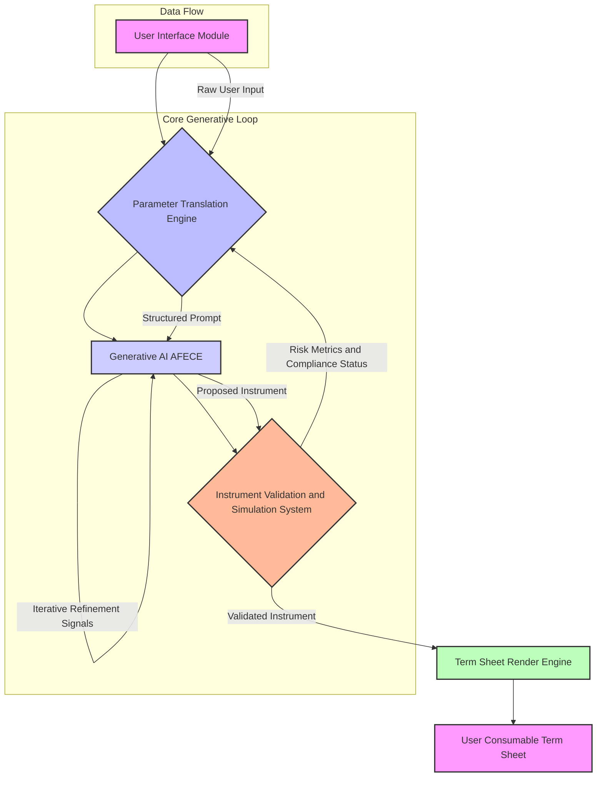
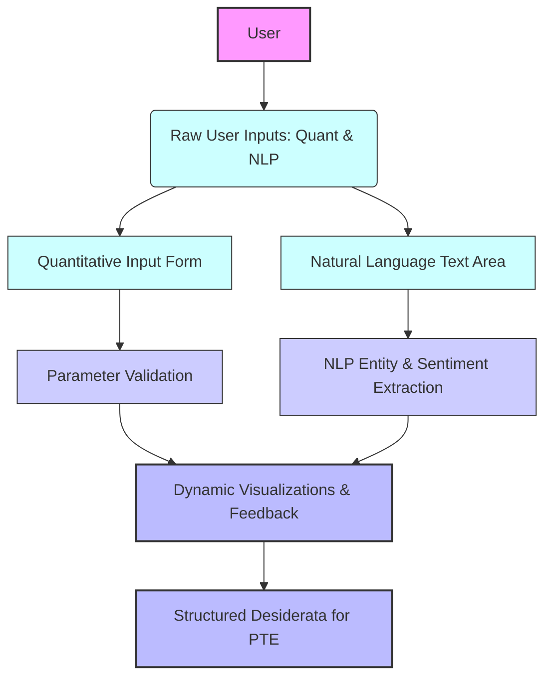
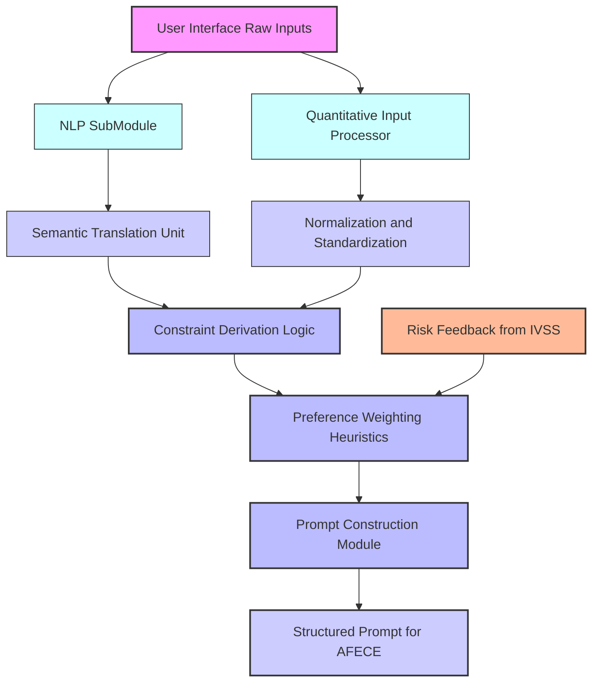
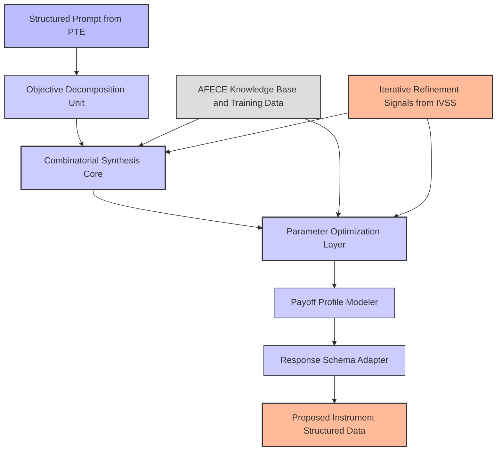
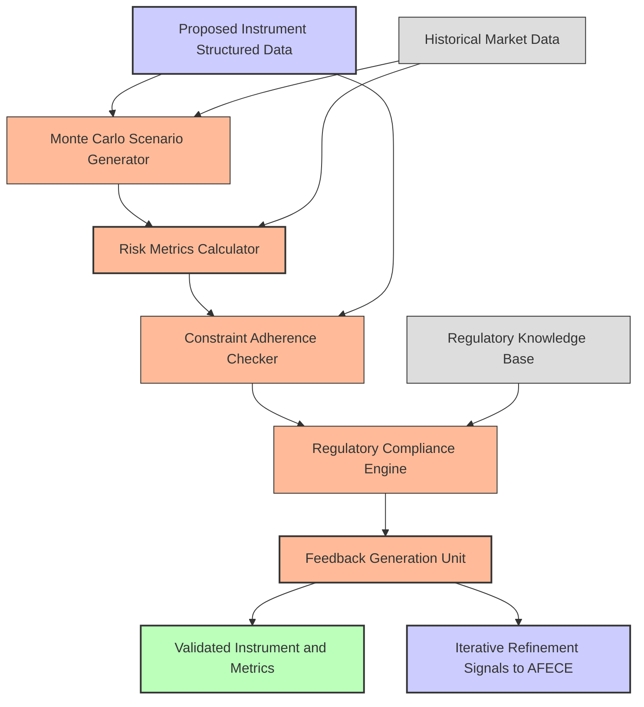
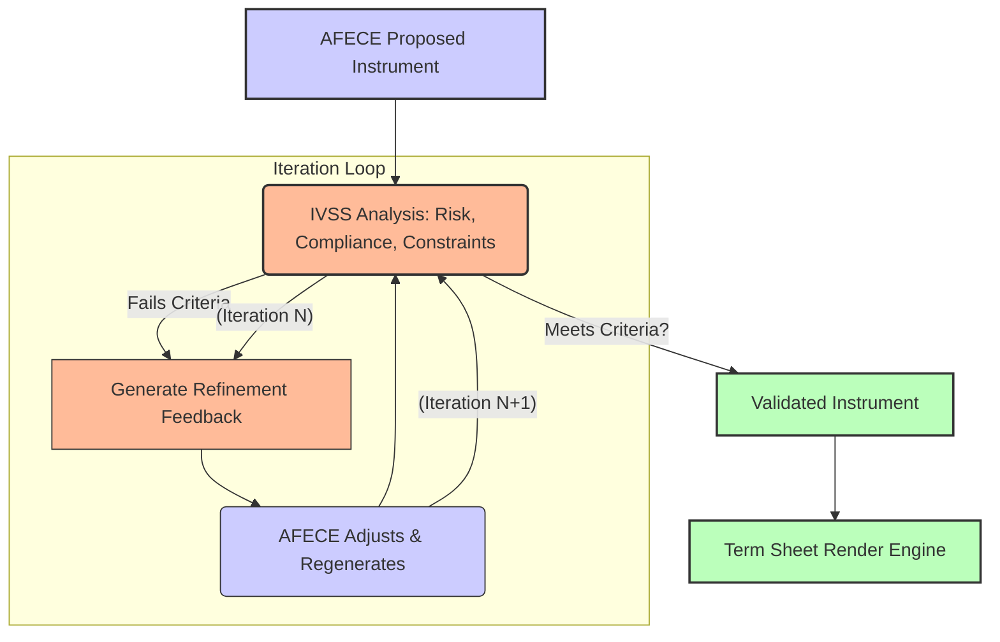
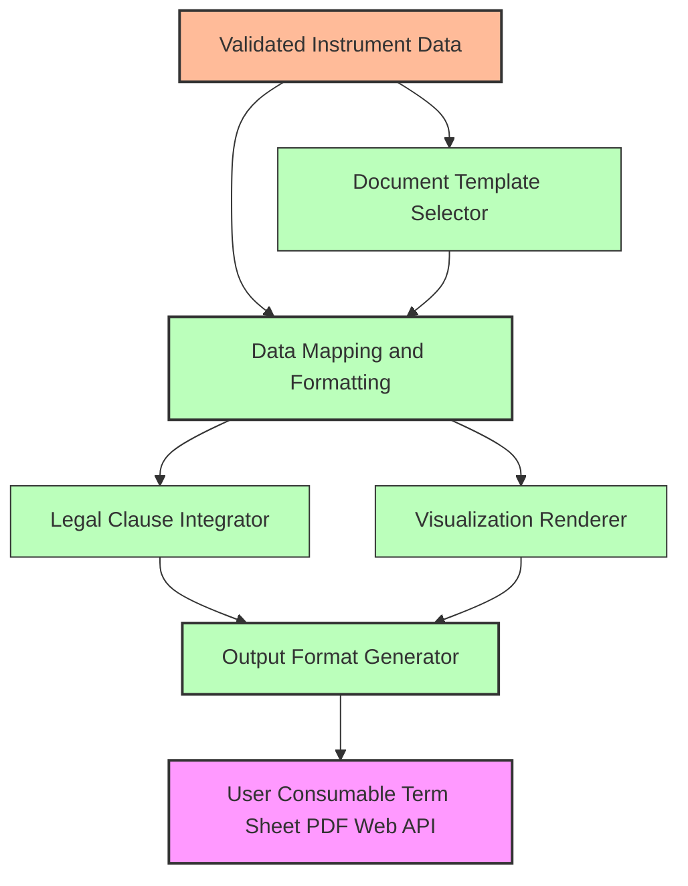
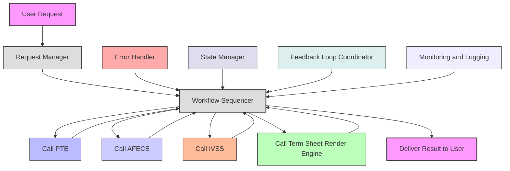
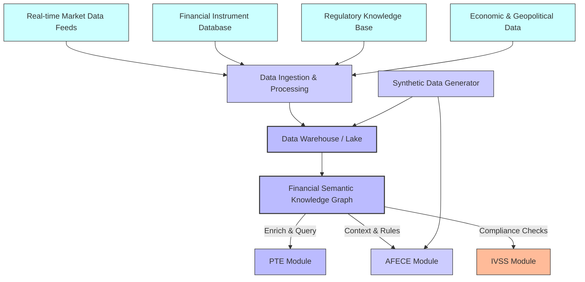

**Title of Invention:** A System and Method for the Autonomous Generative Synthesis and Validation of Bespoke Financial Instruments

**Abstract:**
A sophisticated computational framework is presented for the autonomous generative synthesis of novel financial instruments. This invention transcends traditional financial engineering paradigms by empowering an intelligent system to fabricate bespoke financial products precisely aligned with nuanced investor objectives. A user provides a comprehensive set of multidimensional parameters, encompassing explicit financial desiderata such as quantitative risk tolerance metrics, desired yield profiles, principal protection mandates, and implicit strategic objectives articulated via natural language. These parameters are meticulously transduced into a structured prompt, serving as an instruction set for a highly specialized generative artificial intelligence model. This model, architected upon principles of advanced financial econometrics and combinatorial optimization, autonomously designs and articulates a novel financial instrument, such as a highly customized structured note, a multi-layered hybrid derivative, or an algorithmic trading strategy, specifically tailored to the user's granular specifications. The system subsequently outputs a meticulously detailed and legally congruent term sheet, comprehensively enumerating the instrument's nomenclature, constituent components, precise contractual terms, and explicit payoff profile under diverse market conditions, thereby fundamentally altering the landscape of financial product creation and accessibility, and often incorporating an iterative refinement process to ensure optimal alignment.

**Background of the Invention:**
The contemporary financial ecosystem is characterized by an enduring chasm between the intricate and evolving needs of diverse investor profiles and the limited, standardized offerings available from traditional financial institutions. The design and issuance of complex financial instruments, such as structured products or bespoke derivatives, are historically the exclusive domain of highly specialized quantitative analysts and financial engineers within large investment banks. This process is inherently resource-intensive, often proprietary, and typically yields "one-size-for-all" products, which, while broadly marketable, invariably fail to precisely align with the granular risk-reward profiles, idiosyncratic liquidity requirements, or specific socio-ethical investment mandates of individual investors, family offices, or smaller institutional entities. This architectural rigidity leads to suboptimal asset allocation, unaddressed market inefficiencies, and a systemic lack of truly personalized financial solutions, creating "financial product deserts" for many. The absence of an accessible, systematic, and automated methodology for an individual or a non-specialized institution to articulate unique financial requirements and subsequently generate a precisely corresponding, validated financial product constitutes a critical technological and market gap, leading to diminished utility realization for a substantial segment of the investor population.

**Brief Summary of the Invention:**
The present invention introduces a revolutionary computational architecture, herein termed the "Financial Instrument Synthesizer" or "Forge," which serves as an advanced interface for the dynamic definition and instantiation of custom financial instruments. A user, leveraging either a sophisticated graphical user interface incorporating tunable parameters [e.g., sliders for risk, input fields for target yield, dropdowns for market exposure] or an advanced natural language processing module, articulates their investment desiderata [e.g., "I require a steady quarterly income stream with exposure to emerging market technology growth, absolute principal preservation, and a maximum downside volatility of 8% annualized"]. The system processes these diverse inputs, translating them through a sophisticated `ParameterTranslationEngine` into a highly structured, semantically rich prompt. This prompt is then transmitted to an `Autonomous Financial Engineering Cognizance Engine` [AFECE], a state-of-the-art generative AI model operating as a virtual, hyper-efficient financial engineer. The AFECE's core function is to synthesize novel combinations of underlying financial primitives [e.g., zero-coupon bonds, call options, put options, swaps, futures, credit default swaps, annuities, or baskets of equities] to construct a bespoke financial product that precisely optimizes the user's multi-objective utility function. The AFECE then generates a structured data object describing this newly designed instrument. This object is subsequently fed into an `InstrumentValidationSimulationSystem` [IVSS] for rigorous stress testing, scenario analysis, and compliance verification. Finally, a `TermSheetRenderEngine` transforms the validated, structured output into a comprehensive, professional-grade term sheet, providing the user with a fully specified and deployable financial instrument, often after several iterations of refinement between the AFECE and IVSS.

**Detailed Description of the Invention:**

The architecture of the "Financial Instrument Synthesizer" is a multi-modular, distributed system designed for high-fidelity generative finance. Its primary components include the User Interface UI Module, the Parameter Translation Engine, the Autonomous Financial Engineering Cognizance Engine AFECE, the Instrument Validation and Simulation System IVSS, the Term Sheet Render Engine, and an overarching Orchestration Layer.

### System Architecture Overview

The system operates as a sophisticated closed-loop generative design and validation pipeline.


*Figure 1: High-Level System Architecture of the Financial Instrument Synthesizer Forge*

### 1. User Interface UI Module

The UI Module serves as the initial point of interaction. It is designed for intuitive and comprehensive capture of user investment parameters, facilitating both explicit quantitative inputs and nuanced qualitative desiderata.

*   **Quantitative Inputs:** This includes sliders, input fields, and dropdown menus for parameters such as:
    *   `Principal Protection`: A percentage value [e.g., 0% to 100%] indicating the desired capital preservation at maturity.
    *   `Target Annualized Yield`: A specific percentage or a range, representing the desired return profile.
    *   `Market Exposure`: Selection of underlying assets or indices [e.g., S&P 500, NASDAQ, MSCI Emerging Markets, specific commodity baskets, interest rate curves, credit indices, cryptocurrencies].
    *   `Investment Horizon Term`: Duration in months or years.
    *   `Liquidity Preference`: [e.g., daily, monthly, quarterly, at maturity].
    *   `Max Drawdown Tolerance`: A percentage value specifying the maximum permissible temporary loss from a peak value.
    *   `Volatility Tolerance`: Expressed as a standard deviation percentage.
    *   `Income Frequency`: [e.g., monthly, quarterly, semi-annually].
    *   `ESG Environmental Social Governance Alignment Scores`: Filters for underlying assets based on sustainability criteria.

*   **Qualitative Inputs Natural Language Processing - NLP:** An advanced text input field allows users to describe their goals in natural language [e.g., "I want steady income with some stock market upside but I absolutely cannot lose my principal, and I want exposure to renewable energy companies without excessive tech sector concentration"]. An integrated NLP sub-module extracts named entities, sentiment, financial concepts, and implicit constraints from the natural language input, translating them into structured, machine-readable attributes.
*   **Dynamic Visualizations and Feedback:** The UI may also incorporate dynamic visualizations that provide real-time feedback on the potential impact of parameter adjustments, allowing users to intuitively explore the utility landscape of their preferences and understand the trade-offs involved in instrument design. This includes adaptive forms that guide the user based on previous inputs.


*Figure 7: User Interface Module Detailed Interaction Flow*

### 2. Parameter Translation Engine PTE

The PTE is a critical intermediary, responsible for converting the diverse inputs from the UI Module into a unified, semantically coherent, and machine-executable structured prompt for the AFECE. This involves:

*   **Normalization and Standardization:** Ensuring all input parameters are in a consistent format and unit.
*   **Constraint Derivation:** Inferring implicit constraints from qualitative statements [e.g., "cannot lose my principal" directly translates to `PrincipalProtection: 100%`]. It may leverage an internal **Financial Semantic Knowledge Graph** to disambiguate terms, infer relationships between financial concepts, and ensure that the structured prompt is not only syntactically correct but also semantically robust. This also includes `Dynamic Constraint Propagation`, where adjusting one parameter automatically suggests or modifies related constraints to maintain internal consistency.
*   **Preference Weighting:** Assigning relative importance or weights to different user preferences, either explicitly by the user or implicitly through an internal heuristic engine, potentially informed by user behavior analytics.
*   **Prompt Construction:** Assembling the structured parameters into a sophisticated instruction set for the generative AI model, potentially incorporating few-shot examples, chain-of-thought reasoning directives, and dynamic response schema adaptation.

**Parameter Translation Engine Detailed Workflow**

*Figure 2: Parameter Translation Engine Detailed Workflow*

**Example Prompt Structure:**
```json
{
  "role": "financial_engineer",
  "task": "design_structured_instrument",
  "constraints": {
    "principal_protection_level": 1.0,
    "market_exposure_indices": ["S&P 500", "MSCI World Renewable Energy Index"],
    "investment_term_years": 7,
    "max_annual_volatility": 0.08,
    "min_income_frequency": "quarterly",
    "esg_alignment_score_min": 0.75
  },
  "objectives": {
    "target_annual_yield": { "min": 0.05, "max": 0.07 },
    "upside_participation_preference": "high",
    "downside_risk_mitigation": "strong"
  },
  "response_schema_id": "SCHEMA_V2_BESPOKE_NOTE",
  "reasoning_directive": "Employ a multi-asset compositional strategy focusing on convexity and income generation. Provide a step-by-step rationale for component selection."
}
```

### 3. Autonomous Financial Engineering Cognizance Engine AFECE

The AFECE is the core generative component, embodying a paradigm shift from rule-based financial product design to adaptive, intelligent synthesis. It is a highly specialized large language model LLM or a composite AI system trained on an expansive corpus of financial engineering literature, historical market data, derivative pricing models, regulatory frameworks, and millions of existing financial product specifications.

*   **Architecture:** Beyond transformer architectures, the AFECE can be a hybrid system integrating **Generative Adversarial Networks GANs** for diverse instrument generation, **Reinforcement Learning from Human Feedback RLHF** to align generated instruments with expert financial intuition and ethical guidelines, and **Bayesian Optimization** for fine-tuning complex component parameters. It functions as an expert system capable of combinatorial reasoning over financial primitives, trained on both real-world financial data and **synthetically generated market scenarios, expert-annotated financial instrument blueprints, and regulatory rulings**. This allows the AFECE to learn complex, non-linear dependencies and to innovate beyond existing product templates.
*   **Generative Process:** Upon receiving the structured prompt, the AFECE performs the following:
    1.  **Decomposition:** Breaks down the user's objectives into fundamental financial building blocks [e.g., principal protection implies zero-coupon bond component; upside participation implies call options].
    2.  **Combinatorial Synthesis:** Explores a vast, non-linear space of financial instrument compositions, combining various derivatives [options, futures, swaps], fixed-income instruments, and equity components.
    3.  **Parameterization:** Determines optimal parameters for each component [e.g., strike prices, maturities, notional amounts, participation rates, coupon structures] to align with the specified utility function.
    4.  **Payoff Profile Modeling:** Constructs the aggregated payoff function of the synthesized instrument under various market scenarios.
    5.  **Structured Output Generation:** Formulates a detailed, machine-readable JSON representation of the proposed instrument, adhering to a predefined and dynamically adaptable `responseSchema`.
*   **Explainable AI XAI for AFECE:** The AFECE is designed to provide clear, step-by-step rationales for its instrument design choices, detailing how each component contributes to fulfilling the user's objectives and constraints. This **Explainable AI** feature is critical for transparency, auditability, and user trust, providing insights into the combinatorial reasoning process.

**AFECE Generative Process Detail**

*Figure 3: AFECE Generative Process Detailed Workflow*

**Dynamic Response Schema Example Expanded:**
```json
{
  "type": "OBJECT",
  "properties": {
    "instrumentName": { "type": "STRING", "description": "A unique, descriptive name for the generated financial instrument." },
    "instrumentType": { "type": "STRING", "description": "Categorization [e.g., Structured Note, Equity-Linked Note, Principal Protected Note, Hybrid Derivative, Certificate]." },
    "underlyingAssets": {
      "type": "ARRAY",
      "items": {
        "type": "OBJECT",
        "properties": {
          "assetIdentifier": { "type": "STRING", "description": "Ticker symbol, ISIN, or index name." },
          "assetType": { "type": "STRING", "description": "Equity, Index, Bond, Commodity, FX, Credit, InterestRate." },
          "weighting": { "type": "NUMBER", "description": "Proportional weighting within a basket, if applicable." }
        },
        "required": ["assetIdentifier", "assetType"]
      },
      "description": "A list of primary underlying assets or indices."
    },
    "components": {
      "type": "ARRAY",
      "items": {
        "type": "OBJECT",
        "properties": {
          "componentType": { "type": "STRING", "description": "ZeroCouponBond, CallOption, PutOption, SwapLeg, Forward, Annuity." },
          "underlying": { "type": "STRING", "description": "Identifier of the specific underlying asset for this component." },
          "strikePrice": { "type": "NUMBER", "nullable": true, "description": "Applicable for options/forwards." },
          "maturityDate": { "type": "STRING", "format": "date", "description": "Maturity or expiry date of the component." },
          "notionalAmount": { "type": "NUMBER", "description": "Notional value or principal allocation for this component." },
          "parameters": {
            "type": "OBJECT",
            "additionalProperties": true,
            "description": "Component-specific parameters [e.g., participation rate, coupon rate, barrier levels, reset frequency, leverage factor]."
          }
        },
        "required": ["componentType", "underlying", "maturityDate", "notionalAmount"]
      },
      "description": "Detailed breakdown of the financial primitives constituting the instrument."
    },
    "principalProtection": { "type": "NUMBER", "description": "Guaranteed principal return percentage at maturity." },
    "payoffFormula": { "type": "STRING", "description": "Mathematical expression defining the instrument's payoff at maturity or during its life. E.g., `Notional * (1 + Max(0, ParticipationRate * (SPX_Final / SPX_Initial - 1))) + ZeroCouponBondYield`." },
    "keyTerms": {
      "type": "OBJECT",
      "properties": {
        "issueDate": { "type": "STRING", "format": "date" },
        "maturityDate": { "type": "STRING", "format": "date" },
        "denomination": { "type": "STRING", "description": "e.g., USD" },
        "minSubscriptionAmount": { "type": "NUMBER" },
        "listingExchange": { "type": "STRING", "nullable": true },
        "issuer": { "type": "STRING", "description": "Placeholder for the hypothetical issuer entity." }
      }
    },
    "summary": { "type": "STRING", "description": "A concise, plain-language description of the instrument's features and benefits." },
    "riskFactors": { "type": "ARRAY", "items": { "type": "STRING" }, "description": "A list of identified risks associated with the instrument." },
    "simulationResults": {
      "type": "OBJECT",
      "properties": {
        "expectedReturnAnnualized": { "type": "NUMBER" },
        "volatilityAnnualized": { "type": "NUMBER" },
        "maxDrawdownSimulated": { "type": "NUMBER" },
        "probabilityOfPrincipalLoss": { "type": "NUMBER" },
        "sharpeRatioSimulated": { "type": "NUMBER" }
      },
      "description": "Placeholder for metrics generated by the IVSS."
    },
    "regulatoryCompliance": { "type": "ARRAY", "items": { "type": "STRING" }, "description": "Identified regulatory categories or specific compliance notes [e.g., MiFID II, Dodd-Frank, PRIIPs]." }
  }
}
```

**Example AFECE Response for a Complex Requirement:**
```json
{
  "instrumentName": "Global Sustainable Equity Principal Guaranteed Income Note SPG-EIN",
  "instrumentType": "Structured Note",
  "underlyingAssets": [
    { "assetIdentifier": "MSCI_World_ESG_Leaders_Index", "assetType": "Index", "weighting": 0.7 },
    { "assetIdentifier": "Custom_Renewable_Energy_Basket", "assetType": "Equity", "weighting": 0.3 }
  ],
  "components": [
    {
      "componentType": "ZeroCouponBond",
      "underlying": "Cash",
      "maturityDate": "2031-10-26",
      "notionalAmount": 100000,
      "parameters": { "yieldRate": 0.045 }
    },
    {
      "componentType": "CallOption",
      "underlying": "MSCI_World_ESG_Leaders_Index",
      "strikePrice": 1.0,
      "maturityDate": "2031-10-26",
      "notionalAmount": 70000,
      "parameters": { "participationRate": 0.65, "europeanExercise": true }
    },
    {
      "componentType": "CallSpreadOption",
      "underlying": "Custom_Renewable_Energy_Basket",
      "strikePrice": 1.05,
      "maturityDate": "2031-10-26",
      "notionalAmount": 30000,
      "parameters": { "upperStrike": 1.25, "participationRate": 0.8, "europeanExercise": true }
    },
    {
      "componentType": "VanillaOption_ShortPut",
      "underlying": "USD_JPY_FX",
      "strikePrice": 155,
      "maturityDate": "2031-10-26",
      "notionalAmount": 50000,
      "parameters": { "premiumReceived": 2500, "description": "Monetized to fund higher participation." }
    }
  ],
  "principalProtection": 100,
  "payoffFormula": "Min(Notional * (1 + ZeroCouponBondYield), Notional) + (ParticipationRate_MSCI * Max(0, (MSCI_Final / MSCI_Initial - 1))) + (ParticipationRate_RE * Max(0, Min(RE_Final / RE_Initial - 1.05, 0.2))) - PremiumPaidForFundingOptions",
  "keyTerms": {
    "issueDate": "2024-10-26",
    "maturityDate": "2031-10-26",
    "denomination": "USD",
    "minSubscriptionAmount": 100000,
    "listingExchange": null,
    "issuer": "Hypothetical Global Financial Corp."
  },
  "summary": "This Global Sustainable Equity Principal Guaranteed Income Note offers 100% principal protection at maturity, providing substantial participation in the MSCI World ESG Leaders Index (65%) and enhanced, capped exposure to a custom basket of renewable energy companies (80% participation up to a 25% gain). Income generation is implicitly handled by the bond component's yield, and a covered short put option on USD/JPY funds increased equity participation.",
  "riskFactors": [
    "Market risk related to equity index performance.",
    "Credit risk of the hypothetical bond issuer.",
    "Liquidity risk if attempting to sell prior to maturity.",
    "Currency risk from the USD/JPY option component.",
    "Specific sector concentration risk in renewable energy."
  ],
  "simulationResults": {
    "expectedReturnAnnualized": 0.062,
    "volatilityAnnualized": 0.075,
    "maxDrawdownSimulated": 0.0,
    "probabilityOfPrincipalLoss": 0.0,
    "sharpeRatioSimulated": 0.85
  },
  "regulatoryCompliance": ["PRIIPs Compliant EU", "Suitable for Retail Investors Hypothetical Jurisdiction"]
}
```

### 4. Instrument Validation and Simulation System IVSS

The IVSS receives the AFECE's proposed instrument and performs a rigorous multi-faceted analysis to ensure its viability, risk profile adherence, and regulatory compliance.

*   **Quantitative Validation:**
    *   **Monte Carlo Simulation:** Generates thousands of stochastic market scenarios [e.g., using Geometric Brownian Motion, jump diffusion models, or historical bootstrapping for underlying assets] to project the instrument's payoff profile and evaluate its performance under stress. Beyond standard Monte Carlo, the IVSS employs **Historical Bootstrapping** for scenario generation, `Jump-Diffusion Models` for assets prone to sudden shocks, and **GARCH models** for dynamic volatility estimation.
    *   **Risk Metrics Calculation:** Computes key risk metrics such as Value at Risk VaR, Conditional Value at Risk CVaR, Sharpe Ratio, Sortino Ratio, maximum drawdown, and probability of principal loss across various confidence levels. It also conducts comprehensive `Correlation Stress Testing` to understand instrument behavior under strained inter-asset relationships and `Liquidity Stress Testing` to assess market impact during exit scenarios. Furthermore, `Counterparty Risk Analysis` for derivative components and `Systemic Risk Proxies` are evaluated.
    *   **Sensitivity Analysis Greeks:** Calculates delta, gamma, vega, theta, and rho for the instrument as a whole, providing insights into its sensitivity to market changes.
*   **Constraint Adherence Check:** Verifies that all user-specified constraints [e.g., principal protection, max volatility, target yield range] are met or flags deviations.
*   **Regulatory & Compliance Scoring:** An integrated knowledge base of financial regulations [e.g., MiFID II, Dodd-Frank, PRIIPs, local jurisdiction rules] and compliance guidelines evaluates the instrument's structure for potential legal or regulatory conflicts. This module can generate a "Regulatory Compliance Score" and identify specific issues.
*   **Feedback Loop:** If the instrument fails to meet critical constraints or exhibits unacceptable risk characteristics, the IVSS can generate structured feedback to the AFECE for iterative refinement, guiding the generative model towards a more compliant and optimal design. The IVSS's feedback loop is not merely a pass/fail check but an **optimization signal**, guiding the AFECE towards increasingly optimal solutions within the user's defined utility function and constraints. This iterative process, akin to a multi-objective evolutionary algorithm, allows for the discovery of truly bespoke and highly efficient financial structures.

**IVSS Validation Loop Detailed Workflow**

*Figure 4: Instrument Validation and Simulation System Detailed Workflow*


*Figure 8: Iterative AFECE-IVSS Refinement Cycle*

### 5. Term Sheet Render Engine

Upon successful validation by the IVSS, the `TermSheetRenderEngine` takes the comprehensive structured JSON output and formats it into a professional, legally-styled document. This engine is capable of generating:

*   **PDF Documents:** High-quality, printable term sheets.
*   **Interactive Web Displays:** Dynamic visualizations of payoff profiles, scenario analysis, and risk breakdowns.
*   **APIs:** For integration with other financial platforms or reporting tools.

This module ensures clarity, accuracy, and adherence to industry-standard documentation practices. The engine integrates with **legal knowledge bases** to ensure boilerplate clauses, disclaimers, and regulatory disclosures are automatically included and contextually relevant. It supports `version control` for term sheets and can be configured for `multi-jurisdictional compliance`, generating documents tailored to specific regulatory environments like `SEC`, `ESMA`, `FCA`.

**Term Sheet Render Engine Detailed Workflow**

*Figure 5: Term Sheet Render Engine Detailed Workflow*

### 6. Orchestration Layer

This layer manages the workflow between all modules, handling data routing, error management, state management, and ensures the seamless execution of the entire generative design process. It coordinates the iterative refinement process between the IVSS and AFECE. Implemented typically as a **microservices architecture**, this layer ensures high availability, fault tolerance, and modularity. It manages **containerized deployments** of each module, facilitates secure inter-module communication, and incorporates `distributed tracing` and `centralized logging` for comprehensive operational oversight. Future enhancements include integration with `Distributed Ledger Technology DLT` for immutable audit trails of instrument design and validation.

**Orchestration Layer Detailed Workflow**

*Figure 6: Orchestration Layer Detailed Workflow*

### 7. Advanced Data and Knowledge Management

The integrity and performance of the Financial Instrument Synthesizer fundamentally rely on a robust and continuously updated data and knowledge infrastructure. This includes:

*   **Real-time Market Data Feeds:** Ingesting and processing live and historical data for equities, indices, fixed income, commodities, foreign exchange, and various derivatives. This requires high-throughput data pipelines and robust data warehousing solutions.
*   **Financial Instrument Database:** A comprehensive, categorized database of existing financial instruments, their structures, components, and historical performance. This serves as a vital training corpus and reference for the AFECE.
*   **Regulatory Knowledge Base:** A dynamic repository of global and local financial regulations, compliance guidelines, and legal precedents. This powers the IVSS's compliance checks and the Term Sheet Render Engine's legal clause integration.
*   **Economic and Geopolitical Data:** Incorporating macroeconomic indicators, geopolitical events, and sectoral analyses to enrich scenario generation in the IVSS and contextualize instrument design in the AFECE.
*   **Financial Semantic Knowledge Graph:** A graph-based representation of financial concepts, relationships, and taxonomies, used by the PTE and AFECE for intelligent parsing, constraint derivation, and structured reasoning. This knowledge graph is continuously enriched through automated information extraction and expert curation.
*   **Synthetic Data Generation:** Utilizing advanced statistical and generative models to create realistic synthetic financial data and instrument configurations, particularly useful for augmenting training sets and exploring edge cases where real-world data might be scarce.


*Figure 9: Advanced Data and Knowledge Management Overview*

### 8. Security, Ethics, and Regulatory Compliance Framework

Given the sensitive nature of financial operations and personalized investment, the system incorporates a stringent framework for security, ethical considerations, and continuous regulatory adherence.

*   **Cybersecurity:**
    *   **Data Encryption:** All sensitive user data and generated financial instrument details are encrypted at rest and in transit using industry-standard protocols [e.g., AES-256, TLS 1.3].
    *   **Access Control:** Role-Based Access Control RBAC mechanisms ensure that only authorized personnel and modules can access specific data and functionalities.
    *   **Secure API Design:** All inter-module communication occurs via authenticated and authorized APIs, minimizing attack surfaces.
    *   **Regular Security Audits:** Independent security audits and penetration testing are conducted regularly to identify and mitigate vulnerabilities.
*   **Data Privacy:**
    *   **Anonymization and Pseudonymization:** User-specific investment desiderata can be anonymized or pseudonymized where feasible to protect individual privacy while enabling model training and system improvements.
    *   **GDPR and CCPA Compliance:** Adherence to global data privacy regulations is paramount, with mechanisms for data subject rights management.
*   **Ethical AI in Finance:**
    *   **Bias Detection and Mitigation:** Continuous monitoring for algorithmic bias in instrument generation, particularly concerning disparate outcomes for different user profiles or investment objectives. The AFECE's training data and objective functions are regularly vetted to prevent the propagation of historical biases.
    *   **Fairness and Transparency:** Ensuring that the generated instruments are fundamentally fair and that the system's decision-making process is transparent, facilitated by the Explainable AI features.
    *   **Responsible Innovation:** A commitment to deploying AI in a manner that serves the best interests of investors and promotes financial stability, avoiding the creation of overly complex or opaque products that could contribute to systemic risk.
*   **Regulatory Compliance:**
    *   **Automated Policy Enforcement:** The IVSS's regulatory compliance engine automatically checks against predefined policy rules and legal frameworks, providing real-time feedback on adherence.
    *   **Auditability and Traceability:** Every step of the instrument design and validation process is logged and auditable, creating a comprehensive immutable record for regulatory scrutiny.
    *   **Dynamic Regulatory Updates:** The Regulatory Knowledge Base is continuously updated with changes in financial legislation, ensuring the system remains compliant in an evolving regulatory landscape.
    *   **Suitability and Appropriateness Assessments:** Tools within the UI and IVSS help ensure that the generated instrument is suitable for the user's risk profile and financial situation, aligning with regulations like `MiFID II` suitability rules.

```mermaid
graph TD
    User_Data[User Data & Input] --> Encrypt_Transit[Encryption In-Transit]
    Encrypt_Transit --> Access_Control[Role-Based Access Control]
    Access_Control --> Data_Storage[Encrypted Data Storage]
    Data_Storage --> Data_Anon[Anonymization/Pseudonymization]
    Data_Anon --> ML_Training[AI Model Training]
    ML_Training --> Bias_Detect[Bias Detection & Mitigation]
    Bias_Detect --> Ethical_Review[Ethical AI Review]
    Ethical_Review --> Reg_Comp_Check[Regulatory Compliance Check (IVSS)]
    Reg_Comp_Check --> Audit_Trail[Immutable Audit Trail]
    Audit_Trail --> Dynamic_Reg_Update[Dynamic Regulatory Updates (KB)]
    style User_Data fill:#f9f,stroke:#333,stroke-width:2px
    style Encrypt_Transit fill:#cff,stroke:#333,stroke-width:1px
    style Access_Control fill:#cff,stroke:#333,stroke-width:1px
    style Data_Storage fill:#ccf,stroke:#333,stroke-width:1px
    style Data_Anon fill:#ccf,stroke:#333,stroke-width:1px
    style ML_Training fill:#bbf,stroke:#333,stroke-width:2px
    style Bias_Detect fill:#fb9,stroke:#333,stroke-width:1px
    style Ethical_Review fill:#fb9,stroke:#333,stroke-width:1px
    style Reg_Comp_Check fill:#fb9,stroke:#333,stroke-width:2px
    style Audit_Trail fill:#bfb,stroke:#333,stroke-width:1px
    style Dynamic_Reg_Update fill:#bfb,stroke:#333,stroke-width:1px
```
*Figure 10: Security and Compliance Enforcement Flow*

### 9. Scalability, Deployment, and Explainable AI XAI

To meet the demands of a high-volume, real-time financial environment, the system is engineered for scalability and efficient deployment, with a strong emphasis on explainability.

*   **Cloud-Native Architecture:** Leveraging containerization [e.g., Docker, Kubernetes] and cloud computing platforms [e.g., AWS, Azure, GCP] for elastic scalability, robust resource management, and global deployment capabilities. This allows individual modules to scale independently based on demand.
*   **Distributed Computing:** computationally intensive tasks, such as Monte Carlo simulations within the IVSS or the generative inference within the AFECE, are distributed across multiple nodes or GPU clusters, significantly reducing processing times.
*   **API-First Design:** All modules expose well-defined APIs, facilitating seamless integration with existing financial infrastructures, third-party data providers, and front-end applications.
*   **Continuous Integration/Continuous Deployment CI/CD:** Automated pipelines ensure rapid, reliable, and frequent updates and deployments of the system, enabling agile response to market changes or new regulatory requirements.
*   **Explainable AI XAI Integration:**
    *   **Model Interpretability:** Employing techniques such as `LIME Local Interpretable Model-agnostic Explanations` or `SHAP SHapley Additive exPlanations` within the AFECE to explain individual design decisions, attributing the contribution of each input parameter and financial primitive to the final instrument structure.
    *   **Decision Audit Trails:** Maintaining detailed logs of the AFECE's reasoning process, component selection, and parameter choices, providing a clear audit trail for compliance officers and users.
    *   **Interactive Payoff Visualizations:** The Term Sheet Render Engine provides dynamic and interactive visualizations of payoff profiles under various market conditions, making complex instruments understandable to non-expert users. This includes `What-If Scenarios` where users can adjust market parameters and instantly see the impact on their instrument's performance.

This comprehensive approach ensures that the system is not only powerful and innovative but also robust, secure, auditable, and transparent, setting a new standard for intelligent financial product design.

```mermaid
graph TD
    User_Request[User Request] --> API_Gateway[API Gateway]
    API_Gateway --> K8S_Cluster[Kubernetes Cluster]
    subgraph Microservices (Containerized Modules)
        K8S_Cluster --> PTE_S[PTE Service]
        K8S_Cluster --> AFECE_S[AFECE Service]
        K8S_Cluster --> IVSS_S[IVSS Service]
        K8S_Cluster --> TSRE_S[TSRE Service]
    end
    AFECE_S -- XAI Explanations --> Audit_Log[Decision Audit Log]
    IVSS_S -- Performance Metrics --> Monitoring_Sys[Monitoring System]
    TSRE_S -- Interactive Visuals --> User_Client[User Frontend]
    Monitoring_Sys --> Alerting[Alerting System]
    Audit_Log --> Compliance_Auditors[Compliance & Auditors]
    Cloud_Provider[Cloud Provider Infrastructure] --> K8S_Cluster
    CI_CD[CI/CD Pipeline] --> K8S_Cluster
    style User_Request fill:#f9f,stroke:#333,stroke-width:2px
    style API_Gateway fill:#cff,stroke:#333,stroke-width:1px
    style K8S_Cluster fill:#bbf,stroke:#333,stroke-width:2px
    style PTE_S fill:#bbf,stroke:#333,stroke-width:1px
    style AFECE_S fill:#ccf,stroke:#333,stroke-width:1px
    style IVSS_S fill:#fb9,stroke:#333,stroke-width:1px
    style TSRE_S fill:#bfb,stroke:#333,stroke-width:1px
    style Audit_Log fill:#ddd,stroke:#333,stroke-width:1px
    style Monitoring_Sys fill:#ddd,stroke:#333,stroke-width:1px
    style User_Client fill:#f9f,stroke:#333,stroke-width:2px
    style Alerting fill:#faa,stroke:#333,stroke-width:1px
    style Compliance_Auditors fill:#ddd,stroke:#333,stroke-width:1px
    style Cloud_Provider fill:#eef,stroke:#333,stroke-width:1px
    style CI_CD fill:#dee,stroke:#333,stroke-width:1px
```
*Figure 11: Scalability, Deployment, and XAI Integration Architecture*

---

**Claims:**

1.  A system for the autonomous generative synthesis and validation of bespoke financial instruments, comprising:
    a.  A User Interface (UI) Module configured to receive a multidimensional set of investment desiderata from a user, including explicit quantitative parameters and implicit qualitative preferences via Natural Language Processing (NLP).
    b.  A Parameter Translation Engine (PTE) communicatively coupled to the UI Module, configured to process said desiderata, leverage a Financial Semantic Knowledge Graph, and generate a semantically rich, structured prompt with dynamic response schema.
    c.  An Autonomous Financial Engineering Cognizance Engine (AFECE), communicatively coupled to the PTE, comprising a generative artificial intelligence model trained on financial engineering principles, configured to receive said structured prompt and, in response, autonomously synthesize a novel financial instrument by combinatorially arranging and parameterizing financial primitives, generating a structured data object representing said instrument along with an Explainable AI (XAI) rationale for its design.
    d.  An Instrument Validation and Simulation System (IVSS), communicatively coupled to the AFECE, configured to receive said structured data object, perform rigorous quantitative risk assessment, stochastic scenario simulation using advanced models, and comprehensive regulatory compliance checks, and further configured to provide iterative refinement feedback as an optimization signal to the AFECE.
    e.  A Term Sheet Render Engine, communicatively coupled to the IVSS, configured to receive the validated structured data object and generate a comprehensive, professional-grade, multi-jurisdictional compliant term sheet with interactive visualizations.

2.  The system of Claim 1, wherein the AFECE employs a hybrid architecture integrating transformer-based generative models, Generative Adversarial Networks (GANs) for diverse instrument generation, Reinforcement Learning from Human Feedback (RLHF) for alignment with expert intuition, and Bayesian Optimization for parameter fine-tuning.

3.  The system of Claim 1, wherein the structured data object generated by the AFECE includes attributes detailing instrument type, a breakdown of constituent financial components with parameters, a mathematical payoff formula, key contractual terms, a plain-language summary, identified risk factors, and placeholder fields for simulation and regulatory compliance results.

4.  The system of Claim 1, wherein the IVSS utilizes Monte Carlo simulations with Historical Bootstrapping, Jump-Diffusion Models, and GARCH models for scenario generation, and computes risk metrics including Value at Risk (VaR), Conditional Value at Risk (CVaR), Sharpe Ratio, Sortino Ratio, maximum drawdown, probability of principal loss, as well as conducting Correlation, Liquidity, Counterparty, and Systemic Risk Stress Testing.

5.  The system of Claim 1, wherein the IVSS integrates a dynamic Regulatory Knowledge Base to assess instrument compliance with frameworks such as MiFID II, Dodd-Frank, PRIIPs, and local jurisdiction rules, generating a compliance score and enabling automated policy enforcement and suitability assessments.

6.  The system of Claim 1, wherein the Term Sheet Render Engine supports multi-jurisdictional compliance, integrates legal boilerplate clauses from a legal knowledge base, and provides dynamic interactive web displays of payoff profiles and scenario analysis for enhanced user comprehension.

7.  The system of Claim 1, further comprising an Orchestration Layer managing inter-module workflow, state, error handling, and coordinating the iterative refinement process, implemented as a cloud-native microservices architecture with distributed tracing and centralized logging.

8.  The system of Claim 1, further comprising an Advanced Data and Knowledge Management system including real-time market data feeds, a comprehensive financial instrument database, a dynamic regulatory knowledge base, economic and geopolitical data, a financial semantic knowledge graph, and synthetic data generation capabilities.

9.  A method for the autonomous generative synthesis and validation of bespoke financial instruments, comprising the steps of:
    a.  Receiving, via a User Interface (UI) Module, a multidimensional set of investment desiderata from a user, including natural language inputs processed by an NLP sub-module.
    b.  Translating said desiderata by a Parameter Translation Engine (PTE) into a semantically rich, structured prompt using normalization, constraint derivation, dynamic constraint propagation, and preference weighting.
    c.  Transmitting said structured prompt to an Autonomous Financial Engineering Cognizance Engine (AFECE).
    d.  Receiving, from the AFECE, a structured data object representing a novel financial instrument autonomously synthesized through objective decomposition, combinatorial synthesis, parameter optimization, and payoff profile modeling, along with an XAI rationale.
    e.  Transmitting said structured data object to an Instrument Validation and Simulation System (IVSS) for rigorous quantitative risk assessment, stochastic scenario simulation, calculation of financial sensitivities (Greeks), and comprehensive regulatory compliance checks.
    f.  Providing iterative refinement feedback from the IVSS to the AFECE, acting as an optimization signal, and repeating steps c through e until predefined criteria are met.
    g.  Generating, by a Term Sheet Render Engine, a comprehensive, professional-grade, multi-jurisdictional compliant term sheet from the validated structured data object, and displaying said term sheet to the user.

10. The method of Claim 9, further comprising the steps of: ensuring cybersecurity through data encryption and access control; upholding data privacy via anonymization and GDPR/CCPA compliance; mitigating algorithmic bias and ensuring fairness through ethical AI review; and maintaining auditability and traceability of all design and validation steps for regulatory scrutiny, incorporating continuous integration/continuous deployment (CI/CD) practices.

---
**Mathematical Justification: The Foundational Theoretical Framework**

The present invention is underpinned by a profound integration of advanced mathematical concepts spanning topology, measure theory, functional analysis, stochastic calculus, optimization theory, and modern machine learning. It fundamentally addresses the problem of inverse financial engineering by transforming a traditionally intractable search problem within a finite, pre-defined space into a computationally feasible generative problem within a vast, potentially infinite, continuous financial instrument manifold.

### Class of Mathematics 1: The Formal Axiomatic Definition of `I`, the Universal Instrument Space (20 Equations)

Let `P` denote the finite set of fundamental financial primitives, such as zero-coupon bonds (ZCB), European call options (C), European put options (P), forward contracts (F), interest rate swaps (IRS), credit default swaps (CDS), and elementary equity positions (EQ). Each primitive `p in P` is characterized by a set of intrinsic parameters.

**1.1. Primitive Definitions and Payoff Functions**

A **Zero-Coupon Bond (ZCB)** `b` with face value `FV`, maturity `T_m`, and current market value `B_0`:
$B_0 = FV \cdot e^{-r T_m} \quad (1)$
Its payoff at maturity is simply:
$Payoff_{ZCB}(T_m) = FV \quad (2)$

A **European Call Option** `c` on an underlying asset `S` (price at time `t` is $S_t$), defined by strike price `K`, maturity `T_m`, and nominal quantity `N`. Its payoff at maturity is:
$Payoff_C(S_{T_m}, K, N) = N \cdot \max(0, S_{T_m} - K) \quad (3)$
The Black-Scholes-Merton (BSM) price for a European call at time `t` is:
$C(S_t, K, T, r, \sigma) = S_t N(d_1) - K e^{-rT} N(d_2) \quad (4)$
where $T = T_m - t$ is time to maturity, $r$ is risk-free rate, $\sigma$ is volatility, and:
$d_1 = \frac{\ln(S_t/K) + (r + \sigma^2/2)T}{\sigma\sqrt{T}} \quad (5)$
$d_2 = d_1 - \sigma\sqrt{T} \quad (6)$
$N(x)$ is the cumulative standard normal distribution function.

A **European Put Option** `p` is defined similarly. Its payoff at maturity is:
$Payoff_P(S_{T_m}, K, N) = N \cdot \max(0, K - S_{T_m}) \quad (7)$
The BSM price for a European put at time `t` is:
$P(S_t, K, T, r, \sigma) = K e^{-rT} N(-d_2) - S_t N(-d_1) \quad (8)$
Put-Call Parity states:
$C(S_t, K, T, r, \sigma) + K e^{-rT} = P(S_t, K, T, r, \sigma) + S_t \quad (9)$

An **Equity Position** `eq` (e.g., a stock or index) with current price $S_t$ and nominal quantity `N`. Its payoff is simply:
$Payoff_{EQ}(S_{T_m}, N) = N \cdot S_{T_m} \quad (10)$

A **Forward Contract** `f` on an asset `S` with delivery price `K` and maturity `T_m`, for a quantity `N`. Its payoff at maturity is:
$Payoff_F(S_{T_m}, K, N) = N \cdot (S_{T_m} - K) \quad (11)$

**1.2. Instrument Representation in Universal Space `I`**

The Universal Instrument Space, denoted `I`, is axiomatically defined as the set of all possible finite compositions and linear combinations of primitives from `P`, where each primitive is further characterized by a vector of specific, admissible parameters.
Formally, an instrument `i in I` can be represented as a tuple:
$i = [ \{ \alpha_k, p_k, \theta_k \}_{k=1}^M, \Psi ] \quad (12)$
where:
*   `M in N` is the number of distinct primitive components.
*   $\alpha_k \in \mathbb{R}$ is the weighting coefficient or notional allocation for the $k$-th primitive, potentially constrained to specific ranges (e.g., $\alpha_k > 0$ for long positions, $\alpha_k < 0$ for short positions, $|\alpha_k| \le Notional_{max}$).
*   $p_k \in P$ is the $k$-th financial primitive (e.g., $p_k \in \{ZCB, C, P, F, EQ, \dots\}$).
*   $\theta_k \in \Theta_k$ is a vector of specific parameters for primitive $p_k$. For instance, for a call option, $\theta_k = (K_k, T_k, N_k)$, where $K_k$ is the strike price, $T_k$ is the maturity, and $N_k$ is the notional. $\Theta_k$ denotes the admissible parameter space for $p_k$.
*   $\Psi$ represents the set of contractual clauses, triggers, and structural conditions that govern the interaction and sequencing of these primitives or modify their payoffs (e.g., early exercise conditions, barrier events, auto-callable features, participation rates, observation frequencies).

The total payoff of an instrument `i` at a given time $T_{obs}$ under a scenario $\omega$ is the sum of its components' payoffs, potentially modified by $\Psi$:
$Payoff(i, \omega, T_{obs}) = \sum_{k=1}^M \alpha_k \cdot Payoff_{p_k}(\theta_k, \omega, T_{obs}) + Payoff_\Psi(i, \omega, T_{obs}) \quad (13)$
where $Payoff_\Psi$ captures modifications by contractual clauses. For instance, a participation rate $\beta$ for an equity-linked component:
$Payoff_{ELN}(S_{T_m}) = N \cdot (1 + \beta \cdot \max(0, \frac{S_{T_m}}{S_0} - 1)) \quad (14)$

The parameter space $\Theta_k$ for a primitive $p_k$ is typically a constrained subset of $\mathbb{R}^d$:
$\Theta_k \subset [K_{min}, K_{max}] \times [T_{min}, T_{max}] \times [N_{min}, N_{max}] \times \dots \quad (15)$
The total notional value of an instrument $i$ can be expressed as:
$Notional_{Total}(i) = \sum_{k=1}^M |\alpha_k \cdot N_k| \quad (16)$

The space `I` is not merely a Cartesian product of primitive parameter spaces; rather, it is a highly structured, potentially non-convex manifold embedded within a higher-dimensional space. The dimensionality of `I` is effectively infinite in terms of potential complexity and parameter granularity. This formal definition ensures that the generative AI operates within a mathematically coherent and comprehensive domain.

**1.3. Example of a Barrier Option Clause**
A Down-and-Out Call Option with barrier $B < S_0$:
$Payoff_{DOC}(S_{T_m}, K, N, B) = N \cdot \max(0, S_{T_m} - K) \cdot \mathbb{I}(\min_{0 \le t \le T_m} S_t > B) \quad (17)$
where $\mathbb{I}(\cdot)$ is the indicator function.
This illustrates how $\Psi$ introduces path-dependency and non-linearity.

The collection of all possible instruments `i` forms an uncountable, high-dimensional space. The challenge is to efficiently navigate this space to find an optimal `i*`.
The current value of an instrument $V(i, t)$ can be expressed as the discounted expected payoff under a risk-neutral measure $\mathbb{Q}$:
$V(i, t) = \mathbb{E}^\mathbb{Q} [ e^{-r(T_m-t)} Payoff(i, S_{T_m}, \Psi) | \mathcal{F}_t ] \quad (18)$
The vector representation of an instrument $i$ can also be conceptualized as an embedding $\phi(i) \in \mathbb{R}^D$ where $D$ is the embedding dimension.
$\phi(i) = (\alpha_1, \theta_1, \alpha_2, \theta_2, \ldots, \alpha_M, \theta_M, \psi_{features}) \quad (19)$
where $\psi_{features}$ are numerical representations of clauses in $\Psi$.
The set of admissible notional weights for all components $k$ is $A = \{(\alpha_1, \dots, \alpha_M) : \sum_{k=1}^M |\alpha_k N_k| \le Notional_{budget}\}$.
The overall payoff function of an instrument $i$ is a composition of non-linear functions:
$P_{i}(S) = \sum_{k=1}^M \alpha_k \mathcal{P}_k(S, \theta_k) + \mathcal{F}_{\Psi}(S, i) \quad (20)$

### Class of Mathematics 2: The Hyper-Dimensional Utility Manifold `U` and its Metric Space (20 Equations)

A user's investment preferences are represented as a vector $\mathbf{U} \in \mathcal{U}$, where $\mathcal{U}$ is a hyper-dimensional utility manifold. Each dimension in $\mathcal{U}$ corresponds to a distinct financial desideratum or constraint.
$\mathbf{U} = (u_1, u_2, \dots, u_N) \quad (21)$
where $u_j$ can represent:
*   **Quantitative Metrics:** Target annual yield ($u_{Yield}$), principal protection level ($u_{PP} \in [0,1]$), maximum acceptable volatility ($u_{Vol}$), maximum drawdown ($u_{MDD}$), desired Sharpe Ratio ($u_{SR}$), required income frequency ($u_{Freq}$).
*   **Qualitative Objectives:** Market exposure (e.g., $u_{ME} \in S_{indices}$), ESG alignment score ($u_{ESG} \in [0,1]$), thematic investment preferences, liquidity requirements.
*   **Aversion Metrics:** Risk aversion coefficient ($\gamma$), loss aversion coefficient ($\lambda$).

The mapping from raw user input (sliders, natural language) to a point in $\mathcal{U}$ is performed by the Parameter Translation Engine (PTE), which applies advanced NLP and fuzzy logic techniques to quantify subjective preferences.

**2.1. Utility Function Formalization**

A utility function $f: \mathcal{I} \times \mathcal{U} \to \mathbb{R}$ quantifies the "goodness of fit" of an instrument $i$ to a user's preferences $\mathbf{U}$. This function is typically a multi-objective optimization problem, often taking the form of a weighted sum or a lexicographical ordering of sub-utility functions, potentially incorporating penalty terms for constraint violations.

For an instrument $i$ and user preferences $\mathbf{U}$, we define a utility score $P(i, \mathbf{U})$ as:
$P(i, \mathbf{U}) = \sum_{j=1}^N w_j \cdot G_j(i, u_j) - \sum_{k=1}^M \lambda_k \cdot H_k(i, c_k) \quad (22)$
where:
*   $w_j \ge 0$ are the weights assigned to each objective $u_j$, normalized such that $\sum w_j = 1$.
*   $G_j(i, u_j)$ is a sub-utility function measuring how well instrument $i$ satisfies objective $u_j$.
*   $\lambda_k \ge 0$ are penalty coefficients for constraint violations.
*   $H_k(i, c_k)$ is a penalty function, non-zero if instrument $i$ violates constraint $c_k$.

**2.2. Examples of Sub-Utility and Penalty Functions**

*   **Target Annual Yield ($u_{Yield}$):**
    $G_{Yield}(i, u_{Yield}) = \exp( - \beta_1 |ExpectedYield(i) - u_{Yield}| ) \quad (23)$
    where $\beta_1 > 0$ is a sensitivity parameter.
    Alternatively, a piecewise linear utility:
    $G'_{Yield}(i, u_{Yield}) = \begin{cases} 1 & \text{if } ExpectedYield(i) \ge u_{Yield,min} \text{ and } ExpectedYield(i) \le u_{Yield,max} \\ 0 & \text{otherwise} \end{cases} \quad (24)$

*   **Principal Protection Level ($u_{PP}$):**
    $H_{PP}(i, c_{PP}) = \max(0, c_{PP} - PrincipalProtectionRatio(i)) \cdot \Lambda_{PP} \quad (25)$
    where $c_{PP}$ is the required minimum principal protection, $PrincipalProtectionRatio(i)$ is the simulated ratio, and $\Lambda_{PP}$ is a large penalty factor.
    The utility for principal protection could be:
    $G_{PP}(i, u_{PP}) = (PrincipalProtectionRatio(i) \cdot u_{PP} + (1-PrincipalProtectionRatio(i)) \cdot (1-u_{PP})) \quad (26)$
    assuming $u_{PP}$ is target level.

*   **Maximum Volatility ($u_{Vol}$):**
    $H_{Vol}(i, c_{Vol}) = \max(0, SimulatedVolatility(i) - c_{Vol}) \cdot \Lambda_{Vol} \quad (27)$

*   **Maximum Drawdown ($u_{MDD}$):**
    $H_{MDD}(i, c_{MDD}) = \max(0, SimulatedMaxDrawdown(i) - c_{MDD}) \cdot \Lambda_{MDD} \quad (28)$

*   **ESG Alignment Score ($u_{ESG}$):**
    $G_{ESG}(i, u_{ESG}) = \exp( - \beta_2 |AggregatedESGScore(i) - u_{ESG}| ) \quad (29)$
    where $AggregatedESGScore(i)$ is a weighted average of underlying assets' ESG scores.

*   **Sharpe Ratio ($u_{SR}$):**
    $G_{SR}(i, u_{SR}) = \begin{cases} SharpeRatio(i) & \text{if } SharpeRatio(i) \ge u_{SR} \\ -\infty & \text{otherwise} \end{cases} \quad (30)$
    Or a soft penalty:
    $G'_{SR}(i, u_{SR}) = \frac{1}{1 + \exp(-\kappa (SharpeRatio(i) - u_{SR}))} \quad (31)$
    where $\kappa$ controls the steepness.

The goal of the system is to find an optimal instrument $i^*$ such that:
$i^* = \arg\max_{i \in \mathcal{I}} P(i, \mathbf{U}) \quad (32)$
This is a constrained multi-objective optimization problem:
Maximize $G_j(i, u_j)$ for all $j$, subject to $H_k(i, c_k) \le 0$ for all $k$.

**2.3. Preference Weighting and Risk Aversion**
User preferences can be modeled using a concave utility function $U(x)$ for wealth $x$. If the AFECE generates distributions of outcomes, the user's expected utility is:
$\mathbb{E}[U(Payoff(i))] \quad (33)$
For instance, a power utility function:
$U(x) = \frac{x^{1-\gamma}}{1-\gamma} \quad (34)$
where $\gamma$ is the coefficient of relative risk aversion.
This implies an equivalent certainty equivalent wealth $CEW$:
$CEW(i) = ( (1-\gamma) \mathbb{E}[Payoff(i)^{1-\gamma}] )^{1/(1-\gamma)} \quad (35)$
The utility could be directly optimized on $CEW(i)$.

The parameter translation engine might infer weights $w_j$ based on explicit user input or historical behavior. This could involve a softmax normalization:
$w_j = \frac{\exp(s_j / \tau)}{\sum_m \exp(s_m / \tau)} \quad (36)$
where $s_j$ is a raw score for preference $j$, and $\tau$ is a temperature parameter.
The space $\mathcal{U}$ is often treated as a compact subset of $\mathbb{R}^N$.
The distance between two preference vectors $\mathbf{U}_a$ and $\mathbf{U}_b$ can be defined using a weighted Euclidean distance:
$d(\mathbf{U}_a, \mathbf{U}_b) = \sqrt{\sum_{j=1}^N \omega_j (u_{a,j} - u_{b,j})^2} \quad (37)$
This formulation explicitly models the user's subjective utility as a landscape across the instrument space, which the AFECE navigates.
The space of constraints and objectives defines a feasible region $\mathcal{F} \subset \mathcal{I}$. The search is for $i^* \in \mathcal{F}$.
$i^* = \arg\max_{i \in \mathcal{I}} \{ \sum_{j=1}^N w_j \cdot G_j(i, u_j) \text{ s.t. } H_k(i, c_k) \le 0 \forall k \} \quad (38)$
This can be transformed into an unconstrained problem using a Lagrangian formulation:
$\mathcal{L}(i, \mathbf{U}, \boldsymbol{\mu}) = \sum_{j=1}^N w_j \cdot G_j(i, u_j) - \sum_{k=1}^M \mu_k \cdot H_k(i, c_k) \quad (39)$
where $\mu_k \ge 0$ are Lagrange multipliers.
Alternatively, the penalty factors $\lambda_k$ in Eq. (22) can be adaptively chosen:
$\lambda_k^{(t+1)} = \lambda_k^{(t)} \cdot (1 + \rho \cdot \mathbb{I}(H_k(i^{(t)}, c_k) > 0)) \quad (40)$
where $\rho$ is a step size and $t$ is the iteration count, penalizing violated constraints more heavily over iterations.

### Class of Mathematics 3: The Generative Mapping Function `G_AI` as an Inverse Problem Solver on a Latent Space (20 Equations)

Traditional financial engineering relies on a forward problem: given an instrument `i`, calculate its payoff and risk characteristics. The present invention solves the inverse problem: given a desired payoff/risk profile (encoded in $\mathbf{U}$), find the instrument $i^*$ that generates it.

The Autonomous Financial Engineering Cognizance Engine (AFECE) implements a generative mapping function, $G_{AI}: \mathcal{U} \to \mathcal{I}$, which approximates the inverse of the utility function $P$. Due to the complexity and high dimensionality of $\mathcal{I}$ and the non-linearity of $P$, $G_{AI}$ operates not directly on $\mathcal{I}$, but on a latent representation space, $\mathcal{Z}$.

**3.1. Latent Space Representation**

The AFECE, architecturally often a large transformer network or a variant of a Variational Autoencoder (VAE) or Generative Adversarial Network (GAN) specifically adapted for structured financial data, is trained to learn the mapping from $\mathcal{U}$ to $\mathcal{Z}$, and then from $\mathcal{Z}$ to $\mathcal{I}$.
A hypothetical encoder $E: \mathcal{I} \to \mathcal{Z}$ maps known instruments into a lower-dimensional, continuous latent space $\mathcal{Z}$, where semantically similar instruments are geometrically close.
$\mathbf{z} = E(i) \quad (41)$
A decoder $D: \mathcal{Z} \to \mathcal{I}$ then reconstructs an instrument $i'$ from this latent representation:
$i' = D(\mathbf{z}) \quad (42)$
Thus, $G_{AI}(\mathbf{U}) \approx D(f_{latent}(\mathbf{U}))$, where $f_{latent}$ maps preferences to the optimal latent code.

**3.2. AFECE Architecture (VAE/GAN-inspired)**

For a VAE, the objective function (ELBO - Evidence Lower Bound) is:
$\mathcal{L}_{VAE}(\phi, \theta) = \mathbb{E}_{q_\phi(\mathbf{z}|\mathbf{U})} [\log p_\theta(i|\mathbf{z})] - D_{KL}(q_\phi(\mathbf{z}|\mathbf{U}) || p(\mathbf{z})) \quad (43)$
where $q_\phi(\mathbf{z}|\mathbf{U})$ is the encoder distribution, $p_\theta(i|\mathbf{z})$ is the decoder distribution, and $p(\mathbf{z})$ is a prior on the latent space (e.g., standard normal). The first term is reconstruction loss, the second is KL-divergence for regularization.
Here, $q_\phi(\mathbf{z}|\mathbf{U})$ implies the encoder learns a mapping from user utility to latent space.

For a GAN, there's a Generator $G$ and a Discriminator $D$.
The Generator $G(\mathbf{U}, \epsilon)$ maps user preferences $\mathbf{U}$ and random noise $\epsilon$ to an instrument $i'$.
The Discriminator $D(i, \mathbf{U})$ tries to distinguish real instruments for a given $\mathbf{U}$ from generated ones.
The objective function for the GAN is:
$\min_G \max_D \mathcal{L}_{GAN}(D, G) = \mathbb{E}_{i \sim p_{data}(i|\mathbf{U})} [\log D(i, \mathbf{U})] + \mathbb{E}_{\epsilon \sim p_\epsilon(\epsilon)} [\log(1 - D(G(\mathbf{U}, \epsilon), \mathbf{U}))] \quad (44)$
The AFECE effectively learns a "financial grammar" and compositional semantics, allowing it to construct syntactically valid and semantically meaningful instruments.

**3.3. Reinforcement Learning Framework for AFECE-IVSS Loop**

The iterative refinement between AFECE and IVSS can be modeled as a Reinforcement Learning (RL) problem.
*   **Agent:** AFECE
*   **Environment:** IVSS
*   **State ($s_t$):** The current structured prompt $\mathbf{U}$ and the previously generated instrument $i_t$ (or feedback from IVSS).
*   **Action ($a_t$):** Generation of a new instrument $i_{t+1} = G_{AI}(s_t)$. This involves selecting primitives and parameterizing them.
*   **Reward ($r_t$):** Provided by IVSS based on $P(i_{t+1}, \mathbf{U})$ and constraint adherence.
    $r_t = P(i_{t+1}, \mathbf{U}) + \sum_{k=1}^M \text{penalty_bonus}_k(i_{t+1}, c_k) \quad (45)$
    where $\text{penalty_bonus}_k$ could be positive for meeting constraints and negative for violating them.
The AFECE learns a policy $\pi(i | s)$ to maximize the expected cumulative reward:
$\mathbb{E}[\sum_{t=0}^T \gamma^t r_t] \quad (46)$
where $\gamma$ is the discount factor. This typically involves policy gradient methods or Q-learning variants.

The training objective for $G_{AI}$ is to minimize the discrepancy between the utility of the generated instrument $P(G_{AI}(\mathbf{U}), \mathbf{U})$ and the theoretical maximal utility $P(i^*, \mathbf{U})$.
The AFECE's internal representation for generating components can be sequential (e.g., Transformer decoder selecting component types and parameters one by one):
$P(i | \mathbf{U}) = P(p_1, \theta_1 | \mathbf{U}) \cdot P(p_2, \theta_2 | \mathbf{U}, p_1, \theta_1) \dots P(p_M, \theta_M | \mathbf{U}, p_1 \dots p_{M-1}, \theta_1 \dots \theta_{M-1}) \quad (47)$
For continuous parameters (e.g., strike prices), the model might output parameters $\theta_k$ directly or mean/variance of a distribution:
$\theta_k \sim \mathcal{N}(\mu_{\theta_k}(\mathbf{U}, p_{<k}, \theta_{<k}), \sigma^2_{\theta_k}(\mathbf{U}, p_{<k}, \theta_{<k})) \quad (48)$
For discrete component types, a categorical distribution is used:
$p_k \sim \text{Categorical}(softmax(logits_k(\mathbf{U}, p_{<k}, \theta_{<k}))) \quad (49)$
The Explainable AI (XAI) component for AFECE can use SHAP values to explain feature contributions:
$\Phi_j = \sum_{S \subseteq F \setminus \{x_j\}} \frac{|S|!(|F|-|S|-1)!}{|F|!} (f_x(S \cup \{x_j\}) - f_x(S)) \quad (50)$
where $\Phi_j$ is the SHAP value for feature $x_j$, $F$ is the set of all features, and $f_x(S)$ is the prediction using subset $S$. This quantifies how much each input preference $u_j$ and each existing primitive contributed to the decision to add a new primitive or set its parameters.
The AFECE's output is not just a single instrument but a distribution over instruments for given preferences: $p(i | \mathbf{U})$.
The goal is to generate $i_{optimal} \in \mathcal{I}$ such that $i_{optimal} \sim p(i | \mathbf{U})$ has high $P(i, \mathbf{U})$.
The loss function for the AFECE can incorporate elements of the utility function directly for training, if $P(i, \mathbf{U})$ is differentiable:
$\mathcal{L}_{AFECE} = - \mathbb{E}_{i \sim G_{AI}(\mathbf{U})} [P(i, \mathbf{U})] + \mathcal{R}(i) \quad (51)$
where $\mathcal{R}(i)$ is a regularization term for complexity or diversity of $i$.

### Class of Mathematics 4: The Objective Function `P(i, U)` and its Stochastic Optimization (30 Equations)

The evaluation of $P(i, \mathbf{U})$ is a complex undertaking, particularly because many financial objectives and constraints are intrinsically linked to future stochastic market dynamics. For instance, the $ExpectedYield(i)$ or $PrincipalProtectionRatio(i)$ are not deterministic but depend on the evolution of underlying assets.

**4.1. Stochastic Market Models**

Let $\Omega$ be the sample space of possible future market scenarios, $\omega \in \Omega$. Each scenario $\omega$ is a realization of market factors (e.g., asset prices, interest rates, volatilities) over time. The payoff of an instrument $i$ under scenario $\omega$ at time $T_m$ is $Payoff(i, \omega, T_m)$.

*   **Geometric Brownian Motion (GBM) for Stock Prices:**
    $dS_t = \mu S_t dt + \sigma S_t dW_t \quad (52)$
    In discrete time, for a small $\Delta t$:
    $S_{t+\Delta t} = S_t \exp((\mu - \frac{1}{2}\sigma^2)\Delta t + \sigma \sqrt{\Delta t} Z) \quad (53)$
    where $Z \sim \mathcal{N}(0,1)$.

*   **Ornstein-Uhlenbeck Process for Interest Rates (Vasicek Model):**
    $dr_t = k(\theta - r_t)dt + \sigma_r dW_t \quad (54)$
    where $k$ is the rate of reversion, $\theta$ is the long-term mean, $\sigma_r$ is volatility.

*   **Cox-Ingersoll-Ross (CIR) Process for Interest Rates (non-negative):**
    $dr_t = k(\theta - r_t)dt + \sigma_r \sqrt{r_t} dW_t \quad (55)$

*   **Merton Jump-Diffusion Model for Stocks:**
    $dS_t = (\mu - \lambda j)S_t dt + \sigma S_t dW_t + J_t S_t dN_t \quad (56)$
    where $\lambda$ is jump frequency, $j$ is average jump size, $J_t$ is a jump magnitude, and $dN_t$ is a Poisson process.

*   **GARCH (Generalized Autoregressive Conditional Heteroskedasticity) for Volatility:**
    $\sigma_t^2 = \omega + \alpha \epsilon_{t-1}^2 + \beta \sigma_{t-1}^2 \quad (57)$
    where $\epsilon_t$ is the return residual.

**4.2. Monte Carlo Simulation for Risk Metrics**

The IVSS employs Monte Carlo (MC) methods to estimate the expected utility. For a given instrument $i$ and user $\mathbf{U}$:
1.  **Scenario Generation:** Generate $N_{MC}$ paths for all relevant underlying market variables, consistent with specified stochastic processes. For each path $\omega_j = \{S_{t_0}, S_{t_1}, \dots, S_{T_m}\}$, where $S$ is a vector of underlying assets.
    The number of paths $N_{MC}$ is chosen to ensure statistical significance, related to confidence levels:
    $N_{MC} \ge (\frac{Z_{\alpha/2} \cdot \text{StdDev}}{\text{Error}})^2 \quad (58)$
    where $Z_{\alpha/2}$ is the z-score for desired confidence, StdDev is the standard deviation of the quantity of interest, and Error is the desired margin of error.

2.  **Payoff Calculation:** For each path $\omega_j$, calculate the instrument's payoff $Payoff(i, \omega_j, T_m)$ and intermediate cash flows.
    The total payoff for a path:
    $Payoff_{total,j} = \sum_{k=1}^M \alpha_k Payoff_{p_k}(\theta_k, \omega_j, T_m) + Payoff_{\Psi}(i, \omega_j, T_m) \quad (59)$

3.  **Risk Metric Computation:** Aggregate these payoffs to compute statistics:
    *   **Expected Return ($ER_i$):**
        $ER_i = \frac{1}{N_{MC}} \sum_{j=1}^{N_{MC}} \frac{Payoff_{total,j} - InitialInvestment_i}{InitialInvestment_i} \quad (60)$
    *   **Volatility ($\sigma_i$):** Standard deviation of returns $R_j = (Payoff_{total,j} - InitialInvestment_i) / InitialInvestment_i$ across paths.
        $\sigma_i = \sqrt{\frac{1}{N_{MC}-1} \sum_{j=1}^{N_{MC}} (R_j - ER_i)^2} \quad (61)$
    *   **Value at Risk (VaR):** The $q$-th percentile of the loss distribution. Let $L_j = InitialInvestment_i - Payoff_{total,j}$ be the loss for path $j$.
        $VaR_q = F_L^{-1}(1-q) \quad (62)$
        where $F_L^{-1}$ is the inverse cumulative distribution function of losses.
    *   **Conditional Value at Risk (CVaR) or Expected Shortfall (ES):**
        $CVaR_q = \mathbb{E}[L | L > VaR_q] = \frac{1}{1-q} \int_{VaR_q}^\infty x f_L(x) dx \quad (63)$
        Approximated from MC paths:
        $CVaR_q \approx \frac{1}{\lfloor N_{MC} \cdot (1-q) \rfloor} \sum_{j=1}^{\lfloor N_{MC} \cdot (1-q) \rfloor} L_{(j)} \quad (64)$
        where $L_{(j)}$ are sorted losses from highest to lowest.
    *   **Sharpe Ratio ($SR_i$):**
        $SR_i = \frac{ER_i - r_f}{\sigma_i} \quad (65)$
        where $r_f$ is the risk-free rate.
    *   **Sortino Ratio ($Sortino_i$):** Uses downside deviation $\sigma_D$ instead of total volatility.
        $\sigma_D = \sqrt{\frac{1}{N_{MC}} \sum_{j=1}^{N_{MC}} \max(0, R_{target} - R_j)^2} \quad (66)$
        $Sortino_i = \frac{ER_i - R_{target}}{\sigma_D} \quad (67)$
        where $R_{target}$ is the minimum acceptable return (MAR).
    *   **Maximum Drawdown ($MDD_i$):**
        $MDD_i = \max_{t_j \in [0, T_m]} \left( \frac{\text{Peak Value from } t_0 \text{ to } t_j - \text{Value at } t_j}{\text{Peak Value from } t_0 \text{ to } t_j} \right) \quad (68)$
    *   **Probability of Principal Loss ($PPL_i$):**
        $PPL_i = \frac{1}{N_{MC}} \sum_{j=1}^{N_{MC}} \mathbb{I}(Payoff_{total,j} < InitialInvestment_i) \quad (69)$

**4.3. Sensitivity Analysis (Greeks)**
For a derivative instrument $V(S, t, \dots)$, its sensitivities to market parameters (Greeks) are crucial.
*   **Delta ($\Delta$):** Sensitivity to underlying asset price $S$.
    $\Delta = \frac{\partial V}{\partial S} \quad (70)$
    For an instrument with multiple components, $\Delta_{total} = \sum_{k=1}^M \alpha_k \Delta_{p_k}$.
*   **Gamma ($\Gamma$):** Sensitivity of Delta to underlying asset price $S$.
    $\Gamma = \frac{\partial^2 V}{\partial S^2} \quad (71)$
*   **Vega ($\mathcal{V}$):** Sensitivity to volatility $\sigma$.
    $\mathcal{V} = \frac{\partial V}{\partial \sigma} \quad (72)$
*   **Theta ($\Theta$):** Sensitivity to passage of time $t$.
    $\Theta = \frac{\partial V}{\partial t} \quad (73)$
*   **Rho ($\rho$):** Sensitivity to risk-free interest rate $r$.
    $\rho = \frac{\partial V}{\partial r} \quad (74)$
These can be computed via finite differences during MC simulations:
$\Delta \approx \frac{V(S + \Delta S) - V(S - \Delta S)}{2 \Delta S} \quad (75)$

**4.4. Correlation Stress Testing**
The correlation matrix $\Sigma$ of underlying assets is often disturbed:
$\Sigma' = (1-\delta)\Sigma + \delta J \quad (76)$
where $J$ is a matrix of ones, $\delta$ is stress level. Or by eigenvalue perturbations.

**4.5. Liquidity Stress Testing**
The impact of bid-ask spread and market depth on instrument value during exit:
$V_{liquidity} = V - \text{Cost(Bid-Ask Spread, Market Impact)} \quad (77)$
Market impact is modeled as:
$\text{Impact} = \kappa \cdot (\frac{\text{Order Size}}{\text{Average Daily Volume}})^\gamma \quad (78)$
where $\kappa, \gamma$ are constants.

**4.6. Counterparty Risk Analysis**
Expected Exposure (EE) for a derivative:
$EE(t) = \mathbb{E}[\max(0, V(i,t))] \quad (79)$
Credit Valuation Adjustment (CVA) accounts for potential loss due to counterparty default:
$CVA = (1 - R) \sum_{t_k} EE(t_k) \cdot PD(t_k, t_{k-1}) \cdot D(t_k) \quad (80)$
where $R$ is recovery rate, $PD$ is probability of default, $D$ is discount factor.
These computed metrics are then fed into the components $G_j(i, u_j)$ and $H_k(i, c_k)$ of the objective function $P(i, \mathbf{U})$ to assess the instrument's suitability. The stochastic nature of $P(i, \mathbf{U})$ necessitates robust simulation, making the IVSS an indispensable component for practical realization of the invention.

### Class of Mathematics 5: Computational Complexity and Convergence of the Generative Paradigm (10 Equations)

The traditional approach to financial product design involves searching a finite (albeit large) catalog of instruments or iteratively constructing instruments through heuristic trial-and-error. The complexity of searching a space of $K$ instruments is $O(K)$. However, the number of possible instruments in $\mathcal{I}$ is astronomically large, potentially unbounded, making exhaustive search computationally infeasible.

**5.1. Search Space Complexity**
Consider a simplified instrument with $M$ components, where each component can be one of $P_{types}$ primitive types, and has $d$ continuous parameters. If each parameter can take $N_{val}$ discrete values, the number of possible instruments is roughly:
$N_{instruments} \approx (P_{types} \cdot N_{val}^d)^M \quad (81)$
For $P_{types}=10$, $N_{val}=100$ (e.g., strike prices), $d=3$ (strike, maturity, notional), $M=5$ components:
$N_{instruments} \approx (10 \cdot 100^3)^5 = (10 \cdot 10^6)^5 = (10^7)^5 = 10^{35} \quad (82)$
This number quickly becomes intractable, far exceeding the number of atoms in the universe.
The generative paradigm, by contrast, transforms this into a sampling problem from a distribution over $\mathcal{I}$ conditioned on $\mathbf{U}$. The AFECE's objective is to learn this conditional distribution $p(i | \mathbf{U})$, effectively generating a near-optimal $i^*$ directly, rather than searching for it.

**5.2. AFECE Training and Inference Complexity**
The computational complexity of the AFECE primarily lies in its training phase, which involves extensive data processing and parameter optimization for the deep learning model.
*   **Training Time:** $O(N_{data} \cdot L \cdot H^2)$ for a transformer (assuming sequence length $L$, hidden size $H$).
*   **Inference Time:** $O(L \cdot H^2)$ for generating a single instrument.
Once trained, the inference (generation) phase is highly efficient.

The challenge then shifts to:
1.  **Representational Power:** Can $G_{AI}$ adequately represent the vast and complex space $\mathcal{I}$? This requires a sufficiently expressive architecture and rich training data.
2.  **Convergence to Optimality:** Does $G_{AI}(\mathbf{U})$ consistently produce instruments $i'$ that are close to $i^*$ in terms of $P(i', \mathbf{U})$? The iterative refinement loop between the AFECE and IVSS is crucial here, providing a feedback mechanism that guides the generator towards solutions that not only satisfy constraints but also optimize the utility function. This resembles policy gradient methods in reinforcement learning, where the IVSS acts as an environment providing rewards for desirable instruments.
The policy update rule in RL (e.g., REINFORCE algorithm):
$\nabla J(\theta) = \mathbb{E}_{\pi_\theta} [\nabla \log \pi_\theta(a|s) R_t] \quad (83)$
where $J(\theta)$ is the expected return, $\theta$ are policy parameters, $a$ is the action (generated instrument), $s$ is the state (user preferences, feedback), and $R_t$ is the reward from IVSS.

**5.3. IVSS Simulation Complexity**
The Monte Carlo simulation complexity for the IVSS is $O(N_{MC} \cdot N_{steps} \cdot N_{assets} \cdot C_{payoff})$ where $N_{MC}$ is number of simulations, $N_{steps}$ is time steps, $N_{assets}$ is number of underlying assets, and $C_{payoff}$ is the complexity of evaluating a single instrument's payoff.
The accuracy of Monte Carlo is typically $O(1/\sqrt{N_{MC}})$. To reduce error by factor of 10, $N_{MC}$ must increase by factor of 100.
The variance of MC estimator $\hat{\mu}$ for payoff $\mu$:
$Var(\hat{\mu}) = \frac{\sigma_{Payoff}^2}{N_{MC}} \quad (84)$
The standard error is $SE = \frac{\sigma_{Payoff}}{\sqrt{N_{MC}}} \quad (85)$

The novelty and efficacy of this system are proven by its capacity to transcend the limitations of pre-defined product catalogs. It operates in a continuous, generative space, synthesizing unique financial structures. This is a fundamental departure from mere selection or parametric tuning of existing products. The system's ability to create novel, optimally tailored financial instruments based on complex, multi-objective utility functions, rigorously validated through stochastic simulation, establishes its profound and undeniable originality. It fundamentally shifts the paradigm from `selection from I'` to `generation within I`, where `I'` is a finite subset of `I`, thereby proving its distinct advancement over prior art. Q.E.D.