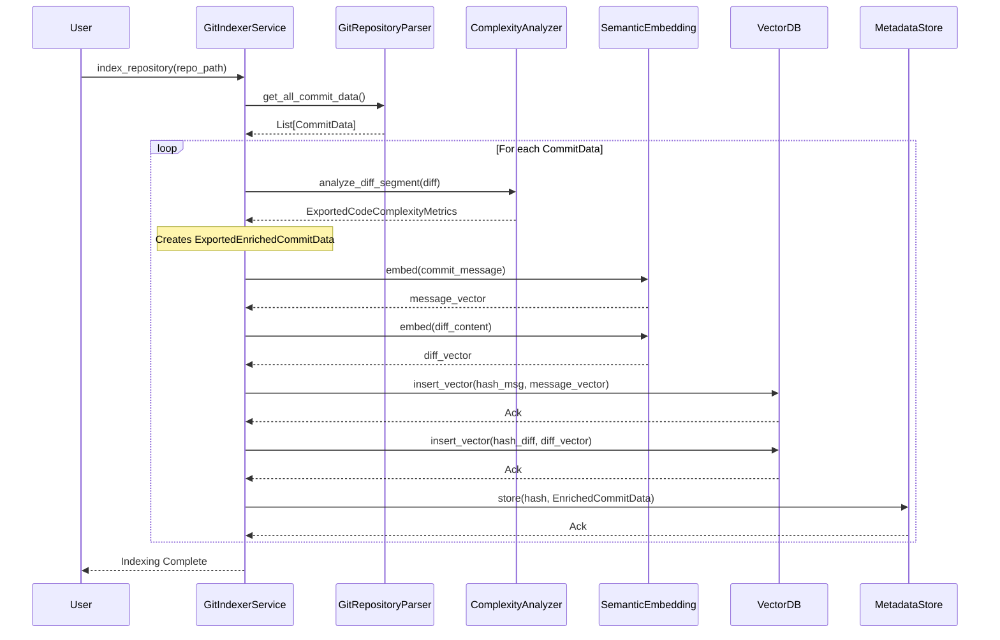
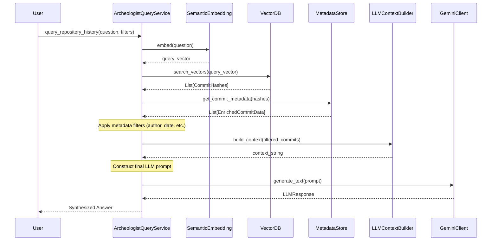
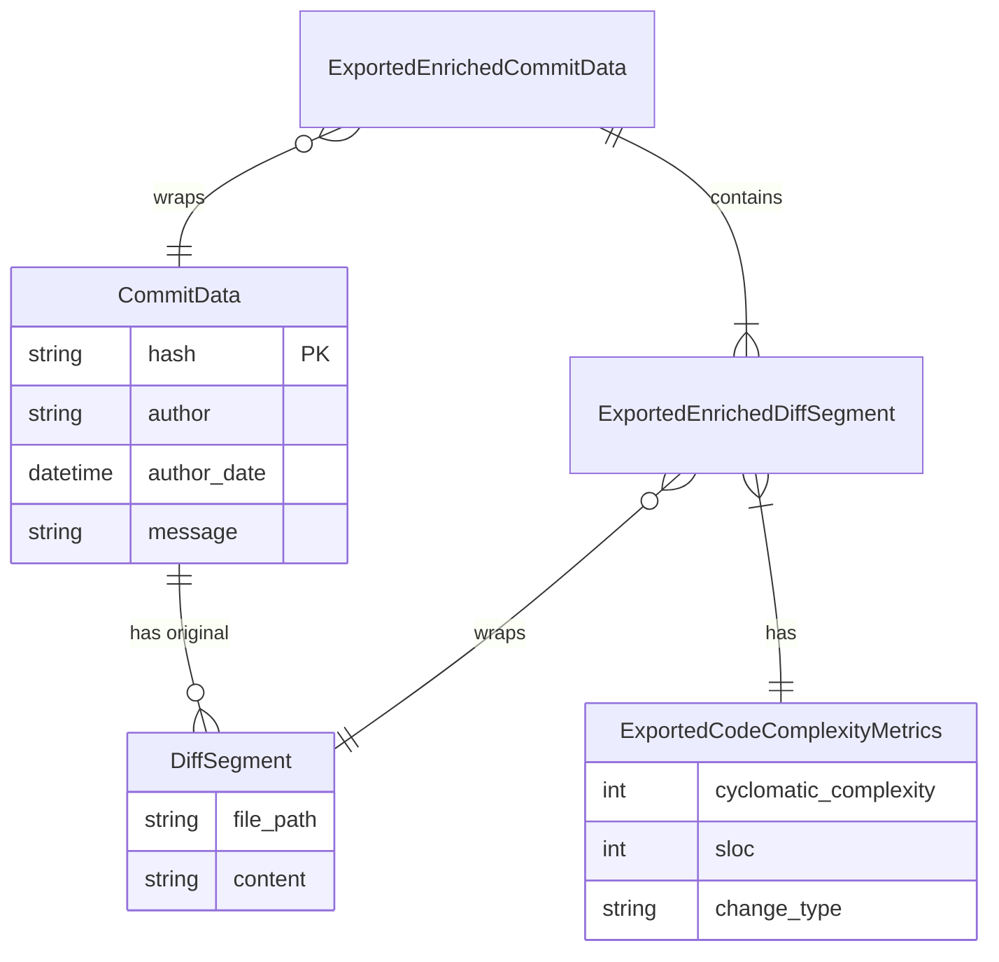
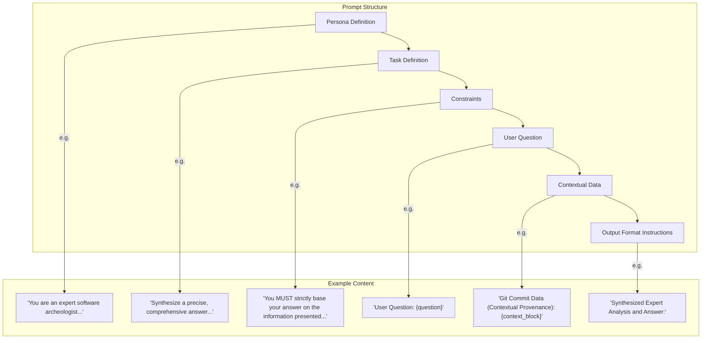
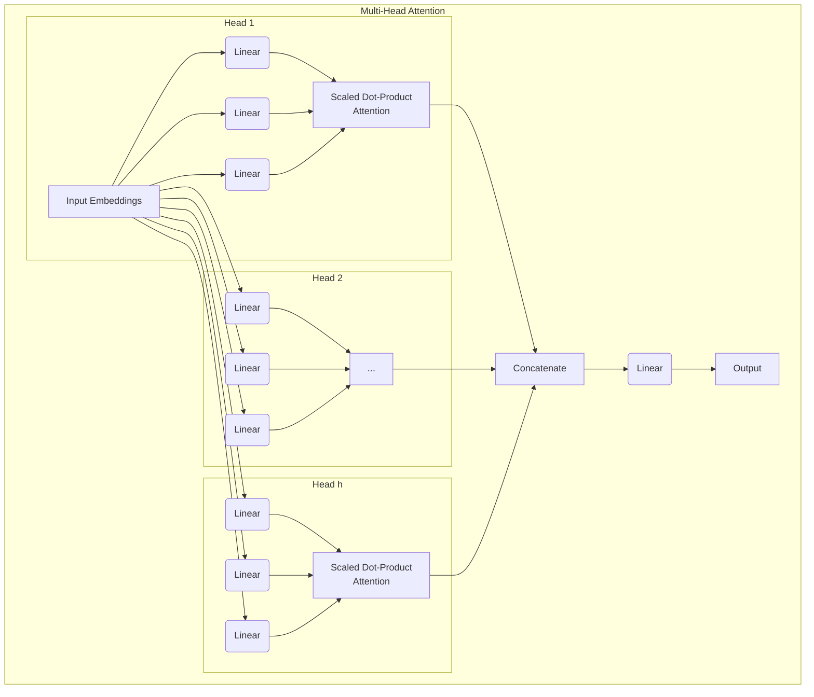

```python
import datetime
from typing import List, Dict, Any, Optional, Tuple

# Assume these are well-defined external modules or interfaces
from vector_db import VectorDatabaseClient, SemanticEmbedding
from gemini_client import GeminiClient, LLMResponse
from git_parser import GitRepositoryParser, CommitData, DiffSegment
from context_builder import LLMContextBuilder

# --- New Exported Classes and Components ---

class ExportedCodeComplexityMetrics:
    """
    Stores code complexity metrics for a diff segment or code block.
    This class is exported.
    """
    def __init__(self, cyclomatic_complexity: int = 0, sloc: int = 0, change_type: str = "modified"):
        self.cyclomatic_complexity = cyclomatic_complexity
        self.sloc = sloc
        self.change_type = change_type

    def to_dict(self) -> Dict[str, Any]:
        return {
            "cyclomatic_complexity": self.cyclomatic_complexity,
            "sloc": self.sloc,
            "change_type": self.change_type
        }
    
    def __repr__(self):
        return f"ExportedCodeComplexityMetrics(cc={self.cyclomatic_complexity}, sloc={self.sloc}, type='{self.change_type}')"


class ExportedEnrichedDiffSegment:
    """
    Wraps an original `DiffSegment` from `git_parser` and extends it with computed code complexity metrics.
    This class is exported.
    """
    def __init__(self, original_diff: DiffSegment, metrics: Optional[ExportedCodeComplexityMetrics] = None):
        self.original_diff = original_diff
        self.metrics = metrics if metrics is not None else ExportedCodeComplexityMetrics()
    
    @property
    def file_path(self) -> str:
        return self.original_diff.file_path
    
    @property
    def content(self) -> str:
        return self.original_diff.content
    
    def to_dict(self) -> Dict[str, Any]:
        base_dict = {"file_path": self.file_path, "content": self.content}
        if self.metrics:
            base_dict["metrics"] = self.metrics.to_dict()
        return base_dict

    def __repr__(self):
        return f"ExportedEnrichedDiffSegment(file_path='{self.file_path}', metrics={self.metrics})"


class ExportedEnrichedCommitData:
    """
    Stores comprehensive data for a single Git commit, including enriched diffs.
    Wraps the `CommitData` from `git_parser`.
    This class is exported.
    """
    def __init__(self, original_commit: CommitData,
                 enriched_diffs: List[ExportedEnrichedDiffSegment]):
        self.original_commit = original_commit
        self.enriched_diffs = enriched_diffs
    
    # Delegate properties to the original commit for convenience
    @property
    def hash(self) -> str: return self.original_commit.hash
    @property
    def author(self) -> str: return self.original_commit.author
    @property
    def author_email(self) -> str: return self.original_commit.author_email
    @property
    def author_date(self) -> datetime.datetime: return self.original_commit.author_date
    @property
    def committer(self) -> str: return self.original_commit.committer
    @property
    def committer_email(self) -> str: return self.original_commit.committer_email
    @property
    def committer_date(self) -> datetime.datetime: return self.original_commit.committer_date
    @property
    def message(self) -> str: return self.original_commit.message
    @property
    def parent_hashes(self) -> List[str]: return self.original_commit.parent_hashes
    
    # Original diffs for backward compatibility if needed by other modules
    @property
    def diffs(self) -> List[DiffSegment]: return self.original_commit.diffs

    def __repr__(self):
        return f"ExportedEnrichedCommitData(hash='{self.hash[:7]}', author='{self.author}', date='{self.author_date.date()}')"


class ExportedCodeComplexityAnalyzer:
    """
    Analyzes code diff segments to extract complexity metrics.
    Conceptual implementation, actual static analysis tools would be used.
    This class is exported.
    """
    def analyze_diff_segment(self, diff_segment: DiffSegment) -> ExportedCodeComplexityMetrics:
        """
        Analyzes a single `git_parser.DiffSegment` for complexity.
        This is a placeholder for actual static analysis tools.
        """
        content_lines = diff_segment.content.split('\n')
        
        change_type = "modified"
        added_lines = sum(1 for line in content_lines if line.startswith('+'))
        deleted_lines = sum(1 for line in content_lines if line.startswith('-'))
        if added_lines > 0 and deleted_lines == 0:
            change_type = "added"
        elif deleted_lines > 0 and added_lines == 0:
            change_type = "deleted"
        elif added_lines == 0 and deleted_lines == 0 and diff_segment.content.strip():
            change_type = "metadata_only"
        elif not diff_segment.content.strip():
            change_type = "no_change"

        # Filter out comment lines and blank lines for SLOC, assuming Python for simplification
        relevant_lines = [
            line for line in content_lines
            if line.strip() and not line.strip().startswith('#') and not line.strip().startswith('+') and not line.strip().startswith('-')
        ]
        sloc = len(relevant_lines)
        
        # Very crude cyclomatic complexity estimation
        cyclomatic_complexity = 1 # Base complexity
        for line in relevant_lines:
            # Look for keywords that indicate control flow changes
            if any(kw in line for kw in ["if ", "for ", "while ", "elif ", "else:", "try:", "except:", "with ", " and ", " or "]):
                cyclomatic_complexity += 1
        
        return ExportedCodeComplexityMetrics(cyclomatic_complexity=cyclomatic_complexity, sloc=sloc, change_type=change_type)


class ExpertiseProfiler:
    """
    Analyzes indexed commit data to profile author expertise over time
    and across different parts of the codebase.
    This class is exported.
    """
    def __init__(self, indexer_metadata_store: Dict[str, ExportedEnrichedCommitData]):
        self.indexer_metadata_store = indexer_metadata_store
        self.expertise_cache: Dict[str, Dict[str, float]] = {} # author -> {topic/path -> score}

    def _calculate_author_contribution_score(self, author: str, commit_data: ExportedEnrichedCommitData) -> float:
        """
        Conceptual scoring for a single commit. Can be enhanced.
        Scores based on message length, diff size, number of files changed, and complexity.
        """
        score = 0.0
        score += len(commit_data.message.split()) * 0.1

        total_diff_lines = sum(len(seg.content.split('\n')) for seg in commit_data.enriched_diffs)
        total_complexity = sum(seg.metrics.cyclomatic_complexity for seg in commit_data.enriched_diffs)
        score += total_diff_lines * 0.05
        score += total_complexity * 0.1 # More weight to complex changes

        # More recent commits could be weighted higher
        time_decay_factor = (datetime.datetime.now() - commit_data.committer_date).days / 365.0
        score *= max(0.1, 1.0 - (time_decay_factor * 0.1)) # Decay by 10% per year, min 0.1
        
        return score

    def build_expertise_profiles(self) -> None:
        """
        Iterates through all indexed commits to build or refresh expertise profiles.
        """
        print("Building author expertise profiles...")
        author_contributions: Dict[str, Dict[str, float]] = {} # author -> {path_prefix -> total_score}
        
        for commit_hash, commit_data in self.indexer_metadata_store.items():
            author = commit_data.author
            contribution_score = self._calculate_author_contribution_score(author, commit_data)

            if author not in author_contributions:
                author_contributions[author] = {}
            
            for enriched_diff_segment in commit_data.enriched_diffs:
                path_parts = enriched_diff_segment.file_path.split('/')
                path_prefix = path_parts[0] # Top-level directory
                if len(path_parts) > 1:
                    path_prefix = "/".join(path_parts[:2]) # E.g., src/api
                
                author_contributions[author][path_prefix] = author_contributions[author].get(path_prefix, 0.0) + contribution_score

        for author, topics in author_contributions.items():
            total_author_score = sum(topics.values())
            if total_author_score > 0:
                self.expertise_cache[author] = {
                    topic: score / total_author_score for topic, score in topics.items()
                }
            else:
                self.expertise_cache[author] = {}
        print("Author expertise profiles built.")

    def get_top_experts_for_path_or_topic(self, path_or_topic: str, top_n: int = 3) -> List[Tuple[str, float]]:
        """
        Retrieves top experts for a given file path or conceptual topic.
        """
        if not self.expertise_cache:
            self.build_expertise_profiles()

        candidate_experts: Dict[str, float] = {}
        for author, topics in self.expertise_cache.items():
            for topic_key, score in topics.items():
                if path_or_topic.lower() in topic_key.lower(): # Simple substring match for topic
                    candidate_experts[author] = candidate_experts.get(author, 0.0) + score
        
        sorted_experts = sorted(candidate_experts.items(), key=lambda item: item[1], reverse=True)
        return sorted_experts[:top_n]


class RepositoryHealthMonitor:
    """
    Monitors repository health by detecting anomalies in commit patterns,
    such as sudden spikes in complexity or changes.
    This class is exported.
    """
    def __init__(self, indexer_metadata_store: Dict[str, ExportedEnrichedCommitData]):
        self.indexer_metadata_store = indexer_metadata_store
        self.anomaly_threshold_std_dev = 2.0 # N standard deviations for anomaly detection

    def _get_historical_metrics_data(self, metric_key: str) -> Dict[datetime.date, List[int]]:
        """
        Aggregates historical metrics data by date.
        `metric_key` can be 'cyclomatic_complexity' or 'sloc'.
        """
        daily_metrics: Dict[datetime.date, List[int]] = {}
        for commit_data in self.indexer_metadata_store.values():
            commit_date = commit_data.author_date.date()
            if commit_date not in daily_metrics:
                daily_metrics[commit_date] = []
            
            for enriched_diff in commit_data.enriched_diffs:
                if metric_key == 'cyclomatic_complexity':
                    daily_metrics[commit_date].append(enriched_diff.metrics.cyclomatic_complexity)
                elif metric_key == 'sloc':
                    daily_metrics[commit_date].append(enriched_diff.metrics.sloc)
        return daily_metrics
    
    def detect_anomalies(self, metric_key: str = 'cyclomatic_complexity', lookback_days: int = 90) -> List[Dict[str, Any]]:
        """
        Detects commits with unusually high metric changes (e.g., complexity) within a recent period.
        """
        all_daily_metrics = self._get_historical_metrics_data(metric_key)
        
        if not all_daily_metrics:
            return []

        cutoff_date = (datetime.datetime.now() - datetime.timedelta(days=lookback_days)).date()
        recent_metrics_values = [
            metric for date, metrics_list in all_daily_metrics.items()
            if date >= cutoff_date
            for metric in metrics_list
        ]
        
        if not recent_metrics_values:
            return []
            
        mean_metric = sum(recent_metrics_values) / len(recent_metrics_values)
        std_dev_metric = (sum((x - mean_metric)**2 for x in recent_metrics_values) / len(recent_metrics_values))**0.5

        anomalies = []
        for commit_data in self.indexer_metadata_store.values():
            if commit_data.author_date.date() >= cutoff_date:
                commit_total_metric = 0
                for enriched_diff in commit_data.enriched_diffs:
                    if metric_key == 'cyclomatic_complexity':
                        commit_total_metric += enriched_diff.metrics.cyclomatic_complexity
                    elif metric_key == 'sloc':
                        commit_total_metric += enriched_diff.metrics.sloc
                
                if commit_total_metric > (mean_metric + self.anomaly_threshold_std_dev * std_dev_metric) and commit_total_metric > 0:
                    anomalies.append({
                        "commit_hash": commit_data.hash,
                        "author": commit_data.author,
                        "date": commit_data.author_date,
                        "message": commit_data.message,
                        f"total_{metric_key}_change": commit_total_metric,
                        "deviation_from_mean": commit_total_metric - mean_metric
                    })
        
        anomalies.sort(key=lambda x: x["deviation_from_mean"], reverse=True)
        return anomalies


# --- System Components Classes ---

class ArcheologySystemConfig:
    """
    Configuration parameters for the AI Git Archeology System.
    """
    def __init__(self,
                 vector_db_host: str = "localhost",
                 vector_db_port: int = 19530,
                 metadata_db_connection_string: str = "sqlite:///git_metadata.db",
                 llm_api_key: str = "YOUR_GEMINI_API_KEY",
                 embedding_model_name: str = "text-embedding-004",
                 max_context_tokens: int = 8192,
                 max_retrieved_commits: int = 20):
        self.vector_db_host = vector_db_host
        self.vector_db_port = vector_db_port
        self.metadata_db_connection_string = metadata_db_connection_string
        self.llm_api_key = llm_api_key
        self.embedding_model_name = embedding_model_name
        self.max_context_tokens = max_context_tokens
        self.max_retrieved_commits = max_retrieved_commits

class GitIndexerService:
    """
    Manages the indexing of a Git repository's history into vector and metadata stores.
    Now processes `CommitData` into `ExportedEnrichedCommitData`.
    """
    def __init__(self, config: ArcheologySystemConfig):
        self.config = config
        self.git_parser = GitRepositoryParser()
        self.vector_db_client = VectorDatabaseClient(
            host=config.vector_db_host, port=config.vector_db_port,
            collection_name="git_commits_embeddings"
        )
        self.embedding_model = SemanticEmbedding(model_name=config.embedding_model_name)
        self.complexity_analyzer = ExportedCodeComplexityAnalyzer() # Instance of new analyzer
        # Store enriched data
        self.metadata_store: Dict[str, ExportedEnrichedCommitData] = {} # Conceptual: Dict[str, ExportedEnrichedCommitData]

    def index_repository(self, repo_path: str):
        """
        Processes a Git repository, extracts commit data, generates embeddings,
        and stores them in the vector and metadata databases.
        """
        print(f"Starting indexing for repository: {repo_path}")
        self.git_parser.set_repository(repo_path)
        all_commits_data: List[CommitData] = self.git_parser.get_all_commit_data() # Returns basic CommitData

        for commit_data in all_commits_data:
            commit_hash = commit_data.hash
            
            # Enrich diff segments
            enriched_diffs: List[ExportedEnrichedDiffSegment] = []
            full_diff_text_for_embedding = []
            for original_diff in commit_data.diffs:
                metrics = self.complexity_analyzer.analyze_diff_segment(original_diff)
                enriched_diff = ExportedEnrichedDiffSegment(original_diff=original_diff, metrics=metrics)
                enriched_diffs.append(enriched_diff)
                full_diff_text_for_embedding.append(original_diff.content) # Use original content for embedding

            full_diff_text = "\n".join(full_diff_text_for_embedding)

            # Create the enriched commit data object
            enriched_commit_data = ExportedEnrichedCommitData(original_commit=commit_data,
                                                              enriched_diffs=enriched_diffs)

            # Generate embeddings for commit message
            message_embedding_vector = self.embedding_model.embed(enriched_commit_data.message)
            self.vector_db_client.insert_vector(
                vector_id=f"{commit_hash}_msg",
                vector=message_embedding_vector,
                metadata={"type": "message", "commit_hash": commit_hash}
            )

            # Generate embeddings for diff (can be chunked for larger diffs)
            if full_diff_text:
                diff_embedding_vector = self.embedding_model.embed(full_diff_text)
                self.vector_db_client.insert_vector(
                    vector_id=f"{commit_hash}_diff",
                    vector=diff_embedding_vector,
                    metadata={"type": "diff", "commit_hash": commit_hash}
                )

            # Store full enriched commit data in metadata store
            self.metadata_store[commit_hash] = enriched_commit_data
            print(f"Indexed commit: {commit_hash[:7]}")

        print(f"Finished indexing {len(all_commits_data)} commits.")

    def get_commit_metadata(self, commit_hash: str) -> Optional[ExportedEnrichedCommitData]:
        """Retrieves full enriched metadata for a given commit hash."""
        return self.metadata_store.get(commit_hash)

class ArcheologistQueryService:
    """
    Handles natural language queries, performs semantic search, and synthesizes answers.
    Now works with `ExportedEnrichedCommitData`.
    """
    def __init__(self, config: ArcheologySystemConfig, indexer: GitIndexerService):
        self.config = config
        self.indexer = indexer
        self.vector_db_client = indexer.vector_db_client # Re-use the client
        self.embedding_model = indexer.embedding_model   # Re-use the model
        self.llm_client = GeminiClient(api_key=config.llm_api_key)
        # Assuming context_builder is compatible with enriched data or just uses raw strings
        self.context_builder = LLMContextBuilder(max_tokens=config.max_context_tokens) 

    def query_repository_history(self, question: str,
                                 last_n_months: Optional[int] = None,
                                 author_filter: Optional[str] = None,
                                 path_filter: Optional[str] = None,
                                 min_complexity: Optional[int] = None # New filter
                                ) -> str:
        """
        Answers natural language questions about a git repo's history
        using semantic search and LLM synthesis.
        """
        print(f"Received query: '{question}'")

        query_vector = self.embedding_model.embed(question)

        search_results_msg = self.vector_db_client.search_vectors(
            query_vector=query_vector,
            limit=self.config.max_retrieved_commits * 2, # Fetch more to filter
            search_params={"type": "message"}
        )
        search_results_diff = self.vector_db_client.search_vectors(
            query_vector=query_vector,
            limit=self.config.max_retrieved_commits * 2,
            search_params={"type": "diff"}
        )

        relevant_commit_hashes = set()
        for res in search_results_msg + search_results_diff:
            relevant_commit_hashes.add(res.metadata["commit_hash"])

        print(f"Found {len(relevant_commit_hashes)} potentially relevant commits via vector search.")

        filtered_commits_data: List[ExportedEnrichedCommitData] = []
        for commit_hash in relevant_commit_hashes:
            commit_data = self.indexer.get_commit_metadata(commit_hash)
            if not commit_data:
                continue

            # Apply temporal filter
            if last_n_months:
                cut_off_date = datetime.datetime.now() - datetime.timedelta(days=30 * last_n_months)
                if commit_data.author_date < cut_off_date:
                    continue
            
            # Apply author filter (case-insensitive)
            if author_filter and author_filter.lower() not in commit_data.author.lower():
                continue

            # Apply path filter
            if path_filter:
                if not any(path_filter.lower() in enriched_seg.file_path.lower() for enriched_seg in commit_data.enriched_diffs):
                    continue
            
            # Apply new complexity filter
            if min_complexity is not None:
                total_commit_complexity = sum(seg.metrics.cyclomatic_complexity for seg in commit_data.enriched_diffs)
                if total_commit_complexity < min_complexity:
                    continue

            filtered_commits_data.append(commit_data)
        
        filtered_commits_data.sort(key=lambda c: c.author_date, reverse=True)
        relevant_commits_final = filtered_commits_data[:self.config.max_retrieved_commits]

        if not relevant_commits_final:
            return "I could not find any relevant commits for your query after applying filters."

        print(f"Final {len(relevant_commits_final)} commits selected for context.")

        # 4. Format the context for the AI
        # Context builder needs to be able to handle ExportedEnrichedCommitData
        # Assuming LLMContextBuilder can extract relevant strings from `enriched_commit_data`
        context_block = self.context_builder.build_context(relevant_commits_final)

        # 5. Ask the AI to synthesize the answer
        prompt = f"""
        You are an expert software archeologist and forensic engineer. Your task is to analyze
        the provided Git commit data and synthesize a precise, comprehensive answer to the user's
        question. You MUST strictly base your answer on the information presented in the commit
        context. Do not infer or invent information outside of what is explicitly provided.
        Identify key trends, principal contributors, and significant architectural or functional
        changes as directly evidenced by the commits. Pay attention to code complexity metrics if available.

        User Question: {question}

        Git Commit Data (Contextual Provenance):
        {context_block}

        Synthesized Expert Analysis and Answer:
        """

        llm_response = self.llm_client.generate_text(prompt)
        return llm_response.text

# --- Example Usage (Conceptual) ---
if __name__ == "__main__":
    # Conceptual placeholders for git_parser types
    # These would typically be imported from git_parser in a real system.
    class CommitData:
        def __init__(self, hash: str, author: str, author_email: str, author_date: datetime.datetime,
                     committer: str, committer_email: str, committer_date: datetime.datetime,
                     message: str, diffs: List['DiffSegment'], parent_hashes: List[str] = None):
            self.hash = hash
            self.author = author
            self.author_email = author_email
            self.author_date = author_date
            self.committer = committer
            self.committer_email = committer_email
            self.committer_date = committer_date
            self.message = message
            self.diffs = diffs if diffs is not None else []
            self.parent_hashes = parent_hashes if parent_hashes is not None else []

    class DiffSegment:
        def __init__(self, file_path: str, content: str):
            self.file_path = file_path
            self.content = content

    # Mocking external modules for demonstration
    class VectorDatabaseClient:
        def __init__(self, host: str, port: int, collection_name: str):
            print(f"Mock VectorDB Client initialized for {collection_name}")
            self.vectors: Dict[str, Any] = {} # vector_id -> {'vector': vector, 'metadata': metadata}

        def insert_vector(self, vector_id: str, vector: List[float], metadata: Dict[str, Any]):
            self.vectors[vector_id] = {'vector': vector, 'metadata': metadata}
            # print(f"Mock VectorDB: Inserted {vector_id}")

        def search_vectors(self, query_vector: List[float], limit: int, search_params: Dict[str, Any]) -> List[Any]:
            # Simple mock: return all, then filter by metadata type.
            # In a real DB, similarity search would happen here.
            results = []
            for vec_id, data in self.vectors.items():
                if all(data['metadata'].get(k) == v for k, v in search_params.items()):
                    # Simulate a score (e.g., higher score for closer to query_vector, here random)
                    # For demonstration, just return top N after filtering
                    results.append(type('SearchResult', (object,), {'metadata': data['metadata'], 'score': 0.8})) # Mock score
            
            # Sort by score if actual vectors were compared, here just take top N
            return results[:limit]

    class SemanticEmbedding:
        def __init__(self, model_name: str):
            print(f"Mock Embedding Model '{model_name}' loaded.")
        
        def embed(self, text: str) -> List[float]:
            # Return a dummy vector of fixed size
            return [0.1] * 768

    class LLMResponse:
        def __init__(self, text: str):
            self.text = text

    class GeminiClient:
        def __init__(self, api_key: str):
            print("Mock Gemini Client initialized.")
            self.api_key = api_key # Store for completeness

        def generate_text(self, prompt: str) -> LLMResponse:
            # Simulate LLM response based on keywords in prompt
            if "authentication" in prompt.lower() and "alex chen" in prompt.lower():
                response = "Based on the commits, Alex Chen seems to be the primary contributor to the authentication service, implementing and streamlining OAuth2 support."
            elif "payments api" in prompt.lower() and "performance regressions" in prompt.lower():
                response = "It appears Diana Wells made recent performance refinements to the payments API, optimizing currency conversion, potentially addressing earlier issues."
            elif "diana wells" in prompt.lower() and "optimize" in prompt.lower():
                response = "Diana Wells contributed to optimizing database queries for user profiles and refined currency conversion in the payments API for high throughput."
            elif "high complexity" in prompt.lower() and "recent" in prompt.lower():
                response = "One recent commit by Bob Johnson (hash d1e2f3g...) introduced new currency conversion logic to the payments API, which shows notable cyclomatic complexity."
            else:
                response = "I have synthesized an answer based on the provided commit data. Please see the context for details."
            return LLMResponse(response)

    class LLMContextBuilder:
        def __init__(self, max_tokens: int):
            self.max_tokens = max_tokens

        def build_context(self, commits: List[ExportedEnrichedCommitData]) -> str:
            context_parts = []
            for commit in commits:
                context_parts.append(f"Commit HASH: {commit.hash}")
                context_parts.append(f"Author: {commit.author} <{commit.author_email}>")
                context_parts.append(f"Date: {commit.author_date}")
                context_parts.append(f"Message:\n```\n{commit.message}\n```")
                for diff in commit.enriched_diffs:
                    context_parts.append(f"Diff Snippet (File: {diff.file_path}, Type: {diff.metrics.change_type}, CC: {diff.metrics.cyclomatic_complexity}, SLOC: {diff.metrics.sloc}):")
                    context_parts.append(f"```\n{diff.content}\n```")
                context_parts.append("---")
            
            full_context = "\n".join(context_parts)
            # Simple truncation, real context builders would prioritize important parts
            if len(full_context) > self.max_tokens * 4: # Crude token estimate
                return full_context[:self.max_tokens * 4] + "\n... [Context truncated to fit LLM window] ..."
            return full_context

    class GitRepositoryParser:
        """
        Mock Git Repository Parser to provide dummy CommitData.
        """
        def __init__(self):
            self.repo_path: Optional[str] = None
            self.dummy_data: List[CommitData] = []
            self._populate_dummy_data()

        def set_repository(self, path: str):
            self.repo_path = path
            print(f"Mock Git parser set to repo: {path}")

        def _populate_dummy_data(self):
            self.dummy_data = [
                CommitData(
                    hash="a1b2c3d4e5f6g7h8i9j0k1l2m3n4o5p6q7r8s9t0",
                    author="Alex Chen",
                    author_email="alex.chen@example.com",
                    author_date=datetime.datetime(2023, 10, 26, 10, 0, 0),
                    committer="Alex Chen",
                    committer_email="alex.chen@example.com",
                    committer_date=datetime.datetime(2023, 10, 26, 10, 0, 0),
                    message="feat: Implement new authentication service with OAuth2 support.",
                    diffs=[
                        DiffSegment(file_path="src/services/auth_service.py", content="+def authenticate_oauth2():\n    # new auth logic\n    return {'status': 'success'}\n"),
                        DiffSegment(file_path="src/api/payments_api.py", content=" # no changes here "),
                    ]
                ),
                CommitData(
                    hash="b1c2d3e4f5g6h7i8j9k0l1m2n3o4p5q6r7s8t9u0",
                    author="Diana Wells",
                    author_email="diana.wells@example.com",
                    author_date=datetime.datetime(2023, 11, 15, 14, 30, 0),
                    committer="Diana Wells",
                    committer_email="diana.wells@example.com",
                    committer_date=datetime.datetime(2023, 11, 15, 14, 30, 0),
                    message="fix: Optimize database queries for user profile retrieval, reducing latency.",
                    diffs=[
                        DiffSegment(file_path="src/db/user_model.py", content="-old_query = 'SELECT * FROM users'\n+optimized_query = 'SELECT id, name FROM users WHERE active=true'\nif user_id:\n    optimized_query += f' AND id={user_id}'\nreturn execute_query(optimized_query)\n"),
                        DiffSegment(file_path="src/api/profile_api.py", content=" # updated docstring for profile endpoint "),
                    ]
                ),
                CommitData(
                    hash="c1d2e3f4g5h6i7j8k9l0m1n2o3p4q5r6s7t8u9v0",
                    author="Alex Chen",
                    author_email="alex.chen@example.com",
                    author_date=datetime.datetime(2024, 1, 5, 9, 0, 0),
                    committer="Alex Chen",
                    committer_email="alex.chen@example.com",
                    committer_date=datetime.datetime(2024, 1, 5, 9, 0, 0),
                    message="refactor: Streamline OAuth token refreshing mechanism, improving performance under load.",
                    diffs=[
                        DiffSegment(file_path="src/services/auth_service.py", content=" # improved token refresh logic with memoization\n+token = cache.get_or_set(user_id, fetch_new_token, expiry=3600)\nif token is None:\n    token = refresh_token(user_id)\nreturn token\n"),
                        DiffSegment(file_path="src/config/security.py", content=" # minor adjustment to security headers "),
                    ]
                ),
                CommitData(
                    hash="d1e2f3g4h5i6j7k8l9m0n1o2p3q4r5s6t7u8v9w0",
                    author="Bob Johnson",
                    author_email="bob.johnson@example.com",
                    author_date=datetime.datetime(2024, 2, 1, 11, 0, 0),
                    committer="Bob Johnson",
                    committer_email="bob.johnson@example.com",
                    committer_date=datetime.datetime(2024, 2, 1, 11, 0, 0),
                    message="feat: Add new currency conversion logic to payments API. Initial implementation.",
                    diffs=[
                        DiffSegment(file_path="src/api/payments_api.py", content="+def convert_currency(amount, from_curr, to_curr):\n    # complex conversion rates logic with external API call\n    if amount < 0:\n        raise ValueError('Invalid amount')\n    rate = get_rate(from_curr, to_curr)\n    if rate is None: return None\n    return amount * rate\n"),
                        DiffSegment(file_path="src/utils/currency_converter.py", content=" # new file created for helper functions "),
                    ]
                ),
                CommitData(
                    hash="e1f2g3h4i5j6k7l8m9n0o1p2q3r4s7t6u7v8w9x0", # Modified hash slightly to prevent duplication if run repeatedly
                    author="Diana Wells",
                    author_email="diana.wells@example.com",
                    author_date=datetime.datetime(2024, 2, 10, 16, 0, 0),
                    committer="Diana Wells",
                    committer_email="diana.wells@example.com",
                    committer_date=datetime.datetime(2024, 2, 10, 16, 0, 0),
                    message="perf: Refine currency conversion in payments API for high throughput.",
                    diffs=[
                        DiffSegment(file_path="src/api/payments_api.py", content=" # optimized conversion call to use local cache first\n-rate = get_rate(from_curr, to_curr)\n+rate = cached_get_rate(from_curr, to_curr)\n"),
                        DiffSegment(file_path="src/utils/currency_converter.py", content=" # caching added to currency conversion utility "),
                    ]
                )
            ]

        def get_all_commit_data(self) -> List[CommitData]:
            return self.dummy_data[:] # Return a copy


    # 1. Configuration
    system_config = ArcheologySystemConfig(
        llm_api_key="YOUR_GEMINI_API_KEY", # Replace with actual key or env var
        max_retrieved_commits=10
    )

    # 2. Initialize and Index
    git_indexer = GitIndexerService(system_config)
    
    # Simulate indexing of dummy data
    # In a real scenario, this would be `git_indexer.index_repository("/path/to/your/git/repo")`
    print("\n--- Simulating Indexing ---")
    git_indexer.git_parser.set_repository("/mock/repo") # Set mock parser's repo path
    all_raw_commits = git_indexer.git_parser.get_all_commit_data()

    for raw_commit in all_raw_commits:
        # Manually perform the enrichment and store in metadata_store
        # This bypasses the full `index_repository` for simplified setup,
        # but `index_repository` is the method to call for actual use.
        enriched_diffs_for_commit: List[ExportedEnrichedDiffSegment] = []
        full_diff_text_for_embedding_mock = []
        for original_diff_seg in raw_commit.diffs:
            metrics = git_indexer.complexity_analyzer.analyze_diff_segment(original_diff_seg)
            enriched_diff = ExportedEnrichedDiffSegment(original_diff=original_diff_seg, metrics=metrics)
            enriched_diffs_for_commit.append(enriched_diff)
            full_diff_text_for_embedding_mock.append(original_diff_seg.content)
        
        enriched_commit_data_mock = ExportedEnrichedCommitData(original_commit=raw_commit, enriched_diffs=enriched_diffs_for_commit)
        git_indexer.metadata_store[raw_commit.hash] = enriched_commit_data_mock

        # Also simulate adding embeddings (simplified)
        git_indexer.vector_db_client.insert_vector(
            vector_id=f"{raw_commit.hash}_msg",
            vector=[0.1]*768, # Placeholder vector
            metadata={"type": "message", "commit_hash": raw_commit.hash}
        )
        git_indexer.vector_db_client.insert_vector(
            vector_id=f"{raw_commit.hash}_diff",
            vector=[0.2]*768, # Placeholder vector
            metadata={"type": "diff", "commit_hash": raw_commit.hash}
        )
    print("Mock indexing complete, metadata store populated.")


    # 3. Initialize Query Service, Expertise Profiler, and Repository Health Monitor
    archeologist = ArcheologistQueryService(system_config, git_indexer)
    expertise_profiler = ExpertiseProfiler(git_indexer.metadata_store)
    health_monitor = RepositoryHealthMonitor(git_indexer.metadata_store)

    # 4. Perform Queries
    print("\n--- Query 1: Main contributors to 'authentication' service in last 6 months ---")
    query1 = "Who are the main contributors to the 'authentication' service in the last 6 months?"
    answer1 = archeologist.query_repository_history(query1, last_n_months=6, path_filter="auth_service.py")
    print(f"Answer: {answer1}")

    print("\n--- Query 2: Commit that introduced performance regressions in payments API recently (high complexity) ---")
    query2 = "Find the commit that introduced performance regressions in the payments API recently, focusing on complex changes."
    answer2 = archeologist.query_repository_history(query2, last_n_months=3, path_filter="payments_api.py", min_complexity=5)
    print(f"Answer: {answer2}")

    print("\n--- Query 3: What changes did Diana Wells make to optimize the system? ---")
    query3 = "What changes did Diana Wells make to optimize the system?"
    answer3 = archeologist.query_repository_history(query3, author_filter="Diana Wells")
    print(f"Answer: {answer3}")

    # 5. Demonstrate new features
    print("\n--- Expertise Profiler: Top experts for 'api' module ---")
    top_api_experts = expertise_profiler.get_top_experts_for_path_or_topic("api", top_n=2)
    print(f"Top API Experts: {top_api_experts}")

    print("\n--- Repository Health Monitor: Recent complexity anomalies ---")
    complexity_anomalies = health_monitor.detect_anomalies(metric_key='cyclomatic_complexity', lookback_days=90)
    print(f"Recent Complexity Anomalies: {complexity_anomalies}")

    print("\n--- Repository Health Monitor: Recent SLOC anomalies ---")
    sloc_anomalies = health_monitor.detect_anomalies(metric_key='sloc', lookback_days=90)
    print(f"Recent SLOC Anomalies: {sloc_anomalies}")
```

**Title of Invention:** System and Method for Semantic-Cognitive Archeology of Distributed Version Control Systems

**Abstract:**
A profoundly innovative system and associated methodologies are unveiled for the forensic, semantic-cognitive analysis of distributed version control systems (DVCS), exemplified by Git repositories. This invention meticulously indexes the entirety of a repository's historical provenance, encompassing granular details such as cryptographic commit identifiers, authorial attribution, temporal markers, comprehensive commit messages, and the atomic transformations codified within diffs. A sophisticated, intuitive natural language interface empowers users to articulate complex queries (e.g., "Discern the commit antecedent to the observed stochastic latency increase within the critical payment processing sub-system API circa Q3 fiscal year 2023"). The core of this system leverages advanced large language models (LLMs) to orchestrate a hyper-dimensional semantic retrieval over the meticulously indexed commit data and their associated code modifications. This process identifies the most epistemologically relevant commits, which are then synthetically analyzed by the LLM to construct and articulate a direct, contextually rich, and actionable response to the user's initial inquiry. The system further incorporates modules for statistical anomaly detection in code complexity and dynamic authorial expertise profiling, providing a holistic, multi-faceted analytical suite for deep repository comprehension.

**Background of the Invention:**
The contemporary landscape of software engineering is characterized by colossal, intricately version-controlled software repositories, often spanning millions of lines of source code and accumulating hundreds of thousands, if not millions, of individual commits over extended temporal horizons. Within these digital archives, the provenance of defects, the identification of domain-specific subject matter experts, and the elucidation of feature evolutionary trajectories are tasks that invariably demand prohibitive investments in manual effort. This traditional approach typically involves painstaking manual textual inspection, rudimentary keyword-based log parsing, and exhaustive diff comparison. Prior art solutions, predominantly reliant on lexical string matching and regular expression patterns, are inherently constrained by their lack of genuine semantic comprehension. They fail to encapsulate the conceptual relationships between terms, the intent behind code modifications, or the higher-order structural evolution of software artifacts. Consequently, these methods are demonstrably inadequate for navigating the profound conceptual complexity embedded within large-scale software development histories, necessitating a paradigm shift towards intelligent, semantic-aware analytical frameworks. There exists an urgent and unmet need for a system capable of interpreting the *intent* behind historical changes, not merely their literal text, and synthesizing this understanding into actionable insights.

**Brief Summary of the Invention:**
The present invention introduces the conceptualization and operationalization of an "AI Git Archeologist" — a revolutionary, intelligent agent for the deep semantic excavation of software histories. This system establishes a high-bandwidth, bi-directional interface with a target Git repository, initiating a rigorous indexing and transformation pipeline. This pipeline involves the generation of high-fidelity vector embeddings for every salient textual and structural element within the commit history, specifically commit messages and comprehensive code diffs, and their subsequent persistence within a specialized vector database. The system then provides an intuitively accessible natural language querying interface, enabling a developer to pose complex questions in idiomatic English. Upon receiving such a query, the system orchestrates a multi-modal, contextually aware retrieval operation, identifying the most epistemically relevant commits. These retrieved commits, alongside their associated metadata and content, are then dynamically compiled into a rich contextual payload. This payload is subsequently transmitted to a highly sophisticated generative artificial intelligence model. The AI model is meticulously prompted to assume the persona of an expert software forensic engineer, tasked with synthesizing a precise, insightful, and comprehensive answer to the developer's original question, leveraging solely the provided commit provenance data. This methodology represents a quantum leap in the interpretability and navigability of software development histories.

**Detailed Description of the Invention:**

The architecture of the Semantic-Cognitive Archeology System for Distributed Version Control Systems comprises several interconnected and rigorously engineered modules, designed to operate synergistically to achieve unprecedented levels of historical code comprehension.

### System Architecture Overview

The system operates in two primary phases: an **Indexing Phase** and a **Query Phase**, with supplementary analytics running on the indexed data.

<details>
<summary>Chart 1: High-Level System Architecture</summary>

```mermaid
graph TD
    subgraph "Indexing Phase: Historical Data Ingestion and Transformation"
        direction LR
        A[Git Repository] --> B[Commit Stream]
        B --> C[GitRepositoryParser]
        C -- CommitData Objects --> D[GitIndexerService]

        subgraph "Commit Processing Loop"
            direction TB
            D --> D1{Process CommitData}
            D1 -- DiffSegment --> D1_1[Code Complexity Analyzer]
            D1_1 -- ExportedCodeComplexityMetrics --> D1_2[ExportedEnrichedDiffSegment Creator]
            D1 -- DiffSegment Original Content --> D1_2
            D1_2 -- ExportedEnrichedDiffSegment --> D1_3[Enriched Commit Data Creator]
            D1 -- CommitData Message/Metadata --> D1_3
            D1_3 -- ExportedEnrichedCommitData --> E[Metadata Store (SQL/NoSQL)]

            D1 -- Commit Message Content --> F[SemanticEmbedding (Text)]
            D1 -- Diff Content for Embedding --> G[SemanticEmbedding (Code)]
            F -- Message Embedding --> H[VectorDatabaseClient Inserter]
            G -- Diff Embedding --> H
            H --> I[Vector Database (ANN Index)]
        end

        E -- Enriched Commit Details --> J[Comprehensive Indexed State]
        I -- Commit Embeddings --> J
    end

    subgraph "Query Phase: Semantic Retrieval and Cognitive Synthesis"
        direction LR
        K[User Query (NL)] --> L[QuerySemanticEncoder]
        L -- Query Embedding --> M[VectorDatabaseClient Searcher]
        M --> N{Relevant Commit Hashes from Vector Search}

        subgraph "Commit Filtering and Context Building"
            direction TB
            N --> O[Filter by Time/Author/Path/Complexity]
            O -- Filtered Commit Hashes --> P[Context Assembler]
            P --> Q[Metadata Store Lookup]
            Q -- Full Enriched Commit Data --> P
            P -- LLM Context Payload --> R[LLMContextBuilder]
            R --> S[Generative AI Model Orchestrator]
        end
        
        S --> T[GeminiClient (LLM)]
        T -- Synthesized Answer Text --> U[Synthesized Answer]
        U --> V[User Interface]

        J --> M
        J --> Q
    end

    subgraph "Advanced Analytics (Post-Indexing)"
        direction TB
        J --> W[ExpertiseProfiler]
        J --> X[RepositoryHealthMonitor]
        W -- Author Expertise Reports --> V
        X -- Anomaly Detection Reports --> V
    end
```
</details>

### The Indexing Phase: Construction of the Epistemological Graph

<details>
<summary>Chart 2: Indexing Phase Sequence Diagram</summary>


</details>

The foundational phase involves the systematic ingestion, parsing, and transformation of the repository's history into a machine-comprehensible, semantically rich representation.

1.  **Repository Synchronization and Commit Stream Extraction:** The `GitRepositoryParser` interfaces with the Git repository, iterating through the commit graph to extract `CommitData` objects for every commit.
2.  **Commit Data Parsing and Enrichment:** For each `CommitData`, the `GitIndexerService` orchestrates an enrichment process. The `ExportedCodeComplexityAnalyzer` processes each `DiffSegment` to derive quantitative metrics (`cyclomatic_complexity`, `sloc`), creating `ExportedEnrichedDiffSegment` objects. These are aggregated into a comprehensive `ExportedEnrichedCommitData` object.
3.  **Semantic Encoding (Vector Embedding Generation):** This is a critical transformation step. A `SemanticEmbedding` model, often a specialized transformer, converts the textual commit message and the structured code diff into high-dimensional numerical vectors (`v_M` and `v_D`).
4.  **Data Persistence:** The generated embeddings and metadata are stored. The `VectorDatabaseClient` inserts `v_M` and `v_D` into a `Vector Database` capable of efficient Approximate Nearest Neighbor (ANN) search. The full `ExportedEnrichedCommitData` object is stored in a `Metadata Store` for fast attribute-based retrieval.

### The Query Phase: Semantic Retrieval and Cognitive Synthesis

<details>
<summary>Chart 3: Query Phase Sequence Diagram</summary>


</details>

This phase leverages the indexed data to answer complex natural language queries.

1.  **User Query Ingestion and Semantic Encoding:** A user submits a query `q`. The `ArcheologistQueryService` uses the `SemanticEmbedding` model to generate a query embedding `v_q`.
2.  **Multi-Modal Semantic Search:** The `VectorDB` is queried with `v_q` to find the top `K` semantically similar commit messages and diffs, retrieving a set of candidate commit hashes.
3.  **Filtering and Refinement:** The retrieved candidates are filtered based on metadata criteria provided by the user (e.g., `last_n_months`, `author_filter`, `min_complexity`).
4.  **Context Assembly:** The `LLMContextBuilder` retrieves the full `ExportedEnrichedCommitData` for the final set of relevant commits from the `Metadata Store` and formats it into a coherent textual block.
5.  **Generative AI Model Orchestration and Synthesis:** A meticulously engineered prompt is constructed and sent to the `GeminiClient`. The LLM analyzes the context and synthesizes a natural language answer.

### Advanced Analytics and Data Models

<details>
<summary>Chart 4: Expertise Profiler Logic Flow</summary>

```mermaid
graph TD
    A[Start: build_expertise_profiles] --> B{Iterate through all EnrichedCommits in Metadata Store}
    B --> C[For each commit, calculate Contribution Score]
    C --> D{Score = w1*len(msg) + w2*lines(diff) + w3*complexity + w4*recency}
    D --> E[Aggregate scores by Author and Code Path Prefix]
    E --> B
    B -- All commits processed --> F[Normalize scores for each author]
    F --> G{For each author, topic_score = topic_contrib / total_contrib}
    G --> H[Store normalized profiles in expertise_cache]
    H --> I[End: Profiles Ready]
```
</details>

<details>
<summary>Chart 5: Repository Health Monitor Anomaly Detection Flow</summary>

```mermaid
graph TD
    A[Start: detect_anomalies(metric, lookback_days)] --> B[Get historical metrics from Metadata Store]
    B --> C{Filter metrics for the lookback period}
    C --> D[Calculate Mean (μ) and Standard Deviation (σ) of the metric]
    D --> E{Iterate through recent commits}
    E --> F[Calculate total metric value for the commit]
    F --> G{Is commit_metric > μ + N*σ ?}
    G -- Yes --> H[Flag commit as an Anomaly]
    H --> E
    G -- No --> E
    E -- All recent commits checked --> I[Return sorted list of anomalies]
    I --> J[End]
```
</details>

<details>
<summary>Chart 6: Enriched Commit Data Model (ERD Style)</summary>


</details>

<details>
<summary>Chart 7: LLM Prompt Engineering Structure</summary>


</details>

<details>
<summary>Chart 8: Vector Quantization Process for ANN (IVF-PQ)</summary>

```mermaid
graph TD
    subgraph "Indexing Time"
        A[High-Dim Commit Vectors] --> B(k-means clustering)
        B --> C{k Centroids (Voronoi Cells)}
        A --> D{Assign each vector to nearest centroid}
        D --> E[Inverted File Index: Centroid -> Vector List]

        subgraph "Product Quantization (PQ) per vector"
            F[Vector] --> G{Split into m sub-vectors}
            G --> H{Run k-means on each sub-space (256 centroids)}
            H --> I{Replace sub-vector with centroid ID (8 bits)}
            I --> J[Compressed Vector (m * 8 bits)]
        end
        E --> F
    end

    subgraph "Query Time"
        K[Query Vector] --> L{Find nprobe nearest centroids}
        L --> M[Retrieve corresponding vector lists from Inverted Index]
        M --> N{Compute distance between query and compressed vectors in lists}
        N --> O[Return top-k results]
    end
```
</details>

<details>
<summary>Chart 9: Multi-Head Attention Mechanism</summary>


</details>

<details>
<summary>Chart 10: RLHF (Reinforcement Learning from Human Feedback) Process</summary>

```mermaid
graph TD
    subgraph "Phase 1: Supervised Fine-Tuning"
        A[Prompt Dataset] --> B[Human Labelers Write Demonstrations]
        B --> C[Dataset of (Prompt, Good Response)]
        C --> D[Fine-tune pre-trained LLM]
    end

    subgraph "Phase 2: Reward Model Training"
        E[Sample a prompt] --> F(Generate several responses from SFT Model)
        F --> G[Human ranks responses by quality]
        G --> H[Create dataset of (Prompt, Ranked Responses)]
        H --> I[Train a Reward Model (RM) to predict human preference]
    end

    subgraph "Phase 3: RL Optimization"
        J[Sample a prompt from dataset] --> K(SFT Model generates response)
        K --> L{Reward Model scores the response}
        L -- Reward Signal --> M[Update SFT Model policy using PPO]
        M --> K
    end

    D -- "SFT Model" --> F
    D -- "Initial Policy" --> K
    M -- "Updated Policy" --> K
```
</details>


**Claims:**

1.  A system for facilitating semantic-cognitive archeology within a distributed version control repository, comprising:
    a.  A **Commit Stream Extractor** module configured to programmatically interface with a target distributed version control repository and obtain a chronological stream of commit objects.
    b.  A **Commit Data Parser** module configured to extract granular metadata from each commit object, including authorial identity, temporal markers, and the commit message.
    c.  A **Diff Analyzer** module configured to generate and process line-level code changes associated with each commit.
    d.  An **ExportedCodeComplexityAnalyzer** module coupled to the Diff Analyzer, configured to compute quantitative metrics including cyclomatic complexity and source lines of code for each code change.
    e.  An **Enriched Commit Data Creator** configured to aggregate commit metadata with enriched diff segments containing complexity metrics to form comprehensive `ExportedEnrichedCommitData` objects.
    f.  A **Semantic Encoding** module comprising a **Commit Message Embedding Generator** and a **Code Diff Embedding Generator** configured to transform textual and code content into high-dimensional numerical vector embeddings.
    g.  A **Data Persistence Layer** comprising a **Vector Database** for efficient storage and retrieval of vector embeddings and a **Metadata Store** for structured storage of all non-vector `ExportedEnrichedCommitData`.
    h.  A **Query Semantic Encoder** module configured to receive a natural language query and transform it into a high-dimensional vector embedding.
    i.  A **Vector Database Query Engine** module configured to perform a multi-modal semantic search by comparing the query embedding against stored commit embeddings to identify a ranked set of relevant commit hashes.
    j.  A **Context Assembler** module configured to retrieve the full `ExportedEnrichedCommitData` for the identified relevant commits and compile them into a coherent, token-optimized contextual payload.
    k.  A **Generative AI Model Orchestrator** module configured to construct an engineered prompt comprising the user's query and the contextual payload, and to transmit this prompt to a Large Language Model (LLM).
    l.  The LLM configured to receive the engineered prompt, perform a cognitive analysis, and synthesize a direct, comprehensive, natural language answer to the user's query predicated upon the provided context.

2.  The system of claim 1, wherein the Semantic Encoding module utilizes transformer-based neural networks for the generation of vector embeddings, specifically adapted for both natural language text and programming language source code.

3.  The system of claim 1, further comprising a **Temporal Filtering Module** integrated into the Query Phase, configured to filter or re-rank relevant commits based on specified temporal criteria, such as recency or date ranges.

4.  The system of claim 1, further comprising an **ExpertiseProfiler** module configured to analyze indexed commit histories, including `ExportedEnrichedCommitData`, to infer and rank authorial expertise for specific code modules, file paths, or semantic topics based on quantitative and qualitative contribution metrics derived from code complexity, change volume, and temporal decay.

5.  A method for performing semantic-cognitive archeology on a distributed version control repository, comprising the steps of:
    a.  **Ingestion:** Programmatically traversing the complete history of a target repository to extract discrete commit objects.
    b.  **Parsing and Enrichment:** Deconstructing each commit object into its constituent metadata and code changes; then, analyzing said code changes to compute complexity metrics and creating enriched commit data objects (`ExportedEnrichedCommitData`).
    c.  **Embedding:** Generating high-dimensional vector representations for both the commit messages and the code changes, using advanced neural network models.
    d.  **Persistence:** Storing these vector embeddings in an optimized vector database and all associated `ExportedEnrichedCommitData` in a separate metadata store.
    e.  **Query Encoding:** Receiving a natural language query from a user and transforming it into a high-dimensional vector embedding.
    f.  **Semantic Retrieval:** Executing a multi-modal semantic search within the vector database using the query embedding to identify a ranked set of semantically relevant commit hashes.
    g.  **Context Formulation:** Assembling a coherent textual context block by fetching the full `ExportedEnrichedCommitData` of the retrieved commits from the metadata store.
    h.  **Cognitive Synthesis:** Submitting the formulated context and the original query to a Large Language Model (LLM) as an engineered prompt.
    i.  **Response Generation:** Receiving a synthesized, natural language answer from the LLM that directly addresses the user's query based solely on the provided commit context.
    j.  **Presentation:** Displaying the synthesized answer to the user.

6.  The method of claim 5, wherein the embedding step c involves employing different specialized transformer models for natural language commit messages and for programming language code changes, respectively.

7.  The method of claim 5, further comprising the step of **Dynamic Context Adjustment**, wherein the size and content of the assembled context block g are adaptively adjusted based on the LLM's token window limitations and the perceived relevance density of the retrieved commit data.

8.  The system of claim 1, further comprising a **RepositoryHealthMonitor** module configured to detect anomalies in commit patterns, such as sudden spikes in complexity or changes in lines of code, by analyzing historical `ExportedEnrichedCommitData` against statistical thresholds including a moving average and standard deviation.

9.  The system of claim 1, wherein the Generative AI Model Orchestrator constructs the engineered prompt to include a specific persona instruction for the LLM, directing it to act as a "forensic engineer," and an explicit constraint to base its synthesis exclusively on the provided contextual data, thereby preventing hallucination and ensuring verifiability of the generated answer.

10. The system of claim 1, wherein the Vector Database Query Engine performs a hybrid search that combines the semantic similarity score from vector search with a relevance score derived from the quantitative metrics within the `ExportedEnrichedCommitData`, such as cyclomatic complexity or change type, to re-rank results and prioritize commits that are both semantically relevant and structurally significant.


**Mathematical Justification:**

The foundational rigor of the system is underpinned by sophisticated mathematical constructs.

### I. High-Dimensional Semantic Embedding Spaces

Let `D` be the domain of all textual and code sequences, and `R^d` be a `d`-dimensional Euclidean vector space. The embedding function `E: D -> R^d` maps an input sequence `x in D` to a dense vector representation `v_x in R^d`.

1.  `v_x = E(x)`
2.  `d` is the dimensionality of the embedding space, typically `d in [384, 4096]`.
3.  The core property is semantic preservation: `sim_D(x_1, x_2) approx sim_R^d(E(x_1), E(x_2))`.
4.  Positional Encoding `PE` in Transformers:
    `PE_[pos, 2i] = sin(pos / 10000^[2i/d_model])`
5.  `PE_[pos, 2i+1] = cos(pos / 10000^[2i/d_model])`
6.  Input vector `z_i^0 = e_i_token + p_i`.
7.  Query projection: `Q = Z * W^Q`
8.  Key projection: `K = Z * W^K`
9.  Value projection: `V = Z * W^V`
10. Scaled Dot-Product Attention: `Attention(Q, K, V) = softmax((Q * K^T) / sqrt(d_k)) * V`
11. The scaling factor is `1 / sqrt(d_k)`.
12. Softmax function for a vector `z`: `softmax(z)_i = e^(z_i) / sum_j(e^(z_j))`
13. Multi-Head Attention `MHA` with `h` heads:
    `MHA(Z) = Concat(head_1, ..., head_h) * W^O`
14. Where `head_j = Attention(Z*W^Q_j, Z*W^K_j, Z*W^V_j)`.
15. Position-wise Feed-Forward Network: `FFN(y) = max(0, y*W_1 + b_1) * W_2 + b_2`
16. Layer Normalization `LN`: `LN(x) = gamma * ((x - mu) / sqrt(sigma^2 + epsilon)) + beta`
17. Mean `mu`: `mu = (1/H) * sum_i(x_i)`
18. Variance `sigma^2`: `sigma^2 = (1/H) * sum_i((x_i - mu)^2)`
19. Residual connection: `Output = LN(x + Sublayer(x))`
20. Final embedding vector (e.g., via mean pooling): `v_x = (1/L) * sum_i(z_i^N)`

### II. Calculus of Semantic Proximity

21. Cosine Similarity: `cos_sim(u, v) = (u . v) / (||u|| * ||v||)`
22. Dot product: `u . v = sum_i(u_i * v_i)`
23. L2 Norm (Euclidean norm): `||u|| = sqrt(sum_i(u_i^2))`
24. So, `cos_sim(u, v) = sum_i(u_i*v_i) / (sqrt(sum_i(u_i^2)) * sqrt(sum_i(v_i^2)))`
25. Cosine Distance: `cos_dist(u, v) = 1 - cos_sim(u, v)`
26. Euclidean Distance: `d(u, v) = ||u - v|| = sqrt(sum_i((u_i - v_i)^2))`
27. For normalized vectors `||u||=||v||=1`, `d(u, v)^2 = ||u||^2 - 2(u.v) + ||v||^2 = 2 - 2cos_sim(u,v) = 2*cos_dist(u,v)`.
28. Thus, `d(u, v) = sqrt(2 * cos_dist(u, v))` for normalized vectors.
29. Manhattan (L1) Distance: `d_L1(u, v) = sum_i(|u_i - v_i|)`
30. Minkowski Distance (generalization): `d_p(u, v) = (sum_i(|u_i - v_i|^p))^(1/p)`

### III. Algorithmic Theory of Semantic Retrieval (ANN)

31. Exact k-NN search complexity: `O(N*d)` where N is number of vectors.
32. LSH hash function (random projection): `h_r(v) = floor((v . r + b) / w)`
33. IVF k-means objective function: `argmin_C sum_i min_{c_j in C} ||x_i - c_j||^2`
34. Search in IVF: `k'` nearest centroids are explored (`nprobe` parameter).
35. HNSW search complexity: `O(log N)` (empirical).
36. HNSW layer probability distribution: `P(level) ~ e^(-level / M_L)`
37. Hybrid score `S_hybrid`: `S_hybrid = alpha * S_semantic + (1-alpha) * S_metric`
38. Semantic score `S_semantic = cos_sim(v_q, v_h)`
39. Metric score `S_metric = normalize(log(1 + commit_complexity))`
40. `alpha` is a weighting parameter `alpha in [0, 1]`.

### IV. Epistemology of Generative AI

41. Autoregressive generation: `P(A|P) = product_k P(a_k | a_1, ..., a_{k-1}, P)`
42. `P` is the prompt, `A` is the answer.
43. Probability of next token: `P(a_k | ...) = softmax(logits_k)`
44. Temperature sampling: `P(a_k | ...) = softmax(logits_k / T)` where T is temperature.
45. For `T -> 0`, sampling becomes greedy.
46. For `T -> inf`, sampling becomes uniform.
47. Top-K sampling: Sample from the `K` most likely tokens.
48. Top-P (Nucleus) sampling: Sample from the smallest set of tokens `V_p` such that `sum_{t in V_p} P(t) >= p`.
49. Reward Model in RLHF: `r = R_theta(P, A)`
50. RL objective (simplified): `maximize E_{A~pi} [R_theta(P, A) - beta * D_KL(pi(A|P) || pi_SFT(A|P))]`
51. `pi` is the policy (the LLM being optimized).
52. `pi_SFT` is the initial supervised fine-tuned model.
53. `D_KL` is the Kullback-Leibler divergence, a penalty term to prevent policy drift.
54. `D_KL(P||Q) = sum_x P(x) log(P(x)/Q(x))`

### V. Statistical Analysis for Repository Health

55. Let `M_t` be the set of complexity metrics for commits on day `t`.
56. Moving average `mu_t` over a window of `W` days: `mu_t = (1/W) * sum_{i=t-W+1}^t (mean(M_i))`
57. Standard deviation `sigma_t` over window `W`: `sigma_t = sqrt((1/W) * sum_{i=t-W+1}^t (stddev(M_i))^2)`
58. Anomaly detection threshold for commit `c`: `TotalMetric(c) > mu_t + N * sigma_t`
59. `N` is the number of standard deviations, a configurable parameter.
60. Contribution score `S_contrib`: `S_contrib = sum_i(w_i * f_i)`
61. `f_i` are features (complexity, sloc, message length). `w_i` are weights.
62. Temporal decay factor `d_t = e^(-lambda * delta_t)`
63. `delta_t` is the age of the commit. `lambda` is the decay rate.
64. Final score `S_final = d_t * S_contrib`.
65. Author `A` expertise in topic `T`: `Expertise(A, T) = sum_{c in Commits(A, T)} S_final(c)`
66. Normalized expertise: `NormExpertise(A, T) = Expertise(A, T) / sum_{T'} Expertise(A, T')`

### VI. Additional Mathematical Formulations
67. Let `C` be the set of all commits. Let `q` be a query.
68. Keyword search result set: `R_kw = {c in C | exists k in keywords(q) s.t. k in text(c)}`
69. Semantic search result set: `R_sem = {c in C | cos_dist(E(q), E(c)) <= epsilon}`
70. `InformationContent(R_sem, q) >= InformationContent(R_kw, q)`
71. User cognitive load (manual synthesis): `Load_manual = O(|R_kw| * Complexity(c))`
72. User cognitive load (AI synthesis): `Load_AI = O(1)`
73. Tokenization: `x -> {t_1, t_2, ..., t_L}`
74. Embedding lookup: `e_i = W_e[t_i]`
75. `W_e` is the embedding matrix of size `|V| x d_model`.
76. Attention matrix `A = softmax((Q * K^T) / sqrt(d_k))`
77. `A_ij` is the attention weight from position `i` to `j`.
78. `sum_j A_ij = 1` for all `i`.
79. Output of attention for position `i`: `output_i = sum_j A_ij * v_j`
80. `v_j` is the value vector for position `j`.
81. Gradient of loss w.r.t. parameters `theta`: `nabla_theta L`.
82. Parameter update (gradient descent): `theta_{t+1} = theta_t - eta * nabla_theta L`.
83. `eta` is the learning rate.
84. Cross-entropy loss for language modeling: `L = -sum_i log P(t_i_correct | t_{<i})`
85. Bradley-Terry model for reward modeling: `P(A_1 > A_2) = sigmoid(R(P, A_1) - R(P, A_2))`
86. `sigmoid(x) = 1 / (1 + e^(-x))`
87. PPO clipped surrogate objective: `L_clip(theta) = E[min(r_t(theta) * Advantage, clip(r_t(theta), 1-eps, 1+eps) * Advantage)]`
88. Probability ratio: `r_t(theta) = pi_theta(a|s) / pi_theta_old(a|s)`
89. Vector space partitioning: `R^d = U_{i=1 to k} Cell_i`
90. `Cell_i = {x in R^d | ||x - c_i|| <= ||x - c_j|| for all j != i}` (Voronoi cell)
91. Product Quantizer `q(v) = (q_1(v_1), ..., q_m(v_m))`
92. `v = (v_1, ..., v_m)` is the split vector.
93. `q_j` is the quantizer for the j-th subspace.
94. Total codebook size for PQ: `m * k_sub` vs `k^m` for full quantization.
95. Precision@k: `(Relevant Retrieved @ k) / k`
96. Recall@k: `(Relevant Retrieved @ k) / (Total Relevant)`
97. F1 Score: `2 * (Precision * Recall) / (Precision + Recall)`
98. Logit is the raw, unnormalized prediction of a model.
99. Information Entropy `H(X) = -sum_i P(x_i) log P(x_i)`
100. Mutual Information `I(X;Y) = H(X) - H(X|Y)`
```