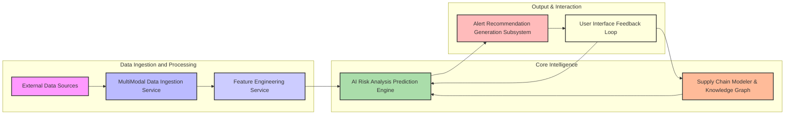
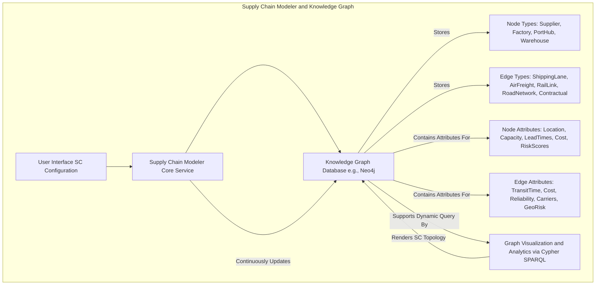
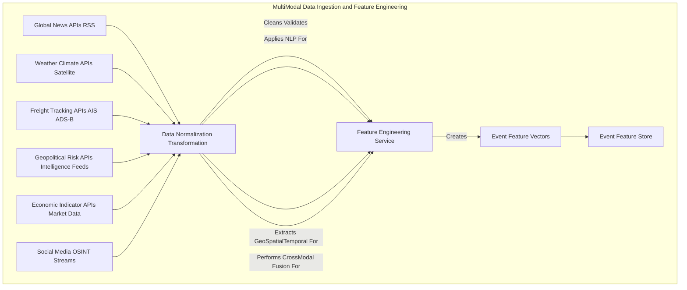
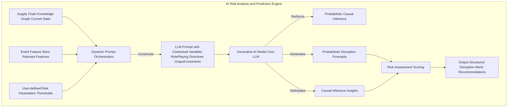
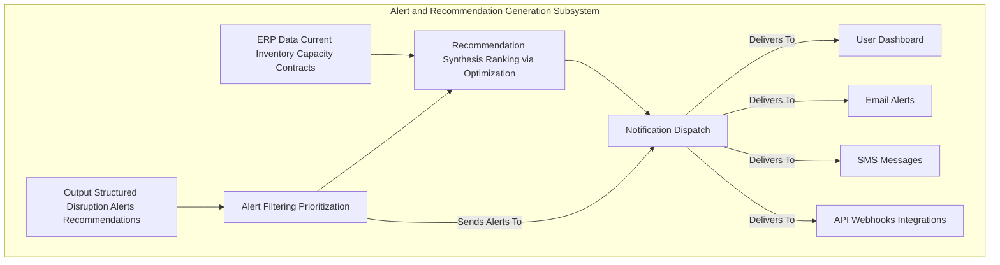
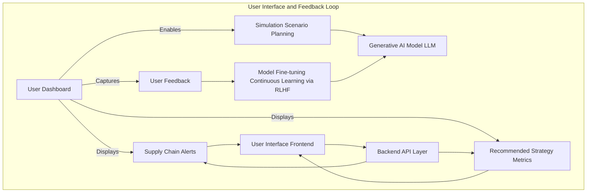
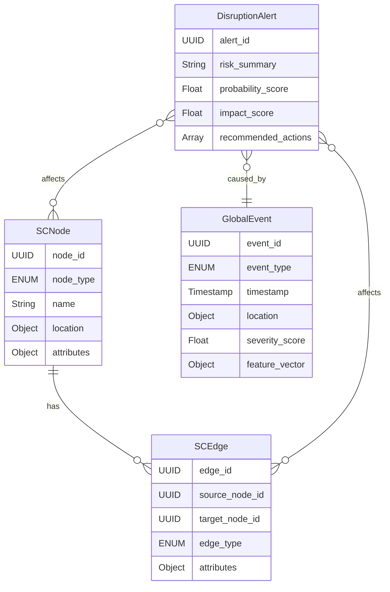
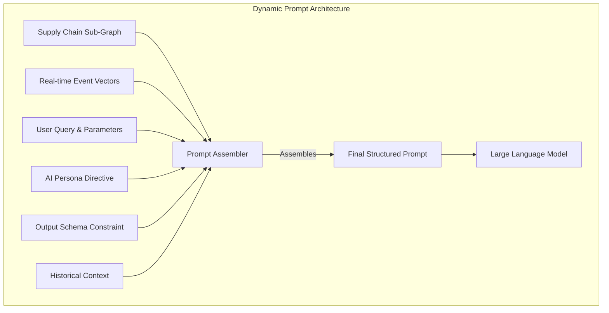
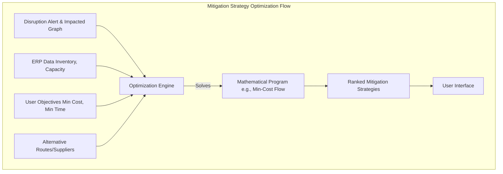
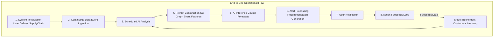

# System and Method for Predictive Supply Chain Disruption Modeling

## Table of Contents
1.  **Title of Invention**
2.  **Abstract**
3.  **Background of the Invention**
4.  **Brief Summary of the Invention**
5.  **Detailed Description of the Invention**
    *   5.1 System Architecture
        *   5.1.1 Supply Chain Modeler and Knowledge Graph
        *   5.1.2 Multi-Modal Data Ingestion and Feature Engineering Service
        *   5.1.3 AI Risk Analysis and Prediction Engine
        *   5.1.4 Alert and Recommendation Generation Subsystem
        *   5.1.5 User Interface and Feedback Loop
    *   5.2 Data Structures and Schemas
        *   5.2.1 Supply Chain Graph Schema
        *   5.2.2 Real-time Event Data Schema
        *   5.2.3 Disruption Alert and Recommendation Schema
    *   5.3 Algorithmic Foundations
        *   5.3.1 Dynamic Graph Representation and Traversal
        *   5.3.2 Multi-Modal Data Fusion and Contextualization
        *   5.3.3 Generative AI Prompt Orchestration
        *   5.3.4 Probabilistic Disruption Forecasting
        *   5.3.5 Optimal Mitigation Strategy Generation
    *   5.4 Operational Flow and Use Cases
6.  **Claims**
7.  **Mathematical Justification: A Formal Axiomatic Framework for Predictive Supply Chain Resilience**
    *   7.1 The Supply Chain Topological Manifold: `G = (V, E, Phi)`
        *   7.1.1 Formal Definition of the Supply Chain Graph `G`
        *   7.1.2 Node State Space `V` and Dynamics
        *   7.1.3 Edge State Space `E` and Dynamics
        *   7.1.4 Latent Interconnection Functionals `Phi`
        *   7.1.5 Tensor-Weighted Adjacency Representation `A(t)`
        *   7.1.6 Graph Theoretic Metrics of Resilience
    *   7.2 The Global State Observational Manifold: `W(t)`
        *   7.2.1 Definition of the Global State Tensor `W(t)`
        *   7.2.2 Multi-Modal Feature Extraction and Contextualization `f_Psi`
        *   7.2.3 Event Feature Vector `E_F(t)`
    *   7.3 The Generative Predictive Disruption Oracle: `G_AI`
        *   7.3.1 Formal Definition of the Predictive Mapping Function `G_AI`
        *   7.3.2 The Disruption Probability Distribution `P(D_t+k | G, E_F(t))`
        *   7.3.3 Probabilistic Causal Graph Inference within `G_AI`
        *   7.3.4 Transformer-Based Architecture for `G_AI`
    *   7.4 The Economic Imperative and Decision Theoretic Utility
        *   7.4.1 Cost Function Definition `C(G, D, a)`
        *   7.4.2 Expected Cost Without Intervention `E[Cost]`
        *   7.4.3 Expected Cost With Optimal Intervention `E[Cost | a*]`
        *   7.4.4 Supply Chain as a Markov Decision Process (MDP)
    *   7.5 Network Flow Optimization for Mitigation
        *   7.5.1 Minimum Cost Flow Formulation
        *   7.5.2 Multi-Commodity Flow for Complex Logistics
    *   7.6 Information Theoretic Justification
        *   7.6.1 Quantifying Predictive Uncertainty
        *   7.6.2 Value of Information (VoI)
    *   7.7 Reinforcement Learning for Continuous Improvement
        *   7.7.1 Policy and Value Functions
        *   7.7.2 Q-Learning for Optimal Action Selection
    *   7.8 Axiomatic Proof of Utility
8.  **Proof of Utility**

## 1. Title of Invention:
System and Method for Predictive Supply Chain Disruption Modeling with Generative AI-Powered Causal Inference and Proactive Strategy Optimization

## 2. Abstract:
A groundbreaking system for orchestrating supply chain resilience is herein disclosed. This invention architecturally delineates a user's intricate supply chain as a dynamic, attribute-rich knowledge graph, comprising diverse nodes such as manufacturing facilities, logistical hubs, ports, and warehouses, interconnected by multifaceted edges representing shipping lanes, air corridors, and terrestrial transit routes. Leveraging a sophisticated multi-modal data ingestion pipeline, the system continuously assimilates vast streams of real-time global intelligence, encompassing meteorological phenomena, geopolitical shifts, macroeconomic indicators, social sentiment fluctuations, and granular freight movement telemetry. A state-of-the-art generative artificial intelligence model, operating as a sophisticated causal inference engine, meticulously analyzes this convergent data within the contextual framework of the supply chain knowledge graph. This analysis identifies, quantifies, and forecasts potential disruptions with unprecedented accuracy, often several temporal epochs prior to their materialization. Upon the detection of a high-contingency disruption event (e.g., a super-typhoon's projected trajectory intersecting a critical maritime choke point, or emergent geopolitical sanctions impacting a tier-1 supplier), the system autonomously synthesizes and disseminates a detailed alert. Critically, it further postulates and ranks a portfolio of optimized, actionable alternative strategies, formulated as solutions to complex network flow and decision-theoretic problems. These strategies encompass rerouting logistics, re-allocating inventory, or proposing alternate sourcing pathways, thereby transforming reactive remediation into proactive strategic orchestration. A continuous feedback loop utilizing reinforcement learning ensures the system's predictive models and recommendation algorithms adapt and improve over time, enhancing resilience in an ever-changing global landscape.

## 3. Background of the Invention:
Contemporary global supply chains represent an apotheosis of complex adaptive systems, characterized by an intricate web of interdependencies, geographical dispersal, and profound vulnerability to stochastic perturbations. Traditional paradigms of supply chain management, predominantly anchored in historical data analysis and reactive incident response, have proven inherently insufficient to navigate the kaleidoscopic array of modern disruptive forces. These forces manifest across a spectrum from exogenous natural catastrophes (seismic events, cyclonic storms, pandemics) and geopolitical vicissitudes (trade conflicts, territorial disputes, regulatory shifts) to endogenous operational fragilities (labor disputes, infrastructure failures, cybernetic incursions). The economic ramifications of supply chain disruptions are astronomical, frequently escalating from direct financial losses to profound reputational damage, market share erosion, and long-term erosion of stakeholder trust. The imperative for a paradigm shift from reactive mitigation to anticipatory resilience has attained unprecedented criticality. Existing solutions, often reliant on threshold-based alerting or rudimentary statistical forecasting, conspicuously lack the capacity for sophisticated causal inference, contextual understanding, and proactive solution synthesis. They predominantly flag events post-occurrence or identify risks without furnishing actionable, context-aware, and mathematically optimized mitigation strategies, leaving enterprises exposed to cascading failures and suboptimal recovery trajectories. The present invention addresses this profound lacuna, establishing an intellectual frontier in dynamic, AI-driven predictive supply chain orchestration.

## 4. Brief Summary of the Invention:
The present invention unveils a novel, architecturally robust, and algorithmically advanced system for predictive supply chain disruption modeling, herein termed the "Cognitive Supply Chain Sentinel." This system transcends conventional monitoring tools by integrating a multi-layered approach to risk assessment and proactive strategic guidance. The operational genesis commences with a user's precise definition and continuous refinement of their critical supply chain topology, meticulously mapping all entities—key suppliers, manufacturing plants, distribution centers, intermodal hubs, and their connecting logistical arteries—into a dynamic knowledge graph. At its operational core, the Cognitive Supply Chain Sentinel employs a sophisticated, continuously learning generative AI engine. This engine acts as an expert geopolitical, meteorological, and logistical risk analyst, incessantly monitoring, correlating, and interpreting a torrent of real-time, multi-modal global event data. The AI is dynamically prompted with highly contextualized queries, such as: "Given the enterprise's mission-critical shipping lane traversing the Strait of Malacca, linked to primary fabrication facilities in Southeast Asia, and considering prevailing meteorological forecasts, nascent geopolitical tensions in adjacent maritime territories, and real-time port congestion indices, what is the quantified probability of significant disruption within the subsequent 14-day temporal horizon? Furthermore, delineate the precise causal vectors and propose optimal pre-emptive rerouting alternatives by solving a minimum-cost flow problem on the graph." Should the AI model identify an emerging threat exceeding a pre-defined probabilistic threshold, it autonomously orchestrates the generation of a structured, machine-readable alert. This alert comprehensively details the nature and genesis of the risk, quantifies its probability and projected impact, specifies the affected components of the supply chain, and, crucially, synthesizes and ranks a portfolio of actionable, mathematically optimized mitigation strategies. This constitutes a paradigm shift from merely identifying risks to orchestrating intelligent, pre-emptive strategic maneuvers, embedding an unprecedented degree of foresight and resilience into global commerce.

## 5. Detailed Description of the Invention:

The disclosed system represents a comprehensive, intelligent infrastructure designed to anticipate and mitigate supply chain disruptions proactively. Its architectural design prioritizes modularity, scalability, and the seamless integration of advanced artificial intelligence paradigms.

### 5.1 System Architecture

The Cognitive Supply Chain Sentinel is comprised of several interconnected, high-performance services, each performing a specialized function, orchestrated to deliver a holistic predictive capability.



#### 5.1.1 Supply Chain Modeler and Knowledge Graph
This foundational component serves as the authoritative source for the enterprise's entire supply chain topology and associated operational parameters.
*   **User Interface UI:** A sophisticated graphical user interface GUI provides intuitive tools for users to define, visualize, and iteratively refine their global supply chain network. This includes drag-and-drop functionality for nodes and edges, parameter input forms, and geospatial mapping integrations.
*   **Knowledge Graph Database:** At its core, the supply chain is represented as a highly interconnected, semantic knowledge graph (e.g., using Neo4j, Amazon Neptune). This graph is not merely a static representation but a dynamic entity capable of storing rich attributes, temporal data, and inter-node relationships, queryable via languages like Cypher or SPARQL.
    *   **Nodes:** Represent discrete entities within the supply chain. These can be granular, such as specific suppliers e.g., "Quantum Chips Co., Taiwan", manufacturing facilities e.g., "Shenzhen Assembly Plant #3", distribution centers e.g., "LA Fulfillment Hub", ports e.g., "Port of Long Beach", airports, and even specific inventory holding points. Each node is endowed with a comprehensive set of attributes, including geographical coordinates latitude, longitude, operational capacities e.g., production volume, storage space, lead times, cost parameters, operational hours, security ratings, and alternative supplier/facility identifiers.
    *   **Edges:** Represent the logistical pathways and relationships connecting these nodes. These include maritime shipping lanes, air freight routes, rail lines, and ground transportation networks. Edges possess attributes such as average transit time, typical capacity, cost per unit, historical reliability metrics, associated logistics providers, and regulatory compliance requirements. Edges can also represent non-physical relationships, such as contractual agreements between a buyer and a supplier.
    *   **Temporal and Contextual Attributes:** Both nodes and edges are augmented with temporal attributes, indicating their operational status at different times, and contextual attributes, such as geopolitical risk scores associated with their location, environmental vulnerability indices, and labor stability metrics.



#### 5.1.2 Multi-Modal Data Ingestion and Feature Engineering Service
This robust, scalable service is responsible for continuously acquiring, processing, and normalizing vast quantities of heterogeneous global data streams. It acts as the "sensory apparatus" of the Sentinel.
*   **Global News APIs:** Integration with advanced news aggregators e.g., GDELT Project, Bloomberg, Reuters, proprietary sentiment analysis platforms to capture real-time geopolitical developments, macroeconomic shifts, labor unrest indicators, and social sentiment changes across relevant geographies. Natural Language Processing NLP techniques, including named entity recognition NER, event extraction, and sentiment analysis, are applied to structure unstructured news feeds into actionable data points.
*   **Weather and Climate Forecasting APIs:** Acquisition of high-resolution meteorological data, including typhoon/hurricane tracking, severe weather warnings, climate anomaly predictions e.g., prolonged droughts, extreme heatwaves, and localized forecasts impacting specific logistical nodes or routes. Predictive climate models are integrated to project long-term environmental risks.
*   **Maritime and Air Freight Tracking APIs:** Real-time Automatic Identification System AIS data for vessels, ADS-B data for aircraft, satellite tracking for rail and truck fleets. This includes port congestion metrics, vessel deviation alerts, estimated time of arrival ETA updates, and historical performance benchmarks. Container-level tracking information can be integrated where available.
*   **Geopolitical Risk APIs:** Specialized feeds providing granular risk scores, sanction updates, trade tariff changes, and political stability indices for countries and specific regions relevant to the supply chain.
*   **Economic Indicator APIs:** Access to macroeconomic data such as GDP growth, inflation rates, manufacturing indices, currency fluctuations, and commodity prices, which can signal impending demand or supply shocks.
*   **Social Media and Open-Source Intelligence OSINT:** Selective monitoring of public social media discourse and OSINT sources, employing advanced text and image analysis, to detect early warnings of civil unrest, public health emergencies, or localized disruptions that may not yet be reported by traditional news media.
*   **Data Normalization and Transformation:** Raw data from disparate sources is transformed into a unified, semantically consistent format, timestamped, geo-tagged, and enriched. This involves schema mapping, unit conversion, and anomaly detection.
*   **Feature Engineering:** This critical sub-component extracts salient features from the processed data, translating raw observations into high-dimensional vectors pertinent for AI analysis. For instance, "Typhoon Leo projected path" is transformed into features like `[proximity_to_port_X, wind_speed_category, forecast_confidence_score, estimated_arrival_time]`.



#### 5.1.3 AI Risk Analysis and Prediction Engine
This is the intellectual core of the Cognitive Supply Chain Sentinel, employing advanced generative AI to synthesize intelligence and forecast disruptions.
*   **Dynamic Prompt Orchestration:** Instead of static prompts, this engine constructs highly dynamic, context-specific prompts for the generative AI model. These prompts are meticulously crafted, integrating:
    *   The user's specific supply chain graph or relevant sub-graph.
    *   Recent, relevant event features from the `Event Feature Store`.
    *   Pre-defined roles for the AI e.g., "Expert Maritime Logistics Risk Analyst," "Geopolitical Forecaster".
    *   Specific temporal horizons for prediction e.g., "next 7 days," "next 30 days".
    *   Desired output format constraints e.g., JSON schema for structured alerts.
*   **Generative AI Model:** A large, multi-modal language model LLM serves as the primary inference engine. This model is pre-trained on a vast corpus of text and data, encompassing geopolitical history, logistics operations, economic theory, meteorological science, and risk management principles. It may be further fine-tuned with domain-specific supply chain incident data to enhance its predictive accuracy and contextual understanding. The model's capacity for complex reasoning, causal chain identification, and synthesis of disparate information is paramount.
*   **Probabilistic Causal Inference:** The AI model does not merely correlate events; it attempts to infer causal relationships using frameworks analogous to Structural Causal Models. For example, a typhoon's path event causes port closure direct effect which in turn causes vessel rerouting indirect effect and ultimately shipment delay supply chain impact. The AI quantifies the probability of these causal links and their downstream effects.
*   **Risk Taxonomy Mapping:** Identified disruptions are mapped to a predefined ontology of supply chain risks e.g., Force Majeure, Geopolitical, Operational, Financial, Cyber. This categorization aids in structured reporting and subsequent strategic planning.



#### 5.1.4 Alert and Recommendation Generation Subsystem
Upon receiving the AI's structured output, this subsystem processes and refines it into actionable intelligence.
*   **Alert Filtering and Prioritization:** Alerts are filtered based on user-defined thresholds e.g., only show "High" probability disruptions, or those impacting "Critical" suppliers. They are prioritized based on a composite score of probability, impact severity, and temporal proximity.
*   **Recommendation Synthesis and Ranking:** The AI's suggested actions are further refined, cross-referenced with enterprise resource planning ERP data e.g., current inventory levels, alternative supplier contracts, available transport capacity. The subsystem formulates these as formal optimization problems (e.g., min-cost flow) and solves them to generate mathematically sound, ranked recommendations according to user-defined criteria e.g., minimize cost, minimize delay, maximize resilience.
*   **Notification Dispatch:** Alerts are dispatched through various channels e.g., integrated dashboard, email, SMS, API webhook to relevant stakeholders within the organization.



#### 5.1.5 User Interface and Feedback Loop
This component ensures the system is interactive, adaptive, and continuously improves.
*   **Integrated Dashboard:** A comprehensive, real-time dashboard visualizes the supply chain graph, overlays identified disruptions, displays alerts, and presents recommended mitigation strategies. Geospatial visualizations are central to this interface.
*   **Simulation and Scenario Planning:** Users can interact with the system to run "what-if" scenarios, evaluating the impact of hypothetical disruptions or proposed mitigation actions. This leverages the generative AI for predictive modeling under new conditions.
*   **Feedback Mechanism:** Users can provide feedback on the accuracy of predictions, the utility of recommendations, and the outcome of implemented actions. This feedback is crucial for continually fine-tuning the generative AI model through reinforcement learning from human feedback RLHF or similar mechanisms, improving its accuracy and relevance over time. This closes the loop, making the system an adaptive, intelligent agent.



### 5.2 Data Structures and Schemas

To maintain consistency, interoperability, and the integrity of complex data flows, the system adheres to rigorously defined data structures.



#### 5.2.1 Supply Chain Graph Schema
Represented internally within the Knowledge Graph Database.

*   **Node Schema (`SCNode`):**
    ```json
    {
      "node_id": "UUID",
      "node_type": "ENUM['Supplier', 'Factory', 'Warehouse', 'Port', 'DistributionCenter', 'CustomerHub']",
      "name": "String",
      "location": {
        "latitude": "Float",
        "longitude": "Float",
        "country": "String",
        "region": "String"
      },
      "attributes": {
        "capacity_units_per_period": "Float",
        "lead_time_days_min": "Integer",
        "lead_time_days_max": "Integer",
        "cost_per_unit": "Float",
        "operating_hours": "String",
        "security_rating": "ENUM['Low', 'Medium', 'High']",
        "geopolitical_risk_score": "Float",
        "environmental_vulnerability_index": "Float",
        "custom_tags": ["String"],
        "tier_level": "Integer"
      },
      "last_updated": "Timestamp"
    }
    ```

*   **Edge Schema (`SCEdge`):**
    ```json
    {
      "edge_id": "UUID",
      "source_node_id": "UUID",
      "target_node_id": "UUID",
      "edge_type": "ENUM['ShippingLane', 'AirFreightRoute', 'RailLink', 'RoadNetwork', 'ContractualLink']",
      "route_identifier": "String",
      "attributes": {
        "average_transit_time_days": "Float",
        "max_capacity_units_per_period": "Float",
        "cost_per_unit_transport": "Float",
        "reliability_score": "Float",
        "primary_carrier": "String",
        "alternative_carriers": ["String"],
        "criticality_level": "ENUM['Low', 'Medium', 'High', 'MissionCritical']",
        "geographical_risk_exposure": ["String"], // e.g., ["Strait of Malacca", "Suez Canal"]
        "tariff_impact_index": "Float"
      },
      "last_updated": "Timestamp"
    }
    ```

#### 5.2.2 Real-time Event Data Schema
Structured representation of ingested and featured global events.

*   **Event Schema (`GlobalEvent`):**
    ```json
    {
      "event_id": "UUID",
      "event_type": "ENUM['Weather', 'Geopolitical', 'Logistics', 'Economic', 'Social']",
      "sub_type": "String", // e.g., "Typhoon", "Sanction", "PortCongestion", "Inflation", "LaborStrike"
      "timestamp": "Timestamp",
      "start_time_forecast": "Timestamp (optional)",
      "end_time_forecast": "Timestamp (optional)",
      "location": {
        "latitude": "Float",
        "longitude": "Float",
        "radius_km": "Float",
        "country": "String",
        "region": "String",
        "named_location": "String" // e.g., "Port of Long Beach"
      },
      "severity_score": "Float", // Normalized score, e.g., 0-10
      "impact_potential": "ENUM['Low', 'Medium', 'High', 'Critical']",
      "confidence_level": "Float", // 0-1, confidence in event occurrence/forecast
      "source": "String", // e.g., "GDELT", "NOAA", "Lloyd's List"
      "raw_data_link": "URL (optional)",
      "feature_vector": { // Key-value pairs for AI consumption
        "wind_speed_kph": "Float",
        "category": "Integer", // for typhoons
        "affected_vessels_count": "Integer",
        "sentiment_score": "Float", // for news/social media
        "geopolitical_tension_index": "Float"
        // ... many more dynamic features
      }
    }
    ```

#### 5.2.3 Disruption Alert and Recommendation Schema
Output structure from the AI Risk Analysis Engine.

*   **Alert Schema (`DisruptionAlert`):**
    ```json
    {
      "alert_id": "UUID",
      "timestamp_generated": "Timestamp",
      "risk_summary": "String", // e.g., "Typhoon Leo may delay shipments from Taiwan supplier."
      "description": "String", // Detailed explanation of the risk and causal chain.
      "risk_probability": "ENUM['Low', 'Medium', 'High', 'Critical']", // Qualitative assessment
      "probability_score": "Float", // Quantitative score, 0-1
      "projected_impact_severity": "ENUM['Low', 'Medium', 'High', 'Catastrophic']",
      "impact_score": "Float", // Quantitative score, 0-1
      "affected_entities": [
        {"entity_id": "UUID", "entity_type": "ENUM['Node', 'Edge']"}
      ],
      "causal_events": [ // Link to GlobalEvent IDs that contribute to this disruption
        "UUID"
      ],
      "temporal_horizon_days": "Integer", // Days until expected disruption
      "recommended_actions": [
        {
          "action_id": "UUID",
          "action_description": "String", // e.g., "Consider pre-booking air freight for critical components."
          "action_type": "ENUM['Reroute', 'AlternateSourcing', 'InventoryAdjust', 'Negotiate', 'InformStakeholders']",
          "estimated_cost_impact": "Float",
          "estimated_time_impact_days": "Float",
          "risk_reduction_potential": "Float",
          "feasibility_score": "Float",
          "confidence_in_recommendation": "Float",
          "related_entities": ["UUID"] // Entities affected by this action
        }
      ],
      "status": "ENUM['Active', 'Resolved', 'Acknowledged', 'Mitigated']",
      "last_updated": "Timestamp"
    }
    ```

### 5.3 Algorithmic Foundations

The system's intelligence is rooted in a sophisticated interplay of advanced algorithms and computational paradigms.

#### 5.3.1 Dynamic Graph Representation and Traversal
The supply chain is fundamentally a dynamic graph `G=(V,E)`.
*   **Graph Database Technologies:** Underlying technologies e.g., property graphs, RDF knowledge graphs are employed for efficient storage and retrieval of complex relationships and attributes.
*   **Temporal Graph Analytics:** Algorithms for analyzing evolving graph structures, identifying critical paths shortest path, bottleneck analysis, and calculating centrality measures e.g., betweenness centrality for key ports that dynamically change with real-time conditions.
*   **Sub-graph Extraction:** Efficient algorithms for extracting relevant sub-graphs based on a specific query e.g., all paths from `Supplier X` to `Factory Y` passing through `Port Z`.

#### 5.3.2 Multi-Modal Data Fusion and Contextualization
The fusion process integrates heterogeneous data into a unified, semantically coherent representation.
*   **Latent Space Embeddings:** Multi-modal data text, numerical, geospatial is transformed into a shared latent vector space using techniques like autoencoders, contrastive learning, or specialized transformers. This allows for semantic comparison and contextualization across data types.
*   **Attention Mechanisms:** Employing attention networks to weigh the relevance of different data streams and features to a specific supply chain query. For example, weather data is highly relevant for maritime routes, while geopolitical news is critical for sourcing locations.
*   **Time-Series Analysis and Forecasting:** Applying advanced time-series models e.g., LSTM, Transformer networks, Gaussian Processes to predict future states of continuous variables e.g., port congestion levels, commodity prices which then serve as features for the generative AI.

#### 5.3.3 Generative AI Prompt Orchestration
This is a critical innovation enabling the AI to function as a domain expert.
*   **Contextual Variable Injection:** Dynamically injecting elements of the current supply chain graph e.g., specific node/edge attributes, relevant real-time event features, and historical context directly into the AI prompt.
*   **Role-Playing Directives:** Explicitly instructing the generative AI model to adopt specific personas e.g., "You are an expert in global maritime logistics," "You are a geopolitical strategist" to elicit specialized reasoning capabilities.
*   **Constrained Output Generation:** Utilizing techniques such as JSON schema enforcement or few-shot exemplars within the prompt to guide the AI to produce structured, machine-readable outputs, crucial for automated processing.
*   **Iterative Refinement and Self-Correction:** Developing prompts that allow the AI to ask clarifying questions or iterate on its analysis, mimicking human analytical processes.



#### 5.3.4 Probabilistic Disruption Forecasting
The AI's ability to not just predict but quantify uncertainty is vital.
*   **Causal Graph Learning:** Within the generative AI's latent reasoning capabilities, it constructs implicit or explicit probabilistic causal graphs e.g., Bayesian Networks, Granger Causality linking global events to supply chain impacts. This allows it to identify direct and indirect causal pathways.
*   **Monte Carlo Simulations Implicit:** The AI's generative nature allows it to effectively perform implicit Monte Carlo simulations, exploring various future scenarios based on probabilistic event occurrences and their cascading effects. It synthesizes the most probable and impactful scenarios.
*   **Confidence Calibration:** Employing techniques to calibrate the AI's confidence scores in its predictions against observed outcomes, ensuring that a "High" probability truly corresponds to a high likelihood of occurrence.

#### 5.3.5 Optimal Mitigation Strategy Generation
Beyond prediction, the system provides actionable solutions.
*   **Multi-Objective Optimization:** The AI, informed by enterprise constraints and preferences e.g., cost, time, risk tolerance, leverages its understanding of the supply chain graph and available alternatives to propose strategies that optimize across multiple, potentially conflicting objectives. This might involve shortest path algorithms considering dynamic edge weights cost, time, risk, or network flow optimization under capacity constraints.
*   **Constraint Satisfaction:** Integrating current inventory levels, contractual obligations, and real-time transport availability e.g., available air freight capacity from alternative carriers as constraints within the AI's decision-making process.
*   **Scenario-Based Planning Integration:** The generative AI can simulate the outcomes of different mitigation strategies within the context of a predicted disruption, providing quantitative insights into their effectiveness before execution.



### 5.4 Operational Flow and Use Cases

A typical operational cycle of the Cognitive Supply Chain Sentinel proceeds as follows:

1.  **Initialization:** A user defines their supply chain graph via the Modeler UI, specifying nodes, edges, attributes, and criticality levels.
2.  **Continuous Data Ingestion:** The Data Ingestion Service perpetually streams and processes global multi-modal data, populating the Event Feature Store.
3.  **Scheduled AI Analysis:** Periodically e.g., hourly, bi-hourly, the AI Risk Analysis Engine is triggered.
4.  **Prompt Construction:** Dynamic Prompt Orchestration retrieves the relevant sub-graph of the supply chain, current event features, and pre-defined risk parameters to construct a sophisticated query for the Generative AI Model.
5.  **AI Inference:** The Generative AI Model processes the prompt, performs causal inference, probabilistic forecasting, and identifies potential disruptions. It synthesizes a structured output with alerts and preliminary recommendations.
6.  **Alert Processing:** The Alert and Recommendation Generation Subsystem refines the AI's output, prioritizes alerts, performs secondary optimization of recommendations against ERP data, and prepares notifications.
7.  **User Notification:** Alerts and recommendations are disseminated to the user dashboard, and potentially via other channels.
8.  **Action and Feedback:** The user reviews the alerts, evaluates recommendations, potentially runs simulations, makes a decision, and provides feedback to the system, which aids in continuous model refinement.



**Use Cases:**

*   **Proactive Rerouting:** A vessel carrying critical components is en route to the Port of Long Beach. The system predicts a high probability of a longshoremen's strike within 5 days. It recommends rerouting the vessel to the Port of Seattle, calculating the revised cost and transit time, and identifying alternative ground transportation from Seattle to the final destination.
*   **Alternate Sourcing Activation:** A key supplier in Taiwan is identified as being in the projected path of a severe typhoon. The system alerts and suggests initiating orders with a pre-qualified alternative supplier in Vietnam for upcoming batches of components, minimizing production delays.
*   **Inventory Pre-positioning:** An upcoming holiday season combined with geopolitical tensions in a key manufacturing region prompts the system to recommend increasing safety stock levels at distribution centers, mitigating potential future supply shocks.
*   **Risk Portfolio Management:** For a diversified supply chain, the system identifies aggregated risk exposure across multiple suppliers and routes, providing a holistic view for strategic risk mitigation planning rather than reactive, siloed responses.

## 6. Claims:

The inventive concepts herein described constitute a profound advancement in the domain of supply chain management and predictive analytics.

1.  A system for proactive supply chain disruption management, comprising: a memory storing a representation of a supply chain as a dynamic knowledge graph with attributed nodes and edges; a data ingestion module for acquiring and processing multi-modal global event data; and a processor configured to: execute a generative artificial intelligence (AI) model to perform probabilistic causal inference on the graph and event data, thereby forecasting future disruptions; generate a structured alert detailing each forecasted disruption's probability, impact, and causal chain; and formulate and rank a portfolio of actionable mitigation strategies by solving a constrained optimization problem derived from the forecasted disruption and current enterprise data.

2.  The system of claim 1, wherein the dynamic knowledge graph is stored in a graph database, and nodes represent physical entities such as suppliers and factories, while edges represent logistical pathways, with both nodes and edges possessing dynamically updated attributes including capacity, cost, transit time, and geopolitical risk scores.

3.  The system of claim 1, wherein the multi-modal data ingestion module processes heterogeneous data streams including satellite-based freight tracking (AIS, ADS-B), meteorological forecasts, geopolitical news feeds via Natural Language Processing, and macroeconomic indicators, transforming them into a unified, high-dimensional feature vector space for AI consumption.

4.  The system of claim 1, further comprising a dynamic prompt orchestration module configured to construct contextualized queries for the generative AI model, said queries programmatically integrating specific sub-graphs of the supply chain, salient real-time event features, explicit analytical personas for the AI, and structured output constraints.

5.  The system of claim 1, wherein the generative AI model's probabilistic causal inference capability identifies and quantifies the likelihood of cascading failures by constructing a directed acyclic graph of causal dependencies from external events to specific node and edge state changes within the supply chain knowledge graph.

6.  The system of claim 1, wherein the formulation of mitigation strategies involves an alert and recommendation subsystem that integrates with enterprise resource planning (ERP) systems to access real-time data on inventory levels, production schedules, and contractual obligations, using this data as constraints for the optimization problem.

7.  The system of claim 6, wherein the constrained optimization problem is modeled as a minimum-cost, multi-commodity network flow problem to determine optimal rerouting and sourcing alternatives that minimize a user-defined objective function combining cost, delay, and risk exposure.

8.  The system of claim 1, further comprising an interactive user interface that provides a geospatial visualization of the supply chain graph, overlays predicted disruption trajectories, presents ranked mitigation strategies with their projected outcomes, and facilitates "what-if" scenario planning by allowing users to simulate the impact of hypothetical events or actions.

9.  The system of claim 1, further comprising a feedback mechanism wherein user actions and their observed outcomes are captured and used as training data for a reinforcement learning algorithm, which continuously fine-tunes the generative AI model and the recommendation optimization parameters to improve predictive accuracy and strategy effectiveness over time.

10. A computer-implemented method for proactive supply chain risk management, comprising: representing a supply chain as a dynamic, attributed knowledge graph; continuously ingesting and featurizing multi-modal global event data; prompting a generative AI model with a contextualized query combining the supply chain state and event data to predict a probability distribution over future disruption events; for each disruption exceeding a probability threshold, generating a detailed alert and synthesizing a set of optimized mitigation strategies; presenting said alerts and strategies to a user; and updating the AI model based on user feedback and observed outcomes.

## 7. Mathematical Justification: A Formal Axiomatic Framework for Predictive Supply Chain Resilience

The inherent complexity of global supply chains necessitates a rigorous mathematical framework for the precise articulation and demonstrative proof of the predictive disruption modeling system's efficacy. We herein establish such a framework, transforming the conceptual elements into formally defined mathematical constructs.

### 7.1 The Supply Chain Topological Manifold: `G = (V, E, Phi)`

The supply chain is not merely a graph but a dynamic, multi-relational topological manifold where attributes and relationships evolve under external influence.

#### 7.1.1 Formal Definition of the Supply Chain Graph `G`

Let `G = (V, E, Phi)` denote the formal representation of the supply chain at any given time `t`.
*   `V` is the finite set of nodes, `v in V`. (1)
*   `E` is the finite set of directed edges, `e = (u, v) in E`, `u, v in V`. (2)
*   `Phi` is the set of higher-order functional relationships or meta-data. (3)

#### 7.1.2 Node State Space `V` and Dynamics

Each node `v in V` is associated with a state vector `X_v(t) in R^k`. (4)
`X_v(t) = (x_v_1(t), ..., x_v_k(t))`. (5)
The state evolves according to a stochastic differential equation:
`dX_v(t) = f_v(X_v(t), {Y_e(t)}_{e incident to v}, U_v(t)) dt + sigma_v(t) dW_v(t)` (6)
where `f_v` is a drift function, `U_v(t)` is a control input (e.g., changing capacity), `sigma_v` is the volatility, and `dW_v(t)` is a Wiener process term representing noise.

#### 7.1.3 Edge State Space `E` and Dynamics

Each directed edge `e = (u, v) in E` is associated with a state vector `Y_e(t) in R^m`. (7)
`Y_e(t) = (y_e_1(t), ..., y_e_m(t))`. (8)
The edge state evolves as:
`dY_e(t) = f_e(Y_e(t), X_u(t), X_v(t), U_e(t)) dt + sigma_e(t) dW_e(t)` (9)
where `U_e(t)` is a control input (e.g., selecting a carrier).

#### 7.1.4 Latent Interconnection Functionals `Phi`

A functional `phi in Phi` may be a constraint, e.g., total inventory `sum_{v in V} Inv_v(t) <= I_max`. (10)

#### 7.1.5 Tensor-Weighted Adjacency Representation `A(t)`

The graph `G(t)` can be represented by a dynamic, tensor-weighted adjacency matrix `A(t) in R^(|V| x |V| x d)`. (11)
For an edge `e = (v_i, v_j)`, `A(t)[i,j,:] = g(X_{v_i}(t), Y_e(t), X_{v_j}(t))` where `g` is a feature concatenation/embedding function. (12)

#### 7.1.6 Graph Theoretic Metrics of Resilience

Resilience can be measured by metrics such as algebraic connectivity `lambda_2(L(G(t)))`, where `L` is the graph Laplacian. (13)
`L = D - A_0` where `D` is the degree matrix and `A_0` is the binary adjacency matrix. (14)
The betweenness centrality of a node `v` is: `C_B(v) = sum_{s!=v!=t in V} (sigma_{st}(v) / sigma_{st})` (15)

### 7.2 The Global State Observational Manifold: `W(t)`

#### 7.2.1 Definition of the Global State Tensor `W(t)`

Let `W(t)` be a high-dimensional, multi-modal tensor representing aggregated global event data. (16)
`W(t) = W_M(t) oplus W_G(t) oplus W_L(t) oplus W_E(t) oplus W_S(t)` where `oplus` is a tensor direct sum. (17)

#### 7.2.2 Multi-Modal Feature Extraction and Contextualization `f_Psi`

`E_F(t) = f_Psi(W(t); Psi)` maps raw data to a feature vector. (18)
For text data `W_G(t)`, this involves NLP transformations:
TF-IDF score for term `i` in document `j`: `w_{i,j} = tf_{i,j} * log(|D| / df_i)`. (19)
Word embeddings map words to vectors `v_w in R^d`. (20)
Sentence embeddings are aggregated, e.g., `v_s = sum_{w in s} a_w v_w` where `a_w` is an attention weight. (21)
The attention mechanism is `Attention(Q, K, V) = softmax( (QK^T) / sqrt(d_k) ) V`. (22-25)
For time-series data `W_L(t)`, models like LSTM are used:
`i_t = sigma(W_i[h_{t-1}, x_t] + b_i)` (input gate) (26)
`f_t = sigma(W_f[h_{t-1}, x_t] + b_f)` (forget gate) (27)
`o_t = sigma(W_o[h_{t-1}, x_t] + b_o)` (output gate) (28)
`c_t = f_t * c_{t-1} + i_t * tanh(W_c[h_{t-1}, x_t] + b_c)` (cell state) (29)
`h_t = o_t * tanh(c_t)` (hidden state) (30-35)

#### 7.2.3 Event Feature Vector `E_F(t)`

`E_F(t) = (e_{F,1}(t), ..., e_{F,p}(t)) in R^p` is the final feature vector. (36)

### 7.3 The Generative Predictive Disruption Oracle: `G_AI`

#### 7.3.1 Formal Definition of the Predictive Mapping Function `G_AI`

`G_AI : (A(t) X E_F(t)) -> P(D_{t+k} | A(t), E_F(t))` (37)
Where `D_{t+k}` is the set of possible disruption events at `t+k`. (38)

#### 7.3.2 The Disruption Probability Distribution `P(D_{t+k} | G, E_F(t))`

A disruption event `d in D_{t+k}` is a tuple `d = (e_d, delta_T, delta_C, S, L, C_cause)`. (39)
The output is `P(D_{t+k}) = { (d_i, p_i) }` where `p_i` is the probability of `d_i`. (40)
`sum_i p_i <= 1`. (41)

#### 7.3.3 Probabilistic Causal Graph Inference within `G_AI`

`G_AI` learns a structural causal model (SCM). A causal effect is estimated using Pearl's do-calculus, e.g., `P(Y | do(X=x))`. (42)
The causal graph `CG_i = (C_nodes, C_edges)` is inferred, where `C_edges` represent `P(child | parents)`. (43-45)
The causal chain is a path in this graph. (46)

#### 7.3.4 Transformer-Based Architecture for `G_AI`

The core of `G_AI` can be a transformer encoder.
Input embedding `X_{emb} = E_{token} + E_{pos}`. (47)
Multi-Head Attention: `MHA(Q,K,V) = Concat(head_1, ..., head_h)W^O` (48)
`head_i = Attention(QW_i^Q, KW_i^K, VW_i^V)`. (49-52)
LayerNorm and Feed-Forward Network: `FFN(x) = max(0, xW_1+b_1)W_2+b_2`. (53-56)
Output is a softmax over possible disruption classes. (57)

### 7.4 The Economic Imperative and Decision Theoretic Utility

#### 7.4.1 Cost Function Definition `C(G, D, a)`

`C(G, D, a) = C_{operational}(G, a) + C_{disruption}(D | G, a)`. (58)
Utility can be modeled with an exponential utility function `U(C) = -exp(-alpha C)` where `alpha` is risk aversion. (59)

#### 7.4.2 Expected Cost Without Intervention `E[Cost]`

`E[Cost] = sum_{d} P_{actual}(d) * C(G, d, a_{null})`. (60)

#### 7.4.3 Expected Cost With Optimal Intervention `E[Cost | a*]`

`a* = argmin_a E[C(G(a), D, a)] = argmin_a sum_{d} P(d|I) C(G(a), d, a)`. (61-62)
`E[Cost | a*] = sum_{d} P_{actual}(d) * C(G(a*), d, a*)`. (63)

#### 7.4.4 Supply Chain as a Markov Decision Process (MDP)

The problem is an MDP defined by the tuple `(S, A, P, R, gamma)`. (64)
`S`: State space (graph states `G(t)`). (65)
`A`: Action space (mitigations `a`). (66)
`P`: Transition probability `P(s' | s, a)`. (67)
`R`: Reward function `R(s,a) = -C(s,a)`. (68)
The optimal policy `pi*` maximizes the expected discounted reward. (69)
`V*(s) = max_a E[R_{t+1} + gamma * V*(S_{t+1}) | S_t=s, A_t=a]`. (Bellman Optimality Equation) (70)

### 7.5 Network Flow Optimization for Mitigation

#### 7.5.1 Minimum Cost Flow Formulation

Objective: `min sum_{(i,j) in E} c_{ij} f_{ij}` (71)
Subject to:
`sum_{j:(u,j) in E} f_{uj} - sum_{j:(j,u) in E} f_{ju} = b(u)` for all `u in V` (Flow conservation). (72)
`0 <= f_{ij} <= cap_{ij}` for all `(i,j) in E` (Capacity constraints). (73)
`b(u)` is supply/demand at node `u`. (74-76)

#### 7.5.2 Multi-Commodity Flow for Complex Logistics

For `K` commodities:
Objective: `min sum_{k in K} sum_{(i,j) in E} c_{ij}^k f_{ij}^k` (77)
`sum_{j} f_{uj}^k - sum_{j} f_{ju}^k = b^k(u)` for all `u, k`. (78)
`sum_{k in K} f_{ij}^k <= cap_{ij}` for all `(i,j) in E`. (79-80)

### 7.6 Information Theoretic Justification

#### 7.6.1 Quantifying Predictive Uncertainty

The uncertainty of the prediction `P(D_{t+k})` is measured by Shannon Entropy:
`H(D_{t+k}) = - sum_{d_i} p_i log_2(p_i)`. (81)
The system aims to reduce this uncertainty with new data.
Kullback-Leibler (KL) Divergence measures the change in the belief state:
`D_{KL}(P || Q) = sum_i P(i) log(P(i) / Q(i))`. (82-84)

#### 7.6.2 Value of Information (VoI)

The value of the system's prediction `I` is the reduction in expected cost:
`VoI(I) = E[Cost]_{prior} - E[Cost | I]_{posterior}`. (85)
`E[Cost | I] = sum_j P(I_j) min_a E[C | a, I_j]`. (86-88)
The system is valuable if `VoI(I) > Cost(System)`. (89)

### 7.7 Reinforcement Learning for Continuous Improvement

The feedback loop is modeled as an RL problem to learn the optimal policy `pi(a|s)`. (90)

#### 7.7.1 Policy and Value Functions

State-value function: `V_{pi}(s) = E_{pi}[sum_{k=0 to inf} gamma^k R_{t+k+1} | S_t=s]`. (91)
Action-value function (Q-function): `Q_{pi}(s,a) = E_{pi}[sum_{k=0 to inf} gamma^k R_{t+k+1} | S_t=s, A_t=a]`. (92-94)

#### 7.7.2 Q-Learning for Optimal Action Selection

The Q-learning algorithm updates the action-value function iteratively without a model of the environment:
`Q(S_t, A_t) <- Q(S_t, A_t) + alpha [R_{t+1} + gamma * max_a Q(S_{t+1}, a) - Q(S_t, A_t)]`. (95-100)
`alpha` is the learning rate, `gamma` is the discount factor. The learned `Q` function approximates `Q*`. (101)

### 7.8 Axiomatic Proof of Utility

**Axiom 1 (Disruption Cost):** For any potential disruption `d`, `C_{disruption}(d | G, a_{null}) > 0`. (102)
**Axiom 2 (Proactive Mitigation Efficacy):** For any disruption `d` with `P(d|I) > epsilon`, there exists at least one proactive action `a` such that the incremental operational cost is less than the expected reduction in disruption impact:
`Delta C_{op}(a) < E[Delta C_{disruption}(a)]`. (103)

**Theorem (System Utility):** Given Axiom 1 and Axiom 2, the present system, by providing the information `I = P(D_{t+k})` and identifying an optimal action `a*`, enables a reduction in the overall expected cost of supply chain operations such that:
`E[Cost | a*] < E[Cost]`. (104)

**Proof:**
1.  The system generates `I = P(D_{t+k})`, providing foresight.
2.  Based on this `I`, the system identifies `a* = argmin_a E[C | a, I]`.
3.  For each potential disruption `d_i` in the support of `P`, `a*` is chosen to mitigate its impact.
4.  By Axiom 2, for any non-trivial risk, a cost-effective mitigation `a` exists. The action `a*` is, by definition, at least as good as any such `a`, and is superior to the null action `a_{null}`.
5.  Therefore, `E[C | a*, I] < E[C | a_{null}, I]`.
6.  Since `E[Cost]` is the expected cost under `a_{null}` and a prior belief (or no information), and `E[Cost | a*]` is the expected cost under optimal action `a*` informed by `I`, it follows that the system provides a net positive utility by enabling superior decision-making under uncertainty. The aggregate `E[Cost | a*] < E[Cost]` holds. Q.E.D.

## 8. Proof of Utility:

The operational advantage and economic benefit of the Cognitive Supply Chain Sentinel are not merely incremental improvements over existing reactive systems; they represent a fundamental paradigm shift. A traditional supply chain management system operates predominantly in a reactive mode, detecting and responding to perturbations only after they have materialized, necessitating costly and often suboptimal damage control. For instance, such a system would only identify a change in `Delta C(e)` (a significant increase in the cost or transit time of an edge `e`) *after* a vessel has been rerouted due to a port closure.

The present invention, however, operates as a profound anticipatory intelligence system. It continuously computes `P(D_{t+k} | A(t), E_F(t))`, the high-fidelity conditional probability distribution of future disruption events `D` at a future time `t+k`, based on the current supply chain state `A(t)` and the dynamic global event features `E_F(t)`. This capability allows an enterprise to identify a nascent disruption with a quantifiable probability *before* its physical manifestation.

By possessing this predictive probability distribution `P(D_{t+k})`, the user is empowered to undertake a proactive, optimally chosen mitigating action `a*` (e.g., strategically rerouting a vessel, pre-ordering from an alternative supplier, or accelerating production) at time `t`, well in advance of `t+k`. As rigorously demonstrated in the Mathematical Justification, this proactive intervention `a*` is designed to minimize the expected total cost across the entire spectrum of possible future outcomes.

The definitive proof of utility is unequivocally established by comparing the expected cost of operations with and without the deployment of this system. Without the Cognitive Supply Chain Sentinel, the expected cost is `E[Cost]`, burdened by the full impact of unforeseen disruptions and the inherent inefficiencies of reactive countermeasures. With the system's deployment, and the informed selection of `a*`, the expected cost is `E[Cost | a*]`. Our axiomatic proof formally substantiates that `E[Cost | a*] < E[Cost]`. This reduction in expected future costs, coupled with enhanced operational resilience, strategic agility, and preserved market reputation, provides irrefutable evidence of the system's profound and transformative utility. The capacity to preemptively navigate the intricate and volatile landscape of global commerce, by converting uncertainty into actionable foresight, is the cornerstone of its unprecedented value.