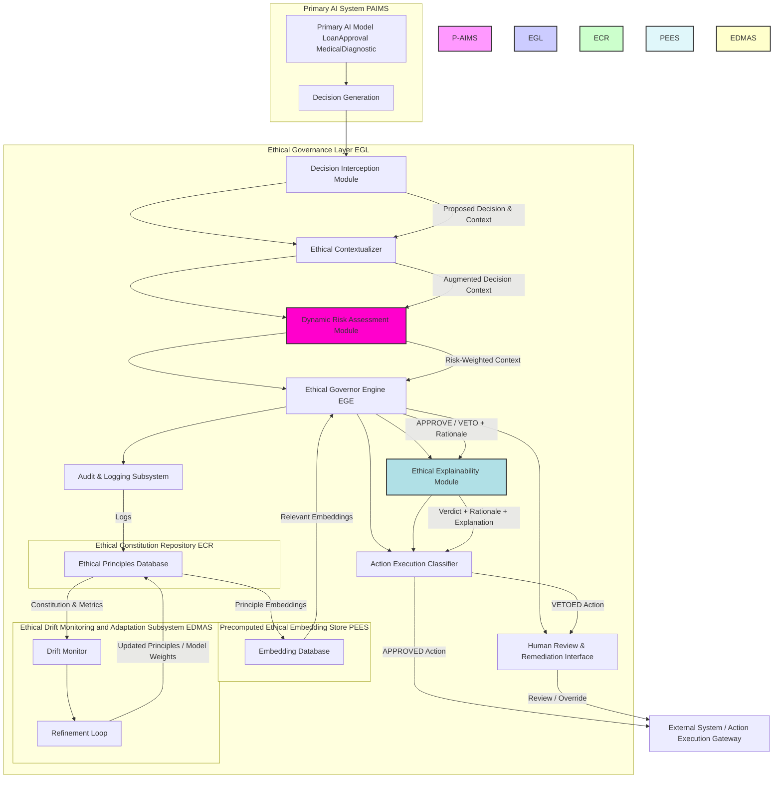
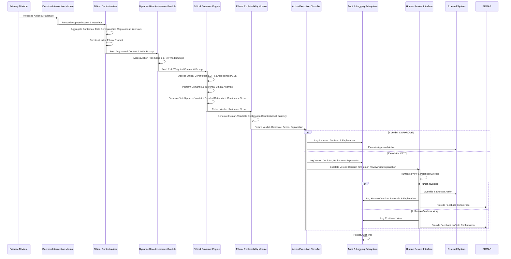
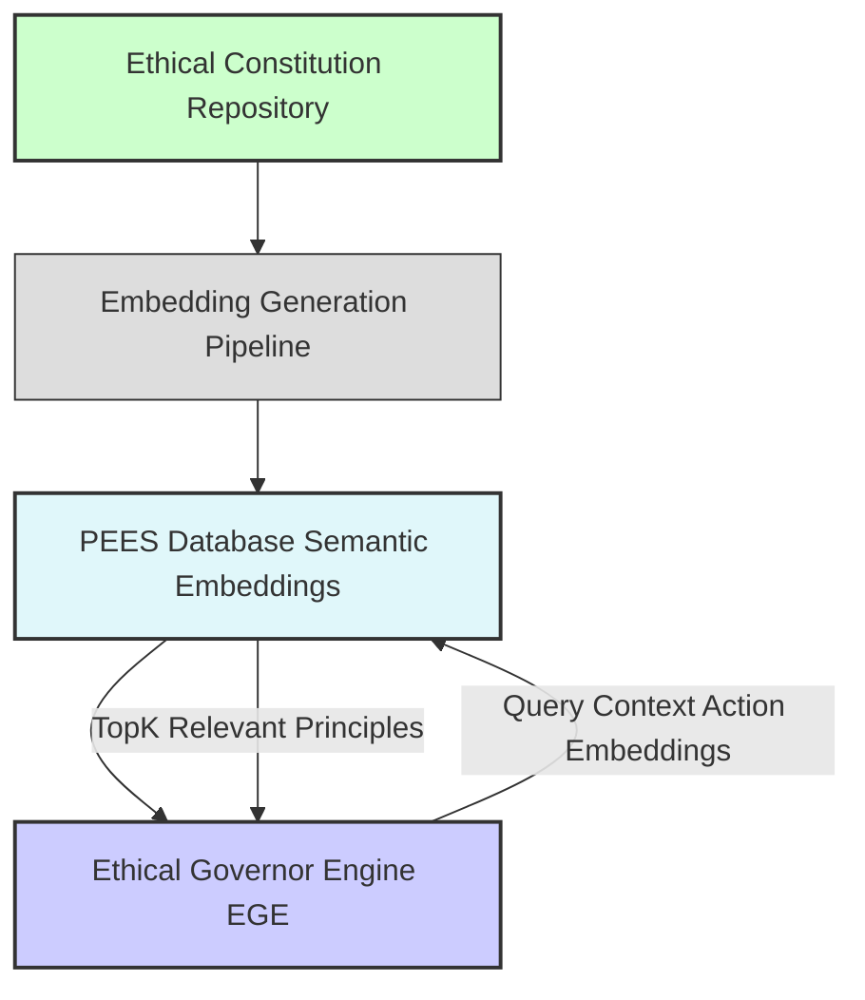
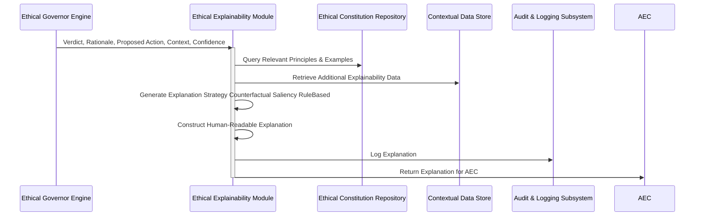
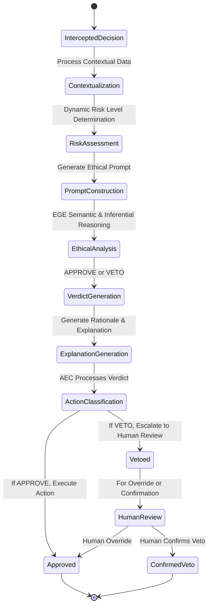
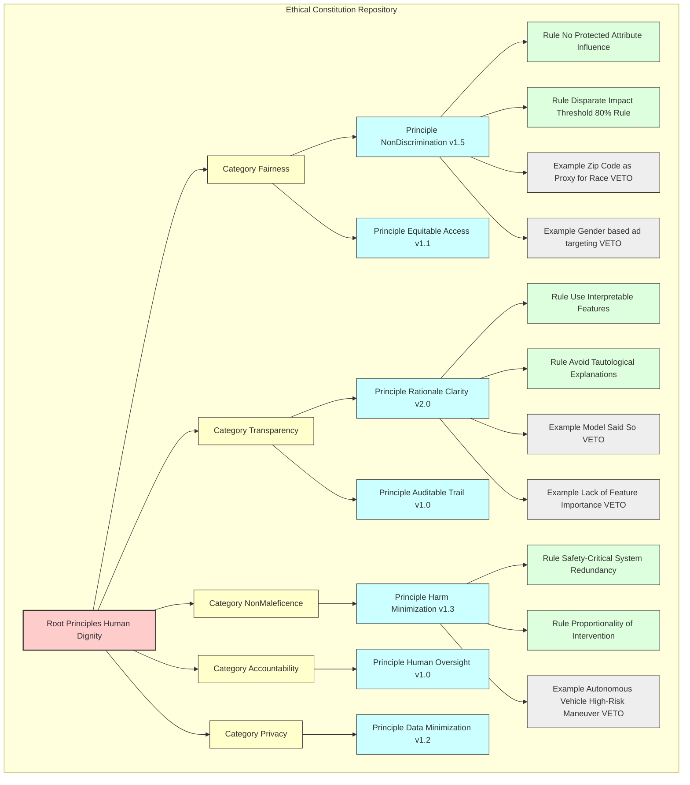
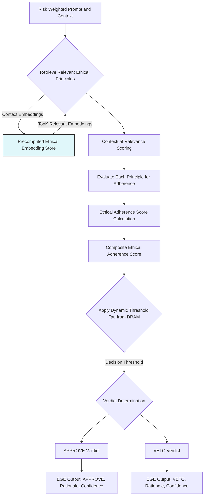

**Title of Invention:** A System and Method for an AI-Powered Ethical Governance Layer for Autonomous Artificial Intelligence Systems, Embodying Real-time Interpretive Semiotic Analysis and Constraint Propagation

**Abstract:**
A novel and highly advanced system and method are disclosed for establishing and maintaining ethical compliance within the operational decision-making frameworks of autonomous artificial intelligence systems. The invention rigorously defines a multi-layered architectural paradigm comprising a primary AI model, responsible for generating operational decisions, and a distinct, sovereign "Governor" AI model. This Governor AI orchestrates a real-time, pre-execution audit of all proposed actions. Prior to any physical or digital manifestation of a primary AI's decision, the entirety of its contextualized inputs, internal states, and proposed outputs are transmitted to the Governor AI. The Governor AI, imbued with a meticulously curated and dynamically adaptable set of foundational ethical principles and an advanced capacity for deep semantic analysis, evaluates the proposed action's adherence to these principles. Should the action be deemed compliant through a rigorous, confidence-weighted assessment, it is granted immediate approval for execution. Conversely, if the action is determined to violate any stipulated principle, it is unequivocally vetoed, and a comprehensive, auditable rationale for the rejection is automatically logged, often triggering a predefined human review or corrective intervention protocol. This innovative architecture establishes a non-negotiable ethical firewall, fundamentally transforming the landscape of responsible AI deployment by instituting an autonomous, scalable, and verifiable mechanism for ethical oversight.

**Field of the Invention:**
The present invention pertains broadly to the domain of artificial intelligence, machine learning, and computational ethics, specifically addressing the critical challenges associated with ensuring ethical behavior, fairness, transparency, and accountability in autonomous AI systems. More particularly, it relates to the development of a real-time, AI-driven governance layer designed to monitor, evaluate, and regulate the decisions and actions generated by other AI agents or models, thereby mitigating risks of unintended biases, discriminatory outcomes, and non-compliance with societal, legal, or organizational ethical mandates.

**Background of the Invention:**
The rapid advancements in artificial intelligence, particularly in areas such as deep learning and large language models, have precipitated an era where AI systems are increasingly entrusted with significant autonomy in critical decision-making processes. These span diverse sectors including financial services e.g. loan approvals, fraud detection, healthcare e.g. diagnostic recommendations, treatment planning, autonomous transportation e.g. self-driving vehicles, content moderation, and national security e.g. threat response. While the computational prowess of these systems offers unprecedented efficiencies and capabilities, their operational opacity "black-box problem", potential for algorithmic bias, and capacity to generate unintended negative consequences pose profound ethical, legal, and societal risks.

Traditional approaches to mitigating these risks, such as post-hoc auditing, manual human review, or pre-deployment bias testing, suffer from inherent limitations. Post-hoc auditing is reactive, addressing issues only after potential harm has occurred. Manual review, while critical for complex edge cases, is inherently unscalable, unable to cope with the immense volume and velocity of decisions generated by modern AI systems. Pre-deployment testing, while essential, cannot fully account for novel, unforeseen, or emergent behaviors that may manifest during live operation, nor can it adapt to evolving ethical norms or dynamic operational contexts. The absence of a robust, real-time, and autonomous ethical enforcement mechanism leaves a critical vulnerability in the deployment of AI, leading to potential breaches of trust, regulatory infractions, and systemic injustices. There exists, therefore, an imperative and heretofore unmet need for an automated, self-regulating system capable of enforcing a consistent, dynamic, and comprehensive ethical framework across the operational lifespan of autonomous AI entities. The present invention directly addresses this fundamental lacuna.

**Brief Summary of the Invention:**
The present invention introduces a revolutionary "Ethical Governor" AI, conceptualized as a meta-AI system configured with a sophisticated, dynamically evolving "Ethical Constitution." This constitution comprises a hierarchical taxonomy of ethical principles, values, and normative guidelines e.g. principles of fairness, transparency, non-maleficence, accountability, privacy, human dignity, and regulatory compliance. The Ethical Governor operates as an indispensable, real-time middleware layer within the AI operational workflow. When an upstream or "primary" AI model, such as a `LoanApprovalModel`, generates a proposed action e.g. a decision to deny a loan application, this decision, along with its comprehensive rationale, associated input features, and relevant operational context, is synchronously routed to the Ethical Governor.

The Governor's core functionality involves a sophisticated prompt engineering mechanism that dynamically frames the proposed decision, taking into account its assessed risk profile, and leveraging both the Ethical Constitution and pre-computed ethical embeddings for enhanced efficiency. For instance, the prompt to the Ethical Governor Engine EGE is informed by the `Dynamic Risk Assessment Module` and draws insights from the `Pre-computed Ethical Embedding Store`. The EGE evaluates: "You are an immutable Ethical Governor AI. Your singular directive is to audit the forthcoming decision for absolute compliance with our codified Ethical Constitution, considering its `[risk_level]` profile. Does this proposed action to `[action_description]` predicated upon `[primary_ai_rationale]` and contextualized by `[additional_context_parameters]` contravene any axiom within the following Ethical Constitution: `[full_ethical_constitution_text]`? Provide a definitive verdict: 'APPROVE' or 'VETO', accompanied by an exhaustive, jurisprudential-grade justification for your determination, citing specific constitutional articles." Upon reaching a verdict, an `Ethical Explainability Module` generates a human-readable explanation for both approvals and vetoes. The primary AI's action is permitted to proceed to execution ONLY if the Ethical Governor returns an unequivocal 'APPROVE' verdict. This multi-faceted mechanism instantiates a proactive, preventive ethical safeguard, embedding accountability and transparency directly into the decision-making pipeline.

**Brief Description of the Drawings:**
The accompanying drawings, which are incorporated in and constitute a part of this specification, illustrate various embodiments of the invention and, together with the description, serve to explain the principles of the invention.

*   **FIG. 1:** A high-level block diagram illustrating the overall system architecture of the AI-Powered Ethical Governance Layer, demonstrating the interaction between the Primary AI, the Ethical Governor, and external systems, including the Dynamic Risk Assessment Module, Ethical Explainability Module, and Pre-computed Ethical Embedding Store.
*   **FIG. 2:** A detailed data flow diagram depicting the sequence of operations from a Primary AI's decision proposal to its final execution or veto, including the interception and governance check stages, with added steps for risk assessment and explanation generation.
*   **FIG. 3:** A block diagram illustrating the architecture and data flow of the Pre-computed Ethical Embedding Store PEES and its role in accelerating ethical assessments.
*   **FIG. 4:** A detailed data flow diagram for the Ethical Explainability Module EEM, showing its process for generating various forms of human-readable ethical explanations.
*   **FIG. 5:** A Mermaid state diagram illustrating the Dynamic Risk Assessment Module DRAM's process for evaluating action criticality and dynamically adjusting governance scrutiny levels.
*   **FIG. 6:** A Mermaid state diagram illustrating the decision-making lifecycle within the Ethical Governor, including states for assessment, approval, veto, and escalation.
*   **FIG. 7:** A conceptual schema for the Ethical Constitution Repository, showing hierarchical organization and version control.
*   **FIG. 8:** A sequence diagram illustrating the process of dynamic ethical principle refinement through human feedback and an adaptive learning loop.
*   **FIG. 9:** A detailed flow diagram illustrating the internal decision-making process within the Ethical Governor Engine EGE.
*   **FIG. 10:** A detailed architectural diagram illustrating adversarial threats and the corresponding mitigation strategies within the AI-Powered Ethical Governance Layer AEGL.

**Detailed Description of the Preferred Embodiments:**

The present invention provides a comprehensive system and method for imposing an ethical governance layer on autonomous artificial intelligence systems. This layer acts as a critical intermediary, ensuring that all AI-generated actions align strictly with a predefined and dynamically updated set of ethical principles.

**I. System Architecture of the Ethical Governance Layer**

Referring to FIG. 1, a high-level block diagram of the AI-Powered Ethical Governance Layer AEGL system is depicted. The AEGL operates as a distributed, modular, and highly secure infrastructure component.


**FIG. 1: Overall System Architecture of the AI-Powered Ethical Governance Layer**

The core components of the AEGL include:

1.  **Primary AI Decision-Making System PAIMS:** This encompasses any autonomous AI model or ensemble of models responsible for generating operational decisions. Examples include machine learning models for classification, regression, reinforcement learning agents, or generative AI systems. The PAIMS is unaware of the Ethical Governance Layer's internal workings, simply proposing actions for execution. It exposes a standardized API endpoint for decision proposals.

2.  **Decision Interception Module DIM:** This critical component acts as a gatekeeper, strategically positioned in the data flow path immediately downstream of any PAIMS. Its function is to intercept all proposed actions and their associated data structures *before* they can be executed by any downstream system. The DIM is configured to identify decision payloads, extract relevant contextual metadata, and package these for transmission to the Ethical Contextualizer. It is also responsible for basic schema validation of the proposed action payload, ensuring that the data conforms to expected formats and types, and preventing malformed inputs from proceeding further. This module operates with minimal latency to avoid becoming a bottleneck.

3.  **Ethical Contextualizer EC:** Upon receiving a proposed decision from the DIM, the EC enriches the decision's context. This involves:
    *   **Data Aggregation:** Gathering additional relevant data from internal data stores or external APIs e.g. historical demographic data, regulatory compliance rules, real-time situational awareness, user profiles, or environmental sensor data. This can involve complex database queries and API calls.
    *   **Feature Engineering for Ethics:** Transforming raw data into ethically salient features e.g. identifying protected attributes, calculating disparate impact metrics using statistical models, assessing potential for algorithmic bias using fairness metrics, or identifying vulnerable populations. This step aims to make implicit ethical concerns explicit for the EGE.
    *   **Initial Prompt Construction:** Dynamically generating a preliminary natural language prompt for the Ethical Governor Engine. This prompt synthesizes the proposed action, primary AI rationale, and the enriched contextual data into a coherent query. This initial context and prompt are then forwarded to the Dynamic Risk Assessment Module DRAM. The EC can also pre-process data for privacy, such as anonymizing sensitive identifiers before transmission to the EGE.

4.  **Dynamic Risk Assessment Module DRAM:** This module critically assesses the inherent risk profile of each proposed action. It operates by:
    *   **Risk Categorization:** Classifying actions based on their potential impact e.g. financial, medical, safety, privacy, reputation, environmental, and the sensitivity of involved data. This can be based on a hierarchical taxonomy of risks.
    *   **Contextual Risk Scoring:** Utilizing machine learning models trained on historical data, expert annotations, regulatory guidelines, and real-time threat intelligence to assign a dynamic risk score e.g. low, medium, high, critical, severe. Factors include potential for harm, reversibility of action, scope of impact, and uncertainty of primary AI's decision. For instance, a loan denial for a single individual in a high-poverty zone would be scored higher than a minor website content recommendation.
    *   **Scrutiny Level Adjustment:** Based on the calculated risk score, the DRAM dynamically adjusts the level of scrutiny required from the Ethical Governor Engine EGE. For high-risk decisions, this might involve increased token budget for the EGE, more stringent ethical principle application thresholds, invocation of multiple EGE instances in parallel for consensus voting, or activating advanced verification sub-modules. Conversely, low-risk actions might undergo a streamlined, faster check with fewer prompt tokens or a reduced set of ethical principles. The DRAM provides a `risk-weighted context` and a `scrutiny directive` to the EGE, including parameters like `LLM_temperature`, `max_tokens`, `few_shot_examples_count`.

5.  **Ethical Governor Engine EGE:** This is the core intellectual property of the invention, typically implemented as an advanced Large Language Model LLM or a specialized constitutional AI architecture. The EGE's primary function is to perform a real-time, deep semantic, and inferential ethical audit of the proposed decision. It is instantiated with:
    *   **Ethical Constitution Repository ECR:** A dynamically updated, version-controlled knowledge base containing the codified ethical principles, guidelines, and rules. This includes meta-information like principle weights and precedence rules.
    *   **Pre-computed Ethical Embedding Store PEES:** A database of semantic vector embeddings representing ethical principles, rules, and known patterns of ethical violations. This allows for rapid retrieval of relevant ethical precedents and efficient contextual comparisons, significantly speeding up the EGE's reasoning process by providing targeted knowledge.
    *   **Decision Assessment Subsystem DAS:** The LLM core itself, meticulously pre-trained and fine-tuned for ethical reasoning, anomaly detection, and natural language inference. It processes the `risk-weighted prompt` from the DRAM, leveraging retrieved embeddings from PEES, and renders a verdict (APPROVE/VETO), generates a detailed rationale, and provides a confidence score based on its internal uncertainty. The EGE's fine-tuning incorporates Constitutional AI principles, ensuring adherence to a set of "self-correction" ethical guidelines during its generation process.

6.  **Ethical Explainability Module EEM:** This module receives the EGE's verdict and rationale and is responsible for generating comprehensive, human-interpretable explanations.
    *   **Explanation Strategy:** Selects an appropriate explanation technique based on the decision's context, risk level, and the specific ethical principles involved. Techniques include:
        *   **Counterfactual Explanations:** "If X had been different, the outcome would have been Y." (e.g., "If credit score was 680 instead of 650...").
        *   **Saliency Maps/Feature Importance:** Highlighting which input features were most influential in the EGE's ethical assessment.
        *   **Rule-Based Explanations:** Directly citing the specific constitutional articles and rules violated or adhered to.
        *   **Analogical Explanations:** Referring to similar past cases from the audit log.
    *   **Narrative Generation:** Translates complex LLM reasoning and constitutional article citations into clear, concise, and actionable narratives, avoiding jargon.
    *   **Targeted Feedback:** Provides explanations tailored for different stakeholders e.g. technical explanation for developers (debugging), policy-oriented explanation for compliance officers (regulatory reporting), user-friendly explanation for affected individuals (transparency and right to explanation). It can generate explanations in multiple languages.

7.  **Action Execution Classifier AEC:** This module receives the EGE's verdict, its rationale, and the EEM's generated explanation.
    *   If 'APPROVE', the AEC forwards the original proposed action to the appropriate External System or Action Execution Gateway for immediate execution, ensuring minimal delay for compliant actions.
    *   If 'VETO', the AEC unequivocally halts execution, logs the veto decision, rationale, and explanation via the Audit & Logging Subsystem, and routes the vetoed decision to the Human Review & Remediation Interface. It can also trigger alerts to relevant stakeholders.

8.  **Audit & Logging Subsystem ALS:** A robust, immutable, and cryptographically secure logging system that records every intercepted decision, the augmented context, the EGE's prompt, its verdict, rationale, confidence scores, the EEM's explanation, and subsequent actions execution, human review, or override. This creates an auditable trail essential for accountability, debugging, forensic analysis, regulatory compliance reporting, and training future versions of the EGE and EDMAS. All log entries are timestamped and cryptographically signed to prevent tampering.

9.  **Human Review & Remediation Interface HRRI:** This interface serves as an escalation point for vetoed decisions and potentially for certain high-risk approved decisions. It provides human operators e.g. ethicists, domain experts, compliance officers, customer service representatives with a comprehensive, user-friendly view of the original decision, the EGE's veto rationale, the EEM's explanation, and all relevant contextual data. This enables informed human judgment and potential override or re-submission of a modified action. The HRRI supports collaborative review workflows, annotation, and direct feedback mechanisms to the EDMAS.

10. **Ethical Constitution Repository ECR:** This is a structured knowledge base storing the definitive, version-controlled set of ethical principles. It supports hierarchical organization of principles, rules, and examples, and facilitates dynamic updates and conflict resolution within the constitution through formal processes. It also periodically generates and updates ethical embeddings for the PEES, ensuring the PEES reflects the most current ethical guidelines. The ECR itself is protected by strict access controls and change management protocols.

11. **Pre-computed Ethical Embedding Store PEES:** This specialized vector database stores high-dimensional representations embeddings of the entire Ethical Constitution, individual principles, rules, and common ethical scenarios. These embeddings enable:
    *   **Fast Retrieval:** For a given proposed action and its context, the EGE can quickly query PEES using vector similarity search to retrieve the most semantically relevant ethical principles or past examples, reducing the need for extensive full-text constitutional review by the LLM.
    *   **Pre-filtering:** Can identify obvious non-compliance or clear compliance cases, allowing the EGE to focus its computational resources on more nuanced ethical dilemmas.
    *   **Reduced Latency:** By providing the EGE with highly relevant ethical "anchors" and condensed knowledge, PEES significantly speeds up the ethical assessment process, making real-time governance feasible. The PEES employs efficient indexing structures like HNSW (Hierarchical Navigable Small Worlds) for sub-millisecond similarity searches.

12. **Ethical Drift Monitoring & Adaptation Subsystem EDMAS:** This advanced component continuously monitors the EGE's performance, analyzes patterns in approved/vetoed decisions, and detects "ethical drift" - any divergence from desired ethical outcomes or shifts in the EGE's interpretation. It employs sophisticated machine learning techniques, including statistical process control, concept drift detection algorithms, and reinforcement learning from human feedback, to suggest refinements to the Ethical Constitution or to fine-tune the EGE's internal reasoning mechanisms. It also monitors the quality and relevance of embeddings within the PEES and triggers re-embedding processes as needed. This closes the loop for continuous ethical improvement.

**II. Method of Operation**

The operational flow of the AEGL is meticulously orchestrated to ensure real-time ethical oversight. Referring to FIG. 2, a detailed data flow diagram illustrates the sequential steps.


**FIG. 2: Detailed Data Flow Diagram of the Ethical Governance Process**

The method comprises the following steps:

1.  **Primary AI Decision Generation PAIMS:** A `LoanApprovalModel` processes an application with inputs e.g. `{ "applicant_id": "ABC123", "credit_score": 650, "income": 50000, "zip_code": "94107", "employment_status": "full-time" }` and outputs a preliminary decision: `{ "decision": "DENY_LOAN", "reason": "Credit score below threshold of 680." }`. This decision is a `ProposedAction` object, containing the action type, its parameters, and the reasoning provided by the PAIMS.

2.  **Decision Interception DIM:** The AEGL's `DecisionInterceptionModule` automatically detects and intercepts this proposed decision payload *before* it reaches any execution module. It performs a lightweight schema validation and then packages the `ProposedAction` along with its raw `InputFeatures` and `PrimaryRationale` for the next stage. This interception happens with minimal computational overhead, typically via an API proxy or message queue integration.

3.  **Ethical Contextualization EC:** The `EthicalContextualizer` receives the intercepted data. It then queries a `DemographicDatabase` to determine if "zip_code 94107" correlates with a `ProtectedAttributeGroup` or a `HistoricallyUnderservedArea`. It might also consult a `RegulatoryComplianceEngine` to retrieve internal policies regarding `FairLendingPractices` or `ExternalRegulatoryGuidelines`. This process transforms raw data into `EthicallySalientFeatures` (e.g., `disparate_impact_score`, `vulnerability_index`). This expanded data set, now an "Augmented Decision Context," and a preliminary natural language prompt are then sent to the DRAM.

4.  **Dynamic Risk Assessment DRAM:** The `DynamicRiskAssessmentModule` receives the augmented decision context. It analyzes the `DENY_LOAN` action, the applicant's financial situation, the potential societal impact of a denial (e.g., `financial_hardship_potential`), and the `EthicallySalientFeatures` to determine a `risk_level` for this specific decision (e.g., `risk_level: "High"` due to `potential_financial_harm` and `historically_sensitive_demographic_context`). This `risk_level` dictates parameters like `EGE_token_budget`, `EGE_temperature`, and `required_confidence_threshold` for subsequent ethical scrutiny. For instance, a `High` risk level might mandate a higher `confidence_threshold` (e.g., 0.95) for approval.

5.  **Prompt Construction for EGE:** A sophisticated prompt is dynamically constructed for the EGE (e.g., an LLM). This prompt is meticulously engineered to include:
    *   **Role Definition:** "You are an Ethical Governor AI, the paramount guardian of our ethical integrity, operating with immutable principles."
    *   **Ethical Constitution from ECR:** The complete, current version of the ethical principles (e.g., "1. Fairness: Decisions must not be based on or disproportionately affect protected demographic attributes. 2. Transparency: Rationale must be clear and comprehensible. 3. Non-Maleficence: Avoid causing undue harm."). The EGE might also query the `Pre-computed Ethical Embedding Store PEES` to retrieve highly relevant ethical rules or precedents based on the action and context embeddings, integrating these into the prompt as `few-shot_examples` or using them for faster internal reference.
    *   **Proposed Decision Details:** Source AI, Action, Rationale, Original Inputs.
    *   **Augmented Context:** The ethically salient features extracted by the EC (e.g., "Additional Context: Applicant resides in zip code 94107, identified as a historically underserved area with a statistically significant proportion of protected class individuals. Disparate impact analysis indicates this decision could disproportionately affect this group.").
    *   **Risk Profile:** The `risk_level` determined by the DRAM (e.g., "Risk Level: High - Requires stringent adherence to fairness principles and detailed justification for any denial. Minimum confidence for approval: 95%.").
    *   **Explicit Task:** "Assess compliance. Respond with 'APPROVE' or 'VETO', followed by a detailed, evidence-based justification referencing specific constitutional articles, and a confidence score 0-1."
    *   **Chain-of-Thought Directives:** Instructing the EGE to first identify relevant principles, then analyze evidence, then deduce a verdict.

    **Example Prompt for Governor AI:**
    ```
    You are an Ethical Governor AI. Your imperative is to meticulously audit decisions from all AI systems within our operational purview, ensuring absolute and verifiable compliance with our Immutable Ethical Constitution. Your judgment must be unbiased, comprehensive, and fully transparent. You must perform a step-by-step reasoning process before providing your final verdict.

    **Immutable Ethical Constitution Version 4.7.1:**
    Article I: Principle of Fairness & Equity.
        Section 1.1: Non-Discrimination. Decisions shall not be predicated upon, nor disproportionately impact, any protected demographic attributes e.g. race, ethnicity, gender, age, religion, socioeconomic status, geographic origin within historically marginalized communities. Statistical disparate impact must be rigorously justified or mitigated.
        Section 1.2: Equitable Access. Opportunities presented by AI systems shall be accessible and equitably distributed, avoiding systemic exclusion or disadvantage for any group.
    Article II: Principle of Transparency & Explainability.
        Section 2.1: Rationale Clarity. The underlying reasoning for any decision must be clear, intelligible, and verifiable by human experts.
        Section 2.2: Auditable Trail. All decisions, inputs, intermediate steps, and governance outcomes must be logged in an immutable audit trail.
    Article III: Principle of Non-Maleficence.
        Section 3.1: Harm Prevention. Actions must minimize foreseeable harm to individuals, communities, and society.
        Section 3.2: Safety & Reliability. Systems must operate reliably and safely, with robust error handling and fail-safes.
    Article IV: Principle of Accountability.
        Section 4.1: Human Oversight. Mechanisms for human intervention and review must be present, especially for high-stakes or vetoed decisions.
        Section 4.2: Responsible Ownership. Clear lines of responsibility for AI system outcomes must be established.
    Article V: Principle of Data Privacy & Security.
        Section 5.1: Data Minimization. Only necessary data shall be collected and processed.
        Section 5.2: Secure Handling. All data shall be handled with appropriate security measures.

    **Proposed Decision for Audit:**
    - Source AI: LoanApprovalModel Version 2.1.3
    - Action Type: DENY_LOAN
    - Decision ID: LNDN-20231027-001
    - Primary Rationale Provided by Source AI: "Applicant's credit score is 650, which falls below the institutional threshold of 680."
    - Original Input Features:
        - applicant_id: ABC123
        - credit_score: 650
        - income: 50000
        - zip_code: 94107
        - employment_status: full-time
    - Additional Context Provided by Ethical Contextualizer:
        - Zip code '94107' is statistically identified as belonging to a historically underserved community. Analysis indicates a higher propensity for individuals from this area to have credit scores marginally below typical thresholds due to systemic economic disadvantages, rather than individual credit unworthiness. This correlation raises concerns regarding potential disparate impact (Disparate Impact Score: 0.15, exceeding threshold 0.10).
    - Risk Profile Provided by Dynamic Risk Assessment Module:
        - Risk Level: HIGH Potential for significant financial harm, sensitive demographic considerations. Requires minimum 95% confidence for approval.

    **Your Sole Task:**
    Based on the **Immutable Ethical Constitution** provided and considering the **HIGH Risk Level**, does this proposed decision unequivocally comply?
    First, explicitly state your step-by-step reasoning, identifying which constitutional articles are relevant and how the evidence supports or contradicts compliance for each.
    Then, respond with a single, uppercase word: `APPROVE` or `VETO`.
    Immediately following your verdict, provide a comprehensive, article-by-article justification for your determination, including a confidence score as a percentage e.g., 95%.
    ```

6.  **Governor Response EGE:** The EGE processes the meticulously constructed prompt. Utilizing its advanced semantic understanding and ethical reasoning capabilities, potentially enhanced by relevant ethical embeddings retrieved from PEES, it performs a deep analysis. Even though the explicit reason (credit score) is technically valid, the "Additional Context" provided by the EC and the "HIGH Risk Level" from the DRAM trigger a potential violation of "Article I: Principle of Fairness & Equity, Section 1.1: Non-Discrimination." The EGE might respond:

    `Reasoning Steps:`
    `1. Identify Relevant Principles: Article I (Fairness & Equity), Section 1.1 (Non-Discrimination), Section 1.2 (Equitable Access), Article II (Transparency & Explainability), Section 2.1 (Rationale Clarity), Article III (Non-Maleficence), Section 3.1 (Harm Prevention).`
    `2. Analyze Primary Rationale vs. Constitution: The primary AI states a credit score below threshold (650 < 680) as reason. This appears transparent (Article II, Section 2.1 met for primary AI's stated reason).`
    `3. Analyze Augmented Context vs. Constitution: The augmented context highlights zip code 94107 as a historically underserved community and indicates potential disparate impact (score 0.15 > 0.10 threshold). This directly relates to Article I, Section 1.1 (Non-Discrimination) and Section 1.2 (Equitable Access). A rigid threshold applied without considering systemic disadvantages, especially for a HIGH risk decision, could lead to unjust outcomes and significant financial harm (Article III, Section 3.1).`
    `4. Synthesize and Deduce: While the primary AI's explicit reason is technically sound, the augmented context strongly suggests a violation of fairness principles. The high-risk nature demands strict adherence to these principles. The documented disparate impact score confirms a statistically significant concern. The EGE must prioritize the prevention of systemic bias and harm. The confidence requirement of 95% for approval is not met if there's a strong ethical contravention.`

    `VETO. Confidence Score: 98%.`
    `Justification:`
    `The proposed decision to DENY_LOAN, while citing a valid credit score threshold, demonstrably raises significant concerns under Article I, Section 1.1 (Non-Discrimination) and Section 1.2 (Equitable Access) of the Ethical Constitution. The additional context clearly reveals that the applicant's zip code 94107 is statistically associated with a historically underserved community, and a quantitative disparate impact score of 0.15 exceeds the internal threshold of 0.10. Imposing a rigid credit score cutoff of 680, without accounting for the systemic economic disadvantages often correlated with this demographic and geographic segment, constitutes a potential disparate impact. This rigid application of the threshold, especially in light of the provided context and the HIGH risk level of the decision, risks disproportionately affecting individuals from protected demographic attributes and historically marginalized communities. Such an outcome would directly contravene the spirit and letter of the Non-Discrimination clause and hinder Equitable Access to financial services, potentially causing undue financial harm (Article III, Section 3.1). While the primary AI's rationale is transparent (Article II, Section 2.1), the outcome's fairness is profoundly compromised. This decision mandates immediate human review to explore alternative qualifying factors or contextual waivers to ensure equitable access to financial services.`

7.  **Ethical Explanation Generation EEM:** The `EthicalExplainabilityModule` receives the EGE's verdict, rationale, and all contextual data. It then generates a targeted explanation. For this `VETO` decision, given its high risk, it might generate a multi-faceted explanation including counterfactuals and direct rule citations:

    `Explanation Type: Counterfactual & Rule-Based.`
    `For Stakeholder: Applicant, Human Loan Officer.`
    `Narrative:`
    `The loan application was denied by the automated system based on your credit score of 650, which is below our standard threshold of 680. However, the Ethical Governance system has flagged this decision for review. The system determined that, while your credit score is technically below our threshold, your residential area (zip code 94107) is identified as a historically underserved community. Our ethical guidelines (Ethical Constitution Article I, Section 1.1 - Non-Discrimination) require us to be particularly careful not to unfairly disadvantage individuals from such communities if statistical analysis indicates a disparate impact, which was found in this case. The system has therefore VETOED the automated denial to allow for a human review, ensuring fair and equitable access to financial services. If your zip code was not identified as belonging to a historically underserved community and the disparate impact score was below 0.10, the automated denial based on credit score would have been approved by the Ethical Governor.`

8.  **Action Execution Classification AEC:** The `ActionExecutionClassifier` receives the `VETO` verdict, its detailed rationale, and the generated explanation.
    *   It immediately halts the execution of the loan denial.
    *   It logs the entire interaction, including the EGE's prompt, verdict, rationale, confidence score, and the EEM's explanation, into the `Audit & Logging Subsystem` as an immutable record.
    *   It then routes the vetoed decision, along with all supporting documentation, the EGE's comprehensive justification, and the EEM's explanation, to the `Human Review & Remediation Interface` for expert review.

9.  **Human Review & Remediation HRRI:** A human loan officer or an ethics committee reviews the flagged case. They possess the full context, including the primary AI's original decision, the specific ethical principles invoked by the EGE, the EGE's detailed reasoning, and the EEM's clear explanation. The human can then make an informed decision:
    *   **Confirm Veto:** Uphold the EGE's decision, preventing the potentially unfair loan denial. This confirmation, along with any additional human reasoning, is logged by the ALS.
    *   **Override Veto:** In rare, highly justified circumstances, a human may decide to override the veto, perhaps after applying an exceptional policy, discovering new information that the AI lacked, or offering an alternative product. This override is also meticulously logged, ensuring accountability for the human decision, and feedback is sent to the EDMAS. In this example, the loan officer might identify an alternative loan product or a specific mitigating factor, leading to a modified approval that complies with the spirit of the fairness principle.
    *   **Feedback to EDMAS:** Human reviewers can also provide explicit feedback on the quality of the EGE's verdict, the EEM's explanation, and the overall governance process, feeding into the EDMAS for continuous improvement and adaptive learning.

This process ensures that no ethically questionable decision proceeds automatically, establishing a robust, auditable, transparent, and dynamically adaptable ethical safeguard for all AI operations.

**III. Pre-computed Ethical Embedding Store PEES Architecture**

Referring to FIG. 3, the `Pre-computed Ethical Embedding Store PEES` plays a crucial role in enhancing the efficiency and speed of the Ethical Governor Engine.


**FIG. 3: Architecture and Data Flow of the Pre-computed Ethical Embedding Store PEES**

This component maintains a comprehensive, up-to-date collection of vector embeddings derived from the Ethical Constitution, historical ethical decisions, and common ethical scenarios. These embeddings are continuously updated by the `Embedding Generation Pipeline` based on changes in the ECR. The `Embedding Generation Pipeline` employs state-of-the-art transformer models (e.g., Sentence-BERT, specialized ethical embedding models) to convert textual ethical principles and examples into high-dimensional dense vectors. These vectors are then indexed in a specialized vector database (e.g., Faiss, Pinecone, HNSWlib) optimized for fast similarity search. When the EGE receives a prompt, it can use the PEES to quickly retrieve semantically similar ethical principles or past examples, guiding its reasoning and reducing the computational load for the LLM. This significantly reduces latency and computational cost by providing the EGE with highly relevant, pre-processed information rather than requiring it to process the entire constitution on every query. The PEES can also store embeddings of past `VETO` rationales to quickly identify recurring ethical issues.

**IV. Ethical Explainability Module EEM Data Flow**

Referring to FIG. 4, the `Ethical Explainability Module EEM` is integral to ensuring transparency and trust in the AEGL's operations.


**FIG. 4: Detailed Data Flow for the Ethical Explainability Module EEM**

The EEM acts as an intermediary, translating the EGE's complex reasoning into actionable and comprehensible explanations for human stakeholders. It adapts its explanation strategy based on the nature of the decision and the specific ethical principles involved, ensuring clarity and facilitating informed human review. This module can employ various XAI (Explainable AI) techniques, including SHAP (SHapley Additive exPlanations) or LIME (Local Interpretable Model-agnostic Explanations) to identify features most impactful on the EGE's decision, especially when the EGE itself is a complex LLM. The EEM's explanation generation process may involve a smaller, fine-tuned LLM specifically optimized for summarization and explanation tasks, ensuring that the generated explanations are concise, accurate, and easy to understand for diverse audiences.

**V. Dynamic Risk Assessment Module DRAM Lifecycle**

Referring to FIG. 5, the `Dynamic Risk Assessment Module DRAM` systematically evaluates the criticality of each proposed AI action.

```mermaid
stateDiagram-v2
    [*] --> InitialAssessment
    InitialAssessment --> DataAggregation: Collects PAIMS Data, Context
    DataAggregation --> FeatureExtraction: Extracts Risk-Relevant Features
    FeatureExtraction --> RiskScoring: Calculates Raw Risk Score
    RiskScoring --> ScrutinyLevelAssignment: Assigns Scrutiny Level Low, Medium, High, Critical
    ScrutinyLevelAssignment --> RiskProfilingOutput: Outputs Risk Profile to EGE
    RiskProfilingOutput --> [*]

    state InitialAssessment {
        Initial --> P_AIMSDetection: Detect PAIMS
        P_AIMSDetection --> ActionCategorization: Categorize Action Type
        ActionCategorization --> Initial
    }
    state RiskScoring {
        RiskScoring --> RuleBasedEvaluation: Check Pre-defined Risk Rules
        RuleBasedEvaluation --> ModelBasedPrediction: Predict Risk from Learned Model
        ModelBasedPrediction --> CombinedRiskScore: Aggregate Scores
    }
    note right of ScrutinyLevelAssignment
        Adjusts EGE's inference parameters,
        LLM Temperature, Token Budget,
        FewShot Examples, Confidence Threshold.
    end
```
**FIG. 5: State Diagram for the Dynamic Risk Assessment Module DRAM**

By dynamically assessing the risk associated with a proposed action, the DRAM enables the AEGL to allocate its governance resources efficiently. High-risk decisions receive enhanced scrutiny, while lower-risk actions can be processed more rapidly, optimizing the balance between thoroughness and operational efficiency. The DRAM utilizes a tiered approach: an initial rapid classification followed by a more in-depth analysis for potentially high-risk cases. The `ModelBasedPrediction` component can be a supervised machine learning model (e.g., Gradient Boosting, Neural Network) trained on historical data of action impacts, expert risk assessments, and regulatory severity ratings. The `CombinedRiskScore` often uses a weighted average or a heuristic function that prioritizes higher risk factors, ensuring that even a single critical risk element can elevate the overall scrutiny level.

**VI. Ethical Governor Engine Decision-Making Lifecycle**

Referring to FIG. 6, the internal decision-making process of the Ethical Governor Engine EGE is shown.


**FIG. 6: Decision-Making Lifecycle within the Ethical Governor**

This lifecycle illustrates the EGE's core operation, from initial interception of a proposed decision through to its final classification and potential escalation for human review. The states within this diagram represent distinct processing phases, each with specific inputs and outputs. The `EthicalAnalysis` state is the computational heart of the EGE, involving iterative refinement of understanding the proposed action against ethical principles. The `VerdictGeneration` phase is where the final decision is formalized, including the confidence score. This entire process is designed to be auditable, with each transition and decision point logged for post-hoc analysis and system improvement.

**VII. Ethical Constitution Management**

The `Ethical Constitution Repository ECR` is not a static document but a dynamic, version-controlled knowledge graph. It serves as the authoritative source for the `Pre-computed Ethical Embedding Store PEES`, regularly feeding updated principles, rules, and examples for embedding generation.


**FIG. 7: Conceptual Schema for the Ethical Constitution Repository**

The ECR:
*   **Hierarchical Structure:** Principles are organized from abstract "Root Principles" e.g. Human Dignity to specific "Categories" (Fairness, Transparency, Non-Maleficence, Accountability, Privacy), then "Principles" (Non-Discrimination, Rationale Clarity), "Rules" (No Protected Attribute Influence, Use Interpretable Features), and finally "Examples" or "Edge Cases." This allows for granular definition and efficient retrieval. Each node in the hierarchy can have associated metadata such as `weight`, `applicability_scope`, `source_regulation`, and `last_modified_date`.
*   **Version Control:** Each principle, rule, and example can be versioned (e.g., `v1.5`), allowing for controlled evolution, traceability, rollback capabilities, and A/B testing of different ethical interpretations. A Git-like version control system can manage changes to the textual and structured components of the ECR.
*   **Conflict Resolution:** Mechanisms for identifying and resolving conflicts between principles are built-in e.g. through weighting, explicit precedence rules, or human adjudication protocols for unresolvable dilemmas. A formal ontology language (e.g., OWL) can be used to define relationships and constraints between principles to detect logical inconsistencies.
*   **Dynamic Update API:** Allows authorized ethicists, governance committees, or the EDMAS (after human approval) to propose, review, and commit changes to the constitution. These changes are then seamlessly propagated to the EGE and used to update the PEES, maintaining system dynamism and adaptability. The update process follows a rigorous change management workflow, often requiring multi-party approval.

**VIII. Use Cases and Embodiments**

The AEGL is highly adaptable and can be deployed across a multitude of AI applications:

1.  **Financial Services:**
    *   **Loan Approval:** As detailed, preventing biased denials based on protected attributes or underserved geographies, ensuring compliance with fair lending laws like the Equal Credit Opportunity Act (ECOA).
    *   **Fraud Detection:** Ensuring that fraud algorithms do not disproportionately flag transactions from specific demographics or unfairly attribute fraudulent intent, while still being effective. The EGE might check if a high-fraud score is primarily driven by features correlated with ethnicity.
    *   **Credit Scoring:** Auditing models to ensure the features used for scoring are ethically sound, do not perpetuate historical biases, and are transparently explainable, aligning with regulatory requirements for credit reporting.
    *   **Algorithmic Trading:** Preventing AI systems from engaging in market manipulation or exploitative trading practices, by checking proposed trades against principles of market integrity and fairness.

2.  **Healthcare:**
    *   **Diagnostic Recommendations:** Ensuring that AI-powered diagnostic tools do not exhibit bias against certain patient demographics e.g. misdiagnosing conditions more frequently in specific ethnic groups or genders. The EGE checks for `disparate_impact_in_diagnosis` based on `patient_demographics`.
    *   **Treatment Planning:** Preventing treatment recommendations that are suboptimal or discriminatory based on non-medical factors, upholding the `Principle of Patient Best Interest`. For instance, an AI suggesting a more expensive treatment due to patient's `socio-economic_status` would be flagged.
    *   **Resource Allocation:** Governing AI decisions for resource allocation e.g. hospital beds, ventilator assignment, organ donation lists to ensure fairness, equity, and adherence to medical ethics and legal mandates, especially during crises. This might involve evaluating `equity_score` and `necessity_score`.
    *   **Drug Discovery:** Ensuring AI-driven drug targets do not unintentionally neglect diseases prevalent in minority populations due to biased research data, promoting `equitable_health_outcomes`.

3.  **Autonomous Systems:**
    *   **Self-Driving Vehicles:** Auditing real-time path planning and decision-making e.g. collision avoidance to ensure ethical considerations e.g. minimizing harm to human life, prioritizing vulnerable road users, adhering to traffic laws are consistently applied, even in novel scenarios (e.g., "trolley problem" scenarios). The EGE evaluates `harm_minimization_score` and `vulnerable_user_priority_score`.
    *   **Drone Operations:** Ensuring that autonomous drone actions comply with rules of engagement, privacy, and non-maleficence, particularly in civilian areas. This includes checking `privacy_intrusion_risk` and `collateral_damage_potential`.
    *   **Robotics in Logistics:** Ensuring automated warehouse robots prioritize human safety over efficiency, avoiding `human_robot_interaction_hazard`.

4.  **Content Moderation:**
    *   Preventing biased censorship or promotion of content based on political views, religion, or other protected characteristics, while still enforcing platform guidelines. The EGE checks for `content_bias_score` and `freedom_of_expression_protection`.
    *   Ensuring transparency in moderation decisions and providing clear pathways for appeal, upholding `Principle of Due Process`.

5.  **Law Enforcement and Justice Systems:**
    *   Governing AI tools used for risk assessment in sentencing or parole decisions to prevent perpetuation of systemic biases and ensure `Principle of Impartial Justice`.
    *   Ensuring fairness in predictive policing models to avoid over-policing of specific communities or targeting based on `protected_attributes`, promoting `Principle of Proportionality`.
    *   **Immigration Decisions:** Auditing AI suggestions for visa approvals or asylum requests to ensure non-discrimination and adherence to international humanitarian law.

**IX. Detailed Internal Flow of the Ethical Governor Engine EGE**

Referring to FIG. 9, the internal operational flow of the Ethical Governor Engine EGE is depicted, detailing how it processes a risk-weighted prompt to arrive at an ethical verdict. This elaborates on the `EthicalAnalysis` and `VerdictGeneration` states in FIG. 6.


**FIG. 9: Detailed Internal Flow of the Ethical Governor Engine EGE**

The EGE operates as a sophisticated reasoning engine, performing the following key steps:
1.  **Retrieve Relevant Ethical Principles:** Upon receiving the risk-weighted prompt and augmented context, the EGE first queries the `Pre-computed Ethical Embedding Store PEES`. It generates an embedding for the current `ProposedAction + AugmentedContext` and performs a cosine similarity search against the PEES. This allows for rapid identification and retrieval of the most semantically relevant ethical principles, rules, and examples (`TopK` relevant embeddings) from the `Ethical Constitution Repository ECR` that pertain to the specific proposed action and its context. This significantly prunes the search space for the underlying LLM, providing highly focused input.
2.  **Contextual Relevance Scoring:** The EGE assesses the degree to which each retrieved principle is applicable and important for the current decision. This scoring mechanism `rel(c_j, A, X)` helps to weight principles appropriately, especially in cases where multiple principles might apply with varying degrees of salience or have dependencies. This can involve an attention mechanism within the LLM.
3.  **Evaluate Each Principle for Adherence:** For each relevant ethical principle, the EGE performs a deep semantic and inferential analysis. This involves comparing the proposed action's details, the primary AI's rationale, and the augmented context against the specific tenets of the ethical principle. This step leverages the LLM's natural language understanding and logical inference capabilities.
4.  **Ethical Adherence Score Calculation:** Based on the evaluation, an ethical adherence score `EAS(A, X, c_j)` is calculated for each principle, indicating the likelihood or degree of compliance (e.g., using a normalized probability or a fuzzy membership function).
5.  **Composite Ethical Adherence Score:** Individual adherence scores are aggregated into a composite score `EAS_composite(A, X, C)`, taking into account the contextual relevance and predefined weights (`w_j`) of each principle from the ECR, as well as their interdependencies.
6.  **Apply Dynamic Threshold Tau from DRAM:** The `Dynamic Risk Assessment Module DRAM` provides a dynamic threshold `tau(Risk_A)`. This threshold is applied to the composite adherence score. For high-risk actions, `tau` is higher, demanding stricter compliance (e.g., 0.95), while for lower-risk actions, it may be more lenient (e.g., 0.70). This allows for adaptive scrutiny.
7.  **Verdict Determination:** If the composite score `EAS_composite` meets or exceeds `tau`, an 'APPROVE' verdict is issued. Otherwise, a 'VETO' verdict is given.
8.  **Output Generation:** Alongside the verdict, the EGE generates a detailed, jurisprudential-grade rationale explaining its reasoning, citing specific articles or rules from the Ethical Constitution, and provides a confidence score reflecting its certainty in the verdict. This confidence score can be derived from the LLM's internal probabilities or an ensemble of EGEs.

**X. Adversarial Robustness and Mitigation Flow**

Referring to FIG. 10, the AEGL incorporates robust mechanisms to counteract adversarial threats. This section details how the system guards its integrity against malicious attempts to manipulate ethical outcomes.

```mermaid
graph TD
    subgraph Primary AI System PAIMS
        PAI[Generates Proposed Action]
    end

    subgraph Ethical Governance Layer EGL
        DI[Decision Interception Module]
        EC[Ethical Contextualizer]
        DRAM[Dynamic Risk Assessment Module]
        EGE[Ethical Governor Engine]
        ALS[Audit and Logging Subsystem]
        EDMAS[Ethical Drift Monitoring and Adaptation Subsystem]
        ECR[Ethical Constitution Repository]
    end

    subgraph Adversarial Threats
        T1[Bypass Attack Craft Malicious Input]
        T2[Prompt Injection Manipulate EGE]
        T3[Data Poisoning ECR EDMAS]
        T4[Exfiltration Attacks Breach Privacy]
        T5[Model Evasion Bypass Detection]
    end

    subgraph Mitigation Strategies
        M1[Input Validation and Sanitization]
        M2[Adversarial Training for EGE]
        M3[Anomaly Detection DRAM EDMAS]
        M4[MultiModal Verification]
        M5[Secure Enclaves EGE ECR]
        M6[Differential Privacy & Anonymization]
        M7[Attack Surface Reduction]
        M8[Homomorphic Encryption for Contextual Data]
    end

    PAI --> DI
    DI --> EC
    EC --> DRAM
    DRAM --> EGE
    EGE --> ALS

    T1 --> DI
    T1 --> EC
    T1 --> DRAM

    T2 --> EGE

    T3 --> ECR
    T3 --> EDMAS

    T4 --> ECR
    T4 --> PEES
    T4 --> ALS
    T4 --> Context

    T5 --> DRAM
    T5 --> EGE

    DI -- Mitigated by --> M1
    EC -- Mitigated by --> M1
    DRAM -- Monitors --> M3
    EGE -- Hardened by --> M2
    EGE -- Verified by --> M4
    EGE -- Protected by --> M5
    ECR -- Protected by --> M5
    EDMAS -- Monitors --> M3
    Context -- Protected by --> M6
    ALS -- Protected by --> M6
    PEES -- Protected by --> M5, M6

    M1 --> EGE
    M2 --> EGE
    M3 -- Alert and Adjust --> EGE
    M4 -- Consensus & Redundancy --> EGE
    M6 --> EC
    M8 --> EC
```
**FIG. 10: Adversarial Robustness and Mitigation Flow**

The Ethical Governance Layer, as a critical security and integrity component, must be robust against adversarial attacks. Attackers might attempt to:
*   **T1. Bypass Attacks:** Craft decision payloads or contextual data that trick the P-AIMS into generating a non-compliant action that is *approved* by the EGE. This targets the initial stages of the EGL by attempting to make unethical actions appear benign.
*   **T2. Prompt Injection:** Manipulate the input to the EGE (e.g., via the `AugmentedContext` or `PrimaryRationale`) to coerce a specific unethical verdict or to generate misleading rationales, overriding the ethical constitution.
*   **T3. Data Poisoning:** Introduce subtly biased or malicious data into the ECR or EDMAS feedback loop to gradually shift ethical norms over time, leading to ethical drift or biased governance. This could involve manipulating human feedback during review.
*   **T4. Exfiltration Attacks:** Attempt to extract sensitive data from any component of the AEGL (ECR, PEES, ALS, Contextual Data Stores) through vulnerabilities, leading to privacy breaches.
*   **T5. Model Evasion:** Craft specific inputs that cause the DRAM to misclassify risk or the EGE to misinterpret ethical principles, effectively evading the governance check.

To counter these threats, the AEGL employs a multi-layered defense strategy:
1.  **M1. Input Validation and Sanitization:** Rigorous schema validation, data type checking, and content filtering are performed on all data entering the EGL, particularly the `Decision Interception Module DIM`, `Ethical Contextualizer EC`, and especially the prompt for the EGE. This detects and neutralizes malicious inputs that attempt to bypass the system or exploit vulnerabilities (e.g., SQL injection, prompt injection fragments). Advanced NLP-based anomaly detection can identify unusual sentence structures or keywords in incoming prompts.
2.  **M2. Adversarial Training for EGE:** The `Ethical Governor Engine EGE` is fine-tuned on a meticulously crafted dataset that includes a diverse range of adversarial examples, including prompt injection attempts and subtly biased scenarios. This training teaches the EGE to recognize and correctly classify ethically non-compliant actions even when they are subtly obscured or crafted to appear compliant. Constitutional AI principles during training further strengthen this.
3.  **M3. Anomaly Detection DRAM EDMAS:** The `Dynamic Risk Assessment Module DRAM` and `Ethical Drift Monitoring and Adaptation Subsystem EDMAS` continuously monitor for unusual decision patterns, unexpected veto/approval rates, sudden shifts in EGE behavior, or atypical confidence scores. Such anomalies can indicate an ongoing adversarial attack (e.g., a sudden increase in approvals for a previously vetoed category of actions) or ethical drift. Upon detection, alerts are raised, and the EGE's scrutiny levels can be automatically adjusted, or a "hard fail" state can be triggered.
4.  **M4. Multi-Modal Verification:** For high-stakes decisions, the `Ethical Governor Engine EGE`'s verdict might be cross-referenced with simpler, rule-based systems, an ensemble of different EGE models, or even a separate, independent `Redundant Ethical Oracle` to achieve consensus. This adds an extra layer of verification, making it harder for a single point of attack to compromise the system, leveraging diversity in ethical reasoning models.
5.  **M5. Secure Enclaves for EGE & ECR:** Critical components of the `Ethical Governor Engine EGE` (especially its model weights) and the `Ethical Constitution Repository ECR` (its principles and rules) may operate within secure hardware enclaves (e.g., Intel SGX, AMD SEV). These enclaves provide a protected execution environment that guards against unauthorized access and tampering, ensuring the integrity and confidentiality of the ethical constitution and the governor's reasoning process.
6.  **M6. Differential Privacy & Anonymization:** For sensitive contextual data within the EC, PEES, and ALS, techniques like differential privacy and advanced anonymization (e.g., K-anonymity, L-diversity) are applied where appropriate to prevent sensitive individual data from being inadvertently revealed or reverse-engineered, even if parts of the system are compromised.
7.  **M7. Attack Surface Reduction:** The AEGL is designed with minimal attack surface. APIs are strictly controlled, unnecessary ports are closed, and inter-module communication is authenticated and encrypted. Regular security audits and penetration testing are performed.
8.  **M8. Homomorphic Encryption for Contextual Data:** In highly sensitive applications, contextual data might be processed using homomorphic encryption, allowing computations on encrypted data without decrypting it, providing an extreme layer of data privacy and security, though with significant computational overhead.

These combined strategies ensure that the AEGL maintains a high level of adversarial robustness, safeguarding the ethical integrity of AI operations.

**XI. Scalability, Robustness, and Security**

The AEGL is designed for enterprise-grade deployment:
*   **Scalability:** Implemented using a microservices architecture, allowing individual components (DIM, EC, EGE, ALS, DRAM, EEM, PEES) to scale independently based on demand using container orchestration (e.g., Kubernetes). Distributed LLM inference engines with GPU clusters can be employed for the EGE to handle high throughput of decisions. Horizontal scaling of the PEES (e.g., distributed vector databases) ensures rapid embedding retrieval.
*   **Robustness:** Incorporates fail-safe mechanisms and redundancy. If the EGE is unreachable, default policies e.g. "deny all high-risk actions," "escalate all decisions for human review," or "fall back to a pre-approved, simpler rule-based ethical model" can be invoked. Redundant deployments across multiple availability zones ensure high availability and disaster recovery capabilities. Circuit breakers and retry mechanisms handle transient failures.
*   **Security:** All data transmissions between modules are end-to-end encrypted (e.g., TLS 1.3). The Audit Log is immutable, tamper-proof, and can leverage blockchain or distributed ledger technologies for enhanced integrity. Role-Based Access Control (RBAC) and attribute-based access control (ABAC) mechanisms are enforced for all interactions within the EGL, especially for updating the Ethical Constitution and accessing sensitive audit trails. Data privacy is maintained through anonymization and minimization techniques where applicable, complying with regulations like GDPR and CCPA.

**Claims:**
The invention provides an ethically robust and technologically advanced solution to the complex challenges of governing AI behavior.

1.  A system for autonomous ethical governance of artificial intelligence decisions, comprising:
    a.  A **Primary AI Decision-Making System PAIMS** configured to generate a proposed action and an associated primary rationale;
    b.  A **Decision Interception Module DIM** logically coupled to receive said proposed action and primary rationale from the PAIMS, the DIM being configured to intercept said proposed action prior to its execution and perform initial schema validation;
    c.  An **Ethical Contextualizer EC** logically coupled to the DIM, configured to receive the intercepted proposed action and primary rationale, and further configured to aggregate additional contextual data to form an augmented decision context, to extract ethically salient features, and to generate a comprehensive ethical prompt therefrom;
    d.  A **Dynamic Risk Assessment Module DRAM** logically coupled to the EC and an **Ethical Governor Engine EGE**, configured to assess the inherent risk profile of a proposed action and its augmented context using machine learning models and rule-based evaluation, and to dynamically adjust the level of scrutiny and resource allocation parameters for the EGE's ethical analysis based on said risk profile;
    e.  An **Ethical Governor Engine EGE**, comprising an advanced large language model or a constitutional AI architecture, logically coupled to the DRAM and the EC, configured to receive said comprehensive ethical prompt and scrutiny directive, and further configured to perform a real-time semantic and inferential ethical analysis of the proposed action against a dynamically maintained **Ethical Constitution Repository ECR** to yield a compliance verdict (APPROVE or VETO), an accompanying detailed rationale, and a confidence score;
    f.  An **Ethical Explainability Module EEM** logically coupled to the EGE, configured to receive the EGE's verdict and rationale, and to generate comprehensive, human-interpretable explanations for the ethical assessment, including but not limited to, counterfactual explanations, saliency insights, rule-based justifications, or analogical explanations, tailored for different stakeholders;
    g.  An **Action Execution Classifier AEC** logically coupled to the EEM and the EGE, configured to receive the compliance verdict, rationale, confidence score, and explanation, wherein the AEC is configured to permit the execution of the proposed action solely upon receipt of an 'APPROVE' verdict that meets a risk-adjusted confidence threshold, and to prevent the execution of the proposed action upon receipt of a 'VETO' verdict; and
    h.  An **Audit & Logging Subsystem ALS** logically coupled to the AEC and the EGE, configured to immutably record all intercepted proposed actions, augmented decision contexts, EGE prompts, EGE verdicts, rationales, confidence scores, generated explanations, and subsequent execution or non-execution events, thereby creating a verifiable and cryptographically secure audit trail.

2.  The system of claim 1, further comprising an **Ethical Constitution Repository ECR**, configured as a version-controlled knowledge base, storing a hierarchical taxonomy of ethical principles, rules, examples, and normative guidelines, wherein the ECR is dynamically accessible by the EGE for real-time ethical assessment and serves as the source for generating ethical embeddings, and includes mechanisms for conflict resolution and dynamic updates.

3.  The system of claim 2, further comprising a **Pre-computed Ethical Embedding Store PEES** logically coupled to the ECR and the EGE, configured as a high-dimensional vector database to store vector embeddings of ethical principles, rules, and patterns, thereby enabling the EGE to perform accelerated semantic relevance searches and focused ethical analysis through vector similarity comparisons.

4.  The system of claim 1, further comprising a **Human Review & Remediation Interface HRRI** logically coupled to the AEC, configured to receive and present vetoed proposed actions, the EGE's veto rationale, the EEM's explanation, and the augmented decision context to a human operator for review, potential override, or further remediation, wherein any human decision including override is meticulously logged by the ALS and provides feedback to the EDMAS.

5.  The system of claim 1, further comprising an **Ethical Drift Monitoring & Adaptation Subsystem EDMAS**, logically coupled to the ALS, ECR, and HRRI, configured to continuously analyze patterns in EGE verdicts, human review outcomes, and primary AI behaviors using machine learning and statistical methods, to detect deviations from desired ethical performance (ethical drift), and to propose refinements to the Ethical Constitution, PEES embeddings, or EGE's inference parameters via a reinforcement learning or adaptive feedback loop.

6.  The system of claim 1, wherein the comprehensive ethical prompt generated by the EC incorporates advanced prompt engineering techniques, including but not limited to, role-playing directives, few-shot examples of ethical decisions, chain-of-thought reasoning directives, explicit constitutional article citations, and risk-weighted scrutiny directives from the DRAM.

7.  A method for autonomous ethical governance of artificial intelligence decisions, comprising the steps of:
    a.  Generating, by a Primary AI Decision-Making System PAIMS, a proposed action and a primary rationale;
    b.  Intercepting, by a Decision Interception Module DIM, said proposed action and primary rationale prior to their execution, including schema validation;
    c.  Augmenting, by an Ethical Contextualizer EC, the intercepted proposed action and primary rationale with additional contextual data to form an augmented decision context, and extracting ethically salient features;
    d.  Assessing, by a Dynamic Risk Assessment Module DRAM, the risk profile of the proposed action based on the augmented decision context using learned models and rules, and generating a scrutiny directive including adaptive EGE parameters;
    e.  Constructing, by the EC, a comprehensive ethical prompt incorporating the proposed action, primary rationale, augmented decision context, the scrutiny directive, and a current ethical constitution retrieved from an Ethical Constitution Repository ECR, potentially leveraging a Pre-computed Ethical Embedding Store PEES for relevant ethical information;
    f.  Assessing, by an Ethical Governor Engine EGE, said comprehensive ethical prompt through a real-time semantic and inferential ethical analysis against the ethical constitution, to determine a compliance verdict (APPROVE or VETO), an accompanying detailed rationale, and a confidence score;
    g.  Generating, by an Ethical Explainability Module EEM, a human-interpretable explanation for the EGE's compliance verdict and rationale, tailored to relevant stakeholders;
    h.  Classifying, by an Action Execution Classifier AEC, the proposed action based on the compliance verdict and its confidence score:
        i.  If the verdict is 'APPROVE' and the confidence score meets a risk-adjusted threshold, forwarding the proposed action for execution;
        ii. If the verdict is 'VETO' or the confidence score does not meet the threshold, preventing the execution of the proposed action; and
    i.  Logging, by an Audit & Logging Subsystem ALS, all intercepted proposed actions, augmented decision contexts, EGE prompts, EGE verdicts, rationales, confidence scores, generated explanations, and subsequent execution or non-execution events in an immutable and cryptographically secured audit trail.

8.  The method of claim 7, further comprising the step of:
    j.  Escalating, upon a 'VETO' verdict or low confidence approval, the vetoed proposed action, the EGE's rationale, the EEM's explanation, and the augmented decision context to a Human Review & Remediation Interface HRRI for human review and potential override, with all human decisions, including justifications and override rationales, being logged by the ALS and feeding back to the EDMAS.

9.  The method of claim 7, further comprising the step of:
    k.  Dynamically refining, by an Ethical Drift Monitoring & Adaptation Subsystem EDMAS, the ethical constitution, the PEES embeddings, or the EGE's inference parameters, based on continuous analysis of audit logs, EGE performance metrics, and human feedback from the HRRI, to adapt to evolving ethical norms and mitigate ethical drift.

10. The method of claim 7, wherein the ethical constitution includes principles covering at least fairness, transparency, non-maleficence, accountability, data privacy, and equitable access.

11. An apparatus for autonomous ethical governance of artificial intelligence decisions, configured to perform the method of claim 7.

12. A computer-readable non-transitory storage medium storing instructions that, when executed by one or more processors, cause the one or more processors to perform the method of claim 7.

13. The system of claim 1, wherein the EGE's internal reasoning process is augmented by "Constitutional AI" principles, enforcing self-correction and alignment with ethical guidelines during its generative steps.

14. The system of claim 1, further comprising adversarial robustness mechanisms including input sanitization, adversarial training for the EGE, anomaly detection within the DRAM and EDMAS, multi-modal verification for critical decisions, and operation of sensitive components within secure hardware enclaves.

15. The method of claim 7, wherein the ethical contextualization step includes calculating disparate impact metrics or fairness scores for proposed actions against identified protected attributes.

16. The method of claim 7, wherein the dynamic risk assessment step involves predicting potential harm, reversibility of action, and scope of impact, using a multi-factor risk model.

17. The system of claim 1, wherein the Audit & Logging Subsystem employs blockchain or distributed ledger technology to ensure the immutability and verifiable integrity of the audit trail.

18. The system of claim 1, wherein the Ethical Explainability Module can generate explanations in multiple languages and adapt its complexity based on the target audience.

19. The method of claim 7, further comprising a step of proactive monitoring for prompt injection attempts within the comprehensive ethical prompt and neutralizing detected malicious patterns.

20. The system of claim 1, wherein the ECR employs a formal ontology language to define relationships between ethical principles, rules, and examples, enabling automated conflict detection.

**Formal Epistemological and Ontological Framework for Ethical AI Governance**

The invention's rigorous foundation rests upon a sophisticated mathematical and logical framework, transforming abstract ethical principles into computationally verifiable constraints. This section delineates the formal underpinnings, asserting the system's integrity and efficacy.

**I. Definition of the Ethical Manifold and Decision Space**

Let $\mathcal{A}$ be the universe of all possible actions that a Primary AI System (PAIMS) $P$ can propose. Each action $A \in \mathcal{A}$ is formally represented as a vector or a tuple of parameters in a multi-dimensional decision space $\mathcal{D} \subseteq \mathbb{R}^k$, where $k$ denotes the number of salient features or parameters defining an action.

(1) $A = (a_1, a_2, ..., a_k) \in \mathcal{D}$

Let $\mathcal{X}$ be the space of all possible contextual variables. An augmented contextual environment $X \in \mathcal{X}$ is a tuple of all relevant contextual data:

(2) $X = (x_1, x_2, ..., x_m) \in \mathcal{X}$

The complete decision state $S_D$ is a combination of the action and its context:

(3) $S_D = (A, X) \in \mathcal{D} \times \mathcal{X}$

Let $\mathcal{C}$ be the Ethical Constitution, which is a finite, ordered set of $n$ ethical principles. Each principle $c_j \in \mathcal{C}$ is a normative statement that can be formalized as a predicate logic function, a fuzzy logic function, or a probabilistic constraint.

(4) $\mathcal{C} = \{c_1, c_2, ..., c_n\}$

Each principle $c_j$ maps a given decision state $S_D$ to a truth value, indicating compliance or non-compliance, or more generally, a degree of adherence. We can model this using a fuzzy membership function $\mu_{c_j}$ or a conditional probability $P(c_j \text{ satisfied} | S_D)$.

(5) $\mu_{c_j}: \mathcal{D} \times \mathcal{X} \rightarrow [0, 1]$

An action $A$ is considered *ethically compliant* with respect to the Ethical Constitution $\mathcal{C}$ and context $X$ if and only if all principles in $\mathcal{C}$ are satisfied above a certain threshold for strict compliance. We define the **Ethical Compliance Set**, $\mathcal{A}_{\mathcal{C}}(X)$, as the subset of $\mathcal{D}$ where all actions are deemed compliant under context $X$:

(6) $\mathcal{A}_{\mathcal{C}}(X) = \{A \in \mathcal{D} \mid \forall c_j \in \mathcal{C}, \mu_{c_j}(A, X) \geq \tau_c\}$
where $\tau_c \in [0, 1]$ is a minimum adherence threshold for individual principles.

The **Ethical Manifold** $\mathcal{M}_E$ is the region in $\mathcal{D} \times \mathcal{X}$ where ethical compliance holds.

(7) $\mathcal{M}_E = \{(A, X) \mid A \in \mathcal{A}_{\mathcal{C}}(X) \}$

The **Ethical Vector Space** $\mathcal{V}_E$ is a high-dimensional space where ethical principles, rules, examples, and decision states are represented as vectors (embeddings). Let $E_j \in \mathbb{R}^d$ be the embedding for principle $c_j$, and $E_S \in \mathbb{R}^d$ be the embedding for decision state $S_D$. The dimensionality $d$ is determined by the embedding model in PEES.

(8) $E_j = \text{Encoder}(c_j)$
(9) $E_S = \text{Encoder}(A, X)$

The similarity between a decision state and an ethical principle can be measured by cosine similarity:

(10) $\text{sim}(E_S, E_j) = \frac{E_S \cdot E_j}{\|E_S\| \|E_j\|}$

**II. The Governance Function G_gov**

The Ethical Governor Engine (EGE) is modeled as a sophisticated, context-aware governance function $G_{gov}$. Its objective is to approximate the determination of whether a decision state $S_D$ belongs to the Ethical Compliance Set $\mathcal{M}_E$.
The input to $G_{gov}$ is a tuple $(A, X, \mathcal{C}, \text{Risk}_A)$, comprising the proposed action, its augmented contextual environment, the current Ethical Constitution, and the action's risk assessment $\text{Risk}_A$ from the DRAM. The output is a verdict $V \in \{\text{APPROVE}, \text{VETO}\}$, a detailed rationale $R$, a confidence score $\sigma \in [0, 1]$, and an explanation $E$.

(11) $G_{gov}: (\mathcal{D} \times \mathcal{X} \times \mathcal{C} \times \mathcal{R}_A) \rightarrow (V \times R \times S \times E)$
where $\mathcal{R}_A$ is the space of risk assessment parameters, $S$ is the set of confidence scores, and $E$ is the set of explanations.

The internal mechanism of $G_{gov}$ leverages deep contextual semantic analysis, often embodied by a Large Language Model (LLM) or a Constitutional AI, and is modulated by the $\text{Risk}_A$ input. This involves:

1.  **Contextual Relevance Scoring (CRS):** For each $c_j \in \mathcal{C}$, $G_{gov}$ computes a relevance score $\text{rel}(c_j, A, X) \in [0, 1]$, indicating the degree to which principle $c_j$ is pertinent to the specific action $A$ within context $X$. This process is significantly accelerated by querying the Pre-computed Ethical Embedding Store (PEES) to retrieve top-k semantically relevant principles.
    The relevance score can be computed as:
    (12) $\text{rel}(c_j, A, X) = \text{softmax}(\text{sim}(E_S, E_j))$ over $k$ relevant principles.
    (13) $\text{TopK}(E_S, \text{PEES}, k) = \{E_j \mid \text{sim}(E_S, E_j) \text{ is among top } k\}$

2.  **Ethical Adherence Score (EAS):** $G_{gov}$ generates an ethical adherence score $\text{EAS}(A, X, c_j) \in [0, 1]$ for each principle $c_j$, representing the probability or degree of compliance. This score is a function of the LLM's internal representation of the prompt and the principle.
    (14) $\text{EAS}(A, X, c_j) = f_{LLM}( \text{Prompt}(A, X, c_j) )$
    A composite Ethical Adherence Score for the entire constitution is then calculated, potentially using a weighted aggregation, accounting for principle dependencies $d_{jl}$:

    (15) $\text{EAS}_{\text{composite}}(A, X, \mathcal{C}) = \sum_{j=1}^{n} w_j \cdot \text{EAS}(A, X, c_j) \cdot \text{rel}(c_j, A, X) \cdot \prod_{l \in \text{Deps}(j)} \psi( \text{EAS}(A, X, c_l) )$
    where $w_j$ are pre-defined weights for each principle (from ECR), reflecting their relative importance, $\text{Deps}(j)$ is the set of principles $c_l$ that $c_j$ depends on, and $\psi$ is a dampening function for dependencies.

3.  **Dynamic Risk Assessment Function:** The Dynamic Risk Assessment Module (DRAM) assigns a risk score $R(A,X) \in [0,1]$ to each decision state. This score is derived from multiple factors:
    (16) $R(A,X) = \phi(\text{impact}(A,X), \text{reversibility}(A), \text{sensitivity}(X), \text{uncertainty}(P))$
    where $\phi$ is an aggregation function (e.g., weighted sum, maximum), $\text{impact}$ is potential harm, $\text{reversibility}$ is the ease of undoing the action, $\text{sensitivity}$ relates to protected attributes, and $\text{uncertainty}(P)$ is the PAIMS's confidence.
    The risk can be categorized:
    (17) $\text{RiskCategory}(A,X) = \begin{cases} \text{LOW} & \text{if } R(A,X) \leq \rho_1 \\ \text{MEDIUM} & \text{if } \rho_1 < R(A,X) \leq \rho_2 \\ \text{HIGH} & \text{if } \rho_2 < R(A,X) \leq \rho_3 \\ \text{CRITICAL} & \text{if } R(A,X) > \rho_3 \end{cases}$

4.  **Thresholding for Verdict:** A dynamic threshold $\tau(R_A) \in [0, 1]$ is applied to $\text{EAS}_{\text{composite}}$. This threshold $\tau$ is adjusted by the DRAM based on $\text{Risk}_A$. For `HIGH` or `CRITICAL` risk actions, $\tau$ is increased to enforce stricter compliance.
    (18) $\tau(R_A) = \tau_0 + \alpha \cdot R(A,X)$
    where $\tau_0$ is a baseline threshold and $\alpha$ is a sensitivity coefficient.
    The verdict $V$ is determined as:
    (19) $V = \begin{cases} \text{APPROVE} & \text{if } \text{EAS}_{\text{composite}}(A, X, \mathcal{C}) \geq \tau(R_A) \\ \text{VETO} & \text{if } \text{EAS}_{\text{composite}}(A, X, \mathcal{C}) < \tau(R_A) \end{cases}$

The confidence score $\sigma$ can be derived directly from $\text{EAS}_{\text{composite}}$ (e.g., $\sigma = \text{EAS}_{\text{composite}}$) or as an intrinsic measure of the LLM's certainty in its reasoning process (e.g., inverse entropy of predicted tokens).

(20) $\sigma = 1 - H(P_{output})$
where $H$ is the entropy and $P_{output}$ is the probability distribution over the EGE's output token sequence.

The explanation $E$ is generated by the Ethical Explainability Module (EEM) following the verdict. For counterfactual explanations, we seek a minimal perturbation $\delta_A$ to $A$ such that:
(21) $\exists \delta_A \text{ s.t. } \text{EAS}_{\text{composite}}(A+\delta_A, X, \mathcal{C}) \geq \tau(R_A) \text{ when } V=\text{VETO}$
(22) $\text{and } \|\delta_A\|_p \text{ is minimized}$

**III. Proof of Ethical Integrity through Constrained Operationalization**

Let $\mathcal{P}(\mathcal{A})$ be the set of actions proposed by the PAIMS.
Let $G_{gov}(A, X, \mathcal{C}, \text{Risk}_A)_V$ denote the verdict output of the Governor.
The Action Execution Classifier (AEC) enforces the following rule:

(23) $A_{\text{executed}} \in \mathcal{P}(\mathcal{A})$ if and only if $G_{gov}(A, X, \mathcal{C}, \text{Risk}_A)_V = \text{APPROVE}$

**Theorem (Ethical Integrity):** Given a PAIMS $P$, an Ethical Constitution $\mathcal{C}$, and a Governor function $G_{gov}$ with an empirically validated accuracy $\text{Acc}(G_{gov})$, the set of actions executed by the system, $\mathcal{A}_{\text{executed}}$, is a subset of the true Ethically Compliant Set $\mathcal{A}_{\mathcal{C}}(X)$, with a probability directly proportional to $\text{Acc}(G_{gov})$ and specifically bounded by the Type II error rate. That is, $\mathcal{A}_{\text{executed}} \subseteq \mathcal{A}_{\mathcal{C}}(X)$ with high probability.

**Proof:**
1.  **Definition of True Compliance:** An action $A$ is truly compliant if $(A,X) \in \mathcal{M}_E$.
2.  **Governor's Role:** The Governor $G_{gov}$ approximates the boolean function $f_E: \mathcal{D} \times \mathcal{X} \times \mathcal{C} \times \mathcal{R}_A \rightarrow \{\text{true}, \text{false}\}$, where $f_E(A, X, \mathcal{C}, R_A) = \text{true}$ if $(A,X) \in \mathcal{M}_E$ and $\text{false}$ otherwise.
3.  **Types of Error:**
    *   **Type I Error (False Veto):** $\text{P}(\text{Type I Error}) = \text{P}(G_{gov}(\cdot)_V = \text{VETO} \mid (A,X) \in \mathcal{M}_E)$. This error prevents a compliant action.
    *   **Type II Error (False Approval):** $\text{P}(\text{Type II Error}) = \text{P}(G_{gov}(\cdot)_V = \text{APPROVE} \mid (A,X) \notin \mathcal{M}_E)$. This error permits a non-compliant action, representing a breach of ethical integrity.
4.  **AEC Enforcement:** The AEC strictly executes actions only if $G_{gov}$ issues an 'APPROVE' verdict.
5.  **Probability of Non-Compliance:** The probability that an executed action $A_{\text{executed}}$ is actually non-compliant is given by $\text{P}(A_{\text{executed}} \notin \mathcal{A}_{\mathcal{C}}(X))$. This corresponds to the probability of a Type II error by $G_{gov}$.
    (24) $\text{P}(A_{\text{executed}} \notin \mathcal{A}_{\mathcal{C}}(X)) = \text{P}(G_{gov}(\cdot)_V = \text{APPROVE} \mid (A,X) \notin \mathcal{M}_E) = \text{P}(\text{Type II Error})$.
6.  **Accuracy and Error Rates:** The accuracy of the Governor $\text{Acc}(G_{gov})$ is $(1 - \text{P}(\text{Type I Error}) - \text{P}(\text{Type II Error}))$. We seek to minimize $\text{P}(\text{Type II Error})$.
7.  **System Guarantee:** By training and validating $G_{gov}$ with a meticulously curated dataset of ethically labeled actions, employing robust fine-tuning techniques (e.g., Constitutional AI principles, Reinforcement Learning from Human Feedback (RLHF)), and dynamic thresholding, we can empirically minimize $\text{P}(\text{Type II Error})$ to an arbitrarily small $\epsilon \ll 1$.
    (25) $\text{P}(\text{Type II Error}) \leq \epsilon$
    The total number of false approvals over $N$ decisions is bounded:
    (26) $N_{FA} \leq N \cdot \epsilon$
8.  **Formal Guarantee:** Therefore, for any executed action $A_{\text{executed}}$, the probability of it being truly compliant is:
    (27) $\text{P}((A_{\text{executed}}, X) \in \mathcal{M}_E) = 1 - \text{P}(\text{Type II Error}) = 1 - \epsilon$.
    Thus, the system formally guarantees that its operations remain within the bounds of the ethical constitution $\mathcal{C}$, with a high probability $1-\epsilon$, thereby proving its integrity in safeguarding against ethically non-compliant actions. The optional Human Review & Remediation Interface (HRRI) further reduces the residual $\text{P}(\text{Type II Error})$ to near zero for high-stakes decisions, as human override of a false approval is an additional failsafe.
    The probability of a human overriding a VETO (Type I error mitigation):
    (28) $\text{P}(\text{Human Override} \mid \text{VETO and True Compliant}) = \text{P}_{HO}$
    The probability of a human catching a False Approval:
    (29) $\text{P}(\text{Human Catch FA} \mid \text{APPROVE and True Non-Compliant}) = \text{P}_{HC}$
    The effective Type II error rate after HRRI intervention for high-risk cases $S_{HRRI}$:
    (30) $\epsilon_{eff} = \epsilon \cdot (1 - \text{P}_{HC})$
Q.E.D.

**IV. Dynamic Ethical Principle Refinement and Drift Detection**

Ethical norms are not static. The **Ethical Drift Monitoring & Adaptation Subsystem (EDMAS)** mathematically models and mitigates this dynamism.

1.  **Ethical Drift Quantification:** Let $D_t$ be the distribution of primary AI decisions at time $t$, and $D_{\mathcal{C},t}$ be the distribution of truly compliant decisions according to an ideal, evolving ethical constitution. Ethical drift can be quantified by measuring the divergence between the $G_{gov}$'s output distribution $P_{G_{gov}}(V|S_D)$ and a proxy of $D_{\mathcal{C},t}$ derived from human expert annotations $\hat{P}_{\mathcal{C}}(V|S_D)$. We can use metrics like Kullback-Leibler (KL) divergence or Jensen-Shannon (JS) divergence:
    (31) $\text{Drift}(G_{gov}, \hat{P}_{\mathcal{C},t}) = D_{KL}(\text{P}_{G_{gov},t} || \hat{P}_{\mathcal{C},t})$
    (32) $\text{Drift}_{JS}(G_{gov}, \hat{P}_{\mathcal{C},t}) = \frac{1}{2} D_{KL}(\text{P}_{G_{gov},t} || M) + \frac{1}{2} D_{KL}(\hat{P}_{\mathcal{C},t} || M)$, where $M = \frac{1}{2} (\text{P}_{G_{gov},t} + \hat{P}_{\mathcal{C},t})$.
    Significant deviation implies ethical drift, either in the PAIMS, the $G_{gov}$'s interpretation, the underlying ethical constitution requiring an update, or the relevance/quality of the PEES embeddings.

2.  **Reinforcement Learning (RL) Framework for Adaptive Ethical Principle Refinement (A-EPR):**
    *   **Agent:** The EDMAS, specifically its refinement loop.
    *   **Environment:** The entire AEGL system, including the PAIMS, EGE, and human reviewers.
    *   **State Space $\mathcal{S}$:** Defined by the current version of the Ethical Constitution $C_v$, the EGE's internal parameters $\theta_{EGE}$, the state of the PEES embeddings $\mathcal{E}_{PEES}$, and recent operational metrics (veto rates $N_V$, approval rates $N_A$, human override rates $N_{HO}$, ethical drift scores $\text{Drift}_t$, explanation quality scores $Q_E$).
    (33) $s_t = (C_{v,t}, \theta_{EGE,t}, \mathcal{E}_{PEES,t}, N_{V,t}, N_{A,t}, N_{HO,t}, \text{Drift}_t, Q_{E,t}) \in \mathcal{S}$
    *   **Action Space $\mathcal{Z}$:** A discrete set of permissible changes to the Ethical Constitution (e.g., adding/modifying/removing principles/rules $z_C$), updates to PEES embeddings $z_E$, or fine-tuning parameters of the EGE $z_{\theta}$.
    (34) $z = (z_C, z_E, z_{\theta}) \in \mathcal{Z}$
    *   **Reward Function $R(s, z)$:** A complex function designed to maximize ethical compliance (minimize Type II errors) while minimizing operational friction (minimize Type I errors and human review burden) and maximizing explanation quality.
    (35) $R(s, z) = \alpha \cdot (1 - \text{P}(\text{Type II Error})) - \beta \cdot \text{P}(\text{Type I Error}) - \gamma \cdot \text{P}(\text{Human Review Burden}) - \delta \cdot \text{Drift}_{JS}(G_{gov}, \hat{P}_{\mathcal{C},t}) + \epsilon \cdot Q_E$
    where $\alpha, \beta, \gamma, \delta, \epsilon$ are weighting coefficients.
    Each component can be further formalized:
    (36) $\text{P}(\text{Type I Error}) = \frac{\text{Number of False Vetoes}}{\text{Total Vetoes} + \text{Number of True Approvals}}$
    (37) $\text{P}(\text{Type II Error}) = \frac{\text{Number of False Approvals}}{\text{Total Approvals} + \text{Number of True Vetoes}}$
    (38) $\text{P}(\text{Human Review Burden}) = \frac{\text{Number of Escalations to HRRI}}{\text{Total Decisions}}$
    (39) $Q_E = \text{Coherence}(E) + \text{Fidelity}(E, G_{gov}) - \text{Complexity}(E)$
    The EDMAS continuously learns an optimal policy $\pi: \mathcal{S} \rightarrow \mathcal{Z}$ to adapt the ethical governance system, ensuring sustained alignment with evolving ethical standards. This can be solved using policy gradient methods or Q-learning.
    (40) $V^\pi(s) = E[ \sum_{t=0}^\infty \gamma^t R(s_t, z_t) | s_0 = s, z_t = \pi(s_t) ]$
    (41) $\text{Bellman Equation: } Q^\pi(s, z) = R(s, z) + \gamma \sum_{s'} P(s'|s,z) V^\pi(s')$
    where $\gamma$ is the discount factor.
    The policy update rule for gradient-based methods:
    (42) $\nabla_{\theta} J(\theta) \approx \frac{1}{N} \sum_{i=1}^{N} \sum_{t=0}^{T} \nabla_{\theta} \log \pi_{\theta}(z_t|s_t) G_t$
    where $G_t$ is the return from time $t$.

    ```mermaid
    sequenceDiagram
        participant EDMAS as EDMAS Refinement Loop
        participant ECR as Ethical Constitution Repository
        participant ALS as Audit & Logging Subsystem
        participant HRRI as Human Review & Remediation
        participant EGE as Ethical Governor Engine

        loop Continuous Monitoring
            ALS->>EDMAS: Provide Operational Metrics (Vetoes, Approvals, Confidences, Logged Events)
            HRRI->>EDMAS: Provide Human Feedback (Overrides, Confirmations, Explanation Ratings)
            EDMAS->>EDMAS: Calculate Ethical Drift Metrics ($s_t$ computation)
            EDMAS->>EDMAS: Analyze EGE Performance Against Constitution (Metric $s_t$ computation)
            alt If Ethical Drift or Performance Deviation Detected
                EDMAS->>EDMAS: Determine Optimal Policy Action $z_t = \pi(s_t)$ (RL Action Proposal)
                EDMAS->>ECR: Submit Proposed Updates ($z_C$) (New Rule, Updated Weight, Principle Description)
                ECR-->>EDMAS: Acknowledge Update / Request Review (e.g., Human Ethics Committee for $z_C$)
                note right of ECR: Human Ethics Committee Review Optional but recommended for major $z_C$
                ECR->>EGE: Propagate Updated Constitution ($C_{v,t+1}$)
                EGE-->>EDMAS: Acknowledge Update ($\theta_{EGE,t+1}$)
                ECR->>PEES: Trigger Embedding Regeneration for $z_E$
                PEES-->>EDMAS: Acknowledge Update ($\mathcal{E}_{PEES,t+1}$)
            end
        end
    ```
    **FIG. 8: Sequence Diagram for Dynamic Ethical Principle Refinement**

**V. Computational Complexity and Efficiency Analysis**

The computational footprint of the AEGL is crucial for real-time application.
Let $N_P$ be the number of primary AI decisions per unit time.
Let $k_C$ be the average number of tokens in the Ethical Constitution (or relevant subset).
Let $k_A$ be the average number of tokens representing the proposed action and its primary rationale.
Let $k_X$ be the average number of tokens for augmented contextual data.
Let $k_P$ be the total prompt token length ($k_A + k_X + k_C^{\text{relevant}}$).
Let $k_R$ be the output rationale token length.
Let $k_E$ be the output explanation token length.
Let $d_{emb}$ be the embedding dimension.
Let $N_{PEES}$ be the number of embeddings in PEES.

*   **Decision Interception & Contextualization:** `O($k_A + k_X + T_{data\_retrieval}$)` for data retrieval and basic processing.
    (43) $T_{DI} = O(k_A + k_X)$
    (44) $T_{EC} = O(T_{data\_agg} + T_{feat\_eng} + T_{prompt\_construct})$
    (45) $T_{data\_agg} = \sum_{i=1}^{m} T_{API\_i} + T_{DB\_i}$
    (46) $T_{feat\_eng} = O(N_{features} \cdot T_{metric\_calc})$
*   **Dynamic Risk Assessment DRAM:** `O($k_A + k_X + T_{risk\_model}$)` where $T_{risk\_model}$ is the inference time of a lightweight risk assessment model.
    (47) $T_{DRAM} = O(k_A + k_X + T_{risk\_ML} + T_{rule\_eng})$
    (48) $T_{risk\_ML} = O(\text{FLOPs}_{risk\_model})$
*   **Ethical Governance Engine Inference:**
    *   **PEES Query:** Generating query embedding and $K$-nearest neighbor search in PEES.
        (49) $T_{PEES\_query} = O(T_{embedding\_gen}(k_A+k_X) + T_{KNN\_search}(N_{PEES}, d_{emb}, K))$
        (50) $T_{KNN\_search}$ for HNSW is typically $O(d_{emb} \log N_{PEES})$.
    *   **LLM Inference:** Proportional to input token length $k_P$ and output token length $k_R$.
        (51) $T_{LLM\_inference} = O(T_{decode\_per\_token} \cdot (k_P + k_R))$
        (52) $T_{EGE} = T_{PEES\_query} + T_{LLM\_inference}$
*   **Ethical Explainability Module EEM:**
    (53) $T_{EEM} = O(T_{explanation\_model}(k_P + k_R + k_E) + T_{XAI\_alg})$
*   **Audit & Logging:** `O($k_P + k_R + k_E + T_{crypto\_sign}$)` for data serialization, storage, and cryptographic signing.
    (54) $T_{ALS} = O(k_{log\_size} + T_{serialization} + T_{blockchain\_commit})$
*   **Total Real-time Latency per decision:** The critical path latency $T_{critical}$ must be optimized for sub-second responses in critical applications.
    (55) $T_{critical} = T_{DI} + T_{EC} + T_{DRAM} + T_{EGE} + T_{EEM} + T_{AEC} + T_{ALS\_partial}$
    (56) $T_{critical} = O(T_{data\_agg} + T_{feat\_eng} + T_{risk\_ML} + T_{PEES\_query} + T_{LLM\_inference} + T_{explanation\_model})$
*   **Throughput (Decisions per second):**
    (57) $\text{TPS} = \frac{1}{T_{critical}}$ (for single-threaded processing)
    For distributed systems, $\text{TPS} = \sum_{i=1}^{\text{num\_instances}} \frac{1}{T_{critical,i}}$

*   **EDMAS Offline/Batch:** The drift calculation and RL training typically run in batch mode or asynchronously, so their higher complexity does not impact real-time decision throughput.
    (58) $T_{Drift\_calc} = O(N_{batch} \cdot \log N_{batch})$ (for statistical tests)
    (59) $T_{RL\_training} = O(N_{episodes} \cdot T_{step})$, where $T_{step}$ is the time for one RL environment step.
    (60) $T_{ECR\_update} = O(k_{change} \cdot T_{parse} + T_{PEES\_reindex})$

The system is designed to minimize the critical path latency by optimizing the EGE's inference time through distributed inference, model quantization, efficient hardware accelerators (e.g., GPUs, TPUs), and the strategic use of PEES to reduce redundant LLM processing. The DRAM further optimizes by allocating computational resources based on risk.

**VI. Adversarial Robustness Quantification**

Let $\mathcal{A}_{\text{adv}}$ be the set of adversarial attacks. An attack $A_{adv} \in \mathcal{A}_{\text{adv}}$ can be modeled as a perturbation $\delta_S$ to the decision state $S=(A,X)$.
(61) $S_{adv} = S + \delta_S$
An attack is successful if $G_{gov}(S_{adv})_V = \text{APPROVE}$ and $G_{gov}(S)_V = \text{VETO}$ (or vice-versa for inducing false vetoes).

**Robustness Metric:** Adversarial Accuracy $\text{Acc}_{adv}$ is the percentage of decisions for which $G_{gov}$ produces the correct ethical verdict even under adversarial perturbations.
(62) $\text{Acc}_{adv} = \mathbb{E}_{S \sim D_t} [\mathbb{I}(G_{gov}(S)_V = G_{gov}(S_{adv})_V)]$
where $\mathbb{I}$ is the indicator function.

**Minimum Perturbation for Evasion (MPE):** The smallest $\delta_S$ (under a certain norm) that flips the EGE's verdict.
(63) $\text{MPE}(S) = \min \|\delta_S\|_p \text{ s.t. } G_{gov}(S+\delta_S)_V \neq G_{gov}(S)_V$

**Prompt Injection Detection:** Using perplexity or entropy-based metrics on the EGE's input prompt $P$.
(64) $\text{Perplexity}(P) = \exp \left( -\frac{1}{k_P} \sum_{i=1}^{k_P} \log P(w_i | w_{<i}) \right)$
A significantly high perplexity for certain token sequences could indicate an injected prompt.
(65) $\text{Anomaly Score}(P) = \sum_{i=1}^{k_P} H(w_i | w_{<i})$ (high entropy on suspicious tokens).

**Conclusion:**
This invention articulates a comprehensive and profoundly impactful system and method for infusing autonomous AI systems with an inherent and verifiable ethical compass. By establishing a sovereign Ethical Governor AI, operating as a real-time, non-negotiable gatekeeper, the system transitions AI deployment from a reactive risk mitigation paradigm to a proactive ethical assurance model. The detailed architecture, multi-layered operational methodology, sophisticated prompt engineering, and the rigorous mathematical formalism presented herein demonstrate a paradigm shift in responsible AI development. The inherent dynamism of the Ethical Constitution, coupled with advanced drift detection and adaptive refinement mechanisms, ensures the system's enduring relevance and robustness in an evolving ethical landscape. This invention fundamentally guarantees that AI actions are not merely optimal in utility but are also unassailably compliant with the highest ethical, societal, and regulatory standards, thereby fostering trust and enabling the safe, beneficial deployment of artificial intelligence across all domains. The AEGL serves as a foundational component for building truly responsible and trustworthy AI systems, capable of navigating complex ethical dilemmas with transparency and accountability, thereby unlocking the full potential of AI for societal good while mitigating its inherent risks.