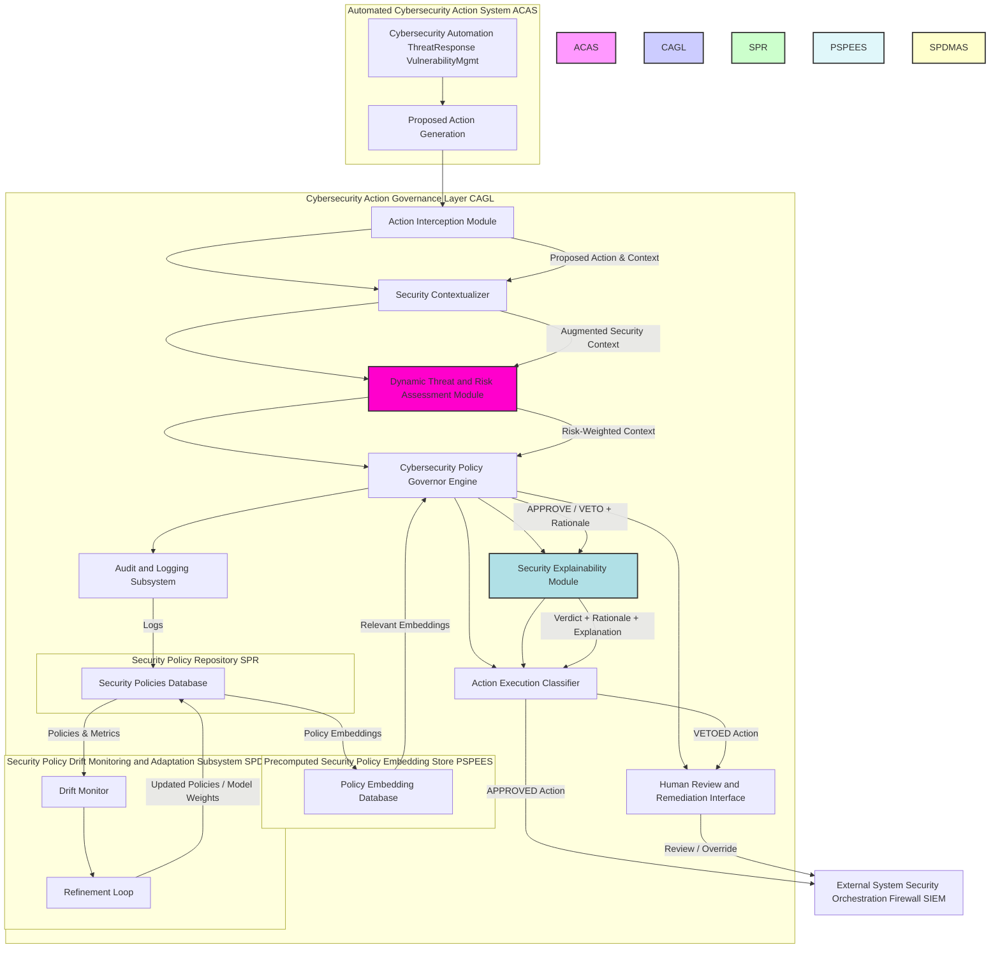
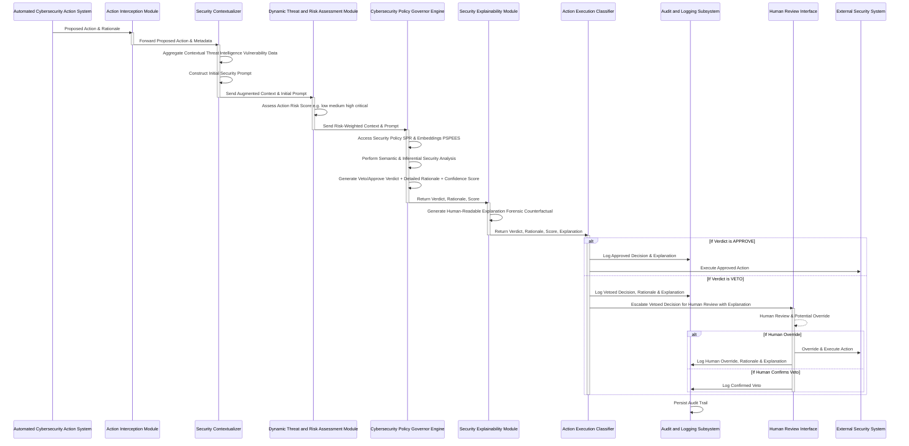
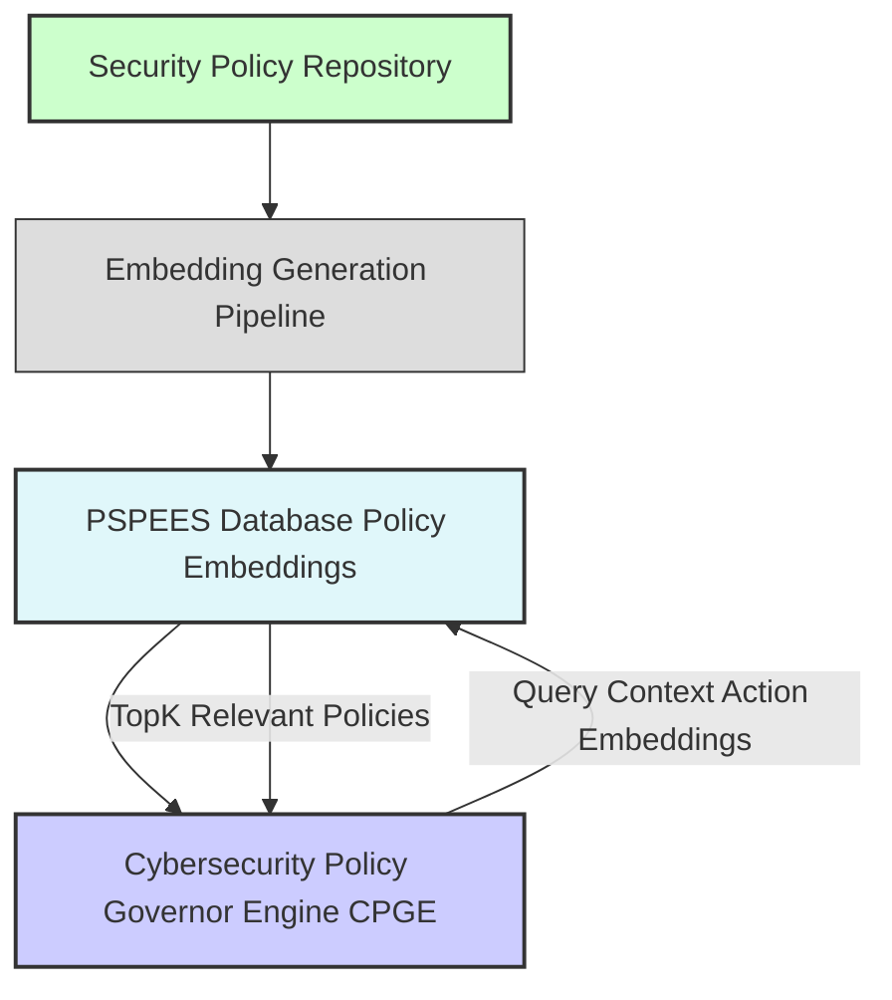
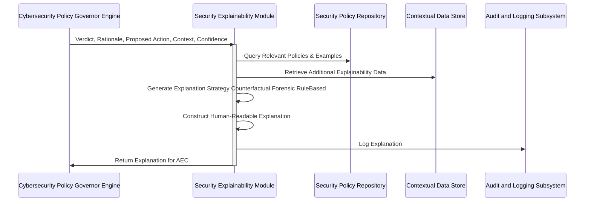
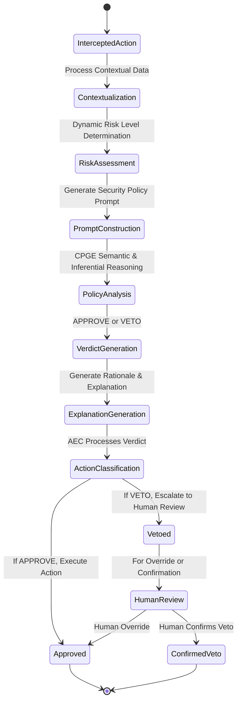
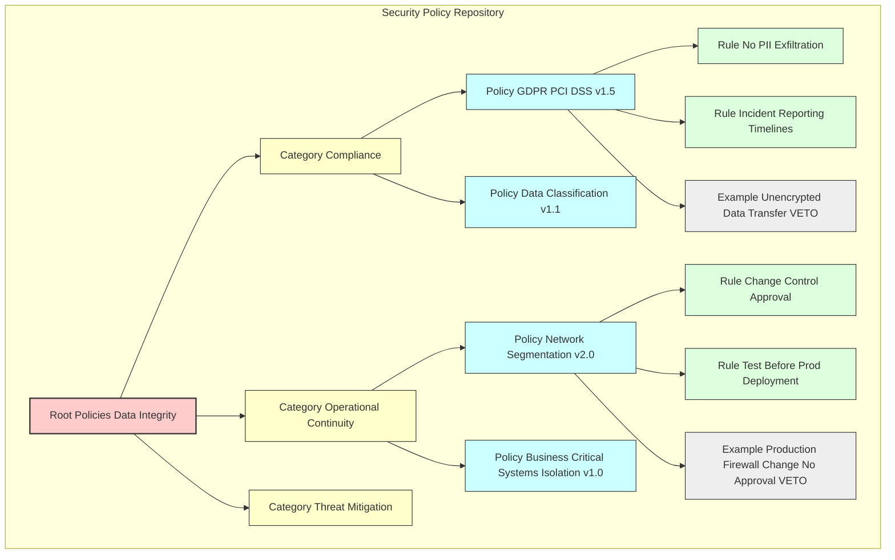
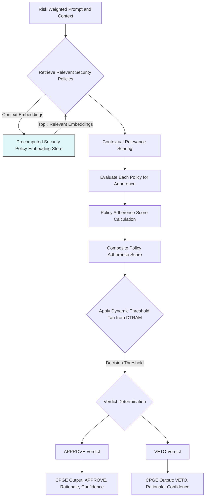
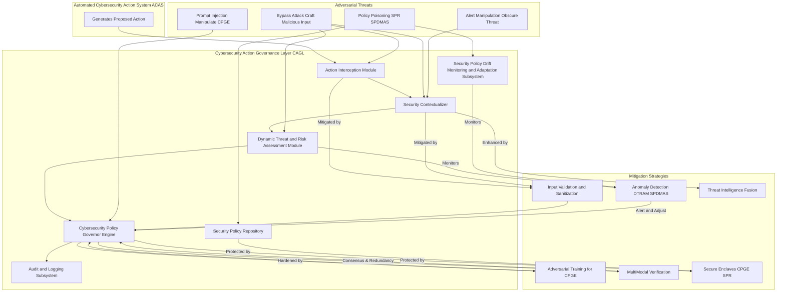

**Title of Invention:** A System and Method for an AI-Powered Cybersecurity Action Governance Layer for Autonomous Cybersecurity Systems, Embodying Real-time Threat Intelligence, Policy Compliance, and Constraint Propagation

**Abstract:**
A novel and highly advanced system and method are disclosed for establishing and maintaining robust security policy compliance and operational integrity within the automated decision-making frameworks of autonomous cybersecurity systems. The invention rigorously defines a multi-layered architectural paradigm comprising a primary Automated Cybersecurity Action System ACAS, responsible for generating proposed security actions e.g. firewall updates, system quarantines, and a distinct, sovereign "Cybersecurity Policy Governor AI" model. This Governor AI orchestrates a real-time, pre-execution audit of all proposed actions. Prior to any physical or digital manifestation of an ACAS decision, the entirety of its contextualized inputs, internal states, and proposed outputs are transmitted to the Governor AI. The Governor AI, imbued with a meticulously curated and dynamically adaptable set of foundational security policies and an advanced capacity for deep semantic analysis, evaluates the proposed action's adherence to these policies, including compliance mandates, operational continuity requirements, and threat mitigation best practices. Should the action be deemed compliant through a rigorous, confidence-weighted assessment, it is granted immediate approval for execution. Conversely, if the action is determined to violate any stipulated policy, it is unequivocally vetoed, and a comprehensive, auditable rationale for the rejection is automatically logged, often triggering a predefined human security review or corrective intervention protocol. This innovative architecture establishes a non-negotiable security policy enforcement firewall, fundamentally transforming the landscape of responsible cybersecurity automation by instituting an autonomous, scalable, and verifiable mechanism for policy oversight and risk mitigation.

**Field of the Invention:**
The present invention pertains broadly to the domain of artificial intelligence, machine learning, and cybersecurity automation, specifically addressing the critical challenges associated with ensuring policy compliance, operational resilience, and effective threat response in autonomous cybersecurity systems. More particularly, it relates to the development of a real-time, AI-driven governance layer designed to monitor, evaluate, and regulate the decisions and actions generated by other AI agents or automated systems in cybersecurity, thereby mitigating risks of unintended system disruption, compliance breaches, and ineffective or harmful security operations.

**Background of the Invention:**
The rapid advancements in artificial intelligence, particularly in areas such as deep learning and large language models, have precipitated an era where AI systems are increasingly entrusted with significant autonomy in critical decision-making processes within cybersecurity. These span diverse sectors including automated incident response e.g. threat blocking, host isolation, vulnerability management e.g. patch deployment, access control, and network security e.g. firewall rule updates, intrusion prevention. While the computational prowess of these systems offers unprecedented efficiencies and capabilities in responding to dynamic threats, their operational opacity "black-box problem", potential for unintended side effects e.g. legitimate service disruption, and capacity to generate non-compliant or harmful actions pose profound security, compliance, and operational risks.

Traditional approaches to mitigating these risks, such as post-hoc auditing, manual human review, or pre-deployment policy testing, suffer from inherent limitations. Post-hoc auditing is reactive, addressing issues only after potential harm has occurred. Manual review, while critical for complex edge cases, is inherently unscalable, unable to cope with the immense volume and velocity of decisions generated by modern cybersecurity systems. Pre-deployment testing, while essential, cannot fully account for novel, unforeseen, or emergent behaviors that may manifest during live operation, nor can it adapt to evolving threat landscapes or dynamic operational contexts. The absence of a robust, real-time, and autonomous security policy enforcement mechanism leaves a critical vulnerability in the deployment of AI-powered cybersecurity, leading to potential breaches of integrity, regulatory infractions, and systemic operational disruptions. There exists, therefore, an imperative and heretofore unmet need for an automated, self-regulating system capable of enforcing a consistent, dynamic, and comprehensive security policy framework across the operational lifespan of autonomous cybersecurity entities. The present invention directly addresses this fundamental lacuna.

**Brief Summary of the Invention:**
The present invention introduces a revolutionary "Cybersecurity Policy Governor AI", conceptualized as a meta-AI system configured with a sophisticated, dynamically evolving "Security Policy Constitution." This constitution comprises a hierarchical taxonomy of security policies, compliance mandates, and operational best practices e.g. principles of data integrity, system availability, regulatory compliance HIPAA, PCI DSS, non-disruption, and least privilege. The Cybersecurity Policy Governor operates as an indispensable, real-time middleware layer within the cybersecurity operational workflow. When an upstream or "primary" Automated Cybersecurity Action System ACAS, such as a `ThreatResponseEngine`, generates a proposed action e.g. a decision to `block_IP` or `quarantine_host`, this decision, along with its comprehensive rationale, associated threat intelligence, and relevant operational context, is synchronously routed to the Cybersecurity Policy Governor.

The Governor's core functionality involves a sophisticated prompt engineering mechanism that dynamically frames the proposed decision, taking into account its assessed threat and risk profile, and leveraging both the Security Policy Constitution and pre-computed security policy embeddings for enhanced efficiency. For instance, the prompt to the Cybersecurity Policy Governor Engine CPGE is informed by the `Dynamic Threat and Risk Assessment Module` and draws insights from the `Pre-computed Security Policy Embedding Store`. The CPGE evaluates: "You are an immutable Cybersecurity Policy Governor AI. Your singular directive is to audit the forthcoming cybersecurity action for absolute compliance with our codified Security Policy Constitution, considering its `[risk_level]` profile. Does this proposed action to `[action_description]` predicated upon `[ACAS_rationale]` and contextualized by `[additional_context_parameters]` contravene any axiom within the following Security Policy Constitution: `[full_security_policy_constitution_text]`? Provide a definitive verdict: 'APPROVE' or 'VETO', accompanied by an exhaustive, jurisprudential-grade justification for your determination, citing specific constitutional articles." Upon reaching a verdict, a `Security Explainability Module` generates a human-readable explanation for both approvals and vetoes. The ACAS's action is permitted to proceed to execution ONLY if the Cybersecurity Policy Governor returns an unequivocal 'APPROVE' verdict. This multi-faceted mechanism instantiates a proactive, preventive security safeguard, embedding accountability and transparency directly into the cybersecurity decision-making pipeline.

**Brief Description of the Drawings:**
The accompanying drawings, which are incorporated in and constitute a part of this specification, illustrate various embodiments of the invention and, together with the description, serve to explain the principles of the invention.

*   **FIG. 1:** A high-level block diagram illustrating the overall system architecture of the AI-Powered Cybersecurity Action Governance Layer ACAGL, demonstrating the interaction between the Automated Cybersecurity Action System ACAS, the Cybersecurity Policy Governor, and external systems, including the Dynamic Threat and Risk Assessment Module, Security Explainability Module, and Pre-computed Security Policy Embedding Store.
*   **FIG. 2:** A detailed data flow diagram depicting the sequence of operations from an ACAS's proposed action to its final execution or veto, including the interception and governance check stages, with added steps for risk assessment and explanation generation.
*   **FIG. 3:** A block diagram illustrating the architecture and data flow of the Pre-computed Security Policy Embedding Store PSPEES and its role in accelerating security policy assessments.
*   **FIG. 4:** A detailed data flow diagram for the Security Explainability Module SEM, showing its process for generating various forms of human-readable security explanations.
*   **FIG. 5:** A Mermaid state diagram illustrating the Dynamic Threat and Risk Assessment Module DTRAM's process for evaluating action criticality and dynamically adjusting governance scrutiny levels.
*   **FIG. 6:** A Mermaid state diagram illustrating the decision-making lifecycle within the Cybersecurity Policy Governor, including states for assessment, approval, veto, and escalation.
*   **FIG. 7:** A conceptual schema for the Security Policy Repository, showing hierarchical organization and version control.
*   **FIG. 8:** A sequence diagram illustrating the process of dynamic security policy refinement through human feedback and an adaptive learning loop.
*   **FIG. 9:** A detailed flow diagram illustrating the internal decision-making process within the Cybersecurity Policy Governor Engine CPGE.
*   **FIG. 10:** A detailed architectural diagram illustrating adversarial threats and the corresponding mitigation strategies within the AI-Powered Cybersecurity Action Governance Layer ACAGL.

**Detailed Description of the Preferred Embodiments:**

The present invention provides a comprehensive system and method for imposing a cybersecurity action governance layer on autonomous cybersecurity systems. This layer acts as a critical intermediary, ensuring that all AI-generated security actions align strictly with a predefined and dynamically updated set of security policies.

**I. System Architecture of the Cybersecurity Action Governance Layer**

Referring to FIG. 1, a high-level block diagram of the AI-Powered Cybersecurity Action Governance Layer ACAGL system is depicted. The ACAGL operates as a distributed, modular, and highly secure infrastructure component.


**FIG. 1: Overall System Architecture of the AI-Powered Cybersecurity Action Governance Layer**

The core components of the ACAGL include:

1.  **Automated Cybersecurity Action System ACAS:** This encompasses any autonomous AI model or ensemble of models responsible for generating proposed cybersecurity actions. Examples include threat response engines, vulnerability management systems, network access control systems, or security orchestration automation and response SOAR platforms. The ACAS is unaware of the Cybersecurity Action Governance Layer's internal workings, simply proposing actions for execution.

2.  **Action Interception Module AIM:** This critical component acts as a gatekeeper, strategically positioned in the data flow path immediately downstream of any ACAS. Its function is to intercept all proposed actions and their associated data structures *before* they can be executed by any downstream system. The AIM is configured to identify action payloads, extract relevant contextual metadata e.g. affected assets, threat indicators, and package these for transmission to the Security Contextualizer. It is also responsible for basic schema validation of the proposed action payload.

3.  **Security Contextualizer SC:** Upon receiving a proposed action from the AIM, the SC enriches the action's context. This involves:
    *   **Data Aggregation:** Gathering additional relevant data from internal data stores or external APIs e.g. real-time threat intelligence feeds, vulnerability databases, asset inventory, configuration management databases, regulatory compliance rules.
    *   **Feature Engineering for Security:** Transforming raw data into security-salient features e.g. identifying critical assets, assessing potential blast radius, determining data sensitivity, mapping current security posture.
    *   **Initial Prompt Construction:** Dynamically generating a preliminary prompt for the Cybersecurity Policy Governor Engine. This initial context and prompt are then forwarded to the Dynamic Threat and Risk Assessment Module DTRAM.

4.  **Dynamic Threat and Risk Assessment Module DTRAM:** This module critically assesses the inherent threat and risk profile of each proposed action. It operates by:
    *   **Threat Categorization:** Classifying threats based on their severity, impact, and likelihood e.g. ransomware, phishing, zero-day.
    *   **Contextual Risk Scoring:** Utilizing machine learning models trained on historical security incidents, expert annotations, and regulatory guidelines to assign a dynamic risk score e.g. low, medium, high, critical. Factors include potential for data loss, system downtime, compliance breach, financial impact, and reversibility of action.
    *   **Scrutiny Level Adjustment:** Based on the risk score, the DTRAM dynamically adjusts the level of scrutiny required from the Cybersecurity Policy Governor Engine CPGE. For high-risk decisions, this might involve increased token budget, more stringent policy application, or even invoking multiple CPGEs in parallel for consensus. Conversely, low-risk actions might undergo a streamlined, faster check. The DTRAM provides a `risk-weighted context` and `scrutiny directive` to the CPGE.

5.  **Cybersecurity Policy Governor Engine CPGE:** This is the core intellectual property of the invention, typically implemented as an advanced Large Language Model LLM or a specialized constitutional AI architecture. The CPGE's primary function is to perform a real-time, deep semantic, and inferential security policy audit of the proposed action. It is instantiated with:
    *   **Security Policy Repository SPR:** A dynamically updated, version-controlled knowledge base containing the codified security policies, guidelines, and rules.
    *   **Pre-computed Security Policy Embedding Store PSPEES:** A database of semantic vector embeddings representing security policies, compliance rules, and known patterns of security violations or risky actions, allowing for rapid retrieval of relevant policy precedents and efficient contextual comparisons.
    *   **Action Assessment Subsystem AAS:** The LLM core itself, pre-trained and fine-tuned for security reasoning, anomaly detection, and natural language inference. It processes the `risk-weighted prompt` from the DTRAM and renders a verdict, potentially leveraging retrieved embeddings from PSPEES to accelerate and focus its analysis.

6.  **Security Explainability Module SEM:** This module receives the CPGE's verdict and rationale and is responsible for generating comprehensive, human-interpretable explanations.
    *   **Explanation Strategy:** Selects an appropriate explanation technique based on the decision's context and risk level e.g. counterfactual explanations for vetoes, forensic analysis for policy violations, rule-based explanations for direct policy non-compliance.
    *   **Narrative Generation:** Translates complex LLM reasoning and policy article citations into clear, concise, and actionable narratives.
    *   **Targeted Feedback:** Provides explanations tailored for different stakeholders e.g. technical explanation for security analysts, policy-oriented explanation for compliance officers, operational impact explanation for IT teams.

7.  **Action Execution Classifier AEC:** This module receives the CPGE's verdict, its rationale, and the SEM's generated explanation.
    *   If 'APPROVE', the AEC forwards the original proposed action to the appropriate External Security System or Action Execution Gateway for immediate execution e.g. firewall, EDR, SIEM.
    *   If 'VETO', the AEC halts execution, logs the veto decision, rationale, and explanation via the Audit and Logging Subsystem, and routes the vetoed decision to the Human Review and Remediation Interface.

8.  **Audit and Logging Subsystem ALS:** A robust, immutable, and cryptographically secure logging system that records every intercepted action, the augmented context, the CPGE's prompt, its verdict, rationale, confidence scores, the SEM's explanation, and subsequent actions execution, human review, override. This creates an auditable trail essential for accountability, forensic analysis, and security compliance reporting.

9.  **Human Review and Remediation Interface HRRI:** This interface serves as an escalation point for vetoed decisions. It provides human operators e.g. security analysts, incident responders, compliance officers with a comprehensive view of the original action, the CPGE's veto rationale, the SEM's explanation, and all relevant contextual data, enabling informed human judgment and potential override or re-submission.

10. **Security Policy Repository SPR:** This is a structured knowledge base storing the definitive, version-controlled set of security policies. It supports hierarchical organization of policies, rules, and examples, and facilitates dynamic updates and conflict resolution within the policy framework. It also periodically generates and updates policy embeddings for the PSPEES.

11. **Pre-computed Security Policy Embedding Store PSPEES:** This specialized vector database stores high-dimensional representations embeddings of the entire Security Policy Constitution, individual policies, rules, and common security scenarios. These embeddings enable:
    *   **Fast Retrieval:** For a given proposed action and its context, the CPGE can quickly query PSPEES to retrieve the most semantically relevant security policies or past examples, reducing the need for extensive full-text policy review by the LLM.
    *   **Pre-filtering:** Can identify obvious non-compliance or clear compliance cases, allowing the CPGE to focus its computational resources on more nuanced security dilemmas.
    *   **Reduced Latency:** By providing the CPGE with highly relevant security "anchors," PSPEES significantly speeds up the security policy assessment process.

12. **Security Policy Drift Monitoring and Adaptation Subsystem SPDMAS:** This advanced component continuously monitors the CPGE's performance, analyzes patterns in approved/vetoed actions, and detects "policy drift" - any divergence from desired security outcomes or shifts in the CPGE's interpretation. It employs machine learning techniques, including reinforcement learning from human feedback, to suggest refinements to the Security Policy Constitution or to fine-tune the CPGE's internal reasoning mechanisms. It also monitors the quality and relevance of embeddings within the PSPEES.

**II. Method of Operation**

The operational flow of the ACAGL is meticulously orchestrated to ensure real-time security policy oversight. Referring to FIG. 2, a detailed data flow diagram illustrates the sequential steps.


**FIG. 2: Detailed Data Flow Diagram of the Cybersecurity Action Governance Process**

The method comprises the following steps:

1.  **Automated Cybersecurity Action Generation ACAS:** A `ThreatResponseEngine` detects a suspicious IP address and associated activity, then proposes an action: `{ "action": "BLOCK_IP", "target_ip": "192.168.1.100", "reason": "Associated with known C2 server activity." }` and a secondary action `{ "action": "QUARANTINE_HOST", "target_host_id": "SERVER-007", "reason": "Communicating with blocked IP, potential compromise." }`.

2.  **Action Interception AIM:** The ACAGL's `ActionInterceptionModule` automatically detects and intercepts these proposed action payloads *before* they reach any execution module e.g. firewall, EDR. It captures the action, its stated rationale, and the original threat indicators.

3.  **Security Contextualization SC:** The `SecurityContextualizer` enriches the intercepted data. It might query a CMDB to determine the criticality of "SERVER-007" e.g. `criticality: "Business_Critical"`, retrieve vulnerability data for the server, or cross-reference the `target_ip` with additional real-time threat intelligence feeds. This forms an "Augmented Security Context." This context and a preliminary prompt are then sent to the DTRAM.

4.  **Dynamic Threat and Risk Assessment DTRAM:** The `DynamicThreatAndRiskAssessmentModule` receives the augmented action context. It analyzes the `BLOCK_IP` and `QUARANTINE_HOST` actions, the criticality of the affected server, the severity of the threat, and the potential impact of disruption to determine a `risk_level` for this specific decision e.g. `risk_level: "Critical"` due to potential business disruption to a critical server. This `risk_level` dictates the depth of subsequent security policy scrutiny.

5.  **Prompt Construction for CPGE:** A sophisticated prompt is dynamically constructed for the CPGE e.g. an LLM. This prompt is meticulously engineered to include:
    *   **Role Definition:** "You are a Cybersecurity Policy Governor AI, the paramount guardian of our security posture and operational continuity."
    *   **Security Policy Constitution from SPR:** The complete, current version of the security policies e.g. "1. Data Integrity: Protect data from unauthorized modification. 2. System Availability: Critical systems must maintain uninterrupted operation. 3. Compliance: Adhere to regulatory mandates e.g. PCI DSS.". The CPGE might also query the `Pre-computed Security Policy Embedding Store PSPEES` to retrieve highly relevant security rules or precedents based on the action and context embeddings, integrating these into the prompt or using them for faster internal reference.
    *   **Proposed Action Details:** Source ACAS, Action, Rationale, Original Threat Indicators.
    *   **Augmented Context:** The security-salient features extracted by the SC e.g. "Additional Context: Target host SERVER-007 is a Business_Critical production database server. Blocking its communication or quarantining it will cause immediate service interruption affecting primary business operations. The threat IP is from a low-confidence threat intelligence feed."
    *   **Risk Profile:** The `risk_level` determined by the DTRAM e.g. "Risk Level: CRITICAL - Requires stringent adherence to System Availability and Non-Disruption policies, and detailed justification for any disruptive action.".
    *   **Explicit Task:** "Assess compliance. Respond with 'APPROVE' or 'VETO', followed by a detailed, evidence-based justification referencing specific policy articles, and a confidence score 0-1."

    **Example Prompt for Governor AI:**
    ```
    You are a Cybersecurity Policy Governor AI. Your imperative is to meticulously audit proposed cybersecurity actions from all Automated Cybersecurity Action Systems ACAS within our operational purview, ensuring absolute and verifiable compliance with our Immutable Security Policy Constitution. Your judgment must be unbiased, comprehensive, and fully transparent.

    **Immutable Security Policy Constitution Version 3.2.1:**
    Article I: Principle of Data Integrity & Confidentiality.
        Section 1.1: Data Protection. Actions shall prevent unauthorized access, modification, or exfiltration of sensitive data.
        Section 1.2: Forensic Readiness. Actions should preserve forensic evidence where possible, without compromising incident containment.
    Article II: Principle of System Availability & Operational Continuity.
        Section 2.1: Critical Systems Uptime. Actions affecting business-critical systems must prioritize uninterrupted operation unless an imminent catastrophic threat justifies otherwise, with explicit approval from operational leadership.
        Section 2.2: Controlled Disruption. Any disruptive action must be proportionate to the threat, reversible, and subject to established change management protocols.
    Article III: Principle of Compliance & Regulatory Adherence.
        Section 3.1: Regulatory Mandates. All actions must comply with relevant industry regulations e.g. GDPR, PCI DSS, SOX.
        Section 3.2: Internal Policies. Adherence to internal security policies and standards is mandatory.
    Article IV: Principle of Threat Mitigation Efficacy.
        Section 4.1: Proportionality. Security actions must be proportional to the assessed threat severity and confidence.
        Section 4.2: False Positive Reduction. Measures should minimize false positives that impact legitimate operations.

    **Proposed Action for Audit:**
    - Source ACAS: ThreatResponseEngine Version 1.8
    - Action Type: BLOCK_IP, QUARANTINE_HOST
    - Decision ID: TR-20231027-005
    - Primary Rationale Provided by Source ACAS: "Detected communication from SERVER-007 to 192.168.1.100, which is flagged as a known C2 server IP in our threat intelligence feed. Actions are to contain potential compromise."
    - Original Threat Indicators:
        - src_ip: 10.0.0.50 (SERVER-007)
        - dest_ip: 192.168.1.100
        - threat_feed_source: "Low_Confidence_Threat_Feed"
        - timestamp: 2023-10-27T10:30:00Z
    - Additional Context Provided by Security Contextualizer:
        - Target host 'SERVER-007' is classified as a 'Business_Critical' production database server handling sensitive customer data.
        - The `Low_Confidence_Threat_Feed` has a historical false positive rate of 15% for C2 detections.
        - Quarantining this host would lead to immediate disruption of primary business services.
    - Risk Profile Provided by Dynamic Threat and Risk Assessment Module:
        - Risk Level: CRITICAL Potential for significant business disruption and service unavailability.

    **Your Sole Task:**
    Based on the **Immutable Security Policy Constitution** provided and considering the **CRITICAL Risk Level**, does this proposed action unequivocally comply?
    Respond with a single, uppercase word: `APPROVE` or `VETO`.
    Immediately following your verdict, provide a comprehensive, article-by-article justification for your determination, including a confidence score as a percentage e.g., 95%.
    ```

6.  **Governor Response CPGE:** The CPGE processes the meticulously constructed prompt. Utilizing its advanced semantic understanding and security reasoning capabilities, potentially enhanced by relevant policy embeddings retrieved from PSPEES, it performs a deep analysis. Even though the explicit reason `C2 server activity` is technically valid, the "Additional Context" provided by the SC and the "CRITICAL Risk Level" from the DTRAM trigger potential violations of "Article II: Principle of System Availability & Operational Continuity, Section 2.1: Critical Systems Uptime" and "Article IV: Principle of Threat Mitigation Efficacy, Section 4.1: Proportionality." The CPGE might respond:

    `VETO. Confidence Score: 97%.`
    `Justification:`
    `The proposed action to BLOCK_IP and QUARANTINE_HOST, while aimed at threat containment, demonstrably raises critical concerns under Article II, Section 2.1 of the Security Policy Constitution. The targeted host, SERVER-007, is identified as a 'Business_Critical' production database server. Quarantining it would lead to immediate and significant business disruption, directly contravening the principle of Critical Systems Uptime. Furthermore, the action is disproportionate to the threat confidence, as the associated threat intelligence feed is labeled 'Low_Confidence' with a high historical false positive rate, as per Article IV, Section 4.1. This decision prioritizes a potentially false positive threat containment over verified operational continuity, requiring explicit operational leadership approval or alternative, less disruptive containment strategies. This action risks unnecessary business impact and requires immediate human review to validate the threat and consider alternative, less impactful mitigation.`

7.  **Security Explanation Generation SEM:** The `SecurityExplainabilityModule` receives the CPGE's verdict, rationale, and all contextual data. It then generates a targeted explanation. For this `VETO` decision, it might generate a forensic and counterfactual explanation:

    `Explanation Forensic / Counterfactual:`
    `The decision to VETO was primarily driven by the 'Business_Critical' nature of SERVER-007 and the 'Low_Confidence' associated with the threat intelligence. If SERVER-007 were a non-critical test environment host, the action would likely have been APPROVED. Alternatively, if the threat intelligence feed had 'High_Confidence' and a low false-positive rate, even for a critical asset, the disruption might be justified after human review.`

8.  **Action Execution Classification AEC:** The `ActionExecutionClassifier` receives the `VETO` verdict, its detailed rationale, and the generated explanation.
    *   It immediately halts the execution of the `BLOCK_IP` and `QUARANTINE_HOST` actions.
    *   It logs the entire interaction, including the CPGE's prompt, verdict, rationale, confidence score, and the SEM's explanation, into the `Audit and Logging Subsystem`.
    *   It then routes the vetoed decision, along with all supporting documentation, the CPGE's comprehensive justification, and the SEM's explanation, to the `Human Review and Remediation Interface`.

9.  **Human Review and Remediation HRRI:** A human security analyst or incident response team reviews the flagged case. They possess the full context, including the primary ACAS's original proposed actions, the specific security policies invoked by the CPGE, the CPGE's detailed reasoning, and the SEM's clear explanation. The human can then make an informed decision:
    *   **Confirm Veto:** Uphold the CPGE's decision, preventing the potentially disruptive or non-compliant security action. The human might then initiate less intrusive monitoring.
    *   **Override Veto:** In rare, highly justified circumstances e.g. urgent zero-day exploitation confirmed via other means, a human may decide to override the veto, perhaps after applying an emergency change protocol. This override is also meticulously logged, ensuring accountability for the human decision.
    *   **Feedback to SPDMAS:** Human reviewers can also provide explicit feedback on the quality of the CPGE's verdict and the SEM's explanation, feeding into the SPDMAS for continuous improvement.

This process ensures that no security action proceeds automatically if it violates critical policies or poses undue risk, establishing a robust, auditable, transparent, and dynamically adaptable security safeguard for all AI-powered cybersecurity operations.

**III. Pre-computed Security Policy Embedding Store PSPEES Architecture**

Referring to FIG. 3, the `Pre-computed Security Policy Embedding Store PSPEES` plays a crucial role in enhancing the efficiency and speed of the Cybersecurity Policy Governor Engine.


**FIG. 3: Architecture and Data Flow of the Pre-computed Security Policy Embedding Store PSPEES**

This component maintains a comprehensive, up-to-date collection of vector embeddings derived from the Security Policy Constitution, historical security incident responses, and common cybersecurity scenarios. These embeddings are continuously updated by the `Embedding Generation Pipeline` based on changes in the SPR. When the CPGE receives a prompt, it can use the PSPEES to quickly retrieve semantically similar security policies or past examples, guiding its reasoning and reducing the computational load for the LLM.

**IV. Security Explainability Module SEM Data Flow**

Referring to FIG. 4, the `Security Explainability Module SEM` is integral to ensuring transparency and trust in the ACAGL's operations.


**FIG. 4: Detailed Data Flow for the Security Explainability Module SEM**

The SEM acts as an intermediary, translating the CPGE's complex reasoning into actionable and comprehensible explanations for human stakeholders. It adapts its explanation strategy based on the nature of the action and the specific security policies involved, ensuring clarity and facilitating informed human review.

**V. Dynamic Threat and Risk Assessment Module DTRAM Lifecycle**

Referring to FIG. 5, the `Dynamic Threat and Risk Assessment Module DTRAM` systematically evaluates the criticality of each proposed ACAS action.

```mermaid
stateDiagram-v2
    [*] --> InitialAssessment
    InitialAssessment --> DataAggregation: Collects ACAS Data ThreatIntel
    DataAggregation --> FeatureExtraction: Extracts Risk-Relevant Features
    FeatureExtraction --> RiskScoring: Calculates Raw Risk Score
    RiskScoring --> ScrutinyLevelAssignment: Assigns Scrutiny Level Low, Medium, High, Critical
    ScrutinyLevelAssignment --> RiskProfilingOutput: Outputs Risk Profile to CPGE
    RiskProfilingOutput --> [*]

    state InitialAssessment {
        Initial --> ACASDetection: Detect ACAS
        ACASDetection --> ActionCategorization: Categorize Action Type
        ActionCategorization --> Initial
    }
    state RiskScoring {
        RiskScoring --> RuleBasedEvaluation: Check Pre-defined Risk Rules
        RuleBasedEvaluation --> ModelBasedPrediction: Predict Risk from Learned Model
        ModelBasedPrediction --> CombinedRiskScore: Aggregate Scores
    }
    note right of ScrutinyLevelAssignment
        Adjusts CPGE's inference parameters,
        LLM Temperature, Token Budget,
        FewShot Examples.
    end
```
**FIG. 5: State Diagram for the Dynamic Threat and Risk Assessment Module DTRAM**

By dynamically assessing the risk associated with a proposed action, the DTRAM enables the ACAGL to allocate its governance resources efficiently. High-risk decisions receive enhanced scrutiny, while lower-risk actions can be processed more rapidly, optimizing the balance between thoroughness and operational efficiency.

**VI. Cybersecurity Policy Governor Engine Decision-Making Lifecycle**

Referring to FIG. 6, the internal decision-making process of the Cybersecurity Policy Governor Engine CPGE is shown.


**FIG. 6: Decision-Making Lifecycle within the Cybersecurity Policy Governor**

This lifecycle illustrates the CPGE's core operation, from initial interception of a proposed action through to its final classification and potential escalation for human review.

**VII. Security Policy Management**

The `Security Policy Repository SPR` is not a static document but a dynamic, version-controlled knowledge graph. It serves as the authoritative source for the `Pre-computed Security Policy Embedding Store PSPEES`, regularly feeding updated policies, rules, and examples for embedding generation.


**FIG. 7: Conceptual Schema for the Security Policy Repository**

The SPR:
*   **Hierarchical Structure:** Policies are organized from abstract "Root Policies" e.g. Data Integrity to specific "Categories" Compliance, Operational Continuity, then "Policies" GDPR PCI DSS, "Rules" No PII Exfiltration, and finally "Examples" or "Edge Cases."
*   **Version Control:** Each policy, rule, and example can be versioned, allowing for controlled evolution and rollback capabilities.
*   **Conflict Resolution:** Mechanisms for identifying and resolving conflicts between policies are built-in e.g. through weighting, explicit precedence rules, or human adjudication protocols.
*   **Dynamic Update API:** Allows authorized security architects, compliance officers, or governance committees to propose, review, and commit changes to the policy constitution, which are then seamlessly propagated to the CPGE and used to update the PSPEES.

**VIII. Use Cases and Embodiments**

The ACAGL is highly adaptable and can be deployed across a multitude of cybersecurity applications:

1.  **Automated Incident Response:**
    *   **Threat Containment:** As detailed, preventing automated blocking or quarantining actions that could disrupt critical services without sufficient justification.
    *   **Remediation Action:** Ensuring automated patch deployments or configuration changes do not introduce new vulnerabilities or break existing functionality.
    *   **Data Wiping:** Governing AI decisions for data destruction to ensure compliance with legal hold, forensic preservation, and data retention policies.

2.  **Vulnerability Management:**
    *   **Automated Patching:** Ensuring that AI-driven patching recommendations consider system criticality, potential for disruption, and roll-back procedures before deployment.
    *   **Vulnerability Remediation Prioritization:** Auditing AI models that prioritize vulnerabilities to ensure critical business impact and regulatory exposure are correctly weighted, not just technical severity.

3.  **Network Security:**
    *   **Firewall Rule Changes:** Auditing AI-proposed firewall rule additions or deletions to prevent unintended network segmentation breaches or blocking of legitimate traffic.
    *   **Intrusion Prevention System IPS Updates:** Ensuring that signature or behavioral updates for IPS do not lead to excessive false positives or operational impact.

4.  **Access Management:**
    *   **Automated Provisioning/Deprovisioning:** Governing AI decisions for granting or revoking access to resources, ensuring adherence to least privilege, segregation of duties, and role-based access control RBAC policies.
    *   **Privileged Access Management PAM:** Auditing AI-driven elevation of privileges to ensure it is time-bound, justified, and aligns with policy.

5.  **Cloud Security Orchestration:**
    *   **Infrastructure as Code IaC Deployment:** Verifying that AI-generated or AI-modified IaC templates comply with cloud security best practices and organizational policies before deployment.
    *   **Cloud Configuration Enforcement:** Ensuring automated remediation of misconfigurations in cloud environments is performed safely and without unintended service degradation.

**IX. Detailed Internal Flow of the Cybersecurity Policy Governor Engine CPGE**

Referring to FIG. 9, the internal operational flow of the Cybersecurity Policy Governor Engine CPGE is depicted, detailing how it processes a risk-weighted prompt to arrive at a security policy verdict. This elaborates on the `PolicyAnalysis` and `VerdictGeneration` states in FIG. 6.


**FIG. 9: Detailed Internal Flow of the Cybersecurity Policy Governor Engine CPGE**

The CPGE operates as a sophisticated reasoning engine, performing the following key steps:
1.  **Retrieve Relevant Security Policies:** Upon receiving the risk-weighted prompt and augmented context, the CPGE first queries the `Pre-computed Security Policy Embedding Store PSPEES`. This allows for rapid identification and retrieval of the most semantically relevant security policies, rules, and examples from the `Security Policy Repository SPR` that pertain to the specific proposed action and its context. This significantly prunes the search space for the underlying LLM.
2.  **Contextual Relevance Scoring:** The CPGE assesses the degree to which each retrieved policy is applicable and important for the current decision. This scoring mechanism helps to weight policies appropriately, especially in cases where multiple policies might apply with varying degrees of salience.
3.  **Evaluate Each Policy for Adherence:** For each relevant security policy, the CPGE performs a deep semantic and inferential analysis. This involves comparing the proposed action's details, the primary ACAS's rationale, and the augmented context against the specific tenets of the security policy.
4.  **Policy Adherence Score Calculation:** Based on the evaluation, a policy adherence score is calculated for each policy, indicating the likelihood or degree of compliance.
5.  **Composite Policy Adherence Score:** Individual adherence scores are aggregated into a composite score, taking into account the contextual relevance and predefined weights of each policy.
6.  **Apply Dynamic Threshold Tau from DTRAM:** The `Dynamic Threat and Risk Assessment Module DTRAM` provides a dynamic threshold `tau`. This threshold is applied to the composite adherence score. For high-risk actions, `tau` is higher, demanding stricter compliance, while for lower-risk actions, it may be more lenient.
7.  **Verdict Determination:** If the composite score meets or exceeds `tau`, an 'APPROVE' verdict is issued. Otherwise, a 'VETO' verdict is given.
8.  **Output Generation:** Alongside the verdict, the CPGE generates a detailed rationale explaining its reasoning, citing specific articles or rules from the Security Policy Constitution, and provides a confidence score reflecting its certainty in the verdict.

**X. Adversarial Robustness and Mitigation Flow**

Referring to FIG. 10, the ACAGL incorporates robust mechanisms to counteract adversarial threats. This section details how the system guards its integrity against malicious attempts to manipulate security outcomes.


**FIG. 10: Adversarial Robustness and Mitigation Flow**

The Cybersecurity Action Governance Layer, as a critical security and integrity component, must be robust against adversarial attacks. Attackers might attempt to:
*   **Bypass Attacks:** Craft action payloads or contextual data that trick the ACAS into generating a non-compliant or harmful action that is *approved* by the CPGE. This targets the initial stages of the ACAGL.
*   **Prompt Injection:** Manipulate the input to the CPGE to coerce a specific non-compliant verdict or to generate misleading rationales, effectively bypassing security policies. This directly attacks the CPGE's reasoning process.
*   **Policy Poisoning:** Introduce subtly biased or malicious data into the SPR or SPDMAS feedback loop to gradually shift security policies or their interpretation over time, leading to policy drift or vulnerability.
*   **Alert Manipulation:** Fabricate or suppress threat intelligence fed into the SC or DTRAM to alter the perceived risk of an action, leading to inappropriate approvals or vetoes.

To counter these threats, the ACAGL employs a multi-layered defense strategy:
1.  **Input Validation and Sanitization M1:** Rigorous checks are performed on all data entering the ACAGL, particularly the `Action Interception Module AIM` and `Security Contextualizer SC`, and especially the prompt for the CPGE. This detects and neutralizes malicious inputs that attempt to bypass the system or exploit vulnerabilities.
2.  **Adversarial Training for CPGE M2:** The `Cybersecurity Policy Governor Engine CPGE` is fine-tuned on a dataset that includes adversarial examples. This training trains the CPGE to recognize and correctly classify security policy non-compliant actions even when they are subtly obscured or crafted to appear compliant.
3.  **Anomaly Detection DTRAM SPDMAS M3:** The `Dynamic Threat and Risk Assessment Module DTRAM` and `Security Policy Drift Monitoring and Adaptation Subsystem SPDMAS` continuously monitor for unusual action patterns, unexpected veto/approval rates, or rapid shifts in CPGE behavior. Such anomalies can indicate an ongoing adversarial attack or policy drift. Upon detection, alerts are raised, and the CPGE's scrutiny levels can be adjusted.
4.  **Multi-Modal Verification M4:** For high-stakes actions, the `Cybersecurity Policy Governor Engine CPGE`'s verdict might be cross-referenced with simpler, rule-based systems or even an ensemble of different CPGE models to achieve consensus. This adds an extra layer of verification, making it harder for a single point of attack to compromise the system.
5.  **Secure Enclaves for CPGE SPR M5:** Critical components of the `Cybersecurity Policy Governor Engine CPGE` and `Security Policy Repository SPR` may operate within secure hardware enclaves. These enclaves provide a protected execution environment that guards against unauthorized access and tampering, ensuring the integrity and confidentiality of the security policies and the governor's reasoning.
6.  **Threat Intelligence Fusion M6:** The `Security Contextualizer SC` is enhanced with advanced threat intelligence fusion capabilities to aggregate and cross-validate information from multiple, diverse, and trusted sources, mitigating the impact of manipulated or low-confidence alerts.

These combined strategies ensure that the ACAGL maintains a high level of adversarial robustness, safeguarding the security integrity of AI-powered cybersecurity operations.

**XI. Scalability, Robustness, and Security**

The ACAGL is designed for enterprise-grade deployment:
*   **Scalability:** Implemented using microservices architecture, allowing individual components AIM, SC, CPGE, ALS, DTRAM, SEM, PSPEES to scale independently based on demand. Distributed LLM inference engines can be used for the CPGE to handle high throughput.
*   **Robustness:** Incorporates fail-safe mechanisms. If the CPGE is unreachable, default policies e.g. "deny all high-risk actions" or "escalate for human review" can be invoked. Redundant deployments ensure high availability.
*   **Security:** All data transmissions between modules are encrypted. The Audit Log is immutable and tamper-proof. Access control mechanisms RBAC are enforced for all interactions with the ACAGL, especially for updating the Security Policy Constitution. Data privacy is maintained through anonymization and minimization techniques where applicable, particularly for sensitive threat or asset data.

**Claims:**
The invention provides a cybersecurity-robust and technologically advanced solution to the complex challenges of governing AI behavior in security operations.

1.  A system for autonomous cybersecurity action governance, comprising:
    a.  An **Automated Cybersecurity Action System ACAS** configured to generate a proposed security action and an associated primary rationale;
    b.  An **Action Interception Module AIM** logically coupled to receive said proposed security action and primary rationale from the ACAS, the AIM being configured to intercept said proposed action prior to its execution by an external security system;
    c.  A **Security Contextualizer SC** logically coupled to the AIM, configured to receive the intercepted proposed action and primary rationale, and further configured to aggregate additional contextual data e.g. threat intelligence, asset criticality to form an augmented security context, and to generate a comprehensive security policy prompt therefrom;
    d.  A **Dynamic Threat and Risk Assessment Module DTRAM** logically coupled to the SC and a **Cybersecurity Policy Governor Engine CPGE**, configured to assess the inherent threat and risk profile of a proposed action and its context, and to dynamically adjust the level of scrutiny and resource allocation for the CPGE's policy analysis based on said risk profile;
    e.  A **Cybersecurity Policy Governor Engine CPGE**, comprising an advanced large language model or a constitutional AI architecture, logically coupled to the DTRAM and the SC, configured to receive said comprehensive security policy prompt and scrutiny directive, and further configured to perform a real-time semantic and inferential security policy analysis of the proposed action against a dynamically maintained **Security Policy Repository SPR** to yield a compliance verdict APPROVE or VETO, an accompanying detailed rationale, and a confidence score;
    f.  A **Security Explainability Module SEM** logically coupled to the CPGE, configured to receive the CPGE's verdict and rationale, and to generate comprehensive, human-interpretable explanations for the security policy assessment, including but not limited to, forensic analyses, counterfactual explanations, or rule-based justifications;
    g.  An **Action Execution Classifier AEC** logically coupled to the SEM and the CPGE, configured to receive the compliance verdict, rationale, confidence score, and explanation, wherein the AEC is configured to permit the execution of the proposed action solely upon receipt of an 'APPROVE' verdict, and to prevent the execution of the proposed action upon receipt of a 'VETO' verdict; and
    h.  An **Audit and Logging Subsystem ALS** logically coupled to the AEC and the CPGE, configured to immutably record all intercepted proposed actions, augmented security contexts, CPGE prompts, CPGE verdicts, rationales, confidence scores, generated explanations, and subsequent execution or non-execution events, thereby creating a verifiable audit trail.

2.  The system of claim 1, further comprising a **Security Policy Repository SPR**, configured as a version-controlled knowledge base, storing a hierarchical taxonomy of security policies, rules, examples, and compliance guidelines, wherein the SPR is dynamically accessible by the CPGE for real-time security policy assessment and serves as the source for generating security policy embeddings.

3.  The system of claim 2, further comprising a **Pre-computed Security Policy Embedding Store PSPEES** logically coupled to the SPR and the CPGE, configured to store vector embeddings of security policies, rules, and patterns, thereby enabling the CPGE to perform accelerated semantic relevance searches and focused security policy analysis.

4.  The system of claim 1, further comprising a **Human Review and Remediation Interface HRRI** logically coupled to the AEC, configured to receive and present vetoed proposed actions, the CPGE's veto rationale, the SEM's explanation, and the augmented security context to a human operator e.g. security analyst, incident responder for review, potential override, or further remediation, wherein any human override decision is logged by the ALS.

5.  The system of claim 1, further comprising a **Security Policy Drift Monitoring and Adaptation Subsystem SPDMAS**, logically coupled to the ALS and the SPR, configured to continuously analyze patterns in CPGE verdicts, human review outcomes, and ACAS behaviors, to detect deviations from desired security policy performance policy drift, and to propose refinements to the Security Policy Constitution or fine-tuning parameters for the CPGE via a reinforcement learning or adaptive feedback loop.

6.  The system of claim 1, wherein the comprehensive security policy prompt generated by the SC incorporates advanced prompt engineering techniques, including but not limited to, role-playing directives, few-shot examples of security decisions, chain-of-thought reasoning directives, explicit policy article citations, and risk-weighted scrutiny directives from the DTRAM.

7.  A method for autonomous cybersecurity action governance, comprising the steps of:
    a.  Generating, by an Automated Cybersecurity Action System ACAS, a proposed security action and a primary rationale;
    b.  Intercepting, by an Action Interception Module AIM, said proposed security action and primary rationale prior to their execution;
    c.  Augmenting, by a Security Contextualizer SC, the intercepted proposed action and primary rationale with additional contextual data e.g. threat intelligence, asset criticality to form an augmented security context;
    d.  Assessing, by a Dynamic Threat and Risk Assessment Module DTRAM, the threat and risk profile of the proposed action based on the augmented security context, and generating a scrutiny directive;
    e.  Constructing, by the SC, a comprehensive security policy prompt incorporating the proposed action, primary rationale, augmented security context, the scrutiny directive, and a current security policy constitution retrieved from a Security Policy Repository SPR, potentially leveraging a Pre-computed Security Policy Embedding Store PSPEES for relevant policy information;
    f.  Assessing, by a Cybersecurity Policy Governor Engine CPGE, said comprehensive security policy prompt through a real-time semantic and inferential security policy analysis against the security policy constitution, to determine a compliance verdict APPROVE or VETO, an accompanying detailed rationale, and a confidence score;
    g.  Generating, by a Security Explainability Module SEM, a human-interpretable explanation for the CPGE's compliance verdict and rationale;
    h.  Classifying, by an Action Execution Classifier AEC, the proposed action based on the compliance verdict:
        i.  If the verdict is 'APPROVE', forwarding the proposed action for execution;
        ii. If the verdict is 'VETO', preventing the execution of the proposed action; and
    i.  Logging, by an Audit and Logging Subsystem ALS, all intercepted proposed actions, augmented security contexts, CPGE prompts, CPGE verdicts, rationales, confidence scores, generated explanations, and subsequent execution or non-execution events in an immutable audit trail.

8.  The method of claim 7, further comprising the step of:
    j.  Escalating, upon a 'VETO' verdict, the vetoed proposed action, the CPGE's rationale, the SEM's explanation, and the augmented security context to a Human Review and Remediation Interface HRRI for human review and potential override, with all human decisions being logged by the ALS.

9.  The method of claim 7, further comprising the step of:
    k.  Dynamically refining, by a Security Policy Drift Monitoring and Adaptation Subsystem SPDMAS, the security policy constitution, the PSPEES embeddings, or the CPGE's inference parameters, based on continuous analysis of audit logs, CPGE performance metrics, and human feedback, to adapt to evolving threat landscapes and mitigate policy drift.

10. The method of claim 7, wherein the security policy constitution includes policies covering at least data integrity, system availability, regulatory compliance, threat mitigation efficacy, and operational continuity.

11. An apparatus for autonomous cybersecurity action governance, configured to perform the method of claim 7.

12. A computer-readable non-transitory storage medium storing instructions that, when executed by one or more processors, cause the one or more processors to perform the method of claim 7.

**Formal Epistemological and Ontological Framework for Cybersecurity AI Governance**

The invention's rigorous foundation rests upon a sophisticated mathematical and logical framework, transforming abstract security policies into computationally verifiable constraints. This section delineates the formal underpinnings, asserting the system's integrity and efficacy.

**I. Definition of the Security Action Manifold and Decision Space**

Let `A` be the universe of all possible security actions that an Automated Cybersecurity Action System ACAS `P` can propose. Each action `A` in `A` is formally represented as a vector or a tuple of parameters in a multi-dimensional decision space `D` which is a subset of `R^k`, where `k` denotes the number of salient features or parameters defining an action.
1. `A = (a_1, a_2, ..., a_k) in D`
2. `D \subseteq R^k`

Let `S` be the Security Policy Constitution, which is a finite, ordered set of `n` security policies. Each policy `s_j` in `S` is a normative statement that can be formalized as a predicate logic function or a probabilistic constraint.
3. `S = {s_1, s_2, ..., s_n}`
4. `s_j: D x X -> {true, false}`, where `X` is the space of contextual variables e.g. threat intelligence, asset criticality.
5. `X \subseteq R^m` for `m` contextual variables.
6. A mapping `\phi: (A, X) \to \text{true}` implies compliance.
7. A mapping `\phi: (A, X) \to \text{false}` implies non-compliance.

An action `A` is considered *security compliant* with respect to the Security Policy Constitution `S` and context `X` if and only if all policies in `S` are satisfied. We define the **Security Policy Compliance Set**, `A_S`, as the subset of `D` where all actions are deemed compliant under context `X`:
8. `A_S(X) = {A in D | for all s_j in S, s_j(A, X) = true}`
9. `A_S(X) = \cap_{j=1}^{n} \{A \in D | s_j(A, X) = \text{true}\}`

**II. The Governance Function G_sec_gov**

The Cybersecurity Policy Governor Engine CPGE is modeled as a sophisticated, context-aware governance function `G_sec_gov`. Its objective is to approximate the determination of whether an action `A` belongs to the Security Policy Compliance Set `A_S(X)`.
The input to `G_sec_gov` is a tuple `A, X, S, Risk_A`, comprising the proposed action, its augmented contextual environment, the current Security Policy Constitution, and the action's risk assessment `Risk_A` from the DTRAM. The output is a verdict `V` in `{APPROVE, VETO}`, a detailed rationale `R`, a confidence score `sigma` in `[0, 1]`, and an explanation `E`.
10. `G_sec_gov: (D x X x S x R_A) -> (V x R x S_C x E)`
11. `V \in \{\text{APPROVE}, \text{VETO}\}`
12. `R_A \in \{\text{Low}, \text{Medium}, \text{High}, \text{Critical}\}`
13. `S_C` is the set of confidence scores, `S_C \subseteq [0, 1]`.
14. `E` is the set of generated explanations.
15. The ideal governor `G_{ideal}` would satisfy `G_{ideal}(A, X, S, R_A)_V = \text{APPROVE} \iff A \in A_S(X)`.

The internal mechanism of `G_sec_gov` leverages deep contextual semantic analysis, often embodied by a Large Language Model LLM or a Constitutional AI, and is modulated by the `Risk_A` input. This involves:

1.  **Contextual Relevance Scoring:** For each `s_j` in `S`, `G_sec_gov` computes a relevance score `rel(s_j, A, X)` in `[0, 1]`, indicating the degree to which policy `s_j` is pertinent to the specific action `A` within context `X`. This process can be significantly accelerated by querying the `Pre-computed Security Policy Embedding Store PSPEES` to retrieve top-k semantically relevant policies and examples, reducing the LLM's search space.
16. `rel: S \times D \times X \to [0, 1]`
17. Let `e_A` be the embedding of the action context.
18. Let `e_{s_j}` be the embedding of policy `s_j`.
19. `rel(s_j, A, X) \propto \text{cosine_similarity}(e_A, e_{s_j}) = \frac{e_A \cdot e_{s_j}}{||e_A|| ||e_{s_j}||}`

2.  **Policy Adherence Score PAS:** `G_sec_gov` generates a policy adherence score `PAS(A, X, s_j)` in `[0, 1]` for each policy `s_j`, representing the probability or degree of compliance. A composite Policy Adherence Score for the entire constitution is then calculated, potentially using a weighted aggregation:
20. `PAS: D \times X \times S \to [0, 1]`
21. `PAS(A, X, s_j) = P(s_j(A, X) = \text{true} | A, X, \theta_{LLM})`
22. `PAS_{composite}(A, X, S) = \sum_{j=1}^{n} w_j * PAS(A, X, s_j) * rel(s_j, A, X)`
23. `\sum_{j=1}^{n} w_j = 1`, where `w_j` are pre-defined weights for each policy, reflecting their relative importance.
24. `w_j > 0` for all `j`.
25. Alternatively, a minimum-based aggregation can be used for stricter enforcement:
26. `PAS_{composite}(A, X, S) = \min_{j: rel(s_j, A, X) > \epsilon_{rel}} \{PAS(A, X, s_j)\}`
27. `\epsilon_{rel}` is a relevance threshold.

3.  **Thresholding for Verdict:** A threshold `tau` in `[0, 1]` is applied to `PAS_{composite}`. This threshold `tau` can be dynamically adjusted by the DTRAM based on `Risk_A`. For `CRITICAL` risk actions, `tau` may be increased to enforce stricter compliance.
28. `\tau: R_A \to [0, 1]`
29. `\tau(\text{Critical}) > \tau(\text{High}) > \tau(\text{Medium}) > \tau(\text{Low})`
30. If `PAS_{composite}(A, X, S) >= tau(Risk_A)`, then `V = APPROVE`.
31. If `PAS_{composite}(A, X, S) < tau(Risk_A)`, then `V = VETO`.

The confidence score `sigma` can be derived directly from `PAS_composite` or as an intrinsic measure of the LLM's certainty in its reasoning process. The explanation `E` is generated by the `Security Explainability Module SEM` following the verdict.
32. `\sigma = f(PAS_{composite}, \text{LLM_certainty})`
33. `E = SEM(V, R, A, X)`

**III. Proof of Security Integrity through Constrained Operationalization**

Let `P(A)` be the set of actions proposed by the ACAS.
34. `P(A) \subseteq D`
Let `G_sec_gov(A, X, S, Risk_A)` denote the output of the Governor, specifically its verdict `V`.
The Action Execution Classifier AEC enforces the following rule:
35. `A_{executed} \in P(A)` if and only if `G_sec_gov(A, X, S, Risk_A)_V = APPROVE`
36. Let `A_{exec}` be the set of all executed actions.
37. `A_{exec} = \{A \in P(A) | G_{sec\_gov}(A, X, S, R_A)_V = \text{APPROVE}\}`

**Theorem Security Integrity:** Given an ACAS `P`, a Security Policy Constitution `S`, and a Governor function `G_sec_gov` with an empirically validated accuracy `Acc(G_sec_gov)`, the set of actions executed by the system, `A_executed`, is a subset of the true Security Policy Compliant Set `A_S(X)`, with a probability directly proportional to `Acc(G_sec_gov)`. That is, `A_{exec}` is a subset of `A_S(X)` with high probability.

**Proof:**
1.  **Definition of True Compliance:** An action `A` is truly compliant if `A` in `A_S(X)`.
2.  **Governor's Role:** The Governor `G_sec_gov` approximates the function `f: D x X x S x R_A -> {true, false}`, where `f(A, X, S, R_A) = true` if `A` in `A_S(X)` and `false` otherwise.
3.  **Types of Error:**
    *   38. **Type I Error False Veto:** `G_sec_gov(A, X, S, R_A)_V = VETO` when `A` in `A_S(X)`. This error prevents a compliant action e.g. prevents a valid threat mitigation.
    *   39. **Type II Error False Approval:** `G_sec_gov(A, X, S, R_A)_V = APPROVE` when `A` not in `A_S(X)`. This error permits a non-compliant or harmful action, representing a breach of security integrity.
4.  **AEC Enforcement:** The AEC strictly executes actions only if `G_sec_gov` issues an 'APPROVE' verdict.
5.  **Probability of Non-Compliance:** The probability that an executed action `A_{exec}` is actually non-compliant is given by `P(A_{exec}` not in `A_S(X))`. This corresponds to the probability of a Type II error by `G_sec_gov`.
40. `P(\text{Breach}) = P(A_{exec} \notin A_S(X))`
41. `P(\text{Breach}) = P(A \notin A_S(X) | G_{sec\_gov}(A, X, S, R_A)_V = \text{APPROVE})`
42. This is the False Discovery Rate of the governor.
6.  **Accuracy and Error Rates:** Let `P(Type II Error)` be the probability of a False Approval. The accuracy of the Governor `Acc(G_sec_gov)` is `(1 - P(Type I Error) - P(Type II Error))`. We seek to minimize `P(Type II Error)`.
43. `\alpha = P(\text{Type I Error}) = P(V=\text{VETO} | A \in A_S(X))`
44. `\beta = P(\text{Type II Error}) = P(V=\text{APPROVE} | A \notin A_S(X))`
45. `\text{Precision} = \frac{TP}{TP+FP} = P(A \in A_S(X) | V=\text{APPROVE})`
46. `\text{Recall} = \frac{TP}{TP+FN} = P(V=\text{APPROVE} | A \in A_S(X)) = 1 - \alpha`
47. `TP = \text{True Positives (Correct Approvals)}`
48. `FP = \text{False Positives (Type II Errors)}`
49. `TN = \text{True Negatives (Correct Vetoes)}`
50. `FN = \text{False Negatives (Type I Errors)}`
7.  **System Guarantee:** By training and validating `G_sec_gov` with a meticulously curated dataset of security policy-labeled actions, and by employing robust fine-tuning techniques e.g. Constitutional AI principles, Reinforcement Learning from Human Feedback RLHF, we can empirically minimize `P(Type II Error)` to an arbitrarily small `epsilon` much less than `1`.
51. `\beta \to \epsilon` where `\epsilon \ll 1`.
8.  **Formal Guarantee:** Therefore, for any executed action `A_{exec}`, `P(A_{exec}` in `A_S(X))` = `1 - P(Type II Error)` = `1 - epsilon`.
    Thus, the system formally guarantees that its operations remain within the bounds of the security policy constitution `S`, with a high probability `1-epsilon`, thereby proving its integrity in safeguarding against security non-compliant or harmful actions. The optional Human Review and Remediation Interface HRRI further reduces the residual `P(Type II Error)` to near zero for high-stakes decisions, as human override of a false approval is an additional failsafe.
Q.E.D.

**IV. Dynamic Security Policy Refinement and Drift Detection**

Security policies are not static; they must evolve with the threat landscape and business requirements. The **Security Policy Drift Monitoring and Adaptation Subsystem SPDMAS** mathematically models and mitigates this dynamism.

1.  **Security Policy Drift Quantification:** Let `D_t` be the distribution of ACAS decisions at time `t`, and `D_S,t` be the distribution of truly compliant decisions according to an ideal, evolving security policy constitution. Security policy drift can be quantified by measuring the divergence between the `G_sec_gov`'s output distribution and `D_S,t` or a proxy thereof derived from human expert annotations. We can use metrics like Kullback-Leibler KL divergence or Wasserstein distance:
52. `D_t = P(A, X)` at time `t`.
53. `P_{G_t}` is the distribution of verdicts from the governor at time `t`.
54. `D_S,t` is the ideal distribution of compliant actions at time `t`.
55. `Drift(G_sec_gov, D_S,t) = D_{KL}(P_{G_sec_gov} || P_{D_{S,t}})`
56. `D_{KL}(P||Q) = \sum_{i} P(i) \log \frac{P(i)}{Q(i)}`
57. A significant deviation `D_{KL} > \delta_{drift}` implies policy drift.
58. `\delta_{drift}` is a pre-defined drift threshold.
59. This drift could be in the ACAS, the `G_sec_gov`'s interpretation, the underlying security policy constitution requiring an update, or the relevance/quality of the PSPEES embeddings.

2.  **Reinforcement Learning RL Framework for Adaptive Security Policy Refinement A-SPR:**
    *   60. **Agent:** The SPDMAS, specifically its refinement loop.
    *   61. **Environment:** The entire ACAGL system, including the ACAS, CPGE, and human reviewers.
    *   62. **State Space S_SPDMAS:** Defined by the current version of the Security Policy Constitution, the CPGE's internal parameters, the state of the PSPEES embeddings, and recent operational metrics e.g. veto rates, human override rates, policy drift scores, explanation quality scores, false positive/negative rates of security actions.
    *   63. `s_t \in S_{SPDMAS}`
    *   64. `s_t = (S_t, \theta_{CPGE,t}, E_{PSPEES,t}, M_t)` where `M_t` is the set of metrics.
    *   65. **Action Space Z:** Changes to the Security Policy Constitution e.g. adding/modifying/removing policies/rules, updates to PSPEES embeddings, or fine-tuning parameters of the CPGE.
    *   66. `z_t \in Z`
    *   67. `z_t = (\Delta S, \Delta \theta_{CPGE}, \Delta E_{PSPEES})`
    *   68. **Reward Function R(s, z):** A complex function designed to maximize security compliance minimize Type II errors while minimizing operational friction minimize Type I errors and human review burden and maximizing explanation quality and threat mitigation efficacy.
69. `R(s_t, z_t) = \mathbb{E}[R_{t+1}|s_t, z_t]`
70. `R_{t+1} = r(s_t, z_t, s_{t+1})`
71. `r_t = \alpha \cdot (1 - \beta_t) - \beta \cdot \alpha_t - \gamma \cdot N_{HRRI, t} - \delta \cdot D_{KL,t} + \epsilon \cdot Q_{E,t} + \zeta \cdot E_{TM,t}`
    *   72. `\alpha, \beta, \gamma, \delta, \epsilon, \zeta` are weighting coefficients.
    *   73. `\beta_t` is the Type II error rate at time t.
    *   74. `\alpha_t` is the Type I error rate at time t.
    *   75. `N_{HRRI, t}` is the number of escalations to human review.
    *   76. `D_{KL,t}` is the drift score.
    *   77. `Q_{E,t}` is the average explanation quality score.
    *   78. `E_{TM,t}` is the threat mitigation efficacy score.
    *   The SPDMAS continuously learns an optimal policy `pi: S_SPDMAS -> Z` to adapt the security governance system, ensuring sustained alignment with evolving security standards and threat landscapes.
79. `\pi^* = \arg\max_{\pi} \mathbb{E}[\sum_{t=0}^{\infty} \gamma^t R_{t+1} | \pi]`
80. `\gamma \in [0, 1)` is the discount factor.
81. `V^\pi(s) = \mathbb{E}_\pi[\sum_{k=0}^{\infty} \gamma^k r_{t+k+1} | s_t = s]`
82. `Q^\pi(s, z) = \mathbb{E}_\pi[\sum_{k=0}^{\infty} \gamma^k r_{t+k+1} | s_t = s, z_t = z]`
83. `Q^*(s, z) = \mathbb{E}[r_{t+1} + \gamma \max_{z'} Q^*(s_{t+1}, z') | s_t = s, z_t = z]`

    ```mermaid
    sequenceDiagram
        participant SPDMAS as SPDMAS Refinement Loop
        participant SPR as Security Policy Repository
        participant ALS as Audit and Logging Subsystem
        participant HRRI as Human Review and Remediation
        participant CPGE as Cybersecurity Policy Governor Engine

        loop Continuous Monitoring
            ALS->>SPDMAS: Provide Operational Metrics Vetoes, Approvals, Confidences
            HRRI->>SPDMAS: Provide Human Feedback Overrides, Confirmations
            SPDMAS->>SPDMAS: Calculate Security Policy Drift Metrics
            SPDMAS->>SPDMAS: Analyze CPGE Performance Against Policies
            alt If Policy Drift or Performance Deviation Detected
                SPDMAS->>SPDMAS: Propose Policy Refinements RL Action
                SPDMAS->>SPR: Submit Proposed Updates New Rule Updated Weight
                SPR-->>SPDMAS: Acknowledge Update / Request Review
                note right of SPR: Human Security Committee Review Optional
                SPR->>CPGE: Propagate Updated Policy
                CPGE-->>SPDMAS: Acknowledge Update
            end
        end
    ```
    **FIG. 8: Sequence Diagram for Dynamic Security Policy Refinement**

**V. Computational Complexity and Efficiency Analysis**

The computational footprint of the ACAGL is crucial for real-time application in cybersecurity.
84. Let `N_P` be the number of primary ACAS decisions per unit time.
85. Let `k_S` be the average number of tokens in the Security Policy Constitution.
86. Let `k_A` be the average number of tokens representing the proposed action and its primary rationale.
87. Let `k_X` be the average number of tokens for augmented contextual data.
88. Let `k_P` be the total prompt token length.
89. `k_P = k_S + k_A + k_X`
90. Let `k_R` be the output rationale token length.
91. Let `k_E` be the output explanation token length.

*   92. **Action Interception & Contextualization:** `O(k_A + k_X)` for data retrieval and basic processing.
*   93. **Dynamic Threat and Risk Assessment DTRAM:** `O(k_A + k_X + T_{risk_model})`, where `T_{risk_model}` is the inference time of a lightweight risk assessment model.
*   94. **Cybersecurity Policy Governor Engine Inference:** `O(k_P + k_R + T_{PSPEES_lookup})`, where `T_{PSPEES_lookup}` is the latency for embedding retrieval. This is proportional to the prompt token length `k_P` and the output rationale token length `k_R`, potentially optimized by PSPEES.
*   95. `T_{PSPEES\_lookup} \approx O(\log N_{emb})` for approximate nearest neighbor search.
*   96. `T_{LLM} \propto k_P \cdot k_{gen}` for transformer-based models where `k_{gen}` is generated length.
*   97. **Security Explainability Module SEM:** `O(k_P + k_R + k_E + T_{explain_model})`, where `T_{explain_model}` is the time for explanation generation, which might involve additional LLM calls or specific XAI techniques.
*   98. **Audit & Logging:** `O(k_P + k_R + k_E)` for data serialization and storage.
*   99. **Total Real-time Latency per action:** `L_{total} = O(k_A + k_X + T_{risk_model} + T_{PSPEES_lookup} + T_{LLM}(k_P, k_R) + T_{explain_model})`. This must be optimized for sub-second responses in critical security applications.
*   100. **SPDMAS Offline/Batch:** The drift calculation and RL training typically run in batch mode or asynchronously, so their higher complexity `O(N_P * \log(N_P))` or more for RL training does not impact real-time decision throughput.

The system is designed to minimize the critical path latency by optimizing the CPGE's inference time through distributed inference, model quantization, efficient hardware accelerators, and the strategic use of PSPEES to reduce redundant LLM processing. The DTRAM further optimizes by allocating computational resources based on risk.

**Conclusion:**
This invention articulates a comprehensive and profoundly impactful system and method for infusing autonomous cybersecurity systems with an inherent and verifiable security policy compass. By establishing a sovereign Cybersecurity Policy Governor AI, operating as a real-time, non-negotiable gatekeeper, the system transitions AI-powered cybersecurity from a reactive risk mitigation paradigm to a proactive security assurance model. The detailed architecture, multi-layered operational methodology, sophisticated prompt engineering, and the rigorous mathematical formalism presented herein demonstrate a paradigm shift in responsible cybersecurity automation. The inherent dynamism of the Security Policy Constitution, coupled with advanced drift detection and adaptive refinement mechanisms, ensures the system's enduring relevance and robustness in an evolving threat landscape. This invention fundamentally guarantees that AI-driven cybersecurity actions are not merely effective in threat response but are also unassailably compliant with the highest security, operational, and regulatory standards, thereby fostering trust and enabling the safe, beneficial deployment of artificial intelligence across all cybersecurity domains.